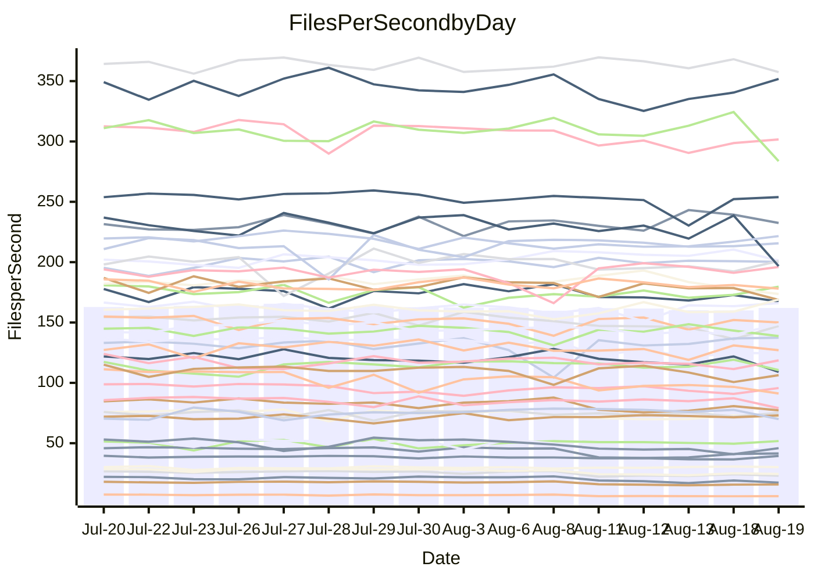

<!---
# This file is auto-generated. Do not edit.
# cspell:disable
--->
# Performance Report

## Daily Performance

## Time to Process Files

| Repository                                      | Elapsed | Min/Avg/Max           |   SD | SD Graph                |
| ----------------------------------------------- | ------: | :-------------------: | ---: | ----------------------- |
| AdaDoom3/AdaDoom3                    |    3.41 | 3.3 /   3.5 /   3.7   | 0.10 | `    ┣━━┻━●╋━━┻━━┫    ` |
| alexiosc/megistos                    |    7.77 | 7.4 /   7.8 /   8.5   | 0.27 | `    ┣━━┻━━●━━┻━━┫    ` |
| apollographql/apollo-server          |    2.63 | 2.5 /   2.6 /   2.8   | 0.09 | `     ┣━┻━━●━━┻━┫     ` |
| aspnetboilerplate/aspnetboilerplate  |   10.60 | 10.1 /  10.7 /  12.2  | 0.42 | `    ┣━━┻━●╋━━┻━━┫    ` |
| aws-amplify/docs                     |   12.96 | 12.7 /  13.3 /  14.2  | 0.41 | `    ┣━━┻●━╋━━┻━━┫    ` |
| Azure/azure-rest-api-specs           |    9.62 | 9.4 /   9.7 /  11.3   | 0.37 | `    ┣━━┻━●╋━━┻━━┫    ` |
| bitjson/typescript-starter           |    1.15 | 0.9 /   1.0 /   1.3   | 0.09 | `     ┣━┻━━╋━━┻━●     ` |
| caddyserver/caddy                    |    4.07 | 3.6 /   3.8 /   4.1   | 0.16 | `    ┣━━┻━━╋━━┻━●┫    ` |
| canada-ca/open-source-logiciel-libre |    1.14 | 0.9 /   1.0 /   1.2   | 0.09 | `     ┣━┻━━╋━━●━┫     ` |
| chef/chef                            |    6.16 | 5.9 /   6.3 /   7.7   | 0.38 | `    ┣━━┻━●╋━━┻━━┫    ` |
| dart-lang/sdk                        |   63.85 | 63.3 /  66.8 /  70.4  | 1.82 | `  ┣━●━┻━━━╋━━━┻━━━┫  ` |
| django/django                        |   16.01 | 14.8 /  15.6 /  16.4  | 0.37 | `    ┣━━┻━━╋━━●━━┫    ` |
| eslint/eslint                        |   12.04 | 10.6 /  11.2 /  11.7  | 0.30 | `    ┣━━┻━━╋━━┻━━┫ ●  ` |
| exonum/exonum                        |    3.55 | 3.4 /   3.6 /   4.0   | 0.16 | `    ┣━━┻━●╋━━┻━━┫    ` |
| flutter/samples                      |   17.57 | 16.4 /  17.1 /  18.7  | 0.53 | `   ┣━━━┻━━╋━━●━━━┫   ` |
| gitbucket/gitbucket                  |    3.74 | 3.5 /   3.6 /   3.9   | 0.14 | `    ┣━━┻━━╋━●┻━━┫    ` |
| googleapis/google-cloud-cpp          |  138.57 | 135.4 / 142.7 / 153.9 | 4.59 | `  ┣━━━●━━━╋━━━┻━━━┫  ` |
| graphql/express-graphql              |    1.13 | 1.0 /   1.0 /   1.2   | 0.08 | `     ┣━┻━━╋━━●━┫     ` |
| graphql/graphql-js                   |    2.92 | 2.6 /   2.8 /   3.2   | 0.14 | `    ┣━━┻━━╋━━●━━┫    ` |
| graphql/graphql-relay-js             |    1.14 | 0.9 /   1.1 /   1.2   | 0.08 | `     ┣━┻━━╋━━●━┫     ` |
| graphql/graphql-spec                 |    1.01 | 0.9 /   0.9 /   1.1   | 0.07 | `     ┣━┻━━╋━━●━┫     ` |
| iluwatar/java-design-patterns        |   13.28 | 12.6 /  13.2 /  14.6  | 0.54 | `    ┣━━┻━━●━━┻━━┫    ` |
| ktaranov/sqlserver-kit               |    6.70 | 6.5 /   6.9 /   7.4   | 0.24 | `    ┣━━┻●━╋━━┻━━┫    ` |
| liriliri/licia                       |    4.08 | 4.0 /   4.2 /   4.6   | 0.14 | `    ┣━━●━━╋━━┻━━┫    ` |
| MartinThoma/LaTeX-examples           |    7.04 | 6.8 /   7.1 /   7.5   | 0.16 | `    ┣━━┻━━●━━┻━━┫    ` |
| mdx-js/mdx                           |    1.97 | 1.8 /   1.9 /   2.2   | 0.09 | `     ┣━┻━━╋●━┻━┫     ` |
| microsoft/TypeScript-Website         |    5.54 | 5.5 /   5.8 /   7.3   | 0.35 | `    ┣━━┻●━╋━━┻━━┫    ` |
| MicrosoftDocs/PowerShell-Docs        |   25.46 | 23.3 /  24.5 /  27.5  | 0.99 | `   ┣━━━┻━━╋━━●━━━┫   ` |
| neovim/nvim-lspconfig                |    4.19 | 4.1 /   4.3 /   4.7   | 0.15 | `    ┣━━●━━╋━━┻━━┫    ` |
| pagekit/pagekit                      |    3.68 | 3.5 /   3.7 /   4.0   | 0.10 | `    ┣━━┻━━╋●━┻━━┫    ` |
| php/php-src                          |   28.86 | 25.6 /  26.8 /  29.7  | 1.02 | `   ┣━━━┻━━╋━━┻━━━●   ` |
| plasticrake/tplink-smarthome-api     |    1.33 | 1.1 /   1.3 /   1.4   | 0.10 | `     ┣━┻━━╋━●┻━┫     ` |
| prettier/prettier                    |    8.06 | 7.0 /   7.4 /   7.7   | 0.17 | `     ┣━┻━━╋━━┻━┫    ●` |
| pycontribs/jira                      |    1.53 | 1.5 /   1.6 /   1.8   | 0.08 | `     ┣━┻●━╋━━┻━┫     ` |
| RustPython/RustPython                |    5.37 | 5.0 /   5.3 /   5.8   | 0.22 | `    ┣━━┻━━╋●━┻━━┫    ` |
| shoelace-style/shoelace              |    2.98 | 2.7 /   2.9 /   3.3   | 0.13 | `    ┣━━┻━━╋●━┻━━┫    ` |
| slint-ui/slint                       |   13.21 | 11.7 /  12.3 /  14.7  | 0.58 | `    ┣━━┻━━╋━━┻━●┫    ` |
| SoftwareBrothers/admin-bro           |    2.64 | 2.4 /   2.5 /   2.7   | 0.08 | `     ┣━┻━━╋━━●━┫     ` |
| sveltejs/svelte                      |   21.82 | 20.8 /  21.3 /  21.9  | 0.33 | `    ┣━━┻━━╋━━┻━●┫    ` |
| TheAlgorithms/Python                 |    5.98 | 5.6 /   6.0 /   6.9   | 0.29 | `    ┣━━┻━━●━━┻━━┫    ` |
| twbs/bootstrap                       |    1.53 | 1.3 /   1.4 /   1.6   | 0.08 | `     ┣━┻━━╋━━●━┫     ` |
| typescript-cheatsheets/react         |    1.35 | 1.3 /   1.4 /   1.5   | 0.05 | `     ┣━┻●━╋━━┻━┫     ` |
| typescript-eslint/typescript-eslint  |    4.24 | 4.0 /   4.2 /   4.5   | 0.13 | `    ┣━━┻━━╋●━┻━━┫    ` |
| vitest-dev/vitest                    |   11.15 | 8.9 /   9.5 /  10.2   | 0.37 | `     ┣━━┻━╋━┻━━┫    ●` |
| w3c/aria-practices                   |    3.75 | 3.2 /   3.4 /   3.6   | 0.10 | `    ┣━━┻━━╋━━┻━━┫  ● ` |
| w3c/specberus                        |    2.17 | 1.8 /   2.0 /   2.6   | 0.17 | `    ┣━━┻━━╋━━●━━┫    ` |
| webdeveric/webpack-assets-manifest   |    1.18 | 1.0 /   1.1 /   1.3   | 0.09 | `     ┣━┻━━╋━●┻━┫     ` |
| webpack/webpack                      |    5.53 | 5.3 /   5.6 /   6.5   | 0.24 | `    ┣━━┻━●╋━━┻━━┫    ` |
| wireapp/wire-desktop                 |    1.04 | 0.9 /   1.0 /   1.3   | 0.11 | `     ┣━┻━━╋●━┻━┫     ` |
| wireapp/wire-webapp                  |   11.01 | 10.8 /  11.3 /  13.3  | 0.52 | `    ┣━━┻●━╋━━┻━━┫    ` |

Note:
- Elapsed time is in seconds.

## Files per Second over Time

| Repository                                      | Files |    Sec |    Fps |     Rel | Trend Fps              |    N |
| ----------------------------------------------- | ----: | -----: | -----: | ------: | ---------------------- | ---: |
| AdaDoom3/AdaDoom3                    |   103 |   3.41 |  30.17 |   1.21% | `▆▆█▇▇▆▇▇▇▆▅▇█▇▅▇█▇█▇` |   25 |
| alexiosc/megistos                    |   583 |   7.77 |  75.02 |   0.17% | `▅█▄▆█▇█▇▇▆▆▅█▆▇▄▆▇▅▇` |   25 |
| apollographql/apollo-server          |   252 |   2.63 |  95.71 |   0.20% | `██▅▅▆▄▇▆▆▇█▇▆▇▇██▄▅▇` |   25 |
| aspnetboilerplate/aspnetboilerplate  |  2286 |  10.60 | 215.65 |   0.93% | `▆▃█▆▆▅█▇▆▇▇█▆▇▆█▇▅▆▇` |   25 |
| aws-amplify/docs                     |  2871 |  12.96 | 221.59 |   2.30% | `██▇▄▇▇█▇▄▆▇▅▆▇▆▄▇▅▇▇` |   25 |
| Azure/azure-rest-api-specs           |  2443 |   9.62 | 253.91 |   0.83% | `███▇█▇▇▇▇█▇█▇▇▇█▆▃▇▇` |   25 |
| bitjson/typescript-starter           |    20 |   1.15 |  17.37 | -14.96% | `▇▇▆▇█▇▇▇▇█▅▄▅▅▃▄▄▂▅▃` |   25 |
| caddyserver/caddy                    |   285 |   4.07 |  70.01 |  -7.63% | `▄▆▇▅▇▇██▆██▇██▇▇▆▇▇▄` |   25 |
| canada-ca/open-source-logiciel-libre |     7 |   1.14 |   6.13 |  -9.87% | `█▅█▆▆▆▆▇▆█▄▃▂▄▄▄▃▃▃▃` |   25 |
| chef/chef                            |  1207 |   6.16 | 195.99 |   2.33% | `▇▆▇▇▆▇▂▇▇▃▇▆▇▇█▇▇▇▆▇` |   25 |
| dart-lang/sdk                        | 10790 |  63.85 | 169.00 |   5.13% | `▆▆▇▆▅▆▆▄▆▄▆▄▅█▇▇▆▅▆█` |   25 |
| django/django                        |  2852 |  16.01 | 178.10 |  -2.31% | `▅▅▅▆▆▇▆▇▅▅▆▆█▆▆▆▆▄▆▅` |   25 |
| eslint/eslint                        |  2090 |  12.04 | 173.64 |  -6.32% | `▅▆▅▆▅▆▅▆▄▅▇▆▆▆██▆▅▄▃` |   25 |
| exonum/exonum                        |   421 |   3.55 | 118.65 |   1.21% | `▅▆█▄█▆▇▆█▇▇▄▆▅▆▇▅▆▅▇` |   25 |
| flutter/samples                      |  2438 |  17.57 | 138.75 |  -3.42% | `▇▆▇▇█▇▅▇█▄▇█▆▆▇▆██▇▆` |   25 |
| gitbucket/gitbucket                  |   413 |   3.74 | 110.55 |  -3.24% | `▇█▇▅▇████▇█▇▆▅▅█▇▆█▅` |   25 |
| googleapis/google-cloud-cpp          | 20603 | 138.57 | 148.68 |   2.93% | `█▇█▅▇▆▇▆▇▇▇▅█▆▆▄▅▆▅▇` |   25 |
| graphql/express-graphql              |    26 |   1.13 |  23.01 |  -8.47% | `██▇▇█▆▇███▃▃▄▄▃▅▄▃▅▄` |   25 |
| graphql/graphql-js                   |   364 |   2.92 | 124.50 |  -5.07% | `███▇██▅▇▇▇▄▆▄▅▆▆▆▃▅▅` |   25 |
| graphql/graphql-relay-js             |    28 |   1.14 |  24.53 |  -7.80% | `██████▆▇▇▇▄▄▃▃▄▄▃▃▅▄` |   25 |
| graphql/graphql-spec                 |    16 |   1.01 |  15.80 |  -7.39% | `█▇██▇▇▆▇▇█▅▅▅▃▅▅▃▄▄▄` |   25 |
| iluwatar/java-design-patterns        |  1992 |  13.28 | 150.05 |  -0.44% | `▇▇▆▇▇▇▇▇▄▄█▆▇▇█▇▅▅▇▆` |   25 |
| ktaranov/sqlserver-kit               |   489 |   6.70 |  73.00 |   2.31% | `█▆▄▅▇█▆▆▄▆▆▇▆██▆▆█▆▇` |   25 |
| liriliri/licia                       |  1437 |   4.08 | 351.81 |   3.07% | `▇█▇█▅▆▆▇▇█▆▆▅▆▄▄▅▆▆▇` |   25 |
| MartinThoma/LaTeX-examples           |  1409 |   7.04 | 200.27 |   0.26% | `▇█▅▇▇▇▇▇▇▆██▇█▇▅▇▇▇▇` |   25 |
| mdx-js/mdx                           |   141 |   1.97 |  71.66 |  -2.79% | `█▄█▆▇▇███▆▅▆▅▆▃▆▄▆▆▆` |   25 |
| microsoft/TypeScript-Website         |   761 |   5.54 | 137.39 |   4.87% | `▇█▆▇▇█▇▆▆▂████▆█▆███` |   25 |
| MicrosoftDocs/PowerShell-Docs        |  2708 |  25.46 | 106.34 |  -3.95% | `▇▆▆▆█▇▆▆▇▃▇▇▇▇▇█▆▆▄▅` |   25 |
| neovim/nvim-lspconfig                |   752 |   4.19 | 179.66 |   3.18% | `█▅▇██▄▇▄▇▇▅▇▆█▆▇▆▆▆█` |   25 |
| pagekit/pagekit                      |   741 |   3.68 | 201.32 |  -0.90% | `▇▇▆▆▅▆▇▅▇███▇▇▇▇▆██▆` |   25 |
| php/php-src                          |  2281 |  28.86 |  79.04 |  -7.58% | `▇▆▄▇█▅▃▇█▇▇▆▅▇▆█▆▇▇▄` |   25 |
| plasticrake/tplink-smarthome-api     |    62 |   1.33 |  46.65 |  -5.20% | `▇▇▆██▄██▇▆▄▄▃▃▄▄▄▄▃▄` |   25 |
| prettier/prettier                    |  2286 |   8.06 | 283.72 |  -8.41% | `▅▅▇▆▆▆▅▇▇▇▆▆▄▅▆▆▆██▃` |   25 |
| pycontribs/jira                      |    79 |   1.53 |  51.78 |   3.44% | `█▄█▄▄▅▅█▆▇▆▇▇▇▆▇▅█▆▇` |   25 |
| RustPython/RustPython                |   683 |   5.37 | 127.08 |  -1.49% | `▆▇▇██▆█▆█▆▄▇▆▆▆▆▄▃▇▆` |   25 |
| shoelace-style/shoelace              |   439 |   2.98 | 147.15 |  -2.27% | `▇▆██▃██▆▆▆▆▅▆▆▅▅▅▅▃▆` |   25 |
| slint-ui/slint                       |  2230 |  13.21 | 168.76 |  -6.63% | `██▇█▆███▇▇▇▃█▇▇█▆▇▇▅` |   25 |
| SoftwareBrothers/admin-bro           |   441 |   2.64 | 167.36 |  -3.71% | `▇▄▇▇▆█▆▇██▆▅▆▆▅▆▅▆▆▅` |   25 |
| sveltejs/svelte                      |  7799 |  21.82 | 357.42 |  -1.94% | `█▇▆▇█▆▆▇▆▆▇█▇█▆█▆▇▇▆` |   25 |
| TheAlgorithms/Python                 |  1390 |   5.98 | 232.47 |   0.26% | `▇▆▅█▆▅▆▆▇▇▇█▃▇▆▃█▇▇▆` |   25 |
| twbs/bootstrap                       |   118 |   1.53 |  77.25 |  -5.44% | `▇▆▇▆▄▇█▅██▄▅▅▅▃▃▄▄▆▄` |   25 |
| typescript-cheatsheets/react         |    53 |   1.35 |  39.40 |   3.34% | `▇██▄█▇▅█▇▇▆▇▅▇▇▅▅▆▅█` |   25 |
| typescript-eslint/typescript-eslint  |  1279 |   4.24 | 301.69 |  -1.31% | `█▅█████▇▇▇▅▆▇▇▆▆▄▆▆▇` |   25 |
| vitest-dev/vitest                    |  2193 |  11.15 | 196.71 | -14.38% | `█▇▆███▅▆▇▇▅▆▆▅▇▇▆▄█▂` |   25 |
| w3c/aria-practices                   |   409 |   3.75 | 109.07 |  -9.23% | `█▆▅▄▇▅▆▆▆█▆▅▆▅▄▅▄▄▆▃` |   25 |
| w3c/specberus                        |   198 |   2.17 |  91.17 | -10.42% | `█▆██▂▇██▇▇▆▅▅▆▆▆▆▆▆▅` |   25 |
| webdeveric/webpack-assets-manifest   |    54 |   1.18 |  45.90 |  -5.93% | `▃▅█▇▇▇▇▆▆▆▄▄▄▄▄▄▄▄▂▄` |   25 |
| webpack/webpack                      |  1111 |   5.53 | 200.97 |   1.48% | `▃▅█▅██▇▆▇▇▆▅▆▆▆▆▇▆▆▇` |   25 |
| wireapp/wire-desktop                 |    43 |   1.04 |  41.51 |  -3.36% | `▇▇█▄██▇█▇▇▃▄▆▅▅▂▅▄▅▆` |   25 |
| wireapp/wire-webapp                  |  1828 |  11.01 | 166.06 |   2.93% | `█▇▆▇▇▇█▇▆▆█▆▇▇▅▃▇█▇█` |   25 |

## Data Throughput

| Repository                                      | Files |    Sec |     Kps |     Rel | Trend Kps              |    N |
| ----------------------------------------------- | ----: | -----: | ------: | ------: | ---------------------- | ---: |
| AdaDoom3/AdaDoom3                    |   103 |   3.41 |  641.21 |   1.21% | `▆▆█▇▇▆▇▇▇▆▅▇█▇▅▇█▇█▇` |   25 |
| alexiosc/megistos                    |   583 |   7.77 |  589.48 |   0.17% | `▅█▄▆█▇█▇▇▆▆▅█▆▇▄▆▇▅▇` |   25 |
| apollographql/apollo-server          |   252 |   2.63 |  769.87 |   0.20% | `██▅▅▆▄▇▆▆▇█▇▆▇▇██▄▅▇` |   25 |
| aspnetboilerplate/aspnetboilerplate  |  2286 |  10.60 |  524.61 |   1.98% | `▆▃█▆▆▆█▇▇▇██▆▇▆██▆▇▇` |   25 |
| aws-amplify/docs                     |  2871 |  12.96 |  773.74 |   2.39% | `██▇▄▇▇█▇▄▆▇▅▆▇▆▄▇▅▇▇` |   25 |
| Azure/azure-rest-api-specs           |  2443 |   9.62 |  675.48 |   0.42% | `███▇█▇▇▇▇▇▇█▇▇▇█▆▃▇▇` |   25 |
| bitjson/typescript-starter           |    20 |   1.15 |   69.47 | -14.96% | `▇▇▆▇█▇▇▇▇█▅▄▅▅▃▄▄▂▅▃` |   25 |
| caddyserver/caddy                    |   285 |   4.07 |  596.94 |  -7.43% | `▄▆▇▅▇▇██▆██▇██▇▇▇▇▇▄` |   25 |
| canada-ca/open-source-logiciel-libre |     7 |   1.14 |   50.77 |  -9.87% | `█▅█▆▆▆▆▇▆█▄▃▂▄▄▄▃▃▃▃` |   25 |
| chef/chef                            |  1207 |   6.16 |  905.07 |   2.40% | `▇▆▇▇▆▇▂▇▇▃▇▆▇▇█▇▇▇▆▇` |   25 |
| dart-lang/sdk                        | 10790 |  63.85 | 1139.81 |   4.58% | `▆▆▇▇▅▆▆▄▇▄▆▄▅█▇▇▆▅▅█` |   25 |
| django/django                        |  2852 |  16.01 | 1116.84 |  -1.95% | `▅▅▅▆▆▇▆▇▅▅▆▆█▆▆▆▆▄▆▅` |   25 |
| eslint/eslint                        |  2090 |  12.04 | 1261.58 |  -6.19% | `▅▆▅▆▅▆▅▆▄▅▇▆▆▆██▆▅▄▃` |   25 |
| exonum/exonum                        |   421 |   3.55 | 1134.94 |   1.21% | `▅▆█▄█▆▇▆█▇▇▄▆▅▆▇▅▆▅▇` |   25 |
| flutter/samples                      |  2438 |  17.57 | 1226.71 |  -2.86% | `▇▆▇▇█▇▅▇█▄▇█▆▆▇▆██▇▆` |   25 |
| gitbucket/gitbucket                  |   413 |   3.74 |  502.44 |  -3.05% | `▇▇▇▅▇████▇█▇▆▅▅█▇▆█▅` |   25 |
| googleapis/google-cloud-cpp          | 20603 | 138.57 | 1199.99 |   3.29% | `█▇█▅▇▆▇▆▇▇▇▅█▆▆▄▅▇▅█` |   25 |
| graphql/express-graphql              |    26 |   1.13 |  105.32 |  -8.47% | `██▇▇█▆▇███▃▃▄▄▃▅▄▃▅▄` |   25 |
| graphql/graphql-js                   |   364 |   2.92 |  715.56 |  -5.07% | `███▇██▅▇▇▇▄▆▄▅▆▆▆▃▅▅` |   25 |
| graphql/graphql-relay-js             |    28 |   1.14 |   96.37 |  -7.80% | `██████▆▇▇▇▄▄▃▃▄▄▃▃▅▄` |   25 |
| graphql/graphql-spec                 |    16 |   1.01 |  572.62 |  -7.39% | `█▇██▇▇▆▇▇█▅▅▅▃▅▅▃▄▄▄` |   25 |
| iluwatar/java-design-patterns        |  1992 |  13.28 |  463.77 |  -0.44% | `▇▇▆▇▇▇▇▇▄▄█▆▇▇█▇▅▅▇▆` |   25 |
| ktaranov/sqlserver-kit               |   489 |   6.70 | 1104.95 |   2.31% | `█▆▄▅▇█▆▆▄▆▆▇▆██▆▆█▆▇` |   25 |
| liriliri/licia                       |  1437 |   4.08 |  419.14 |   3.07% | `▇█▇█▅▆▆▇▇█▆▆▅▆▄▄▅▆▆▇` |   25 |
| MartinThoma/LaTeX-examples           |  1409 |   7.04 |  413.62 |   0.26% | `▇█▅▇▇▇▇▇▇▆██▇█▇▅▇▇▇▇` |   25 |
| mdx-js/mdx                           |   141 |   1.97 |  333.38 |  -2.68% | `█▄█▆▇▇███▆▅▆▅▆▃▆▄▆▆▆` |   25 |
| microsoft/TypeScript-Website         |   761 |   5.54 |  950.15 |   4.96% | `▇█▆▇▇█▇▆▆▂████▆█▆███` |   25 |
| MicrosoftDocs/PowerShell-Docs        |  2708 |  25.46 | 1093.10 |  -3.93% | `▇▆▆▆█▇▆▆▇▃▇▇▇▇▇█▆▆▄▅` |   25 |
| neovim/nvim-lspconfig                |   752 |   4.19 |  292.43 |   4.26% | `█▅▇██▄▇▄▇▇▅▇▆█▆▇▆▆▇█` |   25 |
| pagekit/pagekit                      |   741 |   3.68 |  419.75 |  -0.90% | `▇▇▆▆▅▆▇▅▇███▇▇▇▇▆██▆` |   25 |
| php/php-src                          |  2281 |  28.86 | 1376.01 |  -7.35% | `▇▆▄▇█▅▃▇█▇▇▇▆▇▆█▆▇▇▄` |   25 |
| plasticrake/tplink-smarthome-api     |    62 |   1.33 |  252.06 |  -5.20% | `▇▇▆██▄██▇▆▄▄▃▃▄▄▄▄▃▄` |   25 |
| prettier/prettier                    |  2286 |   8.06 |  402.50 |  -8.51% | `▅▅▇▆▆▆▅▇▇█▆▆▄▅▆▆▆██▃` |   25 |
| pycontribs/jira                      |    79 |   1.53 |  367.01 |   3.27% | `█▄█▄▄▅▅█▆▇▆▇▇▇▆▇▅█▆▇` |   25 |
| RustPython/RustPython                |   683 |   5.37 |  996.91 |  -1.44% | `▆▇▇██▆█▆█▆▄▇▆▆▆▆▄▃▇▆` |   25 |
| shoelace-style/shoelace              |   439 |   2.98 |  710.93 |  -2.27% | `▇▆██▃██▆▆▆▆▅▆▆▅▅▅▅▃▆` |   25 |
| slint-ui/slint                       |  2230 |  13.21 | 1098.82 |  -6.52% | `██▇█▆███▇█▇▃█▇▇█▇▇▇▅` |   25 |
| SoftwareBrothers/admin-bro           |   441 |   2.64 |  368.87 |  -3.71% | `▇▄▇▇▆█▆▇██▆▅▆▆▅▆▅▆▆▅` |   25 |
| sveltejs/svelte                      |  7799 |  21.82 |  239.28 |  -1.91% | `█▇▆▇█▆▆▇▆▆▇█▇█▆█▆▇▇▆` |   25 |
| TheAlgorithms/Python                 |  1390 |   5.98 |  590.03 |   0.26% | `▇▆▅█▆▅▆▆▇▇▇█▃▇▆▃█▇▇▆` |   25 |
| twbs/bootstrap                       |   118 |   1.53 |  634.33 |  -5.44% | `▇▆▇▆▄▇█▅██▄▅▅▅▃▃▄▄▆▄` |   25 |
| typescript-cheatsheets/react         |    53 |   1.35 |  287.68 |   3.34% | `▇██▄█▇▅█▇▇▆▇▅▇▇▅▅▆▅█` |   25 |
| typescript-eslint/typescript-eslint  |  1279 |   4.24 | 1536.50 |  -1.48% | `█▅█████▇▇▇▅▆▇▇▆▆▄▆▆▆` |   25 |
| vitest-dev/vitest                    |  2193 |  11.15 |  441.96 | -13.21% | `▇▆▆▇▇█▅▇█▇▆▇▇▆██▆▅█▂` |   25 |
| w3c/aria-practices                   |   409 |   3.75 | 1014.93 |  -9.21% | `█▆▅▄▇▅▆▆▆█▆▅▆▅▄▅▄▄▆▃` |   25 |
| w3c/specberus                        |   198 |   2.17 |  286.40 |  -9.65% | `█▆██▂▇██▇▇▆▅▅▆▆▆▆▆▆▅` |   25 |
| webdeveric/webpack-assets-manifest   |    54 |   1.18 |  107.95 |  -5.56% | `▃▅█▇▇▇█▆▇▆▄▅▄▄▄▄▄▄▂▅` |   25 |
| webpack/webpack                      |  1111 |   5.53 |  911.71 |   1.76% | `▃▅█▅██▇▆▇▇▆▅▆▆▆▆▇▆▆▇` |   25 |
| wireapp/wire-desktop                 |    43 |   1.04 |  183.41 |  -3.36% | `▇▇█▄██▇█▇▇▃▄▆▅▅▂▅▄▅▆` |   25 |
| wireapp/wire-webapp                  |  1828 |  11.01 |  593.58 |   3.19% | `█▇▆▇▇██▇▆▆█▆▇▇▅▃▇█▇█` |   25 |

