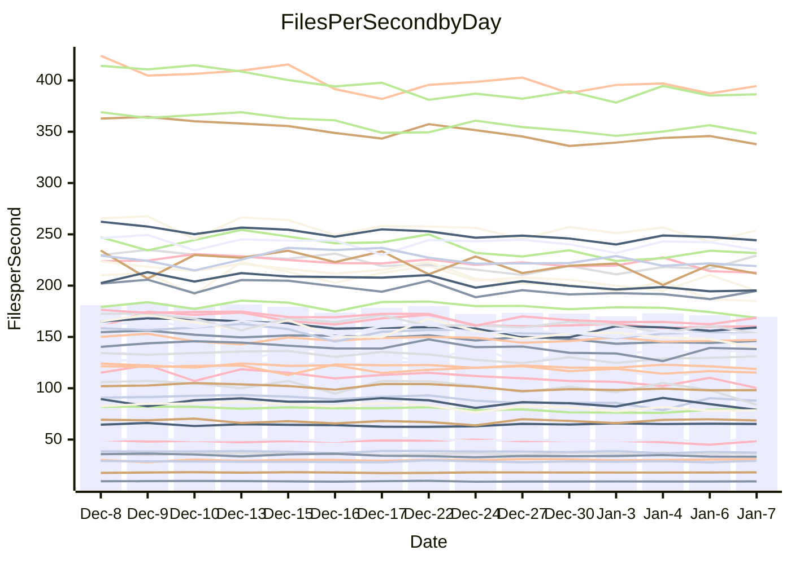

<!---
# This file is auto-generated. Do not edit.
# cspell:disable
--->
# Performance Report

## Daily Performance

## Time to Process Files

| Repository                                      | Elapsed | Min/Avg/Max           |   SD | SD Graph                |
| ----------------------------------------------- | ------: | :-------------------: | ---: | ----------------------- |
| AdaDoom3/AdaDoom3                    |    3.09 | 2.8 /   3.0 /   3.2   | 0.10 | `    ┣━━┻━━╋━━●━━┫    ` |
| alexiosc/megistos                    |    7.41 | 6.7 /   7.2 /   8.1   | 0.33 | `    ┣━━┻━━╋━●┻━━┫    ` |
| apollographql/apollo-server          |    2.78 | 2.0 /   2.3 /   2.4   | 0.09 | `      ┣━┻━╋━┻━┫     ●` |
| aspnetboilerplate/aspnetboilerplate  |    9.80 | 8.8 /   9.5 /  10.4   | 0.39 | `    ┣━━┻━━╋━━●━━┫    ` |
| aws-amplify/docs                     |   12.37 | 11.5 /  11.9 /  12.5  | 0.32 | `    ┣━━┻━━╋━━┻━●┫    ` |
| Azure/azure-rest-api-specs           |   17.90 | 13.8 /  15.5 /  17.0  | 0.84 | `   ┣━━━┻━━╋━━┻━━━┫  ●` |
| bitjson/typescript-starter           |    0.65 | 0.6 /   0.7 /   0.7   | 0.02 | `     ┣━━●━╋━┻━━┫     ` |
| caddyserver/caddy                    |    3.68 | 3.0 /   3.3 /   3.7   | 0.16 | `    ┣━━┻━━╋━━┻━━┫●   ` |
| canada-ca/open-source-logiciel-libre |    0.76 | 0.7 /   0.8 /   0.8   | 0.02 | `     ┣━━┻━●━┻━━┫     ` |
| chef/chef                            |    6.13 | 5.0 /   5.4 /   6.0   | 0.26 | `    ┣━━┻━━╋━━┻━━┫ ●  ` |
| dart-lang/sdk                        |   60.62 | 55.8 /  59.5 /  65.0  | 1.98 | `  ┣━━━┻━━━╋━●━┻━━━┫  ` |
| django/django                        |   14.74 | 13.5 /  14.4 /  15.5  | 0.57 | `    ┣━━┻━━╋━●┻━━┫    ` |
| eslint/eslint                        |   10.20 | 9.5 /  10.1 /  10.9   | 0.40 | `    ┣━━┻━━╋●━┻━━┫    ` |
| exonum/exonum                        |    3.05 | 2.9 /   3.2 /   3.7   | 0.18 | `    ┣━━┻●━╋━━┻━━┫    ` |
| flutter/samples                      |   16.71 | 15.9 /  17.0 /  22.0  | 1.08 | `   ┣━━━┻━●╋━━┻━━━┫   ` |
| gitbucket/gitbucket                  |    3.16 | 2.9 /   3.1 /   3.4   | 0.11 | `    ┣━━┻━━●━━┻━━┫    ` |
| googleapis/google-cloud-cpp          |  124.59 | 117.0 / 126.8 / 139.4 | 5.36 | `  ┣━━━┻━●━╋━━━┻━━━┫  ` |
| graphql/express-graphql              |    0.71 | 0.7 /   0.7 /   0.8   | 0.02 | `     ┣━━┻●╋━┻━━┫     ` |
| graphql/graphql-js                   |    2.21 | 2.1 /   2.2 /   2.4   | 0.08 | `     ┣━┻━━●━━┻━┫     ` |
| graphql/graphql-relay-js             |    0.72 | 0.7 /   0.7 /   0.8   | 0.02 | `     ┣━━●━╋━┻━━┫     ` |
| graphql/graphql-spec                 |    0.82 | 0.8 /   0.8 /   0.9   | 0.02 | `     ┣━━●━╋━┻━━┫     ` |
| iluwatar/java-design-patterns        |   11.46 | 10.6 /  11.3 /  13.6  | 0.55 | `    ┣━━┻━━╋●━┻━━┫    ` |
| ktaranov/sqlserver-kit               |    6.29 | 5.9 /   6.2 /   6.6   | 0.20 | `    ┣━━┻━━╋━●┻━━┫    ` |
| liriliri/licia                       |    3.65 | 3.2 /   3.6 /   3.8   | 0.13 | `    ┣━━┻━━╋●━┻━━┫    ` |
| MartinThoma/LaTeX-examples           |    6.50 | 6.1 /   6.4 /   6.8   | 0.16 | `    ┣━━┻━━╋━━●━━┫    ` |
| mdx-js/mdx                           |    1.64 | 1.5 /   1.6 /   1.8   | 0.08 | `     ┣━┻━━╋●━┻━┫     ` |
| microsoft/TypeScript-Website         |    5.13 | 4.9 /   5.1 /   5.4   | 0.12 | `    ┣━━┻━━●━━┻━━┫    ` |
| MicrosoftDocs/PowerShell-Docs        |   19.44 | 17.6 /  18.9 /  25.8  | 1.40 | `   ┣━━━┻━━╋●━┻━━━┫   ` |
| neovim/nvim-lspconfig                |    3.11 | 2.8 /   3.1 /   3.4   | 0.13 | `    ┣━━┻━━╋●━┻━━┫    ` |
| pagekit/pagekit                      |    3.16 | 3.0 /   3.4 /   3.8   | 0.17 | `    ┣━━●━━╋━━┻━━┫    ` |
| php/php-src                          |   28.42 | 20.3 /  21.9 /  25.7  | 1.38 | `      ┣━┻━╋━┻━┫     ●` |
| plasticrake/tplink-smarthome-api     |    0.90 | 0.9 /   0.9 /   1.0   | 0.03 | `     ┣━┻━●╋━━┻━┫     ` |
| prettier/prettier                    |    6.45 | 6.0 /   6.3 /   7.2   | 0.24 | `    ┣━━┻━━╋━●┻━━┫    ` |
| pycontribs/jira                      |    1.25 | 1.2 /   1.2 /   1.3   | 0.03 | `     ┣━┻━━╋●━┻━┫     ` |
| RustPython/RustPython                |    4.17 | 3.9 /   4.2 /   4.6   | 0.16 | `    ┣━━┻━━●━━┻━━┫    ` |
| shoelace-style/shoelace              |    2.67 | 2.3 /   2.4 /   2.6   | 0.06 | `     ┣━┻━━╋━━┻━┫   ● ` |
| slint-ui/slint                       |   10.61 | 8.4 /   9.5 /  11.8   | 0.74 | `    ┣━━┻━━╋━━┻━●┫    ` |
| SoftwareBrothers/admin-bro           |    2.31 | 2.0 /   2.1 /   2.3   | 0.09 | `     ┣━┻━━╋━━┻━●     ` |
| sveltejs/svelte                      |   18.92 | 17.0 /  18.1 /  18.9  | 0.55 | `   ┣━━━┻━━╋━━┻━●━┫   ` |
| TheAlgorithms/Python                 |    5.40 | 5.0 /   5.3 /   5.8   | 0.21 | `    ┣━━┻━━╋●━┻━━┫    ` |
| twbs/bootstrap                       |    1.22 | 1.1 /   1.2 /   1.4   | 0.05 | `     ┣━┻━━╋●━┻━┫     ` |
| typescript-cheatsheets/react         |    1.10 | 1.0 /   1.1 /   1.3   | 0.04 | `     ┣━┻━━●━━┻━┫     ` |
| typescript-eslint/typescript-eslint  |    3.60 | 3.4 /   3.6 /   3.8   | 0.09 | `    ┣━━┻━━╋●━┻━━┫    ` |
| vitest-dev/vitest                    |    8.18 | 7.1 /   7.7 /   8.2   | 0.29 | `    ┣━━┻━━╋━━┻━●┫    ` |
| w3c/aria-practices                   |    2.96 | 2.7 /   2.9 /   3.2   | 0.14 | `    ┣━━┻━━╋●━┻━━┫    ` |
| w3c/specberus                        |    1.69 | 1.6 /   1.7 /   1.7   | 0.03 | `     ┣━┻━━╋━━●━┫     ` |
| webdeveric/webpack-assets-manifest   |    0.65 | 0.6 /   0.7 /   0.7   | 0.01 | `     ┣━━●━╋━┻━━┫     ` |
| webpack/webpack                      |    4.84 | 4.5 /   4.8 /   5.3   | 0.21 | `    ┣━━┻━━●━━┻━━┫    ` |
| wireapp/wire-desktop                 |    0.85 | 0.8 /   0.9 /   0.9   | 0.03 | `     ┣━━●━╋━┻━━┫     ` |
| wireapp/wire-webapp                  |    8.65 | 7.4 /   8.1 /   8.8   | 0.35 | `    ┣━━┻━━╋━━┻━●┫    ` |

Note:
- Elapsed time is in seconds.

## Files per Second over Time

| Repository                                      | Files |    Sec |    Fps |     Rel | Trend Fps              |    N |
| ----------------------------------------------- | ----: | -----: | -----: | ------: | ---------------------- | ---: |
| AdaDoom3/AdaDoom3                    |   103 |   3.09 |  33.32 |  -3.43% | `▇█▆▅▄▄▆▅▆▆▅▄▆▅▅▆▄▆▅▅` |   29 |
| alexiosc/megistos                    |   583 |   7.41 |  78.71 |  -3.60% | `▇▇█▇▅▅▇▇▇▇▇▆▃▅█▇▅▆▅▆` |   29 |
| apollographql/apollo-server          |   250 |   2.78 |  90.08 | -18.93% | `▆▇█▇▇▇▆▅▆▅▅▅▄▇▄▇▅▇▇ ` |   31 |
| aspnetboilerplate/aspnetboilerplate  |  2246 |   9.80 | 229.30 |  -3.63% | `█▆▇█▇▅▅▅▆▆▆▆▆▃▄▅▅▇▆▅` |   29 |
| aws-amplify/docs                     |  2863 |  12.37 | 231.48 |  -4.20% | `▆█▅▇▇█▇██▇▅▇▅▆▅▇▇▇▆▅` |   30 |
| Azure/azure-rest-api-specs           |  2413 |  17.90 | 134.82 | -13.69% | `▅▅█▆▆▄▅▅▆▅▆▄▆▆▅▄▄▄▄▂` |   31 |
| bitjson/typescript-starter           |    20 |   0.65 |  30.99 |   2.64% | `▆▇▆▇▇▆██▇███▆▇▅▇█▆▇█` |   29 |
| caddyserver/caddy                    |   279 |   3.68 |  75.82 | -11.81% | `▅█▇▅▄▆▇▇▇▇▄▆▄▅█▆▅▇▅▃` |   31 |
| canada-ca/open-source-logiciel-libre |     7 |   0.76 |   9.24 |   0.32% | `▄▅▇█▄▅▅▅▅▅▆▆▆▅▆▅▅▆▆▆` |   29 |
| chef/chef                            |  1204 |   6.13 | 196.43 | -12.16% | `▆▇█▅▇█▆▄▇▇▇▄▆▆█▃▅█▇▃` |   29 |
| dart-lang/sdk                        | 10056 |  60.62 | 165.90 |  -1.58% | `▇██▆▅▇█▆█▇▆▆▇▆▆▇▆▄█▇` |   31 |
| django/django                        |  2817 |  14.74 | 191.14 |  -2.69% | `▇▆█▄▆▆▇▅▆▄▇▆▅▇▆▄▆▄▇▆` |   31 |
| eslint/eslint                        |  2038 |  10.20 | 199.88 |  -1.36% | `▇██▇▅▇▇▇▆▇▄▇▅▅▆▄▅▆▅▆` |   31 |
| exonum/exonum                        |   421 |   3.05 | 137.90 |   2.98% | `█▆▆▅▇█▄▅▇█▇▆▇▆▆▇▇▆▇▇` |   29 |
| flutter/samples                      |  2690 |  16.71 | 160.98 |   1.42% | `█▇█▇▇▆▆█▇█▂▇███▆▇█▇█` |   31 |
| gitbucket/gitbucket                  |   412 |   3.16 | 130.55 |  -0.32% | `▅█▇▅▆▅▅▇▇▅▇▄▇▄▆▆▇▇▇▇` |   31 |
| googleapis/google-cloud-cpp          | 19742 | 124.59 | 158.46 |   1.57% | `▅██▆▆▇▆▇▆▇▆▇▆▄▇▇▆▄▅▇` |   31 |
| graphql/express-graphql              |    26 |   0.71 |  36.66 |   0.97% | `▇█▆▆▇█▇▄███▆▆▇██▇▇▇▇` |   29 |
| graphql/graphql-js                   |   339 |   2.21 | 153.14 |  -0.72% | `▅▄▇▇▇█▇▆▇▇▆▆▆▄▇▇▇▇▆▇` |   30 |
| graphql/graphql-relay-js             |    28 |   0.72 |  38.87 |   2.13% | `▅▆██▇██▆▇▇▅█▇██▅▆█▄█` |   29 |
| graphql/graphql-spec                 |    15 |   0.82 |  18.21 |   1.87% | `▇▇▆▆█▇▇██▇▇█▆▇█▇▆█▇█` |   29 |
| iluwatar/java-design-patterns        |  1849 |  11.46 | 161.34 |  -1.19% | `▇██▇▆▆▇▇▇▆▆▇▇▆▆▇▅▇▆▇` |   31 |
| ktaranov/sqlserver-kit               |   489 |   6.29 |  77.76 |  -2.18% | `▇█▇▇▇▅▆▇▆▆▄▄▆▄▄▅▆▆▇▆` |   30 |
| liriliri/licia                       |  1434 |   3.65 | 393.04 |  -1.82% | `▆▆▇▇███▇█▆▅▇█▇▇▅▆▇▇▇` |   30 |
| MartinThoma/LaTeX-examples           |  1409 |   6.50 | 216.69 |  -2.28% | `▇▇▇█▇▆▇▇▇▇▅▇▆▇▇█▆▅▄▆` |   29 |
| mdx-js/mdx                           |   142 |   1.64 |  86.42 |  -2.78% | `▇██▆▇▇▅█▇▆▃▇▅▅▃▇▇▇▇▆` |   30 |
| microsoft/TypeScript-Website         |   757 |   5.13 | 147.59 |  -0.10% | `▆▇▇█▆▅▆▇█▅▅█▆▇▆▇▆▄▆▆` |   30 |
| MicrosoftDocs/PowerShell-Docs        |  2232 |  19.44 | 114.84 |  -3.31% | `▇▇▇▇▇▇▇█▆▅▆▇▇▇▆▆▇▇▆▆` |   31 |
| neovim/nvim-lspconfig                |   373 |   3.11 | 119.83 |  -1.39% | `▇██▆▇▅▇▆▇▇▇▆█▄▄▆▆▄▇▆` |   31 |
| pagekit/pagekit                      |   741 |   3.16 | 234.75 |   5.94% | `█▇▆▆▆▅▆▃█▅▆▅▃▇▅▆▆▆▇█` |   29 |
| php/php-src                          |  2212 |  28.42 |  77.83 | -23.08% | `▅██▇▇▇▄▇▆▇▇▃▆▇█▆▅▆▄▁` |   31 |
| plasticrake/tplink-smarthome-api     |    62 |   0.90 |  69.04 |   1.84% | `▅▆▇▇▇▃▇█▆▇▇█▆▆▇▇█▇▇▇` |   29 |
| prettier/prettier                    |  2203 |   6.45 | 341.79 |  -2.00% | `█▇██▇▇▇▇▇▇▃▇▅▇▇▇▇▇▆▇` |   31 |
| pycontribs/jira                      |    80 |   1.25 |  63.79 |  -1.28% | `▆▆▅▅▅▇▇▇▅▇▇▇█▇█▇█▆█▆` |   29 |
| RustPython/RustPython                |   621 |   4.17 | 148.79 |  -0.13% | `█▇█▆▇▇█▇▇▇▇▄▆█▆▇▇▄▆▇` |   31 |
| shoelace-style/shoelace              |   438 |   2.67 | 163.75 |  -8.55% | `▆██▇▇█▇▆█▆▆▆█▇▇▇▇▄▆▄` |   31 |
| slint-ui/slint                       |  1964 |  10.61 | 185.18 | -10.55% | `▇▇█▇▆▇▅▇▅▅▇▇▅▄▆▅▆▂▄▄` |   31 |
| SoftwareBrothers/admin-bro           |   441 |   2.31 | 191.32 |  -7.70% | `▅▇▇█▇▅▆▇▇▇▅▅▆▃▆▄▇▆▅▄` |   29 |
| sveltejs/svelte                      |  7130 |  18.92 | 376.94 |  -4.36% | `██▆▇▇▆▆██▆▆▅▅▆█▆▇▇█▅` |   31 |
| TheAlgorithms/Python                 |  1367 |   5.40 | 253.25 |  -0.88% | `▄▇▇▆▆▄▆█▆▅▆▆▄▇▇▅▅▄▆▆` |   31 |
| twbs/bootstrap                       |   120 |   1.22 |  98.74 |  -1.58% | `▆▇▇█▅▅▅▅▅▆█▇▄▅▆▄▆▆▅▆` |   31 |
| typescript-cheatsheets/react         |    53 |   1.10 |  48.27 |  -0.40% | `▇▇█▇██▇▇█▇▇▇▇█▇▇▃█▇▇` |   29 |
| typescript-eslint/typescript-eslint  |  1275 |   3.60 | 354.54 |  -0.75% | `█▆▆█▇▇▇▇▆▇▆▄▇▆▇▇█▇▆▇` |   31 |
| vitest-dev/vitest                    |  1942 |   8.18 | 237.35 |  -5.15% | `▅██▇▆▇▇▇▆▅▇▇▅▅▇▇▆█▇▅` |   31 |
| w3c/aria-practices                   |   405 |   2.96 | 136.73 |  -1.63% | `▅▇▆█▇▆▇▆▄▃▇▇▆▆▃▄▆▆▆▆` |   30 |
| w3c/specberus                        |   200 |   1.69 | 118.19 |  -2.49% | `█▇▅▆▆██▇█▇▆▆█▆███▇▇▆` |   30 |
| webdeveric/webpack-assets-manifest   |    19 |   0.65 |  29.12 |   2.12% | `▅▆▅█▆▇▆▅▇▇▅▇▆▅▇▇▅▅▇▇` |   29 |
| webpack/webpack                      |  1095 |   4.84 | 226.44 |  -0.13% | `▆██▇▆▅▅▆▆▆▆▆█▆▆▅█▄▄▆` |   30 |
| wireapp/wire-desktop                 |    43 |   0.85 |  50.72 |   2.75% | `▅█▇▅▆▇▇▇▇▅▅▅▆▇▇▇▄▅▇▇` |   31 |
| wireapp/wire-webapp                  |  1337 |   8.65 | 154.56 |  -5.80% | `▆█▆▆▆▅▅▇▇▆▇▅▆▇▄▄▇▇▄▄` |   31 |

## Data Throughput

| Repository                                      | Files |    Sec |     Kps |     Rel | Trend Kps              |    N |
| ----------------------------------------------- | ----: | -----: | ------: | ------: | ---------------------- | ---: |
| AdaDoom3/AdaDoom3                    |   103 |   3.09 |  708.16 |  -3.43% | `▇█▆▅▄▄▆▅▆▆▅▄▆▅▅▆▄▆▅▅` |   29 |
| alexiosc/megistos                    |   583 |   7.41 |  618.49 |  -3.60% | `▇▇█▇▅▅▇▇▇▇▇▆▃▅█▇▅▆▅▆` |   29 |
| apollographql/apollo-server          |   250 |   2.78 |  721.03 | -18.80% | `▆▇█▇▇▇▆▅▆▅▅▅▄▇▄▇▅▇▇ ` |   31 |
| aspnetboilerplate/aspnetboilerplate  |  2246 |   9.80 |  539.46 |  -3.63% | `█▆▇█▇▅▅▅▆▆▆▆▆▃▄▅▅▇▆▅` |   29 |
| aws-amplify/docs                     |  2863 |  12.37 |  793.15 |  -4.08% | `▆█▅▇▇█▇██▇▅▇▅▆▅▇▇▇▆▅` |   30 |
| Azure/azure-rest-api-specs           |  2413 |  17.90 |  388.65 | -13.62% | `▅▅█▆▆▄▅▅▆▅▆▄▇▆▅▄▄▅▄▂` |   31 |
| bitjson/typescript-starter           |    20 |   0.65 |  123.95 |   2.64% | `▆▇▆▇▇▆██▇███▆▇▅▇█▆▇█` |   29 |
| caddyserver/caddy                    |   279 |   3.68 |  631.56 | -11.64% | `▅█▇▅▄▆▇▇▇▇▄▆▅▅█▆▅▇▅▃` |   31 |
| canada-ca/open-source-logiciel-libre |     7 |   0.76 |   76.60 |   0.32% | `▄▅▇█▄▅▅▅▅▅▆▆▆▅▆▅▅▆▆▆` |   29 |
| chef/chef                            |  1204 |   6.13 |  902.19 | -12.16% | `▆▇█▅▇█▆▄▇▇▇▄▆▆█▃▅█▇▃` |   29 |
| dart-lang/sdk                        | 10056 |  60.62 | 1181.73 |  -1.75% | `▇██▆▅▇█▆█▇▆▆▇▆▆▇▆▄█▇` |   31 |
| django/django                        |  2817 |  14.74 | 1182.62 |  -2.54% | `▇▆█▄▇▆▇▅▆▄▇▆▅▇▆▄▆▄▇▆` |   31 |
| eslint/eslint                        |  2038 |  10.20 | 1632.94 |  -1.22% | `▇██▇▅▇▇▇▆▇▅▇▅▅▆▄▅▆▅▆` |   31 |
| exonum/exonum                        |   421 |   3.05 | 1319.10 |   2.98% | `█▆▆▅▇█▄▅▇█▇▆▇▆▆▇▇▆▇▇` |   29 |
| flutter/samples                      |  2690 |  16.71 | 1303.91 |   1.42% | `█▇█▇▇▆▆█▇█▂▇███▆▇█▇█` |   31 |
| gitbucket/gitbucket                  |   412 |   3.16 |  590.64 |  -0.30% | `▅█▇▅▆▅▅▇▇▅▇▄▇▄▆▆▇▇▇▇` |   31 |
| googleapis/google-cloud-cpp          | 19742 | 124.59 | 1236.90 |   1.52% | `▅██▆▆▇▆▇▆▇▆▇▆▄▇▇▆▄▅▇` |   31 |
| graphql/express-graphql              |    26 |   0.71 |  167.78 |   0.97% | `▇█▆▆▇█▇▄███▆▆▇██▇▇▇▇` |   29 |
| graphql/graphql-js                   |   339 |   2.21 |  870.05 |  -0.72% | `▅▄▇▇▇█▇▆▇▇▆▆▆▄▇▇▇▇▆▇` |   30 |
| graphql/graphql-relay-js             |    28 |   0.72 |  152.69 |   2.13% | `▅▆██▇██▆▇▇▅█▇██▅▆█▄█` |   29 |
| graphql/graphql-spec                 |    15 |   0.82 |  670.00 |   1.89% | `▇▇▆▆█▇▇██▇▇█▆▇█▇▆█▇█` |   29 |
| iluwatar/java-design-patterns        |  1849 |  11.46 |  497.18 |  -1.18% | `▇██▇▆▆▇▇▇▆▆▇▇▆▆▇▅▇▆▇` |   31 |
| ktaranov/sqlserver-kit               |   489 |   6.29 | 1176.44 |  -2.18% | `▇█▇▇▇▅▆▇▆▆▄▄▆▄▄▅▆▆▇▆` |   30 |
| liriliri/licia                       |  1434 |   3.65 |  465.67 |  -1.82% | `▆▆▇▇███▇█▆▅▇█▇▇▅▆▇▇▇` |   30 |
| MartinThoma/LaTeX-examples           |  1409 |   6.50 |  447.53 |  -2.28% | `▇▇▇█▇▆▇▇▇▇▅▇▆▇▇█▆▅▄▆` |   29 |
| mdx-js/mdx                           |   142 |   1.64 |  399.83 |  -3.03% | `▇██▆▇▇▅█▇▆▃▇▅▅▃▇▇▇▇▆` |   30 |
| microsoft/TypeScript-Website         |   757 |   5.13 | 1010.72 |  -0.10% | `▆▇▇█▆▅▆▇█▅▅█▆▇▆▇▆▄▆▆` |   30 |
| MicrosoftDocs/PowerShell-Docs        |  2232 |  19.44 | 1147.10 |  -3.23% | `▇▇▇▇▇▇▇█▆▅▆▇▇▇▆▆▇▇▆▆` |   31 |
| neovim/nvim-lspconfig                |   373 |   3.11 |  313.87 |  -0.90% | `▇██▆▇▅▇▆▇▇▇▆█▄▄▆▆▄▇▇` |   31 |
| pagekit/pagekit                      |   741 |   3.16 |  489.46 |   5.94% | `█▇▆▆▆▅▆▃█▅▆▅▃▇▅▆▆▆▇█` |   29 |
| php/php-src                          |  2212 |  28.42 | 1140.12 | -23.02% | `▅██▇▇▇▄▇▆▇▇▃▆▇█▆▅▆▄▁` |   31 |
| plasticrake/tplink-smarthome-api     |    62 |   0.90 |  373.04 |   1.84% | `▅▆▇▇▇▃▇█▆▇▇█▆▆▇▇█▇▇▇` |   29 |
| prettier/prettier                    |  2203 |   6.45 |  482.51 |  -2.17% | `█▇██▇▇▇▇▇▇▃▇▅▇▇▇▇▇▆▇` |   31 |
| pycontribs/jira                      |    80 |   1.25 |  439.33 |  -1.28% | `▆▆▅▅▅▇▇▇▅▇▇▇█▇█▇█▆█▆` |   29 |
| RustPython/RustPython                |   621 |   4.17 | 1098.33 |  -0.09% | `█▇█▆▇▇█▇▇▇▇▄▆█▆▇▇▄▆▇` |   31 |
| shoelace-style/shoelace              |   438 |   2.67 |  786.61 |  -8.49% | `▆██▇▇█▇▆█▆▆▆█▇▇▇▇▄▆▄` |   31 |
| slint-ui/slint                       |  1964 |  10.61 |  947.88 | -10.59% | `▇▇█▇▆▇▅▇▅▅▇▇▅▄▆▄▆▂▄▄` |   31 |
| SoftwareBrothers/admin-bro           |   441 |   2.31 |  421.69 |  -7.70% | `▅▇▇█▇▅▆▇▇▇▅▅▆▃▆▄▇▆▅▄` |   29 |
| sveltejs/svelte                      |  7130 |  18.92 |  247.84 |  -4.77% | `██▆▇▇▆▆██▆▇▅▆▆█▇▇▇█▆` |   31 |
| TheAlgorithms/Python                 |  1367 |   5.40 |  643.58 |  -0.62% | `▄▇▇▆▆▄▆█▆▅▆▆▄▇▇▆▅▄▆▆` |   31 |
| twbs/bootstrap                       |   120 |   1.22 |  792.36 |  -1.58% | `▆▇▇█▅▅▅▅▅▆█▇▄▅▆▄▆▆▅▆` |   31 |
| typescript-cheatsheets/react         |    53 |   1.10 |  353.35 |  -0.40% | `▇▇█▇██▇▇█▇▇▇▇█▇▇▃█▇▇` |   29 |
| typescript-eslint/typescript-eslint  |  1275 |   3.60 | 1704.87 |   0.12% | `█▆▆█▇▇▇▇▇▇▆▄▇▇▇▇██▆▇` |   31 |
| vitest-dev/vitest                    |  1942 |   8.18 |  489.00 |  -5.11% | `▅██▇▇▇██▆▅▇▇▅▅▇▇▆█▇▅` |   31 |
| w3c/aria-practices                   |   405 |   2.96 | 1269.76 |  -1.77% | `▅▇▆█▇▆▇▆▄▃▇▇▆▆▃▄▆▆▆▆` |   30 |
| w3c/specberus                        |   200 |   1.69 |  377.01 |  -2.49% | `█▇▅▆▆██▇█▇▆▆█▆███▇▇▆` |   30 |
| webdeveric/webpack-assets-manifest   |    19 |   0.65 |  156.31 |   2.12% | `▅▆▅█▆▇▆▅▇▇▅▇▆▅▇▇▅▅▇▇` |   29 |
| webpack/webpack                      |  1095 |   4.84 |  999.02 |  -0.11% | `▆██▇▆▅▅▆▆▆▆▆█▆▆▅█▄▄▆` |   30 |
| wireapp/wire-desktop                 |    43 |   0.85 |  224.09 |   2.80% | `▅█▇▅▆▇▇▇▇▅▅▅▆▇▇▇▄▅▇▇` |   31 |
| wireapp/wire-webapp                  |  1337 |   8.65 |  625.39 |  -6.08% | `▆█▆▆▆▅▅▇▇▆▇▅▆▇▄▄▇▆▄▄` |   31 |

