<!---
# This file is auto-generated. Do not edit.
# cspell:disable
--->
# Performance Report

## Daily Performance

```mermaid
xychart-beta
    title Files Per Second by Day
    y-axis Files per Second
    x-axis Date [Jul-19, Jul-22, Jul-23, Jul-25, Jul-26, Jul-28, Jul-29, Jul-30, Jul-31, Aug-1, Aug-2, Aug-4, Aug-5, Aug-6, Aug-8, Aug-12, Aug-13, Aug-16, Aug-17, Aug-18]
    bar [59.26, 58.68, 58.17, 57.75, 59.61, 62.19, 65.99, 119.41, 176.56, 184.20, 186.93, 190.59, 192.54, 190.31, 191.20, 180.70, 178.15, 177.36, 180.37, 181.58]
    line [7.98, 7.91, 8.05, 7.59, 7.45, 7.70, 0.00, 15.35, 20.52, 20.02, 21.02, 20.56, 20.41, 20.21, 21.19, 20.25, 20.06, 19.64, 20.70, 20.41]
    line [21.29, 22.30, 22.15, 22.47, 22.47, 21.08, 0.00, 28.05, 33.97, 33.41, 33.88, 33.91, 34.47, 34.14, 34.20, 33.20, 34.57, 31.78, 34.11, 35.97]
    line [26.61, 27.38, 24.63, 27.03, 27.61, 25.25, 0.00, 35.54, 41.12, 40.79, 42.70, 43.09, 42.44, 41.97, 42.95, 41.33, 40.92, 39.81, 41.51, 41.02]
    line [6.66, 6.84, 6.55, 7.13, 7.15, 6.78, 0.00, 8.58, 9.59, 10.14, 9.83, 9.72, 9.85, 9.44, 9.50, 9.79, 10.01, 9.93, 9.56, 9.98]
    line [28.29, 28.99, 28.99, 27.54, 30.39, 28.15, 0.00, 35.47, 43.82, 43.53, 45.91, 45.13, 44.18, 44.67, 44.79, 42.03, 41.23, 43.84, 44.17, 43.94]
    line [60.91, 58.60, 59.89, 55.90, 58.62, 60.13, 0.00, 136.93, 181.56, 189.65, 195.02, 194.05, 193.40, 189.46, 188.48, 161.32, 170.45, 169.12, 163.90, 175.25]
    line [38.80, 38.78, 39.91, 39.18, 41.18, 41.34, 42.39, 74.35, 101.66, 102.10, 101.86, 102.94, 98.59, 101.98, 102.16, 100.25, 96.34, 100.85, 99.70, 100.11]
    line [50.04, 48.89, 47.19, 48.99, 56.90, 58.22, 63.36, 102.80, 129.76, 133.12, 137.52, 130.49, 132.80, 126.71, 134.56, 137.20, 131.68, 136.01, 136.33, 135.27]
    line [39.09, 35.48, 38.56, 39.69, 40.26, 39.60, 0.00, 64.51, 68.10, 80.32, 82.04, 81.68, 82.05, 80.44, 80.98, 74.91, 76.50, 76.38, 77.71, 75.62]
    line [172.62, 176.61, 176.84, 177.23, 166.69, 179.41, 185.01, 355.40, 423.85, 475.59, 469.38, 432.41, 466.82, 461.84, 477.15, 462.92, 457.77, 453.39, 461.99, 463.36]
    line [31.48, 32.54, 32.79, 31.43, 33.73, 32.26, 0.00, 55.02, 70.82, 70.14, 70.65, 71.76, 72.59, 71.65, 69.76, 72.23, 70.49, 71.73, 71.73, 69.94]
    line [33.35, 32.20, 33.73, 32.71, 34.04, 32.69, 36.28, 67.26, 104.48, 107.51, 113.43, 113.03, 112.93, 114.12, 108.73, 114.61, 115.03, 111.20, 115.68, 117.57]
    line [36.80, 36.33, 33.86, 36.85, 37.77, 39.16, 40.78, 81.67, 125.88, 127.23, 122.52, 127.67, 132.91, 132.93, 128.73, 120.46, 121.08, 119.97, 118.94, 123.21]
    line [61.88, 63.11, 62.37, 60.34, 59.14, 63.13, 60.18, 114.35, 151.18, 156.08, 157.09, 160.72, 160.91, 159.40, 154.37, 143.15, 144.69, 142.97, 147.08, 148.37]
    line [26.92, 27.47, 26.66, 27.43, 30.97, 30.05, 31.96, 64.46, 87.66, 89.40, 91.61, 93.99, 88.14, 91.02, 91.26, 90.11, 84.85, 88.54, 87.18, 78.69]
    line [32.06, 35.91, 34.84, 35.83, 37.74, 37.47, 0.00, 86.83, 145.57, 147.18, 152.61, 139.36, 148.78, 146.56, 150.53, 148.96, 145.17, 146.97, 147.53, 146.24]
    line [68.39, 67.76, 67.01, 68.84, 69.25, 68.91, 72.89, 112.18, 139.96, 140.96, 144.35, 144.89, 141.11, 140.08, 142.93, 132.02, 134.29, 131.31, 134.38, 103.66]
    line [108.61, 104.49, 106.71, 106.47, 108.24, 105.78, 0.00, 185.16, 201.37, 231.04, 236.65, 230.99, 220.82, 226.74, 227.33, 235.28, 233.55, 229.09, 233.43, 243.19]
    line [92.49, 93.02, 94.91, 94.67, 91.55, 95.54, 0.00, 194.86, 268.91, 261.76, 261.47, 263.34, 260.92, 262.66, 269.21, 249.55, 240.04, 237.83, 228.68, 245.41]
    line [22.83, 22.16, 22.77, 21.97, 21.65, 20.95, 0.00, 27.59, 33.12, 30.06, 32.38, 33.03, 32.12, 32.58, 32.58, 32.53, 30.92, 31.50, 32.70, 32.97]
    line [12.02, 11.90, 11.80, 11.36, 13.55, 14.23, 0.00, 25.77, 32.08, 37.76, 37.97, 39.70, 39.42, 39.41, 39.34, 38.23, 38.39, 37.87, 38.23, 38.08]
    line [103.73, 100.66, 99.67, 100.15, 110.97, 102.83, 0.00, 197.16, 244.74, 257.08, 255.46, 264.48, 262.64, 256.46, 267.50, 243.48, 245.74, 247.26, 247.95, 246.01]
    line [42.27, 42.09, 40.66, 41.29, 42.44, 42.11, 47.48, 108.63, 156.47, 156.31, 159.77, 165.84, 157.27, 161.17, 163.25, 158.60, 153.54, 148.56, 144.51, 138.29]
    line [59.31, 59.48, 60.17, 58.38, 62.14, 60.02, 65.20, 147.38, 203.75, 210.55, 211.70, 215.99, 214.65, 218.75, 213.12, 199.30, 201.86, 197.88, 205.41, 206.29]
    line [46.97, 46.44, 46.95, 46.62, 49.86, 49.32, 53.93, 111.43, 155.80, 153.95, 159.44, 152.22, 155.53, 156.29, 161.10, 149.57, 152.42, 154.99, 156.52, 151.19]
    line [44.64, 44.46, 43.76, 43.57, 48.07, 47.27, 52.96, 112.26, 166.38, 174.81, 178.59, 173.53, 175.86, 170.50, 175.00, 154.73, 157.53, 156.69, 160.04, 149.26]
    line [56.08, 57.71, 56.15, 58.33, 57.64, 59.86, 0.00, 129.84, 225.47, 230.05, 229.96, 242.74, 229.48, 222.58, 224.07, 225.73, 230.84, 231.20, 230.56, 226.49]
    line [165.02, 159.52, 161.81, 162.29, 162.50, 164.03, 169.28, 297.61, 407.69, 399.58, 397.95, 401.80, 410.52, 401.88, 409.97, 380.61, 375.07, 385.96, 389.59, 387.36]
    line [22.55, 21.86, 22.26, 21.95, 23.43, 24.27, 0.00, 53.52, 73.42, 79.00, 75.87, 80.18, 81.35, 79.97, 79.56, 80.20, 83.75, 83.15, 84.93, 85.14]
    line [117.23, 116.11, 111.98, 117.50, 116.92, 121.39, 128.96, 224.88, 287.65, 265.54, 309.80, 305.59, 302.93, 302.86, 299.77, 259.20, 260.53, 258.00, 260.49, 259.27]
    line [23.33, 23.62, 22.99, 23.89, 23.77, 25.50, 0.00, 56.46, 72.50, 74.86, 78.82, 78.78, 85.02, 87.13, 85.35, 82.25, 84.75, 81.36, 85.27, 80.18]
    line [31.34, 31.55, 31.26, 31.76, 32.88, 30.84, 32.94, 46.53, 60.67, 58.92, 56.98, 58.43, 59.66, 58.88, 58.58, 56.63, 54.55, 56.37, 56.24, 56.95]
    line [62.54, 62.41, 61.91, 63.17, 61.89, 63.66, 69.19, 158.17, 225.66, 231.72, 240.39, 241.50, 241.08, 235.56, 237.21, 229.02, 218.58, 221.35, 221.21, 218.06]
    line [194.71, 189.55, 188.50, 169.72, 203.47, 193.16, 212.35, 321.42, 399.10, 407.64, 405.57, 411.93, 403.91, 413.52, 405.10, 413.56, 404.76, 403.76, 404.07, 431.05]
    line [91.21, 89.43, 86.00, 87.23, 90.09, 92.38, 99.53, 205.61, 287.62, 300.04, 307.66, 316.30, 310.88, 313.17, 303.64, 278.53, 253.81, 258.44, 269.09, 265.67]
    line [77.66, 72.69, 77.22, 77.14, 80.01, 79.98, 84.57, 187.23, 248.71, 282.27, 276.16, 287.06, 280.91, 282.25, 284.31, 268.87, 259.91, 264.09, 263.50, 252.27]
    line [58.39, 58.96, 57.77, 58.20, 63.09, 63.92, 65.92, 149.04, 211.09, 211.74, 220.59, 213.68, 216.07, 216.46, 217.96, 220.64, 214.63, 212.14, 214.39, 207.70]
    line [79.95, 75.86, 77.28, 75.98, 74.52, 78.88, 86.02, 139.21, 173.22, 177.60, 175.37, 180.04, 184.53, 180.79, 188.21, 179.85, 184.92, 184.34, 182.55, 194.62]
    line [58.76, 57.86, 55.22, 57.94, 61.31, 61.72, 67.47, 139.62, 205.65, 208.16, 209.05, 209.34, 196.08, 209.34, 209.91, 187.02, 173.84, 174.43, 177.08, 175.87]
    line [31.27, 31.17, 30.28, 31.14, 33.42, 31.63, 35.72, 84.37, 125.89, 130.82, 138.60, 138.80, 137.73, 133.56, 136.25, 131.30, 125.82, 127.16, 126.21, 130.73]
    line [22.23, 22.16, 22.19, 21.79, 23.85, 24.06, 26.34, 62.00, 84.22, 89.16, 89.79, 90.02, 93.31, 91.21, 92.10, 91.06, 89.72, 89.04, 89.39, 90.78]
    line [24.64, 25.68, 23.94, 24.45, 25.23, 26.24, 26.64, 41.74, 53.95, 54.92, 55.94, 55.08, 54.71, 53.08, 55.19, 53.89, 53.76, 54.05, 51.77, 52.47]
    line [181.46, 188.04, 184.59, 176.63, 184.28, 179.17, 177.49, 309.36, 360.68, 378.77, 376.76, 381.06, 376.89, 380.84, 375.47, 377.78, 381.67, 375.65, 377.00, 374.45]
    line [85.12, 84.40, 82.01, 83.68, 92.86, 92.36, 97.95, 188.50, 247.30, 265.75, 277.90, 279.14, 276.47, 277.53, 272.63, 271.36, 278.18, 281.29, 276.84, 282.85]
    line [57.11, 53.36, 57.12, 54.66, 52.81, 56.98, 58.70, 123.04, 170.92, 180.50, 169.87, 176.46, 171.25, 178.78, 173.61, 176.29, 177.61, 180.65, 178.25, 170.32]
    line [53.42, 52.64, 52.00, 51.26, 50.58, 54.23, 54.18, 111.37, 145.93, 153.71, 155.61, 162.84, 164.63, 162.06, 162.85, 147.34, 145.33, 143.10, 148.69, 150.98]
    line [0.00, 0.00, 0.00, 0.00, 0.00, 111.91, 0.00, 210.28, 260.92, 285.21, 289.16, 278.10, 291.72, 291.23, 287.52, 260.47, 256.60, 250.90, 257.82, 260.83]
```

## Time to Process Files

| Repository                                      | Elapsed | Min/Avg/Max           |     SD | SD Graph                |
| ----------------------------------------------- | ------: | :-------------------: | -----: | ----------------------- |
| AdaDoom3/AdaDoom3                    |    2.70 | 2.5 /   4.7 /   9.6   |   2.68 | `    ┣━━┻●━╋━━┻━━┫    ` |
| alexiosc/megistos                    |    6.85 | 6.6 /  13.9 /  27.6   |   8.71 | `    ┣━━┻●━╋━━┻━━┫    ` |
| apollographql/apollo-server          |    2.03 | 1.8 /   3.7 /   7.9   |   2.20 | `     ┣━┻●━╋━━┻━┫     ` |
| aspnetboilerplate/aspnetboilerplate  |   10.56 | 8.7 /  14.8 /  25.3   |   6.43 | `    ┣━━┻●━╋━━┻━━┫    ` |
| aws-amplify/docs                     |   11.22 | 9.7 /  20.1 /  49.1   |  12.58 | `    ┣━━┻●━╋━━┻━━┫    ` |
| Azure/azure-rest-api-specs           |   12.40 | 12.5 /  19.7 /  33.8  |   8.27 | `    ┣━━●━━╋━━┻━━┫    ` |
| bitjson/typescript-starter           |    0.56 | 0.6 /   0.7 /   1.0   |   0.16 | `     ┣━━●━╋━┻━━┫     ` |
| caddyserver/caddy                    |    3.51 | 2.8 /   5.6 /  10.9   |   3.20 | `    ┣━━┻●━╋━━┻━━┫    ` |
| canada-ca/open-source-logiciel-libre |    0.70 | 0.7 /   0.8 /   1.2   |   0.15 | `     ┣━━●━╋━┻━━┫     ` |
| chef/chef                            |    5.21 | 4.8 /  10.8 /  22.6   |   7.16 | `    ┣━━┻●━╋━━┻━━┫    ` |
| django/django                        |   13.45 | 12.3 /  25.2 /  50.3  |  15.87 | `   ┣━━━┻●━╋━━┻━━━┫   ` |
| eslint/eslint                        |    9.08 | 7.9 /  16.7 /  32.2   |  10.53 | `    ┣━━┻●━╋━━┻━━┫    ` |
| exonum/exonum                        |    2.88 | 2.7 /   6.2 /  19.8   |   4.42 | `    ┣━━┻●━╋━━┻━━┫    ` |
| gitbucket/gitbucket                  |    2.77 | 2.5 /   4.2 /   7.2   |   1.84 | `     ┣━┻●━╋━━┻━┫     ` |
| googleapis/google-cloud-cpp          |  128.90 | 116.7 / 215.6 / 395.2 | 113.79 | `  ┣━━━┻●━━╋━━━┻━━━┫  ` |
| graphql/express-graphql              |    0.63 | 0.6 /   0.8 /   1.2   |   0.18 | `     ┣━━●━╋━┻━━┫     ` |
| graphql/graphql-js                   |    1.90 | 1.7 /   3.2 /   6.2   |   1.76 | `     ┣━┻●━╋━━┻━┫     ` |
| graphql/graphql-relay-js             |    0.64 | 0.6 /   0.8 /   1.1   |   0.16 | `     ┣━━●━╋━┻━━┫     ` |
| graphql/graphql-spec                 |    0.73 | 0.7 /   1.2 /   2.0   |   0.55 | `     ┣━━●━╋━┻━━┫     ` |
| iluwatar/java-design-patterns        |   10.79 | 10.0 /  18.9 /  41.8  |  10.77 | `    ┣━━┻●━╋━━┻━━┫    ` |
| ktaranov/sqlserver-kit               |    6.10 | 5.5 /  11.1 /  21.7   |   6.83 | `    ┣━━┻●━╋━━┻━━┫    ` |
| liriliri/licia                       |    3.05 | 2.9 /   4.9 /   8.7   |   2.34 | `    ┣━━┻●━╋━━┻━━┫    ` |
| MartinThoma/LaTeX-examples           |    5.79 | 5.8 /   8.7 /  14.3   |   3.33 | `    ┣━━┻●━╋━━┻━━┫    ` |
| mdx-js/mdx                           |    1.44 | 1.4 /   2.3 /   4.0   |   1.04 | `     ┣━┻●━╋━━┻━┫     ` |
| microsoft/TypeScript-Website         |    5.05 | 4.1 /   9.0 /  18.2   |   5.74 | `    ┣━━┻●━╋━━┻━━┫    ` |
| MicrosoftDocs/PowerShell-Docs        |   20.52 | 18.5 /  44.1 /  93.2  |  30.65 | `   ┣━━┻●━━╋━━━┻━━┫   ` |
| neovim/nvim-lspconfig                |    2.59 | 2.4 /   4.1 /   7.9   |   1.99 | `     ┣━┻●━╋━━┻━┫     ` |
| pagekit/pagekit                      |    3.01 | 2.7 /   4.5 /   7.9   |   2.04 | `    ┣━━┻●━╋━━┻━━┫    ` |
| php/php-src                          |   24.28 | 23.1 /  50.7 / 106.4  |  34.36 | `   ┣━━┻●━━╋━━━┻━━┫   ` |
| plasticrake/tplink-smarthome-api     |    0.82 | 0.7 /   1.1 /   2.2   |   0.40 | `     ┣━━●━╋━┻━━┫     ` |
| prettier/prettier                    |    5.63 | 5.3 /   8.4 /  13.9   |   3.69 | `    ┣━━┻●━╋━━┻━━┫    ` |
| pycontribs/jira                      |    1.12 | 1.1 /   1.6 /   2.6   |   0.62 | `     ┣━┻●━╋━━┻━┫     ` |
| RustPython/RustPython                |    4.11 | 3.7 /   7.1 /  13.7   |   4.16 | `    ┣━━┻●━╋━━┻━━┫    ` |
| shoelace-style/shoelace              |    2.12 | 2.0 /   4.0 /   7.7   |   2.45 | `    ┣━━┻●━╋━━┻━━┫    ` |
| SoftwareBrothers/admin-bro           |    1.79 | 1.6 /   2.8 /   5.0   |   1.37 | `     ┣━┻●━╋━━┻━┫     ` |
| sveltejs/svelte                      |   16.80 | 16.7 /  24.8 /  55.0  |   9.47 | `    ┣━━●━━╋━━┻━━┫    ` |
| TheAlgorithms/Python                 |    4.73 | 4.5 /   8.8 /  16.8   |   5.03 | `    ┣━━┻●━╋━━┻━━┫    ` |
| twbs/bootstrap                       |    1.02 | 1.0 /   2.0 /   3.9   |   1.20 | `     ┣━┻●━╋━━┻━┫     ` |
| typescript-cheatsheets/react         |    1.01 | 0.9 /   1.4 /   2.5   |   0.54 | `     ┣━━●━╋━┻━━┫     ` |
| typescript-eslint/typescript-eslint  |    3.30 | 3.1 /   4.6 /   7.5   |   1.69 | `     ┣━┻●━╋━━┻━┫     ` |
| vitest-dev/vitest                    |    6.41 | 5.5 /   7.2 /  14.8   |   2.69 | `    ┣━━┻━●╋━━┻━━┫    ` |
| w3c/aria-practices                   |    2.89 | 2.4 /   5.0 /  10.4   |   3.23 | `    ┣━━┻●━╋━━┻━━┫    ` |
| w3c/specberus                        |    1.93 | 1.4 /   2.0 /   3.0   |   0.70 | `     ┣━┻━━●━━┻━┫     ` |
| webdeveric/webpack-assets-manifest   |    0.58 | 0.6 /   0.7 /   0.9   |   0.13 | `     ┣━━●━╋━┻━━┫     ` |
| webpack/webpack                      |    4.09 | 3.4 /   6.8 /  13.2   |   3.90 | `    ┣━━┻●━╋━━┻━━┫    ` |
| wireapp/wire-desktop                 |    0.76 | 0.7 /   1.0 /   1.5   |   0.29 | `     ┣━━●━╋━┻━━┫     ` |
| wireapp/wire-webapp                  |    6.86 | 5.5 /  11.3 /  22.6   |   6.55 | `    ┣━━┻●━╋━━┻━━┫    ` |

Note:
- Elapsed time is in seconds.

## Files per Second over Time

| Repository                                      | Files |    Sec |    Fps |    Rel | Trend Fps              |    N |
| ----------------------------------------------- | ----: | -----: | -----: | -----: | ---------------------- | ---: |
| AdaDoom3/AdaDoom3                    |   103 |   2.70 |  38.08 | 33.50% | `████████████▇██▇██▇█` |   58 |
| alexiosc/megistos                    |   583 |   6.85 |  85.14 | 44.37% | `▇█▇▇█▇█▇▇██▇▇████▇██` |   58 |
| apollographql/apollo-server          |   250 |   2.03 | 123.21 | 35.42% | `██▇█▇██▇█▇████▇██▇▇█` |   60 |
| aspnetboilerplate/aspnetboilerplate  |  2739 |  10.56 | 259.27 | 18.33% | `█▇█▆▆▆▆▆▆▇▆▆▆▆▆▆▆▆▆▆` |   59 |
| aws-amplify/docs                     |  2830 |  11.22 | 252.27 | 27.58% | `███▇▇█▇▇▇▇▇▇▇█▇▇▇█▇▇` |   62 |
| Azure/azure-rest-api-specs           |  2414 |  12.40 | 194.62 | 36.54% | `▇█▇█▇▇███▇█▇█▇▇█▇███` |   62 |
| bitjson/typescript-starter           |    20 |   0.56 |  35.97 | 22.78% | `▇▇█▇▇▇▇▇██▇█▇▆▇▅█▇▇█` |   58 |
| caddyserver/caddy                    |   276 |   3.51 |  78.69 | 19.25% | `██▇███▇▇▇█▇▇▇██▇▇▇▇▆` |   62 |
| canada-ca/open-source-logiciel-libre |     7 |   0.70 |   9.98 | 14.95% | `▆▇▇█▇▇█▇▇▇▇▇▆██▇▇▅█▇` |   58 |
| chef/chef                            |  1179 |   5.21 | 226.49 | 39.80% | `▇▇██▇▇████████▇██▇▇▇` |   60 |
| django/django                        |  2794 |  13.45 | 207.70 | 32.71% | `██████████████▇█▇██▇` |   62 |
| eslint/eslint                        |  1981 |   9.08 | 218.06 | 31.03% | `███▇▇▇▇▇▇▇▇▇█▇▇▇▇▇▇▇` |   62 |
| exonum/exonum                        |   421 |   2.88 | 146.24 | 40.18% | `██▇███▇▇███▇████▇▇██` |   58 |
| gitbucket/gitbucket                  |   411 |   2.77 | 148.37 | 26.31% | `█▇▇▇▇▇▇▇▇▇▇▇▇▇▇▇▇▇▇▇` |   62 |
| googleapis/google-cloud-cpp          | 19462 | 128.90 | 150.98 | 31.27% | `███▆▇▇▆▇▇▇▇▇▇▇▇▇▇▇▇▇` |   62 |
| graphql/express-graphql              |    26 |   0.63 |  41.02 | 14.01% | `████▇█▇█▇▇██▇▇▇▇█▇█▇` |   58 |
| graphql/graphql-js                   |   333 |   1.90 | 175.25 | 28.85% | `██▅▆▇▇▇▇▇▇▇▇▇▇▇▇▇▆▇▇` |   59 |
| graphql/graphql-relay-js             |    28 |   0.64 |  43.94 | 16.00% | `██▇▇▇▆▇▇██▄▆▇██▇▇███` |   58 |
| graphql/graphql-spec                 |    15 |   0.73 |  20.41 | 29.05% | `██▇▇█▇▆██▇█▇▇██▆▇██▇` |   59 |
| iluwatar/java-design-patterns        |  1838 |  10.79 | 170.32 | 31.50% | `█▇█████████████████▇` |   61 |
| ktaranov/sqlserver-kit               |   489 |   6.10 |  80.18 | 32.17% | `████▇████████▇█████▇` |   58 |
| liriliri/licia                       |  1415 |   3.05 | 463.36 | 32.20% | `████▇█▇████████▇████` |   60 |
| MartinThoma/LaTeX-examples           |  1407 |   5.79 | 243.19 | 31.54% | `▇█▇██████▇▇▇▇█▇█▇███` |   58 |
| mdx-js/mdx                           |   144 |   1.44 | 100.11 | 30.90% | `█▇██▇▇▇█▇▇▇▆█▇▇█▇██▇` |   60 |
| microsoft/TypeScript-Website         |   754 |   5.05 | 149.26 | 25.19% | `███▇▇▇▇▇▇▇▇▆▇▇▇▇▇▇▇▇` |   61 |
| MicrosoftDocs/PowerShell-Docs        |  2683 |  20.52 | 130.73 | 40.44% | `███▇█▇▇▇▇▇██▇▇▇▇▇▇▇█` |   62 |
| neovim/nvim-lspconfig                |   351 |   2.59 | 135.27 | 31.78% | `██████▇█▆▇██████████` |   62 |
| pagekit/pagekit                      |   741 |   3.01 | 246.01 | 24.45% | `███▇▇▇▇▇▇▇▇▆▇▇▇▇▇▇█▇` |   58 |
| php/php-src                          |  2204 |  24.28 |  90.78 | 40.43% | `██████████▇██▇██▇▇██` |   62 |
| plasticrake/tplink-smarthome-api     |    62 |   0.82 |  75.62 | 18.40% | `▇██▇▇▇▇▇▇▇▇▇▇▇▇█▇█▇▇` |   58 |
| prettier/prettier                    |  2182 |   5.63 | 387.36 | 26.68% | `███▇█▆▇▇▇▇▇▇▇▇█▇▇█▇▇` |   62 |
| pycontribs/jira                      |    78 |   1.12 |  69.94 | 23.24% | `█▇▇█████▇██▇▇███▇██▇` |   58 |
| RustPython/RustPython                |   621 |   4.11 | 151.19 | 30.91% | `██▇▇▇▇▇██▇▇▇▇██████▇` |   61 |
| shoelace-style/shoelace              |   437 |   2.12 | 206.29 | 35.95% | `██▇█▇████▇███▇▇█████` |   62 |
| SoftwareBrothers/admin-bro           |   440 |   1.79 | 245.41 | 25.09% | `███▇▇▇▇▇▇▆▇▇▆▇▇▇▅▇▇▇` |   60 |
| sveltejs/svelte                      |  7241 |  16.80 | 431.05 | 32.56% | `█▇██████▇█▇███▇▇██▇█` |   62 |
| TheAlgorithms/Python                 |  1337 |   4.73 | 282.85 | 39.39% | `▇▇▇█▇▇█▇▇▇▇▇▇██▇██▇█` |   62 |
| twbs/bootstrap                       |   120 |   1.02 | 117.57 | 44.47% | `▇▇▇███████████▇▇████` |   62 |
| typescript-cheatsheets/react         |    53 |   1.01 |  52.47 | 21.97% | `██▇▇██▇████▇▇▇██▇█▆▇` |   59 |
| typescript-eslint/typescript-eslint  |  1237 |   3.30 | 374.45 | 22.71% | `█▇█▇▇▇▇▇█████▇▇▇▇▇█▇` |   62 |
| vitest-dev/vitest                    |  1672 |   6.41 | 260.83 |  4.56% | `██▇▇▆▇▇▇▇▆▇▇▆▇▆▆▇▆▇▇` |   45 |
| w3c/aria-practices                   |   400 |   2.89 | 138.29 | 21.15% | `███▇█▇██▇█▇▇█▆▇█▇▇▇▆` |   61 |
| w3c/specberus                        |   200 |   1.93 | 103.66 | -6.85% | `███▆▇▇▇▇▇▇█▇▇▆▇▇▇▇▇▅` |   61 |
| webdeveric/webpack-assets-manifest   |    19 |   0.58 |  32.97 | 16.42% | `████▇█▄▇▇█▇█▇▇▇▇▇███` |   58 |
| webpack/webpack                      |  1086 |   4.09 | 265.67 | 25.36% | `█▇█▇▆▇▇▆▇▇▅▆▆▆▇▆▇▇▇▇` |   62 |
| wireapp/wire-desktop                 |    43 |   0.76 |  56.95 | 19.87% | `███▇▇███▇▇▇▇▇▇███▇▇█` |   62 |
| wireapp/wire-webapp                  |  1206 |   6.86 | 175.87 | 23.67% | `███▆▆▆▆▆▆▆▆▆▆▆▆▆▆▆▆▆` |   62 |

## Data Throughput

| Repository                                      | Files |    Sec |     Kps |    Rel | Trend Kps              |    N |
| ----------------------------------------------- | ----: | -----: | ------: | -----: | ---------------------- | ---: |
| AdaDoom3/AdaDoom3                    |   103 |   2.70 |  809.35 | 33.50% | `████████████▇██▇██▇█` |   58 |
| alexiosc/megistos                    |   583 |   6.85 |  669.01 | 44.37% | `▇█▇▇█▇█▇▇██▇▇████▇██` |   58 |
| apollographql/apollo-server          |   250 |   2.03 |  976.28 | 34.55% | `██▇█▇██▇█▇████▆██▇▇█` |   60 |
| aspnetboilerplate/aspnetboilerplate  |  2739 |  10.56 |  614.91 | 18.33% | `█▇█▆▆▆▆▆▆▇▆▆▆▆▆▆▆▆▆▆` |   59 |
| aws-amplify/docs                     |  2830 |  11.22 |  834.82 | 27.67% | `███▇▇█▇▇▇▇▇▇▇█▇▇▇█▇▇` |   62 |
| Azure/azure-rest-api-specs           |  2414 |  12.40 |  551.61 | 36.60% | `▇█▇█▇▇███▇█▇█▇▇█▇███` |   62 |
| bitjson/typescript-starter           |    20 |   0.56 |  143.89 | 22.78% | `▇▇█▇▇▇▇▇██▇█▇▆▇▅█▇▇█` |   58 |
| caddyserver/caddy                    |   276 |   3.51 |  636.07 | 19.18% | `██▇███▇▇▇█▇▇▇██▇▇▇▇▆` |   62 |
| canada-ca/open-source-logiciel-libre |     7 |   0.70 |   82.69 | 14.95% | `▆▇▇█▇▇█▇▇▇▇▇▆██▇▇▅█▇` |   58 |
| chef/chef                            |  1179 |   5.21 | 1048.50 | 39.80% | `▇▇██▇▇████████▇██▇▇▇` |   60 |
| django/django                        |  2794 |  13.45 | 1265.78 | 32.79% | `██████████████▇█▇██▇` |   62 |
| eslint/eslint                        |  1981 |   9.08 | 1769.02 | 29.92% | `███▇▇▇▇▇▇▇▇▇▇▇▇▇▇▇▇▇` |   62 |
| exonum/exonum                        |   421 |   2.88 | 1398.87 | 40.18% | `██▇███▇▇███▇████▇▇██` |   58 |
| gitbucket/gitbucket                  |   411 |   2.77 |  670.36 | 26.31% | `█▇▇▇▇▇▇▇▇▇▇▇▇▇▇▇▇▇▇▇` |   62 |
| googleapis/google-cloud-cpp          | 19462 | 128.90 | 1078.93 | 31.49% | `███▆▇▇▆▇▇▇▇▇▇▇▇▇▇▇▇▇` |   62 |
| graphql/express-graphql              |    26 |   0.63 |  187.75 | 14.01% | `████▇█▇█▇▇██▇▇▇▇█▇█▇` |   58 |
| graphql/graphql-js                   |   333 |   1.90 |  997.31 | 28.85% | `██▅▆▇▇▇▇▇▇▇▇▇▇▇▇▇▆▇▇` |   59 |
| graphql/graphql-relay-js             |    28 |   0.64 |  172.61 | 16.00% | `██▇▇▇▆▇▇██▄▆▇██▇▇███` |   58 |
| graphql/graphql-spec                 |    15 |   0.73 |  749.66 | 29.05% | `██▇▇█▇▆██▇█▇▇██▆▇██▇` |   59 |
| iluwatar/java-design-patterns        |  1838 |  10.79 |  524.12 | 31.50% | `█▇█████████████████▇` |   61 |
| ktaranov/sqlserver-kit               |   489 |   6.10 | 1212.69 | 32.17% | `████▇████████▇█████▇` |   58 |
| liriliri/licia                       |  1415 |   3.05 |  545.55 | 32.19% | `████▇█▇████████▇████` |   60 |
| MartinThoma/LaTeX-examples           |  1407 |   5.79 |  502.62 | 31.54% | `▇█▇██████▇▇▇▇█▇█▇███` |   58 |
| mdx-js/mdx                           |   144 |   1.44 |  456.77 | 30.93% | `█▇██▇▇▇█▇▇▇▆█▇▇█▇██▇` |   60 |
| microsoft/TypeScript-Website         |   754 |   5.05 | 1023.87 | 25.19% | `███▇▇▇▇▇▇▇▇▆▇▇▇▇▇▇▇▇` |   61 |
| MicrosoftDocs/PowerShell-Docs        |  2683 |  20.52 | 1336.02 | 40.57% | `███▇█▇▇▇▇▇██▇▇▇▇▇▇▇█` |   62 |
| neovim/nvim-lspconfig                |   351 |   2.59 |  354.93 | 31.79% | `██████▇█▆▇██████████` |   62 |
| pagekit/pagekit                      |   741 |   3.01 |  512.94 | 24.45% | `███▇▇▇▇▇▇▇▇▆▇▇▇▇▇▇█▇` |   58 |
| php/php-src                          |  2204 |  24.28 | 1323.00 | 40.47% | `██████████▇██▇██▇▇██` |   62 |
| plasticrake/tplink-smarthome-api     |    62 |   0.82 |  408.57 | 18.40% | `▇██▇▇▇▇▇▇▇▇▇▇▇▇█▇█▇▇` |   58 |
| prettier/prettier                    |  2182 |   5.63 |  539.85 | 26.65% | `███▇█▆▇▇▇▇▇▇▇▇█▇▇█▇▇` |   62 |
| pycontribs/jira                      |    78 |   1.12 |  488.65 | 23.24% | `█▇▇█████▇██▇▇███▇██▇` |   58 |
| RustPython/RustPython                |   621 |   4.11 | 1108.98 | 29.86% | `██▇▇▇▇▇██▇▇▇▇▇▇██▇▇▇` |   61 |
| shoelace-style/shoelace              |   437 |   2.12 |  971.52 | 36.19% | `██▇█▇████▇███▇▇█████` |   62 |
| SoftwareBrothers/admin-bro           |   440 |   1.79 |  541.57 | 25.17% | `███▇▇▇▇▇▇▆▇▇▆▇▇▇▅▇▇▇` |   60 |
| sveltejs/svelte                      |  7241 |  16.80 |  314.07 | 31.30% | `█▇██████▇█▇███▇▇██▇█` |   62 |
| TheAlgorithms/Python                 |  1337 |   4.73 |  719.30 | 39.39% | `▇▇▇█▇▇█▇▇▇▇▇▇██▇██▇█` |   62 |
| twbs/bootstrap                       |   120 |   1.02 |  941.58 | 44.47% | `▇▇▇███████████▇▇████` |   62 |
| typescript-cheatsheets/react         |    53 |   1.01 |  383.10 | 21.97% | `██▇▇██▇████▇▇▇██▇█▆▇` |   59 |
| typescript-eslint/typescript-eslint  |  1237 |   3.30 | 1698.80 | 16.77% | `█▇█▇▇▇▇▇█████▇▇▇▇▇█▇` |   62 |
| vitest-dev/vitest                    |  1672 |   6.41 |  548.48 |  5.83% | `███▇▆▇▇▇▇▆▇▇▆▇▆▇▇▆▇▇` |   45 |
| w3c/aria-practices                   |   400 |   2.89 | 1282.64 | 21.05% | `███▇█▇██▇█▇▇█▆▇█▇▇▇▆` |   61 |
| w3c/specberus                        |   200 |   1.93 |  330.67 | -6.85% | `███▆▇▇▇▇▇▇█▇▇▆▇▇▇▇▇▅` |   61 |
| webdeveric/webpack-assets-manifest   |    19 |   0.58 |  176.98 | 16.42% | `████▇█▄▇▇█▇█▇▇▇▇▇███` |   58 |
| webpack/webpack                      |  1086 |   4.09 | 1150.49 | 26.63% | `█▇█▇▇▇▇▆▇▇▅▆▆▇▇▇▇▇▇▇` |   62 |
| wireapp/wire-desktop                 |    43 |   0.76 |  249.01 | 19.87% | `███▇▇███▇▇▇▇▇▇███▇▇█` |   62 |
| wireapp/wire-webapp                  |  1206 |   6.86 |  746.63 | 23.14% | `███▆▆▆▆▆▆▆▆▆▆▆▆▆▆▆▆▆` |   62 |

