<!---
# This file is auto-generated. Do not edit.
# cspell:disable
--->
# Performance Report

## Daily Performance

```mermaid
xychart-beta
    title Files Per Second by Day
    y-axis Files per Second
    x-axis Date [Mar-9, Mar-10, Mar-11, Mar-12, Mar-14, Mar-16, Mar-17, Mar-18, Mar-19, Mar-20, Mar-23, Mar-24, Mar-25, Mar-26, Mar-29, Mar-30, Apr-1, Apr-2, Apr-4, Apr-7]
    bar [173.87, 166.90, 170.28, 167.96, 170.77, 172.49, 163.12, 168.74, 165.10, 169.90, 170.54, 170.15, 169.46, 168.97, 169.16, 165.19, 167.12, 170.37, 169.84, 168.15]
    line [150.72, 155.73, 147.60, 143.40, 150.52, 151.12, 0.00, 145.52, 146.20, 143.76, 151.81, 155.42, 148.92, 148.41, 153.58, 150.94, 143.07, 143.33, 149.63, 148.54]
    line [35.68, 36.33, 35.73, 35.13, 35.70, 35.19, 0.00, 33.61, 34.93, 33.86, 35.93, 34.39, 35.01, 35.05, 34.45, 35.12, 35.58, 36.26, 35.35, 33.46]
    line [81.73, 85.99, 80.85, 82.96, 80.12, 83.75, 0.00, 84.19, 77.00, 76.28, 80.89, 84.46, 87.70, 74.07, 80.80, 84.33, 78.70, 84.38, 79.63, 81.82]
    line [110.31, 100.38, 105.62, 108.06, 108.63, 109.77, 0.00, 109.48, 106.75, 103.62, 105.75, 102.75, 105.38, 105.40, 108.89, 108.97, 105.55, 109.02, 109.07, 108.93]
    line [86.59, 87.51, 84.24, 87.90, 85.86, 89.44, 0.00, 85.10, 86.52, 88.59, 87.54, 88.99, 86.43, 87.49, 88.18, 89.80, 85.13, 86.10, 87.57, 85.31]
    line [132.28, 131.12, 129.21, 133.16, 123.46, 118.56, 0.00, 113.21, 123.62, 133.59, 125.56, 130.85, 117.33, 124.90, 126.70, 118.28, 118.73, 131.77, 121.36, 115.15]
    line [17.74, 17.16, 17.19, 17.39, 17.59, 17.80, 0.00, 18.15, 17.78, 17.85, 17.67, 18.65, 17.61, 17.35, 16.76, 17.72, 17.35, 17.65, 17.28, 17.80]
    line [8.93, 9.19, 8.82, 8.78, 8.85, 9.10, 0.00, 9.23, 9.18, 9.17, 9.01, 9.07, 9.18, 8.85, 8.88, 8.98, 8.86, 9.02, 8.96, 9.04]
    line [76.74, 78.07, 77.77, 75.81, 76.50, 76.10, 0.00, 75.83, 75.87, 78.58, 77.74, 71.68, 76.76, 74.86, 76.49, 79.15, 75.48, 79.12, 77.09, 73.98]
    line [30.13, 30.67, 29.03, 29.26, 28.24, 29.28, 0.00, 30.17, 28.97, 29.71, 29.66, 30.27, 30.92, 29.47, 28.68, 29.57, 28.57, 29.71, 29.80, 29.09]
    line [33.95, 33.62, 33.19, 33.27, 32.31, 33.08, 0.00, 32.27, 31.92, 32.59, 32.86, 32.52, 33.58, 32.45, 33.01, 32.72, 32.66, 33.55, 32.53, 32.45]
    line [189.34, 196.04, 194.47, 189.79, 190.73, 198.77, 0.00, 192.18, 194.92, 190.41, 196.34, 187.06, 199.37, 194.10, 194.60, 197.36, 195.73, 192.93, 191.61, 191.34]
    line [37.01, 37.24, 37.69, 35.74, 37.96, 37.35, 0.00, 35.28, 37.21, 37.12, 36.04, 37.43, 37.77, 35.49, 38.47, 34.67, 37.33, 36.38, 33.48, 34.77]
    line [228.25, 225.18, 226.33, 225.86, 218.26, 223.17, 0.00, 221.50, 222.32, 220.99, 231.13, 215.37, 218.33, 220.26, 228.02, 226.94, 217.16, 217.42, 227.00, 219.19]
    line [161.10, 161.51, 151.54, 150.87, 163.76, 156.32, 0.00, 160.16, 156.51, 161.04, 158.05, 161.01, 161.14, 161.02, 161.23, 161.25, 154.49, 160.21, 159.01, 160.18]
    line [218.26, 203.06, 214.04, 216.20, 208.89, 219.08, 0.00, 221.58, 220.59, 220.21, 221.85, 221.92, 208.33, 219.80, 213.72, 203.24, 214.01, 219.35, 211.25, 222.14]
    line [82.22, 76.26, 77.15, 71.76, 77.49, 80.92, 0.00, 79.48, 76.04, 73.72, 80.38, 80.74, 79.45, 78.90, 77.54, 81.64, 79.42, 77.99, 80.60, 77.45]
    line [68.95, 64.38, 66.76, 65.74, 67.01, 67.20, 0.00, 65.95, 67.09, 69.51, 67.29, 67.85, 66.26, 65.71, 66.97, 59.95, 64.70, 68.07, 62.75, 56.53]
    line [130.71, 121.58, 127.36, 124.48, 124.29, 128.83, 0.00, 127.06, 126.56, 126.58, 127.48, 128.55, 123.13, 128.34, 129.63, 124.04, 124.98, 128.23, 124.77, 127.20]
    line [381.72, 394.91, 378.59, 380.73, 378.04, 384.33, 0.00, 389.20, 373.57, 386.80, 387.88, 376.31, 372.07, 383.78, 387.22, 383.71, 379.46, 361.04, 377.52, 372.77]
    line [221.73, 221.35, 212.75, 199.22, 215.68, 216.63, 0.00, 210.43, 194.84, 215.80, 209.89, 198.80, 198.73, 211.72, 221.65, 200.22, 211.45, 214.10, 213.54, 216.39]
    line [193.75, 175.32, 190.22, 185.25, 190.86, 181.70, 189.94, 188.37, 178.85, 193.91, 191.22, 186.88, 188.85, 185.59, 189.39, 193.26, 187.15, 184.74, 187.37, 188.34]
    line [120.60, 113.49, 117.14, 111.13, 113.02, 119.58, 0.00, 119.14, 108.97, 119.41, 115.10, 113.74, 110.71, 115.58, 119.01, 118.83, 116.74, 109.55, 112.13, 115.96]
    line [141.04, 131.48, 140.53, 137.19, 141.47, 140.41, 0.00, 148.35, 141.37, 142.88, 143.59, 140.02, 140.41, 141.17, 142.23, 143.51, 141.89, 144.85, 135.75, 139.78]
    line [65.33, 60.32, 62.74, 61.81, 62.24, 64.17, 0.00, 63.86, 59.37, 61.48, 63.14, 64.40, 63.55, 62.46, 63.93, 62.91, 63.90, 62.22, 64.11, 63.16]
    line [233.78, 235.19, 230.19, 227.52, 236.26, 231.32, 0.00, 238.26, 229.07, 224.09, 230.48, 205.55, 231.40, 224.85, 237.49, 223.66, 231.23, 235.01, 220.71, 229.35]
    line [155.88, 143.12, 148.41, 142.99, 157.82, 153.98, 0.00, 153.38, 140.65, 152.55, 155.16, 153.53, 151.77, 149.23, 157.46, 155.25, 144.83, 152.27, 154.71, 148.44]
    line [210.27, 209.48, 205.50, 209.94, 197.73, 195.52, 0.00, 213.68, 211.47, 210.97, 213.69, 202.35, 210.95, 211.66, 216.55, 215.27, 211.34, 210.95, 214.71, 213.10]
    line [347.05, 332.14, 332.99, 332.76, 338.71, 338.07, 0.00, 322.72, 334.31, 360.31, 338.88, 336.90, 337.64, 342.52, 344.39, 323.05, 332.32, 329.96, 332.43, 333.21]
    line [146.63, 143.67, 144.98, 145.39, 136.20, 146.18, 0.00, 130.60, 143.42, 144.65, 147.15, 147.33, 145.61, 148.28, 144.08, 145.60, 137.08, 138.21, 138.98, 133.61]
    line [115.35, 117.85, 111.69, 113.35, 117.08, 116.33, 113.67, 102.23, 107.14, 116.81, 113.12, 111.02, 111.29, 113.14, 115.11, 113.41, 110.41, 110.44, 115.08, 114.23]
    line [252.72, 268.99, 255.45, 256.91, 258.23, 279.40, 263.00, 252.47, 255.67, 256.43, 250.90, 249.83, 254.84, 250.99, 267.50, 272.96, 257.38, 260.99, 254.08, 251.25]
    line [171.32, 173.38, 172.10, 172.10, 157.32, 178.31, 0.00, 177.48, 172.38, 174.63, 177.02, 167.95, 176.21, 170.25, 176.92, 156.03, 170.40, 177.72, 173.91, 177.92]
    line [196.24, 197.11, 203.57, 201.55, 197.62, 197.66, 0.00, 200.62, 197.25, 196.16, 202.64, 191.91, 205.03, 200.51, 203.16, 199.89, 196.17, 195.60, 198.67, 195.49]
    line [203.49, 183.39, 190.63, 194.30, 197.18, 199.38, 0.00, 185.28, 185.85, 193.63, 189.34, 190.88, 193.34, 184.57, 195.49, 178.54, 190.68, 196.99, 187.71, 196.67]
    line [48.85, 48.14, 46.80, 45.64, 45.75, 45.73, 0.00, 48.37, 46.89, 48.64, 46.98, 46.43, 46.81, 47.74, 46.04, 47.27, 46.31, 47.51, 45.90, 45.44]
    line [101.14, 99.01, 98.81, 93.34, 95.04, 100.22, 91.09, 98.60, 95.36, 93.78, 99.68, 85.33, 95.39, 95.28, 93.74, 88.41, 97.83, 99.26, 98.35, 93.10]
    line [344.65, 341.47, 324.21, 336.76, 329.86, 335.24, 0.00, 334.53, 329.89, 320.96, 338.59, 333.75, 333.80, 334.21, 340.82, 328.95, 338.30, 340.61, 333.96, 338.85]
    line [137.61, 136.83, 137.71, 137.11, 128.08, 140.27, 0.00, 133.28, 137.53, 135.54, 135.53, 138.70, 135.08, 132.05, 139.13, 137.14, 134.77, 129.03, 132.92, 133.18]
    line [101.86, 95.28, 99.47, 100.53, 102.92, 100.79, 0.00, 95.35, 97.73, 102.58, 98.57, 96.12, 102.27, 101.01, 101.78, 96.16, 99.80, 97.07, 97.79, 100.06]
    line [28.58, 28.15, 27.59, 27.57, 27.33, 27.63, 0.00, 28.59, 27.43, 25.96, 27.86, 27.78, 28.31, 28.02, 26.46, 28.25, 22.36, 22.51, 22.71, 22.41]
    line [49.59, 50.01, 45.26, 45.18, 46.06, 49.62, 0.00, 50.27, 48.83, 48.45, 48.40, 48.37, 48.20, 48.90, 49.50, 48.70, 48.07, 49.72, 48.96, 49.03]
    line [121.57, 124.24, 119.01, 120.80, 119.53, 126.22, 0.00, 107.61, 116.83, 113.55, 119.52, 121.31, 121.15, 119.07, 117.19, 121.84, 113.82, 117.71, 115.26, 119.06]
    line [245.07, 230.76, 233.02, 245.37, 247.15, 244.31, 242.54, 248.89, 238.89, 256.76, 241.27, 245.83, 239.85, 239.34, 241.08, 234.18, 235.67, 236.41, 224.18, 235.51]
    line [243.47, 243.03, 240.56, 233.05, 248.73, 246.58, 0.00, 248.89, 244.31, 235.38, 249.28, 243.38, 245.38, 244.71, 244.86, 246.31, 247.68, 259.43, 240.39, 232.68]
    line [187.31, 220.97, 216.10, 215.46, 210.23, 227.83, 0.00, 208.12, 204.21, 216.18, 225.66, 213.93, 214.05, 215.63, 222.67, 213.80, 214.66, 227.86, 215.51, 214.62]
    line [366.11, 371.77, 375.43, 375.30, 373.84, 387.17, 380.46, 388.00, 377.16, 375.23, 378.95, 373.61, 378.51, 353.84, 382.13, 383.17, 373.36, 381.11, 371.41, 375.81]
    line [168.11, 161.38, 162.34, 157.75, 166.14, 167.79, 164.95, 163.61, 159.90, 164.93, 161.22, 158.27, 163.28, 162.97, 167.80, 151.35, 162.59, 164.62, 163.01, 168.81]
    line [167.00, 157.06, 163.43, 155.76, 162.12, 164.69, 146.57, 161.90, 162.39, 165.69, 157.58, 159.05, 160.24, 163.39, 166.67, 150.69, 158.40, 157.33, 163.45, 162.65]
    line [154.93, 153.68, 151.29, 150.86, 151.00, 150.98, 147.76, 147.05, 142.11, 146.32, 150.21, 153.16, 149.16, 149.10, 141.11, 141.56, 145.52, 151.04, 149.76, 146.06]
```

## Time to Process Files

| Repository                                      | Elapsed | Min/Avg/Max           |   SD | SD Graph                |
| ----------------------------------------------- | ------: | :-------------------: | ---: | ----------------------- |
| AdaDoom3/AdaDoom3                    |    3.13 | 3.0 /   3.1 /   3.4   | 0.07 | `     ┣━┻━●╋━━┻━┫     ` |
| alexiosc/megistos                    |    7.78 | 7.1 /   7.4 /   8.4   | 0.30 | `    ┣━━┻━━╋━━●━━┫    ` |
| apollographql/apollo-server          |    2.33 | 2.2 /   2.3 /   2.6   | 0.09 | `     ┣━┻━━●━━┻━┫     ` |
| aspnetboilerplate/aspnetboilerplate  |   10.26 | 9.7 /  10.1 /  12.1   | 0.43 | `    ┣━━┻━━╋●━┻━━┫    ` |
| aws-amplify/docs                     |   12.59 | 11.9 /  12.5 /  14.1  | 0.50 | `    ┣━━┻━━●━━┻━━┫    ` |
| Azure/azure-rest-api-specs           |    9.17 | 8.7 /   9.4 /  10.6   | 0.38 | `    ┣━━┻●━╋━━┻━━┫    ` |
| bitjson/typescript-starter           |    0.70 | 0.6 /   0.7 /   0.8   | 0.02 | `     ┣━━┻━╋●┻━━┫     ` |
| caddyserver/caddy                    |    3.42 | 3.1 /   3.5 /   4.1   | 0.22 | `    ┣━━┻━●╋━━┻━━┫    ` |
| canada-ca/open-source-logiciel-libre |    0.76 | 0.7 /   0.8 /   0.8   | 0.02 | `     ┣━●┻━╋━┻━━┫     ` |
| chef/chef                            |    5.46 | 5.3 /   5.8 /   6.7   | 0.31 | `    ┣━━●━━╋━━┻━━┫    ` |
| dart-lang/sdk                        |   64.59 | 60.6 /  63.8 /  69.7  | 2.32 | `  ┣━━━┻━━━╋●━━┻━━━┫  ` |
| django/django                        |   15.42 | 14.5 /  15.1 /  16.8  | 0.46 | `    ┣━━┻━━╋━●┻━━┫    ` |
| eslint/eslint                        |   10.57 | 9.9 /  10.6 /  11.7   | 0.35 | `    ┣━━┻━●╋━━┻━━┫    ` |
| exonum/exonum                        |    3.49 | 3.1 /   3.4 /   3.9   | 0.20 | `    ┣━━┻━━╋●━┻━━┫    ` |
| flutter/samples                      |   19.19 | 17.0 /  18.1 /  21.2  | 0.93 | `   ┣━━━┻━━╋━━┻●━━┫   ` |
| gitbucket/gitbucket                  |    3.13 | 3.1 /   3.3 /   3.6   | 0.10 | `     ┣●┻━━╋━━┻━┫     ` |
| googleapis/google-cloud-cpp          |  138.61 | 126.2 / 133.7 / 162.7 | 6.48 | `  ┣━━━┻━━━╋━━●┻━━━┫  ` |
| graphql/express-graphql              |    0.74 | 0.7 /   0.7 /   0.9   | 0.03 | `     ┣━━┻━●━┻━━┫     ` |
| graphql/graphql-js                   |    2.32 | 2.2 /   2.3 /   2.6   | 0.07 | `     ┣━┻━━●━━┻━┫     ` |
| graphql/graphql-relay-js             |    0.73 | 0.7 /   0.8 /   0.9   | 0.04 | `     ┣━┻●━╋━━┻━┫     ` |
| graphql/graphql-spec                 |    0.85 | 0.8 /   0.9 /   0.9   | 0.02 | `     ┣━━┻●╋━┻━━┫     ` |
| iluwatar/java-design-patterns        |   11.99 | 11.7 /  12.3 /  13.4  | 0.38 | `    ┣━━┻●━╋━━┻━━┫    ` |
| ktaranov/sqlserver-kit               |    6.36 | 6.1 /   6.4 /   7.2   | 0.21 | `    ┣━━┻━●╋━━┻━━┫    ` |
| liriliri/licia                       |    3.72 | 3.6 /   3.8 /   4.0   | 0.10 | `    ┣━━┻●━╋━━┻━━┫    ` |
| MartinThoma/LaTeX-examples           |    6.63 | 6.4 /   6.7 /   7.4   | 0.25 | `    ┣━━┻━●╋━━┻━━┫    ` |
| mdx-js/mdx                           |    1.65 | 1.6 /   1.6 /   1.8   | 0.05 | `     ┣━┻━━╋●━┻━┫     ` |
| microsoft/TypeScript-Website         |    5.50 | 5.1 /   5.4 /   5.8   | 0.15 | `    ┣━━┻━━╋━●┻━━┫    ` |
| MicrosoftDocs/PowerShell-Docs        |   21.99 | 22.9 /  24.2 /  29.0  | 1.25 | `   ┣●━━┻━━╋━━┻━━━┫   ` |
| neovim/nvim-lspconfig                |    3.26 | 3.1 /   3.3 /   3.7   | 0.14 | `    ┣━━┻━●╋━━┻━━┫    ` |
| pagekit/pagekit                      |    3.41 | 3.3 /   3.4 /   3.7   | 0.11 | `    ┣━━┻━●╋━━┻━━┫    ` |
| php/php-src                          |   22.46 | 21.3 /  23.2 /  26.5  | 1.24 | `   ┣━━━┻●━╋━━┻━━━┫   ` |
| plasticrake/tplink-smarthome-api     |    1.03 | 0.9 /   0.9 /   1.1   | 0.06 | `     ┣━┻━━╋━━┻●┫     ` |
| prettier/prettier                    |    7.00 | 6.2 /   6.6 /   6.9   | 0.16 | `    ┣━━┻━━╋━━┻━━●    ` |
| pycontribs/jira                      |    1.24 | 1.2 /   1.3 /   1.4   | 0.04 | `     ┣━┻●━╋━━┻━┫     ` |
| RustPython/RustPython                |    5.30 | 4.2 /   4.5 /   4.9   | 0.23 | `    ┣━━┻━━╋━━┻━━┫  ● ` |
| shoelace-style/shoelace              |    2.45 | 2.4 /   2.6 /   3.2   | 0.13 | `    ┣━━┻●━╋━━┻━━┫    ` |
| slint-ui/slint                       |   10.85 | 10.0 /  11.0 /  12.7  | 0.54 | `    ┣━━┻━●╋━━┻━━┫    ` |
| SoftwareBrothers/admin-bro           |    2.33 | 2.1 /   2.2 /   2.4   | 0.06 | `     ┣━┻━━╋━━┻━●     ` |
| sveltejs/svelte                      |   19.46 | 18.7 /  19.4 /  21.0  | 0.46 | `    ┣━━┻━━●━━┻━━┫    ` |
| TheAlgorithms/Python                 |    5.89 | 5.3 /   5.6 /   6.4   | 0.19 | `    ┣━━┻━━╋━━┻●━┫    ` |
| twbs/bootstrap                       |    1.17 | 1.1 /   1.2 /   1.3   | 0.04 | `     ┣━┻●━╋━━┻━┫     ` |
| typescript-cheatsheets/react         |    1.14 | 1.1 /   1.1 /   1.3   | 0.04 | `     ┣━┻━━●━━┻━┫     ` |
| typescript-eslint/typescript-eslint  |    3.70 | 3.6 /   3.8 /   4.7   | 0.16 | `    ┣━━┻●━╋━━┻━━┫    ` |
| vitest-dev/vitest                    |    8.99 | 7.8 /   8.5 /  10.0   | 0.36 | `    ┣━━┻━━╋━━┻●━┫    ` |
| w3c/aria-practices                   |    2.92 | 2.9 /   3.0 /   3.2   | 0.09 | `     ┣━┻●━╋━━┻━┫     ` |
| w3c/specberus                        |    1.70 | 1.6 /   1.7 /   2.0   | 0.07 | `     ┣━┻━●╋━━┻━┫     ` |
| webdeveric/webpack-assets-manifest   |    0.58 | 0.6 /   0.7 /   0.7   | 0.05 | `     ┣●┻━━╋━━┻━┫     ` |
| webpack/webpack                      |    4.90 | 4.8 /   5.2 /   6.6   | 0.30 | `    ┣━━●━━╋━━┻━━┫    ` |
| wireapp/wire-desktop                 |    0.87 | 0.8 /   0.9 /   1.1   | 0.04 | `     ┣━┻●━╋━━┻━┫     ` |
| wireapp/wire-webapp                  |    9.37 | 8.8 /   9.6 /  10.4   | 0.39 | `    ┣━━┻━●╋━━┻━━┫    ` |

Note:
- Elapsed time is in seconds.

## Files per Second over Time

| Repository                                      | Files |    Sec |    Fps |     Rel | Trend Fps              |    N |
| ----------------------------------------------- | ----: | -----: | -----: | ------: | ---------------------- | ---: |
| AdaDoom3/AdaDoom3                    |   103 |   3.13 |  32.94 |   0.45% | `▇█▇▆█▇▇▇▆▆█▇▆█▆█▆▇▆▇` |   41 |
| alexiosc/megistos                    |   583 |   7.78 |  74.91 |  -4.47% | `▇▇▇▇▆▇█▇▇▇▇█▆▇██▇█▆▅` |   41 |
| apollographql/apollo-server          |   250 |   2.33 | 107.21 |   0.36% | `▇▆▆▇▇█▇▇▆▇▅▆█▇▇██▇█▇` |   42 |
| aspnetboilerplate/aspnetboilerplate  |  2255 |  10.26 | 219.72 |  -1.34% | `▇▆▇▆█▇▇█▇▆█▆▃▆▇█▇▆▇▇` |   42 |
| aws-amplify/docs                     |  2869 |  12.59 | 227.88 |  -0.50% | `█▆▅▇█▇▆▇▇▆▇▇▇▇▇▆▃▇▆▆` |   42 |
| Azure/azure-rest-api-specs           |  2419 |   9.17 | 263.94 |   2.90% | `▆▆▅▆▇██▆▇█▇▇▃▇▆▇▅▆▄▇` |   43 |
| bitjson/typescript-starter           |    20 |   0.70 |  28.68 |  -2.28% | `██▇▆▇▄▇▃▅▄▇█▅▇▇▇▇▇▆▆` |   41 |
| caddyserver/caddy                    |   283 |   3.42 |  82.71 |   2.46% | `▆█▄▃▄▆▆▆▄▆▄▄▃▆▅▄▅▄▇▆` |   42 |
| canada-ca/open-source-logiciel-libre |     7 |   0.76 |   9.23 |   2.96% | `█▇▆▆▇▆▇▆▅▆▆█▆▇▆▇▇▆▇█` |   41 |
| chef/chef                            |  1204 |   5.46 | 220.64 |   5.17% | `▄▅▅▇▆█▅▇▅▇▇▆▅▆▆▇▆▆▇▇` |   42 |
| dart-lang/sdk                        | 10322 |  64.59 | 159.82 |  -0.65% | `█▅▇▇██▅▄▇▇▇▆▆▆▇█▇▇█▆` |   43 |
| django/django                        |  2833 |  15.42 | 183.77 |  -2.01% | `█▆▇▆█▆█▇▇▆▇▆▇▆▇▆▇▇▇▆` |   43 |
| eslint/eslint                        |  2060 |  10.57 | 194.91 |   0.66% | `▇▇▇▅▆▆▇▆▇▅█▇▅▆▆▅▆▅▆▆` |   42 |
| exonum/exonum                        |   421 |   3.49 | 120.69 |  -2.63% | `▅▄▅▇▇▆▅█▅▄▃▅▅█▅▆▆▄▃▅` |   41 |
| flutter/samples                      |  2716 |  19.19 | 141.54 |  -5.74% | `▇▇▇▆███▆▇▃▇▇▄▇▇▇██▆▅` |   42 |
| gitbucket/gitbucket                  |   412 |   3.13 | 131.50 |   4.07% | `▅▇▇▇█▇▆▅▇▇▅▇▇▇▄▇█▇▆█` |   42 |
| googleapis/google-cloud-cpp          | 19817 | 138.61 | 142.97 |  -3.70% | `▆██▆▇▅▆▆▇▇▇█▄▇█▇▆▇▇▆` |   44 |
| graphql/express-graphql              |    26 |   0.74 |  35.01 |  -0.48% | `▇▇▇▇▅█▇▇██▇▇▇█▇▇▇▃█▇` |   41 |
| graphql/graphql-js                   |   344 |   2.32 | 148.39 |   0.20% | `▆█▇▇██▇█▆▆▅▆▄▆█▇▇▆█▇` |   41 |
| graphql/graphql-relay-js             |    28 |   0.73 |  38.32 |   4.86% | `█▇▅▇██▅▇▇▇██▇▇▃▃█▃▅█` |   41 |
| graphql/graphql-spec                 |    15 |   0.85 |  17.61 |   0.50% | `▇▇▇▇▄▇█▆▆██▆▇█▇▆▇██▇` |   41 |
| iluwatar/java-design-patterns        |  1950 |  11.99 | 162.70 |   3.09% | `███████▇▄▅▇▇▇█▇▇█▇▇█` |   42 |
| ktaranov/sqlserver-kit               |   489 |   6.36 |  76.89 |   0.73% | `▆█▇▆▇▇██▆▆▇▅██▇▇█▃▇▇` |   41 |
| liriliri/licia                       |  1437 |   3.72 | 386.74 |   1.93% | `▇▅█▇██▇██▇▆▆█▅█▄█▆▅█` |   41 |
| MartinThoma/LaTeX-examples           |  1409 |   6.63 | 212.61 |   1.12% | `▇▇▆█▇█▇▄▇██▇▇▇█▆█▇█▇` |   41 |
| mdx-js/mdx                           |   141 |   1.65 |  85.51 |  -1.24% | `▇▇█▇▇████▄▄█▆▇█▇▇▇▆▆` |   41 |
| microsoft/TypeScript-Website         |   763 |   5.50 | 138.66 |  -1.57% | `▇▇█▆▇███▅▆██▇█▄▅▇▆▇▆` |   42 |
| MicrosoftDocs/PowerShell-Docs        |  2707 |  21.99 | 123.08 |   9.67% | `▆▆▆▆▇▇▆▇▇▅▃▆▆▆▆▆▇▇▄█` |   43 |
| neovim/nvim-lspconfig                |   383 |   3.26 | 117.38 |   2.19% | `▅▅▆▇█▇█▆█▇█▇▇▅▃▇▇▆▇▇` |   42 |
| pagekit/pagekit                      |   741 |   3.41 | 217.25 |   0.65% | `▄▇█▇▇▆▅▅█▆▆▇▆▇▅▇▅██▇` |   41 |
| php/php-src                          |  2222 |  22.46 |  98.95 |   3.10% | `▆▆▇▅▆▅▄█▄▇▇▇▇▇▆▆█▆▃▇` |   43 |
| plasticrake/tplink-smarthome-api     |    62 |   1.03 |  60.04 |  -8.40% | `▇█▇▇█▇▅▄▆██▇▇█▆█▃▃▃▅` |   41 |
| prettier/prettier                    |  2235 |   7.00 | 319.29 |  -5.05% | `▆▇▆██▇▅▆▆▇▅▇▆▆▆▅▇▇▇▄` |   42 |
| pycontribs/jira                      |    80 |   1.24 |  64.53 |   2.63% | `▇▇█▆▇█▇███▇▆█▇█▇█▆▇█` |   42 |
| RustPython/RustPython                |   668 |   5.30 | 126.05 | -11.55% | `█▆█▇▆▇▇▅▅▆▅▅▅▅▆▅▅▅▅▂` |   42 |
| shoelace-style/shoelace              |   439 |   2.45 | 179.51 |   4.23% | `▇▇▅▇▇▇▄▆▇▆▆▆▇▇▆▅█▇▇▇` |   41 |
| slint-ui/slint                       |  2130 |  10.85 | 196.27 |   2.65% | `█▇▆▅█▇▅█▇▇▇▅▆██▅▆█▇█` |   42 |
| SoftwareBrothers/admin-bro           |   441 |   2.33 | 189.25 |  -5.01% | `█▇▇▇▇█▇▆▇▆▄▇▇▆▇▇▆▇▇▅` |   41 |
| sveltejs/svelte                      |  7278 |  19.46 | 373.91 |  -0.31% | `█▇▄▆█▇█▇▇▇▇█▆█▇▆▇▇▇▇` |   43 |
| TheAlgorithms/Python                 |  1372 |   5.89 | 232.98 |  -4.50% | `▆▇▇▆▇▆▇▇▇▆▇▇▇█▆▆▅▃▇▅` |   42 |
| twbs/bootstrap                       |   120 |   1.17 | 102.51 |   3.14% | `▇█▇▇█▇▅▅█▅▇▇█▆▅▅▇▆▆█` |   42 |
| typescript-cheatsheets/react         |    53 |   1.14 |  46.40 |  -0.66% | `▅█▇█▆▆▇▃▆▆█▇█▇▇█▄▅▆▆` |   41 |
| typescript-eslint/typescript-eslint  |  1268 |   3.70 | 342.94 |   2.54% | `▇█▇▇██▇████████▇▇▇██` |   42 |
| vitest-dev/vitest                    |  2059 |   8.99 | 229.09 |  -4.14% | `█▇████▇█▆▇▇█▇▇▇▃▇█▇▆` |   43 |
| w3c/aria-practices                   |   405 |   2.92 | 138.74 |   2.53% | `▆▇▆▆█▇▇█▅▆▆▇▇▅▅▇▇▄▇█` |   42 |
| w3c/specberus                        |   204 |   1.70 | 120.28 |   1.85% | `█▇▇▇▅██▆▃▇▅▇▆▇█▄▇▇▇█` |   42 |
| webdeveric/webpack-assets-manifest   |    13 |   0.58 |  22.50 | -13.96% | `▇█▇█▆▆█▃▂▄▃▂▃▃▃▃▃▃▃▃` |   41 |
| webpack/webpack                      |  1100 |   4.90 | 224.37 |   4.87% | `▇▆▆█▇█▇▆▇▇██▆██▆▇▆▇█` |   42 |
| wireapp/wire-desktop                 |    43 |   0.87 |  49.49 |   2.76% | `▇▇█▇█▇▇▇▇█▇▇▆██▇█▇▇█` |   42 |
| wireapp/wire-webapp                  |  1600 |   9.37 | 170.72 |   4.86% | `█▄▇▆▇█▄▅▇▄▇▇▆▇█▅▆▇▇█` |   43 |

## Data Throughput

| Repository                                      | Files |    Sec |     Kps |     Rel | Trend Kps              |    N |
| ----------------------------------------------- | ----: | -----: | ------: | ------: | ---------------------- | ---: |
| AdaDoom3/AdaDoom3                    |   103 |   3.13 |  700.03 |   0.45% | `▇█▇▆█▇▇▇▆▆█▇▆█▆█▆▇▆▇` |   41 |
| alexiosc/megistos                    |   583 |   7.78 |  588.63 |  -4.47% | `▇▇▇▇▆▇█▇▇▇▇█▆▇██▇█▆▅` |   41 |
| apollographql/apollo-server          |   250 |   2.33 |  858.58 |   0.36% | `▇▆▆▇▇█▇▇▆▇▅▆█▇▇██▇█▇` |   42 |
| aspnetboilerplate/aspnetboilerplate  |  2255 |  10.26 |  517.19 |  -1.33% | `▇▆▇▆█▇▇█▇▆█▆▃▆▇█▇▆▇▇` |   42 |
| aws-amplify/docs                     |  2869 |  12.59 |  787.85 |  -0.46% | `█▆▅▇█▇▆▇▇▆▇▇▇▇▇▆▃▇▆▆` |   42 |
| Azure/azure-rest-api-specs           |  2419 |   9.17 |  754.49 |   3.19% | `▆▆▅▆▇██▆▇█▇▇▃▇▆▇▅▆▄▇` |   43 |
| bitjson/typescript-starter           |    20 |   0.70 |  114.71 |  -2.28% | `██▇▆▇▄▇▃▅▄▇█▅▇▇▇▇▇▆▆` |   41 |
| caddyserver/caddy                    |   283 |   3.42 |  704.94 |   2.59% | `▆█▄▃▄▆▆▆▄▆▄▄▃▆▅▄▅▄▇▆` |   42 |
| canada-ca/open-source-logiciel-libre |     7 |   0.76 |   76.50 |   2.96% | `█▇▆▆▇▆▇▆▅▆▆█▆▇▆▇▇▆▇█` |   41 |
| chef/chef                            |  1204 |   5.46 | 1014.67 |   5.19% | `▄▅▅▇▆█▅▇▅▇▇▆▅▆▆▇▆▆▇▇` |   42 |
| dart-lang/sdk                        | 10322 |  64.59 | 1108.52 |  -1.13% | `█▅▇▇██▄▄▇▆▇▆▆▆▇█▇▇█▆` |   43 |
| django/django                        |  2833 |  15.42 | 1138.30 |  -1.88% | `█▆▇▆█▆█▇▇▆▇▆▇▆▇▆▇▇▇▆` |   43 |
| eslint/eslint                        |  2060 |  10.57 | 1382.47 |  -6.50% | `▇▇▆▅▆▆▆▆▇▅█▇▄▆▅▅▆▄▅▆` |   42 |
| exonum/exonum                        |   421 |   3.49 | 1154.46 |  -2.63% | `▅▄▅▇▇▆▅█▅▄▃▅▅█▅▆▆▄▃▅` |   41 |
| flutter/samples                      |  2716 |  19.19 | 1148.50 |  -5.77% | `▇▇▇▆███▆▇▃▇▇▄▇▇▇██▆▅` |   42 |
| gitbucket/gitbucket                  |   412 |   3.13 |  594.64 |   4.07% | `▅▇▇▇█▇▆▅▇▇▅▇▇▇▄▇█▇▆█` |   42 |
| googleapis/google-cloud-cpp          | 19817 | 138.61 | 1131.86 |  -3.45% | `▆██▆▇▅▆▇▇▇▇█▄▇█▇▆▇▇▆` |   44 |
| graphql/express-graphql              |    26 |   0.74 |  160.22 |  -0.48% | `▇▇▇▇▅█▇▇██▇▇▇█▇▇▇▃█▇` |   41 |
| graphql/graphql-js                   |   344 |   2.32 |  836.01 |   0.23% | `▆█▇▇██▇█▆▆▅▆▄▆█▇▇▆█▇` |   41 |
| graphql/graphql-relay-js             |    28 |   0.73 |  150.56 |   4.86% | `█▇▅▇██▅▇▇▇██▇▇▃▃█▃▅█` |   41 |
| graphql/graphql-spec                 |    15 |   0.85 |  650.46 |   0.51% | `▇▇▇▇▄▇█▆▆██▆▇█▇▆▇██▇` |   41 |
| iluwatar/java-design-patterns        |  1950 |  11.99 |  501.87 |   3.45% | `███████▇▄▅▇▇▇█▇▇█▇▇█` |   42 |
| ktaranov/sqlserver-kit               |   489 |   6.36 | 1163.26 |   0.73% | `▆█▇▆▇▇██▆▆▇▅██▇▇█▃▇▇` |   41 |
| liriliri/licia                       |  1437 |   3.72 |  460.75 |   2.22% | `▇▅█▇█▇▇██▇▆▆█▅█▄█▆▅█` |   41 |
| MartinThoma/LaTeX-examples           |  1409 |   6.63 |  439.11 |   1.12% | `▇▇▆█▇█▇▄▇██▇▇▇█▆█▇█▇` |   41 |
| mdx-js/mdx                           |   141 |   1.65 |  397.83 |  -1.24% | `▇▇█▇▇████▄▄█▆▇█▇▇▇▆▆` |   41 |
| microsoft/TypeScript-Website         |   763 |   5.50 |  956.05 |  -1.57% | `▇▇█▆▇███▅▆██▇█▄▅▇▆▇▆` |   42 |
| MicrosoftDocs/PowerShell-Docs        |  2707 |  21.99 | 1263.59 |   9.67% | `▆▆▆▆▇▇▆▇▇▅▃▆▆▆▆▆▇▇▄█` |   43 |
| neovim/nvim-lspconfig                |   383 |   3.26 |  308.02 |   2.10% | `▅▅▆▇█▇█▆█▇█▇▆▅▃▇▇▆▇▇` |   42 |
| pagekit/pagekit                      |   741 |   3.41 |  452.97 |   0.65% | `▄▇█▇▇▆▅▅█▆▆▇▆▇▅▇▅██▇` |   41 |
| php/php-src                          |  2222 |  22.46 | 1461.26 |   3.12% | `▆▆▇▅▆▅▄█▄▇▇▇▇▇▆▆█▆▃▇` |   43 |
| plasticrake/tplink-smarthome-api     |    62 |   1.03 |  324.41 |  -8.40% | `▇█▇▇█▇▅▄▆██▇▇█▆█▃▃▃▅` |   41 |
| prettier/prettier                    |  2235 |   7.00 |  449.44 |  -5.10% | `▆▇▆██▇▅▆▆▇▅▇▆▆▆▅▇▇▇▄` |   42 |
| pycontribs/jira                      |    80 |   1.24 |  450.13 |   3.56% | `▇▇▇▆▇▇▇███▇▆█▇█▇█▆▇█` |   42 |
| RustPython/RustPython                |   668 |   5.30 |  961.97 |  -9.85% | `█▆█▇▆▇▇▆▆▇▆▆▆▆▇▆▆▆▆▃` |   42 |
| shoelace-style/shoelace              |   439 |   2.45 |  867.27 |   4.29% | `▇▇▅▇▇▇▄▆▇▆▆▆▇▇▆▅█▇▇▇` |   41 |
| slint-ui/slint                       |  2130 |  10.85 | 1236.34 |   2.36% | `█▇▆▆██▅█▇▇▇▅▆██▅▆█▇█` |   42 |
| SoftwareBrothers/admin-bro           |   441 |   2.33 |  417.13 |  -5.01% | `█▇▇▇▇█▇▆▇▆▄▇▇▆▇▇▆▇▇▅` |   41 |
| sveltejs/svelte                      |  7278 |  19.46 |  248.35 |  -0.28% | `█▇▄▆█▇█▇▇▇▇█▆█▇▆▇▇▇▇` |   43 |
| TheAlgorithms/Python                 |  1372 |   5.89 |  591.95 |  -4.49% | `▆▇▇▆▇▆▇▇▇▆▇▇▇█▆▆▅▃▇▅` |   42 |
| twbs/bootstrap                       |   120 |   1.17 |  823.51 |   3.14% | `▇█▇▇█▇▅▅█▅▇▇█▆▅▅▇▆▆█` |   42 |
| typescript-cheatsheets/react         |    53 |   1.14 |  339.67 |  -0.66% | `▅█▇█▆▆▇▃▆▆█▇█▇▇█▄▅▆▆` |   41 |
| typescript-eslint/typescript-eslint  |  1268 |   3.70 | 1743.38 |   2.93% | `▇█▇▇██▇████████▇▇▇██` |   42 |
| vitest-dev/vitest                    |  2059 |   8.99 |  492.34 |  -1.92% | `▇▇▇▇▇▇▆█▇▇▇█▇▇▇▃▇██▆` |   43 |
| w3c/aria-practices                   |   405 |   2.92 | 1288.36 |   2.53% | `▆▇▆▆█▇▇█▅▆▆▇▇▅▅▇▇▄▇█` |   42 |
| w3c/specberus                        |   204 |   1.70 |  377.94 |   1.93% | `█▇▇▇▅██▆▃▇▅▇▆▇█▄▇▇▇█` |   42 |
| webdeveric/webpack-assets-manifest   |    13 |   0.58 |   32.88 | -71.33% | `████▇▇█▁▁▁▁▁▁▁▁▁▁▁▁▁` |   41 |
| webpack/webpack                      |  1100 |   4.90 |  995.17 |   5.03% | `▇▆▆█▇█▇▆▇▇██▆██▆▇▆▇█` |   42 |
| wireapp/wire-desktop                 |    43 |   0.87 |  218.68 |   2.76% | `▇▇█▇█▇▇▇▇█▇▇▆██▇█▇▇█` |   42 |
| wireapp/wire-webapp                  |  1600 |   9.37 |  639.22 |   3.58% | `█▄▇▆▇█▄▅▇▄▇▇▆▆█▅▆▇▇█` |   43 |

