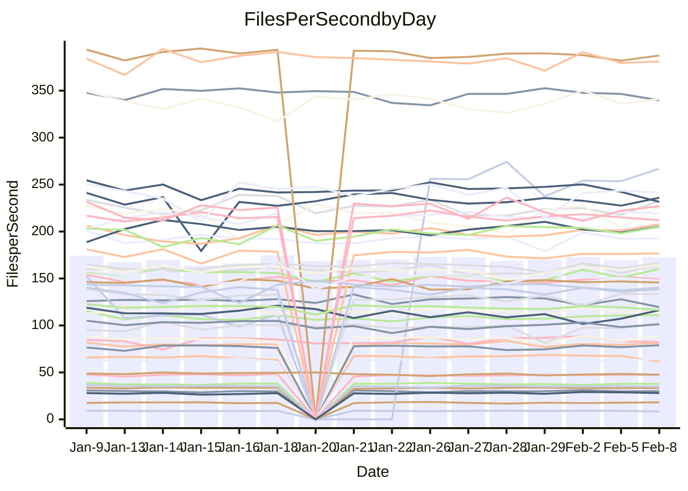

<!---
# This file is auto-generated. Do not edit.
# cspell:disable
--->
# Performance Report

## Daily Performance

## Time to Process Files

| Repository                                      | Elapsed | Min/Avg/Max           |   SD | SD Graph                |
| ----------------------------------------------- | ------: | :-------------------: | ---: | ----------------------- |
| AdaDoom3/AdaDoom3                    |    3.08 | 3.0 /   3.1 /   3.3   | 0.07 | `     ┣━┻━━●━━┻━┫     ` |
| alexiosc/megistos                    |    7.16 | 6.8 /   7.3 /   8.0   | 0.20 | `    ┣━━┻●━╋━━┻━━┫    ` |
| apollographql/apollo-server          |    2.25 | 2.2 /   2.3 /   2.6   | 0.08 | `     ┣━┻●━╋━━┻━┫     ` |
| aspnetboilerplate/aspnetboilerplate  |    9.65 | 9.4 /  10.0 /  11.3   | 0.41 | `    ┣━━●━━╋━━┻━━┫    ` |
| aws-amplify/docs                     |   12.15 | 11.8 /  12.5 /  16.0  | 0.82 | `   ┣━━━┻━●╋━━┻━━━┫   ` |
| Azure/azure-rest-api-specs           |    8.90 | 0.0 /  11.6 /  24.9   | 7.93 | `   ┣━━┻━━●╋━━━┻━━┫   ` |
| bitjson/typescript-starter           |    0.66 | 0.6 /   0.7 /   0.7   | 0.02 | `     ┣━━┻━●━┻━━┫     ` |
| caddyserver/caddy                    |    3.39 | 3.1 /   3.4 /   3.8   | 0.16 | `    ┣━━┻━━╋●━┻━━┫    ` |
| canada-ca/open-source-logiciel-libre |    0.83 | 0.7 /   0.8 /   0.8   | 0.02 | `     ┣━━┻━╋━┻━━┫  ●  ` |
| chef/chef                            |    5.31 | 5.3 /   5.7 /   6.6   | 0.32 | `    ┣━━●━━╋━━┻━━┫    ` |
| dart-lang/sdk                        |   61.37 | 60.3 /  62.5 /  67.6  | 2.08 | `  ┣━━━┻━●━╋━━━┻━━━┫  ` |
| django/django                        |   14.67 | 14.0 /  14.8 /  16.4  | 0.48 | `    ┣━━┻━●╋━━┻━━┫    ` |
| eslint/eslint                        |    9.83 | 9.8 /  10.3 /  10.9   | 0.28 | `    ┣●━┻━━╋━━┻━━┫    ` |
| exonum/exonum                        |    3.16 | 3.0 /   3.2 /   3.5   | 0.12 | `    ┣━━┻━●╋━━┻━━┫    ` |
| flutter/samples                      |   16.90 | 16.7 /  17.7 /  19.5  | 0.68 | `   ┣━━●┻━━╋━━┻━━━┫   ` |
| gitbucket/gitbucket                  |    3.45 | 3.0 /   3.2 /   3.6   | 0.10 | `    ┣━━┻━━╋━━┻━━●    ` |
| googleapis/google-cloud-cpp          |  133.94 | 117.6 / 130.5 / 142.8 | 5.37 | `  ┣━━━┻━━━╋━━●┻━━━┫  ` |
| graphql/express-graphql              |    0.74 | 0.7 /   0.7 /   0.8   | 0.02 | `     ┣━━┻━╋●┻━━┫     ` |
| graphql/graphql-js                   |    2.30 | 2.2 /   2.3 /   2.5   | 0.06 | `     ┣━┻━━●━━┻━┫     ` |
| graphql/graphql-relay-js             |    0.74 | 0.7 /   0.7 /   0.8   | 0.01 | `     ┣━━┻●╋━┻━━┫     ` |
| graphql/graphql-spec                 |    0.83 | 0.8 /   0.8 /   0.9   | 0.02 | `     ┣━━●━╋━┻━━┫     ` |
| iluwatar/java-design-patterns        |   11.43 | 11.2 /  11.9 /  13.0  | 0.37 | `    ┣━●┻━━╋━━┻━━┫    ` |
| ktaranov/sqlserver-kit               |    6.19 | 6.1 /   6.4 /   7.2   | 0.22 | `    ┣━━●━━╋━━┻━━┫    ` |
| liriliri/licia                       |    3.70 | 3.6 /   3.7 /   3.9   | 0.06 | `     ┣━┻━━●━━┻━┫     ` |
| MartinThoma/LaTeX-examples           |    6.64 | 6.3 /   6.6 /   6.8   | 0.12 | `    ┣━━┻━━╋━●┻━━┫    ` |
| mdx-js/mdx                           |    1.59 | 1.6 /   1.7 /   1.9   | 0.06 | `     ┣━●━━╋━━┻━┫     ` |
| microsoft/TypeScript-Website         |    5.49 | 5.1 /   5.4 /   6.1   | 0.23 | `    ┣━━┻━━╋●━┻━━┫    ` |
| MicrosoftDocs/PowerShell-Docs        |   23.30 | 18.5 /  22.8 /  27.3  | 2.67 | `   ┣━━┻━━━╋●━━┻━━┫   ` |
| neovim/nvim-lspconfig                |    3.31 | 3.1 /   3.3 /   3.6   | 0.13 | `    ┣━━┻━━╋●━┻━━┫    ` |
| pagekit/pagekit                      |    3.38 | 3.3 /   3.4 /   3.7   | 0.09 | `    ┣━━┻━●╋━━┻━━┫    ` |
| php/php-src                          |   21.85 | 21.0 /  22.3 /  26.5  | 1.30 | `   ┣━━━┻━●╋━━┻━━━┫   ` |
| plasticrake/tplink-smarthome-api     |    1.01 | 0.9 /   0.9 /   1.0   | 0.02 | `     ┣━━┻━╋━┻━━┫   ● ` |
| prettier/prettier                    |    6.47 | 6.3 /   6.6 /   7.1   | 0.18 | `    ┣━━┻━●╋━━┻━━┫    ` |
| pycontribs/jira                      |    1.25 | 1.2 /   1.3 /   1.4   | 0.04 | `     ┣━┻━●╋━━┻━┫     ` |
| RustPython/RustPython                |    4.25 | 4.1 /   4.3 /   4.7   | 0.15 | `    ┣━━┻━●╋━━┻━━┫    ` |
| shoelace-style/shoelace              |    2.48 | 2.4 /   2.5 /   2.7   | 0.08 | `     ┣━┻━━●━━┻━┫     ` |
| slint-ui/slint                       |    9.77 | 9.5 /  10.0 /  11.2   | 0.46 | `    ┣━━┻●━╋━━┻━━┫    ` |
| SoftwareBrothers/admin-bro           |    2.15 | 2.1 /   2.2 /   2.3   | 0.07 | `     ┣━┻━●╋━━┻━┫     ` |
| sveltejs/svelte                      |   18.86 | 18.1 /  18.9 /  22.2  | 0.76 | `   ┣━━━┻━━●━━┻━━━┫   ` |
| TheAlgorithms/Python                 |    5.91 | 5.4 /   5.6 /   6.1   | 0.14 | `    ┣━━┻━━╋━━┻━━●    ` |
| twbs/bootstrap                       |    1.17 | 1.1 /   1.2 /   1.5   | 0.07 | `     ┣━┻●━╋━━┻━┫     ` |
| typescript-cheatsheets/react         |    1.11 | 1.1 /   1.1 /   1.3   | 0.04 | `     ┣━┻━●╋━━┻━┫     ` |
| typescript-eslint/typescript-eslint  |    3.77 | 3.6 /   3.7 /   3.8   | 0.06 | `     ┣━┻━━╋━━●━┫     ` |
| vitest-dev/vitest                    |    8.16 | 7.7 /   8.1 /   9.2   | 0.36 | `    ┣━━┻━━●━━┻━━┫    ` |
| w3c/aria-practices                   |    2.89 | 2.9 /   3.0 /   3.3   | 0.10 | `    ┣━━┻●━╋━━┻━━┫    ` |
| w3c/specberus                        |    1.72 | 1.6 /   1.7 /   1.8   | 0.03 | `     ┣━┻━━╋━━●━┫     ` |
| webdeveric/webpack-assets-manifest   |    0.68 | 0.7 /   0.7 /   0.7   | 0.02 | `     ┣━━┻●╋━┻━━┫     ` |
| webpack/webpack                      |    4.82 | 4.6 /   4.9 /   5.4   | 0.19 | `    ┣━━┻●━╋━━┻━━┫    ` |
| wireapp/wire-desktop                 |    0.91 | 0.9 /   0.9 /   0.9   | 0.02 | `     ┣━━┻━╋━●━━┫     ` |
| wireapp/wire-webapp                  |    8.51 | 8.2 /   8.6 /   9.3   | 0.30 | `    ┣━━┻━●╋━━┻━━┫    ` |

Note:
- Elapsed time is in seconds.

## Files per Second over Time

| Repository                                      | Files |    Sec |    Fps |    Rel | Trend Fps              |    N |
| ----------------------------------------------- | ----: | -----: | -----: | -----: | ---------------------- | ---: |
| AdaDoom3/AdaDoom3                    |   103 |   3.08 |  33.41 |  0.38% | `█▇▇▇▇▅▇▅▇▆▇█▆█▇█▄▇▇▇` |   23 |
| alexiosc/megistos                    |   583 |   7.16 |  81.43 |  2.14% | `▆▅▆▆▆▅▆▆▆▆▆▆█▅▆▆▅▅▆▆` |   23 |
| apollographql/apollo-server          |   250 |   2.25 | 110.95 |  2.42% | `▆▇▆▆▆▅▆▇▇▇█▆▆▆▇▇▇▇█▇` |   26 |
| aspnetboilerplate/aspnetboilerplate  |  2246 |   9.65 | 232.72 |  3.88% | `▆██▆▇▆▆▇▇▅▆▆▅▆▆▅▇▃▆▇` |   24 |
| aws-amplify/docs                     |  2867 |  12.15 | 236.00 |  2.47% | `▇▇▇████▇▇▆█▆██▇▆▇▇██` |   26 |
| Azure/azure-rest-api-specs           |  2375 |   8.90 | 266.91 | 69.30% | `▃▄▁▁▁▁▁██▇███▇█▇██▇█` |   26 |
| bitjson/typescript-starter           |    20 |   0.66 |  30.12 |  0.34% | `▆▅▇▆█▇█▅▅▇▆▆▆▆█▄▇▇▆▆` |   23 |
| caddyserver/caddy                    |   279 |   3.39 |  82.31 | -1.19% | `▇▇▅▅▆▆▅█▇▄▄█▇▇█▇▄▇▇▆` |   26 |
| canada-ca/open-source-logiciel-libre |     7 |   0.83 |   8.44 | -6.62% | `▅▆▅▆▆▇▅▆▄▆▇▆▇▅▆█▄▇▆▃` |   23 |
| chef/chef                            |  1204 |   5.31 | 226.67 |  6.39% | `▄▅█▇▇▇▇▆▆▅▄▆▃▇█▆▆▅▄█` |   26 |
| dart-lang/sdk                        | 10083 |  61.37 | 164.31 |  1.71% | `▇█▇█▆████▆█▆█▆█▇▄▇▄▇` |   26 |
| django/django                        |  2826 |  14.67 | 192.64 |  0.61% | `▇▇▆▆▆▇▇▇▆▇▇█▆▅█▇▇▇▆▇` |   26 |
| eslint/eslint                        |  2042 |   9.83 | 207.72 |  4.99% | `▅█▆▇▇▆▆▇▆▄▇▅▆▆▇█▆▆▇█` |   26 |
| exonum/exonum                        |   421 |   3.16 | 133.25 |  1.95% | `▆▅▆▇▆▄▆▅▆▆▆▆▃▆▄█▆▅▇▇` |   23 |
| flutter/samples                      |  2707 |  16.90 | 160.17 |  5.01% | `▇▇▅█▆▆▅▇▇▆█▇▃▆█▇▅▇▆█` |   26 |
| gitbucket/gitbucket                  |   412 |   3.45 | 119.54 | -6.24% | `▆▆▅█▇▇▃▆▆▆▇▇▆▆▅▇▆▆▇▄` |   26 |
| googleapis/google-cloud-cpp          | 19819 | 133.94 | 147.96 | -2.52% | `▄█▃▆▅▅▆▆▆▆▆▄▃▆▅▆▆▃▅▅` |   26 |
| graphql/express-graphql              |    26 |   0.74 |  34.97 | -1.02% | `▆▆▆▆▇▅▄▇▅█▆▇▆▆▆▆▆▆▆▆` |   23 |
| graphql/graphql-js                   |   343 |   2.30 | 149.30 |  0.77% | `▆▇█▇█▆▇▄█▇▇▇▇▆▇██▇█▇` |   24 |
| graphql/graphql-relay-js             |    28 |   0.74 |  37.82 |  0.38% | `▆▆▇▇▆▇▇██▇▇▆▇▇▆▇▇▇▇▇` |   23 |
| graphql/graphql-spec                 |    15 |   0.83 |  18.09 |  2.15% | `▇▇▅▆▆▆█▇█▆▆▅▄▆▆▇▇▇▆▇` |   23 |
| iluwatar/java-design-patterns        |  1902 |  11.43 | 166.38 |  4.53% | `▆▇▇▆▆▆▅▇█▇▄▆▅▆█▇▆▇██` |   25 |
| ktaranov/sqlserver-kit               |   489 |   6.19 |  78.95 |  3.12% | `██▇▇▇▇█▇▇▇▇▆▅▆█▇▇▆▇█` |   23 |
| liriliri/licia                       |  1434 |   3.70 | 387.39 | -0.10% | `██▇██▇▇█▇▆█▇▇▇▇█▆▇▅▇` |   23 |
| MartinThoma/LaTeX-examples           |  1409 |   6.64 | 212.11 | -1.41% | `▇█▆▇▆▇▇▇█▆█▇▅▇▇▆▇▇▆▆` |   23 |
| mdx-js/mdx                           |   141 |   1.59 |  88.69 |  3.75% | `▇▆▇▆█▇▇▇▇▆▇█▇▅█▆▆▃██` |   23 |
| microsoft/TypeScript-Website         |   760 |   5.49 | 138.56 | -1.70% | `▃▇██▇█▆▇▇▆▇█▇▇▇▆▄█▅▆` |   26 |
| MicrosoftDocs/PowerShell-Docs        |  2708 |  23.30 | 116.23 |  3.94% | `▇█▇▇▃▆▇▅▇▅▇▅▅▆▃▆▅▄▄▇` |   26 |
| neovim/nvim-lspconfig                |   378 |   3.31 | 114.29 | -0.83% | `█▅██▅█▄▇█▇▅▇▆▅█▆▆▆█▆` |   26 |
| pagekit/pagekit                      |   741 |   3.38 | 219.20 |  1.39% | `█▇▅█▇▆█▆▇███▅▇▆████▇` |   23 |
| php/php-src                          |  2213 |  21.85 | 101.29 |  1.95% | `██▆▇▆▇▃▇▃▇▇█▆▇█▅▇▇▇▇` |   26 |
| plasticrake/tplink-smarthome-api     |    62 |   1.01 |  61.62 | -7.79% | `▆▇▆▅▇█▇▇▆▆█▇▇██▇█▇▇▄` |   23 |
| prettier/prettier                    |  2207 |   6.47 | 341.14 |  1.26% | `▆▄▇▇▇██▇▄▇▇▅▆▇█▆▇▆▇▇` |   26 |
| pycontribs/jira                      |    80 |   1.25 |  63.80 |  1.71% | `▇▇█▆▇▇▇▇█▆▇▇▃▇▅▇█▇▇▇` |   23 |
| RustPython/RustPython                |   620 |   4.25 | 145.80 |  0.72% | `█▇▅█▄██▅▇▅▄█▆█▇▇▇▇▇▇` |   26 |
| shoelace-style/shoelace              |   438 |   2.48 | 176.70 |  0.39% | `█▅▇▇▇▆▇▇▇▇█▇▅▆▇▅█▆█▇` |   23 |
| slint-ui/slint                       |  2002 |   9.77 | 204.95 |  3.20% | `▅█▅▆▅█▆▆▃██▇█▇▇█▆▄▇█` |   26 |
| SoftwareBrothers/admin-bro           |   441 |   2.15 | 205.29 |  1.64% | `█▆▇▆▆▇█▅▅▆▇█▆█▆█▄▅▇▇` |   24 |
| sveltejs/svelte                      |  7187 |  18.86 | 381.07 |  0.15% | `█████▇█▇▇█▇█▇▇████▆▇` |   26 |
| TheAlgorithms/Python                 |  1369 |   5.91 | 231.56 | -5.39% | `▇▆▇▇▇▆▇█▇▇▇█▆▇█▇█▄▇▅` |   26 |
| twbs/bootstrap                       |   120 |   1.17 | 102.18 |  5.00% | `▇▇▇▇▇▆▇▇▅▇▇▇▇▂▆█▇▆▄▇` |   25 |
| typescript-cheatsheets/react         |    53 |   1.11 |  47.63 |  1.70% | `▇█▇█▇▅▇█▇▇▇▇▇▇▇█▇█▆▇` |   24 |
| typescript-eslint/typescript-eslint  |  1282 |   3.77 | 339.76 | -1.68% | `█▇▇▇█▆▅▅▇█▆▇▇█▇▆▆█▇▆` |   26 |
| vitest-dev/vitest                    |  1972 |   8.16 | 241.59 |  0.16% | `█▇█▆▇▇▇█▇▆▇▇█▄▇█▇▇▇▇` |   26 |
| w3c/aria-practices                   |   405 |   2.89 | 140.25 |  2.30% | `▄▆█▇██▇█▆██▇▇▆█▇▇█▇█` |   23 |
| w3c/specberus                        |   200 |   1.72 | 116.51 | -2.36% | `██▅█████▇▇█▇▇▇███▇▆▆` |   26 |
| webdeveric/webpack-assets-manifest   |    19 |   0.68 |  28.07 |  0.71% | `▇▅▅▇▇▆▆▅▇▆▇▇▇▆████▇▇` |   23 |
| webpack/webpack                      |  1095 |   4.82 | 227.08 |  1.87% | `▄▇▆▆▇▇▇▆▇▆▃██▆▄▅▆▆▆▇` |   23 |
| wireapp/wire-desktop                 |    43 |   0.91 |  47.51 | -1.77% | `▇██▆▇▅▇▅▅▇▇▇▇▅▆▇▇▅▇▆` |   27 |
| wireapp/wire-webapp                  |  1401 |   8.51 | 164.59 |  3.92% | `██▆█▇▆█▇▅██▅▄▆█▇▇▇▇█` |   26 |

## Data Throughput

| Repository                                      | Files |    Sec |     Kps |    Rel | Trend Kps              |    N |
| ----------------------------------------------- | ----: | -----: | ------: | -----: | ---------------------- | ---: |
| AdaDoom3/AdaDoom3                    |   103 |   3.08 |  710.05 |  0.38% | `█▇▇▇▇▅▇▅▇▆▇█▆█▇█▄▇▇▇` |   23 |
| alexiosc/megistos                    |   583 |   7.16 |  639.85 |  2.14% | `▆▅▆▆▆▅▆▆▆▆▆▆█▅▆▆▅▅▆▆` |   23 |
| apollographql/apollo-server          |   250 |   2.25 |  888.49 |  2.46% | `▆▇▆▆▆▅▆▇▇▇█▆▆▆▇▇▇▇█▇` |   26 |
| aspnetboilerplate/aspnetboilerplate  |  2246 |   9.65 |  547.60 |  3.89% | `▆██▆▇▆▆▇▇▅▆▆▅▆▆▅▇▃▆▇` |   24 |
| aws-amplify/docs                     |  2867 |  12.15 |  812.55 |  2.69% | `▇▇▇████▇▇▆█▆██▇▆▇▇██` |   26 |
| Azure/azure-rest-api-specs           |  2375 |   8.90 |  764.09 | 36.72% | `▂▁▁▂▂▁▂▇█▇███▇▇▇██▇█` |   21 |
| bitjson/typescript-starter           |    20 |   0.66 |  120.46 |  0.34% | `▆▅▇▆█▇█▅▅▇▆▆▆▆█▄▇▇▆▆` |   23 |
| caddyserver/caddy                    |   279 |   3.39 |  687.13 | -1.11% | `▇▇▅▅▆▆▅█▇▄▄█▇▇█▇▄▇▇▆` |   26 |
| canada-ca/open-source-logiciel-libre |     7 |   0.83 |   69.96 | -6.62% | `▅▆▅▆▆▇▅▆▄▆▇▆▇▅▆█▄▇▆▃` |   23 |
| chef/chef                            |  1204 |   5.31 | 1041.46 |  6.43% | `▄▅█▇▇▇▇▆▆▅▄▆▃▇█▆▆▅▄█` |   26 |
| dart-lang/sdk                        | 10083 |  61.37 | 1153.66 |  0.35% | `▇█▇█▆████▆█▆█▆█▇▄▆▄▇` |   26 |
| django/django                        |  2826 |  14.67 | 1189.40 |  0.51% | `▇▇▆▆▆▇▇▇▆▇▇█▆▅█▇▇▇▆▇` |   26 |
| eslint/eslint                        |  2042 |   9.83 | 1699.47 |  5.02% | `▅█▆▇▇▆▆▇▆▅▇▅▆▆▇█▆▆▇█` |   26 |
| exonum/exonum                        |   421 |   3.16 | 1274.62 |  1.95% | `▆▅▆▇▆▄▆▅▆▆▆▆▃▆▄█▆▅▇▇` |   23 |
| flutter/samples                      |  2707 |  16.90 | 1295.39 |  4.75% | `▇▇▅█▆▆▅▇▇▆█▇▃▆█▇▄▇▆█` |   26 |
| gitbucket/gitbucket                  |   412 |   3.45 |  540.55 | -6.26% | `▆▆▅█▇▇▃▆▆▆▇▇▆▆▅▇▆▆▇▄` |   26 |
| googleapis/google-cloud-cpp          | 19819 | 133.94 | 1159.00 | -2.35% | `▄█▃▆▅▅▆▆▆▆▆▅▄▆▅▆▆▃▅▅` |   26 |
| graphql/express-graphql              |    26 |   0.74 |  160.05 | -1.02% | `▆▆▆▆▇▅▄▇▅█▆▇▆▆▆▆▆▆▆▆` |   23 |
| graphql/graphql-js                   |   343 |   2.30 |  839.21 | -0.01% | `▆▇█▇█▆█▄█▇▇▇▇▆▇██▇█▇` |   24 |
| graphql/graphql-relay-js             |    28 |   0.74 |  148.59 |  0.38% | `▆▆▇▇▆▇▇██▇▇▆▇▇▆▇▇▇▇▇` |   23 |
| graphql/graphql-spec                 |    15 |   0.83 |  665.80 |  2.15% | `▇▇▅▆▆▆█▇█▆▆▅▄▆▆▇▇▇▆▇` |   23 |
| iluwatar/java-design-patterns        |  1902 |  11.43 |  510.15 |  4.45% | `▆▇▇▆▆▆▅▇█▇▄▆▅▆█▇▆▇██` |   25 |
| ktaranov/sqlserver-kit               |   489 |   6.19 | 1194.49 |  3.12% | `██▇▇▇▇█▇▇▇▇▆▅▆█▇▇▆▇█` |   23 |
| liriliri/licia                       |  1434 |   3.70 |  458.98 | -0.10% | `██▇██▇▇█▇▆█▇▇▇▇█▆▇▅▇` |   23 |
| MartinThoma/LaTeX-examples           |  1409 |   6.64 |  438.07 | -1.41% | `▇█▆▇▆▇▇▇█▆█▇▅▇▇▆▇▇▆▆` |   23 |
| mdx-js/mdx                           |   141 |   1.59 |  411.37 |  3.97% | `▇▆▇▆█▇▇▇▇▆▇█▇▅█▆▆▃██` |   23 |
| microsoft/TypeScript-Website         |   760 |   5.49 |  955.12 | -1.06% | `▃▇██▇█▆▇▇▆▇█▇▇▇▆▄█▅▆` |   26 |
| MicrosoftDocs/PowerShell-Docs        |  2708 |  23.30 | 1191.71 |  4.88% | `▇███▃▇█▆█▆▇▅▆▇▄▆▆▅▄█` |   26 |
| neovim/nvim-lspconfig                |   378 |   3.31 |  299.63 | -0.66% | `█▅██▅█▄▇█▇▆▇▆▅█▆▆▆█▆` |   26 |
| pagekit/pagekit                      |   741 |   3.38 |  457.05 |  1.39% | `█▇▅█▇▆█▆▇███▅▇▆████▇` |   23 |
| php/php-src                          |  2213 |  21.85 | 1485.91 |  2.08% | `██▆▇▆▇▃▇▃▇▇█▆▇█▅▇▇▇▇` |   26 |
| plasticrake/tplink-smarthome-api     |    62 |   1.01 |  332.97 | -7.79% | `▆▇▆▅▇█▇▇▆▆█▇▇██▇█▇▇▄` |   23 |
| prettier/prettier                    |  2207 |   6.47 |  481.18 |  1.18% | `▆▄▇▇▇██▇▄▇▇▅▆▇█▆▇▆▇▇` |   26 |
| pycontribs/jira                      |    80 |   1.25 |  439.40 |  1.71% | `▇▇█▆▇▇▇▇█▆▇▇▃▇▅▇█▇▇▇` |   23 |
| RustPython/RustPython                |   620 |   4.25 | 1081.03 |  0.85% | `█▇▅█▄██▅▇▅▄█▆█▇▇▇▇▇▇` |   26 |
| shoelace-style/shoelace              |   438 |   2.48 |  851.63 |  0.68% | `█▅▇▇▇▆▇▇▇▇█▇▅▆▇▅█▆█▇` |   23 |
| slint-ui/slint                       |  2002 |   9.77 | 1061.62 |  3.72% | `▅█▅▆▅█▆▆▃██▇█▇▇█▆▄▇█` |   26 |
| SoftwareBrothers/admin-bro           |   441 |   2.15 |  452.48 |  1.64% | `█▆▇▆▆▇█▅▅▆▇█▆█▆█▄▅▇▇` |   24 |
| sveltejs/svelte                      |  7187 |  18.86 |  252.86 |  0.21% | `█████▇█▇▇█▇█▇▇████▆▇` |   26 |
| TheAlgorithms/Python                 |  1369 |   5.91 |  588.28 | -5.41% | `▇▇▇▇▇▆▇█▇▇▇█▆▇█▇█▄▇▅` |   26 |
| twbs/bootstrap                       |   120 |   1.17 |  820.03 |  5.00% | `▇▇▇▇▇▆▇▇▅▇▇▇▇▂▆█▇▆▄▇` |   25 |
| typescript-cheatsheets/react         |    53 |   1.11 |  348.66 |  1.70% | `▇█▇█▇▅▇█▇▇▇▇▇▇▇█▇█▆▇` |   24 |
| typescript-eslint/typescript-eslint  |  1282 |   3.77 | 1669.37 | -0.60% | `▇▇▇▇▇▆▅▅▇▇▆▇▆█▇▆▆█▇▆` |   26 |
| vitest-dev/vitest                    |  1972 |   8.16 |  504.63 |  0.55% | `█▇█▆▇█▇█▇▆▇▇█▄▇██▇▇▇` |   26 |
| w3c/aria-practices                   |   405 |   2.89 | 1302.38 |  2.30% | `▄▆█▇██▇█▆██▇▇▆█▇▇█▇█` |   23 |
| w3c/specberus                        |   200 |   1.72 |  371.65 | -2.36% | `██▅█████▇▇█▇▇▇███▇▆▆` |   26 |
| webdeveric/webpack-assets-manifest   |    19 |   0.68 |  150.72 |  0.71% | `▇▅▅▇▇▆▆▅▇▆▇▇▇▆████▇▇` |   23 |
| webpack/webpack                      |  1095 |   4.82 | 1001.83 |  1.87% | `▄▇▆▆▇▇▇▆▇▆▃██▆▄▅▆▆▆▇` |   23 |
| wireapp/wire-desktop                 |    43 |   0.91 |  209.94 | -1.77% | `▇██▆▇▅▇▅▅▇▇▇▇▅▆▇▇▅▇▆` |   27 |
| wireapp/wire-webapp                  |  1401 |   8.51 |  655.64 |  2.60% | `██▆█▇▆█▇▅██▅▄▆█▇▇▆▆█` |   26 |

