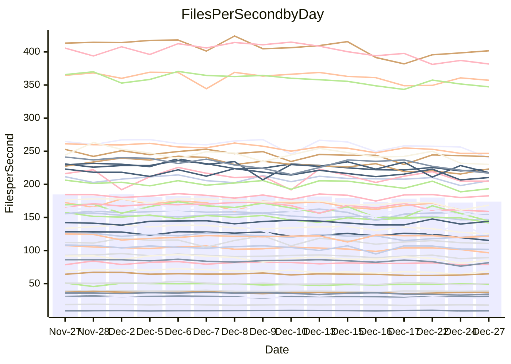

<!---
# This file is auto-generated. Do not edit.
# cspell:disable
--->
# Performance Report

## Daily Performance

## Time to Process Files

| Repository                                      | Elapsed | Min/Avg/Max           |   SD | SD Graph                |
| ----------------------------------------------- | ------: | :-------------------: | ---: | ----------------------- |
| AdaDoom3/AdaDoom3                    |    3.02 | 2.8 /   2.9 /   3.2   | 0.11 | `    ┣━━┻━━╋━━●━━┫    ` |
| alexiosc/megistos                    |    7.15 | 6.6 /   6.9 /   7.7   | 0.28 | `    ┣━━┻━━╋━●┻━━┫    ` |
| apollographql/apollo-server          |    2.26 | 2.0 /   2.2 /   2.4   | 0.07 | `     ┣━┻━━╋━●┻━┫     ` |
| aspnetboilerplate/aspnetboilerplate  |    9.76 | 8.5 /   9.1 /  10.0   | 0.32 | `    ┣━━┻━━╋━━┻━━●    ` |
| aws-amplify/docs                     |   11.84 | 11.2 /  11.7 /  12.4  | 0.33 | `    ┣━━┻━━╋━●┻━━┫    ` |
| Azure/azure-rest-api-specs           |   16.68 | 13.8 /  14.8 /  17.0  | 0.75 | `   ┣━━━┻━━╋━━┻━━━┫●  ` |
| bitjson/typescript-starter           |    0.65 | 0.6 /   0.7 /   0.7   | 0.02 | `     ┣━━●━╋━┻━━┫     ` |
| caddyserver/caddy                    |    3.26 | 2.9 /   3.1 /   3.7   | 0.17 | `    ┣━━┻━━╋━●┻━━┫    ` |
| canada-ca/open-source-logiciel-libre |    0.77 | 0.7 /   0.8 /   0.8   | 0.02 | `     ┣━━┻━╋●┻━━┫     ` |
| chef/chef                            |    5.53 | 5.0 /   5.3 /   5.8   | 0.19 | `    ┣━━┻━━╋━━┻●━┫    ` |
| dart-lang/sdk                        |   59.52 | 54.5 /  57.8 /  62.8  | 1.93 | `  ┣━━━┻━━━╋━━●┻━━━┫  ` |
| django/django                        |   14.57 | 13.4 /  14.0 /  15.5  | 0.50 | `   ┣━━━┻━━╋━━┻●━━┫   ` |
| eslint/eslint                        |    9.92 | 9.2 /   9.8 /  10.9   | 0.33 | `    ┣━━┻━━╋●━┻━━┫    ` |
| exonum/exonum                        |    3.51 | 2.9 /   3.1 /   3.7   | 0.19 | `    ┣━━┻━━╋━━┻━━┫●   ` |
| flutter/samples                      |   18.06 | 15.0 /  16.4 /  19.1  | 0.74 | `   ┣━━━┻━━╋━━┻━━━●   ` |
| gitbucket/gitbucket                  |    3.29 | 2.9 /   3.1 /   3.3   | 0.09 | `    ┣━━┻━━╋━━┻━━┫●   ` |
| googleapis/google-cloud-cpp          |  125.44 | 117.0 / 123.1 / 133.5 | 4.52 | `  ┣━━━┻━━━╋━●━┻━━━┫  ` |
| graphql/express-graphql              |    0.71 | 0.7 /   0.7 /   0.7   | 0.02 | `     ┣━━┻━●━┻━━┫     ` |
| graphql/graphql-js                   |    2.19 | 2.1 /   2.2 /   2.4   | 0.08 | `     ┣━┻━━╋●━┻━┫     ` |
| graphql/graphql-relay-js             |    0.72 | 0.7 /   0.7 /   0.8   | 0.02 | `     ┣━━┻●╋━┻━━┫     ` |
| graphql/graphql-spec                 |    0.85 | 0.8 /   0.8 /   0.9   | 0.02 | `     ┣━━┻━╋━●━━┫     ` |
| iluwatar/java-design-patterns        |   11.67 | 10.3 /  11.0 /  13.6  | 0.60 | `    ┣━━┻━━╋━━●━━┫    ` |
| ktaranov/sqlserver-kit               |    6.19 | 5.7 /   6.0 /   6.4   | 0.17 | `    ┣━━┻━━╋━━●━━┫    ` |
| liriliri/licia                       |    3.57 | 3.2 /   3.5 /   3.8   | 0.11 | `    ┣━━┻━━╋━●┻━━┫    ` |
| MartinThoma/LaTeX-examples           |    6.33 | 6.0 /   6.2 /   6.5   | 0.14 | `    ┣━━┻━━╋━●┻━━┫    ` |
| mdx-js/mdx                           |    1.59 | 1.5 /   1.5 /   1.6   | 0.04 | `     ┣━┻━━╋━━●━┫     ` |
| microsoft/TypeScript-Website         |    5.34 | 4.7 /   5.0 /   5.3   | 0.16 | `    ┣━━┻━━╋━━┻━━●    ` |
| MicrosoftDocs/PowerShell-Docs        |   18.37 | 17.7 /  18.6 /  25.8  | 1.42 | `   ┣━━━┻━●╋━━┻━━━┫   ` |
| neovim/nvim-lspconfig                |    3.22 | 2.8 /   3.0 /   3.2   | 0.09 | `    ┣━━┻━━╋━━┻━━┫ ●  ` |
| pagekit/pagekit                      |    3.32 | 3.0 /   3.2 /   3.5   | 0.13 | `    ┣━━┻━━╋━●┻━━┫    ` |
| php/php-src                          |   21.72 | 19.9 /  21.1 /  24.9  | 0.95 | `   ┣━━━┻━━╋━●┻━━━┫   ` |
| plasticrake/tplink-smarthome-api     |    0.90 | 0.8 /   0.9 /   1.0   | 0.04 | `     ┣━┻━━●━━┻━┫     ` |
| prettier/prettier                    |    6.34 | 5.9 /   6.1 /   6.4   | 0.16 | `    ┣━━┻━━╋━━┻●━┫    ` |
| pycontribs/jira                      |    1.23 | 1.1 /   1.2 /   1.4   | 0.05 | `     ┣━┻━━●━━┻━┫     ` |
| RustPython/RustPython                |    4.22 | 3.9 /   4.1 /   4.4   | 0.13 | `    ┣━━┻━━╋━━●━━┫    ` |
| shoelace-style/shoelace              |    2.40 | 2.3 /   2.4 /   2.5   | 0.06 | `     ┣━┻━━●━━┻━┫     ` |
| slint-ui/slint                       |    9.29 | 8.4 /   9.0 /   9.6   | 0.34 | `    ┣━━┻━━╋━━●━━┫    ` |
| SoftwareBrothers/admin-bro           |    2.15 | 2.0 /   2.1 /   2.3   | 0.09 | `     ┣━┻━━╋━●┻━┫     ` |
| sveltejs/svelte                      |   18.62 | 16.9 /  18.0 /  19.8  | 0.73 | `   ┣━━━┻━━╋━━●━━━┫   ` |
| TheAlgorithms/Python                 |    5.67 | 4.9 /   5.2 /   5.7   | 0.17 | `    ┣━━┻━━╋━━┻━━┫ ●  ` |
| twbs/bootstrap                       |    1.24 | 1.1 /   1.2 /   1.4   | 0.05 | `     ┣━┻━━╋━━┻●┫     ` |
| typescript-cheatsheets/react         |    1.08 | 1.0 /   1.1 /   1.2   | 0.04 | `     ┣━┻━━●━━┻━┫     ` |
| typescript-eslint/typescript-eslint  |    3.56 | 3.4 /   3.5 /   3.7   | 0.07 | `    ┣━━┻━━╋━━●━━┫    ` |
| vitest-dev/vitest                    |    7.82 | 6.9 /   7.4 /   8.1   | 0.27 | `    ┣━━┻━━╋━━┻━●┫    ` |
| w3c/aria-practices                   |    2.81 | 2.7 /   2.8 /   3.0   | 0.08 | `    ┣━━┻━●╋━━┻━━┫    ` |
| w3c/specberus                        |    1.63 | 1.6 /   1.6 /   1.7   | 0.04 | `     ┣━┻━━●━━┻━┫     ` |
| webdeveric/webpack-assets-manifest   |    0.68 | 0.6 /   0.7 /   0.7   | 0.01 | `     ┣━━┻━╋━┻●━┫     ` |
| webpack/webpack                      |    5.05 | 4.4 /   4.7 /   5.3   | 0.19 | `    ┣━━┻━━╋━━┻━━●    ` |
| wireapp/wire-desktop                 |    0.86 | 0.8 /   0.9 /   0.9   | 0.03 | `     ┣━┻━━●━━┻━┫     ` |
| wireapp/wire-webapp                  |    8.41 | 7.3 /   7.8 /   8.4   | 0.30 | `    ┣━━┻━━╋━━┻━━●    ` |

Note:
- Elapsed time is in seconds.

## Files per Second over Time

| Repository                                      | Files |    Sec |    Fps |     Rel | Trend Fps              |    N |
| ----------------------------------------------- | ----: | -----: | -----: | ------: | ---------------------- | ---: |
| AdaDoom3/AdaDoom3                    |   103 |   3.02 |  34.14 |  -3.87% | `█▇█▇▆██▇▅▇▇▆▆▇█▅▅▄▄▅` |   29 |
| alexiosc/megistos                    |   583 |   7.15 |  81.58 |  -2.96% | `▄█▇▆█▄▇▇█▇█▆▇▇▆█▇▄▄▆` |   29 |
| apollographql/apollo-server          |   250 |   2.26 | 110.71 |  -2.78% | `▆▃▆▇▆█▄▇▆▆▆▇▅▄▅▆▆▅▅▅` |   31 |
| aspnetboilerplate/aspnetboilerplate  |  2246 |   9.76 | 230.13 |  -6.55% | `█▆▇▇▇█▅▇██▇▆▇▇▆▆▇▆▄▅` |   29 |
| aws-amplify/docs                     |  2863 |  11.84 | 241.83 |  -1.45% | `██▇▆██▅▇█▇▇▅▇▆▇▄▇▆▇▆` |   31 |
| Azure/azure-rest-api-specs           |  2411 |  16.68 | 144.56 | -11.53% | `█▇▆▇▇█▆▅██▅▆▅▃▄▄▇▅▅▃` |   31 |
| bitjson/typescript-starter           |    20 |   0.65 |  30.93 |   2.02% | `██▇▆█▆▄▇▅▆▆▇▇▆▇▅▇▇▆▇` |   29 |
| caddyserver/caddy                    |   279 |   3.26 |  85.61 |  -3.69% | `█▇▇▆▇▅▆▇██▃▆█▆▅▇▆▅▄▆` |   31 |
| canada-ca/open-source-logiciel-libre |     7 |   0.77 |   9.11 |  -0.74% | `▄▆▆▇▆▆▇▇▇▅▆▇▇▄▆▇█▄▅▆` |   29 |
| chef/chef                            |  1204 |   5.53 | 217.76 |  -4.85% | `▇█▇▇█▇▃▇▆█▇▇▇▅▆▇▄▆▇▅` |   30 |
| dart-lang/sdk                        | 10026 |  59.52 | 168.46 |  -2.60% | `████▇▇▇▇▆▆▆▇▇▆▅▇▇▅▄▆` |   31 |
| django/django                        |  2817 |  14.57 | 193.39 |  -3.67% | `█▇█▆▇█▅███▇▇▇▆▇▆█▄▆▆` |   31 |
| eslint/eslint                        |  2038 |   9.92 | 205.48 |  -1.15% | `█▇█▇▄█▆███▆▇█▇▇▇▇▆▅▇` |   31 |
| exonum/exonum                        |   421 |   3.51 | 120.11 | -12.45% | `▆██▆█▇▅▃▅▅██▇█▆▆▅▇█▄` |   29 |
| flutter/samples                      |  2690 |  18.06 | 148.92 |  -9.28% | `▇██▆███▇▆█▆▇▅▆▇▆▆▆▆▄` |   31 |
| gitbucket/gitbucket                  |   412 |   3.29 | 125.14 |  -7.00% | `███▆▆▆▇▇▇██▆▇▆▄▇▆▄▅▄` |   31 |
| googleapis/google-cloud-cpp          | 19742 | 125.44 | 157.38 |  -1.97% | `▆▇▅▇▇█▆▇▇█▄▇▅▄▄▆▇▅▅▆` |   31 |
| graphql/express-graphql              |    26 |   0.71 |  36.80 |   0.40% | `▆▇█▆▆▆▄▆▆▇▇▇▅▆▇▅▅▆▇▇` |   29 |
| graphql/graphql-js                   |   339 |   2.19 | 154.59 |  -1.37% | `█▇▇█▇▇▇██▆▆█▅▄▄▆▇▆▇▆` |   30 |
| graphql/graphql-relay-js             |    28 |   0.72 |  38.99 |   0.92% | `▇▇█▇▇▅▆▆▇▇▇▆▅▄▅▇▇▆▇▇` |   29 |
| graphql/graphql-spec                 |    15 |   0.85 |  17.63 |  -2.28% | `██▇█▅▄▇▇▆█▆█▇▇▇▆▆▇▇▆` |   29 |
| iluwatar/java-design-patterns        |  1849 |  11.67 | 158.43 |  -5.76% | `███▂████▆█▇▆▆▇▆▇█▇▆▆` |   31 |
| ktaranov/sqlserver-kit               |   489 |   6.19 |  78.94 |  -2.66% | `█▆▆██▇▇▆█▇▇▆▅▇█▇▇▆▅▆` |   30 |
| liriliri/licia                       |  1434 |   3.57 | 401.73 |  -2.14% | `▅▆▅▆▆█▅▅▆▆▇▅▇▄▄▃▅▅▅▅` |   30 |
| MartinThoma/LaTeX-examples           |  1409 |   6.33 | 222.57 |  -1.74% | `▇█▇▇▅▆▆▇▇▇▆▆▆▅▆▅▆▆▅▆` |   29 |
| mdx-js/mdx                           |   142 |   1.59 |  89.30 |  -2.82% | `██▇▆▆▇▇▇█▇▅▇█▆▅▇▇▄▆▆` |   29 |
| microsoft/TypeScript-Website         |   757 |   5.34 | 141.78 |  -6.03% | `▅▇█▇█▇█▆▅▇▆▇█▆▆▇▇█▆▅` |   29 |
| MicrosoftDocs/PowerShell-Docs        |  2232 |  18.37 | 121.51 |   1.11% | `▇█▇▇█▇███▇▇▂██████▇█` |   31 |
| neovim/nvim-lspconfig                |   371 |   3.22 | 115.33 |  -7.87% | `█▇▇▇▇▇▆▆█▇▆▇▆▆▆▇▇▄▆▄` |   31 |
| pagekit/pagekit                      |   741 |   3.32 | 223.28 |  -3.02% | `███▅▅█▇▆▆▄▅▆▇▇▆▅▅▅▃▅` |   29 |
| php/php-src                          |  2213 |  21.72 | 101.88 |  -2.92% | `▇▇▇▇██▇▆█▇▇█▆▃▄█▇▆▆▆` |   31 |
| plasticrake/tplink-smarthome-api     |    62 |   0.90 |  69.09 |   0.45% | `▆█▇▇▇▇▇▇▆▇▅▆▇▅▆▆▆▆▃▇` |   29 |
| prettier/prettier                    |  2202 |   6.34 | 347.27 |  -3.13% | `█▇▇▇▇▇▇▇▇▇▅▆▅▆▆▅▇▆▆▅` |   31 |
| pycontribs/jira                      |    80 |   1.23 |  64.85 |   0.47% | `▇▇▇▆█▆▇▆▇▅▇█▆▇▆▆▆▅▇▇` |   30 |
| RustPython/RustPython                |   621 |   4.22 | 147.07 |  -3.64% | `▆▇█▆▆▇▆▆▇▄▇▇▆▆▆▆▆▅▅▅` |   31 |
| shoelace-style/shoelace              |   438 |   2.40 | 182.60 |   0.46% | `█▇▇▇▅▇▆██▇▇▇▅▆▆██▆▇▇` |   31 |
| slint-ui/slint                       |  1954 |   9.29 | 210.26 |  -2.90% | `▇▅▆▇█▆▆▇▇▅▅▇▄▆▆▆▇▅▄▅` |   31 |
| SoftwareBrothers/admin-bro           |   441 |   2.15 | 204.81 |  -3.29% | `▅█▇▆▆▆▆▃██▆▅▆▄▆▆▇▆▄▅` |   29 |
| sveltejs/svelte                      |  7110 |  18.62 | 381.78 |  -4.81% | `█▇█████▇█▆▅▆▆▆▆▆▅▅▅▅` |   31 |
| TheAlgorithms/Python                 |  1361 |   5.67 | 239.83 |  -8.39% | `▆▆▇█▆▇▄▇▇█▆▆▅▆▄▆▆▆▆▄` |   31 |
| twbs/bootstrap                       |   120 |   1.24 |  96.57 |  -6.51% | `██▆█▆▇▇▇█▅▇▇█▃▆▇▇█▅▅` |   30 |
| typescript-cheatsheets/react         |    53 |   1.08 |  48.90 |  -0.54% | `█▇▇█▆█▆▇▆▇▇▆▇▆▇▇▇▇█▇` |   29 |
| typescript-eslint/typescript-eslint  |  1273 |   3.56 | 357.17 |  -1.77% | `█▅█▇█▇▇███▆▆█▆▇▅▅▇▆▆` |   31 |
| vitest-dev/vitest                    |  1930 |   7.82 | 246.73 |  -3.88% | `▇▇██▇▇▆▇█▆▆▇▇▆▄▇▆▆▅▅` |   31 |
| w3c/aria-practices                   |   405 |   2.81 | 144.09 |   1.41% | `▇▇▄▇▇▇█▇█▇▅▅▅▄▇▆█▆▆▇` |   30 |
| w3c/specberus                        |   200 |   1.63 | 123.02 |   0.23% | `▇█▇▇█▇▆▇▆▇▇▇▇▇▆▄▅▅▇▇` |   31 |
| webdeveric/webpack-assets-manifest   |    19 |   0.68 |  28.11 |  -2.49% | `▇▇▇▇▇▆▆▆▆▇▅▅▆▅▆▅█▆▇▆` |   29 |
| webpack/webpack                      |  1095 |   5.05 | 217.03 |  -7.26% | `▆▇▃▇█▅▄▆▇▇▇▇█▆▇▇▆▅▅▄` |   31 |
| wireapp/wire-desktop                 |    43 |   0.86 |  50.22 |  -0.15% | `█▆▇▄▆▆▅▅█▅▆▅▅▅▄▇▆▄▅▆` |   31 |
| wireapp/wire-webapp                  |  1337 |   8.41 | 159.05 |  -5.10% | `▇▇▇█▇█▆▄▇█▅▆▆▆▅▇▅▅▅▅` |   31 |

## Data Throughput

| Repository                                      | Files |    Sec |     Kps |     Rel | Trend Kps              |    N |
| ----------------------------------------------- | ----: | -----: | ------: | ------: | ---------------------- | ---: |
| AdaDoom3/AdaDoom3                    |   103 |   3.02 |  725.52 |  -3.87% | `█▇█▇▆██▇▅▇▇▆▆▇█▅▅▄▄▅` |   29 |
| alexiosc/megistos                    |   583 |   7.15 |  641.03 |  -2.96% | `▄█▇▆█▄▇▇█▇█▆▇▇▆█▇▄▄▆` |   29 |
| apollographql/apollo-server          |   250 |   2.26 |  885.68 |  -2.54% | `▆▃▆▇▆█▄▇▆▆▆▇▅▄▅▆▆▅▅▅` |   31 |
| aspnetboilerplate/aspnetboilerplate  |  2246 |   9.76 |  541.40 |  -6.55% | `█▆▇▇▇█▅▇██▇▆▇▇▆▆▇▆▄▅` |   29 |
| aws-amplify/docs                     |  2863 |  11.84 |  828.61 |  -0.91% | `██▇▆██▅▇█▇█▅▇▆█▅▇▇▇▇` |   31 |
| Azure/azure-rest-api-specs           |  2411 |  16.68 |  416.41 | -11.46% | `█▇▆▇▇█▆▅██▅▆▅▃▄▄▇▅▅▃` |   31 |
| bitjson/typescript-starter           |    20 |   0.65 |  123.70 |   2.02% | `██▇▆█▆▄▇▅▆▆▇▇▆▇▅▇▇▆▇` |   29 |
| caddyserver/caddy                    |   279 |   3.26 |  712.20 |  -3.44% | `█▇▇▆▇▅▆▇██▃▆█▆▅▇▆▅▄▆` |   31 |
| canada-ca/open-source-logiciel-libre |     7 |   0.77 |   75.46 |  -0.74% | `▄▆▆▇▆▆▇▇▇▅▆▇▇▄▆▇█▄▅▆` |   29 |
| chef/chef                            |  1204 |   5.53 | 1000.16 |  -4.84% | `▇█▇▇█▇▃▇▆█▇▇▇▅▆▇▄▆▇▅` |   30 |
| dart-lang/sdk                        | 10026 |  59.52 | 1203.11 |  -2.62% | `████▇▇▇▇▅▆▅▇▇▆▅▇▇▅▄▆` |   31 |
| django/django                        |  2817 |  14.57 | 1195.24 |  -3.49% | `█▆█▆▇█▅███▇▇▇▆▇▆█▄▆▆` |   31 |
| eslint/eslint                        |  2038 |   9.92 | 1678.41 |  -0.97% | `█▇█▇▄█▆███▆▇█▇▇▇█▆▅▇` |   31 |
| exonum/exonum                        |   421 |   3.51 | 1148.91 | -12.45% | `▆██▆█▇▅▃▅▅██▇█▆▆▅▇█▄` |   29 |
| flutter/samples                      |  2690 |  18.06 | 1206.16 |  -9.28% | `▇██▆███▇▆█▆▇▅▆▇▆▆▆▆▄` |   31 |
| gitbucket/gitbucket                  |   412 |   3.29 |  565.84 |  -7.00% | `███▆▆▆▇▇▇██▇▇▆▄▇▆▄▅▄` |   31 |
| googleapis/google-cloud-cpp          | 19742 | 125.44 | 1229.90 |  -1.78% | `▆▇▅▇▇█▆▇▇█▄▇▅▄▄▆▇▅▅▆` |   31 |
| graphql/express-graphql              |    26 |   0.71 |  168.44 |   0.40% | `▆▇█▆▆▆▄▆▆▇▇▇▅▆▇▅▅▆▇▇` |   29 |
| graphql/graphql-js                   |   339 |   2.19 |  878.31 |  -1.37% | `█▇▇█▇▇▇██▆▆█▅▄▄▆▇▆▇▆` |   30 |
| graphql/graphql-relay-js             |    28 |   0.72 |  153.17 |   0.92% | `▇▇█▇▇▅▆▆▇▇▇▆▅▄▅▇▇▆▇▇` |   29 |
| graphql/graphql-spec                 |    15 |   0.85 |  648.79 |  -2.18% | `██▇█▅▄▇▇▇█▇█▇▇▇▆▆▇▇▆` |   29 |
| iluwatar/java-design-patterns        |  1849 |  11.67 |  488.23 |  -5.74% | `███▂████▆█▇▆▆▇▆▇█▇▆▆` |   31 |
| ktaranov/sqlserver-kit               |   489 |   6.19 | 1194.21 |  -2.67% | `█▆▆██▇▇▆█▇▇▆▅▇█▇▇▆▅▆` |   30 |
| liriliri/licia                       |  1434 |   3.57 |  475.97 |  -2.14% | `▅▆▅▆▆█▅▅▆▆▇▅▇▄▄▃▅▅▅▅` |   30 |
| MartinThoma/LaTeX-examples           |  1409 |   6.33 |  459.67 |  -1.74% | `▇█▇▇▅▆▆▇▇▇▆▆▆▅▆▅▆▆▅▆` |   29 |
| mdx-js/mdx                           |   142 |   1.59 |  414.41 |  -2.82% | `██▇▆▆▇▇▇█▇▅▇█▆▅▇▇▄▆▆` |   29 |
| microsoft/TypeScript-Website         |   757 |   5.34 |  970.91 |  -6.03% | `▅▇█▇█▇█▆▅▇▆▇█▆▆▇▇█▆▅` |   29 |
| MicrosoftDocs/PowerShell-Docs        |  2232 |  18.37 | 1213.18 |   1.22% | `▇█▇▇█▇███▇▇▂██████▇█` |   31 |
| neovim/nvim-lspconfig                |   371 |   3.22 |  301.55 |  -7.15% | `▇▇▇▇▇▇▆▆█▇▆▇▆▆▆▇▇▅▆▄` |   31 |
| pagekit/pagekit                      |   741 |   3.32 |  465.55 |  -3.02% | `███▅▅█▇▆▆▄▅▆▇▇▆▅▅▅▃▅` |   29 |
| php/php-src                          |  2213 |  21.72 | 1491.12 |  -2.91% | `▇▇▇▇██▇▆█▇▇█▆▃▄█▇▆▆▆` |   31 |
| plasticrake/tplink-smarthome-api     |    62 |   0.90 |  373.31 |   0.45% | `▆█▇▇▇▇▇▇▆▇▅▆▇▅▆▆▆▆▃▇` |   29 |
| prettier/prettier                    |  2202 |   6.34 |  489.99 |  -3.23% | `█▇▇▇▇▇▇▇▇▇▅▆▅▆▆▅▇▆▅▅` |   31 |
| pycontribs/jira                      |    80 |   1.23 |  446.67 |   0.47% | `▇▇▇▆█▆▇▆▇▅▇█▆▇▆▆▆▅▇▇` |   30 |
| RustPython/RustPython                |   621 |   4.22 | 1085.35 |  -3.50% | `▆▇█▆▆▇▆▆▇▄▇▇▆▆▇▆▆▅▅▅` |   31 |
| shoelace-style/shoelace              |   438 |   2.40 |  876.71 |   0.57% | `█▇▇▆▅▇▆██▇▇▇▅▆▆██▆▇▇` |   31 |
| slint-ui/slint                       |  1954 |   9.29 | 1079.17 |  -2.33% | `▇▅▆▇█▆▆▇▇▅▅▇▄▇▆▆▇▅▄▅` |   31 |
| SoftwareBrothers/admin-bro           |   441 |   2.15 |  451.42 |  -3.29% | `▅█▇▆▆▆▆▃██▆▅▆▄▆▆▇▆▄▅` |   29 |
| sveltejs/svelte                      |  7110 |  18.62 |  250.82 |  -6.74% | `▇▇▇████▇█▇▆▆▅▅▅▆▄▅▅▄` |   31 |
| TheAlgorithms/Python                 |  1361 |   5.67 |  607.41 |  -8.33% | `▆▆▇█▆▇▄▇▇█▆▆▅▆▄▆▆▆▆▄` |   31 |
| twbs/bootstrap                       |   120 |   1.24 |  774.97 |  -6.51% | `██▆█▆▇▇▇█▅▇▇█▃▆▇▇█▅▅` |   30 |
| typescript-cheatsheets/react         |    53 |   1.08 |  357.98 |  -0.54% | `█▇▇█▆█▆▇▆▇▇▆▇▆▇▇▇▇█▇` |   29 |
| typescript-eslint/typescript-eslint  |  1273 |   3.56 | 1703.94 |  -1.27% | `█▅█▇█▇████▆▆█▆▇▅▆▇▇▇` |   31 |
| vitest-dev/vitest                    |  1930 |   7.82 |  511.87 |  -2.78% | `▇▇██▇▇▆▇█▆▆▇▇▆▄▇▇▆▆▆` |   31 |
| w3c/aria-practices                   |   405 |   2.81 | 1338.09 |   1.09% | `▇█▄█▇▇█▇█▇▆▆▅▄▇▆█▆▆▇` |   30 |
| w3c/specberus                        |   200 |   1.63 |  392.44 |   0.23% | `▇█▇▇█▇▆▇▆▇▇▇▇▇▆▄▅▅▇▇` |   31 |
| webdeveric/webpack-assets-manifest   |    19 |   0.68 |  150.91 |  -2.49% | `▇▇▇▇▇▆▆▆▆▇▅▅▆▅▆▅█▆▇▆` |   29 |
| webpack/webpack                      |  1095 |   5.05 |  957.50 |  -7.21% | `▆▇▃▇█▅▄▆▇▇▇▇▇▆▇▇▆▅▅▄` |   31 |
| wireapp/wire-desktop                 |    43 |   0.86 |  221.90 |   0.14% | `█▆▇▄▆▆▅▆█▅▇▅▅▅▄▇▇▄▆▆` |   31 |
| wireapp/wire-webapp                  |  1337 |   8.41 |  643.59 |  -5.82% | `▇▇▇███▆▄▇█▅▆▆▆▅▇▅▅▅▄` |   31 |

