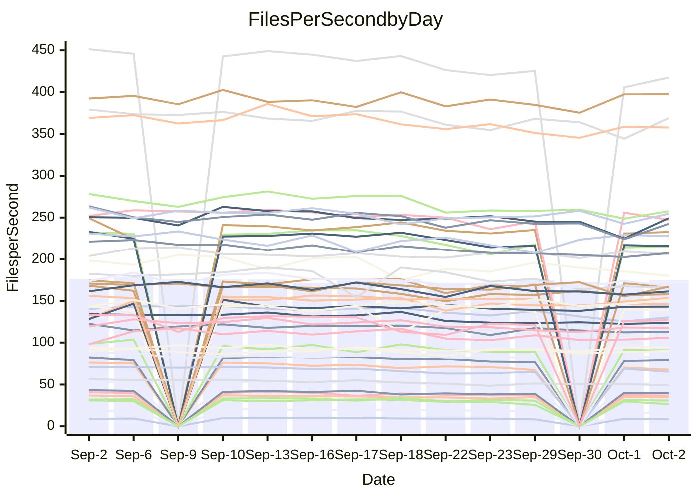

<!---
# This file is auto-generated. Do not edit.
# cspell:disable
--->
# Performance Report

## Daily Performance

## Time to Process Files

| Repository                                      | Elapsed | Min/Avg/Max           |   SD | SD Graph                |
| ----------------------------------------------- | ------: | :-------------------: | ---: | ----------------------- |
| AdaDoom3/AdaDoom3                    |    3.02 | 2.7 /   2.9 /   3.1   | 0.09 | `    ┣━━┻━━╋━━┻●━┫    ` |
| alexiosc/megistos                    |    7.35 | 6.6 /   7.2 /   7.6   | 0.25 | `    ┣━━┻━━╋━●┻━━┫    ` |
| apollographql/apollo-server          |    2.11 | 2.0 /   2.1 /   2.3   | 0.08 | `     ┣━┻━●╋━━┻━┫     ` |
| aspnetboilerplate/aspnetboilerplate  |   11.00 | 10.5 /  10.8 /  11.6  | 0.28 | `    ┣━━┻━━╋━●┻━━┫    ` |
| aws-amplify/docs                     |   11.58 | 10.7 /  11.3 /  12.6  | 0.43 | `    ┣━━┻━━╋━●┻━━┫    ` |
| Azure/azure-rest-api-specs           |   15.37 | 12.9 /  13.8 /  14.8  | 0.50 | `    ┣━━┻━━╋━━┻━━┫   ●` |
| bitjson/typescript-starter           |    0.64 | 0.6 /   0.6 /   0.7   | 0.03 | `     ┣━━┻━╋━●━━┫     ` |
| caddyserver/caddy                    |    3.13 | 2.8 /   3.0 /   3.5   | 0.16 | `    ┣━━┻━━╋━●┻━━┫    ` |
| canada-ca/open-source-logiciel-libre |    0.90 | 0.7 /   0.7 /   0.8   | 0.04 | `     ┣━━┻━╋━┻━━┫    ●` |
| chef/chef                            |    5.36 | 5.1 /   5.4 /   6.0   | 0.22 | `    ┣━━┻━━●━━┻━━┫    ` |
| dart-lang/sdk                        |   55.74 | 55.6 /  58.4 /  70.4  | 3.17 | `  ┣━━━┻●━━╋━━━┻━━━┫  ` |
| django/django                        |   13.77 | 13.0 /  13.6 /  14.3  | 0.32 | `    ┣━━┻━━╋━●┻━━┫    ` |
| eslint/eslint                        |    9.87 | 8.9 /   9.4 /  10.0   | 0.30 | `    ┣━━┻━━╋━━┻━●┫    ` |
| exonum/exonum                        |    2.98 | 2.9 /   3.0 /   3.7   | 0.19 | `    ┣━━┻━●╋━━┻━━┫    ` |
| flutter/samples                      |   17.48 | 13.7 /  14.8 /  18.4  | 1.35 | `   ┣━━━┻━━╋━━┻━━━●   ` |
| gitbucket/gitbucket                  |    3.15 | 2.8 /   3.0 /   3.3   | 0.12 | `    ┣━━┻━━╋━━┻●━┫    ` |
| googleapis/google-cloud-cpp          |  131.54 | 129.1 / 136.3 / 145.8 | 4.08 | `  ┣━━●┻━━━╋━━━┻━━━┫  ` |
| graphql/express-graphql              |    0.71 | 0.6 /   0.7 /   0.8   | 0.04 | `     ┣━┻━━╋━━●━┫     ` |
| graphql/graphql-js                   |    2.04 | 1.9 /   2.1 /   2.2   | 0.09 | `     ┣━┻━●╋━━┻━┫     ` |
| graphql/graphql-relay-js             |    0.71 | 0.6 /   0.7 /   0.7   | 0.03 | `     ┣━┻━━╋━●┻━┫     ` |
| graphql/graphql-spec                 |    0.81 | 0.7 /   0.8 /   1.1   | 0.08 | `     ┣━┻━━╋●━┻━┫     ` |
| iluwatar/java-design-patterns        |   10.96 | 10.3 /  10.8 /  12.5  | 0.48 | `    ┣━━┻━━╋●━┻━━┫    ` |
| ktaranov/sqlserver-kit               |    5.89 | 5.6 /   5.9 /   6.1   | 0.13 | `    ┣━━┻━━╋●━┻━━┫    ` |
| liriliri/licia                       |    3.39 | 3.1 /   3.3 /   3.5   | 0.11 | `    ┣━━┻━━╋━━┻●━┫    ` |
| MartinThoma/LaTeX-examples           |    6.08 | 5.9 /   6.3 /   7.0   | 0.27 | `    ┣━━┻●━╋━━┻━━┫    ` |
| mdx-js/mdx                           |    1.62 | 1.4 /   1.5 /   1.8   | 0.08 | `     ┣━┻━━╋━━●━┫     ` |
| microsoft/TypeScript-Website         |    4.95 | 4.7 /   5.0 /   5.9   | 0.23 | `    ┣━━┻━●╋━━┻━━┫    ` |
| MicrosoftDocs/PowerShell-Docs        |   23.17 | 20.6 /  22.1 /  23.9  | 0.93 | `   ┣━━━┻━━╋━━┻●━━┫   ` |
| neovim/nvim-lspconfig                |    2.91 | 2.6 /   2.7 /   2.9   | 0.12 | `    ┣━━┻━━╋━━┻●━┫    ` |
| pagekit/pagekit                      |    3.25 | 3.0 /   3.1 /   3.3   | 0.09 | `    ┣━━┻━━╋━━┻●━┫    ` |
| php/php-src                          |   23.21 | 23.5 /  24.4 /  26.1  | 0.70 | `   ┣●━━┻━━╋━━┻━━━┫   ` |
| plasticrake/tplink-smarthome-api     |    0.93 | 0.8 /   0.9 /   0.9   | 0.04 | `     ┣━┻━━╋━━┻━●     ` |
| prettier/prettier                    |    6.02 | 5.7 /   5.9 /   6.4   | 0.16 | `    ┣━━┻━━╋●━┻━━┫    ` |
| pycontribs/jira                      |    1.25 | 1.1 /   1.2 /   1.3   | 0.06 | `     ┣━┻━━╋━━●━┫     ` |
| RustPython/RustPython                |    4.39 | 4.0 /   4.4 /   6.1   | 0.41 | `    ┣━━┻━━●━━┻━━┫    ` |
| shoelace-style/shoelace              |    2.37 | 2.1 /   2.3 /   2.5   | 0.12 | `    ┣━━┻━━╋━●┻━━┫    ` |
| SoftwareBrothers/admin-bro           |    2.15 | 1.8 /   1.9 /   2.1   | 0.08 | `     ┣━┻━━╋━━┻━┫ ●   ` |
| sveltejs/svelte                      |   19.44 | 18.1 /  18.9 /  20.3  | 0.53 | `   ┣━━━┻━━╋━━●━━━┫   ` |
| TheAlgorithms/Python                 |    4.99 | 4.7 /   5.0 /   5.5   | 0.22 | `    ┣━━┻━━●━━┻━━┫    ` |
| twbs/bootstrap                       |    1.14 | 1.0 /   1.1 /   1.4   | 0.08 | `     ┣━┻━━╋●━┻━┫     ` |
| typescript-cheatsheets/react         |    1.02 | 1.0 /   1.0 /   1.1   | 0.03 | `     ┣━┻━━●━━┻━┫     ` |
| typescript-eslint/typescript-eslint  |    3.45 | 3.2 /   3.4 /   3.7   | 0.13 | `    ┣━━┻━━╋●━┻━━┫    ` |
| vitest-dev/vitest                    |    7.15 | 6.6 /   7.0 /   7.4   | 0.22 | `    ┣━━┻━━╋━●┻━━┫    ` |
| w3c/aria-practices                   |    2.79 | 2.5 /   2.7 /   3.0   | 0.12 | `    ┣━━┻━━╋━━●━━┫    ` |
| w3c/specberus                        |    1.59 | 1.5 /   1.6 /   2.1   | 0.14 | `    ┣━━┻━━●━━┻━━┫    ` |
| webdeveric/webpack-assets-manifest   |    0.65 | 0.6 /   0.6 /   0.8   | 0.05 | `     ┣━┻━━╋●━┻━┫     ` |
| webpack/webpack                      |    4.74 | 4.1 /   4.4 /   4.8   | 0.18 | `    ┣━━┻━━╋━━┻━━●    ` |
| wireapp/wire-desktop                 |    0.92 | 0.7 /   0.8 /   0.9   | 0.04 | `     ┣━┻━━╋━━┻━┫ ●   ` |
| wireapp/wire-webapp                  |    7.70 | 7.0 /   7.4 /   8.0   | 0.30 | `    ┣━━┻━━╋━━●━━┫    ` |

Note:
- Elapsed time is in seconds.

## Files per Second over Time

| Repository                                      | Files |    Sec |    Fps |     Rel | Trend Fps              |    N |
| ----------------------------------------------- | ----: | -----: | -----: | ------: | ---------------------- | ---: |
| AdaDoom3/AdaDoom3                    |   103 |   3.02 |  34.10 |  -4.26% | `▇▆▇█▇▇▆▇▅▇▅▅▅▄▅▆▆▅`   |   17 |
| alexiosc/megistos                    |   583 |   7.35 |  79.33 |  -1.83% | `▆▅▆▅▆▆▇▅▄█▅▅▅▄▄▄▅▅`   |   17 |
| apollographql/apollo-server          |   250 |   2.11 | 118.37 |   0.68% | `▆▇█▇▇▆█▇▇▇▇▇▆▇▄▆▆▅▄▇` |   20 |
| aspnetboilerplate/aspnetboilerplate  |  2739 |  11.00 | 248.99 |  -1.54% | `▇██▇████▇█▆█▇▆▇▄▆▇▆▆` |   20 |
| aws-amplify/docs                     |  2832 |  11.58 | 244.54 |  -2.55% | `▆▅██▇▇▇▇█▆▇▆▆▇▇▆▆▃▇▆` |   21 |
| Azure/azure-rest-api-specs           |  2426 |  15.37 | 157.84 |  -9.97% | `█▅█▆▇█▇▅▆▆▆▆▆▄▅▅▄▆▆▃` |   21 |
| bitjson/typescript-starter           |    20 |   0.64 |  31.05 |  -2.88% | `▆▇▇████▇▅▅█▃▅▆▅▅▅▅`   |   17 |
| caddyserver/caddy                    |   276 |   3.13 |  88.26 |  -3.86% | `▇█▆███▇▇▄▇▆▅▃▆▆▆▅▅▆▅` |   21 |
| canada-ca/open-source-logiciel-libre |     7 |   0.90 |   7.74 | -17.72% | `▅▆██▇▇▇▇██▆▆▅▆▃▅▆▁`   |   17 |
| chef/chef                            |  1201 |   5.36 | 224.13 |   0.39% | `▇█▆▇▅▅▆▇█▃▅▆▇▇▆▄▆▇█▇` |   21 |
| dart-lang/sdk                        |  9723 |  55.74 | 174.44 |   4.81% | `▇█▇▇█▇██▃▇█▇▆▇▆▇█▅▆█` |   21 |
| django/django                        |  2792 |  13.77 | 202.74 |  -1.53% | `██▇▆▇▆▆▇▄█▆▆▆▅▇▇▆▇▇▆` |   21 |
| eslint/eslint                        |  2016 |   9.87 | 204.20 |  -4.21% | `█▇▆█▅▇▇▆█▆▅▇▅▆▅▅▅▄▆▅` |   21 |
| exonum/exonum                        |   421 |   2.98 | 141.41 |   1.49% | `▇▇▇▇█▇█▆█▇▂▇▇▇▇▇▆▇`   |   17 |
| flutter/samples                      |  2850 |  17.48 | 163.06 |  -8.61% | `▇▇█▇███▇█▅▂█▇█▆▆▅▅▆▅` |   21 |
| gitbucket/gitbucket                  |   411 |   3.15 | 130.53 |  -5.59% | `████▇▇▇▅█▇▇▇▅▇▅▇▅▄▅▅` |   21 |
| googleapis/google-cloud-cpp          | 19694 | 131.54 | 149.72 |   3.72% | `█▅▆▇▆▆▅▄▄▆▆▇▆▆▆█▆▇█▇` |   21 |
| graphql/express-graphql              |    26 |   0.71 |  36.55 |  -5.65% | `█▇▆███▇█▇▃▇▆▅▅▅▅▅▅`   |   17 |
| graphql/graphql-js                   |   333 |   2.04 | 163.23 |   1.12% | `▇▆▇▇▅█▇▇▆▇▆▅▃▃▅▅▆▅▄▆` |   19 |
| graphql/graphql-relay-js             |    28 |   0.71 |  39.18 |  -4.01% | `█▇█▄▆█▇▅█▆▄▅▅▄▄▅▅▄`   |   17 |
| graphql/graphql-spec                 |    15 |   0.81 |  18.55 |  -2.63% | `▅███▇█▇▇█▇▇▇▇▆▆▂▆▆`   |   17 |
| iluwatar/java-design-patterns        |  1838 |  10.96 | 167.69 |  -1.83% | `▇▇▇▇▇▆█▇███▇▃▆▇▇▆▆`   |   17 |
| ktaranov/sqlserver-kit               |   489 |   5.89 |  83.09 |  -0.53% | `██▅▆▆▆▇▆▆▅▇▇▅▆▅▆▆▆▆`  |   18 |
| liriliri/licia                       |  1421 |   3.39 | 419.34 |  -3.77% | `██▇███▇█▇▆▇▅▆▅▆▄▅▅`   |   17 |
| MartinThoma/LaTeX-examples           |  1407 |   6.08 | 231.56 |   3.31% | `▇▆▆▇▆▇▇▇█▅▇▆▆▅▅▅▃▇`   |   17 |
| mdx-js/mdx                           |   144 |   1.62 |  89.11 |  -5.20% | `▇▇█▆▆▄▆▆▇▆▆▃▇▅▅▄▄▅▅▄` |   19 |
| microsoft/TypeScript-Website         |   758 |   4.95 | 153.17 |   1.39% | `▃▆▇▆▆▇▇██▇█▇▇▆▇▇▅▆▇▇` |   19 |
| MicrosoftDocs/PowerShell-Docs        |  2692 |  23.17 | 116.17 |  -4.67% | `▇▆▇▆██▆▆▆▆▇▇▆▅▅▄▃▅▅▄` |   21 |
| neovim/nvim-lspconfig                |   355 |   2.91 | 122.14 |  -6.40% | `▇▇▇▇██▇█▄▇▆█▆▄▄▄▄▄▅▄` |   21 |
| pagekit/pagekit                      |   741 |   3.25 | 228.12 |  -3.74% | `█▄█▆▇▆▅▇▆▇▇▆▆▅▆▅▆▅`   |   17 |
| php/php-src                          |  2211 |  23.21 |  95.26 |   5.07% | `▇▅▄▅▅▇▆▅▆██▇▆▆▆▇▆███` |   21 |
| plasticrake/tplink-smarthome-api     |    62 |   0.93 |  66.81 |  -8.16% | `▇▇▇██▆▇▅▆▇▄▅▆▅▃▅▄▃`   |   17 |
| prettier/prettier                    |  2196 |   6.02 | 364.99 |  -1.14% | `█▇▇▇▇▇▆▅▇█▇▇▆▆▅▇▆▄▇▆` |   20 |
| pycontribs/jira                      |    80 |   1.25 |  64.02 |  -6.22% | `███▇█▇█▇█▆▆█▆▆▃▅▅▇▆▅` |   19 |
| RustPython/RustPython                |   621 |   4.39 | 141.55 |  -0.30% | `▂▇███▆▆█▆▇▇▇▇▇▇▆▆▇▇▇` |   20 |
| shoelace-style/shoelace              |   437 |   2.37 | 184.68 |  -4.50% | `▆█▇█▇▃█▇▇▇█▃▆▅▅▆▅▅▃▅` |   20 |
| SoftwareBrothers/admin-bro           |   441 |   2.15 | 204.99 |  -9.57% | `▇▇▇▇▇█▆▇███▇▅▅▃▅▅▆▃`  |   18 |
| sveltejs/svelte                      |  7455 |  19.44 | 383.47 |  -1.91% | `▇▆▇▇▆▆▇▆▆▇▄▇▅▆▆▆▅▇█▆` |   21 |
| TheAlgorithms/Python                 |  1352 |   4.99 | 270.86 |   1.08% | `▆▅▇▇▇█▆▇▆▇▇▇▄▅▅▅▅▄▃▆` |   21 |
| twbs/bootstrap                       |   120 |   1.14 | 104.93 |  -3.42% | `▇█▇▆▇█▇▇▅█▇█▆▅▅▆▅▅▆▆` |   21 |
| typescript-cheatsheets/react         |    53 |   1.02 |  51.92 |  -0.10% | `▇▆▇▅▇█▅▇▆▇▆▅▅▄▅▅▆▆`   |   17 |
| typescript-eslint/typescript-eslint  |  1247 |   3.45 | 361.31 |  -1.25% | `▆▅▅▇▇███▃▆▇▅▅▅▅▄▄▅▅▅` |   21 |
| vitest-dev/vitest                    |  1801 |   7.15 | 251.87 |  -1.09% | `▅▇█▄▇▅▇▆█▆▆▄▅▅▅▆▇▄▆▆` |   21 |
| w3c/aria-practices                   |   403 |   2.79 | 144.19 |  -3.80% | `█▇█▇▇█▇▅▇█▆▇▃▅▆▅▅▆▆▅` |   20 |
| w3c/specberus                        |   200 |   1.59 | 126.13 |   0.27% | `▇█▅▇▇▇█▇█▇█▆▅▂▆▆▆▇▇▇` |   20 |
| webdeveric/webpack-assets-manifest   |    19 |   0.65 |  29.01 |  -3.08% | `▇▆▇▇▅██▇███▆▆▆▃▆▂▆`   |   17 |
| webpack/webpack                      |  1086 |   4.74 | 229.13 |  -7.91% | `▇▆▇▇█▇█▇▅▇█▇▄▇▇▆▆▃█▄` |   21 |
| wireapp/wire-desktop                 |    43 |   0.92 |  46.97 | -11.94% | `▇█▇█▆█▄█▇█▇▆▅▅▃▅▅▅▅▃` |   21 |
| wireapp/wire-webapp                  |  1227 |   7.70 | 159.39 |  -3.12% | `▇█▅▇█▇▅▆▆█▇▆▄▄▇▅▅▅▆▅` |   21 |

## Data Throughput

| Repository                                      | Files |    Sec |     Kps |     Rel | Trend Kps              |    N |
| ----------------------------------------------- | ----: | -----: | ------: | ------: | ---------------------- | ---: |
| AdaDoom3/AdaDoom3                    |   103 |   3.02 |  724.66 |  -4.26% | `▇▆▇█▇▇▆▇▅▇▅▅▅▄▅▆▆▅`   |   17 |
| alexiosc/megistos                    |   583 |   7.35 |  623.38 |  -1.83% | `▆▅▆▅▆▆▇▅▄█▅▅▅▄▄▄▅▅`   |   17 |
| apollographql/apollo-server          |   250 |   2.11 |  937.92 |   0.68% | `▆▇█▇▇▆█▇▇▇▇▇▆▇▄▆▆▅▄▇` |   20 |
| aspnetboilerplate/aspnetboilerplate  |  2739 |  11.00 |  578.88 |  -3.19% | `▇██▇████▇█▆█▇▆▇▄▅▇▅▆` |   20 |
| aws-amplify/docs                     |  2832 |  11.58 |  816.33 |  -2.14% | `▆▅██▇▇▇▇█▆▇▆▆▇▇▆▆▃▇▆` |   21 |
| Azure/azure-rest-api-specs           |  2426 |  15.37 |  450.69 |  -9.78% | `█▅█▆▇█▇▅▆▇▆▆▆▄▅▅▄▆▇▃` |   21 |
| bitjson/typescript-starter           |    20 |   0.64 |  124.19 |  -2.88% | `▆▇▇████▇▅▅█▃▅▆▅▅▅▅`   |   17 |
| caddyserver/caddy                    |   276 |   3.13 |  718.57 |  -3.64% | `▇█▆███▇▇▄▇▆▆▃▆▇▆▅▆▆▅` |   21 |
| canada-ca/open-source-logiciel-libre |     7 |   0.90 |   64.15 | -17.72% | `▅▆██▇▇▇▇██▆▆▅▆▃▅▆▁`   |   17 |
| chef/chef                            |  1201 |   5.36 | 1028.47 |   0.07% | `▇█▆▇▆▆▆▇█▃▅▆▇▇▆▄▆▇█▇` |   21 |
| dart-lang/sdk                        |  9723 |  55.74 | 1261.44 |   4.56% | `▇█▇▇█▇██▃▇█▇▆▇▆▇█▅▆█` |   21 |
| django/django                        |  2792 |  13.77 | 1240.79 |  -1.38% | `██▇▆▇▆▆▇▄█▆▆▆▅▇▇▆▇▇▆` |   21 |
| eslint/eslint                        |  2016 |   9.87 | 1667.10 |  -4.33% | `█▇▇█▅▇▇▇█▆▅▇▆▇▅▅▅▄▆▅` |   21 |
| exonum/exonum                        |   421 |   2.98 | 1352.62 |   1.49% | `▇▇▇▇█▇█▆█▇▂▇▇▇▇▇▆▇`   |   17 |
| flutter/samples                      |  2850 |  17.48 | 1264.52 |  -5.96% | `▇▇█▇███▇█▅▂█▇█▆▆▆▆▆▅` |   21 |
| gitbucket/gitbucket                  |   411 |   3.15 |  589.78 |  -5.59% | `████▇▇▇▅█▇▇▇▅▇▅▇▅▄▅▅` |   21 |
| googleapis/google-cloud-cpp          | 19694 | 131.54 | 1068.69 |   3.73% | `█▅▆▇▆▆▅▄▄▆▆▇▆▆▆█▆▇█▇` |   21 |
| graphql/express-graphql              |    26 |   0.71 |  167.28 |  -5.65% | `█▇▆███▇█▇▃▇▆▅▅▅▅▅▅`   |   17 |
| graphql/graphql-js                   |   333 |   2.04 |  930.87 |   1.30% | `▇▆▇▇▅█▇▇▆▇▆▅▃▃▅▅▆▅▄▆` |   19 |
| graphql/graphql-relay-js             |    28 |   0.71 |  153.92 |  -4.01% | `█▇█▄▆█▇▅█▆▄▅▅▄▄▅▅▄`   |   17 |
| graphql/graphql-spec                 |    15 |   0.81 |  681.48 |  -2.63% | `▅███▇█▇▇█▇▇▇▇▆▆▂▆▆`   |   17 |
| iluwatar/java-design-patterns        |  1838 |  10.96 |  516.01 |  -1.83% | `▇▇▇▇▇▆█▇███▇▃▆▇▇▆▆`   |   17 |
| ktaranov/sqlserver-kit               |   489 |   5.89 | 1256.83 |  -0.53% | `██▅▆▆▆▇▆▆▅▇▇▅▆▅▆▆▆▆`  |   18 |
| liriliri/licia                       |  1421 |   3.39 |  494.30 |  -3.68% | `██▇███▇█▇▆▇▅▆▅▆▄▅▅`   |   17 |
| MartinThoma/LaTeX-examples           |  1407 |   6.08 |  478.59 |   3.31% | `▇▆▆▇▆▇▇▇█▅▇▆▆▅▅▅▃▇`   |   17 |
| mdx-js/mdx                           |   144 |   1.62 |  408.44 |  -4.98% | `▇▇█▆▆▄▆▆▇▆▆▃▇▅▅▄▄▅▅▄` |   19 |
| microsoft/TypeScript-Website         |   758 |   4.95 | 1048.13 |   1.31% | `▃▆▇▆▆▇▇██▇█▇▇▆▇▇▅▆▇▇` |   19 |
| MicrosoftDocs/PowerShell-Docs        |  2692 |  23.17 | 1186.99 |  -4.72% | `▇▆▇▆██▆▆▆▆▇▇▆▅▅▄▃▅▅▄` |   21 |
| neovim/nvim-lspconfig                |   355 |   2.91 |  319.62 |  -6.81% | `▇▇█▇██▇█▄▇▆█▆▄▄▄▄▄▅▄` |   21 |
| pagekit/pagekit                      |   741 |   3.25 |  475.65 |  -3.74% | `█▄█▆▇▆▅▇▆▇▇▆▆▅▆▅▆▅`   |   17 |
| php/php-src                          |  2211 |  23.21 | 1390.76 |   5.13% | `▇▅▄▅▅▇▆▅▆██▇▆▆▆▇▆███` |   21 |
| plasticrake/tplink-smarthome-api     |    62 |   0.93 |  361.00 |  -8.16% | `▇▇▇██▆▇▅▆▇▄▅▆▅▃▅▄▃`   |   17 |
| prettier/prettier                    |  2196 |   6.02 |  508.92 |  -1.10% | `█▇▇▇▇▇▆▅▇█▇▇▆▆▅▇▆▄▇▆` |   20 |
| pycontribs/jira                      |    80 |   1.25 |  440.92 |  -6.23% | `███▇█▇█▇█▆▆█▆▆▃▅▅▇▆▅` |   19 |
| RustPython/RustPython                |   621 |   4.39 | 1041.93 |  -0.05% | `▂▇███▆▆█▆▇▇▇▇▇▇▆▆▇▇▇` |   20 |
| shoelace-style/shoelace              |   437 |   2.37 |  877.35 |  -3.95% | `▆█▇▇▇▃█▇▇▇█▃▆▅▅▇▆▅▃▅` |   20 |
| SoftwareBrothers/admin-bro           |   441 |   2.15 |  451.81 |  -9.66% | `▇▇▇▇▇█▆▇███▇▅▅▃▅▅▆▃`  |   18 |
| sveltejs/svelte                      |  7455 |  19.44 |  276.33 |  -2.15% | `▇▆█▇▆▆▇▆▆▇▄▇▅▆▆▆▅▇█▆` |   21 |
| TheAlgorithms/Python                 |  1352 |   4.99 |  684.57 |   0.80% | `▆▅▇▇▇█▆▇▆▇▇▇▅▅▅▅▅▄▃▆` |   21 |
| twbs/bootstrap                       |   120 |   1.14 |  840.34 |  -3.42% | `▇█▇▆▇█▇▇▅█▇█▆▅▅▆▅▅▆▆` |   21 |
| typescript-cheatsheets/react         |    53 |   1.02 |  379.09 |  -0.10% | `▇▆▇▅▇█▅▇▆▇▆▅▅▄▅▅▆▆`   |   17 |
| typescript-eslint/typescript-eslint  |  1247 |   3.45 | 1681.37 |  -0.66% | `▆▅▅▇▇███▃▆▇▅▅▅▅▅▄▅▅▆` |   21 |
| vitest-dev/vitest                    |  1801 |   7.15 |  513.12 |  -1.86% | `▅▇█▄▇▅▇▆█▆▆▄▅▅▅▆▆▄▆▅` |   21 |
| w3c/aria-practices                   |   403 |   2.79 | 1344.20 |  -3.62% | `█▇█▇▇▇▇▅▇█▆▇▃▅▆▅▅▆▆▅` |   20 |
| w3c/specberus                        |   200 |   1.59 |  402.37 |   0.27% | `▇█▅▇▇▇█▇█▇█▆▅▂▆▆▆▇▇▇` |   20 |
| webdeveric/webpack-assets-manifest   |    19 |   0.65 |  155.73 |  -3.08% | `▇▆▇▇▅██▇███▆▆▆▃▆▂▆`   |   17 |
| webpack/webpack                      |  1086 |   4.74 |  996.28 |  -7.82% | `▇▆▇▇█▇█▇▅▇█▇▄▇▇▆▆▃█▄` |   21 |
| wireapp/wire-desktop                 |    43 |   0.92 |  206.43 | -11.92% | `▇█▇█▆█▄█▇█▇▆▅▅▃▅▅▅▅▃` |   21 |
| wireapp/wire-webapp                  |  1227 |   7.70 |  674.45 |  -3.19% | `▇█▅▇█▇▅▆▆█▇▆▄▄▇▅▅▅▆▅` |   21 |

