<!---
# This file is auto-generated. Do not edit.
# cspell:disable
--->
# Performance Report

## Daily Performance

```mermaid
xychart-beta
    title Files Per Second by Day
    y-axis Files per Second
    x-axis Date [Nov-6, Nov-7, Nov-8, Nov-9, Nov-10, Nov-12, Nov-17, Nov-19, Nov-22, Nov-23, Nov-25, Nov-26, Nov-27, Nov-28, Dec-2, Dec-5, Dec-6]
    bar [180.02, 181.19, 180.85, 185.26, 182.11, 183.02, 179.67, 181.22, 181.55, 184.70, 192.57, 183.27, 184.75, 182.79, 184.99, 180.86, 182.42]
    line [117.50, 115.81, 118.63, 116.72, 116.49, 116.48, 117.45, 112.12, 117.70, 117.75, 118.80, 116.72, 112.25, 111.37, 118.51, 115.50, 115.87]
    line [30.49, 31.24, 30.45, 31.85, 30.57, 31.13, 30.89, 30.94, 31.34, 30.76, 0.00, 30.81, 30.58, 31.64, 29.90, 30.63, 31.36]
    line [94.84, 93.87, 94.75, 84.15, 93.85, 94.70, 94.62, 92.44, 90.51, 94.24, 0.00, 91.28, 92.74, 93.28, 95.50, 92.21, 94.67]
    line [91.37, 92.01, 91.93, 94.57, 93.46, 93.94, 91.73, 87.45, 91.05, 94.79, 93.97, 94.67, 91.62, 92.04, 86.62, 91.97, 93.82]
    line [189.74, 189.19, 183.94, 184.74, 191.91, 183.56, 186.00, 187.01, 192.19, 191.67, 0.00, 182.52, 184.50, 184.37, 180.13, 182.27, 185.97]
    line [39.64, 39.74, 38.81, 37.90, 39.54, 38.73, 39.95, 40.00, 37.29, 39.41, 0.00, 39.61, 38.93, 39.59, 39.21, 38.95, 39.16]
    line [133.45, 139.44, 136.40, 136.32, 131.65, 134.94, 137.19, 136.33, 132.82, 127.42, 141.81, 137.38, 133.61, 136.04, 138.47, 135.71, 138.36]
    line [37.57, 37.08, 36.63, 38.88, 36.70, 37.54, 37.45, 37.05, 37.59, 38.10, 0.00, 36.55, 37.13, 38.36, 37.28, 36.55, 36.94]
    line [69.24, 70.59, 70.35, 69.51, 68.69, 67.71, 70.32, 71.50, 69.84, 71.46, 0.00, 68.63, 69.18, 70.98, 71.07, 70.27, 72.65]
    line [149.97, 157.16, 151.98, 154.79, 156.47, 154.38, 143.43, 149.38, 154.11, 161.15, 140.96, 153.09, 157.58, 151.62, 150.61, 153.46, 148.08]
    line [216.75, 222.44, 224.03, 222.14, 214.23, 209.04, 218.60, 212.59, 214.66, 226.79, 0.00, 213.37, 216.21, 222.03, 191.91, 211.40, 225.62]
    line [227.06, 227.82, 230.59, 232.99, 231.54, 235.20, 225.87, 229.42, 231.39, 232.22, 233.95, 231.55, 229.52, 231.73, 230.37, 226.75, 238.77]
    line [9.20, 9.09, 9.19, 9.27, 8.92, 9.14, 9.18, 8.84, 9.32, 9.24, 0.00, 9.27, 9.05, 9.13, 9.38, 8.86, 9.19]
    line [35.63, 36.38, 37.15, 37.84, 35.87, 36.08, 37.20, 36.20, 36.44, 36.12, 0.00, 36.09, 35.82, 35.94, 35.10, 36.40, 35.75]
    line [139.88, 142.79, 144.44, 140.29, 132.61, 142.45, 144.07, 134.61, 146.19, 141.96, 0.00, 142.52, 141.79, 143.85, 132.83, 138.36, 145.16]
    line [421.51, 412.86, 422.15, 414.20, 436.61, 418.89, 419.72, 418.60, 416.16, 419.91, 420.14, 425.45, 413.25, 414.49, 414.13, 417.32, 417.87]
    line [65.51, 63.67, 64.87, 66.76, 67.56, 66.97, 68.98, 66.79, 63.49, 65.54, 67.63, 65.16, 64.17, 67.20, 67.10, 64.34, 65.01]
    line [126.48, 129.06, 126.84, 130.40, 128.50, 126.86, 127.39, 128.53, 129.02, 122.85, 124.15, 127.61, 128.38, 128.27, 127.96, 123.07, 128.36]
    line [172.53, 170.03, 165.93, 170.87, 155.75, 175.08, 172.86, 174.82, 173.87, 168.75, 0.00, 168.42, 172.41, 165.34, 178.00, 170.24, 174.62]
    line [234.98, 230.05, 223.17, 216.85, 227.77, 231.99, 238.91, 233.06, 237.44, 231.81, 0.00, 229.54, 227.35, 233.78, 239.72, 236.67, 242.41]
    line [83.88, 83.68, 89.12, 87.30, 84.78, 87.41, 87.06, 86.68, 84.68, 84.66, 0.00, 86.16, 86.09, 86.12, 86.10, 84.45, 86.85]
    line [260.25, 268.67, 265.98, 276.77, 250.02, 272.22, 269.63, 262.78, 266.27, 264.63, 265.39, 262.12, 264.70, 259.96, 267.12, 267.54, 261.60]
    line [18.55, 18.73, 18.36, 18.35, 19.12, 18.64, 18.32, 18.95, 18.34, 18.44, 18.84, 18.37, 18.41, 18.93, 18.48, 17.91, 18.52]
    line [195.00, 206.27, 202.50, 195.41, 214.93, 208.44, 206.40, 204.90, 203.63, 207.69, 210.97, 200.63, 206.29, 201.28, 203.16, 197.69, 205.56]
    line [149.93, 152.49, 155.90, 160.36, 152.28, 150.06, 152.05, 158.28, 146.52, 158.85, 0.00, 155.81, 155.95, 156.73, 153.23, 152.74, 150.88]
    line [363.96, 367.65, 347.60, 375.37, 367.87, 367.07, 371.79, 359.89, 353.22, 368.32, 374.93, 365.77, 365.67, 369.95, 352.91, 358.41, 370.56]
    line [243.11, 246.73, 252.50, 246.24, 251.54, 252.31, 250.79, 249.89, 259.20, 257.89, 248.21, 247.03, 244.22, 263.12, 252.89, 247.30, 238.91]
    line [166.04, 167.77, 170.78, 172.83, 169.54, 170.69, 168.51, 170.43, 152.49, 164.76, 169.85, 169.02, 158.91, 164.95, 167.24, 171.12, 163.98]
    line [213.21, 213.46, 209.61, 218.80, 218.08, 206.42, 211.56, 214.70, 201.32, 208.63, 216.56, 211.21, 211.52, 202.80, 207.87, 211.25, 214.29]
    line [147.15, 159.42, 156.12, 164.10, 153.25, 158.83, 162.50, 155.26, 161.99, 161.00, 160.02, 155.33, 155.60, 159.85, 157.03, 158.70, 160.32]
    line [105.44, 103.31, 109.90, 104.67, 104.85, 104.85, 102.15, 102.24, 108.41, 107.84, 102.72, 107.24, 107.62, 105.35, 104.37, 103.06, 105.64]
    line [226.89, 231.20, 232.42, 233.76, 216.82, 232.75, 231.73, 227.11, 220.77, 232.83, 0.00, 226.61, 230.78, 225.94, 228.40, 228.42, 235.98]
    line [246.70, 252.56, 252.48, 253.34, 246.50, 250.04, 248.32, 248.40, 243.10, 246.46, 253.84, 244.86, 252.77, 242.22, 250.75, 244.77, 249.57]
    line [82.15, 84.55, 84.56, 84.50, 82.79, 84.08, 81.67, 82.81, 81.19, 83.62, 0.00, 81.43, 78.64, 84.26, 78.88, 82.13, 83.39]
    line [104.36, 102.75, 108.04, 105.75, 108.53, 107.61, 103.87, 104.59, 104.39, 110.58, 106.99, 105.01, 108.35, 107.81, 104.02, 106.94, 104.99]
    line [393.69, 403.73, 402.78, 401.18, 398.88, 404.51, 401.52, 385.51, 402.83, 398.10, 400.47, 401.59, 405.72, 393.85, 407.78, 396.11, 412.42]
    line [368.55, 361.63, 363.56, 361.00, 364.43, 360.15, 365.05, 367.22, 354.80, 363.64, 373.17, 364.09, 364.55, 368.33, 360.08, 369.35, 368.90]
    line [116.47, 124.25, 122.72, 125.93, 124.62, 120.74, 122.33, 123.30, 126.42, 130.12, 126.69, 118.47, 125.05, 124.39, 115.88, 118.39, 119.81]
    line [49.63, 49.77, 48.97, 50.50, 48.94, 50.11, 50.42, 50.32, 51.47, 51.26, 50.21, 50.12, 50.94, 45.60, 50.75, 50.03, 49.80]
    line [124.93, 127.28, 124.63, 124.24, 125.03, 125.24, 123.48, 121.57, 127.94, 124.68, 128.18, 123.81, 124.58, 126.05, 121.44, 124.27, 122.27]
    line [260.33, 260.40, 262.23, 265.71, 267.34, 258.77, 260.78, 261.46, 264.14, 258.29, 259.88, 261.65, 261.27, 259.85, 259.59, 261.91, 256.38]
    line [171.14, 173.72, 175.33, 180.56, 166.86, 160.67, 171.35, 173.67, 163.99, 174.13, 171.44, 171.10, 169.17, 169.92, 156.42, 166.33, 173.70]
    line [29.13, 28.68, 28.99, 28.78, 28.56, 28.81, 27.61, 29.00, 27.12, 28.69, 0.00, 29.62, 29.42, 28.97, 30.07, 28.83, 29.04]
    line [51.10, 52.20, 48.34, 51.40, 48.84, 50.71, 51.87, 51.27, 48.95, 50.74, 51.36, 50.08, 50.94, 50.51, 51.36, 50.85, 53.51]
    line [168.96, 172.75, 170.15, 173.41, 171.14, 167.37, 166.50, 171.04, 166.81, 168.79, 172.43, 172.30, 165.40, 170.85, 167.09, 169.78, 169.21]
    line [145.92, 145.09, 140.71, 145.23, 139.03, 143.66, 147.67, 143.64, 145.07, 148.78, 145.20, 139.52, 142.17, 141.34, 138.40, 144.20, 144.71]
    line [175.85, 174.73, 178.68, 179.16, 176.80, 173.86, 176.80, 174.52, 178.44, 183.84, 176.75, 178.41, 176.49, 178.04, 178.10, 172.07, 178.26]
    line [242.75, 238.83, 237.46, 245.31, 238.15, 238.92, 243.36, 234.75, 243.01, 243.28, 229.25, 233.06, 241.24, 236.91, 240.36, 239.27, 231.52]
    line [160.59, 159.17, 156.54, 166.82, 162.10, 163.95, 153.46, 157.33, 159.29, 160.15, 167.27, 163.00, 166.53, 160.28, 164.60, 161.29, 159.50]
    line [0.00, 0.00, 0.00, 0.00, 0.00, 0.00, 216.65, 210.39, 209.57, 206.62, 225.23, 216.74, 223.01, 218.30, 218.24, 211.89, 221.99]
```

## Time to Process Files

| Repository                                      | Elapsed | Min/Avg/Max           |   SD | SD Graph                |
| ----------------------------------------------- | ------: | :-------------------: | ---: | ----------------------- |
| AdaDoom3/AdaDoom3                    |    2.88 | 2.6 /   2.8 /   3.1   | 0.09 | `     ┣━┻━━╋●━┻━┫     ` |
| alexiosc/megistos                    |    6.71 | 6.4 /   6.8 /   7.5   | 0.22 | `    ┣━━┻━●╋━━┻━━┫    ` |
| apollographql/apollo-server          |    2.17 | 2.1 /   2.2 /   2.5   | 0.07 | `     ┣━┻━━●━━┻━┫     ` |
| aspnetboilerplate/aspnetboilerplate  |    9.40 | 8.5 /   9.0 /   9.8   | 0.27 | `    ┣━━┻━━╋━━┻●━┫    ` |
| aws-amplify/docs                     |   11.46 | 11.0 /  11.5 /  12.3  | 0.28 | `    ┣━━┻━━●━━┻━━┫    ` |
| Azure/azure-rest-api-specs           |   13.87 | 13.7 /  14.4 /  16.5  | 0.54 | `    ┣━━●━━╋━━┻━━┫    ` |
| bitjson/typescript-starter           |    0.64 | 0.6 /   0.6 /   0.7   | 0.02 | `     ┣━━●━╋━┻━━┫     ` |
| caddyserver/caddy                    |    2.97 | 2.9 /   3.0 /   3.3   | 0.10 | `    ┣━━┻●━╋━━┻━━┫    ` |
| canada-ca/open-source-logiciel-libre |    0.76 | 0.7 /   0.8 /   0.9   | 0.02 | `     ┣━━┻●╋━┻━━┫     ` |
| chef/chef                            |    5.04 | 5.0 /   5.2 /   5.6   | 0.15 | `    ┣━●┻━━╋━━┻━━┫    ` |
| dart-lang/sdk                        |   55.90 | 52.2 /  56.2 /  59.4  | 1.53 | `   ┣━━┻━━●╋━━━┻━━┫   ` |
| django/django                        |   13.68 | 13.0 /  13.8 /  15.5  | 0.58 | `    ┣━━┻━●╋━━┻━━┫    ` |
| eslint/eslint                        |    9.47 | 8.9 /   9.6 /  10.4   | 0.34 | `    ┣━━┻━●╋━━┻━━┫    ` |
| exonum/exonum                        |    2.90 | 2.9 /   3.0 /   3.4   | 0.12 | `    ┣━━┻●━╋━━┻━━┫    ` |
| flutter/samples                      |   16.40 | 15.0 /  16.4 /  19.1  | 0.70 | `   ┣━━━┻━━●━━┻━━━┫   ` |
| gitbucket/gitbucket                  |    2.97 | 2.9 /   3.0 /   3.2   | 0.08 | `     ┣━┻●━╋━━┻━┫     ` |
| googleapis/google-cloud-cpp          |  123.79 | 117.0 / 123.0 / 160.5 | 7.01 | `  ┣━━━┻━━━●━━━┻━━━┫  ` |
| graphql/express-graphql              |    0.70 | 0.7 /   0.7 /   0.7   | 0.02 | `     ┣━━┻━╋●┻━━┫     ` |
| graphql/graphql-js                   |    2.11 | 2.0 /   2.2 /   2.5   | 0.10 | `     ┣━┻━●╋━━┻━┫     ` |
| graphql/graphql-relay-js             |    0.72 | 0.7 /   0.7 /   0.8   | 0.02 | `     ┣━━┻━●━┻━━┫     ` |
| graphql/graphql-spec                 |    0.81 | 0.8 /   0.8 /   0.9   | 0.02 | `     ┣━━┻━●━┻━━┫     ` |
| iluwatar/java-design-patterns        |   10.59 | 10.3 /  10.8 /  11.8  | 0.37 | `    ┣━━┻●━╋━━┻━━┫    ` |
| ktaranov/sqlserver-kit               |    5.86 | 5.7 /   5.9 /   6.5   | 0.18 | `    ┣━━┻━●╋━━┻━━┫    ` |
| liriliri/licia                       |    3.43 | 3.2 /   3.4 /   3.6   | 0.08 | `     ┣━┻━━╋●━┻━┫     ` |
| MartinThoma/LaTeX-examples           |    5.97 | 6.0 /   6.2 /   6.5   | 0.14 | `    ┣━●┻━━╋━━┻━━┫    ` |
| mdx-js/mdx                           |    1.50 | 1.5 /   1.5 /   1.7   | 0.05 | `     ┣━┻━●╋━━┻━┫     ` |
| microsoft/TypeScript-Website         |    5.11 | 4.7 /   5.0 /   6.4   | 0.27 | `    ┣━━┻━━╋●━┻━━┫    ` |
| MicrosoftDocs/PowerShell-Docs        |   18.60 | 17.1 /  19.4 /  24.4  | 1.87 | `   ┣━━━┻━●╋━━┻━━━┫   ` |
| neovim/nvim-lspconfig                |    2.87 | 2.8 /   2.9 /   3.2   | 0.08 | `     ┣━┻━●╋━━┻━┫     ` |
| pagekit/pagekit                      |    3.06 | 2.9 /   3.2 /   3.6   | 0.13 | `    ┣━━●━━╋━━┻━━┫    ` |
| php/php-src                          |   21.06 | 19.9 /  20.9 /  23.1  | 0.74 | `   ┣━━━┻━━╋●━┻━━━┫   ` |
| plasticrake/tplink-smarthome-api     |    0.85 | 0.8 /   0.9 /   0.9   | 0.02 | `     ┣●━┻━╋━┻━━┫     ` |
| prettier/prettier                    |    5.90 | 5.9 /   6.1 /   6.7   | 0.17 | `    ┣━━●━━╋━━┻━━┫    ` |
| pycontribs/jira                      |    1.23 | 1.1 /   1.2 /   1.4   | 0.05 | `     ┣━┻━━╋●━┻━┫     ` |
| RustPython/RustPython                |    4.12 | 3.9 /   4.0 /   4.4   | 0.13 | `    ┣━━┻━━╋━●┻━━┫    ` |
| shoelace-style/shoelace              |    2.35 | 2.3 /   2.4 /   2.5   | 0.06 | `     ┣━┻━━●━━┻━┫     ` |
| slint-ui/slint                       |    8.73 | 8.4 /   9.0 /   9.9   | 0.38 | `    ┣━━┻●━╋━━┻━━┫    ` |
| SoftwareBrothers/admin-bro           |    1.95 | 1.9 /   2.0 /   2.3   | 0.09 | `     ┣━●━━╋━━┻━┫     ` |
| sveltejs/svelte                      |   17.18 | 16.9 /  18.9 /  20.9  | 0.71 | `  ●┣━━━┻━━╋━━┻━━━┫   ` |
| TheAlgorithms/Python                 |    5.20 | 4.9 /   5.1 /   5.5   | 0.16 | `    ┣━━┻━━╋●━┻━━┫    ` |
| twbs/bootstrap                       |    1.14 | 1.1 /   1.1 /   1.3   | 0.05 | `     ┣━┻━●╋━━┻━┫     ` |
| typescript-cheatsheets/react         |    1.06 | 1.0 /   1.1 /   1.2   | 0.04 | `     ┣━┻━━●━━┻━┫     ` |
| typescript-eslint/typescript-eslint  |    3.44 | 3.3 /   3.5 /   3.7   | 0.07 | `     ┣━┻━●╋━━┻━┫     ` |
| vitest-dev/vitest                    |    7.34 | 6.7 /   7.1 /   7.7   | 0.20 | `    ┣━━┻━━╋━━●━━┫    ` |
| w3c/aria-practices                   |    2.78 | 2.7 /   2.8 /   3.2   | 0.09 | `     ┣━┻━●╋━━┻━┫     ` |
| w3c/specberus                        |    1.64 | 1.6 /   1.6 /   1.8   | 0.04 | `     ┣━┻━━╋━●┻━┫     ` |
| webdeveric/webpack-assets-manifest   |    0.65 | 0.6 /   0.7 /   0.7   | 0.02 | `     ┣━━┻●╋━┻━━┫     ` |
| webpack/webpack                      |    4.73 | 4.4 /   4.6 /   4.9   | 0.11 | `    ┣━━┻━━╋━━┻●━┫    ` |
| wireapp/wire-desktop                 |    0.80 | 0.8 /   0.8 /   1.0   | 0.03 | `     ┣━●┻━╋━┻━━┫     ` |
| wireapp/wire-webapp                  |    7.66 | 7.3 /   7.6 /   8.2   | 0.21 | `    ┣━━┻━━╋●━┻━━┫    ` |

Note:
- Elapsed time is in seconds.

## Files per Second over Time

| Repository                                      | Files |    Sec |    Fps |    Rel | Trend Fps              |    N |
| ----------------------------------------------- | ----: | -----: | -----: | -----: | ---------------------- | ---: |
| AdaDoom3/AdaDoom3                    |   103 |   2.88 |  35.75 | -1.43% | `▆▇▇▆▆▇█▇▆▆█▆█▆███▄█▇` |   40 |
| alexiosc/megistos                    |   583 |   6.71 |  86.85 |  1.19% | `▇▆▆▇█▇▇▅█▆▇▇▇▇▇▇▇▆▄▇` |   40 |
| apollographql/apollo-server          |   251 |   2.17 | 115.87 | -0.02% | `██▇▇██▇▆▇▅▆▆███▇▆█▇▇` |   42 |
| aspnetboilerplate/aspnetboilerplate  |  2246 |   9.40 | 238.91 | -4.19% | `▇▇▆▇▅▇▅▆▇▆▃▇█▆▆▇▄▆▆▅` |   41 |
| aws-amplify/docs                     |  2859 |  11.46 | 249.57 |  0.58% | `▇█▇█▅▆▇█▇█▄█▇██▅▆▆▇▇` |   42 |
| Azure/azure-rest-api-specs           |  2410 |  13.87 | 173.70 |  2.43% | `█████▆██▇▆▇█▅▄█▇▆▆▇█` |   42 |
| bitjson/typescript-starter           |    20 |   0.64 |  31.36 |  1.66% | `▇▇▆▅▇▇▇▆▆▄█▆█▅▇▆▄▆▇▇` |   40 |
| caddyserver/caddy                    |   279 |   2.97 |  93.82 |  2.16% | `█▇█▇▇███▆▆▇▆▅▄▆▇▆▆█▇` |   42 |
| canada-ca/open-source-logiciel-libre |     7 |   0.76 |   9.19 |  0.99% | `▇█▇▇██▇▇▆▇▇▆██▆▆▆█▅▇` |   40 |
| chef/chef                            |  1204 |   5.04 | 238.77 |  3.96% | `▇▇▇▇▇▆▇▇▅▇▅█▆▇▇▆▅▄▇█` |   42 |
| dart-lang/sdk                        |  9965 |  55.90 | 178.26 |  1.16% | `█▆▇▇▇█▆▅█▇▇▇▇▆▅▄▇▆▅▇` |   42 |
| django/django                        |  2813 |  13.68 | 205.56 |  1.26% | `███▆▇█▃▇██▆▇▆█▇▇▃▆▇▇` |   42 |
| eslint/eslint                        |  2030 |   9.47 | 214.29 |  1.48% | `▆▇▇▅▇▅▇▆▇▇▆▄▅▇█▆▇▇▅▇` |   42 |
| exonum/exonum                        |   421 |   2.90 | 145.16 |  3.13% | `▃█▇▇█▆█▇▆██▇█▅█▇▅█▅█` |   40 |
| flutter/samples                      |  2689 |  16.40 | 163.98 | -2.29% | `▆▇▇▇▇▆▆▇▃▆▅▇▇▆█▆▇▇▇▆` |   42 |
| gitbucket/gitbucket                  |   411 |   2.97 | 138.36 |  1.78% | `▄█▇▇█▇▅▇▆▄▇▆▇▇▇▇▆▆▇▇` |   42 |
| googleapis/google-cloud-cpp          | 19744 | 123.79 | 159.50 | -0.82% | `▇█▆██▇████▇▇█▇█▇▇▇▆▇` |   42 |
| graphql/express-graphql              |    26 |   0.70 |  36.94 | -0.68% | `▇▇█▆▇▅█▄▆█▆██▇▆▅▄█▆▆` |   40 |
| graphql/graphql-js                   |   339 |   2.11 | 160.32 |  2.06% | `██▇█▅▆█▇▆█▅▇▇▇█▆██▇▇` |   41 |
| graphql/graphql-relay-js             |    28 |   0.72 |  39.16 | -0.46% | `▇▄▆▇█▅▆▇▆▆▅▇▆▆▇▄▆▇▆▆` |   40 |
| graphql/graphql-spec                 |    15 |   0.81 |  18.52 |  0.15% | `▇▇█▆▇▆▇▇▆█▇██▇▆▅▄▆▇▇` |   41 |
| iluwatar/java-design-patterns        |  1849 |  10.59 | 174.62 |  2.07% | `▇▆▅▄▇▇█▆▇▇▄▇██▆▆▇▅▇▇` |   41 |
| ktaranov/sqlserver-kit               |   489 |   5.86 |  83.39 |  1.24% | `▇▆▇█▆▇█▄▇▅▄▇█▅▆▇▆█▇▇` |   40 |
| liriliri/licia                       |  1434 |   3.43 | 417.87 | -0.26% | `▆▆▆▄▆▅█▄▆▆▆▅▆▄▆▆▅▆▄▅` |   42 |
| MartinThoma/LaTeX-examples           |  1409 |   5.97 | 235.98 |  3.14% | `▇▅█▆▇▅▆█▇▆█▅█▇▇▇▆▇▇█` |   40 |
| mdx-js/mdx                           |   142 |   1.50 |  94.67 |  1.71% | `▅▆█▆▇▅▇█▇█▆▇▇██▅▇▇██` |   40 |
| microsoft/TypeScript-Website         |   757 |   5.11 | 148.08 | -2.65% | `▇█▅▇▇▇▇▇▇▇█▇▆▆▇█▆▇▅▆` |   41 |
| MicrosoftDocs/PowerShell-Docs        |  2229 |  18.60 | 119.81 | -1.38% | `█▇▅▇▅▄▅▇▇▇▆▇▄▅▇▇▃▅▅▆` |   42 |
| neovim/nvim-lspconfig                |   369 |   2.87 | 128.36 |  1.02% | `▆▆▆▇▇█▇▇▇██▇▇▇▆▇▄▆▆▇` |   42 |
| pagekit/pagekit                      |   741 |   3.06 | 242.41 |  4.32% | `▆▇▆▇▆▃▇▅▆▄▆▅▇▇▆▅▇█▇▇` |   40 |
| php/php-src                          |  2211 |  21.06 | 104.99 | -0.76% | `█▇▇▃▆██▇▇▇▇▇▆▆▇▆▆▆█▆` |   42 |
| plasticrake/tplink-smarthome-api     |    62 |   0.85 |  72.65 |  3.99% | `▇▆▇▅▆▅▅▅▆▅▆▆▇▆█▅▆▅▅▇` |   40 |
| prettier/prettier                    |  2187 |   5.90 | 370.56 |  1.82% | `▇█▇█▇▇▇▇▇▇██▅▇██▇▅▅█` |   42 |
| pycontribs/jira                      |    80 |   1.23 |  65.01 | -1.30% | `▆▇▆▆▆▆▆▅▃█▇▇▇▆▆▆▆▄▆▆` |   42 |
| RustPython/RustPython                |   621 |   4.12 | 150.88 | -1.95% | `▅█▇▇██▆█▆█▇█▆▇██▇▄▆▆` |   41 |
| shoelace-style/shoelace              |   437 |   2.35 | 185.97 |  0.27% | `██▆▅▇▆▇▆▆▇▇▆▆▅▅█▇▆▄▇` |   41 |
| slint-ui/slint                       |  1937 |   8.73 | 221.99 |  3.02% | `▅▇▆▇▇▆▄▆▇▇▅█▅▇▄▅▅▇▇▇` |   27 |
| SoftwareBrothers/admin-bro           |   441 |   1.95 | 225.62 |  4.69% | `▇▆██▇▃█▆▇▇▅▇█▃▇▆▆▅▅█` |   40 |
| sveltejs/svelte                      |  7084 |  17.18 | 412.42 |  3.33% | `▆▇▇▇▆▇▇▇▇▇▆▆█▆▇▆▆▇▄█` |   42 |
| TheAlgorithms/Python                 |  1360 |   5.20 | 261.60 | -1.42% | `▆▇▇▆▅▆█▇▇▆▅▇█▆▇▇▇▆█▆` |   42 |
| twbs/bootstrap                       |   120 |   1.14 | 105.64 |  0.69% | `▇▇▆▇▆█▇▆█▆█▇▆▆▆▅▅█▇▇` |   41 |
| typescript-cheatsheets/react         |    53 |   1.06 |  49.80 | -0.27% | `██▇▇▇▆▇▇▇██▆▃▇█▆▇▆▇▇` |   41 |
| typescript-eslint/typescript-eslint  |  1270 |   3.44 | 368.90 |  1.07% | `▇█▅█▆██▇▇▇▇█▆▇▇█████` |   42 |
| vitest-dev/vitest                    |  1883 |   7.34 | 256.38 | -1.83% | `▆▆▆█▆▆▅▆▆▇▅▇▅▇██▄▆▆▆` |   42 |
| w3c/aria-practices                   |   403 |   2.78 | 144.71 |  0.80% | `▇█▇▃▆▇▇▇▇▇▆▆▇▆▇▇▇█▇▇` |   41 |
| w3c/specberus                        |   200 |   1.64 | 122.27 | -1.73% | `▇█▇▇▇▆▇█▇▆█▆█▄▆█▆▇▇▆` |   42 |
| webdeveric/webpack-assets-manifest   |    19 |   0.65 |  29.04 |  0.57% | `▇▅▇█▇▇█▇▇▇█▇▇█▇▇▆▆▇▇` |   40 |
| webpack/webpack                      |  1095 |   4.73 | 231.52 | -3.06% | `▇▅▇▅▆▆▄▇█▇▆▆▆█▇▆▆▇▇▅` |   42 |
| wireapp/wire-desktop                 |    43 |   0.80 |  53.51 |  5.27% | `▇▇▇▇▇▃▇▅▇█▆▆▇▇▅▇▇▇▇█` |   42 |
| wireapp/wire-webapp                  |  1296 |   7.66 | 169.21 | -0.21% | `▆▇▆▇███▆▇▄▆▇▄█▆▇▆▆█▆` |   42 |

## Data Throughput

| Repository                                      | Files |    Sec |     Kps |    Rel | Trend Kps              |    N |
| ----------------------------------------------- | ----: | -----: | ------: | -----: | ---------------------- | ---: |
| AdaDoom3/AdaDoom3                    |   103 |   2.88 |  759.81 | -1.43% | `▆▇▇▆▆▇█▇▆▆█▆█▆███▄█▇` |   40 |
| alexiosc/megistos                    |   583 |   6.71 |  682.44 |  1.19% | `▇▆▆▇█▇▇▅█▆▇▇▇▇▇▇▇▆▄▇` |   40 |
| apollographql/apollo-server          |   251 |   2.17 |  924.15 |  0.08% | `██▇▇██▇▆▇▅▆▆███▇▆█▇▇` |   42 |
| aspnetboilerplate/aspnetboilerplate  |  2246 |   9.40 |  562.07 | -4.18% | `▇▇▆▇▅▇▅▆▇▆▃▇█▆▆▇▄▆▆▅` |   41 |
| aws-amplify/docs                     |  2859 |  11.46 |  848.06 |  1.33% | `▇█▇█▅▆▇█▇█▄█▇██▆▆▆▇▇` |   42 |
| Azure/azure-rest-api-specs           |  2410 |  13.87 |  499.85 |  3.14% | `█████▇██▇▆▇█▅▅█▇▆▆▇█` |   42 |
| bitjson/typescript-starter           |    20 |   0.64 |  125.44 |  1.66% | `▇▇▆▅▇▇▇▆▆▄█▆█▅▇▆▄▆▇▇` |   40 |
| caddyserver/caddy                    |   279 |   2.97 |  777.82 |  2.13% | `█▇█▇▇███▆▆▇▆▅▄▆▇▆▆█▇` |   42 |
| canada-ca/open-source-logiciel-libre |     7 |   0.76 |   76.17 |  0.99% | `▇█▇▇██▇▇▆▇▇▆██▆▆▆█▅▇` |   40 |
| chef/chef                            |  1204 |   5.04 | 1096.49 |  3.94% | `▇▇▇▇▇▆▇▇▅▇▅█▆▇▇▆▅▄▇█` |   42 |
| dart-lang/sdk                        |  9965 |  55.90 | 1273.90 |  0.67% | `█▆▇▇▇▇▆▅█▇▇▇▇▆▄▄▇▆▅▇` |   42 |
| django/django                        |  2813 |  13.68 | 1267.31 |  1.49% | `███▆▇█▃▇██▆▇▆█▇▇▃▆▇▇` |   42 |
| eslint/eslint                        |  2030 |   9.47 | 1748.07 |  1.49% | `▆▇▇▅▇▅▇▆▇▇▆▄▅▇█▆▇▇▅▇` |   42 |
| exonum/exonum                        |   421 |   2.90 | 1388.48 |  3.13% | `▃█▇▇█▆█▇▆██▇█▅█▇▅█▅█` |   40 |
| flutter/samples                      |  2689 |  16.40 | 1328.15 | -0.85% | `▅▇▇▇▇▆▆▇▃▆▅▇▇▆█▆▇▇▇▆` |   42 |
| gitbucket/gitbucket                  |   411 |   2.97 |  625.46 |  1.83% | `▄█▇▇█▇▅▇▆▄▇▆▇▇▇▇▆▆▇▇` |   42 |
| googleapis/google-cloud-cpp          | 19744 | 123.79 | 1242.44 | -0.90% | `▇█▆██▇████▇▇█▇█▇▇▇▆▇` |   42 |
| graphql/express-graphql              |    26 |   0.70 |  169.06 | -0.68% | `▇▇█▆▇▅█▄▆█▆██▇▆▅▄█▆▆` |   40 |
| graphql/graphql-js                   |   339 |   2.11 |  910.87 |  2.02% | `██▇█▅▆█▇▆█▅▇▇▇█▆██▇▇` |   41 |
| graphql/graphql-relay-js             |    28 |   0.72 |  153.84 | -0.46% | `▇▄▆▇█▅▆▇▆▆▅▇▆▆▇▄▆▇▆▆` |   40 |
| graphql/graphql-spec                 |    15 |   0.81 |  680.28 |  0.15% | `▇▇█▆▇▆▇▇▆█▇██▇▆▅▄▆▇▇` |   41 |
| iluwatar/java-design-patterns        |  1849 |  10.59 |  537.94 |  2.09% | `▇▆▅▄▇▇█▆▇▇▄▇██▆▆▇▅▇▇` |   41 |
| ktaranov/sqlserver-kit               |   489 |   5.86 | 1261.79 |  1.24% | `▇▆▇█▆▇█▄▇▅▄▇█▅▆▇▆█▇▇` |   40 |
| liriliri/licia                       |  1434 |   3.43 |  495.09 |  0.04% | `▅▆▆▄▆▅█▄▆▆▆▅▆▄▆▆▅▆▄▅` |   42 |
| MartinThoma/LaTeX-examples           |  1409 |   5.97 |  487.36 |  3.14% | `▇▅█▆▇▅▆█▇▆█▅█▇▇▇▆▇▇█` |   40 |
| mdx-js/mdx                           |   142 |   1.50 |  439.34 |  1.71% | `▅▆█▆▇▅▇█▇█▆▇▇██▅▇▇██` |   40 |
| microsoft/TypeScript-Website         |   757 |   5.11 | 1014.04 | -2.64% | `▇█▅▇▇▇▇▇▇▇█▇▆▆▇█▆▇▅▆` |   41 |
| MicrosoftDocs/PowerShell-Docs        |  2229 |  18.60 | 1194.40 | -2.03% | `█▇▅▇▅▄▅▇▇▇▆▇▄▅▆▇▃▅▅▆` |   42 |
| neovim/nvim-lspconfig                |   369 |   2.87 |  331.86 |  0.56% | `▆▆▆▇▇█▇▇▇██▇▇▇▆▇▃▆▆▇` |   42 |
| pagekit/pagekit                      |   741 |   3.06 |  505.43 |  4.32% | `▆▇▆▇▆▃▇▅▆▄▆▅▇▇▆▅▇█▇▇` |   40 |
| php/php-src                          |  2211 |  21.06 | 1536.77 | -0.74% | `█▇▇▃▆██▇▇▇▇▇▆▆▇▆▆▆█▆` |   42 |
| plasticrake/tplink-smarthome-api     |    62 |   0.85 |  392.55 |  3.99% | `▇▆▇▅▆▅▅▅▆▅▆▆▇▆█▅▆▅▅▇` |   40 |
| prettier/prettier                    |  2187 |   5.90 |  524.42 |  3.04% | `▇█▇▇▇▇▇▇▇▇▇▇▅▇██▇▅▅█` |   42 |
| pycontribs/jira                      |    80 |   1.23 |  447.75 | -1.30% | `▆▇▆▆▆▆▆▅▃█▇▇▇▆▆▆▆▄▆▆` |   42 |
| RustPython/RustPython                |   621 |   4.12 | 1110.59 | -1.95% | `▅█▇▇██▆█▆█▇█▆▇██▇▄▆▆` |   41 |
| shoelace-style/shoelace              |   437 |   2.35 |  891.13 |  0.28% | `██▆▅▇▆▇▆▆▇▇▆▆▅▅█▇▆▄▇` |   41 |
| slint-ui/slint                       |  1937 |   8.73 | 1133.34 |  3.95% | `▅▇▆▇▇▆▅▆▇▇▅█▆█▄▆▅▇▇▇` |   27 |
| SoftwareBrothers/admin-bro           |   441 |   1.95 |  497.29 |  4.69% | `▇▆██▇▃█▆▇▇▅▇█▃▇▆▆▅▅█` |   40 |
| sveltejs/svelte                      |  7084 |  17.18 |  273.63 | -2.54% | `▇▇█▇▇█▇███▇▇▇▅▆▅▅▆▃▆` |   42 |
| TheAlgorithms/Python                 |  1360 |   5.20 |  661.49 | -1.54% | `▇▇▇▆▅▆█▇▇▆▅▇█▆▇▇▇▆█▆` |   42 |
| twbs/bootstrap                       |   120 |   1.14 |  847.73 |  0.75% | `▇▇▆▇▆█▇▆█▆█▇▆▆▆▅▅█▇▇` |   41 |
| typescript-cheatsheets/react         |    53 |   1.06 |  364.55 | -0.27% | `██▇▇▇▆▇▇▇██▆▃▇█▆▇▆▇▇` |   41 |
| typescript-eslint/typescript-eslint  |  1270 |   3.44 | 1749.24 |  1.13% | `▇█▅█▆██▇▇▇▇█▆▇▇█████` |   42 |
| vitest-dev/vitest                    |  1883 |   7.34 |  524.47 | -1.24% | `▆▆▆█▆▆▆▆▆▇▅▇▅▇██▄▆▆▆` |   42 |
| w3c/aria-practices                   |   403 |   2.78 | 1349.43 |  0.81% | `▇█▇▃▆▇▇▇▇▇▆▆▇▆▇▇▇█▇▇` |   41 |
| w3c/specberus                        |   200 |   1.64 |  390.04 | -1.73% | `▇█▇▇▇▆▇█▇▆█▆█▄▆█▆▇▇▆` |   42 |
| webdeveric/webpack-assets-manifest   |    19 |   0.65 |  155.91 |  0.57% | `▇▅▇█▇▇█▇▇▇█▇▇█▇▇▆▆▇▇` |   40 |
| webpack/webpack                      |  1095 |   4.73 | 1021.23 | -3.08% | `▇▅▇▅▆▆▄▆█▇▆▆▆█▇▆▆▇▇▅` |   42 |
| wireapp/wire-desktop                 |    43 |   0.80 |  235.21 |  5.27% | `▇▇▇▇▇▃▇▅▇█▆▆▇▇▅▇▇▇▇█` |   42 |
| wireapp/wire-webapp                  |  1296 |   7.66 |  691.19 | -0.77% | `▇▇▆▇███▆▇▄▇▇▄█▆▇▆▆█▆` |   42 |

