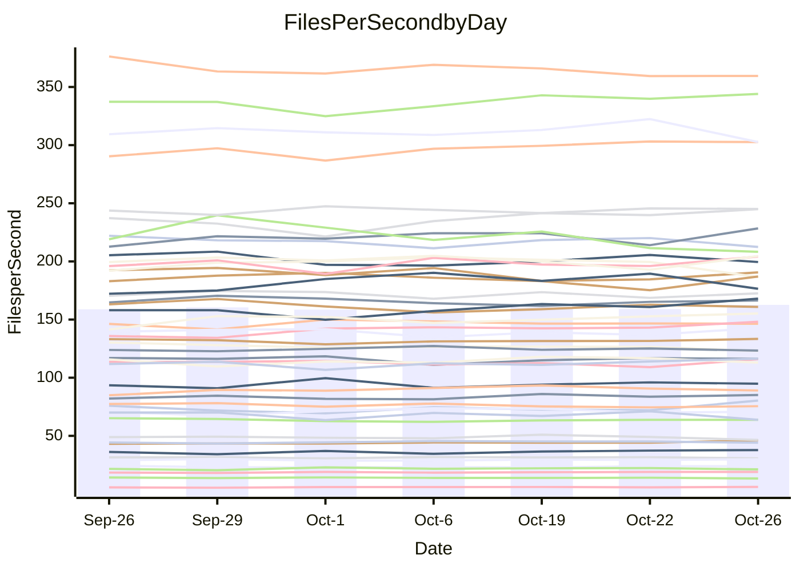

<!---
# This file is auto-generated. Do not edit.
# cspell:disable
--->
# Performance Report

## Daily Performance

## Time to Process Files

| Repository                                      | Elapsed | Min/Avg/Max           |   SD | SD Graph                |
| ----------------------------------------------- | ------: | :-------------------: | ---: | ----------------------- |
| AdaDoom3/AdaDoom3                    |    3.46 | 3.4 /   3.5 /   3.7   | 0.12 | `    ┣━━┻●━╋━━┻━━┫    ` |
| alexiosc/megistos                    |    7.26 | 7.6 /   8.0 /   8.6   | 0.30 | `  ● ┣━━┻━━╋━━┻━━┫    ` |
| apollographql/apollo-server          |    2.83 | 2.6 /   2.8 /   3.0   | 0.12 | `    ┣━━┻━━╋●━┻━━┫    ` |
| aspnetboilerplate/aspnetboilerplate  |   10.76 | 10.2 /  10.5 /  10.9  | 0.22 | `    ┣━━┻━━╋━━┻●━┫    ` |
| aws-amplify/docs                     |   12.57 | 12.5 /  13.1 /  13.9  | 0.47 | `    ┣━━●━━╋━━┻━━┫    ` |
| Azure/azure-rest-api-specs           |    9.99 | 9.6 /  10.1 /  10.7   | 0.27 | `    ┣━━┻━●╋━━┻━━┫    ` |
| bitjson/typescript-starter           |    1.05 | 1.0 /   1.1 /   1.1   | 0.02 | `     ┣━━●━╋━┻━━┫     ` |
| caddyserver/caddy                    |    3.81 | 3.6 /   3.8 /   3.9   | 0.09 | `    ┣━━┻━━╋●━┻━━┫    ` |
| canada-ca/open-source-logiciel-libre |    1.15 | 1.1 /   1.2 /   1.3   | 0.05 | `     ┣━┻●━╋━━┻━┫     ` |
| chef/chef                            |    5.97 | 5.7 /   6.0 /   6.4   | 0.19 | `    ┣━━┻━━●━━┻━━┫    ` |
| dart-lang/sdk                        |   63.68 | 63.9 /  67.1 /  73.2  | 2.45 | `  ┣━━●┻━━━╋━━━┻━━━┫  ` |
| django/django                        |   15.38 | 14.9 /  15.7 /  16.5  | 0.52 | `    ┣━━┻●━╋━━┻━━┫    ` |
| eslint/eslint                        |   11.01 | 10.7 /  11.1 /  11.8  | 0.39 | `    ┣━━┻━●╋━━┻━━┫    ` |
| exonum/exonum                        |    3.73 | 3.5 /   3.7 /   3.8   | 0.10 | `    ┣━━┻━━╋━●┻━━┫    ` |
| flutter/samples                      |   16.20 | 16.4 /  17.1 /  18.6  | 0.58 | `    ┣●━┻━━╋━━┻━━┫    ` |
| gitbucket/gitbucket                  |    3.56 | 3.5 /   3.7 /   3.8   | 0.09 | `     ┣●┻━━╋━━┻━┫     ` |
| googleapis/google-cloud-cpp          |  145.71 | 142.5 / 150.1 / 165.8 | 6.11 | `  ┣━━━┻●━━╋━━━┻━━━┫  ` |
| graphql/express-graphql              |    1.23 | 1.1 /   1.2 /   1.3   | 0.04 | `     ┣━┻━━╋━━●━┫     ` |
| graphql/graphql-js                   |    2.95 | 2.8 /   2.9 /   3.1   | 0.07 | `     ┣━┻━━╋●━┻━┫     ` |
| graphql/graphql-relay-js             |    1.17 | 1.1 /   1.2 /   1.3   | 0.04 | `     ┣━┻●━╋━━┻━┫     ` |
| graphql/graphql-spec                 |    1.42 | 1.3 /   1.4 /   1.4   | 0.03 | `     ┣━┻━━╋━━┻━┫●    ` |
| iluwatar/java-design-patterns        |   12.83 | 13.0 /  13.4 /  14.9  | 0.49 | `    ┣━━●━━╋━━┻━━┫    ` |
| ktaranov/sqlserver-kit               |    6.92 | 6.6 /   6.8 /   7.3   | 0.21 | `    ┣━━┻━━╋●━┻━━┫    ` |
| liriliri/licia                       |    4.18 | 4.1 /   4.3 /   4.4   | 0.09 | `    ┣━━●━━╋━━┻━━┫    ` |
| MartinThoma/LaTeX-examples           |    7.55 | 6.9 /   7.1 /   7.4   | 0.18 | `    ┣━━┻━━╋━━┻━━┫ ●  ` |
| mdx-js/mdx                           |    2.21 | 2.0 /   2.1 /   2.3   | 0.11 | `     ┣━┻━━╋━━┻●┫     ` |
| microsoft/TypeScript-Website         |    5.71 | 5.6 /   5.8 /   6.0   | 0.13 | `    ┣━━┻●━╋━━┻━━┫    ` |
| MicrosoftDocs/PowerShell-Docs        |   23.29 | 23.5 /  24.3 /  27.2  | 0.93 | `   ┣━━●┻━━╋━━┻━━━┫   ` |
| neovim/nvim-lspconfig                |    4.40 | 4.3 /   4.4 /   4.7   | 0.11 | `    ┣━━┻━●╋━━┻━━┫    ` |
| pagekit/pagekit                      |    3.62 | 3.5 /   3.7 /   4.0   | 0.14 | `    ┣━━┻●━╋━━┻━━┫    ` |
| php/php-src                          |   26.89 | 26.3 /  27.6 /  30.2  | 1.21 | `   ┣━━━┻●━╋━━┻━━━┫   ` |
| plasticrake/tplink-smarthome-api     |    1.40 | 1.4 /   1.4 /   1.4   | 0.03 | `     ┣━┻━━╋━●┻━┫     ` |
| prettier/prettier                    |    7.81 | 7.1 /   7.5 /   7.8   | 0.16 | `    ┣━━┻━━╋━━┻━━●    ` |
| pycontribs/jira                      |    1.70 | 1.5 /   1.6 /   1.7   | 0.05 | `     ┣━┻━━╋━━┻━●     ` |
| RustPython/RustPython                |    5.59 | 5.2 /   5.4 /   5.7   | 0.15 | `    ┣━━┻━━╋━━●━━┫    ` |
| shoelace-style/shoelace              |    3.00 | 2.9 /   3.0 /   3.1   | 0.05 | `     ┣━┻━━╋●━┻━┫     ` |
| slint-ui/slint                       |   14.39 | 13.0 /  13.6 /  14.4  | 0.41 | `    ┣━━┻━━╋━━┻━━●    ` |
| SoftwareBrothers/admin-bro           |    2.65 | 2.6 /   2.7 /   2.9   | 0.08 | `     ┣━┻━●╋━━┻━┫     ` |
| sveltejs/svelte                      |   22.20 | 20.8 /  21.7 /  22.6  | 0.45 | `    ┣━━┻━━╋━━●━━┫    ` |
| TheAlgorithms/Python                 |    5.71 | 5.7 /   5.9 /   6.6   | 0.23 | `    ┣━━●━━╋━━┻━━┫    ` |
| twbs/bootstrap                       |    1.85 | 1.8 /   1.9 /   2.0   | 0.05 | `     ┣━┻━●╋━━┻━┫     ` |
| typescript-cheatsheets/react         |    1.40 | 1.4 /   1.5 /   1.6   | 0.06 | `     ┣━●━━╋━━┻━┫     ` |
| typescript-eslint/typescript-eslint  |    4.25 | 4.2 /   4.3 /   4.6   | 0.10 | `    ┣━━●━━╋━━┻━━┫    ` |
| vitest-dev/vitest                    |   10.86 | 9.3 /  10.1 /  11.1   | 0.56 | `    ┣━━┻━━╋━━┻●━┫    ` |
| w3c/aria-practices                   |    3.56 | 3.5 /   3.6 /   3.7   | 0.10 | `    ┣━━┻━●╋━━┻━━┫    ` |
| w3c/specberus                        |    2.08 | 2.0 /   2.1 /   2.3   | 0.08 | `     ┣━┻━●╋━━┻━┫     ` |
| webdeveric/webpack-assets-manifest   |    1.19 | 1.2 /   1.2 /   1.3   | 0.01 | ` ●   ┣━━┻━╋━┻━━┫     ` |
| webpack/webpack                      |    5.52 | 5.4 /   5.7 /   6.1   | 0.18 | `    ┣━━●━━╋━━┻━━┫    ` |
| wireapp/wire-desktop                 |    1.50 | 1.3 /   1.4 /   1.5   | 0.04 | `     ┣━┻━━╋━━┻━●     ` |
| wireapp/wire-webapp                  |   11.07 | 10.7 /  11.2 /  12.5  | 0.48 | `    ┣━━┻━●╋━━┻━━┫    ` |

Note:
- Elapsed time is in seconds.

## Files per Second over Time

| Repository                                      | Files |    Sec |    Fps |    Rel | Trend Fps       |    N |
| ----------------------------------------------- | ----: | -----: | -----: | -----: | --------------- | ---: |
| AdaDoom3/AdaDoom3                    |   103 |   3.46 |  29.80 |  2.04% | `▄██▆▆▇▅██▆█▆▇` |   12 |
| alexiosc/megistos                    |   583 |   7.26 |  80.34 | 10.41% | `▆▆▅▄▃▆▆▅▇▃▄▅█` |   12 |
| apollographql/apollo-server          |   252 |   2.83 |  89.01 | -1.16% | `▅▃▆▇▄▇▆▇█▆▇▅▆` |   12 |
| aspnetboilerplate/aspnetboilerplate  |  2286 |  10.76 | 212.47 | -2.50% | `██▇█▆▅▆▆███▇▆` |   12 |
| aws-amplify/docs                     |  2871 |  12.57 | 228.42 |  4.01% | `▆▄▇▅█▇███▆▇▄█` |   12 |
| Azure/azure-rest-api-specs           |  2448 |   9.99 | 245.11 |  0.50% | `▆▇▆▇▇▆▇▄▇▇▅█▇` |   12 |
| bitjson/typescript-starter           |    20 |   1.05 |  18.96 |  1.69% | `▆▆▅▇█▆▆▅▇█▇█▇` |   12 |
| caddyserver/caddy                    |   288 |   3.81 |  75.51 | -0.81% | `█▆█▇▅█▇▆▅▇▆▅▆` |   12 |
| canada-ca/open-source-logiciel-libre |     7 |   1.15 |   6.07 |  3.82% | `▅▆▄█▆█▇▇█▇▄▇█` |   12 |
| chef/chef                            |  1191 |   5.97 | 199.49 | -0.95% | `█▇█▅▆▇▄▇▆▇█▇▆` |   12 |
| dart-lang/sdk                        | 10696 |  63.68 | 167.96 |  6.08% | `▆▆▆▆▃▇▅▇▇██▆█` |   12 |
| django/django                        |  2877 |  15.38 | 187.04 |  1.76% | `▅▇▇▇█▇▇▅▅█▄▅▇` |   12 |
| eslint/eslint                        |  2098 |  11.01 | 190.62 |  1.08% | `█▇██▅██▅▅▇▇▄▇` |   12 |
| exonum/exonum                        |   421 |   3.73 | 112.97 | -1.96% | `█▆▅▅▇▅▆██▇▆█▆` |   12 |
| flutter/samples                      |  2400 |  16.20 | 148.10 |  5.12% | `▄▇▅▇▇▇▇▆▇▇█▆█` |   12 |
| gitbucket/gitbucket                  |   413 |   3.56 | 115.89 |  3.14% | `▇▆▇█▆▆▅▅▅█▅▅▇` |   12 |
| googleapis/google-cloud-cpp          | 20788 | 145.71 | 142.67 |  2.91% | `▆▇▇▆██▃▇▆▇▇▅▇` |   12 |
| graphql/express-graphql              |    26 |   1.23 |  21.14 | -3.82% | `▅▇▄█▇▅▇▆▆▇█▅▅` |   12 |
| graphql/graphql-js                   |   364 |   2.95 | 123.27 | -1.19% | `▅█▆▆▇█▇█▇▅▆█▆` |   12 |
| graphql/graphql-relay-js             |    28 |   1.17 |  23.93 |  2.54% | `█▇▅▇▄▆▅▅▆▅█▅▇` |   12 |
| graphql/graphql-spec                 |    19 |   1.42 |  13.34 | -4.63% | `██▆▇██▅▅▇▆▆█▅` |   12 |
| iluwatar/java-design-patterns        |  1992 |  12.83 | 155.21 |  4.08% | `▇▃█▇█▆▆▇▇▇█▇█` |   12 |
| ktaranov/sqlserver-kit               |   489 |   6.92 |  70.63 | -1.29% | `▅▇▄▇▆█▇██▇▅▇▆` |   12 |
| liriliri/licia                       |  1437 |   4.18 | 343.99 |  2.26% | `▇▆▇▅▅▅▇█▇█▇▇█` |   12 |
| MartinThoma/LaTeX-examples           |  1409 |   7.55 | 186.55 | -6.45% | `▆▅▇▆█▇███▆█▆▄` |   12 |
| mdx-js/mdx                           |   141 |   2.21 |  63.82 | -6.60% | `█▇▇▃▆▇▇▅▇▆█▇▅` |   12 |
| microsoft/TypeScript-Website         |   761 |   5.71 | 133.33 |  1.50% | `▆█▇▅▆▅█▆▇▇▆█▇` |   12 |
| MicrosoftDocs/PowerShell-Docs        |  2708 |  23.29 | 116.28 |  4.40% | `▇▇▇█▃▇▇▇▆▆▇██` |   12 |
| neovim/nvim-lspconfig                |   759 |   4.40 | 172.58 |  0.69% | `▆▇█▇█▇▅██▆▅▇▇` |   12 |
| pagekit/pagekit                      |   741 |   3.62 | 204.64 |  2.37% | `▆▆▇▆▆█▆▇█▄▅▅▇` |   12 |
| php/php-src                          |  2289 |  26.89 |  85.12 |  2.11% | `▇▅▇▅▇▄█▇███▅▇` |   12 |
| plasticrake/tplink-smarthome-api     |    62 |   1.40 |  44.15 | -1.42% | `█▅▆▇▆███▆█▇█▆` |   12 |
| prettier/prettier                    |  2363 |   7.81 | 302.67 | -3.32% | `▄█▇▇▆▆▆▆▇▇██▅` |   12 |
| pycontribs/jira                      |    79 |   1.70 |  46.43 | -5.65% | `▅▆▆▅▅▆▄█▆▇▆▅▄` |   12 |
| RustPython/RustPython                |   688 |   5.59 | 123.01 | -3.33% | `█▆▇▅▇▆▆▅▇▆▄█▅` |   12 |
| shoelace-style/shoelace              |   439 |   3.00 | 146.43 | -0.37% | `▆▇▅█▇▇▇▇▇▅▇▇▇` |   12 |
| slint-ui/slint                       |  2539 |  14.39 | 176.48 | -3.67% | `▅▄▅▇▇█▇▅▇▇█▇▅` |   12 |
| SoftwareBrothers/admin-bro           |   441 |   2.65 | 166.36 |  0.85% | `▆▇█▇██▅▇▇▄▇▆▇` |   12 |
| sveltejs/svelte                      |  7982 |  22.20 | 359.52 | -1.81% | `█▇▆▅▆▆▇▆▆▇▆▅▅` |   12 |
| TheAlgorithms/Python                 |  1399 |   5.71 | 244.89 |  4.10% | `▇▇▆▆▃▇▆█▇██▇█` |   12 |
| twbs/bootstrap                       |   118 |   1.85 |  63.80 |  0.52% | `▇█▇▅▇▆▅▄▇█▇▆▇` |   12 |
| typescript-cheatsheets/react         |    53 |   1.40 |  37.75 |  4.42% | `▆▇▅▇▇▃▇▇▇▇█▇█` |   12 |
| typescript-eslint/typescript-eslint  |  1285 |   4.25 | 302.64 |  2.30% | `▅▇▇▆▅█▆▇▇▇███` |   12 |
| vitest-dev/vitest                    |  2261 |  10.86 | 208.25 | -6.50% | `▃███▆▅▆▆▇▆▅▄▄` |   12 |
| w3c/aria-practices                   |   414 |   3.56 | 116.25 |  0.52% | `█▆▇██▅▅▆▅██▆▇` |   12 |
| w3c/specberus                        |   197 |   2.08 |  94.80 |  0.35% | `▅▆▅▇█▃▆▆▅▆▇▆▆` |   12 |
| webdeveric/webpack-assets-manifest   |    55 |   1.19 |  46.15 |  5.35% | `▅▅▅▅▅▆▇▅▇▆▇▅█` |   12 |
| webpack/webpack                      |  1127 |   5.52 | 204.21 |  3.77% | `▆▇▇▄▆▇█▆█▆▇▆█` |   12 |
| wireapp/wire-desktop                 |    46 |   1.50 |  30.66 | -2.43% | `▅▇▆▄▅▅█▇▆▅▇▆▅` |   12 |
| wireapp/wire-webapp                  |  1781 |  11.07 | 160.91 | -0.00% | `█▆█▇▆▄▇▆▅▇▆▇▆` |   12 |

## Data Throughput

| Repository                                      | Files |    Sec |     Kps |    Rel | Trend Kps       |    N |
| ----------------------------------------------- | ----: | -----: | ------: | -----: | --------------- | ---: |
| AdaDoom3/AdaDoom3                    |   103 |   3.46 |  633.34 |  2.04% | `▄██▆▆▇▅██▆█▆▇` |   12 |
| alexiosc/megistos                    |   583 |   7.26 |  631.30 | 10.41% | `▆▆▅▄▃▆▆▅▇▃▄▅█` |   12 |
| apollographql/apollo-server          |   252 |   2.83 |  715.93 | -1.16% | `▅▃▆▇▄▇▆▇█▆▇▅▆` |   12 |
| aspnetboilerplate/aspnetboilerplate  |  2286 |  10.76 |  516.95 | -2.50% | `██▇█▆▅▆▆███▇▆` |   12 |
| aws-amplify/docs                     |  2871 |  12.57 |  797.37 |  4.00% | `▆▄▇▅█▇███▆▇▄█` |   12 |
| Azure/azure-rest-api-specs           |  2448 |   9.99 |  656.74 |  1.39% | `▅▆▅▇▆▅▇▄▇▇▅█▇` |   12 |
| bitjson/typescript-starter           |    20 |   1.05 |   75.84 |  1.69% | `▆▆▅▇█▆▆▅▇█▇█▇` |   12 |
| caddyserver/caddy                    |   288 |   3.81 |  654.91 |  0.37% | `█▆█▇▅█▇▆▅▇▆▆▇` |   12 |
| canada-ca/open-source-logiciel-libre |     7 |   1.15 |   50.31 |  3.82% | `▅▆▄█▆█▇▇█▇▄▇█` |   12 |
| chef/chef                            |  1191 |   5.97 |  923.60 | -0.68% | `█▇█▅▆▇▄▇▆▆█▇▆` |   12 |
| dart-lang/sdk                        | 10696 |  63.68 | 1143.84 |  5.59% | `▆▆▆▆▃▇▅▇▇██▆█` |   12 |
| django/django                        |  2877 |  15.38 | 1175.50 |  2.01% | `▅▇▇▇█▇▇▅▅█▄▅▇` |   12 |
| eslint/eslint                        |  2098 |  11.01 | 1370.11 |  0.91% | `█▇██▅██▅▅▇▇▄▇` |   12 |
| exonum/exonum                        |   421 |   3.73 | 1080.63 | -1.96% | `█▆▅▅▇▅▆██▇▆█▆` |   12 |
| flutter/samples                      |  2400 |  16.20 | 1321.63 |  5.12% | `▄▇▅▇▇▇▇▆▇▇█▆█` |   12 |
| gitbucket/gitbucket                  |   413 |   3.56 |  526.68 |  3.11% | `▇▆▇█▆▆▅▅▅█▅▅▇` |   12 |
| googleapis/google-cloud-cpp          | 20788 | 145.71 | 1159.30 |  3.00% | `▆▇▇▆██▃▇▆▇▇▅▇` |   12 |
| graphql/express-graphql              |    26 |   1.23 |   96.77 | -3.82% | `▅▇▄█▇▅▇▆▆▇█▅▅` |   12 |
| graphql/graphql-js                   |   364 |   2.95 |  712.50 | -0.72% | `▅█▆▆▇█▇█▇▅▆█▆` |   12 |
| graphql/graphql-relay-js             |    28 |   1.17 |   93.99 |  2.54% | `█▇▅▇▄▆▅▅▆▅█▅▇` |   12 |
| graphql/graphql-spec                 |    19 |   1.42 |  445.09 | -4.63% | `██▆▇██▅▅▇▆▆█▅` |   12 |
| iluwatar/java-design-patterns        |  1992 |  12.83 |  479.73 |  4.08% | `▇▃█▇█▆▆▇▇▇█▇█` |   12 |
| ktaranov/sqlserver-kit               |   489 |   6.92 | 1069.38 | -1.29% | `▅▇▄▇▆█▇██▇▅▇▆` |   12 |
| liriliri/licia                       |  1437 |   4.18 |  409.82 |  2.26% | `▇▆▇▅▅▅▇█▇█▇▇█` |   12 |
| MartinThoma/LaTeX-examples           |  1409 |   7.55 |  385.28 | -6.45% | `▆▅▇▆█▇███▆█▆▄` |   12 |
| mdx-js/mdx                           |   141 |   2.21 |  296.93 | -6.60% | `█▇▇▃▆▇▇▅▇▆█▇▅` |   12 |
| microsoft/TypeScript-Website         |   761 |   5.71 |  922.07 |  1.50% | `▆█▇▅▆▅█▆▇▇▆█▇` |   12 |
| MicrosoftDocs/PowerShell-Docs        |  2708 |  23.29 | 1196.72 |  4.43% | `▇▇▇▇▃▇▇▇▆▆▇██` |   12 |
| neovim/nvim-lspconfig                |   759 |   4.40 |  288.08 |  1.04% | `▆▇▇▇█▇▅██▆▅▇▇` |   12 |
| pagekit/pagekit                      |   741 |   3.62 |  426.69 |  2.37% | `▆▆▇▆▆█▆▇█▄▅▅▇` |   12 |
| php/php-src                          |  2289 |  26.89 | 1486.80 |  2.41% | `▇▅▇▅▇▄█▇███▅▇` |   12 |
| plasticrake/tplink-smarthome-api     |    62 |   1.40 |  238.55 | -1.42% | `█▅▆▇▆███▆█▇█▆` |   12 |
| prettier/prettier                    |  2363 |   7.81 |  423.45 | -3.62% | `▄█▇▆▆▆▆▆▇▇█▇▅` |   12 |
| pycontribs/jira                      |    79 |   1.70 |  329.14 | -5.65% | `▅▆▆▅▅▆▄█▆▇▆▅▄` |   12 |
| RustPython/RustPython                |   688 |   5.59 |  974.39 | -3.10% | `█▆▆▅▇▆▆▅▇▆▄█▅` |   12 |
| shoelace-style/shoelace              |   439 |   3.00 |  707.46 | -0.37% | `▆▇▅█▇▇▇▇▇▅▇▇▇` |   12 |
| slint-ui/slint                       |  2539 |  14.39 | 1086.25 | -4.49% | `▇▆▄▇▇█▇▅▇▇█▇▅` |   12 |
| SoftwareBrothers/admin-bro           |   441 |   2.65 |  366.67 |  0.85% | `▆▇█▇██▅▇▇▄▇▆▇` |   12 |
| sveltejs/svelte                      |  7982 |  22.20 |  239.94 | -1.93% | `█▇▆▅▆▆▇▆▆▇▆▅▅` |   12 |
| TheAlgorithms/Python                 |  1399 |   5.71 |  622.83 |  4.14% | `▇▇▆▆▃▇▆█▇██▇█` |   12 |
| twbs/bootstrap                       |   118 |   1.85 |  523.40 |  0.52% | `▇█▇▅▇▆▅▄▇█▇▆▇` |   12 |
| typescript-cheatsheets/react         |    53 |   1.40 |  279.19 |  4.42% | `▆▇▅▇▇▃▇▇▇▇█▇█` |   12 |
| typescript-eslint/typescript-eslint  |  1285 |   4.25 | 1556.07 |  2.50% | `▅▇▇▅▅▇▆▇█████` |   12 |
| vitest-dev/vitest                    |  2261 |  10.86 |  468.81 | -6.61% | `▃███▆▅▆▅▇▆▅▄▄` |   12 |
| w3c/aria-practices                   |   414 |   3.56 | 1083.87 |  0.52% | `█▆▇██▅▅▆▅██▆▇` |   12 |
| w3c/specberus                        |   197 |   2.08 |  299.80 |  0.71% | `▅▆▅▇█▃▆▆▆▆▇▆▆` |   12 |
| webdeveric/webpack-assets-manifest   |    55 |   1.19 |  106.57 |  4.39% | `▆▆▆▆▆▇▇▅▇▆▇▅█` |   12 |
| webpack/webpack                      |  1127 |   5.52 |  929.02 |  3.61% | `▅▇▇▄▆▇█▆█▆▆▆█` |   12 |
| wireapp/wire-desktop                 |    46 |   1.50 |  171.30 |  6.61% | `▃▃▃▂▃▂█▇▇▆▇▇▆` |   12 |
| wireapp/wire-webapp                  |  1781 |  11.07 |  593.94 |  1.42% | `█▅█▇▆▃█▇▆▇▇█▇` |   12 |

