<!---
# This file is auto-generated. Do not edit.
# cspell:disable
--->
# Performance Report

## Daily Performance

```mermaid
xychart-beta
    title Files Per Second by Day
    y-axis Files per Second
    x-axis Date [Jun-15, Jun-16, Jun-17, Jun-18, Jun-19, Jun-20, Jun-21, Jun-23, Jun-24, Jun-25, Jun-28, Jun-29, Jun-30, Jul-1, Jul-2, Jul-5, Jul-6, Jul-7, Jul-8, Jul-11, Jul-12, Jul-13, Jul-14, Jul-15]
    bar [55.23, 54.55, 56.29, 53.60, 54.73, 53.81, 54.79, 54.65, 53.68, 53.90, 53.25, 54.88, 55.38, 53.96, 53.38, 53.29, 54.69, 54.15, 52.68, 52.74, 53.48, 58.79, 58.57, 57.58]
    line [31.22, 31.14, 0.00, 29.14, 29.85, 30.46, 29.32, 30.46, 25.95, 30.27, 29.25, 28.15, 31.49, 30.25, 28.83, 30.14, 31.39, 30.96, 0.00, 28.64, 28.73, 29.33, 23.74, 27.62]
    line [7.27, 7.16, 0.00, 7.14, 6.91, 7.08, 7.24, 7.00, 7.25, 7.04, 7.25, 7.16, 6.89, 7.22, 7.04, 7.03, 6.91, 7.06, 0.00, 7.05, 6.73, 7.02, 7.16, 6.24]
    line [41.31, 36.70, 0.00, 39.92, 40.45, 40.18, 40.38, 41.88, 37.99, 41.49, 40.33, 40.64, 41.17, 29.01, 40.13, 39.92, 40.46, 40.58, 0.00, 37.95, 39.51, 38.75, 40.71, 39.44]
    line [24.81, 24.07, 0.00, 25.24, 25.00, 24.06, 25.33, 25.45, 24.29, 25.27, 24.54, 24.33, 25.24, 24.74, 24.93, 22.81, 25.11, 24.25, 0.00, 24.97, 24.54, 25.28, 25.22, 24.83]
    line [36.49, 37.63, 0.00, 37.70, 36.03, 37.29, 36.01, 37.83, 36.95, 35.76, 36.83, 37.61, 37.38, 38.58, 36.99, 37.44, 37.75, 37.85, 37.02, 34.25, 36.67, 39.28, 40.59, 38.44]
    line [7.85, 7.74, 7.93, 7.76, 8.15, 7.88, 8.03, 8.06, 7.77, 7.95, 7.37, 8.15, 8.08, 8.03, 7.91, 7.73, 7.95, 8.03, 0.00, 7.64, 7.43, 7.58, 8.03, 7.94]
    line [31.00, 33.62, 33.80, 31.53, 31.68, 32.63, 33.23, 32.44, 32.70, 31.96, 31.81, 31.48, 31.69, 31.23, 31.21, 32.29, 33.10, 33.36, 32.59, 32.17, 32.28, 32.99, 33.06, 31.20]
    line [36.51, 36.52, 0.00, 35.88, 36.45, 35.63, 37.02, 36.72, 36.62, 36.60, 37.20, 36.77, 36.10, 36.00, 35.56, 34.93, 36.70, 36.34, 0.00, 34.76, 36.63, 37.65, 38.19, 37.32]
    line [59.23, 61.54, 59.34, 60.30, 60.82, 58.87, 59.30, 58.89, 58.05, 59.57, 59.87, 57.70, 61.16, 59.63, 57.22, 58.32, 59.51, 59.81, 0.00, 58.62, 57.98, 59.77, 57.87, 58.27]
    line [96.22, 99.03, 0.00, 96.47, 100.84, 96.57, 95.40, 95.71, 96.24, 96.66, 98.87, 96.32, 94.31, 100.99, 95.12, 94.46, 101.33, 98.77, 0.00, 95.14, 96.41, 102.68, 104.85, 102.10]
    line [94.75, 95.51, 0.00, 92.68, 90.88, 94.97, 95.41, 94.44, 93.28, 95.18, 96.78, 93.41, 95.43, 94.64, 92.95, 92.70, 93.91, 93.91, 97.14, 94.93, 90.72, 96.63, 98.76, 91.39]
    line [22.92, 22.51, 0.00, 23.47, 22.91, 22.43, 23.52, 23.36, 23.17, 23.54, 18.25, 23.79, 20.94, 23.87, 23.33, 23.15, 23.48, 22.48, 0.00, 21.53, 21.55, 23.37, 23.45, 21.77]
    line [30.08, 29.84, 0.00, 28.47, 30.05, 28.68, 30.36, 29.11, 28.16, 29.87, 28.95, 29.93, 30.09, 26.38, 27.87, 29.69, 29.23, 28.58, 0.00, 29.03, 28.85, 30.81, 32.04, 31.51]
    line [37.68, 36.78, 38.11, 37.93, 38.17, 37.98, 37.01, 37.64, 35.45, 34.98, 38.21, 37.49, 37.44, 36.89, 37.54, 37.39, 37.96, 37.38, 36.33, 35.68, 36.85, 48.54, 50.30, 48.86]
    line [28.90, 28.46, 0.00, 28.03, 28.13, 27.70, 27.54, 28.60, 27.82, 27.99, 27.26, 28.55, 28.75, 28.24, 27.65, 26.29, 28.70, 26.38, 0.00, 25.97, 25.27, 27.83, 26.89, 27.82]
    line [22.36, 22.97, 23.21, 23.06, 23.36, 23.21, 23.29, 22.70, 22.41, 23.38, 22.06, 23.24, 23.90, 23.42, 23.19, 23.32, 23.79, 23.42, 21.93, 22.47, 23.35, 26.70, 27.10, 26.94]
    line [36.31, 37.09, 0.00, 36.40, 34.57, 35.89, 36.46, 35.53, 32.32, 35.78, 35.63, 35.36, 36.33, 35.60, 35.86, 35.14, 36.26, 35.11, 0.00, 35.79, 35.44, 36.86, 37.32, 34.76]
    line [60.40, 60.79, 62.47, 62.13, 62.00, 61.61, 59.94, 59.89, 59.44, 60.11, 61.36, 61.09, 62.22, 60.39, 56.87, 58.80, 61.52, 59.73, 59.67, 57.25, 59.76, 62.00, 61.78, 57.84]
    line [60.35, 60.54, 55.30, 58.53, 61.04, 58.63, 56.24, 60.65, 57.96, 58.45, 59.90, 60.37, 58.56, 57.32, 58.13, 59.40, 62.05, 58.77, 60.69, 57.88, 57.69, 63.02, 53.69, 61.91]
    line [158.79, 164.15, 162.60, 161.18, 158.49, 159.73, 163.19, 164.26, 158.19, 157.79, 159.21, 162.83, 162.04, 163.63, 163.52, 159.46, 166.05, 164.00, 156.23, 162.57, 160.66, 161.32, 166.06, 161.34]
    line [96.41, 99.41, 0.00, 98.69, 97.58, 99.86, 101.16, 98.61, 100.63, 97.85, 98.44, 101.25, 102.07, 102.24, 102.81, 99.98, 103.89, 102.63, 0.00, 97.06, 99.82, 103.83, 102.51, 104.09]
    line [181.31, 183.43, 187.40, 188.68, 189.42, 185.98, 174.53, 185.40, 177.45, 185.19, 175.70, 182.89, 195.56, 184.76, 182.13, 189.18, 176.80, 183.73, 190.06, 183.23, 187.99, 186.87, 191.51, 181.74]
    line [80.70, 76.51, 78.16, 76.84, 79.08, 76.60, 77.73, 80.09, 73.97, 78.56, 80.87, 80.11, 80.39, 77.44, 78.37, 79.33, 78.73, 76.97, 77.95, 76.23, 77.21, 85.30, 84.52, 81.58]
    line [168.34, 162.58, 176.51, 171.66, 185.92, 178.53, 183.48, 175.07, 178.76, 176.61, 184.19, 181.53, 174.14, 177.27, 171.99, 172.23, 173.32, 175.11, 173.39, 173.74, 172.96, 175.55, 176.84, 168.78]
    line [58.35, 57.90, 57.08, 56.67, 54.06, 56.85, 56.62, 56.53, 54.80, 55.32, 56.90, 57.36, 56.70, 55.42, 56.02, 55.97, 59.70, 57.75, 58.20, 58.17, 58.70, 57.65, 57.74, 57.89]
    line [110.91, 111.18, 109.94, 109.97, 109.03, 107.42, 111.79, 110.71, 109.09, 111.49, 107.90, 114.19, 115.16, 113.05, 112.31, 110.93, 115.67, 112.16, 0.00, 108.89, 113.41, 118.00, 119.52, 119.25]
    line [23.36, 22.88, 0.00, 22.89, 22.09, 22.64, 22.03, 23.15, 22.70, 22.92, 22.73, 21.28, 23.51, 21.26, 23.21, 22.78, 22.74, 21.42, 0.00, 22.47, 21.85, 20.95, 22.33, 20.63]
    line [43.36, 43.19, 41.05, 42.25, 40.57, 42.12, 43.62, 42.26, 41.31, 43.04, 41.97, 42.58, 42.67, 39.88, 42.39, 42.24, 42.47, 42.51, 42.43, 41.92, 43.23, 46.44, 46.62, 45.66]
    line [42.56, 42.24, 0.00, 40.82, 40.85, 41.61, 40.17, 42.36, 39.51, 38.83, 39.73, 39.63, 39.23, 41.65, 40.80, 40.60, 42.25, 39.96, 40.88, 41.31, 41.23, 42.19, 40.16, 38.73]
    line [69.84, 69.19, 66.53, 67.29, 68.84, 65.67, 68.82, 66.74, 67.96, 68.42, 66.90, 67.92, 66.32, 68.05, 67.42, 66.36, 68.11, 66.59, 66.07, 65.01, 66.37, 68.01, 66.96, 67.66]
    line [41.55, 41.12, 43.00, 42.10, 42.62, 41.28, 41.33, 41.93, 40.81, 41.96, 42.91, 41.69, 43.04, 42.05, 41.34, 42.15, 42.53, 40.91, 0.00, 41.76, 42.26, 44.10, 43.14, 44.22]
    line [8.50, 8.39, 0.00, 8.29, 8.34, 8.29, 8.43, 8.01, 8.19, 8.16, 8.42, 8.39, 8.40, 8.24, 8.28, 8.19, 8.63, 8.37, 0.00, 8.11, 8.54, 11.44, 11.22, 11.20]
    line [21.03, 20.49, 0.00, 20.74, 21.25, 21.30, 20.86, 20.91, 20.57, 20.77, 20.27, 21.23, 21.32, 20.26, 20.95, 20.54, 21.71, 21.11, 20.98, 20.82, 21.02, 23.42, 23.84, 23.14]
    line [19.77, 19.30, 0.00, 18.42, 19.47, 18.77, 18.39, 19.41, 18.86, 18.25, 18.72, 18.97, 19.39, 18.97, 18.75, 18.86, 19.03, 18.73, 0.00, 18.00, 18.67, 22.06, 22.60, 22.12]
    line [60.92, 60.45, 62.55, 59.44, 62.51, 61.68, 60.69, 61.64, 60.33, 62.74, 59.90, 62.95, 63.02, 62.92, 60.05, 59.94, 61.97, 60.87, 60.86, 61.32, 60.29, 63.66, 62.24, 62.22]
    line [31.95, 31.82, 30.40, 31.16, 31.74, 31.53, 30.20, 32.21, 31.68, 31.67, 30.23, 30.55, 31.97, 29.38, 31.00, 30.73, 31.84, 31.72, 29.65, 28.10, 30.62, 32.03, 32.73, 31.51]
    line [78.68, 78.27, 76.75, 75.29, 71.22, 68.41, 76.29, 75.88, 77.29, 75.99, 76.37, 77.11, 78.01, 75.37, 77.05, 77.75, 78.86, 75.50, 75.57, 76.15, 76.16, 78.89, 77.81, 76.88]
    line [89.67, 91.19, 85.25, 88.25, 87.27, 87.35, 88.00, 90.71, 85.96, 90.30, 89.95, 88.48, 91.12, 91.92, 89.67, 90.03, 85.50, 91.69, 0.00, 89.71, 88.17, 90.21, 89.66, 89.68]
    line [54.49, 53.96, 53.91, 54.07, 51.71, 53.57, 56.32, 54.68, 53.08, 54.03, 55.26, 55.00, 53.08, 56.15, 54.34, 55.22, 55.54, 54.83, 44.51, 54.58, 53.10, 57.69, 58.02, 48.34]
    line [178.17, 173.27, 176.55, 176.55, 176.66, 178.14, 181.41, 179.40, 182.07, 174.90, 180.00, 190.11, 183.04, 188.67, 178.03, 182.58, 173.26, 181.48, 195.68, 179.78, 183.27, 193.41, 195.82, 189.43]
    line [52.59, 54.62, 56.27, 54.08, 54.30, 53.24, 54.86, 55.60, 54.23, 54.16, 54.66, 55.22, 54.68, 56.12, 54.84, 54.28, 55.54, 55.40, 55.26, 53.33, 55.62, 56.85, 55.92, 57.35]
    line [72.65, 75.69, 72.01, 72.65, 74.87, 74.57, 73.44, 73.65, 74.67, 73.58, 69.13, 73.39, 75.25, 74.70, 74.82, 74.90, 72.90, 74.49, 74.41, 75.29, 74.73, 78.12, 57.67, 76.27]
    line [52.65, 53.38, 50.30, 52.09, 53.08, 52.28, 52.50, 52.93, 52.43, 51.11, 53.36, 53.41, 52.73, 52.59, 53.15, 52.86, 54.00, 52.16, 53.40, 52.17, 53.18, 59.26, 59.79, 58.11]
    line [30.38, 31.27, 28.41, 30.00, 30.21, 29.58, 30.68, 30.03, 28.83, 28.93, 30.09, 29.83, 30.85, 30.72, 29.91, 29.74, 30.26, 30.42, 30.03, 30.14, 29.24, 29.88, 30.92, 31.09]
    line [19.58, 18.98, 18.28, 18.45, 18.85, 19.40, 18.81, 18.43, 18.29, 18.89, 18.14, 19.45, 19.44, 19.46, 19.02, 18.32, 19.11, 19.25, 17.58, 19.30, 19.39, 22.38, 22.18, 21.84]
    line [49.65, 47.98, 49.40, 47.24, 49.60, 47.69, 49.10, 49.12, 46.65, 48.02, 46.13, 48.38, 49.21, 46.17, 45.76, 46.03, 47.73, 47.13, 46.28, 44.48, 45.95, 52.42, 53.07, 52.20]
```

## Time to Process Files

| Repository                                      | Elapsed | Min/Avg/Max           |    SD | SD Graph                |
| ----------------------------------------------- | ------: | :-------------------: | ----: | ----------------------- |
| AdaDoom3/AdaDoom3                    |    9.19 | 8.8 /  12.1 /  13.8   |  1.17 | `   ●┣━━┻━━╋━━┻━━┫    ` |
| alexiosc/megistos                    |   25.67 | 25.8 /  30.6 /  34.4  |  1.72 | ` ●  ┣━━┻━━╋━━┻━━┫    ` |
| apollographql/apollo-server          |    6.70 | 6.4 /   6.8 /   7.6   |  0.22 | `     ┣━┻━●╋━━┻━┫     ` |
| aspnetboilerplate/aspnetboilerplate  |   22.73 | 22.6 /  24.5 /  26.9  |  0.83 | `    ●━━┻━━╋━━┻━━┫    ` |
| aws-amplify/docs                     |   36.44 | 35.6 /  37.4 /  61.0  |  3.51 | `   ┣━━━┻━●╋━━┻━━━┫   ` |
| Azure/azure-rest-api-specs           |   31.44 | 29.8 /  32.1 /  41.2  |  1.59 | `    ┣━━┻━●╋━━┻━━┫    ` |
| bitjson/typescript-starter           |    0.91 | 0.8 /   0.9 /   1.1   |  0.06 | `     ┣━━┻━╋●┻━━┫     ` |
| caddyserver/caddy                    |    9.85 | 9.9 /  11.7 /  12.6   |  0.64 | `  ● ┣━━┻━━╋━━┻━━┫    ` |
| canada-ca/open-source-logiciel-libre |    1.05 | 0.9 /   1.0 /   1.2   |  0.04 | `     ┣━━┻━╋━┻●━┫     ` |
| chef/chef                            |   21.08 | 19.6 /  20.7 /  22.2  |  0.63 | `    ┣━━┻━━╋━●┻━━┫    ` |
| django/django                        |   47.70 | 46.6 /  52.3 /  56.7  |  2.17 | `   ●━━━┻━━╋━━┻━━━┫   ` |
| eslint/eslint                        |   31.41 | 30.0 /  31.7 /  34.4  |  1.00 | `    ┣━━┻━●╋━━┻━━┫    ` |
| exonum/exonum                        |   11.59 | 11.3 /  11.8 /  14.1  |  0.45 | `    ┣━━┻━●╋━━┻━━┫    ` |
| gitbucket/gitbucket                  |    6.46 | 6.4 /   7.0 /   7.7   |  0.28 | `     ●━┻━━╋━━┻━┫     ` |
| googleapis/google-cloud-cpp          |  365.87 | 357.6 / 401.9 / 450.4 | 19.79 | `  ●━━━┻━━━╋━━━┻━━━┫  ` |
| graphql/express-graphql              |    0.95 | 0.9 /   1.0 /   1.1   |  0.06 | `     ┣━━┻━●━┻━━┫     ` |
| graphql/graphql-js                   |    5.70 | 5.4 /   5.8 /   6.5   |  0.28 | `     ┣━┻━●╋━━┻━┫     ` |
| graphql/graphql-relay-js             |    1.03 | 0.9 /   1.0 /   1.2   |  0.07 | `     ┣━━┻━╋━●━━┫     ` |
| graphql/graphql-spec                 |    1.87 | 1.8 /   1.9 /   2.2   |  0.08 | `     ┣━━●━╋━┻━━┫     ` |
| iluwatar/java-design-patterns        |   35.50 | 31.1 /  33.9 /  49.2  |  2.70 | `    ┣━━┻━━╋━●┻━━┫    ` |
| ktaranov/sqlserver-kit               |   20.53 | 20.5 /  23.1 /  24.7  |  0.98 | `  ● ┣━━┻━━╋━━┻━━┫    ` |
| liriliri/licia                       |    7.97 | 7.6 /   8.1 /   8.8   |  0.27 | `     ┣━┻━●╋━━┻━┫     ` |
| MartinThoma/LaTeX-examples           |   13.48 | 13.1 /  14.0 /  15.7  |  0.44 | `    ┣━●┻━━╋━━┻━━┫    ` |
| mdx-js/mdx                           |    3.69 | 3.5 /   3.9 /   5.0   |  0.21 | `     ┣━┻●━╋━━┻━┫     ` |
| microsoft/TypeScript-Website         |   16.35 | 16.5 /  17.9 /  19.5  |  0.57 | `  ● ┣━━┻━━╋━━┻━━┫    ` |
| MicrosoftDocs/PowerShell-Docs        |   85.80 | 85.7 /  89.8 / 100.8  |  2.90 | `   ┣━●━┻━━╋━━┻━━━┫   ` |
| neovim/nvim-lspconfig                |    6.88 | 6.9 /   9.0 /  10.6   |  0.81 | `  ● ┣━━┻━━╋━━┻━━┫    ` |
| pagekit/pagekit                      |    7.35 | 7.1 /   7.6 /   8.5   |  0.28 | `     ┣━●━━╋━━┻━┫     ` |
| php/php-src                          |   98.28 | 96.6 / 113.7 / 125.2  |  6.21 | ` ● ┣━━┻━━━╋━━━┻━━┫   ` |
| plasticrake/tplink-smarthome-api     |    1.56 | 1.5 /   1.6 /   2.1   |  0.10 | `     ┣━━┻━●━┻━━┫     ` |
| prettier/prettier                    |   13.60 | 13.0 /  13.5 /  14.2  |  0.28 | `    ┣━━┻━━╋●━┻━━┫    ` |
| pycontribs/jira                      |    2.51 | 2.4 /   2.7 /   3.1   |  0.13 | `     ┣━●━━╋━━┻━┫     ` |
| RustPython/RustPython                |   13.07 | 13.0 /  14.3 /  15.3  |  0.50 | `   ●┣━━┻━━╋━━┻━━┫    ` |
| shoelace-style/shoelace              |    7.44 | 6.9 /   7.4 /   8.1   |  0.24 | `     ┣━┻━━●━━┻━┫     ` |
| SoftwareBrothers/admin-bro           |    4.80 | 4.5 /   4.7 /   5.1   |  0.16 | `     ┣━┻━━╋━●┻━┫     ` |
| sveltejs/svelte                      |   36.50 | 34.9 /  37.3 /  39.9  |  1.23 | `    ┣━━┻●━╋━━┻━━┫    ` |
| TheAlgorithms/Python                 |   16.70 | 15.4 /  17.0 /  18.9  |  0.67 | `    ┣━━┻━●╋━━┻━━┫    ` |
| twbs/bootstrap                       |    3.79 | 3.4 /   3.7 /   4.0   |  0.12 | `     ┣━┻━━╋●━┻━┫     ` |
| typescript-cheatsheets/react         |    2.15 | 2.0 /   2.2 /   2.4   |  0.08 | `     ┣━━┻━●━┻━━┫     ` |
| typescript-eslint/typescript-eslint  |    7.12 | 6.3 /   6.7 /   7.5   |  0.21 | `     ┣━┻━━╋━━┻━●     ` |
| w3c/aria-practices                   |   10.36 | 9.3 /   9.7 /  10.8   |  0.29 | `     ┣━┻━━╋━━┻━┫●    ` |
| w3c/specberus                        |    2.96 | 2.8 /   3.0 /   3.2   |  0.08 | `     ┣━━┻●╋━┻━━┫     ` |
| webdeveric/webpack-assets-manifest   |    1.01 | 0.8 /   0.8 /   1.0   |  0.04 | `     ┣━━┻━╋━┻━━┫   ● ` |
| webpack/webpack                      |   11.93 | 11.7 /  12.2 /  12.9  |  0.31 | `    ┣━━┻●━╋━━┻━━┫    ` |
| wireapp/wire-desktop                 |    1.38 | 1.2 /   1.4 /   1.6   |  0.06 | `     ┣━━┻━╋●┻━━┫     ` |
| wireapp/wire-webapp                  |   20.67 | 19.8 /  21.4 /  22.9  |  0.60 | `    ┣━●┻━━╋━━┻━━┫    ` |

Note:
- Elapsed time is in seconds.

## Files per Second over Time

| Repository                                      | Files |    Sec |    Fps |     Rel | Trend Fps              |    N |
| ----------------------------------------------- | ----: | -----: | -----: | ------: | ---------------------- | ---: |
| AdaDoom3/AdaDoom3                    |   103 |   9.19 |  11.21 |  29.73% | `▃▃▃▂▃▃▃▃▂▂▂▃▂▆██▇▇▇▇` |   45 |
| alexiosc/megistos                    |   583 |  25.67 |  22.71 |  18.72% | `▄▄▄▅▄▄▄▄▂▄▃▄▄▅▇█▇█▇█` |   45 |
| apollographql/apollo-server          |   245 |   6.70 |  36.56 |   0.76% | `▇▆▃▇▆▇▄▆▆█▆▇▆██████▇` |   46 |
| aspnetboilerplate/aspnetboilerplate  |  2739 |  22.73 | 120.50 |   7.82% | `▆▆▅▅▇▆▆▄▅▅▆▆▆▆██▆█▇█` |   47 |
| aws-amplify/docs                     |  2825 |  36.44 |  77.52 |   2.03% | `███▇▇▇█▇███▇▇███████` |   49 |
| Azure/azure-rest-api-specs           |  2380 |  31.44 |  75.71 |   2.14% | `▇▇▆▇▆▇▇▇▆▇▇▆▇▇██▂▇▇▇` |   49 |
| bitjson/typescript-starter           |    20 |   0.91 |  22.04 |  -3.09% | `█████▆█▄▇▇▇▆▇▄████▆▇` |   45 |
| caddyserver/caddy                    |   275 |   9.85 |  27.91 |  18.74% | `▄▄▄▄▄▃▃▃▃▄▃▂▆▇█▆▇▇▆█` |   49 |
| canada-ca/open-source-logiciel-libre |     7 |   1.05 |   6.68 |  -4.95% | `██▇▇▇█▇█▇▇▆▅▇█▇▇▇█▃▆` |   45 |
| chef/chef                            |  1179 |  21.08 |  55.93 |  -1.88% | `▇▆█▆▇▇█▆▇▇█▇▇▇█▆▇█▇▆` |   49 |
| django/django                        |  2789 |  47.70 |  58.47 |   9.54% | `▅▅▅▅▄▅▄▅▄▄▅▅▆█████▇▇` |   49 |
| eslint/eslint                        |  1943 |  31.41 |  61.86 |   1.00% | `▇▆▇▅▇▆▆▆▆▆▆▄▇█▇█▇▇▇▇` |   49 |
| exonum/exonum                        |   421 |  11.59 |  36.33 |   1.88% | `▆▆▇▆▇▆▇▇▇▇▆▇▆█████▅▇` |   45 |
| gitbucket/gitbucket                  |   411 |   6.46 |  63.58 |   7.87% | `▇▅▅▇▅▆▆▆▄▅▅▄▄███▇▃▆█` |   48 |
| googleapis/google-cloud-cpp          | 19360 | 365.87 |  52.91 |  10.87% | `▄▅▅▅▅▅▄▄▃▃▅▄▆▇▇██▇██` |   49 |
| graphql/express-graphql              |    26 |   0.95 |  27.28 |  -0.58% | `▇▇█▃██▄▅▇▅▄▅▃▇█▇▇▆█▇` |   45 |
| graphql/graphql-js                   |   333 |   5.70 |  58.43 |  -2.80% | `▅▇▆█▆█▇▅▆▅▇█▄█████▅▆` |   48 |
| graphql/graphql-relay-js             |    28 |   1.03 |  27.20 |  -7.16% | `▇▇▇██▇▆▅▇▆▆▅▇▇▇▆▂▃▇▅` |   46 |
| graphql/graphql-spec                 |    15 |   1.87 |   8.02 |   2.55% | `█▇▅▇▇█▇▆▆▆▆█▅▃▄█▇█▇█` |   46 |
| iluwatar/java-design-patterns        |  1823 |  35.50 |  51.36 |  -4.88% | `▆▇▇▇▇▄▇▇▇▆▆▇▇█▇███▂▆` |   49 |
| ktaranov/sqlserver-kit               |   489 |  20.53 |  23.82 |  12.26% | `▄▃▅▅▅▄▅▄▃▄▄▄▆▇████▆█` |   47 |
| liriliri/licia                       |  1415 |   7.97 | 177.48 |   1.49% | `▅▆█▇█▆▇▇▇▆▅▇▆▇█▆▇▇▄▇` |   48 |
| MartinThoma/LaTeX-examples           |  1407 |  13.48 | 104.35 |   3.96% | `▇▇▆▆▇▇▇▇▃▆▆▇▅▆█▇▆▇▇▇` |   45 |
| mdx-js/mdx                           |   144 |   3.69 |  39.05 |   4.90% | `▆▇▇▆▇▆▇▆▂▆▆▅▇█▇██▇▆▇` |   48 |
| microsoft/TypeScript-Website         |   754 |  16.35 |  46.12 |   9.74% | `▆▆▅▆▅▅▅▅▅▆▅▄▇▅█▇▆▆▇█` |   48 |
| MicrosoftDocs/PowerShell-Docs        |  2683 |  85.80 |  31.27 |   4.59% | `▇▇▇▇▇▇▇▇▇▃▆▇█▇▆▇████` |   49 |
| neovim/nvim-lspconfig                |   346 |   6.88 |  50.27 |  30.44% | `▃▃▄▃▄▃▃▃▃▃▃▂▅▇███▇▇█` |   49 |
| pagekit/pagekit                      |   741 |   7.35 | 100.85 |   3.67% | `▆▅▃▇▇▆▇▄▅▆▆▆▅▅█▇▇██▇` |   45 |
| php/php-src                          |  2203 |  98.28 |  22.42 |  16.17% | `▄▃▄▄▄▂▅▄▄▄▄▄▆██▇▇▆▇█` |   49 |
| plasticrake/tplink-smarthome-api     |    62 |   1.56 |  39.78 |   0.37% | `█▇█▇███▆▇▇█▇█▇▅███▇█` |   45 |
| prettier/prettier                    |  2177 |  13.60 | 160.13 |  -0.77% | `▇▅█▇█▅▇█▇▇▆▇▇▆▇▇█▇▇▆` |   49 |
| pycontribs/jira                      |    78 |   2.51 |  31.08 |   6.22% | `▆▆▆▆▄▆▆▅▆▅▆▄▇██▆███▇` |   46 |
| RustPython/RustPython                |   612 |  13.07 |  46.84 |   9.58% | `▅▄▅▅▅▅▄▅▅▅▅▄▇▇▇██▇▆█` |   49 |
| shoelace-style/shoelace              |   437 |   7.44 |  58.77 |  -0.26% | `▅▇▅▆▇▆▅▆▇▆▄▄██▆▆▅▄▇▆` |   48 |
| SoftwareBrothers/admin-bro           |   440 |   4.80 |  91.69 |  -2.38% | `▅▆▆█▅█▇▆▇▅▆▄▆▇█▇██▃▆` |   47 |
| sveltejs/svelte                      |  6945 |  36.50 | 190.28 |   4.64% | `▆▆▄▆▅█▆▅▄▄▅▇▇██▇█▆▇▇` |   49 |
| TheAlgorithms/Python                 |  1337 |  16.70 |  80.08 |   1.95% | `▆▆▅▆▄▅▄▅▅▄▅▄▆██▇▇█▆▆` |   49 |
| twbs/bootstrap                       |   120 |   3.79 |  31.64 |  -1.74% | `▆▅▆█▅▆▄▇▅▆▆▅▅▅▆▆▆▅▃▅` |   48 |
| typescript-cheatsheets/react         |    53 |   2.15 |  24.67 |  -0.00% | `▅▃▄▆▅▆▆▆▆▅▆▆▆▇▅█▆▆▆▆` |   47 |
| typescript-eslint/typescript-eslint  |  1248 |   7.12 | 175.28 |  -5.25% | `▆█▅▆▇█▆▆▇▇█▇▆▇▇██▇▇▅` |   49 |
| w3c/aria-practices                   |   397 |  10.36 |  38.32 |  -6.23% | `▇▇▇█▆▆▇▇▇█▇█▇████▆▆▅` |   46 |
| w3c/specberus                        |   200 |   2.96 |  67.66 |   0.81% | `▅███▇▇▇▆▄▇▅▇▇▇▇██▇██` |   48 |
| webdeveric/webpack-assets-manifest   |    19 |   1.01 |  18.76 | -16.38% | `▇██▆▇▃██▆▇▄▇▇▇▆▃▆▇▇▂` |   45 |
| webpack/webpack                      |  1085 |  11.93 |  90.97 |   2.23% | `▆▇█▅▇█▆█▆▇▇▆▄▆▇▇▇▆▇▇` |   48 |
| wireapp/wire-desktop                 |    43 |   1.38 |  31.24 |   0.55% | `▆▆▇▇▇▅▆▃▃▆▆▇▇██▇██▇▇` |   49 |
| wireapp/wire-webapp                  |  1166 |  20.67 |  56.41 |   2.81% | `▆▅▆▇▅▆▃▆▅▆▆▅▆▇▇▇▆█▆▆` |   49 |

## Data Throughput

| Repository                                      | Files |    Sec |    Kps |     Rel | Trend Kps      |    N |
| ----------------------------------------------- | ----: | -----: | -----: | ------: | -------------- | ---: |
| AdaDoom3/AdaDoom3                    |   103 |   9.19 | 238.22 |  13.52% | `▂▂▂▂▆██▇▇▇▇`  |   10 |
| alexiosc/megistos                    |   583 |  25.67 | 178.44 |  11.42% | `▄▃▃▄▅▇█▇█▇█`  |   10 |
| apollographql/apollo-server          |   245 |   6.70 | 294.10 |  -1.58% | `▅▇▆▆▆▇████▇▆` |   11 |
| aspnetboilerplate/aspnetboilerplate  |  2739 |  22.73 | 285.78 |   4.37% | `▄▅▆▅▆█▇▆█▇█`  |   10 |
| aws-amplify/docs                     |  2825 |  36.44 | 255.91 |   0.42% | `▇▇▇▅▆███▇▇▆▇` |   11 |
| Azure/azure-rest-api-specs           |  2380 |  31.44 | 215.03 |   1.90% | `▆▇▇▆▇▇██▂▇▇▇` |   11 |
| bitjson/typescript-starter           |    20 |   0.91 |  88.15 |  -1.52% | `▇▇▅▇▃████▆▆`  |   10 |
| caddyserver/caddy                    |   275 |   9.85 | 224.91 |  11.16% | `▃▄▃▃▆▇█▆▇▇▆█` |   11 |
| canada-ca/open-source-logiciel-libre |     7 |   1.05 |  55.33 |  -1.68% | `▇▆▅▇█████▃▆`  |   10 |
| chef/chef                            |  1179 |  21.08 | 258.92 |  -4.13% | `▇▇█▇▇▆▇▅▆▇▇▅` |   11 |
| django/django                        |  2789 |  47.70 | 355.84 |   4.35% | `▃▄▄▄▅█████▇▇` |   11 |
| eslint/eslint                        |  1943 |  31.41 | 508.60 |   0.02% | `▆▆▆▄▇█▇█▇▆▇▆` |   11 |
| exonum/exonum                        |   421 |  11.59 | 347.51 |   1.32% | `▆▆▆▅█████▄▇`  |   10 |
| gitbucket/gitbucket                  |   411 |   6.46 | 287.27 |   7.47% | `▅▅▄▄███▇▃▆█`  |   10 |
| googleapis/google-cloud-cpp          | 19360 | 365.87 | 375.69 |   7.09% | `▃▃▅▄▆▇▇██▇██` |   11 |
| graphql/express-graphql              |    26 |   0.95 | 124.86 |   2.73% | `▆▅▅▃▇█▇▇▇█▇`  |   10 |
| graphql/graphql-js                   |   333 |   5.70 | 332.50 |  -2.75% | `▅▇█▄█████▅▆`  |   10 |
| graphql/graphql-relay-js             |    28 |   1.03 | 106.87 |  -4.09% | `█▇▇▆███▆▃▄█▅` |   11 |
| graphql/graphql-spec                 |    15 |   1.87 | 294.58 |   5.48% | `▇▆█▆▃▄█▇█▇█`  |   10 |
| iluwatar/java-design-patterns        |  1823 |  35.50 | 157.96 |  -4.45% | `▇▆▆▇▇█▇███▂▆` |   11 |
| ktaranov/sqlserver-kit               |   489 |  20.53 | 360.26 |   7.44% | `▃▄▄▄▆▇████▆█` |   11 |
| liriliri/licia                       |  1415 |   7.97 | 209.22 |   2.78% | `▆▅▇▆▇█▆▇▇▄▇`  |   10 |
| MartinThoma/LaTeX-examples           |  1407 |  13.48 | 215.68 |   2.68% | `▅▆▆▄▆█▇▆▆▇▇`  |   10 |
| mdx-js/mdx                           |   144 |   3.69 | 177.91 |   4.99% | `▂▆▆▅▇█▇██▇▆▇` |   11 |
| microsoft/TypeScript-Website         |   754 |  16.35 | 316.16 |   7.24% | `▅▆▅▃▇▅█▇▆▅▇█` |   11 |
| MicrosoftDocs/PowerShell-Docs        |  2683 |  85.80 | 319.03 |   4.31% | `▇▃▆▇█▇▆▇████` |   11 |
| neovim/nvim-lspconfig                |   346 |   6.88 | 131.93 |  16.30% | `▂▂▃▂▅▇███▇▇█` |   11 |
| pagekit/pagekit                      |   741 |   7.35 | 210.28 |   0.75% | `▆▆▅▄▄█▇▇██▇`  |   10 |
| php/php-src                          |  2203 |  98.28 | 326.27 |   8.07% | `▃▄▃▃▅██▇▇▆▇█` |   11 |
| plasticrake/tplink-smarthome-api     |    62 |   1.56 | 214.95 |   1.26% | `▆█▆▇▇▄███▇▇`  |   10 |
| prettier/prettier                    |  2177 |  13.60 | 223.38 |  -0.87% | `▇▇▆▇▆▆▇▇█▇▆▆` |   11 |
| pycontribs/jira                      |    78 |   2.51 | 217.13 |   2.81% | `▅▄▅▃▇██▅███▇` |   11 |
| RustPython/RustPython                |   612 |  13.07 | 347.84 |   4.91% | `▄▅▅▄▆▇▇██▇▆█` |   11 |
| shoelace-style/shoelace              |   437 |   7.44 | 275.81 |   0.16% | `▇▆▄▄██▆▅▅▄▇▆` |   11 |
| SoftwareBrothers/admin-bro           |   440 |   4.80 | 202.13 |  -2.03% | `▇▅▆▄▆▇█▇██▄▆` |   11 |
| sveltejs/svelte                      |  6945 |  36.50 | 141.04 |   0.41% | `▄▄▅▇▇██▇█▆▇▇` |   11 |
| TheAlgorithms/Python                 |  1337 |  16.70 | 203.64 |  -1.19% | `▅▃▅▄▆██▇▇█▅▆` |   11 |
| twbs/bootstrap                       |   120 |   3.79 | 253.38 |  -1.87% | `▆█▇▆▆▇███▆▄▆` |   11 |
| typescript-cheatsheets/react         |    53 |   2.15 | 180.15 |  -0.84% | `▅▄▅▆▆▇▄█▆▆▆▅` |   11 |
| typescript-eslint/typescript-eslint  |  1248 |   7.12 | 876.39 |  -6.42% | `▆▇█▆▅▆▆▇█▆▆▃` |   11 |
| w3c/aria-practices                   |   397 |  10.36 | 356.13 |  -7.16% | `█▇▇▆▇███▆▅▄`  |   10 |
| w3c/specberus                        |   200 |   2.96 | 215.83 |   0.82% | `▇▅▇▇▇▇██▇▇▇`  |   10 |
| webdeveric/webpack-assets-manifest   |    19 |   1.01 | 100.70 | -13.72% | `█▄███▇▃▇██▂`  |   10 |
| webpack/webpack                      |  1085 |  11.93 | 388.11 |   2.26% | `▇██▇▅▇██▇▆██` |   11 |
| wireapp/wire-desktop                 |    43 |   1.38 | 136.57 |  -0.60% | `▃▆▆▇▇██▇██▆▆` |   11 |
| wireapp/wire-webapp                  |  1166 |  20.67 | 243.24 |   0.32% | `▄▆▅▅▆▇▆▆▆█▆▆` |   11 |

