<!---
# This file is auto-generated. Do not edit.
# cspell:disable
--->
# Performance Report

## Daily Performance

```mermaid
xychart-beta
    title Files Per Second by Day
    y-axis Files per Second
    x-axis Date [Nov-23, Nov-26, Nov-27, Nov-28, Nov-29, Nov-30, Dec-2, Dec-8, Dec-9, Dec-10, Dec-13, Dec-14, Dec-15, Dec-16, Dec-20, Dec-22, Dec-23]
    bar [158.38, 160.01, 159.51, 160.85, 158.58, 159.25, 158.41, 158.24, 160.26, 160.13, 162.46, 160.30, 159.32, 159.99, 160.32, 171.41, 173.63]
    line [46.39, 45.62, 44.62, 44.61, 47.22, 46.33, 44.42, 44.87, 45.90, 44.67, 46.00, 48.05, 47.07, 45.85, 42.75, 47.52, 47.13]
    line [18.27, 18.83, 18.32, 19.02, 18.13, 19.36, 18.09, 18.49, 18.92, 19.04, 18.41, 18.71, 17.35, 18.44, 18.66, 19.39, 19.09]
    line [68.53, 69.45, 70.29, 72.76, 71.50, 72.49, 68.01, 65.32, 69.78, 72.32, 70.99, 69.49, 68.20, 68.29, 71.18, 72.28, 73.31]
    line [32.47, 31.60, 31.68, 30.55, 32.17, 27.01, 31.76, 31.99, 31.99, 30.84, 32.08, 31.89, 31.67, 31.01, 31.00, 31.79, 33.47]
    line [6.29, 6.16, 6.03, 5.90, 6.01, 6.16, 6.12, 6.00, 6.03, 6.11, 5.69, 6.12, 5.85, 6.27, 5.94, 6.19, 6.19]
    line [25.56, 24.09, 24.00, 22.97, 23.09, 24.60, 24.46, 23.99, 23.97, 23.56, 24.27, 23.97, 21.89, 24.77, 24.75, 25.98, 24.33]
    line [76.91, 75.07, 72.02, 77.23, 76.76, 75.06, 80.27, 76.65, 75.94, 76.12, 76.57, 75.62, 71.86, 75.70, 72.52, 79.52, 79.62]
    line [328.52, 335.50, 325.97, 342.99, 339.55, 340.91, 343.35, 333.69, 321.17, 305.21, 329.78, 336.28, 339.96, 335.03, 330.81, 346.52, 341.23]
    line [153.59, 165.34, 167.76, 159.74, 168.29, 166.84, 155.06, 164.08, 161.66, 171.02, 169.99, 161.97, 169.28, 168.79, 164.45, 163.90, 173.50]
    line [53.20, 51.79, 48.42, 50.26, 50.21, 51.36, 49.95, 51.18, 48.94, 51.93, 50.78, 49.91, 50.66, 50.34, 50.02, 51.61, 52.54]
    line [22.82, 21.29, 23.51, 23.57, 23.50, 23.32, 21.90, 22.93, 23.26, 21.71, 22.48, 22.26, 24.16, 21.86, 22.99, 23.86, 23.12]
    line [117.00, 116.48, 115.76, 116.91, 109.21, 117.71, 115.04, 114.43, 117.93, 116.17, 113.85, 113.19, 111.86, 113.23, 116.22, 119.95, 115.41]
    line [65.76, 61.80, 64.96, 64.67, 62.90, 65.22, 65.65, 62.39, 60.36, 64.84, 65.11, 62.93, 65.98, 63.02, 64.70, 64.39, 65.06]
    line [167.81, 163.00, 169.37, 167.40, 162.13, 167.55, 165.94, 166.49, 162.27, 148.64, 164.74, 167.10, 169.90, 168.25, 171.20, 165.98, 168.54]
    line [73.90, 73.49, 71.80, 68.80, 70.33, 71.28, 70.66, 70.99, 71.64, 73.38, 70.10, 71.99, 68.96, 71.11, 72.00, 74.62, 77.91]
    line [197.78, 192.08, 198.49, 194.68, 194.09, 191.43, 192.21, 203.69, 197.75, 183.65, 201.42, 192.31, 202.71, 196.90, 201.49, 199.06, 202.99]
    line [123.12, 123.27, 123.12, 128.04, 125.68, 123.73, 126.68, 128.02, 124.91, 128.75, 126.25, 125.99, 122.54, 125.77, 120.95, 129.07, 131.35]
    line [296.48, 286.19, 292.24, 281.16, 293.25, 299.40, 309.39, 295.84, 293.27, 283.38, 296.25, 298.40, 299.27, 280.90, 293.45, 278.89, 300.78]
    line [162.75, 157.87, 156.54, 160.15, 158.52, 161.43, 161.03, 163.37, 162.01, 157.69, 162.41, 162.92, 155.61, 157.24, 162.25, 174.81, 166.08]
    line [123.92, 126.14, 121.82, 120.62, 120.89, 122.51, 125.41, 124.96, 118.90, 125.77, 122.50, 124.97, 121.63, 124.44, 114.40, 117.66, 111.01]
    line [77.00, 75.69, 74.97, 72.54, 73.38, 73.35, 76.02, 71.59, 73.55, 75.54, 73.95, 75.07, 76.77, 72.26, 69.84, 77.03, 75.59]
    line [235.78, 220.97, 238.24, 242.33, 236.55, 228.65, 226.03, 235.13, 236.77, 244.11, 232.83, 233.41, 237.39, 235.87, 236.73, 241.85, 245.55]
    line [177.02, 183.57, 185.12, 185.03, 175.76, 181.77, 182.47, 179.95, 179.31, 188.38, 180.77, 185.77, 186.35, 184.33, 182.33, 191.53, 189.79]
    line [203.01, 216.67, 216.64, 214.89, 220.14, 219.09, 206.67, 213.42, 215.72, 212.77, 206.57, 216.35, 210.81, 207.51, 213.81, 235.09, 231.59]
    line [202.22, 187.96, 198.52, 194.49, 202.79, 200.07, 197.01, 195.46, 191.88, 199.25, 200.18, 192.55, 195.85, 196.96, 197.31, 203.68, 215.18]
    line [203.88, 197.62, 198.09, 199.18, 190.53, 196.53, 193.86, 202.32, 202.37, 184.12, 199.02, 199.50, 195.58, 198.56, 202.04, 205.76, 202.09]
    line [142.14, 139.88, 148.61, 147.55, 150.86, 144.17, 148.12, 146.38, 144.41, 148.76, 149.26, 148.44, 146.25, 144.57, 148.51, 160.26, 155.04]
    line [30.46, 29.86, 30.48, 28.76, 28.98, 28.47, 31.13, 29.50, 29.81, 30.70, 31.34, 29.78, 30.86, 29.89, 30.20, 33.22, 32.78]
    line [171.19, 192.32, 195.34, 189.35, 192.30, 195.25, 190.71, 193.15, 186.55, 193.19, 192.23, 185.43, 191.26, 188.26, 189.10, 196.56, 201.53]
    line [210.99, 212.04, 213.89, 218.50, 211.90, 198.01, 215.07, 216.21, 215.29, 206.31, 212.61, 210.51, 204.56, 210.18, 211.34, 200.66, 221.54]
    line [13.95, 14.61, 14.49, 13.79, 14.45, 14.21, 13.55, 14.37, 14.53, 14.61, 14.25, 14.42, 14.66, 14.20, 14.14, 14.58, 14.60]
    line [206.14, 207.83, 208.99, 199.30, 206.34, 190.41, 205.06, 206.03, 204.37, 194.91, 205.14, 200.36, 207.64, 202.85, 200.31, 210.29, 211.40]
    line [143.68, 142.26, 141.63, 133.10, 147.45, 147.90, 147.19, 142.70, 144.08, 143.97, 142.44, 148.72, 148.74, 148.66, 145.81, 145.83, 151.83]
    line [95.97, 90.32, 91.22, 95.22, 98.38, 95.87, 95.57, 93.03, 94.71, 95.93, 94.05, 97.42, 87.40, 93.20, 92.02, 98.77, 94.24]
    line [151.12, 180.91, 184.73, 187.07, 183.30, 171.17, 189.43, 187.46, 185.27, 181.05, 182.93, 185.74, 173.94, 185.68, 184.19, 188.28, 184.90]
    line [109.88, 112.40, 105.21, 111.47, 116.12, 108.62, 108.44, 104.81, 110.68, 102.65, 110.81, 107.51, 105.11, 109.29, 110.23, 118.20, 115.47]
    line [83.53, 86.46, 84.38, 84.35, 87.05, 85.49, 84.05, 80.02, 85.30, 82.71, 84.32, 82.91, 77.95, 81.87, 81.89, 89.30, 91.05]
    line [46.91, 45.25, 44.50, 44.73, 43.85, 45.20, 42.00, 46.02, 43.67, 43.68, 45.02, 45.75, 43.43, 44.94, 44.85, 45.35, 45.26]
    line [114.46, 111.80, 116.19, 117.82, 117.56, 113.82, 115.04, 119.17, 112.82, 116.99, 116.61, 109.61, 115.93, 113.66, 115.36, 122.68, 122.00]
    line [239.20, 229.08, 239.26, 235.89, 229.81, 229.18, 221.75, 237.38, 239.25, 224.99, 230.85, 236.16, 237.46, 237.06, 237.81, 238.36, 237.53]
    line [133.37, 131.47, 131.60, 135.88, 131.34, 132.15, 133.58, 127.82, 130.48, 134.87, 129.94, 136.83, 140.59, 128.00, 132.13, 140.04, 140.98]
    line [38.70, 37.18, 37.74, 38.63, 39.45, 38.80, 39.93, 37.87, 36.13, 38.10, 36.47, 38.38, 37.81, 37.32, 38.13, 39.99, 38.82]
    line [97.96, 96.91, 93.91, 96.71, 97.20, 94.57, 96.80, 90.09, 95.39, 94.62, 99.56, 95.79, 93.99, 95.03, 91.66, 95.50, 96.00]
    line [241.77, 233.01, 234.04, 231.90, 232.03, 221.81, 240.23, 229.14, 227.27, 231.37, 242.80, 219.56, 233.62, 231.32, 236.32, 236.26, 243.21]
    line [115.65, 119.47, 113.07, 108.78, 113.61, 117.05, 115.87, 112.86, 110.11, 114.79, 114.58, 111.22, 109.33, 106.79, 113.91, 116.30, 110.75]
    line [303.77, 306.69, 310.59, 299.95, 317.57, 310.02, 296.47, 313.58, 317.30, 295.96, 306.54, 308.67, 318.29, 308.47, 312.68, 311.01, 309.50]
    line [138.37, 142.22, 131.52, 144.79, 139.07, 144.20, 143.55, 138.09, 144.82, 146.07, 144.49, 139.02, 141.78, 142.36, 140.50, 151.95, 151.06]
    line [368.22, 360.42, 361.78, 353.39, 352.03, 379.23, 367.49, 374.69, 369.34, 374.83, 359.05, 350.76, 385.22, 356.23, 361.41, 363.52, 373.73]
    line [161.45, 166.78, 158.69, 159.56, 158.17, 155.13, 153.99, 150.95, 152.99, 153.72, 160.91, 157.90, 164.74, 161.04, 164.69, 164.20, 173.24]
    line [138.28, 138.39, 140.67, 142.96, 135.37, 140.89, 136.51, 139.19, 142.56, 144.70, 146.06, 142.91, 137.61, 141.27, 139.39, 164.22, 166.52]
```

## Time to Process Files

| Repository                                      | Elapsed | Min/Avg/Max           |   SD | SD Graph                |
| ----------------------------------------------- | ------: | :-------------------: | ---: | ----------------------- |
| AdaDoom3/AdaDoom3                    |    3.13 | 3.1 /   3.4 /   3.8   | 0.14 | `    ┣●━┻━━╋━━┻━━┫    ` |
| alexiosc/megistos                    |    7.70 | 7.5 /   7.9 /   8.8   | 0.30 | `    ┣━━┻●━╋━━┻━━┫    ` |
| apollographql/apollo-server          |    2.75 | 2.5 /   2.7 /   2.9   | 0.10 | `     ┣━┻━━╋━●┻━┫     ` |
| aspnetboilerplate/aspnetboilerplate  |    9.83 | 9.6 /  10.7 /  12.5   | 0.50 | `    ┣●━┻━━╋━━┻━━┫    ` |
| aws-amplify/docs                     |   12.99 | 12.8 /  13.6 /  15.9  | 0.58 | `    ┣━━●━━╋━━┻━━┫    ` |
| Azure/azure-rest-api-specs           |   10.18 | 9.7 /  10.3 /  10.9   | 0.37 | `    ┣━━┻━●╋━━┻━━┫    ` |
| bitjson/typescript-starter           |    1.09 | 1.0 /   1.1 /   1.2   | 0.05 | `     ┣━┻━━╋●━┻━┫     ` |
| caddyserver/caddy                    |    3.61 | 3.5 /   3.8 /   4.2   | 0.16 | `    ┣━●┻━━╋━━┻━━┫    ` |
| canada-ca/open-source-logiciel-libre |    1.13 | 1.1 /   1.2 /   1.3   | 0.04 | `     ┣━┻━●╋━━┻━┫     ` |
| chef/chef                            |    5.90 | 5.8 /   6.0 /   6.5   | 0.18 | `    ┣━━┻●━╋━━┻━━┫    ` |
| dart-lang/sdk                        |   60.63 | 64.2 /  68.0 /  75.3  | 2.27 | `●   ┣━━┻━━╋━━┻━━┫    ` |
| django/django                        |   15.99 | 14.6 /  15.8 /  19.1  | 0.74 | `    ┣━━┻━━╋●━┻━━┫    ` |
| eslint/eslint                        |   10.24 | 10.2 /  10.9 /  12.2  | 0.36 | `    ┣●━┻━━╋━━┻━━┫    ` |
| exonum/exonum                        |    3.77 | 3.5 /   3.6 /   3.9   | 0.10 | `     ┣━┻━━╋━━●━┫     ` |
| flutter/samples                      |   15.92 | 15.7 /  17.0 /  21.1  | 0.87 | `   ┣━━●┻━━╋━━┻━━━┫   ` |
| gitbucket/gitbucket                  |    3.38 | 3.3 /   3.6 /   3.8   | 0.12 | `    ┣━●┻━━╋━━┻━━┫    ` |
| googleapis/google-cloud-cpp          |  126.21 | 125.3 / 147.1 / 159.8 | 7.55 | `● ┣━━━┻━━━╋━━━┻━━━┫  ` |
| graphql/express-graphql              |    1.16 | 1.1 /   1.1 /   1.4   | 0.07 | `     ┣━┻━━●━━┻━┫     ` |
| graphql/graphql-js                   |    2.79 | 2.8 /   2.9 /   3.2   | 0.08 | `     ●━┻━━╋━━┻━┫     ` |
| graphql/graphql-relay-js             |    1.15 | 1.1 /   1.2 /   1.3   | 0.05 | `     ┣━┻━━●━━┻━┫     ` |
| graphql/graphql-spec                 |    1.31 | 1.3 /   1.3 /   1.5   | 0.04 | `     ┣━┻━●╋━━┻━┫     ` |
| iluwatar/java-design-patterns        |   13.13 | 12.4 /  13.5 /  14.9  | 0.50 | `    ┣━━┻●━╋━━┻━━┫    ` |
| ktaranov/sqlserver-kit               |    6.27 | 6.3 /   6.8 /   7.3   | 0.25 | `   ●┣━━┻━━╋━━┻━━┫    ` |
| liriliri/licia                       |    4.09 | 4.1 /   4.3 /   4.7   | 0.15 | `    ┣━●┻━━╋━━┻━━┫    ` |
| MartinThoma/LaTeX-examples           |    6.87 | 6.8 /   7.1 /   7.7   | 0.19 | `    ┣━━●━━╋━━┻━━┫    ` |
| mdx-js/mdx                           |    1.96 | 1.9 /   2.0 /   2.2   | 0.09 | `     ┣━┻●━╋━━┻━┫     ` |
| microsoft/TypeScript-Website         |    5.41 | 5.4 /   5.7 /   6.1   | 0.19 | `    ┣●━┻━━╋━━┻━━┫    ` |
| MicrosoftDocs/PowerShell-Docs        |   23.33 | 22.1 /  24.3 /  26.2  | 1.05 | `   ┣━━━●━━╋━━┻━━━┫   ` |
| neovim/nvim-lspconfig                |    4.57 | 4.4 /   4.6 /   5.1   | 0.15 | `    ┣━━┻━━●━━┻━━┫    ` |
| pagekit/pagekit                      |    3.52 | 3.4 /   3.6 /   3.9   | 0.10 | `     ┣━●━━╋━━┻━┫     ` |
| php/php-src                          |   24.98 | 24.8 /  27.0 /  29.7  | 1.08 | `   ┣●━━┻━━╋━━┻━━━┫   ` |
| plasticrake/tplink-smarthome-api     |    1.31 | 1.3 /   1.4 /   1.6   | 0.05 | `     ┣━●━━╋━━┻━┫     ` |
| prettier/prettier                    |    7.99 | 7.5 /   7.9 /   8.4   | 0.20 | `    ┣━━┻━━╋●━┻━━┫    ` |
| pycontribs/jira                      |    1.52 | 1.5 /   1.6 /   1.7   | 0.05 | `     ┣━┻●━╋━━┻━┫     ` |
| RustPython/RustPython                |    6.04 | 5.5 /   5.8 /   6.8   | 0.29 | `    ┣━━┻━━╋━●┻━━┫    ` |
| shoelace-style/shoelace              |    2.89 | 2.8 /   3.0 /   3.7   | 0.16 | `    ┣━━●━━╋━━┻━━┫    ` |
| slint-ui/slint                       |   13.96 | 13.6 /  14.2 /  15.0  | 0.36 | `    ┣━━┻●━╋━━┻━━┫    ` |
| SoftwareBrothers/admin-bro           |    2.55 | 2.5 /   2.7 /   2.9   | 0.09 | `     ┣●┻━━╋━━┻━┫     ` |
| sveltejs/svelte                      |   22.60 | 21.1 /  22.5 /  23.8  | 0.70 | `   ┣━━━┻━━●━━┻━━━┫   ` |
| TheAlgorithms/Python                 |    5.64 | 5.6 /   6.0 /   6.5   | 0.22 | `    ┣━●┻━━╋━━┻━━┫    ` |
| twbs/bootstrap                       |    1.80 | 1.8 /   1.8 /   2.0   | 0.05 | `     ┣━┻●━╋━━┻━┫     ` |
| typescript-cheatsheets/react         |    1.38 | 1.3 /   1.4 /   1.7   | 0.07 | `     ┣━┻━●╋━━┻━┫     ` |
| typescript-eslint/typescript-eslint  |    4.31 | 4.0 /   4.4 /   4.9   | 0.17 | `    ┣━━┻●━╋━━┻━━┫    ` |
| vitest-dev/vitest                    |   10.37 | 9.6 /  10.2 /  11.6   | 0.40 | `    ┣━━┻━━╋●━┻━━┫    ` |
| w3c/aria-practices                   |    3.99 | 3.5 /   3.7 /   3.9   | 0.15 | `    ┣━━┻━━╋━━┻━━●    ` |
| w3c/specberus                        |    2.02 | 1.9 /   2.1 /   2.3   | 0.07 | `     ┣━┻●━╋━━┻━┫     ` |
| webdeveric/webpack-assets-manifest   |    1.20 | 1.2 /   1.2 /   1.4   | 0.04 | `     ┣━┻●━╋━━┻━┫     ` |
| webpack/webpack                      |    5.29 | 5.3 /   5.8 /   6.1   | 0.18 | `  ● ┣━━┻━━╋━━┻━━┫    ` |
| wireapp/wire-desktop                 |    1.27 | 1.3 /   1.4 /   1.6   | 0.07 | `     ┣●┻━━╋━━┻━┫     ` |
| wireapp/wire-webapp                  |   11.23 | 10.1 /  11.1 /  12.4  | 0.42 | `    ┣━━┻━━╋●━┻━━┫    ` |

Note:
- Elapsed time is in seconds.

## Files per Second over Time

| Repository                                      | Files |    Sec |    Fps |    Rel | Trend Fps              |    N |
| ----------------------------------------------- | ----: | -----: | -----: | -----: | ---------------------- | ---: |
| AdaDoom3/AdaDoom3                    |   103 |   3.13 |  32.89 |  8.43% | `▄▅▅▆▆▇▅▅▆▅▄▆▅▆▆▅████` |   32 |
| alexiosc/megistos                    |   583 |   7.70 |  75.68 |  2.36% | `▆▆▆▇█▆▆██▆█▃▆▅▅▄██▇▇` |   32 |
| apollographql/apollo-server          |   253 |   2.75 |  91.87 | -2.36% | `▅▆▅▆▆▅█▅▃▅▅▄▆▆▄▄▆▇▆▅` |   32 |
| aspnetboilerplate/aspnetboilerplate  |  2286 |   9.83 | 232.64 |  8.38% | `▆▆▆▆▄▅▆▆▅▆▆▆▂▆▆▅██▇█` |   32 |
| aws-amplify/docs                     |  2874 |  12.99 | 221.20 |  4.53% | `▆▇▇▆▇▇▆█▆█▆▅▇▇▆▇▃███` |   32 |
| Azure/azure-rest-api-specs           |  2438 |  10.18 | 239.59 |  2.05% | `▅▅█▄▅▆▆▆▆▄▇▅▇█▅▆█▅▆▇` |   32 |
| bitjson/typescript-starter           |    20 |   1.09 |  18.33 | -1.66% | `▅▆▇▇▅▇▇▆▄▇▆▇▅▇▆▆▇▇█▆` |   32 |
| caddyserver/caddy                    |   290 |   3.61 |  80.28 |  5.90% | `▇▆▇▆▇▇▆▆▅▆▇▆▆▇▅▃████` |   32 |
| canada-ca/open-source-logiciel-libre |     7 |   1.13 |   6.17 |  1.80% | `▅▆▆▆▃▆▆▇▅▇█▇▆▆▅▆▇▆▇▇` |   32 |
| chef/chef                            |  1192 |   5.90 | 202.02 |  2.49% | `█▇▇▄▇▇▆▆█▆█▅▆▇▇█▆▇█▇` |   32 |
| dart-lang/sdk                        | 10901 |  60.63 | 179.79 | 12.62% | `▃▄▄▄▅▅▆▄▆▅▅▅▆▆▆▆▆▆▆█` |   32 |
| django/django                        |  2889 |  15.99 | 180.63 | -1.59% | `▇▇▆▆▇▆▆▇▅▇▇▇▆▇▇▆▆█▇▆` |   32 |
| eslint/eslint                        |  2062 |  10.24 | 201.35 |  5.56% | `▇▆▅▇█▆▅▆▆▆▆▆▇▇▆▅█▇██` |   32 |
| exonum/exonum                        |   421 |   3.77 | 111.74 | -3.24% | `▅▇▇▇▅▇▆▅▅▄▆▇▆▇█▆███▅` |   32 |
| flutter/samples                      |  2441 |  15.92 | 153.38 |  8.07% | `▆▇▆▇▇▆▆▅▆▆▆▇▆▆▆▆▇█▇█` |   32 |
| gitbucket/gitbucket                  |   413 |   3.38 | 122.14 |  5.60% | `▆▄▆▆▆▆▅▃▆▆▄▅▆▆▅▆▇███` |   32 |
| googleapis/google-cloud-cpp          | 21013 | 126.21 | 166.49 | 16.47% | `▃▄▅▅▅▅▄▄▄▃▄▅▄▄▃▄▇███` |   32 |
| graphql/express-graphql              |    26 |   1.16 |  22.46 | -1.44% | `▆▆█▅▆▆▅▇█▃▆▇▇▇▇▆▇██▆` |   32 |
| graphql/graphql-js                   |   368 |   2.79 | 132.03 |  5.25% | `█▆▆▇▇▆▆▇▅▇▇▅▆▇▄▄█▇██` |   32 |
| graphql/graphql-relay-js             |    28 |   1.15 |  24.39 |  0.60% | `▆▆▅▅▆▆▆▅▃▆█▆▆▆▇▆▇█▆▆` |   32 |
| graphql/graphql-spec                 |    19 |   1.31 |  14.45 |  1.06% | `█▇██▆▇█▇██▇▆▇▆▇▇▇██▇` |   32 |
| iluwatar/java-design-patterns        |  1992 |  13.13 | 151.76 |  2.70% | `▅▄▆▆▆▆▅▆▅▅▆▄▅▆▆▆███▆` |   32 |
| ktaranov/sqlserver-kit               |   489 |   6.27 |  77.99 |  8.69% | `▇▅▅▆▅▄▆▅▄▄▇▆▄▇▅▄▅███` |   32 |
| liriliri/licia                       |  1437 |   4.09 | 351.05 |  5.24% | `▆▆▄▃▄█▆▇▇█▇▆▅▆▆▆▇█▆█` |   32 |
| MartinThoma/LaTeX-examples           |  1409 |   6.87 | 204.99 |  3.08% | `▇█▆▄▇▆▇▆▆▇▇▅▆█▇▇▇█▆█` |   32 |
| mdx-js/mdx                           |   141 |   1.96 |  71.90 |  2.64% | `▄▇▅▇▇▆▅▇▅▇▇▄▄▇▅█▇▇█▇` |   32 |
| microsoft/TypeScript-Website         |   761 |   5.41 | 140.66 |  5.93% | `▄▅▆▆▆▄▇▇█▅▅▄▄▆▅▅█▇██` |   32 |
| MicrosoftDocs/PowerShell-Docs        |  2639 |  23.33 | 113.12 |  3.07% | `▃▆▆▄▆▆▄▆▄▆▅▅▆▅▆▆█▇█▆` |   32 |
| neovim/nvim-lspconfig                |   766 |   4.57 | 167.64 |  0.72% | `▆▇▄▃▆▆▇▆▇█▇▇▆▇▇█▇▆▇▇` |   32 |
| pagekit/pagekit                      |   741 |   3.52 | 210.45 |  3.07% | `▇▇▆▅▆█▇▅▇▆▇▆▇▇▅▆▇███` |   32 |
| php/php-src                          |  2265 |  24.98 |  90.68 |  7.96% | `▃▆▆▅▆▆▅▅▄▅▄▆▅▅▆▄▇███` |   32 |
| plasticrake/tplink-smarthome-api     |    62 |   1.31 |  47.33 |  3.87% | `▆▇▆▆▆▇█▇▇▇▆▆▇▃▆▅▇█▇▇` |   32 |
| prettier/prettier                    |  2467 |   7.99 | 308.83 |  0.03% | `█▇█▅▆▆▅█▇▆▆▇▆▆█▆▆▇▇▆` |   32 |
| pycontribs/jira                      |    79 |   1.52 |  51.94 |  2.86% | `▇▇▄▇▇▆▅▇▆▇▇▅▆▆▆▆█▇█▇` |   32 |
| RustPython/RustPython                |   711 |   6.04 | 117.65 | -3.17% | `▇▆▇█▇▇██▇███▇▅▅▆▇▆▃▆` |   32 |
| shoelace-style/shoelace              |   439 |   2.89 | 151.97 |  4.96% | `▅▆▆▆▇▅▇▆▇▆▇▆█▆▆▆▅▇▇▇` |   32 |
| slint-ui/slint                       |  2628 |  13.96 | 188.24 |  2.49% | `▇▆▄▇▅▆▆▇▇▆▇▆▇▇▇▅███▇` |   32 |
| SoftwareBrothers/admin-bro           |   441 |   2.55 | 172.79 |  4.75% | `▆▄▇▇▇▇▄▇▇▇▇▇▇▆▅█▆▆██` |   32 |
| sveltejs/svelte                      |  8238 |  22.60 | 364.54 |  0.27% | `▇▄█▇▆▅▅▄█▄▅▄▇▆▅▆▆▆█▆` |   32 |
| TheAlgorithms/Python                 |  1399 |   5.64 | 247.83 |  5.28% | `▅▇▆█▇▅▆▆▇▅█▆▆▆▆▇▆█▇█` |   32 |
| twbs/bootstrap                       |   118 |   1.80 |  65.39 |  2.31% | `▆▄▆▇▇█▆▆█▇▆▇▆▆▇██▆▇█` |   32 |
| typescript-cheatsheets/react         |    53 |   1.38 |  38.41 |  0.89% | `▆▂█▆▄▇▇▇▆▆▆▆▇▇▆▆█▇▇▇` |   32 |
| typescript-eslint/typescript-eslint  |  1294 |   4.31 | 299.96 |  2.85% | `█▇▇▆▇█▇██▇▆▃▆█▇▆▅▅██` |   32 |
| vitest-dev/vitest                    |  2424 |  10.37 | 233.80 |  0.16% | `▇▅▅▆█▆▆▃▆▅▆▆▅▇▅▆▇▆█▆` |   32 |
| w3c/aria-practices                   |   414 |   3.99 | 103.81 | -8.10% | `▆▄▆▇▅█▇▄▅▄▅▄▄▇▆▆▇██▃` |   32 |
| w3c/specberus                        |   197 |   2.02 |  97.61 |  2.64% | `▃▆▇▆█▇▇▆▆▆▆▅▆▃▇▄▇▅▆▇` |   32 |
| webdeveric/webpack-assets-manifest   |    55 |   1.20 |  45.78 |  2.37% | `█▆▇▆▇▇▇█▆▇█▇▆▆▇▇█▇▇█` |   32 |
| webpack/webpack                      |  1139 |   5.29 | 215.16 |  8.99% | `▄▄▅▆▆▆▅▄▅▆▆▅▄▅▅▅█▅██` |   32 |
| wireapp/wire-desktop                 |    44 |   1.27 |  34.53 |  9.84% | `▆▆▆▅▆▇▆▆▆▅▄▆▇▇▄▆▄█▇█` |   32 |
| wireapp/wire-webapp                  |  1809 |  11.23 | 161.06 | -0.15% | `▆▅▆▅▆▅▅▆▅▅▅▅▄▆▆▅█▇▇▅` |   32 |

## Data Throughput

| Repository                                      | Files |    Sec |     Kps |    Rel | Trend Kps              |    N |
| ----------------------------------------------- | ----: | -----: | ------: | -----: | ---------------------- | ---: |
| AdaDoom3/AdaDoom3                    |   103 |   3.13 |  698.93 |  8.43% | `▄▅▅▆▆▇▅▅▆▅▄▆▅▆▆▅████` |   32 |
| alexiosc/megistos                    |   583 |   7.70 |  594.65 |  2.36% | `▆▆▆▇█▆▆██▆█▃▆▅▅▄██▇▇` |   32 |
| apollographql/apollo-server          |   253 |   2.75 |  751.62 | -2.32% | `▅▆▅▆▆▅█▅▃▅▅▄▆▆▄▄▆▇▆▅` |   32 |
| aspnetboilerplate/aspnetboilerplate  |  2286 |   9.83 |  566.02 |  8.38% | `▆▆▆▆▄▅▆▆▅▆▆▆▂▆▆▅██▇█` |   32 |
| aws-amplify/docs                     |  2874 |  12.99 |  773.12 |  4.60% | `▆▇▇▆▇▇▆█▆█▆▅▇▇▆▇▃███` |   32 |
| Azure/azure-rest-api-specs           |  2438 |  10.18 |  633.18 |  0.81% | `▅▅█▄▄▆▆▆▆▄▇▅▇▇▅▆█▅▆▆` |   32 |
| bitjson/typescript-starter           |    20 |   1.09 |   73.31 | -1.66% | `▅▆▇▇▅▇▇▆▄▇▆▇▅▇▆▆▇▇█▆` |   32 |
| caddyserver/caddy                    |   290 |   3.61 |  702.33 |  6.35% | `▇▆▇▆▇▇▆▆▅▆▇▆▆▇▅▄████` |   32 |
| canada-ca/open-source-logiciel-libre |     7 |   1.13 |   51.15 |  1.80% | `▅▆▆▆▃▆▆▇▅▇█▇▆▆▅▆▇▆▇▇` |   32 |
| chef/chef                            |  1192 |   5.90 |  939.45 |  2.52% | `█▇▇▄▇▇▆▆█▆█▅▆▇▇█▆▇█▇` |   32 |
| dart-lang/sdk                        | 10901 |  60.63 | 1218.81 | 12.28% | `▃▄▄▄▅▅▆▄▆▅▅▅▆▆▆▆▆▆▆█` |   32 |
| django/django                        |  2889 |  15.99 | 1137.31 | -1.42% | `▇▇▆▆▇▆▆▇▅▇▇▇▆▇▆▆▆█▇▆` |   32 |
| eslint/eslint                        |  2062 |  10.24 | 1387.30 |  6.22% | `▇▆▅▇█▆▆▆▇▆▆▆▇▇▆▅█▇██` |   32 |
| exonum/exonum                        |   421 |   3.77 | 1068.80 | -3.24% | `▅▇▇▇▅▇▆▅▅▄▆▇▆▇█▆███▅` |   32 |
| flutter/samples                      |  2441 |  15.92 | 1347.59 |  6.98% | `▆█▆▇▇▇▆▆▆▆▆▇▆▆▆▆▇█▇█` |   32 |
| gitbucket/gitbucket                  |   413 |   3.38 |  555.67 |  5.68% | `▆▄▆▆▆▆▅▃▆▆▄▅▆▆▅▆▇███` |   32 |
| googleapis/google-cloud-cpp          | 21013 | 126.21 | 1355.13 | 16.36% | `▃▄▅▅▅▅▄▄▄▃▄▅▄▄▃▄▇███` |   32 |
| graphql/express-graphql              |    26 |   1.16 |  102.81 | -1.44% | `▆▆█▅▆▆▅▇█▃▆▇▇▇▇▆▇██▆` |   32 |
| graphql/graphql-js                   |   368 |   2.79 |  766.34 |  5.25% | `█▆▆▇▇▆▆▇▅▇▇▅▆▇▄▄█▇██` |   32 |
| graphql/graphql-relay-js             |    28 |   1.15 |   95.81 |  0.60% | `▆▆▅▅▆▆▆▅▃▆█▆▆▆▇▆▇█▆▆` |   32 |
| graphql/graphql-spec                 |    19 |   1.31 |  482.17 |  1.06% | `█▇██▆▇█▇██▇▆▇▆▇▇▇██▇` |   32 |
| iluwatar/java-design-patterns        |  1992 |  13.13 |  469.07 |  2.70% | `▅▄▆▆▆▆▅▆▅▅▆▄▅▆▆▆███▆` |   32 |
| ktaranov/sqlserver-kit               |   489 |   6.27 | 1180.98 |  8.69% | `▇▅▅▆▅▄▆▅▄▄▇▆▄▇▅▄▅███` |   32 |
| liriliri/licia                       |  1437 |   4.09 |  418.23 |  5.24% | `▆▆▄▃▄█▆▇▇█▇▆▅▆▆▆▇█▆█` |   32 |
| MartinThoma/LaTeX-examples           |  1409 |   6.87 |  423.36 |  3.08% | `▇█▆▄▇▆▇▆▆▇▇▅▆█▇▇▇█▆█` |   32 |
| mdx-js/mdx                           |   141 |   1.96 |  333.99 |  2.59% | `▄▇▅▇▇▆▅▇▅▇▇▄▄▇▅█▇▇█▇` |   32 |
| microsoft/TypeScript-Website         |   761 |   5.41 |  972.95 |  5.93% | `▄▅▆▆▆▄▇▇█▅▅▄▄▆▅▅█▇██` |   32 |
| MicrosoftDocs/PowerShell-Docs        |  2639 |  23.33 | 1180.15 |  3.51% | `▃▆▆▄▆▆▄▆▄▆▅▅▆▅▆▆█▇█▆` |   32 |
| neovim/nvim-lspconfig                |   766 |   4.57 |  312.52 |  0.83% | `▆▇▅▃▆▆▇▆▇█▇▇▆▇▇█▇▆▇▇` |   32 |
| pagekit/pagekit                      |   741 |   3.52 |  438.79 |  3.07% | `▇▇▆▅▆█▇▅▇▆▇▆▇▇▅▆▇███` |   32 |
| php/php-src                          |  2265 |  24.98 | 1587.72 |  7.85% | `▃▆▆▅▆▆▅▅▄▅▄▆▅▅▆▄▇███` |   32 |
| plasticrake/tplink-smarthome-api     |    62 |   1.31 |  255.73 |  3.87% | `▆▇▆▆▆▇█▇▇▇▆▆▇▃▆▅▇█▇▇` |   32 |
| prettier/prettier                    |  2467 |   7.99 |  440.02 |  0.84% | `█▇█▅▆▇▅█▇▆▆▇▆▆█▆▆▇▇▆` |   32 |
| pycontribs/jira                      |    79 |   1.52 |  368.21 |  2.86% | `▇▇▄▇▇▆▅▇▆▇▇▅▆▆▆▆█▇█▇` |   32 |
| RustPython/RustPython                |   711 |   6.04 | 1307.20 |  2.36% | `▆▅▆▇▆▆▇▇▇███▇▅▅▆▇▇▄▇` |   32 |
| shoelace-style/shoelace              |   439 |   2.89 |  734.22 |  4.96% | `▅▆▆▆▇▅▇▆▇▆▇▆█▆▆▆▅▇▇▇` |   32 |
| slint-ui/slint                       |  2628 |  13.96 | 1162.79 |  2.19% | `▇▇▅█▅▆▇▇▇▆▇▆▇▇▇▅███▇` |   32 |
| SoftwareBrothers/admin-bro           |   441 |   2.55 |  380.84 |  4.75% | `▆▄▇▇▇▇▄▇▇▇▇▇▇▆▅█▆▆██` |   32 |
| sveltejs/svelte                      |  8238 |  22.60 |  244.76 |  0.47% | `▇▄█▇▆▅▅▄█▄▅▄▇▆▅▆▆▆█▆` |   32 |
| TheAlgorithms/Python                 |  1399 |   5.64 |  630.83 |  5.34% | `▅▇▆█▇▅▆▆▇▅█▆▆▆▆▇▆█▇█` |   32 |
| twbs/bootstrap                       |   118 |   1.80 |  536.97 |  2.31% | `▆▄▆▇▇█▆▆█▇▆▇▆▆▇██▆▇█` |   32 |
| typescript-cheatsheets/react         |    53 |   1.38 |  284.07 |  0.89% | `▆▂█▆▄▇▇▇▆▆▆▆▇▇▆▆█▇▇▇` |   32 |
| typescript-eslint/typescript-eslint  |  1294 |   4.31 | 1551.51 |  2.97% | `█▇▇▆▇█▇██▇▆▃▆█▇▆▅▆██` |   32 |
| vitest-dev/vitest                    |  2424 |  10.37 |  508.88 |  0.54% | `▇▅▅▆█▆▆▃▆▅▆▆▅▇▅▆▇▆█▆` |   32 |
| w3c/aria-practices                   |   414 |   3.99 |  967.90 | -8.10% | `▆▄▆▇▅█▇▄▅▄▅▄▄▇▆▆▇██▃` |   32 |
| w3c/specberus                        |   197 |   2.02 |  308.67 |  2.64% | `▃▆▇▆█▇▇▆▆▆▆▅▆▃▇▄▇▅▆▇` |   32 |
| webdeveric/webpack-assets-manifest   |    55 |   1.20 |  104.89 |  2.07% | `█▆▇▆▇▇▇█▆▇█▇▆▆▇▇█▇▇█` |   32 |
| webpack/webpack                      |  1139 |   5.29 |  993.27 |  9.60% | `▄▄▅▆▆▆▅▄▅▆▆▅▄▅▅▅█▅██` |   32 |
| wireapp/wire-desktop                 |    44 |   1.27 |  153.82 | 10.47% | `▆▆▆▅▆▇▆▆▆▅▃▆▇▆▄▆▄█▇█` |   32 |
| wireapp/wire-webapp                  |  1809 |  11.23 |  600.26 |  0.23% | `▆▅▆▅▆▅▅▆▄▅▅▅▄▆▆▅█▇▇▅` |   32 |

