<!---
# This file is auto-generated. Do not edit.
# cspell:disable
--->
# Performance Report

## Daily Performance

```mermaid
xychart-beta
    title Files Per Second by Day
    y-axis Files per Second
    x-axis Date [Dec-22, Dec-24, Dec-27, Dec-30, Jan-3, Jan-4, Jan-6, Jan-7, Jan-8, Jan-9, Jan-13, Jan-14, Jan-15, Jan-16, Jan-18, Jan-20, Jan-21]
    bar [180.09, 172.48, 173.54, 172.79, 170.07, 172.98, 171.06, 170.63, 170.60, 174.36, 167.48, 169.75, 163.88, 166.13, 174.50, 168.43, 169.86]
    line [115.03, 111.88, 109.68, 107.07, 106.25, 102.14, 110.16, 104.65, 109.58, 115.11, 106.48, 111.07, 106.70, 105.83, 110.59, 105.90, 107.50]
    line [83.25, 76.44, 82.43, 81.41, 77.52, 81.68, 78.20, 79.53, 83.01, 81.62, 77.54, 79.76, 78.94, 80.05, 79.79, 0.00, 78.41]
    line [30.24, 30.04, 30.99, 30.88, 29.79, 30.12, 30.58, 30.44, 29.43, 30.82, 30.13, 29.74, 28.69, 30.19, 29.74, 0.00, 30.87]
    line [33.89, 32.69, 33.95, 33.78, 33.96, 34.86, 33.41, 33.47, 33.19, 33.82, 33.01, 34.00, 33.70, 33.67, 33.62, 0.00, 32.53]
    line [249.98, 231.90, 228.38, 234.40, 224.05, 226.75, 234.01, 231.87, 229.00, 233.60, 225.53, 218.14, 222.73, 239.07, 237.86, 219.38, 227.33]
    line [244.43, 243.32, 244.74, 240.28, 231.82, 243.15, 242.35, 236.52, 238.12, 241.19, 228.64, 236.61, 179.24, 231.58, 227.41, 232.25, 239.53]
    line [88.26, 80.81, 86.47, 85.34, 82.22, 90.61, 84.54, 80.98, 78.06, 84.72, 83.13, 74.36, 86.16, 86.38, 84.98, 80.87, 81.08]
    line [9.78, 8.90, 9.07, 9.12, 9.16, 9.11, 9.12, 9.14, 8.90, 9.21, 9.09, 8.82, 8.93, 8.76, 8.99, 0.00, 9.21]
    line [211.10, 228.39, 212.27, 219.38, 221.60, 200.66, 220.18, 213.99, 200.90, 227.46, 218.81, 223.94, 217.59, 191.78, 206.70, 229.01, 219.68]
    line [125.20, 140.89, 123.76, 134.99, 132.64, 137.41, 133.47, 136.71, 138.45, 138.88, 133.26, 132.31, 127.23, 131.76, 132.93, 0.00, 127.27]
    line [38.70, 38.32, 38.26, 37.85, 38.77, 36.54, 38.02, 37.20, 35.97, 38.77, 37.19, 37.15, 36.65, 38.13, 37.95, 0.00, 37.76]
    line [156.77, 157.19, 153.46, 153.21, 148.91, 153.20, 154.41, 153.05, 151.33, 153.98, 146.13, 148.32, 143.55, 147.19, 151.83, 146.83, 148.17]
    line [35.79, 36.55, 35.09, 36.98, 36.38, 37.08, 36.07, 36.65, 36.34, 36.49, 35.46, 35.24, 35.59, 35.58, 35.07, 0.00, 35.24]
    line [167.61, 155.99, 148.15, 153.37, 154.17, 149.42, 147.86, 145.38, 153.63, 152.37, 107.78, 110.93, 111.50, 98.69, 111.74, 0.00, 0.00]
    line [17.53, 18.08, 17.97, 17.93, 17.83, 17.83, 17.89, 18.19, 17.48, 17.44, 18.04, 18.04, 18.22, 17.23, 17.55, 0.00, 17.39]
    line [132.89, 127.54, 124.61, 130.19, 124.72, 128.97, 129.63, 129.57, 128.75, 125.98, 127.26, 126.67, 127.57, 126.01, 128.09, 123.93, 133.11]
    line [204.78, 188.75, 195.62, 191.45, 192.64, 191.68, 186.85, 193.93, 180.85, 201.04, 187.54, 191.28, 196.46, 192.64, 192.25, 187.45, 187.38]
    line [210.28, 198.12, 204.40, 199.78, 196.30, 198.61, 194.45, 198.60, 185.12, 206.27, 196.30, 189.40, 186.97, 192.92, 206.92, 196.43, 199.84]
    line [159.56, 158.26, 149.38, 149.63, 160.44, 159.38, 155.94, 161.49, 151.30, 157.09, 152.68, 160.69, 156.79, 156.81, 155.73, 146.52, 155.23]
    line [171.52, 161.55, 160.38, 161.25, 162.72, 158.59, 160.02, 162.06, 161.10, 164.91, 160.36, 157.59, 157.97, 159.04, 161.40, 158.69, 156.26]
    line [81.49, 78.49, 79.44, 76.50, 76.34, 76.08, 79.03, 79.23, 79.24, 76.50, 72.97, 78.65, 78.72, 77.98, 76.03, 0.00, 77.82]
    line [93.06, 87.76, 85.72, 85.81, 85.78, 78.64, 90.27, 87.90, 87.06, 87.60, 85.54, 86.15, 85.12, 85.43, 82.51, 0.00, 87.43]
    line [395.71, 398.52, 402.79, 387.60, 395.60, 397.05, 387.31, 386.47, 390.16, 393.74, 382.18, 391.17, 394.86, 389.55, 393.53, 0.00, 392.61]
    line [62.39, 63.01, 65.26, 64.66, 65.89, 65.11, 65.47, 64.47, 61.13, 63.67, 62.15, 63.63, 63.52, 64.93, 61.26, 0.00, 63.19]
    line [67.11, 63.78, 69.83, 68.15, 65.99, 69.11, 69.77, 69.09, 69.36, 65.84, 66.66, 65.78, 67.40, 65.04, 63.23, 0.00, 67.48]
    line [220.31, 215.56, 210.39, 219.17, 210.98, 218.13, 216.47, 222.63, 216.37, 202.60, 214.18, 220.74, 215.80, 207.87, 219.52, 0.00, 214.36]
    line [149.89, 149.32, 144.39, 145.93, 149.70, 145.36, 146.19, 145.02, 146.18, 143.49, 142.76, 141.64, 141.15, 123.99, 143.49, 147.59, 143.59]
    line [225.51, 220.33, 222.69, 218.79, 219.63, 227.40, 214.16, 216.11, 215.58, 216.92, 210.61, 215.07, 220.69, 214.26, 215.48, 0.00, 214.23]
    line [124.95, 119.60, 119.43, 120.64, 117.82, 110.33, 116.53, 120.08, 121.77, 112.94, 114.87, 112.73, 121.37, 119.21, 111.41, 120.28, 114.69]
    line [151.56, 146.50, 150.10, 148.04, 143.32, 145.06, 144.14, 137.83, 150.50, 146.15, 145.30, 149.05, 140.78, 149.26, 147.65, 139.36, 140.95]
    line [184.52, 180.06, 180.25, 176.99, 178.92, 178.38, 174.22, 171.75, 179.11, 181.04, 172.87, 181.24, 165.83, 179.67, 178.49, 0.00, 174.64]
    line [219.19, 204.86, 207.97, 205.76, 199.93, 194.96, 210.48, 200.08, 203.53, 188.73, 202.65, 212.27, 207.96, 201.68, 204.97, 200.41, 200.50]
    line [104.04, 101.53, 97.16, 99.08, 98.33, 99.60, 97.96, 99.84, 98.62, 95.10, 93.83, 104.36, 95.41, 100.49, 100.17, 98.43, 101.26]
    line [357.38, 351.53, 345.39, 336.17, 339.40, 343.93, 345.83, 335.66, 342.43, 349.42, 338.80, 330.51, 341.37, 332.29, 317.17, 344.00, 340.27]
    line [222.98, 206.68, 202.06, 201.20, 194.13, 203.79, 186.99, 191.85, 197.16, 203.10, 201.84, 183.49, 193.18, 186.41, 206.76, 190.09, 194.48]
    line [257.62, 256.30, 245.45, 257.10, 251.12, 256.72, 242.84, 253.62, 250.11, 254.55, 243.64, 250.04, 233.42, 245.62, 241.64, 242.10, 243.52]
    line [349.43, 360.81, 354.60, 350.95, 345.98, 350.21, 356.35, 351.62, 349.11, 347.65, 339.94, 351.75, 349.84, 352.46, 347.95, 349.61, 348.67]
    line [48.96, 49.98, 48.46, 48.82, 48.74, 47.38, 44.97, 48.20, 48.28, 47.88, 45.48, 47.52, 48.15, 46.82, 48.44, 0.00, 45.59]
    line [122.57, 119.82, 121.66, 116.64, 119.03, 114.16, 116.74, 115.06, 112.51, 118.83, 112.95, 112.89, 112.17, 115.75, 121.13, 117.45, 107.89]
    line [252.93, 246.70, 248.73, 245.95, 240.13, 248.92, 247.35, 241.85, 236.85, 250.47, 243.18, 235.07, 210.91, 252.26, 245.25, 247.79, 237.71]
    line [172.46, 160.97, 170.04, 166.42, 164.47, 164.70, 162.35, 167.49, 161.75, 159.91, 160.33, 159.51, 160.62, 164.27, 165.83, 163.17, 162.82]
    line [147.65, 140.01, 140.67, 134.58, 133.84, 126.46, 139.31, 137.59, 138.48, 140.31, 134.58, 123.64, 135.23, 140.79, 137.86, 0.00, 141.02]
    line [117.98, 119.98, 122.26, 120.11, 120.07, 122.96, 121.36, 120.04, 119.36, 122.67, 118.82, 119.70, 120.72, 120.60, 119.83, 111.61, 121.49]
    line [29.86, 28.77, 27.94, 28.71, 28.29, 28.89, 27.76, 28.93, 26.82, 27.98, 27.25, 28.25, 26.29, 26.94, 27.92, 0.00, 27.74]
    line [227.25, 221.39, 221.64, 222.00, 228.77, 219.30, 221.68, 223.62, 226.04, 231.74, 214.77, 211.68, 227.93, 222.84, 225.57, 0.00, 229.76]
    line [381.16, 387.10, 382.18, 389.40, 378.43, 394.66, 385.25, 387.67, 392.05, 384.01, 366.78, 394.48, 380.24, 387.08, 391.19, 385.76, 384.74]
    line [106.83, 102.33, 96.35, 101.39, 95.92, 105.11, 98.16, 86.10, 100.14, 105.08, 100.22, 103.42, 102.77, 104.55, 104.84, 96.90, 99.42]
    line [160.66, 161.47, 159.18, 164.75, 161.43, 154.09, 160.97, 155.89, 159.83, 162.81, 156.59, 163.92, 156.50, 162.70, 162.52, 155.39, 161.05]
    line [50.84, 48.41, 49.94, 48.88, 48.70, 49.88, 48.16, 50.54, 46.59, 48.81, 48.15, 49.96, 48.86, 49.35, 49.61, 49.98, 48.14]
    line [162.32, 152.82, 156.10, 154.49, 149.59, 155.51, 152.61, 153.69, 153.81, 158.28, 153.24, 158.05, 143.97, 146.11, 167.84, 138.47, 151.83]
```

## Time to Process Files

| Repository                                      | Elapsed | Min/Avg/Max           |   SD | SD Graph                |
| ----------------------------------------------- | ------: | :-------------------: | ---: | ----------------------- |
| AdaDoom3/AdaDoom3                    |    3.27 | 3.0 /   3.1 /   3.2   | 0.05 | `     ┣━┻━━╋━━┻━┫    ●` |
| alexiosc/megistos                    |    7.49 | 6.9 /   7.3 /   8.1   | 0.28 | `    ┣━━┻━━╋━●┻━━┫    ` |
| apollographql/apollo-server          |    2.31 | 2.2 /   2.3 /   2.8   | 0.12 | `    ┣━━┻━━●━━┻━━┫    ` |
| aspnetboilerplate/aspnetboilerplate  |    9.98 | 9.0 /   9.8 /  10.4   | 0.33 | `    ┣━━┻━━╋━●┻━━┫    ` |
| aws-amplify/docs                     |   11.87 | 11.6 /  12.2 /  16.0  | 0.79 | `   ┣━━━┻━●╋━━┻━━━┫   ` |
| Azure/azure-rest-api-specs           |    0.01 | 0.0 /  16.4 /  24.9   | 5.06 | `●   ┣━━┻━━╋━━┻━━┫    ` |
| bitjson/typescript-starter           |    0.66 | 0.6 /   0.7 /   0.7   | 0.02 | `     ┣━━┻●╋━┻━━┫     ` |
| caddyserver/caddy                    |    3.37 | 3.1 /   3.4 /   3.8   | 0.17 | `    ┣━━┻━━●━━┻━━┫    ` |
| canada-ca/open-source-logiciel-libre |    0.75 | 0.7 /   0.8 /   0.8   | 0.02 | `     ┣●━┻━╋━┻━━┫     ` |
| chef/chef                            |    5.41 | 5.2 /   5.6 /   6.6   | 0.33 | `    ┣━━┻●━╋━━┻━━┫    ` |
| dart-lang/sdk                        |   63.59 | 58.1 /  61.3 /  67.3  | 1.85 | `  ┣━━━┻━━━╋━━━┻●━━┫  ` |
| django/django                        |   14.88 | 13.7 /  14.8 /  16.4  | 0.57 | `   ┣━━━┻━━╋●━┻━━━┫   ` |
| eslint/eslint                        |   10.20 | 9.7 /  10.3 /  11.2   | 0.36 | `    ┣━━┻━●╋━━┻━━┫    ` |
| exonum/exonum                        |    3.41 | 2.9 /   3.2 /   3.5   | 0.12 | `    ┣━━┻━━╋━━┻━━●    ` |
| flutter/samples                      |   17.75 | 16.2 /  17.4 /  22.0  | 1.02 | `   ┣━━━┻━━╋●━┻━━━┫   ` |
| gitbucket/gitbucket                  |    3.16 | 3.0 /   3.2 /   3.4   | 0.09 | `    ┣━━┻●━╋━━┻━━┫    ` |
| googleapis/google-cloud-cpp          |  133.03 | 117.6 / 128.9 / 142.8 | 5.05 | `  ┣━━━┻━━━╋━━●┻━━━┫  ` |
| graphql/express-graphql              |    0.76 | 0.7 /   0.7 /   0.8   | 0.02 | `     ┣━━┻━╋━┻━━┫●    ` |
| graphql/graphql-js                   |    2.33 | 2.1 /   2.2 /   2.4   | 0.06 | `     ┣━┻━━╋━━┻●┫     ` |
| graphql/graphql-relay-js             |    0.73 | 0.7 /   0.7 /   0.8   | 0.02 | `     ┣━━┻●╋━┻━━┫     ` |
| graphql/graphql-spec                 |    0.87 | 0.8 /   0.8 /   0.9   | 0.02 | `     ┣━━┻━╋━┻━●┫     ` |
| iluwatar/java-design-patterns        |   12.16 | 10.8 /  11.6 /  12.2  | 0.34 | `    ┣━━┻━━╋━━┻━●┫    ` |
| ktaranov/sqlserver-kit               |    6.30 | 6.0 /   6.3 /   7.2   | 0.23 | `    ┣━━┻━━●━━┻━━┫    ` |
| liriliri/licia                       |    3.69 | 3.6 /   3.7 /   3.9   | 0.08 | `    ┣━━┻━━╋●━┻━━┫    ` |
| MartinThoma/LaTeX-examples           |    6.44 | 6.2 /   6.5 /   6.8   | 0.16 | `    ┣━━┻━●╋━━┻━━┫    ` |
| mdx-js/mdx                           |    1.65 | 1.5 /   1.6 /   1.8   | 0.07 | `     ┣━┻━━●━━┻━┫     ` |
| microsoft/TypeScript-Website         |    5.37 | 4.9 /   5.2 /   6.1   | 0.21 | `    ┣━━┻━━╋━●┻━━┫    ` |
| MicrosoftDocs/PowerShell-Docs        |   27.29 | 17.6 /  19.4 /  23.2  | 1.26 | `       ┣┻━╋━┻┫      ●` |
| neovim/nvim-lspconfig                |    3.46 | 3.0 /   3.2 /   3.5   | 0.12 | `    ┣━━┻━━╋━━┻━━┫●   ` |
| pagekit/pagekit                      |    3.47 | 3.1 /   3.4 /   3.8   | 0.15 | `    ┣━━┻━━●━━┻━━┫    ` |
| php/php-src                          |   22.76 | 20.7 /  22.4 /  28.4  | 1.59 | `   ┣━━┻━━━╋●━━┻━━┫   ` |
| plasticrake/tplink-smarthome-api     |    0.91 | 0.9 /   0.9 /   1.0   | 0.04 | `     ┣━┻━●╋━━┻━┫     ` |
| prettier/prettier                    |    6.48 | 6.1 /   6.5 /   7.2   | 0.20 | `    ┣━━┻━━●━━┻━━┫    ` |
| pycontribs/jira                      |    1.28 | 1.2 /   1.3 /   1.3   | 0.04 | `     ┣━┻━━╋━●┻━┫     ` |
| RustPython/RustPython                |    4.64 | 4.1 /   4.3 /   5.1   | 0.20 | `    ┣━━┻━━╋━━┻━●┫    ` |
| shoelace-style/shoelace              |    2.57 | 2.4 /   2.5 /   2.7   | 0.08 | `     ┣━┻━━╋━━●━┫     ` |
| slint-ui/slint                       |   10.39 | 8.7 /  10.0 /  11.8   | 0.60 | `    ┣━━┻━━╋━●┻━━┫    ` |
| SoftwareBrothers/admin-bro           |    2.17 | 2.0 /   2.2 /   2.3   | 0.08 | `     ┣━┻━━●━━┻━┫     ` |
| sveltejs/svelte                      |   18.62 | 18.0 /  18.6 /  22.2  | 0.71 | `   ┣━━━┻━━●━━┻━━━┫   ` |
| TheAlgorithms/Python                 |    5.64 | 5.1 /   5.5 /   5.9   | 0.18 | `    ┣━━┻━━╋━━●━━┫    ` |
| twbs/bootstrap                       |    1.19 | 1.1 /   1.2 /   1.3   | 0.05 | `     ┣━┻━●╋━━┻━┫     ` |
| typescript-cheatsheets/react         |    1.21 | 1.1 /   1.1 /   1.3   | 0.06 | `     ┣━┻━━╋━━┻●┫     ` |
| typescript-eslint/typescript-eslint  |    3.65 | 3.5 /   3.6 /   3.8   | 0.07 | `    ┣━━┻━━●━━┻━━┫    ` |
| vitest-dev/vitest                    |    8.00 | 7.6 /   8.0 /   9.2   | 0.31 | `    ┣━━┻━━●━━┻━━┫    ` |
| w3c/aria-practices                   |    2.89 | 2.7 /   3.0 /   3.3   | 0.14 | `    ┣━━┻●━╋━━┻━━┫    ` |
| w3c/specberus                        |    1.65 | 1.6 /   1.7 /   1.8   | 0.04 | `     ┣━┻━●╋━━┻━┫     ` |
| webdeveric/webpack-assets-manifest   |    0.70 | 0.6 /   0.7 /   0.8   | 0.03 | `     ┣━━┻━╋━●━━┫     ` |
| webpack/webpack                      |    4.74 | 4.6 /   4.9 /   5.3   | 0.16 | `    ┣━━●━━╋━━┻━━┫    ` |
| wireapp/wire-desktop                 |    0.88 | 0.8 /   0.9 /   1.0   | 0.03 | `     ┣━━┻━●━┻━━┫     ` |
| wireapp/wire-webapp                  |    8.52 | 8.1 /   8.4 /   8.9   | 0.23 | `    ┣━━┻━━╋━●┻━━┫    ` |

Note:
- Elapsed time is in seconds.

## Files per Second over Time

| Repository                                      | Files |    Sec |    Fps |     Rel | Trend Fps              |    N |
| ----------------------------------------------- | ----: | -----: | -----: | ------: | ---------------------- | ---: |
| AdaDoom3/AdaDoom3                    |   103 |   3.27 |  31.50 |  -6.22% | `▇▆█▅▇▆▆▇▅▇▇▇▅▆▇▇▇▆▆▄` |   29 |
| alexiosc/megistos                    |   583 |   7.49 |  77.82 |  -2.45% | `▅█▇▅▆▆▆▇█▇▇▄▇▆▆▆▆▆▆▆` |   29 |
| apollographql/apollo-server          |   250 |   2.31 | 108.04 |  -0.05% | `▇▆█▇▃█▇▇█▇▇▄▇▇▆▆▇▆▆▇` |   32 |
| aspnetboilerplate/aspnetboilerplate  |  2246 |   9.98 | 225.16 |  -2.18% | `▅▆▆█▇▆▇▅█▇▇▅▅▄▅██▅▆▆` |   30 |
| aws-amplify/docs                     |  2867 |  11.87 | 241.55 |   2.70% | `████▇████▇▇▅██▂▇▇▇██` |   31 |
| Azure/azure-rest-api-specs           |     0 |   0.01 |   0.00 | -99.24% | `████▇████▆▆▆▅▆▆▅▆▁▁▁` |   32 |
| bitjson/typescript-starter           |    20 |   0.66 |  30.47 |   0.68% | `▇▅▇█▇▇█▆▄██▇▇▇▆▅▇▆█▇` |   29 |
| caddyserver/caddy                    |   279 |   3.37 |  82.86 |  -0.44% | `▇▆█▆▄▇▅▄▇█▆█▄▃██▇▆▅▆` |   32 |
| canada-ca/open-source-logiciel-libre |     7 |   0.75 |   9.36 |   3.03% | `▇▇▇▇▇██▆▆▆▇▆▆▇▅▆▅▆▇█` |   29 |
| chef/chef                            |  1204 |   5.41 | 222.52 |   2.83% | `▅▆██▄▇▃▇█▆█▇▆▇▇▄▅█▇▇` |   31 |
| dart-lang/sdk                        | 10086 |  63.59 | 158.62 |  -3.37% | `▇▇▅█▇▇▇▆▆▇▆▆▄▆▆▇▇▆▇▅` |   32 |
| django/django                        |  2817 |  14.88 | 189.26 |  -0.88% | `▅▇▅█▆▇▆▄█▇▇▆▃▇▇▇▇▆▆▆` |   32 |
| eslint/eslint                        |  2041 |  10.20 | 200.03 |   1.36% | `▅▆▇▅▇█▄▅█▇▇▇▅▅▅▆█▆▇▇` |   32 |
| exonum/exonum                        |   421 |   3.41 | 123.55 |  -7.60% | `▆▆█▇▆██▆███▇▇▆▆▅▆▆▆▄` |   29 |
| flutter/samples                      |  2690 |  17.75 | 151.57 |  -2.45% | `▆▇█▇▇█▇▅▇▇▇▆▆▇▇▇▇▅▇▆` |   32 |
| gitbucket/gitbucket                  |   412 |   3.16 | 130.32 |   1.72% | `▆▇▇▇▇▆▅▇▅▅▅▇▆▆▆▅▆▅█▇` |   32 |
| googleapis/google-cloud-cpp          | 19773 | 133.03 | 148.64 |  -3.12% | `▇▆▄▄▆▆▅▆▆▅▅▆▆▆▄▄█▃▆▅` |   32 |
| graphql/express-graphql              |    26 |   0.76 |  34.14 |  -5.60% | `▇██▇▇███▇█▇▇▇▅▆▇▆▆▇▅` |   29 |
| graphql/graphql-js                   |   340 |   2.33 | 145.99 |  -3.57% | `█▇▇█▇▇█▇▇█▅▆▆▆▅▆▇▆▇▆` |   30 |
| graphql/graphql-relay-js             |    28 |   0.73 |  38.22 |   1.37% | `██▆▆█▅█▆▄▆██▅▆▆▆▇▇▆▇` |   29 |
| graphql/graphql-spec                 |    15 |   0.87 |  17.29 |  -3.21% | `▇█▆▆▇▇▇█▅▆▅▇▇▇▇▇▅▆▆▅` |   29 |
| iluwatar/java-design-patterns        |  1902 |  12.16 | 156.47 |  -2.83% | `▇▄█▆▇█▅██▇▆▆▇▆▆▆▇▆▅▅` |   32 |
| ktaranov/sqlserver-kit               |   489 |   6.30 |  77.65 |   0.19% | `▆▆▆█▇█▇▇▇█▆▃▆▆▇▇▇▆▇▇` |   29 |
| liriliri/licia                       |  1434 |   3.69 | 389.10 |  -0.57% | `██▆▇███▅▇▇█▇▅▇▇█▇██▇` |   30 |
| MartinThoma/LaTeX-examples           |  1409 |   6.44 | 218.70 |   0.60% | `▇▇█▆▅▄▆▇▅▇▆▆▅▅▆▇▆▆▅▆` |   29 |
| mdx-js/mdx                           |   142 |   1.65 |  85.87 |  -0.93% | `▆▄████▇▇▇▆▇▆▆▇▆▆▆▅▇▆` |   30 |
| microsoft/TypeScript-Website         |   758 |   5.37 | 141.04 |  -2.73% | `█▇▆▇▇▆▇█▇█▆▇▅▆▆▃▇▇▇▆` |   32 |
| MicrosoftDocs/PowerShell-Docs        |  2706 |  27.29 |  99.14 | -14.96% | `▆▇▇▇▆▆▃█▇▇▃▆▇▆▆▇█▇▇▂` |   32 |
| neovim/nvim-lspconfig                |   377 |   3.46 | 108.82 |  -7.89% | `▇▇▅▇▇▇▇█▅▇▆▄▆▅█▇▅▇▇▄` |   32 |
| pagekit/pagekit                      |   741 |   3.47 | 213.76 |  -0.94% | `▇▅▆▆▆▇█▅▇▄▄▇▅▄▆▆▅▆▆▅` |   29 |
| php/php-src                          |  2213 |  22.76 |  97.25 |  -2.01% | `▇▆▇▅▂▅▇▇█▆█▇▇████▆▇▆` |   32 |
| plasticrake/tplink-smarthome-api     |    62 |   0.91 |  68.01 |   0.96% | `▆▇▇█▇▇▇█▇█▆▅▇▇▆▇▆▅▇▇` |   29 |
| prettier/prettier                    |  2208 |   6.48 | 340.58 |   0.01% | `███▆▇▆▇██▇▆▇▇▆▇▆▅█▇▇` |   32 |
| pycontribs/jira                      |    80 |   1.28 |  62.28 |  -2.61% | `▇█▇█▆█▆▆▄▅▆▇▅▅▆▆▇▅▆▅` |   29 |
| RustPython/RustPython                |   620 |   4.64 | 133.54 |  -8.31% | `██▅▇█▃██▇▇▇▆██▆█▇▆█▅` |   32 |
| shoelace-style/shoelace              |   438 |   2.57 | 170.65 |  -3.55% | `█▇▇▇▅▆▄▇█▇█▇▄██▅███▆` |   30 |
| slint-ui/slint                       |  1982 |  10.39 | 190.84 |  -3.53% | `▆█▃▅▅█▇▇█▇██▇▅▆▅█▆▇▆` |   32 |
| SoftwareBrothers/admin-bro           |   441 |   2.17 | 203.30 |  -0.22% | `▇▅█▇▆▄█▇▆▄▆▆▇█▇▆▇▆▅▆` |   30 |
| sveltejs/svelte                      |  7163 |  18.62 | 384.64 |   0.19% | `▇▇▇█▇███▇▇▇▇▃█▇▇█▇▇▇` |   32 |
| TheAlgorithms/Python                 |  1369 |   5.64 | 242.61 |  -2.66% | `▇▆▅███▇██▆▆▇▆▇▄▇▆▆▆▆` |   32 |
| twbs/bootstrap                       |   120 |   1.19 | 100.74 |   2.05% | `▆▄▇▇▆▆█▅▇▅▄▄▅█▅▇▇▆▇▇` |   31 |
| typescript-cheatsheets/react         |    53 |   1.21 |  43.98 |  -7.97% | `█▇▃███▇█▇▇▃▆▇▇▇▇▇█▇▅` |   30 |
| typescript-eslint/typescript-eslint  |  1279 |   3.65 | 350.26 |   0.07% | `▇██▆▇█▆▇▇▆▆▅▆▇▇▇▇▇▇▇` |   32 |
| vitest-dev/vitest                    |  1953 |   8.00 | 244.00 |   0.31% | `▇▇██▆▆▅▇█▇▇▇▇▆▃█▇▇▅▇` |   32 |
| w3c/aria-practices                   |   405 |   2.89 | 140.27 |   2.54% | `▇▄▄███▇▇▇▇█▅█▆▄▆█▇██` |   29 |
| w3c/specberus                        |   200 |   1.65 | 121.50 |   1.26% | `▇█▆▆▆▇█▅▇▆▆▇▇▆▇▇▇▄▇▇` |   31 |
| webdeveric/webpack-assets-manifest   |    19 |   0.70 |  27.09 |  -3.66% | `▆██▆▇██▇▇▃▇▅▄█▇▅▅▆▇▅` |   29 |
| webpack/webpack                      |  1095 |   4.74 | 231.02 |   3.62% | `▆▆▆█▄▄▇█▇▆█▄▅▆▄▇▆▇▇▇` |   29 |
| wireapp/wire-desktop                 |    43 |   0.88 |  48.66 |  -0.54% | `▅▆███▇▄▇▆▆▇▆█▇▇▇██▆▇` |   33 |
| wireapp/wire-webapp                  |  1350 |   8.52 | 158.39 |  -1.07% | `▅██▅▅▇▇▆██▇▅▅█▆▇▇▆█▆` |   32 |

## Data Throughput

| Repository                                      | Files |    Sec |     Kps |     Rel | Trend Kps              |    N |
| ----------------------------------------------- | ----: | -----: | ------: | ------: | ---------------------- | ---: |
| AdaDoom3/AdaDoom3                    |   103 |   3.27 |  669.42 |  -6.22% | `▇▆█▅▇▆▆▇▅▇▇▇▅▆▇▇▇▆▆▄` |   29 |
| alexiosc/megistos                    |   583 |   7.49 |  611.50 |  -2.45% | `▅█▇▅▆▆▆▇█▇▇▄▇▆▆▆▆▆▆▆` |   29 |
| apollographql/apollo-server          |   250 |   2.31 |  864.78 |  -0.02% | `▇▆█▇▃█▇▇█▇▇▄▇▇▆▆▇▆▆▇` |   32 |
| aspnetboilerplate/aspnetboilerplate  |  2246 |   9.98 |  529.71 |  -2.18% | `▅▆▆█▇▆▇▅█▇▇▅▅▄▅██▅▆▆` |   30 |
| aws-amplify/docs                     |  2867 |  11.87 |  829.63 |   2.90% | `████▇████▇▇▅██▂▇▇▇██` |   31 |
| Azure/azure-rest-api-specs           |  2364 |  21.16 |  321.89 | -20.84% | `██▇▇▇▇▇▆██▇▇▃▃▃▁▃▃▂▃` |   29 |
| bitjson/typescript-starter           |    20 |   0.66 |  121.86 |   0.68% | `▇▅▇█▇▇█▆▄██▇▇▇▆▅▇▆█▇` |   29 |
| caddyserver/caddy                    |   279 |   3.37 |  691.13 |  -0.31% | `▇▆█▆▄▇▅▄▇█▆█▄▃██▇▆▅▆` |   32 |
| canada-ca/open-source-logiciel-libre |     7 |   0.75 |   77.52 |   3.03% | `▇▇▇▇▇██▆▆▆▇▆▆▇▅▆▅▆▇█` |   29 |
| chef/chef                            |  1204 |   5.41 | 1021.86 |   2.82% | `▅▆██▄▇▃▇█▆█▇▆▇▇▄▅█▇▇` |   31 |
| dart-lang/sdk                        | 10086 |  63.59 | 1131.61 |  -3.37% | `▇▇▅█▇▇▇▆▆▇▇▆▄▆▆▇▇▆▇▆` |   32 |
| django/django                        |  2817 |  14.88 | 1170.34 |  -0.90% | `▅▇▅█▆▇▆▄█▇▇▆▃▇▇▇▇▆▆▆` |   32 |
| eslint/eslint                        |  2041 |  10.20 | 1636.79 |   1.51% | `▅▆▇▅▇█▄▅█▇▇▇▅▅▅▆█▆▇▇` |   32 |
| exonum/exonum                        |   421 |   3.41 | 1181.78 |  -7.60% | `▆▆█▇▆██▆███▇▇▆▆▅▆▆▆▄` |   29 |
| flutter/samples                      |  2690 |  17.75 | 1227.64 |  -2.45% | `▆▇█▇▇█▇▅▇▇▇▆▆▇▇▇▇▅▇▆` |   32 |
| gitbucket/gitbucket                  |   412 |   3.16 |  589.27 |   1.69% | `▆▇▇▇▇▆▅▇▅▅▅▇▆▆▆▅▆▅█▇` |   32 |
| googleapis/google-cloud-cpp          | 19773 | 133.03 | 1163.16 |  -2.94% | `▇▆▄▄▆▆▅▆▆▅▅▆▆▆▄▄█▃▆▅` |   32 |
| graphql/express-graphql              |    26 |   0.76 |  156.24 |  -5.60% | `▇██▇▇███▇█▇▇▇▅▆▇▆▆▇▅` |   29 |
| graphql/graphql-js                   |   340 |   2.33 |  827.01 |  -3.83% | `█▇▇█▇▇█▇▇█▅▆▆▆▅▆▇▆▇▅` |   30 |
| graphql/graphql-relay-js             |    28 |   0.73 |  150.13 |   1.37% | `██▆▆█▅█▆▄▆██▅▆▆▆▇▇▆▇` |   29 |
| graphql/graphql-spec                 |    15 |   0.87 |  636.34 |  -3.21% | `▇█▆▆▇▇▇█▅▆▅▇▇▇▇▇▅▆▆▅` |   29 |
| iluwatar/java-design-patterns        |  1902 |  12.16 |  479.77 |  -3.21% | `▇▄█▆▇█▅██▇▆▆▇▆▆▆▇▆▅▅` |   32 |
| ktaranov/sqlserver-kit               |   489 |   6.30 | 1174.68 |   0.19% | `▆▆▆█▇█▇▇▇█▆▃▆▆▇▇▇▆▇▇` |   29 |
| liriliri/licia                       |  1434 |   3.69 |  461.00 |  -0.57% | `██▆▇███▅▇▇█▇▅▇▇█▇██▇` |   30 |
| MartinThoma/LaTeX-examples           |  1409 |   6.44 |  451.68 |   0.60% | `▇▇█▆▅▄▆▇▅▇▆▆▅▅▆▇▆▆▅▆` |   29 |
| mdx-js/mdx                           |   142 |   1.65 |  397.31 |  -1.06% | `▆▄████▇▇▇▆▇▆▆▇▆▆▆▅▇▆` |   30 |
| microsoft/TypeScript-Website         |   758 |   5.37 |  964.61 |  -2.85% | `█▇▆▇▇▆▇█▇█▆▇▅▆▆▃▇▇▇▆` |   32 |
| MicrosoftDocs/PowerShell-Docs        |  2706 |  27.29 | 1016.79 | -12.81% | `▆▇▇▇▆▆▃█▇▇▃▆▇▆▆▇███▃` |   32 |
| neovim/nvim-lspconfig                |   377 |   3.46 |  284.33 |  -7.97% | `▇▇▅▇▇▇▇█▅▆▆▄▆▅▇▇▅▇▇▄` |   32 |
| pagekit/pagekit                      |   741 |   3.47 |  445.69 |  -0.94% | `▇▅▆▆▆▇█▅▇▄▄▇▅▄▆▆▅▆▆▅` |   29 |
| php/php-src                          |  2213 |  22.76 | 1424.53 |  -1.97% | `▇▆▇▅▂▅▇▇█▆█▇▇████▆▇▆` |   32 |
| plasticrake/tplink-smarthome-api     |    62 |   0.91 |  367.50 |   0.96% | `▆▇▇█▇▇▇█▇█▆▅▇▇▆▇▆▅▇▇` |   29 |
| prettier/prettier                    |  2208 |   6.48 |  480.64 |  -0.01% | `███▇▇▆▇██▇▆▇▇▆▇▆▅█▇▇` |   32 |
| pycontribs/jira                      |    80 |   1.28 |  428.96 |  -2.61% | `▇█▇█▆█▆▆▄▅▆▇▅▅▆▆▇▅▆▅` |   29 |
| RustPython/RustPython                |   620 |   4.64 |  988.81 |  -8.09% | `██▅▇█▃██▇▇▇▆██▆██▆█▅` |   32 |
| shoelace-style/shoelace              |   438 |   2.57 |  819.75 |  -3.53% | `█▇▇▇▅▆▄▇█▇█▇▄██▅███▆` |   30 |
| slint-ui/slint                       |  1982 |  10.39 |  982.91 |  -3.17% | `▆█▃▅▅█▇▇████▇▅▆▅█▆▇▆` |   32 |
| SoftwareBrothers/admin-bro           |   441 |   2.17 |  448.08 |  -0.22% | `▇▅█▇▆▄█▇▆▄▆▆▇█▇▆▇▆▅▆` |   30 |
| sveltejs/svelte                      |  7163 |  18.62 |  255.23 |   0.88% | `▇▇▇█▇███▇▇▇█▃█▇███▇▇` |   32 |
| TheAlgorithms/Python                 |  1369 |   5.64 |  616.37 |  -2.60% | `▇▆▅███▇██▆▆▇▆▇▅▇▆▆▆▆` |   32 |
| twbs/bootstrap                       |   120 |   1.19 |  808.42 |   2.05% | `▆▄▇▇▆▆█▅▇▅▄▄▅█▅▇▇▆▇▇` |   31 |
| typescript-cheatsheets/react         |    53 |   1.21 |  321.99 |  -7.97% | `█▇▃███▇█▇▇▃▆▇▇▇▇▇█▇▅` |   30 |
| typescript-eslint/typescript-eslint  |  1279 |   3.65 | 1697.88 |   0.97% | `▇██▆▇█▆▇▇▆▆▆▆▇▇▇▇▇▇▇` |   32 |
| vitest-dev/vitest                    |  1953 |   8.00 |  510.99 |   1.72% | `▇▇██▆▆▅▇█▇▇▇▇▆▃█▇█▆▇` |   32 |
| w3c/aria-practices                   |   405 |   2.89 | 1302.60 |   2.54% | `▇▄▄███▇▇▇▇█▅█▆▄▆█▇██` |   29 |
| w3c/specberus                        |   200 |   1.65 |  387.57 |   1.26% | `▇█▆▆▆▇█▅▇▆▆▇▇▆▇▇▇▄▇▇` |   31 |
| webdeveric/webpack-assets-manifest   |    19 |   0.70 |  145.41 |  -3.66% | `▆██▆▇██▇▇▃▇▅▄█▇▅▅▆▇▅` |   29 |
| webpack/webpack                      |  1095 |   4.74 | 1019.25 |   3.62% | `▆▆▆█▄▄▇█▇▆█▄▅▆▄▇▆▇▇▇` |   29 |
| wireapp/wire-desktop                 |    43 |   0.88 |  215.02 |  -0.54% | `▅▆███▇▄▇▆▆▇▆█▇▇▇██▆▇` |   33 |
| wireapp/wire-webapp                  |  1350 |   8.52 |  640.85 |  -1.06% | `▅██▅▅▇▇▆█▇▇▅▄█▆▇▇▆█▆` |   32 |

