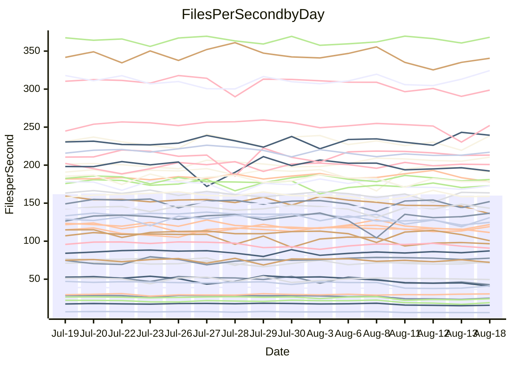

<!---
# This file is auto-generated. Do not edit.
# cspell:disable
--->
# Performance Report

## Daily Performance

## Time to Process Files

| Repository                                      | Elapsed | Min/Avg/Max           |   SD | SD Graph                |
| ----------------------------------------------- | ------: | :-------------------: | ---: | ----------------------- |
| AdaDoom3/AdaDoom3                    |    3.36 | 3.3 /   3.5 /   3.7   | 0.10 | `    ┣━━●━━╋━━┻━━┫    ` |
| alexiosc/megistos                    |    8.08 | 7.4 /   7.8 /   8.5   | 0.27 | `    ┣━━┻━━╋━━●━━┫    ` |
| apollographql/apollo-server          |    2.77 | 2.5 /   2.6 /   2.8   | 0.09 | `     ┣━┻━━╋━━┻●┫     ` |
| aspnetboilerplate/aspnetboilerplate  |   10.72 | 10.1 /  10.7 /  12.2  | 0.41 | `    ┣━━┻━━●━━┻━━┫    ` |
| aws-amplify/docs                     |   13.23 | 12.7 /  13.3 /  14.2  | 0.46 | `    ┣━━┻━━●━━┻━━┫    ` |
| Azure/azure-rest-api-specs           |    9.69 | 9.4 /   9.7 /  11.3   | 0.39 | `    ┣━━┻━━●━━┻━━┫    ` |
| bitjson/typescript-starter           |    1.05 | 0.9 /   1.0 /   1.3   | 0.09 | `     ┣━┻━━╋━●┻━┫     ` |
| caddyserver/caddy                    |    3.67 | 3.6 /   3.8 /   4.1   | 0.16 | `    ┣━━┻●━╋━━┻━━┫    ` |
| canada-ca/open-source-logiciel-libre |    1.16 | 0.9 /   1.0 /   1.2   | 0.08 | `     ┣━┻━━╋━━┻●┫     ` |
| chef/chef                            |    6.31 | 5.9 /   6.3 /   7.7   | 0.37 | `    ┣━━┻━━●━━┻━━┫    ` |
| dart-lang/sdk                        |   67.88 | 63.3 /  67.0 /  72.1  | 1.96 | `  ┣━━━┻━━━╋━●━┻━━━┫  ` |
| django/django                        |   15.75 | 14.8 /  15.6 /  16.4  | 0.34 | `    ┣━━┻━━╋●━┻━━┫    ` |
| eslint/eslint                        |   11.73 | 10.6 /  11.3 /  12.7  | 0.40 | `    ┣━━┻━━╋━━┻●━┫    ` |
| exonum/exonum                        |    3.78 | 3.4 /   3.6 /   4.0   | 0.15 | `    ┣━━┻━━╋━━┻●━┫    ` |
| flutter/samples                      |   17.02 | 16.4 /  17.1 /  18.7  | 0.52 | `   ┣━━━┻━●╋━━┻━━━┫   ` |
| gitbucket/gitbucket                  |    3.47 | 3.5 /   3.6 /   3.9   | 0.13 | `    ┣━━●━━╋━━┻━━┫    ` |
| googleapis/google-cloud-cpp          |  147.34 | 135.4 / 142.6 / 153.9 | 4.66 | `  ┣━━━┻━━━╋━━━●━━━┫  ` |
| graphql/express-graphql              |    1.07 | 1.0 /   1.0 /   1.2   | 0.08 | `     ┣━┻━━╋━●┻━┫     ` |
| graphql/graphql-js                   |    2.92 | 2.6 /   2.8 /   3.2   | 0.13 | `    ┣━━┻━━╋━━●━━┫    ` |
| graphql/graphql-relay-js             |    1.12 | 0.9 /   1.0 /   1.2   | 0.08 | `     ┣━┻━━╋━●┻━┫     ` |
| graphql/graphql-spec                 |    1.02 | 0.9 /   0.9 /   1.1   | 0.06 | `     ┣━┻━━╋━━┻●┫     ` |
| iluwatar/java-design-patterns        |   13.10 | 12.6 /  13.3 /  14.6  | 0.54 | `    ┣━━┻━●╋━━┻━━┫    ` |
| ktaranov/sqlserver-kit               |    6.84 | 6.5 /   6.9 /   7.4   | 0.23 | `    ┣━━┻━━●━━┻━━┫    ` |
| liriliri/licia                       |    4.22 | 4.0 /   4.2 /   4.6   | 0.14 | `    ┣━━┻━━●━━┻━━┫    ` |
| MartinThoma/LaTeX-examples           |    7.02 | 6.8 /   7.0 /   7.5   | 0.16 | `    ┣━━┻━━●━━┻━━┫    ` |
| mdx-js/mdx                           |    1.93 | 1.8 /   1.9 /   2.2   | 0.09 | `     ┣━┻━━╋●━┻━┫     ` |
| microsoft/TypeScript-Website         |    5.56 | 5.5 /   5.9 /   7.3   | 0.34 | `    ┣━━●━━╋━━┻━━┫    ` |
| MicrosoftDocs/PowerShell-Docs        |   26.90 | 23.2 /  24.3 /  27.5  | 0.87 | `   ┣━━━┻━━╋━━┻━━━┫  ●` |
| neovim/nvim-lspconfig                |    4.35 | 4.1 /   4.3 /   4.7   | 0.14 | `    ┣━━┻━━╋●━┻━━┫    ` |
| pagekit/pagekit                      |    3.52 | 3.5 /   3.7 /   4.0   | 0.10 | `    ┣━●┻━━╋━━┻━━┫    ` |
| php/php-src                          |   26.14 | 25.6 /  26.8 /  29.7  | 1.04 | `   ┣━━━┻●━╋━━┻━━━┫   ` |
| plasticrake/tplink-smarthome-api     |    1.45 | 1.1 /   1.2 /   1.4   | 0.09 | `     ┣━┻━━╋━━┻━┫●    ` |
| prettier/prettier                    |    7.05 | 7.1 /   7.3 /   7.7   | 0.17 | `    ┣●━┻━━╋━━┻━━┫    ` |
| pycontribs/jira                      |    1.59 | 1.5 /   1.6 /   1.8   | 0.08 | `     ┣━┻━━╋●━┻━┫     ` |
| RustPython/RustPython                |    5.21 | 5.0 /   5.3 /   5.8   | 0.21 | `    ┣━━┻━●╋━━┻━━┫    ` |
| shoelace-style/shoelace              |    3.23 | 2.7 /   2.9 /   3.3   | 0.13 | `    ┣━━┻━━╋━━┻━━┫ ●  ` |
| slint-ui/slint                       |   12.49 | 11.4 /  12.2 /  14.7  | 0.57 | `    ┣━━┻━━╋━●┻━━┫    ` |
| SoftwareBrothers/admin-bro           |    2.55 | 2.4 /   2.5 /   2.7   | 0.08 | `     ┣━┻━━╋●━┻━┫     ` |
| sveltejs/svelte                      |   21.18 | 20.4 /  21.2 /  21.9  | 0.41 | `   ┣━━━┻━━●━━┻━━━┫   ` |
| TheAlgorithms/Python                 |    5.81 | 5.6 /   6.0 /   6.9   | 0.27 | `    ┣━━┻●━╋━━┻━━┫    ` |
| twbs/bootstrap                       |    1.46 | 1.3 /   1.4 /   1.6   | 0.08 | `     ┣━┻━━╋●━┻━┫     ` |
| typescript-cheatsheets/react         |    1.45 | 1.3 /   1.4 /   1.5   | 0.05 | `     ┣━┻━━╋━━┻●┫     ` |
| typescript-eslint/typescript-eslint  |    4.28 | 4.0 /   4.2 /   4.5   | 0.13 | `    ┣━━┻━━╋━━●━━┫    ` |
| vitest-dev/vitest                    |    9.19 | 8.9 /   9.4 /  10.2   | 0.38 | `    ┣━━┻●━╋━━┻━━┫    ` |
| w3c/aria-practices                   |    3.36 | 3.2 /   3.4 /   3.6   | 0.11 | `    ┣━━┻━●╋━━┻━━┫    ` |
| w3c/specberus                        |    2.05 | 1.8 /   2.0 /   2.6   | 0.17 | `    ┣━━┻━━╋●━┻━━┫    ` |
| webdeveric/webpack-assets-manifest   |    1.32 | 1.0 /   1.1 /   1.2   | 0.08 | `     ┣━┻━━╋━━┻━┫ ●   ` |
| webpack/webpack                      |    5.78 | 5.3 /   5.6 /   6.5   | 0.25 | `    ┣━━┻━━╋━●┻━━┫    ` |
| wireapp/wire-desktop                 |    1.05 | 0.9 /   1.0 /   1.3   | 0.11 | `     ┣━┻━━╋●━┻━┫     ` |
| wireapp/wire-webapp                  |   11.18 | 10.8 /  11.3 /  13.3  | 0.50 | `    ┣━━┻━●╋━━┻━━┫    ` |

Note:
- Elapsed time is in seconds.

## Files per Second over Time

| Repository                                      | Files |    Sec |    Fps |     Rel | Trend Fps              |    N |
| ----------------------------------------------- | ----: | -----: | -----: | ------: | ---------------------- | ---: |
| AdaDoom3/AdaDoom3                    |   103 |   3.36 |  30.62 |   2.95% | `▇▆▆█▇▇▆▇▇▇▆▅▇█▇▅▇█▇█` |   29 |
| alexiosc/megistos                    |   583 |   8.08 |  72.13 |  -3.83% | `█▅█▄▆█▇█▇▇▆▆▅█▆▇▄▆▇▅` |   29 |
| apollographql/apollo-server          |   252 |   2.77 |  90.83 |  -5.11% | `██▇▅▅▆▄▇▆▆▇▇▇▆▇▇██▄▅` |   29 |
| aspnetboilerplate/aspnetboilerplate  |  2286 |  10.72 | 213.27 |   0.06% | `▆▆▃█▆▆▅█▇▆▇▇█▆▇▆█▇▅▆` |   29 |
| aws-amplify/docs                     |  2871 |  13.23 | 217.00 |   0.25% | `▇██▇▄▇▇█▇▄▆▇▅▆▇▆▄▇▅▇` |   29 |
| Azure/azure-rest-api-specs           |  2443 |   9.69 | 252.21 |   0.64% | `▇███▇█▇▇▇▇█▇█▇▇▇█▆▃▇` |   29 |
| bitjson/typescript-starter           |    20 |   1.05 |  19.10 |  -8.04% | `▅▇▇▆▇█▇▇▇▇█▅▄▅▅▃▄▄▂▅` |   29 |
| caddyserver/caddy                    |   285 |   3.67 |  77.65 |   2.81% | `▇▄▆▇▅▇▇██▆██▇██▇▇▆▇▇` |   29 |
| canada-ca/open-source-logiciel-libre |     7 |   1.16 |   6.05 | -12.06% | `██▅█▆▆▆▆▇▆█▄▃▂▄▄▄▃▃▃` |   29 |
| chef/chef                            |  1207 |   6.31 | 191.14 |  -0.14% | `▅▇▆▇▇▆▇▂▇▇▃▇▆▇▇█▇▇▇▆` |   29 |
| dart-lang/sdk                        | 10790 |  67.88 | 158.95 |  -0.81% | `▇▆▆▇▇▅▆▇▄▇▄▆▅▆█▇▇▆▅▆` |   29 |
| django/django                        |  2852 |  15.75 | 181.07 |  -0.71% | `▆▅▅▅▆▆▇▆▇▅▅▆▆█▆▆▆▆▄▆` |   29 |
| eslint/eslint                        |  2090 |  11.73 | 178.10 |  -3.73% | `▆▆▇▆▇▆▇▅▇▅▆▇▆▇▇██▇▅▅` |   29 |
| exonum/exonum                        |   421 |   3.78 | 111.39 |  -5.76% | `▇▅▆█▄█▆▇▆█▇▇▄▆▅▆▇▅▆▅` |   29 |
| flutter/samples                      |  2438 |  17.02 | 143.28 |  -0.14% | `▇▇▆▇▇█▇▅▇█▄▇█▆▆▇▆██▇` |   29 |
| gitbucket/gitbucket                  |   413 |   3.47 | 119.19 |   4.38% | `▄▇█▇▅▇████▇█▇▆▅▅█▇▆█` |   29 |
| googleapis/google-cloud-cpp          | 20603 | 147.34 | 139.83 |  -3.19% | `▇█▇█▅▇▆▇▆▇▇▇▅█▆▆▄▅▆▅` |   29 |
| graphql/express-graphql              |    26 |   1.07 |  24.23 |  -4.63% | `▇██▇▇█▆▇███▃▃▄▄▃▅▄▃▅` |   29 |
| graphql/graphql-js                   |   364 |   2.92 | 124.81 |  -5.27% | `▇███▇██▅▇▇▇▄▆▄▅▆▆▆▃▅` |   29 |
| graphql/graphql-relay-js             |    28 |   1.12 |  25.07 |  -7.14% | `▇██████▆▇▇▇▄▄▃▃▄▄▃▃▅` |   29 |
| graphql/graphql-spec                 |    16 |   1.02 |  15.67 |  -8.71% | `▇█▇██▇▇▆▇▇█▅▅▅▃▅▅▃▄▄` |   29 |
| iluwatar/java-design-patterns        |  1992 |  13.10 | 152.10 |   1.15% | `▃▇▇▆▇▇▇▇▇▄▄█▆▇▇█▇▅▅▇` |   29 |
| ktaranov/sqlserver-kit               |   489 |   6.84 |  71.44 |   0.22% | `▇█▆▄▅▇█▆▆▄▆▆▇▆██▆▆█▆` |   29 |
| liriliri/licia                       |  1437 |   4.22 | 340.52 |  -0.26% | `▆▇█▇█▅▆▆▇▇█▆▆▅▆▄▄▅▆▆` |   29 |
| MartinThoma/LaTeX-examples           |  1409 |   7.02 | 200.81 |   0.33% | `█▇█▅▇▇▇▇▇▇▆██▇█▇▅▇▇▇` |   29 |
| mdx-js/mdx                           |   141 |   1.93 |  73.04 |  -1.66% | `▇█▄█▆▇▇███▆▅▆▅▆▃▆▄▆▆` |   29 |
| microsoft/TypeScript-Website         |   761 |   5.56 | 136.82 |   5.23% | `▆▇█▇█▇█▇▆▆▂████▆█▇██` |   29 |
| MicrosoftDocs/PowerShell-Docs        |  2708 |  26.90 | 100.66 |  -9.96% | `▇▇▆▆▆█▇▆▆▇▃▇▇▇▇▇█▆▆▄` |   29 |
| neovim/nvim-lspconfig                |   752 |   4.35 | 172.92 |  -0.88% | `▇█▅▇██▄▇▄▇▇▅▇▆█▆▇▆▆▆` |   29 |
| pagekit/pagekit                      |   741 |   3.52 | 210.46 |   3.89% | `▄▇▇▆▆▅▆▇▅▇███▇▇▇▇▆██` |   29 |
| php/php-src                          |  2281 |  26.14 |  87.25 |   2.38% | `▆▇▆▄▇█▅▃▇█▇▇▆▅▇▆█▆▇▇` |   29 |
| plasticrake/tplink-smarthome-api     |    62 |   1.45 |  42.85 | -14.15% | `█▇▇▆██▃██▇▆▄▄▃▃▃▄▄▄▂` |   29 |
| prettier/prettier                    |  2286 |   7.05 | 324.40 |   4.42% | `▅▅▅▇▆▆▆▅▇▇▇▆▆▄▅▆▆▆██` |   29 |
| pycontribs/jira                      |    79 |   1.59 |  49.59 |  -1.31% | `▇█▄█▄▄▅▅█▆▇▆▇▇▇▆▇▅█▆` |   29 |
| RustPython/RustPython                |   683 |   5.21 | 131.02 |   1.63% | `▇▆▇▇██▆█▆█▆▄▇▆▆▆▆▄▃▇` |   29 |
| shoelace-style/shoelace              |   439 |   3.23 | 136.12 | -10.79% | `█▇▆██▃██▆▆▆▆▅▆▆▅▅▅▅▃` |   29 |
| slint-ui/slint                       |  2230 |  12.49 | 178.57 |  -1.69% | `▆██▇█▆███▇▇▇▃█▇▇█▆▇▇` |   29 |
| SoftwareBrothers/admin-bro           |   441 |   2.55 | 172.80 |  -1.03% | `█▇▄▇▇▆█▆▇██▆▅▆▆▅▆▅▆▆` |   29 |
| sveltejs/svelte                      |  7799 |  21.18 | 368.14 |   0.89% | `▇█▇▆▇█▆▆▇▆▆▇█▇█▆█▆▇▇` |   29 |
| TheAlgorithms/Python                 |  1390 |   5.81 | 239.31 |   3.42% | `▆▇▆▅█▆▅▆▆▇▇▇█▃▇▆▃█▇▇` |   29 |
| twbs/bootstrap                       |   118 |   1.46 |  80.70 |  -2.08% | `█▇▆▇▆▄▇█▅██▄▅▅▅▃▃▄▄▆` |   29 |
| typescript-cheatsheets/react         |    53 |   1.45 |  36.51 |  -4.53% | `▇▇██▄█▇▅█▇▇▆▇▅▇▇▅▅▆▅` |   29 |
| typescript-eslint/typescript-eslint  |  1279 |   4.28 | 298.69 |  -2.62% | `██▅▇█▇▇█▇▇▇▅▆▆▆▆▆▄▆▆` |   29 |
| vitest-dev/vitest                    |  2193 |   9.19 | 238.65 |   3.90% | `▄█▇▆███▅▆▇▇▅▆▆▅▇▇▆▄█` |   29 |
| w3c/aria-practices                   |   409 |   3.36 | 121.90 |   1.02% | `▆█▆▅▄▇▅▆▆▆█▆▅▆▅▄▅▄▄▆` |   29 |
| w3c/specberus                        |   198 |   2.05 |  96.65 |  -6.05% | `██▆██▂▇██▇▇▆▅▅▆▆▆▆▆▆` |   29 |
| webdeveric/webpack-assets-manifest   |    54 |   1.32 |  40.85 | -17.87% | `▇▃▄█▇▇▇▇▆▆▅▃▄▄▄▃▃▃▄▁` |   29 |
| webpack/webpack                      |  1111 |   5.78 | 192.32 |  -3.00% | `▇▃▅█▅██▇▆▇▇▆▅▆▆▆▆▇▆▆` |   29 |
| wireapp/wire-desktop                 |    43 |   1.05 |  41.09 |  -6.04% | `▇▇▇█▄██▇█▇▇▃▄▆▅▅▂▅▄▅` |   29 |
| wireapp/wire-webapp                  |  1828 |  11.18 | 163.52 |   1.20% | `▆█▇▆▇▇▇█▇▆▆█▆▇▇▅▃▇█▇` |   29 |

## Data Throughput

| Repository                                      | Files |    Sec |     Kps |     Rel | Trend Kps              |    N |
| ----------------------------------------------- | ----: | -----: | ------: | ------: | ---------------------- | ---: |
| AdaDoom3/AdaDoom3                    |   103 |   3.36 |  650.72 |   2.95% | `▇▆▆█▇▇▆▇▇▇▆▅▇█▇▅▇█▇█` |   29 |
| alexiosc/megistos                    |   583 |   8.08 |  566.76 |  -3.83% | `█▅█▄▆█▇█▇▇▆▆▅█▆▇▄▆▇▅` |   29 |
| apollographql/apollo-server          |   252 |   2.77 |  730.63 |  -5.11% | `██▇▅▅▆▄▇▆▆▇▇▇▆▇▇██▄▅` |   29 |
| aspnetboilerplate/aspnetboilerplate  |  2286 |  10.72 |  518.81 |   1.52% | `▆▆▃█▆▆▆█▇▇▇██▆▇▆██▆▇` |   29 |
| aws-amplify/docs                     |  2871 |  13.23 |  757.72 |   0.38% | `▇██▇▄▇▇█▇▄▆▇▅▆▇▆▄▇▅▇` |   29 |
| Azure/azure-rest-api-specs           |  2443 |   9.69 |  670.93 |  -0.28% | `▇███▇█▇▇▇▇▇▇█▇▇▇█▆▃▇` |   29 |
| bitjson/typescript-starter           |    20 |   1.05 |   76.41 |  -8.04% | `▅▇▇▆▇█▇▇▇▇█▅▄▅▅▃▄▄▂▅` |   29 |
| caddyserver/caddy                    |   285 |   3.67 |  662.09 |   3.08% | `▇▄▆▇▅▇▇██▆██▇██▇▇▇▇▇` |   29 |
| canada-ca/open-source-logiciel-libre |     7 |   1.16 |   50.14 | -12.06% | `██▅█▆▆▆▆▇▆█▄▃▂▄▄▄▃▃▃` |   29 |
| chef/chef                            |  1207 |   6.31 |  882.70 |  -0.03% | `▅▇▆▇▇▆▇▂▇▇▃▇▆▇▇█▇▇▇▆` |   29 |
| dart-lang/sdk                        | 10790 |  67.88 | 1072.06 |  -1.40% | `▇▆▆▇▇▆▆▇▄▇▄▆▅▆█▇▇▆▅▆` |   29 |
| django/django                        |  2852 |  15.75 | 1135.53 |  -0.26% | `▆▅▅▅▆▆▇▆▇▅▅▆▆█▆▆▆▆▄▆` |   29 |
| eslint/eslint                        |  2090 |  11.73 | 1294.00 |  -3.55% | `▅▆▇▆▇▆▇▆▇▅▆▇▆▇▇██▇▆▅` |   29 |
| exonum/exonum                        |   421 |   3.78 | 1065.52 |  -5.76% | `▇▅▆█▄█▆▇▆█▇▇▄▆▅▆▇▅▆▅` |   29 |
| flutter/samples                      |  2438 |  17.02 | 1266.73 |   0.47% | `▇▇▆▇▇█▇▅▇█▄▇█▆▆▇▆██▇` |   29 |
| gitbucket/gitbucket                  |   413 |   3.47 |  541.69 |   4.64% | `▄▇▇▇▅▇████▇█▇▆▅▅█▇▆█` |   29 |
| googleapis/google-cloud-cpp          | 20603 | 147.34 | 1128.57 |  -2.79% | `▇█▇█▅▇▆▇▆▇▇▇▅█▆▆▄▅▇▅` |   29 |
| graphql/express-graphql              |    26 |   1.07 |  110.89 |  -4.63% | `▇██▇▇█▆▇███▃▃▄▄▃▅▄▃▅` |   29 |
| graphql/graphql-js                   |   364 |   2.92 |  717.30 |  -5.27% | `▇███▇██▅▇▇▇▄▆▄▅▆▆▆▃▅` |   29 |
| graphql/graphql-relay-js             |    28 |   1.12 |   98.48 |  -7.14% | `▇██████▆▇▇▇▄▄▃▃▄▄▃▃▅` |   29 |
| graphql/graphql-spec                 |    16 |   1.02 |  568.20 |  -8.71% | `▇█▇██▇▇▆▇▇█▅▅▅▃▅▅▃▄▄` |   29 |
| iluwatar/java-design-patterns        |  1992 |  13.10 |  470.13 |   1.15% | `▃▇▇▆▇▇▇▇▇▄▄█▆▇▇█▇▅▅▇` |   29 |
| ktaranov/sqlserver-kit               |   489 |   6.84 | 1081.45 |   0.22% | `▇█▆▄▅▇█▆▆▄▆▆▇▆██▆▆█▆` |   29 |
| liriliri/licia                       |  1437 |   4.22 |  405.68 |  -0.26% | `▆▇█▇█▅▆▆▇▇█▆▆▅▆▄▄▅▆▆` |   29 |
| MartinThoma/LaTeX-examples           |  1409 |   7.02 |  414.72 |   0.33% | `█▇█▅▇▇▇▇▇▇▆██▇█▇▅▇▇▇` |   29 |
| mdx-js/mdx                           |   141 |   1.93 |  339.83 |  -1.54% | `▇█▄█▆▇▇███▆▅▆▅▆▃▆▄▆▆` |   29 |
| microsoft/TypeScript-Website         |   761 |   5.56 |  946.25 |   5.33% | `▆▇█▇█▇█▇▆▆▂████▆█▇██` |   29 |
| MicrosoftDocs/PowerShell-Docs        |  2708 |  26.90 | 1034.63 |  -9.94% | `▇▇▆▆▆█▇▆▆▇▃▇▇▇▇▇█▆▆▄` |   29 |
| neovim/nvim-lspconfig                |   752 |   4.35 |  281.45 |   0.26% | `▇█▅▇██▄▇▄▇▇▅▇▆█▆▇▆▆▇` |   29 |
| pagekit/pagekit                      |   741 |   3.52 |  438.82 |   3.89% | `▄▇▇▆▆▅▆▇▅▇███▇▇▇▇▆██` |   29 |
| php/php-src                          |  2281 |  26.14 | 1518.90 |   2.61% | `▆▇▆▄▇█▅▃▇█▇▇▇▆▇▆█▆▇▇` |   29 |
| plasticrake/tplink-smarthome-api     |    62 |   1.45 |  231.53 | -14.15% | `█▇▇▆██▃██▇▆▄▄▃▃▃▄▄▄▂` |   29 |
| prettier/prettier                    |  2286 |   7.05 |  460.21 |   4.28% | `▅▅▅▇▆▆▆▅▇▇█▆▆▄▅▆▆▆██` |   29 |
| pycontribs/jira                      |    79 |   1.59 |  351.50 |  -1.51% | `▇█▄█▄▄▅▅█▆▇▆▇▇▇▆▇▅█▆` |   29 |
| RustPython/RustPython                |   683 |   5.21 | 1027.85 |   1.81% | `▇▆▇▇██▆█▆█▆▄▇▆▆▆▆▄▃▇` |   29 |
| shoelace-style/shoelace              |   439 |   3.23 |  657.64 | -10.79% | `█▇▆██▃██▆▆▆▆▅▆▆▅▅▅▅▃` |   29 |
| slint-ui/slint                       |  2230 |  12.49 | 1162.70 |  -1.49% | `▆██▇█▆███▇█▇▃█▇▇█▇▇▇` |   29 |
| SoftwareBrothers/admin-bro           |   441 |   2.55 |  380.86 |  -1.03% | `█▇▄▇▇▆█▆▇██▆▅▆▆▅▆▅▆▆` |   29 |
| sveltejs/svelte                      |  7799 |  21.18 |  246.45 |   1.05% | `▇█▇▆▇█▆▆▇▆▇▇█▇█▆█▆▇▇` |   29 |
| TheAlgorithms/Python                 |  1390 |   5.81 |  607.39 |   3.42% | `▆▇▆▅█▆▅▆▆▇▇▇█▃▇▆▃█▇▇` |   29 |
| twbs/bootstrap                       |   118 |   1.46 |  662.66 |  -2.08% | `█▇▆▇▆▄▇█▅██▄▅▅▅▃▃▄▄▆` |   29 |
| typescript-cheatsheets/react         |    53 |   1.45 |  266.57 |  -4.53% | `▇▇██▄█▇▅█▇▇▆▇▅▇▇▅▅▆▅` |   29 |
| typescript-eslint/typescript-eslint  |  1279 |   4.28 | 1521.24 |  -2.82% | `██▅▇█▇▇█▇▇▇▅▆▆▆▆▆▄▆▆` |   29 |
| vitest-dev/vitest                    |  2193 |   9.19 |  536.17 |   5.70% | `▃▇▆▆▇▇█▅▇█▇▆▇▇▆██▆▅█` |   29 |
| w3c/aria-practices                   |   409 |   3.36 | 1134.35 |   1.05% | `▆█▆▅▄▇▅▆▆▆█▆▅▆▅▄▅▄▄▆` |   29 |
| w3c/specberus                        |   198 |   2.05 |  303.61 |  -5.20% | `██▆██▂▇██▇▇▆▅▅▆▆▆▆▆▆` |   29 |
| webdeveric/webpack-assets-manifest   |    54 |   1.32 |   96.08 | -17.47% | `▇▃▄█▇▇▇▇▆▆▅▄▄▄▄▃▃▄▄▁` |   29 |
| webpack/webpack                      |  1111 |   5.78 |  872.44 |  -2.65% | `▇▃▅█▅██▇▆▇▇▆▅▆▆▆▆▇▆▆` |   29 |
| wireapp/wire-desktop                 |    43 |   1.05 |  181.55 |  -6.04% | `▇▇▇█▄██▇█▇▇▃▄▆▅▅▂▅▄▅` |   29 |
| wireapp/wire-webapp                  |  1828 |  11.18 |  584.48 |   1.47% | `▆█▇▆▇▇██▇▆▆█▆▇▇▅▃▇█▇` |   29 |

