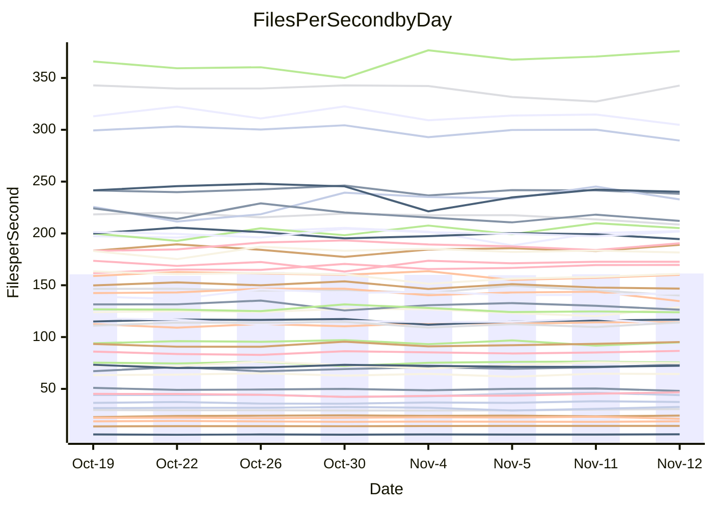

<!---
# This file is auto-generated. Do not edit.
# cspell:disable
--->
# Performance Report

## Daily Performance

## Time to Process Files

| Repository                                      | Elapsed | Min/Avg/Max           |   SD | SD Graph                |
| ----------------------------------------------- | ------: | :-------------------: | ---: | ----------------------- |
| AdaDoom3/AdaDoom3                    |    3.40 | 3.3 /   3.5 /   3.7   | 0.09 | `    ┣━━●━━╋━━┻━━┫    ` |
| alexiosc/megistos                    |    7.68 | 7.3 /   8.0 /   8.7   | 0.37 | `    ┣━━┻●━╋━━┻━━┫    ` |
| apollographql/apollo-server          |    2.66 | 2.6 /   2.7 /   2.9   | 0.08 | `     ┣━●━━╋━━┻━┫     ` |
| aspnetboilerplate/aspnetboilerplate  |   10.25 | 10.3 /  10.6 /  11.8  | 0.33 | `    ┣━━●━━╋━━┻━━┫    ` |
| aws-amplify/docs                     |   13.58 | 12.4 /  13.2 /  14.8  | 0.59 | `    ┣━━┻━━╋━●┻━━┫    ` |
| Azure/azure-rest-api-specs           |    9.98 | 9.6 /  10.0 /  11.0   | 0.37 | `    ┣━━┻━━●━━┻━━┫    ` |
| bitjson/typescript-starter           |    1.07 | 1.0 /   1.1 /   1.1   | 0.03 | `     ┣━┻━●╋━━┻━┫     ` |
| caddyserver/caddy                    |    3.92 | 3.7 /   3.8 /   4.0   | 0.09 | `    ┣━━┻━━╋━━┻●━┫    ` |
| canada-ca/open-source-logiciel-libre |    1.11 | 1.1 /   1.2 /   1.3   | 0.04 | `     ┣●┻━━╋━━┻━┫     ` |
| chef/chef                            |    5.98 | 5.7 /   6.0 /   6.3   | 0.16 | `    ┣━━┻━━●━━┻━━┫    ` |
| dart-lang/sdk                        |   66.96 | 63.7 /  67.4 /  72.3  | 2.15 | `  ┣━━━┻━━●╋━━━┻━━━┫  ` |
| django/django                        |   15.81 | 14.9 /  15.8 /  16.7  | 0.45 | `    ┣━━┻━━●━━┻━━┫    ` |
| eslint/eslint                        |   10.68 | 10.7 /  11.2 /  11.8  | 0.37 | `    ┣●━┻━━╋━━┻━━┫    ` |
| exonum/exonum                        |    3.89 | 3.5 /   3.6 /   3.8   | 0.09 | `    ┣━━┻━━╋━━┻━━┫ ●  ` |
| flutter/samples                      |   18.96 | 16.0 /  16.7 /  17.5  | 0.41 | `      ┣━┻━╋━┻━┫     ●` |
| gitbucket/gitbucket                  |    3.72 | 3.5 /   3.7 /   3.9   | 0.11 | `    ┣━━┻━━╋●━┻━━┫    ` |
| googleapis/google-cloud-cpp          |  143.95 | 139.9 / 148.0 / 158.3 | 4.71 | `  ┣━━━●━━━╋━━━┻━━━┫  ` |
| graphql/express-graphql              |    1.20 | 1.1 /   1.2 /   1.3   | 0.04 | `     ┣━┻━━╋━●┻━┫     ` |
| graphql/graphql-js                   |    2.85 | 2.8 /   3.0 /   3.2   | 0.10 | `    ┣━━●━━╋━━┻━━┫    ` |
| graphql/graphql-relay-js             |    1.15 | 1.1 /   1.2 /   1.2   | 0.04 | `     ┣━┻●━╋━━┻━┫     ` |
| graphql/graphql-spec                 |    1.38 | 1.3 /   1.3 /   1.4   | 0.04 | `     ┣━┻━━╋━●┻━┫     ` |
| iluwatar/java-design-patterns        |   13.43 | 12.8 /  13.3 /  14.4  | 0.37 | `    ┣━━┻━━╋●━┻━━┫    ` |
| ktaranov/sqlserver-kit               |    6.97 | 6.6 /   6.8 /   7.1   | 0.17 | `    ┣━━┻━━╋━━●━━┫    ` |
| liriliri/licia                       |    4.15 | 4.1 /   4.3 /   4.6   | 0.12 | `    ┣━━●━━╋━━┻━━┫    ` |
| MartinThoma/LaTeX-examples           |    7.17 | 6.8 /   7.1 /   7.6   | 0.20 | `    ┣━━┻━━╋━●┻━━┫    ` |
| mdx-js/mdx                           |    1.91 | 1.9 /   2.0 /   2.2   | 0.08 | `     ┣●┻━━╋━━┻━┫     ` |
| microsoft/TypeScript-Website         |    6.45 | 5.5 /   5.8 /   6.1   | 0.14 | `      ┣━┻━╋━┻━┫     ●` |
| MicrosoftDocs/PowerShell-Docs        |   24.22 | 23.3 /  24.2 /  25.4  | 0.65 | `   ┣━━━┻━━●━━┻━━━┫   ` |
| neovim/nvim-lspconfig                |    4.39 | 4.3 /   4.4 /   4.6   | 0.08 | `    ┣━━┻━●╋━━┻━━┫    ` |
| pagekit/pagekit                      |    3.63 | 3.5 /   3.7 /   4.0   | 0.15 | `    ┣━━┻━●╋━━┻━━┫    ` |
| php/php-src                          |   26.26 | 25.9 /  26.9 /  28.5  | 0.78 | `   ┣━━━●━━╋━━┻━━━┫   ` |
| plasticrake/tplink-smarthome-api     |    1.33 | 1.3 /   1.4 /   1.5   | 0.05 | `     ┣●┻━━╋━━┻━┫     ` |
| prettier/prettier                    |    8.31 | 7.2 /   7.6 /   7.9   | 0.19 | `    ┣━━┻━━╋━━┻━━┫   ●` |
| pycontribs/jira                      |    1.66 | 1.5 /   1.6 /   1.7   | 0.06 | `     ┣━┻━━╋━━●━┫     ` |
| RustPython/RustPython                |    5.50 | 5.2 /   5.5 /   6.0   | 0.25 | `    ┣━━┻━━●━━┻━━┫    ` |
| shoelace-style/shoelace              |    3.08 | 2.9 /   3.0 /   3.2   | 0.08 | `     ┣━┻━━╋━●┻━┫     ` |
| slint-ui/slint                       |   13.65 | 13.3 /  13.8 /  14.4  | 0.37 | `    ┣━━┻━●╋━━┻━━┫    ` |
| SoftwareBrothers/admin-bro           |    2.62 | 2.5 /   2.7 /   2.9   | 0.07 | `     ┣━┻━●╋━━┻━┫     ` |
| sveltejs/svelte                      |   21.36 | 20.8 /  21.9 /  22.9  | 0.47 | `   ┣━━●┻━━╋━━┻━━━┫   ` |
| TheAlgorithms/Python                 |    5.66 | 5.7 /   5.8 /   6.1   | 0.11 | `    ┣━●┻━━╋━━┻━━┫    ` |
| twbs/bootstrap                       |    1.81 | 1.8 /   1.9 /   2.0   | 0.06 | `     ┣━┻●━╋━━┻━┫     ` |
| typescript-cheatsheets/react         |    1.40 | 1.4 /   1.4 /   1.6   | 0.06 | `     ┣━┻●━╋━━┻━┫     ` |
| typescript-eslint/typescript-eslint  |    4.43 | 4.2 /   4.3 /   4.5   | 0.08 | `    ┣━━┻━━╋━━┻━●┫    ` |
| vitest-dev/vitest                    |   10.16 | 9.2 /   9.9 /  10.9   | 0.49 | `    ┣━━┻━━╋━●┻━━┫    ` |
| w3c/aria-practices                   |    3.52 | 3.4 /   3.6 /   3.8   | 0.09 | `    ┣━━┻●━╋━━┻━━┫    ` |
| w3c/specberus                        |    2.08 | 2.0 /   2.1 /   2.2   | 0.05 | `     ┣━┻━━●━━┻━┫     ` |
| webdeveric/webpack-assets-manifest   |    1.24 | 1.2 /   1.2 /   1.3   | 0.04 | `     ┣━┻━━╋●━┻━┫     ` |
| webpack/webpack                      |    5.62 | 5.5 /   5.7 /   6.7   | 0.25 | `    ┣━━┻━●╋━━┻━━┫    ` |
| wireapp/wire-desktop                 |    1.41 | 1.4 /   1.5 /   1.7   | 0.09 | `     ┣━┻●━╋━━┻━┫     ` |
| wireapp/wire-webapp                  |   11.68 | 10.6 /  11.2 /  12.3  | 0.48 | `    ┣━━┻━━╋━━●━━┫    ` |

Note:
- Elapsed time is in seconds.

## Files per Second over Time

| Repository                                      | Files |    Sec |    Fps |     Rel | Trend Fps              |    N |
| ----------------------------------------------- | ----: | -----: | -----: | ------: | ---------------------- | ---: |
| AdaDoom3/AdaDoom3                    |   103 |   3.40 |  30.30 |   2.76% | `▇▇▅▇▅▇▆▆▆▅▆▆▄▆▇██▄█▇` |   19 |
| alexiosc/megistos                    |   583 |   7.68 |  75.96 |   3.41% | `▅▇▄▄▅█▆▅▅▃▅▄▄▇▇▆▇▆▆▆` |   19 |
| apollographql/apollo-server          |   253 |   2.66 |  95.21 |   3.07% | `▇█▆▇▄▅▆▆█▇▅▇▇▄▇█▇▅██` |   19 |
| aspnetboilerplate/aspnetboilerplate  |  2286 |  10.25 | 223.01 |   3.32% | `▆███▇▆▇██▇█▇▇█▆▆▇▆▄█` |   19 |
| aws-amplify/docs                     |  2871 |  13.58 | 211.49 |  -3.13% | `█▇▆▇▅███▇▇▅▇▆▆▃█▇▅▆▅` |   19 |
| Azure/azure-rest-api-specs           |  2365 |   9.98 | 237.00 |  -1.18% | `▅▇▇▆█▇█▇▇▃▅▅▆▇▅▆▇▇▇▆` |   19 |
| bitjson/typescript-starter           |    20 |   1.07 |  18.66 |   0.68% | `▆▇█▇█▇▇▆▆▆▆▅▇▇▅▄▅▇▇▇` |   19 |
| caddyserver/caddy                    |   288 |   3.92 |  73.44 |  -2.87% | `▇▆▇▆▆▇▇█▅▅█▆▆██▇█▇█▆` |   19 |
| canada-ca/open-source-logiciel-libre |     7 |   1.11 |   6.29 |   5.75% | `▆▇▆▄▆▇▇▆▅▇▇▇▄▆▇▆▄█▇█` |   19 |
| chef/chef                            |  1191 |   5.98 | 199.21 |  -0.23% | `▇▆▇█▇▆█▆▅▇▅▄█▇▇▆▇▆▄▆` |   19 |
| dart-lang/sdk                        | 10747 |  66.96 | 160.50 |   0.93% | `▇▇██▆█▇▅▆▅▄▅▇▆▅▆▆▅▇▆` |   19 |
| django/django                        |  2885 |  15.81 | 182.53 |  -0.18% | `▅▅█▄▅▇▆█▆▇▇▇▄▇▆▆▇▇▆▆` |   19 |
| eslint/eslint                        |  2099 |  10.68 | 196.56 |   5.20% | `▅▄▇▇▄▇▇▇▇▅█▆▇▄▇▅▇▄▆█` |   19 |
| exonum/exonum                        |   421 |   3.89 | 108.13 |  -6.47% | `██▇▆█▆▆▅▇▆▇▅▇█▇██▇▇▄` |   19 |
| flutter/samples                      |  2400 |  18.96 | 126.61 | -11.78% | `▆▆▇▇▅█▆█▇▆▅█▅▆▆▇▇▅▆▁` |   19 |
| gitbucket/gitbucket                  |   413 |   3.72 | 111.10 |  -1.49% | `▅▆█▅▅▇▆▆▆▅█▆█▄▇▆█▆█▆` |   19 |
| googleapis/google-cloud-cpp          | 20952 | 143.95 | 145.56 |   3.13% | `▆▅▆▇▄▇██▇█▆▆▅█▅▅▆▇▆▇` |   19 |
| graphql/express-graphql              |    26 |   1.20 |  21.59 |  -3.07% | `▅▅▅▆▄▄▅▅▅▅▆▅▅▅▅▅█▆▃▄` |   19 |
| graphql/graphql-js                   |   368 |   2.85 | 129.06 |   3.99% | `█▇▅▆█▆█▆█▇█▇▇▅▆▆▄▇██` |   19 |
| graphql/graphql-relay-js             |    28 |   1.15 |  24.35 |   2.27% | `▄▅▄▇▅▆▆▇▇▇▅▅▆█▆▆▅▅▆▇` |   19 |
| graphql/graphql-spec                 |    19 |   1.38 |  13.78 |  -2.54% | `▅▆▆▅▇▄█▆▆▇▆▇▆▇█▇▆▇█▅` |   19 |
| iluwatar/java-design-patterns        |  1992 |  13.43 | 148.36 |  -0.89% | `▇▇▆█▇█▇▅█▄█▇▇▇▇▆▆▇▆▆` |   19 |
| ktaranov/sqlserver-kit               |   489 |   6.97 |  70.16 |  -2.19% | `██▇▅▆▆▅▇▇▇▇▆▇▅▇▇▅▆█▆` |   19 |
| liriliri/licia                       |  1437 |   4.15 | 346.45 |   2.82% | `█▇█▇▇█▇▇██▇█▆▆▆▄█▆▇█` |   19 |
| MartinThoma/LaTeX-examples           |  1409 |   7.17 | 196.51 |  -1.63% | `▇█▆▇▆▄█▆█▆▇▅▆▇▇▇▆▆█▆` |   19 |
| mdx-js/mdx                           |   141 |   1.91 |  73.73 |   6.24% | `▃▆▅▇▇▄▆▅▆▆█▆▇▅▅▇▇▆██` |   19 |
| microsoft/TypeScript-Website         |   761 |   6.45 | 117.93 | -10.63% | `▆▆▇▅▇▇█▇▄▅▇█▇▆▆▅▆▇▇▂` |   19 |
| MicrosoftDocs/PowerShell-Docs        |  2708 |  24.22 | 111.80 |  -0.30% | `▇▆▆▇██▅█▇▄▆██▆▆▅▅▆█▆` |   19 |
| neovim/nvim-lspconfig                |   759 |   4.39 | 172.72 |   0.63% | `██▆▅▇▇▇▇▅▇█▇▇▆▇▇▇█▇▇` |   19 |
| pagekit/pagekit                      |   741 |   3.63 | 203.93 |   0.73% | `▇█▃▅▄▇▇▆▆█▇▅▇▅▇█▇█▇▇` |   19 |
| php/php-src                          |  2262 |  26.26 |  86.14 |   1.67% | `▇█▇█▄▇▅▅▇▇▆▇█▄▆▇▆▇█▇` |   19 |
| plasticrake/tplink-smarthome-api     |    62 |   1.33 |  46.63 |   4.98% | `▇▆▇▆▇▆▅▇▄▄▆▆▄▅▆▆█▆██` |   19 |
| prettier/prettier                    |  2421 |   8.31 | 291.27 |  -7.38% | `▆▆▆█▇▅▅██▅▆▆▇▆▆▆▇▇▇▃` |   19 |
| pycontribs/jira                      |    79 |   1.66 |  47.73 |  -4.16% | `█▆▇▆▅▄▆█▆▆▅▄█▆▇▇█▆▅▅` |   19 |
| RustPython/RustPython                |   693 |   5.50 | 125.97 |   0.21% | `▆▇▆▅█▅▄██▇▆▇▃▆▆▇▇▄▅▆` |   19 |
| shoelace-style/shoelace              |   439 |   3.08 | 142.72 |  -2.07% | `▇▇▅▆▆▆▅▆▆▇▄▇█▆▆▇▆▆▄▅` |   19 |
| slint-ui/slint                       |  2565 |  13.65 | 187.88 |   1.72% | `▅▇▇█▇▅▇█▅▆▇█▆▅█▆▅▇█▇` |   19 |
| SoftwareBrothers/admin-bro           |   441 |   2.62 | 168.13 |   1.15% | `▆▇▄▇▆▇▆▆▇▇▆▇▇▆▇█▆▇█▇` |   19 |
| sveltejs/svelte                      |  8053 |  21.36 | 377.03 |   2.95% | `▆▆▇▆▅▅▅▆▄█▆▆▆▆▇▆▆█▇▇` |   19 |
| TheAlgorithms/Python                 |  1399 |   5.66 | 247.17 |   2.72% | `▇▇▇▇▆█▇▇█▆▇▆▇█▇▇▆█▅█` |   19 |
| twbs/bootstrap                       |   118 |   1.81 |  65.14 |   2.38% | `▄▇█▇▆▇█▇▆█▆▆▆▄▅██▆▆▇` |   19 |
| typescript-cheatsheets/react         |    53 |   1.40 |  37.89 |   3.14% | `▆▆▆▇▆▇▃▅▅▄██▅▇▄█▆█▆▇` |   19 |
| typescript-eslint/typescript-eslint  |  1285 |   4.43 | 290.22 |  -2.98% | `▇▇▇█▇▇█▆█▇▅▇▇▇▇▆█▇▅▆` |   19 |
| vitest-dev/vitest                    |  2339 |  10.16 | 230.21 |   0.07% | `▄▆▅▄▃▃▄▅▇▇▅▅▇▆▆█▇█▆▆` |   19 |
| w3c/aria-practices                   |   414 |   3.52 | 117.46 |   1.71% | `▆▅██▆▇▆▇▇▆▄▇▅▅▇▇█▅▇▇` |   19 |
| w3c/specberus                        |   197 |   2.08 |  94.65 |  -0.17% | `▇▆▇█▇▇▆███▅▇███▅▇▅▇▇` |   19 |
| webdeveric/webpack-assets-manifest   |    55 |   1.24 |  44.18 |  -0.74% | `▅▆▆▆▅▇▅▅▄▅▄▇▅▇▆▇▆█▅▅` |   19 |
| webpack/webpack                      |  1141 |   5.62 | 203.13 |   2.78% | `▇█▆▇▆█▇▇█▇▇▇▆▃▆▆█▇▇█` |   19 |
| wireapp/wire-desktop                 |    46 |   1.41 |  32.70 |   5.22% | `▇▇▆▇▇▆█▇██▇▅▄▃█▆▆▇██` |   19 |
| wireapp/wire-webapp                  |  1783 |  11.68 | 152.61 |  -4.40% | `▆▆▇▆█▇█▆▇▇█▄▇▇▃▇▄▇█▅` |   19 |

## Data Throughput

| Repository                                      | Files |    Sec |     Kps |     Rel | Trend Kps              |    N |
| ----------------------------------------------- | ----: | -----: | ------: | ------: | ---------------------- | ---: |
| AdaDoom3/AdaDoom3                    |   103 |   3.40 |  643.85 |   2.76% | `▇▇▅▇▅▇▆▆▆▅▆▆▄▆▇██▄█▇` |   19 |
| alexiosc/megistos                    |   583 |   7.68 |  596.85 |   3.41% | `▅▇▄▄▅█▆▅▅▃▅▄▄▇▇▆▇▆▆▆` |   19 |
| apollographql/apollo-server          |   253 |   2.66 |  777.82 |   3.75% | `▆▇▅▆▄▅▆▅█▇▅▇▇▄▇█▇▅██` |   19 |
| aspnetboilerplate/aspnetboilerplate  |  2286 |  10.25 |  542.60 |   3.32% | `▆███▇▆▇██▇█▇▇█▆▆▇▆▄█` |   19 |
| aws-amplify/docs                     |  2871 |  13.58 |  738.32 |  -3.13% | `█▇▆▇▅███▇▇▅▇▆▆▃█▇▅▆▅` |   19 |
| Azure/azure-rest-api-specs           |  2365 |   9.98 |  643.86 |  -0.48% | `▅▇▇▆█▇█▇▇▃▅▅▆▇▅▇▇▇▇▆` |   19 |
| bitjson/typescript-starter           |    20 |   1.07 |   74.62 |   0.68% | `▆▇█▇█▇▇▆▆▆▆▅▇▇▅▄▅▇▇▇` |   19 |
| caddyserver/caddy                    |   288 |   3.92 |  636.98 |  -2.66% | `▆▅▇▆▆▇▇█▅▅█▆▆██▇█▇█▆` |   19 |
| canada-ca/open-source-logiciel-libre |     7 |   1.11 |   52.11 |   5.75% | `▆▇▆▄▆▇▇▆▅▇▇▇▄▆▇▆▄█▇█` |   19 |
| chef/chef                            |  1191 |   5.98 |  923.28 |  -0.12% | `▇▅▆█▇▆█▆▅▇▅▄█▇▇▆▇▆▄▆` |   19 |
| dart-lang/sdk                        | 10747 |  66.96 | 1095.26 |   1.04% | `▇▇██▆█▇▅▆▅▄▅▇▆▅▆▆▆▇▇` |   19 |
| django/django                        |  2885 |  15.81 | 1145.57 |  -0.27% | `▅▅█▅▅▇▆█▆▇▇▇▄▇▇▆▇▇▆▆` |   19 |
| eslint/eslint                        |  2099 |  10.68 | 1409.98 |   4.99% | `▅▅▇▇▄▇▇▇▇▅█▆▇▄▇▅▇▄▅█` |   19 |
| exonum/exonum                        |   421 |   3.89 | 1034.28 |  -6.47% | `██▇▆█▆▆▅▇▆▇▅▇█▇██▇▇▄` |   19 |
| flutter/samples                      |  2400 |  18.96 | 1129.86 | -11.78% | `▆▆▇▇▅█▆█▇▆▅█▅▆▆▇▇▅▆▁` |   19 |
| gitbucket/gitbucket                  |   413 |   3.72 |  504.91 |  -1.50% | `▅▆█▅▅▇▆▆▆▅█▆█▄▇▆█▆█▆` |   19 |
| googleapis/google-cloud-cpp          | 20952 | 143.95 | 1185.56 |   3.40% | `▆▅▆▇▄▇██▇█▆▆▅█▅▅▆▇▆▇` |   19 |
| graphql/express-graphql              |    26 |   1.20 |   98.79 |  -3.07% | `▅▅▅▆▄▄▅▅▅▅▆▅▅▅▅▅█▆▃▄` |   19 |
| graphql/graphql-js                   |   368 |   2.85 |  749.12 |   4.29% | `▇▇▅▆█▆█▅▇▇█▇▇▅▆▆▄▇██` |   19 |
| graphql/graphql-relay-js             |    28 |   1.15 |   95.64 |   2.27% | `▄▅▄▇▅▆▆▇▇▇▅▅▆█▆▆▅▅▆▇` |   19 |
| graphql/graphql-spec                 |    19 |   1.38 |  459.84 |  -2.54% | `▅▆▆▅▇▄█▆▆▇▆▇▆▇█▇▆▇█▅` |   19 |
| iluwatar/java-design-patterns        |  1992 |  13.43 |  458.55 |  -0.89% | `▇▇▆█▇█▇▅█▄█▇▇▇▇▆▆▇▆▆` |   19 |
| ktaranov/sqlserver-kit               |   489 |   6.97 | 1062.49 |  -2.19% | `██▇▅▆▆▅▇▇▇▇▆▇▅▇▇▅▆█▆` |   19 |
| liriliri/licia                       |  1437 |   4.15 |  412.75 |   2.82% | `█▇█▇▇█▇▇██▇█▆▆▆▄█▆▇█` |   19 |
| MartinThoma/LaTeX-examples           |  1409 |   7.17 |  405.86 |  -1.63% | `▇█▆▇▆▄█▆█▆▇▅▆▇▇▇▆▆█▆` |   19 |
| mdx-js/mdx                           |   141 |   1.91 |  343.02 |   6.24% | `▃▆▅▇▇▄▆▅▆▆█▆▇▅▅▇▇▆██` |   19 |
| microsoft/TypeScript-Website         |   761 |   6.45 |  815.75 | -10.62% | `▆▆▇▅▇▇█▇▄▅▇█▇▆▆▅▆▇▇▂` |   19 |
| MicrosoftDocs/PowerShell-Docs        |  2708 |  24.22 | 1151.27 |  -0.27% | `▇▆▆▇██▅█▇▄▆██▆▆▅▅▆█▆` |   19 |
| neovim/nvim-lspconfig                |   759 |   4.39 |  289.00 |   0.75% | `██▆▅▇▇▇▇▅▇█▇▇▆▇▇▇█▇▇` |   19 |
| pagekit/pagekit                      |   741 |   3.63 |  425.19 |   0.73% | `▇█▃▅▄▇▇▆▆█▇▅▇▅▇█▇█▇▇` |   19 |
| php/php-src                          |  2262 |  26.26 | 1507.44 |   1.71% | `▇█▇█▄▇▅▅▇▇▆▇█▄▆▇▆▇█▇` |   19 |
| plasticrake/tplink-smarthome-api     |    62 |   1.33 |  251.97 |   4.98% | `▇▆▇▆▇▆▅▇▄▄▆▆▄▅▆▆█▆██` |   19 |
| prettier/prettier                    |  2421 |   8.31 |  404.48 |  -7.73% | `▆▆▆█▇▅▅██▅▆▆▇▅▆▆▇▆▇▃` |   19 |
| pycontribs/jira                      |    79 |   1.66 |  338.32 |  -4.16% | `█▆▇▆▅▄▆█▆▆▅▄█▆▇▇█▆▅▅` |   19 |
| RustPython/RustPython                |   693 |   5.50 | 1048.10 |   2.56% | `▅▆▅▄▇▅▃▇▇█▇█▄▇▇█▇▄▆▇` |   19 |
| shoelace-style/shoelace              |   439 |   3.08 |  689.54 |  -2.07% | `▇▇▅▆▆▆▅▆▆▇▄▇█▆▆▇▆▆▄▅` |   19 |
| slint-ui/slint                       |  2565 |  13.65 | 1158.87 |   1.90% | `▅▇▇█▇▅▇█▅▆▇█▆▅█▆▆▇█▇` |   19 |
| SoftwareBrothers/admin-bro           |   441 |   2.62 |  370.57 |   1.15% | `▆▇▄▇▆▇▆▆▇▇▆▇▇▆▇█▆▇█▇` |   19 |
| sveltejs/svelte                      |  8053 |  21.36 |  251.51 |   2.91% | `▅▆▇▆▅▅▅▆▄█▆▆▆▆▇▆▆▇▇▇` |   19 |
| TheAlgorithms/Python                 |  1399 |   5.66 |  628.62 |   2.73% | `▇▇▇▇▆█▇▇█▆▇▆▇█▇▇▆█▅█` |   19 |
| twbs/bootstrap                       |   118 |   1.81 |  534.88 |   2.46% | `▄▇█▇▆▇█▇▆█▆▆▆▄▅██▆▆▇` |   19 |
| typescript-cheatsheets/react         |    53 |   1.40 |  280.26 |   3.14% | `▆▆▆▇▆▇▃▅▅▄██▅▇▄█▆█▆▇` |   19 |
| typescript-eslint/typescript-eslint  |  1285 |   4.43 | 1496.06 |  -2.82% | `▇▇▇█▇▇█▆█▇▅▇▇▇▇▆█▇▅▆` |   19 |
| vitest-dev/vitest                    |  2339 |  10.16 |  494.47 |  -2.96% | `▅▆▆▄▃▃▅▆██▅▆█▆▆▇▆█▆▅` |   19 |
| w3c/aria-practices                   |   414 |   3.52 | 1095.19 |   1.71% | `▆▅██▆▇▆▇▇▆▄▇▅▅▇▇█▅▇▇` |   19 |
| w3c/specberus                        |   197 |   2.08 |  299.34 |  -0.17% | `▇▆▇█▇▇▆███▅▇███▅▇▅▇▇` |   19 |
| webdeveric/webpack-assets-manifest   |    55 |   1.24 |  102.02 |  -0.74% | `▅▆▆▆▅▇▅▅▄▅▄▇▅▇▆▇▆█▅▅` |   19 |
| webpack/webpack                      |  1141 |   5.62 |  926.28 |   3.03% | `▇█▆▇▆█▇▇█▇▇▇▆▃▅▆█▇▇█` |   19 |
| wireapp/wire-desktop                 |    46 |   1.41 |  182.68 |   5.22% | `▇▇▆▇▇▆█▇██▇▅▄▃█▆▆▇██` |   19 |
| wireapp/wire-webapp                  |  1783 |  11.68 |  564.41 |  -4.24% | `▆▅▇▆█▇█▆▇▇█▄▇▇▃▇▄▇█▅` |   19 |

