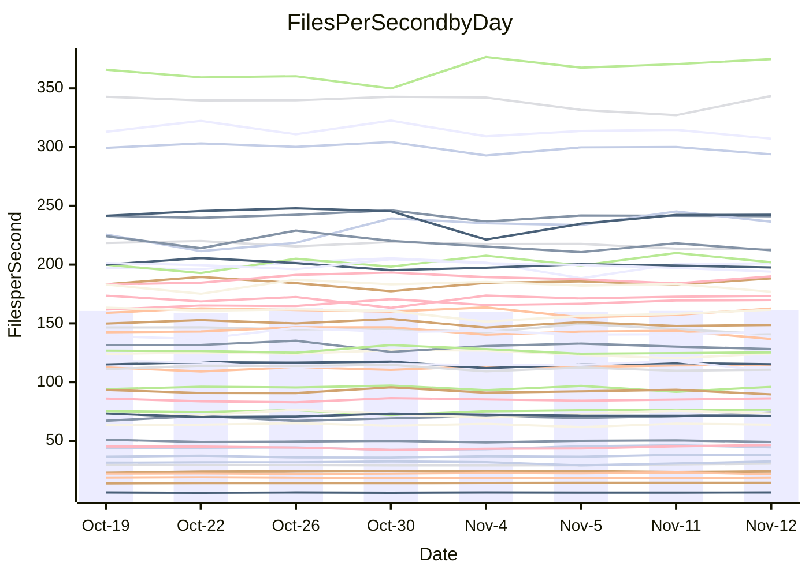

<!---
# This file is auto-generated. Do not edit.
# cspell:disable
--->
# Performance Report

## Daily Performance

## Time to Process Files

| Repository                                      | Elapsed | Min/Avg/Max           |   SD | SD Graph                |
| ----------------------------------------------- | ------: | :-------------------: | ---: | ----------------------- |
| AdaDoom3/AdaDoom3                    |    3.34 | 3.3 /   3.5 /   3.7   | 0.09 | `    ┣●━┻━━╋━━┻━━┫    ` |
| alexiosc/megistos                    |    8.27 | 7.3 /   7.9 /   8.7   | 0.36 | `    ┣━━┻━━╋━━●━━┫    ` |
| apollographql/apollo-server          |    3.24 | 2.6 /   2.7 /   2.9   | 0.08 | `       ┣┻━╋━┻┫      ●` |
| aspnetboilerplate/aspnetboilerplate  |   10.26 | 10.3 /  10.6 /  11.8  | 0.33 | `    ┣━━●━━╋━━┻━━┫    ` |
| aws-amplify/docs                     |   13.52 | 12.4 /  13.2 /  14.8  | 0.58 | `    ┣━━┻━━╋━●┻━━┫    ` |
| Azure/azure-rest-api-specs           |    9.59 | 9.6 /  10.0 /  11.0   | 0.36 | `    ┣━●┻━━╋━━┻━━┫    ` |
| bitjson/typescript-starter           |    1.08 | 1.0 /   1.1 /   1.1   | 0.03 | `     ┣━┻━━●━━┻━┫     ` |
| caddyserver/caddy                    |    3.65 | 3.7 /   3.8 /   4.0   | 0.09 | `    ┣●━┻━━╋━━┻━━┫    ` |
| canada-ca/open-source-logiciel-libre |    1.20 | 1.1 /   1.2 /   1.3   | 0.04 | `     ┣━┻━━╋━●┻━┫     ` |
| chef/chef                            |    5.84 | 5.7 /   6.0 /   6.3   | 0.16 | `    ┣━━●━━╋━━┻━━┫    ` |
| dart-lang/sdk                        |   66.06 | 63.7 /  67.4 /  72.3  | 2.10 | `  ┣━━━┻━●━╋━━━┻━━━┫  ` |
| django/django                        |   17.23 | 14.9 /  15.8 /  16.7  | 0.44 | `    ┣━━┻━━╋━━┻━━┫   ●` |
| eslint/eslint                        |   11.11 | 10.7 /  11.2 /  11.8  | 0.38 | `    ┣━━┻━●╋━━┻━━┫    ` |
| exonum/exonum                        |    4.01 | 3.5 /   3.7 /   3.9   | 0.10 | `    ┣━━┻━━╋━━┻━━┫   ●` |
| flutter/samples                      |   17.05 | 16.0 /  16.8 /  19.0  | 0.63 | `   ┣━━━┻━━╋●━┻━━━┫   ` |
| gitbucket/gitbucket                  |    3.59 | 3.5 /   3.7 /   3.9   | 0.11 | `    ┣━━┻●━╋━━┻━━┫    ` |
| googleapis/google-cloud-cpp          |  145.48 | 139.9 / 147.8 / 158.3 | 4.68 | `  ┣━━━┻━●━╋━━━┻━━━┫  ` |
| graphql/express-graphql              |    1.17 | 1.1 /   1.2 /   1.3   | 0.04 | `     ┣━┻━━●━━┻━┫     ` |
| graphql/graphql-js                   |    3.18 | 2.8 /   2.9 /   3.2   | 0.10 | `    ┣━━┻━━╋━━┻━━┫●   ` |
| graphql/graphql-relay-js             |    1.17 | 1.1 /   1.2 /   1.2   | 0.04 | `     ┣━┻━━●━━┻━┫     ` |
| graphql/graphql-spec                 |    1.34 | 1.3 /   1.3 /   1.4   | 0.04 | `     ┣━┻━━●━━┻━┫     ` |
| iluwatar/java-design-patterns        |   13.08 | 12.8 /  13.3 /  14.4  | 0.36 | `    ┣━━┻●━╋━━┻━━┫    ` |
| ktaranov/sqlserver-kit               |    7.13 | 6.6 /   6.8 /   7.1   | 0.16 | `    ┣━━┻━━╋━━┻━●┫    ` |
| liriliri/licia                       |    4.16 | 4.1 /   4.3 /   4.6   | 0.12 | `    ┣━━┻●━╋━━┻━━┫    ` |
| MartinThoma/LaTeX-examples           |    7.90 | 6.8 /   7.1 /   7.6   | 0.19 | `     ┣━━┻━╋━┻━━┫    ●` |
| mdx-js/mdx                           |    1.89 | 1.9 /   2.0 /   2.2   | 0.08 | `     ●━┻━━╋━━┻━┫     ` |
| microsoft/TypeScript-Website         |    5.78 | 5.5 /   5.8 /   6.5   | 0.20 | `    ┣━━┻━━●━━┻━━┫    ` |
| MicrosoftDocs/PowerShell-Docs        |   26.17 | 23.3 /  24.2 /  25.4  | 0.63 | `   ┣━━━┻━━╋━━┻━━━┫  ●` |
| neovim/nvim-lspconfig                |    4.34 | 4.3 /   4.4 /   4.6   | 0.08 | `    ┣━━●━━╋━━┻━━┫    ` |
| pagekit/pagekit                      |    3.79 | 3.5 /   3.7 /   4.0   | 0.14 | `    ┣━━┻━━╋━●┻━━┫    ` |
| php/php-src                          |   26.64 | 25.9 /  26.9 /  28.5  | 0.77 | `   ┣━━━┻━●╋━━┻━━━┫   ` |
| plasticrake/tplink-smarthome-api     |    1.35 | 1.3 /   1.4 /   1.5   | 0.05 | `     ┣━●━━╋━━┻━┫     ` |
| prettier/prettier                    |    7.76 | 7.2 /   7.6 /   8.3   | 0.24 | `    ┣━━┻━━╋━●┻━━┫    ` |
| pycontribs/jira                      |    1.55 | 1.5 /   1.6 /   1.7   | 0.06 | `     ┣━┻●━╋━━┻━┫     ` |
| RustPython/RustPython                |    5.42 | 5.2 /   5.5 /   6.0   | 0.24 | `    ┣━━┻━●╋━━┻━━┫    ` |
| shoelace-style/shoelace              |    3.09 | 2.9 /   3.0 /   3.2   | 0.08 | `     ┣━┻━━╋━●┻━┫     ` |
| slint-ui/slint                       |   13.72 | 13.3 /  13.8 /  14.4  | 0.36 | `    ┣━━┻━●╋━━┻━━┫    ` |
| SoftwareBrothers/admin-bro           |    2.59 | 2.5 /   2.7 /   2.9   | 0.07 | `     ┣━┻●━╋━━┻━┫     ` |
| sveltejs/svelte                      |   21.60 | 20.8 /  21.9 /  22.9  | 0.47 | `   ┣━━━┻●━╋━━┻━━━┫   ` |
| TheAlgorithms/Python                 |    5.67 | 5.7 /   5.8 /   6.1   | 0.11 | `    ┣━●┻━━╋━━┻━━┫    ` |
| twbs/bootstrap                       |    1.88 | 1.8 /   1.9 /   2.0   | 0.06 | `     ┣━┻━━╋●━┻━┫     ` |
| typescript-cheatsheets/react         |    1.33 | 1.4 /   1.4 /   1.6   | 0.06 | `     ●━┻━━╋━━┻━┫     ` |
| typescript-eslint/typescript-eslint  |    4.25 | 4.2 /   4.3 /   4.5   | 0.08 | `    ┣━━┻●━╋━━┻━━┫    ` |
| vitest-dev/vitest                    |    9.59 | 9.2 /   9.9 /  10.9   | 0.48 | `    ┣━━┻●━╋━━┻━━┫    ` |
| w3c/aria-practices                   |    3.70 | 3.4 /   3.6 /   3.8   | 0.09 | `    ┣━━┻━━╋━━●━━┫    ` |
| w3c/specberus                        |    2.01 | 2.0 /   2.1 /   2.2   | 0.05 | `     ┣━●━━╋━━┻━┫     ` |
| webdeveric/webpack-assets-manifest   |    1.21 | 1.2 /   1.2 /   1.3   | 0.04 | `     ┣━┻●━╋━━┻━┫     ` |
| webpack/webpack                      |    5.74 | 5.5 /   5.7 /   6.7   | 0.25 | `    ┣━━┻━━●━━┻━━┫    ` |
| wireapp/wire-desktop                 |    1.43 | 1.4 /   1.5 /   1.7   | 0.09 | `     ┣━┻━●╋━━┻━┫     ` |
| wireapp/wire-webapp                  |   10.64 | 10.6 /  11.2 /  12.3  | 0.49 | `    ┣━●┻━━╋━━┻━━┫    ` |

Note:
- Elapsed time is in seconds.

## Files per Second over Time

| Repository                                      | Files |    Sec |    Fps |     Rel | Trend Fps              |    N |
| ----------------------------------------------- | ----: | -----: | -----: | ------: | ---------------------- | ---: |
| AdaDoom3/AdaDoom3                    |   103 |   3.34 |  30.87 |   4.58% | `▇▅▇▅▇▆▆▆▅▆▆▄▆▇██▄█▇█` |   20 |
| alexiosc/megistos                    |   583 |   8.27 |  70.46 |  -4.24% | `▇▄▄▅█▆▅▅▃▅▄▄▇▇▆▇▆▆▆▄` |   20 |
| apollographql/apollo-server          |   253 |   3.24 |  78.06 | -15.63% | `█▆▇▄▅▆▆█▇▅▇▇▄▇█▇▅██ ` |   20 |
| aspnetboilerplate/aspnetboilerplate  |  2286 |  10.26 | 222.91 |   3.10% | `███▇▆▇██▇█▇▇█▆▆▇▆▄██` |   20 |
| aws-amplify/docs                     |  2871 |  13.52 | 212.30 |  -2.61% | `▇▆▇▅███▇▇▅▇▆▆▃█▇▅▆▅▆` |   20 |
| Azure/azure-rest-api-specs           |  2365 |   9.59 | 246.73 |   2.94% | `▇▇▆█▇█▇▇▃▅▅▆▇▅▆▇▇▇▆▇` |   20 |
| bitjson/typescript-starter           |    20 |   1.08 |  18.59 |   0.27% | `▇█▇█▇▇▆▆▆▆▅▇▇▅▄▅▇▇▇▇` |   20 |
| caddyserver/caddy                    |   288 |   3.65 |  78.96 |   4.59% | `▅▇▆▆▆▆▇▄▅▇▆▆█▇▇▇▆▇▅█` |   20 |
| canada-ca/open-source-logiciel-libre |     7 |   1.20 |   5.83 |  -2.27% | `▇▆▄▆▇▇▆▅▇▇▇▄▆▇▆▄█▇█▅` |   20 |
| chef/chef                            |  1191 |   5.84 | 203.85 |   2.11% | `▆▇█▇▆█▆▅▇▅▄█▇▇▆▇▆▄▆▇` |   20 |
| dart-lang/sdk                        | 10747 |  66.06 | 162.69 |   2.26% | `▇██▆█▇▅▆▅▄▅▇▆▅▆▆▅▇▆▇` |   20 |
| django/django                        |  2885 |  17.23 | 167.42 |  -8.44% | `▅█▄▅▇▆█▆▇▇▇▄▇▆▆▇▇▆▆▃` |   20 |
| eslint/eslint                        |  2099 |  11.11 | 188.90 |   0.84% | `▄▇▇▄▇▇▇▇▅█▆▇▄▇▅▇▄▆█▆` |   20 |
| exonum/exonum                        |   421 |   4.01 | 105.12 |  -8.78% | `█▇▇█▆▆▅▇▆▇▅▇█▇██▇▇▄▃` |   20 |
| flutter/samples                      |  2400 |  17.05 | 140.77 |  -1.34% | `▆▇▇▆█▇█▇▇▆█▆▇▆▇▇▆▇▃▆` |   20 |
| gitbucket/gitbucket                  |   413 |   3.59 | 115.14 |   2.17% | `▆█▅▅▇▆▆▆▅█▆█▄▇▆█▆█▆▇` |   20 |
| googleapis/google-cloud-cpp          | 20952 | 145.48 | 144.02 |   1.88% | `▅▆▇▄▇██▇█▆▆▅█▅▅▆▇▆▇▇` |   20 |
| graphql/express-graphql              |    26 |   1.17 |  22.31 |   0.33% | `▅▅▆▄▄▅▅▅▅▆▅▅▅▅▅█▆▃▄▅` |   20 |
| graphql/graphql-js                   |   368 |   3.18 | 115.60 |  -7.04% | `▇▅▆█▆█▆█▇█▇▇▅▆▆▄▇██▄` |   20 |
| graphql/graphql-relay-js             |    28 |   1.17 |  23.89 |   0.23% | `▅▄▇▅▆▆▇▇▇▅▅▆█▆▆▅▅▆▇▆` |   20 |
| graphql/graphql-spec                 |    19 |   1.34 |  14.15 |   0.21% | `▆▆▅▇▄█▆▆▇▆▇▆▇█▇▆▇█▅▆` |   20 |
| iluwatar/java-design-patterns        |  1992 |  13.08 | 152.29 |   1.78% | `▇▆█▇█▇▅█▄█▇▇▇▇▆▆▇▆▆▇` |   20 |
| ktaranov/sqlserver-kit               |   489 |   7.13 |  68.54 |  -4.35% | `█▇▅▆▆▅▇▇▇▇▆▇▅▇▇▅▆█▆▅` |   20 |
| liriliri/licia                       |  1437 |   4.16 | 345.45 |   2.38% | `▇█▇▇█▇███▇█▆▆▆▄█▆▇██` |   20 |
| MartinThoma/LaTeX-examples           |  1409 |   7.90 | 178.31 | -10.67% | `█▆▇▆▄█▆█▆▇▅▆▇▇▇▆▆█▆▃` |   20 |
| mdx-js/mdx                           |   141 |   1.89 |  74.45 |   6.95% | `▆▅▇▆▃▆▅▆▆▇▆▇▅▅▇▇▆███` |   20 |
| microsoft/TypeScript-Website         |   761 |   5.78 | 131.64 |   0.30% | `▇▇▆▇▇██▅▆▇█▇▆▆▆▆▇▇▃▇` |   20 |
| MicrosoftDocs/PowerShell-Docs        |  2708 |  26.17 | 103.48 |  -7.72% | `▆▆▇██▅█▇▄▆██▆▆▅▅▆█▆▃` |   20 |
| neovim/nvim-lspconfig                |   759 |   4.34 | 174.77 |   1.80% | `█▆▅▇▇▇▇▅▇█▇▇▆▇▇▇█▇▇█` |   20 |
| pagekit/pagekit                      |   741 |   3.79 | 195.76 |  -3.34% | `█▃▅▄▇▇▆▆█▇▅▇▅▇█▇█▇▇▅` |   20 |
| php/php-src                          |  2262 |  26.64 |  84.90 |   0.12% | `█▇█▄▇▅▅▇▇▆▇█▄▆▇▆▇█▇▇` |   20 |
| plasticrake/tplink-smarthome-api     |    62 |   1.35 |  46.03 |   3.37% | `▆▇▆▇▆▅▇▄▄▆▆▄▅▆▆█▆██▇` |   20 |
| prettier/prettier                    |  2421 |   7.76 | 312.00 |  -0.42% | `▇▇█▇▅▆██▆▇▇▇▆▇▆▇▇▇▄▆` |   20 |
| pycontribs/jira                      |    79 |   1.55 |  50.88 |   2.38% | `▆▇▆▅▄▆█▆▆▅▄█▆▇▇█▆▅▅▇` |   20 |
| RustPython/RustPython                |   693 |   5.42 | 127.95 |   1.77% | `▇▆▅█▅▄██▇▆▇▃▆▆▇▇▄▅▆▇` |   20 |
| shoelace-style/shoelace              |   439 |   3.09 | 142.03 |  -2.44% | `▇▅▆▆▆▅▆▆▇▄▇█▆▆▇▆▆▄▅▅` |   20 |
| slint-ui/slint                       |  2565 |  13.72 | 186.89 |   1.09% | `▇▇█▇▅▇█▅▆▇█▆▅█▆▅▇█▇▇` |   20 |
| SoftwareBrothers/admin-bro           |   441 |   2.59 | 170.16 |   2.31% | `▇▄▇▆▇▆▆▇▇▆▇▇▆▇█▆▇█▇▇` |   20 |
| sveltejs/svelte                      |  8053 |  21.60 | 372.84 |   1.66% | `▆▇▆▅▅▅▆▄█▆▆▆▆▇▆▆█▇▇▇` |   20 |
| TheAlgorithms/Python                 |  1399 |   5.67 | 246.93 |   2.48% | `▇▇▇▆█▇▇█▆▇▆▇█▇▇▆█▅██` |   20 |
| twbs/bootstrap                       |   118 |   1.88 |  62.63 |  -1.67% | `▇█▇▆▇█▇▆█▆▆▆▄▅██▆▆▇▆` |   20 |
| typescript-cheatsheets/react         |    53 |   1.33 |  39.81 |   8.19% | `▆▅▇▆▆▃▅▅▄▇▇▅▆▄▇▆▇▆▇█` |   20 |
| typescript-eslint/typescript-eslint  |  1285 |   4.25 | 302.49 |   1.27% | `▇▇█▇▇█▆█▇▅▇▇▇▇▆█▇▅▆▇` |   20 |
| vitest-dev/vitest                    |  2339 |   9.59 | 243.88 |   6.01% | `▆▅▄▃▃▄▅▇▇▅▅▇▆▆█▇█▆▆▇` |   20 |
| w3c/aria-practices                   |   414 |   3.70 | 111.97 |  -3.13% | `▅██▆▇▆▇▇▆▄▇▅▅▇▇█▅▇▇▅` |   20 |
| w3c/specberus                        |   197 |   2.01 |  97.92 |   3.28% | `▆▆█▇▇▆███▄▇███▅▇▅▇▇█` |   20 |
| webdeveric/webpack-assets-manifest   |    55 |   1.21 |  45.60 |   2.49% | `▆▆▆▅▇▅▅▄▅▄▇▅▇▆▇▆█▅▅▇` |   20 |
| webpack/webpack                      |  1141 |   5.74 | 198.71 |   0.40% | `█▆▇▆█▇▇█▇▇▇▆▃▆▆█▇▇█▇` |   20 |
| wireapp/wire-desktop                 |    46 |   1.43 |  32.07 |   2.94% | `▇▆▇▇▆█▇██▇▅▄▃█▆▆▇██▇` |   20 |
| wireapp/wire-webapp                  |  1783 |  10.64 | 167.62 |   5.24% | `▆▇▆█▇█▆▇▇█▄▇▇▃▇▄▇█▅█` |   20 |

## Data Throughput

| Repository                                      | Files |    Sec |     Kps |     Rel | Trend Kps              |    N |
| ----------------------------------------------- | ----: | -----: | ------: | ------: | ---------------------- | ---: |
| AdaDoom3/AdaDoom3                    |   103 |   3.34 |  656.14 |   4.58% | `▇▅▇▅▇▆▆▆▅▆▆▄▆▇██▄█▇█` |   20 |
| alexiosc/megistos                    |   583 |   8.27 |  553.64 |  -4.24% | `▇▄▄▅█▆▅▅▃▅▄▄▇▇▆▇▆▆▆▄` |   20 |
| apollographql/apollo-server          |   253 |   3.24 |  637.73 | -15.10% | `▇▅▆▄▅▆▅█▇▅▇▇▄▇█▇▅██▁` |   20 |
| aspnetboilerplate/aspnetboilerplate  |  2286 |  10.26 |  542.34 |   3.10% | `███▇▆▇██▇█▇▇█▆▆▇▆▄██` |   20 |
| aws-amplify/docs                     |  2871 |  13.52 |  741.15 |  -2.60% | `▇▆▇▅███▇▇▅▇▆▆▃█▇▅▆▅▆` |   20 |
| Azure/azure-rest-api-specs           |  2365 |   9.59 |  670.30 |   3.63% | `▇▇▆█▇█▇▇▃▅▅▆▇▅▇▇▇▇▆█` |   20 |
| bitjson/typescript-starter           |    20 |   1.08 |   74.34 |   0.27% | `▇█▇█▇▇▆▆▆▆▅▇▇▅▄▅▇▇▇▇` |   20 |
| caddyserver/caddy                    |   288 |   3.65 |  684.89 |   4.80% | `▅▆▆▆▆▆▇▄▅▇▆▆█▇▇▇▆▇▅█` |   20 |
| canada-ca/open-source-logiciel-libre |     7 |   1.20 |   48.30 |  -2.27% | `▇▆▄▆▇▇▆▅▇▇▇▄▆▇▆▄█▇█▅` |   20 |
| chef/chef                            |  1191 |   5.84 |  944.80 |   2.21% | `▅▆█▇▆█▆▅▇▅▄█▇▇▆▇▆▄▆▇` |   20 |
| dart-lang/sdk                        | 10747 |  66.06 | 1110.19 |   2.36% | `▇██▆█▇▅▆▅▄▅▇▆▅▆▆▆▇▇▇` |   20 |
| django/django                        |  2885 |  17.23 | 1050.69 |  -8.52% | `▅█▅▅▇▆█▆▇▇▇▄▇▇▆▇▇▆▆▃` |   20 |
| eslint/eslint                        |  2099 |  11.11 | 1355.08 |   0.65% | `▅▇▇▄▇▇▇▇▅█▆▇▄▇▅▇▄▅█▆` |   20 |
| exonum/exonum                        |   421 |   4.01 | 1005.49 |  -8.78% | `█▇▇█▆▆▅▇▆▇▅▇█▇██▇▇▄▃` |   20 |
| flutter/samples                      |  2400 |  17.05 | 1256.19 |  -1.34% | `▆▇▇▆█▇█▇▇▆█▆▇▆▇▇▆▇▃▆` |   20 |
| gitbucket/gitbucket                  |   413 |   3.59 |  523.27 |   2.16% | `▆█▅▅▇▆▆▆▅█▆█▄▇▆█▆█▆▇` |   20 |
| googleapis/google-cloud-cpp          | 20952 | 145.48 | 1173.04 |   2.14% | `▅▆▇▄▇██▇█▆▆▅█▅▅▆▇▆▇▇` |   20 |
| graphql/express-graphql              |    26 |   1.17 |  102.10 |   0.33% | `▅▅▆▄▄▅▅▅▅▆▅▅▅▅▅█▆▃▄▅` |   20 |
| graphql/graphql-js                   |   368 |   3.18 |  670.99 |  -6.78% | `▇▅▆█▆█▅▇▇█▇▇▅▆▆▄▇██▄` |   20 |
| graphql/graphql-relay-js             |    28 |   1.17 |   93.84 |   0.23% | `▅▄▇▅▆▆▇▇▇▅▅▆█▆▆▅▅▆▇▆` |   20 |
| graphql/graphql-spec                 |    19 |   1.34 |  472.22 |   0.21% | `▆▆▅▇▄█▆▆▇▆▇▆▇█▇▆▇█▅▆` |   20 |
| iluwatar/java-design-patterns        |  1992 |  13.08 |  470.71 |   1.78% | `▇▆█▇█▇▅█▄█▇▇▇▇▆▆▇▆▆▇` |   20 |
| ktaranov/sqlserver-kit               |   489 |   7.13 | 1037.93 |  -4.34% | `█▇▅▆▆▅▇▇▇▇▆▇▅▇▇▅▆█▆▅` |   20 |
| liriliri/licia                       |  1437 |   4.16 |  411.56 |   2.38% | `▇█▇▇█▇███▇█▆▆▆▄█▆▇██` |   20 |
| MartinThoma/LaTeX-examples           |  1409 |   7.90 |  368.25 | -10.67% | `█▆▇▆▄█▆█▆▇▅▆▇▇▇▆▆█▆▃` |   20 |
| mdx-js/mdx                           |   141 |   1.89 |  346.39 |   6.95% | `▆▅▇▆▃▆▅▆▆▇▆▇▅▅▇▇▆███` |   20 |
| microsoft/TypeScript-Website         |   761 |   5.78 |  910.61 |   0.31% | `▇▇▆▇▇██▅▆▇█▇▆▆▆▆▇▇▃▇` |   20 |
| MicrosoftDocs/PowerShell-Docs        |  2708 |  26.17 | 1065.51 |  -7.68% | `▆▆▇██▅█▇▄▆██▆▆▅▅▆█▆▃` |   20 |
| neovim/nvim-lspconfig                |   759 |   4.34 |  292.44 |   1.91% | `█▆▅▇▇▇▇▅▇█▇▇▆▇▇▇█▇▇█` |   20 |
| pagekit/pagekit                      |   741 |   3.79 |  408.16 |  -3.34% | `█▃▅▄▇▇▆▆█▇▅▇▅▇█▇█▇▇▅` |   20 |
| php/php-src                          |  2262 |  26.64 | 1485.71 |   0.16% | `█▇█▄▇▅▅▇▇▆▇█▄▆▇▆▇█▇▇` |   20 |
| plasticrake/tplink-smarthome-api     |    62 |   1.35 |  248.71 |   3.37% | `▆▇▆▇▆▅▇▄▄▆▆▄▅▆▆█▆██▇` |   20 |
| prettier/prettier                    |  2421 |   7.76 |  433.27 |  -0.78% | `▇▇██▅▆██▅▆▆▇▆▇▆▇▇▇▄▆` |   20 |
| pycontribs/jira                      |    79 |   1.55 |  360.66 |   2.38% | `▆▇▆▅▄▆█▆▆▅▄█▆▇▇█▆▅▅▇` |   20 |
| RustPython/RustPython                |   693 |   5.42 | 1064.56 |   4.04% | `▆▅▄▇▅▃▇▇█▇█▄▇▇█▇▄▆▇▇` |   20 |
| shoelace-style/shoelace              |   439 |   3.09 |  686.22 |  -2.44% | `▇▅▆▆▆▅▆▆▇▄▇█▆▆▇▆▆▄▅▅` |   20 |
| slint-ui/slint                       |  2565 |  13.72 | 1152.72 |   1.27% | `▇▇█▇▅▇█▅▆▇█▆▅█▆▆▇█▇▇` |   20 |
| SoftwareBrothers/admin-bro           |   441 |   2.59 |  375.04 |   2.31% | `▇▄▇▆▇▆▆▇▇▆▇▇▆▇█▆▇█▇▇` |   20 |
| sveltejs/svelte                      |  8053 |  21.60 |  248.72 |   1.62% | `▆▇▆▅▅▅▆▄█▆▆▆▆▇▆▆▇▇▇▇` |   20 |
| TheAlgorithms/Python                 |  1399 |   5.67 |  628.00 |   2.49% | `▇▇▇▆█▇▇█▆▇▆▇█▇▇▆█▅██` |   20 |
| twbs/bootstrap                       |   118 |   1.88 |  514.31 |  -1.60% | `▇█▇▆▇█▇▆█▆▆▆▄▅██▆▆▇▆` |   20 |
| typescript-cheatsheets/react         |    53 |   1.33 |  294.45 |   8.19% | `▆▅▇▆▆▃▅▅▄▇▇▅▆▄▇▆▇▆▇█` |   20 |
| typescript-eslint/typescript-eslint  |  1285 |   4.25 | 1559.30 |   1.43% | `▇▇█▇▇█▆█▇▅▇▇▇▇▆█▇▅▆▇` |   20 |
| vitest-dev/vitest                    |  2339 |   9.59 |  523.84 |   2.95% | `▆▆▄▃▃▅▆██▅▆█▆▆▇▆█▆▅▇` |   20 |
| w3c/aria-practices                   |   414 |   3.70 | 1043.96 |  -3.13% | `▅██▆▇▆▇▇▆▄▇▅▅▇▇█▅▇▇▅` |   20 |
| w3c/specberus                        |   197 |   2.01 |  309.66 |   3.28% | `▆▆█▇▇▆███▄▇███▅▇▅▇▇█` |   20 |
| webdeveric/webpack-assets-manifest   |    55 |   1.21 |  105.29 |   2.49% | `▆▆▆▅▇▅▅▄▅▄▇▅▇▆▇▆█▅▅▇` |   20 |
| webpack/webpack                      |  1141 |   5.74 |  906.14 |   0.64% | `█▆▇▆█▇▇█▇▇▇▆▃▅▆█▇▇█▇` |   20 |
| wireapp/wire-desktop                 |    46 |   1.43 |  179.18 |   2.94% | `▇▆▇▇▆█▇██▇▅▄▃█▆▆▇██▇` |   20 |
| wireapp/wire-webapp                  |  1783 |  10.64 |  619.92 |   5.40% | `▅▇▆█▇█▆▇▇█▄▇▇▃▇▄▇█▅█` |   20 |

