<!---
# This file is auto-generated. Do not edit.
# cspell:disable
--->
# Performance Report

## Daily Performance

```mermaid
xychart-beta
    title Files Per Second by Day
    y-axis Files per Second
    x-axis Date [Jan-6, Jan-7, Jan-8, Jan-9, Jan-13, Jan-14, Jan-15, Jan-16, Jan-18, Jan-20, Jan-21, Jan-22, Jan-26, Jan-27, Jan-28, Jan-29, Feb-2, Feb-5]
    bar [171.06, 170.63, 170.60, 174.36, 167.48, 169.75, 163.88, 166.13, 174.50, 168.43, 169.86, 170.44, 173.21, 172.82, 168.69, 170.17, 172.76, 169.80]
    line [110.16, 104.65, 109.58, 115.11, 106.48, 111.07, 106.70, 105.83, 110.59, 105.90, 107.50, 104.30, 108.52, 110.13, 106.78, 107.20, 109.65, 109.56]
    line [90.27, 87.90, 87.06, 87.60, 85.54, 86.15, 85.12, 85.43, 82.51, 0.00, 87.43, 86.48, 87.49, 84.71, 86.94, 81.29, 88.85, 81.35]
    line [129.63, 129.57, 128.75, 125.98, 127.26, 126.67, 127.57, 126.01, 128.09, 123.93, 133.11, 122.76, 127.88, 128.69, 130.23, 128.77, 121.54, 127.42]
    line [146.19, 145.02, 146.18, 143.49, 142.76, 141.64, 141.15, 123.99, 143.49, 147.59, 143.59, 141.42, 143.21, 141.20, 143.98, 143.78, 140.14, 137.22]
    line [84.54, 80.98, 78.06, 84.72, 83.13, 74.36, 86.16, 86.38, 84.98, 80.87, 81.08, 81.74, 87.91, 80.34, 86.50, 86.84, 88.66, 82.64]
    line [194.45, 198.60, 185.12, 206.27, 196.30, 189.40, 186.97, 192.92, 206.92, 196.43, 199.84, 197.78, 203.69, 196.52, 194.52, 195.98, 201.87, 201.23]
    line [387.31, 386.47, 390.16, 393.74, 382.18, 391.17, 394.86, 389.55, 393.53, 0.00, 392.61, 391.87, 384.72, 385.87, 389.43, 389.76, 387.86, 384.77]
    line [160.02, 162.06, 161.10, 164.91, 160.36, 157.59, 157.97, 159.04, 161.40, 158.69, 156.26, 158.43, 164.60, 154.09, 155.59, 154.71, 166.16, 159.96]
    line [174.22, 171.75, 179.11, 181.04, 172.87, 181.24, 165.83, 179.67, 178.49, 0.00, 174.64, 178.29, 177.69, 180.46, 173.36, 171.47, 176.27, 174.53]
    line [116.53, 120.08, 121.77, 112.94, 114.87, 112.73, 121.37, 119.21, 111.41, 120.28, 114.69, 112.28, 117.78, 116.14, 114.78, 110.96, 118.96, 113.04]
    line [186.85, 193.93, 180.85, 201.04, 187.54, 191.28, 196.46, 192.64, 192.25, 187.45, 187.38, 192.87, 195.04, 191.69, 194.48, 178.97, 199.11, 193.12]
    line [97.96, 99.84, 98.62, 95.10, 93.83, 104.36, 95.41, 100.49, 100.17, 98.43, 101.26, 97.05, 98.45, 98.30, 100.11, 81.16, 97.62, 100.13]
    line [116.74, 115.06, 112.51, 118.83, 112.95, 112.89, 112.17, 115.75, 121.13, 117.45, 107.89, 115.63, 108.80, 113.98, 108.63, 112.03, 101.57, 108.61]
    line [144.14, 137.83, 150.50, 146.15, 145.30, 149.05, 140.78, 149.26, 147.65, 139.36, 140.95, 149.41, 138.21, 138.55, 146.90, 148.25, 146.04, 146.56]
    line [155.94, 161.49, 151.30, 157.09, 152.68, 160.69, 156.79, 156.81, 155.73, 146.52, 155.23, 146.60, 152.95, 153.44, 146.68, 148.04, 159.34, 151.53]
    line [186.99, 191.85, 197.16, 203.10, 201.84, 183.49, 193.18, 186.41, 206.76, 190.09, 194.48, 202.39, 197.93, 196.32, 205.82, 204.70, 203.85, 196.06]
    line [247.35, 241.85, 236.85, 250.47, 243.18, 235.07, 210.91, 252.26, 245.25, 247.79, 237.71, 245.48, 250.24, 239.03, 246.34, 215.04, 240.95, 245.00]
    line [242.84, 253.62, 250.11, 254.55, 243.64, 250.04, 233.42, 245.62, 241.64, 242.10, 243.52, 243.78, 252.46, 245.33, 245.88, 247.56, 250.17, 240.19]
    line [147.86, 145.38, 153.63, 152.37, 107.78, 110.93, 111.50, 98.69, 111.74, 0.00, 0.00, 0.00, 256.11, 255.68, 274.20, 237.51, 254.20, 259.60]
    line [48.16, 50.54, 46.59, 48.81, 48.15, 49.96, 48.86, 49.35, 49.61, 49.98, 48.14, 47.57, 46.02, 47.96, 48.80, 46.78, 47.79, 48.34]
    line [98.16, 86.10, 100.14, 105.08, 100.22, 103.42, 102.77, 104.55, 104.84, 96.90, 99.42, 91.88, 98.65, 96.11, 99.25, 100.66, 103.18, 96.91]
    line [160.97, 155.89, 159.83, 162.81, 156.59, 163.92, 156.50, 162.70, 162.52, 155.39, 161.05, 158.62, 159.47, 158.84, 149.03, 155.81, 162.82, 159.31]
    line [385.25, 387.67, 392.05, 384.01, 366.78, 394.48, 380.24, 387.08, 391.19, 385.76, 384.74, 382.99, 381.11, 378.87, 384.64, 371.32, 391.09, 384.57]
    line [162.35, 167.49, 161.75, 159.91, 160.33, 159.51, 160.62, 164.27, 165.83, 163.17, 162.82, 166.39, 165.48, 164.06, 162.34, 156.27, 166.07, 157.17]
    line [345.83, 335.66, 342.43, 349.42, 338.80, 330.51, 341.37, 332.29, 317.17, 344.00, 340.27, 346.07, 341.26, 330.59, 326.24, 336.05, 350.02, 336.22]
    line [356.35, 351.62, 349.11, 347.65, 339.94, 351.75, 349.84, 352.46, 347.95, 349.61, 348.67, 336.98, 334.45, 346.57, 346.60, 352.58, 347.78, 345.95]
    line [152.61, 153.69, 153.81, 158.28, 153.24, 158.05, 143.97, 146.11, 167.84, 138.47, 151.83, 152.31, 153.48, 154.19, 144.39, 154.19, 151.10, 151.09]
    line [154.41, 153.05, 151.33, 153.98, 146.13, 148.32, 143.55, 147.19, 151.83, 146.83, 148.17, 142.81, 152.72, 147.54, 147.09, 145.41, 148.70, 151.70]
    line [36.07, 36.65, 36.34, 36.49, 35.46, 35.24, 35.59, 35.58, 35.07, 0.00, 35.24, 34.68, 33.94, 35.92, 35.70, 34.97, 35.24, 35.14]
    line [133.47, 136.71, 138.45, 138.88, 133.26, 132.31, 127.23, 131.76, 132.93, 0.00, 127.27, 127.81, 130.32, 132.03, 125.54, 132.09, 121.09, 133.41]
    line [30.58, 30.44, 29.43, 30.82, 30.13, 29.74, 28.69, 30.19, 29.74, 0.00, 30.87, 30.00, 28.70, 30.12, 29.90, 29.99, 31.08, 29.79]
    line [17.89, 18.19, 17.48, 17.44, 18.04, 18.04, 18.22, 17.23, 17.55, 0.00, 17.39, 18.17, 18.55, 17.57, 16.82, 17.76, 17.39, 17.91]
    line [38.02, 37.20, 35.97, 38.77, 37.19, 37.15, 36.65, 38.13, 37.95, 0.00, 37.76, 37.89, 38.81, 37.93, 37.35, 37.58, 36.65, 37.75]
    line [9.12, 9.14, 8.90, 9.21, 9.09, 8.82, 8.93, 8.76, 8.99, 0.00, 9.21, 8.99, 8.69, 9.06, 9.17, 8.90, 9.14, 9.12]
    line [65.47, 64.47, 61.13, 63.67, 62.15, 63.63, 63.52, 64.93, 61.26, 0.00, 63.19, 63.24, 64.72, 62.00, 60.00, 63.28, 59.94, 63.91]
    line [79.03, 79.23, 79.24, 76.50, 72.97, 78.65, 78.72, 77.98, 76.03, 0.00, 77.82, 78.41, 77.74, 77.78, 73.82, 74.60, 78.73, 76.65]
    line [214.16, 216.11, 215.58, 216.92, 210.61, 215.07, 220.69, 214.26, 215.48, 0.00, 214.23, 216.83, 222.41, 215.81, 211.64, 216.10, 218.52, 215.75]
    line [234.01, 231.87, 229.00, 233.60, 225.53, 218.14, 222.73, 239.07, 237.86, 219.38, 227.33, 226.70, 233.87, 217.12, 216.93, 224.01, 224.86, 215.34]
    line [216.47, 222.63, 216.37, 202.60, 214.18, 220.74, 215.80, 207.87, 219.52, 0.00, 214.36, 216.75, 217.84, 220.87, 215.44, 214.77, 213.40, 220.65]
    line [33.41, 33.47, 33.19, 33.82, 33.01, 34.00, 33.70, 33.67, 33.62, 0.00, 32.53, 32.97, 33.70, 32.82, 33.62, 33.93, 33.23, 33.13]
    line [78.20, 79.53, 83.01, 81.62, 77.54, 79.76, 78.94, 80.05, 79.79, 0.00, 78.41, 81.03, 80.80, 79.69, 83.58, 77.01, 80.34, 78.83]
    line [69.77, 69.09, 69.36, 65.84, 66.66, 65.78, 67.40, 65.04, 63.23, 0.00, 67.48, 67.27, 65.41, 67.07, 67.22, 68.71, 67.83, 67.80]
    line [242.35, 236.52, 238.12, 241.19, 228.64, 236.61, 179.24, 231.58, 227.41, 232.25, 239.53, 241.09, 233.83, 229.73, 231.27, 235.75, 232.76, 224.47]
    line [220.18, 213.99, 200.90, 227.46, 218.81, 223.94, 217.59, 191.78, 206.70, 229.01, 219.68, 219.77, 209.49, 204.94, 198.04, 223.32, 227.45, 207.28]
    line [210.48, 200.08, 203.53, 188.73, 202.65, 212.27, 207.96, 201.68, 204.97, 200.41, 200.50, 201.35, 196.11, 202.03, 205.84, 210.33, 202.30, 197.54]
    line [121.36, 120.04, 119.36, 122.67, 118.82, 119.70, 120.72, 120.60, 119.83, 111.61, 121.49, 119.94, 120.57, 119.01, 117.99, 117.30, 120.43, 120.29]
    line [27.76, 28.93, 26.82, 27.98, 27.25, 28.25, 26.29, 26.94, 27.92, 0.00, 27.74, 27.10, 28.41, 27.77, 28.43, 27.26, 29.20, 28.86]
    line [221.68, 223.62, 226.04, 231.74, 214.77, 211.68, 227.93, 222.84, 225.57, 0.00, 229.76, 226.99, 229.64, 213.50, 236.23, 220.41, 211.45, 220.92]
    line [139.31, 137.59, 138.48, 140.31, 134.58, 123.64, 135.23, 140.79, 137.86, 0.00, 141.02, 138.02, 132.73, 140.24, 138.48, 133.03, 140.20, 137.56]
    line [44.97, 48.20, 48.28, 47.88, 45.48, 47.52, 48.15, 46.82, 48.44, 0.00, 45.59, 47.24, 46.87, 46.43, 46.80, 47.45, 47.29, 47.86]
```

## Time to Process Files

| Repository                                      | Elapsed | Min/Avg/Max           |   SD | SD Graph                |
| ----------------------------------------------- | ------: | :-------------------: | ---: | ----------------------- |
| AdaDoom3/AdaDoom3                    |    3.06 | 3.0 /   3.1 /   3.3   | 0.07 | `     ┣━┻━●╋━━┻━┫     ` |
| alexiosc/megistos                    |    7.49 | 6.8 /   7.3 /   8.0   | 0.21 | `    ┣━━┻━━╋━━●━━┫    ` |
| apollographql/apollo-server          |    2.31 | 2.2 /   2.3 /   2.8   | 0.11 | `    ┣━━┻━━●━━┻━━┫    ` |
| aspnetboilerplate/aspnetboilerplate  |   11.34 | 9.4 /   9.9 /  10.6   | 0.32 | `     ┣━━┻━╋━┻━━┫    ●` |
| aws-amplify/docs                     |   12.68 | 11.8 /  12.4 /  16.0  | 0.78 | `   ┣━━━┻━━╋●━┻━━━┫   ` |
| Azure/azure-rest-api-specs           |    8.79 | 0.0 /  12.9 /  24.9   | 7.39 | `   ┣━━┻━●━╋━━━┻━━┫   ` |
| bitjson/typescript-starter           |    0.66 | 0.6 /   0.7 /   0.7   | 0.02 | `     ┣━━┻●╋━┻━━┫     ` |
| caddyserver/caddy                    |    3.26 | 3.1 /   3.4 /   3.8   | 0.17 | `    ┣━━┻●━╋━━┻━━┫    ` |
| canada-ca/open-source-logiciel-libre |    0.76 | 0.7 /   0.8 /   0.8   | 0.02 | `     ┣━━●━╋━┻━━┫     ` |
| chef/chef                            |    5.91 | 5.2 /   5.7 /   6.6   | 0.36 | `    ┣━━┻━━╋━●┻━━┫    ` |
| dart-lang/sdk                        |   62.28 | 58.7 /  62.1 /  67.6  | 1.98 | `  ┣━━━┻━━━●━━━┻━━━┫  ` |
| django/django                        |   14.48 | 14.0 /  14.8 /  16.4  | 0.53 | `    ┣━━┻●━╋━━┻━━┫    ` |
| eslint/eslint                        |   10.33 | 9.8 /  10.4 /  11.2   | 0.33 | `    ┣━━┻━━●━━┻━━┫    ` |
| exonum/exonum                        |    3.28 | 3.0 /   3.2 /   3.5   | 0.13 | `    ┣━━┻━━╋━●┻━━┫    ` |
| flutter/samples                      |   17.43 | 16.2 /  17.5 /  19.5  | 0.75 | `   ┣━━━┻━●╋━━┻━━━┫   ` |
| gitbucket/gitbucket                  |    3.27 | 3.0 /   3.2 /   3.6   | 0.10 | `    ┣━━┻━━╋●━┻━━┫    ` |
| googleapis/google-cloud-cpp          |  140.37 | 117.6 / 129.7 / 142.8 | 4.94 | `  ┣━━━┻━━━╋━━━┻━━━┫● ` |
| graphql/express-graphql              |    0.74 | 0.7 /   0.7 /   0.8   | 0.02 | `     ┣━━┻━╋●┻━━┫     ` |
| graphql/graphql-js                   |    2.28 | 2.2 /   2.3 /   2.5   | 0.07 | `     ┣━┻━━●━━┻━┫     ` |
| graphql/graphql-relay-js             |    0.74 | 0.7 /   0.7 /   0.8   | 0.02 | `     ┣━━┻●╋━┻━━┫     ` |
| graphql/graphql-spec                 |    0.84 | 0.8 /   0.8 /   0.9   | 0.02 | `     ┣━━┻●╋━┻━━┫     ` |
| iluwatar/java-design-patterns        |   11.80 | 11.1 /  11.8 /  13.0  | 0.42 | `    ┣━━┻━━●━━┻━━┫    ` |
| ktaranov/sqlserver-kit               |    6.57 | 6.1 /   6.3 /   7.2   | 0.22 | `    ┣━━┻━━╋━━●━━┫    ` |
| liriliri/licia                       |    3.72 | 3.6 /   3.7 /   3.9   | 0.07 | `    ┣━━┻━━╋●━┻━━┫    ` |
| MartinThoma/LaTeX-examples           |    6.46 | 6.3 /   6.6 /   6.8   | 0.14 | `    ┣━━┻●━╋━━┻━━┫    ` |
| mdx-js/mdx                           |    1.88 | 1.6 /   1.6 /   1.7   | 0.04 | `      ┣━┻━╋━┻━┫     ●` |
| microsoft/TypeScript-Website         |    5.24 | 5.0 /   5.3 /   6.1   | 0.22 | `    ┣━━┻━●╋━━┻━━┫    ` |
| MicrosoftDocs/PowerShell-Docs        |   25.55 | 18.4 /  21.8 /  27.3  | 2.68 | `   ┣━━┻━━━╋━━━┻●━┫   ` |
| neovim/nvim-lspconfig                |    3.30 | 3.0 /   3.2 /   3.6   | 0.13 | `    ┣━━┻━━╋●━┻━━┫    ` |
| pagekit/pagekit                      |    3.37 | 3.2 /   3.4 /   3.7   | 0.11 | `    ┣━━┻━●╋━━┻━━┫    ` |
| php/php-src                          |   22.21 | 21.0 /  22.7 /  28.4  | 1.64 | `   ┣━━┻━━●╋━━━┻━━┫   ` |
| plasticrake/tplink-smarthome-api     |    0.92 | 0.9 /   0.9 /   1.0   | 0.02 | `     ┣━━┻━●━┻━━┫     ` |
| prettier/prettier                    |    6.62 | 6.3 /   6.5 /   7.1   | 0.17 | `    ┣━━┻━━╋━●┻━━┫    ` |
| pycontribs/jira                      |    1.27 | 1.2 /   1.3 /   1.4   | 0.04 | `     ┣━┻━━●━━┻━┫     ` |
| RustPython/RustPython                |    4.22 | 4.1 /   4.3 /   5.1   | 0.21 | `    ┣━━┻━●╋━━┻━━┫    ` |
| shoelace-style/shoelace              |    2.51 | 2.4 /   2.5 /   2.7   | 0.08 | `     ┣━┻━━●━━┻━┫     ` |
| slint-ui/slint                       |   11.00 | 9.5 /  10.1 /  11.8   | 0.54 | `    ┣━━┻━━╋━━┻━━●    ` |
| SoftwareBrothers/admin-bro           |    2.30 | 2.1 /   2.2 /   2.3   | 0.07 | `     ┣━┻━━╋━━┻●┫     ` |
| sveltejs/svelte                      |   18.76 | 18.0 /  18.7 /  22.2  | 0.71 | `   ┣━━━┻━━●━━┻━━━┫   ` |
| TheAlgorithms/Python                 |    6.09 | 5.4 /   5.6 /   5.9   | 0.12 | `     ┣━━┻━╋━┻━━┫    ●` |
| twbs/bootstrap                       |    1.27 | 1.1 /   1.2 /   1.5   | 0.06 | `     ┣━┻━━╋━●┻━┫     ` |
| typescript-cheatsheets/react         |    1.10 | 1.1 /   1.1 /   1.3   | 0.05 | `     ┣━┻●━╋━━┻━┫     ` |
| typescript-eslint/typescript-eslint  |    3.62 | 3.5 /   3.7 /   3.8   | 0.07 | `    ┣━━●━━╋━━┻━━┫    ` |
| vitest-dev/vitest                    |    8.19 | 7.6 /   8.1 /   9.2   | 0.34 | `    ┣━━┻━━╋●━┻━━┫    ` |
| w3c/aria-practices                   |    2.89 | 2.9 /   3.0 /   3.3   | 0.09 | `    ┣━━┻●━╋━━┻━━┫    ` |
| w3c/specberus                        |    1.69 | 1.6 /   1.7 /   1.8   | 0.04 | `     ┣━┻━━╋●━┻━┫     ` |
| webdeveric/webpack-assets-manifest   |    0.66 | 0.6 /   0.7 /   0.8   | 0.03 | `     ┣━━●━╋━┻━━┫     ` |
| webpack/webpack                      |    4.88 | 4.6 /   4.9 /   5.4   | 0.20 | `    ┣━━┻━●╋━━┻━━┫    ` |
| wireapp/wire-desktop                 |    0.91 | 0.8 /   0.9 /   1.0   | 0.03 | `     ┣━┻━━╋━●┻━┫     ` |
| wireapp/wire-webapp                  |    8.80 | 8.1 /   8.5 /   9.3   | 0.29 | `    ┣━━┻━━╋━━●━━┫    ` |

Note:
- Elapsed time is in seconds.

## Files per Second over Time

| Repository                                      | Files |    Sec |    Fps |     Rel | Trend Fps              |    N |
| ----------------------------------------------- | ----: | -----: | -----: | ------: | ---------------------- | ---: |
| AdaDoom3/AdaDoom3                    |   103 |   3.06 |  33.64 |   1.06% | `▆▆█▇▇▇▇▅▇▅▇▆▇█▆█▇█▄▇` |   28 |
| alexiosc/megistos                    |   583 |   7.49 |  77.89 |  -2.46% | `▆▆▆▅▆▆▆▅▆▆▆▆▆▆█▅▆▆▅▅` |   28 |
| apollographql/apollo-server          |   250 |   2.31 | 108.33 |   0.24% | `█▇▆▇▆▇▇▅▇▇▇▇█▇▆▇▇▇▇▇` |   32 |
| aspnetboilerplate/aspnetboilerplate  |  2246 |  11.34 | 198.12 | -12.63% | `▆▅▆██▅▇▆▆▆▇▄▅▅▄▆▆▅▇▂` |   29 |
| aws-amplify/docs                     |  2867 |  12.68 | 226.03 |  -2.63% | `█▂▇▇▇████▇▇▆█▆██▇▆▇▇` |   31 |
| Azure/azure-rest-api-specs           |  2375 |   8.79 | 270.19 |  80.87% | `▄▄▃▄▁▁▁▁▁██▇███▇█▇██` |   32 |
| bitjson/typescript-starter           |    20 |   0.66 |  30.30 |   0.83% | `▇▇▆▅▇▆█▇█▅▅▇▇▇▆▇█▅▇▇` |   28 |
| caddyserver/caddy                    |   279 |   3.26 |  85.58 |   3.41% | `▃▇▇▇▅▅▆▆▅█▇▄▄█▇▇█▇▄▇` |   32 |
| canada-ca/open-source-logiciel-libre |     7 |   0.76 |   9.19 |   1.60% | `▆▇▅▆▅▆▆▇▅▆▄▆▇▆▇▅▆█▄▇` |   28 |
| chef/chef                            |  1204 |   5.91 | 203.60 |  -4.72% | `█▇▄▆█▇▇▇▇▆▆▅▄▆▃▇█▆▆▅` |   31 |
| dart-lang/sdk                        | 10083 |  62.28 | 161.90 |  -0.38% | `▆▇▇█▇█▆████▆█▆█▆█▇▄▇` |   32 |
| django/django                        |  2826 |  14.48 | 195.17 |   2.43% | `▇█▇▇▆▆▆▇▇▇▆▇▇█▆▅█▇▇▇` |   32 |
| eslint/eslint                        |  2042 |  10.33 | 197.77 |   0.54% | `▅▄▆█▆▇▇▆▆▇▇▅▇▅▆▆▇█▆▆` |   32 |
| exonum/exonum                        |   421 |   3.28 | 128.22 |  -2.90% | `▇▆▆▅▆▇▆▄▆▅▆▆▆▆▃▆▄█▆▅` |   28 |
| flutter/samples                      |  2707 |  17.43 | 155.29 |   1.08% | `█▇▇▇▅█▆▆▅▇▆▆█▇▃▅█▇▄▇` |   32 |
| gitbucket/gitbucket                  |   412 |   3.27 | 125.82 |  -1.68% | `▆▆▆▆▅█▇▇▃▆▆▆▇▇▆▆▅▇▆▆` |   32 |
| googleapis/google-cloud-cpp          | 19819 | 140.37 | 141.19 |  -7.47% | `▆▄▄█▃▆▅▅▆▆▆▆▆▄▃▆▅▆▆▃` |   32 |
| graphql/express-graphql              |    26 |   0.74 |  35.34 |  -0.69% | `▆▅▆▆▆▆▇▅▄▇▅█▆▇▆▆▆▆▆▆` |   28 |
| graphql/graphql-js                   |   343 |   2.28 | 150.15 |   0.71% | `▇▇▆▇█▇█▆▇▄█▇▇▇▇▆▇██▇` |   29 |
| graphql/graphql-relay-js             |    28 |   0.74 |  37.73 |   0.58% | `▅▇▆▆▇▇▇█▇██▇█▆▇▇▆▇▇▇` |   28 |
| graphql/graphql-spec                 |    15 |   0.84 |  17.87 |   0.61% | `▇▇▇▇▅▆▆▆█▇█▆▆▅▄▆▆▇▇▇` |   28 |
| iluwatar/java-design-patterns        |  1902 |  11.80 | 161.14 |   1.07% | `▇▆▆▇▇▆▆▆▅██▇▄▆▅▆█▇▆▇` |   31 |
| ktaranov/sqlserver-kit               |   489 |   6.57 |  74.48 |  -3.59% | `▇▆██▇▇▇▇█▇▇▇▇▆▅▆█▇▇▆` |   28 |
| liriliri/licia                       |  1434 |   3.72 | 385.81 |  -0.65% | `▅▇██▇██▇▇█▇▆█▇▇▇▇█▆▇` |   29 |
| MartinThoma/LaTeX-examples           |  1409 |   6.46 | 218.08 |   1.34% | `▅▅▇█▆▇▆▇▇▇█▆█▇▅▇▇▆▇▇` |   28 |
| mdx-js/mdx                           |   141 |   1.88 |  74.85 | -13.52% | `▆▇▇▆▆▅█▇▇▇▇▅▇█▆▄█▆▆▁` |   29 |
| microsoft/TypeScript-Website         |   760 |   5.24 | 145.05 |   1.93% | `▇▇▃▇██▇█▆▇▇▆▇█▇▇▇▆▄█` |   32 |
| MicrosoftDocs/PowerShell-Docs        |  2708 |  25.55 | 105.97 |  -6.30% | `▆▆▇█▇▇▃▆▇▅▇▅▇▅▅▆▃▆▅▄` |   32 |
| neovim/nvim-lspconfig                |   378 |   3.30 | 114.48 |  -1.39% | `▆██▅██▅█▃▇█▇▅▇▆▅▇▆▆▆` |   32 |
| pagekit/pagekit                      |   741 |   3.37 | 219.72 |   1.42% | `▆▅█▇▅█▇▆█▆▇███▅▇▆███` |   28 |
| php/php-src                          |  2213 |  22.21 |  99.63 |   1.71% | `████▆▇▆▇▃▇▄▇▇█▆▇█▅▇▇` |   32 |
| plasticrake/tplink-smarthome-api     |    62 |   0.92 |  67.72 |   0.40% | `█▇▆▇▆▅▇█▇▇▆▆█▇▇██▇█▇` |   28 |
| prettier/prettier                    |  2207 |   6.62 | 333.22 |  -1.44% | `▆▇▆▄▇▇▇██▇▄▇▇▅▆▇█▆▇▆` |   32 |
| pycontribs/jira                      |    80 |   1.27 |  63.10 |   0.18% | `▆▆▇▇█▆▇▇▇▇█▆▇▇▃▇▅▇█▇` |   28 |
| RustPython/RustPython                |   620 |   4.22 | 146.96 |   1.88% | `█▆██▆█▅██▆▇▆▅█▇█▇▇▇▇` |   32 |
| shoelace-style/shoelace              |   438 |   2.51 | 174.58 |  -0.51% | `▄▇█▅▇▇▇▆▇▇▇▇█▇▅▆▇▅█▆` |   29 |
| slint-ui/slint                       |  2002 |  11.00 | 182.03 |  -7.66% | `▅▆▅█▆▇▆█▇▇▄██▇██▇█▇▅` |   32 |
| SoftwareBrothers/admin-bro           |   441 |   2.30 | 192.03 |  -5.31% | `▇█▇▆▇▆▆▇█▅▅▆▇█▆█▆█▄▄` |   29 |
| sveltejs/svelte                      |  7187 |  18.76 | 383.02 |   0.07% | `█▇██▇▇▇▇█▇▆█▇█▇▆██▇▇` |   32 |
| TheAlgorithms/Python                 |  1369 |   6.09 | 224.64 |  -8.77% | `█▅▇▆▆▇▆▆▇█▇▇▇█▆▇█▇█▃` |   32 |
| twbs/bootstrap                       |   120 |   1.27 |  94.43 |  -3.74% | `█▆▇▇▇▇▇▆▇▇▅▇▇▇▇▂▆█▇▆` |   31 |
| typescript-cheatsheets/react         |    53 |   1.10 |  48.37 |   3.09% | `▇█▇█▇█▇▅▇█▇▇▇▇▇▇▇█▇█` |   29 |
| typescript-eslint/typescript-eslint  |  1282 |   3.62 | 354.50 |   2.16% | `█▇█▇▇▇█▆▅▅▇█▆▇▇█▇▆▆█` |   32 |
| vitest-dev/vitest                    |  1972 |   8.19 | 240.81 |  -0.34% | `▆▃█▇█▆▇▇▇█▇▆▇▇█▄▇█▇▇` |   32 |
| w3c/aria-practices                   |   405 |   2.89 | 140.00 |   1.98% | `█▆▄▆█▇██▇█▆██▇▇▆█▇▇█` |   28 |
| w3c/specberus                        |   200 |   1.69 | 118.45 |  -0.99% | `▇███▅█████▇▇█▇▇▇███▇` |   31 |
| webdeveric/webpack-assets-manifest   |    19 |   0.66 |  28.85 |   3.58% | `▄█▇▅▅▇▇▆▆▅▇▆▇▇▇▆████` |   28 |
| webpack/webpack                      |  1095 |   4.88 | 224.19 |   0.54% | `▅▆▄▇▆▆▇▇▇▆▇▆▃██▆▄▅▆▆` |   28 |
| wireapp/wire-desktop                 |    43 |   0.91 |  47.04 |  -2.95% | `▇█▇██▆▇▅▇▅▅▇▇▇█▆▆█▇▆` |   33 |
| wireapp/wire-webapp                  |  1401 |   8.80 | 159.28 |   0.51% | `█▆██▆█▇▆█▇▅██▅▄▆█▇▇▇` |   32 |

## Data Throughput

| Repository                                      | Files |    Sec |     Kps |     Rel | Trend Kps              |    N |
| ----------------------------------------------- | ----: | -----: | ------: | ------: | ---------------------- | ---: |
| AdaDoom3/AdaDoom3                    |   103 |   3.06 |  714.84 |   1.06% | `▆▆█▇▇▇▇▅▇▅▇▆▇█▆█▇█▄▇` |   28 |
| alexiosc/megistos                    |   583 |   7.49 |  612.01 |  -2.46% | `▆▆▆▅▆▆▆▅▆▆▆▆▆▆█▅▆▆▅▅` |   28 |
| apollographql/apollo-server          |   250 |   2.31 |  867.47 |   0.29% | `█▇▆▇▆▇▇▅▇▇▇▇█▇▆▇▇▇▇▇` |   32 |
| aspnetboilerplate/aspnetboilerplate  |  2246 |  11.34 |  466.19 | -12.61% | `▆▅▆██▅▇▆▆▆▇▄▅▅▄▆▆▅▇▂` |   29 |
| aws-amplify/docs                     |  2867 |  12.68 |  778.22 |  -2.34% | `█▂▇▇▇████▇▇▆█▆██▇▆▇▇` |   31 |
| Azure/azure-rest-api-specs           |  2375 |   8.79 |  773.48 |  52.32% | `▃▂▂▁▁▂▂▁▂▇█▇███▇▇▇██` |   27 |
| bitjson/typescript-starter           |    20 |   0.66 |  121.21 |   0.83% | `▇▇▆▅▇▆█▇█▅▅▇▇▇▆▇█▅▇▇` |   28 |
| caddyserver/caddy                    |   279 |   3.26 |  714.36 |   3.53% | `▃▇▇▇▅▅▆▆▅█▇▄▄█▇▇█▇▄▇` |   32 |
| canada-ca/open-source-logiciel-libre |     7 |   0.76 |   76.13 |   1.60% | `▆▇▅▆▅▆▆▇▅▆▄▆▇▆▇▅▆█▄▇` |   28 |
| chef/chef                            |  1204 |   5.91 |  935.46 |  -4.68% | `█▇▄▆█▇▇▇▇▆▆▅▄▆▃▇█▆▆▅` |   31 |
| dart-lang/sdk                        | 10083 |  62.28 | 1136.76 |  -1.81% | `▆▇▇█▇█▆████▆█▆█▆█▇▄▆` |   32 |
| django/django                        |  2826 |  14.48 | 1205.01 |   2.30% | `▇█▇▇▆▆▆▇▇▇▆▇▇█▆▅█▇▇▇` |   32 |
| eslint/eslint                        |  2042 |  10.33 | 1618.06 |   0.60% | `▅▄▆█▆▇▇▆▆▇▇▅▇▅▆▆▇█▆▆` |   32 |
| exonum/exonum                        |   421 |   3.28 | 1226.51 |  -2.90% | `▇▆▆▅▆▇▆▄▆▅▆▆▆▆▃▆▄█▆▅` |   28 |
| flutter/samples                      |  2707 |  17.43 | 1255.95 |   0.84% | `█▇▇▇▅█▆▆▅▆▇▆█▇▃▆█▇▄▇` |   32 |
| gitbucket/gitbucket                  |   412 |   3.27 |  568.96 |  -1.71% | `▆▆▆▆▅█▇▇▃▆▆▆▇▇▆▆▅▇▆▆` |   32 |
| googleapis/google-cloud-cpp          | 19819 | 140.37 | 1105.95 |  -7.26% | `▆▄▄█▃▆▅▅▆▆▆▆▆▅▄▆▅▆▆▃` |   32 |
| graphql/express-graphql              |    26 |   0.74 |  161.76 |  -0.69% | `▆▅▆▆▆▆▇▅▄▇▅█▆▇▆▆▆▆▆▆` |   28 |
| graphql/graphql-js                   |   343 |   2.28 |  844.00 |  -0.19% | `▇▇▆▇█▇█▆█▄█▇▇▇▇▆▇██▇` |   29 |
| graphql/graphql-relay-js             |    28 |   0.74 |  148.21 |   0.58% | `▅▇▆▆▇▇▇█▇██▇█▆▇▇▆▇▇▇` |   28 |
| graphql/graphql-spec                 |    15 |   0.84 |  657.64 |   0.61% | `▇▇▇▇▅▆▆▆█▇█▆▆▅▄▆▆▇▇▇` |   28 |
| iluwatar/java-design-patterns        |  1902 |  11.80 |  494.10 |   0.88% | `▇▆▆▇▇▆▆▆▅██▇▄▆▅▆█▇▆▇` |   31 |
| ktaranov/sqlserver-kit               |   489 |   6.57 | 1126.82 |  -3.59% | `▇▆██▇▇▇▇█▇▇▇▇▆▅▆█▇▇▆` |   28 |
| liriliri/licia                       |  1434 |   3.72 |  457.11 |  -0.65% | `▅▇██▇██▇▇█▇▆█▇▇▇▇█▆▇` |   29 |
| MartinThoma/LaTeX-examples           |  1409 |   6.46 |  450.39 |   1.34% | `▅▅▇█▆▇▆▇▇▇█▆█▇▅▇▇▆▇▇` |   28 |
| mdx-js/mdx                           |   141 |   1.88 |  347.18 | -13.31% | `▆▇▇▆▆▅█▇▇▇▇▅▇█▆▄█▆▆▁` |   29 |
| microsoft/TypeScript-Website         |   760 |   5.24 |  999.91 |   2.64% | `▇▇▃▇██▇█▆▇▇▆▇█▇▇▇▆▄█` |   32 |
| MicrosoftDocs/PowerShell-Docs        |  2708 |  25.55 | 1086.50 |  -4.99% | `▆▆▇███▃▇█▆█▆▇▅▆▇▄▆▆▅` |   32 |
| neovim/nvim-lspconfig                |   378 |   3.30 |  300.14 |  -1.23% | `▆██▅██▅█▃▇█▇▅▇▆▅█▆▆▆` |   32 |
| pagekit/pagekit                      |   741 |   3.37 |  458.11 |   1.42% | `▆▅█▇▅█▇▆█▆▇███▅▇▆███` |   28 |
| php/php-src                          |  2213 |  22.21 | 1461.53 |   1.85% | `████▆▇▆▇▃▇▄▇▇█▆▇█▅▇▇` |   32 |
| plasticrake/tplink-smarthome-api     |    62 |   0.92 |  365.89 |   0.40% | `█▇▆▇▆▅▇█▇▇▆▆█▇▇██▇█▇` |   28 |
| prettier/prettier                    |  2207 |   6.62 |  470.02 |  -1.52% | `▆▇▆▄▇▇▇██▇▄▇▇▅▆▇█▆▇▆` |   32 |
| pycontribs/jira                      |    80 |   1.27 |  434.58 |   0.18% | `▆▆▇▇█▆▇▇▇▇█▆▇▇▃▇▅▇█▇` |   28 |
| RustPython/RustPython                |   620 |   4.22 | 1089.64 |   2.10% | `█▆██▆█▅██▆▇▆▅█▇█▇▇█▇` |   32 |
| shoelace-style/shoelace              |   438 |   2.51 |  841.42 |  -0.19% | `▄▇█▅▇▇▇▆▇▇▇▇█▇▅▆▇▅█▆` |   29 |
| slint-ui/slint                       |  2002 |  11.00 |  942.87 |  -7.02% | `▅▆▅█▆▇▆█▇▇▄█████▇█▇▅` |   32 |
| SoftwareBrothers/admin-bro           |   441 |   2.30 |  423.25 |  -5.31% | `▇█▇▆▇▆▆▇█▅▅▆▇█▆█▆█▄▄` |   29 |
| sveltejs/svelte                      |  7187 |  18.76 |  254.16 |   0.35% | `█▇███▇▇▇█▇▆█▇█▇▆██▇▇` |   32 |
| TheAlgorithms/Python                 |  1369 |   6.09 |  570.72 |  -8.79% | `█▅▇▆▆▇▆▆▇█▇▇▇█▆▇█▇█▃` |   32 |
| twbs/bootstrap                       |   120 |   1.27 |  757.81 |  -3.74% | `█▆▇▇▇▇▇▆▇▇▅▇▇▇▇▂▆█▇▆` |   31 |
| typescript-cheatsheets/react         |    53 |   1.10 |  354.14 |   3.09% | `▇█▇█▇█▇▅▇█▇▇▇▇▇▇▇█▇█` |   29 |
| typescript-eslint/typescript-eslint  |  1282 |   3.62 | 1741.78 |   3.63% | `▇▇▇▇▇▇▇▆▅▅▇▇▆▇▆█▇▆▆█` |   32 |
| vitest-dev/vitest                    |  1972 |   8.19 |  503.00 |   0.32% | `▆▃█▇█▆▇█▇█▇▆▇▇█▄▇██▇` |   32 |
| w3c/aria-practices                   |   405 |   2.89 | 1300.14 |   1.98% | `█▆▄▆█▇██▇█▆██▇▇▆█▇▇█` |   28 |
| w3c/specberus                        |   200 |   1.69 |  377.85 |  -0.99% | `▇███▅█████▇▇█▇▇▇███▇` |   31 |
| webdeveric/webpack-assets-manifest   |    19 |   0.66 |  154.86 |   3.58% | `▄█▇▅▅▇▇▆▆▅▇▆▇▇▇▆████` |   28 |
| webpack/webpack                      |  1095 |   4.88 |  989.10 |   0.54% | `▅▆▄▇▆▆▇▇▇▆▇▆▃██▆▄▅▆▆` |   28 |
| wireapp/wire-desktop                 |    43 |   0.91 |  207.84 |  -2.95% | `▇█▇██▆▇▅▇▅▅▇▇▇█▆▆█▇▆` |   33 |
| wireapp/wire-webapp                  |  1401 |   8.80 |  634.49 |  -0.91% | `█▆██▆█▇▆█▇▅██▅▄▆█▇▇▆` |   32 |

