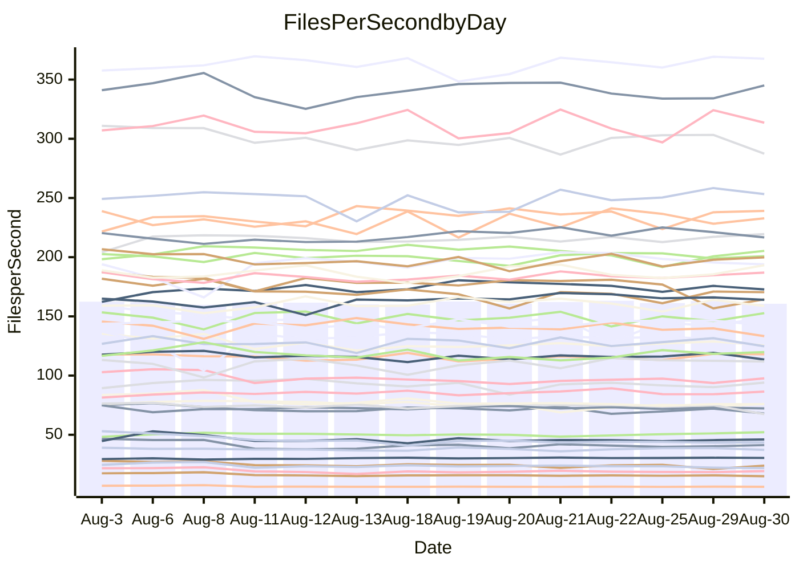

<!---
# This file is auto-generated. Do not edit.
# cspell:disable
--->
# Performance Report

## Daily Performance

## Time to Process Files

| Repository                                      | Elapsed | Min/Avg/Max           |   SD | SD Graph                |
| ----------------------------------------------- | ------: | :-------------------: | ---: | ----------------------- |
| AdaDoom3/AdaDoom3                    |    3.36 | 3.3 /   3.4 /   3.6   | 0.07 | `     ┣━┻●━╋━━┻━┫     ` |
| alexiosc/megistos                    |    9.13 | 7.5 /   7.8 /   9.4   | 0.36 | `    ┣━━┻━━╋━━┻━━┫   ●` |
| apollographql/apollo-server          |    2.56 | 2.6 /   2.7 /   3.3   | 0.15 | `    ┣━━●━━╋━━┻━━┫    ` |
| aspnetboilerplate/aspnetboilerplate  |   10.22 | 10.1 /  10.6 /  11.2  | 0.26 | `    ┣●━┻━━╋━━┻━━┫    ` |
| aws-amplify/docs                     |   13.02 | 12.7 /  13.2 /  14.2  | 0.38 | `    ┣━━┻●━╋━━┻━━┫    ` |
| Azure/azure-rest-api-specs           |    9.77 | 9.4 /   9.8 /  11.3   | 0.44 | `    ┣━━┻━●╋━━┻━━┫    ` |
| bitjson/typescript-starter           |    1.05 | 0.9 /   1.0 /   1.3   | 0.08 | `     ┣━┻━━●━━┻━┫     ` |
| caddyserver/caddy                    |    3.86 | 3.6 /   3.7 /   4.1   | 0.14 | `    ┣━━┻━━╋━●┻━━┫    ` |
| canada-ca/open-source-logiciel-libre |    1.17 | 0.9 /   1.1 /   1.2   | 0.07 | `     ┣━┻━━╋━●┻━┫     ` |
| chef/chef                            |    6.62 | 5.8 /   6.2 /   7.7   | 0.39 | `    ┣━━┻━━╋━━●━━┫    ` |
| dart-lang/sdk                        |   67.11 | 63.3 /  67.2 /  70.7  | 2.06 | `  ┣━━━┻━━━●━━━┻━━━┫  ` |
| django/django                        |   14.93 | 14.8 /  15.6 /  16.4  | 0.35 | `    ●━━┻━━╋━━┻━━┫    ` |
| eslint/eslint                        |   10.67 | 10.6 /  11.2 /  12.1  | 0.40 | `    ┣━●┻━━╋━━┻━━┫    ` |
| exonum/exonum                        |    3.60 | 3.4 /   3.6 /   3.9   | 0.12 | `    ┣━━┻━●╋━━┻━━┫    ` |
| flutter/samples                      |   17.07 | 16.4 /  17.3 /  19.7  | 0.70 | `   ┣━━━┻━●╋━━┻━━━┫   ` |
| gitbucket/gitbucket                  |    3.51 | 3.4 /   3.6 /   3.9   | 0.12 | `    ┣━━┻●━╋━━┻━━┫    ` |
| googleapis/google-cloud-cpp          |  144.72 | 136.7 / 143.4 / 155.3 | 4.87 | `  ┣━━━┻━━━╋●━━┻━━━┫  ` |
| graphql/express-graphql              |    1.17 | 1.0 /   1.1 /   1.3   | 0.07 | `     ┣━┻━━╋━━●━┫     ` |
| graphql/graphql-js                   |    2.85 | 2.7 /   2.9 /   3.2   | 0.11 | `    ┣━━┻━●╋━━┻━━┫    ` |
| graphql/graphql-relay-js             |    1.15 | 1.0 /   1.1 /   1.3   | 0.07 | `     ┣━┻━━●━━┻━┫     ` |
| graphql/graphql-spec                 |    1.03 | 0.9 /   1.0 /   1.2   | 0.06 | `     ┣━┻━━╋●━┻━┫     ` |
| iluwatar/java-design-patterns        |   13.07 | 12.6 /  13.4 /  15.2  | 0.58 | `    ┣━━┻●━╋━━┻━━┫    ` |
| ktaranov/sqlserver-kit               |    6.72 | 6.5 /   6.8 /   7.4   | 0.20 | `    ┣━━┻━●╋━━┻━━┫    ` |
| liriliri/licia                       |    4.19 | 4.0 /   4.2 /   4.6   | 0.12 | `    ┣━━┻━●╋━━┻━━┫    ` |
| MartinThoma/LaTeX-examples           |    7.22 | 6.7 /   7.0 /   7.5   | 0.17 | `    ┣━━┻━━╋━━●━━┫    ` |
| mdx-js/mdx                           |    2.12 | 1.8 /   2.0 /   2.2   | 0.09 | `     ┣━┻━━╋━━┻●┫     ` |
| microsoft/TypeScript-Website         |    6.54 | 5.5 /   5.8 /   7.3   | 0.36 | `    ┣━━┻━━╋━━┻━━●    ` |
| MicrosoftDocs/PowerShell-Docs        |   23.88 | 23.2 /  24.5 /  27.5  | 0.98 | `   ┣━━━┻●━╋━━┻━━━┫   ` |
| neovim/nvim-lspconfig                |    4.45 | 4.1 /   4.3 /   4.7   | 0.14 | `    ┣━━┻━━╋━━●━━┫    ` |
| pagekit/pagekit                      |    3.52 | 3.5 /   3.6 /   4.1   | 0.12 | `    ┣━━●━━╋━━┻━━┫    ` |
| php/php-src                          |   26.71 | 25.3 /  26.8 /  29.7  | 1.01 | `   ┣━━━┻━━●━━┻━━━┫   ` |
| plasticrake/tplink-smarthome-api     |    1.37 | 1.2 /   1.3 /   1.4   | 0.07 | `     ┣━┻━━╋●━┻━┫     ` |
| prettier/prettier                    |    7.46 | 7.0 /   7.4 /   8.1   | 0.24 | `    ┣━━┻━━╋●━┻━━┫    ` |
| pycontribs/jira                      |    1.54 | 1.5 /   1.6 /   1.7   | 0.05 | `     ┣━┻●━╋━━┻━┫     ` |
| RustPython/RustPython                |    5.47 | 5.0 /   5.4 /   5.8   | 0.22 | `    ┣━━┻━━╋●━┻━━┫    ` |
| shoelace-style/shoelace              |    2.97 | 2.8 /   3.0 /   3.7   | 0.18 | `    ┣━━┻━●╋━━┻━━┫    ` |
| slint-ui/slint                       |   15.51 | 11.8 /  12.5 /  14.7  | 0.65 | `     ┣━━┻━╋━┻━━┫    ●` |
| SoftwareBrothers/admin-bro           |    2.62 | 2.4 /   2.6 /   3.0   | 0.12 | `    ┣━━┻━━╋●━┻━━┫    ` |
| sveltejs/svelte                      |   21.93 | 20.2 /  21.5 /  23.0  | 0.51 | `   ┣━━━┻━━╋━━●━━━┫   ` |
| TheAlgorithms/Python                 |    5.91 | 5.6 /   6.0 /   6.9   | 0.32 | `    ┣━━┻━━●━━┻━━┫    ` |
| twbs/bootstrap                       |    1.75 | 1.3 /   1.5 /   1.7   | 0.08 | `     ┣━┻━━╋━━┻━┫  ●  ` |
| typescript-cheatsheets/react         |    1.39 | 1.3 /   1.4 /   1.5   | 0.04 | `     ┣━┻━●╋━━┻━┫     ` |
| typescript-eslint/typescript-eslint  |    4.31 | 4.1 /   4.3 /   4.6   | 0.13 | `    ┣━━┻━━╋●━┻━━┫    ` |
| vitest-dev/vitest                    |    9.59 | 9.0 /   9.5 /  11.1   | 0.44 | `    ┣━━┻━━●━━┻━━┫    ` |
| w3c/aria-practices                   |    3.41 | 3.2 /   3.5 /   3.8   | 0.12 | `    ┣━━┻━●╋━━┻━━┫    ` |
| w3c/specberus                        |    1.97 | 1.9 /   2.1 /   2.2   | 0.09 | `     ┣━●━━╋━━┻━┫     ` |
| webdeveric/webpack-assets-manifest   |    1.28 | 1.0 /   1.2 /   1.3   | 0.07 | `     ┣━┻━━╋━━┻●┫     ` |
| webpack/webpack                      |    5.57 | 5.4 /   5.6 /   6.2   | 0.19 | `    ┣━━┻━●╋━━┻━━┫    ` |
| wireapp/wire-desktop                 |    1.08 | 0.9 /   1.1 /   1.3   | 0.09 | `     ┣━┻━━╋●━┻━┫     ` |
| wireapp/wire-webapp                  |   11.83 | 10.8 /  11.2 /  13.3  | 0.53 | `    ┣━━┻━━╋━━┻●━┫    ` |

Note:
- Elapsed time is in seconds.

## Files per Second over Time

| Repository                                      | Files |    Sec |    Fps |     Rel | Trend Fps              |    N |
| ----------------------------------------------- | ----: | -----: | -----: | ------: | ---------------------- | ---: |
| AdaDoom3/AdaDoom3                    |   103 |   3.36 |  30.63 |   1.79% | `█▇▅▇█▇█▇▇▇▇█▇▇█▇██▇█` |   26 |
| alexiosc/megistos                    |   583 |   9.13 |  63.83 | -14.24% | `█▇▇▅▇█▆▇▇▇█▇▇█▆▇▇█▃▃` |   26 |
| apollographql/apollo-server          |   252 |   2.56 |  98.43 |   5.91% | `▇████▆▆▇▇▂▇▇▇▇▆▇▆█▅█` |   26 |
| aspnetboilerplate/aspnetboilerplate  |  2286 |  10.22 | 223.65 |   3.74% | `▅▆▆██▅▆▇▆▆█▆▆▇▇▅▇▇▇█` |   26 |
| aws-amplify/docs                     |  2871 |  13.02 | 220.52 |   1.45% | `▆▇▆▄▇▅▇▇██▆█▇▇██▇▆▆▇` |   26 |
| Azure/azure-rest-api-specs           |  2438 |   9.77 | 249.57 |   0.42% | `▇▇▇█▇▃▇█▄▆▅█▇▇▇▇█▇█▇` |   26 |
| bitjson/typescript-starter           |    20 |   1.05 |  19.00 |  -1.46% | `██▅▇▆▃▇▅▇▆██▇▇▇▆▆██▇` |   26 |
| caddyserver/caddy                    |   285 |   3.86 |  73.85 |  -2.98% | `██▇▇▆▇▇▄█▇▇▄▅▆█▅▆█▆▆` |   26 |
| canada-ca/open-source-logiciel-libre |     7 |   1.17 |   5.98 |  -5.23% | `▅█▇▇▇▇▆▇█▇▆▆▇▇▆▆▇▆▆▆` |   26 |
| chef/chef                            |  1207 |   6.62 | 182.39 |  -6.52% | `▇▇█▇▇▇▆▇█▇▇█▇█▇█▇▇▇▅` |   26 |
| dart-lang/sdk                        | 10798 |  67.11 | 160.90 |   0.30% | `▅█▇▇▆▅▆█▇▆▇▇▅▇▅▄▇▆▄▆` |   26 |
| django/django                        |  2855 |  14.93 | 191.20 |   4.34% | `█▆▆▆▆▄▆▅█▅▆▇▆▆▆▆▆▆▇█` |   26 |
| eslint/eslint                        |  2090 |  10.67 | 195.96 |   4.81% | `▇▆██▆▅▅▄██▇▇▆▆▇▄▆▇▇█` |   26 |
| exonum/exonum                        |   421 |   3.60 | 116.94 |   0.60% | `▇▆▆█▆▇▅▇▆▅▇▇▆▆▆▇█▆▄▇` |   26 |
| flutter/samples                      |  2400 |  17.07 | 140.63 |  -0.30% | `▆▇▇▆██▇▆▆▆▇▆▇█▆▆▆▆▃▆` |   26 |
| gitbucket/gitbucket                  |   413 |   3.51 | 117.55 |   1.91% | `▆▅▅█▇▅█▅▆█▅▇█▆▄██▇█▇` |   26 |
| googleapis/google-cloud-cpp          | 20651 | 144.72 | 142.70 |  -0.80% | `█▆▆▄▆▇▅█▇▄█▆▆█▇▇▇▇▅▆` |   26 |
| graphql/express-graphql              |    26 |   1.17 |  22.14 |  -6.40% | `▆▇▅█▇▆█▆▇▇██▇▇▇▇▅▆▃▅` |   26 |
| graphql/graphql-js                   |   364 |   2.85 | 127.93 |   1.10% | `▅▇███▄▇▇▇▇▇█▇▇▇██▇▇█` |   26 |
| graphql/graphql-relay-js             |    28 |   1.15 |  24.36 |  -1.18% | `▆▆▇▇▆▆█▇▇▇█▄▆▇█▇▃▆▆▇` |   26 |
| graphql/graphql-spec                 |    16 |   1.03 |  15.59 |  -2.42% | `▇▅██▅▇▇▇▇▇█▆▇▇▆▇▇▃▇▇` |   26 |
| iluwatar/java-design-patterns        |  1992 |  13.07 | 152.40 |   2.12% | `█▇█▇▆▅▇▇▅▆▇▇▇▃▇▇▆▇█▇` |   26 |
| ktaranov/sqlserver-kit               |   489 |   6.72 |  72.80 |   0.66% | `▆██▆▆█▆▇███▇▇▇▅█▇█▅▇` |   26 |
| liriliri/licia                       |  1437 |   4.19 | 343.27 |   1.03% | `▆▇▄▅▆▇▇█▇▇██▇▇▇▆▆█▇▇` |   26 |
| MartinThoma/LaTeX-examples           |  1409 |   7.22 | 195.10 |  -2.67% | `▆▇▇▅▆▇▆▆▅▆▄▇▆██▆▆▇▇▅` |   26 |
| mdx-js/mdx                           |   141 |   2.12 |  66.65 |  -6.70% | `▆▇▄█▅▇█▇█▅██▅▆▆▇▇▅▆▅` |   26 |
| microsoft/TypeScript-Website         |   761 |   6.54 | 116.30 | -11.17% | `██▆█▆███▇▆█▇▇▇▇▇▇█▆▄` |   26 |
| MicrosoftDocs/PowerShell-Docs        |  2708 |  23.88 | 113.42 |   2.51% | `▇▇▇█▆▆▄▅▇▆█▅█▇█▇▇▆▇▇` |   26 |
| neovim/nvim-lspconfig                |   754 |   4.45 | 169.26 |  -2.61% | `▆█▆▇▆▆▆██▇█▇█▆▇▅▇▇▆▆` |   26 |
| pagekit/pagekit                      |   741 |   3.52 | 210.32 |   3.05% | `▇▇▇▇▆██▇███▇▇▆▇▃▆█▆█` |   26 |
| php/php-src                          |  2279 |  26.71 |  85.31 |   0.06% | `▅▇▆█▅▇▇▄▇▇▆▇██▆▆▆█▆▆` |   26 |
| plasticrake/tplink-smarthome-api     |    62 |   1.37 |  45.11 |  -2.69% | `▅▅▆▆▇▇▄▇█▅▇▆▇▆▆▅▆▆█▆` |   26 |
| prettier/prettier                    |  2286 |   7.46 | 306.43 |  -0.98% | `▅▅▆▆▆██▄▇▆▆█▇▆▅▅█▇█▆` |   26 |
| pycontribs/jira                      |    79 |   1.54 |  51.37 |   1.83% | `▇▇▅▇▄█▆▇▅▆▆▅▆▄▅▇▇█▇▇` |   26 |
| RustPython/RustPython                |   683 |   5.47 | 124.94 |  -1.91% | `▇▇▇▇▅▄█▇█▅▆█▄▇▆██▄▇▆` |   26 |
| shoelace-style/shoelace              |   439 |   2.97 | 147.93 |   1.11% | `██▇▇▇▇▆▇█▇▇█▆▂▆█▇███` |   26 |
| slint-ui/slint                       |  2241 |  15.51 | 144.44 | -18.90% | `█▇██▇▇▇▆██▇▇█▇▆▇▄▆▇▂` |   26 |
| SoftwareBrothers/admin-bro           |   441 |   2.62 | 168.31 |  -1.03% | `██▇█▇██▇█▃▇██▇▆▆███▇` |   26 |
| sveltejs/svelte                      |  7809 |  21.93 | 356.13 |  -1.87% | `▇▇▅▇▅▆▆▅▄▅▆▆▆▆▆▅▇█▆▅` |   26 |
| TheAlgorithms/Python                 |  1390 |   5.91 | 235.07 |   0.45% | `▃█▆▃██▇▇▇▇█▇▇█▇▄▇▇█▇` |   26 |
| twbs/bootstrap                       |   118 |   1.75 |  67.44 | -13.99% | `▇█▅▅▆▇█▇▆▆▇▆█▅█▃▆██▃` |   26 |
| typescript-cheatsheets/react         |    53 |   1.39 |  38.07 |   0.72% | `▄▇▇▅▅▆▅██▆▇▅█▅█▇▇▆▄▇` |   26 |
| typescript-eslint/typescript-eslint  |  1278 |   4.31 | 296.22 |  -0.93% | `████▅▇▇█▆▇█▆▇████▆▄▇` |   26 |
| vitest-dev/vitest                    |  2193 |   9.59 | 228.68 |  -0.63% | `▇▆▇▇▆▅█▃▇▇█▆███▇▆▇▇▇` |   26 |
| w3c/aria-practices                   |   409 |   3.41 | 119.90 |   1.44% | `▇▆▆▇▆▆█▄▆▅▇▅▆▅▇█▇▇█▇` |   26 |
| w3c/specberus                        |   198 |   1.97 | 100.30 |   2.81% | `▅▆▇██▇▇▅█▇▄▆▇▇▇▇▆▇▆█` |   26 |
| webdeveric/webpack-assets-manifest   |    54 |   1.28 |  42.07 |  -7.94% | `██▇▇▇█▄█▆▇█▆▇▇▇▆▆█▆▅` |   26 |
| webpack/webpack                      |  1111 |   5.57 | 199.50 |   1.11% | `▇▇▆▆█▆▆█▇▇▄▇██▇▅▇█▇▇` |   26 |
| wireapp/wire-desktop                 |    43 |   1.08 |  39.74 |  -2.73% | `█▇█▂▇▅███▇▅█▇██▆▇██▇` |   26 |
| wireapp/wire-webapp                  |  1831 |  11.83 | 154.82 |  -5.09% | `▇▇▅▃▇█▇█▇▇▇███▇▇▇██▆` |   26 |

## Data Throughput

| Repository                                      | Files |    Sec |     Kps |     Rel | Trend Kps              |    N |
| ----------------------------------------------- | ----: | -----: | ------: | ------: | ---------------------- | ---: |
| AdaDoom3/AdaDoom3                    |   103 |   3.36 |  650.99 |   1.79% | `█▇▅▇█▇█▇▇▇▇█▇▇█▇██▇█` |   26 |
| alexiosc/megistos                    |   583 |   9.13 |  501.56 | -14.24% | `█▇▇▅▇█▆▇▇▇█▇▇█▆▇▇█▃▃` |   26 |
| apollographql/apollo-server          |   252 |   2.56 |  791.74 |   5.91% | `▇████▆▆▇▇▂▇▇▇▇▆▇▆█▅█` |   26 |
| aspnetboilerplate/aspnetboilerplate  |  2286 |  10.22 |  544.16 |   3.76% | `▅▆▆██▅▆▇▆▆█▆▆▇▇▅▇▇▇█` |   26 |
| aws-amplify/docs                     |  2871 |  13.02 |  770.01 |   1.45% | `▆▇▆▄▇▅▇▇██▆█▇▇██▇▆▆▇` |   26 |
| Azure/azure-rest-api-specs           |  2438 |   9.77 |  661.51 |   0.16% | `▇▇▇█▇▃▇█▄▆▅█▇▇▇▇█▇█▇` |   26 |
| bitjson/typescript-starter           |    20 |   1.05 |   76.00 |  -1.46% | `██▅▇▆▃▇▅▇▆██▇▇▇▆▆██▇` |   26 |
| caddyserver/caddy                    |   285 |   3.86 |  630.45 |  -2.80% | `██▇▇▆▇▇▄█▇▇▄▅▆█▅▆█▆▆` |   26 |
| canada-ca/open-source-logiciel-libre |     7 |   1.17 |   49.58 |  -5.23% | `▅█▇▇▇▇▆▇█▇▆▆▇▇▆▆▇▆▆▆` |   26 |
| chef/chef                            |  1207 |   6.62 |  842.89 |  -6.46% | `▇▇█▇▇▇▆▇█▇▇█▇█▇█▇▇▇▅` |   26 |
| dart-lang/sdk                        | 10798 |  67.11 | 1089.01 |   0.40% | `▅█▇▇▆▅▅█▇▆▆▇▅▇▅▄▇▆▄▆` |   26 |
| django/django                        |  2855 |  14.93 | 1198.80 |   4.44% | `█▆▆▆▆▄▆▅█▆▆▇▆▆▆▆▇▆▇█` |   26 |
| eslint/eslint                        |  2090 |  10.67 | 1423.83 |   4.81% | `▇▆██▆▅▅▄██▇▇▆▆▇▄▆▇▇█` |   26 |
| exonum/exonum                        |   421 |   3.60 | 1118.53 |   0.60% | `▇▆▆█▆▇▅▇▆▅▇▇▆▆▆▇█▆▄▇` |   26 |
| flutter/samples                      |  2400 |  17.07 | 1254.90 |   0.76% | `▆▇▇▆██▇▆▆▆▇▆▇█▆▆▇▆▃▇` |   26 |
| gitbucket/gitbucket                  |   413 |   3.51 |  534.26 |   1.93% | `▆▅▅█▇▅█▅▆█▅▇█▆▄██▇█▇` |   26 |
| googleapis/google-cloud-cpp          | 20651 | 144.72 | 1153.74 |  -0.61% | `█▆▆▄▆▇▅█▇▄█▆▆█▇▇▇▇▅▆` |   26 |
| graphql/express-graphql              |    26 |   1.17 |  101.35 |  -6.40% | `▆▇▅█▇▆█▆▇▇██▇▇▇▇▅▆▃▅` |   26 |
| graphql/graphql-js                   |   364 |   2.85 |  735.27 |   1.10% | `▅▇███▄▇▇▇▇▇█▇▇▇██▇▇█` |   26 |
| graphql/graphql-relay-js             |    28 |   1.15 |   95.70 |  -1.18% | `▆▆▇▇▆▆█▇▇▇█▄▆▇█▇▃▆▆▇` |   26 |
| graphql/graphql-spec                 |    16 |   1.03 |  565.31 |  -2.42% | `▇▅██▅▇▇▇▇▇█▆▇▇▆▇▇▃▇▇` |   26 |
| iluwatar/java-design-patterns        |  1992 |  13.07 |  471.04 |   2.12% | `█▇█▇▆▅▇▇▅▆▇▇▇▃▇▇▆▇█▇` |   26 |
| ktaranov/sqlserver-kit               |   489 |   6.72 | 1101.91 |   0.66% | `▆██▆▆█▆▇███▇▇▇▅█▇█▅▇` |   26 |
| liriliri/licia                       |  1437 |   4.19 |  408.96 |   1.03% | `▆▇▄▅▆▇▇█▇▇██▇▇▇▆▆█▇▇` |   26 |
| MartinThoma/LaTeX-examples           |  1409 |   7.22 |  402.94 |  -2.67% | `▆▇▇▅▆▇▆▆▅▆▄▇▆██▆▆▇▇▅` |   26 |
| mdx-js/mdx                           |   141 |   2.12 |  310.10 |  -6.66% | `▆▇▄█▅▇█▇█▅██▅▆▆▇▇▅▆▅` |   26 |
| microsoft/TypeScript-Website         |   761 |   6.54 |  804.33 | -11.14% | `██▆█▆███▇▆█▇▇▇▇▇▇█▆▄` |   26 |
| MicrosoftDocs/PowerShell-Docs        |  2708 |  23.88 | 1166.31 |   2.54% | `▇▇▇█▆▆▄▅▇▆█▅█▇█▇▇▆▇▇` |   26 |
| neovim/nvim-lspconfig                |   754 |   4.45 |  278.35 |  -1.31% | `▆█▆▇▆▆▆██▇█▇█▆▇▆▇▇▇▆` |   26 |
| pagekit/pagekit                      |   741 |   3.52 |  438.52 |   3.05% | `▇▇▇▇▆██▇███▇▇▆▇▃▆█▆█` |   26 |
| php/php-src                          |  2279 |  26.71 | 1486.29 |   0.24% | `▅▇▆█▅▇▇▄▇▇▆▇██▆▆▆█▆▆` |   26 |
| plasticrake/tplink-smarthome-api     |    62 |   1.37 |  243.74 |  -2.69% | `▅▅▆▆▇▇▄▇█▅▇▆▇▆▆▅▆▆█▆` |   26 |
| prettier/prettier                    |  2286 |   7.46 |  434.71 |  -1.00% | `▅▆▆▆▆██▄▇▆▆█▇▆▅▅█▇█▆` |   26 |
| pycontribs/jira                      |    79 |   1.54 |  364.15 |   1.81% | `▇▇▅▇▄█▆▇▅▆▆▅▆▄▅▇▇█▇▇` |   26 |
| RustPython/RustPython                |   683 |   5.47 |  981.43 |  -1.82% | `▆▇▇▇▅▄█▇█▅▆█▄▇▆██▄▇▆` |   26 |
| shoelace-style/shoelace              |   439 |   2.97 |  714.71 |   1.11% | `██▇▇▇▇▆▇█▇▇█▆▂▆█▇███` |   26 |
| slint-ui/slint                       |  2241 |  15.51 |  942.77 | -18.79% | `█▇██▇▇▇▅█▇▇▇█▇▆▇▄▆▇▂` |   26 |
| SoftwareBrothers/admin-bro           |   441 |   2.62 |  370.96 |  -1.03% | `██▇█▇██▇█▃▇██▇▆▆███▇` |   26 |
| sveltejs/svelte                      |  7809 |  21.93 |  238.43 |  -1.88% | `▇▇▅▇▅▆▆▅▄▅▆▆▆▆▆▅▇█▆▅` |   26 |
| TheAlgorithms/Python                 |  1390 |   5.91 |  596.82 |   0.47% | `▃█▆▃██▇▇▇▇█▇▇█▇▄▇▇█▇` |   26 |
| twbs/bootstrap                       |   118 |   1.75 |  553.84 | -13.99% | `▇█▅▅▆▇█▇▆▆▇▆█▅█▃▆██▃` |   26 |
| typescript-cheatsheets/react         |    53 |   1.39 |  281.56 |   1.76% | `▄▇▆▅▅▅▅█▇▆▇▄█▄█▇█▆▅▇` |   26 |
| typescript-eslint/typescript-eslint  |  1278 |   4.31 | 1512.14 |  -0.84% | `████▅▇▇█▆▇█▆▇████▆▄▇` |   26 |
| vitest-dev/vitest                    |  2193 |   9.59 |  513.77 |  -0.50% | `▇▆▇▇▆▅█▃▇▇█▆███▇▆▇▇▇` |   26 |
| w3c/aria-practices                   |   409 |   3.41 | 1115.78 |   1.45% | `▇▆▆▇▆▆█▄▆▅▇▅▆▅▇█▇▇█▇` |   26 |
| w3c/specberus                        |   198 |   1.97 |  315.08 |   3.28% | `▅▆▇▇▇▇▇▅█▇▄▆▇▇▇▇▆▇▆█` |   26 |
| webdeveric/webpack-assets-manifest   |    54 |   1.28 |   98.94 |  -7.91% | `██▇▇▇█▄█▆▇█▆▇▇▇▆▆█▆▅` |   26 |
| webpack/webpack                      |  1111 |   5.57 |  906.29 |   1.29% | `▇▇▆▆▇▆▆█▇▇▄▇██▇▅▇█▇▇` |   26 |
| wireapp/wire-desktop                 |    43 |   1.08 |  175.62 |  -2.73% | `█▇█▂▇▅███▇▅█▇██▆▇██▇` |   26 |
| wireapp/wire-webapp                  |  1831 |  11.83 |  553.09 |  -5.04% | `▇▇▅▃▇█▇█▇▇▇███▇▇▇██▆` |   26 |

