<!---
# This file is auto-generated. Do not edit.
# cspell:disable
--->
# Performance Report

## Daily Performance

```mermaid
xychart-beta
    title Files Per Second by Day
    y-axis Files per Second
    x-axis Date [Nov-22, Nov-23, Nov-26, Nov-27, Nov-28, Nov-29, Nov-30, Dec-2, Dec-8, Dec-9, Dec-10, Dec-13, Dec-14, Dec-15, Dec-16, Dec-20, Dec-22]
    bar [161.07, 158.38, 160.01, 159.51, 160.85, 158.58, 159.25, 158.41, 158.24, 160.26, 160.13, 162.46, 160.30, 159.32, 159.99, 160.32, 171.41]
    line [14.18, 13.95, 14.61, 14.49, 13.79, 14.45, 14.21, 13.55, 14.37, 14.53, 14.61, 14.25, 14.42, 14.66, 14.20, 14.14, 14.58]
    line [6.00, 6.29, 6.16, 6.03, 5.90, 6.01, 6.16, 6.12, 6.00, 6.03, 6.11, 5.69, 6.12, 5.85, 6.27, 5.94, 6.19]
    line [124.88, 123.12, 123.27, 123.12, 128.04, 125.68, 123.73, 126.68, 128.02, 124.91, 128.75, 126.25, 125.99, 122.54, 125.77, 120.95, 129.07]
    line [347.69, 328.52, 335.50, 325.97, 342.99, 339.55, 340.91, 343.35, 333.69, 321.17, 305.21, 329.78, 336.28, 339.96, 335.03, 330.81, 346.52]
    line [147.16, 143.68, 142.26, 141.63, 133.10, 147.45, 147.90, 147.19, 142.70, 144.08, 143.97, 142.44, 148.72, 148.74, 148.66, 145.81, 145.83]
    line [63.78, 65.76, 61.80, 64.96, 64.67, 62.90, 65.22, 65.65, 62.39, 60.36, 64.84, 65.11, 62.93, 65.98, 63.02, 64.70, 64.39]
    line [21.70, 22.82, 21.29, 23.51, 23.57, 23.50, 23.32, 21.90, 22.93, 23.26, 21.71, 22.48, 22.26, 24.16, 21.86, 22.99, 23.86]
    line [125.92, 133.37, 131.47, 131.60, 135.88, 131.34, 132.15, 133.58, 127.82, 130.48, 134.87, 129.94, 136.83, 140.59, 128.00, 132.13, 140.04]
    line [24.23, 25.56, 24.09, 24.00, 22.97, 23.09, 24.60, 24.46, 23.99, 23.97, 23.56, 24.27, 23.97, 21.89, 24.77, 24.75, 25.98]
    line [75.92, 76.91, 75.07, 72.02, 77.23, 76.76, 75.06, 80.27, 76.65, 75.94, 76.12, 76.57, 75.62, 71.86, 75.70, 72.52, 79.52]
    line [50.67, 53.20, 51.79, 48.42, 50.26, 50.21, 51.36, 49.95, 51.18, 48.94, 51.93, 50.78, 49.91, 50.66, 50.34, 50.02, 51.61]
    line [70.73, 68.53, 69.45, 70.29, 72.76, 71.50, 72.49, 68.01, 65.32, 69.78, 72.32, 70.99, 69.49, 68.20, 68.29, 71.18, 72.28]
    line [113.80, 114.46, 111.80, 116.19, 117.82, 117.56, 113.82, 115.04, 119.17, 112.82, 116.99, 116.61, 109.61, 115.93, 113.66, 115.36, 122.68]
    line [92.88, 97.96, 96.91, 93.91, 96.71, 97.20, 94.57, 96.80, 90.09, 95.39, 94.62, 99.56, 95.79, 93.99, 95.03, 91.66, 95.50]
    line [236.13, 235.78, 220.97, 238.24, 242.33, 236.55, 228.65, 226.03, 235.13, 236.77, 244.11, 232.83, 233.41, 237.39, 235.87, 236.73, 241.85]
    line [18.52, 18.27, 18.83, 18.32, 19.02, 18.13, 19.36, 18.09, 18.49, 18.92, 19.04, 18.41, 18.71, 17.35, 18.44, 18.66, 19.39]
    line [72.41, 73.90, 73.49, 71.80, 68.80, 70.33, 71.28, 70.66, 70.99, 71.64, 73.38, 70.10, 71.99, 68.96, 71.11, 72.00, 74.62]
    line [111.11, 117.00, 116.48, 115.76, 116.91, 109.21, 117.71, 115.04, 114.43, 117.93, 116.17, 113.85, 113.19, 111.86, 113.23, 116.22, 119.95]
    line [201.26, 203.88, 197.62, 198.09, 199.18, 190.53, 196.53, 193.86, 202.32, 202.37, 184.12, 199.02, 199.50, 195.58, 198.56, 202.04, 205.76]
    line [95.37, 95.97, 90.32, 91.22, 95.22, 98.38, 95.87, 95.57, 93.03, 94.71, 95.93, 94.05, 97.42, 87.40, 93.20, 92.02, 98.77]
    line [76.58, 77.00, 75.69, 74.97, 72.54, 73.38, 73.35, 76.02, 71.59, 73.55, 75.54, 73.95, 75.07, 76.77, 72.26, 69.84, 77.03]
    line [29.67, 30.46, 29.86, 30.48, 28.76, 28.98, 28.47, 31.13, 29.50, 29.81, 30.70, 31.34, 29.78, 30.86, 29.89, 30.20, 33.22]
    line [298.41, 296.48, 286.19, 292.24, 281.16, 293.25, 299.40, 309.39, 295.84, 293.27, 283.38, 296.25, 298.40, 299.27, 280.90, 293.45, 278.89]
    line [166.41, 153.59, 165.34, 167.76, 159.74, 168.29, 166.84, 155.06, 164.08, 161.66, 171.02, 169.99, 161.97, 169.28, 168.79, 164.45, 163.90]
    line [202.16, 197.78, 192.08, 198.49, 194.68, 194.09, 191.43, 192.21, 203.69, 197.75, 183.65, 201.42, 192.31, 202.71, 196.90, 201.49, 199.06]
    line [194.96, 171.19, 192.32, 195.34, 189.35, 192.30, 195.25, 190.71, 193.15, 186.55, 193.19, 192.23, 185.43, 191.26, 188.26, 189.10, 196.56]
    line [208.25, 203.01, 216.67, 216.64, 214.89, 220.14, 219.09, 206.67, 213.42, 215.72, 212.77, 206.57, 216.35, 210.81, 207.51, 213.81, 235.09]
    line [307.69, 303.77, 306.69, 310.59, 299.95, 317.57, 310.02, 296.47, 313.58, 317.30, 295.96, 306.54, 308.67, 318.29, 308.47, 312.68, 311.01]
    line [168.69, 167.81, 163.00, 169.37, 167.40, 162.13, 167.55, 165.94, 166.49, 162.27, 148.64, 164.74, 167.10, 169.90, 168.25, 171.20, 165.98]
    line [150.38, 142.14, 139.88, 148.61, 147.55, 150.86, 144.17, 148.12, 146.38, 144.41, 148.76, 149.26, 148.44, 146.25, 144.57, 148.51, 160.26]
    line [36.55, 38.70, 37.18, 37.74, 38.63, 39.45, 38.80, 39.93, 37.87, 36.13, 38.10, 36.47, 38.38, 37.81, 37.32, 38.13, 39.99]
    line [123.77, 123.92, 126.14, 121.82, 120.62, 120.89, 122.51, 125.41, 124.96, 118.90, 125.77, 122.50, 124.97, 121.63, 124.44, 114.40, 117.66]
    line [182.60, 177.02, 183.57, 185.12, 185.03, 175.76, 181.77, 182.47, 179.95, 179.31, 188.38, 180.77, 185.77, 186.35, 184.33, 182.33, 191.53]
    line [211.74, 210.99, 212.04, 213.89, 218.50, 211.90, 198.01, 215.07, 216.21, 215.29, 206.31, 212.61, 210.51, 204.56, 210.18, 211.34, 200.66]
    line [207.11, 206.14, 207.83, 208.99, 199.30, 206.34, 190.41, 205.06, 206.03, 204.37, 194.91, 205.14, 200.36, 207.64, 202.85, 200.31, 210.29]
    line [234.88, 241.77, 233.01, 234.04, 231.90, 232.03, 221.81, 240.23, 229.14, 227.27, 231.37, 242.80, 219.56, 233.62, 231.32, 236.32, 236.26]
    line [114.47, 109.88, 112.40, 105.21, 111.47, 116.12, 108.62, 108.44, 104.81, 110.68, 102.65, 110.81, 107.51, 105.11, 109.29, 110.23, 118.20]
    line [364.19, 368.22, 360.42, 361.78, 353.39, 352.03, 379.23, 367.49, 374.69, 369.34, 374.83, 359.05, 350.76, 385.22, 356.23, 361.41, 363.52]
    line [185.79, 151.12, 180.91, 184.73, 187.07, 183.30, 171.17, 189.43, 187.46, 185.27, 181.05, 182.93, 185.74, 173.94, 185.68, 184.19, 188.28]
    line [138.55, 138.37, 142.22, 131.52, 144.79, 139.07, 144.20, 143.55, 138.09, 144.82, 146.07, 144.49, 139.02, 141.78, 142.36, 140.50, 151.95]
    line [46.58, 46.39, 45.62, 44.62, 44.61, 47.22, 46.33, 44.42, 44.87, 45.90, 44.67, 46.00, 48.05, 47.07, 45.85, 42.75, 47.52]
    line [81.28, 83.53, 86.46, 84.38, 84.35, 87.05, 85.49, 84.05, 80.02, 85.30, 82.71, 84.32, 82.91, 77.95, 81.87, 81.89, 89.30]
    line [45.87, 46.91, 45.25, 44.50, 44.73, 43.85, 45.20, 42.00, 46.02, 43.67, 43.68, 45.02, 45.75, 43.43, 44.94, 44.85, 45.35]
    line [230.05, 239.20, 229.08, 239.26, 235.89, 229.81, 229.18, 221.75, 237.38, 239.25, 224.99, 230.85, 236.16, 237.46, 237.06, 237.81, 238.36]
    line [31.75, 32.47, 31.60, 31.68, 30.55, 32.17, 27.01, 31.76, 31.99, 31.99, 30.84, 32.08, 31.89, 31.67, 31.01, 31.00, 31.79]
    line [196.64, 202.22, 187.96, 198.52, 194.49, 202.79, 200.07, 197.01, 195.46, 191.88, 199.25, 200.18, 192.55, 195.85, 196.96, 197.31, 203.68]
    line [116.44, 115.65, 119.47, 113.07, 108.78, 113.61, 117.05, 115.87, 112.86, 110.11, 114.79, 114.58, 111.22, 109.33, 106.79, 113.91, 116.30]
    line [158.58, 162.75, 157.87, 156.54, 160.15, 158.52, 161.43, 161.03, 163.37, 162.01, 157.69, 162.41, 162.92, 155.61, 157.24, 162.25, 174.81]
    line [159.52, 161.45, 166.78, 158.69, 159.56, 158.17, 155.13, 153.99, 150.95, 152.99, 153.72, 160.91, 157.90, 164.74, 161.04, 164.69, 164.20]
    line [143.12, 138.28, 138.39, 140.67, 142.96, 135.37, 140.89, 136.51, 139.19, 142.56, 144.70, 146.06, 142.91, 137.61, 141.27, 139.39, 164.22]
```

## Time to Process Files

| Repository                                      | Elapsed | Min/Avg/Max           |   SD | SD Graph                |
| ----------------------------------------------- | ------: | :-------------------: | ---: | ----------------------- |
| AdaDoom3/AdaDoom3                    |    3.10 | 3.1 /   3.4 /   3.8   | 0.12 | `   ●┣━━┻━━╋━━┻━━┫    ` |
| alexiosc/megistos                    |    7.50 | 7.4 /   7.9 /   8.8   | 0.30 | `    ┣━●┻━━╋━━┻━━┫    ` |
| apollographql/apollo-server          |    2.51 | 2.5 /   2.7 /   2.9   | 0.10 | `     ●━┻━━╋━━┻━┫     ` |
| aspnetboilerplate/aspnetboilerplate  |    9.64 | 9.8 /  10.7 /  12.5   | 0.44 | `  ● ┣━━┻━━╋━━┻━━┫    ` |
| aws-amplify/docs                     |   13.06 | 12.8 /  13.6 /  15.9  | 0.57 | `    ┣━━●━━╋━━┻━━┫    ` |
| Azure/azure-rest-api-specs           |   10.69 | 9.7 /  10.3 /  10.9   | 0.37 | `    ┣━━┻━━╋━━┻●━┫    ` |
| bitjson/typescript-starter           |    1.03 | 1.0 /   1.1 /   1.2   | 0.04 | `     ┣━●━━╋━━┻━┫     ` |
| caddyserver/caddy                    |    3.68 | 3.5 /   3.8 /   4.2   | 0.16 | `    ┣━━●━━╋━━┻━━┫    ` |
| canada-ca/open-source-logiciel-libre |    1.14 | 1.1 /   1.2 /   1.3   | 0.04 | `     ┣━┻━●╋━━┻━┫     ` |
| chef/chef                            |    5.92 | 5.8 /   6.0 /   6.5   | 0.18 | `    ┣━━┻●━╋━━┻━━┫    ` |
| dart-lang/sdk                        |   66.72 | 64.2 /  68.1 /  75.3  | 2.22 | `  ┣━━━┻━●━╋━━━┻━━━┫  ` |
| django/django                        |   14.61 | 15.2 /  15.8 /  19.1  | 0.71 | `   ┣━●━┻━━╋━━┻━━━┫   ` |
| eslint/eslint                        |   10.68 | 10.3 /  10.9 /  12.2  | 0.34 | `    ┣━━┻●━╋━━┻━━┫    ` |
| exonum/exonum                        |    3.52 | 3.5 /   3.7 /   3.9   | 0.11 | `    ┣━●┻━━╋━━┻━━┫    ` |
| flutter/samples                      |   15.74 | 16.0 /  17.1 /  21.1  | 0.84 | `   ┣━●━┻━━╋━━┻━━━┫   ` |
| gitbucket/gitbucket                  |    3.33 | 3.4 /   3.6 /   3.8   | 0.11 | `   ●┣━━┻━━╋━━┻━━┫    ` |
| googleapis/google-cloud-cpp          |  125.28 | 130.8 / 148.4 / 159.8 | 5.17 | `●    ┣━━┻━╋━┻━━┫     ` |
| graphql/express-graphql              |    1.07 | 1.1 /   1.2 /   1.4   | 0.07 | `     ┣━●━━╋━━┻━┫     ` |
| graphql/graphql-js                   |    2.88 | 2.8 /   2.9 /   3.2   | 0.08 | `     ┣━┻●━╋━━┻━┫     ` |
| graphql/graphql-relay-js             |    1.06 | 1.1 /   1.2 /   1.3   | 0.04 | `    ●┣━┻━━╋━━┻━┫     ` |
| graphql/graphql-spec                 |    1.30 | 1.3 /   1.3 /   1.5   | 0.04 | `     ┣━┻●━╋━━┻━┫     ` |
| iluwatar/java-design-patterns        |   12.50 | 12.4 /  13.5 /  14.9  | 0.44 | `  ● ┣━━┻━━╋━━┻━━┫    ` |
| ktaranov/sqlserver-kit               |    6.30 | 6.4 /   6.9 /   7.3   | 0.22 | `  ● ┣━━┻━━╋━━┻━━┫    ` |
| liriliri/licia                       |    4.08 | 4.1 /   4.3 /   4.7   | 0.15 | `    ┣━●┻━━╋━━┻━━┫    ` |
| MartinThoma/LaTeX-examples           |    6.76 | 6.9 /   7.1 /   7.7   | 0.18 | `    ┣●━┻━━╋━━┻━━┫    ` |
| mdx-js/mdx                           |    1.94 | 1.9 /   2.0 /   2.2   | 0.09 | `     ┣━┻●━╋━━┻━┫     ` |
| microsoft/TypeScript-Website         |    5.50 | 5.4 /   5.8 /   6.1   | 0.19 | `    ┣━●┻━━╋━━┻━━┫    ` |
| MicrosoftDocs/PowerShell-Docs        |   22.56 | 22.1 /  24.4 /  26.2  | 0.96 | `   ┣●━━┻━━╋━━┻━━━┫   ` |
| neovim/nvim-lspconfig                |    4.64 | 4.4 /   4.6 /   5.1   | 0.15 | `    ┣━━┻━━╋●━┻━━┫    ` |
| pagekit/pagekit                      |    3.49 | 3.4 /   3.6 /   3.9   | 0.10 | `    ┣━●┻━━╋━━┻━━┫    ` |
| php/php-src                          |   24.97 | 25.5 /  27.2 /  29.7  | 0.95 | `  ●┣━━━┻━━╋━━┻━━━┫   ` |
| plasticrake/tplink-smarthome-api     |    1.29 | 1.3 /   1.4 /   1.6   | 0.05 | `     ┣━●━━╋━━┻━┫     ` |
| prettier/prettier                    |    7.77 | 7.5 /   7.9 /   8.4   | 0.21 | `    ┣━━┻●━╋━━┻━━┫    ` |
| pycontribs/jira                      |    1.55 | 1.5 /   1.6 /   1.7   | 0.05 | `     ┣━┻━●╋━━┻━┫     ` |
| RustPython/RustPython                |    6.13 | 5.5 /   5.8 /   6.3   | 0.22 | `    ┣━━┻━━╋━━┻●━┫    ` |
| shoelace-style/shoelace              |    2.91 | 2.8 /   3.0 /   3.7   | 0.16 | `    ┣━━┻●━╋━━┻━━┫    ` |
| slint-ui/slint                       |   13.68 | 13.6 /  14.2 /  15.0  | 0.34 | `    ┣●━┻━━╋━━┻━━┫    ` |
| SoftwareBrothers/admin-bro           |    2.72 | 2.6 /   2.7 /   2.9   | 0.09 | `     ┣━┻━━╋●━┻━┫     ` |
| sveltejs/svelte                      |   22.60 | 21.1 /  22.5 /  23.8  | 0.70 | `   ┣━━━┻━━●━━┻━━━┫   ` |
| TheAlgorithms/Python                 |    5.64 | 5.7 /   6.0 /   6.5   | 0.21 | `    ┣●━┻━━╋━━┻━━┫    ` |
| twbs/bootstrap                       |    1.87 | 1.8 /   1.8 /   2.0   | 0.05 | `     ┣━┻━━╋●━┻━┫     ` |
| typescript-cheatsheets/react         |    1.35 | 1.3 /   1.4 /   1.7   | 0.08 | `     ┣━┻●━╋━━┻━┫     ` |
| typescript-eslint/typescript-eslint  |    4.63 | 4.0 /   4.4 /   4.9   | 0.16 | `    ┣━━┻━━╋━━┻●━┫    ` |
| vitest-dev/vitest                    |   10.44 | 9.6 /  10.2 /  11.6   | 0.39 | `    ┣━━┻━━╋━●┻━━┫    ` |
| w3c/aria-practices                   |    3.51 | 3.5 /   3.7 /   3.9   | 0.14 | `    ┣━━●━━╋━━┻━━┫    ` |
| w3c/specberus                        |    2.12 | 1.9 /   2.1 /   2.3   | 0.07 | `     ┣━┻━━╋━●┻━┫     ` |
| webdeveric/webpack-assets-manifest   |    1.23 | 1.2 /   1.2 /   1.4   | 0.04 | `     ┣━┻━━●━━┻━┫     ` |
| webpack/webpack                      |    5.84 | 5.4 /   5.8 /   6.1   | 0.17 | `    ┣━━┻━━╋●━┻━━┫    ` |
| wireapp/wire-desktop                 |    1.29 | 1.3 /   1.4 /   1.6   | 0.07 | `     ┣●┻━━╋━━┻━┫     ` |
| wireapp/wire-webapp                  |   10.64 | 10.1 /  11.2 /  12.4  | 0.42 | `    ┣━●┻━━╋━━┻━━┫    ` |

Note:
- Elapsed time is in seconds.

## Files per Second over Time

| Repository                                      | Files |    Sec |    Fps |    Rel | Trend Fps              |    N |
| ----------------------------------------------- | ----: | -----: | -----: | -----: | ---------------------- | ---: |
| AdaDoom3/AdaDoom3                    |   103 |   3.10 |  33.22 | 10.26% | `▆▅▄▅▅▆▆▇▅▅▆▅▄▆▅▆▆▅██` |   32 |
| alexiosc/megistos                    |   583 |   7.50 |  77.70 |  5.09% | `▇▅▆▆▆▇█▆▆██▆█▃▆▅▅▄██` |   32 |
| apollographql/apollo-server          |   253 |   2.51 | 100.65 |  7.20% | `▅▅▅▆▅▆▆▅█▅▃▅▅▄▆▆▄▄▆▇` |   32 |
| aspnetboilerplate/aspnetboilerplate  |  2286 |   9.64 | 237.13 | 11.31% | `▆▆▆▆▆▆▄▅▆▆▅▆▆▆▂▆▆▅██` |   32 |
| aws-amplify/docs                     |  2874 |  13.06 | 220.02 |  4.25% | `██▆▇▇▆▇▆▅█▆█▆▅▇▇▆▇▃█` |   32 |
| Azure/azure-rest-api-specs           |  2438 |  10.69 | 227.96 | -2.86% | `▄▇▅▅█▄▅▆▆▆▆▄▇▅▇█▅▆█▅` |   32 |
| bitjson/typescript-starter           |    20 |   1.03 |  19.37 |  4.31% | `▅█▆▇██▆▇▇▇▅▇▆█▅▇▇▇██` |   32 |
| caddyserver/caddy                    |   290 |   3.68 |  78.86 |  4.28% | `█▆▆▅▆▆▆▆▆▆▄▆▆▆▅▆▄▃▇▇` |   32 |
| canada-ca/open-source-logiciel-libre |     7 |   1.14 |   6.14 |  1.41% | `▆▇▅▆▆▆▃▆▆▇▅▇█▇▆▆▅▆▇▆` |   32 |
| chef/chef                            |  1192 |   5.92 | 201.39 |  2.19% | `▇▇█▇▇▄▇▇▆▆█▆█▅▆▇▇█▆▇` |   32 |
| dart-lang/sdk                        | 10901 |  66.72 | 163.37 |  2.55% | `▅▆▃▅▅▅▇▇▇▅█▆▆▆█▇█▇█▇` |   32 |
| django/django                        |  2889 |  14.61 | 197.81 |  8.05% | `▇▇▇▇▆▆▇▆▆▇▅▇▇▇▆▇▇▆▆█` |   32 |
| eslint/eslint                        |  2062 |  10.68 | 193.10 |  1.32% | `▇▇▇▆▆▇█▆▆▆▇▆▆▆▇▇▇▆█▇` |   32 |
| exonum/exonum                        |   421 |   3.52 | 119.63 |  4.05% | `▆▇▅▇▇▇▅▇▆▅▅▄▆▇▆▇█▆██` |   32 |
| flutter/samples                      |  2441 |  15.74 | 155.05 |  9.89% | `▆▅▆▇▆▇▇▆▆▅▆▆▆▇▆▆▆▆▇█` |   32 |
| gitbucket/gitbucket                  |   413 |   3.33 | 124.07 |  7.81% | `▆▇▆▄▆▆▆▆▅▃▆▆▄▅▆▆▅▆▇█` |   32 |
| googleapis/google-cloud-cpp          | 21013 | 125.28 | 167.73 | 18.58% | `▃▄▃▄▅▅▅▅▄▄▄▃▄▅▄▄▃▄▇█` |   32 |
| graphql/express-graphql              |    26 |   1.07 |  24.41 |  7.81% | `▅█▆▆█▅▆▆▅▇█▃▆▇▇▇▇▆▇█` |   32 |
| graphql/graphql-js                   |   368 |   2.88 | 127.83 |  2.13% | `▇▇█▆▇██▆▇▇▆█▇▅▇▇▅▄█▇` |   32 |
| graphql/graphql-relay-js             |    28 |   1.06 |  26.43 |  9.35% | `▆▅▆▆▅▅▆▆▆▅▃▆█▆▆▆▇▆▇█` |   32 |
| graphql/graphql-spec                 |    19 |   1.30 |  14.67 |  2.81% | `▄▇█▇██▆▇█▇██▇▆▇▆▇▇▇█` |   32 |
| iluwatar/java-design-patterns        |  1992 |  12.50 | 159.32 |  8.20% | `▅▆▅▄▆▆▆▆▅▆▅▅▆▄▅▆▆▆██` |   32 |
| ktaranov/sqlserver-kit               |   489 |   6.30 |  77.59 |  8.64% | `▅▃▇▆▅▆▅▄▆▅▄▄▇▆▄█▆▄▅█` |   32 |
| liriliri/licia                       |  1437 |   4.08 | 352.35 |  5.51% | `█▆▆▆▄▃▄█▆▇▇█▇▆▅▆▆▆▇█` |   32 |
| MartinThoma/LaTeX-examples           |  1409 |   6.76 | 208.41 |  4.88% | `▆█▇█▆▄▇▆▇▆▆▇▇▅▆█▇▇▇█` |   32 |
| mdx-js/mdx                           |   141 |   1.94 |  72.56 |  3.86% | `█▅▄█▅█▇▇▅█▆▇▇▅▄█▅███` |   32 |
| microsoft/TypeScript-Website         |   761 |   5.50 | 138.35 |  4.88% | `▆▅▄▅▆▆▆▄▇▇█▅▅▄▄▆▅▅█▇` |   32 |
| MicrosoftDocs/PowerShell-Docs        |  2639 |  22.56 | 116.97 |  6.75% | `▃▅▃▆▆▄▆▆▄▆▄▆▅▅▆▅▆▆█▇` |   32 |
| neovim/nvim-lspconfig                |   766 |   4.64 | 165.16 | -0.82% | `▇▇▆▇▄▃▆▆▇▆▇█▇▇▆▇▇█▇▆` |   32 |
| pagekit/pagekit                      |   741 |   3.49 | 212.45 |  4.22% | `▆▇▇▇▆▅▆█▇▅▇▆▇▆▇▇▅▆▇█` |   32 |
| php/php-src                          |  2265 |  24.97 |  90.72 |  8.80% | `▆▆▃▆▆▅▆▆▅▅▄▅▄▆▅▅▆▄▇█` |   32 |
| plasticrake/tplink-smarthome-api     |    62 |   1.29 |  47.90 |  5.25% | `▅▅▆▇▆▆▆▇█▇▇▇▆▆▇▃▆▅▇█` |   32 |
| prettier/prettier                    |  2467 |   7.77 | 317.31 |  2.90% | `▆▆█▇█▅▆▆▅█▇▆▆▇▆▆█▆▆▇` |   32 |
| pycontribs/jira                      |    79 |   1.55 |  51.01 |  1.18% | `▆▇▇▇▄█▇▇▆▇▇▇▇▆▇▆▇▆█▇` |   32 |
| RustPython/RustPython                |   711 |   6.13 | 116.08 | -5.12% | `▇█▆▅▆▇▆▆▇▇▆▇▇▇▆▄▄▅▅▅` |   32 |
| shoelace-style/shoelace              |   439 |   2.91 | 150.92 |  4.43% | `▇▇▅▆▆▆▇▅▇▆▇▆▇▆█▆▆▆▅▇` |   32 |
| slint-ui/slint                       |  2628 |  13.68 | 192.13 |  4.94% | `▆▄▇▆▄▇▅▆▆▇▇▆▇▆▇▇▇▅██` |   32 |
| SoftwareBrothers/admin-bro           |   441 |   2.72 | 162.03 | -1.71% | `▄▆▇▄▇██▇▅▇▇█▇▇▇▆▅█▇▆` |   32 |
| sveltejs/svelte                      |  8238 |  22.60 | 364.44 |  0.40% | `▆▆▇▄█▇▆▅▅▄█▄▅▄▇▆▅▆▆▆` |   32 |
| TheAlgorithms/Python                 |  1399 |   5.64 | 248.22 |  5.72% | `▄█▅▇▆█▇▅▆▆▇▅█▆▆▆▆▇▆█` |   32 |
| twbs/bootstrap                       |   118 |   1.87 |  62.97 | -1.47% | `▇▆▆▄▆▇▇█▆▆█▇▆▇▆▆▇██▆` |   32 |
| typescript-cheatsheets/react         |    53 |   1.35 |  39.39 |  3.94% | `█▆▆▂█▆▄▇▇▇▆▆▆▆▇▇▆▆█▇` |   32 |
| typescript-eslint/typescript-eslint  |  1294 |   4.63 | 279.18 | -4.44% | `█▆▆▆▅▅▅▆▆▆▆▆▅▃▅▆▆▅▄▄` |   32 |
| vitest-dev/vitest                    |  2424 |  10.44 | 232.25 | -0.31% | `▇▄▇▅▅▆█▆▆▃▆▆▆▇▅█▆▆▇▆` |   32 |
| w3c/aria-practices                   |   414 |   3.51 | 117.95 |  4.50% | `▆▆▆▄▆▇▅█▇▄▅▄▅▄▄▇▆▆▇█` |   32 |
| w3c/specberus                        |   197 |   2.12 |  92.72 | -2.46% | `▇▅▃▆▇▆█▇▇▆▆▆▆▅▆▃▇▄▇▅` |   32 |
| webdeveric/webpack-assets-manifest   |    55 |   1.23 |  44.65 | -0.32% | `▃▇█▆▇▆▇▇▇█▆▇█▇▆▆▇▇█▇` |   32 |
| webpack/webpack                      |  1139 |   5.84 | 194.94 | -0.99% | `▆▆▄▄▅▆▆▆▆▄▅▆▆▅▄▅▆▆█▅` |   32 |
| wireapp/wire-desktop                 |    44 |   1.29 |  34.23 |  9.24% | `▅▇▆▇▆▆▆▇▆▇▆▆▄▇▇▇▄▆▄█` |   32 |
| wireapp/wire-webapp                  |  1809 |  10.64 | 170.08 |  5.94% | `▆▅▆▅▆▅▆▅▅▆▅▅▅▅▄▆▆▅█▇` |   32 |

## Data Throughput

| Repository                                      | Files |    Sec |     Kps |    Rel | Trend Kps              |    N |
| ----------------------------------------------- | ----: | -----: | ------: | -----: | ---------------------- | ---: |
| AdaDoom3/AdaDoom3                    |   103 |   3.10 |  705.93 | 10.26% | `▆▅▄▅▅▆▆▇▅▅▆▅▄▆▅▆▆▅██` |   32 |
| alexiosc/megistos                    |   583 |   7.50 |  610.50 |  5.09% | `▇▅▆▆▆▇█▆▆██▆█▃▆▅▅▄██` |   32 |
| apollographql/apollo-server          |   253 |   2.51 |  823.47 |  7.26% | `▅▅▅▆▅▆▆▅█▅▃▅▅▄▆▆▄▄▆▇` |   32 |
| aspnetboilerplate/aspnetboilerplate  |  2286 |   9.64 |  576.96 | 11.31% | `▆▆▆▆▆▆▄▅▆▆▅▆▆▆▂▆▆▅██` |   32 |
| aws-amplify/docs                     |  2874 |  13.06 |  768.99 |  4.33% | `██▆▇▇▆▇▆▅█▆█▆▅▇▇▆▇▃█` |   32 |
| Azure/azure-rest-api-specs           |  2438 |  10.69 |  602.45 | -4.21% | `▄▇▅▅█▄▄▆▆▆▆▄▇▅▇▇▅▆█▅` |   32 |
| bitjson/typescript-starter           |    20 |   1.03 |   77.48 |  4.31% | `▅█▆▇██▆▇▇▇▅▇▆█▅▇▇▇██` |   32 |
| caddyserver/caddy                    |   290 |   3.68 |  689.87 |  4.77% | `█▆▆▅▆▆▆▆▆▆▄▆▆▆▅▆▅▃█▇` |   32 |
| canada-ca/open-source-logiciel-libre |     7 |   1.14 |   50.86 |  1.41% | `▆▇▅▆▆▆▃▆▆▇▅▇█▇▆▆▅▆▇▆` |   32 |
| chef/chef                            |  1192 |   5.92 |  936.50 |  2.22% | `▇▇█▇▇▄▇▇▆▆█▆█▅▆▇▇█▆▇` |   32 |
| dart-lang/sdk                        | 10901 |  66.72 | 1107.51 |  2.19% | `▅▆▃▅▅▅▇▇▇▅█▆▆▆█▇█▇█▇` |   32 |
| django/django                        |  2889 |  14.61 | 1245.44 |  8.26% | `▇▇▇▇▆▆▇▆▆▇▅▇▇▇▆▇▆▆▆█` |   32 |
| eslint/eslint                        |  2062 |  10.68 | 1330.46 |  2.05% | `▇▇▇▆▆▇█▆▆▆▇▆▆▆▇▇▇▆█▇` |   32 |
| exonum/exonum                        |   421 |   3.52 | 1144.29 |  4.05% | `▆▇▅▇▇▇▅▇▆▅▅▄▆▇▆▇█▆██` |   32 |
| flutter/samples                      |  2441 |  15.74 | 1362.29 |  8.68% | `▇▆▆█▆▇▇▇▆▆▆▆▆▇▆▆▆▆▇█` |   32 |
| gitbucket/gitbucket                  |   413 |   3.33 |  564.46 |  7.89% | `▆▇▆▄▆▆▆▆▅▃▆▆▄▅▆▆▅▆▇█` |   32 |
| googleapis/google-cloud-cpp          | 21013 | 125.28 | 1365.23 | 18.46% | `▃▄▃▄▅▅▅▅▄▄▄▃▄▅▄▄▃▄▇█` |   32 |
| graphql/express-graphql              |    26 |   1.07 |  111.72 |  7.81% | `▅█▆▆█▅▆▆▅▇█▃▆▇▇▇▇▆▇█` |   32 |
| graphql/graphql-js                   |   368 |   2.88 |  741.98 |  2.13% | `▇▇█▆▇██▆▇▇▆█▇▅▇▇▅▄█▇` |   32 |
| graphql/graphql-relay-js             |    28 |   1.06 |  103.84 |  9.35% | `▆▅▆▆▅▅▆▆▆▅▃▆█▆▆▆▇▆▇█` |   32 |
| graphql/graphql-spec                 |    19 |   1.30 |  489.39 |  2.81% | `▄▇█▇██▆▇█▇██▇▆▇▆▇▇▇█` |   32 |
| iluwatar/java-design-patterns        |  1992 |  12.50 |  492.43 |  8.20% | `▅▆▅▄▆▆▆▆▅▆▅▅▆▄▅▆▆▆██` |   32 |
| ktaranov/sqlserver-kit               |   489 |   6.30 | 1175.03 |  8.64% | `▅▃▇▆▅▆▅▄▆▅▄▄▇▆▄█▆▄▅█` |   32 |
| liriliri/licia                       |  1437 |   4.08 |  419.78 |  5.51% | `█▆▆▆▄▃▄█▆▇▇█▇▆▅▆▆▆▇█` |   32 |
| MartinThoma/LaTeX-examples           |  1409 |   6.76 |  430.42 |  4.88% | `▆█▇█▆▄▇▆▇▆▆▇▇▅▆█▇▇▇█` |   32 |
| mdx-js/mdx                           |   141 |   1.94 |  337.08 |  3.80% | `█▅▄█▅█▇▇▅█▆▇▇▅▄█▅███` |   32 |
| microsoft/TypeScript-Website         |   761 |   5.50 |  957.01 |  4.88% | `▆▅▄▅▆▆▆▄▇▇█▅▅▄▄▆▅▅█▇` |   32 |
| MicrosoftDocs/PowerShell-Docs        |  2639 |  22.56 | 1220.31 |  7.30% | `▃▅▃▆▆▄▆▆▄▆▄▆▅▅▆▅▆▆█▇` |   32 |
| neovim/nvim-lspconfig                |   766 |   4.64 |  307.90 | -0.69% | `▇▇▆▇▅▃▆▆▇▆▇█▇▇▆▇▇█▇▆` |   32 |
| pagekit/pagekit                      |   741 |   3.49 |  442.96 |  4.22% | `▆▇▇▇▆▅▆█▇▅▇▆▇▆▇▇▅▆▇█` |   32 |
| php/php-src                          |  2265 |  24.97 | 1588.41 |  8.68% | `▆▆▃▆▆▅▆▆▆▅▄▅▄▆▅▅▆▄▇█` |   32 |
| plasticrake/tplink-smarthome-api     |    62 |   1.29 |  258.82 |  5.25% | `▅▅▆▇▆▆▆▇█▇▇▇▆▆▇▃▆▅▇█` |   32 |
| prettier/prettier                    |  2467 |   7.77 |  452.11 |  3.92% | `▆▆█▇█▅▆▇▅█▇▆▆▇▆▆█▆▆▇` |   32 |
| pycontribs/jira                      |    79 |   1.55 |  361.56 |  1.18% | `▆▇▇▇▄█▇▇▆▇▇▇▇▆▇▆▇▆█▇` |   32 |
| RustPython/RustPython                |   711 |   6.13 | 1289.80 |  0.80% | `▆█▆▅▆▇▆▆▇▇▇███▇▅▅▆▇▇` |   32 |
| shoelace-style/shoelace              |   439 |   2.91 |  729.16 |  4.43% | `▇▇▅▆▆▆▇▅▇▆▇▆▇▆█▆▆▆▅▇` |   32 |
| slint-ui/slint                       |  2628 |  13.68 | 1186.87 |  4.62% | `▇▄▇▇▅█▅▆▇▇▇▆▇▆▇▇▇▅██` |   32 |
| SoftwareBrothers/admin-bro           |   441 |   2.72 |  357.13 | -1.71% | `▄▆▇▄▇██▇▅▇▇█▇▇▇▆▅█▇▆` |   32 |
| sveltejs/svelte                      |  8238 |  22.60 |  244.68 |  0.65% | `▆▆▇▄█▇▆▅▅▄█▄▅▄▇▆▅▆▆▆` |   32 |
| TheAlgorithms/Python                 |  1399 |   5.64 |  631.81 |  5.78% | `▄█▅▇▆█▇▅▆▆▇▅█▆▆▆▆▇▆█` |   32 |
| twbs/bootstrap                       |   118 |   1.87 |  517.08 | -1.47% | `▇▆▆▄▆▇▇█▆▆█▇▆▇▆▆▇██▆` |   32 |
| typescript-cheatsheets/react         |    53 |   1.35 |  291.33 |  3.94% | `█▆▆▂█▆▄▇▇▇▆▆▆▆▇▇▆▆█▇` |   32 |
| typescript-eslint/typescript-eslint  |  1294 |   4.63 | 1444.03 | -4.32% | `█▆▆▆▅▅▅▆▆▆▆▆▅▃▅▆▆▅▄▄` |   32 |
| vitest-dev/vitest                    |  2424 |  10.44 |  505.50 |  0.16% | `▇▄▇▅▅▆█▆▆▃▆▅▆▇▅█▅▆▇▆` |   32 |
| w3c/aria-practices                   |   414 |   3.51 | 1099.70 |  4.50% | `▆▆▆▄▆▇▅█▇▄▅▄▅▄▄▇▆▆▇█` |   32 |
| w3c/specberus                        |   197 |   2.12 |  293.22 | -2.46% | `▇▅▃▆▇▆█▇▇▆▆▆▆▅▆▃▇▄▇▅` |   32 |
| webdeveric/webpack-assets-manifest   |    55 |   1.23 |  102.30 | -0.66% | `▃▇█▆▇▆▇▇▇█▆▇█▇▆▆▇▇█▇` |   32 |
| webpack/webpack                      |  1139 |   5.84 |  899.89 | -0.37% | `▆▆▄▄▅▆▆▆▆▄▅▆▆▅▄▅▆▆█▅` |   32 |
| wireapp/wire-desktop                 |    44 |   1.29 |  152.49 |  9.92% | `▅▇▆▆▆▅▆▇▆▆▆▅▄▇▇▇▄▆▄█` |   32 |
| wireapp/wire-webapp                  |  1809 |  10.64 |  633.89 |  6.39% | `▆▅▆▅▆▅▆▅▅▆▄▅▅▅▄▆▆▅█▇` |   32 |

