<!---
# This file is auto-generated. Do not edit.
# cspell:disable
--->
# Performance Report

## Daily Performance

```mermaid
xychart-beta
    title Files Per Second by Day
    y-axis Files per Second
    x-axis Date [Jun-23, Jun-24, Jun-25, Jun-30, Jul-2, Jul-4, Jul-5, Jul-6, Jul-7, Jul-8, Jul-9, Jul-10, Jul-12, Jul-13, Jul-15, Jul-17, Jul-18, Jul-19]
    bar [161.06, 164.28, 159.75, 168.95, 160.66, 164.38, 164.27, 162.48, 165.90, 164.83, 163.05, 164.68, 163.19, 162.43, 161.66, 160.81, 162.11, 161.84]
    line [7.12, 7.22, 7.17, 7.37, 7.23, 7.36, 6.99, 7.61, 0.00, 7.24, 7.01, 7.27, 7.49, 7.49, 6.93, 7.35, 7.41, 7.37]
    line [50.23, 51.87, 46.40, 53.06, 51.19, 51.40, 51.86, 50.10, 0.00, 51.21, 51.39, 53.37, 51.98, 49.24, 50.53, 52.10, 52.76, 50.90]
    line [21.30, 21.15, 22.00, 21.90, 21.51, 21.13, 21.43, 22.00, 0.00, 22.72, 21.87, 21.57, 21.20, 21.36, 21.51, 20.58, 21.30, 22.11]
    line [51.73, 51.82, 52.39, 52.00, 48.43, 49.22, 52.34, 53.26, 51.10, 50.86, 50.66, 52.36, 51.79, 53.82, 50.00, 50.85, 53.53, 52.74]
    line [100.84, 107.27, 100.09, 103.62, 104.63, 108.43, 108.27, 103.96, 110.08, 110.20, 105.06, 103.60, 109.02, 107.38, 104.33, 107.04, 105.42, 106.29]
    line [76.22, 74.88, 79.14, 76.99, 75.88, 76.09, 78.08, 72.78, 69.82, 70.79, 75.77, 69.10, 74.66, 73.66, 75.08, 77.97, 77.53, 74.71]
    line [351.35, 353.13, 360.69, 354.83, 355.80, 359.03, 353.22, 355.88, 0.00, 358.26, 350.93, 354.34, 355.82, 344.62, 353.27, 340.52, 356.06, 342.17]
    line [131.39, 132.60, 136.92, 129.95, 133.16, 130.87, 135.23, 135.13, 0.00, 126.22, 133.87, 131.35, 131.34, 131.95, 134.40, 126.35, 129.62, 123.94]
    line [207.28, 201.26, 204.34, 194.65, 210.00, 194.85, 205.89, 207.36, 213.92, 203.52, 207.94, 208.03, 207.20, 205.62, 202.63, 205.11, 209.83, 195.29]
    line [124.29, 119.55, 125.16, 125.39, 122.70, 121.73, 124.30, 123.97, 0.00, 119.80, 118.70, 125.49, 121.97, 119.76, 122.93, 123.39, 123.52, 122.50]
    line [172.84, 180.05, 180.38, 178.52, 180.47, 182.90, 182.10, 170.31, 171.39, 176.15, 181.65, 170.98, 179.72, 179.37, 178.07, 178.35, 166.36, 178.93]
    line [203.46, 201.26, 194.60, 207.89, 194.40, 205.29, 202.49, 204.26, 0.00, 203.31, 188.55, 199.47, 196.87, 207.15, 195.83, 198.09, 197.68, 202.46]
    line [47.61, 46.18, 46.86, 40.79, 46.17, 47.03, 45.86, 46.70, 46.74, 44.23, 47.36, 46.58, 46.27, 47.99, 46.18, 45.89, 46.88, 47.07]
    line [26.60, 26.95, 25.71, 26.35, 26.84, 26.11, 26.06, 26.52, 0.00, 23.76, 25.86, 26.61, 27.13, 26.83, 25.90, 26.40, 26.69, 26.69]
    line [316.02, 312.10, 320.45, 307.34, 312.08, 316.35, 315.20, 318.22, 313.66, 310.11, 308.24, 315.35, 312.26, 316.54, 311.74, 310.63, 315.98, 318.90]
    line [116.01, 109.65, 114.81, 109.29, 115.47, 121.09, 119.06, 122.86, 0.00, 112.77, 117.49, 120.30, 120.41, 118.48, 111.84, 112.66, 103.82, 121.34]
    line [200.19, 199.73, 196.39, 195.67, 205.11, 192.90, 211.35, 185.93, 203.88, 207.58, 205.87, 207.35, 202.66, 199.84, 188.27, 193.42, 194.63, 189.88]
    line [86.88, 85.49, 77.34, 74.76, 87.51, 88.59, 85.26, 74.62, 86.95, 86.80, 88.24, 86.00, 84.39, 79.74, 83.17, 86.61, 84.55, 84.90]
    line [130.59, 136.24, 136.67, 127.99, 132.91, 128.52, 136.97, 123.97, 132.77, 124.67, 133.15, 137.66, 135.26, 135.39, 131.25, 137.83, 130.35, 133.27]
    line [74.26, 76.13, 73.45, 76.23, 74.07, 74.35, 77.62, 75.07, 70.03, 74.46, 78.13, 73.01, 75.98, 75.26, 74.39, 74.57, 72.87, 76.78]
    line [112.71, 115.12, 110.67, 113.20, 113.18, 115.07, 115.63, 114.45, 109.79, 106.87, 117.37, 116.66, 116.21, 118.14, 111.02, 114.16, 117.75, 115.55]
    line [94.35, 94.02, 95.44, 96.15, 95.34, 99.55, 90.07, 101.41, 95.54, 98.21, 94.52, 98.50, 97.78, 96.17, 94.33, 97.04, 97.24, 95.36]
    line [188.80, 187.17, 172.53, 184.06, 188.67, 191.18, 188.53, 186.82, 186.30, 188.38, 183.25, 189.14, 186.31, 182.67, 186.39, 179.31, 182.07, 180.50]
    line [234.34, 233.01, 236.58, 224.78, 231.59, 231.28, 247.94, 235.03, 221.17, 240.95, 229.51, 226.18, 233.66, 229.73, 238.10, 228.16, 232.72, 229.50]
    line [214.37, 216.02, 220.47, 209.37, 208.94, 217.94, 219.88, 213.33, 0.00, 214.36, 206.61, 219.33, 214.62, 210.58, 216.81, 214.69, 207.39, 209.64]
    line [28.80, 30.64, 31.41, 29.25, 30.37, 29.62, 29.89, 30.35, 0.00, 29.68, 29.34, 30.24, 30.35, 30.53, 29.15, 29.59, 30.29, 29.80]
    line [183.71, 182.95, 183.62, 171.28, 176.05, 173.54, 179.14, 185.15, 184.99, 186.71, 181.92, 187.82, 179.82, 180.43, 178.37, 174.98, 183.26, 182.34]
    line [178.80, 184.67, 184.84, 185.79, 182.56, 182.17, 182.82, 182.50, 179.12, 172.62, 169.88, 184.28, 175.71, 183.39, 178.90, 178.60, 191.51, 184.28]
    line [147.83, 153.51, 152.15, 153.26, 150.82, 152.56, 149.61, 151.37, 0.00, 153.34, 151.79, 153.10, 150.91, 149.71, 136.98, 153.14, 154.96, 148.59]
    line [304.83, 306.07, 310.41, 315.81, 298.93, 314.56, 303.69, 317.11, 313.48, 300.01, 308.91, 315.76, 310.85, 309.84, 312.53, 315.03, 314.69, 309.28]
    line [214.79, 220.92, 207.92, 222.39, 218.49, 216.06, 207.77, 218.95, 214.11, 227.80, 218.56, 219.23, 220.42, 224.78, 223.29, 222.43, 207.49, 213.31]
    line [16.59, 17.11, 17.00, 18.16, 17.94, 17.30, 18.64, 18.07, 18.36, 17.45, 17.16, 17.77, 17.48, 17.96, 17.52, 15.60, 17.77, 17.37]
    line [357.60, 370.08, 357.07, 371.96, 367.90, 375.27, 367.85, 365.20, 360.83, 370.59, 365.59, 369.56, 369.35, 363.79, 365.85, 364.51, 354.54, 367.51]
    line [68.82, 72.77, 72.13, 70.38, 72.17, 72.40, 75.76, 67.72, 0.00, 74.05, 71.58, 72.37, 72.08, 72.80, 70.30, 71.38, 70.52, 71.91]
    line [147.78, 145.47, 144.87, 146.87, 151.06, 149.73, 144.88, 148.36, 137.35, 148.23, 146.43, 140.41, 147.84, 149.86, 142.29, 143.07, 141.02, 141.88]
    line [231.36, 235.26, 222.40, 235.59, 233.45, 238.97, 235.75, 235.89, 232.86, 238.48, 229.00, 230.57, 227.85, 230.59, 226.26, 235.84, 238.63, 230.77]
    line [161.29, 162.24, 165.87, 161.72, 162.26, 159.82, 169.05, 166.75, 159.60, 165.64, 167.61, 164.48, 163.07, 165.84, 153.93, 161.48, 163.65, 164.17]
    line [73.34, 75.14, 76.59, 75.51, 75.45, 76.79, 71.21, 73.99, 0.00, 79.33, 75.23, 76.27, 76.63, 75.41, 72.48, 75.77, 73.22, 75.27]
    line [81.29, 84.76, 61.88, 83.73, 83.48, 86.69, 85.83, 89.91, 85.92, 85.41, 81.93, 84.31, 79.99, 86.85, 79.35, 78.74, 86.89, 84.04]
    line [253.77, 251.67, 255.05, 257.07, 253.64, 257.67, 250.47, 259.54, 254.67, 257.07, 247.35, 255.25, 253.55, 251.59, 252.00, 246.87, 251.37, 242.23]
    line [205.60, 202.43, 207.02, 202.54, 202.72, 194.67, 190.86, 195.33, 0.00, 197.97, 203.94, 205.22, 203.61, 197.40, 200.74, 200.72, 202.94, 201.33]
    line [37.48, 36.99, 36.10, 35.86, 38.94, 38.99, 36.38, 39.71, 0.00, 37.09, 38.73, 39.43, 38.35, 38.90, 37.77, 38.11, 36.22, 38.30]
    line [152.29, 157.67, 151.07, 160.69, 154.94, 152.23, 157.47, 160.32, 0.00, 147.14, 152.12, 154.25, 157.55, 157.57, 157.54, 152.05, 156.89, 159.06]
    line [135.01, 128.78, 135.00, 135.05, 134.05, 133.73, 131.56, 129.78, 136.12, 135.18, 134.44, 136.88, 131.27, 132.43, 131.04, 131.83, 130.19, 128.60]
    line [25.82, 27.29, 28.03, 27.82, 28.74, 29.48, 28.36, 28.34, 0.00, 27.98, 28.10, 28.43, 28.38, 28.02, 28.20, 27.23, 28.58, 28.61]
    line [174.24, 176.57, 177.80, 167.68, 175.75, 171.75, 180.95, 169.97, 158.13, 174.21, 168.28, 176.77, 172.02, 178.72, 162.59, 171.56, 160.94, 175.94]
    line [113.71, 108.86, 112.34, 109.73, 113.68, 110.37, 111.97, 110.64, 98.54, 106.95, 114.12, 113.53, 110.15, 112.38, 111.90, 112.10, 103.78, 115.70]
    line [51.44, 53.68, 51.84, 52.69, 51.50, 53.98, 52.25, 52.09, 0.00, 53.03, 50.88, 50.01, 53.83, 52.41, 53.08, 52.40, 51.77, 51.58]
    line [159.81, 157.56, 155.70, 158.25, 148.90, 163.02, 160.27, 163.84, 159.78, 166.09, 162.99, 161.12, 163.50, 159.47, 158.31, 155.54, 162.49, 156.66]
    line [141.81, 150.65, 147.20, 148.34, 142.33, 146.88, 147.38, 139.67, 147.57, 147.61, 146.15, 148.02, 145.81, 141.78, 148.18, 144.29, 144.20, 144.56]
```

## Time to Process Files

| Repository                                      | Elapsed | Min/Avg/Max           |   SD | SD Graph                |
| ----------------------------------------------- | ------: | :-------------------: | ---: | ----------------------- |
| AdaDoom3/AdaDoom3                    |    3.38 | 3.3 /   3.4 /   3.7   | 0.09 | `    ┣━━┻●━╋━━┻━━┫    ` |
| alexiosc/megistos                    |    7.62 | 7.3 /   7.8 /   8.6   | 0.27 | `    ┣━━┻●━╋━━┻━━┫    ` |
| apollographql/apollo-server          |    2.73 | 2.5 /   2.6 /   3.0   | 0.11 | `    ┣━━┻━━╋━━●━━┫    ` |
| aspnetboilerplate/aspnetboilerplate  |   11.28 | 10.2 /  10.6 /  11.1  | 0.27 | `    ┣━━┻━━╋━━┻━━┫ ●  ` |
| aws-amplify/docs                     |   12.89 | 12.6 /  13.2 /  14.1  | 0.39 | `    ┣━━┻●━╋━━┻━━┫    ` |
| Azure/azure-rest-api-specs           |    9.41 | 9.1 /   9.6 /  10.5   | 0.28 | `    ┣━━┻●━╋━━┻━━┫    ` |
| bitjson/typescript-starter           |    0.89 | 0.9 /   0.9 /   1.0   | 0.04 | `     ┣━●━━╋━━┻━┫     ` |
| caddyserver/caddy                    |    3.85 | 3.5 /   3.8 /   4.5   | 0.21 | `    ┣━━┻━━╋●━┻━━┫    ` |
| canada-ca/open-source-logiciel-libre |    0.92 | 0.9 /   1.0 /   1.1   | 0.04 | `     ┣━●━━╋━━┻━┫     ` |
| chef/chef                            |    6.21 | 5.6 /   6.1 /   6.8   | 0.26 | `    ┣━━┻━━╋━●┻━━┫    ` |
| dart-lang/sdk                        |   66.38 | 61.1 /  67.3 /  77.1  | 2.86 | `  ┣━━━┻━━●╋━━━┻━━━┫  ` |
| django/django                        |   15.51 | 15.2 /  15.8 /  17.8  | 0.66 | `   ┣━━━┻●━╋━━┻━━━┫   ` |
| eslint/eslint                        |   10.94 | 10.9 /  11.3 /  12.7  | 0.36 | `    ┣━━●━━╋━━┻━━┫    ` |
| exonum/exonum                        |    3.47 | 3.4 /   3.6 /   4.5   | 0.26 | `    ┣━━┻●━╋━━┻━━┫    ` |
| flutter/samples                      |   17.85 | 16.7 /  17.9 /  19.3  | 0.59 | `   ┣━━━┻━━●━━┻━━━┫   ` |
| gitbucket/gitbucket                  |    3.64 | 3.3 /   3.6 /   3.9   | 0.11 | `    ┣━━┻━━╋●━┻━━┫    ` |
| googleapis/google-cloud-cpp          |  139.19 | 134.4 / 141.1 / 152.7 | 4.46 | `  ┣━━━┻━●━╋━━━┻━━━┫  ` |
| graphql/express-graphql              |    0.96 | 0.9 /   1.0 /   1.1   | 0.03 | `     ┣━┻●━╋━━┻━┫     ` |
| graphql/graphql-js                   |    2.78 | 2.6 /   2.7 /   3.0   | 0.09 | `    ┣━━┻━━╋●━┻━━┫    ` |
| graphql/graphql-relay-js             |    0.99 | 0.9 /   1.0 /   1.1   | 0.05 | `     ┣━┻━●╋━━┻━┫     ` |
| graphql/graphql-spec                 |    0.95 | 0.9 /   0.9 /   1.0   | 0.04 | `     ┣━┻━━╋━●┻━┫     ` |
| iluwatar/java-design-patterns        |   12.96 | 12.8 /  13.3 /  16.5  | 0.64 | `   ┣━━━┻●━╋━━┻━━━┫   ` |
| ktaranov/sqlserver-kit               |    6.84 | 6.5 /   6.8 /   7.7   | 0.23 | `    ┣━━┻━━●━━┻━━┫    ` |
| liriliri/licia                       |    4.07 | 3.9 /   4.1 /   4.6   | 0.13 | `    ┣━━┻━●╋━━┻━━┫    ` |
| MartinThoma/LaTeX-examples           |    6.76 | 6.6 /   7.1 /   7.5   | 0.24 | `    ┣━●┻━━╋━━┻━━┫    ` |
| mdx-js/mdx                           |    1.83 | 1.8 /   1.9 /   2.0   | 0.06 | `     ┣━┻●━╋━━┻━┫     ` |
| microsoft/TypeScript-Website         |    6.21 | 5.6 /   5.8 /   6.3   | 0.18 | `    ┣━━┻━━╋━━┻━━┫●   ` |
| MicrosoftDocs/PowerShell-Docs        |   23.38 | 22.9 /  24.3 /  27.5  | 0.86 | `   ┣━━●┻━━╋━━┻━━━┫   ` |
| neovim/nvim-lspconfig                |    4.23 | 4.1 /   4.3 /   4.9   | 0.17 | `    ┣━━┻●━╋━━┻━━┫    ` |
| pagekit/pagekit                      |    3.61 | 3.6 /   3.7 /   3.9   | 0.09 | `    ┣━━┻●━╋━━┻━━┫    ` |
| php/php-src                          |   26.35 | 25.3 /  27.8 /  36.8  | 2.24 | `   ┣━━┻━●━╋━━━┻━━┫   ` |
| plasticrake/tplink-smarthome-api     |    1.22 | 1.1 /   1.2 /   1.3   | 0.03 | `     ┣━┻━━╋━━●━┫     ` |
| prettier/prettier                    |    7.18 | 7.1 /   7.3 /   7.7   | 0.16 | `    ┣━━┻━●╋━━┻━━┫    ` |
| pycontribs/jira                      |    1.52 | 1.5 /   1.5 /   1.7   | 0.06 | `     ┣━┻━●╋━━┻━┫     ` |
| RustPython/RustPython                |    5.40 | 4.9 /   5.1 /   5.6   | 0.15 | `    ┣━━┻━━╋━━┻━●┫    ` |
| shoelace-style/shoelace              |    2.82 | 2.7 /   2.8 /   3.0   | 0.09 | `    ┣━━┻━━●━━┻━━┫    ` |
| slint-ui/slint                       |   12.28 | 11.4 /  12.1 /  13.5  | 0.50 | `    ┣━━┻━━╋●━┻━━┫    ` |
| SoftwareBrothers/admin-bro           |    2.50 | 2.4 /   2.5 /   2.7   | 0.07 | `     ┣━┻━━╋●━┻━┫     ` |
| sveltejs/svelte                      |   21.27 | 19.5 /  20.7 /  21.7  | 0.49 | `   ┣━━━┻━━╋━━┻●━━┫   ` |
| TheAlgorithms/Python                 |    6.19 | 5.6 /   6.0 /   6.3   | 0.19 | `    ┣━━┻━━╋━━●━━┫    ` |
| twbs/bootstrap                       |    1.40 | 1.3 /   1.4 /   1.7   | 0.09 | `     ┣━┻━━●━━┻━┫     ` |
| typescript-cheatsheets/react         |    1.34 | 1.3 /   1.4 /   1.6   | 0.05 | `     ┣━●━━╋━━┻━┫     ` |
| typescript-eslint/typescript-eslint  |    4.08 | 4.0 /   4.1 /   4.3   | 0.10 | `    ┣━━┻━●╋━━┻━━┫    ` |
| vitest-dev/vitest                    |    9.07 | 8.8 /   9.2 /  10.0   | 0.31 | `    ┣━━┻━●╋━━┻━━┫    ` |
| w3c/aria-practices                   |    3.52 | 3.1 /   3.3 /   3.8   | 0.12 | `    ┣━━┻━━╋━━┻━●┫    ` |
| w3c/specberus                        |    1.83 | 1.8 /   1.9 /   2.1   | 0.07 | `     ┣●┻━━╋━━┻━┫     ` |
| webdeveric/webpack-assets-manifest   |    1.03 | 1.0 /   1.0 /   1.2   | 0.04 | `     ┣━┻━●╋━━┻━┫     ` |
| webpack/webpack                      |    6.08 | 5.1 /   5.4 /   6.0   | 0.17 | `     ┣━┻━━╋━━┻━┫    ●` |
| wireapp/wire-desktop                 |    0.90 | 0.9 /   0.9 /   1.1   | 0.04 | `     ┣━┻●━╋━━┻━┫     ` |
| wireapp/wire-webapp                  |   10.75 | 10.5 /  11.1 /  12.2  | 0.33 | `    ┣━━●━━╋━━┻━━┫    ` |

Note:
- Elapsed time is in seconds.

## Files per Second over Time

| Repository                                      | Files |    Sec |    Fps |     Rel | Trend Fps              |    N |
| ----------------------------------------------- | ----: | -----: | -----: | ------: | ---------------------- | ---: |
| AdaDoom3/AdaDoom3                    |   103 |   3.38 |  30.44 |   1.75% | `▅▇▇█▇▇▇██▇▇▅▆▅█▇▅▇▇▇` |   35 |
| alexiosc/megistos                    |   583 |   7.62 |  76.51 |   1.73% | `▆▆███▆▇█▆▇▆▅▇█▆▆▅▆█▇` |   35 |
| apollographql/apollo-server          |   252 |   2.73 |  92.20 |  -4.16% | `▆████▇█▆██▇▆▇▇█▇██▆▆` |   37 |
| aspnetboilerplate/aspnetboilerplate  |  2259 |  11.28 | 200.35 |  -6.29% | `▅▇█▆▆█▆▆▄▇█▇█▇▅▅▇▆▆▄` |   36 |
| aws-amplify/docs                     |  2871 |  12.89 | 222.71 |   1.97% | `▆▇▇▇█▇▇█▇███▇▇█▅▄▄▇▇` |   37 |
| Azure/azure-rest-api-specs           |  2411 |   9.41 | 256.34 |   1.85% | `▆█▆▅██▅▇▇▆▆▇▅▇▅▆▃▅▅▇` |   38 |
| bitjson/typescript-starter           |    20 |   0.89 |  22.44 |   4.64% | `█▆▆▆▄▇▆█▄▇▆▆▃▇▅▆▇▆██` |   35 |
| caddyserver/caddy                    |   285 |   3.85 |  74.09 |  -1.30% | `▆▃▆█▆▆▄▅█▅█▅█▇▇▇▇▅▇▆` |   37 |
| canada-ca/open-source-logiciel-libre |     7 |   0.92 |   7.63 |   4.87% | `▄▅▅▅█▆▅▆▅▆▅▃▆▆▄▆▅▆▄▆` |   35 |
| chef/chef                            |  1206 |   6.21 | 194.07 |  -2.25% | `▆▆█▇▇▅▇▅▆▇▄▅▄▆▆▅▅▃▅▅` |   37 |
| dart-lang/sdk                        | 10708 |  66.38 | 161.31 |   1.35% | `▅▇█▆▆▅▆▅▅▆▆▅▄▇▅▆▆▅▄▆` |   38 |
| django/django                        |  2847 |  15.51 | 183.61 |   1.85% | `██▇▇▇▆█▆▇▇▆▆▇▃▇▇▇▇▇▇` |   38 |
| eslint/eslint                        |  2080 |  10.94 | 190.09 |   2.81% | `███▇▇█▇▇▇▆█▇▆▆▆▇▃▆██` |   37 |
| exonum/exonum                        |   421 |   3.47 | 121.21 |   4.21% | `▆▇█▇█▆███▆▄█▅▅█▄█▇██` |   35 |
| flutter/samples                      |  2452 |  17.85 | 137.34 |  -5.79% | `▅▆▆██▇▇██▆▅▆▅▆▇▅▇▆▆▄` |   37 |
| gitbucket/gitbucket                  |   412 |   3.64 | 113.16 |  -1.31% | `▆▆▇▆▅▇▆█▆▅▄▅▄▆▆▆▇▆▅▅` |   37 |
| googleapis/google-cloud-cpp          | 20560 | 139.19 | 147.71 |   1.54% | `▇██▆█▆▆▇▅▇██▇█▅▆▄█▇▇` |   37 |
| graphql/express-graphql              |    26 |   0.96 |  26.96 |   1.86% | `▅▆▇▆█▇▇▆▇▇▆▅▇▅▇▇▇▇▆▇` |   35 |
| graphql/graphql-js                   |   364 |   2.78 | 130.95 |  -1.87% | `▇██▇█▇▇▇█▇▅▇███▆▆█▇▆` |   36 |
| graphql/graphql-relay-js             |    28 |   0.99 |  28.24 |   0.88% | `▇▇█▅████▅▇█▆▆▅▇▇██▇▇` |   35 |
| graphql/graphql-spec                 |    16 |   0.95 |  16.80 |  -3.38% | `▆▇▇▆█▆▅▆█▇▅▇▃▃▄▇▆▅▇▅` |   37 |
| iluwatar/java-design-patterns        |  1992 |  12.96 | 153.66 |   2.20% | `▇█▇█▇▇▇▆█▇█▂█▇███▆▆█` |   35 |
| ktaranov/sqlserver-kit               |   489 |   6.84 |  71.48 |  -0.27% | `▆▇▇▇▅███▇▇▇▆▆▇█▆▇▇█▇` |   36 |
| liriliri/licia                       |  1437 |   4.07 | 353.27 |   0.55% | `█▆██▇█▆▄▇▇▇▇▇▃▇▇▅▆▆▇` |   36 |
| MartinThoma/LaTeX-examples           |  1409 |   6.76 | 208.40 |   4.26% | `▄▅▇▅▄▆▆▇▆█▄▇▄▇▆▆▆▆▆▇` |   35 |
| mdx-js/mdx                           |   141 |   1.83 |  76.91 |   2.46% | `█▇▄▆▇▆▇▆▇▅▆▅▄▇▇▅▇▇▇▇` |   36 |
| microsoft/TypeScript-Website         |   760 |   6.21 | 122.46 |  -6.54% | `█▆▇▇▇█▅▇▇▇█▇▄▆▆▆▆▄▅▄` |   35 |
| MicrosoftDocs/PowerShell-Docs        |  2708 |  23.38 | 115.82 |   4.01% | `▇▇▆▇▆▆▇▆▇█▆▇▇▇▇▅████` |   38 |
| neovim/nvim-lspconfig                |   750 |   4.23 | 177.48 |   2.84% | `▇█▇▇▆▇▅█▇▇▆▃▆▇▆▄▇▇▆▇` |   37 |
| pagekit/pagekit                      |   741 |   3.61 | 205.29 |   2.00% | `█████▇▇▆▅▇▇▆█▇▅▇▅█▇█` |   35 |
| php/php-src                          |  2281 |  26.35 |  86.56 |   4.80% | `▇▇▇▆▅▇▇██▄▇▆▅▇▅█▇█▆█` |   38 |
| plasticrake/tplink-smarthome-api     |    62 |   1.22 |  50.74 |  -3.12% | `▅▄▆██▇█▇▇▇▇█▆█▇▆▇▆▆▆` |   35 |
| prettier/prettier                    |  2274 |   7.18 | 316.87 |   0.99% | `▆▇██▆▆█▇▇█▇▇█▅▇▇███▇` |   37 |
| pycontribs/jira                      |    79 |   1.52 |  51.83 |   1.27% | `▆███▇▇▇▅▆▅▇▆▇▇█▇▆▆▇▇` |   35 |
| RustPython/RustPython                |   682 |   5.40 | 126.37 |  -4.68% | `▇█▇▆▇▅▇▇▆▆▇▅▆▆▆▆▆▇▄▅` |   37 |
| shoelace-style/shoelace              |   439 |   2.82 | 155.58 |   0.00% | `▇▅█▆▇█▆▇▅█▇▇▅▆▅▇▇▇▇▆` |   35 |
| slint-ui/slint                       |  2204 |  12.28 | 179.46 |  -0.86% | `▅▇▆▃▅▇▆▅█▇▅▇▇▅▅█▇▆█▆` |   37 |
| SoftwareBrothers/admin-bro           |   441 |   2.50 | 176.48 |  -0.78% | `█▆▆▇▇▇█▇▇█▇▇▇▇▇▅█▇█▇` |   36 |
| sveltejs/svelte                      |  7597 |  21.27 | 357.17 |  -2.58% | `█▅█▆▅▆▇▆▄▆▆▅▆▆▅▅▆▆▇▅` |   38 |
| TheAlgorithms/Python                 |  1390 |   6.19 | 224.59 |  -3.25% | `▅▄▆▇▅▇▆▅▅▆▆█▅▇▄▆▄▆▇▅` |   36 |
| twbs/bootstrap                       |   118 |   1.40 |  84.36 |   0.00% | `█▇▇▆▆█▇▅█▄█▅▇▇█▇▇█▆▇` |   37 |
| typescript-cheatsheets/react         |    53 |   1.34 |  39.42 |   3.68% | `▇██▇██▆█▆█▆▇██▅▅▇▆▇█` |   35 |
| typescript-eslint/typescript-eslint  |  1272 |   4.08 | 311.46 |   0.48% | `▆██▅▇███▇▆█▇█▇██▅█▇▇` |   37 |
| vitest-dev/vitest                    |  2140 |   9.07 | 235.83 |   1.65% | `▅█▅▅▇▇▅▇▆█▄▅▆█▇█▇▄█▇` |   38 |
| w3c/aria-practices                   |   409 |   3.52 | 116.34 |  -5.04% | `▇▇▅▆▇██▃▇▆▇▇▇▆▇▇▇█▇▅` |   36 |
| w3c/specberus                        |   203 |   1.83 | 110.69 |   4.60% | `▅▆▅█▇███▇▆▆▆▇█▇▆▄▇██` |   37 |
| webdeveric/webpack-assets-manifest   |    54 |   1.03 |  52.67 |   2.19% | `▇▇▆▇▅███▇▆▆▄▇▅▆█▇▇▇▇` |   37 |
| webpack/webpack                      |  1109 |   6.08 | 182.55 | -10.71% | `▆█▇█▇▇▆▇▇▆▇▆▇▇▆▇▆▆▆▃` |   38 |
| wireapp/wire-desktop                 |    43 |   0.90 |  47.52 |   2.56% | `▇▇▆▆▆▇▇▇██▇▇▇▇▆▇▇▇▇▇` |   37 |
| wireapp/wire-webapp                  |  1811 |  10.75 | 168.40 |   3.44% | `▇▆▇▆▆▇▆▆▆█▃▆▆▆▆▆▆▆▆▇` |   37 |

## Data Throughput

| Repository                                      | Files |    Sec |     Kps |     Rel | Trend Kps              |    N |
| ----------------------------------------------- | ----: | -----: | ------: | ------: | ---------------------- | ---: |
| AdaDoom3/AdaDoom3                    |   103 |   3.38 |  647.00 |   1.75% | `▅▇▇█▇▇▇██▇▇▅▆▅█▇▅▇▇▇` |   35 |
| alexiosc/megistos                    |   583 |   7.62 |  601.18 |   1.73% | `▆▆███▆▇█▆▇▆▅▇█▆▆▅▆█▇` |   35 |
| apollographql/apollo-server          |   252 |   2.73 |  741.65 |  -3.40% | `▆███▇▇▇▆██▇▆▇▇█▇██▆▆` |   37 |
| aspnetboilerplate/aspnetboilerplate  |  2259 |  11.28 |  471.47 |  -6.29% | `▅▇█▆▆█▆▆▄▇█▇█▇▅▅▇▆▆▄` |   36 |
| aws-amplify/docs                     |  2871 |  12.89 |  775.50 |   2.00% | `▆▇▇▇█▇▇█▇███▇▇█▅▄▄▇▇` |   37 |
| Azure/azure-rest-api-specs           |  2411 |   9.41 |  705.24 |   2.05% | `▆█▆▅██▅▇▇▆▆▇▅▇▅▆▃▅▅▇` |   38 |
| bitjson/typescript-starter           |    20 |   0.89 |   89.75 |   4.64% | `█▆▆▆▄▇▆█▄▇▆▆▃▇▅▆▇▆██` |   35 |
| caddyserver/caddy                    |   285 |   3.85 |  628.89 |  -1.26% | `▆▃▆█▆▆▄▅█▅█▅█▇▇▇▇▅▇▆` |   37 |
| canada-ca/open-source-logiciel-libre |     7 |   0.92 |   63.24 |   4.87% | `▄▅▅▅█▆▅▆▅▆▅▃▆▆▄▆▅▆▄▆` |   35 |
| chef/chef                            |  1206 |   6.21 |  893.61 |  -2.15% | `▆▆█▇▇▅▇▅▆▇▄▅▄▆▆▅▅▃▅▅` |   37 |
| dart-lang/sdk                        | 10708 |  66.38 | 1097.25 |   1.28% | `▅▇█▆▆▅▆▅▅▆▆▅▄▇▅▆▆▅▄▆` |   38 |
| django/django                        |  2847 |  15.51 | 1141.89 |   1.87% | `██▇▇▇▆█▆▇▇▆▆▇▃▇▇▇▇▇▇` |   38 |
| eslint/eslint                        |  2080 |  10.94 | 1374.60 |   2.78% | `███▇▇█▇▇▇▆█▇▆▆▆▇▃▆██` |   37 |
| exonum/exonum                        |   421 |   3.47 | 1159.43 |   4.21% | `▆▇█▇█▆███▆▄█▅▅█▄█▇██` |   35 |
| flutter/samples                      |  2452 |  17.85 | 1206.94 |  -1.33% | `▄▅▅▇▇▆▆▇▇▇▇▇▆▇█▇█▇▇▆` |   37 |
| gitbucket/gitbucket                  |   412 |   3.64 |  511.94 |  -1.30% | `▆▆▇▆▅▇▆█▆▅▄▅▄▆▆▆▇▆▅▅` |   37 |
| googleapis/google-cloud-cpp          | 20560 | 139.19 | 1184.14 |   1.93% | `▇██▆█▆▅▇▅▇██▇█▅▇▅█▇▇` |   37 |
| graphql/express-graphql              |    26 |   0.96 |  123.40 |   1.86% | `▅▆▇▆█▇▇▆▇▇▆▅▇▅▇▇▇▇▆▇` |   35 |
| graphql/graphql-js                   |   364 |   2.78 |  752.58 |  -1.90% | `▇██▇█▇▇▇█▇▅▇███▆▆█▇▆` |   36 |
| graphql/graphql-relay-js             |    28 |   0.99 |  110.94 |   0.88% | `▇▇█▅████▅▇█▆▆▅▇▇██▇▇` |   35 |
| graphql/graphql-spec                 |    16 |   0.95 |  609.01 |  -3.65% | `▆▇▇▆█▆▅▆█▇▅▇▃▃▄▇▆▅▇▅` |   37 |
| iluwatar/java-design-patterns        |  1992 |  12.96 |  474.93 |   2.20% | `▇█▇█▇▇▇▆█▇█▂█▇███▆▆█` |   35 |
| ktaranov/sqlserver-kit               |   489 |   6.84 | 1082.04 |  -0.27% | `▆▇▇▇▅███▇▇▇▆▆▇█▆▇▇█▇` |   36 |
| liriliri/licia                       |  1437 |   4.07 |  420.88 |   0.55% | `█▆██▇█▆▄▇▇▇▇▇▃▇▇▅▆▆▇` |   36 |
| MartinThoma/LaTeX-examples           |  1409 |   6.76 |  430.40 |   4.26% | `▄▅▇▅▄▆▆▇▆█▄▇▄▇▆▆▆▆▆▇` |   35 |
| mdx-js/mdx                           |   141 |   1.83 |  357.28 |   2.46% | `█▇▄▆▇▆▇▆▇▅▆▅▄▇▇▅▇▇▇▇` |   36 |
| microsoft/TypeScript-Website         |   760 |   6.21 |  845.76 |  -6.54% | `█▆▇▇▇█▅▇▇▇█▇▄▆▆▆▆▄▅▄` |   35 |
| MicrosoftDocs/PowerShell-Docs        |  2708 |  23.38 | 1189.91 |   3.99% | `▇▇▆▇▆▆▇▆▇█▆▇▇▇▇▅████` |   38 |
| neovim/nvim-lspconfig                |   750 |   4.23 |  284.92 |   2.88% | `▇█▇▇▆▇▅█▇▇▆▃▆▇▆▄▇▇▆▇` |   37 |
| pagekit/pagekit                      |   741 |   3.61 |  428.02 |   2.00% | `█████▇▇▆▅▇▇▆█▇▅▇▅█▇█` |   35 |
| php/php-src                          |  2281 |  26.35 | 1506.01 |   4.83% | `▇▇▇▆▅▇▇██▄▇▆▅▇▅█▇█▆█` |   38 |
| plasticrake/tplink-smarthome-api     |    62 |   1.22 |  274.18 |  -3.12% | `▅▄▆██▇█▇▇▇▇█▆█▇▆▇▆▆▆` |   35 |
| prettier/prettier                    |  2274 |   7.18 |  450.64 |   0.99% | `▆▇██▆▆█▇▇█▇▇█▅▇▇███▇` |   37 |
| pycontribs/jira                      |    79 |   1.52 |  368.70 |   1.27% | `▆███▇▇▇▅▆▅▇▆▇▇█▇▆▆▇▇` |   35 |
| RustPython/RustPython                |   682 |   5.40 |  984.13 |  -4.32% | `▇█▇▆▇▅▇▇▆▆█▅▇▆▇▆▆█▄▅` |   37 |
| shoelace-style/shoelace              |   439 |   2.82 |  751.69 |   0.00% | `▇▅█▆▇█▆▇▅█▇▇▅▆▅▇▇▇▇▆` |   35 |
| slint-ui/slint                       |  2204 |  12.28 | 1161.74 |  -1.00% | `▅▇▆▃▅▇▆▅█▇▅▇▇▅▅█▇▆█▆` |   37 |
| SoftwareBrothers/admin-bro           |   441 |   2.50 |  388.98 |  -0.78% | `█▆▆▇▇▇█▇▇█▇▇▇▇▇▅█▇█▇` |   36 |
| sveltejs/svelte                      |  7597 |  21.27 |  237.28 |  -2.57% | `█▅█▆▅▆▇▆▄▆▆▅▆▆▅▅▆▆▇▅` |   38 |
| TheAlgorithms/Python                 |  1390 |   6.19 |  570.03 |  -3.26% | `▅▄▆▇▅▇▆▅▅▆▆█▅▇▄▆▄▆▇▅` |   36 |
| twbs/bootstrap                       |   118 |   1.40 |  692.72 |   0.00% | `█▇▇▆▆█▇▅█▄█▅▇▇█▇▇█▆▇` |   37 |
| typescript-cheatsheets/react         |    53 |   1.34 |  287.84 |   3.68% | `▇██▇██▆█▆█▆▇██▅▅▇▆▇█` |   35 |
| typescript-eslint/typescript-eslint  |  1272 |   4.08 | 1591.36 |   0.75% | `▆██▅▇███▇▆█▇█▇██▆█▇▇` |   37 |
| vitest-dev/vitest                    |  2140 |   9.07 |  513.42 |   1.42% | `▅█▅▅▇▇▅▇▆█▄▅▆█▇█▇▄█▇` |   38 |
| w3c/aria-practices                   |   409 |   3.52 | 1082.34 |  -4.94% | `▇▇▅▆▇██▃▇▆▇▇▇▆▇▇▇█▇▅` |   36 |
| w3c/specberus                        |   203 |   1.83 |  344.61 |   4.14% | `▅▆▅█▇███▇▆▆▆▇█▇▆▄▇██` |   37 |
| webdeveric/webpack-assets-manifest   |    54 |   1.03 |  122.89 |   2.19% | `▇▇▆▇▅███▇▆▆▄▇▅▆█▇▇▇▇` |   37 |
| webpack/webpack                      |  1109 |   6.08 |  822.04 | -10.92% | `▆█▇█▇▇▇▇▇▆▇▆▇▇▆▇▆▅▆▃` |   38 |
| wireapp/wire-desktop                 |    43 |   0.90 |  209.97 |   2.56% | `▇▇▆▆▆▇▇▇██▇▇▇▇▆▇▇▇▇▇` |   37 |
| wireapp/wire-webapp                  |  1811 |  10.75 |  599.85 |   3.36% | `▇▆▇▆▆▇▆▆▆█▃▆▆▆▆▆▆▆▆▇` |   37 |

