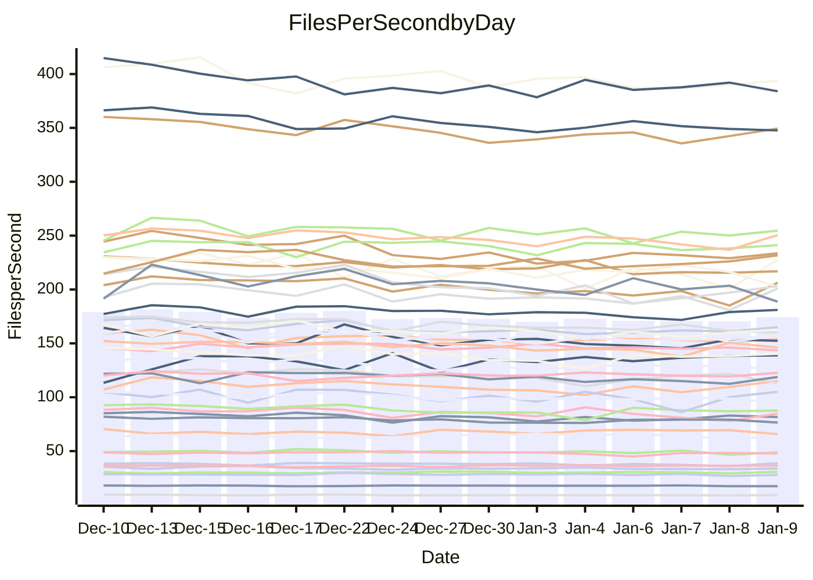

<!---
# This file is auto-generated. Do not edit.
# cspell:disable
--->
# Performance Report

## Daily Performance

## Time to Process Files

| Repository                                      | Elapsed | Min/Avg/Max           |   SD | SD Graph                |
| ----------------------------------------------- | ------: | :-------------------: | ---: | ----------------------- |
| AdaDoom3/AdaDoom3                    |    3.05 | 2.8 /   3.0 /   3.2   | 0.09 | `    ┣━━┻━━╋●━┻━━┫    ` |
| alexiosc/megistos                    |    7.14 | 6.7 /   7.2 /   8.1   | 0.32 | `    ┣━━┻━━●━━┻━━┫    ` |
| apollographql/apollo-server          |    2.17 | 2.1 /   2.3 /   2.8   | 0.12 | `    ┣━━●━━╋━━┻━━┫    ` |
| aspnetboilerplate/aspnetboilerplate  |    9.61 | 8.8 /   9.5 /  10.4   | 0.39 | `    ┣━━┻━━╋●━┻━━┫    ` |
| aws-amplify/docs                     |   11.87 | 11.5 /  11.9 /  12.5  | 0.31 | `    ┣━━┻━●╋━━┻━━┫    ` |
| Azure/azure-rest-api-specs           |   15.84 | 13.8 /  15.7 /  17.9  | 0.84 | `   ┣━━━┻━━╋●━┻━━━┫   ` |
| bitjson/typescript-starter           |    0.65 | 0.6 /   0.7 /   0.7   | 0.02 | `     ┣━━●━╋━┻━━┫     ` |
| caddyserver/caddy                    |    3.29 | 3.0 /   3.3 /   3.7   | 0.19 | `    ┣━━┻━━●━━┻━━┫    ` |
| canada-ca/open-source-logiciel-libre |    0.76 | 0.7 /   0.8 /   0.8   | 0.02 | `     ┣━━┻●╋━┻━━┫     ` |
| chef/chef                            |    5.29 | 5.1 /   5.5 /   6.6   | 0.35 | `    ┣━━┻●━╋━━┻━━┫    ` |
| dart-lang/sdk                        |   62.88 | 57.3 /  60.1 /  65.0  | 1.77 | `  ┣━━━┻━━━╋━━━┻━●━┫  ` |
| django/django                        |   14.01 | 13.5 /  14.5 /  16.1  | 0.62 | `   ┣━━━●━━╋━━┻━━━┫   ` |
| eslint/eslint                        |    9.88 | 9.5 /  10.1 /  11.2   | 0.41 | `    ┣━━┻●━╋━━┻━━┫    ` |
| exonum/exonum                        |    3.03 | 2.9 /   3.2 /   3.7   | 0.17 | `    ┣━━┻●━╋━━┻━━┫    ` |
| flutter/samples                      |   17.12 | 16.0 /  17.1 /  22.0  | 1.08 | `   ┣━━━┻━━●━━┻━━━┫   ` |
| gitbucket/gitbucket                  |    3.27 | 3.0 /   3.2 /   3.4   | 0.11 | `    ┣━━┻━━╋━━●━━┫    ` |
| googleapis/google-cloud-cpp          |  124.73 | 117.0 / 127.4 / 139.4 | 4.96 | `  ┣━━━┻━●━╋━━━┻━━━┫  ` |
| graphql/express-graphql              |    0.71 | 0.7 /   0.7 /   0.8   | 0.02 | `     ┣━━┻━●━┻━━┫     ` |
| graphql/graphql-js                   |    2.20 | 2.1 /   2.2 /   2.4   | 0.07 | `     ┣━┻━━●━━┻━┫     ` |
| graphql/graphql-relay-js             |    0.72 | 0.7 /   0.7 /   0.8   | 0.02 | `     ┣━━●━╋━┻━━┫     ` |
| graphql/graphql-spec                 |    0.86 | 0.8 /   0.8 /   0.9   | 0.02 | `     ┣━━┻━╋━┻━●┫     ` |
| iluwatar/java-design-patterns        |   11.21 | 10.6 /  11.3 /  12.2  | 0.34 | `    ┣━━┻━●╋━━┻━━┫    ` |
| ktaranov/sqlserver-kit               |    6.39 | 5.9 /   6.2 /   6.6   | 0.18 | `    ┣━━┻━━╋━━●━━┫    ` |
| liriliri/licia                       |    3.64 | 3.3 /   3.6 /   3.9   | 0.11 | `    ┣━━┻━━●━━┻━━┫    ` |
| MartinThoma/LaTeX-examples           |    6.50 | 6.1 /   6.4 /   6.8   | 0.16 | `    ┣━━┻━━╋━●┻━━┫    ` |
| mdx-js/mdx                           |    1.62 | 1.5 /   1.6 /   1.8   | 0.08 | `     ┣━┻━━●━━┻━┫     ` |
| microsoft/TypeScript-Website         |    5.28 | 4.9 /   5.2 /   5.4   | 0.12 | `    ┣━━┻━━╋━━●━━┫    ` |
| MicrosoftDocs/PowerShell-Docs        |   18.78 | 17.6 /  19.0 /  25.8  | 1.47 | `   ┣━━━┻━●╋━━┻━━━┫   ` |
| neovim/nvim-lspconfig                |    3.30 | 2.8 /   3.1 /   3.4   | 0.12 | `    ┣━━┻━━╋━━┻━●┫    ` |
| pagekit/pagekit                      |    3.66 | 3.1 /   3.4 /   3.8   | 0.17 | `    ┣━━┻━━╋━━┻━●┫    ` |
| php/php-src                          |   21.05 | 20.3 /  22.4 /  28.4  | 1.76 | `   ┣━━┻●━━╋━━━┻━━┫   ` |
| plasticrake/tplink-smarthome-api     |    0.94 | 0.9 /   0.9 /   1.0   | 0.03 | `     ┣━┻━━╋━●┻━┫     ` |
| prettier/prettier                    |    6.30 | 6.0 /   6.4 /   7.2   | 0.22 | `    ┣━━┻━●╋━━┻━━┫    ` |
| pycontribs/jira                      |    1.26 | 1.2 /   1.2 /   1.3   | 0.04 | `     ┣━┻━━╋●━┻━┫     ` |
| RustPython/RustPython                |    4.25 | 4.0 /   4.2 /   5.1   | 0.22 | `    ┣━━┻━━●━━┻━━┫    ` |
| shoelace-style/shoelace              |    2.42 | 2.3 /   2.5 /   2.7   | 0.07 | `     ┣━┻━●╋━━┻━┫     ` |
| slint-ui/slint                       |    9.67 | 8.7 /   9.6 /  11.8   | 0.71 | `    ┣━━┻━━●━━┻━━┫    ` |
| SoftwareBrothers/admin-bro           |    2.34 | 2.0 /   2.1 /   2.3   | 0.09 | `     ┣━┻━━╋━━┻━┫●    ` |
| sveltejs/svelte                      |   18.57 | 17.2 /  18.2 /  18.9  | 0.44 | `   ┣━━━┻━━╋━●┻━━━┫   ` |
| TheAlgorithms/Python                 |    5.37 | 5.0 /   5.4 /   5.8   | 0.19 | `    ┣━━┻━━●━━┻━━┫    ` |
| twbs/bootstrap                       |    1.26 | 1.1 /   1.2 /   1.4   | 0.05 | `     ┣━┻━━╋━━●━┫     ` |
| typescript-cheatsheets/react         |    1.11 | 1.1 /   1.1 /   1.3   | 0.04 | `     ┣━┻━━╋●━┻━┫     ` |
| typescript-eslint/typescript-eslint  |    3.67 | 3.4 /   3.6 /   3.8   | 0.08 | `    ┣━━┻━━╋━━●━━┫    ` |
| vitest-dev/vitest                    |    7.75 | 7.2 /   7.8 /   8.4   | 0.28 | `    ┣━━┻━━●━━┻━━┫    ` |
| w3c/aria-practices                   |    2.89 | 2.7 /   2.9 /   3.2   | 0.13 | `    ┣━━┻━●╋━━┻━━┫    ` |
| w3c/specberus                        |    1.63 | 1.6 /   1.7 /   1.8   | 0.04 | `     ┣━┻●━╋━━┻━┫     ` |
| webdeveric/webpack-assets-manifest   |    0.68 | 0.6 /   0.7 /   0.8   | 0.02 | `     ┣━━┻━╋●┻━━┫     ` |
| webpack/webpack                      |    4.73 | 4.6 /   4.8 /   5.3   | 0.18 | `    ┣━━┻●━╋━━┻━━┫    ` |
| wireapp/wire-desktop                 |    0.88 | 0.8 /   0.9 /   1.0   | 0.03 | `     ┣━┻━━●━━┻━┫     ` |
| wireapp/wire-webapp                  |    8.21 | 7.5 /   8.2 /   8.8   | 0.29 | `    ┣━━┻━━●━━┻━━┫    ` |

Note:
- Elapsed time is in seconds.

## Files per Second over Time

| Repository                                      | Files |    Sec |    Fps |    Rel | Trend Fps              |    N |
| ----------------------------------------------- | ----: | -----: | -----: | -----: | ---------------------- | ---: |
| AdaDoom3/AdaDoom3                    |   103 |   3.05 |  33.82 | -0.99% | `▅▅▇▇▇▇▇▆▇▇▆█▅▇▆▆▇▅▆▇` |   29 |
| alexiosc/megistos                    |   583 |   7.14 |  81.62 |  0.22% | `▅▅▇█▇▇█▆▃▅█▇▅▆▆▆▇█▇▇` |   29 |
| apollographql/apollo-server          |   250 |   2.17 | 115.11 |  4.99% | `▇▇▇▆▇▆▆▆▆▇▅▇▆█▇▃█▇▇█` |   31 |
| aspnetboilerplate/aspnetboilerplate  |  2246 |   9.61 | 233.60 | -1.02% | `█▆▇▆█▇▇▇▇▄▅▆▆█▇▆▇▅█▇` |   29 |
| aws-amplify/docs                     |  2863 |  11.87 | 241.19 |  0.39% | `▇█▇██▇▅▇▅▆▅▇▇▇▆▅▇▆▇▇` |   30 |
| Azure/azure-rest-api-specs           |  2413 |  15.84 | 152.37 | -1.06% | `▇▅▇▆▇▇█▆█▇▆▆▆▆▅▃█▇▇▇` |   31 |
| bitjson/typescript-starter           |    20 |   0.65 |  30.82 |  1.93% | `▇▆██▇███▆▇▅▇█▆▇█▆▄█▇` |   29 |
| caddyserver/caddy                    |   279 |   3.29 |  84.72 | -0.20% | `▄▆▇▇▇▇▄▆▅▅█▆▅▇▅▃▆▄▄▆` |   31 |
| canada-ca/open-source-logiciel-libre |     7 |   0.76 |   9.21 |  0.51% | `▆▇▇▇▇▇███▇█▇▇███▆▆▆█` |   29 |
| chef/chef                            |  1204 |   5.29 | 227.46 |  3.19% | `██▇▅▇██▅▇▆█▅▆██▄▇▃▇█` |   29 |
| dart-lang/sdk                        | 10056 |  62.88 | 159.91 | -4.25% | `▅▇█▆██▆▆▇▆▆▇▇▄█▇▇▆▅▅` |   31 |
| django/django                        |  2817 |  14.01 | 201.04 |  3.48% | `▇▇█▆▇▅█▇▆▇▆▅▇▅█▆▇▆▄█` |   31 |
| eslint/eslint                        |  2038 |   9.88 | 206.27 |  2.54% | `▆███▇█▅█▆▆▇▅▆▇▅▇█▄▅█` |   31 |
| exonum/exonum                        |   421 |   3.03 | 138.88 |  3.68% | `▇█▄▅▇█▇▆▇▆▆▇▇▆▇▇▆▇▇▇` |   29 |
| flutter/samples                      |  2690 |  17.12 | 157.09 | -0.35% | `▇▆▆▇▇▇▂▇█▇▇▆▇█▇▇█▇▅▇` |   31 |
| gitbucket/gitbucket                  |   412 |   3.27 | 125.98 | -3.30% | `▇▆▅██▆█▄█▅▇▆████▆▆█▆` |   31 |
| googleapis/google-cloud-cpp          | 19742 | 124.73 | 158.28 |  1.98% | `▆█▇█▆▇▇▇▆▄▇█▇▅▅█▇▇▇█` |   31 |
| graphql/express-graphql              |    26 |   0.71 |  36.49 |  0.26% | `▇█▇▄███▆▆▇██▇▇▇▇▇▇▇▇` |   29 |
| graphql/graphql-js                   |   339 |   2.20 | 153.98 |  0.31% | `▇█▇▆▇▇▆▆▆▄▇▇▇▇▆▇▇▆▆▇` |   30 |
| graphql/graphql-relay-js             |    28 |   0.72 |  38.77 |  2.43% | `▇██▇▇▇▅█▇██▆▆█▅█▆▄▆█` |   29 |
| graphql/graphql-spec                 |    15 |   0.86 |  17.44 | -2.66% | `▇▇▆█▇▆▆▇▅▇█▆▆▇▆▇█▅▆▅` |   29 |
| iluwatar/java-design-patterns        |  1849 |  11.21 | 164.91 |  1.08% | `▆▆▇▇█▆▆▇█▆▆▇▄█▆▇█▅██` |   31 |
| ktaranov/sqlserver-kit               |   489 |   6.39 |  76.50 | -3.26% | `█▆▇█▇▇▅▅▇▅▅▆▇▇█▆▇▇▇▆` |   30 |
| liriliri/licia                       |  1434 |   3.64 | 393.74 | -0.55% | `███▇█▆▅▇█▇▇▅▆▇▇▇▅▇▇▇` |   30 |
| MartinThoma/LaTeX-examples           |  1409 |   6.50 | 216.92 | -1.80% | `▇▆▇▇▇▇▅▇▆▇▇█▆▅▄▆▇▅▇▆` |   29 |
| mdx-js/mdx                           |   142 |   1.62 |  87.60 | -0.87% | `▇▇▅█▇▆▃█▅▆▄███▇▆▇▇▆▇` |   30 |
| microsoft/TypeScript-Website         |   757 |   5.28 | 143.49 | -2.38% | `▆▅▆▇█▅▅█▆▇▆▇▆▄▆▆▅▆▇▅` |   30 |
| MicrosoftDocs/PowerShell-Docs        |  2232 |  18.78 | 118.83 |  0.88% | `▇▇▇█▆▅▆▇▇▇▆▆▇▇▆▆▆▅▇▇` |   31 |
| neovim/nvim-lspconfig                |   373 |   3.30 | 112.94 | -6.47% | `▇▅█▆▇█▇▇█▄▄▆▆▅▇▇▇▇█▅` |   31 |
| pagekit/pagekit                      |   741 |   3.66 | 202.60 | -7.89% | `▆▅▆▃█▅▆▅▃▇▅▆▆▆▇█▅▇▄▄` |   29 |
| php/php-src                          |  2212 |  21.05 | 105.08 |  5.74% | `█▇▅▇▆██▄▆██▇▆▇▅▂▅▇▇█` |   31 |
| plasticrake/tplink-smarthome-api     |    62 |   0.94 |  65.84 | -2.94% | `▇▃▇█▆▇▇█▆▆▇▇█▇▇▇█▇█▆` |   29 |
| prettier/prettier                    |  2203 |   6.30 | 349.42 |  1.07% | `████▇█▄█▆█████▆▇▆▇██` |   31 |
| pycontribs/jira                      |    80 |   1.26 |  63.67 | -0.90% | `▅▇▇▇▅█▇▇█▇█▇█▆█▆▆▄▅▆` |   29 |
| RustPython/RustPython                |   621 |   4.25 | 146.15 | -0.86% | `▇▇█▇▇▇▇▅▆█▇█▇▅▆▇▃██▇` |   31 |
| shoelace-style/shoelace              |   438 |   2.42 | 181.04 |  1.50% | `▇█▇▆█▆▇▆█▇▇▇▇▅▆▄▇█▇█` |   31 |
| slint-ui/slint                       |  1964 |   9.67 | 203.10 | -0.27% | `▇█▆█▆▆██▅▅▇▅█▃▅▅█▆▇▇` |   31 |
| SoftwareBrothers/admin-bro           |   441 |   2.34 | 188.73 | -8.43% | `▇▅▆▇██▅▅▆▄▇▅█▇▅▄▇▆▆▄` |   29 |
| sveltejs/svelte                      |  7130 |  18.57 | 384.01 | -1.74% | `▇▆▆██▆▇▆▆▆█▇▇▇█▆▇█▇▇` |   31 |
| TheAlgorithms/Python                 |  1367 |   5.37 | 254.55 |  0.35% | `▆▄▆█▆▅▆▆▄▇▇▅▅▄▆▆▆▅▆▆` |   31 |
| twbs/bootstrap                       |   120 |   1.26 |  95.10 | -4.92% | `▅▅▆▅▅▆██▅▆▆▄▇▆▆▆▇▆▇▅` |   31 |
| typescript-cheatsheets/react         |    53 |   1.11 |  47.88 | -0.91% | `██▇▇█▇▇▇▇█▇▇▃█▇▇▇█▇▇` |   29 |
| typescript-eslint/typescript-eslint  |  1275 |   3.67 | 347.65 | -2.15% | `██▇▇▇▇▇▅█▇▇▇██▆▇█▆▇▇` |   31 |
| vitest-dev/vitest                    |  1942 |   7.75 | 250.47 |  1.35% | `▇▇██▆▆▇▇▅▆▇▇▆██▅▅▄▆▇` |   31 |
| w3c/aria-practices                   |   405 |   2.89 | 140.31 |  1.31% | `▇▇█▆▄▄██▇▇▄▄▇▇▇▆▆▇▇▇` |   30 |
| w3c/specberus                        |   200 |   1.63 | 122.67 |  1.63% | `▆▇▇▇▇▇▆▆▇▅▇▇▇▆▆▆▇█▄▇` |   30 |
| webdeveric/webpack-assets-manifest   |    19 |   0.68 |  27.98 | -1.29% | `▇▇▇▆▇█▆█▇▆██▆▇██▇▇▃▇` |   29 |
| webpack/webpack                      |  1095 |   4.73 | 231.74 |  2.21% | `▆▅▅▆▆▆▆▆█▆▆▅█▄▄▆▇▇▆▇` |   30 |
| wireapp/wire-desktop                 |    43 |   0.88 |  48.81 | -0.80% | `▇█▇▇█▆▆▆▆▇▇█▅▆███▇▄▇` |   31 |
| wireapp/wire-webapp                  |  1337 |   8.21 | 162.81 |  0.32% | `▇▆▆████▆▇█▅▅██▅▅▇▇▆▇` |   31 |

## Data Throughput

| Repository                                      | Files |    Sec |     Kps |    Rel | Trend Kps              |    N |
| ----------------------------------------------- | ----: | -----: | ------: | -----: | ---------------------- | ---: |
| AdaDoom3/AdaDoom3                    |   103 |   3.05 |  718.68 | -0.99% | `▅▅▇▇▇▇▇▆▇▇▆█▅▇▆▆▇▅▆▇` |   29 |
| alexiosc/megistos                    |   583 |   7.14 |  641.32 |  0.22% | `▅▅▇█▇▇█▆▃▅█▇▅▆▆▆▇█▇▇` |   29 |
| apollographql/apollo-server          |   250 |   2.17 |  921.38 |  5.10% | `▇▇▇▆▇▆▆▆▆▇▅▇▆█▇▃█▇▇█` |   31 |
| aspnetboilerplate/aspnetboilerplate  |  2246 |   9.61 |  549.57 | -1.02% | `█▆▇▆█▇▇▇▇▄▅▆▆█▇▆▇▅█▇` |   29 |
| aws-amplify/docs                     |  2863 |  11.87 |  826.45 |  0.43% | `▇█▇██▇▅▇▅▆▅▇▇▇▆▅▇▆▇▇` |   30 |
| Azure/azure-rest-api-specs           |  2413 |  15.84 |  439.25 | -1.00% | `▇▅▇▆▇▇█▆█▇▆▆▆▆▅▃█▇▇▇` |   31 |
| bitjson/typescript-starter           |    20 |   0.65 |  123.27 |  1.93% | `▇▆██▇███▆▇▅▇█▆▇█▆▄█▇` |   29 |
| caddyserver/caddy                    |   279 |   3.29 |  705.69 | -0.07% | `▄▆▇▇▇▇▄▆▅▅█▆▅▇▅▃▆▄▄▆` |   31 |
| canada-ca/open-source-logiciel-libre |     7 |   0.76 |   76.32 |  0.51% | `▆▇▇▇▇▇███▇█▇▇███▆▆▆█` |   29 |
| chef/chef                            |  1204 |   5.29 | 1044.73 |  3.19% | `██▇▅▇██▅▇▆█▅▆██▄▇▃▇█` |   29 |
| dart-lang/sdk                        | 10056 |  62.88 | 1139.10 | -4.38% | `▅▇█▆██▆▆▇▆▇▇▇▄█▇▇▆▅▅` |   31 |
| django/django                        |  2817 |  14.01 | 1243.84 |  3.60% | `▇▇█▆▇▅█▇▆▇▆▅▇▅█▆▇▆▄█` |   31 |
| eslint/eslint                        |  2038 |   9.88 | 1685.19 |  2.65% | `▆███▇█▅▇▆▆▇▅▆▇▅▇█▄▅█` |   31 |
| exonum/exonum                        |   421 |   3.03 | 1328.39 |  3.68% | `▇█▄▅▇█▇▆▇▆▆▇▇▆▇▇▆▇▇▇` |   29 |
| flutter/samples                      |  2690 |  17.12 | 1272.34 | -0.36% | `▇▆▆▇▇▇▂▇█▇▇▆▇█▇▇█▇▅▇` |   31 |
| gitbucket/gitbucket                  |   412 |   3.27 |  569.98 | -3.29% | `▇▆▅██▆█▄█▅▇▆████▆▆█▆` |   31 |
| googleapis/google-cloud-cpp          | 19742 | 124.73 | 1235.48 |  1.91% | `▇█▇█▆▇▇▇▆▄▇█▇▅▅█▇▇▇█` |   31 |
| graphql/express-graphql              |    26 |   0.71 |  167.02 |  0.26% | `▇█▇▄███▆▆▇██▇▇▇▇▇▇▇▇` |   29 |
| graphql/graphql-js                   |   339 |   2.20 |  874.84 |  0.31% | `▇█▇▆▇▇▆▆▆▄▇▇▇▇▆▇▇▆▆▇` |   30 |
| graphql/graphql-relay-js             |    28 |   0.72 |  152.30 |  2.43% | `▇██▇▇▇▅█▇██▆▆█▅█▆▄▆█` |   29 |
| graphql/graphql-spec                 |    15 |   0.86 |  641.89 | -2.66% | `▇▇▆█▇▆▆▇▅▇█▆▆▇▆▇█▅▆▅` |   29 |
| iluwatar/java-design-patterns        |  1849 |  11.21 |  508.19 |  1.09% | `▆▆▇▇█▆▆▇█▆▆▇▄█▆▇█▅██` |   31 |
| ktaranov/sqlserver-kit               |   489 |   6.39 | 1157.30 | -3.26% | `█▆▇█▇▇▅▅▇▅▅▆▇▇█▆▇▇▇▆` |   30 |
| liriliri/licia                       |  1434 |   3.64 |  466.50 | -0.55% | `███▇█▆▅▇█▇▇▅▆▇▇▇▅▇▇▇` |   30 |
| MartinThoma/LaTeX-examples           |  1409 |   6.50 |  448.00 | -1.80% | `▇▆▇▇▇▇▅▇▆▇▇█▆▅▄▆▇▅▇▆` |   29 |
| mdx-js/mdx                           |   142 |   1.62 |  405.31 | -1.09% | `▇▇▅█▇▆▃█▅▆▄█▇█▇▆▇▇▆▇` |   30 |
| microsoft/TypeScript-Website         |   757 |   5.28 |  982.63 | -2.38% | `▆▅▆▇█▅▅█▆▇▆▇▆▄▆▆▅▆▇▅` |   30 |
| MicrosoftDocs/PowerShell-Docs        |  2232 |  18.78 | 1186.91 |  0.93% | `▇▇▇█▆▅▆▇▇▇▆▆▇▇▆▆▆▅▇▇` |   31 |
| neovim/nvim-lspconfig                |   373 |   3.30 |  295.81 | -6.15% | `▇▅█▆▇█▇▇█▄▄▆▆▅▇▇▇▇█▅` |   31 |
| pagekit/pagekit                      |   741 |   3.66 |  422.42 | -7.89% | `▆▅▆▃█▅▆▅▃▇▅▆▆▆▇█▅▇▄▄` |   29 |
| php/php-src                          |  2212 |  21.05 | 1539.30 |  5.82% | `▇▇▅▇▆██▄▆██▇▆▇▅▂▅▇▇█` |   31 |
| plasticrake/tplink-smarthome-api     |    62 |   0.94 |  355.76 | -2.94% | `▇▃▇█▆▇▇█▆▆▇▇█▇▇▇█▇█▆` |   29 |
| prettier/prettier                    |  2203 |   6.30 |  493.28 |  0.94% | `██▇█▇█▄█▆█████▇▇▆▇██` |   31 |
| pycontribs/jira                      |    80 |   1.26 |  438.52 | -0.90% | `▅▇▇▇▅█▇▇█▇█▇█▆█▆▆▄▅▆` |   29 |
| RustPython/RustPython                |   621 |   4.25 | 1078.83 | -0.84% | `▇▇█▇▇▇▇▅▆█▇█▇▅▆▇▃██▇` |   31 |
| shoelace-style/shoelace              |   438 |   2.42 |  869.67 |  1.53% | `▇█▇▆█▆▇▆█▇▇▇▇▅▆▄▇█▇█` |   31 |
| slint-ui/slint                       |  1964 |   9.67 | 1039.60 | -0.36% | `▇█▆█▆▆██▅▅▇▅█▃▅▅▇▆▆▇` |   31 |
| SoftwareBrothers/admin-bro           |   441 |   2.34 |  415.98 | -8.43% | `▇▅▆▇██▅▅▆▄▇▅█▇▅▄▇▆▆▄` |   29 |
| sveltejs/svelte                      |  7130 |  18.57 |  252.49 | -2.01% | `▇▆▆██▆▇▅▆▆█▇▇▇█▆▇█▇▇` |   31 |
| TheAlgorithms/Python                 |  1367 |   5.37 |  646.89 |  0.56% | `▆▄▆█▆▅▆▆▄▇▇▆▅▄▆▆▆▅▆▆` |   31 |
| twbs/bootstrap                       |   120 |   1.26 |  763.17 | -4.92% | `▅▅▆▅▅▆██▅▆▆▄▇▆▆▆▇▆▇▅` |   31 |
| typescript-cheatsheets/react         |    53 |   1.11 |  350.51 | -0.91% | `██▇▇█▇▇▇▇█▇▇▃█▇▇▇█▇▇` |   29 |
| typescript-eslint/typescript-eslint  |  1275 |   3.67 | 1671.71 | -1.47% | `█▇▇▇▇▇▆▅▇▇▇▇██▆▇█▆▇▇` |   31 |
| vitest-dev/vitest                    |  1942 |   7.75 |  516.03 |  1.30% | `▇▇██▆▆▇▇▅▆▇▇▆██▅▅▄▆▇` |   31 |
| w3c/aria-practices                   |   405 |   2.89 | 1303.02 |  1.22% | `▇▇█▆▄▄██▇▇▄▄▇▇▇▆▆▇▇▇` |   30 |
| w3c/specberus                        |   200 |   1.63 |  391.31 |  1.63% | `▆▇▇▇▇▇▆▆▇▅▇▇▇▆▆▆▇█▄▇` |   30 |
| webdeveric/webpack-assets-manifest   |    19 |   0.68 |  150.19 | -1.29% | `▇▇▇▆▇█▆█▇▆██▆▇██▇▇▃▇` |   29 |
| webpack/webpack                      |  1095 |   4.73 | 1022.41 |  2.23% | `▆▅▅▆▆▆▆▆█▆▆▅█▄▄▆▇▇▆▇` |   30 |
| wireapp/wire-desktop                 |    43 |   0.88 |  215.65 | -0.80% | `▇█▇▇█▆▆▆▆▇▇█▅▆███▇▄▇` |   31 |
| wireapp/wire-webapp                  |  1337 |   8.21 |  658.80 |  0.14% | `▇▆▆████▆▇█▅▅██▅▅▇▇▆▇` |   31 |

