<!---
# This file is auto-generated. Do not edit.
# cspell:disable
--->
# Performance Report

## Daily Performance

```mermaid
xychart-beta
    title Files Per Second by Day
    y-axis Files per Second
    x-axis Date [Jul-19, Jul-22, Jul-23, Jul-25, Jul-26, Jul-28, Jul-29, Jul-30, Jul-31, Aug-1, Aug-2, Aug-4, Aug-5, Aug-6, Aug-8, Aug-12, Aug-13, Aug-16, Aug-17]
    bar [59.26, 58.68, 58.17, 57.75, 59.61, 62.19, 65.99, 119.41, 176.56, 184.20, 186.93, 190.59, 192.54, 190.31, 191.20, 180.70, 178.15, 177.36, 180.14]
    line [7.98, 7.91, 8.05, 7.59, 7.45, 7.70, 0.00, 15.35, 20.52, 20.02, 21.02, 20.56, 20.41, 20.21, 21.19, 20.25, 20.06, 19.64, 20.21]
    line [21.29, 22.30, 22.15, 22.47, 22.47, 21.08, 0.00, 28.05, 33.97, 33.41, 33.88, 33.91, 34.47, 34.14, 34.20, 33.20, 34.57, 31.78, 34.56]
    line [26.61, 27.38, 24.63, 27.03, 27.61, 25.25, 0.00, 35.54, 41.12, 40.79, 42.70, 43.09, 42.44, 41.97, 42.95, 41.33, 40.92, 39.81, 42.96]
    line [6.66, 6.84, 6.55, 7.13, 7.15, 6.78, 0.00, 8.58, 9.59, 10.14, 9.83, 9.72, 9.85, 9.44, 9.50, 9.79, 10.01, 9.93, 10.11]
    line [28.29, 28.99, 28.99, 27.54, 30.39, 28.15, 0.00, 35.47, 43.82, 43.53, 45.91, 45.13, 44.18, 44.67, 44.79, 42.03, 41.23, 43.84, 42.26]
    line [60.91, 58.60, 59.89, 55.90, 58.62, 60.13, 0.00, 136.93, 181.56, 189.65, 195.02, 194.05, 193.40, 189.46, 188.48, 161.32, 170.45, 169.12, 166.34]
    line [38.80, 38.78, 39.91, 39.18, 41.18, 41.34, 42.39, 74.35, 101.66, 102.10, 101.86, 102.94, 98.59, 101.98, 102.16, 100.25, 96.34, 100.85, 97.04]
    line [50.04, 48.89, 47.19, 48.99, 56.90, 58.22, 63.36, 102.80, 129.76, 133.12, 137.52, 130.49, 132.80, 126.71, 134.56, 137.20, 131.68, 136.01, 137.69]
    line [39.09, 35.48, 38.56, 39.69, 40.26, 39.60, 0.00, 64.51, 68.10, 80.32, 82.04, 81.68, 82.05, 80.44, 80.98, 74.91, 76.50, 76.38, 76.33]
    line [172.62, 176.61, 176.84, 177.23, 166.69, 179.41, 185.01, 355.40, 423.85, 475.59, 469.38, 432.41, 466.82, 461.84, 477.15, 462.92, 457.77, 453.39, 453.64]
    line [31.48, 32.54, 32.79, 31.43, 33.73, 32.26, 0.00, 55.02, 70.82, 70.14, 70.65, 71.76, 72.59, 71.65, 69.76, 72.23, 70.49, 71.73, 69.83]
    line [33.35, 32.20, 33.73, 32.71, 34.04, 32.69, 36.28, 67.26, 104.48, 107.51, 113.43, 113.03, 112.93, 114.12, 108.73, 114.61, 115.03, 111.20, 116.30]
    line [36.80, 36.33, 33.86, 36.85, 37.77, 39.16, 40.78, 81.67, 125.88, 127.23, 122.52, 127.67, 132.91, 132.93, 128.73, 120.46, 121.08, 119.97, 124.14]
    line [61.88, 63.11, 62.37, 60.34, 59.14, 63.13, 60.18, 114.35, 151.18, 156.08, 157.09, 160.72, 160.91, 159.40, 154.37, 143.15, 144.69, 142.97, 146.31]
    line [26.92, 27.47, 26.66, 27.43, 30.97, 30.05, 31.96, 64.46, 87.66, 89.40, 91.61, 93.99, 88.14, 91.02, 91.26, 90.11, 84.85, 88.54, 87.32]
    line [32.06, 35.91, 34.84, 35.83, 37.74, 37.47, 0.00, 86.83, 145.57, 147.18, 152.61, 139.36, 148.78, 146.56, 150.53, 148.96, 145.17, 146.97, 145.64]
    line [68.39, 67.76, 67.01, 68.84, 69.25, 68.91, 72.89, 112.18, 139.96, 140.96, 144.35, 144.89, 141.11, 140.08, 142.93, 132.02, 134.29, 131.31, 134.54]
    line [108.61, 104.49, 106.71, 106.47, 108.24, 105.78, 0.00, 185.16, 201.37, 231.04, 236.65, 230.99, 220.82, 226.74, 227.33, 235.28, 233.55, 229.09, 224.96]
    line [92.49, 93.02, 94.91, 94.67, 91.55, 95.54, 0.00, 194.86, 268.91, 261.76, 261.47, 263.34, 260.92, 262.66, 269.21, 249.55, 240.04, 237.83, 204.05]
    line [22.83, 22.16, 22.77, 21.97, 21.65, 20.95, 0.00, 27.59, 33.12, 30.06, 32.38, 33.03, 32.12, 32.58, 32.58, 32.53, 30.92, 31.50, 31.57]
    line [12.02, 11.90, 11.80, 11.36, 13.55, 14.23, 0.00, 25.77, 32.08, 37.76, 37.97, 39.70, 39.42, 39.41, 39.34, 38.23, 38.39, 37.87, 37.99]
    line [103.73, 100.66, 99.67, 100.15, 110.97, 102.83, 0.00, 197.16, 244.74, 257.08, 255.46, 264.48, 262.64, 256.46, 267.50, 243.48, 245.74, 247.26, 248.09]
    line [42.27, 42.09, 40.66, 41.29, 42.44, 42.11, 47.48, 108.63, 156.47, 156.31, 159.77, 165.84, 157.27, 161.17, 163.25, 158.60, 153.54, 148.56, 151.79]
    line [59.31, 59.48, 60.17, 58.38, 62.14, 60.02, 65.20, 147.38, 203.75, 210.55, 211.70, 215.99, 214.65, 218.75, 213.12, 199.30, 201.86, 197.88, 205.58]
    line [46.97, 46.44, 46.95, 46.62, 49.86, 49.32, 53.93, 111.43, 155.80, 153.95, 159.44, 152.22, 155.53, 156.29, 161.10, 149.57, 152.42, 154.99, 158.97]
    line [44.64, 44.46, 43.76, 43.57, 48.07, 47.27, 52.96, 112.26, 166.38, 174.81, 178.59, 173.53, 175.86, 170.50, 175.00, 154.73, 157.53, 156.69, 156.06]
    line [56.08, 57.71, 56.15, 58.33, 57.64, 59.86, 0.00, 129.84, 225.47, 230.05, 229.96, 242.74, 229.48, 222.58, 224.07, 225.73, 230.84, 231.20, 242.47]
    line [165.02, 159.52, 161.81, 162.29, 162.50, 164.03, 169.28, 297.61, 407.69, 399.58, 397.95, 401.80, 410.52, 401.88, 409.97, 380.61, 375.07, 385.96, 391.55]
    line [22.55, 21.86, 22.26, 21.95, 23.43, 24.27, 0.00, 53.52, 73.42, 79.00, 75.87, 80.18, 81.35, 79.97, 79.56, 80.20, 83.75, 83.15, 85.38]
    line [117.23, 116.11, 111.98, 117.50, 116.92, 121.39, 128.96, 224.88, 287.65, 265.54, 309.80, 305.59, 302.93, 302.86, 299.77, 259.20, 260.53, 258.00, 260.53]
    line [23.33, 23.62, 22.99, 23.89, 23.77, 25.50, 0.00, 56.46, 72.50, 74.86, 78.82, 78.78, 85.02, 87.13, 85.35, 82.25, 84.75, 81.36, 84.34]
    line [31.34, 31.55, 31.26, 31.76, 32.88, 30.84, 32.94, 46.53, 60.67, 58.92, 56.98, 58.43, 59.66, 58.88, 58.58, 56.63, 54.55, 56.37, 56.96]
    line [62.54, 62.41, 61.91, 63.17, 61.89, 63.66, 69.19, 158.17, 225.66, 231.72, 240.39, 241.50, 241.08, 235.56, 237.21, 229.02, 218.58, 221.35, 223.15]
    line [194.71, 189.55, 188.50, 169.72, 203.47, 193.16, 212.35, 321.42, 399.10, 407.64, 405.57, 411.93, 403.91, 413.52, 405.10, 413.56, 404.76, 403.76, 405.59]
    line [91.21, 89.43, 86.00, 87.23, 90.09, 92.38, 99.53, 205.61, 287.62, 300.04, 307.66, 316.30, 310.88, 313.17, 303.64, 278.53, 253.81, 258.44, 266.15]
    line [77.66, 72.69, 77.22, 77.14, 80.01, 79.98, 84.57, 187.23, 248.71, 282.27, 276.16, 287.06, 280.91, 282.25, 284.31, 268.87, 259.91, 264.09, 264.80]
    line [58.39, 58.96, 57.77, 58.20, 63.09, 63.92, 65.92, 149.04, 211.09, 211.74, 220.59, 213.68, 216.07, 216.46, 217.96, 220.64, 214.63, 212.14, 202.22]
    line [79.95, 75.86, 77.28, 75.98, 74.52, 78.88, 86.02, 139.21, 173.22, 177.60, 175.37, 180.04, 184.53, 180.79, 188.21, 179.85, 184.92, 184.34, 173.01]
    line [58.76, 57.86, 55.22, 57.94, 61.31, 61.72, 67.47, 139.62, 205.65, 208.16, 209.05, 209.34, 196.08, 209.34, 209.91, 187.02, 173.84, 174.43, 179.70]
    line [31.27, 31.17, 30.28, 31.14, 33.42, 31.63, 35.72, 84.37, 125.89, 130.82, 138.60, 138.80, 137.73, 133.56, 136.25, 131.30, 125.82, 127.16, 128.17]
    line [22.23, 22.16, 22.19, 21.79, 23.85, 24.06, 26.34, 62.00, 84.22, 89.16, 89.79, 90.02, 93.31, 91.21, 92.10, 91.06, 89.72, 89.04, 87.06]
    line [24.64, 25.68, 23.94, 24.45, 25.23, 26.24, 26.64, 41.74, 53.95, 54.92, 55.94, 55.08, 54.71, 53.08, 55.19, 53.89, 53.76, 54.05, 52.99]
    line [181.46, 188.04, 184.59, 176.63, 184.28, 179.17, 177.49, 309.36, 360.68, 378.77, 376.76, 381.06, 376.89, 380.84, 375.47, 377.78, 381.67, 375.65, 375.36]
    line [85.12, 84.40, 82.01, 83.68, 92.86, 92.36, 97.95, 188.50, 247.30, 265.75, 277.90, 279.14, 276.47, 277.53, 272.63, 271.36, 278.18, 281.29, 280.66]
    line [57.11, 53.36, 57.12, 54.66, 52.81, 56.98, 58.70, 123.04, 170.92, 180.50, 169.87, 176.46, 171.25, 178.78, 173.61, 176.29, 177.61, 180.65, 175.02]
    line [53.42, 52.64, 52.00, 51.26, 50.58, 54.23, 54.18, 111.37, 145.93, 153.71, 155.61, 162.84, 164.63, 162.06, 162.85, 147.34, 145.33, 143.10, 149.80]
    line [0.00, 0.00, 0.00, 0.00, 0.00, 111.91, 0.00, 210.28, 260.92, 285.21, 289.16, 278.10, 291.72, 291.23, 287.52, 260.47, 256.60, 250.90, 268.37]
```

## Time to Process Files

| Repository                                      | Elapsed | Min/Avg/Max           |     SD | SD Graph                |
| ----------------------------------------------- | ------: | :-------------------: | -----: | ----------------------- |
| AdaDoom3/AdaDoom3                    |    2.71 | 2.5 /   4.8 /   9.6   |   2.71 | `    ┣━━┻●━╋━━┻━━┫    ` |
| alexiosc/megistos                    |    6.83 | 6.6 /  14.2 /  27.6   |   8.79 | `    ┣━━●━━╋━━┻━━┫    ` |
| apollographql/apollo-server          |    2.01 | 1.8 /   3.8 /   7.9   |   2.23 | `     ┣━┻●━╋━━┻━┫     ` |
| aspnetboilerplate/aspnetboilerplate  |   10.51 | 8.7 /  15.0 /  25.3   |   6.52 | `    ┣━━┻●━╋━━┻━━┫    ` |
| aws-amplify/docs                     |   10.69 | 9.7 /  20.5 /  49.1   |  12.71 | `    ┣━━┻●━╋━━┻━━┫    ` |
| Azure/azure-rest-api-specs           |   13.95 | 12.5 /  20.0 /  33.8  |   8.35 | `    ┣━━┻●━╋━━┻━━┫    ` |
| bitjson/typescript-starter           |    0.58 | 0.6 /   0.7 /   1.0   |   0.16 | `     ┣━━●━╋━┻━━┫     ` |
| caddyserver/caddy                    |    3.16 | 2.8 /   5.7 /  10.9   |   3.23 | `    ┣━━┻●━╋━━┻━━┫    ` |
| canada-ca/open-source-logiciel-libre |    0.69 | 0.7 /   0.8 /   1.2   |   0.16 | `     ┣━━●━╋━┻━━┫     ` |
| chef/chef                            |    4.86 | 4.8 /  11.1 /  22.6   |   7.22 | `    ┣━━●━━╋━━┻━━┫    ` |
| django/django                        |   13.82 | 12.3 /  25.8 /  50.3  |  16.03 | `   ┣━━━┻●━╋━━┻━━━┫   ` |
| eslint/eslint                        |    8.88 | 7.9 /  17.1 /  32.2   |  10.65 | `    ┣━━┻●━╋━━┻━━┫    ` |
| exonum/exonum                        |    2.89 | 2.7 /   6.3 /  19.8   |   4.47 | `    ┣━━┻●━╋━━┻━━┫    ` |
| gitbucket/gitbucket                  |    2.81 | 2.5 /   4.2 /   7.2   |   1.86 | `     ┣━┻●━╋━━┻━┫     ` |
| googleapis/google-cloud-cpp          |  129.92 | 116.7 / 219.9 / 395.2 | 114.99 | `  ┣━━━┻●━━╋━━━┻━━━┫  ` |
| graphql/express-graphql              |    0.61 | 0.6 /   0.8 /   1.2   |   0.18 | `     ┣━━●━╋━┻━━┫     ` |
| graphql/graphql-js                   |    2.00 | 1.7 /   3.2 /   6.2   |   1.79 | `     ┣━┻●━╋━━┻━┫     ` |
| graphql/graphql-relay-js             |    0.66 | 0.6 /   0.8 /   1.1   |   0.16 | `     ┣━━●━╋━┻━━┫     ` |
| graphql/graphql-spec                 |    0.74 | 0.7 /   1.2 /   2.0   |   0.55 | `     ┣━━●━╋━┻━━┫     ` |
| iluwatar/java-design-patterns        |   10.50 | 10.0 /  19.3 /  41.8  |  10.87 | `    ┣━━●━━╋━━┻━━┫    ` |
| ktaranov/sqlserver-kit               |    5.80 | 5.5 /  11.4 /  21.7   |   6.89 | `    ┣━━┻●━╋━━┻━━┫    ` |
| liriliri/licia                       |    3.12 | 2.9 /   5.0 /   8.7   |   2.36 | `    ┣━━┻●━╋━━┻━━┫    ` |
| MartinThoma/LaTeX-examples           |    6.25 | 5.8 /   8.8 /  14.3   |   3.37 | `    ┣━━┻●━╋━━┻━━┫    ` |
| mdx-js/mdx                           |    1.48 | 1.4 /   2.3 /   4.0   |   1.05 | `     ┣━┻●━╋━━┻━┫     ` |
| microsoft/TypeScript-Website         |    4.83 | 4.1 /   9.3 /  18.2   |   5.80 | `    ┣━━┻●━╋━━┻━━┫    ` |
| MicrosoftDocs/PowerShell-Docs        |   20.93 | 18.5 /  45.3 /  93.2  |  30.97 | `   ┣━━┻●━━╋━━━┻━━┫   ` |
| neovim/nvim-lspconfig                |    2.55 | 2.4 /   4.2 /   7.9   |   2.01 | `     ┣━┻●━╋━━┻━┫     ` |
| pagekit/pagekit                      |    2.99 | 2.7 /   4.6 /   7.9   |   2.06 | `    ┣━━┻●━╋━━┻━━┫    ` |
| php/php-src                          |   25.31 | 23.1 /  52.0 / 106.4  |  34.70 | `   ┣━━┻●━━╋━━━┻━━┫   ` |
| plasticrake/tplink-smarthome-api     |    0.81 | 0.7 /   1.1 /   2.2   |   0.41 | `     ┣━━●━╋━┻━━┫     ` |
| prettier/prettier                    |    5.57 | 5.3 /   8.6 /  13.9   |   3.73 | `    ┣━━┻●━╋━━┻━━┫    ` |
| pycontribs/jira                      |    1.12 | 1.1 /   1.6 /   2.6   |   0.63 | `     ┣━┻●━╋━━┻━┫     ` |
| RustPython/RustPython                |    3.91 | 3.7 /   7.3 /  13.7   |   4.20 | `    ┣━━┻●━╋━━┻━━┫    ` |
| shoelace-style/shoelace              |    2.13 | 2.0 /   4.1 /   7.7   |   2.47 | `    ┣━━┻●━╋━━┻━━┫    ` |
| SoftwareBrothers/admin-bro           |    2.16 | 1.6 /   2.8 /   5.0   |   1.39 | `     ┣━┻━●╋━━┻━┫     ` |
| sveltejs/svelte                      |   17.85 | 16.7 /  25.1 /  55.0  |   9.58 | `    ┣━━┻●━╋━━┻━━┫    ` |
| TheAlgorithms/Python                 |    4.76 | 4.5 /   9.0 /  16.8   |   5.07 | `    ┣━━┻●━╋━━┻━━┫    ` |
| twbs/bootstrap                       |    1.03 | 1.0 /   2.1 /   3.9   |   1.21 | `     ┣━┻●━╋━━┻━┫     ` |
| typescript-cheatsheets/react         |    1.00 | 0.9 /   1.4 /   2.5   |   0.54 | `     ┣━━●━╋━┻━━┫     ` |
| typescript-eslint/typescript-eslint  |    3.30 | 3.1 /   4.7 /   7.5   |   1.71 | `     ┣━┻●━╋━━┻━┫     ` |
| vitest-dev/vitest                    |    6.23 | 5.5 /   7.3 /  14.8   |   2.78 | `    ┣━━┻━●╋━━┻━━┫    ` |
| w3c/aria-practices                   |    2.64 | 2.4 /   5.1 /  10.4   |   3.27 | `    ┣━━┻●━╋━━┻━━┫    ` |
| w3c/specberus                        |    1.49 | 1.4 /   2.0 /   3.0   |   0.71 | `     ┣━┻●━╋━━┻━┫     ` |
| webdeveric/webpack-assets-manifest   |    0.60 | 0.6 /   0.7 /   0.9   |   0.13 | `     ┣━━●━╋━┻━━┫     ` |
| webpack/webpack                      |    4.08 | 3.4 /   7.0 /  13.2   |   3.95 | `    ┣━━┻●━╋━━┻━━┫    ` |
| wireapp/wire-desktop                 |    0.75 | 0.7 /   1.0 /   1.5   |   0.29 | `     ┣━━●━╋━┻━━┫     ` |
| wireapp/wire-webapp                  |    6.71 | 5.5 /  11.5 /  22.6   |   6.64 | `    ┣━━┻●━╋━━┻━━┫    ` |

Note:
- Elapsed time is in seconds.

## Files per Second over Time

| Repository                                      | Files |    Sec |    Fps |    Rel | Trend Fps              |    N |
| ----------------------------------------------- | ----: | -----: | -----: | -----: | ---------------------- | ---: |
| AdaDoom3/AdaDoom3                    |   103 |   2.71 |  37.99 | 35.70% | `███████▇█▇█████▇██▇█` |   55 |
| alexiosc/megistos                    |   583 |   6.83 |  85.38 | 48.33% | `█▇▇▇█▇▇█▇█▇▇██▇▇████` |   55 |
| apollographql/apollo-server          |   250 |   2.01 | 124.14 | 38.68% | `███▇█▇▇▇▇▇▇▇▇▇▇▇▇▆▇▇` |   57 |
| aspnetboilerplate/aspnetboilerplate  |  2739 |  10.51 | 260.53 | 20.12% | `████▇█▆▆▆▆▆▆▇▆▆▆▆▆▆▆` |   56 |
| aws-amplify/docs                     |  2830 |  10.69 | 264.80 | 36.21% | `▇█████▇▇▇▇▇▇▇▇▇▇▇▇▇▇` |   59 |
| Azure/azure-rest-api-specs           |  2414 |  13.95 | 173.01 | 23.14% | `█▆█▇█▇█▇▇█████▇█▇▇█▇` |   59 |
| bitjson/typescript-starter           |    20 |   0.58 |  34.56 | 19.03% | `██▇▇▇█▇▇▇▇███▇█▇▆▇▅█` |   55 |
| caddyserver/caddy                    |   276 |   3.16 |  87.32 | 34.51% | `█████▇███▇▇▇█▇▇▇██▇▇` |   59 |
| canada-ca/open-source-logiciel-libre |     7 |   0.69 |  10.11 | 17.09% | `▇▇▅▆▇▇█▇▇█▇▇▇▇▇▆██▇▇` |   55 |
| chef/chef                            |  1179 |   4.86 | 242.47 | 53.07% | `▆▇█▇▇██▇▇████████▇██` |   57 |
| django/django                        |  2794 |  13.82 | 202.22 | 31.68% | `█████████████████▇█▇` |   59 |
| eslint/eslint                        |  1981 |   8.88 | 223.15 | 36.38% | `▇█▇███▇▇▇▇▇▇▇▇▇█▇▇▇▇` |   59 |
| exonum/exonum                        |   421 |   2.89 | 145.64 | 42.82% | `█▇▇██▇███▇▇███▇████▇` |   55 |
| gitbucket/gitbucket                  |   411 |   2.81 | 146.31 | 26.18% | `████▇▇▇▇▇▇▇▇▇▇▇▇▇▇▇▇` |   59 |
| googleapis/google-cloud-cpp          | 19462 | 129.92 | 149.80 | 32.21% | `██████▆▇▇▆▇▇▇▇▇▇▇▇▇▇` |   59 |
| graphql/express-graphql              |    26 |   0.61 |  42.96 | 20.40% | `███████▇█▇█▇▇██▇▇▇▇█` |   55 |
| graphql/graphql-js                   |   333 |   2.00 | 166.34 | 23.65% | `█████▅▆▇▇▇▇▇▇▇▇▇▇▇▇▇` |   56 |
| graphql/graphql-relay-js             |    28 |   0.66 |  42.26 | 12.59% | `█▇▇██▇▇▇▆▇▇██▄▆▇██▇▇` |   55 |
| graphql/graphql-spec                 |    15 |   0.74 |  20.21 | 29.95% | `▆█▇██▇▇█▇▆█▇▇█▇▇▇▇▆▇` |   56 |
| iluwatar/java-design-patterns        |  1838 |  10.50 | 175.02 | 37.81% | `████▇███████████████` |   58 |
| ktaranov/sqlserver-kit               |   489 |   5.80 |  84.34 | 42.17% | `██████▇▇▇██▇███▇▆▇██` |   55 |
| liriliri/licia                       |  1415 |   3.12 | 453.64 | 31.63% | `▇██████▇█▇████████▇█` |   57 |
| MartinThoma/LaTeX-examples           |  1407 |   6.25 | 224.96 | 23.45% | `█▇▇▇█▇████████▇▇█▇█▇` |   55 |
| mdx-js/mdx                           |   144 |   1.48 |  97.04 | 28.94% | `▇███▇██▇▇▇█▇▇▇▆█▇▇█▇` |   57 |
| microsoft/TypeScript-Website         |   754 |   4.83 | 156.06 | 33.25% | `██████▇▇▇▇▇▇▇▇▆▇▇▇▇▇` |   58 |
| MicrosoftDocs/PowerShell-Docs        |  2683 |  20.93 | 128.17 | 40.23% | `█▇████▇█▇▇▇▇▇██▇▇▇▇▇` |   59 |
| neovim/nvim-lspconfig                |   351 |   2.55 | 137.69 | 36.41% | `█▇███████▇█▆▇███████` |   59 |
| pagekit/pagekit                      |   741 |   2.99 | 248.09 | 27.27% | `█▇████▇▇▇▇▇▇▇▇▆▇▇▇▇▇` |   55 |
| php/php-src                          |  2204 |  25.31 |  87.06 | 37.35% | `█▇███████████▇██▇██▇` |   59 |
| plasticrake/tplink-smarthome-api     |    62 |   0.81 |  76.33 | 20.95% | `██▇▇██▇▇▇▇▇▇▇▇▇▇▇▇█▇` |   55 |
| prettier/prettier                    |  2182 |   5.57 | 391.55 | 29.87% | `█▇████▇█▆▇▇▇▇▇▇▇▇█▇▇` |   59 |
| pycontribs/jira                      |    78 |   1.12 |  69.83 | 24.86% | `████▇▇█████▇██▇▇███▇` |   55 |
| RustPython/RustPython                |   621 |   3.91 | 158.97 | 40.23% | `█████▇▇▇▇▇██▇▇▇▇████` |   58 |
| shoelace-style/shoelace              |   437 |   2.13 | 205.58 | 37.97% | `█████▇█▇█▇██▇█▇▇▇▇██` |   59 |
| SoftwareBrothers/admin-bro           |   440 |   2.16 | 204.05 |  4.92% | `█▇████▇▇▇▇▇▇▆▇▇▆▇▇▇▅` |   57 |
| sveltejs/svelte                      |  7241 |  17.85 | 405.59 | 26.29% | `███████████▇█████▇██` |   59 |
| TheAlgorithms/Python                 |  1337 |   4.76 | 280.66 | 40.92% | `▇█▇▇▇▇█▇▇█▇▇▇▇▇▇██▇█` |   59 |
| twbs/bootstrap                       |   120 |   1.03 | 116.30 | 46.04% | `███▇▇▇███████████▇▇█` |   59 |
| typescript-cheatsheets/react         |    53 |   1.00 |  52.99 | 24.55% | `█▇▇██▇▇██▇████▇▇▇██▇` |   56 |
| typescript-eslint/typescript-eslint  |  1237 |   3.30 | 375.36 | 24.50% | `██▇█▇█▇▇▇▇▇█████▇▇▇▇` |   59 |
| vitest-dev/vitest                    |  1672 |   6.23 | 268.37 |  7.84% | `▇█▇██▇▇▆▆▇▆▇▆▆▆▆▇▆▆▇` |   42 |
| w3c/aria-practices                   |   400 |   2.64 | 151.79 | 34.83% | `▇█████▇█▇██▇█▇▇█▆▇█▇` |   58 |
| w3c/specberus                        |   200 |   1.49 | 134.54 | 22.22% | `██████▆▇▆▇▇▇▇▇▇▇▆▇▇▇` |   58 |
| webdeveric/webpack-assets-manifest   |    19 |   0.60 |  31.57 | 12.43% | `███████▇█▄▇▇█▇█▇▇▇▇▇` |   55 |
| webpack/webpack                      |  1086 |   4.08 | 266.15 | 27.34% | `████▇█▇▆▇▆▆▇▆▅▆▆▆▆▆▆` |   59 |
| wireapp/wire-desktop                 |    43 |   0.75 |  56.96 | 21.01% | `███▇██▇▇▇▇▇▆▇▆▆▇▇▇▇▇` |   59 |
| wireapp/wire-webapp                  |  1206 |   6.71 | 179.70 | 27.96% | `██████▆▆▆▆▆▆▆▆▆▆▆▆▆▆` |   59 |

## Data Throughput

| Repository                                      | Files |    Sec |     Kps |    Rel | Trend Kps              |    N |
| ----------------------------------------------- | ----: | -----: | ------: | -----: | ---------------------- | ---: |
| AdaDoom3/AdaDoom3                    |   103 |   2.71 |  807.42 | 35.70% | `███████▇█▇█████▇██▇█` |   55 |
| alexiosc/megistos                    |   583 |   6.83 |  670.86 | 48.33% | `█▇▇▇█▇▇█▇█▇▇██▇▇████` |   55 |
| apollographql/apollo-server          |   250 |   2.01 |  983.65 | 37.73% | `███▇█▇▇▇▇▇▇▇▆▇▇▇▇▆▇▇` |   57 |
| aspnetboilerplate/aspnetboilerplate  |  2739 |  10.51 |  617.90 | 20.12% | `████▇█▆▆▆▆▆▆▇▆▆▆▆▆▆▆` |   56 |
| aws-amplify/docs                     |  2830 |  10.69 |  876.27 | 36.32% | `▇█████▇▇▇▇▇▇▇▇▇▇▇▇▇▇` |   59 |
| Azure/azure-rest-api-specs           |  2414 |  13.95 |  490.36 | 23.19% | `█▆█▇█▇█▇▇█████▇█▇▇█▇` |   59 |
| bitjson/typescript-starter           |    20 |   0.58 |  138.25 | 19.03% | `██▇▇▇█▇▇▇▇███▇█▇▆▇▅█` |   55 |
| caddyserver/caddy                    |   276 |   3.16 |  705.80 | 34.43% | `█████▇███▇▇▇█▇▇▇██▇▇` |   59 |
| canada-ca/open-source-logiciel-libre |     7 |   0.69 |   83.76 | 17.09% | `▇▇▅▆▇▇█▇▇█▇▇▇▇▇▆██▇▇` |   55 |
| chef/chef                            |  1179 |   4.86 | 1122.46 | 53.07% | `▆▇█▇▇██▇▇████████▇██` |   57 |
| django/django                        |  2794 |  13.82 | 1232.37 | 31.77% | `█████████████████▇█▇` |   59 |
| eslint/eslint                        |  1981 |   8.88 | 1810.36 | 35.14% | `▇█▇███▇▇▇▇▇▇▇▇▇▇▇▇▇▇` |   59 |
| exonum/exonum                        |   421 |   2.89 | 1393.05 | 42.82% | `█▇▇██▇███▇▇███▇████▇` |   55 |
| gitbucket/gitbucket                  |   411 |   2.81 |  661.08 | 26.18% | `████▇▇▇▇▇▇▇▇▇▇▇▇▇▇▇▇` |   59 |
| googleapis/google-cloud-cpp          | 19462 | 129.92 | 1070.49 | 32.44% | `██████▆▇▇▆▇▇▇▇▇▇▇▇▇▇` |   59 |
| graphql/express-graphql              |    26 |   0.61 |  196.60 | 20.40% | `███████▇█▇█▇▇██▇▇▇▇█` |   55 |
| graphql/graphql-js                   |   333 |   2.00 |  946.56 | 23.65% | `█████▅▆▇▇▇▇▇▇▇▇▇▇▇▇▇` |   56 |
| graphql/graphql-relay-js             |    28 |   0.66 |  166.02 | 12.59% | `█▇▇██▇▇▇▆▇▇██▄▆▇██▇▇` |   55 |
| graphql/graphql-spec                 |    15 |   0.74 |  742.34 | 29.95% | `▆█▇██▇▇█▇▆█▇▇█▇▇▇▇▆▇` |   56 |
| iluwatar/java-design-patterns        |  1838 |  10.50 |  538.57 | 37.81% | `████▇███████████████` |   58 |
| ktaranov/sqlserver-kit               |   489 |   5.80 | 1275.58 | 42.17% | `██████▇▇▇██▇███▇▆▇██` |   55 |
| liriliri/licia                       |  1415 |   3.12 |  534.11 | 31.62% | `▇██████▇█▇████████▇█` |   57 |
| MartinThoma/LaTeX-examples           |  1407 |   6.25 |  464.94 | 23.45% | `█▇▇▇█▇████████▇▇█▇█▇` |   55 |
| mdx-js/mdx                           |   144 |   1.48 |  442.76 | 28.98% | `▇███▇██▇▇▇█▇▇▇▆█▇▇█▇` |   57 |
| microsoft/TypeScript-Website         |   754 |   4.83 | 1070.51 | 33.25% | `██████▇▇▇▇▇▇▇▇▆▇▇▇▇▇` |   58 |
| MicrosoftDocs/PowerShell-Docs        |  2683 |  20.93 | 1309.85 | 40.37% | `█▇████▇█▇▇▇▇▇██▇▇▇▇▇` |   59 |
| neovim/nvim-lspconfig                |   351 |   2.55 |  361.28 | 36.43% | `█▇███████▇█▆▇███████` |   59 |
| pagekit/pagekit                      |   741 |   2.99 |  517.28 | 27.27% | `█▇████▇▇▇▇▇▇▇▇▆▇▇▇▇▇` |   55 |
| php/php-src                          |  2204 |  25.31 | 1268.79 | 37.39% | `█▇███████████▇██▇██▇` |   59 |
| plasticrake/tplink-smarthome-api     |    62 |   0.81 |  412.42 | 20.95% | `██▇▇██▇▇▇▇▇▇▇▇▇▇▇▇█▇` |   55 |
| prettier/prettier                    |  2182 |   5.57 |  545.70 | 29.83% | `█▇████▇█▆▇▇▇▇▇▇▇▇█▇▇` |   59 |
| pycontribs/jira                      |    78 |   1.12 |  487.92 | 24.86% | `████▇▇█████▇██▇▇███▇` |   55 |
| RustPython/RustPython                |   621 |   3.91 | 1166.06 | 39.02% | `█████▇▇▇▇▇██▇▇▇▇▇▇██` |   58 |
| shoelace-style/shoelace              |   437 |   2.13 |  968.17 | 38.22% | `█████▇█▇█▇██▇█▇▇▇▇██` |   59 |
| SoftwareBrothers/admin-bro           |   440 |   2.16 |  450.31 |  5.00% | `█▇████▇▇▇▇▇▇▆▇▇▆▇▇▇▅` |   57 |
| sveltejs/svelte                      |  7241 |  17.85 |  295.52 | 25.01% | `███████████▇█████▇▇█` |   59 |
| TheAlgorithms/Python                 |  1337 |   4.76 |  713.73 | 40.92% | `▇█▇▇▇▇█▇▇█▇▇▇▇▇▇██▇█` |   59 |
| twbs/bootstrap                       |   120 |   1.03 |  931.41 | 46.04% | `███▇▇▇███████████▇▇█` |   59 |
| typescript-cheatsheets/react         |    53 |   1.00 |  386.95 | 24.55% | `█▇▇██▇▇██▇████▇▇▇██▇` |   56 |
| typescript-eslint/typescript-eslint  |  1237 |   3.30 | 1702.93 | 18.11% | `██▇█▇█▇▇▇▇▇█████▇▇▇▇` |   59 |
| vitest-dev/vitest                    |  1672 |   6.23 |  564.34 |  9.25% | `▇█▇██▇▇▆▇▇▇▇▆▆▇▆▇▆▆▇` |   42 |
| w3c/aria-practices                   |   400 |   2.64 | 1407.82 | 34.71% | `▇█████▇█▇██▇█▇▇█▆▇█▇` |   58 |
| w3c/specberus                        |   200 |   1.49 |  429.17 | 22.22% | `██████▆▇▆▇▇▇▇▇▇▇▆▇▇▇` |   58 |
| webdeveric/webpack-assets-manifest   |    19 |   0.60 |  169.46 | 12.43% | `███████▇█▄▇▇█▇█▇▇▇▇▇` |   55 |
| webpack/webpack                      |  1086 |   4.08 | 1152.59 | 28.71% | `████▇█▇▆▇▇▆▇▆▅▆▆▆▇▆▇` |   59 |
| wireapp/wire-desktop                 |    43 |   0.75 |  249.04 | 21.01% | `███▇██▇▇▇▇▇▆▇▆▆▇▇▇▇▇` |   59 |
| wireapp/wire-webapp                  |  1206 |   6.71 |  762.88 | 27.38% | `██████▆▆▆▆▆▆▆▆▆▆▆▆▆▆` |   59 |

