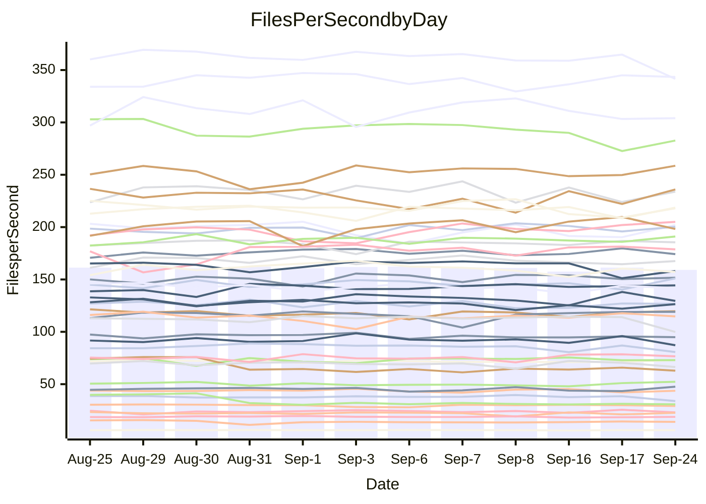

<!---
# This file is auto-generated. Do not edit.
# cspell:disable
--->
# Performance Report

## Daily Performance

## Time to Process Files

| Repository                                      | Elapsed | Min/Avg/Max           |   SD | SD Graph                |
| ----------------------------------------------- | ------: | :-------------------: | ---: | ----------------------- |
| AdaDoom3/AdaDoom3                    |    3.52 | 3.3 /   3.5 /   4.5   | 0.25 | `    ┣━━┻━━╋●━┻━━┫    ` |
| alexiosc/megistos                    |    7.98 | 7.5 /   8.0 /   9.4   | 0.47 | `    ┣━━┻━━●━━┻━━┫    ` |
| apollographql/apollo-server          |    2.89 | 2.6 /   2.7 /   2.9   | 0.10 | `     ┣━┻━━╋━━┻●┫     ` |
| aspnetboilerplate/aspnetboilerplate  |   10.45 | 10.2 /  10.6 /  11.1  | 0.23 | `    ┣━━┻━●╋━━┻━━┫    ` |
| aws-amplify/docs                     |   13.17 | 12.5 /  13.1 /  14.2  | 0.44 | `    ┣━━┻━━●━━┻━━┫    ` |
| Azure/azure-rest-api-specs           |    9.51 | 9.4 /   9.7 /  10.5   | 0.28 | `    ┣━━●━━╋━━┻━━┫    ` |
| bitjson/typescript-starter           |    1.07 | 1.0 /   1.1 /   1.1   | 0.03 | `     ┣━━┻━●━┻━━┫     ` |
| caddyserver/caddy                    |    3.74 | 3.6 /   3.8 /   4.3   | 0.16 | `    ┣━━┻━●╋━━┻━━┫    ` |
| canada-ca/open-source-logiciel-libre |    1.15 | 1.1 /   1.2 /   1.3   | 0.04 | `     ┣━┻━━●━━┻━┫     ` |
| chef/chef                            |    6.03 | 5.9 /   6.1 /   6.6   | 0.18 | `    ┣━━┻━●╋━━┻━━┫    ` |
| dart-lang/sdk                        |   67.18 | 64.5 /  67.6 /  73.0  | 2.10 | `  ┣━━━┻━━●╋━━━┻━━━┫  ` |
| django/django                        |   15.49 | 14.9 /  15.5 /  16.4  | 0.33 | `    ┣━━┻━━●━━┻━━┫    ` |
| eslint/eslint                        |   10.96 | 10.7 /  11.2 /  12.1  | 0.36 | `    ┣━━┻●━╋━━┻━━┫    ` |
| exonum/exonum                        |    3.67 | 3.5 /   3.7 /   4.1   | 0.13 | `    ┣━━┻━●╋━━┻━━┫    ` |
| flutter/samples                      |   16.62 | 16.3 /  17.0 /  19.7  | 0.71 | `   ┣━━━┻●━╋━━┻━━━┫   ` |
| gitbucket/gitbucket                  |    3.47 | 3.4 /   3.6 /   4.0   | 0.17 | `    ┣━━┻●━╋━━┻━━┫    ` |
| googleapis/google-cloud-cpp          |  146.58 | 139.0 / 144.9 / 163.3 | 5.41 | `  ┣━━━┻━━━╋●━━┻━━━┫  ` |
| graphql/express-graphql              |    1.15 | 1.1 /   1.2 /   1.4   | 0.06 | `     ┣━┻━●╋━━┻━┫     ` |
| graphql/graphql-js                   |    2.87 | 2.7 /   2.9 /   3.1   | 0.09 | `     ┣━┻━━●━━┻━┫     ` |
| graphql/graphql-relay-js             |    1.22 | 1.1 /   1.2 /   1.3   | 0.07 | `     ┣━┻━━╋●━┻━┫     ` |
| graphql/graphql-spec                 |    1.35 | 1.0 /   1.3 /   1.5   | 0.15 | `     ┣━┻━━╋━●┻━┫     ` |
| iluwatar/java-design-patterns        |   13.14 | 12.8 /  13.2 /  13.9  | 0.34 | `    ┣━━┻━━●━━┻━━┫    ` |
| ktaranov/sqlserver-kit               |    6.70 | 6.6 /   6.8 /   7.1   | 0.16 | `    ┣━━┻●━╋━━┻━━┫    ` |
| liriliri/licia                       |    4.19 | 4.1 /   4.2 /   4.4   | 0.08 | `    ┣━━┻━●╋━━┻━━┫    ` |
| MartinThoma/LaTeX-examples           |    6.97 | 6.7 /   7.2 /   7.8   | 0.28 | `    ┣━━┻●━╋━━┻━━┫    ` |
| mdx-js/mdx                           |    2.13 | 1.9 /   2.0 /   2.2   | 0.06 | `     ┣━┻━━╋━━┻●┫     ` |
| microsoft/TypeScript-Website         |    5.88 | 5.5 /   5.8 /   6.5   | 0.29 | `    ┣━━┻━━●━━┻━━┫    ` |
| MicrosoftDocs/PowerShell-Docs        |   27.12 | 23.3 /  24.0 /  25.4  | 0.50 | `       ┣┻━╋━┻┫      ●` |
| neovim/nvim-lspconfig                |    4.36 | 4.2 /   4.3 /   4.5   | 0.08 | `    ┣━━┻━━╋●━┻━━┫    ` |
| pagekit/pagekit                      |    3.74 | 3.5 /   3.7 /   4.1   | 0.15 | `    ┣━━┻━━╋●━┻━━┫    ` |
| php/php-src                          |   28.45 | 25.3 /  26.6 /  29.3  | 0.89 | `   ┣━━━┻━━╋━━┻━━━●   ` |
| plasticrake/tplink-smarthome-api     |    1.30 | 1.3 /   1.4 /   1.6   | 0.06 | `     ┣━●━━╋━━┻━┫     ` |
| prettier/prettier                    |    7.58 | 7.0 /   7.4 /   7.9   | 0.26 | `    ┣━━┻━━╋━●┻━━┫    ` |
| pycontribs/jira                      |    1.51 | 1.5 /   1.6 /   1.7   | 0.07 | `     ┣━●━━╋━━┻━┫     ` |
| RustPython/RustPython                |    5.43 | 5.2 /   5.4 /   5.7   | 0.16 | `    ┣━━┻━━╋●━┻━━┫    ` |
| shoelace-style/shoelace              |    2.91 | 2.9 /   3.0 /   3.1   | 0.07 | `     ┣●┻━━╋━━┻━┫     ` |
| slint-ui/slint                       |   12.66 | 12.2 /  12.8 /  15.5  | 0.79 | `   ┣━━━┻━●╋━━┻━━━┫   ` |
| SoftwareBrothers/admin-bro           |    2.63 | 2.5 /   2.6 /   2.8   | 0.07 | `     ┣━┻━━●━━┻━┫     ` |
| sveltejs/svelte                      |   23.19 | 20.2 /  21.5 /  22.1  | 0.43 | `     ┣━┻━━╋━━┻━┫    ●` |
| TheAlgorithms/Python                 |    5.97 | 5.7 /   6.0 /   6.7   | 0.26 | `    ┣━━┻━━●━━┻━━┫    ` |
| twbs/bootstrap                       |    1.88 | 1.5 /   1.8 /   2.0   | 0.15 | `     ┣━┻━━╋━●┻━┫     ` |
| typescript-cheatsheets/react         |    1.56 | 1.3 /   1.4 /   1.5   | 0.04 | `     ┣━━┻━╋━┻━━┫    ●` |
| typescript-eslint/typescript-eslint  |    4.52 | 4.2 /   4.4 /   4.7   | 0.15 | `    ┣━━┻━━╋━━●━━┫    ` |
| vitest-dev/vitest                    |    9.39 | 9.1 /   9.7 /  12.0   | 0.63 | `    ┣━━┻━●╋━━┻━━┫    ` |
| w3c/aria-practices                   |    3.46 | 3.3 /   3.5 /   3.8   | 0.11 | `    ┣━━┻━●╋━━┻━━┫    ` |
| w3c/specberus                        |    2.09 | 2.0 /   2.1 /   2.2   | 0.04 | `     ┣━┻━━╋●━┻━┫     ` |
| webdeveric/webpack-assets-manifest   |    1.24 | 1.2 /   1.2 /   1.3   | 0.04 | `     ┣━┻━━●━━┻━┫     ` |
| webpack/webpack                      |    5.46 | 5.3 /   5.7 /   6.1   | 0.17 | `    ┣━●┻━━╋━━┻━━┫    ` |
| wireapp/wire-desktop                 |    1.40 | 1.0 /   1.3 /   1.4   | 0.15 | `     ┣━┻━━╋━●┻━┫     ` |
| wireapp/wire-webapp                  |   11.61 | 10.9 /  11.2 /  12.1  | 0.35 | `    ┣━━┻━━╋━━┻●━┫    ` |

Note:
- Elapsed time is in seconds.

## Files per Second over Time

| Repository                                      | Files |    Sec |    Fps |     Rel | Trend Fps              |    N |
| ----------------------------------------------- | ----: | -----: | -----: | ------: | ---------------------- | ---: |
| AdaDoom3/AdaDoom3                    |   103 |   3.52 |  29.23 |  -1.84% | `█▇█████▇▇▆█▂███▇██▇▇` |   19 |
| alexiosc/megistos                    |   583 |   7.98 |  73.03 |   0.07% | `▆█▇█▃▃▇█▆▆▇▇▇▇▇▇█▇▇▇` |   19 |
| apollographql/apollo-server          |   252 |   2.89 |  87.21 |  -5.57% | `▅▆▅▇▄█▆▅▅█▆▆▅▄▇▆▄▅▇▄` |   19 |
| aspnetboilerplate/aspnetboilerplate  |  2286 |  10.45 | 218.68 |   0.89% | `▆▅▇▇▇█▇▇▆▅▇▇█▇▇▆▆█▅▇` |   19 |
| aws-amplify/docs                     |  2871 |  13.17 | 217.97 |  -0.33% | `▇▇▇▆▆▇▅█▆▆▇▄▇▇▇█▅▆▅▆` |   19 |
| Azure/azure-rest-api-specs           |  2459 |   9.51 | 258.60 |   3.12% | `▇▇█▇█▇▅▄▆█▇▇▇████▅▇█` |   19 |
| bitjson/typescript-starter           |    20 |   1.07 |  18.78 |  -0.20% | `▇▅▆█▇▇▇▇█▆▆▆▆▆▆▇▄▆▆▆` |   19 |
| caddyserver/caddy                    |   286 |   3.74 |  76.56 |   1.81% | `█▅▆█▆▆▇▃█▆▆▆▇▆█▅███▇` |   19 |
| canada-ca/open-source-logiciel-libre |     7 |   1.15 |   6.07 |  -0.31% | `▇▇█▇▇▆█▇▇▇█▇██▇▇▇▃▇▇` |   19 |
| chef/chef                            |  1208 |   6.03 | 200.29 |   1.10% | `▆█▆▇▇▄▆█▇▅█▇▇█▅█▇▇▆▇` |   19 |
| dart-lang/sdk                        | 10560 |  67.18 | 157.19 |  -1.75% | `▅▅▇▇▅▇▇▇██▇▆█▆▇▆▆▄▇▆` |   19 |
| django/django                        |  2874 |  15.49 | 185.48 |   0.44% | `▆▇▇▇▇█▇▇▆▄▆▇██▆▇▆▆▇▇` |   19 |
| eslint/eslint                        |  2093 |  10.96 | 190.99 |   2.03% | `▇▄▆▇▇█▄▇▇▇▅▆▇▇▇▇▆▇▆▇` |   19 |
| exonum/exonum                        |   421 |   3.67 | 114.76 |   0.68% | `▇██▇▅▇▇█▆▃▇▆▇▇▆▇▇▆█▇` |   19 |
| flutter/samples                      |  2400 |  16.62 | 144.39 |   2.40% | `▆▆▇▆▃▇███▇▆█▇▇██▇█▇█` |   19 |
| gitbucket/gitbucket                  |   413 |   3.47 | 119.04 |   3.27% | `▄██▇█▇▇▇█▇█▅█▃▄▇█▇██` |   19 |
| googleapis/google-cloud-cpp          | 20764 | 146.58 | 141.65 |  -0.97% | `▇███▅▇▇▇▆▇█▆█▇▆▇▃▇▇▆` |   19 |
| graphql/express-graphql              |    26 |   1.15 |  22.62 |   1.41% | `█▇▆▇▄▆▆▇▆▇▇▇▇▆▇▃▆█▅▇` |   19 |
| graphql/graphql-js                   |   364 |   2.87 | 126.63 |   0.23% | `▆▇▇▅▆▇█▆▅▇▄▆▇█▆▅▅▅▆▆` |   19 |
| graphql/graphql-relay-js             |    28 |   1.22 |  23.00 |  -3.60% | `▇▇▃▆▆▇▃█▇█▇▆█▆▅▇▃▆█▅` |   19 |
| graphql/graphql-spec                 |    19 |   1.35 |  14.04 |   0.71% | `███▅██▂▂▅▆▄▆▆▅▅▅▆▅▆▆` |   19 |
| iluwatar/java-design-patterns        |  1992 |  13.14 | 151.64 |   0.25% | `▇▇▅▇█▇█▆▅█▇██▅▇█▇█▇▇` |   19 |
| ktaranov/sqlserver-kit               |   489 |   6.70 |  73.00 |   1.62% | `▅█▇█▅▇█▆▅▇▅▇█▇▅▆▆▆▆▇` |   19 |
| liriliri/licia                       |  1437 |   4.19 | 343.35 |   1.02% | `▇▆▆██▇█▇██▇▇▆▇█▆▅██▇` |   19 |
| MartinThoma/LaTeX-examples           |  1409 |   6.97 | 202.02 |   2.97% | `█▆▆▇▇▆▇▇▇▅▄▃▅▅▆▇▅▅▅▇` |   19 |
| mdx-js/mdx                           |   141 |   2.13 |  66.34 |  -4.71% | `▅▆▇▅▆▄█▅▆▆▆▆▅▆▆▄▆█▆▄` |   19 |
| microsoft/TypeScript-Website         |   761 |   5.88 | 129.51 |  -0.73% | `▇▇▆▇▅▃▇▅▆██▇▇▇▇▆▇▃█▆` |   19 |
| MicrosoftDocs/PowerShell-Docs        |  2708 |  27.12 |  99.84 | -11.57% | `█▆▇▅▇▇▅▆█▇▇█▇▆▇▇█▇▇▂` |   19 |
| neovim/nvim-lspconfig                |   760 |   4.36 | 174.18 |  -0.47% | `▇▅▇▇▆▅▆███▇▆█▇█▆▇▇█▇` |   19 |
| pagekit/pagekit                      |   741 |   3.74 | 198.18 |  -1.69% | `▇▄▇█▆██▇▃▆▇█▇█▇▆█▇█▆` |   19 |
| php/php-src                          |  2296 |  28.45 |  80.71 |  -6.02% | `▆▆▆█▆▆█▇▇▇▇▆█▇▆▇▅▄▇▄` |   19 |
| plasticrake/tplink-smarthome-api     |    62 |   1.30 |  47.56 |   5.94% | `▇▆▇▇█▇▇▇▇▇▃▆▆▆▆██▄▅█` |   19 |
| prettier/prettier                    |  2305 |   7.58 | 304.00 |  -2.21% | `▄▅█▆█▆▇▅▇▄▆▄█▆██▆▆▅▅` |   19 |
| pycontribs/jira                      |    79 |   1.51 |  52.29 |   4.72% | `▆▇▇█▇▇▇▃▇▅▆▇▄▄█▅▅▅▇█` |   19 |
| RustPython/RustPython                |   687 |   5.43 | 126.43 |  -0.27% | `▆██▄▇▆▇▇█▇▇▇▇▇▆▅▅▇▅▆` |   19 |
| shoelace-style/shoelace              |   439 |   2.91 | 151.00 |   3.54% | `▅█▅██▇▆▅▆██▆█▇▅▆▇▇▅█` |   19 |
| slint-ui/slint                       |  2263 |  12.66 | 178.77 |   1.75% | `▇▇▄▆▇▃█████▇▇▇█▇▇██▇` |   19 |
| SoftwareBrothers/admin-bro           |   441 |   2.63 | 167.61 |  -0.16% | `▄▆▇▇█▇▇▅█▆▇▇▇▇█▇▅▇▆▇` |   19 |
| sveltejs/svelte                      |  7920 |  23.19 | 341.57 |  -6.01% | `▆▅▆█▅▅▆▅▅▆▇▅▅▆▆▅▅▅▆▃` |   19 |
| TheAlgorithms/Python                 |  1396 |   5.97 | 233.86 |  -0.17% | `▇▃▇▇█▇▆█▆▇▆█▆██▅▇▇▅▇` |   19 |
| twbs/bootstrap                       |   118 |   1.88 |  62.91 |  -6.65% | `█▅▇██▅▃▄▄▃▃▄▄▄▂▄▃▄▄▃` |   19 |
| typescript-cheatsheets/react         |    53 |   1.56 |  33.90 | -10.67% | `█▆▇▆▄▇▇▄▆▇▆▆▆█▅█▇▆▇▂` |   19 |
| typescript-eslint/typescript-eslint  |  1279 |   4.52 | 282.67 |  -3.60% | `███▆▅▇▄▇▇▇▇▇▇▇▇▇▅▇▄▅` |   19 |
| vitest-dev/vitest                    |  2215 |   9.39 | 235.99 |   3.40% | `█▇▇██▇▇██▇▇▂█▆█▅▇█▆█` |   19 |
| w3c/aria-practices                   |   414 |   3.46 | 119.64 |   2.13% | `▇█▇▇█▇▅▆▆▇▄▆▄▇▇▇▅▆▇▇` |   19 |
| w3c/specberus                        |   198 |   2.09 |  94.92 |  -1.07% | `▇▇▅▇▆█▆▇▇█▆▆▄▆▇▆▆▆▆▆` |   19 |
| webdeveric/webpack-assets-manifest   |    54 |   1.24 |  43.68 |  -0.05% | `▇▆▆█▆▅▇▇▇█▇▆▄▅▅▇▇█▅▆` |   19 |
| webpack/webpack                      |  1119 |   5.46 | 205.02 |   4.35% | `▆▄▆▇▆▆▇▅▄▄▆▅▆▆█▆▆▅▇▇` |   19 |
| wireapp/wire-desktop                 |    43 |   1.40 |  30.72 | -10.26% | `█▆▇██▇▃▃▂▃▂▂▃▃▃▃▂▂▃▂` |   19 |
| wireapp/wire-webapp                  |  1835 |  11.61 | 158.06 |  -3.45% | `▇▇▇██▅▆▅▆█▇▇███▇█▇▄▆` |   19 |

## Data Throughput

| Repository                                      | Files |    Sec |     Kps |     Rel | Trend Kps              |    N |
| ----------------------------------------------- | ----: | -----: | ------: | ------: | ---------------------- | ---: |
| AdaDoom3/AdaDoom3                    |   103 |   3.52 |  621.30 |  -1.84% | `█▇█████▇▇▆█▂███▇██▇▇` |   19 |
| alexiosc/megistos                    |   583 |   7.98 |  573.87 |   0.07% | `▆█▇█▃▃▇█▆▆▇▇▇▇▇▇█▇▇▇` |   19 |
| apollographql/apollo-server          |   252 |   2.89 |  701.46 |  -5.57% | `▅▆▅▇▄█▆▅▅█▆▆▅▄▇▆▄▅▇▄` |   19 |
| aspnetboilerplate/aspnetboilerplate  |  2286 |  10.45 |  532.06 |   0.89% | `▆▅▇▇▇█▇▇▆▅▇▇█▇▇▆▆█▅▇` |   19 |
| aws-amplify/docs                     |  2871 |  13.17 |  761.11 |  -0.33% | `▇▇▇▆▆▇▅█▆▆▇▄▇▇▇█▅▆▅▆` |   19 |
| Azure/azure-rest-api-specs           |  2459 |   9.51 |  681.79 |   2.68% | `▆▇█▇█▇▅▄▆█▇▇▇██▇▇▅▆█` |   19 |
| bitjson/typescript-starter           |    20 |   1.07 |   75.10 |  -0.20% | `▇▅▆█▇▇▇▇█▆▆▆▆▆▆▇▄▆▆▆` |   19 |
| caddyserver/caddy                    |   286 |   3.74 |  653.41 |   1.76% | `█▅▆█▆▆▇▃█▆▆▆▇▆█▅███▇` |   19 |
| canada-ca/open-source-logiciel-libre |     7 |   1.15 |   50.27 |  -0.31% | `▇▇█▇▇▆█▇▇▇█▇██▇▇▇▃▇▇` |   19 |
| chef/chef                            |  1208 |   6.03 |  925.00 |   1.08% | `▆█▆▇▇▄▆█▇▅█▇▇█▅█▇▇▆▇` |   19 |
| dart-lang/sdk                        | 10560 |  67.18 | 1079.57 |  -0.52% | `▅▅▇▇▅▆▇▇██▇▆█▆▇▆▆▄▇▆` |   19 |
| django/django                        |  2874 |  15.49 | 1161.80 |   0.33% | `▆▇▇▇▇█▇▇▆▄▆▇██▆▇▇▆▇▇` |   19 |
| eslint/eslint                        |  2093 |  10.96 | 1372.15 |   1.05% | `▇▄▆▇▇█▄▇▇▇▅▆▇▇▇▇▅▇▆▇` |   19 |
| exonum/exonum                        |   421 |   3.67 | 1097.69 |   0.68% | `▇██▇▅▇▇█▆▃▇▆▇▇▆▇▇▆█▇` |   19 |
| flutter/samples                      |  2400 |  16.62 | 1288.50 |   2.40% | `▆▆▇▆▃▇███▇▆█▇▇██▇█▇█` |   19 |
| gitbucket/gitbucket                  |   413 |   3.47 |  541.03 |   3.27% | `▄██▇█▇▇▇█▇█▅█▃▄▇█▇██` |   19 |
| googleapis/google-cloud-cpp          | 20764 | 146.58 | 1149.07 |  -0.67% | `▇███▅▇▇▇▆▇█▆█▇▆▇▃█▇▇` |   19 |
| graphql/express-graphql              |    26 |   1.15 |  103.54 |   1.41% | `█▇▆▇▄▆▆▇▆▇▇▇▇▆▇▃▆█▅▇` |   19 |
| graphql/graphql-js                   |   364 |   2.87 |  727.77 |   0.23% | `▆▇▇▅▆▇█▆▅▇▄▆▇█▆▅▅▅▆▆` |   19 |
| graphql/graphql-relay-js             |    28 |   1.22 |   90.36 |  -3.60% | `▇▇▃▆▆▇▃█▇█▇▆█▆▅▇▃▆█▅` |   19 |
| graphql/graphql-spec                 |    19 |   1.35 |  468.54 |  -2.18% | `███▅██▂▂▄▄▃▄▄▄▃▄▅▄▅▄` |   19 |
| iluwatar/java-design-patterns        |  1992 |  13.14 |  468.70 |   0.25% | `▇▇▅▇█▇█▆▅█▇██▅▇█▇█▇▇` |   19 |
| ktaranov/sqlserver-kit               |   489 |   6.70 | 1105.31 |   1.63% | `▅█▇█▅▇█▆▅▇▅▇█▇▅▆▆▆▆▇` |   19 |
| liriliri/licia                       |  1437 |   4.19 |  409.06 |   1.02% | `▇▆▆██▇█▇██▇▇▆▇█▆▅██▇` |   19 |
| MartinThoma/LaTeX-examples           |  1409 |   6.97 |  417.23 |   2.97% | `█▆▆▇▇▆▇▇▇▅▄▃▅▅▆▇▅▅▅▇` |   19 |
| mdx-js/mdx                           |   141 |   2.13 |  308.63 |  -4.71% | `▅▆▇▅▆▄█▅▆▆▆▆▅▆▆▄▆█▆▄` |   19 |
| microsoft/TypeScript-Website         |   761 |   5.88 |  895.67 |  -0.73% | `▇▇▆▇▅▃▇▅▆██▇▇▇▇▆▇▃█▆` |   19 |
| MicrosoftDocs/PowerShell-Docs        |  2708 |  27.12 | 1026.87 | -11.55% | `█▆▇▅▇▇▅▆█▇▇█▇▆▇▇█▇▇▂` |   19 |
| neovim/nvim-lspconfig                |   760 |   4.36 |  288.54 |   0.17% | `▆▅▇▇▆▅▆███▇▆▇▇█▆▇▇█▇` |   19 |
| pagekit/pagekit                      |   741 |   3.74 |  413.21 |  -1.69% | `▇▄▇█▆██▇▃▆▇█▇█▇▆█▇█▆` |   19 |
| php/php-src                          |  2296 |  28.45 | 1402.91 |  -6.16% | `▆▆▆█▆▆█▇▇▇▇▆█▇▆▆▅▃▇▄` |   19 |
| plasticrake/tplink-smarthome-api     |    62 |   1.30 |  256.96 |   5.94% | `▇▆▇▇█▇▇▇▇▇▃▆▆▆▆██▄▅█` |   19 |
| prettier/prettier                    |  2305 |   7.58 |  429.68 |  -2.51% | `▄▅█▆█▆▇▅▇▄▆▄█▆██▆▆▅▅` |   19 |
| pycontribs/jira                      |    79 |   1.51 |  370.69 |   4.72% | `▆▇▇█▇▇▇▃▇▅▆▇▄▄█▅▅▅▇█` |   19 |
| RustPython/RustPython                |   687 |   5.43 |  998.58 |   0.17% | `▆██▄▇▆▇▇█▇▇▇▇▇▆▅▅▇▅▇` |   19 |
| shoelace-style/shoelace              |   439 |   2.91 |  729.54 |   3.54% | `▅█▅██▇▆▅▆██▆█▇▅▆▇▇▅█` |   19 |
| slint-ui/slint                       |  2263 |  12.66 | 1168.86 |   1.88% | `▇▇▄▆▇▃█████▇▇▇█▇▇██▇` |   19 |
| SoftwareBrothers/admin-bro           |   441 |   2.63 |  369.42 |  -0.16% | `▄▆▇▇█▇▇▅█▆▇▇▇▇█▇▅▇▆▇` |   19 |
| sveltejs/svelte                      |  7920 |  23.19 |  228.53 |  -6.03% | `▆▅▆█▅▅▆▅▅▆▇▅▅▆▆▅▅▅▆▃` |   19 |
| TheAlgorithms/Python                 |  1396 |   5.97 |  594.37 |  -0.09% | `▇▃▇▇█▇▆█▆▇▆█▆██▅▇▇▅▇` |   19 |
| twbs/bootstrap                       |   118 |   1.88 |  516.07 |  -6.70% | `█▅▇██▅▄▄▄▃▃▄▄▄▂▄▃▄▄▃` |   19 |
| typescript-cheatsheets/react         |    53 |   1.56 |  250.72 | -10.67% | `█▆▇▆▄▇▇▄▆▇▆▆▆█▅█▇▆▇▂` |   19 |
| typescript-eslint/typescript-eslint  |  1279 |   4.52 | 1446.96 |  -3.36% | `███▆▄▇▄▇▇▇▇▇▇▇▇▇▅▇▄▅` |   19 |
| vitest-dev/vitest                    |  2215 |   9.39 |  532.70 |   4.03% | `█▇▇██▇▇██▇▇▂█▆█▅▇█▆█` |   19 |
| w3c/aria-practices                   |   414 |   3.46 | 1115.48 |   2.34% | `▇█▇▇█▇▅▆▆▇▄▆▄▇▇▇▅▆▇▇` |   19 |
| w3c/specberus                        |   198 |   2.09 |  298.17 |  -1.07% | `▇▇▅▇▆█▆▇▇█▆▆▄▆▇▆▆▆▆▆` |   19 |
| webdeveric/webpack-assets-manifest   |    54 |   1.24 |  102.74 |  -0.05% | `▇▆▆█▆▅▇▇▇█▇▆▄▅▅▇▇█▅▆` |   19 |
| webpack/webpack                      |  1119 |   5.46 |  929.28 |   4.18% | `▆▄▆▇▆▆▇▅▄▄▆▅▆▆█▆▆▅▇▇` |   19 |
| wireapp/wire-desktop                 |    43 |   1.40 |  142.16 |  -6.01% | `█▆▇██▇▃▃▂▃▂▂▃▃▃▃▂▂▃▃` |   19 |
| wireapp/wire-webapp                  |  1835 |  11.61 |  567.46 |  -3.00% | `▇▇▇██▅▆▅▆█▇▇███▇█▇▄▆` |   19 |

