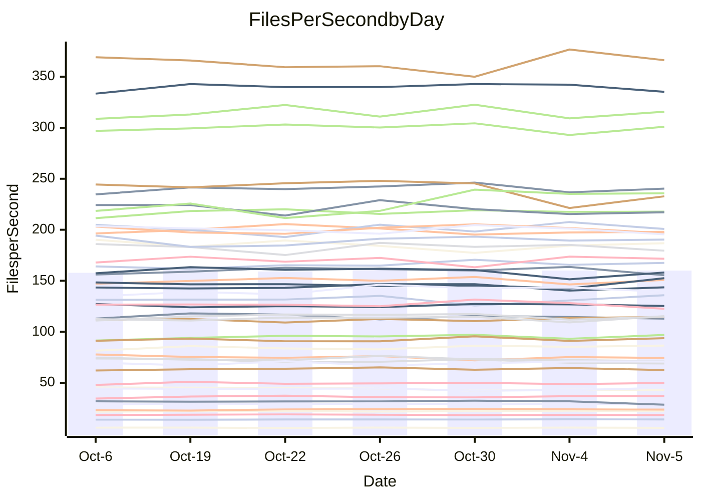

<!---
# This file is auto-generated. Do not edit.
# cspell:disable
--->
# Performance Report

## Daily Performance

## Time to Process Files

| Repository                                      | Elapsed | Min/Avg/Max           |   SD | SD Graph                |
| ----------------------------------------------- | ------: | :-------------------: | ---: | ----------------------- |
| AdaDoom3/AdaDoom3                    |    3.66 | 3.4 /   3.5 /   3.7   | 0.08 | `     ┣━┻━━╋━━┻━●     ` |
| alexiosc/megistos                    |    8.41 | 7.3 /   8.0 /   8.7   | 0.36 | `    ┣━━┻━━╋━━●━━┫    ` |
| apollographql/apollo-server          |    2.72 | 2.6 /   2.7 /   2.9   | 0.07 | `     ┣━┻━●╋━━┻━┫     ` |
| aspnetboilerplate/aspnetboilerplate  |   10.54 | 10.3 /  10.5 /  10.9  | 0.20 | `    ┣━━┻━━●━━┻━━┫    ` |
| aws-amplify/docs                     |   13.38 | 12.4 /  13.0 /  13.9  | 0.41 | `    ┣━━┻━━╋━━●━━┫    ` |
| Azure/azure-rest-api-specs           |   10.03 | 9.6 /  10.1 /  11.0   | 0.39 | `    ┣━━┻━●╋━━┻━━┫    ` |
| bitjson/typescript-starter           |    1.05 | 1.0 /   1.1 /   1.1   | 0.02 | `     ┣━●┻━╋━┻━━┫     ` |
| caddyserver/caddy                    |    3.87 | 3.7 /   3.8 /   4.0   | 0.10 | `    ┣━━┻━━╋━●┻━━┫    ` |
| canada-ca/open-source-logiciel-libre |    1.25 | 1.1 /   1.2 /   1.3   | 0.03 | `     ┣━━┻━╋━┻━━┫ ●   ` |
| chef/chef                            |    5.78 | 5.7 /   6.0 /   6.4   | 0.19 | `    ┣━●┻━━╋━━┻━━┫    ` |
| dart-lang/sdk                        |   66.26 | 63.7 /  67.2 /  72.3  | 2.51 | `  ┣━━━┻━━●╋━━━┻━━━┫  ` |
| django/django                        |   16.72 | 14.9 /  15.7 /  16.5  | 0.44 | `    ┣━━┻━━╋━━┻━━┫ ●  ` |
| eslint/eslint                        |   10.92 | 10.7 /  11.1 /  11.8  | 0.36 | `    ┣━━┻●━╋━━┻━━┫    ` |
| exonum/exonum                        |    3.62 | 3.5 /   3.7 /   3.8   | 0.09 | `     ┣━┻●━╋━━┻━┫     ` |
| flutter/samples                      |   17.46 | 16.0 /  16.7 /  17.4  | 0.39 | `    ┣━━┻━━╋━━┻━━●    ` |
| gitbucket/gitbucket                  |    3.52 | 3.5 /   3.7 /   3.8   | 0.09 | `     ●━┻━━╋━━┻━┫     ` |
| googleapis/google-cloud-cpp          |  152.75 | 139.9 / 148.3 / 165.8 | 6.65 | `  ┣━━━┻━━━╋━━●┻━━━┫  ` |
| graphql/express-graphql              |    1.18 | 1.1 /   1.2 /   1.2   | 0.03 | `     ┣━┻━━╋●━┻━┫     ` |
| graphql/graphql-js                   |    2.95 | 2.8 /   2.9 /   3.1   | 0.07 | `     ┣━┻━━╋●━┻━┫     ` |
| graphql/graphql-relay-js             |    1.15 | 1.1 /   1.2 /   1.2   | 0.04 | `     ┣━┻●━╋━━┻━┫     ` |
| graphql/graphql-spec                 |    1.37 | 1.3 /   1.4 /   1.4   | 0.04 | `     ┣━┻━━╋●━┻━┫     ` |
| iluwatar/java-design-patterns        |   13.20 | 12.8 /  13.3 /  14.4  | 0.40 | `    ┣━━┻━●╋━━┻━━┫    ` |
| ktaranov/sqlserver-kit               |    6.79 | 6.6 /   6.8 /   7.1   | 0.17 | `    ┣━━┻━━●━━┻━━┫    ` |
| liriliri/licia                       |    4.43 | 4.1 /   4.2 /   4.4   | 0.07 | `     ┣━┻━━╋━━┻━┫   ● ` |
| MartinThoma/LaTeX-examples           |    7.10 | 6.8 /   7.1 /   7.6   | 0.21 | `    ┣━━┻━━╋●━┻━━┫    ` |
| mdx-js/mdx                           |    1.96 | 1.9 /   2.0 /   2.2   | 0.08 | `     ┣━●━━╋━━┻━┫     ` |
| microsoft/TypeScript-Website         |    5.69 | 5.5 /   5.8 /   6.1   | 0.16 | `    ┣━━┻━●╋━━┻━━┫    ` |
| MicrosoftDocs/PowerShell-Docs        |   23.46 | 23.3 /  24.1 /  25.4  | 0.60 | `   ┣━━━●━━╋━━┻━━━┫   ` |
| neovim/nvim-lspconfig                |    4.42 | 4.3 /   4.4 /   4.7   | 0.11 | `    ┣━━┻━●╋━━┻━━┫    ` |
| pagekit/pagekit                      |    3.60 | 3.5 /   3.7 /   4.0   | 0.14 | `    ┣━━┻●━╋━━┻━━┫    ` |
| php/php-src                          |   25.92 | 26.3 /  27.2 /  30.2  | 1.08 | `   ┣━━●┻━━╋━━┻━━━┫   ` |
| plasticrake/tplink-smarthome-api     |    1.48 | 1.3 /   1.4 /   1.5   | 0.04 | `     ┣━┻━━╋━━┻━●     ` |
| prettier/prettier                    |    7.58 | 7.2 /   7.6 /   7.9   | 0.20 | `    ┣━━┻━━●━━┻━━┫    ` |
| pycontribs/jira                      |    1.51 | 1.5 /   1.6 /   1.7   | 0.06 | `     ┣●┻━━╋━━┻━┫     ` |
| RustPython/RustPython                |    6.05 | 5.2 /   5.4 /   5.8   | 0.19 | `    ┣━━┻━━╋━━┻━━┫  ● ` |
| shoelace-style/shoelace              |    2.85 | 2.9 /   3.0 /   3.2   | 0.07 | `    ●┣━┻━━╋━━┻━┫     ` |
| slint-ui/slint                       |   13.89 | 13.1 /  13.7 /  14.4  | 0.40 | `    ┣━━┻━━╋●━┻━━┫    ` |
| SoftwareBrothers/admin-bro           |    2.62 | 2.6 /   2.7 /   2.9   | 0.07 | `     ┣━┻●━╋━━┻━┫     ` |
| sveltejs/svelte                      |   21.95 | 20.8 /  21.9 /  22.9  | 0.51 | `    ┣━━┻━━●━━┻━━┫    ` |
| TheAlgorithms/Python                 |    5.76 | 5.7 /   5.8 /   6.1   | 0.10 | `    ┣━━┻●━╋━━┻━━┫    ` |
| twbs/bootstrap                       |    1.90 | 1.8 /   1.9 /   2.0   | 0.05 | `     ┣━┻━━╋━●┻━┫     ` |
| typescript-cheatsheets/react         |    1.48 | 1.4 /   1.5 /   1.6   | 0.07 | `     ┣━┻━━╋●━┻━┫     ` |
| typescript-eslint/typescript-eslint  |    4.28 | 4.2 /   4.3 /   4.5   | 0.08 | `     ┣━┻━━●━━┻━┫     ` |
| vitest-dev/vitest                    |    9.18 | 9.2 /  10.1 /  10.9   | 0.48 | `    ●━━┻━━╋━━┻━━┫    ` |
| w3c/aria-practices                   |    3.70 | 3.5 /   3.6 /   3.8   | 0.10 | `     ┣━┻━━╋━━●━┫     ` |
| w3c/specberus                        |    2.02 | 2.0 /   2.1 /   2.3   | 0.07 | `     ┣━●━━╋━━┻━┫     ` |
| webdeveric/webpack-assets-manifest   |    1.25 | 1.2 /   1.2 /   1.3   | 0.03 | `     ┣━┻━━●━━┻━┫     ` |
| webpack/webpack                      |    5.93 | 5.4 /   5.6 /   5.8   | 0.11 | `    ┣━━┻━━╋━━┻━━┫ ●  ` |
| wireapp/wire-desktop                 |    1.65 | 1.4 /   1.5 /   1.6   | 0.05 | `     ┣━━┻━╋━┻━━┫    ●` |
| wireapp/wire-webapp                  |   10.86 | 10.7 /  11.2 /  12.5  | 0.50 | `    ┣━━┻●━╋━━┻━━┫    ` |

Note:
- Elapsed time is in seconds.

## Files per Second over Time

| Repository                                      | Files |    Sec |    Fps |     Rel | Trend Fps         |    N |
| ----------------------------------------------- | ----: | -----: | -----: | ------: | ----------------- | ---: |
| AdaDoom3/AdaDoom3                    |   103 |   3.66 |  28.17 |  -3.79% | `█▅██▆█▆█▇▇▇▆▇▇▅` |   14 |
| alexiosc/megistos                    |   583 |   8.41 |  69.29 |  -4.98% | `▆▆▅▇▄▄▅█▆▅▅▃▅▄▄` |   14 |
| apollographql/apollo-server          |   253 |   2.72 |  92.86 |   0.95% | `▇▅▇█▆▇▄▅▆▆█▇▅▇▇` |   14 |
| aspnetboilerplate/aspnetboilerplate  |  2286 |  10.54 | 216.88 |  -0.02% | `▅▆▆███▇▆▆█▇▆█▇▇` |   14 |
| aws-amplify/docs                     |  2871 |  13.38 | 214.61 |  -3.29% | `▆▇▇▇▆▇▄█▇█▆▆▄▆▅` |   14 |
| Azure/azure-rest-api-specs           |  2365 |  10.03 | 235.91 |  -1.88% | `▆█▅▇▇▆█▇█▇▇▃▅▅▆` |   14 |
| bitjson/typescript-starter           |    20 |   1.05 |  18.99 |   2.43% | `▆▆▆▇█▇█▇▇▆▆▆▆▅▇` |   14 |
| caddyserver/caddy                    |   288 |   3.87 |  74.38 |  -1.37% | `██▇▆▇▆▆▇▇█▅▅█▆▆` |   14 |
| canada-ca/open-source-logiciel-libre |     7 |   1.25 |   5.58 |  -6.65% | `█▇▇█▇▄▇██▇▆███▅` |   14 |
| chef/chef                            |  1191 |   5.78 | 206.19 |   3.56% | `▇▄▇▆▇█▇▆█▆▅▇▅▄█` |   14 |
| dart-lang/sdk                        | 10719 |  66.26 | 161.77 |   1.59% | `▇▅▇▇██▆█▇▅▆▅▄▅▇` |   14 |
| django/django                        |  2877 |  16.72 | 172.02 |  -6.42% | `▇▇▅▅█▄▅▇▆█▆▇▆▇▄` |   14 |
| eslint/eslint                        |  2098 |  10.92 | 192.14 |   1.85% | `▇█▅▄▇▇▄▇▇▇▇▅█▆▇` |   14 |
| exonum/exonum                        |   421 |   3.62 | 116.17 |   1.40% | `▅▆██▇▆█▆▆▅▇▆▇▅▇` |   14 |
| flutter/samples                      |  2400 |  17.46 | 137.47 |  -4.60% | `▆▆▆▆▇▇▅█▆█▇▆▅█▄` |   14 |
| gitbucket/gitbucket                  |   413 |   3.52 | 117.32 |   4.92% | `▆▅▅▅█▅▅▇▆▅▅▅█▆█` |   14 |
| googleapis/google-cloud-cpp          | 20949 | 152.75 | 137.14 |  -2.51% | `▇▃▆▆▆▇▄▇██▇█▆▇▆` |   14 |
| graphql/express-graphql              |    26 |   1.18 |  21.95 |  -0.66% | `▄▆▆▆▆█▅▄▆▆▆▆█▇▆` |   14 |
| graphql/graphql-js                   |   368 |   2.95 | 124.73 |  -0.58% | `█▇█▇▅▆█▆█▅█▇█▇▇` |   14 |
| graphql/graphql-relay-js             |    28 |   1.15 |  24.26 |   2.80% | `▆▅▅▅▄█▅▇▇█▇█▅▅▇` |   14 |
| graphql/graphql-spec                 |    19 |   1.37 |  13.89 |  -0.69% | `▇▅▅▆▆▅▇▄█▆▆▇▇▇▆` |   14 |
| iluwatar/java-design-patterns        |  1992 |  13.20 | 150.92 |   0.80% | `▆▆▇▇▆█▇█▇▅█▄█▇▇` |   14 |
| ktaranov/sqlserver-kit               |   489 |   6.79 |  72.06 |   0.14% | `█▇██▇▅▆▆▅▇▇▇▇▆▇` |   14 |
| liriliri/licia                       |  1437 |   4.43 | 324.64 |  -4.67% | `▅▇█▇▇▇▇█▆▇▇█▇█▅` |   14 |
| MartinThoma/LaTeX-examples           |  1409 |   7.10 | 198.57 |  -0.64% | `▇█▇█▆▇▆▄█▆█▆▇▅▆` |   14 |
| mdx-js/mdx                           |   141 |   1.96 |  71.97 |   4.48% | `▆▇▄▇▆█▇▄▇▅▆▆█▇█` |   14 |
| microsoft/TypeScript-Website         |   761 |   5.69 | 133.71 |   1.14% | `▅▇▆▆▇▅▇▇█▇▄▅▇█▇` |   14 |
| MicrosoftDocs/PowerShell-Docs        |  2708 |  23.46 | 115.45 |   2.61% | `▇▇▇▆▆▇██▅██▄▆██` |   14 |
| neovim/nvim-lspconfig                |   759 |   4.42 | 171.69 |   0.43% | `▇▅██▆▅▇▇▇▇▅▇█▇▇` |   14 |
| pagekit/pagekit                      |   741 |   3.60 | 205.60 |   2.10% | `█▆▇█▄▅▅▇█▇▆█▇▆▇` |   14 |
| php/php-src                          |  2275 |  25.92 |  87.78 |   4.28% | `▄█▇███▅▇▆▅██▇▇█` |   14 |
| plasticrake/tplink-smarthome-api     |    62 |   1.48 |  42.00 |  -5.54% | `███▆█▇█▆▅█▅▄▆▆▄` |   14 |
| prettier/prettier                    |  2415 |   7.58 | 318.77 |   1.71% | `▅▆▆▆▆█▇▅▅██▅▆▆▇` |   14 |
| pycontribs/jira                      |    79 |   1.51 |  52.43 |   6.49% | `▆▄█▆▇▆▅▄▆█▆▆▅▄█` |   14 |
| RustPython/RustPython                |   693 |   6.05 | 114.58 |  -9.87% | `▆▆▅▇▆▄█▅▄██▇▆▇▃` |   14 |
| shoelace-style/shoelace              |   439 |   2.85 | 153.82 |   5.27% | `▇▇▇▇▅▆▆▆▅▆▆▇▄▇█` |   14 |
| slint-ui/slint                       |  2561 |  13.89 | 184.40 |  -0.61% | `█▇▅▇▇█▇▅▇█▅▆▇▇▆` |   14 |
| SoftwareBrothers/admin-bro           |   441 |   2.62 | 168.41 |   2.22% | `█▅▇▇▄▇▆▇▇▆█▇▆▇█` |   14 |
| sveltejs/svelte                      |  8036 |  21.95 | 366.14 |   0.40% | `▆▇▆▆▇▆▅▅▅▆▄█▆▆▆` |   14 |
| TheAlgorithms/Python                 |  1399 |   5.76 | 242.72 |   1.19% | `▇▅▇▇█▇▇█▇██▆▇▇▇` |   14 |
| twbs/bootstrap                       |   118 |   1.90 |  62.26 |  -2.17% | `▆▅▄▇█▇▆▇█▇▆█▆▆▆` |   14 |
| typescript-cheatsheets/react         |    53 |   1.48 |  35.85 |  -1.31% | `▃▆▆▆▆▇▆▇▄▆▆▅██▆` |   14 |
| typescript-eslint/typescript-eslint  |  1285 |   4.28 | 299.89 |   0.18% | `▇▆▇▇▇█▇██▆█▇▅█▇` |   14 |
| vitest-dev/vitest                    |  2245 |   9.18 | 244.49 |   9.39% | `▄▅▅▆▆▄▃▃▅▆▇█▆▆█` |   14 |
| w3c/aria-practices                   |   414 |   3.70 | 111.84 |  -2.69% | `▅▅▆▅██▆▇▆█▇▆▅▇▅` |   14 |
| w3c/specberus                        |   197 |   2.02 |  97.40 |   3.10% | `▄▇▇▆▇█▇▇▇███▅██` |   14 |
| webdeveric/webpack-assets-manifest   |    55 |   1.25 |  44.02 |  -0.01% | `▆▇▅▇▇▇▆█▆▆▅▆▄█▆` |   14 |
| webpack/webpack                      |  1138 |   5.93 | 191.77 |  -4.33% | `▇█▆▇▅▆▆█▇▇█▇▇▇▅` |   14 |
| wireapp/wire-desktop                 |    46 |   1.65 |  27.84 | -11.80% | `▅█▇▇▅▇▆▅█▇▇▇▆▄▂` |   14 |
| wireapp/wire-webapp                  |  1781 |  10.86 | 164.04 |   2.85% | `▄█▇▆▇▇█▇█▆▇▇█▄█` |   14 |

## Data Throughput

| Repository                                      | Files |    Sec |     Kps |     Rel | Trend Kps         |    N |
| ----------------------------------------------- | ----: | -----: | ------: | ------: | ----------------- | ---: |
| AdaDoom3/AdaDoom3                    |   103 |   3.66 |  598.73 |  -3.79% | `█▅██▆█▆█▇▇▇▆▇▇▅` |   14 |
| alexiosc/megistos                    |   583 |   8.41 |  544.43 |  -4.98% | `▆▆▅▇▄▄▅█▆▅▅▃▅▄▄` |   14 |
| apollographql/apollo-server          |   253 |   2.72 |  758.64 |   2.09% | `▇▅▆█▆▇▄▅▆▅█▇▅█▇` |   14 |
| aspnetboilerplate/aspnetboilerplate  |  2286 |  10.54 |  527.68 |  -0.02% | `▅▆▆███▇▆▆█▇▆█▇▇` |   14 |
| aws-amplify/docs                     |  2871 |  13.38 |  749.17 |  -3.29% | `▆▇▇▇▆▇▄█▇█▆▆▄▆▅` |   14 |
| Azure/azure-rest-api-specs           |  2365 |  10.03 |  639.90 |  -0.77% | `▆▇▅▇▇▆█▇█▇▇▃▅▅▆` |   14 |
| bitjson/typescript-starter           |    20 |   1.05 |   75.95 |   2.43% | `▆▆▆▇█▇█▇▇▆▆▆▆▅▇` |   14 |
| caddyserver/caddy                    |   288 |   3.87 |  645.10 |  -0.88% | `█▇▆▅▇▆▆▇▇█▅▅█▆▆` |   14 |
| canada-ca/open-source-logiciel-libre |     7 |   1.25 |   46.23 |  -6.65% | `█▇▇█▇▄▇██▇▆███▅` |   14 |
| chef/chef                            |  1191 |   5.78 |  955.66 |   3.78% | `▇▄▇▆▆█▇▆█▆▆▇▅▅█` |   14 |
| dart-lang/sdk                        | 10719 |  66.26 | 1102.66 |   1.54% | `▇▅▇▇██▆█▇▅▆▅▄▅▇` |   14 |
| django/django                        |  2877 |  16.72 | 1082.07 |  -6.27% | `▇▇▅▅█▄▅▇▆█▆▇▇▇▄` |   14 |
| eslint/eslint                        |  2098 |  10.92 | 1380.89 |   1.73% | `██▅▄▇▇▄▇▇▇▇▅█▆▇` |   14 |
| exonum/exonum                        |   421 |   3.62 | 1111.19 |   1.40% | `▅▆██▇▆█▆▆▅▇▆▇▅▇` |   14 |
| flutter/samples                      |  2400 |  17.46 | 1226.74 |  -4.60% | `▆▆▆▆▇▇▅█▆█▇▆▅█▄` |   14 |
| gitbucket/gitbucket                  |   413 |   3.52 |  533.21 |   4.90% | `▆▅▅▅█▅▅▇▆▅▅▅█▆█` |   14 |
| googleapis/google-cloud-cpp          | 20949 | 152.75 | 1111.43 |  -2.70% | `▇▃▆▆▆▇▄▇██▇█▆▆▆` |   14 |
| graphql/express-graphql              |    26 |   1.18 |  100.47 |  -0.66% | `▄▆▆▆▆█▅▄▆▆▆▆█▇▆` |   14 |
| graphql/graphql-js                   |   368 |   2.95 |  723.97 |  -0.05% | `█▇▇▇▄▆█▆█▅█▇█▇▇` |   14 |
| graphql/graphql-relay-js             |    28 |   1.15 |   95.33 |   2.80% | `▆▅▅▅▄█▅▇▇█▇█▅▅▇` |   14 |
| graphql/graphql-spec                 |    19 |   1.37 |  463.45 |  -0.69% | `▇▅▅▆▆▅▇▄█▆▆▇▇▇▆` |   14 |
| iluwatar/java-design-patterns        |  1992 |  13.20 |  466.48 |   0.80% | `▆▆▇▇▆█▇█▇▅█▄█▇▇` |   14 |
| ktaranov/sqlserver-kit               |   489 |   6.79 | 1091.16 |   0.15% | `█▇██▇▅▆▆▅▇▇▇▇▆▇` |   14 |
| liriliri/licia                       |  1437 |   4.43 |  386.77 |  -4.67% | `▅▇█▇▇▇▇█▆▇▇█▇█▅` |   14 |
| MartinThoma/LaTeX-examples           |  1409 |   7.10 |  410.10 |  -0.64% | `▇█▇█▆▇▆▄█▆█▆▇▅▆` |   14 |
| mdx-js/mdx                           |   141 |   1.96 |  334.82 |   4.48% | `▆▇▄▇▆█▇▄▇▅▆▆█▇█` |   14 |
| microsoft/TypeScript-Website         |   761 |   5.69 |  924.88 |   1.15% | `▅▇▆▆▇▅▇▇█▇▄▅▇█▇` |   14 |
| MicrosoftDocs/PowerShell-Docs        |  2708 |  23.46 | 1188.29 |   2.62% | `▇▇▇▆▆▇██▅██▄▆██` |   14 |
| neovim/nvim-lspconfig                |   759 |   4.42 |  287.28 |   0.69% | `▇▅██▆▅▇▇▇▇▅▇█▇▇` |   14 |
| pagekit/pagekit                      |   741 |   3.60 |  428.68 |   2.10% | `█▆▇█▄▅▅▇█▇▆█▇▆▇` |   14 |
| php/php-src                          |  2275 |  25.92 | 1538.53 |   4.63% | `▃▇▇█▇█▅▇▆▅▇█▇▇█` |   14 |
| plasticrake/tplink-smarthome-api     |    62 |   1.48 |  226.92 |  -5.54% | `███▆█▇█▆▅█▅▄▆▆▄` |   14 |
| prettier/prettier                    |  2415 |   7.58 |  442.98 |   1.12% | `▆▆▆▆▆█▇▅▅██▅▆▆▇` |   14 |
| pycontribs/jira                      |    79 |   1.51 |  371.68 |   6.49% | `▆▄█▆▇▆▅▄▆█▆▆▅▄█` |   14 |
| RustPython/RustPython                |   693 |   6.05 |  953.36 |  -6.31% | `▅▅▅▆▅▄▇▅▃▇▇█▇█▄` |   14 |
| shoelace-style/shoelace              |   439 |   2.85 |  743.15 |   5.27% | `▇▇▇▇▅▆▆▆▅▆▆▇▄▇█` |   14 |
| slint-ui/slint                       |  2561 |  13.89 | 1135.65 |  -0.48% | `█▇▅▇▆█▇▅▇█▅▆▇█▆` |   14 |
| SoftwareBrothers/admin-bro           |   441 |   2.62 |  371.19 |   2.22% | `█▅▇▇▄▇▆▇▇▆█▇▆▇█` |   14 |
| sveltejs/svelte                      |  8036 |  21.95 |  244.49 |   0.44% | `▆▇▅▆▇▆▅▅▅▆▄█▆▆▆` |   14 |
| TheAlgorithms/Python                 |  1399 |   5.76 |  617.29 |   1.21% | `▇▅▇▇█▇▇█▇██▆▇▇▇` |   14 |
| twbs/bootstrap                       |   118 |   1.90 |  510.77 |  -2.17% | `▆▅▄▇█▇▆▇█▇▆█▆▆▆` |   14 |
| typescript-cheatsheets/react         |    53 |   1.48 |  265.12 |  -1.31% | `▃▆▆▆▆▇▆▇▄▆▆▅██▆` |   14 |
| typescript-eslint/typescript-eslint  |  1285 |   4.28 | 1541.94 |   0.19% | `▇▆▇▇▇█▇██▆█▇▅█▇` |   14 |
| vitest-dev/vitest                    |  2245 |   9.18 |  542.24 |   8.28% | `▄▅▅▆▆▄▃▃▅▆██▅▆█` |   14 |
| w3c/aria-practices                   |   414 |   3.70 | 1042.78 |  -2.69% | `▅▅▆▅██▆▇▆█▇▆▅▇▅` |   14 |
| w3c/specberus                        |   197 |   2.02 |  308.03 |   3.17% | `▄▇▇▆▇█▇▇▇███▅██` |   14 |
| webdeveric/webpack-assets-manifest   |    55 |   1.25 |  101.65 |  -0.14% | `▇▇▅▇▇▇▆█▆▆▅▆▄█▆` |   14 |
| webpack/webpack                      |  1138 |   5.93 |  870.04 |  -4.62% | `▇█▆▇▅▆▅▇▇▇▇▇▇▇▅` |   14 |
| wireapp/wire-desktop                 |    46 |   1.65 |  155.52 | -10.74% | `▂█▇▇▆▇▇▆█▇██▇▅▄` |   14 |
| wireapp/wire-webapp                  |  1781 |  10.86 |  605.70 |   3.12% | `▃█▇▆▇▇█▇█▇▇▇█▄█` |   14 |

