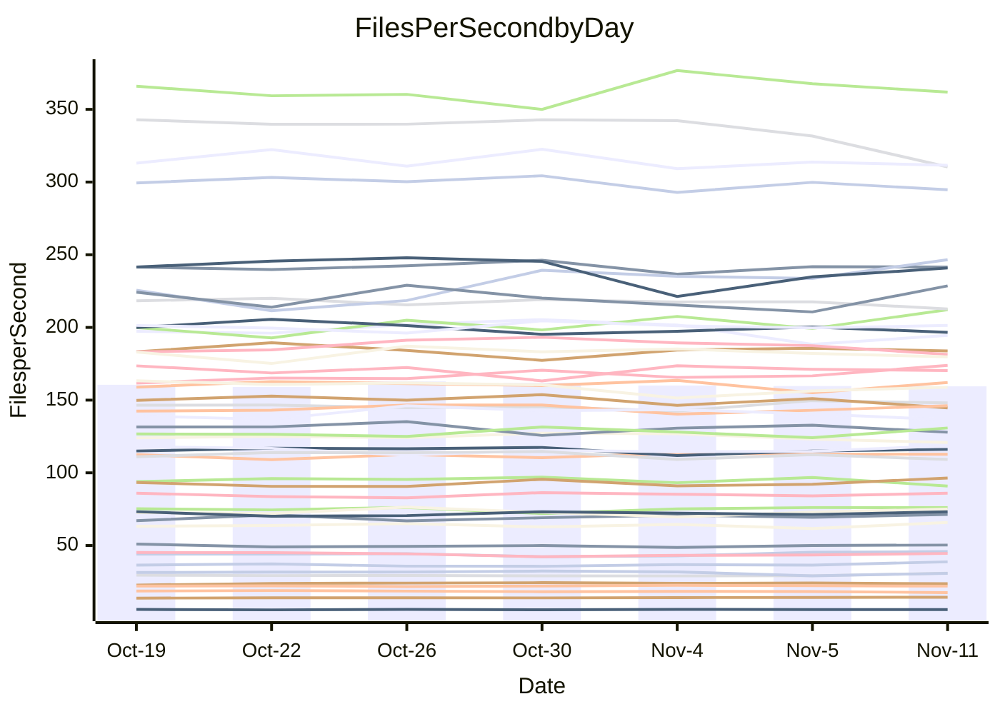

<!---
# This file is auto-generated. Do not edit.
# cspell:disable
--->
# Performance Report

## Daily Performance

## Time to Process Files

| Repository                                      | Elapsed | Min/Avg/Max           |   SD | SD Graph                |
| ----------------------------------------------- | ------: | :-------------------: | ---: | ----------------------- |
| AdaDoom3/AdaDoom3                    |    3.33 | 3.4 /   3.5 /   3.7   | 0.07 | `   ● ┣━┻━━╋━━┻━┫     ` |
| alexiosc/megistos                    |    7.76 | 7.3 /   8.0 /   8.7   | 0.39 | `    ┣━━┻●━╋━━┻━━┫    ` |
| apollographql/apollo-server          |    2.62 | 2.6 /   2.7 /   2.9   | 0.08 | `     ┣●┻━━╋━━┻━┫     ` |
| aspnetboilerplate/aspnetboilerplate  |   10.75 | 10.3 /  10.5 /  10.8  | 0.19 | `    ┣━━┻━━╋━━┻●━┫    ` |
| aws-amplify/docs                     |   12.56 | 12.4 /  13.2 /  14.8  | 0.61 | `    ┣━━●━━╋━━┻━━┫    ` |
| Azure/azure-rest-api-specs           |    9.82 | 9.6 /  10.1 /  11.0   | 0.38 | `    ┣━━┻●━╋━━┻━━┫    ` |
| bitjson/typescript-starter           |    1.14 | 1.0 /   1.1 /   1.1   | 0.03 | `     ┣━┻━━╋━━┻━┫●    ` |
| caddyserver/caddy                    |    3.79 | 3.7 /   3.8 /   4.0   | 0.09 | `    ┣━━┻━●╋━━┻━━┫    ` |
| canada-ca/open-source-logiciel-libre |    1.18 | 1.1 /   1.2 /   1.3   | 0.04 | `     ┣━┻━━●━━┻━┫     ` |
| chef/chef                            |    6.06 | 5.7 /   6.0 /   6.3   | 0.16 | `    ┣━━┻━━╋━●┻━━┫    ` |
| dart-lang/sdk                        |   67.66 | 63.7 /  67.3 /  72.3  | 2.38 | `  ┣━━━┻━━━╋●━━┻━━━┫  ` |
| django/django                        |   16.05 | 14.9 /  15.7 /  16.7  | 0.50 | `    ┣━━┻━━╋━●┻━━┫    ` |
| eslint/eslint                        |   11.57 | 10.7 /  11.2 /  11.8  | 0.37 | `    ┣━━┻━━╋━━●━━┫    ` |
| exonum/exonum                        |    3.55 | 3.5 /   3.7 /   3.8   | 0.09 | `    ┣━━●━━╋━━┻━━┫    ` |
| flutter/samples                      |   16.42 | 16.0 /  16.7 /  17.5  | 0.43 | `    ┣━━┻●━╋━━┻━━┫    ` |
| gitbucket/gitbucket                  |    3.66 | 3.5 /   3.7 /   3.9   | 0.11 | `    ┣━━┻━●╋━━┻━━┫    ` |
| googleapis/google-cloud-cpp          |  153.47 | 139.9 / 147.6 / 158.3 | 5.00 | `  ┣━━━┻━━━╋━━━┻●━━┫  ` |
| graphql/express-graphql              |    1.18 | 1.1 /   1.2 /   1.2   | 0.03 | `     ┣━┻━━●━━┻━┫     ` |
| graphql/graphql-js                   |    3.04 | 2.8 /   2.9 /   3.1   | 0.08 | `     ┣━┻━━╋━━┻●┫     ` |
| graphql/graphql-relay-js             |    1.18 | 1.1 /   1.2 /   1.2   | 0.04 | `     ┣━┻━━●━━┻━┫     ` |
| graphql/graphql-spec                 |    1.32 | 1.3 /   1.4 /   1.4   | 0.04 | `     ┣━┻●━╋━━┻━┫     ` |
| iluwatar/java-design-patterns        |   13.77 | 12.8 /  13.3 /  14.4  | 0.38 | `    ┣━━┻━━╋━━┻●━┫    ` |
| ktaranov/sqlserver-kit               |    6.68 | 6.6 /   6.8 /   7.1   | 0.16 | `    ┣━━●━━╋━━┻━━┫    ` |
| liriliri/licia                       |    4.63 | 4.1 /   4.2 /   4.4   | 0.09 | `     ┣━━┻━╋━┻━━┫    ●` |
| MartinThoma/LaTeX-examples           |    7.00 | 6.8 /   7.1 /   7.6   | 0.20 | `    ┣━━┻━●╋━━┻━━┫    ` |
| mdx-js/mdx                           |    1.98 | 1.9 /   2.1 /   2.2   | 0.08 | `     ┣━●━━╋━━┻━┫     ` |
| microsoft/TypeScript-Website         |    5.95 | 5.5 /   5.8 /   6.1   | 0.14 | `    ┣━━┻━━╋━━┻●━┫    ` |
| MicrosoftDocs/PowerShell-Docs        |   24.81 | 23.3 /  24.1 /  25.4  | 0.64 | `   ┣━━━┻━━╋━━┻●━━┫   ` |
| neovim/nvim-lspconfig                |    4.46 | 4.3 /   4.4 /   4.6   | 0.09 | `    ┣━━┻━━╋●━┻━━┫    ` |
| pagekit/pagekit                      |    3.49 | 3.5 /   3.7 /   4.0   | 0.15 | `    ┣━●┻━━╋━━┻━━┫    ` |
| php/php-src                          |   26.31 | 25.9 /  27.0 /  28.5  | 0.81 | `   ┣━━━●━━╋━━┻━━━┫   ` |
| plasticrake/tplink-smarthome-api     |    1.39 | 1.3 /   1.4 /   1.5   | 0.04 | `     ┣━┻━●╋━━┻━┫     ` |
| prettier/prettier                    |    7.77 | 7.2 /   7.6 /   7.9   | 0.20 | `    ┣━━┻━━╋━━●━━┫    ` |
| pycontribs/jira                      |    1.57 | 1.5 /   1.6 /   1.7   | 0.06 | `     ┣━┻━●╋━━┻━┫     ` |
| RustPython/RustPython                |    5.30 | 5.2 /   5.5 /   6.0   | 0.24 | `    ┣━━┻●━╋━━┻━━┫    ` |
| shoelace-style/shoelace              |    2.96 | 2.9 /   3.0 /   3.2   | 0.08 | `     ┣━┻━●╋━━┻━┫     ` |
| slint-ui/slint                       |   13.95 | 13.3 /  13.8 /  14.4  | 0.39 | `    ┣━━┻━━╋●━┻━━┫    ` |
| SoftwareBrothers/admin-bro           |    2.54 | 2.6 /   2.7 /   2.9   | 0.07 | `     ●━┻━━╋━━┻━┫     ` |
| sveltejs/svelte                      |   22.26 | 20.8 /  21.9 /  22.9  | 0.47 | `   ┣━━━┻━━╋━●┻━━━┫   ` |
| TheAlgorithms/Python                 |    5.79 | 5.7 /   5.8 /   6.0   | 0.08 | `    ┣━━┻━━●━━┻━━┫    ` |
| twbs/bootstrap                       |    1.79 | 1.8 /   1.9 /   2.0   | 0.06 | `     ┣━●━━╋━━┻━┫     ` |
| typescript-cheatsheets/react         |    1.37 | 1.4 /   1.5 /   1.6   | 0.06 | `     ┣●┻━━╋━━┻━┫     ` |
| typescript-eslint/typescript-eslint  |    4.36 | 4.2 /   4.3 /   4.5   | 0.07 | `    ┣━━┻━━╋━━●━━┫    ` |
| vitest-dev/vitest                    |    9.49 | 9.2 /  10.0 /  10.9   | 0.52 | `    ┣━━●━━╋━━┻━━┫    ` |
| w3c/aria-practices                   |    3.56 | 3.5 /   3.6 /   3.8   | 0.09 | `    ┣━━┻━●╋━━┻━━┫    ` |
| w3c/specberus                        |    2.17 | 2.0 /   2.1 /   2.2   | 0.05 | `     ┣━┻━━╋━━┻━┫●    ` |
| webdeveric/webpack-assets-manifest   |    1.20 | 1.2 /   1.2 /   1.3   | 0.04 | `     ┣━●━━╋━━┻━┫     ` |
| webpack/webpack                      |    5.87 | 5.5 /   5.8 /   6.7   | 0.28 | `    ┣━━┻━━╋●━┻━━┫    ` |
| wireapp/wire-desktop                 |    1.49 | 1.4 /   1.5 /   1.7   | 0.09 | `     ┣━┻━━●━━┻━┫     ` |
| wireapp/wire-webapp                  |   11.00 | 10.7 /  11.2 /  12.3  | 0.45 | `    ┣━━┻━●╋━━┻━━┫    ` |

Note:
- Elapsed time is in seconds.

## Files per Second over Time

| Repository                                      | Files |    Sec |    Fps |    Rel | Trend Fps          |    N |
| ----------------------------------------------- | ----: | -----: | -----: | -----: | ------------------ | ---: |
| AdaDoom3/AdaDoom3                    |   103 |   3.33 |  30.95 |  5.60% | `▇▇▅▇▅▇▆▆▆▅▆▆▄▆▇█` |   15 |
| alexiosc/megistos                    |   583 |   7.76 |  75.09 |  2.87% | `▅▇▄▄▅█▆▅▅▃▅▄▄▇▇▆` |   15 |
| apollographql/apollo-server          |   253 |   2.62 |  96.41 |  4.85% | `▇█▆▇▄▅▆▆█▇▅▇▇▄▇█` |   15 |
| aspnetboilerplate/aspnetboilerplate  |  2286 |  10.75 | 212.72 | -2.32% | `▅███▇▆▆█▇▆█▇▇█▆▆` |   15 |
| aws-amplify/docs                     |  2871 |  12.56 | 228.58 |  4.50% | `█▇▆▇▅███▇▇▅▇▆▆▃█` |   15 |
| Azure/azure-rest-api-specs           |  2365 |   9.82 | 240.86 |  0.73% | `▅▇▇▆█▇█▇▇▃▅▅▆▇▅▆` |   15 |
| bitjson/typescript-starter           |    20 |   1.14 |  17.61 | -5.17% | `▆▇█▇█▇▇▆▆▆▆▅▇▇▅▄` |   15 |
| caddyserver/caddy                    |   288 |   3.79 |  76.02 |  0.90% | `▇▆▇▆▆▇▇█▅▅█▆▆██▇` |   15 |
| canada-ca/open-source-logiciel-libre |     7 |   1.18 |   5.95 |  0.02% | `▇█▇▄▇██▇▆▇██▄▆█▇` |   15 |
| chef/chef                            |  1191 |   6.06 | 196.62 | -1.89% | `▇▆▇█▇▆█▆▅▇▅▄█▇▇▆` |   15 |
| dart-lang/sdk                        | 10747 |  67.66 | 158.85 | -0.13% | `▇▇██▆█▇▅▆▅▄▅▇▆▅▆` |   15 |
| django/django                        |  2885 |  16.05 | 179.75 | -1.71% | `▅▅█▄▅▇▆█▆▇▇▇▄▇▆▆` |   15 |
| eslint/eslint                        |  2099 |  11.57 | 181.43 | -3.29% | `▅▄▇▇▄▇▇▇▇▅█▆▇▄▇▅` |   15 |
| exonum/exonum                        |   421 |   3.55 | 118.59 |  2.94% | `██▇▆█▆▆▅▇▆▇▅▇█▇█` |   15 |
| flutter/samples                      |  2400 |  16.42 | 146.15 |  1.83% | `▆▆▇▇▅█▆█▇▆▅█▅▆▆▇` |   15 |
| gitbucket/gitbucket                  |   413 |   3.66 | 112.79 |  0.56% | `▅▆█▅▅█▆▆▆▅█▆█▄▇▆` |   15 |
| googleapis/google-cloud-cpp          | 20952 | 153.47 | 136.52 | -3.45% | `▆▅▆▇▄▇██▇█▆▆▅█▅▅` |   15 |
| graphql/express-graphql              |    26 |   1.18 |  22.08 | -0.50% | `▆▆▆█▅▄▅▆▆▅█▇▆▆▇▆` |   15 |
| graphql/graphql-js                   |   368 |   3.04 | 120.90 | -2.95% | `█▇▅▆█▆█▅█▇█▇▇▅▆▅` |   15 |
| graphql/graphql-relay-js             |    28 |   1.18 |  23.69 | -0.67% | `▄▅▄▇▅▆▆▇▇▇▅▅▆█▆▆` |   15 |
| graphql/graphql-spec                 |    19 |   1.32 |  14.39 |  2.20% | `▅▆▆▅▇▄█▆▆▇▇▇▆██▇` |   15 |
| iluwatar/java-design-patterns        |  1992 |  13.77 | 144.71 | -3.77% | `▇▇▆█▇█▇▅█▄█▇▇▇▇▆` |   15 |
| ktaranov/sqlserver-kit               |   489 |   6.68 |  73.24 |  2.23% | `██▇▅▇▆▅▇█▇▇▆▇▆██` |   15 |
| liriliri/licia                       |  1437 |   4.63 | 310.44 | -8.36% | `█▇█▇▇█▆▇▇█▇█▅▅▆▃` |   15 |
| MartinThoma/LaTeX-examples           |  1409 |   7.00 | 201.35 |  0.79% | `▇█▆▇▆▄█▆█▆▇▅▆▇▇▇` |   15 |
| mdx-js/mdx                           |   141 |   1.98 |  71.36 |  3.66% | `▄▇▆█▇▄▇▅▆▆█▇█▆▆▇` |   15 |
| microsoft/TypeScript-Website         |   761 |   5.95 | 127.91 | -3.17% | `▆▆▇▅▇▇█▇▄▅▇█▇▆▆▅` |   15 |
| MicrosoftDocs/PowerShell-Docs        |  2708 |  24.81 | 109.14 | -2.86% | `▇▆▆▇██▅██▄▆██▆▆▅` |   15 |
| neovim/nvim-lspconfig                |   759 |   4.46 | 170.34 | -0.60% | `██▆▅▇▇▇▇▅▇█▇▇▆▇▇` |   15 |
| pagekit/pagekit                      |   741 |   3.49 | 212.17 |  5.71% | `▇█▄▅▅▇▇▇▆█▇▅▇▅▇█` |   15 |
| php/php-src                          |  2262 |  26.31 |  85.96 |  1.74% | `▇█▇█▄▇▅▅▇▇▆▇█▄▆▇` |   15 |
| plasticrake/tplink-smarthome-api     |    62 |   1.39 |  44.55 |  1.06% | `█▆█▇█▆▅█▅▅▆▆▄▅▇▇` |   15 |
| prettier/prettier                    |  2421 |   7.77 | 311.51 | -0.84% | `▆▆▆█▇▅▅██▅▆▆▇▆▆▆` |   15 |
| pycontribs/jira                      |    79 |   1.57 |  50.31 |  1.09% | `█▆▇▆▅▄▆█▆▆▅▄█▆▇▇` |   15 |
| RustPython/RustPython                |   693 |   5.30 | 130.86 |  3.73% | `▆▇▆▅█▅▄██▇▆▇▃▆▆▇` |   15 |
| shoelace-style/shoelace              |   439 |   2.96 | 148.07 |  1.13% | `▇▇▅▆▆▆▅▆▆▇▄▇█▆▆▇` |   15 |
| slint-ui/slint                       |  2565 |  13.95 | 183.87 | -0.46% | `▅▇▇█▇▅▇█▅▆▇█▆▅█▆` |   15 |
| SoftwareBrothers/admin-bro           |   441 |   2.54 | 173.91 |  5.25% | `▆▇▄▇▆▇▆▆▇▇▆▇▇▆▇█` |   15 |
| sveltejs/svelte                      |  8053 |  22.26 | 361.82 | -0.81% | `▆▆▇▆▅▅▅▆▄█▆▆▆▆▇▆` |   15 |
| TheAlgorithms/Python                 |  1399 |   5.79 | 241.52 |  0.13% | `▇▇█▇▆█▆▇█▅▇▆▇█▇▇` |   15 |
| twbs/bootstrap                       |   118 |   1.79 |  65.83 |  3.80% | `▄▇█▇▆▇█▇▆█▆▆▆▄▅█` |   15 |
| typescript-cheatsheets/react         |    53 |   1.37 |  38.78 |  6.33% | `▆▆▆▇▆▇▃▅▅▄██▅▇▄█` |   15 |
| typescript-eslint/typescript-eslint  |  1285 |   4.36 | 294.70 | -1.65% | `▇▇▇█▇██▆█▇▅█▇▇▇▆` |   15 |
| vitest-dev/vitest                    |  2339 |   9.49 | 246.58 |  8.79% | `▅▆▆▄▃▃▅▆▇█▅▆█▆▆█` |   15 |
| w3c/aria-practices                   |   414 |   3.56 | 116.13 |  0.72% | `▆▅██▆▇▆█▇▆▅▇▅▅█▇` |   15 |
| w3c/specberus                        |   197 |   2.17 |  90.90 | -4.71% | `▇▆▇█▇▇▆███▅▇███▅` |   15 |
| webdeveric/webpack-assets-manifest   |    55 |   1.20 |  45.81 |  3.59% | `▅▇▇▇▆█▆▆▅▆▄█▆█▇█` |   15 |
| webpack/webpack                      |  1141 |   5.87 | 194.49 | -1.19% | `▇█▆▇▇█▇▇████▆▃▆▇` |   15 |
| wireapp/wire-desktop                 |    46 |   1.49 |  30.84 | -0.64% | `▇▇▆▇▇▆█▇██▇▅▄▃█▆` |   15 |
| wireapp/wire-webapp                  |  1783 |  11.00 | 162.14 |  1.59% | `▇▆▇▇█▇█▆▇▇█▄██▄▇` |   15 |

## Data Throughput

| Repository                                      | Files |    Sec |     Kps |    Rel | Trend Kps          |    N |
| ----------------------------------------------- | ----: | -----: | ------: | -----: | ------------------ | ---: |
| AdaDoom3/AdaDoom3                    |   103 |   3.33 |  657.76 |  5.60% | `▇▇▅▇▅▇▆▆▆▅▆▆▄▆▇█` |   15 |
| alexiosc/megistos                    |   583 |   7.76 |  590.03 |  2.87% | `▅▇▄▄▅█▆▅▅▃▅▄▄▇▇▆` |   15 |
| apollographql/apollo-server          |   253 |   2.62 |  787.70 |  5.73% | `▆▇▅▆▄▅▆▅█▇▅▇▇▄▇█` |   15 |
| aspnetboilerplate/aspnetboilerplate  |  2286 |  10.75 |  517.56 | -2.32% | `▅███▇▆▆█▇▆█▇▇█▆▆` |   15 |
| aws-amplify/docs                     |  2871 |  12.56 |  798.02 |  4.51% | `█▇▆▇▅███▇▇▅▇▆▆▃█` |   15 |
| Azure/azure-rest-api-specs           |  2365 |   9.82 |  654.34 |  1.64% | `▅▇▇▆█▇█▇▇▃▅▅▆▇▅▇` |   15 |
| bitjson/typescript-starter           |    20 |   1.14 |   70.46 | -5.17% | `▆▇█▇█▇▇▆▆▆▆▅▇▇▅▄` |   15 |
| caddyserver/caddy                    |   288 |   3.79 |  659.38 |  1.17% | `▆▅▇▆▆▇▇█▅▅█▆▆██▇` |   15 |
| canada-ca/open-source-logiciel-libre |     7 |   1.18 |   49.29 |  0.02% | `▇█▇▄▇██▇▆▇██▄▆█▇` |   15 |
| chef/chef                            |  1191 |   6.06 |  911.28 | -1.76% | `▇▅▆█▇▆█▆▅▇▅▄█▇▇▆` |   15 |
| dart-lang/sdk                        | 10747 |  67.66 | 1084.00 |  0.00% | `▇▇██▆█▇▅▆▅▄▅▇▆▅▆` |   15 |
| django/django                        |  2885 |  16.05 | 1128.11 | -1.83% | `▅▅█▅▅▇▆█▆▇▇▇▄▇▇▆` |   15 |
| eslint/eslint                        |  2099 |  11.57 | 1301.50 | -3.53% | `▅▅▇▇▄▇▇▇▇▅█▆▇▄▇▅` |   15 |
| exonum/exonum                        |   421 |   3.55 | 1134.34 |  2.94% | `██▇▆█▆▆▅▇▆▇▅▇█▇█` |   15 |
| flutter/samples                      |  2400 |  16.42 | 1304.23 |  1.83% | `▆▆▇▇▅█▆█▇▆▅█▅▆▆▇` |   15 |
| gitbucket/gitbucket                  |   413 |   3.66 |  512.62 |  0.54% | `▅▆█▅▅▇▆▆▆▅█▆█▄▇▆` |   15 |
| googleapis/google-cloud-cpp          | 20952 | 153.47 | 1111.99 | -3.12% | `▆▅▆▇▄▇██▇█▆▆▅█▅▅` |   15 |
| graphql/express-graphql              |    26 |   1.18 |  101.07 | -0.50% | `▆▆▆█▅▄▅▆▆▅█▇▆▆▇▆` |   15 |
| graphql/graphql-js                   |   368 |   3.04 |  701.74 | -2.60% | `▇▇▄▆█▆█▅█▇█▇▇▅▆▆` |   15 |
| graphql/graphql-relay-js             |    28 |   1.18 |   93.08 | -0.67% | `▄▅▄▇▅▆▆▇▇▇▅▅▆█▆▆` |   15 |
| graphql/graphql-spec                 |    19 |   1.32 |  480.01 |  2.20% | `▅▆▆▅▇▄█▆▆▇▇▇▆██▇` |   15 |
| iluwatar/java-design-patterns        |  1992 |  13.77 |  447.28 | -3.77% | `▇▇▆█▇█▇▅█▄█▇▇▇▇▆` |   15 |
| ktaranov/sqlserver-kit               |   489 |   6.68 | 1109.12 |  2.24% | `██▇▅▇▆▅▇█▇▇▆▇▆██` |   15 |
| liriliri/licia                       |  1437 |   4.63 |  369.85 | -8.36% | `█▇█▇▇█▆▇▇█▇█▅▅▆▃` |   15 |
| MartinThoma/LaTeX-examples           |  1409 |   7.00 |  415.86 |  0.79% | `▇█▆▇▆▄█▆█▆▇▅▆▇▇▇` |   15 |
| mdx-js/mdx                           |   141 |   1.98 |  332.01 |  3.66% | `▄▇▆█▇▄▇▅▆▆█▇█▆▆▇` |   15 |
| microsoft/TypeScript-Website         |   761 |   5.95 |  884.80 | -3.16% | `▆▆▇▅▇▇█▇▄▅▇█▇▆▆▅` |   15 |
| MicrosoftDocs/PowerShell-Docs        |  2708 |  24.81 | 1123.84 | -2.81% | `▇▆▆▇██▅██▄▆██▆▆▅` |   15 |
| neovim/nvim-lspconfig                |   759 |   4.46 |  285.03 | -0.45% | `██▆▅▇▇▇▇▅▇█▇▇▆▇▇` |   15 |
| pagekit/pagekit                      |   741 |   3.49 |  442.38 |  5.71% | `▇█▄▅▅▇▇▇▆█▇▅▇▅▇█` |   15 |
| php/php-src                          |  2262 |  26.31 | 1504.26 |  1.80% | `▇█▇█▄▇▅▅▇▇▆▇█▄▆▇` |   15 |
| plasticrake/tplink-smarthome-api     |    62 |   1.39 |  240.71 |  1.06% | `█▆█▇█▆▅█▅▅▆▆▄▅▇▇` |   15 |
| prettier/prettier                    |  2421 |   7.77 |  432.59 | -1.33% | `▆▆▆█▇▅▅██▅▆▆▇▅▆▆` |   15 |
| pycontribs/jira                      |    79 |   1.57 |  356.64 |  1.09% | `█▆▇▆▅▄▆█▆▆▅▄█▆▇▇` |   15 |
| RustPython/RustPython                |   693 |   5.30 | 1088.82 |  6.82% | `▅▆▅▄▇▅▃▇▇█▇█▄▇▇█` |   15 |
| shoelace-style/shoelace              |   439 |   2.96 |  715.39 |  1.13% | `▇▇▅▆▆▆▅▆▆▇▄▇█▆▆▇` |   15 |
| slint-ui/slint                       |  2565 |  13.95 | 1134.11 | -0.22% | `▅▇▇█▇▅▇█▅▆▇█▆▅█▆` |   15 |
| SoftwareBrothers/admin-bro           |   441 |   2.54 |  383.31 |  5.25% | `▆▇▄▇▆▇▆▆▇▇▆▇▇▆▇█` |   15 |
| sveltejs/svelte                      |  8053 |  22.26 |  241.36 | -0.86% | `▅▆▇▆▅▅▅▆▄█▆▆▆▆▇▆` |   15 |
| TheAlgorithms/Python                 |  1399 |   5.79 |  614.24 |  0.14% | `▇▇█▇▆█▆▇█▅▇▆▇█▇▇` |   15 |
| twbs/bootstrap                       |   118 |   1.79 |  540.55 |  3.91% | `▄▇█▇▆▇█▇▆█▆▆▆▄▅█` |   15 |
| typescript-cheatsheets/react         |    53 |   1.37 |  286.80 |  6.33% | `▆▆▆▇▆▇▃▅▅▄██▅▇▄█` |   15 |
| typescript-eslint/typescript-eslint  |  1285 |   4.36 | 1519.16 | -1.43% | `▇▇▇█▇██▆█▇▅█▇▇▇▆` |   15 |
| vitest-dev/vitest                    |  2339 |   9.49 |  529.63 |  4.59% | `▅▆▆▄▃▃▅▆██▅▆█▆▆▇` |   15 |
| w3c/aria-practices                   |   414 |   3.56 | 1082.79 |  0.72% | `▆▅██▆▇▆█▇▆▅▇▅▅█▇` |   15 |
| w3c/specberus                        |   197 |   2.17 |  287.46 | -4.71% | `▇▆▇█▇▇▆███▅▇███▅` |   15 |
| webdeveric/webpack-assets-manifest   |    55 |   1.20 |  105.78 |  3.59% | `▅▇▇▇▆█▆▆▅▆▄█▆█▇█` |   15 |
| webpack/webpack                      |  1141 |   5.87 |  886.86 | -0.88% | `▇█▆▇▇███████▆▃▆▇` |   15 |
| wireapp/wire-desktop                 |    46 |   1.49 |  172.32 | -0.64% | `▇▇▆▇▇▆█▇██▇▅▄▃█▆` |   15 |
| wireapp/wire-webapp                  |  1783 |  11.00 |  599.63 |  1.80% | `▇▆▇▇█▇█▆▇▇█▄██▄▇` |   15 |

