<!---
# This file is auto-generated. Do not edit.
# cspell:disable
--->
# Performance Report

## Daily Performance

```mermaid
xychart-beta
    title Files Per Second by Day
    y-axis Files per Second
    x-axis Date [Aug-4, Aug-5, Aug-6, Aug-8, Aug-12, Aug-13, Aug-16, Aug-17, Aug-18, Aug-19, Aug-20, Aug-21, Aug-22, Aug-23, Aug-26, Aug-27, Aug-29, Aug-31, Sep-2]
    bar [190.59, 192.54, 190.31, 191.20, 180.70, 178.15, 177.36, 180.37, 181.58, 178.25, 178.21, 176.48, 177.31, 178.59, 176.65, 175.34, 176.71, 179.62, 175.68]
    line [33.91, 34.47, 34.14, 34.20, 33.20, 34.57, 31.78, 34.11, 35.97, 0.00, 34.29, 33.06, 35.20, 33.44, 33.88, 34.28, 34.29, 31.46, 31.96]
    line [127.67, 132.91, 132.93, 128.73, 120.46, 121.08, 119.97, 118.94, 123.21, 122.05, 125.45, 120.85, 116.37, 122.78, 117.70, 119.12, 121.35, 120.42, 122.42]
    line [45.13, 44.18, 44.67, 44.79, 42.03, 41.23, 43.84, 44.17, 43.94, 0.00, 42.21, 42.40, 45.26, 41.26, 43.81, 40.27, 43.32, 41.01, 43.29]
    line [43.09, 42.44, 41.97, 42.95, 41.33, 40.92, 39.81, 41.51, 41.02, 0.00, 41.64, 40.90, 36.56, 37.81, 40.07, 40.16, 39.52, 40.88, 40.72]
    line [93.99, 88.14, 91.02, 91.26, 90.11, 84.85, 88.54, 87.18, 78.69, 87.97, 81.21, 83.61, 95.38, 96.21, 93.90, 98.97, 89.73, 92.49, 93.42]
    line [139.36, 148.78, 146.56, 150.53, 148.96, 145.17, 146.97, 147.53, 146.24, 0.00, 148.33, 142.38, 151.12, 148.79, 140.03, 146.17, 148.08, 143.16, 143.31]
    line [432.41, 466.82, 461.84, 477.15, 462.92, 457.77, 453.39, 461.99, 463.36, 0.00, 463.20, 452.00, 439.43, 448.11, 442.87, 446.82, 438.90, 433.22, 451.36]
    line [242.74, 229.48, 222.58, 224.07, 225.73, 230.84, 231.20, 230.56, 226.49, 220.96, 218.62, 223.21, 235.78, 218.52, 223.39, 232.83, 235.11, 223.20, 230.93]
    line [39.70, 39.42, 39.41, 39.34, 38.23, 38.39, 37.87, 38.23, 38.08, 0.00, 38.14, 38.85, 37.70, 37.19, 34.46, 37.13, 36.19, 37.79, 36.83]
    line [20.56, 20.41, 20.21, 21.19, 20.25, 20.06, 19.64, 20.70, 20.41, 0.00, 20.37, 19.78, 16.65, 19.78, 19.77, 19.75, 19.38, 19.78, 17.23]
    line [241.50, 241.08, 235.56, 237.21, 229.02, 218.58, 221.35, 221.21, 218.06, 224.66, 224.81, 219.16, 211.20, 220.63, 218.66, 210.78, 216.53, 205.56, 221.13]
    line [9.72, 9.85, 9.44, 9.50, 9.79, 10.01, 9.93, 9.56, 9.98, 0.00, 10.21, 9.57, 9.67, 10.21, 9.79, 8.96, 9.05, 9.81, 8.92]
    line [160.72, 160.91, 159.40, 154.37, 143.15, 144.69, 142.97, 147.08, 148.37, 144.42, 139.84, 136.44, 133.06, 147.23, 141.82, 144.43, 131.99, 140.70, 140.40]
    line [194.05, 193.40, 189.46, 188.48, 161.32, 170.45, 169.12, 163.90, 175.25, 0.00, 174.12, 168.12, 168.81, 160.53, 165.45, 157.28, 166.29, 168.59, 168.11]
    line [102.94, 98.59, 101.98, 102.16, 100.25, 96.34, 100.85, 99.70, 100.11, 0.00, 95.31, 98.34, 100.20, 98.20, 97.14, 95.15, 97.31, 98.42, 98.44]
    line [78.78, 85.02, 87.13, 85.35, 82.25, 84.75, 81.36, 85.27, 80.18, 0.00, 84.11, 82.91, 84.94, 84.37, 83.76, 83.84, 82.02, 86.32, 87.46]
    line [176.46, 171.25, 178.78, 173.61, 176.29, 177.61, 180.65, 178.25, 170.32, 0.00, 179.55, 173.37, 159.94, 179.71, 169.02, 169.12, 169.70, 179.72, 174.42]
    line [305.59, 302.93, 302.86, 299.77, 259.20, 260.53, 258.00, 260.49, 259.27, 261.07, 258.95, 254.28, 252.45, 254.96, 251.52, 256.47, 238.41, 254.64, 251.96]
    line [213.68, 216.07, 216.46, 217.96, 220.64, 214.63, 212.14, 214.39, 207.70, 220.70, 210.90, 214.69, 206.22, 205.16, 204.73, 205.50, 203.46, 212.85, 203.78]
    line [80.18, 81.35, 79.97, 79.56, 80.20, 83.75, 83.15, 84.93, 85.14, 0.00, 84.39, 80.69, 82.01, 80.62, 81.99, 84.93, 82.93, 82.69, 82.19]
    line [287.06, 280.91, 282.25, 284.31, 268.87, 259.91, 264.09, 263.50, 252.27, 247.59, 259.11, 258.43, 251.09, 261.73, 254.45, 247.25, 249.51, 257.53, 250.46]
    line [173.53, 175.86, 170.50, 175.00, 154.73, 157.53, 156.69, 160.04, 149.26, 160.96, 156.07, 157.97, 160.09, 159.80, 156.02, 151.31, 156.46, 156.20, 128.81]
    line [230.99, 220.82, 226.74, 227.33, 235.28, 233.55, 229.09, 233.43, 243.19, 0.00, 239.03, 235.84, 242.13, 231.92, 216.52, 227.39, 223.72, 225.22, 232.84]
    line [130.49, 132.80, 126.71, 134.56, 137.20, 131.68, 136.01, 136.33, 135.27, 137.39, 135.24, 132.55, 135.80, 124.86, 135.53, 135.15, 134.28, 135.44, 134.10]
    line [81.68, 82.05, 80.44, 80.98, 74.91, 76.50, 76.38, 77.71, 75.62, 0.00, 77.72, 74.04, 70.35, 73.82, 76.46, 74.01, 76.69, 74.15, 76.26]
    line [264.48, 262.64, 256.46, 267.50, 243.48, 245.74, 247.26, 247.95, 246.01, 0.00, 245.63, 244.19, 237.32, 241.48, 235.19, 238.66, 248.28, 246.15, 249.29]
    line [263.34, 260.92, 262.66, 269.21, 249.55, 240.04, 237.83, 228.68, 245.41, 242.22, 244.96, 234.22, 246.89, 237.83, 238.28, 231.51, 232.29, 237.57, 232.38]
    line [138.80, 137.73, 133.56, 136.25, 131.30, 125.82, 127.16, 126.21, 130.73, 126.16, 124.30, 123.93, 127.92, 119.73, 122.40, 121.04, 123.38, 130.04, 119.32]
    line [215.99, 214.65, 218.75, 213.12, 199.30, 201.86, 197.88, 205.41, 206.29, 0.00, 206.95, 195.89, 198.81, 198.92, 201.94, 200.15, 198.85, 195.27, 198.37]
    line [113.03, 112.93, 114.12, 108.73, 114.61, 115.03, 111.20, 115.68, 117.57, 108.01, 110.94, 111.36, 109.59, 114.15, 106.99, 110.60, 113.93, 109.73, 98.03]
    line [55.08, 54.71, 53.08, 55.19, 53.89, 53.76, 54.05, 51.77, 52.47, 0.00, 51.98, 49.75, 49.50, 52.81, 53.66, 48.74, 52.00, 52.00, 53.54]
    line [71.76, 72.59, 71.65, 69.76, 72.23, 70.49, 71.73, 71.73, 69.94, 0.00, 72.13, 70.80, 70.95, 67.44, 70.02, 70.97, 71.48, 71.44, 71.07]
    line [152.22, 155.53, 156.29, 161.10, 149.57, 152.42, 154.99, 156.52, 151.19, 149.78, 152.30, 148.37, 152.77, 157.05, 152.12, 144.60, 151.74, 152.77, 128.16]
    line [165.84, 157.27, 161.17, 163.25, 158.60, 153.54, 148.56, 144.51, 138.29, 159.59, 153.49, 152.84, 151.42, 150.33, 145.56, 148.61, 150.44, 164.92, 155.92]
    line [144.89, 141.11, 140.08, 142.93, 132.02, 134.29, 131.31, 134.38, 103.66, 133.22, 133.90, 133.21, 135.84, 133.85, 134.48, 128.45, 125.51, 128.57, 133.06]
    line [180.04, 184.53, 180.79, 188.21, 179.85, 184.92, 184.34, 182.55, 194.62, 173.87, 185.52, 175.53, 184.67, 182.24, 173.51, 182.05, 181.30, 178.67, 173.82]
    line [381.06, 376.89, 380.84, 375.47, 377.78, 381.67, 375.65, 377.00, 374.45, 380.47, 380.68, 375.26, 397.02, 370.26, 374.39, 363.66, 375.36, 378.12, 369.19]
    line [33.03, 32.12, 32.58, 32.58, 32.53, 30.92, 31.50, 32.70, 32.97, 0.00, 32.06, 31.30, 30.41, 32.21, 31.61, 31.00, 30.67, 31.04, 30.96]
    line [279.14, 276.47, 277.53, 272.63, 271.36, 278.18, 281.29, 276.84, 282.85, 281.73, 278.23, 265.94, 284.38, 284.39, 265.58, 259.03, 272.73, 274.59, 278.30]
    line [58.43, 59.66, 58.88, 58.58, 56.63, 54.55, 56.37, 56.24, 56.95, 55.01, 51.81, 55.08, 55.43, 57.37, 55.42, 55.44, 54.92, 55.19, 56.79]
    line [401.80, 410.52, 401.88, 409.97, 380.61, 375.07, 385.96, 389.59, 387.36, 368.74, 381.05, 377.05, 388.53, 370.41, 373.49, 378.95, 372.79, 371.32, 379.20]
    line [209.34, 196.08, 209.34, 209.91, 187.02, 173.84, 174.43, 177.08, 175.87, 164.73, 177.91, 172.41, 171.41, 172.78, 171.71, 167.41, 160.25, 170.61, 161.33]
    line [316.30, 310.88, 313.17, 303.64, 278.53, 253.81, 258.44, 269.09, 265.67, 263.14, 256.57, 256.22, 262.68, 265.85, 254.87, 246.75, 253.70, 263.63, 263.57]
    line [278.10, 291.72, 291.23, 287.52, 260.47, 256.60, 250.90, 257.82, 260.83, 265.11, 241.69, 253.34, 256.92, 209.05, 254.71, 263.18, 264.22, 258.50, 262.12]
    line [411.93, 403.91, 413.52, 405.10, 413.56, 404.76, 403.76, 404.07, 431.05, 409.21, 405.37, 402.28, 402.99, 406.75, 400.52, 392.20, 399.70, 406.57, 392.41]
    line [90.02, 93.31, 91.21, 92.10, 91.06, 89.72, 89.04, 89.39, 90.78, 90.42, 89.47, 89.22, 86.73, 90.81, 90.69, 90.61, 92.79, 91.57, 89.68]
    line [162.84, 164.63, 162.06, 162.85, 147.34, 145.33, 143.10, 148.69, 150.98, 137.75, 145.27, 144.73, 145.80, 149.65, 145.04, 143.72, 145.86, 150.29, 143.06]
    line [0.00, 0.00, 0.00, 0.00, 0.00, 0.00, 0.00, 0.00, 0.00, 0.00, 0.00, 0.00, 0.00, 0.00, 0.00, 0.00, 183.14, 189.02, 182.17]
    line [0.00, 0.00, 0.00, 0.00, 0.00, 0.00, 0.00, 0.00, 0.00, 0.00, 0.00, 0.00, 0.00, 0.00, 0.00, 0.00, 0.00, 172.99, 170.71]
```

## Time to Process Files

| Repository                                      | Elapsed | Min/Avg/Max           |   SD | SD Graph                |
| ----------------------------------------------- | ------: | :-------------------: | ---: | ----------------------- |
| AdaDoom3/AdaDoom3                    |    2.80 | 2.5 /   2.7 /   3.1   | 0.10 | `     ┣━┻━━╋━●┻━┫     ` |
| alexiosc/megistos                    |    7.09 | 6.6 /   7.1 /   7.6   | 0.26 | `    ┣━━┻━━●━━┻━━┫    ` |
| apollographql/apollo-server          |    2.04 | 1.8 /   2.0 /   2.3   | 0.10 | `     ┣━┻━━●━━┻━┫     ` |
| aspnetboilerplate/aspnetboilerplate  |   10.74 | 8.8 /  10.4 /  12.7   | 0.77 | `    ┣━━┻━━╋━●┻━━┫    ` |
| aws-amplify/docs                     |   10.84 | 9.7 /  10.8 /  12.0   | 0.55 | `    ┣━━┻━━●━━┻━━┫    ` |
| Azure/azure-rest-api-specs           |   14.33 | 12.4 /  13.3 /  15.0  | 0.55 | `    ┣━━┻━━╋━━┻━━●    ` |
| bitjson/typescript-starter           |    0.63 | 0.6 /   0.6 /   0.7   | 0.03 | `     ┣━━┻━╋━┻●━┫     ` |
| caddyserver/caddy                    |    3.10 | 2.8 /   3.1 /   3.5   | 0.19 | `    ┣━━┻━━●━━┻━━┫    ` |
| canada-ca/open-source-logiciel-libre |    0.78 | 0.7 /   0.7 /   0.9   | 0.04 | `     ┣━━┻━╋━┻●━┫     ` |
| chef/chef                            |    5.05 | 4.8 /   5.2 /   6.0   | 0.24 | `    ┣━━┻●━╋━━┻━━┫    ` |
| dart-lang/sdk                        |   57.63 | 55.3 /  55.8 /  56.4  | 0.47 | `     ┣━┻━━╋━━┻━┫    ●` |
| django/django                        |   13.94 | 12.3 /  13.2 /  14.4  | 0.47 | `    ┣━━┻━━╋━━┻━●┫    ` |
| eslint/eslint                        |    9.05 | 7.9 /   8.8 /  10.2   | 0.47 | `    ┣━━┻━━╋●━┻━━┫    ` |
| exonum/exonum                        |    2.94 | 2.7 /   2.9 /   3.3   | 0.12 | `     ┣━┻━━╋●━┻━┫     ` |
| flutter/samples                      |   14.51 | 13.7 /  14.0 /  14.5  | 0.29 | `    ┣━━┻━━╋━━┻━●┫    ` |
| gitbucket/gitbucket                  |    2.91 | 2.5 /   2.8 /   3.5   | 0.18 | `    ┣━━┻━━╋●━┻━━┫    ` |
| googleapis/google-cloud-cpp          |  136.59 | 116.7 / 130.8 / 152.4 | 7.66 | `  ┣━━━┻━━━╋━━●┻━━━┫  ` |
| graphql/express-graphql              |    0.64 | 0.6 /   0.6 /   0.7   | 0.03 | `     ┣━━┻━●━┻━━┫     ` |
| graphql/graphql-js                   |    1.98 | 1.7 /   1.9 /   2.4   | 0.14 | `     ┣━┻━━╋●━┻━┫     ` |
| graphql/graphql-relay-js             |    0.65 | 0.6 /   0.7 /   0.8   | 0.04 | `     ┣━━┻━●━┻━━┫     ` |
| graphql/graphql-spec                 |    0.87 | 0.7 /   0.8 /   0.9   | 0.05 | `     ┣━━┻━╋━┻━━┫●    ` |
| iluwatar/java-design-patterns        |   10.54 | 10.0 /  10.5 /  11.5  | 0.39 | `    ┣━━┻━━●━━┻━━┫    ` |
| ktaranov/sqlserver-kit               |    5.59 | 5.5 /   5.8 /   6.6   | 0.21 | `    ┣━━●━━╋━━┻━━┫    ` |
| liriliri/licia                       |    3.13 | 2.9 /   3.1 /   3.7   | 0.12 | `    ┣━━┻━━●━━┻━━┫    ` |
| MartinThoma/LaTeX-examples           |    6.04 | 5.8 /   6.1 /   6.8   | 0.26 | `    ┣━━┻━●╋━━┻━━┫    ` |
| mdx-js/mdx                           |    1.46 | 1.4 /   1.5 /   1.7   | 0.06 | `     ┣━┻━━●━━┻━┫     ` |
| microsoft/TypeScript-Website         |    5.85 | 4.2 /   4.7 /   5.2   | 0.24 | `      ┣━┻━╋━┻━┫     ●` |
| MicrosoftDocs/PowerShell-Docs        |   23.90 | 18.5 /  21.0 /  23.5  | 1.07 | `   ┣━━━┻━━╋━━┻━━━┫ ● ` |
| neovim/nvim-lspconfig                |    2.64 | 2.5 /   2.6 /   3.0   | 0.10 | `     ┣━┻━━●━━┻━┫     ` |
| pagekit/pagekit                      |    2.97 | 2.7 /   3.0 /   3.4   | 0.14 | `    ┣━━┻━━●━━┻━━┫    ` |
| php/php-src                          |   24.03 | 23.1 /  24.4 /  26.1  | 0.71 | `   ┣━━━┻●━╋━━┻━━━┫   ` |
| plasticrake/tplink-smarthome-api     |    0.81 | 0.7 /   0.8 /   0.9   | 0.04 | `     ┣━━┻━●━┻━━┫     ` |
| prettier/prettier                    |    5.77 | 5.3 /   5.7 /   6.6   | 0.27 | `    ┣━━┻━━╋●━┻━━┫    ` |
| pycontribs/jira                      |    1.12 | 1.1 /   1.1 /   1.2   | 0.03 | `     ┣━━┻━╋●┻━━┫     ` |
| RustPython/RustPython                |    6.06 | 3.7 /   4.1 /   4.5   | 0.16 | `        ┣┻╋┻┫       ●` |
| shoelace-style/shoelace              |    2.20 | 2.0 /   2.1 /   2.4   | 0.10 | `     ┣━┻━━╋━●┻━┫     ` |
| SoftwareBrothers/admin-bro           |    1.89 | 1.6 /   1.8 /   2.2   | 0.12 | `     ┣━┻━━╋━●┻━┫     ` |
| sveltejs/svelte                      |   18.51 | 16.7 /  17.9 /  18.9  | 0.50 | `    ┣━━┻━━╋━━┻●━┫    ` |
| TheAlgorithms/Python                 |    4.88 | 4.5 /   4.9 /   5.5   | 0.18 | `    ┣━━┻━━●━━┻━━┫    ` |
| twbs/bootstrap                       |    1.10 | 1.0 /   1.1 /   1.4   | 0.06 | `     ┣━┻━━╋●━┻━┫     ` |
| typescript-cheatsheets/react         |    0.99 | 0.9 /   1.0 /   1.5   | 0.08 | `     ┣━┻━●╋━━┻━┫     ` |
| typescript-eslint/typescript-eslint  |    3.36 | 3.1 /   3.3 /   3.6   | 0.11 | `     ┣━┻━━╋━●┻━┫     ` |
| vitest-dev/vitest                    |    6.67 | 5.5 /   6.5 /   9.6   | 0.63 | `    ┣━━┻━━╋●━┻━━┫    ` |
| w3c/aria-practices                   |    2.52 | 2.4 /   2.6 /   3.1   | 0.14 | `    ┣━━┻●━╋━━┻━━┫    ` |
| w3c/specberus                        |    1.53 | 1.4 /   1.5 /   1.9   | 0.09 | `     ┣━┻━━╋●━┻━┫     ` |
| webdeveric/webpack-assets-manifest   |    0.61 | 0.6 /   0.6 /   0.8   | 0.03 | `     ┣━━┻━╋●┻━━┫     ` |
| webpack/webpack                      |    4.16 | 3.4 /   4.0 /   5.0   | 0.35 | `    ┣━━┻━━╋●━┻━━┫    ` |
| wireapp/wire-desktop                 |    0.77 | 0.7 /   0.8 /   0.9   | 0.03 | `     ┣━━┻━●━┻━━┫     ` |
| wireapp/wire-webapp                  |    7.95 | 5.5 /   6.7 /   7.7   | 0.58 | `    ┣━━┻━━╋━━┻━━┫●   ` |

Note:
- Elapsed time is in seconds.

## Files per Second over Time

| Repository                                      | Files |    Sec |    Fps |     Rel | Trend Fps              |    N |
| ----------------------------------------------- | ----: | -----: | -----: | ------: | ---------------------- | ---: |
| AdaDoom3/AdaDoom3                    |   103 |   2.80 |  36.83 |  -3.28% | `▇██▇▇▇▇▆▆▅▃▄▆▆▆▅▅▆▇▆` |   48 |
| alexiosc/megistos                    |   583 |   7.09 |  82.19 |   0.07% | `▇▅▄█▄▇▆▆▅█▅▆█▇█▇▅▆▇▆` |   48 |
| apollographql/apollo-server          |   250 |   2.04 | 122.42 |  -0.35% | `█▆▆▆▆▆▅▇▆▃▇▆▆▅▇▆▆▆▆▆` |   50 |
| aspnetboilerplate/aspnetboilerplate  |  2739 |  10.74 | 255.01 |  -3.99% | `██▆▇▇▇▇▇█▆▇▇█▃▆▇▇▇▇▇` |   51 |
| aws-amplify/docs                     |  2830 |  10.84 | 261.16 |  -1.00% | `▆▇█▇▆█▇▆▆▇▆▄▇▄▆█▆▇▄▇` |   53 |
| Azure/azure-rest-api-specs           |  2416 |  14.33 | 168.56 |  -7.14% | `▇▇▄▆██▇▄▆▅█▇█▇▇▇▅█▇▅` |   53 |
| bitjson/typescript-starter           |    20 |   0.63 |  31.96 |  -5.33% | `▇██▇▆▃█▇▇▇▇▇█▇█▇▇▃▇▅` |   48 |
| caddyserver/caddy                    |   276 |   3.10 |  89.01 |  -0.39% | `▃▄▃▄▇▇▇█▇▅▆██▇▃▇▆▆█▅` |   53 |
| canada-ca/open-source-logiciel-libre |     7 |   0.78 |   8.92 |  -8.06% | `█▅▇▇▆▆▇██▇▆▇▆▃▅▇▃▇▇▅` |   48 |
| chef/chef                            |  1181 |   5.05 | 233.74 |   2.76% | `▆▄▆▆▇▆▅▆▃▇▇▇▆▅██▄▇▆▇` |   52 |
| dart-lang/sdk                        |  9664 |  57.63 | 167.70 |  -3.19% | `▇██▆`                 |    3 |
| django/django                        |  2792 |  13.94 | 200.27 |  -5.83% | `▇██▇▆▇▅▇▅▆▄▆▆▇▅▄█▇▆▅` |   53 |
| eslint/eslint                        |  1983 |   9.05 | 219.17 |  -2.03% | `▆██▆▆█▇▇▇▇▇▇▅▇▇▆▃▇█▇` |   53 |
| exonum/exonum                        |   421 |   2.94 | 143.31 |  -1.86% | `▇▇▃▇▆▇█▇▇▆▄▆▇▇▇▆█▆▆▆` |   48 |
| flutter/samples                      |  2598 |  14.51 | 179.00 |  -3.49% | `▆█▆██▇▅`              |    6 |
| gitbucket/gitbucket                  |   411 |   2.91 | 141.28 |  -2.93% | `█▆▄▆▅█▇▇▇▇▇▇█▃▆▆▇▆▆▇` |   53 |
| googleapis/google-cloud-cpp          | 19600 | 136.59 | 143.49 |  -4.13% | `▆▇▇▇▇██▆█▇▆▆▇▆▇███▆▆` |   53 |
| graphql/express-graphql              |    26 |   0.64 |  40.72 |  -0.41% | `▇▇█▇▇▇▄▇▃▇▇▇▆▇▇▅▇▇▇▇` |   48 |
| graphql/graphql-js                   |   333 |   1.98 | 168.11 |  -2.35% | `█▇▇█▅█▇▃█▇▆▇▆▄▆▆█▇▇▇` |   49 |
| graphql/graphql-relay-js             |    28 |   0.65 |  43.29 |   0.61% | `▆▆▇▅▇▇██▄▇▇█▄▆▇▇▇▅▇▇` |   48 |
| graphql/graphql-spec                 |    15 |   0.87 |  17.23 | -13.97% | `▇▇▄█▇█▃▇▇▇▆▇▇▆▇▇▅▆█▃` |   49 |
| iluwatar/java-design-patterns        |  1838 |  10.54 | 174.42 |  -0.44% | `▇█▅▅█▅▄▇█▆▅▅▅▆▇▄▆█▇▆` |   49 |
| ktaranov/sqlserver-kit               |   489 |   5.59 |  87.46 |   4.35% | `▇▅▅▇█▇█▆▇▆█▇▆█▆▆▆▇██` |   49 |
| liriliri/licia                       |  1415 |   3.13 | 451.36 |  -0.63% | `██▇▇█▆▆▇▇▇▆▇▇▆▇▆▆▆▆▇` |   48 |
| MartinThoma/LaTeX-examples           |  1407 |   6.04 | 232.84 |   1.16% | `██▇▇█▇█▇▇▄▃▇█▄▆▆▅█▄▇` |   48 |
| mdx-js/mdx                           |   144 |   1.46 |  98.60 |  -0.32% | `██▇▇██▇██▆▇▆▆▆█▇▇█▇▇` |   49 |
| microsoft/TypeScript-Website         |   754 |   5.85 | 128.81 | -19.87% | `▇▆▇█▇▇█▇██▅▅▅▆▆▆█▆▇ ` |   51 |
| MicrosoftDocs/PowerShell-Docs        |  2685 |  23.90 | 112.32 | -12.22% | `▄▇▇▆▇▆▄▇▅▆▆▅▆▇▇▄██▇▃` |   53 |
| neovim/nvim-lspconfig                |   352 |   2.64 | 133.58 |   0.08% | `▇▆▇█▇▄▅▇▇███▇██▅▇▇▇▇` |   53 |
| pagekit/pagekit                      |   741 |   2.97 | 249.29 |   0.39% | `█▇▆▇▇▆▆▆▆▆▃▇▆▆▇█▆█▆▇` |   48 |
| php/php-src                          |  2207 |  24.03 |  91.83 |   1.49% | `▆▅▅▅▅▇▆▆▆█▆▆▇▆██▆█▅▇` |   53 |
| plasticrake/tplink-smarthome-api     |    62 |   0.81 |  76.26 |  -0.78% | `▇█▆▄▃▇▄▄▇▄▇█▅▆▇▇▆▅▆▆` |   48 |
| prettier/prettier                    |  2190 |   5.77 | 379.67 |  -1.27% | `▇▃███▆▆▇▇▇▅▇▇▇▆▇▆▇▇▇` |   53 |
| pycontribs/jira                      |    80 |   1.12 |  71.42 |   0.59% | `▇▇█▇▇▇▄█▆█▅█▇██▇█▇▇█` |   50 |
| RustPython/RustPython                |   621 |   6.06 | 102.51 | -33.00% | `▄▆█▆▇▇██▇▇▇▄▆▇▇▇█▇▇ ` |   52 |
| shoelace-style/shoelace              |   437 |   2.20 | 198.37 |  -2.72% | `█▆█▆▄▇▇▇▇██▇▇▇▆█▆▄█▇` |   50 |
| SoftwareBrothers/admin-bro           |   440 |   1.89 | 233.21 |  -4.48% | `▇█▇█▄█▆██▇▇▇▅▅▇█▇▇▆▆` |   52 |
| sveltejs/svelte                      |  7322 |  18.51 | 395.61 |  -2.39% | `▅▇▇▆▇▇▇▇▇▆▅▆▅▆▆▇▆█▅▆` |   53 |
| TheAlgorithms/Python                 |  1336 |   4.88 | 273.89 |  -0.30% | `▇▄▇▆███▇▆▆▄▇▃▇▆▆█▆█▇` |   53 |
| twbs/bootstrap                       |   120 |   1.10 | 108.90 |  -2.71% | `▆█▆▇▇▆█▆▇▄▇▆▇▇▇█▆▇▂▆` |   52 |
| typescript-cheatsheets/react         |    53 |   0.99 |  53.54 |   1.50% | `▇▇▂▇▇▇▆▇▇▇▇█▅▆█▆▆▇▆▇` |   48 |
| typescript-eslint/typescript-eslint  |  1245 |   3.36 | 370.05 |  -1.85% | `▆▅█▆█▆▆▇█▆▄▆▄▆▇▆▆▇▆▆` |   53 |
| vitest-dev/vitest                    |  1768 |   6.67 | 265.09 |   1.21% | `▆▇▇▇▇▆▂▇▇▆▇▇███▇▇█▇█` |   53 |
| w3c/aria-practices                   |   400 |   2.52 | 158.51 |   2.89% | `▆▅▆▆▆▆▅▆▆▅▄▆▅▆▅▆█▇▆▇` |   52 |
| w3c/specberus                        |   200 |   1.53 | 130.55 |  -2.49% | `▇▇████▇███▇▆▇▇▄▇▅██▇` |   52 |
| webdeveric/webpack-assets-manifest   |    19 |   0.61 |  30.96 |  -2.56% | `█▇▇█▇▆▆███▇▆▇▇▇▇▆▇▆▇` |   48 |
| webpack/webpack                      |  1086 |   4.16 | 261.24 |  -3.79% | `▇▅█████▇▇▆▇▆▆▇▆▇███▇` |   53 |
| wireapp/wire-desktop                 |    43 |   0.77 |  55.98 |  -0.49% | `▇▆▅▇▆█▇▆█▇▆▆▇▆▇▅▇▆█▇` |   53 |
| wireapp/wire-webapp                  |  1210 |   7.95 | 152.24 | -15.80% | `▆█▇█▇█▇█▇▇▇▅▇▄▇▄█▇▇▃` |   53 |

## Data Throughput

| Repository                                      | Files |    Sec |     Kps |     Rel | Trend Kps              |    N |
| ----------------------------------------------- | ----: | -----: | ------: | ------: | ---------------------- | ---: |
| AdaDoom3/AdaDoom3                    |   103 |   2.80 |  782.66 |  -3.28% | `▇██▇▇▇▇▆▆▅▃▄▆▆▆▅▅▆▇▆` |   48 |
| alexiosc/megistos                    |   583 |   7.09 |  645.85 |   0.07% | `▇▅▄█▄▇▆▆▅█▅▆█▇█▇▅▆▇▆` |   48 |
| apollographql/apollo-server          |   250 |   2.04 |  970.09 |  -0.56% | `█▆▆▆▆▆▅▇▆▃▇▆▆▅▇▆▆▆▆▆` |   50 |
| aspnetboilerplate/aspnetboilerplate  |  2739 |  10.74 |  605.36 |  -3.94% | `██▆▇▇▇▇▇█▆▇▇█▃▆▇▇▇▇▇` |   51 |
| aws-amplify/docs                     |  2830 |  10.84 |  866.27 |  -0.83% | `▆▇█▇▆█▇▆▆▇▆▄▇▄▆█▆▇▄▇` |   53 |
| Azure/azure-rest-api-specs           |  2416 |  14.33 |  478.95 |  -6.94% | `▇▇▄▆██▇▄▆▅█▇█▇▇▇▅█▇▅` |   53 |
| bitjson/typescript-starter           |    20 |   0.63 |  127.82 |  -5.33% | `▇██▇▆▃█▇▇▇▇▇█▇█▇▇▃▇▅` |   48 |
| caddyserver/caddy                    |   276 |   3.10 |  720.44 |  -0.25% | `▃▄▃▄▇▇▇█▇▅▆██▇▃▇▆▆█▅` |   53 |
| canada-ca/open-source-logiciel-libre |     7 |   0.78 |   73.91 |  -8.06% | `█▅▇▇▆▆▇██▇▆▇▆▃▅▇▃▇▇▅` |   48 |
| chef/chef                            |  1181 |   5.05 | 1081.03 |   2.69% | `▆▄▆▆▇▆▅▆▃▇▇▇▆▅██▄▇▆▇` |   52 |
| dart-lang/sdk                        |  9664 |  57.63 | 1218.57 |  -3.18% | `▇██▆`                 |    3 |
| django/django                        |  2792 |  13.94 | 1222.40 |  -5.70% | `▇██▇▆▆▅▇▅▆▄▆▆▇▅▄█▇▆▅` |   53 |
| eslint/eslint                        |  1983 |   9.05 | 1777.03 |  -2.41% | `▆██▆▆█▇▇▇▇▇▇▅▇▇▆▃▇█▇` |   53 |
| exonum/exonum                        |   421 |   2.94 | 1370.80 |  -1.86% | `▇▇▃▇▆▇█▇▇▆▄▆▇▇▇▆█▆▆▆` |   48 |
| flutter/samples                      |  2598 |  14.51 | 1343.05 |  -3.46% | `▆█▆██▇▅`              |    6 |
| gitbucket/gitbucket                  |   411 |   2.91 |  638.34 |  -2.93% | `█▆▄▆▅█▇▇▇▇▇▇█▃▆▆▇▆▆▇` |   53 |
| googleapis/google-cloud-cpp          | 19600 | 136.59 | 1025.13 |  -4.12% | `▆█▇▇▇██▆█▇▆▆▇▆▇███▆▆` |   53 |
| graphql/express-graphql              |    26 |   0.64 |  186.39 |  -0.41% | `▇▇█▇▇▇▄▇▃▇▇▇▆▇▇▅▇▇▇▇` |   48 |
| graphql/graphql-js                   |   333 |   1.98 |  956.67 |  -2.35% | `█▇▇█▅█▇▃█▇▆▇▆▄▆▆█▇▇▇` |   49 |
| graphql/graphql-relay-js             |    28 |   0.65 |  170.06 |   0.61% | `▆▆▇▅▇▇██▄▇▇█▄▆▇▇▇▅▇▇` |   48 |
| graphql/graphql-spec                 |    15 |   0.87 |  632.82 | -13.97% | `▇▇▄█▇█▃▇▇▇▆▇▇▆▇▇▅▆█▃` |   49 |
| iluwatar/java-design-patterns        |  1838 |  10.54 |  536.72 |  -0.44% | `▇█▅▅█▅▄▇█▆▅▅▅▆▇▄▆█▇▆` |   49 |
| ktaranov/sqlserver-kit               |   489 |   5.59 | 1322.80 |   4.35% | `▇▅▅▇█▇█▆▇▆█▇▆█▆▆▆▇██` |   49 |
| liriliri/licia                       |  1415 |   3.13 |  531.43 |  -0.63% | `██▇▇█▆▆▇▇▇▆▇▇▆▇▆▆▆▆▇` |   48 |
| MartinThoma/LaTeX-examples           |  1407 |   6.04 |  481.24 |   1.16% | `██▇▇█▇█▇▇▄▃▇█▄▆▆▅█▄▇` |   48 |
| mdx-js/mdx                           |   144 |   1.46 |  449.84 |  -0.32% | `██▇▇██▇██▆▇▆▆▆█▇▇█▇▇` |   49 |
| microsoft/TypeScript-Website         |   754 |   5.85 |  883.74 | -19.86% | `▇▆▇█▇▇█▇██▅▅▅▆▆▆█▆▇ ` |   51 |
| MicrosoftDocs/PowerShell-Docs        |  2685 |  23.90 | 1147.38 | -12.22% | `▄▇█▆█▆▄▇▅▆▆▅▆▇▇▄██▇▃` |   53 |
| neovim/nvim-lspconfig                |   352 |   2.64 |  352.55 |   0.49% | `▇▆▇▇▇▄▅▇▇███▇██▅▇▇▇▇` |   53 |
| pagekit/pagekit                      |   741 |   2.97 |  519.76 |   0.39% | `█▇▆▇▇▆▆▆▆▆▃▇▆▆▇█▆█▆▇` |   48 |
| php/php-src                          |  2207 |  24.03 | 1340.65 |   1.67% | `▆▅▅▅▅▇▆▆▆█▆▆▇▆██▆█▅▇` |   53 |
| plasticrake/tplink-smarthome-api     |    62 |   0.81 |  412.06 |  -0.78% | `▇█▆▄▃▇▄▄▇▄▇█▅▆▇▇▆▅▆▆` |   48 |
| prettier/prettier                    |  2190 |   5.77 |  528.94 |  -1.30% | `▇▃███▆▆▇▇▇▅▇▇▇▆▇▆▇▇▇` |   53 |
| pycontribs/jira                      |    80 |   1.12 |  491.05 |  -0.81% | `▇▇█▇▇▇▄█▆▇▅█▆██▇▇▇▇▇` |   50 |
| RustPython/RustPython                |   621 |   6.06 |  752.08 | -33.20% | `▄▆█▆▇▇██▇▇▇▄▆▇▇▇█▇▇ ` |   52 |
| shoelace-style/shoelace              |   437 |   2.20 |  934.21 |  -2.66% | `█▆█▆▄▇▇▇▇██▇▇▇▆█▆▄█▇` |   50 |
| SoftwareBrothers/admin-bro           |   440 |   1.89 |  514.66 |  -4.46% | `▇█▇█▄█▆██▇▇▇▅▅▇█▇▇▆▆` |   52 |
| sveltejs/svelte                      |  7322 |  18.51 |  286.47 |  -3.12% | `▅▇▇▆▇▇▇▇▇▆▅▆▅▆▆▆▆█▅▆` |   53 |
| TheAlgorithms/Python                 |  1336 |   4.88 |  696.83 |  -0.27% | `▇▄▇▆███▇▆▆▄▇▃▇▆▆█▆█▇` |   53 |
| twbs/bootstrap                       |   120 |   1.10 |  872.10 |  -2.71% | `▆█▆▇▇▆█▆▇▄▇▆▇▇▇█▆▇▂▆` |   52 |
| typescript-cheatsheets/react         |    53 |   0.99 |  390.95 |   1.50% | `▇▇▂▇▇▇▆▇▇▇▇█▅▆█▆▆▇▆▇` |   48 |
| typescript-eslint/typescript-eslint  |  1245 |   3.36 | 1706.68 |  -1.34% | `▆▄█▆█▅▆▇█▆▄▆▄▆▇▆▆▇▆▆` |   53 |
| vitest-dev/vitest                    |  1768 |   6.67 |  545.62 |   0.17% | `▆▇▇█▇▆▂▇▇▆▇▇███▇▇█▇█` |   53 |
| w3c/aria-practices                   |   400 |   2.52 | 1470.17 |   2.88% | `▆▅▆▆▆▆▅▆▆▅▄▆▅▆▅▆█▇▆▇` |   52 |
| w3c/specberus                        |   200 |   1.53 |  416.45 |  -2.49% | `▇▇████▇███▇▆▇▇▄▇▅██▇` |   52 |
| webdeveric/webpack-assets-manifest   |    19 |   0.61 |  166.19 |  -2.56% | `█▇▇█▇▆▆███▇▆▇▇▇▇▆▇▆▇` |   48 |
| webpack/webpack                      |  1086 |   4.16 | 1134.43 |  -3.23% | `▇▅█████▇▇▆▇▆▆▇▆▇███▇` |   53 |
| wireapp/wire-desktop                 |    43 |   0.77 |  246.05 |   0.04% | `▇▆▅▇▆█▇▆█▇▆▆▇▆▇▅▇▆█▇` |   53 |
| wireapp/wire-webapp                  |  1210 |   7.95 |  646.34 | -15.87% | `▆█▇█▇█▇█▇▇▇▅▇▄▇▄█▇▇▃` |   53 |

