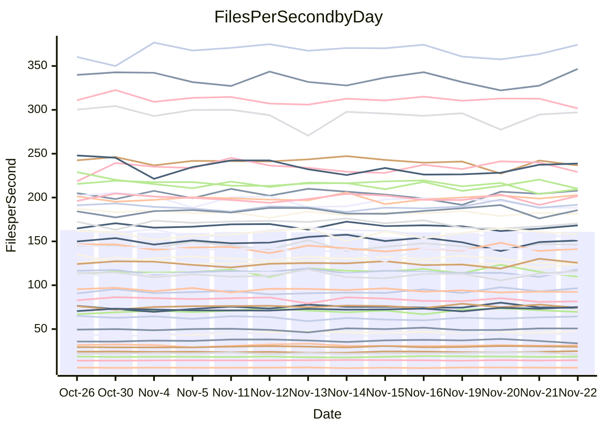

<!---
# This file is auto-generated. Do not edit.
# cspell:disable
--->
# Performance Report

## Daily Performance

## Time to Process Files

| Repository                                      | Elapsed | Min/Avg/Max           |    SD | SD Graph                |
| ----------------------------------------------- | ------: | :-------------------: | ----: | ----------------------- |
| AdaDoom3/AdaDoom3                    |    3.45 | 3.3 /   3.5 /   3.7   |  0.10 | `     ┣━┻━━●━━┻━┫     ` |
| alexiosc/megistos                    |    7.85 | 7.3 /   7.8 /   8.7   |  0.32 | `    ┣━━┻━━●━━┻━━┫    ` |
| apollographql/apollo-server          |    2.62 | 2.6 /   2.8 /   3.2   |  0.12 | `     ┣━●━━╋━━┻━┫     ` |
| aspnetboilerplate/aspnetboilerplate  |   10.88 | 10.3 /  10.7 /  11.8  |  0.35 | `    ┣━━┻━━╋━●┻━━┫    ` |
| aws-amplify/docs                     |   13.70 | 12.4 /  13.3 /  14.8  |  0.53 | `    ┣━━┻━━╋━●┻━━┫    ` |
| Azure/azure-rest-api-specs           |    9.91 | 9.6 /  10.1 /  11.2   |  0.40 | `    ┣━━┻●━╋━━┻━━┫    ` |
| bitjson/typescript-starter           |    1.09 | 1.0 /   1.1 /   1.1   |  0.03 | `     ┣━━┻━●━┻━━┫     ` |
| caddyserver/caddy                    |    3.88 | 3.4 /   3.8 /   4.0   |  0.11 | `     ┣━┻━━╋━━●━┫     ` |
| canada-ca/open-source-logiciel-libre |    1.19 | 1.1 /   1.2 /   1.3   |  0.05 | `     ┣━━┻━╋●┻━━┫     ` |
| chef/chef                            |    5.88 | 5.7 /   6.0 /   6.4   |  0.16 | `    ┣━━┻●━╋━━┻━━┫    ` |
| dart-lang/sdk                        |   68.28 | 63.7 /  67.6 /  72.3  |  2.10 | `   ┣━━┻━━━╋●━━┻━━┫   ` |
| django/django                        |   15.92 | 14.9 /  15.8 /  17.2  |  0.48 | `    ┣━━┻━━╋●━┻━━┫    ` |
| eslint/eslint                        |   10.89 | 10.6 /  11.1 /  11.8  |  0.34 | `    ┣━━┻●━╋━━┻━━┫    ` |
| exonum/exonum                        |    3.84 | 3.4 /   3.7 /   4.0   |  0.13 | `     ┣━┻━━╋━━┻●┫     ` |
| flutter/samples                      |   16.97 | 16.0 /  17.0 /  19.0  |  0.61 | `    ┣━━┻━━●━━┻━━┫    ` |
| gitbucket/gitbucket                  |    3.67 | 3.5 /   3.7 /   3.9   |  0.10 | `     ┣━┻━━●━━┻━┫     ` |
| googleapis/google-cloud-cpp          |  146.53 | 139.9 / 149.9 / 209.7 | 11.94 | `  ┣━━━┻━━●╋━━━┻━━━┫  ` |
| graphql/express-graphql              |    1.24 | 1.1 /   1.2 /   1.3   |  0.05 | `     ┣━━┻━╋━┻━●┫     ` |
| graphql/graphql-js                   |    2.93 | 2.8 /   3.0 /   3.2   |  0.11 | `     ┣━┻━●╋━━┻━┫     ` |
| graphql/graphql-relay-js             |    1.13 | 1.1 /   1.2 /   1.2   |  0.03 | `     ┣━●┻━╋━┻━━┫     ` |
| graphql/graphql-spec                 |    1.31 | 1.3 /   1.3 /   1.4   |  0.03 | `     ┣━━┻●╋━┻━━┫     ` |
| iluwatar/java-design-patterns        |   13.19 | 12.6 /  13.3 /  14.4  |  0.40 | `    ┣━━┻━●╋━━┻━━┫    ` |
| ktaranov/sqlserver-kit               |    6.51 | 6.6 /   6.8 /   7.3   |  0.19 | `    ┣●━┻━━╋━━┻━━┫    ` |
| liriliri/licia                       |    4.15 | 4.1 /   4.3 /   4.6   |  0.12 | `     ┣━●━━╋━━┻━┫     ` |
| MartinThoma/LaTeX-examples           |    6.98 | 6.8 /   7.1 /   7.9   |  0.26 | `    ┣━━┻━●╋━━┻━━┫    ` |
| mdx-js/mdx                           |    2.03 | 1.9 /   2.0 /   2.2   |  0.07 | `     ┣━┻━━╋●━┻━┫     ` |
| microsoft/TypeScript-Website         |    6.03 | 5.5 /   5.8 /   6.5   |  0.19 | `    ┣━━┻━━╋━━●━━┫    ` |
| MicrosoftDocs/PowerShell-Docs        |   23.35 | 22.9 /  24.3 /  26.2  |  0.80 | `    ┣━●┻━━╋━━┻━━┫    ` |
| neovim/nvim-lspconfig                |    4.46 | 4.3 /   4.5 /   4.7   |  0.10 | `     ┣━┻━━●━━┻━┫     ` |
| pagekit/pagekit                      |    3.56 | 3.5 /   3.7 /   4.3   |  0.16 | `     ┣━┻●━╋━━┻━┫     ` |
| php/php-src                          |   27.70 | 25.9 /  27.1 /  29.3  |  0.88 | `   ┣━━━┻━━╋━●┻━━━┫   ` |
| plasticrake/tplink-smarthome-api     |    1.31 | 1.3 /   1.4 /   1.5   |  0.05 | `     ┣━●━━╋━━┻━┫     ` |
| prettier/prettier                    |    8.04 | 7.2 /   7.7 /   8.3   |  0.18 | `    ┣━━┻━━╋━━┻━●┫    ` |
| pycontribs/jira                      |    1.56 | 1.5 /   1.6 /   1.7   |  0.07 | `     ┣━┻━●╋━━┻━┫     ` |
| RustPython/RustPython                |    5.64 | 5.2 /   5.6 /   6.0   |  0.23 | `    ┣━━┻━━╋●━┻━━┫    ` |
| shoelace-style/shoelace              |    3.00 | 2.9 /   3.0 /   3.2   |  0.09 | `     ┣━┻━●╋━━┻━┫     ` |
| slint-ui/slint                       |   13.85 | 13.3 /  13.9 /  15.0  |  0.38 | `    ┣━━┻━━●━━┻━━┫    ` |
| SoftwareBrothers/admin-bro           |    2.62 | 2.5 /   2.6 /   2.8   |  0.06 | `     ┣━┻━●╋━━┻━┫     ` |
| sveltejs/svelte                      |   21.56 | 20.8 /  21.9 /  22.9  |  0.48 | `    ┣━━┻●━╋━━┻━━┫    ` |
| TheAlgorithms/Python                 |    5.91 | 5.6 /   5.8 /   6.2   |  0.13 | `    ┣━━┻━━╋━●┻━━┫    ` |
| twbs/bootstrap                       |    1.83 | 1.8 /   1.9 /   2.4   |  0.11 | `     ┣━┻━●╋━━┻━┫     ` |
| typescript-cheatsheets/react         |    1.57 | 1.3 /   1.4 /   1.6   |  0.06 | `     ┣━┻━━╋━━┻━┫●    ` |
| typescript-eslint/typescript-eslint  |    4.34 | 4.2 /   4.4 /   4.7   |  0.12 | `     ┣━┻━━●━━┻━┫     ` |
| vitest-dev/vitest                    |   10.21 | 9.2 /   9.9 /  10.9   |  0.45 | `    ┣━━┻━━╋━●┻━━┫    ` |
| w3c/aria-practices                   |    3.51 | 3.4 /   3.6 /   3.8   |  0.10 | `     ┣━●━━╋━━┻━┫     ` |
| w3c/specberus                        |    2.13 | 2.0 /   2.1 /   2.2   |  0.06 | `     ┣━┻━━╋━●┻━┫     ` |
| webdeveric/webpack-assets-manifest   |    1.18 | 1.2 /   1.2 /   1.4   |  0.05 | `     ┣━●┻━╋━┻━━┫     ` |
| webpack/webpack                      |    6.07 | 5.5 /   5.8 /   6.7   |  0.23 | `    ┣━━┻━━╋━━●━━┫    ` |
| wireapp/wire-desktop                 |    1.37 | 1.3 /   1.5 /   1.7   |  0.09 | `     ┣━┻●━╋━━┻━┫     ` |
| wireapp/wire-webapp                  |   11.72 | 10.6 /  11.2 /  12.6  |  0.52 | `    ┣━━┻━━╋━━●━━┫    ` |

Note:
- Elapsed time is in seconds.

## Files per Second over Time

| Repository                                      | Files |    Sec |    Fps |    Rel | Trend Fps              |    N |
| ----------------------------------------------- | ----: | -----: | -----: | -----: | ---------------------- | ---: |
| AdaDoom3/AdaDoom3                    |   103 |   3.45 |  29.87 |  0.25% | `▇▇▄▇▆▇▆▅▇█▆▅▆▅▇▅▇▇▆▆` |   29 |
| alexiosc/megistos                    |   583 |   7.85 |  74.23 | -0.41% | `▆▇▆▆▆▄▇▆▅▇▇▆▆▆▆▅█▆▆▆` |   29 |
| apollographql/apollo-server          |   253 |   2.62 |  96.60 |  5.08% | `█▇▆▇▇▃▆▆▇▇▅▇▆▆█▆█▇▇█` |   29 |
| aspnetboilerplate/aspnetboilerplate  |  2286 |  10.88 | 210.10 | -1.97% | `▆▇▆▄██▇▇▅█▅▇▆▆▆▅▇██▆` |   29 |
| aws-amplify/docs                     |  2871 |  13.70 | 209.49 | -2.87% | `█▇▅▆▆▆▆▆▇▇▆▇▆▇▆▅▆▄▅▅` |   29 |
| Azure/azure-rest-api-specs           |  2365 |   9.91 | 238.69 |  1.51% | `▇███▇█▆▅▆▇▇▅▃▇▄▇▆▇▆▇` |   29 |
| bitjson/typescript-starter           |    20 |   1.09 |  18.42 | -0.30% | `▄▅▇▇▇▆▅▄▆▇▆██▆▇█▇▅▆▆` |   29 |
| caddyserver/caddy                    |   288 |   3.88 |  74.20 | -2.83% | `▅▅▅▆▄▆▅▅▅▅▅▄▅▆▆█▅▆▆▄` |   29 |
| canada-ca/open-source-logiciel-libre |     7 |   1.19 |   5.87 | -1.80% | `▆▄▇▆█▅▇▃▆▅▇▄▆▇▇█▇▆▇▆` |   29 |
| chef/chef                            |  1191 |   5.88 | 202.70 |  1.98% | `▆█▆▅▇█▆█▆▇▄▆▇▇█▇▇█▅▇` |   29 |
| dart-lang/sdk                        | 10778 |  68.28 | 157.84 | -0.73% | `▇▇▆▇▇▇█▄▆█▇▅▅▇▇███▆▆` |   29 |
| django/django                        |  2885 |  15.92 | 181.24 | -0.86% | `▆▇▇▆▆▄▇▆▆█▅▆▇▇▇▅▆▇▆▆` |   29 |
| eslint/eslint                        |  2089 |  10.89 | 191.76 |  1.56% | `▅▇▄▅█▆▆▅▆▆▇▆██▅▆█▅▇▇` |   29 |
| exonum/exonum                        |   421 |   3.84 | 109.65 | -4.53% | `▇▇▆▆▄▃▇▆▆▆▆▇▄▆▅▆█▆▆▄` |   29 |
| flutter/samples                      |  2400 |  16.97 | 141.46 | -0.19% | `██▆▇▃▆▇▇▅▇▆▇█▅▅▆█▇▆▇` |   29 |
| gitbucket/gitbucket                  |   413 |   3.67 | 112.52 | -0.50% | `▆█▆█▆▇▇▆▅▇█▇▆▄▇▇▅▆▆▆` |   29 |
| googleapis/google-cloud-cpp          | 20955 | 146.53 | 143.01 |  1.94% | `▇██▇██▇▇▂█▇█▇▇█▇██▇█` |   29 |
| graphql/express-graphql              |    26 |   1.24 |  20.89 | -6.90% | `▅█▆▃▄▅▆▅▄▅▇▅▃▇▅▇▇▇▆▃` |   29 |
| graphql/graphql-js                   |   368 |   2.93 | 125.59 |  0.90% | `▅▄▇▇▇▄▆▆▇▇▇▆▇▄▇▆▅▇█▇` |   29 |
| graphql/graphql-relay-js             |    28 |   1.13 |  24.82 |  3.69% | `▆▆▆▇▇▆▅▅▇██▇▅▄█▇▆▆▇█` |   29 |
| graphql/graphql-spec                 |    19 |   1.31 |  14.45 |  1.43% | `▇▆▇█▅▆▇██▇█▇▅▅▇▆█▆▇▇` |   29 |
| iluwatar/java-design-patterns        |  1992 |  13.19 | 150.99 |  0.86% | `▅▆▆▅▆▇██▇▇▆▇▇▇▆▆▄▆▇▇` |   29 |
| ktaranov/sqlserver-kit               |   489 |   6.51 |  75.08 |  4.75% | `▇▅▆█▆▅▇▇▇▆▇▇█▆▄▅█▇██` |   29 |
| liriliri/licia                       |  1437 |   4.15 | 346.68 |  3.62% | `▄█▆▇██▆▆▆▇██▅▇▇▆▅▆▆█` |   29 |
| MartinThoma/LaTeX-examples           |  1409 |   6.98 | 201.76 |  1.78% | `▇▆▆█▆▃▇█▇▇█▆▇▇▆▅▇▇▄▇` |   29 |
| mdx-js/mdx                           |   141 |   2.03 |  69.59 | -1.49% | `▇▇▆███▇▆▇▅█▅▆▇█▇██▆▆` |   29 |
| microsoft/TypeScript-Website         |   761 |   6.03 | 126.17 | -3.82% | `▆▆▇█▃▇▇▆▇▇▇▆▇▇▇█▆▄▆▅` |   29 |
| MicrosoftDocs/PowerShell-Docs        |  2708 |  23.35 | 116.00 |  4.04% | `▅▅▆█▆▄█▅▅▄▅▇▆▆▇▆▄▆▇█` |   29 |
| neovim/nvim-lspconfig                |   760 |   4.46 | 170.48 | -0.03% | `▇▇█▇▇█▇█▆▇▇█▆▅▅▆▅▆▆▇` |   29 |
| pagekit/pagekit                      |   741 |   3.56 | 207.89 |  2.74% | `█▇█▇▇▆█▇▇▇▆▆▃▇▆▅▇█▆▇` |   29 |
| php/php-src                          |  2262 |  27.70 |  81.65 | -2.64% | `▇▇▇██▇▅███▅▆▄▆▆▇▇▆▅▆` |   29 |
| plasticrake/tplink-smarthome-api     |    62 |   1.31 |  47.28 |  5.16% | `▆█▆▇▇▇█▇▇▅▇█▅▆▇▆▇▆▇█` |   29 |
| prettier/prettier                    |  2426 |   8.04 | 301.64 | -3.24% | `▇███▄▇▆▇▇█▇██▇▇▇▇█▇▆` |   29 |
| pycontribs/jira                      |    79 |   1.56 |  50.68 |  2.20% | `▆▇▅▅▅▇▄▇▇▆▅▇▄▆█▃▅▆▇▆` |   29 |
| RustPython/RustPython                |   703 |   5.64 | 124.69 | -0.49% | `█▇▄▆▇▇▇█▇▇▇▇▅▆▇▇▆▅▅▆` |   29 |
| shoelace-style/shoelace              |   439 |   3.00 | 146.20 |  0.87% | `▇▆▆▄▆▆█▅▆▅▇▇▇▆▇▄▅▇▇▇` |   29 |
| slint-ui/slint                       |  2570 |  13.85 | 185.59 |  0.61% | `▇▆▇█▇▇▇▆▅▆▇▇▇▆█▇█▄▆▇` |   29 |
| SoftwareBrothers/admin-bro           |   441 |   2.62 | 168.25 |  0.68% | `█▆▇▇▇▇▆█▇▆▆▇▇▇▆▆▅█▄▇` |   29 |
| sveltejs/svelte                      |  8068 |  21.56 | 374.17 |  1.96% | `▆▇█▇▇▇▆▇▆▆█▇▆▆▆▅▅▆▆▇` |   29 |
| TheAlgorithms/Python                 |  1399 |   5.91 | 236.63 | -1.93% | `▇▆█▅██▇█▇▆█▆▆▆▇▇▄▇▇▆` |   29 |
| twbs/bootstrap                       |   118 |   1.83 |  64.41 |  2.43% | `██▇▇█▇▅▇██▂▆▅▇██▆▆█▇` |   29 |
| typescript-cheatsheets/react         |    53 |   1.57 |  33.66 | -9.00% | `▇▆▇▆▇█▆▄▆▆▆▆▄▆▆▇▇▅▆▃` |   29 |
| typescript-eslint/typescript-eslint  |  1290 |   4.34 | 297.12 |  0.52% | `▇█▇▆▆█▄▇▇▆▇▆▇▇▇▇▅▆▇▇` |   29 |
| vitest-dev/vitest                    |  2338 |  10.21 | 229.09 | -2.03% | `█▇█▆▆▇▆▆▄▅▇▇▇▆▄▇▇▇▇▆` |   29 |
| w3c/aria-practices                   |   414 |   3.51 | 117.94 |  2.68% | `▇█▅▇▇▅█▆█▆▆▆▇█▄▆▆▅▄▇` |   29 |
| w3c/specberus                        |   197 |   2.13 |  92.33 | -2.49% | `▅▇▅▇▇█▇▇█▇▇▆█▇▅▇▆▄█▆` |   29 |
| webdeveric/webpack-assets-manifest   |    55 |   1.18 |  46.42 |  5.33% | `▇▆█▅▆▇▅▃█▅▄▅▆▄▅▆▆▄▅▇` |   29 |
| webpack/webpack                      |  1143 |   6.07 | 188.29 | -4.39% | `▆█▇▇█▇▆▆▇▇▇▇▆▇▇▇▇▆▅▅` |   29 |
| wireapp/wire-desktop                 |    43 |   1.37 |  31.36 |  0.83% | `▆▆▆▇█▇█▆▅█▅▆▇▇▄▇▇▇▆▇` |   29 |
| wireapp/wire-webapp                  |  1783 |  11.72 | 152.13 | -4.48% | `▇▄▇█▅██▇▇▇█▆▇▇▃▅▇▆▇▅` |   29 |

## Data Throughput

| Repository                                      | Files |    Sec |     Kps |     Rel | Trend Kps              |    N |
| ----------------------------------------------- | ----: | -----: | ------: | ------: | ---------------------- | ---: |
| AdaDoom3/AdaDoom3                    |   103 |   3.45 |  634.73 |   0.25% | `▇▇▄▇▆▇▆▅▇█▆▅▆▅▇▅▇▇▆▆` |   29 |
| alexiosc/megistos                    |   583 |   7.85 |  583.31 |  -0.41% | `▆▇▆▆▆▄▇▆▅▇▇▆▆▆▆▅█▆▆▆` |   29 |
| apollographql/apollo-server          |   253 |   2.62 |  789.22 |   5.26% | `█▇▆▇▇▃▆▆▇▇▅▇▆▆█▆█▇▇█` |   29 |
| aspnetboilerplate/aspnetboilerplate  |  2286 |  10.88 |  511.19 |  -1.97% | `▆▇▆▄██▇▇▅█▅▇▆▆▆▅▇██▆` |   29 |
| aws-amplify/docs                     |  2871 |  13.70 |  731.14 |  -2.89% | `█▇▅▆▆▆▆▆▇▇▆▇▆▇▆▅▆▄▅▅` |   29 |
| Azure/azure-rest-api-specs           |  2365 |   9.91 |  649.45 |   1.82% | `▇███▇█▆▅▆▇▇▅▃▇▄▇▆▇▇▇` |   29 |
| bitjson/typescript-starter           |    20 |   1.09 |   73.69 |  -0.30% | `▄▅▇▇▇▆▅▄▆▇▆██▆▇█▇▅▆▆` |   29 |
| caddyserver/caddy                    |   288 |   3.88 |  644.36 |  -2.74% | `▅▅▅▆▄▆▅▅▅▅▅▄▅▆▆█▅▆▆▄` |   29 |
| canada-ca/open-source-logiciel-libre |     7 |   1.19 |   48.67 |  -1.80% | `▆▄▇▆█▅▇▃▆▅▇▄▆▇▇█▇▆▇▆` |   29 |
| chef/chef                            |  1191 |   5.88 |  941.17 |   2.14% | `▆█▆▅▇█▆█▆▇▄▆▇▇█▇▇█▅▇` |   29 |
| dart-lang/sdk                        | 10778 |  68.28 | 1079.07 |  -0.55% | `▇▇▆▇▇▇█▅▆█▇▅▅▇▇███▆▆` |   29 |
| django/django                        |  2885 |  15.92 | 1137.89 |  -0.89% | `▆▇▇▆▆▄▇▆▆█▅▆▇▇▇▅▆▇▆▆` |   29 |
| eslint/eslint                        |  2089 |  10.89 | 1301.27 |  -2.71% | `▅▇▅▆█▇▇▆▆▆▇▇▆▆▃▅▆▄▆▅` |   29 |
| exonum/exonum                        |   421 |   3.84 | 1048.87 |  -4.53% | `▇▇▆▆▄▃▇▆▆▆▆▇▄▆▅▆█▆▆▄` |   29 |
| flutter/samples                      |  2400 |  16.97 | 1262.33 |  -0.19% | `██▆▇▃▆▇▇▅▇▆▇█▅▅▆█▇▆▇` |   29 |
| gitbucket/gitbucket                  |   413 |   3.67 |  511.39 |  -0.50% | `▆█▆█▆▇▇▆▅▇█▇▆▄▇▇▅▆▆▆` |   29 |
| googleapis/google-cloud-cpp          | 20955 | 146.53 | 1165.08 |   2.10% | `▇██▇██▇▇▂█▇█▇▇█▇██▇█` |   29 |
| graphql/express-graphql              |    26 |   1.24 |   95.61 |  -6.90% | `▅█▆▃▄▅▆▅▄▅▇▅▃▇▅▇▇▇▆▃` |   29 |
| graphql/graphql-js                   |   368 |   2.93 |  728.96 |   0.96% | `▅▄▇▇▇▄▆▆▇▇▇▆▇▄▇▆▅▇█▇` |   29 |
| graphql/graphql-relay-js             |    28 |   1.13 |   97.52 |   3.69% | `▆▆▆▇▇▆▅▅▇██▇▅▄█▇▆▆▇█` |   29 |
| graphql/graphql-spec                 |    19 |   1.31 |  482.18 |   1.43% | `▇▆▇█▅▆▇██▇█▇▅▅▇▆█▆▇▇` |   29 |
| iluwatar/java-design-patterns        |  1992 |  13.19 |  466.68 |   0.86% | `▅▆▆▅▆▇██▇▇▆▇▇▇▆▆▄▆▇▇` |   29 |
| ktaranov/sqlserver-kit               |   489 |   6.51 | 1136.96 |   4.76% | `▇▅▆█▆▅▇▇▇▆▇▇█▆▄▅█▇██` |   29 |
| liriliri/licia                       |  1437 |   4.15 |  413.03 |   3.62% | `▄█▆▇██▆▆▆▇██▅▇▇▆▅▆▆█` |   29 |
| MartinThoma/LaTeX-examples           |  1409 |   6.98 |  416.69 |   1.78% | `▇▆▆█▆▃▇█▇▇█▆▇▇▆▅▇▇▄▇` |   29 |
| mdx-js/mdx                           |   141 |   2.03 |  323.78 |  -1.49% | `▇▇▆███▇▆▇▅█▅▆▇█▇██▆▆` |   29 |
| microsoft/TypeScript-Website         |   761 |   6.03 |  872.78 |  -3.81% | `▆▆▇█▃▇▇▆▇▇▇▆▇▇▇█▆▄▆▅` |   29 |
| MicrosoftDocs/PowerShell-Docs        |  2708 |  23.35 | 1194.47 |   4.06% | `▅▅▆█▆▄█▅▅▄▅▇▆▆▇▆▄▆▇█` |   29 |
| neovim/nvim-lspconfig                |   760 |   4.46 |  316.51 |   8.17% | `▅▅▆▅▅▆▅▆▄▅▅▅█▇▇▇▇▇▇█` |   29 |
| pagekit/pagekit                      |   741 |   3.56 |  433.45 |   2.74% | `█▇█▇▇▆█▇▇▇▆▆▃▇▆▅▇█▆▇` |   29 |
| php/php-src                          |  2262 |  27.70 | 1431.44 |  -2.50% | `▇▇▇██▇▅███▅▆▄▆▆▇▇▆▅▆` |   29 |
| plasticrake/tplink-smarthome-api     |    62 |   1.31 |  255.49 |   5.16% | `▆█▆▇▇▇█▇▇▅▇█▅▆▇▆▇▆▇█` |   29 |
| prettier/prettier                    |  2426 |   8.04 |  418.26 |  -3.46% | `▇███▄▇▆▇▇█▇██▇▇▆▇█▇▆` |   29 |
| pycontribs/jira                      |    79 |   1.56 |  359.28 |   2.20% | `▆▇▅▅▅▇▄▇▇▆▅▇▄▆█▃▅▆▇▆` |   29 |
| RustPython/RustPython                |   703 |   5.64 | 1273.13 |  16.60% | `▅▄▃▃▄▄▄▅▄▄▄▄▇████▇▇█` |   29 |
| shoelace-style/shoelace              |   439 |   3.00 |  706.38 |   0.87% | `▇▆▆▄▆▆█▅▆▅▇▇▇▆▇▄▅▇▇▇` |   29 |
| slint-ui/slint                       |  2570 |  13.85 | 1149.15 |   0.96% | `▆▆▇█▇▇▇▆▅▆▇▇▇▆█▇█▄▆▇` |   29 |
| SoftwareBrothers/admin-bro           |   441 |   2.62 |  370.84 |   0.68% | `█▆▇▇▇▇▆█▇▆▆▇▇▇▆▆▅█▄▇` |   29 |
| sveltejs/svelte                      |  8068 |  21.56 |  249.51 |   1.91% | `▆▇█▇▇▇▆▇▆▆█▇▆▆▆▅▅▆▆▇` |   29 |
| TheAlgorithms/Python                 |  1399 |   5.91 |  601.80 |  -1.93% | `▇▆█▅██▇█▇▆█▆▆▆▇▇▄▇▇▆` |   29 |
| twbs/bootstrap                       |   118 |   1.83 |  528.92 |   2.46% | `██▇▇█▇▅▇██▂▆▅▇██▆▆█▇` |   29 |
| typescript-cheatsheets/react         |    53 |   1.57 |  248.95 |  -9.00% | `▇▆▇▆▇█▆▄▆▆▆▆▄▆▆▇▇▅▆▃` |   29 |
| typescript-eslint/typescript-eslint  |  1290 |   4.34 | 1534.20 |   0.74% | `▇█▇▆▆█▄▇▇▆▇▆▇▇▇▇▅▆█▇` |   29 |
| vitest-dev/vitest                    |  2338 |  10.21 |  492.18 |  -3.25% | `█▆█▆▅▇▆▅▃▅▇▆▇▅▃▇▇▇▇▅` |   29 |
| w3c/aria-practices                   |   414 |   3.51 | 1099.65 |   2.68% | `▇█▅▇▇▅█▆█▆▆▆▇█▄▆▆▅▄▇` |   29 |
| w3c/specberus                        |   197 |   2.13 |  291.97 |  -2.49% | `▅▇▅▇▇█▇▇█▇▇▆█▇▅▇▆▄█▆` |   29 |
| webdeveric/webpack-assets-manifest   |    55 |   1.18 |  107.19 |   5.33% | `▇▆█▅▆▇▅▃█▅▄▅▆▄▅▆▆▄▅▇` |   29 |
| webpack/webpack                      |  1143 |   6.07 |  859.90 |  -4.13% | `▆█▇▇█▇▆▆▇▇▇▇▆▇▇▇▇▆▅▅` |   29 |
| wireapp/wire-desktop                 |    43 |   1.37 |  138.58 | -16.02% | `▇▆▇██▇█▇▆█▆▇▃▄▂▃▃▃▃▃` |   29 |
| wireapp/wire-webapp                  |  1783 |  11.72 |  563.30 |  -4.34% | `▇▄▇█▅██▇▇▇█▆▇▇▃▅▇▆▇▅` |   29 |

