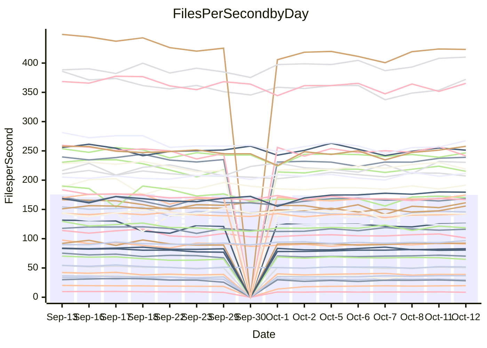

<!---
# This file is auto-generated. Do not edit.
# cspell:disable
--->
# Performance Report

## Daily Performance

## Time to Process Files

| Repository                                      | Elapsed | Min/Avg/Max           |   SD | SD Graph                |
| ----------------------------------------------- | ------: | :-------------------: | ---: | ----------------------- |
| AdaDoom3/AdaDoom3                    |    2.80 | 2.8 /   2.9 /   3.1   | 0.09 | `    ┣━━●━━╋━━┻━━┫    ` |
| alexiosc/megistos                    |    7.10 | 6.6 /   7.3 /   7.7   | 0.24 | `    ┣━━┻●━╋━━┻━━┫    ` |
| apollographql/apollo-server          |    2.18 | 2.1 /   2.2 /   2.4   | 0.08 | `     ┣━┻━━╋●━┻━┫     ` |
| aspnetboilerplate/aspnetboilerplate  |   11.58 | 10.5 /  10.9 /  12.0  | 0.33 | `    ┣━━┻━━╋━━┻━━●    ` |
| aws-amplify/docs                     |   11.07 | 10.8 /  11.4 /  12.6  | 0.36 | `    ┣━━●━━╋━━┻━━┫    ` |
| Azure/azure-rest-api-specs           |   14.50 | 13.0 /  14.2 /  15.6  | 0.59 | `   ┣━━━┻━━╋━●┻━━━┫   ` |
| bitjson/typescript-starter           |    0.63 | 0.6 /   0.6 /   0.7   | 0.03 | `     ┣━━┻●╋━┻━━┫     ` |
| caddyserver/caddy                    |    3.14 | 2.8 /   3.1 /   3.5   | 0.14 | `    ┣━━┻━━╋━●┻━━┫    ` |
| canada-ca/open-source-logiciel-libre |    0.83 | 0.7 /   0.8 /   0.9   | 0.05 | `     ┣━┻━━╋━━●━┫     ` |
| chef/chef                            |    5.14 | 5.0 /   5.4 /   6.0   | 0.23 | `    ┣━●┻━━╋━━┻━━┫    ` |
| dart-lang/sdk                        |   53.91 | 54.0 /  57.0 /  70.4  | 3.19 | `  ┣━━━●━━━╋━━━┻━━━┫  ` |
| django/django                        |   13.20 | 12.9 /  13.5 /  14.3  | 0.30 | `    ┣━●┻━━╋━━┻━━┫    ` |
| eslint/eslint                        |   10.26 | 9.1 /   9.5 /  10.1   | 0.25 | `    ┣━━┻━━╋━━┻━━┫  ● ` |
| exonum/exonum                        |    2.93 | 2.9 /   3.0 /   3.7   | 0.15 | `    ┣━━┻●━╋━━┻━━┫    ` |
| flutter/samples                      |   17.08 | 13.7 /  16.0 /  18.4  | 1.47 | `   ┣━━━┻━━╋━●┻━━━┫   ` |
| gitbucket/gitbucket                  |    2.90 | 2.9 /   3.0 /   3.3   | 0.10 | `    ┣━━●━━╋━━┻━━┫    ` |
| googleapis/google-cloud-cpp          |  137.47 | 129.1 / 136.6 / 149.4 | 4.45 | `  ┣━━━┻━━━╋●━━┻━━━┫  ` |
| graphql/express-graphql              |    0.69 | 0.6 /   0.7 /   0.8   | 0.04 | `     ┣━┻━━●━━┻━┫     ` |
| graphql/graphql-js                   |    2.07 | 1.9 /   2.1 /   2.4   | 0.10 | `     ┣━┻━●╋━━┻━┫     ` |
| graphql/graphql-relay-js             |    0.71 | 0.6 /   0.7 /   0.8   | 0.03 | `     ┣━┻━━●━━┻━┫     ` |
| graphql/graphql-spec                 |    0.76 | 0.7 /   0.8 /   1.1   | 0.06 | `     ┣━┻●━╋━━┻━┫     ` |
| iluwatar/java-design-patterns        |   10.68 | 10.3 /  10.9 /  12.5  | 0.40 | `    ┣━━┻●━╋━━┻━━┫    ` |
| ktaranov/sqlserver-kit               |    5.71 | 5.7 /   5.9 /   6.4   | 0.18 | `    ┣━●┻━━╋━━┻━━┫    ` |
| liriliri/licia                       |    3.37 | 3.1 /   3.3 /   3.5   | 0.11 | `    ┣━━┻━━╋●━┻━━┫    ` |
| MartinThoma/LaTeX-examples           |    6.41 | 5.9 /   6.3 /   7.0   | 0.24 | `    ┣━━┻━━╋●━┻━━┫    ` |
| mdx-js/mdx                           |    1.56 | 1.4 /   1.6 /   1.8   | 0.06 | `     ┣━┻━━●━━┻━┫     ` |
| microsoft/TypeScript-Website         |    4.76 | 4.7 /   5.1 /   5.5   | 0.19 | `    ┣●━┻━━╋━━┻━━┫    ` |
| MicrosoftDocs/PowerShell-Docs        |   22.07 | 20.6 /  22.5 /  24.1  | 0.84 | `   ┣━━━┻●━╋━━┻━━━┫   ` |
| neovim/nvim-lspconfig                |    2.82 | 2.6 /   2.8 /   3.0   | 0.12 | `    ┣━━┻━━●━━┻━━┫    ` |
| pagekit/pagekit                      |    3.08 | 3.0 /   3.2 /   3.5   | 0.09 | `    ┣━━●━━╋━━┻━━┫    ` |
| php/php-src                          |   23.48 | 22.3 /  23.9 /  25.2  | 0.68 | `   ┣━━━┻●━╋━━┻━━━┫   ` |
| plasticrake/tplink-smarthome-api     |    0.88 | 0.8 /   0.9 /   0.9   | 0.03 | `     ┣━┻━━╋●━┻━┫     ` |
| prettier/prettier                    |    6.03 | 5.7 /   6.1 /   7.0   | 0.23 | `    ┣━━┻━━●━━┻━━┫    ` |
| pycontribs/jira                      |    1.17 | 1.1 /   1.2 /   1.3   | 0.05 | `     ┣━┻━●╋━━┻━┫     ` |
| RustPython/RustPython                |    4.48 | 4.1 /   4.4 /   4.9   | 0.15 | `    ┣━━┻━━╋●━┻━━┫    ` |
| shoelace-style/shoelace              |    2.30 | 2.1 /   2.3 /   2.5   | 0.10 | `    ┣━━┻━━●━━┻━━┫    ` |
| SoftwareBrothers/admin-bro           |    1.93 | 1.8 /   2.0 /   2.2   | 0.09 | `     ┣━┻●━╋━━┻━┫     ` |
| sveltejs/svelte                      |   18.10 | 18.1 /  18.9 /  20.3  | 0.50 | `   ┣━●━┻━━╋━━┻━━━┫   ` |
| TheAlgorithms/Python                 |    5.00 | 4.7 /   5.2 /   6.2   | 0.28 | `    ┣━━┻●━╋━━┻━━┫    ` |
| twbs/bootstrap                       |    1.09 | 1.0 /   1.1 /   1.3   | 0.05 | `     ┣━┻━●╋━━┻━┫     ` |
| typescript-cheatsheets/react         |    1.05 | 1.0 /   1.0 /   1.2   | 0.04 | `     ┣━┻━━╋●━┻━┫     ` |
| typescript-eslint/typescript-eslint  |    3.36 | 3.2 /   3.5 /   3.7   | 0.13 | `    ┣━━┻●━╋━━┻━━┫    ` |
| vitest-dev/vitest                    |    6.88 | 6.7 /   7.1 /   7.5   | 0.21 | `    ┣━━●━━╋━━┻━━┫    ` |
| w3c/aria-practices                   |    2.71 | 2.6 /   2.8 /   3.0   | 0.11 | `    ┣━━┻●━╋━━┻━━┫    ` |
| w3c/specberus                        |    1.58 | 1.5 /   1.6 /   2.1   | 0.11 | `     ┣━┻━●╋━━┻━┫     ` |
| webdeveric/webpack-assets-manifest   |    0.63 | 0.6 /   0.7 /   0.8   | 0.05 | `     ┣━┻●━╋━━┻━┫     ` |
| webpack/webpack                      |    4.42 | 4.2 /   4.5 /   4.8   | 0.17 | `    ┣━━┻━━●━━┻━━┫    ` |
| wireapp/wire-desktop                 |    0.82 | 0.8 /   0.8 /   0.9   | 0.03 | `     ┣━┻━●╋━━┻━┫     ` |
| wireapp/wire-webapp                  |    7.32 | 6.9 /   7.4 /   8.0   | 0.27 | `    ┣━━┻━●╋━━┻━━┫    ` |

Note:
- Elapsed time is in seconds.

## Files per Second over Time

| Repository                                      | Files |    Sec |    Fps |    Rel | Trend Fps              |    N |
| ----------------------------------------------- | ----: | -----: | -----: | -----: | ---------------------- | ---: |
| AdaDoom3/AdaDoom3                    |   103 |   2.80 |  36.74 |  3.52% | `▆▆▇▅▆▅▆▇▅▅██▇▇███▇██` |   29 |
| alexiosc/megistos                    |   583 |   7.10 |  82.11 |  2.31% | `▄▅▆▆▄▆▆▅▆▇▅▆▅█▆▅▆█▆▇` |   29 |
| apollographql/apollo-server          |   250 |   2.18 | 114.44 | -1.52% | `▇▆▄█▆█▇▇▆█▅█▇▇▇█▄▇█▇` |   31 |
| aspnetboilerplate/aspnetboilerplate  |  2739 |  11.58 | 236.58 | -5.72% | `▆█▆▇▄▇▇█▆▆▇▇▆▇█▇██▆▅` |   30 |
| aws-amplify/docs                     |  2832 |  11.07 | 255.93 |  2.76% | `▆▃▇▆▆▆▆▇█▆▇▅▇▆▇█▇▇██` |   31 |
| Azure/azure-rest-api-specs           |  2429 |  14.50 | 167.46 | -2.06% | `▆▇█▄▅▆█▇▆▆▆▆▇▄█▆▅▆▆▆` |   31 |
| bitjson/typescript-starter           |    20 |   0.63 |  31.56 |  1.61% | `▇█▇███▇▅█▆▅█▇█▇███▄█` |   29 |
| caddyserver/caddy                    |   277 |   3.14 |  88.30 | -2.52% | `▆▆▇▆▇▆▆▄▆▆█▇▆▇▆████▆` |   31 |
| canada-ca/open-source-logiciel-libre |     7 |   0.83 |   8.45 | -7.60% | `▄▆▇▃▇██▆▄▆▇▆▇▅█▆▇█▅▅` |   29 |
| chef/chef                            |  1201 |   5.14 | 233.55 |  5.67% | `▆▇▇▆▄▆▅▅▄▆▄▆▃▆▇▇█▆▆▇` |   31 |
| dart-lang/sdk                        |  9757 |  53.91 | 180.99 |  5.74% | `▇▅▅▇▇█▇▆▇▇▇██▇██████` |   31 |
| django/django                        |  2792 |  13.20 | 211.59 |  2.60% | `▅▇▇▆▇▇▇▇▆▅▆▅█▇▆▆▇▇▇▇` |   31 |
| eslint/eslint                        |  2016 |  10.26 | 196.49 | -6.76% | `▆▅▇▅▆▇▇▇▇▇▆▆▇▇███▄█▄` |   31 |
| exonum/exonum                        |   421 |   2.93 | 143.62 |  3.26% | `▇▇▇█▇▇▇▇▆█▇██▇██████` |   29 |
| flutter/samples                      |  2850 |  17.08 | 166.88 | -3.36% | `▆▆▇▆▇▇▆▆▆▇▇▅█▆█▇▇▆▇▆` |   31 |
| gitbucket/gitbucket                  |   411 |   2.90 | 141.83 |  3.97% | `▅▄▅▅▆▆▇█▆▄▇▆█▇▆▆█▇▇█` |   31 |
| googleapis/google-cloud-cpp          | 19680 | 137.47 | 143.16 | -0.74% | `▆▇█▇▇▆▇▆▇▇█▃▆▆▆▆▆▅▆▆` |   31 |
| graphql/express-graphql              |    26 |   0.69 |  37.59 |  0.69% | `▇▇▇▇███▇▆▇▇▃▇▇██▅█▇█` |   29 |
| graphql/graphql-js                   |   333 |   2.07 | 160.87 |  2.40% | `█▇▆█▆▆▆▄█▇▇▄▇▆▃▇▆███` |   31 |
| graphql/graphql-relay-js             |    28 |   0.71 |  39.71 |  0.31% | `▇██▇▃▇█▆▇▇██▆▅▆▇▇▇▆▇` |   29 |
| graphql/graphql-spec                 |    15 |   0.76 |  19.87 |  5.01% | `▇▂▇▇▅▇▆█▇█▆█▇▇██▇███` |   29 |
| iluwatar/java-design-patterns        |  1838 |  10.68 | 172.15 |  1.96% | `▇▇▆▇▆▅▆▇▆▇▇▇▇▆▆▇▆▇█▇` |   29 |
| ktaranov/sqlserver-kit               |   489 |   5.71 |  85.69 |  3.91% | `▇▇▇▇▅▄▇▇▇▇██▇▅▇█▅▇▆█` |   29 |
| liriliri/licia                       |  1421 |   3.37 | 421.70 | -0.73% | `█▆▇▇▇▇▇█▆█▆▅▇▇███▇█▇` |   29 |
| MartinThoma/LaTeX-examples           |  1407 |   6.41 | 219.49 | -1.99% | `▆▆▃█▇▆▅▇▆▇▇▆█▆█▇█▇▆▆` |   29 |
| mdx-js/mdx                           |   144 |   1.56 |  92.14 |  0.40% | `▆▆▇▆▇▆▆▇▆▅▆▆▇▆▇█▆▅▇▇` |   30 |
| microsoft/TypeScript-Website         |   758 |   4.76 | 159.25 |  6.00% | `▅▆▇▇▄▆█▆▅▄▇▆▆▄▄▆▆▇▇█` |   31 |
| MicrosoftDocs/PowerShell-Docs        |  2692 |  22.07 | 121.97 |  1.70% | `▄▆▆▅▆▅█▆▅▇▆█▄▅▆█▇▇▅▇` |   31 |
| neovim/nvim-lspconfig                |   361 |   2.82 | 128.06 |  0.94% | `▆▆▇▆▆█▅▇▇▅▇▇▆█▆▇▄█▆█` |   31 |
| pagekit/pagekit                      |   741 |   3.08 | 240.48 |  2.94% | `▇▆▇▆▆▇▇▅▅▆▄▆▆▆▇▇▇█▇█` |   29 |
| php/php-src                          |  2211 |  23.48 |  94.17 |  1.76% | `▄▆▆▇▆▄▇▅▆▅▇▅▇▅▅▄▇▇█▆` |   31 |
| plasticrake/tplink-smarthome-api     |    62 |   0.88 |  70.26 | -0.96% | `▅▇▆▅▇▆▇▇▆▆▆▇▆██▇██▇▇` |   29 |
| prettier/prettier                    |  2197 |   6.03 | 364.53 |  0.63% | `▇▆█▇▆▇▇▇█▇█▆█▇█▇▃▇█▇` |   30 |
| pycontribs/jira                      |    80 |   1.17 |  68.43 |  1.79% | `▆█▇▅████▇▆█▇▇██▇▆▇▄▇` |   29 |
| RustPython/RustPython                |   621 |   4.48 | 138.58 | -1.83% | `▆▇█▇▃▆█▇▇▇█▆█▆█▇▇▆█▆` |   31 |
| shoelace-style/shoelace              |   437 |   2.30 | 189.98 |  0.48% | `▇▆▄▆▇▆▇▆▆▇▆▆█▆▇▄▆▇█▇` |   31 |
| SoftwareBrothers/admin-bro           |   441 |   1.93 | 229.07 |  3.85% | `▆▆▇▄▅▅▆▇▇▅▇▆▆▇▇▆█▇▄█` |   29 |
| sveltejs/svelte                      |  7490 |  18.10 | 413.82 |  4.79% | `▅▇█▅▇▆▇▇▇▇█▆▆▇█▇▇▇▇█` |   31 |
| TheAlgorithms/Python                 |  1355 |   5.00 | 270.90 |  3.28% | `▇▆▅█▇▇██▇▆▇▅▆▆▇▃██▇█` |   31 |
| twbs/bootstrap                       |   120 |   1.09 | 109.60 |  2.21% | `▆▆▇▆▇▇▇▆▆▆▇▆▇▇█▇▆█▃█` |   31 |
| typescript-cheatsheets/react         |    53 |   1.05 |  50.63 | -0.98% | `▇▇▇█▃██▇▇▆▇▆▆▇██▆█▇▇` |   29 |
| typescript-eslint/typescript-eslint  |  1248 |   3.36 | 371.75 |  3.04% | `▅▇▆▇▆▇▆▇█▇▆▄▆▅█▆▅▅██` |   31 |
| vitest-dev/vitest                    |  1800 |   6.88 | 261.54 |  3.30% | `▆▄▆▆▄▆█▇▅▆▅▄▅▆▆▆▇▅▄▇` |   31 |
| w3c/aria-practices                   |   403 |   2.71 | 148.87 |  2.21% | `▇▇█▇▇█▄▆▆▅▆▄▆▇█▇▇▇▆█` |   31 |
| w3c/specberus                        |   200 |   1.58 | 126.50 |  1.82% | `▇███▆▇▇██▇▇▇▇▆██▇▇██` |   30 |
| webdeveric/webpack-assets-manifest   |    19 |   0.63 |  30.26 |  4.45% | `▄█▃▇▆▆▇▇█▆▂▇▇▇▇▇██▄█` |   29 |
| webpack/webpack                      |  1086 |   4.42 | 245.52 |  0.47% | `▆▄█▄▇▇▅█▆▆▇▆▆▇█▅▆▅▇▇` |   31 |
| wireapp/wire-desktop                 |    43 |   0.82 |  52.56 |  1.70% | `▆▆▇▄▆▇█▇▇▆▇▇▅▅▇▇██▆█` |   31 |
| wireapp/wire-webapp                  |  1227 |   7.32 | 167.53 |  1.30% | `▅▄▅▅▆▇▇▅▆█▅▆▆▆▇▅▄▇▆▆` |   31 |

## Data Throughput

| Repository                                      | Files |    Sec |     Kps |    Rel | Trend Kps              |    N |
| ----------------------------------------------- | ----: | -----: | ------: | -----: | ---------------------- | ---: |
| AdaDoom3/AdaDoom3                    |   103 |   2.80 |  780.80 |  3.52% | `▆▆▇▅▆▅▆▇▅▅██▇▇███▇██` |   29 |
| alexiosc/megistos                    |   583 |   7.10 |  645.19 |  2.31% | `▄▅▆▆▄▆▆▅▆▇▅▆▅█▆▅▆█▆▇` |   29 |
| apollographql/apollo-server          |   250 |   2.18 |  906.84 | -1.52% | `▇▆▄█▆█▇▇▆█▅█▇▇▇█▄▇█▇` |   31 |
| aspnetboilerplate/aspnetboilerplate  |  2739 |  11.58 |  550.03 | -6.39% | `▆█▆▇▄▇▇█▆▆▇▇▆▇█▇██▆▅` |   30 |
| aws-amplify/docs                     |  2832 |  11.07 |  854.46 |  2.93% | `▆▃▇▆▆▆▆▇█▆▇▅▇▆▇█▇▇██` |   31 |
| Azure/azure-rest-api-specs           |  2429 |  14.50 |  478.61 | -1.95% | `▆▇█▄▅▆█▇▆▆▆▆█▄█▆▅▆▆▆` |   31 |
| bitjson/typescript-starter           |    20 |   0.63 |  126.25 |  1.61% | `▇█▇███▇▅█▆▅█▇█▇███▄█` |   29 |
| caddyserver/caddy                    |   277 |   3.14 |  729.68 | -1.42% | `▅▆▇▆▇▆▆▄▆▆▇▇▆▇▆████▆` |   31 |
| canada-ca/open-source-logiciel-libre |     7 |   0.83 |   70.03 | -7.60% | `▄▆▇▃▇██▆▄▆▇▆▇▅█▆▇█▅▅` |   29 |
| chef/chef                            |  1201 |   5.14 | 1071.89 |  5.64% | `▆▇▇▆▄▆▅▅▄▆▄▆▃▆▇▇█▆▆▇` |   31 |
| dart-lang/sdk                        |  9757 |  53.91 | 1305.89 |  5.47% | `▇▅▅▇▇██▆▇▇▇██▇██████` |   31 |
| django/django                        |  2792 |  13.20 | 1294.92 |  2.65% | `▅▇▇▆▇▇▇▇▆▅▆▅█▇▆▆▇▇▇▇` |   31 |
| eslint/eslint                        |  2016 |  10.26 | 1604.11 | -6.88% | `▆▅▇▅▆▇▇▇▇▇▆▆▇▇███▄█▄` |   31 |
| exonum/exonum                        |   421 |   2.93 | 1373.78 |  3.26% | `▇▇▇█▇▇▇▇▆█▇██▇██████` |   29 |
| flutter/samples                      |  2850 |  17.08 | 1294.03 | -2.09% | `▆▇▇▆▇▇▆▆▆▇▇▅█▆█▇█▇▇▇` |   31 |
| gitbucket/gitbucket                  |   411 |   2.90 |  640.81 |  3.97% | `▅▄▅▅▆▆▇█▆▄▇▆█▇▆▆█▇▇█` |   31 |
| googleapis/google-cloud-cpp          | 19680 | 137.47 | 1105.87 |  5.27% | `▅▆▇▇▆▅▆▅▆▆▇▅▇▇███▇▇█` |   31 |
| graphql/express-graphql              |    26 |   0.69 |  172.06 |  0.69% | `▇▇▇▇███▇▆▇▇▃▇▇██▅█▇█` |   29 |
| graphql/graphql-js                   |   333 |   2.07 |  917.39 |  2.48% | `█▇▆█▆▆▆▄█▇▇▄▇▆▃▇▆███` |   31 |
| graphql/graphql-relay-js             |    28 |   0.71 |  155.99 |  0.31% | `▇██▇▃▇█▆▇▇██▆▅▆▇▇▇▆▇` |   29 |
| graphql/graphql-spec                 |    15 |   0.76 |  729.76 |  5.01% | `▇▂▇▇▅▇▆█▇█▆█▇▇██▇███` |   29 |
| iluwatar/java-design-patterns        |  1838 |  10.68 |  529.95 |  1.99% | `▇▇▆▇▆▅▆▇▆▇▇▇▇▆▆▇▆▇█▇` |   29 |
| ktaranov/sqlserver-kit               |   489 |   5.71 | 1296.17 |  3.91% | `▇▇▇▇▅▄▇▇▇▇██▇▅▇█▅▇▆█` |   29 |
| liriliri/licia                       |  1421 |   3.37 |  497.08 | -0.70% | `█▆▇▇▇▇▇█▆█▆▅▇▇███▇█▇` |   29 |
| MartinThoma/LaTeX-examples           |  1407 |   6.41 |  453.64 | -1.99% | `▆▆▃█▇▆▅▇▆▇▇▆█▆█▇█▇▆▆` |   29 |
| mdx-js/mdx                           |   144 |   1.56 |  423.60 |  0.70% | `▅▆▇▅▇▆▆▇▅▅▆▆▇▆▇█▆▅▇▇` |   30 |
| microsoft/TypeScript-Website         |   758 |   4.76 | 1089.56 |  5.97% | `▅▆▇▇▄▆█▆▅▄▇▆▆▄▄▆▆▇▇█` |   31 |
| MicrosoftDocs/PowerShell-Docs        |  2692 |  22.07 | 1246.51 |  1.68% | `▄▆▆▅▆▅█▆▅▇▆█▄▅▆█▇▇▅▇` |   31 |
| neovim/nvim-lspconfig                |   361 |   2.82 |  331.32 | -0.05% | `▇▆▇▆▇█▅▇█▅▇▇▆█▆▇▄█▆▇` |   31 |
| pagekit/pagekit                      |   741 |   3.08 |  501.40 |  2.94% | `▇▆▇▆▆▇▇▅▅▆▄▆▆▆▇▇▇█▇█` |   29 |
| php/php-src                          |  2211 |  23.48 | 1376.06 |  1.85% | `▄▆▆▇▆▄▆▅▆▅▆▆▇▅▅▄▇▇█▆` |   31 |
| plasticrake/tplink-smarthome-api     |    62 |   0.88 |  379.61 | -0.96% | `▅▇▆▅▇▆▇▇▆▆▆▇▆██▇██▇▇` |   29 |
| prettier/prettier                    |  2197 |   6.03 |  507.89 |  0.58% | `▇▆█▇▆▇▇▇█▇█▆█▇█▇▃▇█▇` |   30 |
| pycontribs/jira                      |    80 |   1.17 |  471.34 |  1.79% | `▆█▇▅████▇▆█▇▇██▇▆▇▄▇` |   29 |
| RustPython/RustPython                |   621 |   4.48 | 1020.07 | -1.73% | `▆▇█▇▃▆█▇▇▇█▆█▆█▇▇▆█▆` |   31 |
| shoelace-style/shoelace              |   437 |   2.30 |  902.96 |  0.75% | `▇▆▄▆▇▆▇▆▆▇▆▆█▆▇▄▆▇█▇` |   31 |
| SoftwareBrothers/admin-bro           |   441 |   1.93 |  504.89 |  3.81% | `▆▆▇▄▅▅▆▇▇▅▇▆▆▇▇▆█▇▄█` |   29 |
| sveltejs/svelte                      |  7490 |  18.10 |  298.90 |  4.89% | `▅▇█▅▇▆▇▇▇▇█▆▆▇█▇▇▇▇█` |   31 |
| TheAlgorithms/Python                 |  1355 |   5.00 |  686.75 |  3.41% | `▇▆▅█▇▇█▇▇▆▇▅▆▆▇▃██▇█` |   31 |
| twbs/bootstrap                       |   120 |   1.09 |  877.69 |  2.21% | `▆▆▇▆▇▇▇▆▆▆▇▆▇▇█▇▆█▃█` |   31 |
| typescript-cheatsheets/react         |    53 |   1.05 |  369.67 | -0.98% | `▇▇▇█▃██▇▇▆▇▆▆▇██▆█▇▇` |   29 |
| typescript-eslint/typescript-eslint  |  1248 |   3.36 | 1734.54 |  3.49% | `▅▆▆▇▆▇▆▇█▇▆▄▆▅█▆▅▅██` |   31 |
| vitest-dev/vitest                    |  1800 |   6.88 |  537.75 |  3.66% | `▆▄▆▅▄▆█▇▅▆▅▄▅▆▇▇▇▅▄▇` |   31 |
| w3c/aria-practices                   |   403 |   2.71 | 1387.81 |  2.25% | `▇▇█▇▇█▄▆▆▅▆▄▆▇█▇▇▇▆█` |   31 |
| w3c/specberus                        |   200 |   1.58 |  403.53 |  1.82% | `▇███▆▇▇██▇▇▇▇▆██▇▇██` |   30 |
| webdeveric/webpack-assets-manifest   |    19 |   0.63 |  162.45 |  4.45% | `▄█▃▇▆▆▇▇█▆▂▇▇▇▇▇██▄█` |   29 |
| webpack/webpack                      |  1086 |   4.42 | 1070.23 |  0.70% | `▆▄█▄▇▇▅█▆▆▇▆▆▇█▅▆▅▇▇` |   31 |
| wireapp/wire-desktop                 |    43 |   0.82 |  231.02 |  1.70% | `▆▆▇▄▆▇█▇▇▆▇▇▅▅▇▇██▆█` |   31 |
| wireapp/wire-webapp                  |  1227 |   7.32 |  709.03 |  1.33% | `▅▄▅▅▆▇▇▅▆█▅▆▆▆▇▅▄▇▆▆` |   31 |

