<!---
# This file is auto-generated. Do not edit.
# cspell:disable
--->
# Performance Report

```mermaid
xychart-beta
    title Files Per Second by Day
    y-axis Files per Second
    x-axis Date [Nov-30, Dec-2, Dec-8, Dec-9, Dec-10, Dec-13, Dec-14, Dec-15, Dec-16, Dec-20, Dec-22, Dec-23, Dec-24, Dec-27, Dec-28, Dec-29, Dec-30]
    bar [159.25, 158.41, 158.24, 160.26, 160.13, 162.46, 160.30, 159.32, 159.99, 160.32, 171.41, 173.30, 173.54, 170.88, 173.10, 172.87, 168.48]
    line [95.87, 95.57, 93.03, 94.71, 95.93, 94.05, 97.42, 87.40, 93.20, 92.02, 98.77, 95.06, 94.41, 95.55, 97.07, 96.22, 95.38]
    line [51.36, 49.95, 51.18, 48.94, 51.93, 50.78, 49.91, 50.66, 50.34, 50.02, 51.61, 51.21, 51.38, 49.64, 48.60, 49.52, 46.55]
    line [147.90, 147.19, 142.70, 144.08, 143.97, 142.44, 148.72, 148.74, 148.66, 145.81, 145.83, 151.65, 150.82, 149.41, 147.54, 148.32, 149.38]
    line [38.80, 39.93, 37.87, 36.13, 38.10, 36.47, 38.38, 37.81, 37.32, 38.13, 39.99, 39.24, 39.22, 39.13, 37.99, 37.43, 38.42]
    line [113.82, 115.04, 119.17, 112.82, 116.99, 116.61, 109.61, 115.93, 113.66, 115.36, 122.68, 121.26, 119.81, 119.36, 122.21, 121.33, 119.44]
    line [71.28, 70.66, 70.99, 71.64, 73.38, 70.10, 71.99, 68.96, 71.11, 72.00, 74.62, 76.21, 75.66, 76.28, 80.16, 75.45, 77.68]
    line [19.36, 18.09, 18.49, 18.92, 19.04, 18.41, 18.71, 17.35, 18.44, 18.66, 19.39, 19.24, 18.95, 18.61, 19.20, 19.16, 18.84]
    line [166.84, 155.06, 164.08, 161.66, 171.02, 169.99, 161.97, 169.28, 168.79, 164.45, 163.90, 173.08, 173.52, 171.67, 165.07, 170.82, 177.29]
    line [24.60, 24.46, 23.99, 23.97, 23.56, 24.27, 23.97, 21.89, 24.77, 24.75, 25.98, 24.78, 24.02, 24.07, 23.90, 24.05, 23.58]
    line [23.32, 21.90, 22.93, 23.26, 21.71, 22.48, 22.26, 24.16, 21.86, 22.99, 23.86, 22.95, 22.15, 22.59, 22.93, 22.71, 22.61]
    line [167.55, 165.94, 166.49, 162.27, 148.64, 164.74, 167.10, 169.90, 168.25, 171.20, 165.98, 169.49, 175.43, 173.51, 166.13, 173.69, 173.41]
    line [6.16, 6.12, 6.00, 6.03, 6.11, 5.69, 6.12, 5.85, 6.27, 5.94, 6.19, 6.23, 6.06, 5.80, 6.19, 6.04, 6.01]
    line [45.20, 42.00, 46.02, 43.67, 43.68, 45.02, 45.75, 43.43, 44.94, 44.85, 45.35, 43.98, 45.75, 48.03, 44.47, 43.53, 43.62]
    line [94.57, 96.80, 90.09, 95.39, 94.62, 99.56, 95.79, 93.99, 95.03, 91.66, 95.50, 94.32, 94.29, 94.73, 94.34, 95.29, 95.78]
    line [122.51, 125.41, 124.96, 118.90, 125.77, 122.50, 124.97, 121.63, 124.44, 114.40, 117.66, 113.42, 116.57, 120.86, 116.04, 115.61, 108.26]
    line [340.91, 343.35, 333.69, 321.17, 305.21, 329.78, 336.28, 339.96, 335.03, 330.81, 346.52, 335.23, 343.48, 342.97, 326.49, 346.96, 344.48]
    line [27.01, 31.76, 31.99, 31.99, 30.84, 32.08, 31.89, 31.67, 31.01, 31.00, 31.79, 31.95, 32.72, 33.00, 31.56, 31.04, 30.91]
    line [117.71, 115.04, 114.43, 117.93, 116.17, 113.85, 113.19, 111.86, 113.23, 116.22, 119.95, 116.76, 117.75, 118.71, 118.58, 117.32, 112.76]
    line [14.21, 13.55, 14.37, 14.53, 14.61, 14.25, 14.42, 14.66, 14.20, 14.14, 14.58, 14.66, 13.81, 14.51, 13.39, 13.58, 14.21]
    line [191.43, 192.21, 203.69, 197.75, 183.65, 201.42, 192.31, 202.71, 196.90, 201.49, 199.06, 199.67, 194.62, 190.28, 203.79, 203.98, 207.57]
    line [200.07, 197.01, 195.46, 191.88, 199.25, 200.18, 192.55, 195.85, 196.96, 197.31, 203.68, 215.88, 203.82, 209.47, 208.55, 206.80, 207.57]
    line [28.47, 31.13, 29.50, 29.81, 30.70, 31.34, 29.78, 30.86, 29.89, 30.20, 33.22, 32.90, 33.40, 32.96, 33.38, 32.90, 30.34]
    line [65.22, 65.65, 62.39, 60.36, 64.84, 65.11, 62.93, 65.98, 63.02, 64.70, 64.39, 64.92, 64.92, 65.76, 63.97, 65.18, 55.70]
    line [132.15, 133.58, 127.82, 130.48, 134.87, 129.94, 136.83, 140.59, 128.00, 132.13, 140.04, 140.36, 136.98, 135.57, 135.50, 134.25, 135.62]
    line [46.33, 44.42, 44.87, 45.90, 44.67, 46.00, 48.05, 47.07, 45.85, 42.75, 47.52, 47.21, 45.81, 45.88, 45.34, 46.09, 43.03]
    line [299.40, 309.39, 295.84, 293.27, 283.38, 296.25, 298.40, 299.27, 280.90, 293.45, 278.89, 296.00, 294.23, 289.77, 295.71, 297.33, 290.51]
    line [161.43, 161.03, 163.37, 162.01, 157.69, 162.41, 162.92, 155.61, 157.24, 162.25, 174.81, 169.46, 179.44, 172.82, 176.92, 167.34, 176.01]
    line [195.25, 190.71, 193.15, 186.55, 193.19, 192.23, 185.43, 191.26, 188.26, 189.10, 196.56, 199.42, 199.83, 198.90, 201.82, 194.83, 194.79]
    line [123.73, 126.68, 128.02, 124.91, 128.75, 126.25, 125.99, 122.54, 125.77, 120.95, 129.07, 131.35, 128.71, 129.73, 130.21, 126.25, 121.31]
    line [72.49, 68.01, 65.32, 69.78, 72.32, 70.99, 69.49, 68.20, 68.29, 71.18, 72.28, 72.81, 72.16, 72.22, 72.29, 71.63, 71.60]
    line [117.05, 115.87, 112.86, 110.11, 114.79, 114.58, 111.22, 109.33, 106.79, 113.91, 116.30, 113.89, 119.27, 121.25, 119.32, 118.60, 119.32]
    line [75.06, 80.27, 76.65, 75.94, 76.12, 76.57, 75.62, 71.86, 75.70, 72.52, 79.52, 79.75, 79.57, 78.19, 78.53, 81.17, 67.58]
    line [190.41, 205.06, 206.03, 204.37, 194.91, 205.14, 200.36, 207.64, 202.85, 200.31, 210.29, 210.04, 207.76, 200.78, 205.77, 199.55, 196.14]
    line [221.81, 240.23, 229.14, 227.27, 231.37, 242.80, 219.56, 233.62, 231.32, 236.32, 236.26, 240.94, 253.96, 249.85, 237.45, 249.30, 226.59]
    line [73.35, 76.02, 71.59, 73.55, 75.54, 73.95, 75.07, 76.77, 72.26, 69.84, 77.03, 74.27, 74.27, 73.83, 75.96, 75.41, 76.19]
    line [228.65, 226.03, 235.13, 236.77, 244.11, 232.83, 233.41, 237.39, 235.87, 236.73, 241.85, 239.59, 240.67, 245.15, 245.04, 246.20, 229.22]
    line [310.02, 296.47, 313.58, 317.30, 295.96, 306.54, 308.67, 318.29, 308.47, 312.68, 311.01, 311.87, 322.19, 317.56, 317.24, 315.38, 324.07]
    line [181.77, 182.47, 179.95, 179.31, 188.38, 180.77, 185.77, 186.35, 184.33, 182.33, 191.53, 189.75, 189.98, 177.07, 192.83, 190.79, 179.99]
    line [171.17, 189.43, 187.46, 185.27, 181.05, 182.93, 185.74, 173.94, 185.68, 184.19, 188.28, 188.11, 196.54, 189.53, 183.55, 193.13, 197.45]
    line [219.09, 206.67, 213.42, 215.72, 212.77, 206.57, 216.35, 210.81, 207.51, 213.81, 235.09, 232.12, 236.13, 235.71, 228.72, 232.65, 238.22]
    line [196.53, 193.86, 202.32, 202.37, 184.12, 199.02, 199.50, 195.58, 198.56, 202.04, 205.76, 202.04, 203.32, 201.04, 202.44, 203.10, 193.69]
    line [198.01, 215.07, 216.21, 215.29, 206.31, 212.61, 210.51, 204.56, 210.18, 211.34, 200.66, 223.22, 223.16, 220.54, 207.84, 221.69, 220.67]
    line [379.23, 367.49, 374.69, 369.34, 374.83, 359.05, 350.76, 385.22, 356.23, 361.41, 363.52, 371.74, 360.07, 349.58, 358.00, 357.09, 363.09]
    line [144.20, 143.55, 138.09, 144.82, 146.07, 144.49, 139.02, 141.78, 142.36, 140.50, 151.95, 150.33, 152.02, 150.72, 154.90, 153.82, 148.27]
    line [144.17, 148.12, 146.38, 144.41, 148.76, 149.26, 148.44, 146.25, 144.57, 148.51, 160.26, 155.20, 157.30, 154.76, 157.76, 156.45, 156.96]
    line [85.49, 84.05, 80.02, 85.30, 82.71, 84.32, 82.91, 77.95, 81.87, 81.89, 89.30, 90.84, 89.17, 86.07, 86.04, 90.94, 90.68]
    line [108.62, 108.44, 104.81, 110.68, 102.65, 110.81, 107.51, 105.11, 109.29, 110.23, 118.20, 116.66, 113.51, 116.56, 110.18, 116.43, 112.54]
    line [229.18, 221.75, 237.38, 239.25, 224.99, 230.85, 236.16, 237.46, 237.06, 237.81, 238.36, 240.26, 242.42, 235.97, 234.05, 235.94, 247.49]
    line [155.13, 153.99, 150.95, 152.99, 153.72, 160.91, 157.90, 164.74, 161.04, 164.69, 164.20, 175.57, 172.74, 173.87, 177.24, 172.99, 159.68]
    line [140.89, 136.51, 139.19, 142.56, 144.70, 146.06, 142.91, 137.61, 141.27, 139.39, 164.22, 164.25, 165.65, 160.55, 167.52, 164.35, 158.66]
```

Daily Performance

Time to Process Files

| Repository                                      | Elapsed | Min/Avg/Max           |    SD | SD Graph                |
| ----------------------------------------------- | ------: | :-------------------: | ----: | ----------------------- |
| AdaDoom3/AdaDoom3                    |    3.39 | 3.0 /   3.3 /   3.6   |  0.17 | `    ┣━━┻━━╋━●┻━━┫    ` |
| alexiosc/megistos                    |    7.65 | 7.4 /   7.9 /   8.8   |  0.31 | `    ┣━━┻●━╋━━┻━━┫    ` |
| apollographql/apollo-server          |    2.65 | 2.5 /   2.7 /   2.9   |  0.09 | `     ┣━┻━●╋━━┻━┫     ` |
| aspnetboilerplate/aspnetboilerplate  |    9.60 | 9.6 /  10.4 /  12.5   |  0.63 | `    ┣━●┻━━╋━━┻━━┫    ` |
| aws-amplify/docs                     |   13.02 | 12.7 /  13.4 /  15.9  |  0.64 | `    ┣━━┻●━╋━━┻━━┫    ` |
| Azure/azure-rest-api-specs           |    9.85 | 9.7 /  10.3 /  10.9   |  0.34 | `    ┣━●┻━━╋━━┻━━┫    ` |
| bitjson/typescript-starter           |    1.06 | 1.0 /   1.1 /   1.2   |  0.04 | `     ┣━━┻━●━┻━━┫     ` |
| caddyserver/caddy                    |    4.29 | 3.5 /   3.7 /   4.2   |  0.15 | `    ┣━━┻━━╋━━┻━━┫   ●` |
| canada-ca/open-source-logiciel-libre |    1.16 | 1.1 /   1.2 /   1.3   |  0.04 | `     ┣━━┻━●━┻━━┫     ` |
| chef/chef                            |    5.76 | 5.7 /   6.0 /   6.8   |  0.25 | `    ┣━━●━━╋━━┻━━┫    ` |
| dart-lang/sdk                        |   68.27 | 60.5 /  66.2 /  75.3  |  3.55 | `   ┣━━┻━━━╋━●━┻━━┫   ` |
| django/django                        |   14.64 | 14.4 /  15.4 /  16.9  |  0.54 | `    ┣●━┻━━╋━━┻━━┫    ` |
| eslint/eslint                        |   10.59 | 10.1 /  10.7 /  11.2  |  0.33 | `    ┣━━┻━●╋━━┻━━┫    ` |
| exonum/exonum                        |    3.73 | 3.5 /   3.6 /   3.9   |  0.10 | `     ┣━┻━━╋━━●━┫     ` |
| flutter/samples                      |   16.46 | 15.6 /  16.6 /  17.7  |  0.62 | `    ┣━━┻━●╋━━┻━━┫    ` |
| gitbucket/gitbucket                  |    3.46 | 3.3 /   3.5 /   3.8   |  0.13 | `     ┣━┻━●╋━━┻━┫     ` |
| googleapis/google-cloud-cpp          |  132.44 | 123.1 / 139.6 / 155.9 | 10.86 | `  ┣━━━┻●━━╋━━━┻━━━┫  ` |
| graphql/express-graphql              |    1.15 | 1.1 /   1.2 /   1.4   |  0.06 | `     ┣━┻━━●━━┻━┫     ` |
| graphql/graphql-js                   |    3.03 | 2.8 /   2.9 /   3.2   |  0.09 | `     ┣━┻━━╋━━┻●┫     ` |
| graphql/graphql-relay-js             |    1.19 | 1.1 /   1.2 /   1.3   |  0.04 | `     ┣━━┻━╋━●━━┫     ` |
| graphql/graphql-spec                 |    1.34 | 1.2 /   1.3 /   1.5   |  0.05 | `     ┣━┻━━●━━┻━┫     ` |
| iluwatar/java-design-patterns        |   12.69 | 12.3 /  13.2 /  14.4  |  0.52 | `    ┣━━●━━╋━━┻━━┫    ` |
| ktaranov/sqlserver-kit               |    6.29 | 6.1 /   6.7 /   7.3   |  0.30 | `    ┣━●┻━━╋━━┻━━┫    ` |
| liriliri/licia                       |    4.17 | 4.1 /   4.3 /   4.7   |  0.15 | `    ┣━━┻●━╋━━┻━━┫    ` |
| MartinThoma/LaTeX-examples           |    7.27 | 6.8 /   7.0 /   7.7   |  0.18 | `    ┣━━┻━━╋━━┻●━┫    ` |
| mdx-js/mdx                           |    1.97 | 1.9 /   2.0 /   2.2   |  0.10 | `     ┣━┻━●╋━━┻━┫     ` |
| microsoft/TypeScript-Website         |    5.61 | 5.4 /   5.7 /   6.1   |  0.21 | `    ┣━━┻━●╋━━┻━━┫    ` |
| MicrosoftDocs/PowerShell-Docs        |   23.45 | 22.1 /  23.7 /  26.1  |  1.09 | `   ┣━━━┻━●╋━━┻━━━┫   ` |
| neovim/nvim-lspconfig                |    4.42 | 4.3 /   4.5 /   5.1   |  0.16 | `    ┣━━┻●━╋━━┻━━┫    ` |
| pagekit/pagekit                      |    3.78 | 3.4 /   3.6 /   4.0   |  0.12 | `     ┣━┻━━╋━━●━┫     ` |
| php/php-src                          |   24.98 | 24.7 /  26.5 /  29.7  |  1.25 | `   ┣━━●┻━━╋━━┻━━━┫   ` |
| plasticrake/tplink-smarthome-api     |    1.44 | 1.3 /   1.4 /   1.6   |  0.05 | `     ┣━┻━━╋━━┻●┫     ` |
| prettier/prettier                    |    7.71 | 7.4 /   7.9 /   8.4   |  0.22 | `    ┣━━┻●━╋━━┻━━┫    ` |
| pycontribs/jira                      |    1.70 | 1.5 /   1.6 /   1.7   |  0.04 | `     ┣━┻━━╋━━┻━┫  ●  ` |
| RustPython/RustPython                |    6.61 | 5.5 /   5.9 /   6.8   |  0.26 | `    ┣━━┻━━╋━━┻━━┫●   ` |
| shoelace-style/shoelace              |    2.94 | 2.8 /   3.0 /   3.3   |  0.10 | `     ┣━┻━●╋━━┻━┫     ` |
| slint-ui/slint                       |   14.60 | 13.6 /  14.1 /  15.8  |  0.45 | `    ┣━━┻━━╋━━●━━┫    ` |
| SoftwareBrothers/admin-bro           |    2.49 | 2.5 /   2.6 /   2.9   |  0.10 | `     ┣●┻━━╋━━┻━┫     ` |
| sveltejs/svelte                      |   22.70 | 21.1 /  22.7 /  24.7  |  0.81 | `    ┣━━┻━━●━━┻━━┫    ` |
| TheAlgorithms/Python                 |    6.10 | 5.6 /   5.9 /   6.5   |  0.21 | `    ┣━━┻━━╋━━●━━┫    ` |
| twbs/bootstrap                       |    2.12 | 1.8 /   1.8 /   2.0   |  0.05 | `      ┣━┻━╋━┻━┫     ●` |
| typescript-cheatsheets/react         |    1.38 | 1.3 /   1.4 /   1.7   |  0.07 | `     ┣━┻━━●━━┻━┫     ` |
| typescript-eslint/typescript-eslint  |    4.45 | 4.0 /   4.4 /   4.9   |  0.15 | `    ┣━━┻━━╋●━┻━━┫    ` |
| vitest-dev/vitest                    |   10.72 | 9.4 /  10.1 /  11.6   |  0.46 | `    ┣━━┻━━╋━━┻●━┫    ` |
| w3c/aria-practices                   |    3.47 | 3.4 /   3.6 /   4.0   |  0.17 | `    ┣━━┻●━╋━━┻━━┫    ` |
| w3c/specberus                        |    2.06 | 1.9 /   2.1 /   2.3   |  0.07 | `     ┣━┻━●╋━━┻━┫     ` |
| webdeveric/webpack-assets-manifest   |    1.26 | 1.1 /   1.2 /   1.4   |  0.06 | `     ┣━┻━━╋━●┻━┫     ` |
| webpack/webpack                      |    5.49 | 5.2 /   5.7 /   6.1   |  0.24 | `    ┣━━┻●━╋━━┻━━┫    ` |
| wireapp/wire-desktop                 |    1.42 | 1.3 /   1.4 /   1.6   |  0.07 | `     ┣━┻━━╋●━┻━┫     ` |
| wireapp/wire-webapp                  |   10.29 | 9.9 /  10.9 /  12.0   |  0.54 | `    ┣━━●━━╋━━┻━━┫    ` |

Note:
- Elapsed time is in seconds.

Files per Second over Time

| Repository                                      | Files |    Sec |    Fps |     Rel | Trend Fps              |    N |
| ----------------------------------------------- | ----: | -----: | -----: | ------: | ---------------------- | ---: |
| AdaDoom3/AdaDoom3                    |   103 |   3.39 |  30.34 |  -3.59% | `▅▅▄██▇▇▇███▇█▇▇███▇▅` |   36 |
| alexiosc/megistos                    |   583 |   7.65 |  76.19 |   3.03% | `▅▄▄▇█▇▇▅▆▇▇▅▇▅▅▇▇▅█▇` |   36 |
| apollographql/apollo-server          |   253 |   2.65 |  95.38 |   0.68% | `▆▅▅▇█▇▅▇▄▆▇▆▇▅▇▇▆█▆▆` |   36 |
| aspnetboilerplate/aspnetboilerplate  |  2286 |   9.60 | 238.22 |   7.51% | `▆▆▅██▇▇████████▇▇█▇█` |   36 |
| aws-amplify/docs                     |  2874 |  13.02 | 220.67 |   2.89% | `▆▆▆▃▇█▇██▇██▇▇█▆█▇█▇` |   36 |
| Azure/azure-rest-api-specs           |  2438 |   9.85 | 247.49 |   4.81% | `█▅▆█▅▆▇██▆▇█▆▇▅▆▅▆▇█` |   36 |
| bitjson/typescript-starter           |    20 |   1.06 |  18.84 |   0.41% | `▆▅▅▇▇▇▅▇▆▆▆▆▆▅▆▆▅▆█▆` |   36 |
| caddyserver/caddy                    |   290 |   4.29 |  67.58 | -12.69% | `▆▄▃▇▇▇▇▇▇▇█▇▇▅█▇▇██▃` |   36 |
| canada-ca/open-source-logiciel-libre |     7 |   1.16 |   6.01 |  -0.72% | `▇▅▆█▇█▇█▆▇▇▇▇▅▄█▇▇▆▇` |   36 |
| chef/chef                            |  1196 |   5.76 | 207.57 |   5.15% | `▇▇▇▆▇▇▇▆█▃▆▇█▅▃▇▇█▇█` |   36 |
| dart-lang/sdk                        | 10901 |  68.27 | 159.68 |  -3.05% | `▆▆▆▆▆▆██▇▇▇▇▇▇██▇▆█▅` |   36 |
| django/django                        |  2891 |  14.64 | 197.45 |   5.43% | `▆▆▅▅█▆▅▇█▇▇█▇▆▇▅▇▇▇█` |   36 |
| eslint/eslint                        |  2062 |  10.59 | 194.79 |   0.61% | `▆▆▄▇▆██▆█▇▆█▇█▆█▇▇▅▆` |   36 |
| exonum/exonum                        |   421 |   3.73 | 112.76 |  -2.98% | `▇█▆███▅█▇█▇▇██▇█▆▇█▆` |   36 |
| flutter/samples                      |  2441 |  16.46 | 148.27 |   1.20% | `▅▅▅▆█▆▇▆▆▇█▇█▅████▇▆` |   36 |
| gitbucket/gitbucket                  |   413 |   3.46 | 119.44 |   1.73% | `▆▅▆▇█▇█▇▇▇▇▇▇▆▇██▇▇▇` |   36 |
| googleapis/google-cloud-cpp          | 21013 | 132.44 | 158.66 |   4.86% | `▄▃▄▇█▇▇▆▇▇█▇█▆▇██▇▇▆` |   36 |
| graphql/express-graphql              |    26 |   1.15 |  22.61 |  -0.14% | `▇▆▆▇█▇▆▆▄▇▇▅▆▆▆▇▆▆▇▆` |   36 |
| graphql/graphql-js                   |   368 |   3.03 | 121.31 |  -4.43% | `▆▄▄▇▇▇███▆▆▇█▇▇▇▄▇▇▅` |   36 |
| graphql/graphql-relay-js             |    28 |   1.19 |  23.58 |  -3.03% | `▆▇▅▇█▆▆▇▅▅▅▆▇▄▅▅▅▆▅▅` |   36 |
| graphql/graphql-spec                 |    19 |   1.34 |  14.21 |   0.12% | `▆▆▆▇▇▇▇▇▆▇▄▄▆▆█▅▃▆▆▆` |   36 |
| iluwatar/java-design-patterns        |  1992 |  12.69 | 156.96 |   3.81% | `▅▆▅██▇▆▇▇▇▇█▇█▆▇▇▇▇▇` |   36 |
| ktaranov/sqlserver-kit               |   489 |   6.29 |  77.68 |   5.90% | `▇▅▃▅▇▇▇▅▇▆▆▆▇▆▇█▅▇▇▇` |   36 |
| liriliri/licia                       |  1437 |   4.17 | 344.48 |   2.35% | `▆▆▆▇█▆█▅██▇▆██▆▆██▇▇` |   36 |
| MartinThoma/LaTeX-examples           |  1409 |   7.27 | 193.69 |  -3.38% | `█▇▇▇█▆█▇▇█▇█▆▇▇▇▆██▅` |   36 |
| mdx-js/mdx                           |   141 |   1.97 |  71.60 |   1.39% | `▇▅▇▇▇█▇▇█▇▇▅▇▅█▇▅▇▇▇` |   36 |
| microsoft/TypeScript-Website         |   761 |   5.61 | 135.62 |   1.14% | `▆▅▅█▇██▇█▇▅▇▅▇█▆▇▇▅▇` |   36 |
| MicrosoftDocs/PowerShell-Docs        |  2639 |  23.45 | 112.54 |   0.82% | `▅▆▆█▇█▆█▅▇▇▇█▇▇▆▇██▆` |   36 |
| neovim/nvim-lspconfig                |   766 |   4.42 | 173.41 |   2.75% | `▇▇█▆▆▇▆▇▇████▇█▆▇▇█▇` |   36 |
| pagekit/pagekit                      |   741 |   3.78 | 196.14 |  -3.74% | `▇▅▆▇██▇▇▇█▆▆▇▄▇▇▄▆▆▅` |   36 |
| php/php-src                          |  2265 |  24.98 |  90.68 |   6.08% | `▅▆▄▇████▇▇▇█▇▅▇▆████` |   36 |
| plasticrake/tplink-smarthome-api     |    62 |   1.44 |  43.03 |  -6.08% | `▃▆▅██▇██▆█▇▆▆█▆▇█▇▆▅` |   36 |
| prettier/prettier                    |  2497 |   7.71 | 324.07 |   3.76% | `▆▇▆▅▇▆▆▆██▇▅▇▇▆▇▆▆▇▇` |   36 |
| pycontribs/jira                      |    79 |   1.70 |  46.55 |  -7.68% | `▆▆▆▇▇█▇▅▇▆▇▇▆▆▄▅▅▅▆▄` |   36 |
| RustPython/RustPython                |   716 |   6.61 | 108.26 |  -9.61% | `▆▆▇▇▇▃▇▇▆██▅███▇▇▇▆▄` |   36 |
| shoelace-style/shoelace              |   439 |   2.94 | 149.38 |   1.21% | `▆▆▇▅███████▇█▇▇▇▇▇█▇` |   36 |
| slint-ui/slint                       |  2628 |  14.60 | 179.99 |  -2.80% | `▇▇▅███▇██▇█▇▇▃▆██▇█▆` |   36 |
| SoftwareBrothers/admin-bro           |   441 |   2.49 | 177.29 |   5.76% | `▅▄▇▆▅█▇▇▇█▇███▅▆▆▇██` |   36 |
| sveltejs/svelte                      |  8241 |  22.70 | 363.09 |   0.15% | `▇▅▆▆▆█▆▇▅▅▇▆▅▄▇▆▅▇▅▆` |   36 |
| TheAlgorithms/Python                 |  1399 |   6.10 | 229.22 |  -3.78% | `▆▆▇▆█▇█▅▇█▅▇█▇▇▇▇▇█▅` |   36 |
| twbs/bootstrap                       |   118 |   2.12 |  55.70 | -13.39% | `▆▇██▆▇▇▇█▇▇▇█▇█▇▇█▇▂` |   36 |
| typescript-cheatsheets/react         |    53 |   1.38 |  38.42 |   0.35% | `▇▆▆█▇▇▇█▇▇█▇▇▇▇▇▅▇▇▇` |   36 |
| typescript-eslint/typescript-eslint  |  1294 |   4.45 | 290.51 |  -0.89% | `█▇▆▅▆██▆▇█▇█▇▆▆▇██▇▇` |   36 |
| vitest-dev/vitest                    |  2429 |  10.72 | 226.59 |  -4.98% | `▇▅▆▆▅▇▅▆▇███▇▇▇▆▇▇█▅` |   36 |
| w3c/aria-practices                   |   414 |   3.47 | 119.32 |   4.02% | `▆▆▆▆▇▇▃██▆█▇██▇▇▇█▇▇` |   36 |
| w3c/specberus                        |   197 |   2.06 |  95.78 |   1.14% | `▄█▅█▆▇█▅▄▇▇█▆▇▇▇█▆▇▇` |   36 |
| webdeveric/webpack-assets-manifest   |    55 |   1.26 |  43.62 |  -2.85% | `▅▅▅▅▅▅▅▃▆▅▅▅▆▅█▅▅▅▃▄` |   36 |
| webpack/webpack                      |  1139 |   5.49 | 207.57 |   2.97% | `▅▅▅▇▅███▇▅█▄▆▇█▇▅▇▇▇` |   36 |
| wireapp/wire-desktop                 |    44 |   1.42 |  30.91 |  -2.39% | `▇▄▆▄█▇█▄█▆▇▇▇▆▇▆▆▅▆▅` |   36 |
| wireapp/wire-webapp                  |  1811 |  10.29 | 176.01 |   5.83% | `▅▅▄█▆▆▅▇▇█▇█▇▇▅▇▆█▄▇` |   36 |

Data Throughput

| Repository                                      | Files |    Sec |     Kps |     Rel | Trend Kps              |    N |
| ----------------------------------------------- | ----: | -----: | ------: | ------: | ---------------------- | ---: |
| AdaDoom3/AdaDoom3                    |   103 |   3.39 |  644.84 |  -3.59% | `▅▅▄██▇▇▇███▇█▇▇███▇▅` |   36 |
| alexiosc/megistos                    |   583 |   7.65 |  598.71 |   3.03% | `▅▄▄▇█▇▇▅▆▇▇▅▇▅▅▇▇▅█▇` |   36 |
| apollographql/apollo-server          |   253 |   2.65 |  780.38 |   0.69% | `▆▅▅▇█▇▅▇▄▆▇▆▇▅▇▇▆█▆▆` |   36 |
| aspnetboilerplate/aspnetboilerplate  |  2286 |   9.60 |  579.61 |   7.51% | `▆▆▅██▇▇████████▇▇█▇█` |   36 |
| aws-amplify/docs                     |  2874 |  13.02 |  771.28 |   2.91% | `▆▆▆▃▇█▇██▇██▇▇█▆█▇█▇` |   36 |
| Azure/azure-rest-api-specs           |  2438 |   9.85 |  654.16 |   4.46% | `█▅▆█▅▆▇██▆▇█▆▇▅▆▅▆▇█` |   36 |
| bitjson/typescript-starter           |    20 |   1.06 |   75.36 |   0.41% | `▆▅▅▇▇▇▅▇▆▆▆▆▆▅▆▆▅▆█▆` |   36 |
| caddyserver/caddy                    |   290 |   4.29 |  591.47 | -12.50% | `▆▄▃▇▇▇▇▇▇▇█▇▇▅█▇▇██▃` |   36 |
| canada-ca/open-source-logiciel-libre |     7 |   1.16 |   49.81 |  -0.72% | `▇▅▆█▇█▇█▆▇▇▇▇▅▄█▇▇▆▇` |   36 |
| chef/chef                            |  1196 |   5.76 |  963.75 |   4.98% | `▇▇▇▆▇▇▇▆█▃▆▇█▅▃▇▇█▇█` |   36 |
| dart-lang/sdk                        | 10901 |  68.27 | 1082.49 |  -3.10% | `▆▆▆▆▆▆██▇▇▇▇▇▇██▇▆█▅` |   36 |
| django/django                        |  2891 |  14.64 | 1243.28 |   5.53% | `▆▅▅▅█▆▅▇█▇▇█▇▆▇▅▇▇▇█` |   36 |
| eslint/eslint                        |  2062 |  10.59 | 1342.67 |   0.82% | `▆▆▄▇▆██▆█▇▆█▇█▆█▇▇▅▆` |   36 |
| exonum/exonum                        |   421 |   3.73 | 1078.55 |  -2.98% | `▇█▆███▅█▇█▇▇██▇█▆▇█▆` |   36 |
| flutter/samples                      |  2441 |  16.46 | 1302.69 |   0.69% | `▄▄▄▆█▆▇▆▆▇█▇█▅████▇▆` |   36 |
| gitbucket/gitbucket                  |   413 |   3.46 |  543.42 |   1.77% | `▆▅▆▇█▇█▇▇▇▇▇▇▆▇██▇▇▇` |   36 |
| googleapis/google-cloud-cpp          | 21013 | 132.44 | 1291.36 |   4.79% | `▄▃▄▇█▇▇▆▇▇█▇█▅▇██▇▇▆` |   36 |
| graphql/express-graphql              |    26 |   1.15 |  103.50 |  -0.14% | `▇▆▆▇█▇▆▆▄▇▇▅▆▆▆▇▆▆▇▆` |   36 |
| graphql/graphql-js                   |   368 |   3.03 |  704.15 |  -4.43% | `▆▄▄▇▇▇███▆▆▇█▇▇▇▄▇▇▅` |   36 |
| graphql/graphql-relay-js             |    28 |   1.19 |   92.63 |  -3.03% | `▆▇▅▇█▆▆▇▅▅▅▆▇▄▅▅▅▆▅▅` |   36 |
| graphql/graphql-spec                 |    19 |   1.34 |  474.20 |   0.12% | `▆▆▆▇▇▇▇▇▆▇▄▄▆▆█▅▃▆▆▆` |   36 |
| iluwatar/java-design-patterns        |  1992 |  12.69 |  485.13 |   3.81% | `▅▆▅██▇▆▇▇▇▇█▇█▆▇▇▇▇▇` |   36 |
| ktaranov/sqlserver-kit               |   489 |   6.29 | 1176.36 |   5.90% | `▇▅▃▅▇▇▇▅▇▆▆▆▇▆▇█▅▇▇▇` |   36 |
| liriliri/licia                       |  1437 |   4.17 |  410.40 |   2.35% | `▆▆▆▇█▆█▅██▇▆██▆▆██▇▇` |   36 |
| MartinThoma/LaTeX-examples           |  1409 |   7.27 |  400.03 |  -3.38% | `█▇▇▇█▆█▇▇█▇█▆▇▇▇▆██▅` |   36 |
| mdx-js/mdx                           |   141 |   1.97 |  332.61 |   1.38% | `▇▅▇▇▇█▇▇█▇▇▅▇▅█▇▅▇▇▇` |   36 |
| microsoft/TypeScript-Website         |   761 |   5.61 |  938.12 |   1.14% | `▆▅▅█▇██▇█▇▅▇▅▇█▆▇▇▅▇` |   36 |
| MicrosoftDocs/PowerShell-Docs        |  2639 |  23.45 | 1174.01 |   0.88% | `▅▆▆█▇█▆█▅▇▇▇█▇▇▆▇██▆` |   36 |
| neovim/nvim-lspconfig                |   766 |   4.42 |  323.50 |   2.81% | `▇▇█▆▆▇▆▇▇████▇█▆▇▇█▇` |   36 |
| pagekit/pagekit                      |   741 |   3.78 |  408.96 |  -3.74% | `▇▅▆▇██▇▇▇█▆▆▇▄▇▇▄▆▆▅` |   36 |
| php/php-src                          |  2265 |  24.98 | 1587.80 |   6.03% | `▅▆▄▇████▇▇▇█▆▅▇▆████` |   36 |
| plasticrake/tplink-smarthome-api     |    62 |   1.44 |  232.52 |  -6.08% | `▃▆▅██▇██▆█▇▆▆█▆▇█▇▆▅` |   36 |
| prettier/prettier                    |  2497 |   7.71 |  464.24 |   4.33% | `▆▇▆▅▇▆▆▇██▇▅▇▇▆▇▆▇▇▇` |   36 |
| pycontribs/jira                      |    79 |   1.70 |  330.01 |  -7.68% | `▆▆▆▇▇█▇▅▇▆▇▇▆▆▄▅▅▅▆▄` |   36 |
| RustPython/RustPython                |   716 |   6.61 | 1231.69 |  -4.97% | `▅▅▆▇▇▃▇▇▆██▅███▇▇█▇▅` |   36 |
| shoelace-style/shoelace              |   439 |   2.94 |  721.74 |   1.21% | `▆▆▇▅███████▇█▇▇▇▇▇█▇` |   36 |
| slint-ui/slint                       |  2628 |  14.60 | 1111.84 |  -2.99% | `▇▇▅███▇██▇█▇▇▃▆██▇█▆` |   36 |
| SoftwareBrothers/admin-bro           |   441 |   2.49 |  390.77 |   5.76% | `▅▄▇▆▅█▇▇▇█▇███▅▆▆▇██` |   36 |
| sveltejs/svelte                      |  8241 |  22.70 |  243.73 |   0.15% | `▇▅▆▆▆█▆▇▅▅▇▆▅▄▇▆▅▇▅▆` |   36 |
| TheAlgorithms/Python                 |  1399 |   6.10 |  583.45 |  -3.76% | `▆▆▇▆█▇█▅▇█▅▇█▇▇▇▇▇█▅` |   36 |
| twbs/bootstrap                       |   118 |   2.12 |  457.38 | -13.39% | `▆▇██▆▇▇▇█▇▇▇█▇█▇▇█▇▂` |   36 |
| typescript-cheatsheets/react         |    53 |   1.38 |  284.16 |   0.35% | `▇▆▆█▇▇▇█▇▇█▇▇▇▇▇▅▇▇▇` |   36 |
| typescript-eslint/typescript-eslint  |  1294 |   4.45 | 1506.00 |  -0.63% | `█▇▆▅▆██▆▇█▇█▇▆▆▇██▇▇` |   36 |
| vitest-dev/vitest                    |  2429 |  10.72 |  493.67 |  -4.89% | `▇▅▅▆▅▇▅▆▇███▇▇▇▆▇▇█▅` |   36 |
| w3c/aria-practices                   |   414 |   3.47 | 1112.49 |   4.02% | `▆▆▆▆▇▇▃██▆█▇██▇▇▇█▇▇` |   36 |
| w3c/specberus                        |   197 |   2.06 |  302.89 |   1.14% | `▄█▅█▆▇█▅▄▇▇█▆▇▇▇█▆▇▇` |   36 |
| webdeveric/webpack-assets-manifest   |    55 |   1.26 |   99.92 |  -2.91% | `▄▅▅▅▅▅▅▃▆▅▅▅▆▅█▅▅▄▃▄` |   36 |
| webpack/webpack                      |  1139 |   5.49 |  958.93 |   3.27% | `▅▅▅▇▅███▇▆█▄▆▇█▇▅▇▇▇` |   36 |
| wireapp/wire-desktop                 |    44 |   1.42 |  137.69 |  -2.09% | `▆▄▆▄█▇█▄█▆▇▇▇▆▇▆▆▅▆▅` |   36 |
| wireapp/wire-webapp                  |  1811 |  10.29 |  661.95 |   6.90% | `▅▅▄█▆▆▅▇▇█▇█▇▇▅▇▆█▄▇` |   36 |

