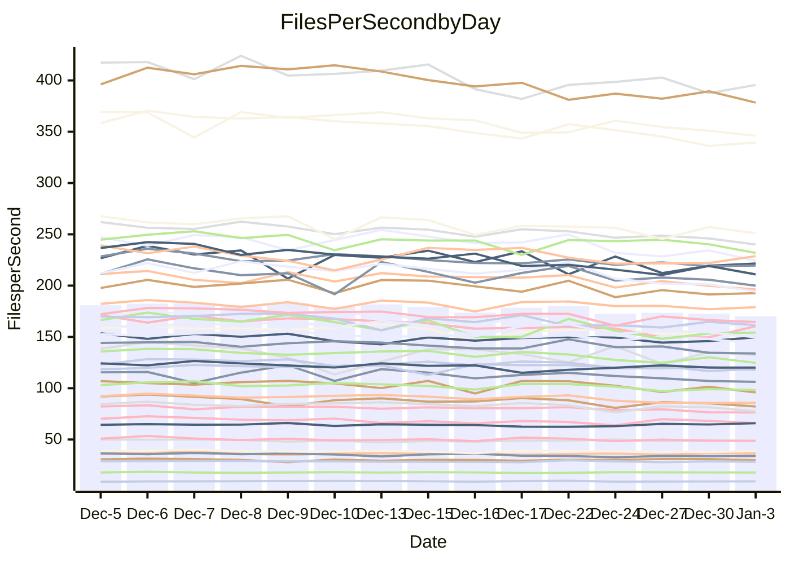

<!---
# This file is auto-generated. Do not edit.
# cspell:disable
--->
# Performance Report

## Daily Performance

## Time to Process Files

| Repository                                      | Elapsed | Min/Avg/Max           |   SD | SD Graph                |
| ----------------------------------------------- | ------: | :-------------------: | ---: | ----------------------- |
| AdaDoom3/AdaDoom3                    |    3.06 | 2.8 /   2.9 /   3.2   | 0.12 | `    ┣━━┻━━╋━━●━━┫    ` |
| alexiosc/megistos                    |    6.92 | 6.7 /   7.1 /   8.1   | 0.34 | `    ┣━━┻━●╋━━┻━━┫    ` |
| apollographql/apollo-server          |    2.25 | 2.0 /   2.2 /   2.4   | 0.09 | `     ┣━┻━━╋●━┻━┫     ` |
| aspnetboilerplate/aspnetboilerplate  |   10.14 | 8.8 /   9.3 /  10.4   | 0.37 | `    ┣━━┻━━╋━━┻━━┫●   ` |
| aws-amplify/docs                     |   12.52 | 11.3 /  11.8 /  12.5  | 0.32 | `    ┣━━┻━━╋━━┻━━┫●   ` |
| Azure/azure-rest-api-specs           |   15.46 | 13.8 /  15.1 /  17.0  | 0.85 | `   ┣━━━┻━━╋●━┻━━━┫   ` |
| bitjson/typescript-starter           |    0.69 | 0.6 /   0.7 /   0.7   | 0.02 | `     ┣━━┻━╋━┻━●┫     ` |
| caddyserver/caddy                    |    3.45 | 2.9 /   3.2 /   3.7   | 0.17 | `    ┣━━┻━━╋━━┻●━┫    ` |
| canada-ca/open-source-logiciel-libre |    0.76 | 0.7 /   0.8 /   0.8   | 0.02 | `     ┣━━┻●╋━┻━━┫     ` |
| chef/chef                            |    5.25 | 5.0 /   5.3 /   6.0   | 0.24 | `    ┣━━┻━●╋━━┻━━┫    ` |
| dart-lang/sdk                        |   61.44 | 55.8 /  58.7 /  62.8  | 1.85 | `  ┣━━━┻━━━╋━━━┻━●━┫  ` |
| django/django                        |   14.34 | 13.5 /  14.2 /  15.5  | 0.55 | `   ┣━━━┻━━╋●━┻━━━┫   ` |
| eslint/eslint                        |   10.61 | 9.2 /   9.9 /  10.9   | 0.36 | `    ┣━━┻━━╋━━┻━━●    ` |
| exonum/exonum                        |    3.21 | 2.9 /   3.1 /   3.7   | 0.19 | `    ┣━━┻━━╋●━┻━━┫    ` |
| flutter/samples                      |   16.69 | 15.0 /  16.7 /  22.0  | 1.16 | `   ┣━━━┻━━●━━┻━━━┫   ` |
| gitbucket/gitbucket                  |    3.38 | 2.9 /   3.1 /   3.4   | 0.12 | `    ┣━━┻━━╋━━┻━━┫●   ` |
| googleapis/google-cloud-cpp          |  139.36 | 117.0 / 124.9 / 133.5 | 4.45 | `    ┣━━┻━━╋━━┻━━┫   ●` |
| graphql/express-graphql              |    0.71 | 0.7 /   0.7 /   0.8   | 0.02 | `     ┣━━┻●╋━┻━━┫     ` |
| graphql/graphql-js                   |    2.20 | 2.1 /   2.2 /   2.4   | 0.08 | `     ┣━┻━━●━━┻━┫     ` |
| graphql/graphql-relay-js             |    0.72 | 0.7 /   0.7 /   0.8   | 0.02 | `     ┣━━●━╋━┻━━┫     ` |
| graphql/graphql-spec                 |    0.82 | 0.8 /   0.8 /   0.9   | 0.02 | `     ┣━●┻━╋━┻━━┫     ` |
| iluwatar/java-design-patterns        |   11.58 | 10.5 /  11.2 /  13.6  | 0.57 | `    ┣━━┻━━╋━●┻━━┫    ` |
| ktaranov/sqlserver-kit               |    6.50 | 5.8 /   6.1 /   6.6   | 0.20 | `    ┣━━┻━━╋━━┻━━●    ` |
| liriliri/licia                       |    3.63 | 3.2 /   3.5 /   3.8   | 0.13 | `    ┣━━┻━━╋━●┻━━┫    ` |
| MartinThoma/LaTeX-examples           |    6.37 | 6.0 /   6.3 /   6.7   | 0.15 | `    ┣━━┻━━╋━●┻━━┫    ` |
| mdx-js/mdx                           |    1.68 | 1.5 /   1.6 /   1.8   | 0.07 | `     ┣━┻━━╋━━●━┫     ` |
| microsoft/TypeScript-Website         |    5.10 | 4.7 /   5.1 /   5.3   | 0.16 | `    ┣━━┻━━●━━┻━━┫    ` |
| MicrosoftDocs/PowerShell-Docs        |   18.46 | 17.6 /  18.8 /  25.8  | 1.40 | `   ┣━━━┻━●╋━━┻━━━┫   ` |
| neovim/nvim-lspconfig                |    3.39 | 2.8 /   3.0 /   3.2   | 0.10 | `     ┣━┻━━╋━━┻━┫    ●` |
| pagekit/pagekit                      |    3.46 | 3.0 /   3.3 /   3.8   | 0.19 | `    ┣━━┻━━╋━━●━━┫    ` |
| php/php-src                          |   21.16 | 19.9 /  21.6 /  25.7  | 1.32 | `   ┣━━┻━━●╋━━━┻━━┫   ` |
| plasticrake/tplink-smarthome-api     |    0.92 | 0.8 /   0.9 /   1.0   | 0.04 | `     ┣━┻━━╋●━┻━┫     ` |
| prettier/prettier                    |    6.38 | 5.9 /   6.2 /   7.2   | 0.26 | `    ┣━━┻━━╋━●┻━━┫    ` |
| pycontribs/jira                      |    1.21 | 1.2 /   1.2 /   1.3   | 0.03 | `     ┣━●━━╋━━┻━┫     ` |
| RustPython/RustPython                |    4.11 | 3.9 /   4.1 /   4.6   | 0.15 | `    ┣━━┻━━●━━┻━━┫    ` |
| shoelace-style/shoelace              |    2.42 | 2.3 /   2.4 /   2.5   | 0.07 | `     ┣━┻━━●━━┻━┫     ` |
| slint-ui/slint                       |   10.65 | 8.4 /   9.2 /  10.4   | 0.47 | `    ┣━━┻━━╋━━┻━━┫   ●` |
| SoftwareBrothers/admin-bro           |    2.13 | 2.0 /   2.1 /   2.3   | 0.09 | `     ┣━┻━━╋●━┻━┫     ` |
| sveltejs/svelte                      |   18.64 | 17.0 /  17.9 /  18.9  | 0.58 | `   ┣━━━┻━━╋━━┻●━━┫   ` |
| TheAlgorithms/Python                 |    5.22 | 4.9 /   5.3 /   5.7   | 0.20 | `    ┣━━┻━●╋━━┻━━┫    ` |
| twbs/bootstrap                       |    1.23 | 1.1 /   1.2 /   1.4   | 0.06 | `     ┣━┻━━╋━●┻━┫     ` |
| typescript-cheatsheets/react         |    1.09 | 1.0 /   1.1 /   1.1   | 0.02 | `     ┣━┻━━╋●━┻━┫     ` |
| typescript-eslint/typescript-eslint  |    3.64 | 3.4 /   3.5 /   3.8   | 0.10 | `    ┣━━┻━━╋━━●━━┫    ` |
| vitest-dev/vitest                    |    8.10 | 6.9 /   7.5 /   8.2   | 0.33 | `    ┣━━┻━━╋━━┻━●┫    ` |
| w3c/aria-practices                   |    3.24 | 2.7 /   2.9 /   3.2   | 0.11 | `    ┣━━┻━━╋━━┻━━┫  ● ` |
| w3c/specberus                        |    1.64 | 1.6 /   1.6 /   1.7   | 0.04 | `     ┣━┻━━●━━┻━┫     ` |
| webdeveric/webpack-assets-manifest   |    0.66 | 0.6 /   0.7 /   0.7   | 0.01 | `     ┣━━┻●╋━┻━━┫     ` |
| webpack/webpack                      |    4.89 | 4.5 /   4.8 /   5.3   | 0.19 | `    ┣━━┻━━╋━●┻━━┫    ` |
| wireapp/wire-desktop                 |    0.86 | 0.8 /   0.9 /   0.9   | 0.03 | `     ┣━┻━━●━━┻━┫     ` |
| wireapp/wire-webapp                  |    8.10 | 7.3 /   7.9 /   8.5   | 0.32 | `    ┣━━┻━━╋━●┻━━┫    ` |

Note:
- Elapsed time is in seconds.

## Files per Second over Time

| Repository                                      | Files |    Sec |    Fps |     Rel | Trend Fps              |    N |
| ----------------------------------------------- | ----: | -----: | -----: | ------: | ---------------------- | ---: |
| AdaDoom3/AdaDoom3                    |   103 |   3.06 |  33.62 |  -4.10% | `▅▇▇▇▇▇█▆▅▄▄▆▅▆▆▅▄▆▅▅` |   31 |
| alexiosc/megistos                    |   583 |   6.92 |  84.28 |   2.06% | `█▇█▆▇▇▆█▇▄▅▆▇▆▆▇▅▃▅▇` |   31 |
| apollographql/apollo-server          |   250 |   2.25 | 110.88 |  -1.14% | `▇▇▇█▆▅▆▇▇▆▆▆▅▄▆▅▅▄▄▆` |   32 |
| aspnetboilerplate/aspnetboilerplate  |  2246 |  10.14 | 221.44 |  -8.16% | `██▇▇▇▇▆▇█▆▄▅▅▆▅▅▅▆▃▄` |   31 |
| aws-amplify/docs                     |  2863 |  12.52 | 228.62 |  -5.97% | `███▅█▆█▅▇▇▇▇██▇▅▇▅▆▄` |   32 |
| Azure/azure-rest-api-specs           |  2411 |  15.46 | 155.94 |  -2.57% | `██▅▆▅▃▄▄▇▅▅▃▄▄▅▄▅▄▆▅` |   32 |
| bitjson/typescript-starter           |    20 |   0.69 |  29.08 |  -4.12% | `▅▆▆▇▇▆▇▆▇▇▆██▇███▆▇▅` |   31 |
| caddyserver/caddy                    |   279 |   3.45 |  80.85 |  -7.71% | `██▃▆█▆▅▇▇▅▄▆▆▆▆▇▄▆▄▄` |   32 |
| canada-ca/open-source-logiciel-libre |     7 |   0.76 |   9.21 |   0.52% | `▇▅▆▇▇▄▆▇█▄▅▆▅▅▅▆▆▆▆▆` |   31 |
| chef/chef                            |  1204 |   5.25 | 229.21 |   1.64% | `▇██▇█▆▆█▅▇▇▅▄▆▇▇▃▆▅▇` |   31 |
| dart-lang/sdk                        | 10026 |  61.44 | 163.20 |  -4.28% | `▆▇▆██▇▆██▅▅▇█▅▇▇▅▅▆▅` |   32 |
| django/django                        |  2817 |  14.34 | 196.51 |  -0.73% | `██▇▇▇▆▇▆█▄▆▆▆▅▆▄▇▆▅▆` |   32 |
| eslint/eslint                        |  2038 |  10.61 | 192.04 |  -6.79% | `██▆▇█▇▇▇█▆▅▇▆▇▆▇▄▆▅▅` |   32 |
| exonum/exonum                        |   421 |   3.21 | 131.25 |  -2.82% | `▅▅██▇█▆▆▅▇█▄▅▇█▇▆▇▆▆` |   31 |
| flutter/samples                      |  2690 |  16.69 | 161.18 |  -0.14% | `▇█▇▇▆▇▇▇▇▇▇▆▆▇▇▇▂▇▇▇` |   32 |
| gitbucket/gitbucket                  |   412 |   3.38 | 122.03 |  -7.97% | `███▇▇▇▅▇▇▅▆▅▄▇▆▅▆▄▆▄` |   32 |
| googleapis/google-cloud-cpp          | 19742 | 139.36 | 141.66 | -10.49% | `▇█▄▇▅▄▄▆▇▅▅▆▅▆▄▅▅▅▄▂` |   32 |
| graphql/express-graphql              |    26 |   0.71 |  36.84 |   1.24% | `▇█▇█▆▇█▆▆▇█▇▄███▆▆▇█` |   31 |
| graphql/graphql-js                   |   339 |   2.20 | 154.28 |  -0.69% | `█▆▇█▅▄▄▇▇▇█▆▆▇▇▆▆▆▃▆` |   32 |
| graphql/graphql-relay-js             |    28 |   0.72 |  39.15 |   1.96% | `███▆▅▅▅██▇██▆▇▆▅█▇██` |   31 |
| graphql/graphql-spec                 |    15 |   0.82 |  18.30 |   2.33% | `▆█▇█▇▇▇▆▆▇▇▆█▇▆▆▇▅▇█` |   31 |
| iluwatar/java-design-patterns        |  1849 |  11.58 | 159.64 |  -3.65% | `▇█▇▇▆▇▇▇█▇▆▆▇▇▇▆▆▇▇▆` |   32 |
| ktaranov/sqlserver-kit               |   489 |   6.50 |  75.27 |  -6.21% | `█▇▇▆▅▇█▇▇▆▅▆▆▆▆▄▄▆▄▄` |   32 |
| liriliri/licia                       |  1434 |   3.63 | 394.54 |  -2.67% | `▇▇█▆█▅▅▄▅▅▆▆▆▅▆▅▄▅▆▅` |   31 |
| MartinThoma/LaTeX-examples           |  1409 |   6.37 | 221.23 |  -1.39% | `██▇▇▇▆▇▆▇▇▆▇▇▆▆▄▇▆▆▆` |   31 |
| mdx-js/mdx                           |   142 |   1.68 |  84.76 |  -5.88% | `██▆██▇▆▇█▆▇▇▄▇▆▆▃▇▅▅` |   31 |
| microsoft/TypeScript-Website         |   757 |   5.10 | 148.57 |  -0.35% | `▅▇▆▇█▆▆▇▇█▆▅▆▇█▅▅█▆▇` |   31 |
| MicrosoftDocs/PowerShell-Docs        |  2232 |  18.46 | 120.91 |   1.39% | `█▇▇▂██▇▇▇▇▇▇▇█▆▅▆▇▇▇` |   32 |
| neovim/nvim-lspconfig                |   372 |   3.39 | 109.88 | -10.95% | `█▇▆▇▆▆▆▇▇▄▆▄▆▄▆▆▆▅▆▂` |   32 |
| pagekit/pagekit                      |   741 |   3.46 | 213.96 |  -5.30% | `▇▆▆▇██▇▆▆▆▅▆▃█▅▆▅▃▇▅` |   31 |
| php/php-src                          |  2213 |  21.16 | 104.56 |   1.83% | `█▇▇█▆▃▄██▆▆▆▄▆▅▇▇▃▅▇` |   32 |
| plasticrake/tplink-smarthome-api     |    62 |   0.92 |  67.51 |  -1.12% | `▆█▆▇▇▅▆▇▇▇▃▇█▆▇▇█▆▆▇` |   31 |
| prettier/prettier                    |  2202 |   6.38 | 345.04 |  -2.11% | `██▇▇▆▇▇▆█▇▇▇▆▇▆▇▃▇▅▇` |   32 |
| pycontribs/jira                      |    80 |   1.21 |  66.37 |   3.09% | `▇▄▇█▆▆▆▅▅▄▆▇▇▅▇▇▇▇▇▇` |   31 |
| RustPython/RustPython                |   621 |   4.11 | 151.10 |   0.43% | `█▅██▇▇▇▇▇▆▆▆█▆▆▇▆▄▅▇` |   32 |
| shoelace-style/shoelace              |   438 |   2.42 | 180.64 |   0.07% | `█▇▇▇▅▆▆██▆▇▇▆▅▇▅▆▅▇▇` |   32 |
| slint-ui/slint                       |  1954 |  10.65 | 183.42 | -13.41% | `█▆▇█▅▇▇▇█▆▆▆▄▆▄▃▆▆▃▂` |   32 |
| SoftwareBrothers/admin-bro           |   441 |   2.13 | 207.04 |  -1.09% | `██▇▅▇▄▆▇█▆▅▅▆▇▆▅▅▅▃▆` |   31 |
| sveltejs/svelte                      |  7122 |  18.64 | 382.15 |  -3.62% | `█▆▅▆▆▆▆▆▅▅▅▅▅▆▆▅▅▄▄▅` |   32 |
| TheAlgorithms/Python                 |  1361 |   5.22 | 260.77 |   0.79% | `▇█▆▇▅▆▄▆▆▆▆▄▅▇▆▅▆▆▄▆` |   32 |
| twbs/bootstrap                       |   120 |   1.23 |  97.22 |  -4.26% | `█▅▇▇█▃▆▇▇█▅▅▅▅▅▆█▇▄▅` |   32 |
| typescript-cheatsheets/react         |    53 |   1.09 |  48.80 |  -0.51% | `▅█▆▅▇▅▆▇▇██▇▆█▇▆▇▆▇▇` |   31 |
| typescript-eslint/typescript-eslint  |  1273 |   3.64 | 349.32 |  -2.99% | `██▇▇█▆▇▆▆▇▇▇▆▆▆▆▆▄▇▆` |   32 |
| vitest-dev/vitest                    |  1936 |   8.10 | 239.05 |  -5.53% | `█▆▇▇▇▇▄▇▇▆▆▆▇▇▅▅▆▆▄▅` |   32 |
| w3c/aria-practices                   |   405 |   3.24 | 124.90 | -11.40% | `█▇▆▆▆▅▇▆█▇▆▇▆▄▃▇▇▆▆▃` |   32 |
| w3c/specberus                        |   200 |   1.64 | 121.97 |   0.09% | `▇█▇▇██▇▅▆▆▇█▇▇▇▆▆▇▅▇` |   32 |
| webdeveric/webpack-assets-manifest   |    19 |   0.66 |  28.92 |   1.15% | `▆▇▅▅▆▅▆▅█▆▇▆▅▇▇▅▇▆▅▇` |   31 |
| webpack/webpack                      |  1095 |   4.89 | 224.08 |  -2.70% | `██▇██▆██▆▆▅▅▆▆▆▅▅█▆▆` |   32 |
| wireapp/wire-desktop                 |    43 |   0.86 |  49.92 |   0.21% | `█▅▇▅▅▅▅█▇▄▆▆▆▆▆▅▅▅▅▆` |   32 |
| wireapp/wire-webapp                  |  1337 |   8.10 | 165.01 |  -0.74% | `▇█▅▆▆▆▅▇▅▅▅▅▅▆▆▆▆▄▅▆` |   32 |

## Data Throughput

| Repository                                      | Files |    Sec |     Kps |     Rel | Trend Kps              |    N |
| ----------------------------------------------- | ----: | -----: | ------: | ------: | ---------------------- | ---: |
| AdaDoom3/AdaDoom3                    |   103 |   3.06 |  714.41 |  -4.10% | `▅▇▇▇▇▇█▆▅▄▄▆▅▆▆▅▄▆▅▅` |   31 |
| alexiosc/megistos                    |   583 |   6.92 |  662.25 |   2.06% | `█▇█▆▇▇▆█▇▄▅▆▇▆▆▇▅▃▅▇` |   31 |
| apollographql/apollo-server          |   250 |   2.25 |  887.05 |  -0.97% | `▇▇▇█▆▅▆▇▇▆▆▆▅▅▆▅▅▄▄▆` |   32 |
| aspnetboilerplate/aspnetboilerplate  |  2246 |  10.14 |  520.97 |  -8.16% | `██▇▇▇▇▆▇█▆▄▅▅▆▅▅▅▆▃▄` |   31 |
| aws-amplify/docs                     |  2863 |  12.52 |  783.38 |  -5.68% | `███▅█▆█▅▇▇▇▇██▇▅▇▅▆▄` |   32 |
| Azure/azure-rest-api-specs           |  2411 |  15.46 |  449.20 |  -2.52% | `██▅▆▅▃▄▄▇▅▅▃▄▄▅▄▅▄▆▅` |   32 |
| bitjson/typescript-starter           |    20 |   0.69 |  116.30 |  -4.12% | `▅▆▆▇▇▆▇▆▇▇▆██▇███▆▇▅` |   31 |
| caddyserver/caddy                    |   279 |   3.45 |  673.20 |  -7.48% | `██▃▆█▆▅▇▇▅▄▆▆▆▆▇▄▆▄▄` |   32 |
| canada-ca/open-source-logiciel-libre |     7 |   0.76 |   76.35 |   0.52% | `▇▅▆▇▇▄▆▇█▄▅▆▅▅▅▆▆▆▆▆` |   31 |
| chef/chef                            |  1204 |   5.25 | 1052.76 |   1.65% | `▇██▇█▆▆█▅▇▇▅▄▆▇▇▃▆▅▇` |   31 |
| dart-lang/sdk                        | 10026 |  61.44 | 1165.57 |  -4.23% | `▆▇▆██▇▆██▅▅▇█▅▇▇▅▅▆▅` |   32 |
| django/django                        |  2817 |  14.34 | 1214.63 |  -0.61% | `██▇▇▇▆▇▆█▄▆▆▆▅▆▄▇▆▅▆` |   32 |
| eslint/eslint                        |  2038 |  10.61 | 1568.70 |  -6.65% | `██▆▇█▇▇▇█▆▅▇▇▇▆▇▄▆▅▅` |   32 |
| exonum/exonum                        |   421 |   3.21 | 1255.41 |  -2.82% | `▅▅██▇█▆▆▅▇█▄▅▇█▇▆▇▆▆` |   31 |
| flutter/samples                      |  2690 |  16.69 | 1305.46 |  -0.14% | `▇█▇▇▆▇▇▇▇▇▇▆▆▇▇▇▂▇▇▇` |   32 |
| gitbucket/gitbucket                  |   412 |   3.38 |  552.09 |  -7.95% | `███▇▇▆▅▇▇▅▆▅▄▇▆▅▆▄▆▄` |   32 |
| googleapis/google-cloud-cpp          | 19742 | 139.36 | 1107.08 | -10.39% | `▇█▄▇▅▄▄▆▇▅▅▆▅▆▄▅▅▅▄▂` |   32 |
| graphql/express-graphql              |    26 |   0.71 |  168.61 |   1.24% | `▇█▇█▆▇█▆▆▇█▇▄███▆▆▇█` |   31 |
| graphql/graphql-js                   |   339 |   2.20 |  876.50 |  -0.69% | `█▆▇█▅▄▄▇▇▇█▆▆▇▇▆▆▆▃▆` |   32 |
| graphql/graphql-relay-js             |    28 |   0.72 |  153.79 |   1.96% | `███▆▅▅▅██▇██▆▇▆▅█▇██` |   31 |
| graphql/graphql-spec                 |    15 |   0.82 |  673.53 |   2.39% | `▇█▇█▇▇▇▆▆▇▇▆█▇▆▆▇▅▇█` |   31 |
| iluwatar/java-design-patterns        |  1849 |  11.58 |  491.97 |  -3.64% | `▇█▇▇▆▇▇▇█▇▆▆▇▇▇▆▆▇▇▆` |   32 |
| ktaranov/sqlserver-kit               |   489 |   6.50 | 1138.75 |  -6.22% | `█▇▇▆▅▇█▇▇▆▅▆▆▆▆▄▄▆▄▄` |   32 |
| liriliri/licia                       |  1434 |   3.63 |  467.45 |  -2.67% | `▇▇█▆█▅▅▄▅▅▆▆▆▅▆▅▄▅▆▅` |   31 |
| MartinThoma/LaTeX-examples           |  1409 |   6.37 |  456.90 |  -1.39% | `██▇▇▇▆▇▆▇▇▆▇▇▆▆▄▇▆▆▆` |   31 |
| mdx-js/mdx                           |   142 |   1.68 |  393.34 |  -5.88% | `██▆██▇▆▇█▆▇▇▄▇▆▆▃▇▅▅` |   31 |
| microsoft/TypeScript-Website         |   757 |   5.10 | 1017.42 |  -0.35% | `▅▇▆▇█▆▆▇▇█▆▅▆▇█▅▅█▆▇` |   31 |
| MicrosoftDocs/PowerShell-Docs        |  2232 |  18.46 | 1207.13 |   1.47% | `█▇▇▂██▇▇▇▇▇▇▇█▆▅▆▇▇▇` |   32 |
| neovim/nvim-lspconfig                |   372 |   3.39 |  287.10 | -10.49% | `█▇▆▇▆▆▆▇▇▅▆▄▆▅▆▆▆▅▇▃` |   32 |
| pagekit/pagekit                      |   741 |   3.46 |  446.12 |  -5.30% | `▇▆▆▇██▇▆▆▆▅▆▃█▅▆▅▃▇▅` |   31 |
| php/php-src                          |  2213 |  21.16 | 1530.75 |   1.85% | `█▇▇█▆▃▄██▆▆▆▄▆▅▇▇▃▅▇` |   32 |
| plasticrake/tplink-smarthome-api     |    62 |   0.92 |  364.79 |  -1.12% | `▆█▆▇▇▅▆▇▇▇▃▇█▆▇▇█▆▆▇` |   31 |
| prettier/prettier                    |  2202 |   6.38 |  486.85 |  -2.37% | `██▇▇▆▇▇▆█▇▇▇▆▇▆▇▃▆▅▆` |   32 |
| pycontribs/jira                      |    80 |   1.21 |  457.14 |   3.09% | `▇▄▇█▆▆▆▅▅▄▆▇▇▅▇▇▇▇▇▇` |   31 |
| RustPython/RustPython                |   621 |   4.11 | 1115.40 |   0.53% | `█▅██▇▇▇▇▇▆▆▆█▆▆▇▆▄▅▇` |   32 |
| shoelace-style/shoelace              |   438 |   2.42 |  867.31 |   0.13% | `█▇▇▇▅▆▆██▆▇▇▆▅▇▅▆▅▇▇` |   32 |
| slint-ui/slint                       |  1954 |  10.65 |  941.41 | -13.15% | `█▆▇█▅▇▇▇█▆▅▆▄▆▄▃▆▆▃▂` |   32 |
| SoftwareBrothers/admin-bro           |   441 |   2.13 |  456.33 |  -1.09% | `██▇▅▇▄▆▇█▆▅▅▆▇▆▅▅▅▃▆` |   31 |
| sveltejs/svelte                      |  7122 |  18.64 |  251.12 |  -4.27% | `█▇▆▆▅▅▅▆▄▅▅▄▄▆▅▄▅▄▄▄` |   32 |
| TheAlgorithms/Python                 |  1361 |   5.22 |  661.80 |   1.01% | `▇█▆▇▅▆▄▆▆▆▆▄▅▇▆▅▆▆▄▇` |   32 |
| twbs/bootstrap                       |   120 |   1.23 |  780.21 |  -4.26% | `█▅▇▇█▃▆▇▇█▅▅▅▅▅▆█▇▄▅` |   32 |
| typescript-cheatsheets/react         |    53 |   1.09 |  357.27 |  -0.51% | `▅█▆▅▇▅▆▇▇██▇▆█▇▆▇▆▇▇` |   31 |
| typescript-eslint/typescript-eslint  |  1273 |   3.64 | 1669.77 |  -2.49% | `██▇▇█▆▇▆▆▇▇▇▆▇▆▆▆▄▇▆` |   32 |
| vitest-dev/vitest                    |  1936 |   8.10 |  493.04 |  -5.23% | `█▆▇▇█▇▅█▇▇▆▆▇▇▆▅▇▆▄▅` |   32 |
| w3c/aria-practices                   |   405 |   3.24 | 1159.90 | -11.60% | `█▇▆▆▆▅▇▆█▇▆▇▆▄▃▇▇▆▆▃` |   32 |
| w3c/specberus                        |   200 |   1.64 |  389.08 |   0.09% | `▇█▇▇██▇▅▆▆▇█▇▇▇▆▆▇▅▇` |   32 |
| webdeveric/webpack-assets-manifest   |    19 |   0.66 |  155.27 |   1.15% | `▆▇▅▅▆▅▆▅█▆▇▆▅▇▇▅▇▆▅▇` |   31 |
| webpack/webpack                      |  1095 |   4.89 |  988.63 |  -2.68% | `██▇██▆██▆▆▅▅▆▆▆▅▅█▆▆` |   32 |
| wireapp/wire-desktop                 |    43 |   0.86 |  220.58 |   0.38% | `█▅▇▅▅▅▅█▇▄▆▆▆▆▆▅▅▅▅▆` |   32 |
| wireapp/wire-webapp                  |  1337 |   8.10 |  667.71 |  -1.24% | `▇█▅▆▆▆▅▇▅▅▅▄▄▆▆▅▅▄▅▆` |   32 |

