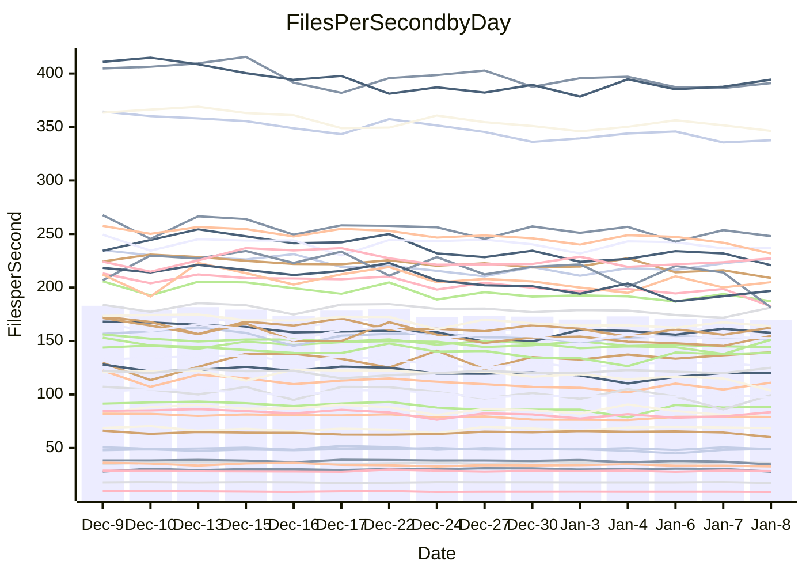

<!---
# This file is auto-generated. Do not edit.
# cspell:disable
--->
# Performance Report

## Daily Performance

## Time to Process Files

| Repository                                      | Elapsed | Min/Avg/Max           |   SD | SD Graph                |
| ----------------------------------------------- | ------: | :-------------------: | ---: | ----------------------- |
| AdaDoom3/AdaDoom3                    |    3.15 | 2.8 /   3.0 /   3.2   | 0.10 | `    ┣━━┻━━╋━━┻●━┫    ` |
| alexiosc/megistos                    |    6.98 | 6.7 /   7.2 /   8.1   | 0.32 | `    ┣━━┻●━╋━━┻━━┫    ` |
| apollographql/apollo-server          |    2.25 | 2.0 /   2.3 /   2.8   | 0.13 | `    ┣━━┻━●╋━━┻━━┫    ` |
| aspnetboilerplate/aspnetboilerplate  |   10.17 | 8.8 /   9.5 /  10.4   | 0.38 | `    ┣━━┻━━╋━━┻━●┫    ` |
| aws-amplify/docs                     |   12.10 | 11.5 /  11.9 /  12.5  | 0.32 | `    ┣━━┻━━╋━●┻━━┫    ` |
| Azure/azure-rest-api-specs           |   15.59 | 13.8 /  15.6 /  17.9  | 0.91 | `   ┣━━━┻━━●━━┻━━━┫   ` |
| bitjson/typescript-starter           |    0.72 | 0.6 /   0.7 /   0.7   | 0.02 | `     ┣━━┻━╋━┻━━┫  ●  ` |
| caddyserver/caddy                    |    3.54 | 3.0 /   3.3 /   3.7   | 0.18 | `    ┣━━┻━━╋━━┻●━┫    ` |
| canada-ca/open-source-logiciel-libre |    0.79 | 0.7 /   0.8 /   0.8   | 0.02 | `     ┣━━┻━╋━┻●━┫     ` |
| chef/chef                            |    6.64 | 5.1 /   5.5 /   6.1   | 0.28 | `     ┣━┻━━╋━━┻━┫    ●` |
| dart-lang/sdk                        |   61.40 | 57.3 /  59.9 /  65.0  | 1.75 | `   ┣━━┻━━━╋━━●┻━━┫   ` |
| django/django                        |   15.05 | 13.5 /  14.4 /  15.5  | 0.56 | `    ┣━━┻━━╋━━┻●━┫    ` |
| eslint/eslint                        |   11.18 | 9.5 /  10.1 /  10.7   | 0.36 | `    ┣━━┻━━╋━━┻━━┫   ●` |
| exonum/exonum                        |    3.02 | 2.9 /   3.2 /   3.7   | 0.17 | `    ┣━━┻●━╋━━┻━━┫    ` |
| flutter/samples                      |   17.06 | 16.0 /  17.0 /  22.0  | 1.08 | `   ┣━━━┻━━●━━┻━━━┫   ` |
| gitbucket/gitbucket                  |    3.28 | 3.0 /   3.2 /   3.4   | 0.11 | `    ┣━━┻━━╋━━●━━┫    ` |
| googleapis/google-cloud-cpp          |  129.34 | 117.0 / 127.1 / 139.4 | 5.25 | `  ┣━━━┻━━━╋━●━┻━━━┫  ` |
| graphql/express-graphql              |    0.72 | 0.7 /   0.7 /   0.8   | 0.02 | `     ┣━━┻━╋●┻━━┫     ` |
| graphql/graphql-js                   |    2.23 | 2.1 /   2.2 /   2.4   | 0.07 | `     ┣━┻━━╋●━┻━┫     ` |
| graphql/graphql-relay-js             |    0.81 | 0.7 /   0.7 /   0.8   | 0.02 | `     ┣━━┻━╋━┻━━┫   ● ` |
| graphql/graphql-spec                 |    0.87 | 0.8 /   0.8 /   0.9   | 0.01 | `     ┣━━┻━╋━┻━━●     ` |
| iluwatar/java-design-patterns        |   11.93 | 10.6 /  11.3 /  12.2  | 0.35 | `    ┣━━┻━━╋━━┻━●┫    ` |
| ktaranov/sqlserver-kit               |    6.19 | 5.9 /   6.2 /   6.6   | 0.19 | `    ┣━━┻━━●━━┻━━┫    ` |
| liriliri/licia                       |    3.67 | 3.3 /   3.6 /   3.9   | 0.11 | `    ┣━━┻━━╋●━┻━━┫    ` |
| MartinThoma/LaTeX-examples           |    6.75 | 6.1 /   6.4 /   6.8   | 0.15 | `    ┣━━┻━━╋━━┻━━┫●   ` |
| mdx-js/mdx                           |    1.61 | 1.5 /   1.6 /   1.8   | 0.08 | `     ┣━┻━━●━━┻━┫     ` |
| microsoft/TypeScript-Website         |    5.24 | 4.9 /   5.1 /   5.4   | 0.13 | `    ┣━━┻━━╋━●┻━━┫    ` |
| MicrosoftDocs/PowerShell-Docs        |   21.52 | 17.6 /  19.0 /  25.8  | 1.42 | `   ┣━━━┻━━╋━━┻━━●┫   ` |
| neovim/nvim-lspconfig                |    3.11 | 2.8 /   3.1 /   3.4   | 0.13 | `    ┣━━┻━━╋●━┻━━┫    ` |
| pagekit/pagekit                      |    3.27 | 3.1 /   3.4 /   3.8   | 0.17 | `    ┣━━┻●━╋━━┻━━┫    ` |
| php/php-src                          |   22.24 | 20.3 /  22.4 /  28.4  | 1.82 | `   ┣━━┻━━━●━━━┻━━┫   ` |
| plasticrake/tplink-smarthome-api     |    0.90 | 0.9 /   0.9 /   1.0   | 0.03 | `     ┣━┻━●╋━━┻━┫     ` |
| prettier/prettier                    |    6.52 | 6.0 /   6.3 /   7.2   | 0.23 | `    ┣━━┻━━╋━●┻━━┫    ` |
| pycontribs/jira                      |    1.33 | 1.2 /   1.2 /   1.3   | 0.03 | `     ┣━┻━━╋━━┻━┫ ●   ` |
| RustPython/RustPython                |    4.11 | 4.0 /   4.2 /   5.1   | 0.22 | `    ┣━━┻━●╋━━┻━━┫    ` |
| shoelace-style/shoelace              |    2.42 | 2.3 /   2.5 /   2.7   | 0.08 | `     ┣━┻━●╋━━┻━┫     ` |
| slint-ui/slint                       |    9.98 | 8.7 /   9.6 /  11.8   | 0.72 | `    ┣━━┻━━╋━●┻━━┫    ` |
| SoftwareBrothers/admin-bro           |    2.15 | 2.0 /   2.1 /   2.3   | 0.10 | `     ┣━┻━━●━━┻━┫     ` |
| sveltejs/svelte                      |   18.08 | 17.2 /  18.2 /  18.9  | 0.47 | `   ┣━━━┻━●╋━━┻━━━┫   ` |
| TheAlgorithms/Python                 |    5.51 | 5.0 /   5.4 /   5.8   | 0.20 | `    ┣━━┻━━╋━●┻━━┫    ` |
| twbs/bootstrap                       |    1.24 | 1.1 /   1.2 /   1.4   | 0.05 | `     ┣━┻━━╋━●┻━┫     ` |
| typescript-cheatsheets/react         |    1.08 | 1.1 /   1.1 /   1.3   | 0.04 | `     ┣━┻━●╋━━┻━┫     ` |
| typescript-eslint/typescript-eslint  |    3.68 | 3.4 /   3.6 /   3.8   | 0.09 | `    ┣━━┻━━╋━━●━━┫    ` |
| vitest-dev/vitest                    |    8.38 | 7.2 /   7.7 /   8.2   | 0.27 | `    ┣━━┻━━╋━━┻━━┫●   ` |
| w3c/aria-practices                   |    2.91 | 2.7 /   2.9 /   3.2   | 0.13 | `    ┣━━┻━━●━━┻━━┫    ` |
| w3c/specberus                        |    1.60 | 1.6 /   1.7 /   1.7   | 0.03 | `     ┣●┻━━╋━━┻━┫     ` |
| webdeveric/webpack-assets-manifest   |    0.67 | 0.6 /   0.7 /   0.7   | 0.01 | `     ┣━━┻━●━┻━━┫     ` |
| webpack/webpack                      |    4.82 | 4.6 /   4.8 /   5.3   | 0.18 | `    ┣━━┻━━●━━┻━━┫    ` |
| wireapp/wire-desktop                 |    0.88 | 0.8 /   0.9 /   0.9   | 0.03 | `     ┣━━┻━╋●┻━━┫     ` |
| wireapp/wire-webapp                  |    8.23 | 7.5 /   8.2 /   8.8   | 0.31 | `    ┣━━┻━━╋●━┻━━┫    ` |

Note:
- Elapsed time is in seconds.

## Files per Second over Time

| Repository                                      | Files |    Sec |    Fps |     Rel | Trend Fps              |    N |
| ----------------------------------------------- | ----: | -----: | -----: | ------: | ---------------------- | ---: |
| AdaDoom3/AdaDoom3                    |   103 |   3.15 |  32.73 |  -4.59% | `▇▇▅▅▇▇▇▇▇▆▇▇▆█▅▇▆▆▇▅` |   28 |
| alexiosc/megistos                    |   583 |   6.98 |  83.56 |   2.60% | `█▇▅▅▇▇▇▇▇▆▃▅█▇▅▆▅▆▇▇` |   28 |
| apollographql/apollo-server          |   250 |   2.25 | 111.04 |   0.87% | `█▇▇▇▇▆▇▆▆▆▆▇▅▇▆█▇▃█▇` |   30 |
| aspnetboilerplate/aspnetboilerplate  |  2246 |  10.17 | 220.86 |  -6.59% | `▇█▇▅▅▅▆▆▆▆▆▃▄▅▅▇▆▅▆▄` |   28 |
| aws-amplify/docs                     |  2863 |  12.10 | 236.64 |  -1.70% | `▅█▇█▇██▇▅▇▅▆▅▇▇▇▆▅▇▆` |   29 |
| Azure/azure-rest-api-specs           |  2413 |  15.59 | 154.82 |   0.13% | `█▆▆▄▆▅▆▆▆▅▇▆▅▅▅▅▄▃▆▆` |   30 |
| bitjson/typescript-starter           |    20 |   0.72 |  27.79 |  -8.02% | `▆▇▇▆██▇███▆▇▅▇█▆▇█▆▄` |   28 |
| caddyserver/caddy                    |   279 |   3.54 |  78.83 |  -7.54% | `▇▅▄▆▇▇▇▇▄▆▅▅█▆▅▇▅▃▆▄` |   30 |
| canada-ca/open-source-logiciel-libre |     7 |   0.79 |   8.90 |  -3.25% | `▇█▄▅▅▅▅▅▆▆▆▅▆▅▅▆▆▆▅▅` |   28 |
| chef/chef                            |  1204 |   6.64 | 181.38 | -18.05% | `█▅▇█▆▅▇▇▇▄▆▆█▄▅█▇▃▆▁` |   28 |
| dart-lang/sdk                        | 10056 |  61.40 | 163.77 |  -2.28% | `█▆▅▇█▆█▇▆▆▇▆▆▇▆▄█▇▆▆` |   30 |
| django/django                        |  2817 |  15.05 | 187.17 |  -4.29% | `█▄▆▆▇▅▆▄▇▆▅▇▆▄▆▄▇▆▆▅` |   30 |
| eslint/eslint                        |  2038 |  11.18 | 182.35 | -10.01% | `█▆▅▇▇▇▆▇▄▇▅▅▆▄▅▆▄▆▇▃` |   30 |
| exonum/exonum                        |   421 |   3.02 | 139.41 |   4.45% | `▆▅▇█▄▅▇█▇▆▇▆▆▇▇▆▇▇▆▇` |   28 |
| flutter/samples                      |  2690 |  17.06 | 157.72 |  -0.44% | `▇▇▇▆▆▇▇▇▂▇█▇▇▆▇█▇▇█▇` |   30 |
| gitbucket/gitbucket                  |   412 |   3.28 | 125.74 |  -3.62% | `█▆▇▆▅██▆█▄█▅▇▆███▇▆▆` |   30 |
| googleapis/google-cloud-cpp          | 19742 | 129.34 | 152.63 |  -1.94% | `█▆▆▇▆▇▆▇▆▇▆▄▇▇▆▄▅▇▇▆` |   30 |
| graphql/express-graphql              |    26 |   0.72 |  35.93 |  -1.15% | `▆▆▇█▇▄███▆▆▇██▇▇▇▇▇▇` |   28 |
| graphql/graphql-js                   |   339 |   2.23 | 152.14 |  -1.06% | `▇▇▇█▇▆▇▇▆▆▆▄▇▇▇▇▆▇▇▆` |   29 |
| graphql/graphql-relay-js             |    28 |   0.81 |  34.62 |  -8.90% | `██▇██▆▇▇▅█▇██▅▆█▄█▆▃` |   28 |
| graphql/graphql-spec                 |    15 |   0.87 |  17.29 |  -3.66% | `▅▆▇▇▆█▇▆▆▇▅▇█▆▆▇▆▇█▅` |   28 |
| iluwatar/java-design-patterns        |  1849 |  11.93 | 155.03 |  -5.27% | `█▆▅▅▆▆▇▅▅▆▇▆▅▆▄▇▅▆▇▄` |   30 |
| ktaranov/sqlserver-kit               |   489 |   6.19 |  78.95 |  -0.27% | `██▇▆▇▇▆▆▄▅▇▅▅▅▇▇█▆▇▇` |   29 |
| liriliri/licia                       |  1434 |   3.67 | 391.06 |  -1.40% | `▇▇███▇█▆▅▇█▇▇▅▆▇▇▇▅▇` |   29 |
| MartinThoma/LaTeX-examples           |  1409 |   6.75 | 208.89 |  -5.65% | `▇█▇▆▇▇▇▇▅▇▆▇▇█▆▅▄▆▇▅` |   28 |
| mdx-js/mdx                           |   142 |   1.61 |  88.34 |  -0.26% | `█▆▇▇▅█▇▆▃▇▅▅▃▇▇▇▇▆▆▇` |   29 |
| microsoft/TypeScript-Website         |   757 |   5.24 | 144.38 |  -1.95% | `▇█▆▅▆▇█▅▅█▆▇▆▇▆▄▆▆▅▆` |   29 |
| MicrosoftDocs/PowerShell-Docs        |  2232 |  21.52 | 103.70 | -12.31% | `▇▇▇▇▇█▆▅▆▇▇▇▆▆▇▇▆▆▆▅` |   30 |
| neovim/nvim-lspconfig                |   373 |   3.11 | 120.12 |  -0.66% | `█▆▇▅█▆▇█▇▆█▄▄▆▆▄▇▇▇▇` |   30 |
| pagekit/pagekit                      |   741 |   3.27 | 226.92 |   2.80% | `▆▆▆▅▆▃█▅▆▅▃▇▅▆▆▆▇█▅▇` |   28 |
| php/php-src                          |  2212 |  22.24 |  99.44 |  -0.15% | `█▇▇▇▅▇▆▇▇▄▆██▇▆▇▅▂▅▇` |   30 |
| plasticrake/tplink-smarthome-api     |    62 |   0.90 |  68.53 |   1.14% | `▇▇▇▃▇█▆▇▇█▆▆▇▇█▇▇▇█▇` |   28 |
| prettier/prettier                    |  2203 |   6.52 | 337.68 |  -2.56% | `██▇▇▇▇▇▇▃▇▅▇▇▇▇▇▆▇▆▆` |   30 |
| pycontribs/jira                      |    80 |   1.33 |  60.18 |  -6.76% | `▅▅▅▇▇▇▅▇▇▇█▇█▇█▆█▆▆▄` |   28 |
| RustPython/RustPython                |   621 |   4.11 | 151.23 |   2.53% | `█▇▇▇█▇▇▇▇▅▆█▇█▇▅▆▇▃█` |   30 |
| shoelace-style/shoelace              |   438 |   2.42 | 181.25 |   1.54% | `█▇▇█▇▆█▆▇▆█▇▇▇▇▄▆▄▇▇` |   30 |
| slint-ui/slint                       |  1964 |   9.98 | 196.87 |  -3.77% | `█▇▆▇▅▇▅▅▇▇▅▄▆▅▆▂▄▄▆▅` |   30 |
| SoftwareBrothers/admin-bro           |   441 |   2.15 | 204.99 |  -0.73% | `▇█▇▅▆▇▇▇▅▅▆▃▆▄▇▆▅▄▇▆` |   28 |
| sveltejs/svelte                      |  7130 |  18.08 | 394.33 |   0.75% | `▆▇▇▆▆██▆▇▆▆▆█▇▇▇█▆▇█` |   30 |
| TheAlgorithms/Python                 |  1367 |   5.51 | 248.02 |  -2.49% | `▇▆▆▄▆█▆▅▆▆▄▇▇▅▅▄▆▆▆▅` |   30 |
| twbs/bootstrap                       |   120 |   1.24 |  96.94 |  -3.25% | `▇█▅▅▅▅▅▆█▇▄▅▆▄▆▆▅▆▇▅` |   30 |
| typescript-cheatsheets/react         |    53 |   1.08 |  49.23 |   1.90% | `█▇██▇▇█▇▇▇▇█▇▇▃█▇▇▇█` |   28 |
| typescript-eslint/typescript-eslint  |  1275 |   3.68 | 346.39 |  -2.69% | `▆█▇▇▇▇▆▇▆▄▇▆▇▇█▇▆▇▇▆` |   30 |
| vitest-dev/vitest                    |  1942 |   8.38 | 231.75 |  -6.62% | `█▇▆▇██▆▆▇▇▅▅▇▇▆██▅▅▄` |   30 |
| w3c/aria-practices                   |   405 |   2.91 | 139.08 |   0.29% | `▆█▇▆▇▆▄▃▇▇▆▆▃▄▆▆▆▆▆▆` |   29 |
| w3c/specberus                        |   200 |   1.60 | 124.97 |   3.41% | `▅▆▆▇▇▇▇▇▆▆▇▅▇▇▇▆▆▆▇█` |   29 |
| webdeveric/webpack-assets-manifest   |    19 |   0.67 |  28.35 |  -0.40% | `▅█▆▇▆▅▇▇▅▇▆▅▇▇▅▅▇▇▆▆` |   28 |
| webpack/webpack                      |  1095 |   4.82 | 227.33 |   0.28% | `█▇▆▅▅▆▆▆▆▆█▆▆▅█▄▄▆▇▇` |   29 |
| wireapp/wire-desktop                 |    43 |   0.88 |  48.93 |  -1.00% | `█▅▇█▇▇█▆▆▆▆▇▇█▄▆███▇` |   30 |
| wireapp/wire-webapp                  |  1337 |   8.23 | 162.45 |  -0.21% | `▇▇▇▆▆████▆▇█▅▅██▅▅▇▇` |   30 |

## Data Throughput

| Repository                                      | Files |    Sec |     Kps |     Rel | Trend Kps              |    N |
| ----------------------------------------------- | ----: | -----: | ------: | ------: | ---------------------- | ---: |
| AdaDoom3/AdaDoom3                    |   103 |   3.15 |  695.51 |  -4.59% | `▇▇▅▅▇▇▇▇▇▆▇▇▆█▅▇▆▆▇▅` |   28 |
| alexiosc/megistos                    |   583 |   6.98 |  656.61 |   2.60% | `█▇▅▅▇▇▇▇▇▆▃▅█▇▅▆▅▆▇▇` |   28 |
| apollographql/apollo-server          |   250 |   2.25 |  888.78 |   1.00% | `█▇▇▇▇▆▇▆▆▆▆▇▅▇▆█▇▃█▇` |   30 |
| aspnetboilerplate/aspnetboilerplate  |  2246 |  10.17 |  519.60 |  -6.59% | `▇█▇▅▅▅▆▆▆▆▆▃▄▅▅▇▆▅▆▄` |   28 |
| aws-amplify/docs                     |  2863 |  12.10 |  810.82 |  -1.66% | `▅█▇█▇██▇▅▇▅▆▅▇▇▇▆▅▇▆` |   29 |
| Azure/azure-rest-api-specs           |  2413 |  15.59 |  446.29 |   0.20% | `█▆▆▄▆▅▆▆▆▅▇▆▅▅▅▅▄▃▆▆` |   30 |
| bitjson/typescript-starter           |    20 |   0.72 |  111.14 |  -8.02% | `▆▇▇▆██▇███▆▇▅▇█▆▇█▆▄` |   28 |
| caddyserver/caddy                    |   279 |   3.54 |  656.65 |  -7.41% | `▇▅▄▆▇▇▇▇▄▆▅▅█▆▅▇▅▃▆▄` |   30 |
| canada-ca/open-source-logiciel-libre |     7 |   0.79 |   73.71 |  -3.25% | `▇█▄▅▅▅▅▅▆▆▆▅▆▅▅▆▆▆▅▅` |   28 |
| chef/chef                            |  1204 |   6.64 |  833.08 | -18.05% | `█▅▇█▆▅▇▇▇▄▆▆█▄▅█▇▃▆▁` |   28 |
| dart-lang/sdk                        | 10056 |  61.40 | 1166.55 |  -2.41% | `█▆▅▇█▆█▇▆▆▇▆▆▇▆▄█▇▆▆` |   30 |
| django/django                        |  2817 |  15.05 | 1158.03 |  -4.17% | `█▄▇▆▇▅▆▄▇▆▅▇▆▄▆▄▇▆▆▅` |   30 |
| eslint/eslint                        |  2038 |  11.18 | 1489.80 |  -9.89% | `█▆▅▇▇▇▆▇▄▇▅▅▆▄▅▆▄▆▇▃` |   30 |
| exonum/exonum                        |   421 |   3.02 | 1333.47 |   4.45% | `▆▅▇█▄▅▇█▇▆▇▆▆▇▇▆▇▇▆▇` |   28 |
| flutter/samples                      |  2690 |  17.06 | 1277.51 |  -0.44% | `▇▇▇▆▆▇▇▇▂▇█▇▇▆▇█▇▇█▇` |   30 |
| gitbucket/gitbucket                  |   412 |   3.28 |  568.88 |  -3.62% | `█▆▇▆▅██▆█▄█▅▇▆███▇▆▆` |   30 |
| googleapis/google-cloud-cpp          | 19742 | 129.34 | 1191.43 |  -2.02% | `█▆▆▇▆▇▆▇▆▇▆▄▇▇▆▄▅▇▇▆` |   30 |
| graphql/express-graphql              |    26 |   0.72 |  164.44 |  -1.15% | `▆▆▇█▇▄███▆▆▇██▇▇▇▇▇▇` |   28 |
| graphql/graphql-js                   |   339 |   2.23 |  864.36 |  -1.06% | `▇▇▇█▇▆▇▇▆▆▆▄▇▇▇▇▆▇▇▆` |   29 |
| graphql/graphql-relay-js             |    28 |   0.81 |  136.00 |  -8.90% | `██▇██▆▇▇▅█▇██▅▆█▄█▆▃` |   28 |
| graphql/graphql-spec                 |    15 |   0.87 |  636.36 |  -3.66% | `▅▆▇▇▆█▇▆▆▇▅▇█▆▆▇▆▇█▅` |   28 |
| iluwatar/java-design-patterns        |  1849 |  11.93 |  477.75 |  -5.27% | `█▆▅▅▆▆▇▅▅▆▇▆▅▆▄▇▅▆▇▄` |   30 |
| ktaranov/sqlserver-kit               |   489 |   6.19 | 1194.38 |  -0.28% | `██▇▆▇▇▆▆▄▅▇▅▅▅▇▇█▆▇▇` |   29 |
| liriliri/licia                       |  1434 |   3.67 |  463.33 |  -1.40% | `▇▇███▇█▆▅▇█▇▇▅▆▇▇▇▅▇` |   29 |
| MartinThoma/LaTeX-examples           |  1409 |   6.75 |  431.41 |  -5.65% | `▇█▇▆▇▇▇▇▅▇▆▇▇█▆▅▄▆▇▅` |   28 |
| mdx-js/mdx                           |   142 |   1.61 |  408.74 |  -0.49% | `█▆▇▇▅█▇▆▃▇▅▅▃▇▇▇▇▆▆▇` |   29 |
| microsoft/TypeScript-Website         |   757 |   5.24 |  988.74 |  -1.95% | `▇█▆▅▆▇█▅▅█▆▇▆▇▆▄▆▆▅▆` |   29 |
| MicrosoftDocs/PowerShell-Docs        |  2232 |  21.52 | 1035.76 | -12.25% | `▇▇▇▇▇█▆▅▆▇▇▇▆▆▇▇▆▆▆▅` |   30 |
| neovim/nvim-lspconfig                |   373 |   3.11 |  314.63 |  -0.28% | `█▆▇▅█▆▇█▇▆█▄▄▆▆▅▇▇▇▇` |   30 |
| pagekit/pagekit                      |   741 |   3.27 |  473.13 |   2.80% | `▆▆▆▅▆▃█▅▆▅▃▇▅▆▆▆▇█▅▇` |   28 |
| php/php-src                          |  2212 |  22.24 | 1456.63 |  -0.07% | `█▇▇▇▅▇▆▇▇▄▆██▇▆▇▅▂▅▇` |   30 |
| plasticrake/tplink-smarthome-api     |    62 |   0.90 |  370.29 |   1.14% | `▇▇▇▃▇█▆▇▇█▆▆▇▇█▇▇▇█▇` |   28 |
| prettier/prettier                    |  2203 |   6.52 |  476.71 |  -2.71% | `██▇▇▇▇▇▇▃▇▅▇▇▇▇▇▆▇▆▆` |   30 |
| pycontribs/jira                      |    80 |   1.33 |  414.47 |  -6.76% | `▅▅▅▇▇▇▅▇▇▇█▇█▇█▆█▆▆▄` |   28 |
| RustPython/RustPython                |   621 |   4.11 | 1116.30 |   2.54% | `█▇▇▇█▇▇▇▇▅▆█▇█▇▅▆▇▃█` |   30 |
| shoelace-style/shoelace              |   438 |   2.42 |  870.68 |   1.58% | `█▇▇█▇▆█▆▇▆█▇▇▇▇▄▆▄▇▇` |   30 |
| slint-ui/slint                       |  1964 |   9.98 | 1007.69 |  -3.84% | `█▇▆▇▅▇▅▅▇▇▅▄▆▄▆▂▄▄▆▅` |   30 |
| SoftwareBrothers/admin-bro           |   441 |   2.15 |  451.82 |  -0.73% | `▇█▇▅▆▇▇▇▅▅▆▃▆▄▇▆▅▄▇▆` |   28 |
| sveltejs/svelte                      |  7130 |  18.08 |  259.27 |   0.40% | `▆▇▇▆▆██▆▇▅▆▆█▇▇▇█▆▇█` |   30 |
| TheAlgorithms/Python                 |  1367 |   5.51 |  630.29 |  -2.27% | `▇▆▆▄▆█▆▅▆▆▄▇▇▆▅▄▆▆▆▅` |   30 |
| twbs/bootstrap                       |   120 |   1.24 |  777.94 |  -3.25% | `▇█▅▅▅▅▅▆█▇▄▅▆▄▆▆▅▆▇▅` |   30 |
| typescript-cheatsheets/react         |    53 |   1.08 |  360.40 |   1.90% | `█▇██▇▇█▇▇▇▇█▇▇▃█▇▇▇█` |   28 |
| typescript-eslint/typescript-eslint  |  1275 |   3.68 | 1665.65 |  -1.96% | `▆█▇▇▇▇▇▇▆▄▇▇▇▇██▆▇█▆` |   30 |
| vitest-dev/vitest                    |  1942 |   8.38 |  477.45 |  -6.64% | `█▇▇▇██▆▆▇▇▅▅▇▇▆██▅▅▄` |   30 |
| w3c/aria-practices                   |   405 |   2.91 | 1291.60 |   0.18% | `▆█▇▆▇▆▄▃▇▇▆▆▃▄▆▆▆▆▆▆` |   29 |
| w3c/specberus                        |   200 |   1.60 |  398.65 |   3.41% | `▅▆▆▇▇▇▇▇▆▆▇▅▇▇▇▆▆▆▇█` |   29 |
| webdeveric/webpack-assets-manifest   |    19 |   0.67 |  152.20 |  -0.40% | `▅█▆▇▆▅▇▇▅▇▆▅▇▇▅▅▇▇▆▆` |   28 |
| webpack/webpack                      |  1095 |   4.82 | 1002.94 |   0.30% | `█▇▆▅▅▆▆▆▆▆█▆▆▅█▄▄▆▇▇` |   29 |
| wireapp/wire-desktop                 |    43 |   0.88 |  216.19 |  -1.00% | `█▅▇█▇▇█▆▆▆▆▇▇█▄▆███▇` |   30 |
| wireapp/wire-webapp                  |  1337 |   8.23 |  657.34 |  -0.43% | `▇▇▇▆▆████▆▇█▅▅██▅▅▇▇` |   30 |

