<!---
# This file is auto-generated. Do not edit.
# cspell:disable
--->
# Performance Report

## Daily Performance

```mermaid
xychart-beta
    title Files Per Second by Day
    y-axis Files per Second
    x-axis Date [Feb-16, Feb-17, Feb-18, Feb-19, Feb-22, Feb-23, Feb-24, Mar-1, Mar-2, Mar-3, Mar-4, Mar-5, Mar-9, Mar-10, Mar-11, Mar-12, Mar-14, Mar-16]
    bar [172.20, 169.11, 168.97, 169.87, 173.10, 169.52, 187.14, 175.84, 172.73, 171.17, 172.84, 172.51, 173.87, 166.90, 170.28, 167.96, 170.77, 172.49]
    line [30.35, 28.52, 29.28, 29.65, 29.97, 29.42, 0.00, 30.75, 30.31, 29.86, 29.01, 30.05, 30.13, 30.67, 29.03, 29.26, 28.24, 29.28]
    line [151.13, 151.76, 153.31, 151.18, 149.85, 150.69, 151.72, 152.23, 147.00, 150.12, 141.68, 146.96, 150.72, 155.73, 147.60, 143.40, 150.52, 151.12]
    line [129.98, 129.47, 127.87, 128.69, 128.42, 128.71, 124.50, 130.30, 127.54, 126.59, 125.97, 127.42, 130.71, 121.58, 127.36, 124.48, 124.29, 128.83]
    line [37.62, 37.74, 36.57, 37.30, 38.24, 36.77, 0.00, 38.95, 36.53, 38.39, 38.51, 36.98, 37.01, 37.24, 37.69, 35.74, 37.96, 37.35]
    line [110.60, 103.95, 102.58, 106.20, 108.99, 106.23, 104.62, 109.75, 110.24, 105.98, 105.75, 109.38, 110.31, 100.38, 105.62, 108.06, 108.63, 109.77]
    line [125.50, 128.25, 133.90, 127.83, 131.88, 135.36, 0.00, 136.13, 127.67, 129.13, 115.21, 128.04, 132.28, 131.12, 129.21, 133.16, 123.46, 118.56]
    line [240.10, 228.96, 219.08, 223.33, 223.11, 227.19, 232.41, 236.43, 227.34, 214.20, 217.68, 225.52, 228.25, 225.18, 226.33, 225.86, 218.26, 223.17]
    line [225.73, 187.50, 197.59, 213.32, 219.03, 225.40, 210.70, 230.59, 216.76, 206.01, 205.57, 226.86, 221.73, 221.35, 212.75, 199.22, 215.68, 216.63]
    line [86.74, 82.84, 86.83, 81.45, 81.71, 81.96, 83.41, 83.27, 86.38, 83.49, 87.00, 81.33, 81.73, 85.99, 80.85, 82.96, 80.12, 83.75]
    line [18.35, 18.08, 17.18, 16.76, 17.88, 18.10, 0.00, 18.36, 17.88, 17.67, 18.26, 17.81, 17.74, 17.16, 17.19, 17.39, 17.59, 17.80]
    line [80.99, 80.08, 80.78, 76.61, 79.69, 77.15, 0.00, 81.09, 79.76, 76.55, 78.66, 78.03, 82.22, 76.26, 77.15, 71.76, 77.49, 80.92]
    line [8.93, 8.64, 9.05, 8.51, 8.78, 8.98, 0.00, 8.08, 9.30, 9.23, 7.01, 8.99, 8.93, 9.19, 8.82, 8.78, 8.85, 9.10]
    line [194.83, 188.10, 194.84, 192.66, 195.15, 192.32, 198.30, 195.10, 193.76, 188.01, 197.96, 192.68, 193.75, 175.32, 190.22, 185.25, 190.86, 181.70]
    line [197.53, 192.34, 207.35, 190.87, 203.05, 198.23, 203.08, 201.82, 199.42, 191.77, 205.08, 185.92, 189.34, 196.04, 194.47, 189.79, 190.73, 198.77]
    line [232.02, 224.80, 222.16, 236.53, 233.14, 236.87, 233.63, 236.34, 235.42, 223.75, 229.84, 238.57, 233.78, 235.19, 230.19, 227.52, 236.26, 231.32]
    line [35.98, 34.82, 36.43, 35.46, 35.84, 36.34, 0.00, 33.04, 35.60, 35.46, 35.33, 35.02, 35.68, 36.33, 35.73, 35.13, 35.70, 35.19]
    line [30.53, 33.31, 33.04, 33.28, 33.21, 33.17, 0.00, 33.83, 33.53, 33.62, 33.49, 33.14, 33.95, 33.62, 33.19, 33.27, 32.31, 33.08]
    line [159.62, 150.02, 150.05, 151.55, 155.58, 158.55, 157.69, 158.64, 155.43, 153.65, 155.50, 156.87, 155.88, 143.12, 148.41, 142.99, 157.82, 153.98]
    line [162.87, 159.96, 155.64, 155.90, 161.77, 147.50, 158.41, 164.95, 162.21, 159.97, 150.74, 160.22, 161.10, 161.51, 151.54, 150.87, 163.76, 156.32]
    line [87.24, 85.15, 85.90, 85.00, 87.17, 77.95, 85.83, 91.39, 87.06, 85.30, 90.77, 85.14, 86.59, 87.51, 84.24, 87.90, 85.86, 89.44]
    line [77.64, 74.87, 74.07, 74.98, 76.63, 78.24, 0.00, 74.50, 78.01, 75.53, 75.91, 76.37, 76.74, 78.07, 77.77, 75.81, 76.50, 76.10]
    line [385.59, 389.88, 390.09, 378.81, 388.65, 389.04, 0.00, 385.97, 393.17, 367.25, 390.49, 394.48, 381.72, 394.91, 378.59, 380.73, 378.04, 384.33]
    line [217.81, 211.80, 185.28, 215.46, 218.06, 220.51, 0.00, 217.03, 216.54, 214.05, 215.67, 214.99, 210.27, 209.48, 205.50, 209.94, 197.73, 195.52]
    line [121.81, 115.35, 117.70, 117.45, 119.10, 115.72, 108.80, 112.87, 116.15, 114.50, 112.51, 113.94, 120.60, 113.49, 117.14, 111.13, 113.02, 119.58]
    line [265.66, 244.28, 246.16, 242.48, 247.66, 256.36, 258.77, 266.75, 265.54, 255.52, 253.64, 257.26, 252.72, 268.99, 255.45, 256.91, 258.23, 279.40]
    line [64.42, 62.12, 63.28, 58.66, 63.36, 62.75, 0.00, 62.13, 62.93, 61.84, 62.40, 65.57, 65.33, 60.32, 62.74, 61.81, 62.24, 64.17]
    line [178.71, 168.06, 176.19, 177.57, 176.95, 181.84, 0.00, 179.55, 179.86, 167.73, 180.24, 173.20, 171.32, 173.38, 172.10, 172.10, 157.32, 178.31]
    line [140.65, 144.98, 130.98, 140.65, 142.78, 139.39, 0.00, 143.34, 144.48, 139.23, 149.02, 142.27, 141.04, 131.48, 140.53, 137.19, 141.47, 140.41]
    line [68.79, 65.40, 66.62, 66.45, 66.78, 68.09, 0.00, 66.08, 65.18, 64.75, 67.04, 66.56, 68.95, 64.38, 66.76, 65.74, 67.01, 67.20]
    line [212.12, 219.37, 215.84, 210.18, 221.20, 215.57, 0.00, 213.93, 216.92, 221.14, 217.96, 220.33, 218.26, 203.06, 214.04, 216.20, 208.89, 219.08]
    line [106.34, 93.17, 91.86, 97.86, 99.22, 96.08, 99.35, 97.75, 100.18, 94.61, 96.31, 97.57, 101.86, 95.28, 99.47, 100.53, 102.92, 100.79]
    line [109.85, 113.73, 114.86, 110.85, 114.90, 116.94, 111.12, 118.08, 114.85, 110.74, 106.87, 118.34, 115.35, 117.85, 111.69, 113.35, 117.08, 116.33]
    line [192.69, 201.75, 206.87, 197.87, 196.25, 209.40, 0.00, 195.54, 202.38, 202.85, 191.42, 202.51, 196.24, 197.11, 203.57, 201.55, 197.62, 197.66]
    line [253.98, 247.84, 251.30, 245.99, 243.93, 233.93, 249.19, 248.13, 243.87, 237.66, 247.42, 254.95, 243.47, 243.03, 240.56, 233.05, 248.73, 246.58]
    line [136.63, 142.32, 134.55, 145.82, 147.42, 139.34, 152.31, 150.56, 146.06, 142.81, 149.97, 143.38, 146.63, 143.67, 144.98, 145.39, 136.20, 146.18]
    line [316.59, 330.53, 328.24, 334.55, 334.07, 337.95, 311.68, 337.70, 337.83, 327.94, 349.03, 342.19, 347.05, 332.14, 332.99, 332.76, 338.71, 338.07]
    line [188.86, 196.47, 206.41, 197.46, 200.43, 203.43, 204.23, 205.42, 199.64, 182.37, 195.42, 194.44, 203.49, 183.39, 190.63, 194.30, 197.18, 199.38]
    line [115.88, 120.25, 110.42, 115.69, 117.45, 119.97, 115.23, 122.06, 119.72, 118.69, 123.95, 122.72, 121.57, 124.24, 119.01, 120.80, 119.53, 126.22]
    line [255.22, 243.34, 248.23, 244.44, 238.03, 255.33, 236.79, 251.67, 244.89, 236.28, 242.31, 243.53, 245.07, 230.76, 233.02, 245.37, 247.15, 244.31]
    line [48.76, 47.89, 47.85, 48.05, 47.61, 47.20, 0.00, 48.02, 48.37, 47.65, 47.63, 47.32, 48.85, 48.14, 46.80, 45.64, 45.75, 45.73]
    line [26.73, 25.95, 28.09, 26.29, 27.51, 28.29, 0.00, 28.66, 28.18, 27.97, 29.10, 28.22, 28.58, 28.15, 27.59, 27.57, 27.33, 27.63]
    line [133.91, 133.44, 124.24, 137.70, 135.31, 139.52, 0.00, 136.77, 133.34, 134.11, 140.70, 133.62, 137.61, 136.83, 137.71, 137.11, 128.08, 140.27]
    line [99.92, 94.76, 95.38, 95.32, 97.68, 93.94, 94.07, 99.29, 97.25, 94.72, 101.26, 100.51, 101.14, 99.01, 98.81, 93.34, 95.04, 100.22]
    line [351.78, 343.88, 338.94, 349.19, 345.47, 339.39, 338.55, 349.45, 341.50, 347.71, 346.09, 326.09, 344.65, 341.47, 324.21, 336.76, 329.86, 335.24]
    line [161.56, 165.23, 166.55, 160.76, 166.40, 167.25, 165.44, 165.22, 163.69, 164.41, 162.40, 166.32, 168.11, 161.38, 162.34, 157.75, 166.14, 167.79]
    line [164.38, 154.74, 166.79, 161.65, 166.00, 156.64, 164.50, 165.52, 166.31, 161.74, 168.65, 162.47, 167.00, 157.06, 163.43, 155.76, 162.12, 164.69]
    line [230.21, 215.32, 197.56, 224.48, 226.95, 226.51, 196.21, 223.62, 222.29, 220.81, 215.40, 214.83, 187.31, 220.97, 216.10, 215.46, 210.23, 227.83]
    line [48.93, 47.91, 47.47, 47.85, 48.58, 49.42, 47.74, 45.18, 48.29, 48.28, 48.11, 46.21, 49.59, 50.01, 45.26, 45.18, 46.06, 49.62]
    line [385.48, 383.39, 382.12, 384.41, 388.46, 384.20, 384.25, 386.70, 385.21, 379.99, 390.36, 383.00, 366.11, 371.77, 375.43, 375.30, 373.84, 387.17]
    line [149.58, 151.17, 145.28, 150.19, 152.37, 147.43, 0.00, 156.21, 150.30, 151.78, 153.13, 151.59, 154.93, 153.68, 151.29, 150.86, 151.00, 150.98]
```

## Time to Process Files

| Repository                                      | Elapsed | Min/Avg/Max           |   SD | SD Graph                |
| ----------------------------------------------- | ------: | :-------------------: | ---: | ----------------------- |
| AdaDoom3/AdaDoom3                    |    3.11 | 3.0 /   3.1 /   3.4   | 0.07 | `    ┣━━┻━━╋●━┻━━┫    ` |
| alexiosc/megistos                    |    7.20 | 7.1 /   7.5 /   8.4   | 0.30 | `    ┣━━●━━╋━━┻━━┫    ` |
| apollographql/apollo-server          |    2.28 | 2.2 /   2.3 /   2.5   | 0.08 | `    ┣━━┻●━╋━━┻━━┫    ` |
| aspnetboilerplate/aspnetboilerplate  |   10.06 | 9.3 /  10.0 /  11.0   | 0.37 | `    ┣━━┻━━╋●━┻━━┫    ` |
| aws-amplify/docs                     |   12.40 | 11.5 /  12.4 /  13.8  | 0.39 | `    ┣━━┻━━●━━┻━━┫    ` |
| Azure/azure-rest-api-specs           |    8.65 | 8.8 /   9.5 /  10.5   | 0.37 | `   ●┣━━┻━━╋━━┻━━┫    ` |
| bitjson/typescript-starter           |    0.68 | 0.6 /   0.7 /   0.8   | 0.03 | `     ┣━┻━━╋●━┻━┫     ` |
| caddyserver/caddy                    |    3.37 | 3.2 /   3.4 /   3.8   | 0.16 | `    ┣━━┻━━●━━┻━━┫    ` |
| canada-ca/open-source-logiciel-libre |    0.77 | 0.7 /   0.8 /   1.0   | 0.05 | `     ┣━┻━●╋━━┻━┫     ` |
| chef/chef                            |    5.56 | 5.2 /   5.7 /   8.2   | 0.50 | `    ┣━━┻━●╋━━┻━━┫    ` |
| dart-lang/sdk                        |   61.93 | 60.2 /  62.5 /  68.9  | 2.05 | `  ┣━━━┻━━●╋━━━┻━━━┫  ` |
| django/django                        |   15.59 | 14.3 /  14.8 /  16.2  | 0.40 | `    ┣━━┻━━╋━━┻━━┫●   ` |
| eslint/eslint                        |   10.33 | 9.9 /  10.5 /  11.7   | 0.41 | `    ┣━━┻━●╋━━┻━━┫    ` |
| exonum/exonum                        |    3.55 | 3.0 /   3.3 /   3.7   | 0.14 | `    ┣━━┻━━╋━━┻━━●    ` |
| flutter/samples                      |   17.64 | 16.5 /  17.6 /  19.9  | 0.82 | `   ┣━━━┻━━●━━┻━━━┫   ` |
| gitbucket/gitbucket                  |    3.20 | 3.1 /   3.2 /   3.4   | 0.08 | `    ┣━━┻━●╋━━┻━━┫    ` |
| googleapis/google-cloud-cpp          |  130.92 | 125.1 / 131.0 / 145.3 | 3.67 | `  ┣━━━┻━━━●━━━┻━━━┫  ` |
| graphql/express-graphql              |    0.74 | 0.7 /   0.7 /   0.8   | 0.02 | `     ┣━━┻━╋●┻━━┫     ` |
| graphql/graphql-js                   |    2.28 | 2.2 /   2.3 /   2.5   | 0.07 | `     ┣━┻━●╋━━┻━┫     ` |
| graphql/graphql-relay-js             |    0.75 | 0.7 /   0.7 /   0.9   | 0.03 | `     ┣━┻━━●━━┻━┫     ` |
| graphql/graphql-spec                 |    0.84 | 0.8 /   0.9 /   1.0   | 0.04 | `     ┣━┻━●╋━━┻━┫     ` |
| iluwatar/java-design-patterns        |   12.33 | 11.6 /  12.2 /  14.4  | 0.57 | `   ┣━━━┻━━╋●━┻━━━┫   ` |
| ktaranov/sqlserver-kit               |    6.43 | 6.1 /   6.4 /   7.0   | 0.21 | `    ┣━━┻━━●━━┻━━┫    ` |
| liriliri/licia                       |    3.73 | 3.5 /   3.7 /   3.9   | 0.10 | `    ┣━━┻━━●━━┻━━┫    ` |
| MartinThoma/LaTeX-examples           |    7.21 | 6.2 /   6.6 /   7.6   | 0.30 | `    ┣━━┻━━╋━━┻━━●    ` |
| mdx-js/mdx                           |    1.58 | 1.5 /   1.6 /   1.9   | 0.08 | `     ┣━┻●━╋━━┻━┫     ` |
| microsoft/TypeScript-Website         |    5.43 | 5.0 /   5.4 /   5.8   | 0.19 | `    ┣━━┻━━╋●━┻━━┫    ` |
| MicrosoftDocs/PowerShell-Docs        |   23.27 | 22.6 /  23.8 /  26.8  | 0.93 | `   ┣━━━┻●━╋━━┻━━━┫   ` |
| neovim/nvim-lspconfig                |    3.19 | 3.1 /   3.3 /   3.5   | 0.11 | `    ┣━━┻●━╋━━┻━━┫    ` |
| pagekit/pagekit                      |    3.38 | 3.3 /   3.4 /   3.7   | 0.11 | `    ┣━━┻━●╋━━┻━━┫    ` |
| php/php-src                          |   22.16 | 21.2 /  23.0 /  26.0  | 1.19 | `   ┣━━┻━●━╋━━━┻━━┫   ` |
| plasticrake/tplink-smarthome-api     |    0.92 | 0.9 /   0.9 /   1.0   | 0.03 | `     ┣━┻━●╋━━┻━┫     ` |
| prettier/prettier                    |    6.59 | 6.3 /   6.6 /   7.2   | 0.20 | `    ┣━━┻━━●━━┻━━┫    ` |
| pycontribs/jira                      |    1.25 | 1.2 /   1.3 /   1.5   | 0.05 | `     ┣━┻●━╋━━┻━┫     ` |
| RustPython/RustPython                |    4.30 | 4.1 /   4.3 /   4.8   | 0.16 | `    ┣━━┻━●╋━━┻━━┫    ` |
| shoelace-style/shoelace              |    2.46 | 2.4 /   2.5 /   3.2   | 0.14 | `    ┣━━┻━●╋━━┻━━┫    ` |
| slint-ui/slint                       |   10.45 | 9.7 /  10.5 /  13.1   | 0.65 | `   ┣━━━┻━━●━━┻━━━┫   ` |
| SoftwareBrothers/admin-bro           |    2.23 | 2.1 /   2.2 /   2.4   | 0.07 | `     ┣━┻━━╋●━┻━┫     ` |
| sveltejs/svelte                      |   18.75 | 18.4 /  19.0 /  20.8  | 0.45 | `   ┣━━━┻━●╋━━┻━━━┫   ` |
| TheAlgorithms/Python                 |    5.56 | 5.3 /   5.6 /   6.2   | 0.20 | `    ┣━━┻━●╋━━┻━━┫    ` |
| twbs/bootstrap                       |    1.19 | 1.1 /   1.2 /   1.4   | 0.06 | `     ┣━┻━●╋━━┻━┫     ` |
| typescript-cheatsheets/react         |    1.16 | 1.1 /   1.1 /   1.2   | 0.03 | `     ┣━┻━━╋━━┻●┫     ` |
| typescript-eslint/typescript-eslint  |    3.78 | 3.6 /   3.7 /   4.7   | 0.17 | `    ┣━━┻━━╋●━┻━━┫    ` |
| vitest-dev/vitest                    |    8.19 | 7.6 /   8.2 /   9.1   | 0.28 | `    ┣━━┻━━●━━┻━━┫    ` |
| w3c/aria-practices                   |    2.89 | 2.9 /   3.0 /   3.3   | 0.10 | `    ┣━━●━━╋━━┻━━┫    ` |
| w3c/specberus                        |    1.62 | 1.6 /   1.7 /   1.9   | 0.06 | `     ┣●┻━━╋━━┻━┫     ` |
| webdeveric/webpack-assets-manifest   |    0.69 | 0.7 /   0.7 /   0.8   | 0.03 | `     ┣━┻━━●━━┻━┫     ` |
| webpack/webpack                      |    4.82 | 4.6 /   5.0 /   6.6   | 0.33 | `    ┣━━┻●━╋━━┻━━┫    ` |
| wireapp/wire-desktop                 |    0.87 | 0.8 /   0.9 /   1.1   | 0.04 | `     ┣━┻●━╋━━┻━┫     ` |
| wireapp/wire-webapp                  |    8.95 | 8.4 /   9.0 /  10.0   | 0.33 | `    ┣━━┻━━●━━┻━━┫    ` |

Note:
- Elapsed time is in seconds.

## Files per Second over Time

| Repository                                      | Files |    Sec |    Fps |    Rel | Trend Fps              |    N |
| ----------------------------------------------- | ----: | -----: | -----: | -----: | ---------------------- | ---: |
| AdaDoom3/AdaDoom3                    |   103 |   3.11 |  33.08 | -0.47% | `▇▇▇▆█▇▆▇█▇▇▇▆▆▇▇▇▆▆▇` |   40 |
| alexiosc/megistos                    |   583 |   7.20 |  80.92 |  3.31% | `▇█▆▆▆▇▆▇██▆█▆▆▅▅▃█▅█` |   40 |
| apollographql/apollo-server          |   250 |   2.28 | 109.77 |  2.29% | `█▆▄▆▆▅▇▆▇▆▄▄▄▆▇▇▆▆▆▇` |   42 |
| aspnetboilerplate/aspnetboilerplate  |  2246 |  10.06 | 223.17 | -0.79% | `██▆▄▅▆▇▇█▇▇▇▇▇█▆█▇▅▇` |   42 |
| aws-amplify/docs                     |  2868 |  12.40 | 231.32 | -0.46% | `█▇▇▇▄▇███▆▇▅▇▆█▆▇▇█▇` |   42 |
| Azure/azure-rest-api-specs           |  2418 |   8.65 | 279.40 |  9.98% | `▇▇▆▆▅▆▇▅▅▆▇▅▇▅▆▇▅▇▅█` |   42 |
| bitjson/typescript-starter           |    20 |   0.68 |  29.28 | -1.17% | `▇▇██▆▆▇▇▇▇█▇▆▆▆▆▇▆▄▆` |   40 |
| caddyserver/caddy                    |   282 |   3.37 |  83.75 |  1.06% | `███▇▇█▆▆▅██▅▄▇█▇▆▇▄▇` |   41 |
| canada-ca/open-source-logiciel-libre |     7 |   0.77 |   9.10 |  3.19% | `████▇▂▇▇▇▇█▆█▆▇▆▇▇▆▇` |   40 |
| chef/chef                            |  1204 |   5.56 | 216.63 |  1.48% | `▅▇▇▆▆▆██▇█▇▆▇▇▇▆▅█▆▇` |   42 |
| dart-lang/sdk                        | 10199 |  61.93 | 164.69 |  1.21% | `██▆▇▇█▇▆██▆▇▆▇█▇▄▇▆▇` |   42 |
| django/django                        |  2833 |  15.59 | 181.70 | -5.30% | `█▇▇▅▆█▇▇▇█▄▆▆▇▇▅▆▆▇▅` |   42 |
| eslint/eslint                        |  2054 |  10.33 | 198.77 |  1.58% | `█▇▆▇▆█▅▆▅▆▇▇▃██▇▄▆▆▇` |   42 |
| exonum/exonum                        |   421 |   3.55 | 118.56 | -8.36% | `▇▅▄█▆▃█▅▇█▇▇▆▇▇▇█▅▆▄` |   40 |
| flutter/samples                      |  2716 |  17.64 | 153.98 |  0.39% | `▇▇▆█▆▇▇██▇▅▆▆▄▇▄▅█▇▇` |   42 |
| gitbucket/gitbucket                  |   412 |   3.20 | 128.83 |  0.94% | `█▆▇▅▇▆▇▆█▇▅▅▆█▇▆▆▆▅▇` |   42 |
| googleapis/google-cloud-cpp          | 19767 | 130.92 | 150.98 | -0.20% | `▇█▇▇▇▇███▇█▇▇▇▇▇▇▇▇▇` |   42 |
| graphql/express-graphql              |    26 |   0.74 |  35.19 | -0.97% | `▆▅▇▆▆▆▅▆▆█▇▇▆▆█▆▆▆▇▆` |   40 |
| graphql/graphql-js                   |   344 |   2.28 | 151.12 |  1.13% | `▃▇▇▇▇▅▆▆▇▇█▇▇▆▆▅▆▇▇▇` |   41 |
| graphql/graphql-relay-js             |    28 |   0.75 |  37.35 | -0.22% | `▇▇██▇█▆█▆▇▇█▆▇▇▆▅▇█▇` |   40 |
| graphql/graphql-spec                 |    15 |   0.84 |  17.80 |  0.94% | `█▇▇▇▇█▆█▇▇▆▆▇▇▆▇▆▇▆▇` |   41 |
| iluwatar/java-design-patterns        |  1927 |  12.33 | 156.32 | -1.25% | `▇█▇█▇▆▇██▇█▅▇▅▆▅▇██▇` |   42 |
| ktaranov/sqlserver-kit               |   489 |   6.43 |  76.10 | -0.49% | `▇▇▇▆▆▆█▅▆▇▇█▇█▆▇▆▇▆▆` |   40 |
| liriliri/licia                       |  1434 |   3.73 | 384.33 | -0.21% | `█▇▇▄▅▇▇█▄██▇▆▅▅▆▆▆▅▆` |   40 |
| MartinThoma/LaTeX-examples           |  1409 |   7.21 | 195.52 | -8.05% | `██▅█▇████▆▇█▆▆▅▆█▆▄▅` |   40 |
| mdx-js/mdx                           |   141 |   1.58 |  89.44 |  4.14% | `▇▇▆▆▇█▅▇▇▆▇▆█▄▆█▇▇▆█` |   42 |
| microsoft/TypeScript-Website         |   763 |   5.43 | 140.41 | -0.67% | `▇▇▇▅▅█▇▆▇▅▄▇▆▆▅▇▄▆▆▆` |   41 |
| MicrosoftDocs/PowerShell-Docs        |  2707 |  23.27 | 116.33 |  2.24% | `▇▇▆▇▄▅██▇▇██▄▆▇▆▇█▇▇` |   42 |
| neovim/nvim-lspconfig                |   382 |   3.19 | 119.58 |  2.98% | `▆▅▆▅▆▅▅▆█▆▅█▅▇▅▄▅▇▄▇` |   42 |
| pagekit/pagekit                      |   741 |   3.38 | 219.08 |  1.42% | `████▇▇█▇▆█▅█▅▆▇▇▆▆▆▇` |   40 |
| php/php-src                          |  2221 |  22.16 | 100.22 |  3.44% | `█▅█▇▃█████▇█▇▇█▄▇▇▅█` |   42 |
| plasticrake/tplink-smarthome-api     |    62 |   0.92 |  67.20 |  1.16% | `▇▆▅▅▇▇▆▇██▆█▆▆█▅▇▇▇▇` |   40 |
| prettier/prettier                    |  2228 |   6.59 | 338.07 |  1.09% | `▇▇▇▄▆█▇▇▇█▆▇▅▆▆▆▆█▅▆` |   42 |
| pycontribs/jira                      |    80 |   1.25 |  64.17 |  2.80% | `▅▆▇▅▇▆█▇█▇▅▆▇▆▆▆▆▆▇▇` |   40 |
| RustPython/RustPython                |   628 |   4.30 | 146.18 |  1.16% | `▇█▇▆▇█▆██▇▇█▆▇▇█▆▅▅▇` |   42 |
| shoelace-style/shoelace              |   438 |   2.46 | 178.31 |  2.33% | `▇██▆▆█▆█▇▇▇▆█▆█▇▇█▂█` |   41 |
| slint-ui/slint                       |  2084 |  10.45 | 199.38 |  1.42% | `▇▇▆▅▅▇▆▇▇█▅█▇▆▅▇▆▇▇▇` |   42 |
| SoftwareBrothers/admin-bro           |   441 |   2.23 | 197.66 | -1.20% | `▇███▇▅▇▇▇▅▆█▆█▇▇▇▆▆▆` |   40 |
| sveltejs/svelte                      |  7260 |  18.75 | 387.17 |  1.40% | `▇█▇▇██▇▇█▄▆█▆▆▇▆▇▇▆█` |   42 |
| TheAlgorithms/Python                 |  1372 |   5.56 | 246.58 |  1.01% | `▇▆▄▆▆▇▇█▆▇▆▆▆▄▇▆▄▇▇▇` |   42 |
| twbs/bootstrap                       |   120 |   1.19 | 100.79 |  2.37% | `▇▆▆▄▆▆▆▆▆█▅▆▆▆▇▆▇▇▇▇` |   41 |
| typescript-cheatsheets/react         |    53 |   1.16 |  45.73 | -3.92% | `▇██▆█▇█▅▇█▇▆▇▄█▆▄▆▅▅` |   40 |
| typescript-eslint/typescript-eslint  |  1268 |   3.78 | 335.24 | -1.66% | `█▇████▇▆███▂██▇▇█▇▇▇` |   42 |
| vitest-dev/vitest                    |  2002 |   8.19 | 244.31 |  0.76% | `▆█▅▆▇▇▆█▇▇▅▄▆▆▆▇██▇▇` |   42 |
| w3c/aria-practices                   |   405 |   2.89 | 140.27 |  3.70% | `█▆▆▅▇█▇▆█▇▇▇▇█▇▇█▅▅█` |   40 |
| w3c/specberus                        |   204 |   1.62 | 126.22 |  6.12% | `▆▇▇▇▅█▇▇▇▇█▇▆▇▅▇▇▇▆█` |   42 |
| webdeveric/webpack-assets-manifest   |    19 |   0.69 |  27.63 |  0.26% | `▇▇█▆██▇██▇▇▇▆▇█▆▇▇▆▇` |   40 |
| webpack/webpack                      |  1098 |   4.82 | 227.83 |  4.45% | `██▇▇▇▇▇▆▆▂▇▇▇▆▆▆▇▆▆█` |   42 |
| wireapp/wire-desktop                 |    43 |   0.87 |  49.62 |  4.09% | `█▇▇▇▇▇▆▆█▇█▇▇▂▅▅▆▆▅█` |   42 |
| wireapp/wire-webapp                  |  1502 |   8.95 | 167.79 |  2.24% | `▆▇█▇▆▇█▇█▇▆█▆▇▅▆▆▇▇█` |   42 |

## Data Throughput

| Repository                                      | Files |    Sec |     Kps |    Rel | Trend Kps              |    N |
| ----------------------------------------------- | ----: | -----: | ------: | -----: | ---------------------- | ---: |
| AdaDoom3/AdaDoom3                    |   103 |   3.11 |  703.02 | -0.47% | `▇▇▇▆█▇▆▇█▇▇▇▆▆▇▇▇▆▆▇` |   40 |
| alexiosc/megistos                    |   583 |   7.20 |  635.83 |  3.31% | `▇█▆▆▆▇▆▇██▆█▆▆▅▅▃█▅█` |   40 |
| apollographql/apollo-server          |   250 |   2.28 |  879.06 |  2.29% | `█▆▄▆▆▅▇▆▇▆▄▄▄▆▇▇▆▆▆▇` |   42 |
| aspnetboilerplate/aspnetboilerplate  |  2246 |  10.06 |  525.23 | -0.78% | `██▆▄▅▆▇▇█▇▇▇▇▇█▆█▇▅▇` |   42 |
| aws-amplify/docs                     |  2868 |  12.40 |  799.15 | -0.34% | `█▇▇▇▄▇███▆▇▅▇▆█▆▇▇█▇` |   42 |
| Azure/azure-rest-api-specs           |  2418 |   8.65 |  793.72 |  9.46% | `▇▇▅▆▅▅▇▅▅▆▇▅▇▅▆▇▄▇▅█` |   42 |
| bitjson/typescript-starter           |    20 |   0.68 |  117.14 | -1.17% | `▇▇██▆▆▇▇▇▇█▇▆▆▆▆▇▆▄▆` |   40 |
| caddyserver/caddy                    |   282 |   3.37 |  712.44 |  1.97% | `███▇▇█▆▆▅██▅▄▇█▇▇▇▅▇` |   41 |
| canada-ca/open-source-logiciel-libre |     7 |   0.77 |   75.39 |  3.19% | `████▇▂▇▇▇▇█▆█▆▇▆▇▇▆▇` |   40 |
| chef/chef                            |  1204 |   5.56 |  995.53 |  1.49% | `▅▇▇▆▆▆██▇█▇▆▇▇▇▆▅█▆▇` |   42 |
| dart-lang/sdk                        | 10199 |  61.93 | 1152.85 |  1.07% | `██▆▇▇█▇▆██▆▇▆▇█▇▄▇▆▇` |   42 |
| django/django                        |  2833 |  15.59 | 1121.73 | -5.22% | `█▇▇▅▆█▇▇▇█▄▆▆▇▇▅▆▆▇▅` |   42 |
| eslint/eslint                        |  2054 |  10.33 | 1627.63 |  1.91% | `█▇▆▇▆█▅▆▅▆▇▇▃▇█▇▄▆▆▇` |   42 |
| exonum/exonum                        |   421 |   3.55 | 1134.03 | -8.36% | `▇▅▄█▆▃█▅▇█▇▇▆▇▇▇█▅▆▄` |   40 |
| flutter/samples                      |  2716 |  17.64 | 1249.41 | -0.23% | `▇▇▆█▆▇▇██▇▅▆▆▄▆▄▅█▇▇` |   42 |
| gitbucket/gitbucket                  |   412 |   3.20 |  582.56 |  0.94% | `█▆▇▅▇▆▇▆█▇▅▅▆█▇▆▆▆▅▇` |   42 |
| googleapis/google-cloud-cpp          | 19767 | 130.92 | 1187.17 | -0.04% | `▇█▇▇▇▇█████▇▇▇▇▇▇▇▇▇` |   42 |
| graphql/express-graphql              |    26 |   0.74 |  161.08 | -0.97% | `▆▅▇▆▆▆▅▆▆█▇▇▆▆█▆▆▆▇▆` |   40 |
| graphql/graphql-js                   |   344 |   2.28 |  850.92 |  1.21% | `▃▇▇▇▇▅▆▆▇▇█▇▇▆▆▅▆▇▇▇` |   41 |
| graphql/graphql-relay-js             |    28 |   0.75 |  146.72 | -0.22% | `▇▇██▇█▆█▆▇▇█▆▇▇▆▅▇█▇` |   40 |
| graphql/graphql-spec                 |    15 |   0.84 |  657.43 |  1.08% | `█▇▇▇▇█▆█▇▇▆▆▇▇▆▇▆▇▆▇` |   41 |
| iluwatar/java-design-patterns        |  1927 |  12.33 |  479.17 | -1.25% | `▇█▇█▇▆▇██▇█▅▇▅▆▅▇██▇` |   42 |
| ktaranov/sqlserver-kit               |   489 |   6.43 | 1151.25 | -0.49% | `▇▇▇▆▆▆█▅▆▇▇█▇█▆▇▆▇▆▆` |   40 |
| liriliri/licia                       |  1434 |   3.73 |  455.35 | -0.21% | `█▇▇▄▅▇▇█▄██▇▆▅▅▆▆▆▅▆` |   40 |
| MartinThoma/LaTeX-examples           |  1409 |   7.21 |  403.81 | -8.05% | `██▅█▇████▆▇█▆▆▅▆█▆▄▅` |   40 |
| mdx-js/mdx                           |   141 |   1.58 |  416.12 |  4.36% | `▇▇▆▆▇█▅▇▇▆▇▆█▄▆█▇▇▆█` |   42 |
| microsoft/TypeScript-Website         |   763 |   5.43 |  968.13 | -0.65% | `▇▇▇▅▅█▇▆▇▅▄▇▆▆▅▇▄▆▆▆` |   41 |
| MicrosoftDocs/PowerShell-Docs        |  2707 |  23.27 | 1194.43 |  2.33% | `▇▇▆▇▄▅██▇▇██▄▆▇▆▇█▇▇` |   42 |
| neovim/nvim-lspconfig                |   382 |   3.19 |  313.97 |  2.97% | `▆▅▆▅▆▅▅▆█▆▅█▅▇▅▄▅▇▄▇` |   42 |
| pagekit/pagekit                      |   741 |   3.38 |  456.78 |  1.42% | `████▇▇█▇▆█▅█▅▆▇▇▆▆▆▇` |   40 |
| php/php-src                          |  2221 |  22.16 | 1479.24 |  3.52% | `█▅█▇▃█████▇█▇▇█▄▇▇▅█` |   42 |
| plasticrake/tplink-smarthome-api     |    62 |   0.92 |  363.10 |  1.16% | `▇▆▅▅▇▇▆▇██▆█▆▆█▅▇▇▇▇` |   40 |
| prettier/prettier                    |  2228 |   6.59 |  476.45 |  0.66% | `▇▇▇▄▆█▇▇▇█▆▆▅▆▆▆▆█▅▆` |   42 |
| pycontribs/jira                      |    80 |   1.25 |  441.98 |  2.80% | `▅▆▇▅▇▆█▇█▇▅▆▇▆▆▆▆▆▇▇` |   40 |
| RustPython/RustPython                |   628 |   4.30 | 1085.85 |  1.38% | `▇█▇▆▇█▆██▇▇█▆▇▇█▇▅▅▇` |   42 |
| shoelace-style/shoelace              |   438 |   2.46 |  859.79 |  2.36% | `▇██▆▆█▆█▇▇▇▆█▆█▇▇█▂█` |   41 |
| slint-ui/slint                       |  2084 |  10.45 | 1262.12 | 10.63% | `▇▇▆▆▆▇▇█▇█▆█▇▆▆▇▇▇▇▇` |   42 |
| SoftwareBrothers/admin-bro           |   441 |   2.23 |  435.67 | -1.20% | `▇███▇▅▇▇▇▅▆█▆█▇▇▇▆▆▆` |   40 |
| sveltejs/svelte                      |  7260 |  18.75 |  257.05 |  1.48% | `▇█▇▇██▇▇█▄▆█▆▆▇▆▇▇▆█` |   42 |
| TheAlgorithms/Python                 |  1372 |   5.56 |  626.34 |  0.99% | `▇▆▄▆▆▇▇█▆▇▆▆▆▄▇▆▄▇▇▇` |   42 |
| twbs/bootstrap                       |   120 |   1.19 |  809.70 |  2.45% | `▇▆▆▄▆▆▆▆▆█▅▆▆▆▇▆▇▇▇▇` |   41 |
| typescript-cheatsheets/react         |    53 |   1.16 |  334.79 | -3.92% | `▇██▆█▇█▅▇█▇▆▇▄█▆▄▆▅▅` |   40 |
| typescript-eslint/typescript-eslint  |  1268 |   3.78 | 1695.78 | -0.18% | `▇▆████▇▆███▂██▇▇█▇▇▇` |   42 |
| vitest-dev/vitest                    |  2002 |   8.19 |  508.63 |  0.40% | `▆█▅▆▇▇▆█▇▇▅▄▆▆▆▇██▇▇` |   42 |
| w3c/aria-practices                   |   405 |   2.89 | 1302.59 |  3.70% | `█▆▆▅▇█▇▆█▇▇▇▇█▇▇█▅▅█` |   40 |
| w3c/specberus                        |   204 |   1.62 |  395.99 |  5.29% | `▆▇▇▇▅█▇▇▇▇█▇▆▇▅▇▇▇▆█` |   42 |
| webdeveric/webpack-assets-manifest   |    19 |   0.69 |  148.32 |  0.26% | `▇▇█▆██▇██▇▇▇▆▇█▆▇▇▆▇` |   40 |
| webpack/webpack                      |  1098 |   4.82 | 1006.97 |  4.63% | `██▇▇▇▇▇▆▆▂▇▇▇▇▆▆▇▆▆█` |   42 |
| wireapp/wire-desktop                 |    43 |   0.87 |  219.24 |  4.09% | `█▇▇▇▇▇▆▆█▇█▇▇▂▅▅▆▆▅█` |   42 |
| wireapp/wire-webapp                  |  1502 |   8.95 |  645.79 |  1.17% | `▆▇█▇▅▆█▇█▇▆█▆▇▅▅▆▇▇█` |   42 |

