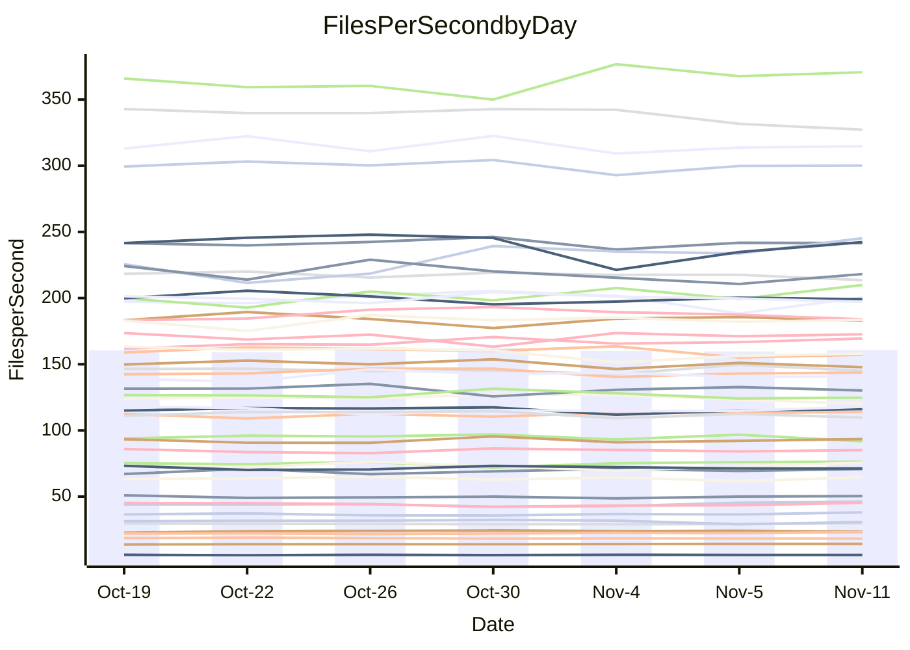

<!---
# This file is auto-generated. Do not edit.
# cspell:disable
--->
# Performance Report

## Daily Performance

## Time to Process Files

| Repository                                      | Elapsed | Min/Avg/Max           |   SD | SD Graph                |
| ----------------------------------------------- | ------: | :-------------------: | ---: | ----------------------- |
| AdaDoom3/AdaDoom3                    |    3.64 | 3.3 /   3.5 /   3.7   | 0.09 | `    ┣━━┻━━╋━━┻━●┫    ` |
| alexiosc/megistos                    |    7.85 | 7.3 /   8.0 /   8.7   | 0.39 | `    ┣━━┻━●╋━━┻━━┫    ` |
| apollographql/apollo-server          |    2.83 | 2.6 /   2.7 /   2.9   | 0.08 | `     ┣━┻━━╋━━●━┫     ` |
| aspnetboilerplate/aspnetboilerplate  |   10.78 | 10.3 /  10.5 /  10.8  | 0.18 | `    ┣━━┻━━╋━━┻●━┫    ` |
| aws-amplify/docs                     |   13.97 | 12.4 /  13.1 /  14.8  | 0.59 | `    ┣━━┻━━╋━━┻━●┫    ` |
| Azure/azure-rest-api-specs           |    9.75 | 9.6 /  10.1 /  11.0   | 0.38 | `    ┣━━●━━╋━━┻━━┫    ` |
| bitjson/typescript-starter           |    1.05 | 1.0 /   1.1 /   1.1   | 0.03 | `     ┣━●━━╋━━┻━┫     ` |
| caddyserver/caddy                    |    3.80 | 3.7 /   3.8 /   4.0   | 0.09 | `    ┣━━┻━●╋━━┻━━┫    ` |
| canada-ca/open-source-logiciel-libre |    1.12 | 1.1 /   1.2 /   1.3   | 0.04 | `     ┣●┻━━╋━━┻━┫     ` |
| chef/chef                            |    6.04 | 5.7 /   6.0 /   6.3   | 0.15 | `    ┣━━┻━━╋●━┻━━┫    ` |
| dart-lang/sdk                        |   68.88 | 63.7 /  67.4 /  72.3  | 2.23 | `  ┣━━━┻━━━╋━━●┻━━━┫  ` |
| django/django                        |   15.55 | 14.9 /  15.8 /  16.7  | 0.47 | `    ┣━━┻━●╋━━┻━━┫    ` |
| eslint/eslint                        |   11.76 | 10.7 /  11.2 /  11.8  | 0.37 | `    ┣━━┻━━╋━━┻━●┫    ` |
| exonum/exonum                        |    3.60 | 3.5 /   3.6 /   3.8   | 0.09 | `    ┣━━┻●━╋━━┻━━┫    ` |
| flutter/samples                      |   17.21 | 16.0 /  16.7 /  17.5  | 0.42 | `    ┣━━┻━━╋━━┻●━┫    ` |
| gitbucket/gitbucket                  |    3.65 | 3.5 /   3.7 /   3.9   | 0.11 | `    ┣━━┻━●╋━━┻━━┫    ` |
| googleapis/google-cloud-cpp          |  145.56 | 139.9 / 148.0 / 158.3 | 4.89 | `  ┣━━━┻━●━╋━━━┻━━━┫  ` |
| graphql/express-graphql              |    1.14 | 1.1 /   1.2 /   1.2   | 0.04 | `     ┣━┻━●╋━━┻━┫     ` |
| graphql/graphql-js                   |    2.93 | 2.8 /   3.0 /   3.2   | 0.10 | `    ┣━━┻━●╋━━┻━━┫    ` |
| graphql/graphql-relay-js             |    1.20 | 1.1 /   1.2 /   1.2   | 0.04 | `     ┣━┻━━╋●━┻━┫     ` |
| graphql/graphql-spec                 |    1.33 | 1.3 /   1.3 /   1.4   | 0.04 | `     ┣━┻●━╋━━┻━┫     ` |
| iluwatar/java-design-patterns        |   13.24 | 12.8 /  13.3 /  14.4  | 0.38 | `    ┣━━┻━●╋━━┻━━┫    ` |
| ktaranov/sqlserver-kit               |    6.89 | 6.6 /   6.8 /   7.1   | 0.16 | `    ┣━━┻━━╋●━┻━━┫    ` |
| liriliri/licia                       |    4.42 | 4.1 /   4.3 /   4.6   | 0.12 | `    ┣━━┻━━╋━━┻●━┫    ` |
| MartinThoma/LaTeX-examples           |    7.22 | 6.8 /   7.1 /   7.6   | 0.19 | `    ┣━━┻━━╋━●┻━━┫    ` |
| mdx-js/mdx                           |    2.02 | 1.9 /   2.0 /   2.2   | 0.08 | `     ┣━┻━●╋━━┻━┫     ` |
| microsoft/TypeScript-Website         |    5.73 | 5.5 /   5.8 /   6.1   | 0.14 | `    ┣━━┻━●╋━━┻━━┫    ` |
| MicrosoftDocs/PowerShell-Docs        |   24.32 | 23.3 /  24.2 /  25.4  | 0.65 | `   ┣━━━┻━━╋●━┻━━━┫   ` |
| neovim/nvim-lspconfig                |    4.35 | 4.3 /   4.4 /   4.6   | 0.09 | `    ┣━━●━━╋━━┻━━┫    ` |
| pagekit/pagekit                      |    3.49 | 3.5 /   3.7 /   4.0   | 0.15 | `    ┣━●┻━━╋━━┻━━┫    ` |
| php/php-src                          |   26.51 | 25.9 /  27.0 /  28.5  | 0.78 | `   ┣━━━┻●━╋━━┻━━━┫   ` |
| plasticrake/tplink-smarthome-api     |    1.39 | 1.3 /   1.4 /   1.5   | 0.05 | `     ┣━┻━●╋━━┻━┫     ` |
| prettier/prettier                    |    7.67 | 7.2 /   7.6 /   7.9   | 0.20 | `    ┣━━┻━━╋●━┻━━┫    ` |
| pycontribs/jira                      |    1.61 | 1.5 /   1.6 /   1.7   | 0.06 | `     ┣━┻━━╋●━┻━┫     ` |
| RustPython/RustPython                |    5.98 | 5.2 /   5.5 /   6.0   | 0.23 | `    ┣━━┻━━╋━━┻━━┫●   ` |
| shoelace-style/shoelace              |    3.05 | 2.9 /   3.0 /   3.2   | 0.08 | `     ┣━┻━━╋━●┻━┫     ` |
| slint-ui/slint                       |   13.88 | 13.3 /  13.8 /  14.4  | 0.38 | `    ┣━━┻━━●━━┻━━┫    ` |
| SoftwareBrothers/admin-bro           |    2.61 | 2.5 /   2.7 /   2.9   | 0.07 | `     ┣━┻●━╋━━┻━┫     ` |
| sveltejs/svelte                      |   21.20 | 20.8 /  22.0 /  22.9  | 0.45 | `   ┣━●━┻━━╋━━┻━━━┫   ` |
| TheAlgorithms/Python                 |    5.65 | 5.7 /   5.8 /   6.0   | 0.08 | `    ┣●━┻━━╋━━┻━━┫    ` |
| twbs/bootstrap                       |    1.90 | 1.8 /   1.9 /   2.0   | 0.06 | `     ┣━┻━━╋━●┻━┫     ` |
| typescript-cheatsheets/react         |    1.38 | 1.4 /   1.4 /   1.6   | 0.06 | `     ┣━●━━╋━━┻━┫     ` |
| typescript-eslint/typescript-eslint  |    4.31 | 4.2 /   4.3 /   4.5   | 0.08 | `    ┣━━┻━━╋●━┻━━┫    ` |
| vitest-dev/vitest                    |    9.33 | 9.2 /   9.9 /  10.9   | 0.50 | `    ┣━●┻━━╋━━┻━━┫    ` |
| w3c/aria-practices                   |    3.70 | 3.4 /   3.6 /   3.8   | 0.10 | `    ┣━━┻━━╋━━┻●━┫    ` |
| w3c/specberus                        |    2.19 | 2.0 /   2.1 /   2.2   | 0.05 | `     ┣━┻━━╋━━┻━┫●    ` |
| webdeveric/webpack-assets-manifest   |    1.15 | 1.2 /   1.2 /   1.3   | 0.04 | `    ●┣━┻━━╋━━┻━┫     ` |
| webpack/webpack                      |    5.71 | 5.5 /   5.8 /   6.7   | 0.27 | `    ┣━━┻━━●━━┻━━┫    ` |
| wireapp/wire-desktop                 |    1.47 | 1.4 /   1.5 /   1.7   | 0.09 | `     ┣━┻━●╋━━┻━┫     ` |
| wireapp/wire-webapp                  |   10.92 | 10.7 /  11.2 /  12.3  | 0.49 | `    ┣━━┻●━╋━━┻━━┫    ` |

Note:
- Elapsed time is in seconds.

## Files per Second over Time

| Repository                                      | Files |    Sec |    Fps |    Rel | Trend Fps            |    N |
| ----------------------------------------------- | ----: | -----: | -----: | -----: | -------------------- | ---: |
| AdaDoom3/AdaDoom3                    |   103 |   3.64 |  28.29 | -4.06% | `▇▇▅▇▅▇▆▆▆▅▆▆▄▆▇██▄` |   17 |
| alexiosc/megistos                    |   583 |   7.85 |  74.31 |  1.26% | `▅▇▄▄▅█▆▅▅▃▅▄▄▇▇▆▇▆` |   17 |
| apollographql/apollo-server          |   253 |   2.83 |  89.42 | -3.19% | `▇█▆▇▄▅▆▆█▇▅▇▇▄▇█▇▅` |   17 |
| aspnetboilerplate/aspnetboilerplate  |  2286 |  10.78 | 212.06 | -2.44% | `▅███▇▆▆█▇▆█▇▇█▆▆▇▆` |   17 |
| aws-amplify/docs                     |  2871 |  13.97 | 205.57 | -6.31% | `█▇▆▇▅███▇▇▅▇▆▆▃█▇▅` |   17 |
| Azure/azure-rest-api-specs           |  2365 |   9.75 | 242.58 |  1.30% | `▅▇▇▆█▇█▇▇▃▅▅▆▇▅▆▇▇` |   17 |
| bitjson/typescript-starter           |    20 |   1.05 |  18.98 |  2.66% | `▆▇█▇█▇▇▆▆▆▆▅▇▇▅▄▅▇` |   17 |
| caddyserver/caddy                    |   288 |   3.80 |  75.87 |  0.51% | `▇▆▇▆▆▇▇█▅▅█▆▆██▇█▇` |   17 |
| canada-ca/open-source-logiciel-libre |     7 |   1.12 |   6.23 |  5.11% | `▇▇▇▄▇▇▇▆▆▇▇▇▄▆█▆▄█` |   17 |
| chef/chef                            |  1191 |   6.04 | 197.19 | -1.59% | `▇▆▇█▇▆█▆▅▇▅▄█▇▇▆▇▆` |   17 |
| dart-lang/sdk                        | 10747 |  68.88 | 156.02 | -1.90% | `▇▇██▆█▇▅▆▅▄▅▇▆▅▆▆▅` |   17 |
| django/django                        |  2885 |  15.55 | 185.51 |  1.47% | `▅▅█▄▅▇▆█▆▇▇▇▄▇▆▆▇▇` |   17 |
| eslint/eslint                        |  2099 |  11.76 | 178.41 | -4.84% | `▅▄▇▇▄▇▇▇▇▅█▆▇▄▇▅▇▄` |   17 |
| exonum/exonum                        |   421 |   3.60 | 117.09 |  1.32% | `██▇▆█▆▆▅▇▆▇▅▇█▇██▇` |   17 |
| flutter/samples                      |  2400 |  17.21 | 139.48 | -3.01% | `▆▆▇▇▅█▆█▇▆▅█▅▆▆▇▇▅` |   17 |
| gitbucket/gitbucket                  |   413 |   3.65 | 113.07 |  0.54% | `▅▆█▅▅█▆▆▆▅█▆█▄▇▆█▇` |   17 |
| googleapis/google-cloud-cpp          | 20952 | 145.56 | 143.94 |  2.00% | `▆▅▆▇▄▇██▇█▆▆▅█▅▅▆▇` |   17 |
| graphql/express-graphql              |    26 |   1.14 |  22.72 |  1.71% | `▅▅▅▆▄▃▄▅▅▄▆▅▄▅▅▅█▅` |   17 |
| graphql/graphql-js                   |   368 |   2.93 | 125.54 |  1.45% | `█▇▅▆█▆█▆█▇█▇▇▅▆▆▄▇` |   17 |
| graphql/graphql-relay-js             |    28 |   1.20 |  23.40 | -1.75% | `▄▅▄▇▅▆▆▇▇▇▅▅▆█▆▆▅▅` |   17 |
| graphql/graphql-spec                 |    19 |   1.33 |  14.30 |  1.49% | `▅▆▆▅▇▄█▆▆▇▇▇▆██▇▆▇` |   17 |
| iluwatar/java-design-patterns        |  1992 |  13.24 | 150.50 |  0.39% | `▇▇▆█▇█▇▅█▄█▇▇▇▇▆▆▇` |   17 |
| ktaranov/sqlserver-kit               |   489 |   6.89 |  70.96 | -0.92% | `██▇▅▇▆▅▇█▇▇▆▇▆██▅▆` |   17 |
| liriliri/licia                       |  1437 |   4.42 | 325.33 | -3.61% | `█▇█▇▇█▇▇██▇█▆▆▆▄█▆` |   17 |
| MartinThoma/LaTeX-examples           |  1409 |   7.22 | 195.04 | -2.28% | `▇█▆▇▆▄█▆█▆▇▅▆▇▇▇▆▆` |   17 |
| mdx-js/mdx                           |   141 |   2.02 |  69.91 |  1.12% | `▄▇▆█▇▄▇▅▆▆█▇█▆▆▇▇▇` |   17 |
| microsoft/TypeScript-Website         |   761 |   5.73 | 132.70 |  0.74% | `▆▆▇▅▇▇█▇▄▅▇█▇▆▆▅▆▇` |   17 |
| MicrosoftDocs/PowerShell-Docs        |  2708 |  24.32 | 111.37 | -0.51% | `▇▆▆▇██▅██▄▆██▆▆▅▅▆` |   17 |
| neovim/nvim-lspconfig                |   759 |   4.35 | 174.65 |  1.89% | `██▆▅▇▇▇▇▅▇█▇▇▆▇▇▇█` |   17 |
| pagekit/pagekit                      |   741 |   3.49 | 212.61 |  5.44% | `▇█▃▅▄▇▇▆▆█▇▅▇▅▇█▇█` |   17 |
| php/php-src                          |  2262 |  26.51 |  85.33 |  0.92% | `▇█▇█▄▇▅▅▇▇▆▇█▄▆▇▆▇` |   17 |
| plasticrake/tplink-smarthome-api     |    62 |   1.39 |  44.53 |  0.58% | `▇▆▇▆▇▆▅▇▄▄▆▆▄▅▆▆█▆` |   17 |
| prettier/prettier                    |  2421 |   7.67 | 315.55 |  0.44% | `▆▆▆█▇▅▅██▅▆▆▇▆▆▆▇▇` |   17 |
| pycontribs/jira                      |    79 |   1.61 |  49.10 | -1.66% | `█▆▇▆▅▄▆█▆▆▅▄█▆▇▇█▆` |   17 |
| RustPython/RustPython                |   693 |   5.98 | 115.90 | -8.39% | `▆▇▆▅█▅▄██▇▆▇▃▆▆▇▇▄` |   17 |
| shoelace-style/shoelace              |   439 |   3.05 | 143.83 | -1.71% | `▇▇▅▆▆▆▅▆▆▇▄▇█▆▆▇▆▆` |   17 |
| slint-ui/slint                       |  2565 |  13.88 | 184.84 |  0.25% | `▅▇▇█▇▅▇█▅▆▇█▆▅█▆▅▇` |   17 |
| SoftwareBrothers/admin-bro           |   441 |   2.61 | 168.89 |  1.88% | `▆▇▄▇▆▇▆▆▇▇▆▇▇▆▇█▆▇` |   17 |
| sveltejs/svelte                      |  8053 |  21.20 | 379.89 |  4.11% | `▆▆▇▆▅▅▅▆▄█▆▆▆▆▇▆▆█` |   17 |
| TheAlgorithms/Python                 |  1399 |   5.65 | 247.55 |  2.76% | `▇▆▇▇▆█▆▇█▅▆▆▇█▇▇▆█` |   17 |
| twbs/bootstrap                       |   118 |   1.90 |  62.25 | -2.28% | `▄▇█▇▆▇█▇▆█▆▆▆▄▅██▆` |   17 |
| typescript-cheatsheets/react         |    53 |   1.38 |  38.40 |  4.83% | `▆▆▆▇▆▇▃▅▅▄██▅▇▄█▆█` |   17 |
| typescript-eslint/typescript-eslint  |  1285 |   4.31 | 298.15 | -0.55% | `▇▇▇█▇▇█▆█▇▅▇▇▇▇▆█▇` |   17 |
| vitest-dev/vitest                    |  2339 |   9.33 | 250.80 |  9.75% | `▄▆▅▄▃▃▄▅▇▇▅▅▇▆▆█▇█` |   17 |
| w3c/aria-practices                   |   414 |   3.70 | 111.78 | -3.36% | `▆▅██▆▇▆▇▇▆▄▇▅▅▇▇█▅` |   17 |
| w3c/specberus                        |   197 |   2.19 |  90.09 | -5.23% | `▇▆▇█▇▇▆███▅▇███▅▇▅` |   17 |
| webdeveric/webpack-assets-manifest   |    55 |   1.15 |  47.63 |  7.35% | `▅▆▆▆▅▇▅▅▄▅▄▇▅▇▆▇▆█` |   17 |
| webpack/webpack                      |  1141 |   5.71 | 199.75 |  1.24% | `▇█▆▇▆█▇▇█▇▇▇▆▃▆▆█▇` |   17 |
| wireapp/wire-desktop                 |    46 |   1.47 |  31.27 |  0.95% | `▇▇▆▇▇▆█▇██▇▅▄▃█▆▆▇` |   17 |
| wireapp/wire-webapp                  |  1783 |  10.92 | 163.27 |  2.71% | `▇▆▇▇█▇█▆▇▇█▄██▄▇▄█` |   17 |

## Data Throughput

| Repository                                      | Files |    Sec |     Kps |    Rel | Trend Kps            |    N |
| ----------------------------------------------- | ----: | -----: | ------: | -----: | -------------------- | ---: |
| AdaDoom3/AdaDoom3                    |   103 |   3.64 |  601.17 | -4.06% | `▇▇▅▇▅▇▆▆▆▅▆▆▄▆▇██▄` |   17 |
| alexiosc/megistos                    |   583 |   7.85 |  583.87 |  1.26% | `▅▇▄▄▅█▆▅▅▃▅▄▄▇▇▆▇▆` |   17 |
| apollographql/apollo-server          |   253 |   2.83 |  730.57 | -2.48% | `▆▇▅▆▄▅▆▅█▇▅▇▇▄▇█▇▅` |   17 |
| aspnetboilerplate/aspnetboilerplate  |  2286 |  10.78 |  515.95 | -2.44% | `▅███▇▆▆█▇▆█▇▇█▆▆▇▆` |   17 |
| aws-amplify/docs                     |  2871 |  13.97 |  717.69 | -6.30% | `█▇▆▇▅███▇▇▅▇▆▆▃█▇▅` |   17 |
| Azure/azure-rest-api-specs           |  2365 |   9.75 |  659.02 |  2.11% | `▅▇▇▆█▇█▇▇▃▅▅▆▇▅▇▇▇` |   17 |
| bitjson/typescript-starter           |    20 |   1.05 |   75.92 |  2.66% | `▆▇█▇█▇▇▆▆▆▆▅▇▇▅▄▅▇` |   17 |
| caddyserver/caddy                    |   288 |   3.80 |  658.09 |  0.75% | `▆▅▇▆▆▇▇█▅▅█▆▆██▇█▇` |   17 |
| canada-ca/open-source-logiciel-libre |     7 |   1.12 |   51.61 |  5.11% | `▇▇▇▄▇▇▇▆▆▇▇▇▄▆█▆▄█` |   17 |
| chef/chef                            |  1191 |   6.04 |  913.92 | -1.48% | `▇▅▆█▇▆█▆▅▇▅▄█▇▇▆▇▆` |   17 |
| dart-lang/sdk                        | 10747 |  68.88 | 1064.71 | -1.79% | `▇▇██▆█▇▅▆▅▄▅▇▆▅▆▆▆` |   17 |
| django/django                        |  2885 |  15.55 | 1164.23 |  1.36% | `▅▅█▅▅▇▆█▆▇▇▇▄▇▇▆▇▇` |   17 |
| eslint/eslint                        |  2099 |  11.76 | 1279.83 | -5.05% | `▅▅▇▇▄▇▇▇▇▅█▆▇▄▇▅▇▄` |   17 |
| exonum/exonum                        |   421 |   3.60 | 1119.96 |  1.32% | `██▇▆█▆▆▅▇▆▇▅▇█▇██▇` |   17 |
| flutter/samples                      |  2400 |  17.21 | 1244.67 | -3.01% | `▆▆▇▇▅█▆█▇▆▅█▅▆▆▇▇▅` |   17 |
| gitbucket/gitbucket                  |   413 |   3.65 |  513.90 |  0.53% | `▅▆█▅▅▇▆▆▆▅█▆█▄▇▆█▆` |   17 |
| googleapis/google-cloud-cpp          | 20952 | 145.56 | 1172.43 |  2.30% | `▆▅▆▇▄▇██▇█▆▆▅█▅▅▆▇` |   17 |
| graphql/express-graphql              |    26 |   1.14 |  103.97 |  1.71% | `▅▅▅▆▄▃▄▅▅▄▆▅▄▅▅▅█▅` |   17 |
| graphql/graphql-js                   |   368 |   2.93 |  728.68 |  1.77% | `▇▇▅▆█▆█▆█▇█▇▇▆▆▆▄▇` |   17 |
| graphql/graphql-relay-js             |    28 |   1.20 |   91.93 | -1.75% | `▄▅▄▇▅▆▆▇▇▇▅▅▆█▆▆▅▅` |   17 |
| graphql/graphql-spec                 |    19 |   1.33 |  477.32 |  1.49% | `▅▆▆▅▇▄█▆▆▇▇▇▆██▇▆▇` |   17 |
| iluwatar/java-design-patterns        |  1992 |  13.24 |  465.19 |  0.39% | `▇▇▆█▇█▇▅█▄█▇▇▇▇▆▆▇` |   17 |
| ktaranov/sqlserver-kit               |   489 |   6.89 | 1074.55 | -0.91% | `██▇▅▇▆▅▇█▇▇▆▇▆██▅▆` |   17 |
| liriliri/licia                       |  1437 |   4.42 |  387.58 | -3.61% | `█▇█▇▇█▇▇██▇█▆▆▆▄█▆` |   17 |
| MartinThoma/LaTeX-examples           |  1409 |   7.22 |  402.82 | -2.28% | `▇█▆▇▆▄█▆█▆▇▅▆▇▇▇▆▆` |   17 |
| mdx-js/mdx                           |   141 |   2.02 |  325.28 |  1.12% | `▄▇▆█▇▄▇▅▆▆█▇█▆▆▇▇▇` |   17 |
| microsoft/TypeScript-Website         |   761 |   5.73 |  917.94 |  0.74% | `▆▆▇▅▇▇█▇▄▅▇█▇▆▆▅▆▇` |   17 |
| MicrosoftDocs/PowerShell-Docs        |  2708 |  24.32 | 1146.81 | -0.47% | `▇▆▆▇██▅██▄▆██▆▆▅▅▆` |   17 |
| neovim/nvim-lspconfig                |   759 |   4.35 |  292.23 |  2.03% | `██▆▅▇▇▇▇▅▇█▇▇▆▇▇▇█` |   17 |
| pagekit/pagekit                      |   741 |   3.49 |  443.29 |  5.44% | `▇█▃▅▄▇▇▆▆█▇▅▇▅▇█▇█` |   17 |
| php/php-src                          |  2262 |  26.51 | 1493.19 |  0.97% | `▇█▇█▄▇▅▅▇▇▆▇█▄▆▇▆▇` |   17 |
| plasticrake/tplink-smarthome-api     |    62 |   1.39 |  240.63 |  0.58% | `▇▆▇▆▇▆▅▇▄▄▆▆▄▅▆▆█▆` |   17 |
| prettier/prettier                    |  2421 |   7.67 |  438.19 |  0.00% | `▆▆▆█▇▅▅██▅▆▆▇▅▆▆▇▆` |   17 |
| pycontribs/jira                      |    79 |   1.61 |  348.02 | -1.66% | `█▆▇▆▅▄▆█▆▆▅▄█▆▇▇█▆` |   17 |
| RustPython/RustPython                |   693 |   5.98 |  964.34 | -5.99% | `▅▆▅▄▇▅▃▇▇█▇█▄▇▇█▇▄` |   17 |
| shoelace-style/shoelace              |   439 |   3.05 |  694.89 | -1.71% | `▇▇▅▆▆▆▅▆▆▇▄▇█▆▆▇▆▆` |   17 |
| slint-ui/slint                       |  2565 |  13.88 | 1140.11 |  0.45% | `▅▇▇█▇▅▇█▅▆▇█▆▅█▆▆▇` |   17 |
| SoftwareBrothers/admin-bro           |   441 |   2.61 |  372.24 |  1.88% | `▆▇▄▇▆▇▆▆▇▇▆▇▇▆▇█▆▇` |   17 |
| sveltejs/svelte                      |  8053 |  21.20 |  253.42 |  4.05% | `▅▆▇▆▅▅▅▆▄█▆▆▆▆▇▆▆▇` |   17 |
| TheAlgorithms/Python                 |  1399 |   5.65 |  629.58 |  2.77% | `▇▆▇▇▆█▆▇█▅▆▆▇█▇▇▆█` |   17 |
| twbs/bootstrap                       |   118 |   1.90 |  511.21 | -2.19% | `▄▇█▇▆▇█▇▆█▆▆▆▄▅██▆` |   17 |
| typescript-cheatsheets/react         |    53 |   1.38 |  284.04 |  4.83% | `▆▆▆▇▆▇▃▅▅▄██▅▇▄█▆█` |   17 |
| typescript-eslint/typescript-eslint  |  1285 |   4.31 | 1536.91 | -0.36% | `▇▇▇█▇▇█▆█▇▅▇▇▇▇▆█▇` |   17 |
| vitest-dev/vitest                    |  2339 |   9.33 |  538.70 |  6.03% | `▅▆▆▄▃▃▅▆██▅▆█▆▆▇▆█` |   17 |
| w3c/aria-practices                   |   414 |   3.70 | 1042.18 | -3.36% | `▆▅██▆▇▆▇▇▆▄▇▅▅▇▇█▅` |   17 |
| w3c/specberus                        |   197 |   2.19 |  284.91 | -5.23% | `▇▆▇█▇▇▆███▅▇███▅▇▅` |   17 |
| webdeveric/webpack-assets-manifest   |    55 |   1.15 |  109.98 |  7.35% | `▅▆▆▆▅▇▅▅▄▅▄▇▅▇▆▇▆█` |   17 |
| webpack/webpack                      |  1141 |   5.71 |  910.88 |  1.53% | `▇█▆▇▆█▇▇█▇▇▇▆▃▅▆█▇` |   17 |
| wireapp/wire-desktop                 |    46 |   1.47 |  174.73 |  0.95% | `▇▇▆▇▇▆█▇██▇▅▄▃█▆▆▇` |   17 |
| wireapp/wire-webapp                  |  1783 |  10.92 |  603.82 |  2.90% | `▇▆▇▇█▇█▆▇▇█▄██▄▇▄█` |   17 |

