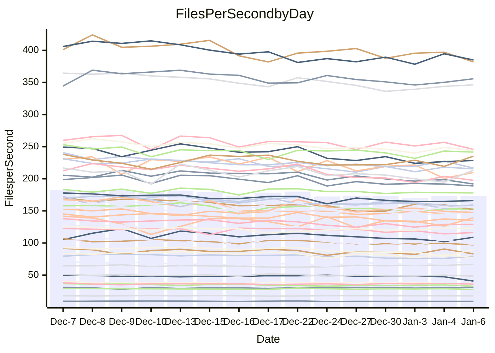

<!---
# This file is auto-generated. Do not edit.
# cspell:disable
--->
# Performance Report

## Daily Performance

## Time to Process Files

| Repository                                      | Elapsed | Min/Avg/Max           |   SD | SD Graph                |
| ----------------------------------------------- | ------: | :-------------------: | ---: | ----------------------- |
| AdaDoom3/AdaDoom3                    |    3.15 | 2.8 /   3.0 /   3.2   | 0.10 | `    ┣━━┻━━╋━━┻━●┫    ` |
| alexiosc/megistos                    |    7.56 | 6.7 /   7.1 /   8.1   | 0.33 | `    ┣━━┻━━╋━━┻●━┫    ` |
| apollographql/apollo-server          |    2.37 | 2.0 /   2.3 /   2.4   | 0.09 | `     ┣━┻━━╋━━●━┫     ` |
| aspnetboilerplate/aspnetboilerplate  |    9.83 | 8.8 /   9.4 /  10.4   | 0.40 | `    ┣━━┻━━╋━━●━━┫    ` |
| aws-amplify/docs                     |   11.85 | 11.3 /  11.8 /  12.5  | 0.35 | `    ┣━━┻━━●━━┻━━┫    ` |
| Azure/azure-rest-api-specs           |   16.28 | 13.8 /  15.3 /  17.0  | 0.83 | `   ┣━━━┻━━╋━━┻●━━┫   ` |
| bitjson/typescript-starter           |    0.64 | 0.6 /   0.7 /   0.7   | 0.02 | `     ┣━●┻━╋━┻━━┫     ` |
| caddyserver/caddy                    |    3.43 | 3.0 /   3.2 /   3.7   | 0.17 | `    ┣━━┻━━╋━━●━━┫    ` |
| canada-ca/open-source-logiciel-libre |    0.77 | 0.7 /   0.8 /   0.8   | 0.02 | `     ┣━━┻━╋●┻━━┫     ` |
| chef/chef                            |    5.74 | 5.0 /   5.4 /   6.0   | 0.26 | `    ┣━━┻━━╋━━┻●━┫    ` |
| dart-lang/sdk                        |   60.87 | 55.8 /  59.2 /  62.8  | 1.83 | `  ┣━━━┻━━━╋━━●┻━━━┫  ` |
| django/django                        |   14.44 | 13.5 /  14.3 /  15.5  | 0.55 | `    ┣━━┻━━╋●━┻━━┫    ` |
| eslint/eslint                        |   10.50 | 9.5 /  10.0 /  10.9   | 0.38 | `    ┣━━┻━━╋━━┻●━┫    ` |
| exonum/exonum                        |    3.12 | 2.9 /   3.2 /   3.7   | 0.19 | `    ┣━━┻━●╋━━┻━━┫    ` |
| flutter/samples                      |   17.14 | 15.8 /  17.0 /  22.0  | 1.14 | `   ┣━━━┻━━●━━┻━━━┫   ` |
| gitbucket/gitbucket                  |    3.14 | 2.9 /   3.1 /   3.4   | 0.12 | `    ┣━━┻━━●━━┻━━┫    ` |
| googleapis/google-cloud-cpp          |  128.24 | 117.0 / 125.9 / 139.4 | 5.11 | `  ┣━━━┻━━━╋━●━┻━━━┫  ` |
| graphql/express-graphql              |    0.72 | 0.7 /   0.7 /   0.8   | 0.02 | `     ┣━━┻━╋●┻━━┫     ` |
| graphql/graphql-js                   |    2.22 | 2.1 /   2.2 /   2.4   | 0.08 | `     ┣━┻━━╋●━┻━┫     ` |
| graphql/graphql-relay-js             |    0.75 | 0.7 /   0.7 /   0.8   | 0.02 | `     ┣━━┻━╋━●━━┫     ` |
| graphql/graphql-spec                 |    0.85 | 0.8 /   0.8 /   0.9   | 0.02 | `     ┣━━┻━╋━●━━┫     ` |
| iluwatar/java-design-patterns        |   12.16 | 10.6 /  11.3 /  13.6  | 0.56 | `    ┣━━┻━━╋━━┻━●┫    ` |
| ktaranov/sqlserver-kit               |    6.17 | 5.9 /   6.2 /   6.6   | 0.21 | `    ┣━━┻━━●━━┻━━┫    ` |
| liriliri/licia                       |    3.70 | 3.2 /   3.6 /   3.8   | 0.13 | `    ┣━━┻━━╋━━●━━┫    ` |
| MartinThoma/LaTeX-examples           |    6.50 | 6.1 /   6.3 /   6.7   | 0.13 | `    ┣━━┻━━╋━━┻●━┫    ` |
| mdx-js/mdx                           |    1.58 | 1.5 /   1.6 /   1.8   | 0.08 | `     ┣━┻━●╋━━┻━┫     ` |
| microsoft/TypeScript-Website         |    5.14 | 4.9 /   5.1 /   5.3   | 0.12 | `    ┣━━┻━━╋●━┻━━┫    ` |
| MicrosoftDocs/PowerShell-Docs        |   19.02 | 17.6 /  18.8 /  25.8  | 1.45 | `   ┣━━━┻━━●━━┻━━━┫   ` |
| neovim/nvim-lspconfig                |    3.15 | 2.8 /   3.0 /   3.4   | 0.13 | `    ┣━━┻━━╋━●┻━━┫    ` |
| pagekit/pagekit                      |    3.44 | 3.0 /   3.3 /   3.8   | 0.18 | `    ┣━━┻━━╋━●┻━━┫    ` |
| php/php-src                          |   23.10 | 20.3 /  21.8 /  25.7  | 1.32 | `   ┣━━━┻━━╋━━●━━━┫   ` |
| plasticrake/tplink-smarthome-api     |    0.88 | 0.9 /   0.9 /   1.0   | 0.03 | `     ┣━●━━╋━━┻━┫     ` |
| prettier/prettier                    |    6.39 | 6.0 /   6.3 /   7.2   | 0.24 | `    ┣━━┻━━╋━●┻━━┫    ` |
| pycontribs/jira                      |    1.20 | 1.2 /   1.2 /   1.3   | 0.03 | `     ┣●┻━━╋━━┻━┫     ` |
| RustPython/RustPython                |    4.19 | 3.9 /   4.1 /   4.6   | 0.14 | `    ┣━━┻━━╋●━┻━━┫    ` |
| shoelace-style/shoelace              |    2.46 | 2.3 /   2.4 /   2.5   | 0.06 | `     ┣━┻━━╋●━┻━┫     ` |
| slint-ui/slint                       |    9.51 | 8.4 /   9.3 /  10.7   | 0.58 | `    ┣━━┻━━╋●━┻━━┫    ` |
| SoftwareBrothers/admin-bro           |    2.07 | 2.0 /   2.1 /   2.3   | 0.09 | `     ┣━┻●━╋━━┻━┫     ` |
| sveltejs/svelte                      |   18.50 | 17.0 /  18.0 /  18.9  | 0.57 | `   ┣━━━┻━━╋━━●━━━┫   ` |
| TheAlgorithms/Python                 |    5.64 | 5.0 /   5.3 /   5.7   | 0.19 | `    ┣━━┻━━╋━━┻━●┫    ` |
| twbs/bootstrap                       |    1.19 | 1.1 /   1.2 /   1.4   | 0.06 | `     ┣━┻━━●━━┻━┫     ` |
| typescript-cheatsheets/react         |    1.30 | 1.0 /   1.1 /   1.1   | 0.02 | `        ┣┻╋┻┫       ●` |
| typescript-eslint/typescript-eslint  |    3.54 | 3.4 /   3.6 /   3.8   | 0.09 | `    ┣━━┻━●╋━━┻━━┫    ` |
| vitest-dev/vitest                    |    8.05 | 7.1 /   7.6 /   8.2   | 0.29 | `    ┣━━┻━━╋━━┻●━┫    ` |
| w3c/aria-practices                   |    2.91 | 2.7 /   2.9 /   3.2   | 0.14 | `    ┣━━┻━━●━━┻━━┫    ` |
| w3c/specberus                        |    1.62 | 1.6 /   1.6 /   1.7   | 0.04 | `     ┣━┻●━╋━━┻━┫     ` |
| webdeveric/webpack-assets-manifest   |    0.69 | 0.6 /   0.7 /   0.7   | 0.01 | `     ┣━━┻━╋━┻━●┫     ` |
| webpack/webpack                      |    4.66 | 4.5 /   4.8 /   5.3   | 0.19 | `    ┣━━┻●━╋━━┻━━┫    ` |
| wireapp/wire-desktop                 |    0.94 | 0.8 /   0.9 /   0.9   | 0.03 | `     ┣━━┻━╋━┻━━┫ ●   ` |
| wireapp/wire-webapp                  |    8.10 | 7.4 /   8.1 /   8.7   | 0.35 | `    ┣━━┻━━●━━┻━━┫    ` |

Note:
- Elapsed time is in seconds.

## Files per Second over Time

| Repository                                      | Files |    Sec |    Fps |     Rel | Trend Fps              |    N |
| ----------------------------------------------- | ----: | -----: | -----: | ------: | ---------------------- | ---: |
| AdaDoom3/AdaDoom3                    |   103 |   3.15 |  32.68 |  -5.89% | `▇▇▇▇█▆▅▄▄▆▅▆▆▅▄▆▅▅▆▄` |   27 |
| alexiosc/megistos                    |   583 |   7.56 |  77.08 |  -6.12% | `█▆▇▇▆█▇▄▅▆▇▆▆▇▅▃▅▇▆▅` |   27 |
| apollographql/apollo-server          |   250 |   2.37 | 105.70 |  -4.83% | `█▆▅▆▇▇▆▇▆▆▅▆▅▅▄▄▆▄▇▅` |   29 |
| aspnetboilerplate/aspnetboilerplate  |  2246 |   9.83 | 228.39 |  -4.36% | `█▇██▆▇█▇▅▅▅▆▆▆▆▆▃▄▅▅` |   27 |
| aws-amplify/docs                     |  2863 |  11.85 | 241.55 |  -0.23% | `█▅█▆█▅▇▇█▇██▇▅▇▅▆▅▇▇` |   28 |
| Azure/azure-rest-api-specs           |  2413 |  16.28 | 148.18 |  -5.93% | `▆▆▃▅▅█▆▆▄▅▅▆▅▆▄▆▆▅▄▄` |   29 |
| bitjson/typescript-starter           |    20 |   0.64 |  31.18 |   3.33% | `▆▇▇▆▇▆▇▇▆██▇███▆▇▅▇█` |   27 |
| caddyserver/caddy                    |   279 |   3.43 |  81.38 |  -5.83% | `▆█▆▅█▇▅▄▆▇▆▆▇▄▆▄▄█▆▅` |   29 |
| canada-ca/open-source-logiciel-libre |     7 |   0.77 |   9.08 |  -1.50% | `▆▇▇▄▅▇█▄▅▅▅▅▅▆▆▆▅▆▅▅` |   27 |
| chef/chef                            |  1204 |   5.74 | 209.82 |  -6.33% | `███▆▇█▅▇█▆▄▆▇▇▄▆▅▇▃▅` |   27 |
| dart-lang/sdk                        | 10056 |  60.87 | 165.21 |  -2.47% | `██▇▆██▅▅▇█▅▇▇▅▅▆▅▆▆▆` |   29 |
| django/django                        |  2817 |  14.44 | 195.10 |  -0.94% | `▇▇▇▇▆█▄▆▆▇▅▆▄▇▆▅▇▆▄▆` |   29 |
| eslint/eslint                        |  2038 |  10.50 | 194.09 |  -4.64% | `▇██▇▇█▆▅▇▇▇▆▇▄▇▅▅▆▄▅` |   29 |
| exonum/exonum                        |   421 |   3.12 | 135.02 |   0.75% | `██▇█▆▆▅▇█▄▅▇█▇▆▇▆▆▇▇` |   27 |
| flutter/samples                      |  2690 |  17.14 | 156.94 |  -1.34% | `█▇████▇█▆▆█▇█▂▇███▆▇` |   29 |
| gitbucket/gitbucket                  |   412 |   3.14 | 131.21 |   0.03% | `██▇▅█▇▅▆▅▅▇▇▅▇▄▇▄▆▆▇` |   29 |
| googleapis/google-cloud-cpp          | 19742 | 128.24 | 153.94 |  -1.99% | `█▆▅▅▇█▆▆▇▆▆▅▆▆▆▅▃▆▇▆` |   29 |
| graphql/express-graphql              |    26 |   0.72 |  36.03 |  -0.96% | `▇█▆▇█▆▆▇█▇▄███▆▆▇██▇` |   27 |
| graphql/graphql-js                   |   339 |   2.22 | 152.97 |  -0.96% | `▇█▆▅▄▇▇▇█▇▆▇▇▆▆▆▄▇▇▇` |   28 |
| graphql/graphql-relay-js             |    28 |   0.75 |  37.24 |  -2.56% | `█▆▅▅▅██▇██▆▇▆▅█▇██▅▆` |   27 |
| graphql/graphql-spec                 |    15 |   0.85 |  17.57 |  -1.68% | `▇█▇▇▇▆▆█▇▆██▇▇▇▆▇█▇▆` |   27 |
| iluwatar/java-design-patterns        |  1849 |  12.16 | 152.07 |  -7.28% | `▇▆▇▇██▇▆▆▇▇▇▆▆▇▇▆▆▇▅` |   29 |
| ktaranov/sqlserver-kit               |   489 |   6.17 |  79.19 |  -0.36% | `█▆▅▇█▇▇▇▅▆▇▆▆▄▄▆▄▄▅▆` |   28 |
| liriliri/licia                       |  1434 |   3.70 | 387.29 |  -3.44% | `▆█▅▅▄▅▅▆▆▆▅▆▅▄▅▆▅▆▄▅` |   28 |
| MartinThoma/LaTeX-examples           |  1409 |   6.50 | 216.61 |  -2.93% | `▇█▇▇▇▇█▇▆▇▇▇▇▅▇▆▇▇█▆` |   27 |
| mdx-js/mdx                           |   142 |   1.58 |  89.68 |   0.86% | `██▇▆▇█▆▇▇▄▇▆▆▃▇▅▅▃▇▇` |   28 |
| microsoft/TypeScript-Website         |   757 |   5.14 | 147.24 |  -0.69% | `▇█▆▆▇▇█▆▅▆▇█▅▅█▆▇▆▇▆` |   28 |
| MicrosoftDocs/PowerShell-Docs        |  2232 |  19.02 | 117.37 |  -1.46% | `▂██▇▇▇▇▇▇▇█▆▅▆▇▇▇▆▆▇` |   29 |
| neovim/nvim-lspconfig                |   373 |   3.15 | 118.48 |  -3.03% | `█▇▇▇██▆▇▅▇▆▇▇▇▆█▄▄▆▆` |   29 |
| pagekit/pagekit                      |   741 |   3.44 | 215.49 |  -3.19% | `▆▇██▇▆▆▆▅▆▃█▅▆▅▃▇▅▆▆` |   27 |
| php/php-src                          |  2212 |  23.10 |  95.77 |  -6.01% | `█▆▃▄██▆▆▆▄▆▅▇▇▃▅▇▇▆▅` |   29 |
| plasticrake/tplink-smarthome-api     |    62 |   0.88 |  70.50 |   4.06% | `▆▇▇▅▆▇▇▇▃▇█▆▇▇█▆▆▇▇█` |   27 |
| prettier/prettier                    |  2203 |   6.39 | 344.63 |  -1.56% | `█▇██▇██▇▇▇▇▇▇▃▇▅▇▇▇▇` |   29 |
| pycontribs/jira                      |    80 |   1.20 |  66.85 |   3.69% | `▇█▆▆▆▅▅▄▆▇▇▅▇▇▇▇▇▇▇█` |   27 |
| RustPython/RustPython                |   621 |   4.19 | 148.08 |  -1.20% | `█▇▇▇▇▇▆▆▆█▆▆▇▆▄▅▇▆▇▆` |   29 |
| shoelace-style/shoelace              |   438 |   2.46 | 178.14 |  -0.95% | `█▅▆▆██▇▇█▆▆█▅▆▅█▇▇▆▆` |   29 |
| slint-ui/slint                       |  1964 |   9.51 | 206.62 |  -1.33% | `█▆█▇▇█▆▆▆▄▆▅▄▆▆▄▃▆▄▆` |   29 |
| SoftwareBrothers/admin-bro           |   441 |   2.07 | 213.42 |   2.75% | `▇▆▇▅▇▇█▇▅▆▇▇▇▅▅▆▃▆▄▇` |   27 |
| sveltejs/svelte                      |  7130 |  18.50 | 385.35 |  -2.45% | `█▇███▆▇▆▆▆██▆▆▅▅▆█▆▆` |   29 |
| TheAlgorithms/Python                 |  1367 |   5.64 | 242.34 |  -5.63% | `▇▅▇▄▇▇▆▆▄▆█▆▅▆▆▄▇▆▅▄` |   29 |
| twbs/bootstrap                       |   120 |   1.19 | 101.25 |   0.63% | `▇█▃▆▇▇█▅▅▅▅▅▆█▇▄▅▆▄▆` |   29 |
| typescript-cheatsheets/react         |    53 |   1.30 |  40.74 | -16.47% | `▆▅▇▅▆▇▇██▇▆█▇▆▇▆▇▇▅ ` |   27 |
| typescript-eslint/typescript-eslint  |  1275 |   3.54 | 359.86 |   0.75% | `▇█▇▇▆▆█▇▇▆▇▆▇▆▄▇▆▆▆▇` |   29 |
| vitest-dev/vitest                    |  1942 |   8.05 | 241.10 |  -3.78% | `██▇▅█▇▇▆▆▇▇▆▅▇▆▄▅▇▆▆` |   29 |
| w3c/aria-practices                   |   405 |   2.91 | 139.33 |   0.11% | `▆▆▆▅▇▆█▇▆▇▆▄▃▇▇▆▆▃▄▆` |   28 |
| w3c/specberus                        |   200 |   1.62 | 123.10 |   1.35% | `▇▇██▇▅▆▆▇█▇▇▇▆▆▇▅▇██` |   28 |
| webdeveric/webpack-assets-manifest   |    19 |   0.69 |  27.52 |  -3.65% | `▅▅▆▅▆▅█▆▇▆▅▇▇▅▇▆▅▇▇▅` |   27 |
| webpack/webpack                      |  1095 |   4.66 | 235.23 |   3.15% | `▇██▆██▆▆▅▅▆▆▆▅▅█▆▆▅▇` |   28 |
| wireapp/wire-desktop                 |    43 |   0.94 |  45.90 |  -7.38% | `▆▆▆▅█▇▅▆▇▆▇▇▅▅▅▅▇▇▇▃` |   29 |
| wireapp/wire-webapp                  |  1337 |   8.10 | 165.10 |   0.28% | `▆▇▇▆█▆▆▆▅▅▇▇▆▇▅▆▇▄▄▇` |   29 |

## Data Throughput

| Repository                                      | Files |    Sec |     Kps |     Rel | Trend Kps              |    N |
| ----------------------------------------------- | ----: | -----: | ------: | ------: | ---------------------- | ---: |
| AdaDoom3/AdaDoom3                    |   103 |   3.15 |  694.44 |  -5.89% | `▇▇▇▇█▆▅▄▄▆▅▆▆▅▄▆▅▅▆▄` |   27 |
| alexiosc/megistos                    |   583 |   7.56 |  605.66 |  -6.12% | `█▆▇▇▆█▇▄▅▆▇▆▆▇▅▃▅▇▆▅` |   27 |
| apollographql/apollo-server          |   250 |   2.37 |  846.01 |  -4.67% | `█▆▅▆▇█▇▇▆▆▅▆▅▅▄▄▆▄▇▅` |   29 |
| aspnetboilerplate/aspnetboilerplate  |  2246 |   9.83 |  537.32 |  -4.36% | `█▇██▆▇█▇▅▅▅▆▆▆▆▆▃▄▅▅` |   27 |
| aws-amplify/docs                     |  2863 |  11.85 |  827.66 |  -0.06% | `█▅█▆█▅▇▇█▇██▇▅▇▅▆▅▇▇` |   28 |
| Azure/azure-rest-api-specs           |  2413 |  16.28 |  427.17 |  -5.84% | `▆▆▃▅▅█▆▆▄▅▅▆▅▆▄▇▆▅▄▄` |   29 |
| bitjson/typescript-starter           |    20 |   0.64 |  124.72 |   3.33% | `▆▇▇▆▇▆▇▇▆██▇███▆▇▅▇█` |   27 |
| caddyserver/caddy                    |   279 |   3.43 |  677.84 |  -5.62% | `▆█▆▅█▇▅▄▆▇▆▇▇▄▆▄▅█▆▅` |   29 |
| canada-ca/open-source-logiciel-libre |     7 |   0.77 |   75.27 |  -1.50% | `▆▇▇▄▅▇█▄▅▅▅▅▅▆▆▆▅▆▅▅` |   27 |
| chef/chef                            |  1204 |   5.74 |  963.72 |  -6.33% | `███▆▇█▅▇█▆▄▆▇▇▄▆▅▇▃▅` |   27 |
| dart-lang/sdk                        | 10056 |  60.87 | 1176.84 |  -2.65% | `██▇▆██▅▅▇█▅▇▇▅▅▆▅▆▆▆` |   29 |
| django/django                        |  2817 |  14.44 | 1207.10 |  -0.76% | `▇▇▇▇▆█▄▇▆▇▅▆▄▇▆▅▇▆▄▆` |   29 |
| eslint/eslint                        |  2038 |  10.50 | 1585.64 |  -4.50% | `▇██▇▇█▆▅▇▇▇▆▇▄▇▅▅▆▄▅` |   29 |
| exonum/exonum                        |   421 |   3.12 | 1291.54 |   0.75% | `██▇█▆▆▅▇█▄▅▇█▇▆▇▆▆▇▇` |   27 |
| flutter/samples                      |  2690 |  17.14 | 1271.19 |  -1.34% | `█▇████▇█▆▆█▇█▂▇███▆▇` |   29 |
| gitbucket/gitbucket                  |   412 |   3.14 |  593.63 |   0.05% | `██▇▅█▇▅▆▅▅▇▇▅▇▄▇▄▆▆▇` |   29 |
| googleapis/google-cloud-cpp          | 19742 | 128.24 | 1201.67 |  -2.03% | `█▆▅▅▇█▆▆▇▆▆▅▆▆▆▅▃▆▇▆` |   29 |
| graphql/express-graphql              |    26 |   0.72 |  164.91 |  -0.96% | `▇█▆▇█▆▆▇█▇▄███▆▆▇██▇` |   27 |
| graphql/graphql-js                   |   339 |   2.22 |  869.09 |  -0.96% | `▇█▆▅▄▇▇▇█▇▆▇▇▆▆▆▄▇▇▇` |   28 |
| graphql/graphql-relay-js             |    28 |   0.75 |  146.32 |  -2.56% | `█▆▅▅▅██▇██▆▇▆▅█▇██▅▆` |   27 |
| graphql/graphql-spec                 |    15 |   0.85 |  646.67 |  -1.65% | `▇█▇▇▇▆▆█▇▆██▇▇▇▆▇█▇▆` |   27 |
| iluwatar/java-design-patterns        |  1849 |  12.16 |  468.61 |  -7.28% | `▇▆▇▇██▇▆▆▇▇▇▆▆▇▇▆▆▇▅` |   29 |
| ktaranov/sqlserver-kit               |   489 |   6.17 | 1198.12 |  -0.36% | `█▆▅▇█▇▇▇▅▆▇▆▆▄▄▆▄▄▅▆` |   28 |
| liriliri/licia                       |  1434 |   3.70 |  458.86 |  -3.44% | `▆█▅▅▄▅▅▆▆▆▅▆▅▄▅▆▅▆▄▅` |   28 |
| MartinThoma/LaTeX-examples           |  1409 |   6.50 |  447.36 |  -2.93% | `▇█▇▇▇▇█▇▆▇▇▇▇▅▇▆▇▇█▆` |   27 |
| mdx-js/mdx                           |   142 |   1.58 |  414.94 |   0.56% | `██▇▆▇█▆▇▇▄▇▆▆▃▇▅▅▃▇▇` |   28 |
| microsoft/TypeScript-Website         |   757 |   5.14 | 1008.32 |  -0.69% | `▇█▆▆▇▇█▆▅▆▇█▅▅█▆▇▆▇▆` |   28 |
| MicrosoftDocs/PowerShell-Docs        |  2232 |  19.02 | 1172.37 |  -1.37% | `▂██▇▇▇▇▇▇▇█▆▅▆▇▇▇▆▆▇` |   29 |
| neovim/nvim-lspconfig                |   373 |   3.15 |  310.35 |  -2.47% | `█▇▇▇██▆▇▅▇▆▇▇▇▆█▄▄▆▆` |   29 |
| pagekit/pagekit                      |   741 |   3.44 |  449.31 |  -3.19% | `▆▇██▇▆▆▆▅▆▃█▅▆▅▃▇▅▆▆` |   27 |
| php/php-src                          |  2212 |  23.10 | 1402.93 |  -5.93% | `█▆▃▄██▆▆▆▄▆▅▇▇▃▅▇▇▆▅` |   29 |
| plasticrake/tplink-smarthome-api     |    62 |   0.88 |  380.95 |   4.06% | `▆▇▇▅▆▇▇▇▃▇█▆▇▇█▆▆▇▇█` |   27 |
| prettier/prettier                    |  2203 |   6.39 |  486.52 |  -1.75% | `█▇██▇██▇▇▇▇▇▇▃▇▅▇▇▇▇` |   29 |
| pycontribs/jira                      |    80 |   1.20 |  460.43 |   3.69% | `▇█▆▆▆▅▅▄▆▇▇▅▇▇▇▇▇▇▇█` |   27 |
| RustPython/RustPython                |   621 |   4.19 | 1093.07 |  -1.15% | `█▇▇▇▇▇▆▆▆█▆▆▇▆▄▅▇▆▇▆` |   29 |
| shoelace-style/shoelace              |   438 |   2.46 |  855.74 |  -0.88% | `█▅▆▆██▇▇█▆▆█▅▆▅█▇▇▆▆` |   29 |
| slint-ui/slint                       |  1964 |   9.51 | 1057.59 |  -1.37% | `█▆█▇▇█▆▆▆▄▆▅▄▆▆▄▃▆▃▆` |   29 |
| SoftwareBrothers/admin-bro           |   441 |   2.07 |  470.39 |   2.75% | `▇▆▇▅▇▇█▇▅▆▇▇▇▅▅▆▃▆▄▇` |   27 |
| sveltejs/svelte                      |  7130 |  18.50 |  253.37 |  -2.93% | `█▆▇▇▇▅▆▆▅▅▇▇▅▆▅▅▅▇▆▆` |   29 |
| TheAlgorithms/Python                 |  1367 |   5.64 |  615.88 |  -5.34% | `▇▅▇▄▇▇▆▆▄▆█▆▅▆▆▄▇▇▆▅` |   29 |
| twbs/bootstrap                       |   120 |   1.19 |  812.56 |   0.63% | `▇█▃▆▇▇█▅▅▅▅▅▆█▇▄▅▆▄▆` |   29 |
| typescript-cheatsheets/react         |    53 |   1.30 |  298.26 | -16.47% | `▆▅▇▅▆▇▇██▇▆█▇▆▇▆▇▇▅ ` |   27 |
| typescript-eslint/typescript-eslint  |  1275 |   3.54 | 1730.42 |   1.73% | `▇█▇▇▆▆█▇▇▇▇▆▇▆▄▇▆▆▇█` |   29 |
| vitest-dev/vitest                    |  1942 |   8.05 |  496.72 |  -3.71% | `██▇▅██▇▇▇██▆▅▇▇▅▅▇▇▆` |   29 |
| w3c/aria-practices                   |   405 |   2.91 | 1293.85 |  -0.05% | `▆▆▆▅▇▆█▇▆▇▆▄▃▇▇▆▆▃▄▆` |   28 |
| w3c/specberus                        |   200 |   1.62 |  392.68 |   1.35% | `▇▇██▇▅▆▆▇█▇▇▇▆▆▇▅▇██` |   28 |
| webdeveric/webpack-assets-manifest   |    19 |   0.69 |  147.72 |  -3.65% | `▅▅▆▅▆▅█▆▇▆▅▇▇▅▇▆▅▇▇▅` |   27 |
| webpack/webpack                      |  1095 |   4.66 | 1037.79 |   3.17% | `▇██▆██▆▆▅▅▆▆▆▅▅█▆▆▅▇` |   28 |
| wireapp/wire-desktop                 |    43 |   0.94 |  202.80 |  -7.31% | `▆▆▆▅█▇▅▆▇▆▇▇▅▅▅▅▇▇▇▄` |   29 |
| wireapp/wire-webapp                  |  1337 |   8.10 |  668.07 |  -0.08% | `▇▇▇▆█▆▆▆▅▅▇▇▆▇▅▆▇▄▄▇` |   29 |

