<!---
# This file is auto-generated. Do not edit.
# cspell:disable
--->
# Performance Report

```mermaid
xychart-beta
    title Files Per Second by Day
    y-axis Files per Second
    x-axis Date [Dec-14, Dec-15, Dec-16, Dec-20, Dec-22, Dec-23, Dec-24, Dec-27, Dec-28, Dec-29, Dec-30, Jan-1, Jan-4, Jan-5, Jan-6, Jan-7, Jan-8, Jan-9, Jan-10, Jan-11, Jan-13]
    bar [160.30, 159.32, 159.99, 160.32, 171.41, 173.30, 173.54, 170.88, 173.10, 172.87, 170.63, 172.55, 170.72, 165.99, 165.55, 169.22, 174.07, 185.19, 187.45, 188.92, 192.07]
    line [38.38, 37.81, 37.32, 38.13, 39.99, 39.24, 39.22, 39.13, 37.99, 37.43, 37.30, 38.53, 37.44, 35.32, 32.27, 37.29, 39.53, 40.03, 40.97, 40.73, 40.13]
    line [62.93, 65.98, 63.02, 64.70, 64.39, 64.92, 64.92, 65.76, 63.97, 65.18, 60.36, 63.48, 65.17, 62.63, 59.94, 62.94, 68.03, 71.19, 73.13, 70.56, 71.48]
    line [148.72, 148.74, 148.66, 145.81, 145.83, 151.65, 150.82, 149.41, 147.54, 148.32, 148.24, 148.81, 152.12, 144.06, 141.46, 148.01, 153.69, 163.45, 163.04, 162.47, 161.55]
    line [125.99, 122.54, 125.77, 120.95, 129.07, 131.35, 128.71, 129.73, 130.21, 126.25, 125.32, 128.46, 125.36, 119.96, 121.55, 126.54, 132.92, 138.94, 136.24, 140.09, 140.65]
    line [23.97, 21.89, 24.77, 24.75, 25.98, 24.78, 24.02, 24.07, 23.90, 24.05, 23.79, 23.47, 23.84, 21.71, 20.06, 22.54, 25.57, 25.37, 26.38, 26.59, 26.93]
    line [49.91, 50.66, 50.34, 50.02, 51.61, 51.21, 51.38, 49.64, 48.60, 49.52, 48.09, 50.03, 48.82, 46.25, 44.36, 47.22, 53.09, 55.75, 56.48, 57.02, 57.24]
    line [95.79, 93.99, 95.03, 91.66, 95.50, 94.32, 94.29, 94.73, 94.34, 95.29, 95.11, 98.41, 97.41, 93.11, 86.98, 96.48, 99.80, 107.59, 107.79, 102.30, 101.69]
    line [69.49, 68.20, 68.29, 71.18, 72.28, 72.81, 72.16, 72.22, 72.29, 71.63, 70.43, 69.31, 70.55, 65.48, 65.68, 67.02, 74.90, 75.80, 79.70, 78.59, 80.85]
    line [136.83, 140.59, 128.00, 132.13, 140.04, 140.36, 136.98, 135.57, 135.50, 134.25, 129.01, 139.25, 139.78, 129.55, 131.60, 134.11, 136.19, 147.37, 149.33, 150.95, 147.38]
    line [113.19, 111.86, 113.23, 116.22, 119.95, 116.76, 117.75, 118.71, 118.58, 117.32, 112.42, 116.77, 113.28, 107.29, 110.98, 110.70, 119.74, 122.80, 129.73, 128.79, 125.88]
    line [124.97, 121.63, 124.44, 114.40, 117.66, 113.42, 116.57, 120.86, 116.04, 115.61, 111.25, 114.64, 107.26, 104.85, 102.99, 109.30, 116.77, 127.71, 114.20, 134.12, 122.04]
    line [75.62, 71.86, 75.70, 72.52, 79.52, 79.75, 79.57, 78.19, 78.53, 81.17, 72.47, 80.44, 78.06, 78.74, 77.69, 75.81, 82.18, 88.38, 87.15, 87.31, 86.93]
    line [6.12, 5.85, 6.27, 5.94, 6.19, 6.23, 6.06, 5.80, 6.19, 6.04, 6.09, 6.29, 6.13, 5.79, 5.41, 5.66, 6.15, 6.86, 6.90, 6.81, 6.57]
    line [336.28, 339.96, 335.03, 330.81, 346.52, 335.23, 343.48, 342.97, 326.49, 346.96, 341.41, 349.59, 332.44, 321.99, 323.13, 336.38, 352.94, 374.70, 389.29, 376.57, 385.46]
    line [167.10, 169.90, 168.25, 171.20, 165.98, 169.49, 175.43, 173.51, 166.13, 173.69, 176.28, 174.86, 172.30, 168.35, 166.48, 160.20, 176.21, 192.32, 196.53, 187.68, 193.33]
    line [161.97, 169.28, 168.79, 164.45, 163.90, 173.08, 173.52, 171.67, 165.07, 170.82, 168.89, 168.46, 160.87, 163.97, 157.39, 159.96, 176.03, 182.37, 173.15, 184.83, 184.70]
    line [14.42, 14.66, 14.20, 14.14, 14.58, 14.66, 13.81, 14.51, 13.39, 13.58, 14.12, 14.33, 14.46, 13.75, 12.60, 13.58, 14.59, 15.66, 15.79, 15.64, 15.94]
    line [109.61, 115.93, 113.66, 115.36, 122.68, 121.26, 119.81, 119.36, 122.21, 121.33, 118.71, 119.46, 120.59, 115.93, 111.61, 116.47, 122.24, 129.36, 128.91, 133.62, 132.63]
    line [200.36, 207.64, 202.85, 200.31, 210.29, 210.04, 207.76, 200.78, 205.77, 199.55, 199.57, 206.34, 210.39, 198.78, 192.42, 197.28, 209.87, 213.91, 219.61, 218.24, 217.92]
    line [111.22, 109.33, 106.79, 113.91, 116.30, 113.89, 119.27, 121.25, 119.32, 118.60, 119.88, 120.18, 120.91, 116.77, 113.59, 115.36, 119.01, 126.14, 130.00, 129.60, 127.67]
    line [31.89, 31.67, 31.01, 31.00, 31.79, 31.95, 32.72, 33.00, 31.56, 31.04, 31.19, 31.58, 30.98, 28.44, 27.47, 29.34, 33.19, 34.45, 32.48, 34.06, 34.19]
    line [45.75, 43.43, 44.94, 44.85, 45.35, 43.98, 45.75, 48.03, 44.47, 43.53, 43.39, 44.67, 43.92, 40.38, 37.83, 41.50, 45.72, 48.43, 43.80, 48.21, 47.12]
    line [97.42, 87.40, 93.20, 92.02, 98.77, 95.06, 94.41, 95.55, 97.07, 96.22, 92.57, 92.92, 91.62, 91.70, 90.24, 93.64, 97.75, 101.99, 101.23, 103.65, 104.97]
    line [75.07, 76.77, 72.26, 69.84, 77.03, 74.27, 74.27, 73.83, 75.96, 75.41, 73.52, 70.94, 72.13, 67.68, 66.21, 71.65, 76.02, 80.93, 84.19, 83.66, 81.75]
    line [48.05, 47.07, 45.85, 42.75, 47.52, 47.21, 45.81, 45.88, 45.34, 46.09, 44.04, 43.96, 44.61, 40.41, 39.77, 41.67, 47.14, 50.43, 48.76, 50.39, 47.97]
    line [22.26, 24.16, 21.86, 22.99, 23.86, 22.95, 22.15, 22.59, 22.93, 22.71, 21.96, 22.43, 22.76, 19.93, 19.65, 21.35, 23.88, 24.29, 22.74, 25.52, 24.85]
    line [298.40, 299.27, 280.90, 293.45, 278.89, 296.00, 294.23, 289.77, 295.71, 297.33, 290.64, 293.31, 297.11, 291.75, 279.45, 292.30, 315.14, 325.37, 329.28, 331.31, 327.41]
    line [216.35, 210.81, 207.51, 213.81, 235.09, 232.12, 236.13, 235.71, 228.72, 232.65, 236.79, 238.66, 239.84, 237.65, 227.69, 241.17, 242.31, 251.84, 257.31, 259.03, 255.06]
    line [192.55, 195.85, 196.96, 197.31, 203.68, 215.88, 203.82, 209.47, 208.55, 206.80, 208.32, 210.94, 208.87, 204.66, 200.55, 205.66, 217.93, 227.16, 232.86, 230.33, 233.70]
    line [18.71, 17.35, 18.44, 18.66, 19.39, 19.24, 18.95, 18.61, 19.20, 19.16, 18.64, 18.56, 18.69, 15.82, 15.37, 16.82, 19.06, 19.36, 19.05, 20.04, 19.14]
    line [308.67, 318.29, 308.47, 312.68, 311.01, 311.87, 322.19, 317.56, 317.24, 315.38, 325.99, 315.10, 321.37, 318.36, 304.42, 303.41, 319.39, 327.56, 357.94, 329.89, 341.06]
    line [192.31, 202.71, 196.90, 201.49, 199.06, 199.67, 194.62, 190.28, 203.79, 203.98, 206.16, 191.99, 203.06, 195.28, 197.18, 199.76, 210.90, 223.95, 228.77, 221.68, 228.38]
    line [71.99, 68.96, 71.11, 72.00, 74.62, 76.21, 75.66, 76.28, 80.16, 75.45, 77.29, 76.83, 75.96, 77.04, 75.98, 75.37, 79.34, 80.97, 83.22, 85.10, 83.74]
    line [162.92, 155.61, 157.24, 162.25, 174.81, 169.46, 179.44, 172.82, 176.92, 167.34, 176.43, 176.94, 178.99, 168.22, 166.87, 176.13, 175.56, 186.67, 196.90, 196.60, 192.13]
    line [233.41, 237.39, 235.87, 236.73, 241.85, 239.59, 240.67, 245.15, 245.04, 246.20, 235.52, 245.54, 241.43, 227.89, 226.93, 235.13, 241.29, 256.22, 256.06, 239.94, 251.62]
    line [139.02, 141.78, 142.36, 140.50, 151.95, 150.33, 152.02, 150.72, 154.90, 153.82, 147.24, 149.99, 145.79, 146.47, 145.32, 149.61, 152.47, 167.66, 162.55, 150.60, 167.38]
    line [185.77, 186.35, 184.33, 182.33, 191.53, 189.75, 189.98, 177.07, 192.83, 190.79, 182.79, 190.84, 188.67, 194.33, 177.58, 179.97, 187.56, 204.85, 175.41, 212.66, 223.00]
    line [199.50, 195.58, 198.56, 202.04, 205.76, 202.04, 203.32, 201.04, 202.44, 203.10, 195.80, 206.74, 207.91, 185.17, 183.38, 197.81, 213.96, 231.09, 232.21, 230.83, 221.47]
    line [219.56, 233.62, 231.32, 236.32, 236.26, 240.94, 253.96, 249.85, 237.45, 249.30, 236.26, 250.59, 240.41, 245.35, 243.40, 249.06, 252.82, 269.41, 273.80, 263.96, 272.80]
    line [29.78, 30.86, 29.89, 30.20, 33.22, 32.90, 33.40, 32.96, 33.38, 32.90, 31.64, 32.05, 31.87, 30.32, 30.13, 30.52, 32.45, 34.68, 36.83, 37.61, 37.16]
    line [185.74, 173.94, 185.68, 184.19, 188.28, 188.11, 196.54, 189.53, 183.55, 193.13, 194.30, 182.73, 194.72, 192.90, 184.51, 177.92, 195.10, 212.88, 219.97, 208.62, 216.43]
    line [350.76, 385.22, 356.23, 361.41, 363.52, 371.74, 360.07, 349.58, 358.00, 357.09, 358.22, 365.46, 375.72, 366.42, 366.13, 364.89, 378.25, 407.03, 408.32, 400.13, 413.39]
    line [148.44, 146.25, 144.57, 148.51, 160.26, 155.20, 157.30, 154.76, 157.76, 156.45, 156.97, 156.48, 161.27, 156.23, 155.16, 163.04, 163.18, 170.50, 178.84, 176.33, 176.98]
    line [185.43, 191.26, 188.26, 189.10, 196.56, 199.42, 199.83, 198.90, 201.82, 194.83, 201.20, 199.08, 201.68, 196.07, 191.44, 191.98, 208.77, 213.46, 218.16, 220.17, 216.71]
    line [107.51, 105.11, 109.29, 110.23, 118.20, 116.66, 113.51, 116.56, 110.18, 116.43, 113.57, 116.81, 116.74, 114.96, 116.34, 117.08, 121.26, 127.78, 131.45, 132.46, 134.65]
    line [210.51, 204.56, 210.18, 211.34, 200.66, 223.22, 223.16, 220.54, 207.84, 221.69, 222.09, 227.69, 222.11, 226.42, 218.19, 221.48, 227.88, 240.46, 239.34, 239.80, 241.18]
    line [82.91, 77.95, 81.87, 81.89, 89.30, 90.84, 89.17, 86.07, 86.04, 90.94, 91.20, 88.38, 89.72, 82.57, 85.29, 87.34, 86.74, 95.27, 97.94, 97.30, 99.54]
    line [236.16, 237.46, 237.06, 237.81, 238.36, 240.26, 242.42, 235.97, 234.05, 235.94, 244.60, 237.90, 238.37, 234.19, 223.75, 225.18, 243.31, 257.18, 256.97, 252.12, 254.75]
    line [157.90, 164.74, 161.04, 164.69, 164.20, 175.57, 172.74, 173.87, 177.24, 172.99, 166.08, 180.17, 181.21, 173.75, 179.71, 177.60, 181.52, 194.07, 204.27, 201.52, 203.67]
    line [142.91, 137.61, 141.27, 139.39, 164.22, 164.25, 165.65, 160.55, 167.52, 164.35, 162.61, 160.21, 152.67, 150.17, 151.88, 156.83, 157.18, 166.03, 166.95, 174.59, 178.02]
```

Daily Performance

Time to Process Files

| Repository                                      | Elapsed | Min/Avg/Max           |   SD | SD Graph                |
| ----------------------------------------------- | ------: | :-------------------: | ---: | ----------------------- |
| AdaDoom3/AdaDoom3                    |    2.79 | 2.7 /   3.2 /   3.6   | 0.22 | `    ┣●━┻━━╋━━┻━━┫    ` |
| alexiosc/megistos                    |    7.05 | 6.9 /   7.9 /   9.9   | 0.58 | `    ┣●━┻━━╋━━┻━━┫    ` |
| apollographql/apollo-server          |    2.46 | 2.3 /   2.7 /   3.1   | 0.15 | `     ┣●┻━━╋━━┻━┫     ` |
| aspnetboilerplate/aspnetboilerplate  |    9.33 | 8.6 /   9.8 /  12.5   | 0.66 | `    ┣━━┻●━╋━━┻━━┫    ` |
| aws-amplify/docs                     |   11.84 | 11.8 /  13.0 /  15.9  | 0.71 | `    ┣●━┻━━╋━━┻━━┫    ` |
| Azure/azure-rest-api-specs           |    9.16 | 9.1 /  10.2 /  11.7   | 0.51 | `    ●━━┻━━╋━━┻━━┫    ` |
| bitjson/typescript-starter           |    1.04 | 1.0 /   1.1 /   1.4   | 0.10 | `     ┣━┻●━╋━━┻━┫     ` |
| caddyserver/caddy                    |    3.39 | 3.2 /   3.7 /   4.3   | 0.23 | `    ┣━━●━━╋━━┻━━┫    ` |
| canada-ca/open-source-logiciel-libre |    1.09 | 1.0 /   1.1 /   1.4   | 0.08 | `     ┣━┻●━╋━━┻━┫     ` |
| chef/chef                            |    5.14 | 5.2 /   5.9 /   6.8   | 0.36 | `    ●━━┻━━╋━━┻━━┫    ` |
| dart-lang/sdk                        |   53.21 | 53.4 /  61.9 /  70.9  | 4.21 | `  ●━━━┻━━━╋━━━┻━━━┫  ` |
| django/django                        |   13.06 | 13.1 /  15.1 /  17.0  | 0.89 | `   ●┣━━┻━━╋━━┻━━┫    ` |
| eslint/eslint                        |    9.33 | 9.3 /  10.4 /  11.3   | 0.51 | `    ●━━┻━━╋━━┻━━┫    ` |
| exonum/exonum                        |    3.27 | 3.2 /   3.6 /   4.1   | 0.19 | `    ┣●━┻━━╋━━┻━━┫    ` |
| flutter/samples                      |   15.01 | 14.2 /  16.3 /  22.6  | 1.27 | `   ┣━━━●━━╋━━┻━━━┫   ` |
| gitbucket/gitbucket                  |    3.13 | 3.1 /   3.5 /   4.0   | 0.20 | `    ┣●━┻━━╋━━┻━━┫    ` |
| googleapis/google-cloud-cpp          |  118.78 | 117.3 / 133.9 / 155.9 | 9.35 | `  ┣●━━┻━━━╋━━━┻━━━┫  ` |
| graphql/express-graphql              |    1.05 | 1.0 /   1.2 /   1.4   | 0.10 | `     ┣━●━━╋━━┻━┫     ` |
| graphql/graphql-js                   |    2.72 | 2.5 /   2.9 /   3.2   | 0.15 | `     ┣━●━━╋━━┻━┫     ` |
| graphql/graphql-relay-js             |    1.04 | 1.0 /   1.2 /   1.5   | 0.10 | `     ┣●┻━━╋━━┻━┫     ` |
| graphql/graphql-spec                 |    1.17 | 1.2 /   1.3 /   1.6   | 0.10 | `     ●━┻━━╋━━┻━┫     ` |
| iluwatar/java-design-patterns        |   11.19 | 11.1 /  12.6 /  14.1  | 0.69 | `   ●┣━━┻━━╋━━┻━━┫    ` |
| ktaranov/sqlserver-kit               |    6.00 | 5.6 /   6.4 /   7.2   | 0.35 | `    ┣━━●━━╋━━┻━━┫    ` |
| liriliri/licia                       |    3.87 | 3.6 /   4.2 /   4.7   | 0.24 | `    ┣━●┻━━╋━━┻━━┫    ` |
| MartinThoma/LaTeX-examples           |    6.41 | 6.1 /   6.9 /   8.5   | 0.52 | `    ┣━━●━━╋━━┻━━┫    ` |
| mdx-js/mdx                           |    1.77 | 1.7 /   2.0 /   2.2   | 0.13 | `     ┣●┻━━╋━━┻━┫     ` |
| microsoft/TypeScript-Website         |    5.30 | 4.9 /   5.6 /   6.2   | 0.29 | `    ┣━━●━━╋━━┻━━┫    ` |
| MicrosoftDocs/PowerShell-Docs        |   20.08 | 19.2 /  22.6 /  25.1  | 1.38 | `   ┣●━━┻━━╋━━┻━━━┫   ` |
| neovim/nvim-lspconfig                |    4.08 | 3.9 /   4.4 /   4.9   | 0.23 | `    ┣━●┻━━╋━━┻━━┫    ` |
| pagekit/pagekit                      |    3.47 | 3.3 /   3.6 /   4.0   | 0.16 | `    ┣━━●━━╋━━┻━━┫    ` |
| php/php-src                          |   22.36 | 22.4 /  25.8 /  30.2  | 1.56 | `   ●━━━┻━━╋━━┻━━━┫   ` |
| plasticrake/tplink-smarthome-api     |    1.24 | 1.2 /   1.4 /   1.7   | 0.11 | `     ┣━●━━╋━━┻━┫     ` |
| prettier/prettier                    |    7.38 | 7.0 /   7.9 /   8.5   | 0.29 | `    ┣●━┻━━╋━━┻━━┫    ` |
| pycontribs/jira                      |    1.40 | 1.4 /   1.6 /   1.9   | 0.12 | `     ┣●┻━━╋━━┻━┫     ` |
| RustPython/RustPython                |    5.96 | 5.3 /   6.2 /   7.4   | 0.49 | `    ┣━━┻━●╋━━┻━━┫    ` |
| shoelace-style/shoelace              |    2.73 | 2.7 /   2.9 /   3.3   | 0.13 | `     ┣●┻━━╋━━┻━┫     ` |
| slint-ui/slint                       |   11.81 | 11.9 /  13.9 /  15.8  | 0.79 | ` ●  ┣━━┻━━╋━━┻━━┫    ` |
| SoftwareBrothers/admin-bro           |    2.35 | 2.4 /   2.6 /   2.9   | 0.14 | `     ●━┻━━╋━━┻━┫     ` |
| sveltejs/svelte                      |   20.11 | 19.9 /  22.3 /  24.7  | 1.14 | `   ┣●━━┻━━╋━━┻━━━┫   ` |
| TheAlgorithms/Python                 |    5.65 | 5.4 /   5.8 /   6.7   | 0.27 | `    ┣━━┻●━╋━━┻━━┫    ` |
| twbs/bootstrap                       |    1.68 | 1.6 /   1.8 /   2.1   | 0.11 | `     ┣━●━━╋━━┻━┫     ` |
| typescript-cheatsheets/react         |    1.32 | 1.3 /   1.4 /   1.9   | 0.11 | `     ┣━┻●━╋━━┻━┫     ` |
| typescript-eslint/typescript-eslint  |    4.04 | 3.8 /   4.4 /   4.9   | 0.24 | `    ┣━●┻━━╋━━┻━━┫    ` |
| vitest-dev/vitest                    |    8.52 | 8.7 /   9.9 /  11.6   | 0.53 | `  ● ┣━━┻━━╋━━┻━━┫    ` |
| w3c/aria-practices                   |    3.38 | 3.0 /   3.5 /   4.0   | 0.20 | `    ┣━━┻●━╋━━┻━━┫    ` |
| w3c/specberus                        |    2.03 | 1.8 /   2.1 /   2.6   | 0.14 | `     ┣━┻━●╋━━┻━┫     ` |
| webdeveric/webpack-assets-manifest   |    1.18 | 1.1 /   1.2 /   1.6   | 0.10 | `     ┣━┻●━╋━━┻━┫     ` |
| webpack/webpack                      |    4.88 | 4.8 /   5.5 /   6.1   | 0.32 | `    ┣●━┻━━╋━━┻━━┫    ` |
| wireapp/wire-desktop                 |    1.33 | 1.2 /   1.4 /   1.7   | 0.11 | `     ┣━┻●━╋━━┻━┫     ` |
| wireapp/wire-webapp                  |   10.74 | 9.1 /  10.5 /  12.0   | 0.65 | `    ┣━━┻━━╋●━┻━━┫    ` |

Note:
- Elapsed time is in seconds.

Files per Second over Time

| Repository                                      | Files |    Sec |    Fps |    Rel | Trend Fps              |    N |
| ----------------------------------------------- | ----: | -----: | -----: | -----: | ---------------------- | ---: |
| AdaDoom3/AdaDoom3                    |   103 |   2.79 |  36.97 | 14.33% | `▃▄▃▃▄▄▃▄▅▆▆▆▇▆▇████▇` |   56 |
| alexiosc/megistos                    |   583 |   7.05 |  82.65 | 11.71% | `▃▄▄▄▄▅▅▅▆▇█▇▇▇████▇█` |   56 |
| apollographql/apollo-server          |   253 |   2.46 | 102.82 |  7.92% | `▄▄▄▅▅▅▅▅▆▆▇▆▇▇▇▆▇██▇` |   56 |
| aspnetboilerplate/aspnetboilerplate  |  2286 |   9.33 | 244.96 |  4.50% | `▆▆▅▄▆▇▆▆▆▇▇█▇▇█████▇` |   56 |
| aws-amplify/docs                     |  2874 |  11.84 | 242.83 |  9.31% | `▅▅▆▆▆▆▆▆▇▇▇████▇████` |   56 |
| Azure/azure-rest-api-specs           |  2441 |   9.16 | 266.44 | 11.49% | `▃▄▆▅▃▄▄▅▆▇▇▇█▇▇▇▇▆▆█` |   56 |
| bitjson/typescript-starter           |    20 |   1.04 |  19.25 |  4.81% | `▂▂▂▃▄▄▄▅▆█▆▇▄█▆▇▇▇▆▆` |   56 |
| caddyserver/caddy                    |   290 |   3.39 |  85.61 |  7.74% | `▅▅▅▅▅▄▅▅▆▇▇███▇█▇▇█▇` |   56 |
| canada-ca/open-source-logiciel-libre |     7 |   1.09 |   6.41 |  4.67% | `▃▃▃▂▅▃▄▄▆▆█▇█▇▇▇█▇▇▆` |   56 |
| chef/chef                            |  1196 |   5.14 | 232.72 | 14.74% | `▄▅▅▄▅▅▅▅▄████▆█▇█▆▇█` |   56 |
| dart-lang/sdk                        | 10911 |  53.21 | 205.06 | 15.85% | `▅▆▅▅▅▅▅▅▅▆▇▇▇▇██▇███` |   56 |
| django/django                        |  2888 |  13.06 | 221.14 | 15.06% | `▅▃▄▄▃▂▄▃▅█▇▇▇▇██▇▅▇█` |   56 |
| eslint/eslint                        |  2062 |   9.33 | 221.00 | 10.93% | `▄▄▄▄▄▆▃▇▅█▇▇▆▇████▇█` |   56 |
| exonum/exonum                        |   421 |   3.27 | 128.89 | 10.47% | `▄▄▄▄▅▄▄▅▅▇▇▇▄████▇▆█` |   56 |
| flutter/samples                      |  2441 |  15.01 | 162.62 |  8.38% | `▅▅▆▅▆▆▆▄▆██▇██▇██▂█▇` |   56 |
| gitbucket/gitbucket                  |   413 |   3.13 | 131.99 | 10.19% | `▄▄▄▂▅▅▅▅▅█▇█▇▇▇█████` |   56 |
| googleapis/google-cloud-cpp          | 21014 | 118.78 | 176.91 | 12.23% | `▅▄▄▅▄▅▅▄▅▇▇▆▇▆▇██▇██` |   56 |
| graphql/express-graphql              |    26 |   1.05 |  24.73 |  9.71% | `▃▃▃▂▅▄▅▆▆▇▆▇▆█▆▇██▇▇` |   56 |
| graphql/graphql-js                   |   368 |   2.72 | 135.31 |  5.28% | `▄▄▄▃▅▄▅▆▄▇▇▆█▇▆▇█▇█▆` |   56 |
| graphql/graphql-relay-js             |    28 |   1.04 |  26.99 | 12.51% | `▂▃▃▂▄▅▅▇▇▇█▇▇▅██████` |   56 |
| graphql/graphql-spec                 |    19 |   1.17 |  16.21 | 13.70% | `▃▄▃▂▅▄▅▆▆▇█▇▇▇█▇▇█▇█` |   56 |
| iluwatar/java-design-patterns        |  1992 |  11.19 | 177.95 | 12.40% | `▄▄▄▅▅▆▆▅▅▇▇▆▇▇██████` |   56 |
| ktaranov/sqlserver-kit               |   489 |   6.00 |  81.56 |  6.48% | `▄▅▅▄▆▄▅▅▅▇▅▆▇▇▇██▆█▆` |   56 |
| liriliri/licia                       |  1437 |   3.87 | 371.61 |  7.97% | `▃▃▄▃▄▄▄▅▅▆▆▆▆██▇▆▇█▆` |   56 |
| MartinThoma/LaTeX-examples           |  1409 |   6.41 | 219.82 |  7.45% | `▃▃▃▄▆▅▅▅▆█████████▇▇` |   56 |
| mdx-js/mdx                           |   141 |   1.77 |  79.44 | 11.37% | `▄▃▃▃▄▅▃▆▅▆▇▇▇▃▇▇▇██▇` |   56 |
| microsoft/TypeScript-Website         |   761 |   5.30 | 143.65 |  4.74% | `▄▅▅▄▄▅▄▅▅▅▆▇▇█▇█▇▇█▆` |   56 |
| MicrosoftDocs/PowerShell-Docs        |  2645 |  20.08 | 131.74 | 12.32% | `▄▅▅▄▄▄▅▅▅▆▆▇▇▅▇▇█▇█▇` |   56 |
| neovim/nvim-lspconfig                |   768 |   4.08 | 188.09 |  8.06% | `▅▄▃▄▄▃▄▅▄▇▇█▇▇█▇▅██▇` |   56 |
| pagekit/pagekit                      |   741 |   3.47 | 213.77 |  4.21% | `▃▃▄▄▆▄▅▆▆▇▆▆█████▇█▇` |   56 |
| php/php-src                          |  2265 |  22.36 | 101.29 | 14.84% | `▅▅▄▅▄▅▅▅▄▆▇▇▆▇▇█▆█▇█` |   56 |
| plasticrake/tplink-smarthome-api     |    62 |   1.24 |  49.91 |  9.98% | `▄▄▃▂▄▅▃▅▆███▇█▇██▇▆▇` |   56 |
| prettier/prettier                    |  2512 |   7.38 | 340.17 |  7.26% | `▄▃▄▄▄▄▄▅▄▆▆▆▅▅█▇▅▅▇▇` |   56 |
| pycontribs/jira                      |    79 |   1.40 |  56.31 | 11.65% | `▃▃▂▃▄▃▅▅▆█▇█▅█▇█▇██▇` |   56 |
| RustPython/RustPython                |   719 |   5.96 | 120.57 |  3.63% | `▃▃▂▂▄▄▄▅▆▅█▅▇▇▅███▆▆` |   56 |
| shoelace-style/shoelace              |   439 |   2.73 | 161.03 |  6.99% | `▃▄▄▄▅▅▆▅▆▇█▇████▇██▇` |   56 |
| slint-ui/slint                       |  2642 |  11.81 | 223.79 | 18.38% | `▃▃▄▄▄▃▄▄▅▅▆█▆▅▃▆████` |   56 |
| SoftwareBrothers/admin-bro           |   441 |   2.35 | 187.92 | 11.01% | `▃▄▄▃▅▅▃▆▆▇▇█▇▇▆█▇█▇█` |   56 |
| sveltejs/svelte                      |  8260 |  20.11 | 410.67 | 10.87% | `▅▃▅▆▅▅▅▅▅▇▇██████▆██` |   56 |
| TheAlgorithms/Python                 |  1400 |   5.65 | 247.98 |  3.31% | `▅▅▅▄▇▅▆▆▅███▇██▄▆██▇` |   56 |
| twbs/bootstrap                       |   118 |   1.68 |  70.13 |  7.83% | `▃▃▄▃▅▄▅▅▆▇▇▇▇▇█▆█▆▇▇` |   56 |
| typescript-cheatsheets/react         |    53 |   1.32 |  40.03 |  5.53% | `▂▃▄▄▅▆▆▇▇████▇██████` |   56 |
| typescript-eslint/typescript-eslint  |  1298 |   4.04 | 321.35 |  7.88% | `▃▄▃▄▄▅▄▅▆█▇██▇▇██▇█▇` |   56 |
| vitest-dev/vitest                    |  2438 |   8.52 | 286.27 | 16.09% | `▅▅▅▅▅▆▅▄▆▇█▇▅▇▇▆▇▇▆█` |   56 |
| w3c/aria-practices                   |   414 |   3.38 | 122.45 |  3.69% | `▄▄▄▄▅▄▅▅▅▅▇▇▇▄▇█▆▇█▆` |   56 |
| w3c/specberus                        |   197 |   2.03 |  97.10 |  0.96% | `▅▄▂▄▅▆▆▆▆██████▆█▇█▆` |   56 |
| webdeveric/webpack-assets-manifest   |    55 |   1.18 |  46.58 |  5.00% | `▃▃▃▃▄▅▄▅▇▆▇▆▇▇▅█▆▆▇▆` |   56 |
| webpack/webpack                      |  1139 |   4.88 | 233.59 | 11.72% | `▄▅▃▃▅▄▅▅▅▇▅██▇▇█▇▇██` |   56 |
| wireapp/wire-desktop                 |    44 |   1.33 |  33.20 |  5.37% | `▂▃▄▃▄▄▄▇▆▇▇█▆█▆▇█▇█▇` |   56 |
| wireapp/wire-webapp                  |  2063 |  10.74 | 192.03 | 10.49% | `▄▅▄▄▅▆▅▄▅▇▆▆▇▇████▇▇` |   56 |

Data Throughput

| Repository                                      | Files |    Sec |     Kps |    Rel | Trend Kps              |    N |
| ----------------------------------------------- | ----: | -----: | ------: | -----: | ---------------------- | ---: |
| AdaDoom3/AdaDoom3                    |   103 |   2.79 |  785.69 | 14.33% | `▃▄▃▃▄▄▃▄▅▆▆▆▇▆▇████▇` |   56 |
| alexiosc/megistos                    |   583 |   7.05 |  649.44 | 11.71% | `▃▄▄▄▄▅▅▅▆▇█▇▇▇████▇█` |   56 |
| apollographql/apollo-server          |   253 |   2.46 |  841.25 |  7.92% | `▄▄▄▅▅▅▅▅▆▆▇▆▇▇▇▆▇██▇` |   56 |
| aspnetboilerplate/aspnetboilerplate  |  2286 |   9.33 |  596.00 |  4.50% | `▆▆▅▄▆▇▆▆▆▇▇█▇▇█████▇` |   56 |
| aws-amplify/docs                     |  2874 |  11.84 |  848.73 |  9.31% | `▅▅▆▆▆▆▆▆▇▇▇████▇████` |   56 |
| Azure/azure-rest-api-specs           |  2441 |   9.16 |  702.61 | 11.23% | `▃▄▆▅▃▄▄▅▆▇▇▇█▇▇▇▇▆▆█` |   56 |
| bitjson/typescript-starter           |    20 |   1.04 |   77.01 |  4.81% | `▂▂▂▃▄▄▄▅▆█▆▇▄█▆▇▇▇▆▆` |   56 |
| caddyserver/caddy                    |   290 |   3.39 |  751.56 |  7.99% | `▅▅▅▅▅▄▅▅▆▇▇███▇█▇▇█▇` |   56 |
| canada-ca/open-source-logiciel-libre |     7 |   1.09 |   53.08 |  4.67% | `▃▃▃▂▅▃▄▄▆▆█▇█▇▇▇█▇▇▆` |   56 |
| chef/chef                            |  1196 |   5.14 | 1080.50 | 14.65% | `▄▅▅▄▅▅▅▅▄████▆█▇█▆▇█` |   56 |
| dart-lang/sdk                        | 10911 |  53.21 | 1390.85 | 15.91% | `▅▆▅▅▅▅▅▅▅▆▇▇▇▇██▇███` |   56 |
| django/django                        |  2888 |  13.06 | 1394.30 | 15.21% | `▅▃▄▄▃▂▄▃▅█▇▇▇▇██▇▅▇█` |   56 |
| eslint/eslint                        |  2062 |   9.33 | 1528.35 | 11.27% | `▄▄▄▄▄▆▃▇▅█▇▇▆▇████▇█` |   56 |
| exonum/exonum                        |   421 |   3.27 | 1232.90 | 10.47% | `▄▄▄▄▅▄▄▅▅▇▇▇▄████▇▆█` |   56 |
| flutter/samples                      |  2441 |  15.01 | 1428.76 |  8.32% | `▅▅▆▅▆▆▆▄▆██▇██▇██▂█▇` |   56 |
| gitbucket/gitbucket                  |   413 |   3.13 |  601.77 | 10.43% | `▄▄▄▂▅▅▅▅▅█▇█▇▇▇█████` |   56 |
| googleapis/google-cloud-cpp          | 21014 | 118.78 | 1441.04 | 12.29% | `▅▄▄▅▄▅▅▄▅▇▇▆▇▆▇██▇██` |   56 |
| graphql/express-graphql              |    26 |   1.05 |  113.17 |  9.71% | `▃▃▃▂▅▄▅▆▆▇▆▇▆█▆▇██▇▇` |   56 |
| graphql/graphql-js                   |   368 |   2.72 |  785.37 |  5.28% | `▄▄▄▃▅▄▅▆▄▇▇▆█▇▆▇█▇█▆` |   56 |
| graphql/graphql-relay-js             |    28 |   1.04 |  106.04 | 12.51% | `▂▃▃▂▄▅▅▇▇▇█▇▇▅██████` |   56 |
| graphql/graphql-spec                 |    19 |   1.17 |  540.95 | 13.70% | `▃▄▃▂▅▄▅▆▆▇█▇▇▇█▇▇█▇█` |   56 |
| iluwatar/java-design-patterns        |  1992 |  11.19 |  550.02 | 12.40% | `▄▄▄▅▅▆▆▅▅▇▇▆▇▇██████` |   56 |
| ktaranov/sqlserver-kit               |   489 |   6.00 | 1235.01 |  6.48% | `▄▅▅▄▆▄▅▅▅▇▅▆▇▇▇██▆█▆` |   56 |
| liriliri/licia                       |  1437 |   3.87 |  442.73 |  7.97% | `▃▃▄▃▄▄▄▅▅▆▆▆▆██▇▆▇█▆` |   56 |
| MartinThoma/LaTeX-examples           |  1409 |   6.41 |  453.98 |  7.45% | `▃▃▃▄▆▅▅▅▆█████████▇▇` |   56 |
| mdx-js/mdx                           |   141 |   1.77 |  369.04 | 11.37% | `▄▃▃▃▄▅▃▆▅▆▇▇▇▃▇▇▇██▇` |   56 |
| microsoft/TypeScript-Website         |   761 |   5.30 |  993.63 |  4.74% | `▄▅▅▄▄▅▄▅▅▅▆▇▇█▇█▇▇█▆` |   56 |
| MicrosoftDocs/PowerShell-Docs        |  2645 |  20.08 | 1377.11 | 12.53% | `▄▅▅▄▄▄▅▅▅▆▆▇▇▅▇▇█▇█▇` |   56 |
| neovim/nvim-lspconfig                |   768 |   4.08 |  350.46 |  8.02% | `▅▄▃▄▄▃▄▅▄▇▇█▇▇█▇▅██▇` |   56 |
| pagekit/pagekit                      |   741 |   3.47 |  445.70 |  4.21% | `▃▃▄▄▆▄▅▆▆▇▆▆█████▇█▇` |   56 |
| php/php-src                          |  2265 |  22.36 | 1774.08 | 14.86% | `▅▅▄▅▄▅▅▅▄▆▇▇▆▇▇█▆█▇█` |   56 |
| plasticrake/tplink-smarthome-api     |    62 |   1.24 |  269.70 |  9.98% | `▄▄▃▂▄▅▃▅▆███▇█▇██▇▆▇` |   56 |
| prettier/prettier                    |  2512 |   7.38 |  484.80 |  7.09% | `▄▃▄▄▄▄▄▅▄▆▆▆▅▅█▇▅▅▇▇` |   56 |
| pycontribs/jira                      |    79 |   1.40 |  399.12 | 11.65% | `▃▃▂▃▄▃▅▅▆█▇█▅█▇█▇██▇` |   56 |
| RustPython/RustPython                |   719 |   5.96 | 1414.15 |  7.53% | `▃▃▂▂▄▄▄▅▆▅█▅▇▇▅███▆▆` |   56 |
| shoelace-style/shoelace              |   439 |   2.73 |  778.01 |  6.99% | `▃▄▄▄▅▅▆▅▆▇█▇████▇██▇` |   56 |
| slint-ui/slint                       |  2642 |  11.81 | 1380.88 | 18.24% | `▃▃▄▄▄▃▄▄▅▅▆█▆▅▃▆████` |   56 |
| SoftwareBrothers/admin-bro           |   441 |   2.35 |  414.19 | 11.01% | `▃▄▄▃▅▅▃▆▆▇▇█▇▇▆█▇█▇█` |   56 |
| sveltejs/svelte                      |  8260 |  20.11 |  275.39 | 10.76% | `▅▃▅▆▅▅▅▅▅▇▇██████▆██` |   56 |
| TheAlgorithms/Python                 |  1400 |   5.65 |  631.47 |  3.34% | `▅▅▅▄▇▅▆▆▅███▇██▄▆██▇` |   56 |
| twbs/bootstrap                       |   118 |   1.68 |  575.89 |  7.83% | `▃▃▄▃▅▄▅▅▆▇▇▇▇▇█▆█▆▇▇` |   56 |
| typescript-cheatsheets/react         |    53 |   1.32 |  296.04 |  5.53% | `▂▃▄▄▅▆▆▇▇████▇██████` |   56 |
| typescript-eslint/typescript-eslint  |  1298 |   4.04 | 1664.43 |  7.98% | `▃▄▃▄▄▅▄▅▆█▇██▇▇██▇█▇` |   56 |
| vitest-dev/vitest                    |  2438 |   8.52 |  623.85 | 16.28% | `▅▅▅▅▅▆▅▄▆▆█▇▅▇▇▆▇▇▆█` |   56 |
| w3c/aria-practices                   |   414 |   3.38 | 1141.68 |  3.69% | `▄▄▄▄▅▄▅▅▅▅▇▇▇▄▇█▆▇█▆` |   56 |
| w3c/specberus                        |   197 |   2.03 |  307.06 |  0.96% | `▅▄▂▄▅▆▆▆▆██████▆█▇█▆` |   56 |
| webdeveric/webpack-assets-manifest   |    55 |   1.18 |  106.71 |  5.00% | `▃▃▃▃▄▅▄▅▇▆▇▆▇▇▅█▆▆▇▆` |   56 |
| webpack/webpack                      |  1139 |   4.88 | 1079.16 | 11.81% | `▄▅▃▃▅▄▅▅▅▇▅██▇▇█▇▇██` |   56 |
| wireapp/wire-desktop                 |    44 |   1.33 |  147.87 |  5.47% | `▂▃▄▃▄▄▄▇▆▇▇█▆█▆▇█▇█▇` |   56 |
| wireapp/wire-webapp                  |  2063 |  10.74 |  737.97 | 13.31% | `▄▅▅▄▅▆▅▄▅▇▆▆▇▇██████` |   56 |

