<!---
# This file is auto-generated. Do not edit.
# cspell:disable
--->
# Performance Report

## Daily Performance

```mermaid
xychart-beta
    title Files Per Second by Day
    y-axis Files per Second
    x-axis Date [Nov-2, Nov-3, Nov-4, Nov-5, Nov-6, Nov-7, Nov-8, Nov-9, Nov-10, Nov-12, Nov-17, Nov-19, Nov-22, Nov-23, Nov-25, Nov-26, Nov-27, Nov-28, Dec-2]
    bar [181.41, 181.83, 180.03, 177.03, 180.02, 181.19, 180.85, 185.26, 182.11, 183.02, 179.67, 181.22, 181.55, 184.70, 192.57, 183.27, 184.75, 182.79, 184.99]
    line [31.49, 27.98, 30.33, 30.80, 30.49, 31.24, 30.45, 31.85, 30.57, 31.13, 30.89, 30.94, 31.34, 30.76, 0.00, 30.81, 30.58, 31.64, 29.90]
    line [39.20, 40.08, 39.54, 40.28, 39.64, 39.74, 38.81, 37.90, 39.54, 38.73, 39.95, 40.00, 37.29, 39.41, 0.00, 39.61, 38.93, 39.59, 39.21]
    line [9.31, 9.31, 9.15, 9.14, 9.20, 9.09, 9.19, 9.27, 8.92, 9.14, 9.18, 8.84, 9.32, 9.24, 0.00, 9.27, 9.05, 9.13, 9.38]
    line [128.47, 126.54, 125.96, 128.10, 126.48, 129.06, 126.84, 130.40, 128.50, 126.86, 127.39, 128.53, 129.02, 122.85, 124.15, 127.61, 128.38, 128.27, 127.96]
    line [95.01, 87.81, 92.12, 91.82, 94.84, 93.87, 94.75, 84.15, 93.85, 94.70, 94.62, 92.44, 90.51, 94.24, 0.00, 91.28, 92.74, 93.28, 95.50]
    line [238.13, 248.60, 234.68, 231.98, 234.98, 230.05, 223.17, 216.85, 227.77, 231.99, 238.91, 233.06, 237.44, 231.81, 0.00, 229.54, 227.35, 233.78, 239.72]
    line [142.08, 141.79, 134.81, 142.76, 139.88, 142.79, 144.44, 140.29, 132.61, 142.45, 144.07, 134.61, 146.19, 141.96, 0.00, 142.52, 141.79, 143.85, 132.83]
    line [112.83, 118.13, 116.33, 113.51, 117.50, 115.81, 118.63, 116.72, 116.49, 116.48, 117.45, 112.12, 117.70, 117.75, 118.80, 116.72, 112.25, 111.37, 118.51]
    line [68.50, 72.61, 67.57, 70.12, 69.24, 70.59, 70.35, 69.51, 68.69, 67.71, 70.32, 71.50, 69.84, 71.46, 0.00, 68.63, 69.18, 70.98, 71.07]
    line [137.42, 138.47, 136.81, 134.26, 133.45, 139.44, 136.40, 136.32, 131.65, 134.94, 137.19, 136.33, 132.82, 127.42, 141.81, 137.38, 133.61, 136.04, 138.47]
    line [82.90, 85.80, 87.11, 84.45, 83.88, 83.68, 89.12, 87.30, 84.78, 87.41, 87.06, 86.68, 84.68, 84.66, 0.00, 86.16, 86.09, 86.12, 86.10]
    line [233.46, 237.64, 215.17, 224.62, 227.06, 227.82, 230.59, 232.99, 231.54, 235.20, 225.87, 229.42, 231.39, 232.22, 233.95, 231.55, 229.52, 231.73, 230.37]
    line [225.89, 219.34, 227.90, 223.41, 226.89, 231.20, 232.42, 233.76, 216.82, 232.75, 231.73, 227.11, 220.77, 232.83, 0.00, 226.61, 230.78, 225.94, 228.40]
    line [366.29, 362.14, 364.28, 361.14, 363.96, 367.65, 347.60, 375.37, 367.87, 367.07, 371.79, 359.89, 353.22, 368.32, 374.93, 365.77, 365.67, 369.95, 352.91]
    line [158.57, 160.95, 158.00, 160.31, 147.15, 159.42, 156.12, 164.10, 153.25, 158.83, 162.50, 155.26, 161.99, 161.00, 160.02, 155.33, 155.60, 159.85, 157.03]
    line [213.81, 209.04, 216.16, 216.14, 213.21, 213.46, 209.61, 218.80, 218.08, 206.42, 211.56, 214.70, 201.32, 208.63, 216.56, 211.21, 211.52, 202.80, 207.87]
    line [18.82, 18.54, 18.97, 18.76, 18.55, 18.73, 18.36, 18.35, 19.12, 18.64, 18.32, 18.95, 18.34, 18.44, 18.84, 18.37, 18.41, 18.93, 18.48]
    line [91.13, 92.48, 92.53, 87.65, 91.37, 92.01, 91.93, 94.57, 93.46, 93.94, 91.73, 87.45, 91.05, 94.79, 93.97, 94.67, 91.62, 92.04, 86.62]
    line [413.22, 414.38, 421.70, 412.03, 421.51, 412.86, 422.15, 414.20, 436.61, 418.89, 419.72, 418.60, 416.16, 419.91, 420.14, 425.45, 413.25, 414.49, 414.13]
    line [170.56, 173.64, 167.90, 172.53, 172.53, 170.03, 165.93, 170.87, 155.75, 175.08, 172.86, 174.82, 173.87, 168.75, 0.00, 168.42, 172.41, 165.34, 178.00]
    line [67.26, 68.82, 68.00, 67.86, 65.51, 63.67, 64.87, 66.76, 67.56, 66.97, 68.98, 66.79, 63.49, 65.54, 67.63, 65.16, 64.17, 67.20, 67.10]
    line [36.34, 35.21, 36.89, 35.49, 35.63, 36.38, 37.15, 37.84, 35.87, 36.08, 37.20, 36.20, 36.44, 36.12, 0.00, 36.09, 35.82, 35.94, 35.10]
    line [154.88, 156.33, 151.90, 155.38, 149.97, 157.16, 151.98, 154.79, 156.47, 154.38, 143.43, 149.38, 154.11, 161.15, 140.96, 153.09, 157.58, 151.62, 150.61]
    line [82.09, 84.81, 83.10, 81.93, 82.15, 84.55, 84.56, 84.50, 82.79, 84.08, 81.67, 82.81, 81.19, 83.62, 0.00, 81.43, 78.64, 84.26, 78.88]
    line [251.19, 246.42, 246.40, 248.00, 243.11, 246.73, 252.50, 246.24, 251.54, 252.31, 250.79, 249.89, 259.20, 257.89, 248.21, 247.03, 244.22, 263.12, 252.89]
    line [190.47, 194.38, 184.13, 185.17, 189.74, 189.19, 183.94, 184.74, 191.91, 183.56, 186.00, 187.01, 192.19, 191.67, 0.00, 182.52, 184.50, 184.37, 180.13]
    line [120.57, 121.21, 121.39, 121.32, 116.47, 124.25, 122.72, 125.93, 124.62, 120.74, 122.33, 123.30, 126.42, 130.12, 126.69, 118.47, 125.05, 124.39, 115.88]
    line [36.80, 39.02, 37.93, 37.67, 37.57, 37.08, 36.63, 38.88, 36.70, 37.54, 37.45, 37.05, 37.59, 38.10, 0.00, 36.55, 37.13, 38.36, 37.28]
    line [102.94, 97.99, 100.19, 101.63, 104.36, 102.75, 108.04, 105.75, 108.53, 107.61, 103.87, 104.59, 104.39, 110.58, 106.99, 105.01, 108.35, 107.81, 104.02]
    line [169.29, 170.21, 167.93, 169.20, 166.04, 167.77, 170.78, 172.83, 169.54, 170.69, 168.51, 170.43, 152.49, 164.76, 169.85, 169.02, 158.91, 164.95, 167.24]
    line [209.94, 210.45, 210.46, 205.70, 195.00, 206.27, 202.50, 195.41, 214.93, 208.44, 206.40, 204.90, 203.63, 207.69, 210.97, 200.63, 206.29, 201.28, 203.16]
    line [249.82, 255.91, 247.24, 251.21, 246.70, 252.56, 252.48, 253.34, 246.50, 250.04, 248.32, 248.40, 243.10, 246.46, 253.84, 244.86, 252.77, 242.22, 250.75]
    line [265.53, 262.27, 265.13, 268.91, 260.25, 268.67, 265.98, 276.77, 250.02, 272.22, 269.63, 262.78, 266.27, 264.63, 265.39, 262.12, 264.70, 259.96, 267.12]
    line [107.07, 102.94, 104.39, 101.54, 105.44, 103.31, 109.90, 104.67, 104.85, 104.85, 102.15, 102.24, 108.41, 107.84, 102.72, 107.24, 107.62, 105.35, 104.37]
    line [144.69, 143.99, 152.36, 147.11, 149.93, 152.49, 155.90, 160.36, 152.28, 150.06, 152.05, 158.28, 146.52, 158.85, 0.00, 155.81, 155.95, 156.73, 153.23]
    line [173.21, 172.35, 171.74, 166.28, 171.14, 173.72, 175.33, 180.56, 166.86, 160.67, 171.35, 173.67, 163.99, 174.13, 171.44, 171.10, 169.17, 169.92, 156.42]
    line [355.86, 364.55, 364.46, 351.23, 368.55, 361.63, 363.56, 361.00, 364.43, 360.15, 365.05, 367.22, 354.80, 363.64, 373.17, 364.09, 364.55, 368.33, 360.08]
    line [126.18, 126.17, 125.20, 123.91, 124.93, 127.28, 124.63, 124.24, 125.03, 125.24, 123.48, 121.57, 127.94, 124.68, 128.18, 123.81, 124.58, 126.05, 121.44]
    line [50.64, 52.57, 51.30, 51.37, 51.10, 52.20, 48.34, 51.40, 48.84, 50.71, 51.87, 51.27, 48.95, 50.74, 51.36, 50.08, 50.94, 50.51, 51.36]
    line [224.45, 225.63, 219.89, 210.23, 216.75, 222.44, 224.03, 222.14, 214.23, 209.04, 218.60, 212.59, 214.66, 226.79, 0.00, 213.37, 216.21, 222.03, 191.91]
    line [238.45, 230.34, 237.13, 232.97, 242.75, 238.83, 237.46, 245.31, 238.15, 238.92, 243.36, 234.75, 243.01, 243.28, 229.25, 233.06, 241.24, 236.91, 240.36]
    line [263.29, 262.92, 253.89, 248.33, 260.33, 260.40, 262.23, 265.71, 267.34, 258.77, 260.78, 261.46, 264.14, 258.29, 259.88, 261.65, 261.27, 259.85, 259.59]
    line [49.95, 51.96, 49.47, 50.81, 49.63, 49.77, 48.97, 50.50, 48.94, 50.11, 50.42, 50.32, 51.47, 51.26, 50.21, 50.12, 50.94, 45.60, 50.75]
    line [142.98, 143.73, 145.11, 140.08, 145.92, 145.09, 140.71, 145.23, 139.03, 143.66, 147.67, 143.64, 145.07, 148.78, 145.20, 139.52, 142.17, 141.34, 138.40]
    line [27.90, 29.48, 29.46, 29.34, 29.13, 28.68, 28.99, 28.78, 28.56, 28.81, 27.61, 29.00, 27.12, 28.69, 0.00, 29.62, 29.42, 28.97, 30.07]
    line [166.03, 163.82, 171.58, 163.50, 168.96, 172.75, 170.15, 173.41, 171.14, 167.37, 166.50, 171.04, 166.81, 168.79, 172.43, 172.30, 165.40, 170.85, 167.09]
    line [395.05, 414.08, 397.19, 404.53, 393.69, 403.73, 402.78, 401.18, 398.88, 404.51, 401.52, 385.51, 402.83, 398.10, 400.47, 401.59, 405.72, 393.85, 407.78]
    line [173.75, 173.21, 170.21, 168.22, 175.85, 174.73, 178.68, 179.16, 176.80, 173.86, 176.80, 174.52, 178.44, 183.84, 176.75, 178.41, 176.49, 178.04, 178.10]
    line [162.92, 163.47, 161.58, 153.47, 160.59, 159.17, 156.54, 166.82, 162.10, 163.95, 153.46, 157.33, 159.29, 160.15, 167.27, 163.00, 166.53, 160.28, 164.60]
    line [0.00, 0.00, 0.00, 0.00, 0.00, 0.00, 0.00, 0.00, 0.00, 0.00, 216.65, 210.39, 209.57, 206.62, 225.23, 216.74, 223.01, 218.30, 218.24]
```

## Time to Process Files

| Repository                                      | Elapsed | Min/Avg/Max           |   SD | SD Graph                |
| ----------------------------------------------- | ------: | :-------------------: | ---: | ----------------------- |
| AdaDoom3/AdaDoom3                    |    2.93 | 2.6 /   2.8 /   3.1   | 0.08 | `     ┣━┻━━╋━━●━┫     ` |
| alexiosc/megistos                    |    6.77 | 6.4 /   6.8 /   7.3   | 0.21 | `    ┣━━┻━●╋━━┻━━┫    ` |
| apollographql/apollo-server          |    2.13 | 2.1 /   2.2 /   2.6   | 0.09 | `     ┣━┻●━╋━━┻━┫     ` |
| aspnetboilerplate/aspnetboilerplate  |    8.88 | 8.5 /   9.0 /   9.8   | 0.26 | `    ┣━━┻●━╋━━┻━━┫    ` |
| aws-amplify/docs                     |   11.33 | 11.0 /  11.4 /  12.3  | 0.28 | `    ┣━━┻━●╋━━┻━━┫    ` |
| Azure/azure-rest-api-specs           |   15.53 | 13.7 /  14.4 /  16.5  | 0.51 | `    ┣━━┻━━╋━━┻━━┫●   ` |
| bitjson/typescript-starter           |    0.67 | 0.6 /   0.7 /   0.8   | 0.03 | `     ┣━━┻━╋━●━━┫     ` |
| caddyserver/caddy                    |    3.28 | 2.9 /   3.0 /   3.3   | 0.10 | `     ┣━┻━━╋━━┻━┫ ●   ` |
| canada-ca/open-source-logiciel-libre |    0.75 | 0.7 /   0.8 /   0.9   | 0.02 | `     ┣━━●━╋━┻━━┫     ` |
| chef/chef                            |    5.15 | 5.0 /   5.3 /   7.1   | 0.31 | `    ┣━━┻━●╋━━┻━━┫    ` |
| dart-lang/sdk                        |   56.40 | 52.2 /  56.3 /  63.6  | 1.96 | `   ┣━━┻━━━●━━━┻━━┫   ` |
| django/django                        |   13.42 | 13.0 /  13.6 /  15.4  | 0.52 | `    ┣━━┻━●╋━━┻━━┫    ` |
| eslint/eslint                        |    9.44 | 8.9 /   9.6 /  10.4   | 0.32 | `    ┣━━┻━●╋━━┻━━┫    ` |
| exonum/exonum                        |    3.17 | 2.9 /   3.0 /   3.4   | 0.11 | `    ┣━━┻━━╋━━┻━●┫    ` |
| flutter/samples                      |   16.24 | 15.6 /  16.5 /  19.1  | 0.62 | `    ┣━━┻━●╋━━┻━━┫    ` |
| gitbucket/gitbucket                  |    2.99 | 2.9 /   3.0 /   3.2   | 0.08 | `     ┣━┻━●╋━━┻━┫     ` |
| googleapis/google-cloud-cpp          |  120.55 | 114.9 / 122.9 / 160.5 | 6.92 | `  ┣━━━┻━━●╋━━━┻━━━┫  ` |
| graphql/express-graphql              |    0.70 | 0.7 /   0.7 /   0.8   | 0.02 | `     ┣━━┻━●━┻━━┫     ` |
| graphql/graphql-js                   |    2.16 | 2.0 /   2.1 /   2.5   | 0.09 | `     ┣━┻━━●━━┻━┫     ` |
| graphql/graphql-relay-js             |    0.71 | 0.7 /   0.7 /   0.8   | 0.02 | `     ┣━━┻━●━┻━━┫     ` |
| graphql/graphql-spec                 |    0.81 | 0.8 /   0.8 /   0.9   | 0.02 | `     ┣━━┻━╋●┻━━┫     ` |
| iluwatar/java-design-patterns        |   10.44 | 10.3 /  10.8 /  11.8  | 0.35 | `    ┣━━●━━╋━━┻━━┫    ` |
| ktaranov/sqlserver-kit               |    6.20 | 5.7 /   5.9 /   6.5   | 0.17 | `    ┣━━┻━━╋━━┻━●┫    ` |
| liriliri/licia                       |    3.55 | 3.2 /   3.4 /   3.7   | 0.09 | `     ┣━┻━━╋━━┻●┫     ` |
| MartinThoma/LaTeX-examples           |    6.17 | 6.0 /   6.2 /   6.9   | 0.18 | `    ┣━━┻━━●━━┻━━┫    ` |
| mdx-js/mdx                           |    1.49 | 1.5 /   1.5 /   1.8   | 0.06 | `     ┣━┻●━╋━━┻━┫     ` |
| microsoft/TypeScript-Website         |    5.03 | 4.7 /   5.0 /   6.4   | 0.25 | `    ┣━━┻━━╋●━┻━━┫    ` |
| MicrosoftDocs/PowerShell-Docs        |   18.66 | 17.1 /  20.2 /  24.4  | 2.11 | `   ┣━━┻●━━╋━━━┻━━┫   ` |
| neovim/nvim-lspconfig                |    2.89 | 2.8 /   2.9 /   3.1   | 0.06 | `     ┣━┻━━●━━┻━┫     ` |
| pagekit/pagekit                      |    3.09 | 2.9 /   3.2 /   3.6   | 0.13 | `    ┣━━┻●━╋━━┻━━┫    ` |
| php/php-src                          |   21.14 | 20.0 /  21.2 /  23.9  | 0.92 | `   ┣━━━┻━━●━━┻━━━┫   ` |
| plasticrake/tplink-smarthome-api     |    0.87 | 0.8 /   0.9 /   1.0   | 0.02 | `     ┣━━●━╋━┻━━┫     ` |
| prettier/prettier                    |    6.00 | 5.9 /   6.1 /   6.7   | 0.15 | `    ┣━━┻━●╋━━┻━━┫    ` |
| pycontribs/jira                      |    1.22 | 1.1 /   1.2 /   1.4   | 0.05 | `     ┣━┻━━╋●━┻━┫     ` |
| RustPython/RustPython                |    4.00 | 3.9 /   4.1 /   4.6   | 0.15 | `    ┣━━┻●━╋━━┻━━┫    ` |
| shoelace-style/shoelace              |    2.47 | 2.2 /   2.3 /   2.5   | 0.06 | `     ┣━┻━━╋━━┻━●     ` |
| slint-ui/slint                       |    8.57 | 8.4 /   9.0 /   9.9   | 0.38 | `    ┣━━●━━╋━━┻━━┫    ` |
| SoftwareBrothers/admin-bro           |    2.30 | 1.9 /   2.0 /   2.3   | 0.08 | `     ┣━┻━━╋━━┻━┫    ●` |
| sveltejs/svelte                      |   17.83 | 16.9 /  19.1 /  20.9  | 0.60 | `   ●━━━┻━━╋━━┻━━━┫   ` |
| TheAlgorithms/Python                 |    5.25 | 4.9 /   5.1 /   5.5   | 0.14 | `    ┣━━┻━━╋━━●━━┫    ` |
| twbs/bootstrap                       |    1.15 | 1.1 /   1.1 /   1.3   | 0.04 | `     ┣━┻━━●━━┻━┫     ` |
| typescript-cheatsheets/react         |    1.04 | 1.0 /   1.1 /   1.2   | 0.04 | `     ┣━┻━●╋━━┻━┫     ` |
| typescript-eslint/typescript-eslint  |    3.48 | 3.3 /   3.5 /   3.7   | 0.08 | `     ┣━┻━━●━━┻━┫     ` |
| vitest-dev/vitest                    |    7.12 | 6.7 /   7.1 /   7.6   | 0.20 | `    ┣━━┻━━●━━┻━━┫    ` |
| w3c/aria-practices                   |    2.91 | 2.7 /   2.8 /   3.2   | 0.10 | `     ┣━┻━━╋━━●━┫     ` |
| w3c/specberus                        |    1.72 | 1.5 /   1.6 /   1.8   | 0.04 | `     ┣━┻━━╋━━┻━┫ ●   ` |
| webdeveric/webpack-assets-manifest   |    0.63 | 0.6 /   0.7 /   0.8   | 0.03 | `     ┣━━●━╋━┻━━┫     ` |
| webpack/webpack                      |    4.41 | 4.4 /   4.6 /   5.0   | 0.14 | `    ┣━●┻━━╋━━┻━━┫    ` |
| wireapp/wire-desktop                 |    0.83 | 0.8 /   0.8 /   1.0   | 0.03 | `     ┣━━┻●╋━┻━━┫     ` |
| wireapp/wire-webapp                  |    7.38 | 7.3 /   7.6 /   8.3   | 0.23 | `    ┣━━┻●━╋━━┻━━┫    ` |

Note:
- Elapsed time is in seconds.

## Files per Second over Time

| Repository                                      | Files |    Sec |    Fps |     Rel | Trend Fps              |    N |
| ----------------------------------------------- | ----: | -----: | -----: | ------: | ---------------------- | ---: |
| AdaDoom3/AdaDoom3                    |   103 |   2.93 |  35.10 |  -3.17% | `▆█▇▇▇█▆▇▇▆▆▇█▆▆▆█▆█▆` |   46 |
| alexiosc/megistos                    |   583 |   6.77 |  86.10 |   0.49% | `▆▇▇▅█▇▆▆▆▇█▇▇▄▇▅▇▆▆▆` |   46 |
| apollographql/apollo-server          |   251 |   2.13 | 118.07 |   2.13% | `██▄█▆███▇▇██▇▆▇▆▆▆██` |   49 |
| aspnetboilerplate/aspnetboilerplate  |  2246 |   8.88 | 252.89 |   1.46% | `▆▅▇▅▆▆▇▇▆▇▅▇▅▆▇▆▃▇█▆` |   48 |
| aws-amplify/docs                     |  2859 |  11.33 | 252.35 |   1.37% | `▇▇▇▇▇▆▇█▇█▅▆▇█▇█▄█▇█` |   49 |
| Azure/azure-rest-api-specs           |  2410 |  15.53 | 155.15 |  -9.13% | `▇▇▇██▆█▇▇▇▇▆▇▇▇▆▆▇▅▄` |   49 |
| bitjson/typescript-starter           |    20 |   0.67 |  29.90 |  -2.92% | `▆▇▆▇▆▇█▇▇▆▇▇▇▇▇▆█▇█▆` |   46 |
| caddyserver/caddy                    |   279 |   3.28 |  84.99 |  -7.42% | `█▄█▅▄▆█▇█▇▇███▆▆▇▆▅▄` |   49 |
| canada-ca/open-source-logiciel-libre |     7 |   0.75 |   9.38 |   2.44% | `▇▇▇▆▃▇▇█▇▇██▇▇▆▇▇▆██` |   46 |
| chef/chef                            |  1204 |   5.15 | 233.74 |   1.98% | `▇▇█▇▆▇▇█▇▇█▇▇█▆█▇█▇█` |   49 |
| dart-lang/sdk                        |  9965 |  56.40 | 176.69 |   0.72% | `▆▇▆▇▆▇█▇▇▇▇█▇▆█▇▇▇▇▇` |   49 |
| django/django                        |  2813 |  13.42 | 209.55 |   2.15% | `▇▆██▇▇███▆▇█▃▇██▆▇▆█` |   49 |
| eslint/eslint                        |  2030 |   9.44 | 215.08 |   1.52% | `▆█▆██▅▆██▅█▆█▆█▇▆▅▅█` |   49 |
| exonum/exonum                        |   421 |   3.17 | 132.83 |  -5.84% | `██▇▇▅▇▃█▇▇█▆█▇▆██▇█▅` |   46 |
| flutter/samples                      |  2689 |  16.24 | 165.60 |  -1.33% | `█████▅▇████▇▇█▃▇▆██▇` |   48 |
| gitbucket/gitbucket                  |   411 |   2.99 | 137.28 |   0.81% | `▆▆▆▇▇▆▄█▇▇█▇▅▇▆▄▇▆▇▇` |   49 |
| googleapis/google-cloud-cpp          | 19744 | 120.55 | 163.79 |   1.85% | `▇▆▇▆▇▇▇█▆██▇████▇▇█▇` |   50 |
| graphql/express-graphql              |    26 |   0.70 |  37.28 |  -0.21% | `▇█▇▆▇▆▇▇█▆▇▆█▅▆█▆██▇` |   46 |
| graphql/graphql-js                   |   339 |   2.16 | 157.03 |  -0.27% | `▇█▇▇▅▆██▇█▅▆█▇▆█▅▇▇▇` |   48 |
| graphql/graphql-relay-js             |    28 |   0.71 |  39.21 |  -0.62% | `█▆▇▇▇█▇▅▇▇█▆▆▇▇▇▆▇▇▆` |   46 |
| graphql/graphql-spec                 |    15 |   0.81 |  18.48 |  -0.84% | `▄█▇▅▇█▆▆▇▅▆▅▆▆▅▆▆▇▇▆` |   47 |
| iluwatar/java-design-patterns        |  1849 |  10.44 | 177.15 |   3.66% | `▇▇▇██▇▇▆▅▄▇▇█▆▇▇▄▇██` |   48 |
| ktaranov/sqlserver-kit               |   489 |   6.20 |  78.88 |  -4.49% | `▆█▇▇█▆▇▆▇█▆▇█▄▇▅▄▇█▅` |   47 |
| liriliri/licia                       |  1434 |   3.55 | 404.34 |  -3.41% | `▆▅▇▅▆▆▆▆▇▅▆▆█▅▆▆▆▅▆▅` |   49 |
| MartinThoma/LaTeX-examples           |  1409 |   6.17 | 228.40 |   0.25% | `▇██▆▇▇█▆█▆█▆▇██▇█▆█▇` |   46 |
| mdx-js/mdx                           |   142 |   1.49 |  95.50 |   2.72% | `██▇▇▇█▅▆█▆▇▆▇▇▇█▆▇▇█` |   47 |
| microsoft/TypeScript-Website         |   757 |   5.03 | 150.61 |  -1.29% | `▆▇▆▇▆▇▇█▅▇▇▇▇▇▇██▇▆▇` |   48 |
| MicrosoftDocs/PowerShell-Docs        |  2229 |  18.66 | 119.43 |  -1.89% | `▇▆▇▆▇▇█▇▅▇▅▄▅▇▇▇▆▇▄▅` |   49 |
| neovim/nvim-lspconfig                |   369 |   2.89 | 127.86 |   0.25% | `▇▇▇▇▇▇▆▆▆▇▇█▇▆▇██▇▇▇` |   49 |
| pagekit/pagekit                      |   741 |   3.09 | 239.72 |   2.79% | `▇▇▆▅▅█▇▇▆█▆▃▇▅▆▄▆▅▇▇` |   46 |
| php/php-src                          |  2211 |  21.14 | 104.58 |   0.11% | `▇▇▇▅█▆█▇▇▄▆██▇▇█▇▇▆▆` |   49 |
| plasticrake/tplink-smarthome-api     |    62 |   0.87 |  71.07 |   2.08% | `█▇▇▇███▇█▆▇▆▆▆▇▆▇▇█▇` |   46 |
| prettier/prettier                    |  2187 |   6.00 | 364.20 |  -0.10% | `█▇█▅▆▆▇█▇█▇▇▇▇▇▇██▅▇` |   49 |
| pycontribs/jira                      |    80 |   1.22 |  65.81 |  -1.05% | `▇▆▇▇▆▅▆▇▆▆▆▆▆▅▃█▇▇▇▆` |   48 |
| RustPython/RustPython                |   621 |   4.00 | 155.10 |   1.91% | `▆▆█▇██▅█▇▇▇█▇█▆█▇█▆▇` |   48 |
| shoelace-style/shoelace              |   437 |   2.47 | 177.23 |  -5.09% | `▇▇█▅▆███▆▅▆▆▆▆▆▇▇▆▆▅` |   48 |
| slint-ui/slint                       |  1937 |   8.57 | 225.96 |   4.69% | `▅▅▅▇▃▅▅▇▆▇▇▆▄▆▇▇▅█▅▇` |   21 |
| SoftwareBrothers/admin-bro           |   441 |   2.30 | 191.91 | -11.94% | `█▆▆▇▅▆▇▆██▇▃█▆▇▇▅▇█▃` |   46 |
| sveltejs/svelte                      |  7084 |  17.83 | 397.31 |  -0.60% | `▇▄▆▅▆▇▆▇▇▇▆▇▇▇▇▇▆▆█▆` |   49 |
| TheAlgorithms/Python                 |  1360 |   5.25 | 259.00 |  -2.37% | `▇▄█▆▇▇▇▇▇▆▅▆█▇▇▆▅▇█▆` |   49 |
| twbs/bootstrap                       |   120 |   1.15 | 104.37 |  -0.69% | `▅▅▇▆█▃▇▇▆▇▆█▇▆█▆█▇▆▆` |   47 |
| typescript-cheatsheets/react         |    53 |   1.04 |  50.75 |   1.51% | `▇█▇█▇▇██▇▇▇▆█▇▇██▆▃█` |   47 |
| typescript-eslint/typescript-eslint  |  1270 |   3.48 | 364.87 |   0.51% | `▇██▇▇▆▇█▅█▆██▇▇▇▇█▆▇` |   49 |
| vitest-dev/vitest                    |  1883 |   7.12 | 264.32 |   1.59% | `▅▆▇▇▇▇▆▆▆█▆▇▆▆▆▇▅▇▆▇` |   49 |
| w3c/aria-practices                   |   403 |   2.91 | 138.40 |  -3.58% | `▇██▇▅▇▇█▇▃▆▆▆▇▇▆▆▅▇▅` |   48 |
| w3c/specberus                        |   200 |   1.72 | 116.03 |  -7.10% | `▇▇▇▇▄█▇█▇▇▇▆▇█▇▆█▆█▄` |   48 |
| webdeveric/webpack-assets-manifest   |    19 |   0.63 |  30.07 |   4.22% | `▅▇▄▆▇▇▇▅▇█▇██▇▇▇█▇▇█` |   47 |
| webpack/webpack                      |  1095 |   4.41 | 248.23 |   4.38% | `▇▇▇▆▅▇▇▅▇▆▆▆▅▇█▇▇▆▆█` |   49 |
| wireapp/wire-desktop                 |    43 |   0.83 |  51.92 |   1.96% | `██▆█▇▆▇▇▇▇█▃█▅██▇▇▇█` |   49 |
| wireapp/wire-webapp                  |  1296 |   7.38 | 175.58 |   4.05% | `▇██▇▇▆▇▇▇▇███▇▇▄▇█▅█` |   49 |

## Data Throughput

| Repository                                      | Files |    Sec |     Kps |     Rel | Trend Kps              |    N |
| ----------------------------------------------- | ----: | -----: | ------: | ------: | ---------------------- | ---: |
| AdaDoom3/AdaDoom3                    |   103 |   2.93 |  746.04 |  -3.17% | `▆█▇▇▇█▆▇▇▆▆▇█▆▆▆█▆█▆` |   46 |
| alexiosc/megistos                    |   583 |   6.77 |  676.51 |   0.49% | `▆▇▇▅█▇▆▆▆▇█▇▇▄▇▅▇▆▆▆` |   46 |
| apollographql/apollo-server          |   251 |   2.13 |  941.76 |   2.38% | `██▄█▆███▇▇██▇▆▇▆▆▆██` |   49 |
| aspnetboilerplate/aspnetboilerplate  |  2246 |   8.88 |  594.97 |   1.47% | `▆▅▇▅▆▆▇▇▆▇▅▇▅▆▇▆▃▇█▆` |   48 |
| aws-amplify/docs                     |  2859 |  11.33 |  857.48 |   2.47% | `▇▇▇▇▇▆▇█▇█▅▆▇█▇█▄█▇█` |   49 |
| Azure/azure-rest-api-specs           |  2410 |  15.53 |  446.47 |  -8.35% | `▇▇▇██▆█▇█▇█▆██▇▆▇█▅▄` |   49 |
| bitjson/typescript-starter           |    20 |   0.67 |  119.61 |  -2.92% | `▆▇▆▇▆▇█▇▇▆▇▇▇▇▇▆█▇█▆` |   46 |
| caddyserver/caddy                    |   279 |   3.28 |  704.59 |  -7.38% | `█▄▇▅▄▆█▇█▇▇███▆▆▇▆▅▄` |   49 |
| canada-ca/open-source-logiciel-libre |     7 |   0.75 |   77.75 |   2.44% | `▇▇▇▆▃▇▇█▇▇██▇▇▆▇▇▆██` |   46 |
| chef/chef                            |  1204 |   5.15 | 1073.38 |   1.95% | `▇▇█▇▇▇▇█▇▇█▇▇█▆█▇█▇█` |   49 |
| dart-lang/sdk                        |  9965 |  56.40 | 1262.71 |   0.05% | `▆▇▆▇▆▇█▇▇▇▇█▇▆█▇▇▇▇▇` |   49 |
| django/django                        |  2813 |  13.42 | 1291.92 |   2.47% | `▇▆▇█▇▇███▆▇█▃▇██▆▇▆█` |   49 |
| eslint/eslint                        |  2030 |   9.44 | 1754.55 |   1.50% | `▆█▆██▅▆██▅█▆█▆█▇▆▅▅█` |   49 |
| exonum/exonum                        |   421 |   3.17 | 1270.58 |  -5.84% | `██▇▇▅▇▃█▇▇█▆█▇▆██▇█▅` |   46 |
| flutter/samples                      |  2689 |  16.24 | 1341.30 |   0.59% | `▇▇▇▇▇▄▆████▇▇█▃▇▆██▇` |   48 |
| gitbucket/gitbucket                  |   411 |   2.99 |  620.62 |   0.86% | `▆▆▆▇▇▆▄█▇▇█▇▅▇▆▄▇▆▇▇` |   49 |
| googleapis/google-cloud-cpp          | 19744 | 120.55 | 1275.82 |   1.80% | `▇▆▇▆▇▇▇█▆██▇████▇▇█▇` |   50 |
| graphql/express-graphql              |    26 |   0.70 |  170.65 |  -0.21% | `▇█▇▆▇▆▇▇█▆▇▆█▅▆█▆██▇` |   46 |
| graphql/graphql-js                   |   339 |   2.16 |  892.15 |  -0.25% | `▇██▇▅▇██▇█▅▆█▇▆█▅▇▇▇` |   48 |
| graphql/graphql-relay-js             |    28 |   0.71 |  154.04 |  -0.62% | `█▆▇▇▇█▇▅▇▇█▆▆▇▇▇▆▇▇▆` |   46 |
| graphql/graphql-spec                 |    15 |   0.81 |  678.71 |  -0.84% | `▄█▇▅▇█▆▆▇▅▆▅▆▆▅▆▆▇▇▆` |   47 |
| iluwatar/java-design-patterns        |  1849 |  10.44 |  545.72 |   3.69% | `▇▇▇██▇▇▆▅▄▇▇█▆▇▇▄▇██` |   48 |
| ktaranov/sqlserver-kit               |   489 |   6.20 | 1193.49 |  -4.49% | `▆█▇▇█▆▇▆▇█▆▇█▄▇▅▄▇█▅` |   47 |
| liriliri/licia                       |  1434 |   3.55 |  479.06 |  -3.01% | `▆▅▇▅▆▆▆▆▇▅▆▆█▅▆▆▆▅▆▅` |   49 |
| MartinThoma/LaTeX-examples           |  1409 |   6.17 |  471.71 |   0.25% | `▇██▆▇▇█▆█▆█▆▇██▇█▆█▇` |   46 |
| mdx-js/mdx                           |   142 |   1.49 |  443.19 |   2.72% | `██▇▇▇█▅▆█▆▇▆▇▇▇█▆▇▇█` |   47 |
| microsoft/TypeScript-Website         |   757 |   5.03 | 1031.41 |  -1.27% | `▆▇▆▇▆▇▇█▅▇▇▇▇▇▇██▇▆▇` |   48 |
| MicrosoftDocs/PowerShell-Docs        |  2229 |  18.66 | 1190.63 |  -3.08% | `▇▆▇▆▆▇█▇▅▇▅▄▄▇▇▇▆▇▃▅` |   49 |
| neovim/nvim-lspconfig                |   369 |   2.89 |  330.55 |  -0.29% | `█▇▇█▇▇▆▆▆▇▇█▇▆▇██▇▇▇` |   49 |
| pagekit/pagekit                      |   741 |   3.09 |  499.81 |   2.79% | `▇▇▆▅▅█▇▇▆█▆▃▇▅▆▄▆▅▇▇` |   46 |
| php/php-src                          |  2211 |  21.14 | 1530.70 |   0.14% | `▇▇▇▅█▆█▇▇▄▆██▇▇█▇▇▆▆` |   49 |
| plasticrake/tplink-smarthome-api     |    62 |   0.87 |  384.03 |   2.08% | `█▇▇▇███▇█▆▇▆▆▆▇▆▇▇█▇` |   46 |
| prettier/prettier                    |  2187 |   6.00 |  515.41 |   1.29% | `█▇█▅▆▆▇█▇█▇▇▇▇▇▇██▅█` |   49 |
| pycontribs/jira                      |    80 |   1.22 |  453.30 |  -1.05% | `▇▆▇▇▆▅▆▇▆▆▆▆▆▅▃█▇▇▇▆` |   48 |
| RustPython/RustPython                |   621 |   4.00 | 1141.64 |   1.91% | `▆▆█▇██▅█▇▇▇█▇█▆█▇█▆▇` |   48 |
| shoelace-style/shoelace              |   437 |   2.47 |  849.24 |  -5.06% | `▇▇█▅▆███▆▅▆▆▆▆▆▇▇▆▆▅` |   48 |
| slint-ui/slint                       |  1937 |   8.57 | 1153.62 |   5.91% | `▅▅▅▇▃▅▅▇▆▇▇▆▅▆▇▇▅█▆█` |   21 |
| SoftwareBrothers/admin-bro           |   441 |   2.30 |  422.99 | -11.94% | `█▆▆▇▅▆▇▆██▇▃█▆▇▇▅▇█▃` |   46 |
| sveltejs/svelte                      |  7084 |  17.83 |  263.60 |  -7.25% | `█▄▇▆▇█▇▇█▇▇█▇███▇▆▆▄` |   49 |
| TheAlgorithms/Python                 |  1360 |   5.25 |  654.93 |  -2.51% | `▇▄█▆▇▇▇▇▇▆▅▆█▇▇▆▅▇█▆` |   49 |
| twbs/bootstrap                       |   120 |   1.15 |  837.55 |  -0.61% | `▅▅▇▆█▃▇▇▆▇▆█▇▆█▆█▇▆▆` |   47 |
| typescript-cheatsheets/react         |    53 |   1.04 |  371.55 |   1.51% | `▇█▇█▇▇██▇▇▇▆█▇▇██▆▃█` |   47 |
| typescript-eslint/typescript-eslint  |  1270 |   3.48 | 1730.13 |   0.73% | `▇██▇▇▆▇█▅█▆██▇▇▇▇█▆▇` |   49 |
| vitest-dev/vitest                    |  1883 |   7.12 |  540.71 |   2.44% | `▅▆▇▆▆▇▆▆▆█▆▇▆▇▆▇▆▇▆▇` |   49 |
| w3c/aria-practices                   |   403 |   2.91 | 1290.63 |  -3.56% | `▇██▇▅▇▇█▇▃▆▆▆▇▇▆▆▅▇▅` |   48 |
| w3c/specberus                        |   200 |   1.72 |  370.13 |  -7.10% | `▇▇▇▇▄█▇█▇▇▇▆▇█▇▆█▆█▄` |   48 |
| webdeveric/webpack-assets-manifest   |    19 |   0.63 |  161.41 |   4.22% | `▅▇▄▆▇▇▇▅▇█▇██▇▇▇█▇▇█` |   47 |
| webpack/webpack                      |  1095 |   4.41 | 1094.95 |   4.36% | `▇▇▇▆▅▇▇▅▇▆▆▆▅▇█▇▇▆▆█` |   49 |
| wireapp/wire-desktop                 |    43 |   0.83 |  228.21 |   1.96% | `██▆█▇▆▇▇▇▇█▃█▅██▇▇▇█` |   49 |
| wireapp/wire-webapp                  |  1296 |   7.38 |  717.21 |   2.92% | `███▇▇▇▇█▇▇███▇▇▄▇█▅█` |   49 |

