<!---
# This file is auto-generated. Do not edit.
# cspell:disable
--->
# Performance Report

```mermaid
xychart-beta
    title Files Per Second by Day
    y-axis Files per Second
    x-axis Date [Nov-29, Nov-30, Dec-2, Dec-8, Dec-9, Dec-10, Dec-13, Dec-14, Dec-15, Dec-16, Dec-20, Dec-22, Dec-23, Dec-24, Dec-27, Dec-28, Dec-29]
    bar [158.58, 159.25, 158.41, 158.24, 160.26, 160.13, 162.46, 160.30, 159.32, 159.99, 160.32, 171.41, 173.30, 173.54, 170.88, 173.10, 173.94]
    line [6.01, 6.16, 6.12, 6.00, 6.03, 6.11, 5.69, 6.12, 5.85, 6.27, 5.94, 6.19, 6.23, 6.06, 5.80, 6.19, 6.05]
    line [76.76, 75.06, 80.27, 76.65, 75.94, 76.12, 76.57, 75.62, 71.86, 75.70, 72.52, 79.52, 79.75, 79.57, 78.19, 78.53, 79.86]
    line [62.90, 65.22, 65.65, 62.39, 60.36, 64.84, 65.11, 62.93, 65.98, 63.02, 64.70, 64.39, 64.92, 64.92, 65.76, 63.97, 64.82]
    line [71.50, 72.49, 68.01, 65.32, 69.78, 72.32, 70.99, 69.49, 68.20, 68.29, 71.18, 72.28, 72.81, 72.16, 72.22, 72.29, 68.65]
    line [39.45, 38.80, 39.93, 37.87, 36.13, 38.10, 36.47, 38.38, 37.81, 37.32, 38.13, 39.99, 39.24, 39.22, 39.13, 37.99, 35.85]
    line [73.38, 73.35, 76.02, 71.59, 73.55, 75.54, 73.95, 75.07, 76.77, 72.26, 69.84, 77.03, 74.27, 74.27, 73.83, 75.96, 76.75]
    line [50.21, 51.36, 49.95, 51.18, 48.94, 51.93, 50.78, 49.91, 50.66, 50.34, 50.02, 51.61, 51.21, 51.38, 49.64, 48.60, 48.81]
    line [97.20, 94.57, 96.80, 90.09, 95.39, 94.62, 99.56, 95.79, 93.99, 95.03, 91.66, 95.50, 94.32, 94.29, 94.73, 94.34, 97.24]
    line [202.79, 200.07, 197.01, 195.46, 191.88, 199.25, 200.18, 192.55, 195.85, 196.96, 197.31, 203.68, 215.88, 203.82, 209.47, 208.55, 199.09]
    line [109.21, 117.71, 115.04, 114.43, 117.93, 116.17, 113.85, 113.19, 111.86, 113.23, 116.22, 119.95, 116.76, 117.75, 118.71, 118.58, 114.82]
    line [18.13, 19.36, 18.09, 18.49, 18.92, 19.04, 18.41, 18.71, 17.35, 18.44, 18.66, 19.39, 19.24, 18.95, 18.61, 19.20, 18.27]
    line [23.50, 23.32, 21.90, 22.93, 23.26, 21.71, 22.48, 22.26, 24.16, 21.86, 22.99, 23.86, 22.95, 22.15, 22.59, 22.93, 22.62]
    line [131.34, 132.15, 133.58, 127.82, 130.48, 134.87, 129.94, 136.83, 140.59, 128.00, 132.13, 140.04, 140.36, 136.98, 135.57, 135.50, 137.91]
    line [28.98, 28.47, 31.13, 29.50, 29.81, 30.70, 31.34, 29.78, 30.86, 29.89, 30.20, 33.22, 32.90, 33.40, 32.96, 33.38, 33.29]
    line [14.45, 14.21, 13.55, 14.37, 14.53, 14.61, 14.25, 14.42, 14.66, 14.20, 14.14, 14.58, 14.66, 13.81, 14.51, 13.39, 12.40]
    line [113.61, 117.05, 115.87, 112.86, 110.11, 114.79, 114.58, 111.22, 109.33, 106.79, 113.91, 116.30, 113.89, 119.27, 121.25, 119.32, 117.50]
    line [43.85, 45.20, 42.00, 46.02, 43.67, 43.68, 45.02, 45.75, 43.43, 44.94, 44.85, 45.35, 43.98, 45.75, 48.03, 44.47, 45.58]
    line [117.56, 113.82, 115.04, 119.17, 112.82, 116.99, 116.61, 109.61, 115.93, 113.66, 115.36, 122.68, 121.26, 119.81, 119.36, 122.21, 124.10]
    line [317.57, 310.02, 296.47, 313.58, 317.30, 295.96, 306.54, 308.67, 318.29, 308.47, 312.68, 311.01, 311.87, 322.19, 317.56, 317.24, 312.75]
    line [125.68, 123.73, 126.68, 128.02, 124.91, 128.75, 126.25, 125.99, 122.54, 125.77, 120.95, 129.07, 131.35, 128.71, 129.73, 130.21, 118.23]
    line [190.53, 196.53, 193.86, 202.32, 202.37, 184.12, 199.02, 199.50, 195.58, 198.56, 202.04, 205.76, 202.04, 203.32, 201.04, 202.44, 197.68]
    line [120.89, 122.51, 125.41, 124.96, 118.90, 125.77, 122.50, 124.97, 121.63, 124.44, 114.40, 117.66, 113.42, 116.57, 120.86, 116.04, 115.83]
    line [194.09, 191.43, 192.21, 203.69, 197.75, 183.65, 201.42, 192.31, 202.71, 196.90, 201.49, 199.06, 199.67, 194.62, 190.28, 203.79, 199.37]
    line [220.14, 219.09, 206.67, 213.42, 215.72, 212.77, 206.57, 216.35, 210.81, 207.51, 213.81, 235.09, 232.12, 236.13, 235.71, 228.72, 232.21]
    line [236.55, 228.65, 226.03, 235.13, 236.77, 244.11, 232.83, 233.41, 237.39, 235.87, 236.73, 241.85, 239.59, 240.67, 245.15, 245.04, 246.39]
    line [70.33, 71.28, 70.66, 70.99, 71.64, 73.38, 70.10, 71.99, 68.96, 71.11, 72.00, 74.62, 76.21, 75.66, 76.28, 80.16, 72.31]
    line [175.76, 181.77, 182.47, 179.95, 179.31, 188.38, 180.77, 185.77, 186.35, 184.33, 182.33, 191.53, 189.75, 189.98, 177.07, 192.83, 192.47]
    line [192.30, 195.25, 190.71, 193.15, 186.55, 193.19, 192.23, 185.43, 191.26, 188.26, 189.10, 196.56, 199.42, 199.83, 198.90, 201.82, 199.28]
    line [139.07, 144.20, 143.55, 138.09, 144.82, 146.07, 144.49, 139.02, 141.78, 142.36, 140.50, 151.95, 150.33, 152.02, 150.72, 154.90, 155.32]
    line [183.30, 171.17, 189.43, 187.46, 185.27, 181.05, 182.93, 185.74, 173.94, 185.68, 184.19, 188.28, 188.11, 196.54, 189.53, 183.55, 193.27]
    line [211.90, 198.01, 215.07, 216.21, 215.29, 206.31, 212.61, 210.51, 204.56, 210.18, 211.34, 200.66, 223.22, 223.16, 220.54, 207.84, 222.23]
    line [150.86, 144.17, 148.12, 146.38, 144.41, 148.76, 149.26, 148.44, 146.25, 144.57, 148.51, 160.26, 155.20, 157.30, 154.76, 157.76, 157.35]
    line [87.05, 85.49, 84.05, 80.02, 85.30, 82.71, 84.32, 82.91, 77.95, 81.87, 81.89, 89.30, 90.84, 89.17, 86.07, 86.04, 89.86]
    line [293.25, 299.40, 309.39, 295.84, 293.27, 283.38, 296.25, 298.40, 299.27, 280.90, 293.45, 278.89, 296.00, 294.23, 289.77, 295.71, 299.69]
    line [352.03, 379.23, 367.49, 374.69, 369.34, 374.83, 359.05, 350.76, 385.22, 356.23, 361.41, 363.52, 371.74, 360.07, 349.58, 358.00, 347.55]
    line [232.03, 221.81, 240.23, 229.14, 227.27, 231.37, 242.80, 219.56, 233.62, 231.32, 236.32, 236.26, 240.94, 253.96, 249.85, 237.45, 246.43]
    line [229.81, 229.18, 221.75, 237.38, 239.25, 224.99, 230.85, 236.16, 237.46, 237.06, 237.81, 238.36, 240.26, 242.42, 235.97, 234.05, 227.08]
    line [32.17, 27.01, 31.76, 31.99, 31.99, 30.84, 32.08, 31.89, 31.67, 31.01, 31.00, 31.79, 31.95, 32.72, 33.00, 31.56, 31.66]
    line [162.13, 167.55, 165.94, 166.49, 162.27, 148.64, 164.74, 167.10, 169.90, 168.25, 171.20, 165.98, 169.49, 175.43, 173.51, 166.13, 170.72]
    line [168.29, 166.84, 155.06, 164.08, 161.66, 171.02, 169.99, 161.97, 169.28, 168.79, 164.45, 163.90, 173.08, 173.52, 171.67, 165.07, 167.09]
    line [98.38, 95.87, 95.57, 93.03, 94.71, 95.93, 94.05, 97.42, 87.40, 93.20, 92.02, 98.77, 95.06, 94.41, 95.55, 97.07, 95.34]
    line [147.45, 147.90, 147.19, 142.70, 144.08, 143.97, 142.44, 148.72, 148.74, 148.66, 145.81, 145.83, 151.65, 150.82, 149.41, 147.54, 146.95]
    line [339.55, 340.91, 343.35, 333.69, 321.17, 305.21, 329.78, 336.28, 339.96, 335.03, 330.81, 346.52, 335.23, 343.48, 342.97, 326.49, 348.28]
    line [47.22, 46.33, 44.42, 44.87, 45.90, 44.67, 46.00, 48.05, 47.07, 45.85, 42.75, 47.52, 47.21, 45.81, 45.88, 45.34, 47.27]
    line [23.09, 24.60, 24.46, 23.99, 23.97, 23.56, 24.27, 23.97, 21.89, 24.77, 24.75, 25.98, 24.78, 24.02, 24.07, 23.90, 24.09]
    line [206.34, 190.41, 205.06, 206.03, 204.37, 194.91, 205.14, 200.36, 207.64, 202.85, 200.31, 210.29, 210.04, 207.76, 200.78, 205.77, 190.64]
    line [158.52, 161.43, 161.03, 163.37, 162.01, 157.69, 162.41, 162.92, 155.61, 157.24, 162.25, 174.81, 169.46, 179.44, 172.82, 176.92, 167.60]
    line [158.17, 155.13, 153.99, 150.95, 152.99, 153.72, 160.91, 157.90, 164.74, 161.04, 164.69, 164.20, 175.57, 172.74, 173.87, 177.24, 175.06]
    line [116.12, 108.62, 108.44, 104.81, 110.68, 102.65, 110.81, 107.51, 105.11, 109.29, 110.23, 118.20, 116.66, 113.51, 116.56, 110.18, 113.73]
    line [135.37, 140.89, 136.51, 139.19, 142.56, 144.70, 146.06, 142.91, 137.61, 141.27, 139.39, 164.22, 164.25, 165.65, 160.55, 167.52, 170.63]
```

Daily Performance

Time to Process Files

| Repository                                      | Elapsed | Min/Avg/Max           |    SD | SD Graph                |
| ----------------------------------------------- | ------: | :-------------------: | ----: | ----------------------- |
| AdaDoom3/AdaDoom3                    |    3.09 | 3.0 /   3.3 /   3.6   |  0.18 | `    ┣━━●━━╋━━┻━━┫    ` |
| alexiosc/megistos                    |    7.60 | 7.5 /   7.9 /   8.8   |  0.29 | `    ┣━━●━━╋━━┻━━┫    ` |
| apollographql/apollo-server          |    2.65 | 2.5 /   2.7 /   2.9   |  0.09 | `     ┣━┻━●╋━━┻━┫     ` |
| aspnetboilerplate/aspnetboilerplate  |    9.84 | 9.6 /  10.4 /  12.5   |  0.63 | `    ┣━━●━━╋━━┻━━┫    ` |
| aws-amplify/docs                     |   12.93 | 12.7 /  13.5 /  15.9  |  0.65 | `    ┣━━●━━╋━━┻━━┫    ` |
| Azure/azure-rest-api-specs           |   10.74 | 9.7 /  10.3 /  10.9   |  0.34 | `    ┣━━┻━━╋━━┻●━┫    ` |
| bitjson/typescript-starter           |    1.09 | 1.0 /   1.1 /   1.2   |  0.03 | `     ┣━━┻━╋━●━━┫     ` |
| caddyserver/caddy                    |    3.63 | 3.5 /   3.8 /   4.2   |  0.14 | `     ┣━●━━╋━━┻━┫     ` |
| canada-ca/open-source-logiciel-libre |    1.16 | 1.1 /   1.2 /   1.3   |  0.04 | `     ┣━━┻━●━┻━━┫     ` |
| chef/chef                            |    6.00 | 5.8 /   6.1 /   6.8   |  0.25 | `    ┣━━┻━●╋━━┻━━┫    ` |
| dart-lang/sdk                        |   62.27 | 60.5 /  66.6 /  75.3  |  3.46 | `   ┣━●┻━━━╋━━━┻━━┫   ` |
| django/django                        |   14.96 | 14.4 /  15.5 /  16.9  |  0.54 | `    ┣━━●━━╋━━┻━━┫    ` |
| eslint/eslint                        |   10.35 | 10.1 /  10.7 /  11.2  |  0.33 | `    ┣━━●━━╋━━┻━━┫    ` |
| exonum/exonum                        |    3.67 | 3.5 /   3.6 /   3.9   |  0.11 | `     ┣━┻━━╋●━┻━┫     ` |
| flutter/samples                      |   15.72 | 15.6 /  16.7 /  17.7  |  0.60 | `    ┣●━┻━━╋━━┻━━┫    ` |
| gitbucket/gitbucket                  |    3.33 | 3.3 /   3.5 /   3.8   |  0.12 | `     ●━┻━━╋━━┻━┫     ` |
| googleapis/google-cloud-cpp          |  123.15 | 123.2 / 141.0 / 155.9 | 10.79 | `  ┣●━━┻━━━╋━━━┻━━━┫  ` |
| graphql/express-graphql              |    1.15 | 1.1 /   1.1 /   1.4   |  0.06 | `     ┣━┻━━●━━┻━┫     ` |
| graphql/graphql-js                   |    3.11 | 2.8 /   2.9 /   3.2   |  0.08 | `     ┣━┻━━╋━━┻━┫ ●   ` |
| graphql/graphql-relay-js             |    1.16 | 1.1 /   1.2 /   1.3   |  0.04 | `     ┣━━┻━╋●┻━━┫     ` |
| graphql/graphql-spec                 |    1.53 | 1.2 /   1.3 /   1.4   |  0.05 | `     ┣━━┻━╋━┻━━┫    ●` |
| iluwatar/java-design-patterns        |   12.66 | 12.3 /  13.2 /  14.4  |  0.51 | `    ┣━━●━━╋━━┻━━┫    ` |
| ktaranov/sqlserver-kit               |    6.76 | 6.1 /   6.7 /   7.3   |  0.30 | `    ┣━━┻━━╋●━┻━━┫    ` |
| liriliri/licia                       |    4.13 | 4.1 /   4.3 /   4.7   |  0.15 | `    ┣━━●━━╋━━┻━━┫    ` |
| MartinThoma/LaTeX-examples           |    7.13 | 6.8 /   7.1 /   7.7   |  0.19 | `    ┣━━┻━━╋●━┻━━┫    ` |
| mdx-js/mdx                           |    2.05 | 1.9 /   2.0 /   2.2   |  0.10 | `     ┣━┻━━╋●━┻━┫     ` |
| microsoft/TypeScript-Website         |    5.52 | 5.4 /   5.7 /   6.1   |  0.21 | `    ┣━━┻●━╋━━┻━━┫    ` |
| MicrosoftDocs/PowerShell-Docs        |   23.20 | 22.1 /  23.8 /  26.1  |  1.07 | `   ┣━━━┻●━╋━━┻━━━┫   ` |
| neovim/nvim-lspconfig                |    4.49 | 4.3 /   4.5 /   5.1   |  0.16 | `    ┣━━┻━●╋━━┻━━┫    ` |
| pagekit/pagekit                      |    3.89 | 3.4 /   3.6 /   4.0   |  0.11 | `     ┣━┻━━╋━━┻━┫●    ` |
| php/php-src                          |   25.21 | 24.8 /  26.7 /  29.7  |  1.19 | `   ┣━━●┻━━╋━━┻━━━┫   ` |
| plasticrake/tplink-smarthome-api     |    1.31 | 1.3 /   1.4 /   1.6   |  0.05 | `     ┣━┻●━╋━━┻━┫     ` |
| prettier/prettier                    |    7.98 | 7.4 /   7.9 /   8.4   |  0.23 | `    ┣━━┻━━╋●━┻━━┫    ` |
| pycontribs/jira                      |    1.62 | 1.5 /   1.6 /   1.7   |  0.04 | `     ┣━┻━━╋━━●━┫     ` |
| RustPython/RustPython                |    6.18 | 5.5 /   5.9 /   6.8   |  0.26 | `    ┣━━┻━━╋━━●━━┫    ` |
| shoelace-style/shoelace              |    2.99 | 2.8 /   3.0 /   3.3   |  0.10 | `     ┣━┻━━●━━┻━┫     ` |
| slint-ui/slint                       |   13.65 | 13.6 /  14.2 /  15.8  |  0.46 | `    ┣━●┻━━╋━━┻━━┫    ` |
| SoftwareBrothers/admin-bro           |    2.64 | 2.5 /   2.6 /   2.9   |  0.10 | `     ┣━┻━━●━━┻━┫     ` |
| sveltejs/svelte                      |   23.71 | 21.1 /  22.7 /  24.7  |  0.80 | `    ┣━━┻━━╋━━┻●━┫    ` |
| TheAlgorithms/Python                 |    5.68 | 5.6 /   5.9 /   6.5   |  0.20 | `    ┣━━●━━╋━━┻━━┫    ` |
| twbs/bootstrap                       |    1.82 | 1.8 /   1.8 /   2.0   |  0.05 | `     ┣━┻━●╋━━┻━┫     ` |
| typescript-cheatsheets/react         |    1.48 | 1.3 /   1.4 /   1.7   |  0.07 | `     ┣━┻━━╋━━●━┫     ` |
| typescript-eslint/typescript-eslint  |    4.32 | 4.0 /   4.4 /   4.9   |  0.15 | `    ┣━━┻●━╋━━┻━━┫    ` |
| vitest-dev/vitest                    |    9.86 | 9.4 /  10.2 /  11.6   |  0.46 | `    ┣━━┻●━╋━━┻━━┫    ` |
| w3c/aria-practices                   |    3.52 | 3.4 /   3.6 /   4.0   |  0.17 | `    ┣━━┻●━╋━━┻━━┫    ` |
| w3c/specberus                        |    2.03 | 1.9 /   2.1 /   2.3   |  0.07 | `     ┣━┻●━╋━━┻━┫     ` |
| webdeveric/webpack-assets-manifest   |    1.21 | 1.1 /   1.2 /   1.4   |  0.05 | `     ┣━┻━●╋━━┻━┫     ` |
| webpack/webpack                      |    5.72 | 5.2 /   5.7 /   6.1   |  0.24 | `    ┣━━┻━━╋●━┻━━┫    ` |
| wireapp/wire-desktop                 |    1.39 | 1.3 /   1.4 /   1.6   |  0.07 | `     ┣━┻━━●━━┻━┫     ` |
| wireapp/wire-webapp                  |   10.81 | 9.9 /  10.9 /  12.0   |  0.52 | `    ┣━━┻━━●━━┻━━┫    ` |

Note:
- Elapsed time is in seconds.

Files per Second over Time

| Repository                                      | Files |    Sec |    Fps |     Rel | Trend Fps              |    N |
| ----------------------------------------------- | ----: | -----: | -----: | ------: | ---------------------- | ---: |
| AdaDoom3/AdaDoom3                    |   103 |   3.09 |  33.29 |   6.43% | `▃▆▅▅▅▄██▇▇▇███▇█▇▇██` |   34 |
| alexiosc/megistos                    |   583 |   7.60 |  76.75 |   3.99% | `█▃▆▅▅▄██▇▇▆▆▇▇▆█▆▆▇█` |   34 |
| apollographql/apollo-server          |   253 |   2.65 |  95.34 |   0.67% | `▆▄▇▆▅▅▇█▇▅▇▄▆▇▆▇▅▇▇▆` |   34 |
| aspnetboilerplate/aspnetboilerplate  |  2286 |   9.84 | 232.21 |   5.29% | `▆▅▂▆▆▅██▇▇████████▇▇` |   34 |
| aws-amplify/docs                     |  2874 |  12.93 | 222.23 |   3.96% | `▆▅▇▆▆▆▃▇█▇██▇██▇▇█▆█` |   34 |
| Azure/azure-rest-api-specs           |  2438 |  10.74 | 227.08 |  -3.77% | `█▆██▅▆█▅▆▇██▆▇█▆▇▅▆▅` |   34 |
| bitjson/typescript-starter           |    20 |   1.09 |  18.27 |  -2.34% | `▅▇▄▇▆▆▇▇█▅█▆▆▆▇▆▅▆▇▅` |   34 |
| caddyserver/caddy                    |   290 |   3.63 |  79.86 |   3.64% | `▆▆▅▆▄▃█▇▇█▇▇▇█▇▇▅█▇▇` |   34 |
| canada-ca/open-source-logiciel-libre |     7 |   1.16 |   6.05 |  -0.02% | `█▇▆▆▅▆▇▆▇▇▇▆▇▆▆▆▅▄▇▆` |   34 |
| chef/chef                            |  1196 |   6.00 | 199.37 |   1.34% | `█▆▆▇▇█▇▇█▇▆█▃▆██▆▃█▇` |   34 |
| dart-lang/sdk                        | 10901 |  62.27 | 175.06 |   6.89% | `▅▅▆▆▆▆▆▆▆██▇▇▇▇▇▇██▇` |   34 |
| django/django                        |  2891 |  14.96 | 193.27 |   3.56% | `▆▆▅▆▆▅▅█▆▅▇█▇▇█▇▆▇▅▇` |   34 |
| eslint/eslint                        |  2062 |  10.35 | 199.28 |   3.01% | `▅▅▆▆▆▄▇▆██▆█▇▆█▇█▆█▇` |   34 |
| exonum/exonum                        |   421 |   3.67 | 114.82 |  -0.95% | `▆▇▆▇█▆███▅█▇█▇▇██▇█▆` |   34 |
| flutter/samples                      |  2441 |  15.72 | 155.32 |   6.64% | `▄▅▅▅▅▅▆█▆▇▆▆▇█▇█▅███` |   34 |
| gitbucket/gitbucket                  |   413 |   3.33 | 124.10 |   6.01% | `▄▅▆▆▅▆▇█▇█▇▇▇▇▇▇▆▇██` |   34 |
| googleapis/google-cloud-cpp          | 21013 | 123.15 | 170.63 |  14.00% | `▄▄▄▄▃▄▇█▇▇▆▇▇█▇█▆▇██` |   34 |
| graphql/express-graphql              |    26 |   1.15 |  22.62 |  -0.21% | `▆▇▇▇▆▆▇█▇▆▆▄▇▇▅▆▆▆▇▆` |   34 |
| graphql/graphql-js                   |   368 |   3.11 | 118.23 |  -6.88% | `▇▅▆▆▄▄▇▇▇███▆▆▇█▇▇▇▄` |   34 |
| graphql/graphql-relay-js             |    28 |   1.16 |  24.09 |  -0.89% | `█▆▆▆▇▅▇█▆▆▇▅▅▅▆▇▄▅▅▅` |   34 |
| graphql/graphql-spec                 |    19 |   1.53 |  12.40 | -13.00% | `▆▅▆▅▆▆▆▇▇▆▇▆▇▃▄▆▅█▄▂` |   34 |
| iluwatar/java-design-patterns        |  1992 |  12.66 | 157.35 |   4.40% | `▆▄▅▅▆▅██▇▆▇▇▇▇█▇█▆▇▇` |   34 |
| ktaranov/sqlserver-kit               |   489 |   6.76 |  72.31 |  -1.05% | `▆▅▄▇▅▃▅▇▇▇▅▇▆▆▆▇▆▇█▅` |   34 |
| liriliri/licia                       |  1437 |   4.13 | 348.28 |   3.74% | `▇▆▅▆▆▆▇█▆█▅██▇▆██▆▆█` |   34 |
| MartinThoma/LaTeX-examples           |  1409 |   7.13 | 197.68 |  -1.13% | `▇▅▆█▇▇▇█▆█▇▇█▇█▆▇▇▇▆` |   34 |
| mdx-js/mdx                           |   141 |   2.05 |  68.65 |  -2.70% | `▆▄▄▇▅▇▇▇█▇▇█▇▇▅▇▅█▇▅` |   34 |
| microsoft/TypeScript-Website         |   761 |   5.52 | 137.91 |   2.92% | `▅▄▄▆▅▅█▇██▇█▇▅▇▅▇█▆▇` |   34 |
| MicrosoftDocs/PowerShell-Docs        |  2639 |  23.20 | 113.73 |   2.16% | `▅▅▆▅▆▆█▇█▆█▅▇▇▇█▇▇▆▇` |   34 |
| neovim/nvim-lspconfig                |   766 |   4.49 | 170.72 |   1.53% | `▆▇▆▇▇█▆▆▇▆▇▇████▇█▆▇` |   34 |
| pagekit/pagekit                      |   741 |   3.89 | 190.64 |  -6.65% | `▆▆▆▇▅▆▇██▇▇▇█▆▆▇▄▇▇▄` |   34 |
| php/php-src                          |  2265 |  25.21 |  89.86 |   5.66% | `▄▆▅▅▆▄▇████▇▇██▇▆▇▆█` |   34 |
| plasticrake/tplink-smarthome-api     |    62 |   1.31 |  47.27 |   3.13% | `▆▇▇▃▆▅██▇██▆█▇▆▆█▆▇█` |   34 |
| prettier/prettier                    |  2497 |   7.98 | 312.75 |   0.17% | `▅▆▅▆▇▆▅▇▆▆▆██▇▅▇▇▆▇▆` |   34 |
| pycontribs/jira                      |    79 |   1.62 |  48.81 |  -3.35% | `▇▅▆▆▆▆▇▇█▇▅▇▆▇▇▆▆▄▅▅` |   34 |
| RustPython/RustPython                |   716 |   6.18 | 115.83 |  -3.61% | `██▇▅▅▆▇▆▃▆▆▆▇▇▅▇▇▇▆▆` |   34 |
| shoelace-style/shoelace              |   439 |   2.99 | 146.95 |  -0.39% | `▆▅█▅▅▆▄▇▇▇▇▇▇▇▆▇▆▆▆▆` |   34 |
| slint-ui/slint                       |  2628 |  13.65 | 192.47 |   4.38% | `▇▆▇▇▇▅███▇██▇█▇▇▃▆██` |   34 |
| SoftwareBrothers/admin-bro           |   441 |   2.64 | 167.09 |  -0.17% | `▆▇▆▅▄▇▆▅█▇▇▇█▇███▅▆▆` |   34 |
| sveltejs/svelte                      |  8241 |  23.71 | 347.55 |  -4.18% | `▅▅▇▇▅▆▆▆█▆▇▅▅▇▆▅▄▇▆▅` |   34 |
| TheAlgorithms/Python                 |  1399 |   5.68 | 246.39 |   3.75% | `▇▆▆▆▆▇▆█▇█▅▇█▅▇█▇▇▇▇` |   34 |
| twbs/bootstrap                       |   118 |   1.82 |  64.82 |   0.97% | `▅▆▆▆▇██▆▇▇▇█▇▇▇█▇█▇▇` |   34 |
| typescript-cheatsheets/react         |    53 |   1.48 |  35.85 |  -6.63% | `▆▆▇▇▆▆█▇▇▇█▇▇█▇▇▇▇▇▅` |   34 |
| typescript-eslint/typescript-eslint  |  1294 |   4.32 | 299.69 |   2.37% | `▆▄▆█▇▆▅▆██▆▇█▇█▇▆▆▇█` |   34 |
| vitest-dev/vitest                    |  2429 |   9.86 | 246.43 |   3.83% | `▅▆▅▇▅▆▆▅▇▅▆▇███▇▇▇▆▇` |   34 |
| w3c/aria-practices                   |   414 |   3.52 | 117.50 |   2.77% | `▄▄▄▆▆▆▆▇▇▃██▆█▇██▇▇▇` |   34 |
| w3c/specberus                        |   197 |   2.03 |  97.24 |   2.67% | `▆▆▇▄█▅█▆▇█▅▄▇▇█▆▇▇▇█` |   34 |
| webdeveric/webpack-assets-manifest   |    55 |   1.21 |  45.58 |   1.32% | `▅▅▄▅▅▅▅▅▅▅▃▆▅▅▅▆▅█▅▅` |   34 |
| webpack/webpack                      |  1139 |   5.72 | 199.09 |  -1.02% | `▆▅▄▅▅▅▇▅███▇▅█▄▆▇█▇▅` |   34 |
| wireapp/wire-desktop                 |    44 |   1.39 |  31.66 |  -0.23% | `▄▆▇▇▄▆▄█▇█▄█▆▇▇▇▆▇▆▆` |   34 |
| wireapp/wire-webapp                  |  1811 |  10.81 | 167.60 |   0.97% | `▄▄▃▅▅▄█▆▆▅▇▇█▇█▇▇▅▇▆` |   34 |

Data Throughput

| Repository                                      | Files |    Sec |     Kps |     Rel | Trend Kps              |    N |
| ----------------------------------------------- | ----: | -----: | ------: | ------: | ---------------------- | ---: |
| AdaDoom3/AdaDoom3                    |   103 |   3.09 |  707.39 |   6.43% | `▃▆▅▅▅▄██▇▇▇███▇█▇▇██` |   34 |
| alexiosc/megistos                    |   583 |   7.60 |  603.04 |   3.99% | `█▃▆▅▅▄██▇▇▆▆▇▇▆█▆▆▇█` |   34 |
| apollographql/apollo-server          |   253 |   2.65 |  780.05 |   0.68% | `▆▄▇▆▅▅▇█▇▅▇▄▆▇▆▇▅▇▇▆` |   34 |
| aspnetboilerplate/aspnetboilerplate  |  2286 |   9.84 |  564.98 |   5.29% | `▆▅▂▆▆▅██▇▇████████▇▇` |   34 |
| aws-amplify/docs                     |  2874 |  12.93 |  776.72 |   3.99% | `▆▅▇▆▆▆▃▇█▇██▇██▇▇█▆█` |   34 |
| Azure/azure-rest-api-specs           |  2438 |  10.74 |  600.20 |  -4.19% | `█▅██▅▆█▅▆▇██▆▇█▆▇▅▆▅` |   34 |
| bitjson/typescript-starter           |    20 |   1.09 |   73.09 |  -2.34% | `▅▇▄▇▆▆▇▇█▅█▆▆▆▇▆▅▆▇▅` |   34 |
| caddyserver/caddy                    |   290 |   3.63 |  698.91 |   3.91% | `▆▆▅▆▄▃█▇▇█▇▇▇█▇▇▅█▇▇` |   34 |
| canada-ca/open-source-logiciel-libre |     7 |   1.16 |   50.15 |  -0.02% | `█▇▆▆▅▆▇▆▇▇▇▆▇▆▆▆▅▄▇▆` |   34 |
| chef/chef                            |  1196 |   6.00 |  925.69 |   1.17% | `█▆▇▇▇█▇▇█▇▆█▃▆██▆▃█▇` |   34 |
| dart-lang/sdk                        | 10901 |  62.27 | 1186.73 |   6.81% | `▅▅▆▆▆▆▆▆▆██▇▇▇▇▇▇██▇` |   34 |
| django/django                        |  2891 |  14.96 | 1216.99 |   3.66% | `▆▆▅▆▅▅▅█▆▅▇█▇▇█▇▆▇▅▇` |   34 |
| eslint/eslint                        |  2062 |  10.35 | 1373.62 |   3.29% | `▅▅▆▆▆▄▇▆██▆█▇▆█▇█▆█▇` |   34 |
| exonum/exonum                        |   421 |   3.67 | 1098.29 |  -0.95% | `▆▇▆▇█▆███▅█▇█▇▇██▇█▆` |   34 |
| flutter/samples                      |  2441 |  15.72 | 1364.65 |   6.02% | `▄▅▅▄▄▄▆█▆▇▆▆▇█▇█▅███` |   34 |
| gitbucket/gitbucket                  |   413 |   3.33 |  564.60 |   6.05% | `▄▅▆▆▅▆▇█▇█▇▇▇▇▇▇▆▇██` |   34 |
| googleapis/google-cloud-cpp          | 21013 | 123.15 | 1388.85 |  13.92% | `▄▄▄▄▃▄▇█▇▇▆▇▇█▇█▅▇██` |   34 |
| graphql/express-graphql              |    26 |   1.15 |  103.52 |  -0.21% | `▆▇▇▇▆▆▇█▇▆▆▄▇▇▅▆▆▆▇▆` |   34 |
| graphql/graphql-js                   |   368 |   3.11 |  686.25 |  -6.88% | `▇▅▆▆▄▄▇▇▇███▆▆▇█▇▇▇▄` |   34 |
| graphql/graphql-relay-js             |    28 |   1.16 |   94.62 |  -0.89% | `█▆▆▆▇▅▇█▆▆▇▅▅▅▆▇▄▅▅▅` |   34 |
| graphql/graphql-spec                 |    19 |   1.53 |  413.87 | -13.00% | `▆▅▆▅▆▆▆▇▇▆▇▆▇▃▄▆▅█▄▂` |   34 |
| iluwatar/java-design-patterns        |  1992 |  12.66 |  486.34 |   4.40% | `▆▄▅▅▆▅██▇▆▇▇▇▇█▇█▆▇▇` |   34 |
| ktaranov/sqlserver-kit               |   489 |   6.76 | 1095.05 |  -1.05% | `▆▅▄▇▅▃▅▇▇▇▅▇▆▆▆▇▆▇█▅` |   34 |
| liriliri/licia                       |  1437 |   4.13 |  414.93 |   3.74% | `▇▆▅▆▆▆▇█▆█▅██▇▆██▆▆█` |   34 |
| MartinThoma/LaTeX-examples           |  1409 |   7.13 |  408.27 |  -1.13% | `▇▅▆█▇▇▇█▆█▇▇█▇█▆▇▇▇▆` |   34 |
| mdx-js/mdx                           |   141 |   2.05 |  318.91 |  -2.71% | `▆▄▄▇▅▇▇▇█▇▇█▇▇▅▇▅█▇▅` |   34 |
| microsoft/TypeScript-Website         |   761 |   5.52 |  953.93 |   2.92% | `▅▄▄▆▅▅█▇██▇█▇▅▇▅▇█▆▇` |   34 |
| MicrosoftDocs/PowerShell-Docs        |  2639 |  23.20 | 1186.51 |   2.26% | `▅▅▆▅▆▆█▇█▆█▅▇▇▇█▇▇▆▇` |   34 |
| neovim/nvim-lspconfig                |   766 |   4.49 |  318.48 |   1.61% | `▆▇▆▇▇█▆▆▇▆▇▇████▇█▆▇` |   34 |
| pagekit/pagekit                      |   741 |   3.89 |  397.48 |  -6.65% | `▆▆▆▇▅▆▇██▇▇▇█▆▆▇▄▇▇▄` |   34 |
| php/php-src                          |  2265 |  25.21 | 1573.31 |   5.59% | `▄▆▅▅▆▄▇████▇▇██▇▆▇▆█` |   34 |
| plasticrake/tplink-smarthome-api     |    62 |   1.31 |  255.39 |   3.13% | `▆▇▇▃▆▅██▇██▆█▇▆▆█▆▇█` |   34 |
| prettier/prettier                    |  2497 |   7.98 |  448.02 |   0.85% | `▅▆▅▆▇▆▅▇▆▆▇██▇▅▇▇▆▇▆` |   34 |
| pycontribs/jira                      |    79 |   1.62 |  345.98 |  -3.35% | `▇▅▆▆▆▆▇▇█▇▅▇▆▇▇▆▆▄▅▅` |   34 |
| RustPython/RustPython                |   716 |   6.18 | 1317.84 |   1.95% | `██▇▅▅▆▇▆▃▇▇▆▇▇▅███▆▇` |   34 |
| shoelace-style/shoelace              |   439 |   2.99 |  709.98 |  -0.39% | `▆▅█▅▅▆▄▇▇▇▇▇▇▇▆▇▆▆▆▆` |   34 |
| slint-ui/slint                       |  2628 |  13.65 | 1188.97 |   4.15% | `▇▆▇▇▇▅███▇██▇█▇▇▃▆██` |   34 |
| SoftwareBrothers/admin-bro           |   441 |   2.64 |  368.27 |  -0.17% | `▆▇▆▅▄▇▆▅█▇▇▇█▇███▅▆▆` |   34 |
| sveltejs/svelte                      |  8241 |  23.71 |  233.30 |  -4.17% | `▅▅▇▇▅▆▆▆█▆▇▅▅▇▆▅▄▇▆▅` |   34 |
| TheAlgorithms/Python                 |  1399 |   5.68 |  627.15 |   3.78% | `▇▆▆▆▆▇▆█▇█▅▇█▅▇█▇▇▇▇` |   34 |
| twbs/bootstrap                       |   118 |   1.82 |  532.27 |   0.97% | `▅▆▆▆▇██▆▇▇▇█▇▇▇█▇█▇▇` |   34 |
| typescript-cheatsheets/react         |    53 |   1.48 |  265.15 |  -6.63% | `▆▆▇▇▆▆█▇▇▇█▇▇█▇▇▇▇▇▅` |   34 |
| typescript-eslint/typescript-eslint  |  1294 |   4.32 | 1553.55 |   2.67% | `▆▃▆█▇▆▅▆██▆▇█▇█▇▆▆▇█` |   34 |
| vitest-dev/vitest                    |  2429 |   9.86 |  536.89 |   3.99% | `▅▆▅▇▅▅▆▅▇▅▆▇███▇▇▇▆▇` |   34 |
| w3c/aria-practices                   |   414 |   3.52 | 1095.53 |   2.77% | `▄▄▄▆▆▆▆▇▇▃██▆█▇██▇▇▇` |   34 |
| w3c/specberus                        |   197 |   2.03 |  307.53 |   2.67% | `▆▆▇▄█▅█▆▇█▅▄▇▇█▆▇▇▇█` |   34 |
| webdeveric/webpack-assets-manifest   |    55 |   1.21 |  104.42 |   1.23% | `▅▅▄▄▅▅▅▅▅▅▃▆▅▅▅▆▅█▅▅` |   34 |
| webpack/webpack                      |  1139 |   5.72 |  919.77 |  -0.68% | `▆▅▄▅▅▅▇▅███▇▆█▄▆▇█▇▅` |   34 |
| wireapp/wire-desktop                 |    44 |   1.39 |  141.04 |   0.11% | `▃▆▇▆▄▆▄█▇█▄█▆▇▇▇▆▇▆▆` |   34 |
| wireapp/wire-webapp                  |  1811 |  10.81 |  630.33 |   2.10% | `▄▄▃▅▅▄█▆▆▅▇▇█▇█▇▇▅▇▆` |   34 |

