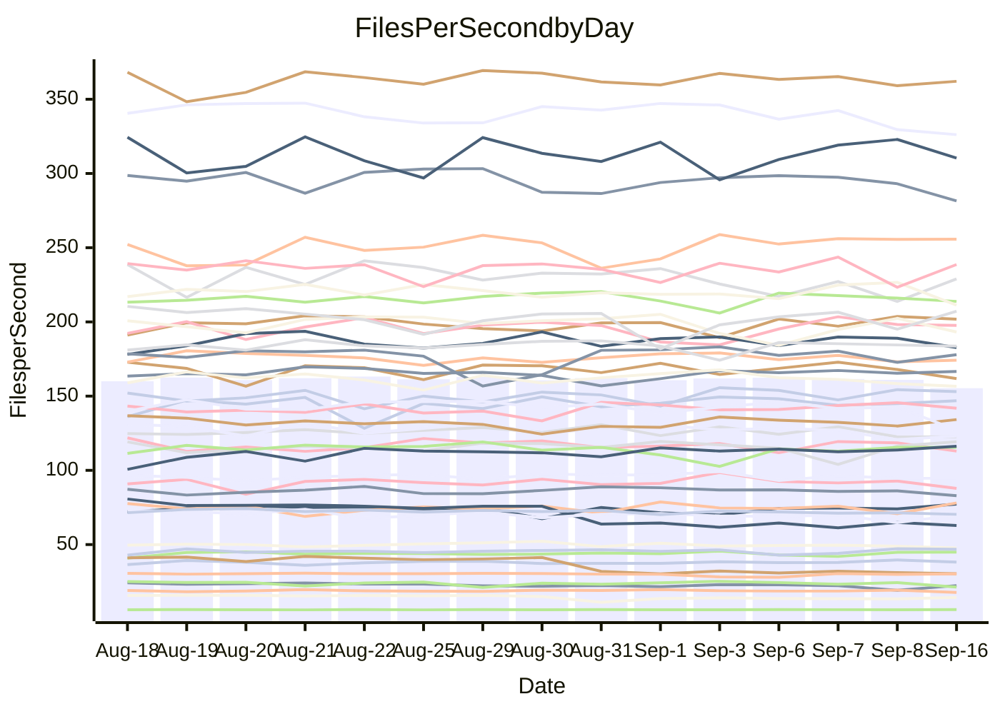

<!---
# This file is auto-generated. Do not edit.
# cspell:disable
--->
# Performance Report

## Daily Performance

## Time to Process Files

| Repository                                      | Elapsed | Min/Avg/Max           |   SD | SD Graph                |
| ----------------------------------------------- | ------: | :-------------------: | ---: | ----------------------- |
| AdaDoom3/AdaDoom3                    |    3.40 | 3.3 /   3.5 /   4.5   | 0.23 | `    ┣━━┻━●╋━━┻━━┫    ` |
| alexiosc/megistos                    |    7.54 | 7.6 /   8.0 /   9.4   | 0.43 | `    ┣━━●━━╋━━┻━━┫    ` |
| apollographql/apollo-server          |    2.87 | 2.6 /   2.7 /   3.3   | 0.15 | `    ┣━━┻━━╋━●┻━━┫    ` |
| aspnetboilerplate/aspnetboilerplate  |   10.69 | 10.2 /  10.6 /  11.1  | 0.19 | `    ┣━━┻━━╋━●┻━━┫    ` |
| aws-amplify/docs                     |   13.59 | 12.5 /  13.0 /  14.2  | 0.36 | `    ┣━━┻━━╋━━┻━●┫    ` |
| Azure/azure-rest-api-specs           |    9.61 | 9.4 /   9.8 /  11.0   | 0.38 | `    ┣━━┻●━╋━━┻━━┫    ` |
| bitjson/typescript-starter           |    1.13 | 1.0 /   1.1 /   1.2   | 0.03 | `     ┣━┻━━╋━━┻━┫●    ` |
| caddyserver/caddy                    |    3.67 | 3.6 /   3.8 /   4.3   | 0.17 | `    ┣━━●━━╋━━┻━━┫    ` |
| canada-ca/open-source-logiciel-libre |    1.14 | 1.1 /   1.1 /   1.2   | 0.02 | `     ┣━━┻●╋━┻━━┫     ` |
| chef/chef                            |    5.99 | 5.8 /   6.1 /   6.6   | 0.18 | `    ┣━━┻●━╋━━┻━━┫    ` |
| dart-lang/sdk                        |   69.09 | 63.8 /  66.9 /  70.7  | 1.68 | `  ┣━━━┻━━━╋━━━┻●━━┫  ` |
| django/django                        |   15.55 | 14.9 /  15.5 /  16.4  | 0.35 | `    ┣━━┻━━╋●━┻━━┫    ` |
| eslint/eslint                        |   11.46 | 10.7 /  11.2 /  12.1  | 0.41 | `    ┣━━┻━━╋━●┻━━┫    ` |
| exonum/exonum                        |    3.65 | 3.5 /   3.7 /   4.1   | 0.12 | `    ┣━━┻━●╋━━┻━━┫    ` |
| flutter/samples                      |   16.92 | 16.3 /  17.1 /  19.7  | 0.65 | `   ┣━━━┻━●╋━━┻━━━┫   ` |
| gitbucket/gitbucket                  |    3.46 | 3.4 /   3.6 /   4.0   | 0.16 | `    ┣━━●━━╋━━┻━━┫    ` |
| googleapis/google-cloud-cpp          |  163.35 | 136.7 / 143.8 / 155.3 | 4.45 | `     ┣━━┻━╋━┻━━┫    ●` |
| graphql/express-graphql              |    1.16 | 1.1 /   1.1 /   1.4   | 0.06 | `     ┣━┻━━╋●━┻━┫     ` |
| graphql/graphql-js                   |    2.97 | 2.7 /   2.9 /   3.1   | 0.08 | `     ┣━┻━━╋━━●━┫     ` |
| graphql/graphql-relay-js             |    1.31 | 1.1 /   1.2 /   1.3   | 0.06 | `     ┣━┻━━╋━━┻━┫●    ` |
| graphql/graphql-spec                 |    1.32 | 1.0 /   1.2 /   1.5   | 0.17 | `     ┣━┻━━╋━━●━┫     ` |
| iluwatar/java-design-patterns        |   13.01 | 12.8 /  13.3 /  15.2  | 0.51 | `    ┣━━┻●━╋━━┻━━┫    ` |
| ktaranov/sqlserver-kit               |    6.95 | 6.6 /   6.8 /   7.1   | 0.16 | `    ┣━━┻━━╋━━┻●━┫    ` |
| liriliri/licia                       |    4.41 | 4.1 /   4.2 /   4.4   | 0.07 | `    ┣━━┻━━╋━━┻━━┫●   ` |
| MartinThoma/LaTeX-examples           |    7.29 | 6.7 /   7.1 /   7.8   | 0.27 | `    ┣━━┻━━╋━●┻━━┫    ` |
| mdx-js/mdx                           |    2.02 | 1.9 /   2.0 /   2.2   | 0.07 | `     ┣━┻━━●━━┻━┫     ` |
| microsoft/TypeScript-Website         |    5.67 | 5.5 /   5.8 /   6.5   | 0.23 | `    ┣━━┻●━╋━━┻━━┫    ` |
| MicrosoftDocs/PowerShell-Docs        |   23.29 | 23.2 /  24.3 /  26.9  | 0.83 | `   ┣━━●┻━━╋━━┻━━━┫   ` |
| neovim/nvim-lspconfig                |    4.36 | 4.1 /   4.3 /   4.5   | 0.10 | `    ┣━━┻━━╋━●┻━━┫    ` |
| pagekit/pagekit                      |    3.58 | 3.5 /   3.7 /   4.1   | 0.15 | `    ┣━━┻●━╋━━┻━━┫    ` |
| php/php-src                          |   27.70 | 25.3 /  26.4 /  28.9  | 0.78 | `   ┣━━━┻━━╋━━┻━━●┫   ` |
| plasticrake/tplink-smarthome-api     |    1.32 | 1.3 /   1.4 /   1.6   | 0.05 | `     ┣━┻●━╋━━┻━┫     ` |
| prettier/prettier                    |    7.41 | 7.0 /   7.4 /   8.1   | 0.29 | `    ┣━━┻━━●━━┻━━┫    ` |
| pycontribs/jira                      |    1.66 | 1.5 /   1.6 /   1.7   | 0.06 | `     ┣━┻━━╋━━●━┫     ` |
| RustPython/RustPython                |    5.58 | 5.2 /   5.4 /   5.7   | 0.17 | `    ┣━━┻━━╋━━●━━┫    ` |
| shoelace-style/shoelace              |    2.99 | 2.9 /   3.0 /   3.7   | 0.17 | `    ┣━━┻━●╋━━┻━━┫    ` |
| slint-ui/slint                       |   12.62 | 12.1 /  12.7 /  15.5  | 0.73 | `   ┣━━━┻━●╋━━┻━━━┫   ` |
| SoftwareBrothers/admin-bro           |    2.73 | 2.5 /   2.6 /   3.0   | 0.10 | `    ┣━━┻━━╋━●┻━━┫    ` |
| sveltejs/svelte                      |   21.67 | 20.2 /  21.6 /  23.0  | 0.51 | `   ┣━━━┻━━╋●━┻━━━┫   ` |
| TheAlgorithms/Python                 |    5.85 | 5.7 /   5.9 /   6.7   | 0.23 | `    ┣━━┻━●╋━━┻━━┫    ` |
| twbs/bootstrap                       |    1.88 | 1.5 /   1.7 /   2.0   | 0.17 | `    ┣━━┻━━╋━━●━━┫    ` |
| typescript-cheatsheets/react         |    1.39 | 1.3 /   1.4 /   1.5   | 0.04 | `     ┣━┻━●╋━━┻━┫     ` |
| typescript-eslint/typescript-eslint  |    4.54 | 4.2 /   4.3 /   4.7   | 0.12 | `    ┣━━┻━━╋━━┻━●┫    ` |
| vitest-dev/vitest                    |    9.66 | 9.1 /   9.6 /  12.0   | 0.67 | `    ┣━━┻━━●━━┻━━┫    ` |
| w3c/aria-practices                   |    3.63 | 3.3 /   3.5 /   3.8   | 0.12 | `    ┣━━┻━━╋━━●━━┫    ` |
| w3c/specberus                        |    2.09 | 2.0 /   2.1 /   2.2   | 0.06 | `     ┣━┻━━╋●━┻━┫     ` |
| webdeveric/webpack-assets-manifest   |    1.20 | 1.2 /   1.2 /   1.3   | 0.04 | `     ┣━┻●━╋━━┻━┫     ` |
| webpack/webpack                      |    5.66 | 5.3 /   5.7 /   6.2   | 0.20 | `    ┣━━┻━━●━━┻━━┫    ` |
| wireapp/wire-desktop                 |    1.42 | 1.0 /   1.2 /   1.4   | 0.16 | `     ┣━┻━━╋━━┻●┫     ` |
| wireapp/wire-webapp                  |   11.01 | 10.8 /  11.1 /  11.8  | 0.27 | `    ┣━━┻━●╋━━┻━━┫    ` |

Note:
- Elapsed time is in seconds.

## Files per Second over Time

| Repository                                      | Files |    Sec |    Fps |     Rel | Trend Fps              |    N |
| ----------------------------------------------- | ----: | -----: | -----: | ------: | ---------------------- | ---: |
| AdaDoom3/AdaDoom3                    |   103 |   3.40 |  30.27 |   1.14% | `████▇█████▇▇▆█▂███▇█` |   24 |
| alexiosc/megistos                    |   583 |   7.54 |  77.29 |   5.30% | `▇▇█▆█▇█▃▃▇█▆▆▇▇▇▇▇▇█` |   24 |
| apollographql/apollo-server          |   252 |   2.87 |  87.86 |  -4.44% | `▇▇▇▆▇▆█▅█▆▆▆█▇▇▆▅█▇▅` |   24 |
| aspnetboilerplate/aspnetboilerplate  |  2286 |  10.69 | 213.82 |  -1.24% | `▆▆▇▇▅▇▇▇█▇█▆▅▇▇█▇▇▇▆` |   24 |
| aws-amplify/docs                     |  2871 |  13.59 | 211.30 |  -4.04% | `▇▆▆▇▇▇▆▆▇▅█▆▆▇▄▇▇▇█▅` |   24 |
| Azure/azure-rest-api-specs           |  2458 |   9.61 | 255.72 |   2.70% | `█▆▇▇▇█▇█▇▆▅▆█▇█▇████` |   24 |
| bitjson/typescript-starter           |    20 |   1.13 |  17.72 |  -6.20% | `█▆▇▇▅▆█▇▇▇▇█▇▆▆▆▇▆▇▄` |   24 |
| caddyserver/caddy                    |   286 |   3.67 |  78.03 |   4.79% | `▄▅▆█▅▆█▆▆▇▃█▆▆▆▇▆█▅█` |   24 |
| canada-ca/open-source-logiciel-libre |     7 |   1.14 |   6.16 |   0.56% | `▆▇▇▆▆▇▆▆▅█▇▆▆▇▇█▇▆▆▇` |   24 |
| chef/chef                            |  1208 |   5.99 | 201.81 |   1.66% | `█▇█▆█▆▇▇▄▆▇▇▅█▇▇█▅█▇` |   24 |
| dart-lang/sdk                        | 10825 |  69.09 | 156.67 |  -3.02% | `▇▆▇▅▄▇▇▄▆▇▇▇█▇▆▇▆▇▆▅` |   24 |
| django/django                        |  2857 |  15.55 | 183.69 |  -0.34% | `▇▇▆▆▇▇▇▇█▇▇▆▄▆▇██▆▇▆` |   24 |
| eslint/eslint                        |  2093 |  11.46 | 182.71 |  -2.35% | `█▆▆▇▄▆▇▇█▄▇▇▇▅▆▇▇▇▇▆` |   24 |
| exonum/exonum                        |   421 |   3.65 | 115.48 |   1.09% | `█▇▇▇██▇▅▇▇█▆▃▇▆▇▇▆▇▇` |   24 |
| flutter/samples                      |  2400 |  16.92 | 141.83 |   0.68% | `▆▇█▆▆▇▆▃▇███▇▆█▇▇██▇` |   24 |
| gitbucket/gitbucket                  |   413 |   3.46 | 119.21 |   3.94% | `▇█▆▄██▇█▇▇▇█▇█▅█▃▄▇█` |   24 |
| googleapis/google-cloud-cpp          | 20758 | 163.35 | 127.08 | -11.62% | `▆▆█▇▇▇▇▅▆▇▇▅▆█▆█▆▆▆▂` |   24 |
| graphql/express-graphql              |    26 |   1.16 |  22.38 |  -1.53% | `██▇█▇▆▇▄▆▆▇▅▇▇▆▇▆▆▃▆` |   24 |
| graphql/graphql-js                   |   364 |   2.97 | 122.59 |  -2.87% | `▆▆▆▆▇▇▅▆▇█▆▅▇▄▆▇█▆▅▅` |   24 |
| graphql/graphql-relay-js             |    28 |   1.31 |  21.31 | -11.26% | `▄▆▇█▇▃▆▆▇▃█▇█▇▆█▆▅▇▃` |   24 |
| graphql/graphql-spec                 |    19 |   1.32 |  14.37 |  -1.08% | `██████▅██▂▂▅▆▄▆▆▅▅▅▆` |   24 |
| iluwatar/java-design-patterns        |  1992 |  13.01 | 153.06 |   2.16% | `█▇▃▇▇▆▇█▇█▆▆█▇██▆▇██` |   24 |
| ktaranov/sqlserver-kit               |   489 |   6.95 |  70.35 |  -2.85% | `▇▇▇▅█▇█▅▇█▆▅▇▅▇█▇▅▆▆` |   24 |
| liriliri/licia                       |  1437 |   4.41 | 326.13 |  -4.44% | `█▇▆▇▅▆█▇▇█▇██▇▇▆▇█▅▅` |   24 |
| MartinThoma/LaTeX-examples           |  1409 |   7.29 | 193.18 |  -2.23% | `▇▆██▆▆▇▇▆▇▇▇▅▄▃▅▅▆▇▅` |   24 |
| mdx-js/mdx                           |   141 |   2.02 |  69.89 |   0.08% | `█▅▆▆▇▇▅▆▅█▅▇▆▆▆▅▆▇▄▆` |   24 |
| microsoft/TypeScript-Website         |   761 |   5.67 | 134.21 |   2.12% | `▇▇▇▇▇▇█▅▃█▅▆██▇▇▇▇▇█` |   24 |
| MicrosoftDocs/PowerShell-Docs        |  2708 |  23.29 | 116.25 |   4.04% | `▅█▇█▆▇▆▇▇▅▇█▇▇█▇▆▇▇█` |   24 |
| neovim/nvim-lspconfig                |   759 |   4.36 | 174.21 |  -0.85% | `▇█▆▆▅▇▇▆▅▆███▇▅▇▇█▆▆` |   24 |
| pagekit/pagekit                      |   741 |   3.58 | 207.23 |   2.36% | `▇▇▆▇▄▇█▆██▇▃▆▇█▇█▇▆█` |   24 |
| php/php-src                          |  2296 |  27.70 |  82.88 |  -4.03% | `▇▇█▆▆▆█▆▆█▇▇▇▇▆█▇▆▇▅` |   24 |
| plasticrake/tplink-smarthome-api     |    62 |   1.32 |  46.86 |   3.68% | `▇▇▇▇▆▇▇█▇▇▇▇▇▃▆▆▆▆██` |   24 |
| prettier/prettier                    |  2301 |   7.41 | 310.44 |  -0.10% | `█▇▆▅▅█▆█▆▇▅▇▅▆▄█▇██▆` |   24 |
| pycontribs/jira                      |    79 |   1.66 |  47.68 |  -4.58% | `▅▇▅▆▇▇█▇▇▇▃▇▅▆▇▄▄█▅▅` |   24 |
| RustPython/RustPython                |   687 |   5.58 | 123.12 |  -3.25% | `█▄▇▆██▄▇▆▇▇█▇▇▇▇▇▆▅▅` |   24 |
| shoelace-style/shoelace              |   439 |   2.99 | 146.90 |   1.79% | `█▆▂▆█▇███▇▆▇██▇█▇▆▇▇` |   24 |
| slint-ui/slint                       |  2245 |  12.62 | 177.91 |   0.96% | `▇█▇▇▇▄▆▇▃█████▇▇▇█▆▇` |   24 |
| SoftwareBrothers/admin-bro           |   441 |   2.73 | 161.82 |  -3.51% | `▇█▇▅▆█▇█▇█▆█▆▇▇▇██▇▆` |   24 |
| sveltejs/svelte                      |  7846 |  21.67 | 362.09 |  -0.05% | `▆▆▆▆▅▇█▆▅▆▅▆▆▇▆▅▆▆▆▆` |   24 |
| TheAlgorithms/Python                 |  1396 |   5.85 | 238.65 |   1.27% | `▇▇▇▇▃▇▇█▇▆█▆▇▆█▆██▅▇` |   24 |
| twbs/bootstrap                       |   118 |   1.88 |  62.88 | -11.30% | `▇█▆█▅▇██▅▃▄▄▃▃▄▄▄▂▄▃` |   24 |
| typescript-cheatsheets/react         |    53 |   1.39 |  38.17 |   0.70% | `▄█▄█▆▇▆▄▇▇▄▆▇▆▆▆█▅█▇` |   24 |
| typescript-eslint/typescript-eslint  |  1278 |   4.54 | 281.52 |  -4.79% | `▆▇████▆▄▇▄▇▇▇▇▇▇▇▇▇▅` |   24 |
| vitest-dev/vitest                    |  2212 |   9.66 | 228.97 |  -0.05% | `▆███▇▇▇▇▇▆█▇▆▇▂█▆█▅▇` |   24 |
| w3c/aria-practices                   |   410 |   3.63 | 112.93 |  -3.23% | `▅▆▅▇█▇▇█▇▅▆▆▇▄▆▄▇▇▇▅` |   24 |
| w3c/specberus                        |   198 |   2.09 |  94.65 |  -1.21% | `▆▇▇▇▇▆▇▆█▇▇▇█▆▆▅▆▇▆▆` |   24 |
| webdeveric/webpack-assets-manifest   |    54 |   1.20 |  44.92 |   2.69% | `▆▇▇▇▆▆█▆▅▇▇▇█▇▆▄▅▅▇█` |   24 |
| webpack/webpack                      |  1118 |   5.66 | 197.69 |   0.73% | `▆▇▇▆▅▆▇▆▇▇▆▅▄▇▅▆▆█▆▆` |   24 |
| wireapp/wire-desktop                 |    43 |   1.42 |  30.36 | -17.48% | `█▇██▆▇██▇▃▃▂▃▂▂▃▃▃▃▂` |   24 |
| wireapp/wire-webapp                  |  1835 |  11.01 | 166.61 |   1.03% | `███▇▇▇██▄▅▅▆▇▇▇▇▇█▇▇` |   24 |

## Data Throughput

| Repository                                      | Files |    Sec |     Kps |     Rel | Trend Kps              |    N |
| ----------------------------------------------- | ----: | -----: | ------: | ------: | ---------------------- | ---: |
| AdaDoom3/AdaDoom3                    |   103 |   3.40 |  643.26 |   1.14% | `████▇█████▇▇▆█▂███▇█` |   24 |
| alexiosc/megistos                    |   583 |   7.54 |  607.34 |   5.30% | `▇▇█▆█▇█▃▃▇█▆▆▇▇▇▇▇▇█` |   24 |
| apollographql/apollo-server          |   252 |   2.87 |  706.71 |  -4.44% | `▇▇▇▆▇▆█▅█▆▆▆█▇▇▆▅█▇▅` |   24 |
| aspnetboilerplate/aspnetboilerplate  |  2286 |  10.69 |  520.25 |  -1.24% | `▆▆▇▇▅▇▇▇█▇█▆▅▇▇█▇▇▇▆` |   24 |
| aws-amplify/docs                     |  2871 |  13.59 |  737.81 |  -4.04% | `▇▆▆▇▇▇▆▆▇▅█▆▆▇▄▇▇▇█▅` |   24 |
| Azure/azure-rest-api-specs           |  2458 |   9.61 |  672.37 |   1.75% | `█▆▇▇▇█▇█▇▆▅▆█▇█▇██▇▇` |   24 |
| bitjson/typescript-starter           |    20 |   1.13 |   70.86 |  -6.20% | `█▆▇▇▅▆█▇▇▇▇█▇▆▆▆▇▆▇▄` |   24 |
| caddyserver/caddy                    |   286 |   3.67 |  665.70 |   4.74% | `▄▅▆█▅▆█▆▆▇▃█▆▆▆▇▆█▅█` |   24 |
| canada-ca/open-source-logiciel-libre |     7 |   1.14 |   51.04 |   0.56% | `▆▇▇▆▆▇▆▆▅█▇▆▆▇▇█▇▆▆▇` |   24 |
| chef/chef                            |  1208 |   5.99 |  932.02 |   1.65% | `█▇█▆█▆▇▇▄▆▇▇▅█▇▇█▅█▇` |   24 |
| dart-lang/sdk                        | 10825 |  69.09 | 1066.75 |  -2.41% | `▇▆▇▅▄▇▇▄▆▇▆▇█▇▆▇▆▇▆▆` |   24 |
| django/django                        |  2857 |  15.55 | 1153.02 |  -0.24% | `▇▇▆▆▇▇▇▇█▇▇▆▄▆▇██▆▇▇` |   24 |
| eslint/eslint                        |  2093 |  11.46 | 1312.29 |  -3.48% | `█▆▆▇▄▆▇▇█▄▇▇▇▅▆▇▇▇▇▅` |   24 |
| exonum/exonum                        |   421 |   3.65 | 1104.58 |   1.09% | `█▇▇▇██▇▅▇▇█▆▃▇▆▇▇▆▇▇` |   24 |
| flutter/samples                      |  2400 |  16.92 | 1265.65 |   0.99% | `▆▇█▆▆▇▆▃▇███▇▆█▇▇██▇` |   24 |
| gitbucket/gitbucket                  |   413 |   3.46 |  541.77 |   3.94% | `▇█▆▄██▇█▇▇▇█▇█▅█▃▄▇█` |   24 |
| googleapis/google-cloud-cpp          | 20758 | 163.35 | 1030.85 | -11.26% | `▆▆█▇▇▇▇▅▆▇▇▅▆█▆█▆▆▆▃` |   24 |
| graphql/express-graphql              |    26 |   1.16 |  102.43 |  -1.53% | `██▇█▇▆▇▄▆▆▇▅▇▇▆▇▆▆▃▆` |   24 |
| graphql/graphql-js                   |   364 |   2.97 |  704.53 |  -2.87% | `▆▆▆▆▇▇▅▆▇█▆▅▇▄▆▇█▆▅▅` |   24 |
| graphql/graphql-relay-js             |    28 |   1.31 |   83.73 | -11.26% | `▄▆▇█▇▃▆▆▇▃█▇█▇▆█▆▅▇▃` |   24 |
| graphql/graphql-spec                 |    19 |   1.32 |  479.49 |  -6.11% | `██████▅██▂▂▄▄▃▄▄▄▃▄▅` |   24 |
| iluwatar/java-design-patterns        |  1992 |  13.01 |  473.08 |   2.16% | `█▇▃▇▇▆▇█▇█▆▆█▇██▆▇██` |   24 |
| ktaranov/sqlserver-kit               |   489 |   6.95 | 1065.19 |  -2.83% | `▇▇▇▅█▇█▅▇█▆▅▇▅▇█▇▅▆▆` |   24 |
| liriliri/licia                       |  1437 |   4.41 |  388.54 |  -4.44% | `█▇▆▇▅▆█▇▇█▇██▇▇▆▇█▅▅` |   24 |
| MartinThoma/LaTeX-examples           |  1409 |   7.29 |  398.98 |  -2.23% | `▇▆██▆▆▇▇▆▇▇▇▅▄▃▅▅▆▇▅` |   24 |
| mdx-js/mdx                           |   141 |   2.02 |  325.18 |   0.08% | `█▅▆▆▇▇▅▆▅█▅▇▆▆▆▅▆▇▄▆` |   24 |
| microsoft/TypeScript-Website         |   761 |   5.67 |  928.21 |   2.12% | `▇▇▇▇▇▇█▅▃█▅▆██▇▇▇▇▇█` |   24 |
| MicrosoftDocs/PowerShell-Docs        |  2708 |  23.29 | 1195.55 |   4.06% | `▅█▇█▆▇▆▇▇▅▇█▇▇█▇▆▇▇█` |   24 |
| neovim/nvim-lspconfig                |   759 |   4.36 |  287.14 |  -0.33% | `▇█▅▇▅▇▇▆▅▆███▇▆█▇█▇▇` |   24 |
| pagekit/pagekit                      |   741 |   3.58 |  432.08 |   2.36% | `▇▇▆▇▄▇█▆██▇▃▆▇█▇█▇▆█` |   24 |
| php/php-src                          |  2296 |  27.70 | 1439.86 |  -4.26% | `▇▇█▆▆▆█▆▆█▇▇▇▇▆█▇▆▆▅` |   24 |
| plasticrake/tplink-smarthome-api     |    62 |   1.32 |  253.20 |   3.68% | `▇▇▇▇▆▇▇█▇▇▇▇▇▃▆▆▆▆██` |   24 |
| prettier/prettier                    |  2301 |   7.41 |  439.01 |  -0.41% | `█▇▆▅▅█▆█▆▇▅▇▅▆▄█▇██▆` |   24 |
| pycontribs/jira                      |    79 |   1.66 |  338.01 |  -4.58% | `▅▇▅▆▇▇█▇▇▇▃▇▅▆▇▄▄█▅▅` |   24 |
| RustPython/RustPython                |   687 |   5.58 |  968.13 |  -3.18% | `█▄▇▆██▄▇▆▇▇█▇▇▇▇▇▆▅▅` |   24 |
| shoelace-style/shoelace              |   439 |   2.99 |  709.75 |   1.79% | `█▆▂▆█▇███▇▆▇██▇█▇▆▇▇` |   24 |
| slint-ui/slint                       |  2245 |  12.62 | 1164.16 |   1.29% | `▇█▇▇▇▄▆▇▃█████▇▇▇█▇▇` |   24 |
| SoftwareBrothers/admin-bro           |   441 |   2.73 |  356.66 |  -3.51% | `▇█▇▅▆█▇█▇█▆█▆▇▇▇██▇▆` |   24 |
| sveltejs/svelte                      |  7846 |  21.67 |  242.19 |  -0.12% | `▆▆▆▆▅▇█▆▅▆▅▆▆▇▆▅▆▆▆▆` |   24 |
| TheAlgorithms/Python                 |  1396 |   5.85 |  606.36 |   1.34% | `▇▇▇▇▃▇▇█▇▆█▆▇▆█▆██▅▇` |   24 |
| twbs/bootstrap                       |   118 |   1.88 |  515.79 | -11.36% | `▇█▆█▅▇██▅▄▄▄▃▃▄▄▄▂▄▃` |   24 |
| typescript-cheatsheets/react         |    53 |   1.39 |  282.34 |   1.13% | `▄▇▄█▇▇▆▄▇▇▄▆▇▆▆▆█▅█▇` |   24 |
| typescript-eslint/typescript-eslint  |  1278 |   4.54 | 1438.67 |  -4.62% | `▆▇████▆▄▇▄▇▇▇▇▇▇▇▇▇▅` |   24 |
| vitest-dev/vitest                    |  2212 |   9.66 |  514.98 |   0.18% | `▆███▇▇▇▇▇▇█▇▆▇▂█▆█▅▇` |   24 |
| w3c/aria-practices                   |   410 |   3.63 | 1050.48 |  -3.27% | `▅▆▅▇█▇▇█▇▅▆▆▇▄▆▄▇▇▇▅` |   24 |
| w3c/specberus                        |   198 |   2.09 |  297.33 |  -1.21% | `▆▇▇▇▇▆▇▆█▇▇▇█▆▆▅▆▇▆▆` |   24 |
| webdeveric/webpack-assets-manifest   |    54 |   1.20 |  105.64 |   2.69% | `▆▇▇▇▆▆█▆▅▇▇▇█▇▆▄▅▅▇█` |   24 |
| webpack/webpack                      |  1118 |   5.66 |  896.13 |   0.59% | `▆▇▇▆▅▆▇▆▇▇▆▅▄▇▅▆▆█▆▆` |   24 |
| wireapp/wire-desktop                 |    43 |   1.42 |  134.14 | -17.48% | `█▇██▆▇██▇▃▃▂▃▂▂▃▃▃▃▂` |   24 |
| wireapp/wire-webapp                  |  1835 |  11.01 |  596.81 |   1.28% | `███▇▇▇██▄▅▅▆▇▇▇▇▇█▇▇` |   24 |

