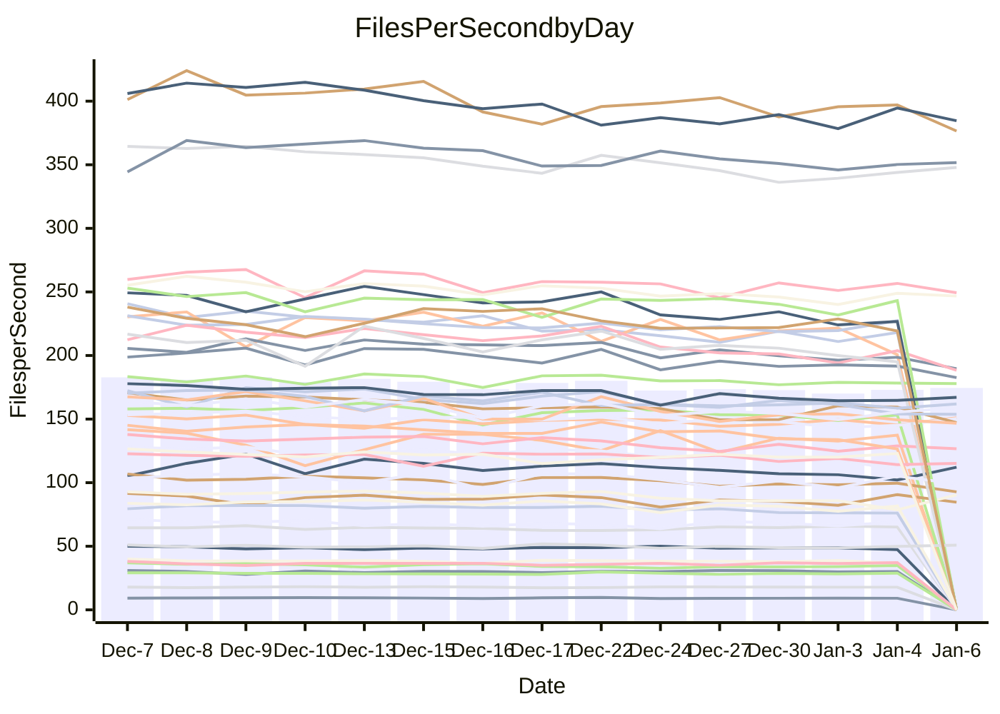

<!---
# This file is auto-generated. Do not edit.
# cspell:disable
--->
# Performance Report

## Daily Performance

## Time to Process Files

| Repository                                      | Elapsed | Min/Avg/Max           |   SD | SD Graph                |
| ----------------------------------------------- | ------: | :-------------------: | ---: | ----------------------- |
| AdaDoom3/AdaDoom3                    |    2.95 | 2.8 /   3.0 /   3.2   | 0.10 | `    ┣━━┻━━●━━┻━━┫    ` |
| alexiosc/megistos                    |    7.14 | 6.7 /   7.1 /   8.1   | 0.34 | `    ┣━━┻━━●━━┻━━┫    ` |
| apollographql/apollo-server          |    2.23 | 2.0 /   2.3 /   2.4   | 0.10 | `     ┣━┻━●╋━━┻━┫     ` |
| aspnetboilerplate/aspnetboilerplate  |    9.91 | 8.8 /   9.4 /  10.4   | 0.40 | `    ┣━━┻━━╋━━┻●━┫    ` |
| aws-amplify/docs                     |   11.77 | 11.3 /  11.8 /  12.5  | 0.35 | `    ┣━━┻━●╋━━┻━━┫    ` |
| Azure/azure-rest-api-specs           |   16.44 | 13.8 /  15.3 /  17.0  | 0.82 | `   ┣━━━┻━━╋━━┻━●━┫   ` |
| bitjson/typescript-starter           |    0.66 | 0.6 /   0.7 /   0.7   | 0.02 | `     ┣━━┻━●━┻━━┫     ` |
| caddyserver/caddy                    |    3.30 | 3.0 /   3.2 /   3.7   | 0.17 | `    ┣━━┻━━╋●━┻━━┫    ` |
| canada-ca/open-source-logiciel-libre |    0.77 | 0.7 /   0.8 /   0.8   | 0.02 | `     ┣━━┻━╋●┻━━┫     ` |
| chef/chef                            |    6.00 | 5.0 /   5.4 /   6.0   | 0.24 | `    ┣━━┻━━╋━━┻━━┫ ●  ` |
| dart-lang/sdk                        |   60.16 | 55.8 /  59.1 /  62.8  | 1.85 | `  ┣━━━┻━━━╋━●━┻━━━┫  ` |
| django/django                        |   15.43 | 13.5 /  14.3 /  15.5  | 0.52 | `    ┣━━┻━━╋━━┻━━┫●   ` |
| eslint/eslint                        |   10.75 | 9.5 /  10.0 /  10.9   | 0.36 | `    ┣━━┻━━╋━━┻━━●    ` |
| exonum/exonum                        |    3.06 | 2.9 /   3.2 /   3.7   | 0.19 | `    ┣━━┻━●╋━━┻━━┫    ` |
| flutter/samples                      |   18.27 | 15.8 /  16.9 /  22.0  | 1.13 | `   ┣━━━┻━━╋━━┻●━━┫   ` |
| gitbucket/gitbucket                  |    3.25 | 2.9 /   3.1 /   3.4   | 0.12 | `    ┣━━┻━━╋━━●━━┫    ` |
| googleapis/google-cloud-cpp          |  124.29 | 117.0 / 126.0 / 139.4 | 5.19 | `  ┣━━━┻━━●╋━━━┻━━━┫  ` |
| graphql/express-graphql              |    0.70 | 0.7 /   0.7 /   0.8   | 0.02 | `     ┣━━●━╋━┻━━┫     ` |
| graphql/graphql-js                   |    2.21 | 2.1 /   2.2 /   2.4   | 0.08 | `     ┣━┻━━╋●━┻━┫     ` |
| graphql/graphql-relay-js             |    0.77 | 0.7 /   0.7 /   0.8   | 0.02 | `     ┣━━┻━╋━┻━━●     ` |
| graphql/graphql-spec                 |    0.84 | 0.8 /   0.8 /   0.9   | 0.02 | `     ┣━━┻━●━┻━━┫     ` |
| iluwatar/java-design-patterns        |   11.42 | 10.6 /  11.3 /  13.6  | 0.57 | `    ┣━━┻━━╋●━┻━━┫    ` |
| ktaranov/sqlserver-kit               |    6.43 | 5.9 /   6.1 /   6.6   | 0.21 | `    ┣━━┻━━╋━━┻●━┫    ` |
| liriliri/licia                       |    3.81 | 3.2 /   3.6 /   3.8   | 0.12 | `    ┣━━┻━━╋━━┻━●┫    ` |
| MartinThoma/LaTeX-examples           |    6.20 | 6.1 /   6.3 /   6.7   | 0.13 | `    ┣━━●━━╋━━┻━━┫    ` |
| mdx-js/mdx                           |    1.57 | 1.5 /   1.6 /   1.8   | 0.08 | `     ┣━┻━●╋━━┻━┫     ` |
| microsoft/TypeScript-Website         |    5.01 | 4.9 /   5.1 /   5.3   | 0.12 | `    ┣━━┻●━╋━━┻━━┫    ` |
| MicrosoftDocs/PowerShell-Docs        |   19.38 | 17.6 /  18.8 /  25.8  | 1.47 | `   ┣━━━┻━━╋●━┻━━━┫   ` |
| neovim/nvim-lspconfig                |    3.14 | 2.8 /   3.0 /   3.4   | 0.13 | `    ┣━━┻━━╋━●┻━━┫    ` |
| pagekit/pagekit                      |    3.40 | 3.0 /   3.3 /   3.8   | 0.18 | `    ┣━━┻━━╋●━┻━━┫    ` |
| php/php-src                          |   22.31 | 20.3 /  21.8 /  25.7  | 1.34 | `   ┣━━━┻━━╋●━┻━━━┫   ` |
| plasticrake/tplink-smarthome-api     |    0.90 | 0.9 /   0.9 /   1.0   | 0.03 | `     ┣━┻━●╋━━┻━┫     ` |
| prettier/prettier                    |    6.33 | 6.0 /   6.3 /   7.2   | 0.25 | `    ┣━━┻━━╋●━┻━━┫    ` |
| pycontribs/jira                      |    1.23 | 1.2 /   1.2 /   1.3   | 0.03 | `     ┣━┻━●╋━━┻━┫     ` |
| RustPython/RustPython                |    4.13 | 3.9 /   4.1 /   4.6   | 0.14 | `    ┣━━┻━━●━━┻━━┫    ` |
| shoelace-style/shoelace              |    2.46 | 2.3 /   2.4 /   2.5   | 0.06 | `     ┣━┻━━╋●━┻━┫     ` |
| slint-ui/slint                       |   10.43 | 8.4 /   9.3 /  10.7   | 0.55 | `    ┣━━┻━━╋━━┻━━┫●   ` |
| SoftwareBrothers/admin-bro           |    2.26 | 2.0 /   2.1 /   2.3   | 0.09 | `     ┣━┻━━╋━━┻●┫     ` |
| sveltejs/svelte                      |   18.54 | 17.0 /  18.0 /  18.9  | 0.57 | `   ┣━━━┻━━╋━━●━━━┫   ` |
| TheAlgorithms/Python                 |    5.48 | 5.0 /   5.3 /   5.7   | 0.19 | `    ┣━━┻━━╋━━●━━┫    ` |
| twbs/bootstrap                       |    1.29 | 1.1 /   1.2 /   1.4   | 0.06 | `     ┣━┻━━╋━━┻━●     ` |
| typescript-cheatsheets/react         |    1.12 | 1.0 /   1.1 /   1.1   | 0.02 | `     ┣━━┻━╋━┻━●┫     ` |
| typescript-eslint/typescript-eslint  |    3.63 | 3.4 /   3.6 /   3.8   | 0.10 | `    ┣━━┻━━╋━●┻━━┫    ` |
| vitest-dev/vitest                    |    7.87 | 7.1 /   7.6 /   8.2   | 0.30 | `    ┣━━┻━━╋━●┻━━┫    ` |
| w3c/aria-practices                   |    3.20 | 2.7 /   2.9 /   3.2   | 0.13 | `    ┣━━┻━━╋━━┻━━●    ` |
| w3c/specberus                        |    1.63 | 1.6 /   1.6 /   1.7   | 0.04 | `     ┣━┻●━╋━━┻━┫     ` |
| webdeveric/webpack-assets-manifest   |    0.66 | 0.6 /   0.7 /   0.7   | 0.01 | `     ┣━━┻●╋━┻━━┫     ` |
| webpack/webpack                      |    4.99 | 4.5 /   4.8 /   5.3   | 0.19 | `    ┣━━┻━━╋━━●━━┫    ` |
| wireapp/wire-desktop                 |    0.85 | 0.8 /   0.9 /   0.9   | 0.03 | `     ┣━━●━╋━┻━━┫     ` |
| wireapp/wire-webapp                  |    8.69 | 7.4 /   8.0 /   8.7   | 0.33 | `    ┣━━┻━━╋━━┻━━●    ` |

Note:
- Elapsed time is in seconds.

## Files per Second over Time

| Repository                                      | Files |    Sec |    Fps |     Rel | Trend Fps              |    N |
| ----------------------------------------------- | ----: | -----: | -----: | ------: | ---------------------- | ---: |
| AdaDoom3/AdaDoom3                    |   103 |   2.95 |  34.86 |   0.42% | `▇▇▇▇▇█▆▅▄▄▆▅▆▆▅▄▆▅▅▆` |   26 |
| alexiosc/megistos                    |   583 |   7.14 |  81.68 |  -0.54% | `▇█▆▇▇▆█▇▄▅▆▇▆▆▇▅▃▅▇▆` |   26 |
| apollographql/apollo-server          |   250 |   2.23 | 112.15 |   1.01% | `▇█▆▅▆▇▇▆▇▆▆▅▆▅▅▄▄▆▄▇` |   28 |
| aspnetboilerplate/aspnetboilerplate  |  2246 |   9.91 | 226.75 |  -5.23% | `██▇█▇▆▇█▆▅▅▅▆▆▆▆▆▃▄▅` |   26 |
| aws-amplify/docs                     |  2863 |  11.77 | 243.15 |   0.45% | `██▅█▆█▅▇▇█▇██▇▅▇▅▆▅▇` |   27 |
| Azure/azure-rest-api-specs           |  2413 |  16.44 | 146.76 |  -7.07% | `▆▆▆▃▅▅█▆▆▄▅▅▆▅▆▄▆▆▅▄` |   28 |
| bitjson/typescript-starter           |    20 |   0.66 |  30.12 |  -0.20% | `▆▆▇▇▆▇▆▇▇▆██▇███▆▇▅▇` |   26 |
| caddyserver/caddy                    |   279 |   3.30 |  84.63 |  -2.14% | `▃▆█▆▅█▇▅▄▆▇▆▆▇▄▆▄▄█▆` |   28 |
| canada-ca/open-source-logiciel-libre |     7 |   0.77 |   9.11 |  -1.22% | `▅▆▇▇▄▅▇█▄▅▅▅▅▅▆▆▆▅▆▅` |   26 |
| chef/chef                            |  1204 |   6.00 | 200.66 | -10.78% | `██▇█▆▆█▅▇▇▅▄▆▇▇▃▆▅▇▃` |   26 |
| dart-lang/sdk                        | 10056 |  60.16 | 167.15 |  -1.36% | `▆██▇▆██▅▅▇█▅▇▇▅▅▆▅▆▆` |   28 |
| django/django                        |  2817 |  15.43 | 182.61 |  -7.52% | `█▇▇▇▇▆█▄▆▆▇▅▆▄▇▆▅▇▆▄` |   28 |
| eslint/eslint                        |  2038 |  10.75 | 189.65 |  -7.05% | `▇▇██▇▇█▆▅▇▇▇▆▇▄▇▅▅▆▄` |   28 |
| exonum/exonum                        |   421 |   3.06 | 137.41 |   2.63% | `▅██▇█▆▆▅▇█▄▅▇█▇▆▇▆▆▇` |   26 |
| flutter/samples                      |  2690 |  18.27 | 147.22 |  -7.70% | `██▇████▇█▆▆█▇█▂▇███▆` |   28 |
| gitbucket/gitbucket                  |   412 |   3.25 | 126.66 |  -3.56% | `█▇▇▇▅█▇▅▆▅▅▇▇▅▇▄▇▄▆▅` |   28 |
| googleapis/google-cloud-cpp          | 19742 | 124.29 | 158.84 |   1.17% | `▅█▆▅▅▇█▆▆▇▆▆▅▆▆▆▅▃▆▇` |   28 |
| graphql/express-graphql              |    26 |   0.70 |  37.08 |   2.01% | `█▇█▆▇█▆▆▇█▇▄███▆▆▇██` |   26 |
| graphql/graphql-js                   |   339 |   2.21 | 153.20 |  -0.84% | `▇▇█▆▅▄▇▇▇█▇▆▇▇▆▆▆▄▇▇` |   27 |
| graphql/graphql-relay-js             |    28 |   0.77 |  36.54 |  -4.57% | `██▆▅▅▅██▇██▆▇▆▅█▇██▅` |   26 |
| graphql/graphql-spec                 |    15 |   0.84 |  17.83 |  -0.22% | `█▇█▇▇▇▆▆▇▇▆█▇▆▆▇▅▇█▇` |   26 |
| iluwatar/java-design-patterns        |  1849 |  11.42 | 161.86 |  -1.36% | `▇▇▆▇▇██▇▆▆▇▇▇▆▆▇▇▆▆▇` |   28 |
| ktaranov/sqlserver-kit               |   489 |   6.43 |  76.08 |  -4.43% | `▇█▆▅▇█▇▇▇▅▆▇▆▆▄▄▆▄▄▅` |   27 |
| liriliri/licia                       |  1434 |   3.81 | 376.56 |  -6.33% | `█▆█▅▅▄▅▅▆▆▆▅▆▅▄▅▆▅▆▄` |   27 |
| MartinThoma/LaTeX-examples           |  1409 |   6.20 | 227.40 |   1.98% | `█▇▇▇▆▇▆▇▇▆▇▇▆▆▄▇▆▆▆█` |   26 |
| mdx-js/mdx                           |   142 |   1.57 |  90.39 |   1.71% | `▆██▇▆▇█▆▇▇▄▇▆▆▃▇▅▅▃▇` |   27 |
| microsoft/TypeScript-Website         |   757 |   5.01 | 151.05 |   1.96% | `▆▇█▆▆▇▇█▆▅▆▇█▅▅█▆▇▆▇` |   27 |
| MicrosoftDocs/PowerShell-Docs        |  2232 |  19.38 | 115.18 |  -3.42% | `▇▂██▇▇▇▇▇▇▇█▆▅▆▇▇▇▆▆` |   28 |
| neovim/nvim-lspconfig                |   373 |   3.14 | 118.61 |  -3.03% | `▇█▇▇▇██▆▇▅▇▆▇▇▇▆█▄▄▆` |   28 |
| pagekit/pagekit                      |   741 |   3.40 | 218.13 |  -2.08% | `▆▆▇██▇▆▆▆▅▆▃█▅▆▅▃▇▅▆` |   26 |
| php/php-src                          |  2212 |  22.31 |  99.13 |  -2.82% | `▇█▆▃▄██▆▆▆▄▆▅▇▇▃▅▇▇▆` |   28 |
| plasticrake/tplink-smarthome-api     |    62 |   0.90 |  69.11 |   2.09% | `█▆▇▇▅▆▇▇▇▃▇█▆▇▇█▆▆▇▇` |   26 |
| prettier/prettier                    |  2203 |   6.33 | 347.87 |  -0.66% | `▇█▇██▇██▇▇▇▇▇▇▃▇▅▇▇▇` |   28 |
| pycontribs/jira                      |    80 |   1.23 |  65.11 |   1.04% | `▄▇█▆▆▆▅▅▄▆▇▇▅▇▇▇▇▇▇▇` |   26 |
| RustPython/RustPython                |   621 |   4.13 | 150.39 |   0.35% | `██▇▇▇▇▇▆▆▆█▆▆▇▆▄▅▇▆▇` |   28 |
| shoelace-style/shoelace              |   438 |   2.46 | 177.88 |  -1.14% | `▇█▅▆▆██▇▇█▆▆█▅▆▅█▇▇▆` |   28 |
| slint-ui/slint                       |  1964 |  10.43 | 188.38 | -10.37% | `▇█▆█▇▇█▆▆▆▄▆▅▄▆▆▄▃▆▄` |   28 |
| SoftwareBrothers/admin-bro           |   441 |   2.26 | 194.96 |  -6.36% | `█▇▅▇▄▆▇█▆▅▅▆▇▆▅▅▅▃▆▄` |   26 |
| sveltejs/svelte                      |  7130 |  18.54 | 384.58 |  -2.74% | `▇█▇███▆▇▆▆▆██▆▆▅▅▆█▆` |   28 |
| TheAlgorithms/Python                 |  1367 |   5.48 | 249.32 |  -3.01% | `▇▇▅▇▄▇▇▆▆▄▆█▆▅▆▆▄▇▆▅` |   28 |
| twbs/bootstrap                       |   120 |   1.29 |  92.79 |  -8.04% | `▇▇█▃▆▇▇█▅▅▅▅▅▆█▇▄▅▆▄` |   28 |
| typescript-cheatsheets/react         |    53 |   1.12 |  47.38 |  -2.96% | `█▆▅▇▅▆▇▇██▇▆█▇▆▇▆▇▇▅` |   26 |
| typescript-eslint/typescript-eslint  |  1275 |   3.63 | 351.65 |  -1.60% | `▇▇█▇▇▆▆█▇▇▆▇▆▇▆▄▇▆▆▆` |   28 |
| vitest-dev/vitest                    |  1942 |   7.87 | 246.75 |  -1.57% | `███▇▅█▇▇▆▆▇▇▆▅▇▆▄▅▇▆` |   28 |
| w3c/aria-practices                   |   405 |   3.20 | 126.46 |  -9.44% | `▇▆▆▆▅▇▆█▇▆▇▆▄▃▇▇▆▆▃▄` |   27 |
| w3c/specberus                        |   200 |   1.63 | 122.96 |   1.29% | `█▇▇██▇▅▆▆▇█▇▇▇▆▆▇▅▇█` |   27 |
| webdeveric/webpack-assets-manifest   |    19 |   0.66 |  28.89 |   1.22% | `▇▅▅▆▅▆▅█▆▇▆▅▇▇▅▇▆▅▇▇` |   26 |
| webpack/webpack                      |  1095 |   4.99 | 219.30 |  -3.97% | `█▇██▆██▆▆▅▅▆▆▆▅▅█▆▆▅` |   27 |
| wireapp/wire-desktop                 |    43 |   0.85 |  50.86 |   2.74% | `▇▆▆▆▅█▇▅▆▇▆▇▇▅▅▅▅▇▇▇` |   28 |
| wireapp/wire-webapp                  |  1337 |   8.69 | 153.81 |  -6.80% | `▆▆▇▇▆█▆▆▆▅▅▇▇▆▇▅▆▇▄▄` |   28 |

## Data Throughput

| Repository                                      | Files |    Sec |     Kps |     Rel | Trend Kps              |    N |
| ----------------------------------------------- | ----: | -----: | ------: | ------: | ---------------------- | ---: |
| AdaDoom3/AdaDoom3                    |   103 |   2.95 |  740.86 |   0.42% | `▇▇▇▇▇█▆▅▄▄▆▅▆▆▅▄▆▅▅▆` |   26 |
| alexiosc/megistos                    |   583 |   7.14 |  641.82 |  -0.54% | `▇█▆▇▇▆█▇▄▅▆▇▆▆▇▅▃▅▇▆` |   26 |
| apollographql/apollo-server          |   250 |   2.23 |  897.64 |   1.19% | `▇█▆▅▆▇█▇▇▆▆▅▆▅▅▄▄▆▄▇` |   28 |
| aspnetboilerplate/aspnetboilerplate  |  2246 |   9.91 |  533.46 |  -5.23% | `██▇█▇▆▇█▆▅▅▅▆▆▆▆▆▃▄▅` |   26 |
| aws-amplify/docs                     |  2863 |  11.77 |  833.14 |   0.62% | `██▅█▆█▅▇▇█▇██▇▅▇▅▆▅▇` |   27 |
| Azure/azure-rest-api-specs           |  2413 |  16.44 |  423.06 |  -6.97% | `▆▆▆▃▅▅█▆▆▄▅▅▆▅▆▄▇▆▅▄` |   28 |
| bitjson/typescript-starter           |    20 |   0.66 |  120.47 |  -0.20% | `▆▆▇▇▆▇▆▇▇▆██▇███▆▇▅▇` |   26 |
| caddyserver/caddy                    |   279 |   3.30 |  704.91 |  -1.92% | `▃▆█▆▅█▇▅▄▆▇▆▇▇▄▆▄▅█▆` |   28 |
| canada-ca/open-source-logiciel-libre |     7 |   0.77 |   75.51 |  -1.22% | `▅▆▇▇▄▅▇█▄▅▅▅▅▅▆▆▆▅▆▅` |   26 |
| chef/chef                            |  1204 |   6.00 |  921.63 | -10.78% | `██▇█▆▆█▅▇▇▅▄▆▇▇▃▆▅▇▃` |   26 |
| dart-lang/sdk                        | 10056 |  60.16 | 1190.68 |  -1.55% | `▆██▇▆██▅▅▇█▅▇▇▅▅▆▅▆▆` |   28 |
| django/django                        |  2817 |  15.43 | 1129.85 |  -7.35% | `█▇▇▇▇▆█▄▇▆▇▅▆▄▇▆▅▇▆▄` |   28 |
| eslint/eslint                        |  2038 |  10.75 | 1549.41 |  -6.90% | `▆▇██▇▇█▆▅▇▇▇▆▇▄▇▅▅▆▄` |   28 |
| exonum/exonum                        |   421 |   3.06 | 1314.40 |   2.63% | `▅██▇█▆▆▅▇█▄▅▇█▇▆▇▆▆▇` |   26 |
| flutter/samples                      |  2690 |  18.27 | 1192.39 |  -7.70% | `██▇████▇█▆▆█▇█▂▇███▆` |   28 |
| gitbucket/gitbucket                  |   412 |   3.25 |  573.04 |  -3.54% | `█▇▇▇▅█▇▅▆▅▅▇▇▅▇▄▇▄▆▅` |   28 |
| googleapis/google-cloud-cpp          | 19742 | 124.29 | 1239.91 |   1.12% | `▅█▆▅▅▇█▆▆▇▆▆▅▆▆▆▅▃▆▇` |   28 |
| graphql/express-graphql              |    26 |   0.70 |  169.72 |   2.01% | `█▇█▆▇█▆▆▇█▇▄███▆▆▇██` |   26 |
| graphql/graphql-js                   |   339 |   2.21 |  870.39 |  -0.84% | `▇▇█▆▅▄▇▇▇█▇▆▇▇▆▆▆▄▇▇` |   27 |
| graphql/graphql-relay-js             |    28 |   0.77 |  143.54 |  -4.57% | `██▆▅▅▅██▇██▆▇▆▅█▇██▅` |   26 |
| graphql/graphql-spec                 |    15 |   0.84 |  656.28 |  -0.20% | `█▇█▇▇▇▆▆▇▇▆█▇▆▆▇▅▇█▇` |   26 |
| iluwatar/java-design-patterns        |  1849 |  11.42 |  498.80 |  -1.35% | `▇▇▆▇▇██▇▆▆▇▇▇▆▆▇▇▆▆▇` |   28 |
| ktaranov/sqlserver-kit               |   489 |   6.43 | 1150.93 |  -4.44% | `▇█▆▅▇█▇▇▇▅▆▇▆▆▄▄▆▄▄▅` |   27 |
| liriliri/licia                       |  1434 |   3.81 |  446.14 |  -6.33% | `█▆█▅▅▄▅▅▆▆▆▅▆▅▄▅▆▅▆▄` |   27 |
| MartinThoma/LaTeX-examples           |  1409 |   6.20 |  469.64 |   1.98% | `█▇▇▇▆▇▆▇▇▆▇▇▆▆▄▇▆▆▆█` |   26 |
| mdx-js/mdx                           |   142 |   1.57 |  418.20 |   1.40% | `▆██▇▆▇█▆▇▇▄▇▆▆▃▇▅▅▃▇` |   27 |
| microsoft/TypeScript-Website         |   757 |   5.01 | 1034.44 |   1.96% | `▆▇█▆▆▇▇█▆▅▆▇█▅▅█▆▇▆▇` |   27 |
| MicrosoftDocs/PowerShell-Docs        |  2232 |  19.38 | 1150.49 |  -3.32% | `▇▂██▇▇▇▇▇▇▇█▆▅▆▇▇▇▆▆` |   28 |
| neovim/nvim-lspconfig                |   373 |   3.14 |  310.67 |  -2.45% | `▇█▇▇▇██▆▇▅▇▆▇▇▇▆█▄▄▆` |   28 |
| pagekit/pagekit                      |   741 |   3.40 |  454.81 |  -2.08% | `▆▆▇██▇▆▆▆▅▆▃█▅▆▅▃▇▅▆` |   26 |
| php/php-src                          |  2212 |  22.31 | 1452.06 |  -2.73% | `▇█▆▃▄██▆▆▆▄▆▅▇▇▃▅▇▇▆` |   28 |
| plasticrake/tplink-smarthome-api     |    62 |   0.90 |  373.44 |   2.09% | `█▆▇▇▅▆▇▇▇▃▇█▆▇▇█▆▆▇▇` |   26 |
| prettier/prettier                    |  2203 |   6.33 |  491.09 |  -0.86% | `▇█▇██▇██▇▇▇▇▇▇▃▇▅▇▇▇` |   28 |
| pycontribs/jira                      |    80 |   1.23 |  448.48 |   1.04% | `▄▇█▆▆▆▅▅▄▆▇▇▅▇▇▇▇▇▇▇` |   26 |
| RustPython/RustPython                |   621 |   4.13 | 1110.11 |   0.41% | `██▇▇▇▇▇▆▆▆█▆▆▇▆▄▅▇▆▇` |   28 |
| shoelace-style/shoelace              |   438 |   2.46 |  854.49 |  -1.06% | `▇█▅▆▆██▇▇█▆▆█▅▆▅█▇▇▆` |   28 |
| slint-ui/slint                       |  1964 |  10.43 |  964.24 | -10.40% | `▇█▆█▇▇█▆▆▆▄▆▅▄▆▆▄▃▆▃` |   28 |
| SoftwareBrothers/admin-bro           |   441 |   2.26 |  429.70 |  -6.36% | `█▇▅▇▄▆▇█▆▅▅▆▇▆▅▅▅▃▆▄` |   26 |
| sveltejs/svelte                      |  7130 |  18.54 |  252.86 |  -3.23% | `▇█▆▇▇▇▅▆▆▅▅▇▇▅▆▅▅▅▇▆` |   28 |
| TheAlgorithms/Python                 |  1367 |   5.48 |  633.59 |  -2.71% | `▇▇▅▇▄▇▇▆▆▄▆█▆▅▆▆▄▇▇▆` |   28 |
| twbs/bootstrap                       |   120 |   1.29 |  744.60 |  -8.04% | `▇▇█▃▆▇▇█▅▅▅▅▅▆█▇▄▅▆▄` |   28 |
| typescript-cheatsheets/react         |    53 |   1.12 |  346.87 |  -2.96% | `█▆▅▇▅▆▇▇██▇▆█▇▆▇▆▇▇▅` |   26 |
| typescript-eslint/typescript-eslint  |  1275 |   3.63 | 1690.97 |  -0.61% | `▇▇█▇▇▆▆█▇▇▇▇▆▇▆▄▇▆▆▇` |   28 |
| vitest-dev/vitest                    |  1942 |   7.87 |  508.37 |  -1.50% | `▇██▇▅██▇▇▇██▆▅▇▇▅▅▇▇` |   28 |
| w3c/aria-practices                   |   405 |   3.20 | 1174.39 |  -9.59% | `▇▆▆▆▅▇▆█▇▆▇▆▄▃▇▇▆▆▃▄` |   27 |
| w3c/specberus                        |   200 |   1.63 |  392.25 |   1.29% | `█▇▇██▇▅▆▆▇█▇▇▇▆▆▇▅▇█` |   27 |
| webdeveric/webpack-assets-manifest   |    19 |   0.66 |  155.11 |   1.22% | `▇▅▅▆▅▆▅█▆▇▆▅▇▇▅▇▆▅▇▇` |   26 |
| webpack/webpack                      |  1095 |   4.99 |  967.54 |  -3.95% | `█▇██▆██▆▆▅▅▆▆▆▅▅█▆▆▅` |   27 |
| wireapp/wire-desktop                 |    43 |   0.85 |  224.74 |   2.82% | `▇▆▆▆▅█▇▅▆▇▆▇▇▅▅▅▅▇▇▇` |   28 |
| wireapp/wire-webapp                  |  1337 |   8.69 |  622.37 |  -7.15% | `▇▇▇▇▆█▆▆▆▅▅▇▇▆▇▅▆▇▄▄` |   28 |

