<!---
# This file is auto-generated. Do not edit.
# cspell:disable
--->
# Performance Report

```mermaid
xychart-beta
    title Files Per Second by Day
    y-axis Files per Second
    x-axis Date [Jan-16, Jan-17, Jan-18, Jan-20, Jan-22, Jan-24, Jan-26, Jan-27, Jan-31, Feb-1, Feb-2, Feb-3, Feb-4, Feb-6, Feb-7, Feb-8, Feb-9, Feb-10, Feb-11, Feb-12, Feb-14]
    bar [190.29, 191.94, 196.32, 194.86, 191.82, 190.32, 191.51, 190.41, 192.01, 191.89, 188.72, 191.38, 188.90, 190.72, 190.17, 190.44, 190.91, 190.55, 190.54, 188.86, 190.31]
    line [129.88, 128.08, 130.23, 129.79, 127.22, 125.81, 130.48, 125.23, 130.52, 121.85, 125.25, 129.66, 129.52, 125.44, 125.65, 123.91, 126.45, 124.46, 122.70, 126.21, 127.48]
    line [81.33, 81.07, 83.41, 80.33, 81.35, 82.74, 85.67, 76.62, 69.80, 79.78, 83.19, 79.99, 81.38, 78.37, 78.87, 76.33, 81.76, 73.03, 78.44, 82.16, 77.57]
    line [20.18, 19.35, 20.14, 20.01, 18.93, 20.01, 19.80, 18.94, 17.77, 19.48, 18.59, 18.27, 20.00, 20.26, 18.55, 19.66, 20.05, 18.72, 19.96, 20.29, 19.21]
    line [102.46, 106.20, 105.37, 102.12, 105.87, 102.16, 102.14, 102.53, 103.49, 99.40, 99.16, 97.64, 98.18, 103.70, 106.20, 99.99, 97.22, 103.26, 104.26, 101.58, 97.25]
    line [48.63, 49.92, 47.96, 48.91, 48.82, 49.53, 48.99, 48.58, 48.96, 48.60, 48.80, 46.86, 44.78, 49.77, 46.58, 46.37, 48.10, 48.71, 50.07, 49.29, 44.61]
    line [135.43, 131.64, 136.76, 137.40, 132.80, 128.54, 132.65, 129.67, 126.00, 129.13, 135.02, 129.21, 131.37, 130.21, 127.48, 133.83, 127.77, 122.88, 128.37, 135.10, 130.22]
    line [35.93, 33.32, 35.23, 35.39, 34.93, 34.02, 34.09, 33.87, 34.29, 34.92, 32.72, 32.24, 34.39, 32.11, 29.25, 34.28, 34.27, 30.99, 32.76, 34.39, 33.69]
    line [25.26, 25.41, 25.96, 26.49, 25.80, 26.06, 26.20, 24.97, 23.09, 24.19, 23.67, 25.80, 25.02, 24.57, 25.83, 26.53, 27.12, 25.19, 24.73, 26.32, 25.04]
    line [24.50, 25.34, 23.52, 24.93, 24.42, 24.29, 23.65, 23.65, 21.57, 23.77, 24.71, 24.15, 24.26, 23.40, 25.18, 24.34, 21.29, 24.41, 23.32, 24.52, 24.37]
    line [90.31, 92.11, 92.40, 91.04, 90.36, 90.73, 88.98, 87.79, 92.24, 85.84, 87.34, 84.11, 87.49, 86.37, 87.72, 85.83, 80.71, 86.83, 85.89, 88.80, 87.68]
    line [6.97, 6.64, 6.91, 6.72, 6.67, 6.94, 6.67, 6.54, 6.62, 6.41, 6.91, 6.36, 6.58, 6.71, 6.80, 6.54, 6.62, 5.96, 6.86, 6.86, 6.46]
    line [375.32, 366.20, 389.54, 377.40, 385.33, 384.07, 389.49, 375.11, 344.39, 377.92, 368.78, 357.60, 388.25, 362.18, 363.07, 369.70, 375.89, 360.98, 379.16, 371.95, 378.12]
    line [185.90, 183.93, 185.28, 191.50, 191.17, 193.91, 185.17, 181.80, 175.63, 188.19, 178.84, 190.27, 179.88, 183.71, 188.14, 181.32, 186.40, 168.60, 184.20, 174.99, 182.05]
    line [261.41, 256.94, 266.46, 233.73, 255.35, 238.38, 229.34, 231.07, 215.86, 227.49, 237.43, 233.36, 227.18, 233.42, 233.14, 230.84, 225.21, 232.83, 240.89, 231.65, 229.88]
    line [164.63, 167.70, 160.91, 159.45, 163.50, 167.30, 165.36, 160.46, 164.87, 161.06, 158.29, 161.96, 164.85, 164.28, 164.40, 159.10, 159.22, 159.55, 156.17, 168.86, 154.88]
    line [69.64, 73.60, 68.98, 70.36, 68.71, 69.89, 68.59, 68.16, 64.96, 64.42, 71.54, 66.41, 68.48, 67.32, 68.66, 69.54, 66.78, 64.72, 66.96, 67.81, 66.51]
    line [325.07, 320.94, 337.71, 314.28, 338.34, 330.62, 332.64, 332.86, 330.58, 325.66, 323.17, 336.90, 335.91, 322.03, 323.49, 318.09, 297.24, 321.28, 332.16, 332.97, 319.82]
    line [15.80, 16.00, 15.45, 15.24, 15.02, 15.03, 15.29, 14.84, 15.62, 14.38, 14.96, 14.97, 15.27, 14.50, 15.88, 15.38, 15.78, 13.95, 14.61, 15.64, 15.11]
    line [100.69, 106.54, 108.37, 107.20, 104.26, 106.72, 105.14, 103.83, 105.85, 104.82, 108.27, 101.16, 101.71, 96.80, 105.17, 106.78, 104.49, 88.12, 105.95, 95.68, 104.99]
    line [55.93, 59.24, 56.01, 55.67, 55.20, 55.10, 53.59, 53.02, 57.11, 52.81, 55.66, 56.60, 51.29, 52.77, 57.05, 53.25, 56.05, 58.16, 56.27, 53.18, 53.65]
    line [85.70, 86.11, 85.86, 86.06, 84.27, 86.06, 83.34, 81.63, 80.82, 83.46, 83.98, 85.68, 83.63, 81.75, 82.99, 80.30, 81.36, 82.63, 82.18, 80.51, 83.93]
    line [85.04, 88.54, 87.62, 86.00, 85.64, 83.63, 82.99, 83.39, 81.99, 83.50, 81.95, 82.10, 83.95, 83.89, 81.23, 83.38, 84.02, 78.63, 78.33, 84.47, 81.13]
    line [37.29, 37.79, 38.08, 37.68, 37.40, 37.80, 38.01, 36.89, 36.96, 37.04, 36.98, 36.58, 36.57, 37.20, 37.62, 37.00, 38.62, 38.34, 38.10, 37.49, 36.87]
    line [180.64, 176.54, 181.96, 178.88, 180.40, 174.86, 177.54, 174.66, 177.76, 179.20, 178.55, 179.09, 179.41, 173.82, 171.95, 172.64, 171.28, 176.43, 175.80, 180.86, 176.19]
    line [213.84, 219.82, 216.50, 223.77, 218.30, 218.17, 216.51, 216.11, 223.69, 217.62, 221.92, 210.52, 217.06, 217.75, 221.18, 215.63, 217.27, 218.63, 215.55, 219.85, 216.86]
    line [221.67, 222.50, 222.49, 221.50, 215.62, 221.41, 212.75, 215.81, 222.32, 209.91, 217.01, 216.15, 212.32, 213.20, 215.93, 213.93, 215.54, 211.99, 212.34, 214.45, 219.43]
    line [262.65, 261.59, 266.80, 267.02, 266.61, 269.34, 261.80, 260.28, 260.12, 259.24, 266.03, 264.66, 253.81, 264.19, 262.88, 255.12, 259.81, 256.65, 259.10, 261.07, 258.35]
    line [231.13, 231.51, 240.11, 237.40, 232.15, 240.84, 231.74, 230.60, 238.25, 234.41, 226.71, 230.40, 229.74, 237.81, 232.23, 224.57, 237.26, 238.90, 231.61, 222.35, 237.24]
    line [197.24, 195.66, 200.40, 198.68, 192.03, 202.65, 197.73, 197.86, 185.13, 193.14, 197.96, 188.03, 184.87, 192.18, 186.89, 188.37, 189.97, 197.93, 196.64, 199.99, 200.18]
    line [200.52, 199.18, 198.97, 206.74, 209.26, 204.49, 217.13, 213.62, 216.87, 219.73, 217.00, 217.80, 206.42, 216.86, 217.40, 212.93, 213.99, 216.37, 207.17, 209.51, 214.39]
    line [402.27, 405.88, 422.55, 417.95, 422.87, 425.03, 422.04, 415.46, 422.79, 413.85, 411.47, 422.24, 425.96, 422.90, 426.77, 417.49, 413.10, 427.18, 415.79, 423.61, 413.89]
    line [127.81, 135.76, 135.82, 124.24, 127.06, 126.29, 124.09, 118.58, 122.01, 124.68, 121.40, 124.27, 121.00, 122.72, 124.94, 121.83, 120.56, 119.51, 117.66, 126.41, 120.31]
    line [173.92, 177.33, 173.32, 178.23, 175.77, 178.27, 178.37, 173.24, 175.53, 174.36, 175.31, 176.60, 177.03, 168.50, 172.68, 169.57, 174.00, 174.69, 174.76, 142.58, 173.31]
    line [194.99, 192.23, 197.19, 192.71, 195.01, 195.95, 192.00, 189.33, 196.17, 191.05, 192.93, 192.90, 193.43, 182.93, 188.24, 197.74, 194.04, 183.39, 196.97, 181.19, 192.18]
    line [342.27, 345.00, 356.14, 349.54, 352.62, 353.32, 354.47, 340.16, 355.36, 343.22, 341.35, 343.34, 343.75, 345.17, 341.37, 358.57, 359.43, 367.04, 357.06, 346.78, 360.36]
    line [99.69, 99.56, 100.21, 102.10, 97.82, 100.22, 98.35, 98.09, 97.24, 99.79, 99.21, 94.63, 98.63, 99.54, 99.93, 96.90, 95.85, 100.02, 98.95, 99.68, 91.42]
    line [134.83, 138.33, 137.42, 133.67, 135.32, 136.02, 132.00, 133.67, 130.01, 133.77, 131.00, 132.25, 127.77, 131.87, 132.83, 130.24, 129.37, 135.96, 133.33, 120.48, 131.36]
    line [238.57, 236.32, 249.26, 244.81, 244.90, 244.81, 248.38, 241.40, 249.14, 241.45, 239.07, 239.51, 243.53, 244.90, 249.62, 243.56, 245.16, 248.01, 245.77, 245.71, 247.93]
    line [48.55, 50.09, 48.39, 47.34, 47.51, 47.53, 47.48, 45.26, 47.60, 46.28, 48.66, 45.03, 44.68, 43.73, 45.57, 47.74, 41.63, 41.21, 45.64, 48.81, 45.04]
    line [141.83, 138.27, 139.82, 139.77, 142.05, 138.61, 141.46, 138.59, 143.14, 142.73, 142.84, 131.70, 135.60, 134.90, 137.77, 133.55, 139.08, 139.48, 135.67, 138.79, 136.63]
    line [250.15, 255.66, 262.96, 271.72, 264.80, 259.27, 265.80, 263.72, 257.16, 251.63, 250.02, 261.80, 245.30, 263.91, 261.35, 263.52, 260.14, 262.60, 262.38, 253.84, 253.39]
    line [217.66, 218.45, 221.48, 225.59, 221.54, 226.67, 217.21, 209.84, 210.58, 224.80, 219.16, 222.44, 214.46, 210.98, 218.39, 222.45, 224.30, 218.74, 221.76, 200.54, 218.54]
    line [146.30, 139.07, 151.18, 153.74, 153.12, 150.15, 146.49, 146.96, 143.93, 149.76, 150.71, 139.56, 149.35, 149.31, 151.26, 147.89, 143.35, 146.05, 148.59, 146.97, 146.85]
    line [230.59, 232.51, 236.40, 229.96, 235.68, 233.44, 228.13, 220.74, 229.98, 223.23, 220.66, 222.78, 222.35, 231.30, 222.88, 223.28, 209.50, 215.15, 218.83, 217.74, 219.96]
    line [127.21, 130.68, 134.03, 132.53, 130.75, 129.59, 130.75, 126.15, 128.28, 128.07, 127.23, 125.91, 129.12, 126.49, 131.65, 129.27, 131.48, 127.09, 130.68, 129.17, 128.16]
    line [39.37, 40.16, 40.57, 39.99, 39.45, 39.56, 40.89, 38.42, 41.91, 40.21, 40.30, 38.59, 39.97, 40.70, 38.75, 38.14, 39.24, 39.45, 39.06, 40.44, 39.84]
    line [255.23, 249.00, 265.06, 266.25, 265.39, 261.87, 267.56, 251.76, 251.39, 257.09, 256.60, 252.24, 257.13, 261.45, 265.63, 258.24, 253.80, 254.33, 238.72, 270.54, 254.04]
    line [233.09, 238.38, 239.45, 235.23, 231.97, 232.80, 236.05, 231.31, 219.07, 234.91, 232.08, 226.54, 219.34, 230.80, 225.22, 227.18, 223.96, 236.18, 221.89, 211.43, 221.77]
    line [190.39, 203.06, 207.16, 206.41, 203.60, 205.03, 203.50, 200.03, 203.99, 203.12, 208.67, 201.18, 195.78, 203.73, 196.42, 202.06, 200.13, 204.90, 199.89, 202.61, 200.42]
    line [176.93, 175.50, 183.23, 181.65, 172.80, 167.02, 174.50, 177.97, 180.67, 179.91, 166.82, 180.26, 174.86, 175.68, 174.32, 177.53, 181.20, 174.17, 176.92, 176.20, 178.83]
```

Daily Performance

Time to Process Files

| Repository                                      | Elapsed | Min/Avg/Max           |   SD | SD Graph                |
| ----------------------------------------------- | ------: | :-------------------: | ---: | ----------------------- |
| AdaDoom3/AdaDoom3                    |    2.81 | 2.6 /   2.8 /   2.9   | 0.07 | `    ┣━━┻━━╋━●┻━━┫    ` |
| alexiosc/megistos                    |    6.88 | 6.6 /   7.0 /   7.8   | 0.25 | `    ┣━━┻━●╋━━┻━━┫    ` |
| apollographql/apollo-server          |    2.62 | 2.3 /   2.5 /   2.9   | 0.12 | `    ┣━━┻━━╋━━●━━┫    ` |
| aspnetboilerplate/aspnetboilerplate  |    8.84 | 8.3 /   8.7 /   9.9   | 0.24 | `    ┣━━┻━━╋●━┻━━┫    ` |
| aws-amplify/docs                     |   11.54 | 11.3 /  11.8 /  12.5  | 0.26 | `    ┣━━●━━╋━━┻━━┫    ` |
| Azure/azure-rest-api-specs           |    9.85 | 8.6 /   9.4 /  11.2   | 0.47 | `    ┣━━┻━━╋━━●━━┫    ` |
| bitjson/typescript-starter           |    1.07 | 1.0 /   1.0 /   1.2   | 0.06 | `     ┣━┻━━╋━●┻━┫     ` |
| caddyserver/caddy                    |    3.35 | 3.1 /   3.3 /   3.7   | 0.14 | `    ┣━━┻━━╋●━┻━━┫    ` |
| canada-ca/open-source-logiciel-libre |    1.02 | 1.0 /   1.1 /   1.2   | 0.05 | `     ┣━┻●━╋━━┻━┫     ` |
| chef/chef                            |    5.48 | 5.0 /   5.3 /   5.9   | 0.21 | `    ┣━━┻━━╋━●┻━━┫    ` |
| dart-lang/sdk                        |   54.38 | 50.2 /  54.3 /  60.2  | 1.68 | `  ┣━━━┻━━━●━━━┻━━━┫  ` |
| django/django                        |   13.39 | 12.6 /  13.4 /  14.4  | 0.39 | `    ┣━━┻━━●━━┻━━┫    ` |
| eslint/eslint                        |    9.38 | 9.0 /   9.5 /  10.1   | 0.25 | `    ┣━━┻━●╋━━┻━━┫    ` |
| exonum/exonum                        |    3.32 | 3.2 /   3.3 /   3.6   | 0.10 | `    ┣━━┻━━●━━┻━━┫    ` |
| flutter/samples                      |   14.51 | 13.4 /  14.1 /  17.4  | 0.58 | `   ┣━━━┻━━╋━●┻━━━┫   ` |
| gitbucket/gitbucket                  |    3.11 | 3.0 /   3.1 /   3.4   | 0.12 | `    ┣━━┻━●╋━━┻━━┫    ` |
| googleapis/google-cloud-cpp          |  120.19 | 113.8 / 119.0 / 135.3 | 4.00 | `  ┣━━━┻━━━╋●━━┻━━━┫  ` |
| graphql/express-graphql              |    1.13 | 1.0 /   1.1 /   1.3   | 0.07 | `     ┣━┻━━╋━●┻━┫     ` |
| graphql/graphql-js                   |    2.64 | 2.5 /   2.7 /   3.1   | 0.10 | `    ┣━━┻━●╋━━┻━━┫    ` |
| graphql/graphql-relay-js             |    1.10 | 1.0 /   1.1 /   1.3   | 0.06 | `     ┣━┻━━●━━┻━┫     ` |
| graphql/graphql-spec                 |    1.24 | 1.2 /   1.3 /   1.4   | 0.06 | `     ┣━┻━●╋━━┻━┫     ` |
| iluwatar/java-design-patterns        |   11.81 | 10.8 /  11.3 /  12.1  | 0.33 | `    ┣━━┻━━╋━━┻━●┫    ` |
| ktaranov/sqlserver-kit               |    6.33 | 5.5 /   5.9 /   6.9   | 0.23 | `    ┣━━┻━━╋━━┻━━●    ` |
| liriliri/licia                       |    3.81 | 3.6 /   3.8 /   4.2   | 0.16 | `    ┣━━┻━━●━━┻━━┫    ` |
| MartinThoma/LaTeX-examples           |    5.85 | 5.8 /   6.1 /   6.7   | 0.19 | `    ┣━━●━━╋━━┻━━┫    ` |
| mdx-js/mdx                           |    1.85 | 1.4 /   1.8 /   2.1   | 0.11 | `    ┣━━┻━━╋━●┻━━┫    ` |
| microsoft/TypeScript-Website         |    5.21 | 4.9 /   5.1 /   5.9   | 0.20 | `    ┣━━┻━━╋●━┻━━┫    ` |
| MicrosoftDocs/PowerShell-Docs        |   20.26 | 19.1 /  20.0 /  22.0  | 0.60 | `   ┣━━━┻━━╋━●┻━━━┫   ` |
| neovim/nvim-lspconfig                |    3.76 | 3.8 /   4.0 /   4.6   | 0.15 | `    ┣━●┻━━╋━━┻━━┫    ` |
| pagekit/pagekit                      |    3.32 | 3.2 /   3.4 /   3.9   | 0.14 | `    ┣━━┻●━╋━━┻━━┫    ` |
| php/php-src                          |   23.23 | 21.7 /  23.1 /  28.7  | 0.96 | `   ┣━━━┻━━╋●━┻━━━┫   ` |
| plasticrake/tplink-smarthome-api     |    1.31 | 1.2 /   1.3 /   1.5   | 0.06 | `     ┣━┻━━╋●━┻━┫     ` |
| prettier/prettier                    |    7.44 | 7.0 /   7.5 /   8.1   | 0.27 | `    ┣━━┻━━●━━┻━━┫    ` |
| pycontribs/jira                      |    1.52 | 1.3 /   1.4 /   1.7   | 0.08 | `     ┣━┻━━╋━●┻━┫     ` |
| RustPython/RustPython                |    6.42 | 5.2 /   6.0 /   7.1   | 0.33 | `    ┣━━┻━━╋━━┻●━┫    ` |
| shoelace-style/shoelace              |    2.82 | 2.6 /   2.7 /   3.0   | 0.09 | `    ┣━━┻━━╋━━●━━┫    ` |
| slint-ui/slint                       |   12.82 | 12.0 /  12.8 /  14.1  | 0.45 | `    ┣━━┻━━●━━┻━━┫    ` |
| SoftwareBrothers/admin-bro           |    2.35 | 2.3 /   2.4 /   2.7   | 0.10 | `    ┣━━┻━●╋━━┻━━┫    ` |
| sveltejs/svelte                      |   20.74 | 19.3 /  19.9 /  20.9  | 0.36 | `   ┣━━━┻━━╋━━┻━━━●   ` |
| TheAlgorithms/Python                 |    5.53 | 5.2 /   5.4 /   6.4   | 0.22 | `    ┣━━┻━━╋●━┻━━┫    ` |
| twbs/bootstrap                       |    1.67 | 1.6 /   1.7 /   2.0   | 0.08 | `     ┣━┻●━╋━━┻━┫     ` |
| typescript-cheatsheets/react         |    1.34 | 1.3 /   1.3 /   1.5   | 0.05 | `     ┣━┻━━●━━┻━┫     ` |
| typescript-eslint/typescript-eslint  |    4.05 | 3.8 /   4.0 /   5.0   | 0.21 | `    ┣━━┻━━╋●━┻━━┫    ` |
| vitest-dev/vitest                    |   10.63 | 9.1 /  10.5 /  11.7   | 0.66 | `   ┣━━━┻━━╋●━┻━━━┫   ` |
| w3c/aria-practices                   |    3.25 | 3.1 /   3.2 /   3.6   | 0.12 | `    ┣━━┻━━╋●━┻━━┫    ` |
| w3c/specberus                        |    1.85 | 1.8 /   1.9 /   2.2   | 0.10 | `    ┣━━┻━●╋━━┻━━┫    ` |
| webdeveric/webpack-assets-manifest   |    1.22 | 1.0 /   1.2 /   1.4   | 0.08 | `     ┣━┻━━╋●━┻━┫     ` |
| webpack/webpack                      |    5.37 | 4.7 /   5.0 /   5.5   | 0.18 | `    ┣━━┻━━╋━━┻━━┫●   ` |
| wireapp/wire-desktop                 |    1.27 | 1.2 /   1.3 /   1.6   | 0.09 | `     ┣━┻━●╋━━┻━┫     ` |
| wireapp/wire-webapp                  |   11.17 | 10.3 /  10.7 /  11.8  | 0.38 | `    ┣━━┻━━╋━━┻●━┫    ` |

Note:
- Elapsed time is in seconds.

Files per Second over Time

| Repository                                      | Files |    Sec |    Fps |    Rel | Trend Fps              |    N |
| ----------------------------------------------- | ----: | -----: | -----: | -----: | ---------------------- | ---: |
| AdaDoom3/AdaDoom3                    |   103 |   2.81 |  36.71 | -1.78% | `▅▇▅▇▅█▆▆▅▆█▇▇▇▆▇▆▅▇▆` |   59 |
| alexiosc/megistos                    |   583 |   6.88 |  84.72 |  1.57% | `▆▆▆█▇▇▄▇▇▆▇▆▇▆▇▇▆█▇█` |   59 |
| apollographql/apollo-server          |   254 |   2.62 |  96.88 | -4.88% | `▆▇▇███▇▅▇▅▆▅▇▇██▇▃█▅` |   59 |
| aspnetboilerplate/aspnetboilerplate  |  2286 |   8.84 | 258.68 | -1.20% | `▇█████▄███▇█▇█▆██▇▇▇` |   59 |
| aws-amplify/docs                     |  2874 |  11.54 | 249.15 |  2.10% | `██▆▇█▇▇▇▆▇▇▇██▇▇▇█▇█` |   59 |
| Azure/azure-rest-api-specs           |  2444 |   9.85 | 248.00 | -4.85% | `▄▆▅▇▆▆▆█▅▆▇▅▆▇▅▆▅▆▅▅` |   59 |
| bitjson/typescript-starter           |    20 |   1.07 |  18.77 | -3.71% | `▇█▇▇▇▄▇▅█▇█▆▆▇█▇█▇▆▆` |   59 |
| caddyserver/caddy                    |   291 |   3.35 |  86.79 | -1.42% | `██▆▆█▆▅▆█▇▆▃▇▇▆▇▇█▆▇` |   59 |
| canada-ca/open-source-logiciel-libre |     7 |   1.02 |   6.87 |  3.28% | `▃▇▆▇█▆▆▇▆▅▅▇▃▇▇█▇▆▃▇` |   59 |
| chef/chef                            |  1199 |   5.48 | 218.83 | -2.89% | `▄▇█▇▅▇▆▇▅▇▄▅▅▅▅▆▅▆▅▆` |   59 |
| dart-lang/sdk                        | 10955 |  54.38 | 201.45 | -0.15% | `▇█▇█▇▆██▇▇▇▇█▆█▇▇▇▇▇` |   59 |
| django/django                        |  2890 |  13.39 | 215.87 | -0.22% | `▆▇█▅▇▆█▄▆▇▇▇▆█▇▄▇██▇` |   59 |
| eslint/eslint                        |  2060 |   9.38 | 219.60 |  1.00% | `█▆▇█▇█▇▆▇▆▆▇▇▇▅▇▇█▅▇` |   59 |
| exonum/exonum                        |   421 |   3.32 | 126.71 | -0.18% | `█▇▆▆▆▇▄▇▆▇▇▇▆▆▅▆▇▇▇▇` |   59 |
| flutter/samples                      |  2474 |  14.51 | 170.49 | -2.07% | `█▇▆▇▇█▆▇▇██▇██▇█▃▇█▇` |   59 |
| gitbucket/gitbucket                  |   414 |   3.11 | 133.21 |  1.28% | `█▄█▇▅▆▇█▇▇▄█▄▅▅▆█▆▆▇` |   59 |
| googleapis/google-cloud-cpp          | 21165 | 120.19 | 176.09 | -0.56% | `███▆▆▇▇▇█▇██▇▇▇█▇▇█▇` |   59 |
| graphql/express-graphql              |    26 |   1.13 |  23.11 | -3.75% | `▅▂▇▇█▇▇▇▆▇▅▃▇▇▆▄▇▇█▅` |   59 |
| graphql/graphql-js                   |   370 |   2.64 | 140.36 |  1.41% | `▇▆▇▆▇▇▅▅█▅▇▇▇█▅▆▇▆▇▇` |   59 |
| graphql/graphql-relay-js             |    28 |   1.10 |  25.53 |  0.28% | `▇▇▅▄▇▆█▆█▇▇█▆▆▄▆▇▆▅▆` |   59 |
| graphql/graphql-spec                 |    19 |   1.24 |  15.33 |  1.37% | `▇▄▇▄███▆▆██▇▄▇▃▆▇▇▆▇` |   59 |
| iluwatar/java-design-patterns        |  2039 |  11.81 | 172.63 | -2.48% | `▇▅█▆▆▆▆▆▇▅▆▅▇▆▇▇█▇█▆` |   59 |
| ktaranov/sqlserver-kit               |   490 |   6.33 |  77.40 | -7.45% | `██▆▇▅▇▇▇▇█▇█▅▃▇▇▇█▆▅` |   59 |
| liriliri/licia                       |  1437 |   3.81 | 376.78 |  0.34% | `█▆▆▄▄▇▄▆█▆▆█▅▅▇█▆▆█▇` |   59 |
| MartinThoma/LaTeX-examples           |  1409 |   5.85 | 240.91 |  3.48% | `▅█▇▇▆█▆▆▄▇▇███▇▆▅█▇█` |   59 |
| mdx-js/mdx                           |   141 |   1.85 |  76.14 | -4.63% | `██▅▅▇▆█▄▄▆▇█▄▆▇▅▇▇▅▅` |   59 |
| microsoft/TypeScript-Website         |   761 |   5.21 | 145.93 | -1.54% | `▇▇▇▆▇▇▅▆█▆▅▆▆█▅▇▆▆▆▆` |   59 |
| MicrosoftDocs/PowerShell-Docs        |  2648 |  20.26 | 130.71 | -1.55% | `▅▇▇▇▇▇▆██▅█▅██▇▇▄▆█▇` |   59 |
| neovim/nvim-lspconfig                |   769 |   3.76 | 204.39 |  5.01% | `█▆▇▇▅▆▆▄▇▆▆▆▇▇▇▇▇▇██` |   59 |
| pagekit/pagekit                      |   741 |   3.32 | 223.26 |  2.21% | `▅▃▇▇▇▇█▇▇███▇▇█▇▄█▅█` |   59 |
| php/php-src                          |  2274 |  23.23 |  97.88 | -0.55% | `▇▇▇██▇▇▇▆▇▇▆█▇▇▇▇▇▂▇` |   59 |
| plasticrake/tplink-smarthome-api     |    62 |   1.31 |  47.15 | -2.06% | `▆▇▇▇▆▄▆▄▇▄▇▅▇▇█▇▇▄▄▆` |   59 |
| prettier/prettier                    |  2664 |   7.44 | 357.95 |  2.52% | `▆▆▇▆▅▇███▆█▇██▇▇▆▇█▇` |   59 |
| pycontribs/jira                      |    79 |   1.52 |  52.09 | -4.70% | `▅▅▅▇▇█▆▆▃▇▇▇█▆█▇▆▇▆▅` |   59 |
| RustPython/RustPython                |   751 |   6.42 | 116.93 | -5.37% | `▆▇▆█▇██▇▆▆▆▇▆▅▆▆█▇▇▆` |   59 |
| shoelace-style/shoelace              |   439 |   2.82 | 155.77 | -3.66% | `█▆██▇▇▆▆▇▆▆▇▆▆▅▅█▄▆▅` |   59 |
| slint-ui/slint                       |  2751 |  12.82 | 214.52 |  1.50% | `▇█▆██▇▅▇██▇▆▇▇▆▄▆▇▇▇` |   59 |
| SoftwareBrothers/admin-bro           |   441 |   2.35 | 187.83 |  1.67% | `▅██▅███▅▆▇▇█▄▆▇█▆▇▅█` |   59 |
| sveltejs/svelte                      |  8410 |  20.74 | 405.43 | -3.10% | `▇▇▇██▇▆▇▇▇▆▇██▇▅▇▇▇▆` |   59 |
| TheAlgorithms/Python                 |  1401 |   5.53 | 253.44 | -1.73% | `▆▇▇▇▇█▇█▇▆▆▇▆▃█▃█▆▇▆` |   59 |
| twbs/bootstrap                       |   118 |   1.67 |  70.49 |  3.30% | `█▅▇██▆▇▇██▆▇▆▇▇▅▇▄▆█` |   59 |
| typescript-cheatsheets/react         |    53 |   1.34 |  39.58 |  0.01% | `▆██▇▅▇▅▇▆▄▆▇▇██▄█▆█▇` |   59 |
| typescript-eslint/typescript-eslint  |  1307 |   4.05 | 322.53 | -1.35% | `▆▇█▅▅██▆▇▄▅▅▇▇▇█▇▆▇▇` |   59 |
| vitest-dev/vitest                    |  2511 |  10.63 | 236.14 | -0.15% | `▄▆▅▆▆▆▆▅▄▆▅▄▆▆█▆▅▅▅▆` |   59 |
| w3c/aria-practices                   |   414 |   3.25 | 127.23 | -1.50% | `▆▆█▅▇▇▅▇▇█▇▇▆▇▇▇▇▇▆▆` |   59 |
| w3c/specberus                        |   197 |   1.85 | 106.56 |  2.40% | `▇▆▄▄▇▆▇▇▇█▆▇▃▇▇▇▄▆▇▇` |   59 |
| webdeveric/webpack-assets-manifest   |    55 |   1.22 |  45.14 | -2.58% | `▅▇▅▄▅█▇██▇▄▄▄█▃██▆▆▆` |   59 |
| webpack/webpack                      |  1143 |   5.37 | 212.90 | -7.50% | `▇█▇▇█▅▇▅▇▇▆▇█▅▅█▄▆▇▅` |   59 |
| wireapp/wire-desktop                 |    44 |   1.27 |  34.56 |  2.01% | `▇▅█▃▂▅▇▇▆▇▇▇▅▅▄█▇▅▇▇` |   59 |
| wireapp/wire-webapp                  |  2075 |  11.17 | 185.76 | -3.58% | `▇█▄▆▅▇█████▇▅███▅▇█▆` |   58 |

Data Throughput

| Repository                                      | Files |    Sec |     Kps |    Rel | Trend Kps              |    N |
| ----------------------------------------------- | ----: | -----: | ------: | -----: | ---------------------- | ---: |
| AdaDoom3/AdaDoom3                    |   103 |   2.81 |  780.10 | -1.78% | `▅▇▅▇▅█▆▆▅▆█▇▇▇▆▇▆▅▇▆` |   59 |
| alexiosc/megistos                    |   583 |   6.88 |  665.71 |  1.57% | `▆▆▆█▇▇▄▇▇▆▇▆▇▆▇▇▆█▇█` |   59 |
| apollographql/apollo-server          |   254 |   2.62 |  795.99 | -4.56% | `▆▇▇▇██▇▅▇▅▆▅▇▇██▇▃█▅` |   59 |
| aspnetboilerplate/aspnetboilerplate  |  2286 |   8.84 |  629.38 | -1.20% | `▇█████▄███▇█▇█▆██▇▇▇` |   59 |
| aws-amplify/docs                     |  2874 |  11.54 |  871.08 |  2.12% | `██▆▇█▇▇▇▆▇▇▇██▇▇▇█▇█` |   59 |
| Azure/azure-rest-api-specs           |  2444 |   9.85 |  655.82 | -4.44% | `▄▆▅▇▆▆▆█▅▆▇▅▆▇▅▆▆▆▅▅` |   59 |
| bitjson/typescript-starter           |    20 |   1.07 |   75.10 | -3.71% | `▇█▇▇▇▄▇▅█▇█▆▆▇█▇█▇▆▆` |   59 |
| caddyserver/caddy                    |   291 |   3.35 |  760.85 | -1.39% | `██▆▆█▆▅▆█▇▆▃▇▇▆▇▇█▆▇` |   59 |
| canada-ca/open-source-logiciel-libre |     7 |   1.02 |   56.90 |  3.28% | `▃▇▆▇█▆▆▇▆▅▅▇▃▇▇█▇▆▃▇` |   59 |
| chef/chef                            |  1199 |   5.48 | 1026.60 | -2.59% | `▄▇█▇▅▇▆▇▅▇▄▅▅▅▅▆▅▆▅▆` |   59 |
| dart-lang/sdk                        | 10955 |  54.38 | 1375.25 |  0.35% | `▇█▇█▇▆██▇▇▇▇█▇█▇█▇█▇` |   59 |
| django/django                        |  2890 |  13.39 | 1363.22 | -0.11% | `▆▇█▅▇▆█▄▆▇▇▇▆█▇▄▇██▇` |   59 |
| eslint/eslint                        |  2060 |   9.38 | 1522.82 |  1.13% | `█▆▇█▇█▇▆▇▆▆▇▇▇▅▇▇█▅▇` |   59 |
| exonum/exonum                        |   421 |   3.32 | 1212.02 | -0.18% | `█▇▆▆▆▇▄▇▆▇▇▇▆▆▅▆▇▇▇▇` |   59 |
| flutter/samples                      |  2474 |  14.51 | 1482.00 | -2.66% | `█▇▆▇▇█▆▇▇██▇██▇█▃▇█▇` |   59 |
| gitbucket/gitbucket                  |   414 |   3.11 |  608.48 |  1.48% | `█▄█▇▅▆▇█▇▇▄█▄▅▆▇█▆▆▇` |   59 |
| googleapis/google-cloud-cpp          | 21165 | 120.19 | 1430.84 | -0.77% | `███▆▆▇▇▇█▇██▇▇▇█▇▇█▇` |   59 |
| graphql/express-graphql              |    26 |   1.13 |  105.77 | -3.75% | `▅▂▇▇█▇▇▇▆▇▅▃▇▇▆▄▇▇█▅` |   59 |
| graphql/graphql-js                   |   370 |   2.64 |  814.86 |  1.23% | `▇▆▇▆▇▇▅▅█▅▇▇▇█▅▆▇▆▇▇` |   59 |
| graphql/graphql-relay-js             |    28 |   1.10 |  100.30 |  0.28% | `▇▇▅▄▇▆█▆█▇▇█▆▆▄▆▇▆▅▆` |   59 |
| graphql/graphql-spec                 |    19 |   1.24 |  511.53 |  1.37% | `▇▄▇▄███▆▆██▇▄▇▃▆▇▇▆▇` |   59 |
| iluwatar/java-design-patterns        |  2039 |  11.81 |  534.07 | -2.40% | `▇▅█▆▆▆▆▆▇▅▆▅▇▆▇▇█▇█▆` |   59 |
| ktaranov/sqlserver-kit               |   490 |   6.33 | 1170.02 | -7.54% | `██▆▇▅▇▇▇▇█▇█▅▃▇▇▇█▆▅` |   59 |
| liriliri/licia                       |  1437 |   3.81 |  448.89 |  0.34% | `█▆▆▄▄▇▄▆█▆▆█▅▅▇█▆▆█▇` |   59 |
| MartinThoma/LaTeX-examples           |  1409 |   5.85 |  497.55 |  3.48% | `▅█▇▇▆█▆▆▄▇▇███▇▆▅█▇█` |   59 |
| mdx-js/mdx                           |   141 |   1.85 |  353.72 | -4.63% | `██▅▅▇▆█▄▄▆▇█▄▆▇▅▇▇▅▅` |   59 |
| microsoft/TypeScript-Website         |   761 |   5.21 | 1009.46 | -1.54% | `▇▇▇▆▇▇▅▆█▆▅▆▆█▅▇▆▆▆▆` |   59 |
| MicrosoftDocs/PowerShell-Docs        |  2648 |  20.26 | 1366.66 | -1.53% | `▅▇▇▇▇▇▆██▅█▅██▇▇▄▆█▇` |   59 |
| neovim/nvim-lspconfig                |   769 |   3.76 |  384.86 |  5.69% | `█▆▇▇▅▆▆▄▇▆▆▆▇▇▇▇▇▇██` |   59 |
| pagekit/pagekit                      |   741 |   3.32 |  465.51 |  2.21% | `▅▃▇▇▇▇█▇▇███▇▇█▇▄█▅█` |   59 |
| php/php-src                          |  2274 |  23.23 | 1703.46 | -0.85% | `▇▇▇██▇▇▇▆▇▇▆▇▇▇▇▇▇▂▇` |   59 |
| plasticrake/tplink-smarthome-api     |    62 |   1.31 |  254.78 | -2.06% | `▆▇▇▇▆▄▆▄▇▄▇▅▇▇█▇▇▄▄▆` |   59 |
| prettier/prettier                    |  2664 |   7.44 |  492.46 |  0.99% | `▆▆▇▅▅▆███▆█▆██▆▇▆▇█▇` |   59 |
| pycontribs/jira                      |    79 |   1.52 |  369.23 | -4.70% | `▅▅▅▇▇█▆▆▃▇▇▇█▆█▇▆▇▆▅` |   59 |
| RustPython/RustPython                |   751 |   6.42 | 1684.03 |  3.65% | `▅▆▅▆▆▆▇▆▅▅▇▇▇▆▇▇█▇▇▆` |   59 |
| shoelace-style/shoelace              |   439 |   2.82 |  752.59 | -3.66% | `█▆██▇▇▆▆▇▆▆▇▆▆▅▅█▄▆▅` |   59 |
| slint-ui/slint                       |  2751 |  12.82 | 1332.65 |  1.36% | `▇█▆██▇▅▇██▇▆▇▇▆▄▆▇▇▇` |   59 |
| SoftwareBrothers/admin-bro           |   441 |   2.35 |  414.00 |  1.67% | `▅██▅███▅▆▇▇█▄▆▇█▆▇▅█` |   59 |
| sveltejs/svelte                      |  8410 |  20.74 |  272.13 | -3.26% | `▇▇▇██▇▆▇▇▇▆▇█▇▇▅▇▇▇▅` |   59 |
| TheAlgorithms/Python                 |  1401 |   5.53 |  645.26 | -1.73% | `▆▇▇▇▇█▇█▇▆▆▇▆▃█▃█▆▇▆` |   59 |
| twbs/bootstrap                       |   118 |   1.67 |  578.89 |  3.30% | `█▅▇██▆▇▇██▆▇▆▇▇▅▇▄▆█` |   59 |
| typescript-cheatsheets/react         |    53 |   1.34 |  292.72 |  0.01% | `▆██▇▅▇▅▇▆▄▆▇▇██▄█▆█▇` |   59 |
| typescript-eslint/typescript-eslint  |  1307 |   4.05 | 1700.49 | -0.92% | `▆▇▇▅▅██▆▇▄▅▅▇▇▇█▇▆▇▇` |   59 |
| vitest-dev/vitest                    |  2511 |  10.63 |  710.21 |  5.55% | `▅▆▅▆▆▆▆▆▅▆▆▅▆▆█▇▆▆▅▇` |   59 |
| w3c/aria-practices                   |   414 |   3.25 | 1188.44 | -1.45% | `▆▆█▅▇▇▅▇▇█▇▇▆▇▇▇▇▇▆▆` |   59 |
| w3c/specberus                        |   197 |   1.85 |  338.08 |  2.68% | `▇▆▄▄▇▆▇▇▇█▆█▃▇▇▇▅▆▇▇` |   59 |
| webdeveric/webpack-assets-manifest   |    55 |   1.22 |  103.40 | -2.58% | `▅▇▅▄▅█▇██▇▄▄▄█▃██▆▆▆` |   59 |
| webpack/webpack                      |  1143 |   5.37 |  993.54 | -7.15% | `▇█▇▇█▅▇▅▇▇▆▇█▅▅█▄▆▇▅` |   59 |
| wireapp/wire-desktop                 |    44 |   1.27 |  153.95 |  2.01% | `▇▅█▃▂▅▇▇▆▇▇▇▅▅▄█▇▅▇▇` |   59 |
| wireapp/wire-webapp                  |  2075 |  11.17 |  721.11 | -3.64% | `▇█▄▆▅▇█████▇▅███▅▇█▆` |   58 |

