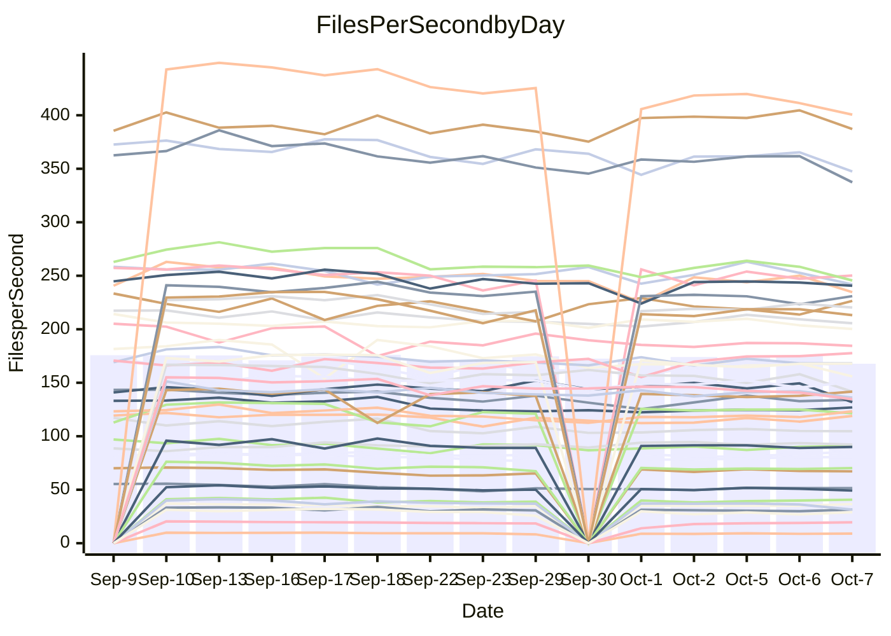

<!---
# This file is auto-generated. Do not edit.
# cspell:disable
--->
# Performance Report

## Daily Performance

## Time to Process Files

| Repository                                      | Elapsed | Min/Avg/Max           |   SD | SD Graph                |
| ----------------------------------------------- | ------: | :-------------------: | ---: | ----------------------- |
| AdaDoom3/AdaDoom3                    |    2.82 | 2.7 /   2.9 /   3.1   | 0.09 | `    ┣━━●━━╋━━┻━━┫    ` |
| alexiosc/megistos                    |    7.25 | 6.6 /   7.3 /   7.7   | 0.25 | `    ┣━━┻━━●━━┻━━┫    ` |
| apollographql/apollo-server          |    2.10 | 2.0 /   2.1 /   2.3   | 0.07 | `     ┣━┻━●╋━━┻━┫     ` |
| aspnetboilerplate/aspnetboilerplate  |   10.95 | 10.5 /  10.9 /  12.0  | 0.35 | `    ┣━━┻━━●━━┻━━┫    ` |
| aws-amplify/docs                     |   12.07 | 10.7 /  11.3 /  12.6  | 0.39 | `    ┣━━┻━━╋━━┻━━●    ` |
| Azure/azure-rest-api-specs           |   14.44 | 12.9 /  14.0 /  15.4  | 0.58 | `   ┣━━━┻━━╋━●┻━━━┫   ` |
| bitjson/typescript-starter           |    0.64 | 0.6 /   0.6 /   0.7   | 0.03 | `     ┣━━┻━●━┻━━┫     ` |
| caddyserver/caddy                    |    3.05 | 2.8 /   3.0 /   3.5   | 0.16 | `    ┣━━┻━━●━━┻━━┫    ` |
| canada-ca/open-source-logiciel-libre |    0.78 | 0.7 /   0.8 /   0.9   | 0.05 | `     ┣━┻━━╋●━┻━┫     ` |
| chef/chef                            |    5.30 | 5.1 /   5.4 /   6.0   | 0.22 | `    ┣━━┻●━╋━━┻━━┫    ` |
| dart-lang/sdk                        |   54.93 | 54.2 /  57.8 /  70.4  | 3.15 | `  ┣━━━●━━━╋━━━┻━━━┫  ` |
| django/django                        |   13.95 | 13.0 /  13.6 /  14.3  | 0.30 | `    ┣━━┻━━╋━━┻●━┫    ` |
| eslint/eslint                        |    9.80 | 9.0 /   9.5 /  10.0   | 0.25 | `    ┣━━┻━━╋━━┻●━┫    ` |
| exonum/exonum                        |    2.97 | 2.9 /   3.0 /   3.7   | 0.17 | `    ┣━━┻━●╋━━┻━━┫    ` |
| flutter/samples                      |   18.28 | 13.7 /  15.6 /  18.4  | 1.56 | `   ┣━━━┻━━╋━━┻━━●┫   ` |
| gitbucket/gitbucket                  |    3.07 | 2.8 /   3.0 /   3.3   | 0.12 | `    ┣━━┻━━╋●━┻━━┫    ` |
| googleapis/google-cloud-cpp          |  149.36 | 129.1 / 135.6 / 145.8 | 3.93 | `    ┣━━┻━━╋━━┻━━┫   ●` |
| graphql/express-graphql              |    0.83 | 0.6 /   0.7 /   0.8   | 0.04 | `     ┣━┻━━╋━━┻━┫    ●` |
| graphql/graphql-js                   |    2.35 | 1.9 /   2.1 /   2.3   | 0.09 | `    ┣━━┻━━╋━━┻━━┫●   ` |
| graphql/graphql-relay-js             |    0.69 | 0.6 /   0.7 /   0.8   | 0.03 | `     ┣━┻━●╋━━┻━┫     ` |
| graphql/graphql-spec                 |    0.77 | 0.7 /   0.8 /   1.1   | 0.07 | `     ┣━┻━●╋━━┻━┫     ` |
| iluwatar/java-design-patterns        |   10.95 | 10.3 /  10.9 /  12.5  | 0.45 | `    ┣━━┻━━●━━┻━━┫    ` |
| ktaranov/sqlserver-kit               |    5.71 | 5.7 /   5.9 /   6.4   | 0.16 | `    ┣━●┻━━╋━━┻━━┫    ` |
| liriliri/licia                       |    3.55 | 3.1 /   3.3 /   3.5   | 0.12 | `    ┣━━┻━━╋━━┻━━●    ` |
| MartinThoma/LaTeX-examples           |    6.39 | 5.9 /   6.3 /   7.0   | 0.25 | `    ┣━━┻━━╋●━┻━━┫    ` |
| mdx-js/mdx                           |    1.60 | 1.4 /   1.6 /   1.8   | 0.07 | `     ┣━┻━━╋●━┻━┫     ` |
| microsoft/TypeScript-Website         |    5.03 | 4.7 /   5.0 /   5.5   | 0.18 | `    ┣━━┻━━●━━┻━━┫    ` |
| MicrosoftDocs/PowerShell-Docs        |   21.83 | 20.6 /  22.3 /  23.9  | 0.84 | `   ┣━━━┻●━╋━━┻━━━┫   ` |
| neovim/nvim-lspconfig                |    2.84 | 2.6 /   2.8 /   3.0   | 0.12 | `    ┣━━┻━━╋━●┻━━┫    ` |
| pagekit/pagekit                      |    3.21 | 3.0 /   3.2 /   3.5   | 0.10 | `    ┣━━┻━━╋●━┻━━┫    ` |
| php/php-src                          |   23.97 | 23.2 /  24.2 /  26.1  | 0.73 | `   ┣━━━┻━●╋━━┻━━━┫   ` |
| plasticrake/tplink-smarthome-api     |    0.88 | 0.8 /   0.9 /   0.9   | 0.03 | `     ┣━┻━━╋●━┻━┫     ` |
| prettier/prettier                    |    6.32 | 5.7 /   6.0 /   6.4   | 0.16 | `    ┣━━┻━━╋━━┻━━●    ` |
| pycontribs/jira                      |    1.19 | 1.1 /   1.2 /   1.3   | 0.05 | `     ┣━┻━━●━━┻━┫     ` |
| RustPython/RustPython                |    4.56 | 4.1 /   4.4 /   4.9   | 0.17 | `    ┣━━┻━━╋━━●━━┫    ` |
| shoelace-style/shoelace              |    2.37 | 2.1 /   2.3 /   2.5   | 0.11 | `    ┣━━┻━━╋━●┻━━┫    ` |
| SoftwareBrothers/admin-bro           |    2.07 | 1.8 /   2.0 /   2.2   | 0.09 | `     ┣━┻━━╋━●┻━┫     ` |
| sveltejs/svelte                      |   19.35 | 18.1 /  18.9 /  20.3  | 0.51 | `   ┣━━━┻━━╋━━●━━━┫   ` |
| TheAlgorithms/Python                 |    5.52 | 4.7 /   5.1 /   5.5   | 0.20 | `    ┣━━┻━━╋━━┻━━●    ` |
| twbs/bootstrap                       |    1.15 | 1.0 /   1.1 /   1.2   | 0.05 | `     ┣━┻━━╋━●┻━┫     ` |
| typescript-cheatsheets/react         |    1.08 | 1.0 /   1.0 /   1.2   | 0.04 | `     ┣━┻━━╋━━●━┫     ` |
| typescript-eslint/typescript-eslint  |    3.70 | 3.2 /   3.4 /   3.7   | 0.12 | `    ┣━━┻━━╋━━┻━━●    ` |
| vitest-dev/vitest                    |    7.44 | 6.6 /   7.0 /   7.4   | 0.22 | `    ┣━━┻━━╋━━┻━━●    ` |
| w3c/aria-practices                   |    2.99 | 2.5 /   2.7 /   3.0   | 0.12 | `    ┣━━┻━━╋━━┻━━●    ` |
| w3c/specberus                        |    1.65 | 1.5 /   1.6 /   2.1   | 0.12 | `    ┣━━┻━━╋●━┻━━┫    ` |
| webdeveric/webpack-assets-manifest   |    0.66 | 0.6 /   0.7 /   0.8   | 0.06 | `     ┣━┻━━●━━┻━┫     ` |
| webpack/webpack                      |    4.51 | 4.2 /   4.4 /   4.8   | 0.17 | `    ┣━━┻━━╋━●┻━━┫    ` |
| wireapp/wire-desktop                 |    0.84 | 0.8 /   0.8 /   0.9   | 0.04 | `     ┣━┻━━╋●━┻━┫     ` |
| wireapp/wire-webapp                  |    7.40 | 6.9 /   7.4 /   8.0   | 0.28 | `    ┣━━┻━━●━━┻━━┫    ` |

Note:
- Elapsed time is in seconds.

## Files per Second over Time

| Repository                                      | Files |    Sec |    Fps |     Rel | Trend Fps              |    N |
| ----------------------------------------------- | ----: | -----: | -----: | ------: | ---------------------- | ---: |
| AdaDoom3/AdaDoom3                    |   103 |   2.82 |  36.57 |   3.68% | `▆█▆█▆▆▅▄▆▆▇▅▆▆▆▇▅▅██` |   23 |
| alexiosc/megistos                    |   583 |   7.25 |  80.39 |   0.13% | `▇▅▄█▅▅▅▄▄▄▅▅▃▅▅▄▅▆▄▅` |   23 |
| apollographql/apollo-server          |   250 |   2.10 | 118.94 |   1.81% | `████▇▇▄▇▆▅▄▇▆▇▆▇▆▇▄█` |   26 |
| aspnetboilerplate/aspnetboilerplate  |  2739 |  10.95 | 250.16 |  -0.35% | `▇█▆█▇▆▇▅▆█▆▇▄▇██▆▆▇▇` |   25 |
| aws-amplify/docs                     |  2832 |  12.07 | 234.68 |  -6.03% | `█▆▇▆▆▇▇▆▆▃▇▆▆▅▅▇▇▆▇▅` |   26 |
| Azure/azure-rest-api-specs           |  2429 |  14.44 | 168.21 |  -2.65% | `██▇▇█▅▇▆▆▇█▄▅▅█▇▆▆▆▆` |   26 |
| bitjson/typescript-starter           |    20 |   0.64 |  31.45 |   0.15% | `█▇▅▅█▄▅▆▅▆▅▅▅▆▅▃▆▄▃▆` |   23 |
| caddyserver/caddy                    |   277 |   3.05 |  90.92 |   0.19% | `▅█▇▆▃▆▇▇▆▆▇▆▇▆▆▄▆▆█▇` |   26 |
| canada-ca/open-source-logiciel-libre |     7 |   0.78 |   9.01 |  -2.71% | `▇▇██▇▇▆▆▄▅▆▂▆▇▇▅▄▅▆▆` |   23 |
| chef/chef                            |  1201 |   5.30 | 226.50 |   2.80% | `█▃▅▆▇▇▆▄▆▇█▇▄▇▅▅▅▆▄▇` |   26 |
| dart-lang/sdk                        |  9757 |  54.93 | 177.64 |   5.40% | `▂▇▇▇▆▆▆▇▇▅▅▇▇██▇▇███` |   26 |
| django/django                        |  2792 |  13.95 | 200.20 |  -2.80% | `▅█▆▆▆▆▇▇▆██▆███▇▇▆▇▆` |   26 |
| eslint/eslint                        |  2016 |   9.80 | 205.65 |  -2.60% | `█▇▅▇▆▇▆▅▅▅▆▅▅▇▇▇▇▆▅▅` |   26 |
| exonum/exonum                        |   421 |   2.97 | 141.66 |   2.15% | `█▆█▇▂▇▇▇▇▇▆▇▆▆▇▆▆▇▇▇` |   23 |
| flutter/samples                      |  2850 |  18.28 | 155.92 | -10.72% | `█▅▂█▇█▆▆▅▅▆▅▆▆▅▅▅▆▆▄` |   26 |
| gitbucket/gitbucket                  |   411 |   3.07 | 133.94 |  -2.08% | `█▇██▆▇▆▇▅▄▅▅▆▆▇█▆▄▇▆` |   26 |
| googleapis/google-cloud-cpp          | 19680 | 149.36 | 131.76 |  -9.22% | `▄▆▆▇▆▆▆█▆▇█▇▇▆▇▆▇▇█▃` |   26 |
| graphql/express-graphql              |    26 |   0.83 |  31.44 | -17.08% | `▇█▇▃▇▇▆▆▅▆▅▅▆▆▆▅▄▆▅▂` |   23 |
| graphql/graphql-js                   |   333 |   2.35 | 141.60 | -10.99% | `▆█▆▆▄▄▆▆▇▆▅▇▅▅▅▃▇▆▆▃` |   25 |
| graphql/graphql-relay-js             |    28 |   0.69 |  40.71 |   1.79% | `▇▅█▇▅▅▅▅▅▆▆▅▃▅▆▅▆▆▆▆` |   23 |
| graphql/graphql-spec                 |    15 |   0.77 |  19.50 |   3.17% | `███▇▇▇▇▇▆▂▆▆▅▇▆▇▇█▆▇` |   23 |
| iluwatar/java-design-patterns        |  1838 |  10.95 | 167.88 |  -0.72% | `█▇███▇▃▆▇▇▆▆▆▅▆▇▆▇▇▆` |   23 |
| ktaranov/sqlserver-kit               |   489 |   5.71 |  85.60 |   3.61% | `▇▇▆██▆▇▆▇▇▇▇▄▄▇▇▇▇██` |   24 |
| liriliri/licia                       |  1421 |   3.55 | 400.59 |  -6.41% | `███▇█▆▇▆▆▄▅▆▆▆▅▆▄▆▄▄` |   23 |
| MartinThoma/LaTeX-examples           |  1407 |   6.39 | 220.33 |  -1.34% | `▇▇█▅▇▆▆▅▅▅▃▇▆▅▄▇▅▆▇▆` |   23 |
| mdx-js/mdx                           |   144 |   1.60 |  89.93 |  -2.31% | `█▇▆▃▇▅▅▅▅▅▆▅▆▅▅▆▅▄▅▅` |   24 |
| microsoft/TypeScript-Website         |   758 |   5.03 | 150.72 |  -0.20% | `█▇█▆▇▆▆▆▄▆▇▇▃▆▇▆▅▄▇▆` |   25 |
| MicrosoftDocs/PowerShell-Docs        |  2692 |  21.83 | 123.32 |   2.17% | `▆▇██▆▅▆▅▄▆▆▅▆▅▇▆▄▆▆▇` |   26 |
| neovim/nvim-lspconfig                |   361 |   2.84 | 126.90 |  -1.02% | `▄▇▇█▆▅▅▅▅▄▅▄▅▆▄▅▆▄▅▆` |   26 |
| pagekit/pagekit                      |   741 |   3.21 | 230.96 |  -1.20% | `▆█▇██▇▇▆▇▆▇▆▆▇▇▅▅▆▄▆` |   23 |
| php/php-src                          |  2211 |  23.97 |  92.24 |   0.87% | `▆██▇▆▆▆▇▆████▆█▇█▇█▇` |   26 |
| plasticrake/tplink-smarthome-api     |    62 |   0.88 |  70.25 |  -1.49% | `█▆▇█▅▆▇▆▄▆▅▄▆▅▆▆▅▅▅▆` |   23 |
| prettier/prettier                    |  2197 |   6.32 | 347.49 |  -5.00% | `▇█▇▇▆▆▅▇▆▄▇▆▄▆▆▆▇▆▆▄` |   25 |
| pycontribs/jira                      |    80 |   1.19 |  67.16 |  -0.95% | `█▆▆█▆▆▃▅▅▇▆▅▇▇▇▇▆▆▇▆` |   24 |
| RustPython/RustPython                |   621 |   4.56 | 136.09 |  -4.24% | `▇██▇██▇▇▆▇█▇▃▆█▇▇▇█▆` |   25 |
| shoelace-style/shoelace              |   437 |   2.37 | 184.49 |  -3.56% | `▇▇█▃▆▅▅▆▅▅▃▅▆▅▆▄▅▅▅▅` |   26 |
| SoftwareBrothers/admin-bro           |   441 |   2.07 | 213.23 |  -4.00% | `▇███▇▅▅▄▅▅▆▃▄▄▅▆▆▅▆▅` |   23 |
| sveltejs/svelte                      |  7490 |  19.35 | 387.08 |  -1.53% | `▆▇▄▇▅▆▆▆▅▇█▆▇▇▇▇█▇█▆` |   26 |
| TheAlgorithms/Python                 |  1355 |   5.52 | 245.57 |  -7.41% | `▇███▅▆▆▆▆▄▄▇▆▆▇▇▆▅▆▄` |   26 |
| twbs/bootstrap                       |   120 |   1.15 | 104.71 |  -3.37% | `▃█▆█▅▄▄▆▄▄▅▄▅▅▅▅▄▄▅▄` |   26 |
| typescript-cheatsheets/react         |    53 |   1.08 |  49.20 |  -4.30% | `▆███▇▇▆▆▆▆▇▇▃▇▇▇▇▆▇▅` |   23 |
| typescript-eslint/typescript-eslint  |  1248 |   3.70 | 337.36 |  -7.26% | `▄██▇▆▆▇▅▅▆▆▆▆▇▆▇▇▆▆▄` |   26 |
| vitest-dev/vitest                    |  1800 |   7.44 | 241.96 |  -4.93% | `█▆▅▄▅▅▅▅▆▄▆▅▄▆█▇▅▆▅▄` |   26 |
| w3c/aria-practices                   |   403 |   2.99 | 134.58 |  -8.38% | `▇█▆█▃▅▆▆▆▆▆▆▆▆▄▅▅▄▅▃` |   25 |
| w3c/specberus                        |   200 |   1.65 | 121.42 |  -2.40% | `█▇█▆▅▂▆▆▆▇▇▇▅▆▆▇▇▆▆▆` |   25 |
| webdeveric/webpack-assets-manifest   |    19 |   0.66 |  29.01 |  -0.72% | `█▇███▆▆▆▃▆▂▆▅▅▆▆▆▅▂▆` |   23 |
| webpack/webpack                      |  1086 |   4.51 | 240.74 |  -2.03% | `▅██▇▄▇▇▆▆▄█▄▇▇▅▇▆▆▇▆` |   26 |
| wireapp/wire-desktop                 |    43 |   0.84 |  51.46 |  -1.53% | `▇██▆▆▅▄▆▅▅▆▃▅▆▆▆▆▅▆▆` |   26 |
| wireapp/wire-webapp                  |  1227 |   7.40 | 165.80 |   0.13% | `▅█▆▅▃▄▆▅▅▄▅▅▆▇▇▅▆█▅▆` |   26 |

## Data Throughput

| Repository                                      | Files |    Sec |     Kps |     Rel | Trend Kps              |    N |
| ----------------------------------------------- | ----: | -----: | ------: | ------: | ---------------------- | ---: |
| AdaDoom3/AdaDoom3                    |   103 |   2.82 |  777.27 |   3.68% | `▆█▆█▆▆▅▄▆▆▇▅▆▆▆▇▅▅██` |   23 |
| alexiosc/megistos                    |   583 |   7.25 |  631.66 |   0.13% | `▇▅▄█▅▅▅▄▄▄▅▅▃▅▅▄▅▆▄▅` |   23 |
| apollographql/apollo-server          |   250 |   2.10 |  942.45 |   1.81% | `████▇▇▄▇▆▅▄▇▆▇▆▇▆▇▄█` |   26 |
| aspnetboilerplate/aspnetboilerplate  |  2739 |  10.95 |  581.61 |  -1.45% | `▇█▆█▇▆▇▄▆▇▆▆▃▆▇▇▅▆▇▆` |   25 |
| aws-amplify/docs                     |  2832 |  12.07 |  783.51 |  -5.77% | `█▆▇▆▆▇▇▆▆▃▇▆▆▅▅▇▇▆▇▅` |   26 |
| Azure/azure-rest-api-specs           |  2429 |  14.44 |  480.73 |  -2.45% | `██▇▇█▅▆▆▆▇█▄▅▅█▇▆▆▆▆` |   26 |
| bitjson/typescript-starter           |    20 |   0.64 |  125.79 |   0.15% | `█▇▅▅█▄▅▆▅▆▅▅▅▆▅▃▆▄▃▆` |   23 |
| caddyserver/caddy                    |   277 |   3.05 |  751.34 |   1.79% | `▅█▇▆▃▆▇▇▅▆▇▆▇▆▆▄▆▆█▇` |   26 |
| canada-ca/open-source-logiciel-libre |     7 |   0.78 |   74.64 |  -2.71% | `▇▇██▇▇▆▆▄▅▆▂▆▇▇▅▄▅▆▆` |   23 |
| chef/chef                            |  1201 |   5.30 | 1039.52 |   2.66% | `█▃▅▆▇▇▆▄▆▇█▇▄▇▅▅▅▆▄▇` |   26 |
| dart-lang/sdk                        |  9757 |  54.93 | 1281.74 |   5.02% | `▂▇▇▇▆▆▆▇▇▅▅▇▇██▇▇███` |   26 |
| django/django                        |  2792 |  13.95 | 1225.23 |  -2.72% | `▅█▆▆▆▆▇▇▆██▆████▇▆▇▆` |   26 |
| eslint/eslint                        |  2016 |   9.80 | 1678.90 |  -2.79% | `█▇▅▇▆▇▆▅▅▄▆▅▅▇▇▆▆▆▅▅` |   26 |
| exonum/exonum                        |   421 |   2.97 | 1354.99 |   2.15% | `█▆█▇▂▇▇▇▇▇▆▇▆▆▇▆▆▇▇▇` |   23 |
| flutter/samples                      |  2850 |  18.28 | 1209.09 |  -8.97% | `█▅▂█▇█▆▆▆▆▆▆▆▇▆▆▅▆▇▅` |   26 |
| gitbucket/gitbucket                  |   411 |   3.07 |  605.19 |  -2.08% | `█▇██▆▇▆▇▅▄▅▅▆▆▇█▆▄▇▆` |   26 |
| googleapis/google-cloud-cpp          | 19680 | 149.36 | 1017.84 |  -1.73% | `▄▆▆▇▆▆▆█▆▇█▇▇▆▇▆▇▇█▆` |   26 |
| graphql/express-graphql              |    26 |   0.83 |  143.91 | -17.08% | `▇█▇▃▇▇▆▆▅▆▅▅▆▆▆▅▄▆▅▂` |   23 |
| graphql/graphql-js                   |   333 |   2.35 |  807.51 | -10.89% | `▆█▆▆▄▄▆▆▇▆▅▇▅▅▅▃▇▆▆▃` |   25 |
| graphql/graphql-relay-js             |    28 |   0.69 |  159.94 |   1.79% | `▇▅█▇▅▅▅▅▅▆▆▅▃▅▆▅▆▆▆▆` |   23 |
| graphql/graphql-spec                 |    15 |   0.77 |  716.35 |   3.17% | `███▇▇▇▇▇▆▂▆▆▅▇▆▇▇█▆▇` |   23 |
| iluwatar/java-design-patterns        |  1838 |  10.95 |  516.80 |  -0.69% | `█▇███▇▃▆▇▇▆▆▆▅▆▇▆▇▇▆` |   23 |
| ktaranov/sqlserver-kit               |   489 |   5.71 | 1294.84 |   3.61% | `▇▇▆██▆▇▆▇▇▇▇▄▄▇▇▇▇██` |   24 |
| liriliri/licia                       |  1421 |   3.55 |  472.20 |  -6.35% | `███▇█▆▇▆▆▄▅▆▆▆▅▆▄▆▄▄` |   23 |
| MartinThoma/LaTeX-examples           |  1407 |   6.39 |  455.38 |  -1.34% | `▇▇█▅▇▆▆▅▅▅▃▇▆▅▄▇▅▆▇▆` |   23 |
| mdx-js/mdx                           |   144 |   1.60 |  413.44 |  -1.89% | `█▇▆▃▇▅▅▅▅▅▆▅▆▅▅▆▅▅▅▅` |   24 |
| microsoft/TypeScript-Website         |   758 |   5.03 | 1031.20 |  -0.26% | `█▇█▆▇▆▆▆▄▆▇▇▃▆▇▆▅▄▇▆` |   25 |
| MicrosoftDocs/PowerShell-Docs        |  2692 |  21.83 | 1260.26 |   2.15% | `▆▇██▆▅▆▅▄▆▆▅▆▅▇▆▄▆▆▇` |   26 |
| neovim/nvim-lspconfig                |   361 |   2.84 |  328.31 |  -2.40% | `▄▇▇█▆▅▅▅▅▄▅▄▅▆▄▅▆▄▅▅` |   26 |
| pagekit/pagekit                      |   741 |   3.21 |  481.57 |  -1.20% | `▆█▇██▇▇▆▇▆▇▆▆▇▇▅▅▆▄▆` |   23 |
| php/php-src                          |  2211 |  23.97 | 1347.89 |   1.00% | `▆██▇▆▆▆▇▆████▆█▇█▇█▇` |   26 |
| plasticrake/tplink-smarthome-api     |    62 |   0.88 |  379.59 |  -1.49% | `█▆▇█▅▆▇▆▄▆▅▄▆▅▆▆▅▅▅▆` |   23 |
| prettier/prettier                    |  2197 |   6.32 |  484.15 |  -5.06% | `▇█▇▇▆▆▅▇▆▄▇▆▄▆▆▆▇▆▆▄` |   25 |
| pycontribs/jira                      |    80 |   1.19 |  462.53 |  -0.95% | `█▆▆█▆▆▃▅▅▇▆▅▇▇▇▇▆▆▇▆` |   24 |
| RustPython/RustPython                |   621 |   4.56 | 1001.71 |  -4.08% | `▇██▇██▇▇▆██▇▃▆█▇▇▇█▆` |   25 |
| shoelace-style/shoelace              |   437 |   2.37 |  876.87 |  -3.15% | `▇▇█▃▆▅▅▇▆▅▃▅▆▅▆▅▅▆▅▅` |   26 |
| SoftwareBrothers/admin-bro           |   441 |   2.07 |  469.98 |  -4.06% | `▇███▇▅▅▃▅▅▆▃▄▄▅▆▅▄▆▅` |   23 |
| sveltejs/svelte                      |  7490 |  19.35 |  279.59 |  -1.42% | `▆▇▄▇▅▆▆▆▅▇█▆▇▇▇▇█▇█▆` |   26 |
| TheAlgorithms/Python                 |  1355 |   5.52 |  622.53 |  -7.27% | `▇███▅▆▆▆▆▄▄▇▅▆▇▇▆▅▆▄` |   26 |
| twbs/bootstrap                       |   120 |   1.15 |  838.58 |  -3.37% | `▃█▆█▅▄▄▆▄▄▅▄▅▅▅▅▄▄▅▄` |   26 |
| typescript-cheatsheets/react         |    53 |   1.08 |  359.24 |  -4.30% | `▆███▇▇▆▆▆▆▇▇▃▇▇▇▇▆▇▅` |   23 |
| typescript-eslint/typescript-eslint  |  1248 |   3.70 | 1574.06 |  -6.67% | `▄██▇▆▆▇▅▅▆▆▇▆▇▆▇█▇▆▄` |   26 |
| vitest-dev/vitest                    |  1800 |   7.44 |  497.49 |  -4.55% | `█▇▆▄▅▆▆▆▆▄▆▅▄▆█▇▅▆▅▄` |   26 |
| w3c/aria-practices                   |   403 |   2.99 | 1254.63 |  -8.30% | `▇█▆█▃▅▆▆▆▆▆▆▆▆▄▅▅▄▅▃` |   25 |
| w3c/specberus                        |   200 |   1.65 |  387.33 |  -2.40% | `█▇█▆▅▂▆▆▆▇▇▇▅▆▆▇▇▆▆▆` |   25 |
| webdeveric/webpack-assets-manifest   |    19 |   0.66 |  155.72 |  -0.72% | `█▇███▆▆▆▃▆▂▆▅▅▆▆▆▅▂▆` |   23 |
| webpack/webpack                      |  1086 |   4.51 | 1049.43 |  -1.72% | `▅██▇▄▇▇▆▆▄█▄▇▇▅▇▆▆▇▆` |   26 |
| wireapp/wire-desktop                 |    43 |   0.84 |  226.20 |  -1.53% | `▇██▆▆▅▄▆▅▅▆▃▅▆▆▆▆▅▆▆` |   26 |
| wireapp/wire-webapp                  |  1227 |   7.40 |  701.70 |   0.13% | `▅█▆▅▃▄▆▅▅▄▅▅▆▇▇▅▆█▅▆` |   26 |

