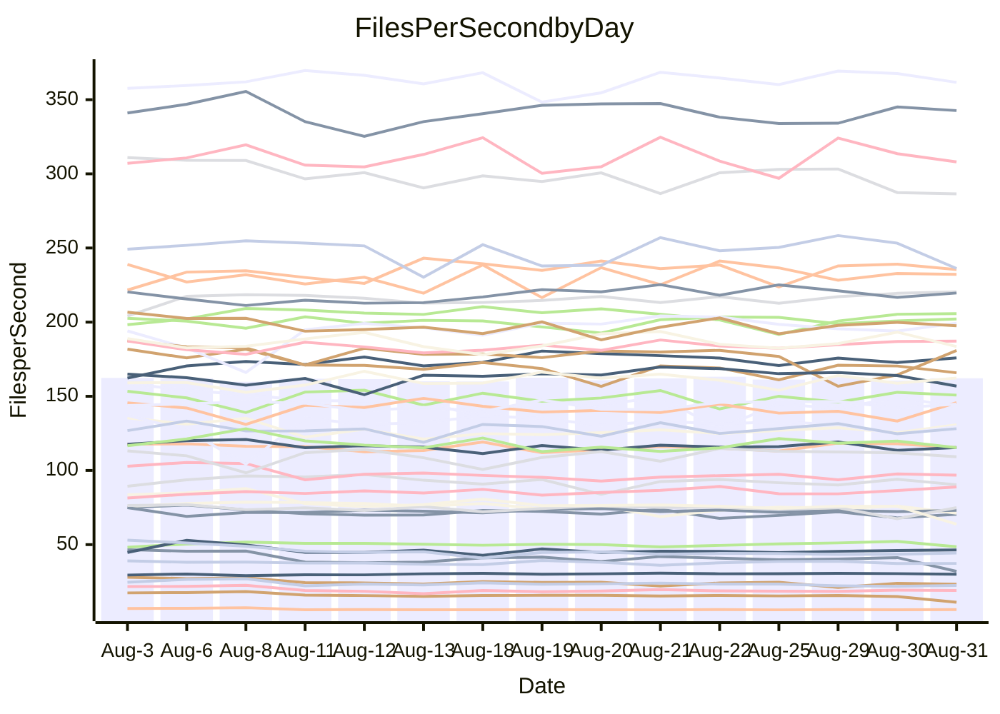

<!---
# This file is auto-generated. Do not edit.
# cspell:disable
--->
# Performance Report

## Daily Performance

## Time to Process Files

| Repository                                      | Elapsed | Min/Avg/Max           |   SD | SD Graph                |
| ----------------------------------------------- | ------: | :-------------------: | ---: | ----------------------- |
| AdaDoom3/AdaDoom3                    |    3.44 | 3.3 /   3.4 /   3.6   | 0.07 | `     ┣━┻━━╋●━┻━┫     ` |
| alexiosc/megistos                    |    7.64 | 7.5 /   7.9 /   9.4   | 0.42 | `    ┣━━┻●━╋━━┻━━┫    ` |
| apollographql/apollo-server          |    2.82 | 2.6 /   2.7 /   3.3   | 0.15 | `    ┣━━┻━━╋━●┻━━┫    ` |
| aspnetboilerplate/aspnetboilerplate  |   10.34 | 10.1 /  10.6 /  11.2  | 0.27 | `    ┣━━●━━╋━━┻━━┫    ` |
| aws-amplify/docs                     |   12.49 | 12.7 /  13.2 /  14.2  | 0.38 | `    ●━━┻━━╋━━┻━━┫    ` |
| Azure/azure-rest-api-specs           |   10.45 | 9.4 /   9.9 /  11.3   | 0.43 | `    ┣━━┻━━╋━━┻●━┫    ` |
| bitjson/typescript-starter           |    1.04 | 0.9 /   1.0 /   1.3   | 0.08 | `     ┣━┻━━●━━┻━┫     ` |
| caddyserver/caddy                    |    4.27 | 3.6 /   3.8 /   4.1   | 0.14 | `    ┣━━┻━━╋━━┻━━┫   ●` |
| canada-ca/open-source-logiciel-libre |    1.14 | 0.9 /   1.1 /   1.2   | 0.06 | `     ┣━┻━━╋●━┻━┫     ` |
| chef/chef                            |    5.95 | 5.8 /   6.2 /   7.7   | 0.38 | `    ┣━━┻●━╋━━┻━━┫    ` |
| dart-lang/sdk                        |   66.87 | 63.3 /  67.2 /  70.7  | 1.99 | `  ┣━━━┻━━●╋━━━┻━━━┫  ` |
| django/django                        |   15.30 | 14.8 /  15.5 /  16.4  | 0.36 | `    ┣━━┻●━╋━━┻━━┫    ` |
| eslint/eslint                        |   10.94 | 10.6 /  11.2 /  12.1  | 0.41 | `    ┣━━┻●━╋━━┻━━┫    ` |
| exonum/exonum                        |    3.59 | 3.4 /   3.6 /   3.9   | 0.11 | `    ┣━━┻━●╋━━┻━━┫    ` |
| flutter/samples                      |   16.60 | 16.3 /  17.3 /  19.7  | 0.70 | `   ┣━━━●━━╋━━┻━━━┫   ` |
| gitbucket/gitbucket                  |    3.58 | 3.4 /   3.6 /   3.9   | 0.12 | `    ┣━━┻━━●━━┻━━┫    ` |
| googleapis/google-cloud-cpp          |  142.79 | 136.7 / 143.5 / 155.3 | 4.70 | `  ┣━━━┻━━●╋━━━┻━━━┫  ` |
| graphql/express-graphql              |    1.14 | 1.0 /   1.1 /   1.3   | 0.07 | `     ┣━┻━━╋●━┻━┫     ` |
| graphql/graphql-js                   |    2.86 | 2.7 /   2.9 /   3.2   | 0.11 | `    ┣━━┻━━●━━┻━━┫    ` |
| graphql/graphql-relay-js             |    1.10 | 1.0 /   1.1 /   1.3   | 0.08 | `     ┣━┻●━╋━━┻━┫     ` |
| graphql/graphql-spec                 |    1.42 | 0.9 /   1.0 /   1.5   | 0.10 | `     ┣━┻━━╋━━┻━┫    ●` |
| iluwatar/java-design-patterns        |   13.52 | 12.6 /  13.3 /  15.2  | 0.57 | `    ┣━━┻━━╋●━┻━━┫    ` |
| ktaranov/sqlserver-kit               |    6.83 | 6.5 /   6.8 /   7.4   | 0.20 | `    ┣━━┻━━╋●━┻━━┫    ` |
| liriliri/licia                       |    4.21 | 4.0 /   4.2 /   4.6   | 0.12 | `    ┣━━┻━━●━━┻━━┫    ` |
| MartinThoma/LaTeX-examples           |    6.92 | 6.7 /   7.0 /   7.5   | 0.16 | `    ┣━━┻●━╋━━┻━━┫    ` |
| mdx-js/mdx                           |    2.08 | 1.8 /   2.0 /   2.2   | 0.09 | `     ┣━┻━━╋━━●━┫     ` |
| microsoft/TypeScript-Website         |    6.11 | 5.5 /   5.8 /   7.3   | 0.37 | `    ┣━━┻━━╋━●┻━━┫    ` |
| MicrosoftDocs/PowerShell-Docs        |   24.27 | 23.2 /  24.5 /  27.5  | 0.97 | `   ┣━━━┻━●╋━━┻━━━┫   ` |
| neovim/nvim-lspconfig                |    4.20 | 4.1 /   4.3 /   4.7   | 0.14 | `    ┣━━●━━╋━━┻━━┫    ` |
| pagekit/pagekit                      |    3.66 | 3.5 /   3.6 /   4.1   | 0.12 | `    ┣━━┻━━╋●━┻━━┫    ` |
| php/php-src                          |   26.02 | 25.3 /  26.7 /  29.7  | 1.02 | `   ┣━━━┻●━╋━━┻━━━┫   ` |
| plasticrake/tplink-smarthome-api     |    1.33 | 1.2 /   1.3 /   1.4   | 0.07 | `     ┣━┻━━●━━┻━┫     ` |
| prettier/prettier                    |    7.57 | 7.0 /   7.4 /   8.1   | 0.24 | `    ┣━━┻━━╋━●┻━━┫    ` |
| pycontribs/jira                      |    1.72 | 1.5 /   1.6 /   1.7   | 0.05 | `     ┣━┻━━╋━━┻━┫  ●  ` |
| RustPython/RustPython                |    5.30 | 5.0 /   5.4 /   5.8   | 0.21 | `    ┣━━┻━●╋━━┻━━┫    ` |
| shoelace-style/shoelace              |    3.12 | 2.8 /   3.0 /   3.7   | 0.17 | `    ┣━━┻━━╋━●┻━━┫    ` |
| slint-ui/slint                       |   12.33 | 11.8 /  12.6 /  15.5  | 0.84 | `   ┣━━━┻━●╋━━┻━━━┫   ` |
| SoftwareBrothers/admin-bro           |    2.76 | 2.4 /   2.6 /   3.0   | 0.11 | `    ┣━━┻━━╋━━┻●━┫    ` |
| sveltejs/svelte                      |   21.98 | 20.2 /  21.5 /  23.0  | 0.50 | `   ┣━━━┻━━╋━━●━━━┫   ` |
| TheAlgorithms/Python                 |    5.67 | 5.6 /   6.0 /   6.9   | 0.31 | `    ┣━━●━━╋━━┻━━┫    ` |
| twbs/bootstrap                       |    1.84 | 1.3 /   1.5 /   1.9   | 0.11 | `     ┣━┻━━╋━━┻━┫  ●  ` |
| typescript-cheatsheets/react         |    1.48 | 1.3 /   1.4 /   1.5   | 0.04 | `     ┣━┻━━╋━━┻━●     ` |
| typescript-eslint/typescript-eslint  |    4.27 | 4.1 /   4.3 /   4.7   | 0.14 | `    ┣━━┻━━●━━┻━━┫    ` |
| vitest-dev/vitest                    |    9.19 | 9.0 /   9.5 /  11.1   | 0.42 | `    ┣━━●━━╋━━┻━━┫    ` |
| w3c/aria-practices                   |    3.49 | 3.2 /   3.5 /   3.8   | 0.12 | `    ┣━━┻━━╋●━┻━━┫    ` |
| w3c/specberus                        |    2.04 | 1.9 /   2.1 /   2.2   | 0.08 | `     ┣━┻━●╋━━┻━┫     ` |
| webdeveric/webpack-assets-manifest   |    1.23 | 1.0 /   1.2 /   1.3   | 0.07 | `     ┣━┻━━╋━●┻━┫     ` |
| webpack/webpack                      |    5.73 | 5.4 /   5.6 /   6.2   | 0.18 | `    ┣━━┻━━╋━●┻━━┫    ` |
| wireapp/wire-desktop                 |    1.32 | 0.9 /   1.1 /   1.4   | 0.11 | `     ┣━┻━━╋━━┻━┫●    ` |
| wireapp/wire-webapp                  |   11.77 | 10.8 /  11.3 /  13.3  | 0.52 | `    ┣━━┻━━╋━━●━━┫    ` |

Note:
- Elapsed time is in seconds.

## Files per Second over Time

| Repository                                      | Files |    Sec |    Fps |     Rel | Trend Fps              |    N |
| ----------------------------------------------- | ----: | -----: | -----: | ------: | ---------------------- | ---: |
| AdaDoom3/AdaDoom3                    |   103 |   3.44 |  29.96 |  -0.51% | `▅▇█▇█▇▇▇▇█▇▇█▇██▇█▇▇` |   28 |
| alexiosc/megistos                    |   583 |   7.64 |  76.28 |   3.06% | `▇▅▇█▆▇▇██▇▇█▆█▇█▃▃▇█` |   28 |
| apollographql/apollo-server          |   252 |   2.82 |  89.22 |  -4.15% | `███▆▆▇▇▂▇▇▇▇▆▇▆█▅█▆▆` |   28 |
| aspnetboilerplate/aspnetboilerplate  |  2286 |  10.34 | 221.14 |   2.37% | `▆██▅▆▇▆▆█▆▆▇▇▅▇▇▇█▇█` |   28 |
| aws-amplify/docs                     |  2871 |  12.49 | 229.91 |   5.85% | `▆▄▆▅▆▇▇▇▆▇▆▆▇▇▇▆▆▇▅█` |   28 |
| Azure/azure-rest-api-specs           |  2438 |  10.45 | 233.28 |  -6.02% | `▇█▇▃▇█▄▆▅█▇▇▇▇█▇█▇▆▅` |   28 |
| bitjson/typescript-starter           |    20 |   1.04 |  19.23 |  -0.17% | `▅▇▆▃▇▅▇▆██▇▇▇▆▆██▇▇█` |   28 |
| caddyserver/caddy                    |   285 |   4.27 |  66.73 | -12.22% | `▇▇▆▇▇▄█▇▇▄▅▆█▅▆█▆▆▇▃` |   28 |
| canada-ca/open-source-logiciel-libre |     7 |   1.14 |   6.14 |  -2.52% | `▇▇▇▇▆▇█▇▆▆▇▇▆▆▇▆▆▆█▇` |   28 |
| chef/chef                            |  1207 |   5.95 | 202.69 |   4.11% | `█▇▇▇▆▇█▇▇█▇█▇█▇▇▇▅▇█` |   28 |
| dart-lang/sdk                        | 10798 |  66.87 | 161.47 |   0.59% | `▇▇▆▅▆█▇▆▇▇▆▇▅▄▇▇▄▆▇▆` |   28 |
| django/django                        |  2855 |  15.30 | 186.60 |   1.58% | `▆▇▇▄▆▅█▆▆▇▇▆▆▇▇▇▇█▇▇` |   28 |
| eslint/eslint                        |  2090 |  10.94 | 191.12 |   2.26% | `██▆▅▅▄██▇▇▆▆▇▄▆▇▇█▄▇` |   28 |
| exonum/exonum                        |   421 |   3.59 | 117.14 |   0.82% | `▆█▆▇▅▇▆▅▇▇▆▆▆▇█▆▄▇▆▇` |   28 |
| flutter/samples                      |  2400 |  16.60 | 144.56 |   2.34% | `▇▆██▇▆▆▆▇▆▇█▆▆▆▆▃▆█▇` |   28 |
| gitbucket/gitbucket                  |   413 |   3.58 | 115.42 |  -0.01% | `▅█▇▅█▅▆█▅▇█▆▄██▇█▇▇▇` |   28 |
| googleapis/google-cloud-cpp          | 20651 | 142.79 | 144.62 |   0.54% | `▆▄▆▇▅█▇▄█▆▆█▇▇▇▇▅▆▇▇` |   28 |
| graphql/express-graphql              |    26 |   1.14 |  22.82 |  -3.10% | `▅█▇▆█▆▇▇██▇▇▇▇▅▆▃▅▅▆` |   28 |
| graphql/graphql-js                   |   364 |   2.86 | 127.45 |   0.46% | `▇▇▇▃▆▆▆▆▆▆▆▆▆▇▇▆▆▇█▆` |   28 |
| graphql/graphql-relay-js             |    28 |   1.10 |  25.53 |   4.13% | `▇▇▅▆█▇▇▆█▄▆▇█▇▃▆▆▇▃█` |   28 |
| graphql/graphql-spec                 |    16 |   1.42 |  11.25 | -28.73% | `██▆█▇████▇█▇▇▇█▅█▇▂▂` |   28 |
| iluwatar/java-design-patterns        |  1992 |  13.52 | 147.39 |  -1.43% | `█▇▆▅▇▇▅▆▇▇▇▃▇▇▆▇█▇█▆` |   28 |
| ktaranov/sqlserver-kit               |   489 |   6.83 |  71.63 |  -1.07% | `█▆▆█▆▇███▇▇▇▅█▇█▅▇█▆` |   28 |
| liriliri/licia                       |  1437 |   4.21 | 341.25 |   0.35% | `▄▅▆▇▇█▇▇██▇▇▇▆▆█▇▇▇▇` |   28 |
| MartinThoma/LaTeX-examples           |  1409 |   6.92 | 203.58 |   1.65% | `▇▅▆▇▆▆▅▆▄▇▆██▆▆▇▇▅▆▇` |   28 |
| mdx-js/mdx                           |   141 |   2.08 |  67.84 |  -4.88% | `▄█▅▇█▇█▅██▅▆▆▇▇▅▆▅█▅` |   28 |
| microsoft/TypeScript-Website         |   761 |   6.11 | 124.55 |  -4.59% | `▆█▆███▇▆█▇▇▇▇▇▇█▆▄█▆` |   28 |
| MicrosoftDocs/PowerShell-Docs        |  2708 |  24.27 | 111.60 |   0.89% | `▇█▆▆▄▅▇▆█▅█▇█▇▇▆▇▇▅▇` |   28 |
| neovim/nvim-lspconfig                |   754 |   4.20 | 179.32 |   3.30% | `▆▇▆▆▆██▇█▇█▆▇▅▇▇▆▆▆█` |   28 |
| pagekit/pagekit                      |   741 |   3.66 | 202.30 |  -1.07% | `▇▇▆██▇███▇▇▆▇▃▆█▆██▇` |   28 |
| php/php-src                          |  2279 |  26.02 |  87.57 |   2.49% | `▆█▅▇▇▄▇▇▆▇▇█▆▆▆█▆▆█▇` |   28 |
| plasticrake/tplink-smarthome-api     |    62 |   1.33 |  46.60 |   0.62% | `▆▆▇▇▄▇█▅▇▆▇▆▆▅▆▆█▆▇▇` |   28 |
| prettier/prettier                    |  2286 |   7.57 | 302.17 |  -2.37% | `▆▆▆██▄▇▆▆█▇▆▅▅█▇█▆▇▆` |   28 |
| pycontribs/jira                      |    79 |   1.72 |  45.84 |  -9.26% | `▅▇▄█▆▇▅▆▆▅▆▄▅▇▇█▇▇▇▃` |   28 |
| RustPython/RustPython                |   683 |   5.30 | 128.98 |   1.33% | `▇▇▅▄█▇█▅▆█▄▇▆██▄▇▆▇▇` |   28 |
| shoelace-style/shoelace              |   439 |   3.12 | 140.56 |  -3.94% | `▇▇▇▇▆▇█▇▇█▆▂▆█▇███▇▆` |   28 |
| slint-ui/slint                       |  2241 |  12.33 | 181.78 |   2.72% | `██▇▇▇▆██▇▇█▇▇▇▄▆▇▂▇█` |   28 |
| SoftwareBrothers/admin-bro           |   441 |   2.76 | 160.05 |  -5.88% | `▇█▇██▇█▃▇██▇▆▆███▇█▆` |   28 |
| sveltejs/svelte                      |  7809 |  21.98 | 355.24 |  -2.10% | `▅▇▅▆▆▅▄▅▆▆▆▆▆▅▇█▆▅▆▅` |   28 |
| TheAlgorithms/Python                 |  1390 |   5.67 | 244.98 |   4.79% | `▆▃██▇▇▇▇█▇▇█▇▄▇▇█▇▆█` |   28 |
| twbs/bootstrap                       |   118 |   1.84 |  64.09 | -17.31% | `▆▆▇▇█▇▆▆▇▇█▅█▄▇██▄▃▃` |   28 |
| typescript-cheatsheets/react         |    53 |   1.48 |  35.83 |  -5.33% | `▇▅▅▆▅██▆▇▅█▅█▇▇▆▄▇▇▄` |   28 |
| typescript-eslint/typescript-eslint  |  1278 |   4.27 | 299.26 |   0.43% | `██▅▇▇█▆▇█▆▇████▆▄▇▄▇` |   28 |
| vitest-dev/vitest                    |  2193 |   9.19 | 238.65 |   3.79% | `▇▇▆▅█▃▇▇█▆███▇▆▇▇▇▆█` |   28 |
| w3c/aria-practices                   |   409 |   3.49 | 117.24 |  -0.72% | `▆▇▆▆█▄▆▅▇▅▆▅▇█▇▇█▇▅▆` |   28 |
| w3c/specberus                        |   198 |   2.04 |  97.25 |  -0.37% | `▇██▇▇▅█▇▄▆▇▇▇▇▆▇▆█▇▇` |   28 |
| webdeveric/webpack-assets-manifest   |    54 |   1.23 |  43.83 |  -3.75% | `▇▇▇█▄█▆▇█▆▇▇▇▆▆█▆▅▇▆` |   28 |
| webpack/webpack                      |  1111 |   5.73 | 194.05 |  -1.76% | `▆▆█▆▆█▇▇▄▇██▇▅▇█▇▇█▆` |   28 |
| wireapp/wire-desktop                 |    43 |   1.32 |  32.57 | -19.55% | `█▃▇▅███▇▅█▇██▆▇██▇▂▃` |   28 |
| wireapp/wire-webapp                  |  1831 |  11.77 | 155.55 |  -4.37% | `▅▃▇█▇█▇▇▇███▇▇▇██▆▆▆` |   28 |

## Data Throughput

| Repository                                      | Files |    Sec |     Kps |     Rel | Trend Kps              |    N |
| ----------------------------------------------- | ----: | -----: | ------: | ------: | ---------------------- | ---: |
| AdaDoom3/AdaDoom3                    |   103 |   3.44 |  636.77 |  -0.51% | `▅▇█▇█▇▇▇▇█▇▇█▇██▇█▇▇` |   28 |
| alexiosc/megistos                    |   583 |   7.64 |  599.40 |   3.06% | `▇▅▇█▆▇▇██▇▇█▆█▇█▃▃▇█` |   28 |
| apollographql/apollo-server          |   252 |   2.82 |  717.68 |  -4.15% | `███▆▆▇▇▂▇▇▇▇▆▇▆█▅█▆▆` |   28 |
| aspnetboilerplate/aspnetboilerplate  |  2286 |  10.34 |  538.06 |   2.39% | `▆██▅▆▇▆▆█▆▆▇▇▅▇▇▇█▇█` |   28 |
| aws-amplify/docs                     |  2871 |  12.49 |  802.81 |   5.85% | `▆▄▆▅▆▇▇▇▆▇▆▆▇▇▇▆▆▇▅█` |   28 |
| Azure/azure-rest-api-specs           |  2438 |  10.45 |  618.31 |  -6.25% | `▇█▇▃▇█▄▆▅█▇▇▇▇█▇█▇▆▅` |   28 |
| bitjson/typescript-starter           |    20 |   1.04 |   76.91 |  -0.17% | `▅▇▆▃▇▅▇▆██▇▇▇▆▆██▇▇█` |   28 |
| caddyserver/caddy                    |   285 |   4.27 |  569.64 | -12.08% | `▇▇▆▇▇▄█▇▇▄▅▆█▅▆█▆▆▇▃` |   28 |
| canada-ca/open-source-logiciel-libre |     7 |   1.14 |   50.90 |  -2.52% | `▇▇▇▇▆▇█▇▆▆▇▇▆▆▇▆▆▆█▇` |   28 |
| chef/chef                            |  1207 |   5.95 |  936.70 |   4.18% | `█▇▇▇▆▇█▇▇█▇█▇█▇▇▇▅▇█` |   28 |
| dart-lang/sdk                        | 10798 |  66.87 | 1092.91 |   0.68% | `▇▇▆▅▆█▇▆▇▇▅▇▅▄▇▇▄▆▇▆` |   28 |
| django/django                        |  2855 |  15.30 | 1169.94 |   1.67% | `▆▇▇▄▆▅█▆▆▇▇▆▆▇▇▇▇█▇▇` |   28 |
| eslint/eslint                        |  2090 |  10.94 | 1388.70 |   2.27% | `██▆▅▅▄██▇▇▆▆▇▄▆▇▇█▄▇` |   28 |
| exonum/exonum                        |   421 |   3.59 | 1120.50 |   0.82% | `▆█▆▇▅▇▆▅▇▇▆▆▆▇█▆▄▇▆▇` |   28 |
| flutter/samples                      |  2400 |  16.60 | 1289.98 |   3.35% | `▇▆██▇▆▆▆▇▆▇█▆▆▇▆▃▇██` |   28 |
| gitbucket/gitbucket                  |   413 |   3.58 |  524.57 |   0.01% | `▅█▇▅█▅▆█▅▇█▆▄██▇█▇▇▇` |   28 |
| googleapis/google-cloud-cpp          | 20651 | 142.79 | 1169.27 |   0.72% | `▆▄▆▇▅█▇▄█▆▆█▇▇▇▇▅▆▇▇` |   28 |
| graphql/express-graphql              |    26 |   1.14 |  104.44 |  -3.10% | `▅█▇▆█▆▇▇██▇▇▇▇▅▆▃▅▅▆` |   28 |
| graphql/graphql-js                   |   364 |   2.86 |  732.47 |   0.46% | `▇▇▇▃▆▆▆▆▆▆▆▆▆▇▇▆▆▇█▆` |   28 |
| graphql/graphql-relay-js             |    28 |   1.10 |  100.28 |   4.13% | `▇▇▅▆█▇▇▆█▄▆▇█▇▃▆▆▇▃█` |   28 |
| graphql/graphql-spec                 |    16 |   1.42 |  407.88 | -28.73% | `██▆█▇████▇█▇▇▇█▅█▇▂▂` |   28 |
| iluwatar/java-design-patterns        |  1992 |  13.52 |  455.55 |  -1.43% | `█▇▆▅▇▇▅▆▇▇▇▃▇▇▆▇█▇█▆` |   28 |
| ktaranov/sqlserver-kit               |   489 |   6.83 | 1084.33 |  -1.07% | `█▆▆█▆▇███▇▇▇▅█▇█▅▇█▆` |   28 |
| liriliri/licia                       |  1437 |   4.21 |  406.56 |   0.35% | `▄▅▆▇▇█▇▇██▇▇▇▆▆█▇▇▇▇` |   28 |
| MartinThoma/LaTeX-examples           |  1409 |   6.92 |  420.44 |   1.65% | `▇▅▆▇▆▆▅▆▄▇▆██▆▆▇▇▅▆▇` |   28 |
| mdx-js/mdx                           |   141 |   2.08 |  315.64 |  -4.85% | `▄█▅▇█▇█▅██▅▆▆▇▇▅▆▅█▅` |   28 |
| microsoft/TypeScript-Website         |   761 |   6.11 |  861.39 |  -4.56% | `▆█▆███▇▆█▇▇▇▇▇▇█▆▄█▆` |   28 |
| MicrosoftDocs/PowerShell-Docs        |  2708 |  24.27 | 1147.55 |   0.92% | `▇█▆▆▄▅▇▆█▅█▇█▇▇▆▇▇▅▇` |   28 |
| neovim/nvim-lspconfig                |   754 |   4.20 |  294.90 |   4.59% | `▆▇▆▆▆██▇█▇█▆▇▆▇▇▇▆▇█` |   28 |
| pagekit/pagekit                      |   741 |   3.66 |  421.81 |  -1.07% | `▇▇▆██▇███▇▇▆▇▃▆█▆██▇` |   28 |
| php/php-src                          |  2279 |  26.02 | 1525.61 |   2.66% | `▆█▅▇▇▄▇▇▆▇▇█▆▆▆█▆▆█▇` |   28 |
| plasticrake/tplink-smarthome-api     |    62 |   1.33 |  251.77 |   0.62% | `▆▆▇▇▄▇█▅▇▆▇▆▆▅▆▆█▆▇▇` |   28 |
| prettier/prettier                    |  2286 |   7.57 |  428.67 |  -2.39% | `▆▆▆██▄▇▆▆█▇▆▅▅█▇█▆▇▆` |   28 |
| pycontribs/jira                      |    79 |   1.72 |  324.93 |  -9.27% | `▅▇▄█▆▇▅▆▆▅▆▄▅▇▇█▇▇▇▃` |   28 |
| RustPython/RustPython                |   683 |   5.30 | 1013.12 |   1.41% | `▇▇▅▄█▇█▅▆█▄▇▆██▄▇▆▇▇` |   28 |
| shoelace-style/shoelace              |   439 |   3.12 |  679.11 |  -3.94% | `▇▇▇▇▆▇█▇▇█▆▂▆█▇███▇▆` |   28 |
| slint-ui/slint                       |  2241 |  12.33 | 1186.46 |   2.85% | `██▇▇▇▆██▇▇█▇▇▇▄▆▇▂▇█` |   28 |
| SoftwareBrothers/admin-bro           |   441 |   2.76 |  352.77 |  -5.88% | `▇█▇██▇█▃▇██▇▆▆███▇█▆` |   28 |
| sveltejs/svelte                      |  7809 |  21.98 |  237.83 |  -2.11% | `▅▇▅▆▆▅▄▅▆▆▆▆▆▅▇█▆▅▆▅` |   28 |
| TheAlgorithms/Python                 |  1390 |   5.67 |  621.97 |   4.82% | `▆▃██▇▇▇▇█▇▇█▇▄▇▇█▇▆█` |   28 |
| twbs/bootstrap                       |   118 |   1.84 |  526.26 | -17.31% | `▆▆▇▇█▇▆▆▇▇█▅█▄▇██▄▃▃` |   28 |
| typescript-cheatsheets/react         |    53 |   1.48 |  264.97 |  -4.42% | `▆▅▅▅▅█▇▆▇▄█▄█▇█▆▅▇█▅` |   28 |
| typescript-eslint/typescript-eslint  |  1278 |   4.27 | 1527.67 |   0.51% | `██▅▇▇█▆▇█▆▇████▆▄▇▄▇` |   28 |
| vitest-dev/vitest                    |  2193 |   9.19 |  536.17 |   3.92% | `▇▇▆▅█▃▇▇█▆███▇▆▇▇▇▆█` |   28 |
| w3c/aria-practices                   |   409 |   3.49 | 1091.02 |  -0.70% | `▆▇▆▆█▄▆▅▇▅▆▅▇█▇▇█▇▅▆` |   28 |
| w3c/specberus                        |   198 |   2.04 |  305.49 |   0.05% | `▇▇▇▇▇▅█▇▄▆▇▇▇▇▆▇▆█▇▇` |   28 |
| webdeveric/webpack-assets-manifest   |    54 |   1.23 |  103.08 |  -3.72% | `▇▇▇█▄█▆▇█▆▇▇▇▆▆█▆▅▇▆` |   28 |
| webpack/webpack                      |  1111 |   5.73 |  881.52 |  -1.60% | `▆▆▇▆▆█▇▇▄▇██▇▅▇█▇▇█▆` |   28 |
| wireapp/wire-desktop                 |    43 |   1.32 |  143.91 | -19.55% | `█▃▇▅███▇▅█▇██▆▇██▇▂▃` |   28 |
| wireapp/wire-webapp                  |  1831 |  11.77 |  555.68 |  -4.32% | `▅▃▇█▇█▇▇▇███▇▇▇██▆▆▆` |   28 |

