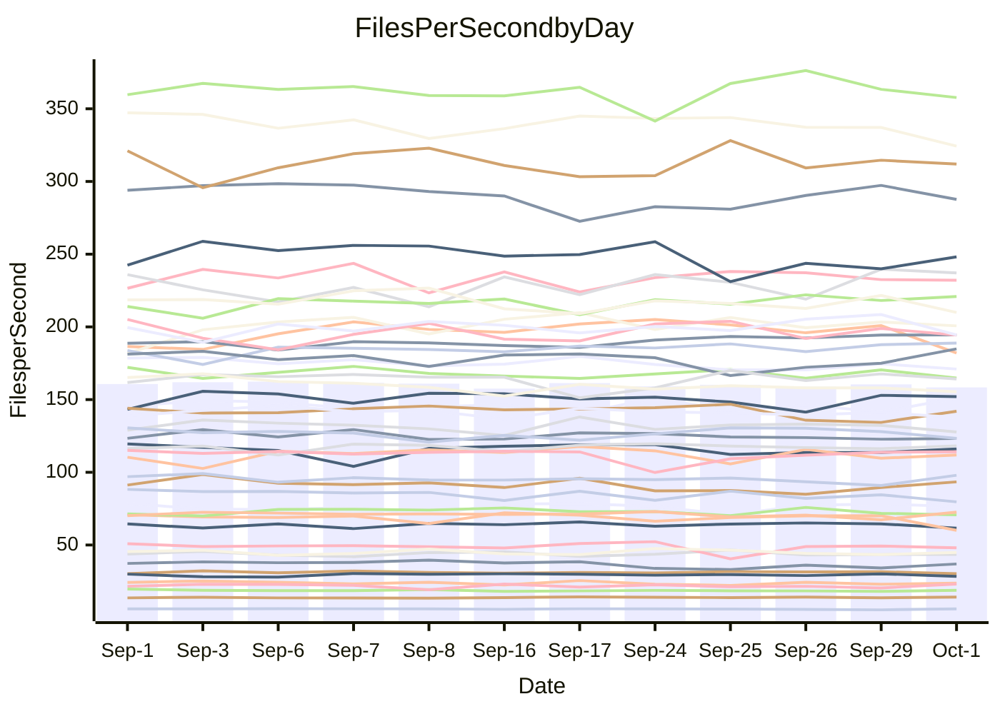

<!---
# This file is auto-generated. Do not edit.
# cspell:disable
--->
# Performance Report

## Daily Performance

## Time to Process Files

| Repository                                      | Elapsed | Min/Avg/Max           |   SD | SD Graph                |
| ----------------------------------------------- | ------: | :-------------------: | ---: | ----------------------- |
| AdaDoom3/AdaDoom3                    |    3.62 | 3.4 /   3.5 /   4.5   | 0.27 | `    ┣━━┻━━╋●━┻━━┫    ` |
| alexiosc/megistos                    |    8.24 | 7.5 /   7.9 /   8.3   | 0.22 | `    ┣━━┻━━╋━━┻●━┫    ` |
| apollographql/apollo-server          |    2.70 | 2.6 /   2.8 /   3.0   | 0.12 | `    ┣━━┻●━╋━━┻━━┫    ` |
| aspnetboilerplate/aspnetboilerplate  |   10.35 | 10.2 /  10.5 /  11.1  | 0.23 | `    ┣━━┻●━╋━━┻━━┫    ` |
| aws-amplify/docs                     |   13.68 | 12.7 /  13.2 /  14.2  | 0.43 | `    ┣━━┻━━╋━━●━━┫    ` |
| Azure/azure-rest-api-specs           |    9.84 | 9.4 /   9.8 /  10.6   | 0.33 | `    ┣━━┻━━●━━┻━━┫    ` |
| bitjson/typescript-starter           |    1.06 | 1.0 /   1.1 /   1.1   | 0.03 | `     ┣━━┻●╋━┻━━┫     ` |
| caddyserver/caddy                    |    3.74 | 3.6 /   3.8 /   4.0   | 0.14 | `    ┣━━┻━●╋━━┻━━┫    ` |
| canada-ca/open-source-logiciel-libre |    1.14 | 1.1 /   1.2 /   1.3   | 0.06 | `     ┣━┻━●╋━━┻━┫     ` |
| chef/chef                            |    6.21 | 5.8 /   6.0 /   6.4   | 0.16 | `    ┣━━┻━━╋━━●━━┫    ` |
| dart-lang/sdk                        |   67.99 | 64.5 /  67.2 /  73.0  | 1.89 | `  ┣━━━┻━━━╋━●━┻━━━┫  ` |
| django/django                        |   15.23 | 15.0 /  15.5 /  16.4  | 0.36 | `    ┣━━●━━╋━━┻━━┫    ` |
| eslint/eslint                        |   10.76 | 10.8 /  11.1 /  11.8  | 0.25 | `    ┣━●┻━━╋━━┻━━┫    ` |
| exonum/exonum                        |    3.76 | 3.6 /   3.7 /   4.1   | 0.14 | `    ┣━━┻━━●━━┻━━┫    ` |
| flutter/samples                      |   16.91 | 16.3 /  17.0 /  18.6  | 0.57 | `   ┣━━━┻━━●━━┻━━━┫   ` |
| gitbucket/gitbucket                  |    3.56 | 3.5 /   3.6 /   4.0   | 0.17 | `    ┣━━┻━●╋━━┻━━┫    ` |
| googleapis/google-cloud-cpp          |  150.83 | 139.0 / 146.7 / 163.3 | 5.22 | `  ┣━━━┻━━━╋━━●┻━━━┫  ` |
| graphql/express-graphql              |    1.12 | 1.1 /   1.2 /   1.4   | 0.06 | `     ┣━●━━╋━━┻━┫     ` |
| graphql/graphql-js                   |    2.95 | 2.7 /   2.9 /   3.1   | 0.09 | `     ┣━┻━━╋●━┻━┫     ` |
| graphql/graphql-relay-js             |    1.18 | 1.1 /   1.2 /   1.3   | 0.06 | `     ┣━┻━━●━━┻━┫     ` |
| graphql/graphql-spec                 |    1.34 | 1.3 /   1.3 /   1.4   | 0.05 | `     ┣━┻━━●━━┻━┫     ` |
| iluwatar/java-design-patterns        |   13.10 | 12.8 /  13.3 /  14.9  | 0.53 | `    ┣━━┻━●╋━━┻━━┫    ` |
| ktaranov/sqlserver-kit               |    6.74 | 6.6 /   6.9 /   7.3   | 0.17 | `    ┣━━●━━╋━━┻━━┫    ` |
| liriliri/licia                       |    4.43 | 4.1 /   4.2 /   4.4   | 0.08 | `    ┣━━┻━━╋━━┻━━┫●   ` |
| MartinThoma/LaTeX-examples           |    7.25 | 6.9 /   7.3 /   7.8   | 0.26 | `    ┣━━┻━━●━━┻━━┫    ` |
| mdx-js/mdx                           |    2.35 | 1.9 /   2.0 /   2.2   | 0.06 | `      ┣━┻━╋━┻━┫     ●` |
| microsoft/TypeScript-Website         |    5.96 | 5.5 /   5.8 /   6.5   | 0.23 | `    ┣━━┻━━╋━●┻━━┫    ` |
| MicrosoftDocs/PowerShell-Docs        |   23.73 | 23.3 /  24.1 /  27.1  | 0.87 | `   ┣━━━┻━●╋━━┻━━━┫   ` |
| neovim/nvim-lspconfig                |    4.45 | 4.2 /   4.3 /   4.5   | 0.09 | `    ┣━━┻━━╋━━┻●━┫    ` |
| pagekit/pagekit                      |    3.69 | 3.5 /   3.7 /   4.1   | 0.13 | `    ┣━━┻━━●━━┻━━┫    ` |
| php/php-src                          |   28.85 | 25.7 /  27.0 /  29.3  | 1.04 | `   ┣━━━┻━━╋━━┻━━●┫   ` |
| plasticrake/tplink-smarthome-api     |    1.38 | 1.3 /   1.4 /   1.6   | 0.07 | `     ┣━┻━━●━━┻━┫     ` |
| prettier/prettier                    |    7.48 | 7.0 /   7.4 /   7.9   | 0.28 | `    ┣━━┻━━╋●━┻━━┫    ` |
| pycontribs/jira                      |    1.64 | 1.5 /   1.6 /   2.0   | 0.10 | `     ┣━┻━━╋●━┻━┫     ` |
| RustPython/RustPython                |    5.57 | 5.2 /   5.4 /   5.7   | 0.13 | `    ┣━━┻━━╋━━┻●━┫    ` |
| shoelace-style/shoelace              |    2.91 | 2.9 /   3.0 /   3.1   | 0.07 | `     ┣●┻━━╋━━┻━┫     ` |
| slint-ui/slint                       |   13.61 | 12.2 /  12.8 /  14.4  | 0.56 | `    ┣━━┻━━╋━━┻━●┫    ` |
| SoftwareBrothers/admin-bro           |    2.68 | 2.5 /   2.6 /   2.7   | 0.06 | `     ┣━┻━━╋━━●━┫     ` |
| sveltejs/svelte                      |   22.17 | 20.8 /  21.6 /  23.2  | 0.52 | `   ┣━━━┻━━╋━━●━━━┫   ` |
| TheAlgorithms/Python                 |    6.01 | 5.7 /   6.0 /   6.3   | 0.18 | `    ┣━━┻━━╋●━┻━━┫    ` |
| twbs/bootstrap                       |    1.92 | 1.8 /   1.8 /   2.0   | 0.05 | `     ┣━┻━━╋━━┻●┫     ` |
| typescript-cheatsheets/react         |    1.43 | 1.3 /   1.4 /   1.6   | 0.07 | `     ┣━┻━━●━━┻━┫     ` |
| typescript-eslint/typescript-eslint  |    4.45 | 4.3 /   4.4 /   4.7   | 0.13 | `    ┣━━┻━━╋●━┻━━┫    ` |
| vitest-dev/vitest                    |    9.37 | 9.2 /   9.8 /  12.0   | 0.74 | `    ┣━━┻●━╋━━┻━━┫    ` |
| w3c/aria-practices                   |    3.50 | 3.4 /   3.5 /   3.8   | 0.10 | `    ┣━━┻━●╋━━┻━━┫    ` |
| w3c/specberus                        |    2.02 | 2.0 /   2.1 /   2.2   | 0.05 | `     ┣●┻━━╋━━┻━┫     ` |
| webdeveric/webpack-assets-manifest   |    1.24 | 1.2 /   1.2 /   1.3   | 0.04 | `     ┣━┻━━●━━┻━┫     ` |
| webpack/webpack                      |    6.12 | 5.3 /   5.7 /   6.1   | 0.19 | `    ┣━━┻━━╋━━┻━━┫●   ` |
| wireapp/wire-desktop                 |    1.42 | 1.3 /   1.4 /   1.4   | 0.03 | `     ┣━┻━━╋━━●━┫     ` |
| wireapp/wire-webapp                  |   11.18 | 10.8 /  11.2 /  12.1  | 0.35 | `    ┣━━┻━━●━━┻━━┫    ` |

Note:
- Elapsed time is in seconds.

## Files per Second over Time

| Repository                                      | Files |    Sec |    Fps |     Rel | Trend Fps           |    N |
| ----------------------------------------------- | ----: | -----: | -----: | ------: | ------------------- | ---: |
| AdaDoom3/AdaDoom3                    |   103 |   3.62 |  28.47 |  -3.10% | `█▆█▂███▇███▇▇▆██▆` |   16 |
| alexiosc/megistos                    |   583 |   8.24 |  70.72 |  -3.98% | `▅▄▇▆▇▆▇▆█▆▆▆▄█▇▅▅` |   16 |
| apollographql/apollo-server          |   252 |   2.70 |  93.42 |   2.94% | `▆█▆▆▆▄▇▆▅▆▇▄▅▄▃▅▆` |   16 |
| aspnetboilerplate/aspnetboilerplate  |  2286 |  10.35 | 220.86 |   1.75% | `▆▅▇▇█▇▇▆▆█▅▇▆▇█▇▇` |   16 |
| aws-amplify/docs                     |  2871 |  13.68 | 209.93 |  -3.36% | `▇▇▇▄████▆▆▅▇▆▇▅▇▅` |   16 |
| Azure/azure-rest-api-specs           |  2442 |   9.84 | 248.14 |  -0.51% | `▆█▇▇▇████▆▇█▄▅▆▅▇` |   16 |
| bitjson/typescript-starter           |    20 |   1.06 |  18.84 |   1.17% | `█▆▆▆▆▆▆▇▄▆▆▆▆▆▅▅▆` |   16 |
| caddyserver/caddy                    |   286 |   3.74 |  76.48 |   0.81% | `█▆▅▆▇▅█▄███▇▄█▇█▇` |   16 |
| canada-ca/open-source-logiciel-libre |     7 |   1.14 |   6.13 |   2.47% | `▇▇████▇▇█▃█▇▇▄▆▃▇` |   16 |
| chef/chef                            |  1207 |   6.21 | 194.43 |  -3.02% | `▆▄█▇▆▇▄▇▇▆▆▆▆█▇█▅` |   16 |
| dart-lang/sdk                        | 10563 |  67.99 | 155.35 |  -2.81% | `██▇▆█▆▇▆▆▄▇▆▆▆▆▆▅` |   16 |
| django/django                        |  2876 |  15.23 | 188.86 |   2.38% | `▇▄▆▇██▆▇▆▆▇▇█▅▇▇█` |   16 |
| eslint/eslint                        |  2093 |  10.76 | 194.56 |   2.98% | `▇▇▄▆▇▇▇▇▆▇▆▇██▇██` |   16 |
| exonum/exonum                        |   421 |   3.76 | 111.90 |  -0.76% | `▆▄▇▇▇▇▆▇▇▆█▇▄█▇▆▆` |   16 |
| flutter/samples                      |  2400 |  16.91 | 141.94 |   0.16% | `▇▇▆█▆▇██▇▇▇██▄▇▅▇` |   16 |
| gitbucket/gitbucket                  |   413 |   3.56 | 116.09 |   1.34% | `█▇█▅█▄▄▇█▇██▆▇▆▆▇` |   16 |
| googleapis/google-cloud-cpp          | 20771 | 150.83 | 137.71 |  -2.72% | `▆▇█▆█▇▆▇▃▇▇▆▆▆▆▆▆` |   16 |
| graphql/express-graphql              |    26 |   1.12 |  23.15 |   5.30% | `▆▇▇▇▇▆▇▃▆█▅▇▅▅▆▄▇` |   16 |
| graphql/graphql-js                   |   364 |   2.95 | 123.28 |  -1.43% | `▆▇▄▆▇█▆▅▅▆▇▆▆▅▇▅▆` |   16 |
| graphql/graphql-relay-js             |    28 |   1.18 |  23.78 |  -0.22% | `▇█▇▆█▆▅▇▃▆█▅▄▇▆▅▆` |   16 |
| graphql/graphql-spec                 |    19 |   1.34 |  14.16 |   2.46% | `▆▇▄▇▇▆▆▅█▅█▇▇██▆█` |   16 |
| iluwatar/java-design-patterns        |  1992 |  13.10 | 152.03 |   1.19% | `▅█▇██▅▇███▇▇▇▇▃█▇` |   16 |
| ktaranov/sqlserver-kit               |   489 |   6.74 |  72.58 |   2.20% | `▆▇▆▇██▅▇▆▇▇█▅▅▇▄▇` |   16 |
| liriliri/licia                       |  1437 |   4.43 | 324.33 |  -4.51% | `██▇▇▆▇█▆▅████▇▆▇▅` |   16 |
| MartinThoma/LaTeX-examples           |  1409 |   7.25 | 194.40 |   0.19% | `█▆▄▄▅▆▇█▆▅▅██▆▅▇▆` |   16 |
| mdx-js/mdx                           |   141 |   2.35 |  60.12 | -13.48% | `▆▆▆▆▅▆▆▄▆█▆▄▆▇▅▆▁` |   16 |
| microsoft/TypeScript-Website         |   761 |   5.96 | 127.71 |  -3.17% | `▆██▇▇▇▇▆▇▃█▆▇▆█▇▆` |   16 |
| MicrosoftDocs/PowerShell-Docs        |  2708 |  23.73 | 114.12 |   1.48% | `█▇▇██▆█▇█▇▇▃▆▇▇▇█` |   16 |
| neovim/nvim-lspconfig                |   761 |   4.45 | 171.01 |  -2.21% | `██▇▆█▇█▆▇▇█▇▆▅▆▇▆` |   16 |
| pagekit/pagekit                      |   741 |   3.69 | 200.71 |  -0.43% | `▄▆▇█▇█▇▆█▇█▆█▆▇▇▇` |   16 |
| php/php-src                          |  2299 |  28.85 |  79.68 |  -6.13% | `█▇▇▇█▇▆▇▆▄▇▅▇▆▄▆▄` |   16 |
| plasticrake/tplink-smarthome-api     |    62 |   1.38 |  44.86 |   0.66% | `▇▇▃▆▆▆▆██▄▅█▇▇▅▅▆` |   16 |
| prettier/prettier                    |  2334 |   7.48 | 312.02 |  -0.09% | `▇▄▆▄█▆██▆▆▅▅█▄█▇▆` |   16 |
| pycontribs/jira                      |    79 |   1.64 |  48.03 |  -1.82% | `▇▇▇█▆▆█▆▆▆██▂▆▇▇▆` |   16 |
| RustPython/RustPython                |   687 |   5.57 | 123.29 |  -3.09% | `▇▆▇▇▇▇▆▄▅▆▅▆▇█▆▇▅` |   16 |
| shoelace-style/shoelace              |   439 |   2.91 | 151.06 |   3.63% | `▆██▆█▇▅▆▇▇▅█▅▆▇▅█` |   16 |
| slint-ui/slint                       |  2517 |  13.61 | 184.90 |   4.27% | `▇█▇▇▆▇█▅▇█▇▇▄▆▅▆█` |   16 |
| SoftwareBrothers/admin-bro           |   441 |   2.68 | 164.78 |  -2.05% | `█▆▇▇▆▇█▆▅▇▆▆▇▅▇▇▆` |   16 |
| sveltejs/svelte                      |  7932 |  22.17 | 357.71 |  -1.56% | `▆▇▇▆▆▆▇▆▆▅▆▄▇█▇▆▆` |   16 |
| TheAlgorithms/Python                 |  1396 |   6.01 | 232.11 |  -1.13% | `▅▇▅█▅██▄▇▇▄▆▇▇▆▆▆` |   16 |
| twbs/bootstrap                       |   118 |   1.92 |  61.54 |  -3.75% | `▇▅▆█▇▇▄▇▆▇█▆▇▇█▇▅` |   16 |
| typescript-cheatsheets/react         |    53 |   1.43 |  36.96 |  -0.13% | `▆▇▇▇▇█▆█▇▆▇▄▃▅▆▄▆` |   16 |
| typescript-eslint/typescript-eslint  |  1279 |   4.45 | 287.70 |  -1.41% | `▇██████▇▆█▄▆▅▆██▆` |   16 |
| vitest-dev/vitest                    |  2221 |   9.37 | 237.13 |   4.92% | `█▇▇▂█▆█▅▇█▆█▇▄███` |   16 |
| w3c/aria-practices                   |   414 |   3.50 | 118.21 |   1.57% | `▇▇▄▇▅▇█▇▆▆██▇█▆▇▇` |   16 |
| w3c/specberus                        |   198 |   2.02 |  97.95 |   3.33% | `▇█▆▆▅▇▇▆▆▆▇▆▇▅▆▅█` |   16 |
| webdeveric/webpack-assets-manifest   |    54 |   1.24 |  43.56 |  -0.40% | `▆▇▇▅▄▄▄▇▇▇▅▆█▅▅▆▆` |   16 |
| webpack/webpack                      |  1113 |   6.12 | 182.01 |  -7.71% | `▄▄▆▅▆▆█▆▆▅▇▇▇▅▆▇▃` |   16 |
| wireapp/wire-desktop                 |    43 |   1.42 |  30.27 |  -3.08% | `▅▇▆▄▇▆█▆▅▆▆▅▇▆▇▇▅` |   16 |
| wireapp/wire-webapp                  |  1835 |  11.18 | 164.15 |  -0.14% | `▆▇▇▇▇▇█▇▇▇▄▅██▅█▇` |   16 |

## Data Throughput

| Repository                                      | Files |    Sec |     Kps |     Rel | Trend Kps           |    N |
| ----------------------------------------------- | ----: | -----: | ------: | ------: | ------------------- | ---: |
| AdaDoom3/AdaDoom3                    |   103 |   3.62 |  605.00 |  -3.10% | `█▆█▂███▇███▇▇▆██▆` |   16 |
| alexiosc/megistos                    |   583 |   8.24 |  555.69 |  -3.98% | `▅▄▇▆▇▆▇▆█▆▆▆▄█▇▅▅` |   16 |
| apollographql/apollo-server          |   252 |   2.70 |  751.46 |   2.94% | `▆█▆▆▆▄▇▆▅▆▇▄▅▄▃▅▆` |   16 |
| aspnetboilerplate/aspnetboilerplate  |  2286 |  10.35 |  537.38 |   1.75% | `▆▅▇▇█▇▇▆▆█▅▇▆▇█▇▇` |   16 |
| aws-amplify/docs                     |  2871 |  13.68 |  733.05 |  -3.36% | `▇▇▇▄████▆▆▅▇▆▇▅▇▅` |   16 |
| Azure/azure-rest-api-specs           |  2442 |   9.84 |  655.93 |  -0.50% | `▆█▇█▇██▇▇▅▆█▄▅▆▅▆` |   16 |
| bitjson/typescript-starter           |    20 |   1.06 |   75.36 |   1.17% | `█▆▆▆▆▆▆▇▄▆▆▆▆▆▅▅▆` |   16 |
| caddyserver/caddy                    |   286 |   3.74 |  654.40 |   0.99% | `█▆▅▆▇▅█▄███▇▄█▇█▇` |   16 |
| canada-ca/open-source-logiciel-libre |     7 |   1.14 |   50.76 |   2.47% | `▇▇████▇▇█▃█▇▇▄▆▃▇` |   16 |
| chef/chef                            |  1207 |   6.21 |  896.91 |  -3.12% | `▆▄█▇▆▇▄▇▇▇▆▇▆█▇█▅` |   16 |
| dart-lang/sdk                        | 10563 |  67.99 | 1066.02 |  -2.14% | `██▇▆█▆▇▆▆▄▇▆▇▆▆▆▆` |   16 |
| django/django                        |  2876 |  15.23 | 1183.50 |   2.34% | `▇▄▆▇██▆▇▇▆▇▇▇▅▇▇█` |   16 |
| eslint/eslint                        |  2093 |  10.76 | 1402.07 |   2.68% | `▇▇▅▆▇█▇▇▅▇▆▇██▇██` |   16 |
| exonum/exonum                        |   421 |   3.76 | 1070.38 |  -0.76% | `▆▄▇▇▇▇▆▇▇▆█▇▄█▇▆▆` |   16 |
| flutter/samples                      |  2400 |  16.91 | 1266.66 |   0.16% | `▇▇▆█▆▇██▇▇▇██▄▇▅▇` |   16 |
| gitbucket/gitbucket                  |   413 |   3.56 |  527.88 |   1.39% | `█▇█▅█▄▄▇█▇██▆▇▆▆▇` |   16 |
| googleapis/google-cloud-cpp          | 20771 | 150.83 | 1117.41 |  -2.51% | `▆▇█▆█▇▆▇▃█▇▇▆▆▆▆▆` |   16 |
| graphql/express-graphql              |    26 |   1.12 |  105.96 |   5.30% | `▆▇▇▇▇▆▇▃▆█▅▇▅▅▆▄▇` |   16 |
| graphql/graphql-js                   |   364 |   2.95 |  708.51 |  -1.43% | `▆▇▄▆▇█▆▅▅▆▇▆▆▅▇▅▆` |   16 |
| graphql/graphql-relay-js             |    28 |   1.18 |   93.44 |  -0.22% | `▇█▇▆█▆▅▇▃▆█▅▄▇▆▅▆` |   16 |
| graphql/graphql-spec                 |    19 |   1.34 |  472.66 |   3.40% | `▆▇▄▇▆▆▅▆█▅█▇▇██▇█` |   16 |
| iluwatar/java-design-patterns        |  1992 |  13.10 |  469.91 |   1.19% | `▅█▇██▅▇███▇▇▇▇▃█▇` |   16 |
| ktaranov/sqlserver-kit               |   489 |   6.74 | 1098.94 |   2.20% | `▆▇▆▇██▅▇▆▇▇█▅▅▇▄▇` |   16 |
| liriliri/licia                       |  1437 |   4.43 |  386.39 |  -4.51% | `██▇▇▆▇█▆▅████▇▆▇▅` |   16 |
| MartinThoma/LaTeX-examples           |  1409 |   7.25 |  401.49 |   0.19% | `█▆▄▄▅▆▇█▆▅▅██▆▅▇▆` |   16 |
| mdx-js/mdx                           |   141 |   2.35 |  279.69 | -13.48% | `▆▆▆▆▅▆▆▄▆█▆▄▆▇▅▆▁` |   16 |
| microsoft/TypeScript-Website         |   761 |   5.96 |  883.21 |  -3.17% | `▆██▇▇▇▇▆▇▃█▆▇▆█▇▆` |   16 |
| MicrosoftDocs/PowerShell-Docs        |  2708 |  23.73 | 1174.00 |   1.51% | `█▇▇██▆█▇█▇▇▃▆▇▇▇█` |   16 |
| neovim/nvim-lspconfig                |   761 |   4.45 |  283.82 |  -1.65% | `██▇▅▇▇█▆▇▇█▇▆▅▆▇▆` |   16 |
| pagekit/pagekit                      |   741 |   3.69 |  418.48 |  -0.43% | `▄▆▇█▇█▇▆█▇█▆█▆▇▇▇` |   16 |
| php/php-src                          |  2299 |  28.85 | 1384.18 |  -6.24% | `█▇▇▇█▇▆▇▆▄▇▅▇▆▄▆▄` |   16 |
| plasticrake/tplink-smarthome-api     |    62 |   1.38 |  242.41 |   0.66% | `▇▇▃▆▆▆▆██▄▅█▇▇▅▅▆` |   16 |
| prettier/prettier                    |  2334 |   7.48 |  437.81 |  -0.96% | `▇▄▆▄█▆██▆▆▅▅█▄▇▆▆` |   16 |
| pycontribs/jira                      |    79 |   1.64 |  340.46 |  -1.82% | `▇▇▇█▆▆█▆▆▆██▂▆▇▇▆` |   16 |
| RustPython/RustPython                |   687 |   5.57 |  973.78 |  -2.85% | `▇▆▆▆▇▇▆▄▅▆▅▆▇█▆▇▅` |   16 |
| shoelace-style/shoelace              |   439 |   2.91 |  729.82 |   3.63% | `▆██▆█▇▅▆▇▇▅█▅▆▇▅█` |   16 |
| slint-ui/slint                       |  2517 |  13.61 | 1138.00 |  -1.43% | `███▇▆▇█▆▇██▇▄▆▅▄▆` |   16 |
| SoftwareBrothers/admin-bro           |   441 |   2.68 |  363.19 |  -2.05% | `█▆▇▇▆▇█▆▅▇▆▆▇▅▇▇▆` |   16 |
| sveltejs/svelte                      |  7932 |  22.17 |  239.24 |  -1.59% | `▆▇▇▆▆▆▇▆▆▅▆▄▇█▇▆▆` |   16 |
| TheAlgorithms/Python                 |  1396 |   6.01 |  590.07 |  -1.07% | `▅▇▅█▅██▄▇▇▅▆▇▇▆▆▆` |   16 |
| twbs/bootstrap                       |   118 |   1.92 |  504.86 |  -3.75% | `▇▅▆█▇▇▄▇▆▇█▆▇▇█▇▅` |   16 |
| typescript-cheatsheets/react         |    53 |   1.43 |  273.35 |  -0.13% | `▆▇▇▇▇█▆█▇▆▇▄▃▅▆▄▆` |   16 |
| typescript-eslint/typescript-eslint  |  1279 |   4.45 | 1473.35 |  -1.20% | `▇██████▇▆█▄▆▆▆██▆` |   16 |
| vitest-dev/vitest                    |  2221 |   9.37 |  537.36 |   5.82% | `▇▆▇▂█▆█▅▇█▆█▇▄███` |   16 |
| w3c/aria-practices                   |   414 |   3.50 | 1102.19 |   1.71% | `▇▇▄▇▅▇█▇▆▆▇█▇█▆▇▇` |   16 |
| w3c/specberus                        |   198 |   2.02 |  307.69 |   3.33% | `▇█▆▆▅▇▇▆▆▆▇▆▇▅▆▅█` |   16 |
| webdeveric/webpack-assets-manifest   |    54 |   1.24 |  102.45 |  -0.40% | `▆▇▇▅▄▄▄▇▇▇▅▆█▅▅▆▆` |   16 |
| webpack/webpack                      |  1113 |   6.12 |  830.41 |  -7.22% | `▄▄▆▅▆▆█▆▆▅▇▇▇▅▆▇▃` |   16 |
| wireapp/wire-desktop                 |    43 |   1.42 |  140.10 |   0.02% | `▄▆▅▄▆▅▇▅▄▅▅▆█▇█▇▆` |   16 |
| wireapp/wire-webapp                  |  1835 |  11.18 |  589.94 |   0.26% | `▆▇▇▇▇▇▇▇▇▇▄▅██▅█▇` |   16 |

