<!---
# This file is auto-generated. Do not edit.
# cspell:disable
--->
# Performance Report

```mermaid
xychart-beta
    title Files Per Second by Day
    y-axis Files per Second
    x-axis Date [Dec-28, Dec-29, Dec-30, Jan-1, Jan-4, Jan-5, Jan-6, Jan-7, Jan-8, Jan-9, Jan-10, Jan-11, Jan-13, Jan-16, Jan-17, Jan-18, Jan-20, Jan-22, Jan-24, Jan-26, Jan-27]
    bar [173.10, 172.87, 170.63, 172.55, 170.72, 165.99, 165.55, 169.22, 174.07, 185.19, 187.45, 188.92, 191.86, 190.29, 191.94, 196.32, 194.86, 191.82, 190.32, 191.51, 189.68]
    line [22.93, 22.71, 21.96, 22.43, 22.76, 19.93, 19.65, 21.35, 23.88, 24.29, 22.74, 25.52, 24.84, 24.50, 25.34, 23.52, 24.93, 24.42, 24.29, 23.65, 24.36]
    line [45.34, 46.09, 44.04, 43.96, 44.61, 40.41, 39.77, 41.67, 47.14, 50.43, 48.76, 50.39, 48.56, 48.63, 49.92, 47.96, 48.91, 48.82, 49.53, 48.99, 48.68]
    line [75.96, 75.41, 73.52, 70.94, 72.13, 67.68, 66.21, 71.65, 76.02, 80.93, 84.19, 83.66, 81.75, 85.70, 86.11, 85.86, 86.06, 84.27, 86.06, 83.34, 81.88]
    line [19.20, 19.16, 18.64, 18.56, 18.69, 15.82, 15.37, 16.82, 19.06, 19.36, 19.05, 20.04, 19.27, 20.18, 19.35, 20.14, 20.01, 18.93, 20.01, 19.80, 18.94]
    line [135.50, 134.25, 129.01, 139.25, 139.78, 129.55, 131.60, 134.11, 136.19, 147.37, 149.33, 150.95, 149.18, 146.30, 139.07, 151.18, 153.74, 153.12, 150.15, 146.49, 146.21]
    line [63.97, 65.18, 60.36, 63.48, 65.17, 62.63, 59.94, 62.94, 68.03, 71.19, 73.13, 70.56, 71.46, 69.64, 73.60, 68.98, 70.36, 68.71, 69.89, 68.59, 67.90]
    line [130.21, 126.25, 125.32, 128.46, 125.36, 119.96, 121.55, 126.54, 132.92, 138.94, 136.24, 140.09, 141.04, 141.83, 138.27, 139.82, 139.77, 142.05, 138.61, 141.46, 138.52]
    line [13.39, 13.58, 14.12, 14.33, 14.46, 13.75, 12.60, 13.58, 14.59, 15.66, 15.79, 15.64, 15.80, 15.80, 16.00, 15.45, 15.24, 15.02, 15.03, 15.29, 14.87]
    line [72.29, 71.63, 70.43, 69.31, 70.55, 65.48, 65.68, 67.02, 74.90, 75.80, 79.70, 78.59, 81.33, 81.33, 81.07, 83.41, 80.33, 81.35, 82.74, 85.67, 75.42]
    line [118.58, 117.32, 112.42, 116.77, 113.28, 107.29, 110.98, 110.70, 119.74, 122.80, 129.73, 128.79, 126.07, 129.88, 128.08, 130.23, 129.79, 127.22, 125.81, 130.48, 126.77]
    line [119.32, 118.60, 119.88, 120.18, 120.91, 116.77, 113.59, 115.36, 119.01, 126.14, 130.00, 129.60, 128.50, 127.21, 130.68, 134.03, 132.53, 130.75, 129.59, 130.75, 126.83]
    line [203.79, 203.98, 206.16, 191.99, 203.06, 195.28, 197.18, 199.76, 210.90, 223.95, 228.77, 221.68, 228.59, 230.59, 232.51, 236.40, 229.96, 235.68, 233.44, 228.13, 226.13]
    line [37.99, 37.43, 37.30, 38.53, 37.44, 35.32, 32.27, 37.29, 39.53, 40.03, 40.97, 40.73, 40.14, 39.37, 40.16, 40.57, 39.99, 39.45, 39.56, 40.89, 38.20]
    line [122.21, 121.33, 118.71, 119.46, 120.59, 115.93, 111.61, 116.47, 122.24, 129.36, 128.91, 133.62, 132.89, 135.43, 131.64, 136.76, 137.40, 132.80, 128.54, 132.65, 128.22]
    line [33.38, 32.90, 31.64, 32.05, 31.87, 30.32, 30.13, 30.52, 32.45, 34.68, 36.83, 37.61, 37.83, 37.29, 37.79, 38.08, 37.68, 37.40, 37.80, 38.01, 36.95]
    line [6.19, 6.04, 6.09, 6.29, 6.13, 5.79, 5.41, 5.66, 6.15, 6.86, 6.90, 6.81, 6.66, 6.97, 6.64, 6.91, 6.72, 6.67, 6.94, 6.67, 6.72]
    line [201.82, 194.83, 201.20, 199.08, 201.68, 196.07, 191.44, 191.98, 208.77, 213.46, 218.16, 220.17, 217.65, 213.84, 219.82, 216.50, 223.77, 218.30, 218.17, 216.51, 215.10]
    line [245.04, 246.20, 235.52, 245.54, 241.43, 227.89, 226.93, 235.13, 241.29, 256.22, 256.06, 239.94, 250.86, 255.23, 249.00, 265.06, 266.25, 265.39, 261.87, 267.56, 253.80]
    line [157.76, 156.45, 156.97, 156.48, 161.27, 156.23, 155.16, 163.04, 163.18, 170.50, 178.84, 176.33, 177.89, 180.64, 176.54, 181.96, 178.88, 180.40, 174.86, 177.54, 173.30]
    line [97.07, 96.22, 92.57, 92.92, 91.62, 91.70, 90.24, 93.64, 97.75, 101.99, 101.23, 103.65, 103.42, 102.46, 106.20, 105.37, 102.12, 105.87, 102.16, 102.14, 102.16]
    line [202.44, 203.10, 195.80, 206.74, 207.91, 185.17, 183.38, 197.81, 213.96, 231.09, 232.21, 230.83, 222.60, 231.13, 231.51, 240.11, 237.40, 232.15, 240.84, 231.74, 232.30]
    line [326.49, 346.96, 341.41, 349.59, 332.44, 321.99, 323.13, 336.38, 352.94, 374.70, 389.29, 376.57, 388.49, 375.32, 366.20, 389.54, 377.40, 385.33, 384.07, 389.49, 379.08]
    line [205.77, 199.55, 199.57, 206.34, 210.39, 198.78, 192.42, 197.28, 209.87, 213.91, 219.61, 218.24, 213.27, 217.66, 218.45, 221.48, 225.59, 221.54, 226.67, 217.21, 207.59]
    line [192.83, 190.79, 182.79, 190.84, 188.67, 194.33, 177.58, 179.97, 187.56, 204.85, 175.41, 212.66, 215.89, 200.52, 199.18, 198.97, 206.74, 209.26, 204.49, 217.13, 213.39]
    line [317.24, 315.38, 325.99, 315.10, 321.37, 318.36, 304.42, 303.41, 319.39, 327.56, 357.94, 329.89, 337.22, 342.27, 345.00, 356.14, 349.54, 352.62, 353.32, 354.47, 340.06]
    line [228.72, 232.65, 236.79, 238.66, 239.84, 237.65, 227.69, 241.17, 242.31, 251.84, 257.31, 259.03, 255.67, 262.65, 261.59, 266.80, 267.02, 266.61, 269.34, 261.80, 261.64]
    line [80.16, 75.45, 77.29, 76.83, 75.96, 77.04, 75.98, 75.37, 79.34, 80.97, 83.22, 85.10, 84.24, 85.04, 88.54, 87.62, 86.00, 85.64, 83.63, 82.99, 83.72]
    line [237.45, 249.30, 236.26, 250.59, 240.41, 245.35, 243.40, 249.06, 252.82, 269.41, 273.80, 263.96, 272.92, 261.41, 256.94, 266.46, 233.73, 255.35, 238.38, 229.34, 233.54]
    line [165.07, 170.82, 168.89, 168.46, 160.87, 163.97, 157.39, 159.96, 176.03, 182.37, 173.15, 184.83, 185.84, 185.90, 183.93, 185.28, 191.50, 191.17, 193.91, 185.17, 184.43]
    line [183.55, 193.13, 194.30, 182.73, 194.72, 192.90, 184.51, 177.92, 195.10, 212.88, 219.97, 208.62, 218.28, 221.67, 222.50, 222.49, 221.50, 215.62, 221.41, 212.75, 217.03]
    line [154.90, 153.82, 147.24, 149.99, 145.79, 146.47, 145.32, 149.61, 152.47, 167.66, 162.55, 150.60, 169.56, 173.92, 177.33, 173.32, 178.23, 175.77, 178.27, 178.37, 171.54]
    line [176.92, 167.34, 176.43, 176.94, 178.99, 168.22, 166.87, 176.13, 175.56, 186.67, 196.90, 196.60, 194.03, 194.99, 192.23, 197.19, 192.71, 195.01, 195.95, 192.00, 186.58]
    line [207.84, 221.69, 222.09, 227.69, 222.11, 226.42, 218.19, 221.48, 227.88, 240.46, 239.34, 239.80, 239.93, 238.57, 236.32, 249.26, 244.81, 244.90, 244.81, 248.38, 243.53]
    line [358.00, 357.09, 358.22, 365.46, 375.72, 366.42, 366.13, 364.89, 378.25, 407.03, 408.32, 400.13, 413.71, 402.27, 405.88, 422.55, 417.95, 422.87, 425.03, 422.04, 415.75]
    line [234.05, 235.94, 244.60, 237.90, 238.37, 234.19, 223.75, 225.18, 243.31, 257.18, 256.97, 252.12, 251.26, 250.15, 255.66, 262.96, 271.72, 264.80, 259.27, 265.80, 252.79]
    line [110.18, 116.43, 113.57, 116.81, 116.74, 114.96, 116.34, 117.08, 121.26, 127.78, 131.45, 132.46, 133.58, 134.83, 138.33, 137.42, 133.67, 135.32, 136.02, 132.00, 133.24]
    line [86.04, 90.94, 91.20, 88.38, 89.72, 82.57, 85.29, 87.34, 86.74, 95.27, 97.94, 97.30, 98.25, 99.69, 99.56, 100.21, 102.10, 97.82, 100.22, 98.35, 99.44]
    line [23.90, 24.05, 23.79, 23.47, 23.84, 21.71, 20.06, 22.54, 25.57, 25.37, 26.38, 26.59, 26.51, 25.26, 25.41, 25.96, 26.49, 25.80, 26.06, 26.20, 25.21]
    line [147.54, 148.32, 148.24, 148.81, 152.12, 144.06, 141.46, 148.01, 153.69, 163.45, 163.04, 162.47, 164.23, 164.63, 167.70, 160.91, 159.45, 163.50, 167.30, 165.36, 157.20]
    line [48.60, 49.52, 48.09, 50.03, 48.82, 46.25, 44.36, 47.22, 53.09, 55.75, 56.48, 57.02, 56.66, 55.93, 59.24, 56.01, 55.67, 55.20, 55.10, 53.59, 53.42]
    line [94.34, 95.29, 95.11, 98.41, 97.41, 93.11, 86.98, 96.48, 99.80, 107.59, 107.79, 102.30, 102.07, 100.69, 106.54, 108.37, 107.20, 104.26, 106.72, 105.14, 103.26]
    line [78.53, 81.17, 72.47, 80.44, 78.06, 78.74, 77.69, 75.81, 82.18, 88.38, 87.15, 87.31, 87.18, 90.31, 92.11, 92.40, 91.04, 90.36, 90.73, 88.98, 87.34]
    line [44.47, 43.53, 43.39, 44.67, 43.92, 40.38, 37.83, 41.50, 45.72, 48.43, 43.80, 48.21, 48.57, 48.55, 50.09, 48.39, 47.34, 47.51, 47.53, 47.48, 47.44]
    line [116.04, 115.61, 111.25, 114.64, 107.26, 104.85, 102.99, 109.30, 116.77, 127.71, 114.20, 134.12, 122.32, 127.81, 135.76, 135.82, 124.24, 127.06, 126.29, 124.09, 114.28]
    line [208.55, 206.80, 208.32, 210.94, 208.87, 204.66, 200.55, 205.66, 217.93, 227.16, 232.86, 230.33, 232.89, 233.09, 238.38, 239.45, 235.23, 231.97, 232.80, 236.05, 235.56]
    line [31.56, 31.04, 31.19, 31.58, 30.98, 28.44, 27.47, 29.34, 33.19, 34.45, 32.48, 34.06, 34.46, 35.93, 33.32, 35.23, 35.39, 34.93, 34.02, 34.09, 34.06]
    line [295.71, 297.33, 290.64, 293.31, 297.11, 291.75, 279.45, 292.30, 315.14, 325.37, 329.28, 331.31, 322.95, 325.07, 320.94, 337.71, 314.28, 338.34, 330.62, 332.64, 330.71]
    line [166.13, 173.69, 176.28, 174.86, 172.30, 168.35, 166.48, 160.20, 176.21, 192.32, 196.53, 187.68, 194.19, 197.24, 195.66, 200.40, 198.68, 192.03, 202.65, 197.73, 196.83]
    line [177.24, 172.99, 166.08, 180.17, 181.21, 173.75, 179.71, 177.60, 181.52, 194.07, 204.27, 201.52, 203.28, 190.39, 203.06, 207.16, 206.41, 203.60, 205.03, 203.50, 198.26]
    line [167.52, 164.35, 162.61, 160.21, 152.67, 150.17, 151.88, 156.83, 157.18, 166.03, 166.95, 174.59, 178.01, 176.93, 175.50, 183.23, 181.65, 172.80, 167.02, 174.50, 176.23]
```

Daily Performance

Time to Process Files

| Repository                                      | Elapsed | Min/Avg/Max           |   SD | SD Graph                |
| ----------------------------------------------- | ------: | :-------------------: | ---: | ----------------------- |
| AdaDoom3/AdaDoom3                    |    2.78 | 2.6 /   3.0 /   3.5   | 0.28 | `    ┣━━┻●━╋━━┻━━┫    ` |
| alexiosc/megistos                    |    7.10 | 6.6 /   7.5 /   9.9   | 0.74 | `    ┣━━┻●━╋━━┻━━┫    ` |
| apollographql/apollo-server          |    2.36 | 2.3 /   2.6 /   3.1   | 0.17 | `    ┣━●┻━━╋━━┻━━┫    ` |
| aspnetboilerplate/aspnetboilerplate  |    8.61 | 8.4 /   9.1 /  10.6   | 0.55 | `    ┣━━●━━╋━━┻━━┫    ` |
| aws-amplify/docs                     |   11.68 | 11.3 /  12.3 /  13.8  | 0.63 | `    ┣━━●━━╋━━┻━━┫    ` |
| Azure/azure-rest-api-specs           |    9.83 | 8.6 /   9.9 /  11.7   | 0.68 | `    ┣━━┻━━●━━┻━━┫    ` |
| bitjson/typescript-starter           |    0.99 | 1.0 /   1.1 /   1.4   | 0.11 | `     ┣━┻●━╋━━┻━┫     ` |
| caddyserver/caddy                    |    3.45 | 3.1 /   3.4 /   4.3   | 0.26 | `    ┣━━┻━━●━━┻━━┫    ` |
| canada-ca/open-source-logiciel-libre |    1.02 | 1.0 /   1.1 /   1.4   | 0.10 | `     ┣━┻●━╋━━┻━┫     ` |
| chef/chef                            |    5.49 | 5.0 /   5.5 /   6.8   | 0.43 | `    ┣━━┻━━●━━┻━━┫    ` |
| dart-lang/sdk                        |   53.05 | 51.7 /  57.3 /  68.3  | 4.12 | `  ┣━━━●━━━╋━━━┻━━━┫  ` |
| django/django                        |   13.07 | 12.6 /  14.2 /  17.0  | 1.15 | `   ┣━━━●━━╋━━┻━━━┫   ` |
| eslint/eslint                        |    9.94 | 9.0 /   9.9 /  11.3   | 0.58 | `    ┣━━┻━━●━━┻━━┫    ` |
| exonum/exonum                        |    3.28 | 3.2 /   3.5 /   4.1   | 0.24 | `    ┣━━┻●━╋━━┻━━┫    ` |
| flutter/samples                      |   13.82 | 13.4 /  15.2 /  22.6  | 1.60 | `   ┣━━━●━━╋━━┻━━━┫   ` |
| gitbucket/gitbucket                  |    3.29 | 3.0 /   3.3 /   4.0   | 0.24 | `    ┣━━┻━━●━━┻━━┫    ` |
| googleapis/google-cloud-cpp          |  122.37 | 113.8 / 125.9 / 145.3 | 8.59 | `  ┣━━━┻━●━╋━━━┻━━━┫  ` |
| graphql/express-graphql              |    1.05 | 1.0 /   1.1 /   1.4   | 0.10 | `     ┣━┻●━╋━━┻━┫     ` |
| graphql/graphql-js                   |    2.78 | 2.5 /   2.8 /   3.2   | 0.18 | `    ┣━━┻━━●━━┻━━┫    ` |
| graphql/graphql-relay-js             |    1.30 | 1.0 /   1.1 /   1.5   | 0.11 | `     ┣━┻━━╋━━┻●┫     ` |
| graphql/graphql-spec                 |    1.35 | 1.2 /   1.3 /   1.6   | 0.11 | `     ┣━┻━━╋●━┻━┫     ` |
| iluwatar/java-design-patterns        |   11.87 | 10.8 /  11.8 /  13.0  | 0.75 | `    ┣━━┻━━●━━┻━━┫    ` |
| ktaranov/sqlserver-kit               |    5.86 | 5.5 /   6.0 /   6.8   | 0.35 | `    ┣━━┻━●╋━━┻━━┫    ` |
| liriliri/licia                       |    3.91 | 3.6 /   4.0 /   4.7   | 0.30 | `    ┣━━┻━●╋━━┻━━┫    ` |
| MartinThoma/LaTeX-examples           |    6.18 | 5.8 /   6.5 /   8.5   | 0.66 | `    ┣━━┻●━╋━━┻━━┫    ` |
| mdx-js/mdx                           |    1.72 | 1.4 /   1.9 /   2.2   | 0.18 | `     ┣━┻●━╋━━┻━┫     ` |
| microsoft/TypeScript-Website         |    5.40 | 4.9 /   5.3 /   6.2   | 0.34 | `    ┣━━┻━━╋●━┻━━┫    ` |
| MicrosoftDocs/PowerShell-Docs        |   19.66 | 19.1 /  21.0 /  24.0  | 1.54 | `   ┣━━━●━━╋━━┻━━━┫   ` |
| neovim/nvim-lspconfig                |    3.87 | 3.8 /   4.2 /   4.9   | 0.32 | `    ┣━━●━━╋━━┻━━┫    ` |
| pagekit/pagekit                      |    3.31 | 3.2 /   3.5 /   4.0   | 0.20 | `    ┣━━●━━╋━━┻━━┫    ` |
| php/php-src                          |   22.77 | 21.7 /  24.2 /  30.2  | 1.75 | `   ┣━━━●━━╋━━┻━━━┫   ` |
| plasticrake/tplink-smarthome-api     |    1.34 | 1.2 /   1.3 /   1.7   | 0.12 | `     ┣━┻━━●━━┻━┫     ` |
| prettier/prettier                    |    7.56 | 7.0 /   7.6 /   8.5   | 0.40 | `    ┣━━┻━━●━━┻━━┫    ` |
| pycontribs/jira                      |    1.65 | 1.3 /   1.5 /   1.9   | 0.14 | `     ┣━┻━━╋━━●━┫     ` |
| RustPython/RustPython                |    7.11 | 5.2 /   6.1 /   7.4   | 0.54 | `    ┣━━┻━━╋━━┻━━●    ` |
| shoelace-style/shoelace              |    2.63 | 2.6 /   2.8 /   3.3   | 0.17 | `    ┣━━●━━╋━━┻━━┫    ` |
| slint-ui/slint                       |   12.64 | 11.8 /  13.4 /  15.4  | 0.88 | `    ┣━━●━━╋━━┻━━┫    ` |
| SoftwareBrothers/admin-bro           |    2.55 | 2.3 /   2.5 /   2.9   | 0.19 | `    ┣━━┻━━╋●━┻━━┫    ` |
| sveltejs/svelte                      |   19.88 | 19.3 /  21.0 /  23.9  | 1.38 | `   ┣━━━●━━╋━━┻━━━┫   ` |
| TheAlgorithms/Python                 |    5.45 | 5.2 /   5.6 /   6.7   | 0.35 | `    ┣━━┻●━╋━━┻━━┫    ` |
| twbs/bootstrap                       |    1.86 | 1.6 /   1.8 /   2.1   | 0.12 | `     ┣━┻━━╋━●┻━┫     ` |
| typescript-cheatsheets/react         |    1.49 | 1.3 /   1.4 /   1.9   | 0.11 | `     ┣━┻━━╋━●┻━┫     ` |
| typescript-eslint/typescript-eslint  |    4.12 | 3.8 /   4.2 /   5.0   | 0.30 | `    ┣━━┻━━●━━┻━━┫    ` |
| vitest-dev/vitest                    |   10.60 | 8.5 /   9.8 /  11.5   | 0.62 | `    ┣━━┻━━╋━━┻●━┫    ` |
| w3c/aria-practices                   |    3.11 | 3.0 /   3.3 /   3.8   | 0.20 | `    ┣━━●━━╋━━┻━━┫    ` |
| w3c/specberus                        |    1.89 | 1.8 /   2.0 /   2.6   | 0.16 | `     ┣━┻━●╋━━┻━┫     ` |
| webdeveric/webpack-assets-manifest   |    1.14 | 1.0 /   1.2 /   1.6   | 0.11 | `     ┣━┻●━╋━━┻━┫     ` |
| webpack/webpack                      |    4.87 | 4.7 /   5.1 /   5.9   | 0.35 | `    ┣━━┻●━╋━━┻━━┫    ` |
| wireapp/wire-desktop                 |    1.26 | 1.2 /   1.4 /   1.7   | 0.12 | `     ┣━┻●━╋━━┻━┫     ` |
| wireapp/wire-webapp                  |   10.53 | 9.1 /  10.5 /  11.8   | 0.57 | `    ┣━━┻━━●━━┻━━┫    ` |

Note:
- Elapsed time is in seconds.

Files per Second over Time

| Repository                                      | Files |    Sec |    Fps |     Rel | Trend Fps              |    N |
| ----------------------------------------------- | ----: | -----: | -----: | ------: | ---------------------- | ---: |
| AdaDoom3/AdaDoom3                    |   103 |   2.78 |  37.10 |   6.42% | `██▇▇██▇▇▇▇██████▇▆█▇` |   60 |
| alexiosc/megistos                    |   583 |   7.10 |  82.08 |   4.31% | `▇███▇▇█▇▇█▇█▇▇▇▆▇▇▆▇` |   60 |
| apollographql/apollo-server          |   254 |   2.36 | 107.77 |   9.01% | `█▇▆█▇▇▇▇███▆▆▇█▆▅▇▇█` |   60 |
| aspnetboilerplate/aspnetboilerplate  |  2286 |   8.61 | 265.48 |   5.86% | `███▇█▇█████████▆▇█▆█` |   60 |
| aws-amplify/docs                     |  2874 |  11.68 | 245.97 |   4.93% | `█▇▇▆█▆█▇█▇▇▇██▇▇▇▇▆▇` |   60 |
| Azure/azure-rest-api-specs           |  2444 |   9.83 | 248.70 |  -0.12% | `█▇▇██▆▇▇▇▆▇▅█▆▇▆▇▅▅▅` |   60 |
| bitjson/typescript-starter           |    20 |   0.99 |  20.20 |   7.57% | `███▇▇█▇█▃██▇▆█▇█▅█▅█` |   60 |
| caddyserver/caddy                    |   291 |   3.45 |  84.38 |  -0.67% | `███▇▇▇█▇▇██▇▇▇▇▆▆▇▇▆` |   60 |
| canada-ca/open-source-logiciel-libre |     7 |   1.02 |   6.86 |   6.89% | `█▇▆▇▇▇▇▆▇▇█▇▇█▇▅▆▇▇▇` |   60 |
| chef/chef                            |  1198 |   5.49 | 218.17 |   0.31% | `███▆██▆██▇█▇▇▇▇▆▇█▇▆` |   60 |
| dart-lang/sdk                        | 10943 |  53.05 | 206.26 |   7.78% | `███▇▇██▇█▇▇█▇▇▇▇█▇▅█` |   60 |
| django/django                        |  2890 |  13.07 | 221.07 |   7.66% | `█▇▇▇▇██▇▇▇▇█▆▇▇▆▇▇▇▇` |   60 |
| eslint/eslint                        |  2062 |   9.94 | 207.34 |  -1.01% | `▇▅▇██▇▇▆▇█▇▆▇▇▆▆▆▇▇▆` |   60 |
| exonum/exonum                        |   421 |   3.28 | 128.46 |   5.25% | `██████▇██▆▇▇████▇▇▇█` |   60 |
| flutter/samples                      |  2441 |  13.82 | 176.61 |   8.90% | `▇▇█▇████▇███████▇▇▇█` |   60 |
| gitbucket/gitbucket                  |   414 |   3.29 | 125.71 |  -0.74% | `███▇███▇▇▇▇▆▇▇█▆▆▆▇▆` |   60 |
| googleapis/google-cloud-cpp          | 21017 | 122.37 | 171.76 |   2.46% | `███▇████▇▅▆▅█▆▇▆▇█▇▆` |   60 |
| graphql/express-graphql              |    26 |   1.05 |  24.71 |   6.12% | `█▅▇█▇▇▇▆▇▇▇▆▆▇▆▆▇▇▆▇` |   60 |
| graphql/graphql-js                   |   368 |   2.78 | 132.16 |  -1.50% | `▇▆▆█▇▇█▇▇█▇▆█▇█▆▇█▇▆` |   60 |
| graphql/graphql-relay-js             |    28 |   1.30 |  21.56 | -12.80% | `▇▇▇████▇▇█▇███▇████▄` |   60 |
| graphql/graphql-spec                 |    19 |   1.35 |  14.06 |  -4.47% | `█▇▇██▅▇▇▇▆█▆▆▇█▇▇▇▇▅` |   60 |
| iluwatar/java-design-patterns        |  1992 |  11.87 | 167.81 |  -0.92% | `██▇▇█▇▇▇███▅█▇▇▆▇▅█▅` |   60 |
| ktaranov/sqlserver-kit               |   489 |   5.86 |  83.45 |   2.66% | `█▇▇█▇▇▇▇▇▇▆▇▆▇▇▅▇▇▆▆` |   60 |
| liriliri/licia                       |  1437 |   3.91 | 367.62 |   1.31% | `▇██▄▇███▇▇▇▇▇▇██▇▇▇▆` |   60 |
| MartinThoma/LaTeX-examples           |  1409 |   6.18 | 227.88 |   4.29% | `████▇██▇▇████▆█▇█▇█▇` |   60 |
| mdx-js/mdx                           |   141 |   1.72 |  81.79 |   8.01% | `▅▅▅▅▄▄▅▅▄▅▅▅▄▄▅█▄▄▂▅` |   60 |
| microsoft/TypeScript-Website         |   761 |   5.40 | 140.81 |  -1.62% | `████▇████▇▆█▅█▇▆▇▇▇▆` |   60 |
| MicrosoftDocs/PowerShell-Docs        |  2647 |  19.66 | 134.66 |   6.57% | `█████▅██▇▇██▆▇▇▇▇▇▇▇` |   60 |
| neovim/nvim-lspconfig                |   768 |   3.87 | 198.31 |   7.00% | `█▇██▇▇█▇█▅████▇▇▇▇██` |   60 |
| pagekit/pagekit                      |   741 |   3.31 | 223.95 |   6.17% | `▇▇▇█████▇▆██▆▇█▆▄▆▄▇` |   60 |
| php/php-src                          |  2265 |  22.77 |  99.47 |   5.66% | `█▆▇██▇█▇▇▇▇▇▇▇▆▆█▇▇▇` |   60 |
| plasticrake/tplink-smarthome-api     |    62 |   1.34 |  46.25 |  -1.00% | `▆▇▇▇▆▇█▇▆█▇█▇▇▇▇█▇▇▆` |   60 |
| prettier/prettier                    |  2582 |   7.56 | 341.46 |   2.89% | `▇████▇▄▇█▇▇█▇▇▇█▇▅▆▆` |   60 |
| pycontribs/jira                      |    79 |   1.65 |  47.76 |  -9.10% | `▆██▇█▇▇▇█▇█▆█▇▇▄█▆▇▄` |   60 |
| RustPython/RustPython                |   744 |   7.11 | 104.70 | -12.42% | `██▆▆▆▅▇▇▇▆▆▇▆▇▆▅▅▅▅▃` |   60 |
| shoelace-style/shoelace              |   439 |   2.63 | 167.12 |   6.98% | `▆▆█▆▇▅█▇▇█████▇██▅▅█` |   60 |
| slint-ui/slint                       |  2702 |  12.64 | 213.83 |   7.79% | `▆▅▆▆▆▇▆▆█▆▆▆▇██▆▇▇▇▇` |   60 |
| SoftwareBrothers/admin-bro           |   441 |   2.55 | 172.64 |  -2.83% | `▇▆██▇██▇█████▇▇▅█▇█▅` |   60 |
| sveltejs/svelte                      |  8320 |  19.88 | 418.51 |   6.12% | `█▇████▇█████████▇▇██` |   60 |
| TheAlgorithms/Python                 |  1401 |   5.45 | 257.06 |   3.03% | `█▇█▇██▇████▇████▆▇▆▇` |   60 |
| twbs/bootstrap                       |   118 |   1.86 |  63.55 |  -5.49% | `▇▇▇▇█▇▇▇▇▇▇█▇█▇▅▇▇▇▅` |   60 |
| typescript-cheatsheets/react         |    53 |   1.49 |  35.68 |  -7.42% | `███▆█▇▇█▇▆▇▇██▇█▆▇█▅` |   60 |
| typescript-eslint/typescript-eslint  |  1306 |   4.12 | 316.78 |   1.00% | `██▂▇▇▆▇█▇█▇▇▆██▇█▇█▆` |   60 |
| vitest-dev/vitest                    |  2483 |  10.60 | 234.27 |  -6.10% | `██▄▄▅▅▅▇▇▇▅▅▄▅▆▃▄▆▄▅` |   60 |
| w3c/aria-practices                   |   414 |   3.11 | 133.25 |   6.95% | `███▇█▇▇▇█▇▇▇█▆█▇▆▇▄█` |   60 |
| w3c/specberus                        |   197 |   1.89 | 104.48 |   3.88% | `▇▇▇█▇█▇▇▆▇▇▇▇▇▆▇▅▇▇▇` |   60 |
| webdeveric/webpack-assets-manifest   |    55 |   1.14 |  48.44 |   6.46% | `▇▅▇▇▇▆▆▇▆▆▇▆▄▆██▇▆▅▇` |   60 |
| webpack/webpack                      |  1139 |   4.87 | 233.87 |   5.03% | `███▇▇█▇▇▇▇▇▇▇█▇█▇█▇▇` |   60 |
| wireapp/wire-desktop                 |    44 |   1.26 |  34.95 |   6.74% | `█▇▇▇█▇█▇▇▇▆▇█▇▇▅▅▆█▇` |   60 |
| wireapp/wire-webapp                  |  2071 |  10.53 | 196.67 |   6.71% | `██▇▅████▇█▇█▇█▇▆▆▅▇█` |   60 |

Data Throughput

| Repository                                      | Files |    Sec |     Kps |     Rel | Trend Kps              |    N |
| ----------------------------------------------- | ----: | -----: | ------: | ------: | ---------------------- | ---: |
| AdaDoom3/AdaDoom3                    |   103 |   2.78 |  788.41 |   6.42% | `██▇▇██▇▇▇▇██████▇▆█▇` |   60 |
| alexiosc/megistos                    |   583 |   7.10 |  644.98 |   4.31% | `▇███▇▇█▇▇█▇█▇▇▇▆▇▇▆▇` |   60 |
| apollographql/apollo-server          |   254 |   2.36 |  882.12 |   9.05% | `█▇▆█▇▇▇▇███▆▆▇█▆▅▇▇█` |   60 |
| aspnetboilerplate/aspnetboilerplate  |  2286 |   8.61 |  645.93 |   5.86% | `███▇█▇█████████▆▇█▆█` |   60 |
| aws-amplify/docs                     |  2874 |  11.68 |  859.69 |   4.93% | `█▇▇▆█▆█▇█▇▇▇██▇▇▇▇▆▇` |   60 |
| Azure/azure-rest-api-specs           |  2444 |   9.83 |  656.85 |  -0.07% | `█▇▇██▆▇▇▇▅▇▅█▆▇▇▇▅▅▅` |   60 |
| bitjson/typescript-starter           |    20 |   0.99 |   80.80 |   7.57% | `███▇▇█▇█▃██▇▆█▇█▅█▅█` |   60 |
| caddyserver/caddy                    |   291 |   3.45 |  739.13 |  -0.77% | `███▇▇▇█▇▇█▇▇▇▇▇▆▆▇▇▆` |   60 |
| canada-ca/open-source-logiciel-libre |     7 |   1.02 |   56.81 |   6.89% | `█▇▆▇▇▇▇▆▇▇█▇▇█▇▅▆▇▇▇` |   60 |
| chef/chef                            |  1198 |   5.49 | 1024.04 |   1.27% | `███▆██▆██▇█▇███▇▇█▇▆` |   60 |
| dart-lang/sdk                        | 10943 |  53.05 | 1399.53 |   7.83% | `███▇▇██▇█▇▇█▇▇▇▇█▇▅█` |   60 |
| django/django                        |  2890 |  13.07 | 1394.03 |   7.74% | `█▇▇▇▇██▇▇▇▇█▆▇▇▆▇▇▇▇` |   60 |
| eslint/eslint                        |  2062 |   9.94 | 1435.60 |  -0.79% | `▇▅▇██▇▇▆▇█▇▆▇▇▇▆▆▇▇▆` |   60 |
| exonum/exonum                        |   421 |   3.28 | 1228.75 |   5.25% | `██████▇██▆▇▇████▇▇▇█` |   60 |
| flutter/samples                      |  2441 |  13.82 | 1551.74 |   8.90% | `▇▇█▇████▇███████▇▇▇█` |   60 |
| gitbucket/gitbucket                  |   414 |   3.29 |  572.69 |  -0.70% | `███▇███▇▇▇▇▆▇▇█▆▆▆▇▆` |   60 |
| googleapis/google-cloud-cpp          | 21017 | 122.37 | 1399.35 |   2.52% | `███▇████▇▅▆▅█▆▇▆▇█▇▆` |   60 |
| graphql/express-graphql              |    26 |   1.05 |  113.08 |   6.12% | `█▅▇█▇▇▇▆▇▇▇▆▆▇▆▆▇▇▆▇` |   60 |
| graphql/graphql-js                   |   368 |   2.78 |  769.26 |  -1.30% | `▇▆▆█▇▇█▇▇█▇▆███▆▇█▇▆` |   60 |
| graphql/graphql-relay-js             |    28 |   1.30 |   84.70 | -12.80% | `▇▇▇████▇▇█▇███▇████▄` |   60 |
| graphql/graphql-spec                 |    19 |   1.35 |  469.24 |  -4.47% | `█▇▇██▅▇▇▇▆█▆▆▇█▇▇▇▇▅` |   60 |
| iluwatar/java-design-patterns        |  1992 |  11.87 |  518.66 |  -0.92% | `██▇▇█▇▇▇███▅█▇▇▆▇▅█▅` |   60 |
| ktaranov/sqlserver-kit               |   489 |   5.86 | 1263.72 |   2.66% | `█▇▇█▇▇▇▇▇▇▆▇▆▇▇▅▇▇▆▆` |   60 |
| liriliri/licia                       |  1437 |   3.91 |  437.97 |   1.31% | `▇██▄▇███▇▇▇▇▇▇██▇▇▇▆` |   60 |
| MartinThoma/LaTeX-examples           |  1409 |   6.18 |  470.64 |   4.29% | `████▇██▇▇████▆█▇█▇█▇` |   60 |
| mdx-js/mdx                           |   141 |   1.72 |  379.93 |   8.01% | `▅▅▅▅▄▄▅▅▄▅▅▅▄▄▅█▄▄▂▅` |   60 |
| microsoft/TypeScript-Website         |   761 |   5.40 |  974.01 |  -1.62% | `████▇████▇▆█▅█▇▆▇▇▇▆` |   60 |
| MicrosoftDocs/PowerShell-Docs        |  2647 |  19.66 | 1407.69 |   6.68% | `█████▅██▇▇██▆▇▇▇▇▇▇▇` |   60 |
| neovim/nvim-lspconfig                |   768 |   3.87 |  369.51 |   6.98% | `█▇██▇▇█▇█▅████▇▇▇▇██` |   60 |
| pagekit/pagekit                      |   741 |   3.31 |  466.94 |   6.17% | `▇▇▇█████▇▆██▆▇█▆▄▆▄▇` |   60 |
| php/php-src                          |  2265 |  22.77 | 1736.72 |   5.44% | `█▆▇█▇▇█▇▇▇▇▇▇▇▆▆▇▇▇▇` |   60 |
| plasticrake/tplink-smarthome-api     |    62 |   1.34 |  249.89 |  -1.00% | `▆▇▇▇▆▇█▇▆█▇█▇▇▇▇█▇▇▆` |   60 |
| prettier/prettier                    |  2582 |   7.56 |  479.53 |   1.56% | `█████▇▄▇█▇▇█▇▇▇█▇▅▆▆` |   60 |
| pycontribs/jira                      |    79 |   1.65 |  338.52 |  -9.10% | `▆██▇█▇▇▇█▇█▆█▇▇▄█▆▇▄` |   60 |
| RustPython/RustPython                |   744 |   7.11 | 1362.03 |  -5.12% | `▇▇█▇▇▇███▇▇█▇█▇▇▇▇▆▄` |   60 |
| shoelace-style/shoelace              |   439 |   2.63 |  807.41 |   6.98% | `▆▆█▆▇▅█▇▇█████▇██▅▅█` |   60 |
| slint-ui/slint                       |  2702 |  12.64 | 1330.39 |   8.41% | `▆▅▆▆▆▇▆▆█▆▆▆▇██▆▇█▇▇` |   60 |
| SoftwareBrothers/admin-bro           |   441 |   2.55 |  380.50 |  -2.83% | `▇▆██▇██▇█████▇▇▅█▇█▅` |   60 |
| sveltejs/svelte                      |  8320 |  19.88 |  281.29 |   6.21% | `█▇████▇█████████▇▇██` |   60 |
| TheAlgorithms/Python                 |  1401 |   5.45 |  654.48 |   3.02% | `█▇█▇██▇████▇████▆▇▆▇` |   60 |
| twbs/bootstrap                       |   118 |   1.86 |  521.90 |  -5.49% | `▇▇▇▇█▇▇▇▇▇▇█▇█▇▅▇▇▇▅` |   60 |
| typescript-cheatsheets/react         |    53 |   1.49 |  263.87 |  -7.42% | `███▆█▇▇█▇▆▇▇██▇█▆▇█▅` |   60 |
| typescript-eslint/typescript-eslint  |  1306 |   4.12 | 1665.62 |   2.15% | `█▇▂▇▇▆▇█▇█▇▇▆██▇█▇█▆` |   60 |
| vitest-dev/vitest                    |  2483 |  10.60 |  690.07 |  16.48% | `▄▄▆▆▆▇▇███▇▇▆▇▇▅▆█▆▇` |   60 |
| w3c/aria-practices                   |   414 |   3.11 | 1244.59 |   7.12% | `███▇█▇▇▇█▇▇▇█▆█▇▆▇▄█` |   60 |
| w3c/specberus                        |   197 |   1.89 |  330.41 |   3.88% | `▇▇▇█▇█▇▇▆▇▇▇▇▇▆▇▅▇▇▇` |   60 |
| webdeveric/webpack-assets-manifest   |    55 |   1.14 |  110.97 |   6.46% | `▇▅▇▇▇▆▆▇▆▆▇▆▄▆██▇▆▅▇` |   60 |
| webpack/webpack                      |  1139 |   4.87 | 1087.63 |   5.53% | `███▇▇█▇▇▇▇▇▇▇█▇████▇` |   60 |
| wireapp/wire-desktop                 |    44 |   1.26 |  155.69 |   6.74% | `█▇▇▇█▇█▇▇▇▆▇█▇▇▅▅▆█▇` |   60 |
| wireapp/wire-webapp                  |  2071 |  10.53 |  770.84 |   9.71% | `██▇▅████▇█▇████▆▆▅▇█` |   60 |

