<!---
# This file is auto-generated. Do not edit.
# cspell:disable
--->
# Performance Report

## Daily Performance

```mermaid
xychart-beta
    title Files Per Second by Day
    y-axis Files per Second
    x-axis Date [Jul-14, Jul-15, Jul-16, Jul-17, Jul-19, Jul-22, Jul-23, Jul-25, Jul-26, Jul-28, Jul-29, Jul-30, Jul-31, Aug-1, Aug-2, Aug-4, Aug-5, Aug-6, Aug-8, Aug-12, Aug-13]
    bar [58.57, 57.68, 58.00, 58.84, 59.26, 58.68, 58.17, 57.75, 59.61, 62.19, 65.99, 119.41, 176.56, 184.20, 186.93, 190.59, 192.54, 190.31, 191.20, 180.70, 178.06]
    line [23.45, 21.90, 22.54, 22.12, 21.29, 22.30, 22.15, 22.47, 22.47, 21.08, 0.00, 28.05, 33.97, 33.41, 33.88, 33.91, 34.47, 34.14, 34.20, 33.20, 34.34]
    line [40.71, 39.33, 38.91, 39.62, 39.09, 35.48, 38.56, 39.69, 40.26, 39.60, 0.00, 64.51, 68.10, 80.32, 82.04, 81.68, 82.05, 80.44, 80.98, 74.91, 76.56]
    line [8.03, 7.85, 7.73, 7.70, 7.98, 7.91, 8.05, 7.59, 7.45, 7.70, 0.00, 15.35, 20.52, 20.02, 21.02, 20.56, 20.41, 20.21, 21.19, 20.25, 19.96]
    line [25.22, 25.17, 25.73, 24.02, 24.64, 25.68, 23.94, 24.45, 25.23, 26.24, 26.64, 41.74, 53.95, 54.92, 55.94, 55.08, 54.71, 53.08, 55.19, 53.89, 53.96]
    line [7.16, 6.36, 6.65, 7.05, 6.66, 6.84, 6.55, 7.13, 7.15, 6.78, 0.00, 8.58, 9.59, 10.14, 9.83, 9.72, 9.85, 9.44, 9.50, 9.79, 10.01]
    line [33.06, 30.97, 32.56, 32.53, 33.35, 32.20, 33.73, 32.71, 34.04, 32.69, 36.28, 67.26, 104.48, 107.51, 113.43, 113.03, 112.93, 114.12, 108.73, 114.61, 115.27]
    line [104.85, 103.75, 103.88, 102.51, 103.73, 100.66, 99.67, 100.15, 110.97, 102.83, 0.00, 197.16, 244.74, 257.08, 255.46, 264.48, 262.64, 256.46, 267.50, 243.48, 250.66]
    line [53.69, 62.28, 61.82, 60.90, 61.88, 63.11, 62.37, 60.34, 59.14, 63.13, 60.18, 114.35, 151.18, 156.08, 157.09, 160.72, 160.91, 159.40, 154.37, 143.15, 144.47]
    line [23.74, 27.78, 29.18, 29.05, 28.29, 28.99, 28.99, 27.54, 30.39, 28.15, 0.00, 35.47, 43.82, 43.53, 45.91, 45.13, 44.18, 44.67, 44.79, 42.03, 41.76]
    line [26.89, 27.74, 26.93, 27.57, 26.61, 27.38, 24.63, 27.03, 27.61, 25.25, 0.00, 35.54, 41.12, 40.79, 42.70, 43.09, 42.44, 41.97, 42.95, 41.33, 40.58]
    line [38.19, 37.44, 36.08, 36.17, 36.80, 36.33, 33.86, 36.85, 37.77, 39.16, 40.78, 81.67, 125.88, 127.23, 122.52, 127.67, 132.91, 132.93, 128.73, 120.46, 120.89]
    line [37.32, 34.63, 36.12, 35.95, 32.06, 35.91, 34.84, 35.83, 37.74, 37.47, 0.00, 86.83, 145.57, 147.18, 152.61, 139.36, 148.78, 146.56, 150.53, 148.96, 147.20]
    line [176.84, 169.75, 180.30, 182.30, 172.62, 176.61, 176.84, 177.23, 166.69, 179.41, 185.01, 355.40, 423.85, 475.59, 469.38, 432.41, 466.82, 461.84, 477.15, 462.92, 458.13]
    line [27.10, 27.20, 27.07, 27.01, 26.92, 27.47, 26.66, 27.43, 30.97, 30.05, 31.96, 64.46, 87.66, 89.40, 91.61, 93.99, 88.14, 91.02, 91.26, 90.11, 84.12]
    line [32.04, 31.20, 31.37, 32.22, 31.48, 32.54, 32.79, 31.43, 33.73, 32.26, 0.00, 55.02, 70.82, 70.14, 70.65, 71.76, 72.59, 71.65, 69.76, 72.23, 70.68]
    line [61.78, 58.43, 59.29, 60.30, 60.91, 58.60, 59.89, 55.90, 58.62, 60.13, 0.00, 136.93, 181.56, 189.65, 195.02, 194.05, 193.40, 189.46, 188.48, 161.32, 169.69]
    line [40.59, 38.43, 40.23, 39.01, 38.80, 38.78, 39.91, 39.18, 41.18, 41.34, 42.39, 74.35, 101.66, 102.10, 101.86, 102.94, 98.59, 101.98, 102.16, 100.25, 98.63]
    line [50.30, 48.98, 50.50, 50.58, 50.04, 48.89, 47.19, 48.99, 56.90, 58.22, 63.36, 102.80, 129.76, 133.12, 137.52, 130.49, 132.80, 126.71, 134.56, 137.20, 130.10]
    line [191.51, 181.06, 186.29, 182.66, 181.46, 188.04, 184.59, 176.63, 184.28, 179.17, 177.49, 309.36, 360.68, 378.77, 376.76, 381.06, 376.89, 380.84, 375.47, 377.78, 379.90]
    line [98.76, 91.36, 94.37, 96.15, 92.49, 93.02, 94.91, 94.67, 91.55, 95.54, 0.00, 194.86, 268.91, 261.76, 261.47, 263.34, 260.92, 262.66, 269.21, 249.55, 240.56]
    line [84.52, 82.01, 82.40, 84.30, 85.12, 84.40, 82.01, 83.68, 92.86, 92.36, 97.95, 188.50, 247.30, 265.75, 277.90, 279.14, 276.47, 277.53, 272.63, 271.36, 278.15]
    line [102.51, 105.16, 106.13, 103.87, 108.61, 104.49, 106.71, 106.47, 108.24, 105.78, 0.00, 185.16, 201.37, 231.04, 236.65, 230.99, 220.82, 226.74, 227.33, 235.28, 235.87]
    line [57.87, 59.15, 59.68, 58.63, 59.31, 59.48, 60.17, 58.38, 62.14, 60.02, 65.20, 147.38, 203.75, 210.55, 211.70, 215.99, 214.65, 218.75, 213.12, 199.30, 201.89]
    line [43.14, 44.26, 44.36, 45.16, 44.64, 44.46, 43.76, 43.57, 48.07, 47.27, 52.96, 112.26, 166.38, 174.81, 178.59, 173.53, 175.86, 170.50, 175.00, 154.73, 159.90]
    line [46.62, 45.76, 46.73, 47.06, 46.97, 46.44, 46.95, 46.62, 49.86, 49.32, 53.93, 111.43, 155.80, 153.95, 159.44, 152.22, 155.53, 156.29, 161.10, 149.57, 154.34]
    line [166.06, 161.19, 163.81, 162.95, 165.02, 159.52, 161.81, 162.29, 162.50, 164.03, 169.28, 297.61, 407.69, 399.58, 397.95, 401.80, 410.52, 401.88, 409.97, 380.61, 374.84]
    line [11.22, 11.35, 11.98, 12.04, 12.02, 11.90, 11.80, 11.36, 13.55, 14.23, 0.00, 25.77, 32.08, 37.76, 37.97, 39.70, 39.42, 39.41, 39.34, 38.23, 38.34]
    line [40.16, 39.43, 41.25, 42.15, 42.27, 42.09, 40.66, 41.29, 42.44, 42.11, 47.48, 108.63, 156.47, 156.31, 159.77, 165.84, 157.27, 161.17, 163.25, 158.60, 153.34]
    line [22.60, 22.13, 22.43, 22.72, 22.55, 21.86, 22.26, 21.95, 23.43, 24.27, 0.00, 53.52, 73.42, 79.00, 75.87, 80.18, 81.35, 79.97, 79.56, 80.20, 84.34]
    line [119.52, 118.41, 117.73, 118.60, 117.23, 116.11, 111.98, 117.50, 116.92, 121.39, 128.96, 224.88, 287.65, 265.54, 309.80, 305.59, 302.93, 302.86, 299.77, 259.20, 260.08]
    line [22.33, 21.90, 22.17, 21.82, 22.83, 22.16, 22.77, 21.97, 21.65, 20.95, 0.00, 27.59, 33.12, 30.06, 32.38, 33.03, 32.12, 32.58, 32.58, 32.53, 30.54]
    line [23.84, 23.28, 22.90, 23.01, 23.33, 23.62, 22.99, 23.89, 23.77, 25.50, 0.00, 56.46, 72.50, 74.86, 78.82, 78.78, 85.02, 87.13, 85.35, 82.25, 84.80]
    line [62.24, 62.09, 63.02, 61.85, 62.54, 62.41, 61.91, 63.17, 61.89, 63.66, 69.19, 158.17, 225.66, 231.72, 240.39, 241.50, 241.08, 235.56, 237.21, 229.02, 217.78]
    line [57.74, 58.09, 58.17, 60.81, 56.08, 57.71, 56.15, 58.33, 57.64, 59.86, 0.00, 129.84, 225.47, 230.05, 229.96, 242.74, 229.48, 222.58, 224.07, 225.73, 231.68]
    line [66.96, 68.08, 66.51, 64.55, 68.39, 67.76, 67.01, 68.84, 69.25, 68.91, 72.89, 112.18, 139.96, 140.96, 144.35, 144.89, 141.11, 140.08, 142.93, 132.02, 134.07]
    line [195.82, 190.82, 192.59, 191.36, 194.71, 189.55, 188.50, 169.72, 203.47, 193.16, 212.35, 321.42, 399.10, 407.64, 405.57, 411.93, 403.91, 413.52, 405.10, 413.56, 403.45]
    line [58.02, 49.37, 56.34, 57.82, 57.11, 53.36, 57.12, 54.66, 52.81, 56.98, 58.70, 123.04, 170.92, 180.50, 169.87, 176.46, 171.25, 178.78, 173.61, 176.29, 178.29]
    line [32.73, 31.18, 31.42, 32.25, 31.34, 31.55, 31.26, 31.76, 32.88, 30.84, 32.94, 46.53, 60.67, 58.92, 56.98, 58.43, 59.66, 58.88, 58.58, 56.63, 54.90]
    line [89.66, 89.77, 90.19, 90.20, 91.21, 89.43, 86.00, 87.23, 90.09, 92.38, 99.53, 205.61, 287.62, 300.04, 307.66, 316.30, 310.88, 313.17, 303.64, 278.53, 254.62]
    line [55.92, 57.21, 57.55, 59.10, 58.76, 57.86, 55.22, 57.94, 61.31, 61.72, 67.47, 139.62, 205.65, 208.16, 209.05, 209.34, 196.08, 209.34, 209.91, 187.02, 175.82]
    line [77.81, 76.80, 76.60, 79.47, 77.66, 72.69, 77.22, 77.14, 80.01, 79.98, 84.57, 187.23, 248.71, 282.27, 276.16, 287.06, 280.91, 282.25, 284.31, 268.87, 259.13]
    line [59.79, 58.32, 59.70, 59.73, 58.39, 58.96, 57.77, 58.20, 63.09, 63.92, 65.92, 149.04, 211.09, 211.74, 220.59, 213.68, 216.07, 216.46, 217.96, 220.64, 215.43]
    line [57.67, 77.25, 78.86, 77.06, 79.95, 75.86, 77.28, 75.98, 74.52, 78.88, 86.02, 139.21, 173.22, 177.60, 175.37, 180.04, 184.53, 180.79, 188.21, 179.85, 186.07]
    line [30.92, 31.24, 29.92, 31.01, 31.27, 31.17, 30.28, 31.14, 33.42, 31.63, 35.72, 84.37, 125.89, 130.82, 138.60, 138.80, 137.73, 133.56, 136.25, 131.30, 124.81]
    line [22.18, 21.73, 22.40, 21.26, 22.23, 22.16, 22.19, 21.79, 23.85, 24.06, 26.34, 62.00, 84.22, 89.16, 89.79, 90.02, 93.31, 91.21, 92.10, 91.06, 89.16]
    line [53.07, 51.85, 50.60, 52.55, 53.42, 52.64, 52.00, 51.26, 50.58, 54.23, 54.18, 111.37, 145.93, 153.71, 155.61, 162.84, 164.63, 162.06, 162.85, 147.34, 145.12]
    line [0.00, 0.00, 0.00, 0.00, 0.00, 0.00, 0.00, 0.00, 0.00, 111.91, 0.00, 210.28, 260.92, 285.21, 289.16, 278.10, 291.72, 291.23, 287.52, 260.47, 256.30]
```

## Time to Process Files

| Repository                                      | Elapsed | Min/Avg/Max           |     SD | SD Graph                |
| ----------------------------------------------- | ------: | :-------------------: | -----: | ----------------------- |
| AdaDoom3/AdaDoom3                    |    2.66 | 2.5 /   5.8 /   9.6   |   2.87 | `    ┣━━●━━╋━━┻━━┫    ` |
| alexiosc/megistos                    |    6.62 | 6.8 /  17.1 /  27.6   |   9.09 | `    ┣━●┻━━╋━━┻━━┫    ` |
| apollographql/apollo-server          |    2.01 | 1.8 /   4.5 /   7.9   |   2.30 | `     ┣━●━━╋━━┻━┫     ` |
| aspnetboilerplate/aspnetboilerplate  |   10.57 | 8.7 /  16.9 /  25.3   |   6.75 | `    ┣━━●━━╋━━┻━━┫    ` |
| aws-amplify/docs                     |   10.65 | 9.7 /  24.4 /  49.1   |  13.06 | `    ┣━━●━━╋━━┻━━┫    ` |
| Azure/azure-rest-api-specs           |   13.01 | 12.5 /  22.8 /  41.2  |   8.77 | `    ┣━━●━━╋━━┻━━┫    ` |
| bitjson/typescript-starter           |    0.60 | 0.6 /   0.8 /   1.0   |   0.16 | `     ┣━━●━╋━┻━━┫     ` |
| caddyserver/caddy                    |    3.43 | 2.8 /   6.7 /  10.9   |   3.39 | `    ┣━━●━━╋━━┻━━┫    ` |
| canada-ca/open-source-logiciel-libre |    0.70 | 0.7 /   0.9 /   1.2   |   0.16 | `     ┣━●┻━╋━┻━━┫     ` |
| chef/chef                            |    5.18 | 4.8 /  13.4 /  22.6   |   7.38 | `    ┣━━●━━╋━━┻━━┫    ` |
| django/django                        |   13.21 | 12.3 /  30.9 /  50.3  |  16.63 | `   ┣━━●┻━━╋━━┻━━━┫   ` |
| eslint/eslint                        |    9.12 | 7.9 /  20.4 /  32.3   |  11.06 | `    ┣━━●━━╋━━┻━━┫    ` |
| exonum/exonum                        |    2.85 | 2.7 /   7.7 /  19.8   |   4.56 | `    ┣━━●━━╋━━┻━━┫    ` |
| gitbucket/gitbucket                  |    2.80 | 2.5 /   4.8 /   7.7   |   1.95 | `     ┣━●━━╋━━┻━┫     ` |
| googleapis/google-cloud-cpp          |  129.02 | 116.7 / 256.5 / 399.4 | 120.30 | `  ┣━━━●━━━╋━━━┻━━━┫  ` |
| graphql/express-graphql              |    0.62 | 0.6 /   0.8 /   1.2   |   0.18 | `     ┣━━●━╋━┻━━┫     ` |
| graphql/graphql-js                   |    1.99 | 1.7 /   3.8 /   6.2   |   1.87 | `     ┣━●━━╋━━┻━┫     ` |
| graphql/graphql-relay-js             |    0.81 | 0.6 /   0.8 /   1.2   |   0.17 | `     ┣━━┻━●━┻━━┫     ` |
| graphql/graphql-spec                 |    0.71 | 0.7 /   1.4 /   2.1   |   0.58 | `     ┣━●┻━╋━┻━━┫     ` |
| iluwatar/java-design-patterns        |   10.10 | 10.1 /  22.9 /  49.2  |  11.45 | `    ┣━●┻━━╋━━┻━━┫    ` |
| ktaranov/sqlserver-kit               |    5.68 | 5.5 /  13.9 /  22.4   |   7.26 | `    ┣━━●━━╋━━┻━━┫    ` |
| liriliri/licia                       |    3.03 | 2.9 /   5.7 /   8.8   |   2.42 | `    ┣━━●━━╋━━┻━━┫    ` |
| MartinThoma/LaTeX-examples           |    6.11 | 5.8 /   9.9 /  14.3   |   3.52 | `    ┣━━●━━╋━━┻━━┫    ` |
| mdx-js/mdx                           |    1.50 | 1.4 /   2.6 /   4.0   |   1.08 | `     ┣━●━━╋━━┻━┫     ` |
| microsoft/TypeScript-Website         |    4.80 | 4.1 /  11.1 /  18.2   |   6.04 | `    ┣━━●━━╋━━┻━━┫    ` |
| MicrosoftDocs/PowerShell-Docs        |   20.54 | 18.5 /  55.4 / 108.8  |  32.52 | `   ┣━━●━━━╋━━━┻━━┫   ` |
| neovim/nvim-lspconfig                |    2.55 | 2.4 /   4.9 /   7.9   |   2.09 | `     ┣━●━━╋━━┻━┫     ` |
| pagekit/pagekit                      |    2.93 | 2.7 /   5.2 /   7.9   |   2.12 | `     ┣━●━━╋━━┻━┫     ` |
| php/php-src                          |   25.16 | 23.1 /  63.5 / 106.4  |  36.40 | `   ┣━━●━━━╋━━━┻━━┫   ` |
| plasticrake/tplink-smarthome-api     |    0.84 | 0.7 /   1.2 /   2.2   |   0.41 | `     ┣━━●━╋━┻━━┫     ` |
| prettier/prettier                    |    5.59 | 5.3 /   9.7 /  13.9   |   3.84 | `    ┣━━●━━╋━━┻━━┫    ` |
| pycontribs/jira                      |    1.11 | 1.1 /   1.8 /   2.6   |   0.66 | `     ┣━●━━╋━━┻━┫     ` |
| RustPython/RustPython                |    4.14 | 3.7 /   8.7 /  13.7   |   4.43 | `    ┣━━●━━╋━━┻━━┫    ` |
| shoelace-style/shoelace              |    2.12 | 2.0 /   4.9 /   7.8   |   2.57 | `    ┣━━●━━╋━━┻━━┫    ` |
| SoftwareBrothers/admin-bro           |    1.78 | 1.6 /   3.2 /   5.1   |   1.46 | `     ┣━●━━╋━━┻━┫     ` |
| sveltejs/svelte                      |   18.14 | 16.7 /  27.8 /  55.0  |   9.67 | `    ┣━━●━━╋━━┻━━┫    ` |
| TheAlgorithms/Python                 |    4.88 | 4.5 /  10.7 /  17.3   |   5.33 | `    ┣━━●━━╋━━┻━━┫    ` |
| twbs/bootstrap                       |    1.01 | 1.0 /   2.5 /   4.0   |   1.27 | `     ┣━●━━╋━━┻━┫     ` |
| typescript-cheatsheets/react         |    0.97 | 0.9 /   1.6 /   2.5   |   0.56 | `     ┣━●┻━╋━┻━━┫     ` |
| typescript-eslint/typescript-eslint  |    3.22 | 3.1 /   5.2 /   7.5   |   1.74 | `     ┣━●━━╋━━┻━┫     ` |
| vitest-dev/vitest                    |    6.58 | 5.5 /   7.4 /  14.8   |   2.98 | `    ┣━━┻━●╋━━┻━━┫    ` |
| w3c/aria-practices                   |    2.79 | 2.4 /   6.1 /  10.4   |   3.46 | `    ┣━━●━━╋━━┻━━┫    ` |
| w3c/specberus                        |    1.45 | 1.4 /   2.3 /   3.2   |   0.74 | `     ┣━●━━╋━━┻━┫     ` |
| webdeveric/webpack-assets-manifest   |    0.60 | 0.6 /   0.7 /   1.0   |   0.14 | `     ┣━━●━╋━┻━━┫     ` |
| webpack/webpack                      |    4.99 | 3.4 /   8.2 /  13.2   |   4.11 | `    ┣━━┻●━╋━━┻━━┫    ` |
| wireapp/wire-desktop                 |    0.83 | 0.7 /   1.1 /   1.5   |   0.30 | `     ┣━━●━╋━┻━━┫     ` |
| wireapp/wire-webapp                  |    6.82 | 5.5 /  13.6 /  22.6   |   6.94 | `    ┣━━●━━╋━━┻━━┫    ` |

Note:
- Elapsed time is in seconds.

## Files per Second over Time

| Repository                                      | Files |    Sec |    Fps |    Rel | Trend Fps              |    N |
| ----------------------------------------------- | ----: | -----: | -----: | -----: | ---------------------- | ---: |
| AdaDoom3/AdaDoom3                    |   103 |   2.66 |  38.78 | 61.56% | `█████▇███████▇█▇████` |   60 |
| alexiosc/megistos                    |   583 |   6.62 |  88.12 | 81.63% | `▇▇▇█▇▇█▇▇▇█▇▇█▇█▇▇██` |   60 |
| apollographql/apollo-server          |   250 |   2.01 | 124.52 | 62.87% | `▇████████▇█▇▇▇▇▇▇▇▇▇` |   63 |
| aspnetboilerplate/aspnetboilerplate  |  2739 |  10.57 | 259.03 | 32.86% | `██████████▇█▆▆▆▆▆▆▇▆` |   61 |
| aws-amplify/docs                     |  2830 |  10.65 | 265.70 | 59.76% | `██████▇█████▇▇▇▇▇▇▇▇` |   65 |
| Azure/azure-rest-api-specs           |  2414 |  13.01 | 185.50 | 48.81% | `▇██▇███▆███▇█▇▇█████` |   65 |
| bitjson/typescript-starter           |    20 |   0.60 |  33.34 | 21.45% | `█▇█▇█▇████▇█▇▇▇▇███▇` |   60 |
| caddyserver/caddy                    |   276 |   3.43 |  80.47 | 44.01% | `█▇▇▇▇██▇▇█▇▇█▇█▇▇▆▇▆` |   65 |
| canada-ca/open-source-logiciel-libre |     7 |   0.70 |   9.97 | 22.35% | `▇▇▇▇▇▇▇▇▅▆▇▇█▇▇█▇▇▇▇` |   60 |
| chef/chef                            |  1179 |   5.18 | 227.75 | 71.78% | `███▇██▆▇█▇▇▇█▇▇███▇▇` |   63 |
| django/django                        |  2794 |  13.21 | 211.44 | 61.67% | `▇█▇█████████████▇██▇` |   65 |
| eslint/eslint                        |  1981 |   9.12 | 217.22 | 55.53% | `████▇█▇█████▇▇▇▇▇▇▇▇` |   65 |
| exonum/exonum                        |   421 |   2.85 | 147.94 | 72.98% | `█▇▇█▇██▇▇██▇███▇▇███` |   60 |
| gitbucket/gitbucket                  |   411 |   2.80 | 147.02 | 41.53% | `████████▇█▇▆▇▆▇▇▇▇▇▇` |   64 |
| googleapis/google-cloud-cpp          | 19462 | 129.02 | 150.85 | 52.39% | `████████████▆▇▇▆▇▇▇▇` |   65 |
| graphql/express-graphql              |    26 |   0.62 |  41.83 | 24.35% | `█████▇███████▇█▇█▇▇█` |   60 |
| graphql/graphql-js                   |   333 |   1.99 | 167.61 | 42.61% | `█████▇████▇▅▆▇▇▇▇▇▇▇` |   61 |
| graphql/graphql-relay-js             |    28 |   0.81 |  34.70 | -1.77% | `█▇▇▇▇█▇▆▆▇▇▇▆▇▆▆▆▇▇▄` |   61 |
| graphql/graphql-spec                 |    15 |   0.71 |  21.11 | 53.97% | `█▇▇▇██▆█▇██▇▇█▇▆█▇▇█` |   61 |
| iluwatar/java-design-patterns        |  1838 |  10.10 | 182.01 | 67.85% | `████▇█████▇█████████` |   64 |
| ktaranov/sqlserver-kit               |   489 |   5.68 |  86.06 | 72.47% | `▇▇▇█▇███████▇▇▇██▇██` |   61 |
| liriliri/licia                       |  1415 |   3.03 | 466.88 | 53.48% | `█▆████▇██████▇█▇████` |   62 |
| MartinThoma/LaTeX-examples           |  1407 |   6.11 | 230.40 | 40.92% | `█▇█▇▇▇█▇▇▇█▇████████` |   60 |
| mdx-js/mdx                           |   144 |   1.50 |  96.28 | 45.15% | `███▇▇█▇███▇██▇▇▇█▇▇▇` |   63 |
| microsoft/TypeScript-Website         |   754 |   4.80 | 157.00 | 57.10% | `███████▇▇███▇▇▇▇▇▇▇▇` |   64 |
| MicrosoftDocs/PowerShell-Docs        |  2683 |  20.54 | 130.59 | 70.12% | `███▇█▇█▇██▇█▇▇▇▇▇▆▇▇` |   65 |
| neovim/nvim-lspconfig                |   351 |   2.55 | 137.52 | 55.89% | `▇██▇█▇█▇███████▇█▇▇█` |   65 |
| pagekit/pagekit                      |   741 |   2.93 | 253.02 | 45.98% | `▇████▇█▇████▇▇▇▇▇▇▇▇` |   60 |
| php/php-src                          |  2204 |  25.16 |  87.58 | 64.19% | `▇██████▇█████████▇█▇` |   65 |
| plasticrake/tplink-smarthome-api     |    62 |   0.84 |  74.25 | 29.22% | `████████▇▇██▇▇▇▇▇▇▇▇` |   60 |
| prettier/prettier                    |  2182 |   5.59 | 390.60 | 45.63% | `███████▇████▇█▆▇▇▇▇▇` |   65 |
| pycontribs/jira                      |    78 |   1.11 |  70.10 | 41.24% | `██████████▇▇████▇▇██` |   61 |
| RustPython/RustPython                |   621 |   4.14 | 149.94 | 54.28% | `▇█▇██▇█████▇▇▇▇▇██▇▇` |   64 |
| shoelace-style/shoelace              |   437 |   2.12 | 206.01 | 61.29% | `█████████▇█▇▇▇▇▇▇▇▇▇` |   65 |
| SoftwareBrothers/admin-bro           |   440 |   1.78 | 247.33 | 44.57% | `▇▇█▇███▇████▇▇▇▇▇▇▆▇` |   63 |
| sveltejs/svelte                      |  7241 |  18.14 | 399.26 | 37.84% | `███▇█████████████▇██` |   65 |
| TheAlgorithms/Python                 |  1337 |   4.88 | 273.94 | 60.90% | `▇▇▇▇▇▇▇█▇▇▇▇█▇▇█▇▇▇▇` |   65 |
| twbs/bootstrap                       |   120 |   1.01 | 119.20 | 75.87% | `████▇████▇▇▇████████` |   65 |
| typescript-cheatsheets/react         |    53 |   0.97 |  54.66 | 43.50% | `█████▇█▇▇██▇▇██▇████` |   62 |
| typescript-eslint/typescript-eslint  |  1237 |   3.22 | 384.26 | 40.93% | `▇█▇█▇███▇█▇█▇▇▇▇▇███` |   65 |
| vitest-dev/vitest                    |  1672 |   6.58 | 254.05 |  2.34% | `████▇█▇█▇██▇▇▆▆▇▆▇▆▆` |   36 |
| w3c/aria-practices                   |   400 |   2.79 | 143.42 | 48.45% | `█▇████▇█████▇█▇█▇▇█▇` |   63 |
| w3c/specberus                        |   200 |   1.45 | 137.59 | 37.17% | `███▇█▇██████▆▇▆▇▇▇▇▇` |   63 |
| webdeveric/webpack-assets-manifest   |    19 |   0.60 |  31.90 | 19.93% | `▇███▇████████▇█▄▇▇█▇` |   60 |
| webpack/webpack                      |  1086 |   4.99 | 217.73 | 18.82% | `██████████▇█▇▆▇▆▆▇▆▅` |   65 |
| wireapp/wire-desktop                 |    43 |   0.83 |  52.06 | 19.74% | `██████▇██▇██▇▇▇▇▇▆▇▆` |   65 |
| wireapp/wire-webapp                  |  1206 |   6.82 | 176.93 | 44.89% | `██▆▇████████▆▆▆▆▆▆▆▆` |   65 |

## Data Throughput

| Repository                                      | Files |    Sec |     Kps |    Rel | Trend Kps              |    N |
| ----------------------------------------------- | ----: | -----: | ------: | -----: | ---------------------- | ---: |
| AdaDoom3/AdaDoom3                    |   103 |   2.66 |  824.13 | 61.56% | `█████▇███████▇█▇████` |   60 |
| alexiosc/megistos                    |   583 |   6.62 |  692.40 | 81.63% | `▇▇▇█▇▇█▇▇▇█▇▇█▇█▇▇██` |   60 |
| apollographql/apollo-server          |   250 |   2.01 |  986.67 | 61.46% | `▇████████▇█▇▇▇▇▇▇▇▆▇` |   63 |
| aspnetboilerplate/aspnetboilerplate  |  2739 |  10.57 |  614.32 | 32.86% | `██████████▇█▆▆▆▆▆▆▇▆` |   61 |
| aws-amplify/docs                     |  2830 |  10.65 |  879.26 | 59.92% | `██████▇█████▇▇▇▇▇▇▇▇` |   65 |
| Azure/azure-rest-api-specs           |  2414 |  13.01 |  525.76 | 48.84% | `▇██▇███▆███▇█▇▇█████` |   65 |
| bitjson/typescript-starter           |    20 |   0.60 |  133.34 | 21.45% | `█▇█▇█▇████▇█▇▇▇▇███▇` |   60 |
| caddyserver/caddy                    |   276 |   3.43 |  650.43 | 43.95% | `█▇▇▇▇███▇█▇▇█▇█▇▇▆▇▆` |   65 |
| canada-ca/open-source-logiciel-libre |     7 |   0.70 |   82.57 | 22.35% | `▇▇▇▇▇▇▇▇▅▆▇▇█▇▇█▇▇▇▇` |   60 |
| chef/chef                            |  1179 |   5.18 | 1054.31 | 71.78% | `███▇██▆▇█▇▇▇█▇▇███▇▇` |   63 |
| django/django                        |  2794 |  13.21 | 1288.54 | 61.80% | `▇█▇█████████████▇██▇` |   65 |
| eslint/eslint                        |  1981 |   9.12 | 1762.23 | 53.86% | `████▇█▇█████▇▇▇▇▇▇▇▇` |   65 |
| exonum/exonum                        |   421 |   2.85 | 1415.05 | 72.98% | `█▇▇█▇██▇▇██▇███▇▇███` |   60 |
| gitbucket/gitbucket                  |   411 |   2.80 |  664.26 | 41.53% | `████████▇█▇▆▇▆▇▇▇▇▇▇` |   64 |
| googleapis/google-cloud-cpp          | 19462 | 129.02 | 1077.94 | 52.75% | `████████████▆▇▇▆▇▇▇▇` |   65 |
| graphql/express-graphql              |    26 |   0.62 |  191.48 | 24.35% | `█████▇███████▇█▇█▇▇█` |   60 |
| graphql/graphql-js                   |   333 |   1.99 |  953.80 | 42.61% | `█████▇████▇▅▆▇▇▇▇▇▇▇` |   61 |
| graphql/graphql-relay-js             |    28 |   0.81 |  136.31 | -1.77% | `█▇▇▇▇█▇▆▆▇▇▇▆▇▆▆▆▇▇▄` |   61 |
| graphql/graphql-spec                 |    15 |   0.71 |  775.42 | 53.97% | `█▇▇▇██▆█▇██▇▇█▇▆█▇▇█` |   61 |
| iluwatar/java-design-patterns        |  1838 |  10.10 |  560.09 | 67.86% | `████▇█████▇█████████` |   64 |
| ktaranov/sqlserver-kit               |   489 |   5.68 | 1301.71 | 72.47% | `▇▇▇█▇███████▇▇▇██▇██` |   61 |
| liriliri/licia                       |  1415 |   3.03 |  549.70 | 53.45% | `█▆████▇██████▇█▇████` |   62 |
| MartinThoma/LaTeX-examples           |  1407 |   6.11 |  476.20 | 40.92% | `█▇█▇▇▇█▇▇▇█▇████████` |   60 |
| mdx-js/mdx                           |   144 |   1.50 |  439.26 | 45.22% | `███▇▇█▇███▇██▇▇▇█▇▇▇` |   63 |
| microsoft/TypeScript-Website         |   754 |   4.80 | 1076.91 | 57.11% | `███████▇▇███▇▇▇▇▇▇▇▇` |   64 |
| MicrosoftDocs/PowerShell-Docs        |  2683 |  20.54 | 1334.66 | 70.32% | `███▇█▇█▇██▇█▇▇▇▇▇▆▇▇` |   65 |
| neovim/nvim-lspconfig                |   351 |   2.55 |  360.83 | 55.91% | `▇██▇█▇█▇███████▇█▇▇█` |   65 |
| pagekit/pagekit                      |   741 |   2.93 |  527.55 | 45.98% | `▇████▇█▇████▇▇▇▇▇▇▇▇` |   60 |
| php/php-src                          |  2204 |  25.16 | 1276.37 | 64.27% | `▇██████▇█████████▇█▇` |   65 |
| plasticrake/tplink-smarthome-api     |    62 |   0.84 |  401.18 | 29.22% | `████████▇▇██▇▇▇▇▇▇▇▇` |   60 |
| prettier/prettier                    |  2182 |   5.59 |  544.38 | 45.58% | `███████▇████▇█▆▇▇▇▇▇` |   65 |
| pycontribs/jira                      |    78 |   1.11 |  489.81 | 41.24% | `██████████▇▇████▇▇██` |   61 |
| RustPython/RustPython                |   621 |   4.14 | 1099.83 | 52.71% | `▇█▇██▇█████▇▇▇▇▇██▇▇` |   64 |
| shoelace-style/shoelace              |   437 |   2.12 |  970.18 | 61.65% | `█████████▇█▇▇▇▇▇▇▇▇▇` |   65 |
| SoftwareBrothers/admin-bro           |   440 |   1.78 |  545.80 | 44.70% | `▇▇█▇███▇████▇▇▇▇▇▇▆▇` |   63 |
| sveltejs/svelte                      |  7241 |  18.14 |  290.91 | 36.12% | `███▇█████████████▇██` |   65 |
| TheAlgorithms/Python                 |  1337 |   4.88 |  696.64 | 60.90% | `▇▇▇▇▇▇▇█▇▇▇▇█▇▇█▇▇▇▇` |   65 |
| twbs/bootstrap                       |   120 |   1.01 |  954.58 | 75.87% | `████▇████▇▇▇████████` |   65 |
| typescript-cheatsheets/react         |    53 |   0.97 |  399.12 | 43.50% | `█████▇█▇▇██▇▇██▇████` |   62 |
| typescript-eslint/typescript-eslint  |  1237 |   3.22 | 1743.32 | 32.07% | `██▇▇▆▇▇▇▆▇▇▇▇▇▆▆▇▇█▇` |   65 |
| vitest-dev/vitest                    |  1672 |   6.58 |  534.23 |  3.92% | `█▇██▇█▇█▇██▇▇▆▇▇▇▇▆▆` |   36 |
| w3c/aria-practices                   |   400 |   2.79 | 1330.22 | 48.29% | `█▇████▇█████▇█▇█▇▇█▇` |   63 |
| w3c/specberus                        |   200 |   1.45 |  438.92 | 37.17% | `███▇█▇██████▆▇▆▇▇▇▇▇` |   63 |
| webdeveric/webpack-assets-manifest   |    19 |   0.60 |  171.25 | 19.93% | `▇███▇████████▇█▄▇▇█▇` |   60 |
| webpack/webpack                      |  1086 |   4.99 |  942.89 | 20.31% | `██████████▇█▇▆▇▇▆▇▆▅` |   65 |
| wireapp/wire-desktop                 |    43 |   0.83 |  227.59 | 19.70% | `██████▇██▇██▇▇▇▇▇▆▇▆` |   65 |
| wireapp/wire-webapp                  |  1206 |   6.82 |  751.14 | 44.00% | `██▆▇████████▆▆▆▆▆▆▆▆` |   65 |

