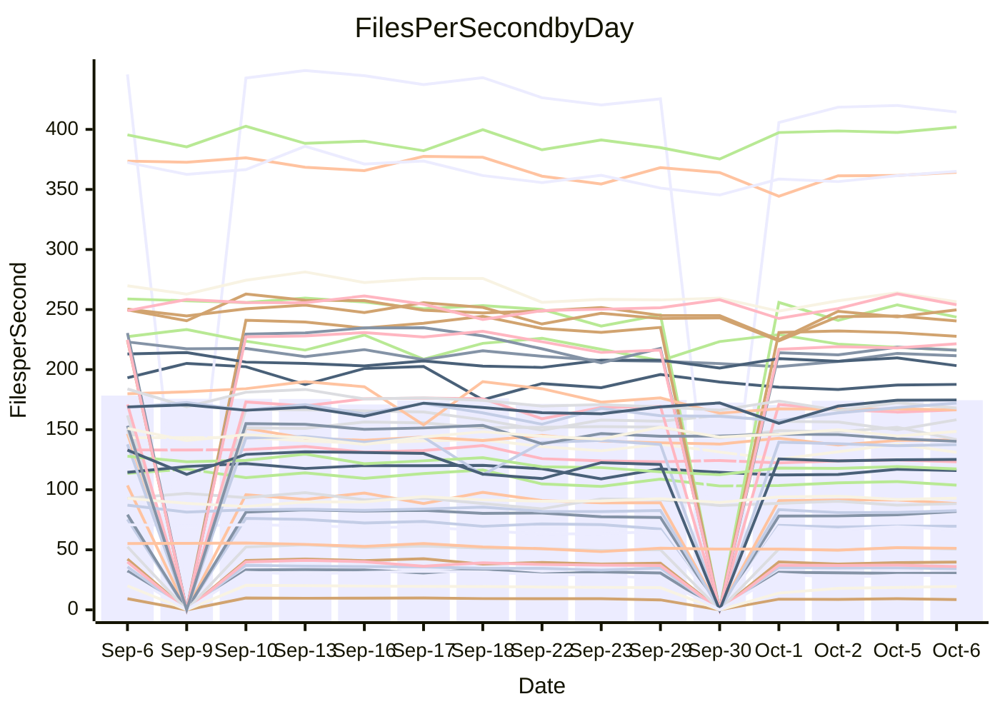

<!---
# This file is auto-generated. Do not edit.
# cspell:disable
--->
# Performance Report

## Daily Performance

## Time to Process Files

| Repository                                      | Elapsed | Min/Avg/Max           |   SD | SD Graph                |
| ----------------------------------------------- | ------: | :-------------------: | ---: | ----------------------- |
| AdaDoom3/AdaDoom3                    |    3.00 | 2.7 /   2.9 /   3.1   | 0.09 | `    ┣━━┻━━╋━━●━━┫    ` |
| alexiosc/megistos                    |    7.04 | 6.6 /   7.3 /   7.7   | 0.24 | `    ┣━━●━━╋━━┻━━┫    ` |
| apollographql/apollo-server          |    2.12 | 2.0 /   2.1 /   2.3   | 0.07 | `     ┣━┻━●╋━━┻━┫     ` |
| aspnetboilerplate/aspnetboilerplate  |   11.12 | 10.5 /  10.9 /  12.0  | 0.36 | `    ┣━━┻━━╋━●┻━━┫    ` |
| aws-amplify/docs                     |   11.59 | 10.7 /  11.3 /  12.6  | 0.40 | `    ┣━━┻━━╋━●┻━━┫    ` |
| Azure/azure-rest-api-specs           |   14.32 | 12.9 /  14.0 /  15.4  | 0.61 | `   ┣━━━┻━━╋━●┻━━━┫   ` |
| bitjson/typescript-starter           |    0.67 | 0.6 /   0.6 /   0.7   | 0.03 | `     ┣━━┻━╋━┻●━┫     ` |
| caddyserver/caddy                    |    3.09 | 2.8 /   3.0 /   3.5   | 0.16 | `    ┣━━┻━━╋●━┻━━┫    ` |
| canada-ca/open-source-logiciel-libre |    0.80 | 0.7 /   0.8 /   0.9   | 0.05 | `     ┣━┻━━╋━●┻━┫     ` |
| chef/chef                            |    5.39 | 5.1 /   5.4 /   6.0   | 0.22 | `    ┣━━┻━━●━━┻━━┫    ` |
| dart-lang/sdk                        |   55.44 | 54.2 /  57.9 /  70.4  | 3.14 | `  ┣━━━┻●━━╋━━━┻━━━┫  ` |
| django/django                        |   14.00 | 13.0 /  13.5 /  14.3  | 0.30 | `    ┣━━┻━━╋━━┻━●┫    ` |
| eslint/eslint                        |    9.58 | 8.9 /   9.5 /  10.0   | 0.27 | `    ┣━━┻━━╋●━┻━━┫    ` |
| exonum/exonum                        |    2.95 | 2.9 /   3.0 /   3.7   | 0.17 | `    ┣━━┻●━╋━━┻━━┫    ` |
| flutter/samples                      |   16.67 | 13.7 /  15.5 /  18.4  | 1.57 | `   ┣━━━┻━━╋━━●━━━┫   ` |
| gitbucket/gitbucket                  |    3.21 | 2.8 /   3.0 /   3.3   | 0.11 | `    ┣━━┻━━╋━━┻━●┫    ` |
| googleapis/google-cloud-cpp          |  133.03 | 129.1 / 135.7 / 145.8 | 4.00 | `  ┣━━━┻●━━╋━━━┻━━━┫  ` |
| graphql/express-graphql              |    0.70 | 0.6 /   0.7 /   0.8   | 0.04 | `     ┣━┻━━╋●━┻━┫     ` |
| graphql/graphql-js                   |    2.14 | 1.9 /   2.1 /   2.3   | 0.10 | `    ┣━━┻━━╋●━┻━━┫    ` |
| graphql/graphql-relay-js             |    0.70 | 0.6 /   0.7 /   0.8   | 0.04 | `     ┣━┻━━●━━┻━┫     ` |
| graphql/graphql-spec                 |    0.76 | 0.7 /   0.8 /   1.1   | 0.07 | `     ┣━┻━●╋━━┻━┫     ` |
| iluwatar/java-design-patterns        |   10.88 | 10.3 /  10.9 /  12.5  | 0.46 | `    ┣━━┻━━●━━┻━━┫    ` |
| ktaranov/sqlserver-kit               |    5.91 | 5.6 /   5.9 /   6.4   | 0.18 | `    ┣━━┻━━●━━┻━━┫    ` |
| liriliri/licia                       |    3.36 | 3.1 /   3.3 /   3.5   | 0.11 | `    ┣━━┻━━╋━●┻━━┫    ` |
| MartinThoma/LaTeX-examples           |    6.25 | 5.9 /   6.3 /   7.0   | 0.25 | `    ┣━━┻━●╋━━┻━━┫    ` |
| mdx-js/mdx                           |    1.64 | 1.4 /   1.6 /   1.8   | 0.07 | `     ┣━┻━━╋━━●━┫     ` |
| microsoft/TypeScript-Website         |    5.43 | 4.7 /   5.0 /   5.5   | 0.17 | `    ┣━━┻━━╋━━┻━━┫●   ` |
| MicrosoftDocs/PowerShell-Docs        |   22.28 | 20.6 /  22.2 /  23.9  | 0.89 | `   ┣━━━┻━━●━━┻━━━┫   ` |
| neovim/nvim-lspconfig                |    2.98 | 2.6 /   2.8 /   3.0   | 0.12 | `    ┣━━┻━━╋━━┻━●┫    ` |
| pagekit/pagekit                      |    3.21 | 3.0 /   3.2 /   3.3   | 0.09 | `    ┣━━┻━━╋●━┻━━┫    ` |
| php/php-src                          |   24.06 | 23.2 /  24.2 /  26.1  | 0.73 | `   ┣━━━┻━●╋━━┻━━━┫   ` |
| plasticrake/tplink-smarthome-api     |    0.89 | 0.8 /   0.9 /   0.9   | 0.04 | `     ┣━┻━━╋━●┻━┫     ` |
| prettier/prettier                    |    6.11 | 5.7 /   6.0 /   6.4   | 0.16 | `    ┣━━┻━━╋━●┻━━┫    ` |
| pycontribs/jira                      |    1.21 | 1.1 /   1.2 /   1.3   | 0.05 | `     ┣━┻━━╋━●┻━┫     ` |
| RustPython/RustPython                |    4.40 | 4.1 /   4.4 /   4.9   | 0.18 | `    ┣━━┻━━╋●━┻━━┫    ` |
| shoelace-style/shoelace              |    2.31 | 2.1 /   2.3 /   2.5   | 0.11 | `    ┣━━┻━━╋●━┻━━┫    ` |
| SoftwareBrothers/admin-bro           |    2.07 | 1.8 /   2.0 /   2.2   | 0.09 | `     ┣━┻━━╋━━●━┫     ` |
| sveltejs/svelte                      |   18.71 | 18.1 /  18.9 /  20.3  | 0.51 | `   ┣━━━┻━●╋━━┻━━━┫   ` |
| TheAlgorithms/Python                 |    5.29 | 4.7 /   5.1 /   5.5   | 0.20 | `    ┣━━┻━━╋━━●━━┫    ` |
| twbs/bootstrap                       |    1.16 | 1.0 /   1.1 /   1.2   | 0.05 | `     ┣━┻━━╋━━●━┫     ` |
| typescript-cheatsheets/react         |    1.06 | 1.0 /   1.0 /   1.2   | 0.04 | `     ┣━┻━━╋━●┻━┫     ` |
| typescript-eslint/typescript-eslint  |    3.45 | 3.2 /   3.4 /   3.7   | 0.12 | `    ┣━━┻━━╋●━┻━━┫    ` |
| vitest-dev/vitest                    |    7.02 | 6.6 /   7.0 /   7.4   | 0.22 | `    ┣━━┻━━●━━┻━━┫    ` |
| w3c/aria-practices                   |    2.91 | 2.5 /   2.7 /   3.0   | 0.12 | `    ┣━━┻━━╋━━┻●━┫    ` |
| w3c/specberus                        |    1.62 | 1.5 /   1.6 /   2.1   | 0.13 | `    ┣━━┻━━●━━┻━━┫    ` |
| webdeveric/webpack-assets-manifest   |    0.69 | 0.6 /   0.6 /   0.8   | 0.05 | `     ┣━┻━━╋━●┻━┫     ` |
| webpack/webpack                      |    4.53 | 4.2 /   4.4 /   4.8   | 0.17 | `    ┣━━┻━━╋━●┻━━┫    ` |
| wireapp/wire-desktop                 |    0.85 | 0.8 /   0.8 /   0.9   | 0.04 | `     ┣━┻━━╋━●┻━┫     ` |
| wireapp/wire-webapp                  |    6.88 | 7.0 /   7.4 /   8.0   | 0.27 | `    ●━━┻━━╋━━┻━━┫    ` |

Note:
- Elapsed time is in seconds.

## Files per Second over Time

| Repository                                      | Files |    Sec |    Fps |    Rel | Trend Fps              |    N |
| ----------------------------------------------- | ----: | -----: | -----: | -----: | ---------------------- | ---: |
| AdaDoom3/AdaDoom3                    |   103 |   3.00 |  34.30 | -2.81% | `▇█▆█▆█▆▆▅▄▆▆▇▅▆▆▆▇▅▅` |   22 |
| alexiosc/megistos                    |   583 |   7.04 |  82.76 |  3.14% | `▇▆▇▅▄█▅▅▅▄▄▄▅▅▃▅▅▄▅▆` |   22 |
| apollographql/apollo-server          |   250 |   2.12 | 117.73 |  0.62% | `██▇███▇▇▄▇▆▅▄▇▅▇▆▇▆▇` |   25 |
| aspnetboilerplate/aspnetboilerplate  |  2739 |  11.12 | 246.25 | -2.06% | `██▇█▆█▇▆▇▅▆█▆▇▄▇▇█▅▆` |   24 |
| aws-amplify/docs                     |  2832 |  11.59 | 244.36 | -2.23% | `▇██▆▇▆▆▇▇▆▆▃▇▆▆▅▅▇▇▆` |   25 |
| Azure/azure-rest-api-specs           |  2426 |  14.32 | 169.42 | -2.37% | `█▆▇█▇▇▇▅▆▆▅▇█▄▄▅▇▇▅▆` |   25 |
| bitjson/typescript-starter           |    20 |   0.67 |  29.79 | -5.85% | `███▇▅▅█▄▅▆▅▆▅▅▅▆▅▃▆▄` |   22 |
| caddyserver/caddy                    |   276 |   3.09 |  89.40 | -1.53% | `██▅█▇▆▃▆▇▇▅▆▇▆▇▆▆▄▆▆` |   25 |
| canada-ca/open-source-logiciel-libre |     7 |   0.80 |   8.78 | -5.47% | `▇▇▇▇██▇▇▆▆▄▅▆▂▆▇▇▅▄▅` |   22 |
| chef/chef                            |  1201 |   5.39 | 222.71 |  0.78% | `▆▇█▃▅▆▇▇▆▄▆▇█▇▄▇▅▅▅▆` |   25 |
| dart-lang/sdk                        |  9723 |  55.44 | 175.37 |  4.37% | `▇▇▂▇▇▇▆▆▆▇▇▅▅▇▇██▇▇█` |   25 |
| django/django                        |  2792 |  14.00 | 199.49 | -3.43% | `▇█▅█▆▆▆▆▇▇▆██▆███▇▇▆` |   25 |
| eslint/eslint                        |  2016 |   9.58 | 210.44 | -0.69% | `▇▇█▇▅▇▆▇▆▅▅▅▆▅▅▇▇▇▇▆` |   25 |
| exonum/exonum                        |   421 |   2.95 | 142.57 |  2.95% | `█▇█▆█▇▂▇▇▇▇▇▆▇▆▆▇▆▆▇` |   22 |
| flutter/samples                      |  2850 |  16.67 | 170.91 | -2.41% | `█▇█▅▂█▇█▆▆▅▅▆▅▆▆▅▅▅▆` |   25 |
| gitbucket/gitbucket                  |   411 |   3.21 | 127.84 | -6.98% | `█▆█▇██▆▇▆▇▅▄▅▅▆▆▇█▆▄` |   25 |
| googleapis/google-cloud-cpp          | 19694 | 133.03 | 148.04 |  2.08% | `▅▄▄▆▆▇▆▆▆█▆▇█▇▇▆▇▆▇▇` |   25 |
| graphql/express-graphql              |    26 |   0.70 |  37.23 | -2.32% | `██▇█▇▃▇▆▅▅▅▅▅▅▅▆▆▅▄▅` |   22 |
| graphql/graphql-js                   |   333 |   2.14 | 155.73 | -2.32% | `██▆█▆▆▄▄▆▆▇▆▅▇▅▅▅▃▆▆` |   24 |
| graphql/graphql-relay-js             |    28 |   0.70 |  39.90 | -0.51% | `▇█▇▅█▇▅▅▅▅▅▆▆▅▃▅▆▅▆▆` |   22 |
| graphql/graphql-spec                 |    15 |   0.76 |  19.68 |  3.75% | `▇█▇▇█▇▇▇▇▆▆▂▆▆▄▆▆▇▇▇` |   22 |
| iluwatar/java-design-patterns        |  1838 |  10.88 | 168.88 | -0.17% | `▇▆█▇███▇▃▆▇▇▆▆▆▅▆▇▆▇` |   22 |
| ktaranov/sqlserver-kit               |   489 |   5.91 |  82.74 |  0.03% | `▇█▇▇▆██▆▇▆▇▇▇▇▄▄▇▇▇▇` |   23 |
| liriliri/licia                       |  1421 |   3.36 | 422.47 | -1.78% | `██▇█▇▆▇▅▆▅▆▄▅▅▅▅▅▆▄▆` |   22 |
| MartinThoma/LaTeX-examples           |  1407 |   6.25 | 224.95 |  0.85% | `▆▇▇▇█▅▇▆▆▅▅▅▃▇▆▅▄▇▅▆` |   22 |
| mdx-js/mdx                           |   144 |   1.64 |  88.02 | -5.18% | `▇▆█▇▆▃▇▅▅▅▅▅▆▅▆▅▅▆▅▄` |   23 |
| microsoft/TypeScript-Website         |   758 |   5.43 | 139.62 | -7.77% | `▆▇█▇█▆▇▆▆▆▄▆▇▇▃▆▇▆▅▄` |   24 |
| MicrosoftDocs/PowerShell-Docs        |  2692 |  22.28 | 120.85 | -0.16% | `▆▇▆▇██▆▅▆▅▄▆▆▅▆▅▇▆▄▆` |   25 |
| neovim/nvim-lspconfig                |   355 |   2.98 | 119.17 | -7.50% | `▇█▄▇▇█▆▅▅▄▅▄▅▄▅▆▄▅▅▃` |   25 |
| pagekit/pagekit                      |   741 |   3.21 | 231.04 | -1.41% | `█▆▅▇▆██▆▆▆▆▆▇▅▆▆▇▄▅▆` |   22 |
| php/php-src                          |  2211 |  24.06 |  91.91 |  0.62% | `▆▅▆██▇▆▆▆▇▆████▆█▇█▇` |   25 |
| plasticrake/tplink-smarthome-api     |    62 |   0.89 |  69.64 | -2.85% | `█▆▇▅▆▇▅▅▆▅▄▅▄▃▅▄▅▅▅▅` |   22 |
| prettier/prettier                    |  2196 |   6.11 | 359.68 | -1.80% | `▆▅▇█▇▇▆▆▅▇▆▄▇▆▄▆▆▆▇▆` |   24 |
| pycontribs/jira                      |    80 |   1.21 |  65.98 | -2.94% | `█▇█▆▆█▆▆▃▅▅▇▆▅▇▇▇▇▆▆` |   23 |
| RustPython/RustPython                |   621 |   4.40 | 141.05 | -0.88% | `▅█▆▇▇▆▇▇▆▆▆▇▇▇▃▆▇▇▇▆` |   24 |
| shoelace-style/shoelace              |   437 |   2.31 | 189.36 | -1.22% | `█▇▇▇█▃▆▅▅▆▅▅▃▅▆▅▆▄▅▅` |   25 |
| SoftwareBrothers/admin-bro           |   441 |   2.07 | 212.64 | -4.58% | `█▆▇███▇▅▅▄▅▅▆▃▄▄▅▆▆▅` |   22 |
| sveltejs/svelte                      |  7455 |  18.71 | 398.47 |  1.58% | `▇▆▆▇▄▇▅▆▆▆▅▇█▆▇▇▇▇█▇` |   25 |
| TheAlgorithms/Python                 |  1352 |   5.29 | 255.50 | -3.92% | `▇█▇███▅▆▆▆▆▄▄▇▆▆▇▇▆▅` |   25 |
| twbs/bootstrap                       |   120 |   1.16 | 103.28 | -5.09% | `▇▇▃█▆█▅▄▄▆▄▄▅▄▅▅▅▅▄▄` |   25 |
| typescript-cheatsheets/react         |    53 |   1.06 |  49.86 | -3.25% | `▇█▅▇▇▇▆▆▆▅▅▆▆▆▃▆▇▆▆▅` |   22 |
| typescript-eslint/typescript-eslint  |  1247 |   3.45 | 361.01 | -0.98% | `██▄▇▇▆▅▅▆▅▄▅▅▆▅▆▅▆▆▆` |   25 |
| vitest-dev/vitest                    |  1801 |   7.02 | 256.65 |  0.89% | `▇▆█▆▅▄▅▅▅▅▆▄▆▅▄▆█▇▅▆` |   25 |
| w3c/aria-practices                   |   403 |   2.91 | 138.46 | -6.27% | `█▅▇█▆█▃▅▆▆▆▆▆▆▆▆▄▅▅▄` |   24 |
| w3c/specberus                        |   200 |   1.62 | 123.81 | -0.79% | `█▇█▇█▆▅▂▆▆▆▇▇▇▅▆▆▇▇▆` |   24 |
| webdeveric/webpack-assets-manifest   |    19 |   0.69 |  27.65 | -6.53% | `▅██▇███▆▆▆▃▆▂▆▅▅▆▆▆▅` |   22 |
| webpack/webpack                      |  1086 |   4.53 | 239.67 | -2.58% | `█▇▅██▇▄▇▇▆▆▄█▄▇▇▅▇▆▆` |   25 |
| wireapp/wire-desktop                 |    43 |   0.85 |  50.83 | -3.11% | `▄█▇█▇▆▅▅▄▆▅▅▆▃▅▆▆▅▆▅` |   25 |
| wireapp/wire-webapp                  |  1227 |   6.88 | 178.36 |  7.91% | `▅▅▅█▆▅▃▄▆▅▅▄▅▅▆▇▇▅▆█` |   25 |

## Data Throughput

| Repository                                      | Files |    Sec |     Kps |    Rel | Trend Kps              |    N |
| ----------------------------------------------- | ----: | -----: | ------: | -----: | ---------------------- | ---: |
| AdaDoom3/AdaDoom3                    |   103 |   3.00 |  728.89 | -2.81% | `▇█▆█▆█▆▆▅▄▆▆▇▅▆▆▆▇▅▅` |   22 |
| alexiosc/megistos                    |   583 |   7.04 |  650.32 |  3.14% | `▇▆▇▅▄█▅▅▅▄▄▄▅▅▃▅▅▄▅▆` |   22 |
| apollographql/apollo-server          |   250 |   2.12 |  932.92 |  0.62% | `██▇███▇▇▄▇▆▅▄▇▅▇▆▇▆▇` |   25 |
| aspnetboilerplate/aspnetboilerplate  |  2739 |  11.12 |  572.51 | -3.27% | `██▇█▆█▇▆▇▄▆▇▆▆▃▆▇▇▅▆` |   24 |
| aws-amplify/docs                     |  2832 |  11.59 |  815.73 | -1.93% | `▇██▆▇▆▆▇▇▆▆▃▇▆▆▅▅▇▇▆` |   25 |
| Azure/azure-rest-api-specs           |  2426 |  14.32 |  483.76 | -2.24% | `█▆▇█▇▇▇▅▆▆▅▇█▄▄▅▇▇▅▆` |   25 |
| bitjson/typescript-starter           |    20 |   0.67 |  119.14 | -5.85% | `███▇▅▅█▄▅▆▅▆▅▅▅▆▅▃▆▄` |   22 |
| caddyserver/caddy                    |   276 |   3.09 |  727.81 | -1.40% | `██▅█▇▆▃▆▇▇▅▆▇▆▇▆▆▄▆▆` |   25 |
| canada-ca/open-source-logiciel-libre |     7 |   0.80 |   72.71 | -5.47% | `▇▇▇▇██▇▇▆▆▄▅▆▂▆▇▇▅▄▅` |   22 |
| chef/chef                            |  1201 |   5.39 | 1021.96 |  0.58% | `▆▇█▃▅▆▇▇▆▄▆▇█▇▄▇▅▅▅▆` |   25 |
| dart-lang/sdk                        |  9723 |  55.44 | 1268.17 |  4.20% | `▇▇▂▇▇▇▆▆▆▇▇▅▅▇▇██▇▇█` |   25 |
| django/django                        |  2792 |  14.00 | 1220.87 | -3.33% | `▇█▅█▆▆▆▆▇▇▆██▆████▇▆` |   25 |
| eslint/eslint                        |  2016 |   9.58 | 1718.11 | -0.85% | `▇▇█▇▅▇▆▇▆▅▅▄▆▅▅▇▇▆▆▆` |   25 |
| exonum/exonum                        |   421 |   2.95 | 1363.72 |  2.95% | `█▇█▆█▇▂▇▇▇▇▇▆▇▆▆▇▆▆▇` |   22 |
| flutter/samples                      |  2850 |  16.67 | 1325.46 | -0.28% | `█▇█▅▂█▇█▆▆▆▆▆▆▆▇▆▆▅▆` |   25 |
| gitbucket/gitbucket                  |   411 |   3.21 |  577.61 | -6.98% | `█▆█▇██▆▇▆▇▅▄▅▅▆▆▇█▆▄` |   25 |
| googleapis/google-cloud-cpp          | 19694 | 133.03 | 1056.73 |  2.10% | `▅▄▄▆▆▇▆▆▆█▆▇█▇▇▆▇▆▇▇` |   25 |
| graphql/express-graphql              |    26 |   0.70 |  170.38 | -2.32% | `██▇█▇▃▇▆▅▅▅▅▅▅▅▆▆▅▄▅` |   22 |
| graphql/graphql-js                   |   333 |   2.14 |  888.08 | -2.19% | `██▆█▆▆▄▄▆▆▇▆▅▇▅▅▅▃▇▆` |   24 |
| graphql/graphql-relay-js             |    28 |   0.70 |  156.74 | -0.51% | `▇█▇▅█▇▅▅▅▅▅▆▆▅▃▅▆▅▆▆` |   22 |
| graphql/graphql-spec                 |    15 |   0.76 |  722.89 |  3.75% | `▇█▇▇█▇▇▇▇▆▆▂▆▆▄▆▆▇▇▇` |   22 |
| iluwatar/java-design-patterns        |  1838 |  10.88 |  519.68 | -0.17% | `▇▆█▇███▇▃▆▇▇▆▆▆▅▆▇▆▇` |   22 |
| ktaranov/sqlserver-kit               |   489 |   5.91 | 1251.59 |  0.03% | `▇█▇▇▆██▆▇▆▇▇▇▇▄▄▇▇▇▇` |   23 |
| liriliri/licia                       |  1421 |   3.36 |  497.98 | -1.72% | `██▇█▇▆▇▅▆▅▆▄▅▅▅▅▅▆▄▆` |   22 |
| MartinThoma/LaTeX-examples           |  1407 |   6.25 |  464.93 |  0.85% | `▆▇▇▇█▅▇▆▆▅▅▅▃▇▆▅▄▇▅▆` |   22 |
| mdx-js/mdx                           |   144 |   1.64 |  403.42 | -5.04% | `▆▆█▇▆▃▇▅▅▅▅▅▆▅▆▅▅▆▅▅` |   23 |
| microsoft/TypeScript-Website         |   758 |   5.43 |  955.39 | -7.82% | `▆▇█▇█▆▇▆▆▆▄▆▇▇▃▆▇▆▅▄` |   24 |
| MicrosoftDocs/PowerShell-Docs        |  2692 |  22.28 | 1234.82 | -0.20% | `▆▇▆▇██▆▅▆▅▄▆▆▅▆▅▇▆▄▆` |   25 |
| neovim/nvim-lspconfig                |   355 |   2.98 |  311.84 | -7.78% | `▇█▄▇▇█▆▅▅▅▅▄▅▄▅▆▄▅▅▃` |   25 |
| pagekit/pagekit                      |   741 |   3.21 |  481.73 | -1.41% | `█▆▅▇▆██▆▆▆▆▆▇▅▆▆▇▄▅▆` |   22 |
| php/php-src                          |  2211 |  24.06 | 1341.88 |  0.67% | `▆▅▆██▇▆▆▆▇▆████▆█▇█▇` |   25 |
| plasticrake/tplink-smarthome-api     |    62 |   0.89 |  376.26 | -2.85% | `█▆▇▅▆▇▅▅▆▅▄▅▄▃▅▄▅▅▅▅` |   22 |
| prettier/prettier                    |  2196 |   6.11 |  501.53 | -1.78% | `▆▅▇█▇▇▆▆▅▇▆▄▇▆▄▆▆▆▇▆` |   24 |
| pycontribs/jira                      |    80 |   1.21 |  454.46 | -2.93% | `█▇█▆▆█▆▆▃▅▅▇▆▅▇▇▇▇▆▆` |   23 |
| RustPython/RustPython                |   621 |   4.40 | 1038.21 | -0.69% | `▅█▆▇▇▆▇▇▆▆▆▇▇▇▃▆▇▇▇▇` |   24 |
| shoelace-style/shoelace              |   437 |   2.31 |  899.55 | -0.80% | `█▇▇▇█▃▆▅▅▇▆▅▃▅▆▅▆▅▅▆` |   25 |
| SoftwareBrothers/admin-bro           |   441 |   2.07 |  468.68 | -4.65% | `█▆▇███▇▅▅▃▅▅▆▃▄▄▅▆▅▄` |   22 |
| sveltejs/svelte                      |  7455 |  18.71 |  287.14 |  1.42% | `▇▆▆▇▄▇▅▆▆▆▅▇█▆▇▇▇▇█▇` |   25 |
| TheAlgorithms/Python                 |  1352 |   5.29 |  645.74 | -4.10% | `▇█▇███▅▆▆▆▆▄▄▇▅▆▇▇▆▅` |   25 |
| twbs/bootstrap                       |   120 |   1.16 |  827.11 | -5.09% | `▇▇▃█▆█▅▄▄▆▄▄▅▄▅▅▅▅▄▄` |   25 |
| typescript-cheatsheets/react         |    53 |   1.06 |  364.04 | -3.25% | `▇█▅▇▇▇▆▆▆▅▅▆▆▆▃▆▇▆▆▅` |   22 |
| typescript-eslint/typescript-eslint  |  1247 |   3.45 | 1679.97 | -0.56% | `██▄▇▇▆▅▅▆▅▄▆▅▆▅▆▅▆▇▆` |   25 |
| vitest-dev/vitest                    |  1801 |   7.02 |  522.86 |  0.30% | `▇▇█▇▆▄▅▆▆▆▆▄▆▅▄▆█▇▅▆` |   25 |
| w3c/aria-practices                   |   403 |   2.91 | 1290.80 | -6.17% | `█▅▇█▆█▃▅▆▆▆▆▆▆▆▆▄▅▅▄` |   24 |
| w3c/specberus                        |   200 |   1.62 |  394.95 | -0.79% | `█▇█▇█▆▅▂▆▆▆▇▇▇▅▆▆▇▇▆` |   24 |
| webdeveric/webpack-assets-manifest   |    19 |   0.69 |  148.45 | -6.53% | `▅██▇███▆▆▆▃▆▂▆▅▅▆▆▆▅` |   22 |
| webpack/webpack                      |  1086 |   4.53 | 1042.08 | -2.51% | `█▇▅██▇▄▇▇▆▆▄█▄▇▇▅▇▆▆` |   25 |
| wireapp/wire-desktop                 |    43 |   0.85 |  223.40 | -3.11% | `▄█▇█▇▆▅▅▄▆▅▅▆▃▅▆▆▅▆▅` |   25 |
| wireapp/wire-webapp                  |  1227 |   6.88 |  754.73 |  7.87% | `▅▅▅█▆▅▃▄▆▅▅▄▅▅▆▇▇▅▆█` |   25 |

