<!---
# This file is auto-generated. Do not edit.
# cspell:disable
--->
# Performance Report

## Daily Performance

```mermaid
xychart-beta
    title Files Per Second by Day
    y-axis Files per Second
    x-axis Date [Jun-13, Jun-14, Jun-16, Jun-23, Jun-24, Jun-25, Jun-30, Jul-2, Jul-4, Jul-5, Jul-6, Jul-7, Jul-8, Jul-9, Jul-10, Jul-12, Jul-13]
    bar [164.52, 162.91, 165.65, 161.06, 164.28, 159.75, 168.95, 160.66, 164.38, 164.27, 162.48, 165.90, 164.83, 163.05, 164.68, 163.19, 162.91]
    line [40.00, 39.07, 39.70, 37.48, 36.99, 36.10, 35.86, 38.94, 38.99, 36.38, 39.71, 0.00, 37.09, 38.73, 39.43, 38.35, 38.60]
    line [85.81, 88.09, 78.16, 86.88, 85.49, 77.34, 74.76, 87.51, 88.59, 85.26, 74.62, 86.95, 86.80, 88.24, 86.00, 84.39, 82.74]
    line [22.04, 22.18, 21.66, 21.30, 21.15, 22.00, 21.90, 21.51, 21.13, 21.43, 22.00, 0.00, 22.72, 21.87, 21.57, 21.20, 21.22]
    line [372.72, 362.93, 349.94, 351.35, 353.13, 360.69, 354.83, 355.80, 359.03, 353.22, 355.88, 0.00, 358.26, 350.93, 354.34, 355.82, 339.08]
    line [133.31, 131.91, 133.18, 130.59, 136.24, 136.67, 127.99, 132.91, 128.52, 136.97, 123.97, 132.77, 124.67, 133.15, 137.66, 135.26, 135.05]
    line [201.47, 205.17, 207.22, 205.60, 202.43, 207.02, 202.54, 202.72, 194.67, 190.86, 195.33, 0.00, 197.97, 203.94, 205.22, 203.61, 194.11]
    line [48.63, 44.36, 52.41, 51.44, 53.68, 51.84, 52.69, 51.50, 53.98, 52.25, 52.09, 0.00, 53.03, 50.88, 50.01, 53.83, 52.52]
    line [118.07, 115.35, 114.38, 112.71, 115.12, 110.67, 113.20, 113.18, 115.07, 115.63, 114.45, 109.79, 106.87, 117.37, 116.66, 116.21, 120.01]
    line [124.29, 124.35, 117.01, 116.01, 109.65, 114.81, 109.29, 115.47, 121.09, 119.06, 122.86, 0.00, 112.77, 117.49, 120.30, 120.41, 121.48]
    line [181.43, 168.60, 169.42, 174.24, 176.57, 177.80, 167.68, 175.75, 171.75, 180.95, 169.97, 158.13, 174.21, 168.28, 176.77, 172.02, 178.73]
    line [100.16, 109.91, 108.33, 100.84, 107.27, 100.09, 103.62, 104.63, 108.43, 108.27, 103.96, 110.08, 110.20, 105.06, 103.60, 109.02, 108.61]
    line [7.35, 7.42, 7.28, 7.12, 7.22, 7.17, 7.37, 7.23, 7.36, 6.99, 7.61, 0.00, 7.24, 7.01, 7.27, 7.49, 7.45]
    line [135.55, 132.71, 138.18, 135.01, 128.78, 135.00, 135.05, 134.05, 133.73, 131.56, 129.78, 136.12, 135.18, 134.44, 136.88, 131.27, 133.01]
    line [119.36, 126.68, 124.68, 124.29, 119.55, 125.16, 125.39, 122.70, 121.73, 124.30, 123.97, 0.00, 119.80, 118.70, 125.49, 121.97, 118.29]
    line [174.92, 181.06, 184.11, 172.84, 180.05, 180.38, 178.52, 180.47, 182.90, 182.10, 170.31, 171.39, 176.15, 181.65, 170.98, 179.72, 178.38]
    line [131.67, 139.76, 130.35, 131.39, 132.60, 136.92, 129.95, 133.16, 130.87, 135.23, 135.13, 0.00, 126.22, 133.87, 131.35, 131.34, 131.75]
    line [72.46, 71.40, 73.58, 68.82, 72.77, 72.13, 70.38, 72.17, 72.40, 75.76, 67.72, 0.00, 74.05, 71.58, 72.37, 72.08, 72.78]
    line [18.34, 17.12, 16.25, 16.59, 17.11, 17.00, 18.16, 17.94, 17.30, 18.64, 18.07, 18.36, 17.45, 17.16, 17.77, 17.48, 17.98]
    line [49.42, 46.70, 44.72, 47.61, 46.18, 46.86, 40.79, 46.17, 47.03, 45.86, 46.70, 46.74, 44.23, 47.36, 46.58, 46.27, 47.55]
    line [49.85, 52.20, 51.85, 50.23, 51.87, 46.40, 53.06, 51.19, 51.40, 51.86, 50.10, 0.00, 51.21, 51.39, 53.37, 51.98, 49.43]
    line [28.16, 28.05, 28.76, 25.82, 27.29, 28.03, 27.82, 28.74, 29.48, 28.36, 28.34, 0.00, 27.98, 28.10, 28.43, 28.38, 27.89]
    line [76.81, 78.39, 74.00, 74.26, 76.13, 73.45, 76.23, 74.07, 74.35, 77.62, 75.07, 70.03, 74.46, 78.13, 73.01, 75.98, 76.02]
    line [332.69, 326.37, 322.64, 316.02, 312.10, 320.45, 307.34, 312.08, 316.35, 315.20, 318.22, 313.66, 310.11, 308.24, 315.35, 312.26, 315.10]
    line [189.08, 189.64, 183.39, 188.80, 187.17, 172.53, 184.06, 188.67, 191.18, 188.53, 186.82, 186.30, 188.38, 183.25, 189.14, 186.31, 184.57]
    line [149.82, 145.84, 147.63, 152.29, 157.67, 151.07, 160.69, 154.94, 152.23, 157.47, 160.32, 0.00, 147.14, 152.12, 154.25, 157.55, 154.62]
    line [195.38, 189.84, 200.33, 200.19, 199.73, 196.39, 195.67, 205.11, 192.90, 211.35, 185.93, 203.88, 207.58, 205.87, 207.35, 202.66, 195.27]
    line [320.05, 316.70, 318.97, 304.83, 306.07, 310.41, 315.81, 298.93, 314.56, 303.69, 317.11, 313.48, 300.01, 308.91, 315.76, 310.85, 313.82]
    line [89.92, 95.33, 99.63, 94.35, 94.02, 95.44, 96.15, 95.34, 99.55, 90.07, 101.41, 95.54, 98.21, 94.52, 98.50, 97.78, 95.28]
    line [51.41, 51.47, 52.39, 51.73, 51.82, 52.39, 52.00, 48.43, 49.22, 52.34, 53.26, 51.10, 50.86, 50.66, 52.36, 51.79, 54.34]
    line [209.33, 207.61, 214.45, 207.28, 201.26, 204.34, 194.65, 210.00, 194.85, 205.89, 207.36, 213.92, 203.52, 207.94, 208.03, 207.20, 205.60]
    line [77.13, 76.03, 78.06, 76.22, 74.88, 79.14, 76.99, 75.88, 76.09, 78.08, 72.78, 69.82, 70.79, 75.77, 69.10, 74.66, 74.82]
    line [75.61, 71.46, 77.16, 73.34, 75.14, 76.59, 75.51, 75.45, 76.79, 71.21, 73.99, 0.00, 79.33, 75.23, 76.27, 76.63, 75.30]
    line [27.49, 26.99, 26.84, 26.60, 26.95, 25.71, 26.35, 26.84, 26.11, 26.06, 26.52, 0.00, 23.76, 25.86, 26.61, 27.13, 26.68]
    line [192.94, 186.79, 186.02, 178.80, 184.67, 184.84, 185.79, 182.56, 182.17, 182.82, 182.50, 179.12, 172.62, 169.88, 184.28, 175.71, 182.06]
    line [215.01, 237.87, 232.93, 234.34, 233.01, 236.58, 224.78, 231.59, 231.28, 247.94, 235.03, 221.17, 240.95, 229.51, 226.18, 233.66, 227.06]
    line [29.76, 30.63, 29.07, 28.80, 30.64, 31.41, 29.25, 30.37, 29.62, 29.89, 30.35, 0.00, 29.68, 29.34, 30.24, 30.35, 30.86]
    line [196.51, 209.12, 202.60, 203.46, 201.26, 194.60, 207.89, 194.40, 205.29, 202.49, 204.26, 0.00, 203.31, 188.55, 199.47, 196.87, 204.37]
    line [234.11, 231.13, 227.87, 231.36, 235.26, 222.40, 235.59, 233.45, 238.97, 235.75, 235.89, 232.86, 238.48, 229.00, 230.57, 227.85, 230.82]
    line [212.23, 220.18, 211.27, 214.37, 216.02, 220.47, 209.37, 208.94, 217.94, 219.88, 213.33, 0.00, 214.36, 206.61, 219.33, 214.62, 207.13]
    line [156.38, 164.16, 163.15, 161.29, 162.24, 165.87, 161.72, 162.26, 159.82, 169.05, 166.75, 159.60, 165.64, 167.61, 164.48, 163.07, 162.23]
    line [154.36, 151.21, 153.33, 147.83, 153.51, 152.15, 153.26, 150.82, 152.56, 149.61, 151.37, 0.00, 153.34, 151.79, 153.10, 150.91, 148.64]
    line [116.73, 103.14, 113.74, 113.71, 108.86, 112.34, 109.73, 113.68, 110.37, 111.97, 110.64, 98.54, 106.95, 114.12, 113.53, 110.15, 111.38]
    line [153.45, 149.19, 147.76, 147.78, 145.47, 144.87, 146.87, 151.06, 149.73, 144.88, 148.36, 137.35, 148.23, 146.43, 140.41, 147.84, 149.53]
    line [170.75, 180.24, 189.10, 183.71, 182.95, 183.62, 171.28, 176.05, 173.54, 179.14, 185.15, 184.99, 186.71, 181.92, 187.82, 179.82, 178.95]
    line [382.81, 374.09, 365.35, 357.60, 370.08, 357.07, 371.96, 367.90, 375.27, 367.85, 365.20, 360.83, 370.59, 365.59, 369.56, 369.35, 371.18]
    line [221.53, 214.60, 224.77, 214.79, 220.92, 207.92, 222.39, 218.49, 216.06, 207.77, 218.95, 214.11, 227.80, 218.56, 219.23, 220.42, 224.35]
    line [88.26, 76.41, 88.08, 81.29, 84.76, 61.88, 83.73, 83.48, 86.69, 85.83, 89.91, 85.92, 85.41, 81.93, 84.31, 79.99, 87.05]
    line [252.37, 242.53, 253.26, 253.77, 251.67, 255.05, 257.07, 253.64, 257.67, 250.47, 259.54, 254.67, 257.07, 247.35, 255.25, 253.55, 250.33]
    line [164.92, 162.77, 165.48, 159.81, 157.56, 155.70, 158.25, 148.90, 163.02, 160.27, 163.84, 159.78, 166.09, 162.99, 161.12, 163.50, 160.82]
    line [143.36, 146.61, 147.23, 141.81, 150.65, 147.20, 148.34, 142.33, 146.88, 147.38, 139.67, 147.57, 147.61, 146.15, 148.02, 145.81, 143.42]
```

## Time to Process Files

| Repository                                      | Elapsed | Min/Avg/Max           |   SD | SD Graph                |
| ----------------------------------------------- | ------: | :-------------------: | ---: | ----------------------- |
| AdaDoom3/AdaDoom3                    |    3.33 | 3.3 /   3.4 /   3.7   | 0.09 | `    ┣━●┻━━╋━━┻━━┫    ` |
| alexiosc/megistos                    |    7.97 | 7.3 /   7.7 /   8.6   | 0.28 | `    ┣━━┻━━╋━━●━━┫    ` |
| apollographql/apollo-server          |    2.57 | 2.5 /   2.7 /   3.0   | 0.12 | `    ┣━━┻●━╋━━┻━━┫    ` |
| aspnetboilerplate/aspnetboilerplate  |   11.09 | 10.2 /  10.6 /  11.1  | 0.27 | `    ┣━━┻━━╋━━┻━━●    ` |
| aws-amplify/docs                     |   12.88 | 12.6 /  13.1 /  13.9  | 0.32 | `    ┣━━┻●━╋━━┻━━┫    ` |
| Azure/azure-rest-api-specs           |    9.38 | 9.1 /   9.5 /  10.0   | 0.22 | `    ┣━━┻●━╋━━┻━━┫    ` |
| bitjson/typescript-starter           |    1.00 | 0.9 /   0.9 /   1.0   | 0.03 | `     ┣━┻━━╋━━┻━●     ` |
| caddyserver/caddy                    |    3.56 | 3.5 /   3.8 /   4.5   | 0.20 | `    ┣━●┻━━╋━━┻━━┫    ` |
| canada-ca/open-source-logiciel-libre |    0.96 | 0.9 /   1.0 /   1.1   | 0.04 | `     ┣━┻━━●━━┻━┫     ` |
| chef/chef                            |    6.14 | 5.6 /   6.0 /   6.5   | 0.22 | `    ┣━━┻━━╋━●┻━━┫    ` |
| dart-lang/sdk                        |   67.87 | 61.1 /  66.7 /  77.1  | 2.93 | `  ┣━━━┻━━━╋━●━┻━━━┫  ` |
| django/django                        |   16.47 | 15.0 /  15.8 /  17.8  | 0.66 | `   ┣━━━┻━━╋━━┻●━━┫   ` |
| eslint/eslint                        |   11.23 | 10.9 /  11.1 /  12.0  | 0.24 | `    ┣━━┻━━╋●━┻━━┫    ` |
| exonum/exonum                        |    3.46 | 3.4 /   3.6 /   4.5   | 0.24 | `    ┣━━┻●━╋━━┻━━┫    ` |
| flutter/samples                      |   17.66 | 17.3 /  18.1 /  19.3  | 0.49 | `   ┣━━━●━━╋━━┻━━━┫   ` |
| gitbucket/gitbucket                  |    3.55 | 3.3 /   3.6 /   3.9   | 0.11 | `    ┣━━┻━●╋━━┻━━┫    ` |
| googleapis/google-cloud-cpp          |  139.90 | 134.4 / 140.6 / 152.7 | 4.11 | `  ┣━━━┻━━●╋━━━┻━━━┫  ` |
| graphql/express-graphql              |    0.96 | 0.9 /   1.0 /   1.1   | 0.03 | `     ┣━┻●━╋━━┻━┫     ` |
| graphql/graphql-js                   |    2.66 | 2.6 /   2.7 /   3.0   | 0.10 | `    ┣━━┻●━╋━━┻━━┫    ` |
| graphql/graphql-relay-js             |    1.05 | 0.9 /   1.0 /   1.1   | 0.05 | `     ┣━┻━━╋━━●━┫     ` |
| graphql/graphql-spec                 |    0.87 | 0.8 /   0.9 /   1.0   | 0.03 | `     ┣━┻●━╋━━┻━┫     ` |
| iluwatar/java-design-patterns        |   12.93 | 12.8 /  13.2 /  13.9  | 0.31 | `    ┣━━┻●━╋━━┻━━┫    ` |
| ktaranov/sqlserver-kit               |    6.81 | 6.5 /   6.8 /   7.7   | 0.25 | `    ┣━━┻━━●━━┻━━┫    ` |
| liriliri/licia                       |    4.06 | 3.9 /   4.1 /   4.4   | 0.11 | `    ┣━━┻━━●━━┻━━┫    ` |
| MartinThoma/LaTeX-examples           |    7.03 | 6.7 /   7.0 /   7.5   | 0.22 | `    ┣━━┻━━●━━┻━━┫    ` |
| mdx-js/mdx                           |    1.84 | 1.8 /   1.9 /   2.0   | 0.06 | `     ┣━┻●━╋━━┻━┫     ` |
| microsoft/TypeScript-Website         |    5.70 | 5.4 /   5.7 /   6.0   | 0.14 | `    ┣━━┻━●╋━━┻━━┫    ` |
| MicrosoftDocs/PowerShell-Docs        |   24.67 | 22.9 /  24.4 /  27.5  | 0.95 | `   ┣━━━┻━━╋●━┻━━━┫   ` |
| neovim/nvim-lspconfig                |    4.28 | 4.1 /   4.3 /   4.7   | 0.16 | `    ┣━━┻━●╋━━┻━━┫    ` |
| pagekit/pagekit                      |    3.85 | 3.6 /   3.7 /   3.9   | 0.08 | `    ┣━━┻━━╋━━┻━━●    ` |
| php/php-src                          |   25.80 | 25.3 /  27.6 /  36.8  | 2.38 | `   ┣━━┻●━━╋━━━┻━━┫   ` |
| plasticrake/tplink-smarthome-api     |    1.19 | 1.1 /   1.2 /   1.4   | 0.05 | `     ┣━┻━━●━━┻━┫     ` |
| prettier/prettier                    |    7.20 | 6.9 /   7.2 /   7.7   | 0.17 | `    ┣━━┻━●╋━━┻━━┫    ` |
| pycontribs/jira                      |    1.57 | 1.5 /   1.5 /   1.7   | 0.06 | `     ┣━┻━━╋●━┻━┫     ` |
| RustPython/RustPython                |    5.15 | 4.9 /   5.1 /   5.5   | 0.13 | `    ┣━━┻━━╋●━┻━━┫    ` |
| shoelace-style/shoelace              |    2.91 | 2.7 /   2.8 /   3.0   | 0.10 | `    ┣━━┻━━╋━●┻━━┫    ` |
| slint-ui/slint                       |   11.52 | 11.3 /  12.1 /  13.5  | 0.51 | `    ┣━●┻━━╋━━┻━━┫    ` |
| SoftwareBrothers/admin-bro           |    2.46 | 2.4 /   2.5 /   2.7   | 0.08 | `     ┣━┻━●╋━━┻━┫     ` |
| sveltejs/svelte                      |   20.76 | 19.5 /  20.5 /  21.7  | 0.52 | `   ┣━━━┻━━╋━●┻━━━┫   ` |
| TheAlgorithms/Python                 |    6.08 | 5.6 /   6.0 /   6.5   | 0.20 | `    ┣━━┻━━╋●━┻━━┫    ` |
| twbs/bootstrap                       |    1.34 | 1.3 /   1.4 /   1.7   | 0.09 | `     ┣━┻●━╋━━┻━┫     ` |
| typescript-cheatsheets/react         |    1.41 | 1.3 /   1.4 /   1.6   | 0.06 | `     ┣━┻━━╋●━┻━┫     ` |
| typescript-eslint/typescript-eslint  |    4.06 | 4.0 /   4.1 /   4.3   | 0.11 | `    ┣━━┻━●╋━━┻━━┫    ` |
| vitest-dev/vitest                    |    8.97 | 8.8 /   9.2 /   9.7   | 0.25 | `    ┣━━●━━╋━━┻━━┫    ` |
| w3c/aria-practices                   |    3.77 | 3.1 /   3.3 /   3.5   | 0.10 | `      ┣━┻━╋━┻━┫     ●` |
| w3c/specberus                        |    1.90 | 1.8 /   1.9 /   2.1   | 0.07 | `     ┣━┻━●╋━━┻━┫     ` |
| webdeveric/webpack-assets-manifest   |    1.00 | 1.0 /   1.1 /   1.2   | 0.04 | `     ┣━●━━╋━━┻━┫     ` |
| webpack/webpack                      |    5.30 | 5.1 /   5.4 /   6.0   | 0.19 | `    ┣━━┻━●╋━━┻━━┫    ` |
| wireapp/wire-desktop                 |    0.90 | 0.9 /   0.9 /   1.1   | 0.04 | `     ┣━┻●━╋━━┻━┫     ` |
| wireapp/wire-webapp                  |   11.05 | 10.6 /  11.0 /  12.0  | 0.28 | `    ┣━━┻━━●━━┻━━┫    ` |

Note:
- Elapsed time is in seconds.

## Files per Second over Time

| Repository                                      | Files |    Sec |    Fps |     Rel | Trend Fps              |    N |
| ----------------------------------------------- | ----: | -----: | -----: | ------: | ---------------------- | ---: |
| AdaDoom3/AdaDoom3                    |   103 |   3.33 |  30.96 |   3.24% | `▇█▅█▆▆▆▆▇▆▆▅▇▇▇▇▇▆▇█` |   27 |
| alexiosc/megistos                    |   583 |   7.97 |  73.17 |  -3.05% | `▆▇▇▅█▇▇▅▆█▇▆▆█▇▇▆▇▇▆` |   27 |
| apollographql/apollo-server          |   252 |   2.57 |  97.87 |   2.00% | `▆▇▇▅█▇▅█▆▇▇▅▇▇▇▇▇▇▅▇` |   29 |
| aspnetboilerplate/aspnetboilerplate  |  2259 |  11.09 | 203.74 |  -4.86% | `█▇▅▆▅█▆█▆▇▅▅▇█▆▆█▆▆▄` |   28 |
| aws-amplify/docs                     |  2871 |  12.88 | 222.87 |   1.92% | `▇▇▇▆▅▇▄▇▆██▅▇▇▇█▆▇█▇` |   29 |
| Azure/azure-rest-api-specs           |  2411 |   9.38 | 257.14 |   1.58% | `▇▇▆▆▇▇▆▇▇▇▄▆▅█▆▅▇█▅▇` |   29 |
| bitjson/typescript-starter           |    20 |   1.00 |  20.05 |  -7.11% | `▇▇▇▇▆▇▄▆▇█▆█▆▇▆▄▇▆█▄` |   27 |
| caddyserver/caddy                    |   285 |   3.56 |  79.96 |   6.81% | `▇▇█▅█▆▇▆▅▅▇▆▃▆█▆▆▄▅█` |   29 |
| canada-ca/open-source-logiciel-libre |     7 |   0.96 |   7.30 |   0.14% | `▅▅▅▅▅▆▅▄▆▅▅▄▅▅▅█▆▅▆▅` |   27 |
| chef/chef                            |  1206 |   6.14 | 196.34 |  -1.98% | `▆▄▇▇▅▄█▄▇▇▇▆▆█▇▇▄▇▅▅` |   29 |
| dart-lang/sdk                        | 10706 |  67.87 | 157.73 |  -1.79% | `▅▆▃▆▇▆▆▆▆▇▇▆▅▇█▆▆▅▆▅` |   29 |
| django/django                        |  2847 |  16.47 | 172.86 |  -4.43% | `▇▃█▅▄▇▇████▆██▇▇▇▆█▆` |   29 |
| eslint/eslint                        |  2080 |  11.23 | 185.26 |  -0.77% | `▇▆▇████▇▇█▆▇▇█▇▇▇▇▇▇` |   29 |
| exonum/exonum                        |   421 |   3.46 | 121.56 |   3.44% | `▂▆▅▇▆▇█▇█▆█▆▇█▇█▆███` |   27 |
| flutter/samples                      |  2657 |  17.66 | 150.43 |   2.33% | `▆▇██▇█▆▇▄▇▆█▅▆▆██▆▇█` |   28 |
| gitbucket/gitbucket                  |   412 |   3.55 | 115.94 |   1.02% | `▆▅▄▆▆▅▆▅▄▃▆▆▆▇▆▅▇▆█▆` |   29 |
| googleapis/google-cloud-cpp          | 20485 | 139.90 | 146.42 |   0.42% | `▇▇▆▆█▆▇▅▇▇▇▇▇██▆█▆▅▇` |   28 |
| graphql/express-graphql              |    26 |   0.96 |  27.22 |   2.66% | `▆▆▆▇▇▇▅▆▇▃▆▅▆▇▆█▇▇▆▇` |   27 |
| graphql/graphql-js                   |   364 |   2.66 | 136.73 |   2.89% | `█▅▆▇▄▇█▄▇▄▇▇██▇█▇▇▇█` |   28 |
| graphql/graphql-relay-js             |    28 |   1.05 |  26.65 |  -4.94% | `▃▆▆▇▇██▇▇▆▇▆▆▇▅▇▇▇█▅` |   27 |
| graphql/graphql-spec                 |    16 |   0.87 |  18.32 |   4.86% | `▇█▆█▆▅█▇█▆▅▆▆▇▆█▆▅▆█` |   29 |
| iluwatar/java-design-patterns        |  1992 |  12.93 | 154.05 |   1.79% | `▇▇▇▅█▆█▆▇▇█▆█▇█▇▆▆▅█` |   27 |
| ktaranov/sqlserver-kit               |   489 |   6.81 |  71.82 |  -0.03% | `▇▆▆▆▇▇▇█▅▇▇▆▇▇▇▅▇▇▇▆` |   28 |
| liriliri/licia                       |  1437 |   4.06 | 354.26 |  -0.05% | `█▇▇▇▇█▇▇▇▇▅█▆██▇█▆▄▇` |   28 |
| MartinThoma/LaTeX-examples           |  1409 |   7.03 | 200.45 |   0.11% | `▇▅█▄▇█▇▇▇▇▄▄▆▇▆▅▇▆█▇` |   27 |
| mdx-js/mdx                           |   141 |   1.84 |  76.48 |   1.69% | `▅▆▇▄▆▅▇▆▄▆▆█▇▄▆▇▆▇▆▇` |   28 |
| microsoft/TypeScript-Website         |   760 |   5.70 | 133.23 |   0.73% | `██▆▇▇▅▇██▅▇▇▆▇▇▇▇▅▆▇` |   27 |
| MicrosoftDocs/PowerShell-Docs        |  2707 |  24.67 | 109.74 |  -1.12% | `▆▆█▆▇▆▆▆▃▅█▆▇▇▆▇▆▆▇▆` |   29 |
| neovim/nvim-lspconfig                |   750 |   4.28 | 175.14 |   1.10% | `▅▆▇▇▅██▆▄▇▅▆▇▇▇▆▇▅█▇` |   29 |
| pagekit/pagekit                      |   741 |   3.85 | 192.62 |  -4.66% | `▇█▇▇█▅▆▅▆▆▇█████▇▇▆▅` |   27 |
| php/php-src                          |  2282 |  25.80 |  88.46 |   6.63% | `▆▇▇▆█▇▇█▇▇▅█▇▇▇▅▅▆▇█` |   29 |
| plasticrake/tplink-smarthome-api     |    62 |   1.19 |  52.29 |   0.59% | `█▇▇▇▆██▇▇▇▇▆▅▇██▇█▇▇` |   27 |
| prettier/prettier                    |  2274 |   7.20 | 315.78 |   0.35% | `▅█▆██▇▇█▇▇▇▆▇██▆▆█▇▇` |   29 |
| pycontribs/jira                      |    79 |   1.57 |  50.36 |  -1.75% | `▇▄█▇▆▇▆▇▆▇▇▆███▇▇▇▅▆` |   27 |
| RustPython/RustPython                |   682 |   5.15 | 132.41 |  -0.84% | `█▇▇▇▇▇▆▆▇▇▇▇█▇▆▇▅▇▇▆` |   29 |
| shoelace-style/shoelace              |   439 |   2.91 | 150.61 |  -2.38% | `█▆█▇▆▆▆▇█▅▄█▅█▇▇█▆▇▆` |   27 |
| slint-ui/slint                       |  2185 |  11.52 | 189.66 |   4.87% | `█▇█▆▆▇▇▇▆▅▄▅█▇▃▅█▆▅█` |   29 |
| SoftwareBrothers/admin-bro           |   441 |   2.46 | 178.97 |   0.50% | `▇▇█▇███▅▆▇▇█▆▆▇▇▇█▇▇` |   28 |
| sveltejs/svelte                      |  7579 |  20.76 | 365.02 |  -0.90% | `▇▆▅▇▆█▆▆▅▆▅▆█▅█▆▅▆▇▆` |   29 |
| TheAlgorithms/Python                 |  1390 |   6.08 | 228.56 |  -1.42% | `▇▅▆▆▆▅█▆▄▇▆▅▄▆▇▅▇▆▅▅` |   28 |
| twbs/bootstrap                       |   118 |   1.34 |  88.06 |   4.43% | `▃▅▇██▇▇▄▇▇█▇▇▇▆▆▇▇▅█` |   29 |
| typescript-cheatsheets/react         |    53 |   1.41 |  37.58 |  -1.73% | `▃▅▅▇▇▇█▅█▆█▇██▆▇█▆█▆` |   27 |
| typescript-eslint/typescript-eslint  |  1272 |   4.06 | 313.40 |   1.00% | `█▇▄▆█▇▆█▇▆▇▆█▇▅▇██▇▇` |   29 |
| vitest-dev/vitest                    |  2135 |   8.97 | 237.91 |   2.54% | `▇█▇▇██▇▇▇█▅█▅█▄▅▇▇▅█` |   29 |
| w3c/aria-practices                   |   405 |   3.77 | 107.45 | -12.49% | `▅▇▇▆▆█▄▇▇▅▆▄▇▇▅▅▆██▂` |   27 |
| w3c/specberus                        |   203 |   1.90 | 107.12 |   1.11% | `▇▄▆▇█▇▇▆██▇▅▆▅█▇███▇` |   29 |
| webdeveric/webpack-assets-manifest   |    54 |   1.00 |  54.13 |   5.19% | `▇▇▄▅▇▃▇▇▆▆▆▆▇▇▆▇▅███` |   28 |
| webpack/webpack                      |  1100 |   5.30 | 207.66 |   1.12% | `▃▇█▇▄▆▇▇█▆▇▇▆█▇█▇▇▆▇` |   29 |
| wireapp/wire-desktop                 |    43 |   0.90 |  47.72 |   3.20% | `▃▅▇▆▇▇▇▇▇▆█▇█▆▆▆██▇█` |   29 |
| wireapp/wire-webapp                  |  1810 |  11.05 | 163.81 |   0.52% | `▆▇▇▆▄███▆▇██▇▇▇▆▇▆▆▇` |   29 |

## Data Throughput

| Repository                                      | Files |    Sec |     Kps |     Rel | Trend Kps              |    N |
| ----------------------------------------------- | ----: | -----: | ------: | ------: | ---------------------- | ---: |
| AdaDoom3/AdaDoom3                    |   103 |   3.33 |  657.96 |   3.24% | `▇█▅█▆▆▆▆▇▆▆▅▇▇▇▇▇▆▇█` |   27 |
| alexiosc/megistos                    |   583 |   7.97 |  574.93 |  -3.05% | `▆▇▇▅█▇▇▅▆█▇▆▆█▇▇▆▇▇▆` |   27 |
| apollographql/apollo-server          |   252 |   2.57 |  784.50 |   2.84% | `▆▇▇▅█▇▅█▇█▇▆█▇█▇▇▇▆▇` |   29 |
| aspnetboilerplate/aspnetboilerplate  |  2259 |  11.09 |  479.46 |  -4.85% | `█▇▅▆▅█▆█▆▇▅▅▇█▆▆█▆▆▄` |   28 |
| aws-amplify/docs                     |  2871 |  12.88 |  776.05 |   1.97% | `▇▇▇▆▅▇▅▇▆██▅▇▇▇█▆▇█▇` |   29 |
| Azure/azure-rest-api-specs           |  2411 |   9.38 |  706.36 |   1.73% | `▇▇▆▆▇▇▆▇▇▇▄▆▅█▆▅▇█▅▇` |   29 |
| bitjson/typescript-starter           |    20 |   1.00 |   80.18 |  -7.11% | `▇▇▇▇▆▇▄▆▇█▆█▆▇▆▄▇▆█▄` |   27 |
| caddyserver/caddy                    |   285 |   3.56 |  678.70 |   6.85% | `▇▇█▅█▆▇▆▅▅▇▆▃▆█▆▆▄▅█` |   29 |
| canada-ca/open-source-logiciel-libre |     7 |   0.96 |   60.46 |   0.14% | `▅▅▅▅▅▆▅▄▆▅▅▄▅▅▅█▆▅▆▅` |   27 |
| chef/chef                            |  1206 |   6.14 |  902.92 |  -1.98% | `▆▄▇▇▅▄█▄▇▇▇▆▆█▇▇▄▇▅▅` |   29 |
| dart-lang/sdk                        | 10706 |  67.87 | 1072.36 |  -1.95% | `▅▆▃▆▇▆▆▆▆▇▇▆▅▇█▆▆▅▆▅` |   29 |
| django/django                        |  2847 |  16.47 | 1074.97 |  -4.39% | `▇▃█▅▄▇▇████▆██▇▇▇▆█▆` |   29 |
| eslint/eslint                        |  2080 |  11.23 | 1339.67 |  -0.83% | `▇▆▇████▇▇█▆▇▇█▇▇▇▇▇▇` |   29 |
| exonum/exonum                        |   421 |   3.46 | 1162.80 |   3.44% | `▂▆▅▇▆▇█▇█▆█▆▇█▇█▆███` |   27 |
| flutter/samples                      |  2657 |  17.66 | 1240.66 |   2.33% | `▆▇██▇█▆▇▄▇▆█▅▆▆██▆▇█` |   28 |
| gitbucket/gitbucket                  |   412 |   3.55 |  524.56 |   1.03% | `▆▅▄▆▆▅▆▅▄▃▆▆▆▇▆▅▇▆█▆` |   29 |
| googleapis/google-cloud-cpp          | 20485 | 139.90 | 1167.71 |   0.43% | `▇▇▆▆█▆▇▅▇▇▇▇▇██▆█▆▅▇` |   28 |
| graphql/express-graphql              |    26 |   0.96 |  124.59 |   2.66% | `▆▆▆▇▇▇▅▆▇▃▆▅▆▇▆█▇▇▆▇` |   27 |
| graphql/graphql-js                   |   364 |   2.66 |  786.19 |   2.86% | `█▅▆▇▄▇█▄▇▄▇▇██▇█▇▇▇█` |   28 |
| graphql/graphql-relay-js             |    28 |   1.05 |  104.70 |  -4.94% | `▃▆▆▇▇██▇▇▆▇▆▆▇▅▇▇▇█▅` |   27 |
| graphql/graphql-spec                 |    16 |   0.87 |  663.97 |   4.16% | `▆▇▅▇▆▄█▆█▆▄▆▆▇▆█▅▄▆▇` |   29 |
| iluwatar/java-design-patterns        |  1992 |  12.93 |  476.14 |   1.79% | `▇▇▇▅█▆█▆▇▇█▆█▇█▇▆▆▅█` |   27 |
| ktaranov/sqlserver-kit               |   489 |   6.81 | 1087.18 |  -0.03% | `▇▆▆▆▇▇▇█▅▇▇▆▇▇▇▅▇▇▇▆` |   28 |
| liriliri/licia                       |  1437 |   4.06 |  422.06 |  -0.05% | `█▇▇▇▇█▇▇▇▇▅█▆██▇█▆▄▇` |   28 |
| MartinThoma/LaTeX-examples           |  1409 |   7.03 |  413.98 |   0.11% | `▇▅█▄▇█▇▇▇▇▄▄▆▇▆▅▇▆█▇` |   27 |
| mdx-js/mdx                           |   141 |   1.84 |  355.29 |   1.69% | `▅▆▇▄▆▅▇▆▄▆▆█▇▄▆▇▆▇▆▇` |   28 |
| microsoft/TypeScript-Website         |   760 |   5.70 |  920.18 |   0.73% | `██▆▇▇▅▇██▅▇▇▆▇▇▇▇▅▆▇` |   27 |
| MicrosoftDocs/PowerShell-Docs        |  2707 |  24.67 | 1127.76 |  -1.11% | `▆▆█▆▇▆▆▆▃▅█▆▇▇▆▇▆▆▇▆` |   29 |
| neovim/nvim-lspconfig                |   750 |   4.28 |  281.16 |   1.19% | `▅▆▇▇▅▇█▆▄▇▅▆▇▇▇▆▇▅█▇` |   29 |
| pagekit/pagekit                      |   741 |   3.85 |  401.62 |  -4.66% | `▇█▇▇█▅▆▅▆▆▇█████▇▇▆▅` |   27 |
| php/php-src                          |  2282 |  25.80 | 1538.29 |   6.63% | `▆▇▇▆█▇▇█▇▇▅█▇▇▇▅▅▆▇█` |   29 |
| plasticrake/tplink-smarthome-api     |    62 |   1.19 |  282.52 |   0.59% | `█▇▇▇▆██▇▇▇▇▆▅▇██▇█▇▇` |   27 |
| prettier/prettier                    |  2274 |   7.20 |  449.08 |   0.57% | `▅█▆██▇▇█▇▇▇▆▇██▆▆█▇▇` |   29 |
| pycontribs/jira                      |    79 |   1.57 |  358.27 |  -1.75% | `▇▄█▇▆▇▆▇▆▇▇▆███▇▇▇▅▆` |   27 |
| RustPython/RustPython                |   682 |   5.15 | 1022.59 |  -1.15% | `█▇▇▇▇▇▆▆▇▇▇▇█▇▆▇▅▇▇▆` |   29 |
| shoelace-style/shoelace              |   439 |   2.91 |  727.68 |  -2.38% | `█▆█▇▆▆▆▇█▅▄█▅█▇▇█▆▇▆` |   27 |
| slint-ui/slint                       |  2185 |  11.52 | 1231.73 |   5.06% | `█▇█▆▆▇▇▇▆▅▄▅█▇▃▅█▆▅█` |   29 |
| SoftwareBrothers/admin-bro           |   441 |   2.46 |  394.46 |   0.50% | `▇▇█▇███▅▆▇▇█▆▆▇▇▇█▇▇` |   28 |
| sveltejs/svelte                      |  7579 |  20.76 |  242.50 |  -0.90% | `▇▆▅▇▆█▆▆▅▆▅▆█▅█▆▅▆▇▆` |   29 |
| TheAlgorithms/Python                 |  1390 |   6.08 |  580.12 |  -1.44% | `▇▅▆▆▆▅█▆▄▇▆▅▄▆▇▅▇▆▅▅` |   28 |
| twbs/bootstrap                       |   118 |   1.34 |  723.14 |   4.44% | `▃▅▇██▇▇▄▇▇█▇▇▇▆▆▇▇▅█` |   29 |
| typescript-cheatsheets/react         |    53 |   1.41 |  274.40 |  -1.73% | `▃▅▅▇▇▇█▅█▆█▇██▆▇█▆█▆` |   27 |
| typescript-eslint/typescript-eslint  |  1272 |   4.06 | 1597.06 |   1.16% | `█▇▄▆█▇▆█▇▆▇▆█▇▅▇██▇▇` |   29 |
| vitest-dev/vitest                    |  2135 |   8.97 |  518.72 |   2.24% | `▇█▇▇██▇▇▇█▅█▅█▄▅▇▇▅█` |   29 |
| w3c/aria-practices                   |   405 |   3.77 |  998.07 | -12.49% | `▅▇▇▆▆█▄▇▇▅▆▄▇▇▅▅▆██▂` |   27 |
| w3c/specberus                        |   203 |   1.90 |  333.50 |   0.46% | `▇▅▆▇█▇█▆██▇▅▆▅█▇███▇` |   29 |
| webdeveric/webpack-assets-manifest   |    54 |   1.00 |  126.31 |   5.19% | `▇▇▄▅▇▃▇▇▆▆▆▆▇▇▆▇▅███` |   28 |
| webpack/webpack                      |  1100 |   5.30 |  942.04 |   1.61% | `▃▇█▇▄▆▇▇█▇▇▇▆█▇█▇▇▇▇` |   29 |
| wireapp/wire-desktop                 |    43 |   0.90 |  210.85 |   3.20% | `▃▅▇▆▇▇▇▇▇▆█▇█▆▆▆██▇█` |   29 |
| wireapp/wire-webapp                  |  1810 |  11.05 |  583.48 |   0.30% | `▆▇▇▆▄███▆▇██▇▇▇▆▇▆▆▇` |   29 |

