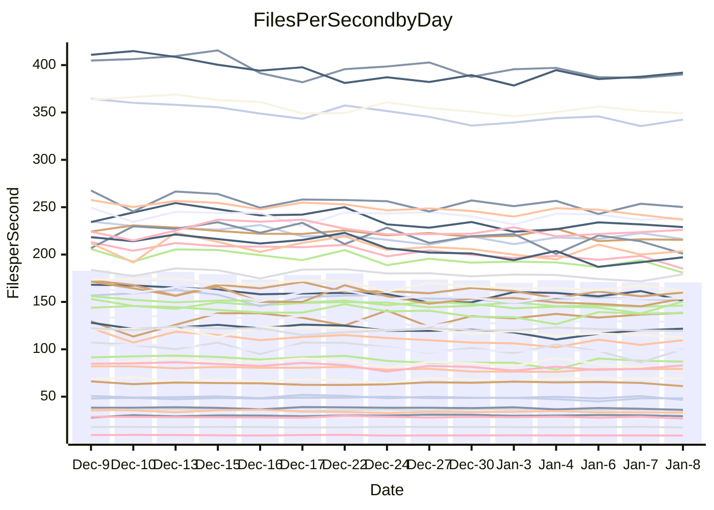

<!---
# This file is auto-generated. Do not edit.
# cspell:disable
--->
# Performance Report

## Daily Performance

## Time to Process Files

| Repository                                      | Elapsed | Min/Avg/Max           |   SD | SD Graph                |
| ----------------------------------------------- | ------: | :-------------------: | ---: | ----------------------- |
| AdaDoom3/AdaDoom3                    |    3.06 | 2.8 /   3.0 /   3.2   | 0.10 | `    ┣━━┻━━╋●━┻━━┫    ` |
| alexiosc/megistos                    |    7.07 | 6.7 /   7.2 /   8.1   | 0.32 | `    ┣━━┻━●╋━━┻━━┫    ` |
| apollographql/apollo-server          |    2.31 | 2.0 /   2.3 /   2.8   | 0.13 | `    ┣━━┻━━╋●━┻━━┫    ` |
| aspnetboilerplate/aspnetboilerplate  |    9.47 | 8.8 /   9.5 /  10.4   | 0.39 | `    ┣━━┻━●╋━━┻━━┫    ` |
| aws-amplify/docs                     |   11.95 | 11.5 /  11.9 /  12.5  | 0.32 | `    ┣━━┻━━●━━┻━━┫    ` |
| Azure/azure-rest-api-specs           |   15.83 | 13.8 /  15.6 /  17.9  | 0.89 | `   ┣━━━┻━━╋●━┻━━━┫   ` |
| bitjson/typescript-starter           |    0.64 | 0.6 /   0.7 /   0.7   | 0.02 | `     ┣━●┻━╋━┻━━┫     ` |
| caddyserver/caddy                    |    3.61 | 3.0 /   3.3 /   3.7   | 0.18 | `    ┣━━┻━━╋━━┻━●┫    ` |
| canada-ca/open-source-logiciel-libre |    0.79 | 0.7 /   0.8 /   0.8   | 0.02 | `     ┣━━┻━╋━┻●━┫     ` |
| chef/chef                            |    5.46 | 5.1 /   5.5 /   6.6   | 0.35 | `    ┣━━┻━━●━━┻━━┫    ` |
| dart-lang/sdk                        |   62.96 | 57.3 /  59.9 /  65.0  | 1.74 | `   ┣━━┻━━━╋━━━┻━━●   ` |
| django/django                        |   16.14 | 13.5 /  14.4 /  15.5  | 0.56 | `    ┣━━┻━━╋━━┻━━┫   ●` |
| eslint/eslint                        |   10.85 | 9.5 /  10.1 /  11.2   | 0.40 | `    ┣━━┻━━╋━━┻━━●    ` |
| exonum/exonum                        |    3.06 | 2.9 /   3.2 /   3.7   | 0.17 | `    ┣━━┻●━╋━━┻━━┫    ` |
| flutter/samples                      |   18.57 | 16.0 /  17.0 /  22.0  | 1.06 | `   ┣━━━┻━━╋━━┻━●━┫   ` |
| gitbucket/gitbucket                  |    3.13 | 3.0 /   3.2 /   3.4   | 0.11 | `    ┣━━┻━●╋━━┻━━┫    ` |
| googleapis/google-cloud-cpp          |  127.37 | 117.0 / 127.1 / 139.4 | 5.18 | `  ┣━━━┻━━━●━━━┻━━━┫  ` |
| graphql/express-graphql              |    0.71 | 0.7 /   0.7 /   0.8   | 0.02 | `     ┣━━┻●╋━┻━━┫     ` |
| graphql/graphql-js                   |    2.25 | 2.1 /   2.2 /   2.4   | 0.07 | `     ┣━┻━━╋━●┻━┫     ` |
| graphql/graphql-relay-js             |    0.75 | 0.7 /   0.7 /   0.8   | 0.02 | `     ┣━━┻━╋●┻━━┫     ` |
| graphql/graphql-spec                 |    0.85 | 0.8 /   0.8 /   0.9   | 0.02 | `     ┣━━┻━╋━●━━┫     ` |
| iluwatar/java-design-patterns        |   11.06 | 10.6 /  11.3 /  12.2  | 0.37 | `    ┣━━┻●━╋━━┻━━┫    ` |
| ktaranov/sqlserver-kit               |    6.15 | 5.9 /   6.2 /   6.6   | 0.19 | `    ┣━━┻━●╋━━┻━━┫    ` |
| liriliri/licia                       |    3.68 | 3.3 /   3.6 /   3.9   | 0.11 | `    ┣━━┻━━╋━●┻━━┫    ` |
| MartinThoma/LaTeX-examples           |    6.34 | 6.1 /   6.4 /   6.8   | 0.17 | `    ┣━━┻━●╋━━┻━━┫    ` |
| mdx-js/mdx                           |    1.66 | 1.5 /   1.6 /   1.8   | 0.08 | `     ┣━┻━━╋━●┻━┫     ` |
| microsoft/TypeScript-Website         |    5.12 | 4.9 /   5.1 /   5.4   | 0.13 | `    ┣━━┻━●╋━━┻━━┫    ` |
| MicrosoftDocs/PowerShell-Docs        |   18.40 | 17.6 /  19.0 /  25.8  | 1.47 | `   ┣━━━┻●━╋━━┻━━━┫   ` |
| neovim/nvim-lspconfig                |    3.02 | 2.8 /   3.1 /   3.4   | 0.13 | `    ┣━━┻━●╋━━┻━━┫    ` |
| pagekit/pagekit                      |    3.60 | 3.1 /   3.4 /   3.8   | 0.16 | `    ┣━━┻━━╋━━┻●━┫    ` |
| php/php-src                          |   21.94 | 20.3 /  22.3 /  28.4  | 1.79 | `   ┣━━┻━━●╋━━━┻━━┫   ` |
| plasticrake/tplink-smarthome-api     |    0.88 | 0.9 /   0.9 /   1.0   | 0.03 | `     ┣━●━━╋━━┻━┫     ` |
| prettier/prettier                    |    6.35 | 6.0 /   6.3 /   7.2   | 0.23 | `    ┣━━┻━━●━━┻━━┫    ` |
| pycontribs/jira                      |    1.29 | 1.2 /   1.2 /   1.3   | 0.04 | `     ┣━┻━━╋━━●━┫     ` |
| RustPython/RustPython                |    4.15 | 4.0 /   4.2 /   5.1   | 0.22 | `    ┣━━┻━●╋━━┻━━┫    ` |
| shoelace-style/shoelace              |    2.48 | 2.3 /   2.5 /   2.7   | 0.07 | `     ┣━┻━━╋●━┻━┫     ` |
| slint-ui/slint                       |    9.95 | 8.7 /   9.6 /  11.8   | 0.72 | `    ┣━━┻━━╋━●┻━━┫    ` |
| SoftwareBrothers/admin-bro           |    2.18 | 2.0 /   2.1 /   2.3   | 0.09 | `     ┣━┻━━╋●━┻━┫     ` |
| sveltejs/svelte                      |   18.29 | 17.2 /  18.2 /  18.9  | 0.47 | `   ┣━━━┻━━╋●━┻━━━┫   ` |
| TheAlgorithms/Python                 |    5.42 | 5.0 /   5.4 /   5.8   | 0.19 | `    ┣━━┻━━╋●━┻━━┫    ` |
| twbs/bootstrap                       |    1.20 | 1.1 /   1.2 /   1.4   | 0.05 | `     ┣━┻━━●━━┻━┫     ` |
| typescript-cheatsheets/react         |    1.12 | 1.1 /   1.1 /   1.3   | 0.04 | `     ┣━┻━━╋●━┻━┫     ` |
| typescript-eslint/typescript-eslint  |    3.62 | 3.4 /   3.6 /   3.8   | 0.09 | `    ┣━━┻━━╋●━┻━━┫    ` |
| vitest-dev/vitest                    |    8.03 | 7.2 /   7.8 /   8.4   | 0.29 | `    ┣━━┻━━╋━━●━━┫    ` |
| w3c/aria-practices                   |    2.94 | 2.7 /   2.9 /   3.2   | 0.13 | `    ┣━━┻━━●━━┻━━┫    ` |
| w3c/specberus                        |    1.76 | 1.6 /   1.7 /   1.7   | 0.03 | `     ┣━┻━━╋━━┻━┫  ●  ` |
| webdeveric/webpack-assets-manifest   |    0.75 | 0.6 /   0.7 /   0.7   | 0.01 | `      ┣━┻━╋━┻━┫     ●` |
| webpack/webpack                      |    4.87 | 4.6 /   4.8 /   5.3   | 0.18 | `    ┣━━┻━━╋●━┻━━┫    ` |
| wireapp/wire-desktop                 |    0.97 | 0.8 /   0.9 /   0.9   | 0.03 | `     ┣━━┻━╋━┻━━┫    ●` |
| wireapp/wire-webapp                  |    8.50 | 7.5 /   8.2 /   8.8   | 0.30 | `    ┣━━┻━━╋━━●━━┫    ` |

Note:
- Elapsed time is in seconds.

## Files per Second over Time

| Repository                                      | Files |    Sec |    Fps |     Rel | Trend Fps              |    N |
| ----------------------------------------------- | ----: | -----: | -----: | ------: | ---------------------- | ---: |
| AdaDoom3/AdaDoom3                    |   103 |   3.06 |  33.66 |  -1.71% | `▇▅▅▇▇▇▇▇▆▇▇▆█▅▇▆▆▇▅▆` |   29 |
| alexiosc/megistos                    |   583 |   7.07 |  82.46 |   1.15% | `█▅▅▇█▇▇█▆▃▅█▇▅▆▆▆▇█▇` |   29 |
| apollographql/apollo-server          |   250 |   2.31 | 108.11 |  -1.82% | `██▇▇▆▇▇▇▆▆█▅█▆█▇▃██▇` |   31 |
| aspnetboilerplate/aspnetboilerplate  |  2246 |   9.47 | 237.13 |   0.52% | `█▇▅▅▅▆▆▆▆▆▃▄▅▅▇▆▅▆▄▆` |   29 |
| aws-amplify/docs                     |  2863 |  11.95 | 239.61 |  -0.41% | `█▇█▇██▇▅▇▅▆▅▇▇▇▆▅▇▆▇` |   30 |
| Azure/azure-rest-api-specs           |  2413 |  15.83 | 152.45 |  -1.41% | `█▇▅▇▆▇▇█▆█▇▆▆▆▆▅▃█▇▇` |   31 |
| bitjson/typescript-starter           |    20 |   0.64 |  31.07 |   3.15% | `▇▇▆██▇███▆▇▅▇█▆▇█▆▄█` |   29 |
| caddyserver/caddy                    |   279 |   3.61 |  77.29 |  -9.13% | `▅▄▆▇▇▇▇▄▆▅▅█▆▅▇▅▃▆▄▄` |   31 |
| canada-ca/open-source-logiciel-libre |     7 |   0.79 |   8.91 |  -3.03% | `█▄▅▅▅▅▅▆▆▆▅▆▅▅▆▆▆▅▅▅` |   29 |
| chef/chef                            |  1204 |   5.46 | 220.43 |   0.21% | `▆██▇▅▇██▅▇▆█▅▆██▄▇▃▇` |   29 |
| dart-lang/sdk                        | 10056 |  62.96 | 159.73 |  -4.62% | `▆▅▇█▆██▆▆▇▆▆▇▇▄█▇▇▆▅` |   31 |
| django/django                        |  2817 |  16.14 | 174.53 | -10.63% | `▄▇▇█▆▇▄█▇▅▇▆▄▇▅█▆▆▅▃` |   31 |
| eslint/eslint                        |  2038 |  10.85 | 187.88 |  -6.98% | `▇▆███▇█▅█▆▆▇▅▆▇▅▇█▄▅` |   31 |
| exonum/exonum                        |   421 |   3.06 | 137.50 |   2.86% | `▅▇█▄▅▇█▇▆▇▆▆▇▇▆▇▇▆▇▇` |   29 |
| flutter/samples                      |  2690 |  18.57 | 144.88 |  -8.53% | `▇▇▆▆▇▇▇▂▇█▇▇▆▇█▇▇█▇▅` |   31 |
| gitbucket/gitbucket                  |   412 |   3.13 | 131.77 |   1.12% | `▆▇▆▅██▆█▄█▅▇▆████▆▆█` |   31 |
| googleapis/google-cloud-cpp          | 19742 | 127.37 | 154.99 |  -0.36% | `▇▆█▇█▆▇▇▇▆▄▇█▇▅▅█▇▇▇` |   31 |
| graphql/express-graphql              |    26 |   0.71 |  36.75 |   1.16% | `▆▇█▇▄███▆▆▇██▇▇▇▇▇▇▇` |   29 |
| graphql/graphql-js                   |   339 |   2.25 | 150.53 |  -2.07% | `▇▇█▇▆▇▇▆▆▆▄▇▇▇▇▆▇▇▆▆` |   30 |
| graphql/graphql-relay-js             |    28 |   0.75 |  37.32 |  -1.49% | `█▇██▇▇▇▅█▇██▆▆█▅█▆▄▆` |   29 |
| graphql/graphql-spec                 |    15 |   0.85 |  17.66 |  -1.49% | `▆▇▇▆█▇▆▆▇▅▇█▆▆▇▆▇█▅▆` |   29 |
| iluwatar/java-design-patterns        |  1849 |  11.06 | 167.17 |   2.32% | `▇▆▆▇▇█▆▆▇█▆▆▇▄█▆▇█▅█` |   31 |
| ktaranov/sqlserver-kit               |   489 |   6.15 |  79.53 |   0.47% | `█▇▆▇▇▆▆▄▅▇▅▅▅▇▇█▆▇▇▇` |   30 |
| liriliri/licia                       |  1434 |   3.68 | 389.26 |  -1.81% | `▇███▇█▆▅▇█▇▇▅▆▇▇▇▅▇▇` |   30 |
| MartinThoma/LaTeX-examples           |  1409 |   6.34 | 222.27 |   0.59% | `█▇▆▇▇▇▇▅▇▆▇▇█▆▅▄▆▇▅▇` |   29 |
| mdx-js/mdx                           |   142 |   1.66 |  85.77 |  -3.15% | `▆▇▇▅█▇▆▃█▅▆▄███▇▆▇▇▆` |   30 |
| microsoft/TypeScript-Website         |   757 |   5.12 | 147.97 |   0.55% | `█▆▅▆▇█▅▅█▆▇▆▇▆▄▆▆▅▆▇` |   30 |
| MicrosoftDocs/PowerShell-Docs        |  2232 |  18.40 | 121.31 |   3.00% | `▇▇▇▇█▆▅▆▇▇▇▆▆▇▇▆▆▆▅▇` |   31 |
| neovim/nvim-lspconfig                |   373 |   3.02 | 123.41 |   2.08% | `▆▇▅█▆▇█▇▇█▄▄▆▆▅▇▇▇▇█` |   31 |
| pagekit/pagekit                      |   741 |   3.60 | 205.82 |  -6.85% | `▆▆▅▆▃█▅▆▅▃▇▅▆▆▆▇█▅▇▄` |   29 |
| php/php-src                          |  2212 |  21.94 | 100.84 |   1.27% | `██▇▅▇▆██▄▆██▇▆▇▅▂▅▇▇` |   31 |
| plasticrake/tplink-smarthome-api     |    62 |   0.88 |  70.18 |   3.54% | `▇▇▃▇█▆▇▇█▆▆▇▇█▇▇▇█▇█` |   29 |
| prettier/prettier                    |  2203 |   6.35 | 347.18 |   0.26% | `██▇▇█▇▇▄▇▆▇▇█▇▇▆▇▆▇▇` |   31 |
| pycontribs/jira                      |    80 |   1.29 |  62.08 |  -3.59% | `▅▅▇▇▇▅█▇▇█▇█▇█▆█▆▆▄▅` |   29 |
| RustPython/RustPython                |   621 |   4.15 | 149.77 |   1.45% | `▇▇▇█▇▇▇▇▅▆█▇█▇▅▆▇▃██` |   31 |
| shoelace-style/shoelace              |   438 |   2.48 | 176.96 |  -0.91% | `▇▇█▇▆█▆▇▆█▇▇▇▇▅▆▄▇█▇` |   31 |
| slint-ui/slint                       |  1964 |   9.95 | 197.45 |  -3.37% | `█▇█▆█▆▆██▅▅▇▅█▃▅▅█▆▇` |   31 |
| SoftwareBrothers/admin-bro           |   441 |   2.18 | 202.06 |  -2.13% | `█▇▅▆▇▇▇▅▅▆▃▆▄▇▆▅▄▇▆▅` |   29 |
| sveltejs/svelte                      |  7130 |  18.29 | 389.77 |  -0.44% | `▇▇▆▆██▆▇▆▆▆█▇▇▇█▆▇█▇` |   31 |
| TheAlgorithms/Python                 |  1367 |   5.42 | 252.20 |  -0.77% | `▆▆▄▆█▆▅▆▆▄▇▇▅▅▄▆▆▆▅▆` |   31 |
| twbs/bootstrap                       |   120 |   1.20 | 100.30 |   0.21% | `█▅▅▅▅▅▆█▇▄▅▆▄▆▆▅▆▇▅▆` |   31 |
| typescript-cheatsheets/react         |    53 |   1.12 |  47.33 |  -2.09% | `▇██▇▇█▇▇▇▇█▇▇▃█▇▇▇█▇` |   29 |
| typescript-eslint/typescript-eslint  |  1275 |   3.62 | 351.83 |  -1.08% | `█▇▇▇▇▆▇▆▄▇▆▇▇█▇▆▇▇▆▇` |   31 |
| vitest-dev/vitest                    |  1942 |   8.03 | 241.94 |  -2.30% | `▇▇▇██▆▆▇▇▅▆▇▇▆██▅▅▄▆` |   31 |
| w3c/aria-practices                   |   405 |   2.94 | 137.88 |  -0.59% | `█▇▆▇▆▄▃▇▇▆▆▃▄▆▆▆▆▆▆▆` |   30 |
| w3c/specberus                        |   200 |   1.76 | 113.76 |  -5.97% | `▆▆▇▇▇▇▇▆▆▇▅▇▇▇▆▆▆▇█▄` |   30 |
| webdeveric/webpack-assets-manifest   |    19 |   0.75 |  25.29 | -11.12% | `█▆▇▆▅▇▇▅▇▆▅▇▇▅▅▇▇▆▆▁` |   29 |
| webpack/webpack                      |  1095 |   4.87 | 224.75 |  -0.86% | `▇▆▅▅▆▆▆▆▆█▆▆▅█▄▄▆▇▇▆` |   30 |
| wireapp/wire-desktop                 |    43 |   0.97 |  44.24 | -10.45% | `▅▇█▇▇█▆▆▆▆▇▇█▄▆███▇▃` |   31 |
| wireapp/wire-webapp                  |  1337 |   8.50 | 157.21 |  -3.42% | `▇▇▆▆████▆▇█▅▅██▅▅▇▇▆` |   31 |

## Data Throughput

| Repository                                      | Files |    Sec |     Kps |     Rel | Trend Kps              |    N |
| ----------------------------------------------- | ----: | -----: | ------: | ------: | ---------------------- | ---: |
| AdaDoom3/AdaDoom3                    |   103 |   3.06 |  715.35 |  -1.71% | `▇▅▅▇▇▇▇▇▆▇▇▆█▅▇▆▆▇▅▆` |   29 |
| alexiosc/megistos                    |   583 |   7.07 |  647.91 |   1.15% | `█▅▅▇█▇▇█▆▃▅█▇▅▆▆▆▇█▇` |   29 |
| apollographql/apollo-server          |   250 |   2.31 |  865.31 |  -1.70% | `██▇▇▆▇▇▇▆▆█▅█▆█▇▃██▇` |   31 |
| aspnetboilerplate/aspnetboilerplate  |  2246 |   9.47 |  557.89 |   0.52% | `█▇▅▅▅▆▆▆▆▆▃▄▅▅▇▆▅▆▄▆` |   29 |
| aws-amplify/docs                     |  2863 |  11.95 |  821.02 |  -0.36% | `█▇█▇██▇▅▇▅▆▅▇▇▇▆▅▇▆▇` |   30 |
| Azure/azure-rest-api-specs           |  2413 |  15.83 |  439.48 |  -1.34% | `█▇▅▇▆▇▇█▆█▇▆▆▆▆▅▃█▇▇` |   31 |
| bitjson/typescript-starter           |    20 |   0.64 |  124.29 |   3.15% | `▇▇▆██▇███▆▇▅▇█▆▇█▆▄█` |   29 |
| caddyserver/caddy                    |   279 |   3.61 |  643.84 |  -9.00% | `▅▄▆▇▇▇▇▄▆▅▅█▆▅▇▅▃▆▄▄` |   31 |
| canada-ca/open-source-logiciel-libre |     7 |   0.79 |   73.79 |  -3.03% | `█▄▅▅▅▅▅▆▆▆▅▆▅▅▆▆▆▅▅▅` |   29 |
| chef/chef                            |  1204 |   5.46 | 1012.42 |   0.21% | `▆██▇▅▇██▅▇▆█▅▆██▄▇▃▇` |   29 |
| dart-lang/sdk                        | 10056 |  62.96 | 1137.77 |  -4.74% | `▆▅▇█▆██▆▆▇▆▇▇▇▄█▇▇▆▅` |   31 |
| django/django                        |  2817 |  16.14 | 1079.80 | -10.52% | `▄▇▇█▆▇▄█▇▅▇▆▄▇▅█▆▆▅▃` |   31 |
| eslint/eslint                        |  2038 |  10.85 | 1534.94 |  -6.86% | `▇▆███▇█▅█▆▆▇▅▆▇▅▇█▄▅` |   31 |
| exonum/exonum                        |   421 |   3.06 | 1315.19 |   2.86% | `▅▇█▄▅▇█▇▆▇▆▆▇▇▆▇▇▆▇▇` |   29 |
| flutter/samples                      |  2690 |  18.57 | 1173.50 |  -8.53% | `▇▇▆▆▇▇▇▂▇█▇▇▆▇█▇▇█▇▅` |   31 |
| gitbucket/gitbucket                  |   412 |   3.13 |  596.15 |   1.12% | `▆▇▆▅██▆█▄█▅▇▆████▆▆█` |   31 |
| googleapis/google-cloud-cpp          | 19742 | 127.37 | 1209.85 |  -0.44% | `▇▇█▇█▆▇▇▇▆▄▇█▇▅▅█▇▇▇` |   31 |
| graphql/express-graphql              |    26 |   0.71 |  168.22 |   1.16% | `▆▇█▇▄███▆▆▇██▇▇▇▇▇▇▇` |   29 |
| graphql/graphql-js                   |   339 |   2.25 |  855.22 |  -2.07% | `▇▇█▇▆▇▇▆▆▆▄▇▇▇▇▆▇▇▆▆` |   30 |
| graphql/graphql-relay-js             |    28 |   0.75 |  146.61 |  -1.49% | `█▇██▇▇▇▅█▇██▆▆█▅█▆▄▆` |   29 |
| graphql/graphql-spec                 |    15 |   0.85 |  649.90 |  -1.49% | `▆▇▇▆█▇▆▆▇▅▇█▆▆▇▆▇█▅▆` |   29 |
| iluwatar/java-design-patterns        |  1849 |  11.06 |  515.16 |   2.32% | `▇▆▆▇▇█▆▆▇█▆▆▇▄█▆▇█▅█` |   31 |
| ktaranov/sqlserver-kit               |   489 |   6.15 | 1203.14 |   0.46% | `█▇▆▇▇▆▆▄▅▇▅▅▅▇▇█▆▇▇▇` |   30 |
| liriliri/licia                       |  1434 |   3.68 |  461.19 |  -1.81% | `▇███▇█▆▅▇█▇▇▅▆▇▇▇▅▇▇` |   30 |
| MartinThoma/LaTeX-examples           |  1409 |   6.34 |  459.05 |   0.59% | `█▇▆▇▇▇▇▅▇▆▇▇█▆▅▄▆▇▅▇` |   29 |
| mdx-js/mdx                           |   142 |   1.66 |  396.85 |  -3.37% | `▆▇▇▅█▇▆▃█▅▆▄█▇█▇▆▇▇▆` |   30 |
| microsoft/TypeScript-Website         |   757 |   5.12 | 1013.33 |   0.55% | `█▆▅▆▇█▅▅█▆▇▆▇▆▄▆▆▅▆▇` |   30 |
| MicrosoftDocs/PowerShell-Docs        |  2232 |  18.40 | 1211.73 |   3.07% | `▇▇▇▇█▆▅▆▇▇▇▆▆▇▇▆▆▆▅▇` |   31 |
| neovim/nvim-lspconfig                |   373 |   3.02 |  323.25 |   2.46% | `▆▇▅█▆▇█▇▇█▄▄▆▆▅▇▇▇▇█` |   31 |
| pagekit/pagekit                      |   741 |   3.60 |  429.14 |  -6.85% | `▆▆▅▆▃█▅▆▅▃▇▅▆▆▆▇█▅▇▄` |   29 |
| php/php-src                          |  2212 |  21.94 | 1477.17 |   1.34% | `█▇▇▅▇▆██▄▆██▇▆▇▅▂▅▇▇` |   31 |
| plasticrake/tplink-smarthome-api     |    62 |   0.88 |  379.22 |   3.54% | `▇▇▃▇█▆▇▇█▆▆▇▇█▇▇▇█▇█` |   29 |
| prettier/prettier                    |  2203 |   6.35 |  490.11 |   0.11% | `██▇▇█▇▇▄▇▆▇▇█▇▇▆▇▆▇▇` |   31 |
| pycontribs/jira                      |    80 |   1.29 |  427.56 |  -3.59% | `▅▅▇▇▇▅█▇▇█▇█▇█▆█▆▆▄▅` |   29 |
| RustPython/RustPython                |   621 |   4.15 | 1105.53 |   1.47% | `▇▇▇█▇▇▇▇▅▆█▇█▇▅▆▇▃██` |   31 |
| shoelace-style/shoelace              |   438 |   2.48 |  850.07 |  -0.88% | `▇▇█▇▆█▆▇▆█▇▇▇▇▅▆▄▇█▇` |   31 |
| slint-ui/slint                       |  1964 |   9.95 | 1010.65 |  -3.44% | `█▇█▆█▆▆██▅▅▇▅█▃▅▅▇▆▆` |   31 |
| SoftwareBrothers/admin-bro           |   441 |   2.18 |  445.36 |  -2.13% | `█▇▅▆▇▇▇▅▅▆▃▆▄▇▆▅▄▇▆▅` |   29 |
| sveltejs/svelte                      |  7130 |  18.29 |  256.28 |  -0.78% | `▇▇▆▆██▆▇▅▆▆█▇▇▇█▆▇█▇` |   31 |
| TheAlgorithms/Python                 |  1367 |   5.42 |  640.91 |  -0.55% | `▆▆▄▆█▆▅▆▆▄▇▇▆▅▄▆▆▆▅▆` |   31 |
| twbs/bootstrap                       |   120 |   1.20 |  804.93 |   0.21% | `█▅▅▅▅▅▆█▇▄▅▆▄▆▆▅▆▇▅▆` |   31 |
| typescript-cheatsheets/react         |    53 |   1.12 |  346.50 |  -2.09% | `▇██▇▇█▇▇▇▇█▇▇▃█▇▇▇█▇` |   29 |
| typescript-eslint/typescript-eslint  |  1275 |   3.62 | 1691.84 |  -0.35% | `█▇▇▇▇▇▇▆▄▇▇▇▇██▆▇█▆▇` |   31 |
| vitest-dev/vitest                    |  1942 |   8.03 |  498.47 |  -2.33% | `▇▇▇██▆▆▇▇▅▆▇▇▆██▅▅▄▆` |   31 |
| w3c/aria-practices                   |   405 |   2.94 | 1280.44 |  -0.69% | `█▇▆▇▆▄▃▇▇▆▆▃▄▆▆▆▆▆▆▆` |   30 |
| w3c/specberus                        |   200 |   1.76 |  362.90 |  -5.97% | `▆▆▇▇▇▇▇▆▆▇▅▇▇▇▆▆▆▇█▄` |   30 |
| webdeveric/webpack-assets-manifest   |    19 |   0.75 |  135.79 | -11.12% | `█▆▇▆▅▇▇▅▇▆▅▇▇▅▅▇▇▆▆▁` |   29 |
| webpack/webpack                      |  1095 |   4.87 |  991.55 |  -0.85% | `▇▆▅▅▆▆▆▆▆█▆▆▅█▄▄▆▇▇▆` |   30 |
| wireapp/wire-desktop                 |    43 |   0.97 |  195.50 | -10.45% | `▅▇█▇▇█▆▆▆▆▇▇█▄▆███▇▃` |   31 |
| wireapp/wire-webapp                  |  1337 |   8.50 |  636.15 |  -3.63% | `▇▇▆▆████▆▇█▅▅██▅▅▇▇▆` |   31 |

