<!---
# This file is auto-generated. Do not edit.
# cspell:disable
--->
# Performance Report

## Daily Performance

```mermaid
xychart-beta
    title Files Per Second by Day
    y-axis Files per Second
    x-axis Date [Jul-9, Jul-10, Jul-12, Jul-13, Jul-15, Jul-17, Jul-18, Jul-19, Jul-20, Jul-22, Jul-23, Jul-26, Jul-27, Jul-28, Jul-29, Jul-30, Aug-3, Aug-6, Aug-8]
    bar [163.05, 164.68, 163.19, 162.43, 162.24, 160.81, 162.11, 161.80, 162.84, 161.83, 163.82, 164.32, 165.56, 162.55, 163.67, 162.66, 162.42, 162.15, 159.78]
    line [50.66, 52.36, 51.79, 53.82, 49.25, 50.85, 53.53, 52.69, 53.02, 51.19, 53.86, 50.78, 43.58, 47.06, 54.57, 52.43, 53.03, 51.13, 48.90]
    line [105.06, 103.60, 109.02, 107.38, 104.33, 107.04, 105.42, 107.07, 111.31, 108.98, 109.47, 108.84, 109.00, 95.94, 106.70, 91.83, 102.88, 105.40, 104.69]
    line [21.87, 21.57, 21.20, 21.36, 21.51, 20.58, 21.30, 22.19, 22.10, 21.88, 20.15, 20.04, 21.91, 21.31, 20.80, 22.35, 21.72, 21.80, 22.54]
    line [25.86, 26.61, 27.13, 26.83, 25.90, 26.40, 26.69, 26.50, 26.68, 26.34, 25.46, 26.08, 26.71, 26.98, 26.19, 26.72, 24.58, 26.54, 27.00]
    line [51.39, 53.37, 51.98, 49.24, 50.53, 52.10, 52.76, 51.07, 51.44, 50.43, 43.97, 51.67, 52.73, 46.52, 53.63, 45.66, 48.27, 50.39, 51.68]
    line [50.88, 50.01, 53.83, 52.41, 53.08, 52.40, 51.77, 52.01, 53.58, 51.27, 46.96, 53.48, 52.00, 51.65, 49.61, 53.65, 44.73, 52.88, 49.80]
    line [181.65, 170.98, 179.72, 179.37, 178.07, 178.35, 166.36, 178.14, 177.77, 166.91, 179.23, 177.92, 175.97, 161.59, 176.09, 174.17, 181.77, 175.87, 181.75]
    line [75.77, 69.10, 74.66, 73.66, 75.08, 77.97, 77.53, 74.65, 70.42, 69.35, 79.56, 76.05, 68.90, 73.77, 75.65, 74.99, 75.71, 77.66, 78.66]
    line [17.16, 17.77, 17.48, 17.96, 17.52, 15.60, 17.77, 17.44, 17.98, 17.51, 17.20, 17.96, 18.17, 17.67, 18.43, 18.02, 17.45, 17.65, 18.37]
    line [117.49, 120.30, 120.41, 118.48, 111.84, 112.66, 103.82, 121.72, 123.96, 116.30, 121.57, 112.16, 111.54, 116.14, 122.06, 116.65, 117.60, 120.09, 120.85]
    line [47.36, 46.58, 46.27, 47.99, 46.18, 45.89, 46.88, 47.09, 45.82, 46.71, 46.24, 45.49, 45.13, 45.94, 46.54, 43.06, 46.57, 45.56, 45.66]
    line [7.01, 7.27, 7.49, 7.49, 6.93, 7.35, 7.41, 7.13, 7.42, 7.37, 6.94, 7.34, 7.37, 6.62, 7.52, 6.92, 6.91, 7.06, 7.47]
    line [133.15, 137.66, 135.26, 135.39, 131.25, 137.83, 130.35, 133.37, 136.93, 134.10, 136.61, 135.79, 138.26, 135.57, 135.43, 135.66, 135.43, 131.19, 135.23]
    line [134.44, 136.88, 131.27, 132.43, 131.04, 131.83, 130.19, 128.92, 127.23, 131.88, 120.40, 132.81, 129.34, 133.97, 130.74, 135.91, 126.83, 133.33, 126.61]
    line [118.70, 125.49, 121.97, 119.76, 124.17, 123.39, 123.52, 123.46, 121.92, 119.72, 124.69, 119.65, 127.83, 120.71, 118.86, 118.39, 116.67, 121.26, 128.17]
    line [117.37, 116.66, 116.21, 118.14, 111.02, 114.16, 117.75, 114.86, 117.38, 110.16, 107.68, 105.10, 115.28, 117.30, 115.27, 112.83, 117.78, 117.94, 116.33]
    line [207.94, 208.03, 207.20, 205.62, 202.48, 205.11, 209.83, 198.16, 198.05, 204.69, 200.38, 204.18, 172.00, 190.59, 211.20, 199.37, 206.67, 202.54, 202.61]
    line [168.28, 176.77, 172.02, 178.72, 162.59, 171.56, 160.94, 175.73, 180.87, 179.86, 173.49, 175.22, 181.17, 166.29, 176.78, 179.24, 162.30, 170.51, 173.47]
    line [88.24, 86.00, 84.39, 79.74, 83.17, 86.61, 84.55, 85.67, 84.70, 86.32, 83.67, 87.12, 83.64, 82.58, 83.71, 79.08, 83.62, 84.88, 87.82]
    line [94.52, 98.50, 97.78, 96.17, 94.33, 97.04, 97.24, 95.75, 98.78, 99.06, 97.00, 99.07, 98.61, 97.42, 91.49, 92.79, 89.32, 93.72, 96.32]
    line [152.12, 154.25, 157.55, 157.57, 157.54, 152.05, 156.89, 159.37, 154.51, 154.84, 151.75, 154.10, 154.75, 150.75, 157.93, 147.43, 158.79, 154.00, 151.10]
    line [203.94, 205.22, 203.61, 197.40, 200.74, 200.72, 202.94, 201.36, 202.08, 200.55, 197.73, 195.25, 206.51, 204.03, 201.53, 197.81, 198.32, 202.22, 209.23]
    line [28.10, 28.43, 28.38, 28.02, 28.20, 27.23, 28.58, 28.56, 28.51, 28.41, 26.08, 28.71, 28.53, 28.56, 28.21, 28.32, 27.98, 27.09, 27.59]
    line [75.23, 76.27, 76.63, 75.41, 72.48, 75.77, 73.22, 74.96, 75.84, 73.04, 75.74, 77.07, 71.05, 77.49, 68.74, 76.65, 76.34, 76.92, 73.53]
    line [71.58, 72.37, 72.08, 72.80, 70.30, 71.38, 70.52, 71.04, 71.91, 72.70, 69.86, 70.37, 73.91, 70.30, 66.36, 70.57, 74.92, 69.05, 71.64]
    line [78.13, 73.01, 75.98, 75.26, 74.39, 74.57, 72.87, 76.84, 75.79, 76.25, 77.55, 75.81, 77.91, 68.05, 77.31, 74.56, 75.13, 76.66, 73.32]
    line [133.87, 131.35, 131.34, 131.95, 134.40, 126.35, 129.62, 126.47, 133.10, 134.27, 132.41, 128.75, 133.45, 135.04, 127.98, 132.62, 137.05, 127.16, 104.34]
    line [229.51, 226.18, 233.66, 229.73, 238.10, 228.16, 232.72, 230.57, 231.48, 227.16, 226.70, 229.01, 239.01, 232.02, 223.69, 237.66, 221.63, 233.74, 234.59]
    line [29.34, 30.24, 30.35, 30.53, 29.15, 29.59, 30.29, 29.57, 30.13, 31.01, 27.77, 29.48, 29.26, 29.06, 30.88, 29.94, 29.48, 30.19, 29.03]
    line [308.24, 315.35, 312.26, 316.54, 311.74, 310.63, 315.98, 317.85, 311.01, 317.69, 306.96, 309.97, 300.54, 300.28, 316.56, 309.78, 307.09, 310.74, 319.60]
    line [206.61, 219.33, 214.62, 210.58, 216.81, 214.69, 207.39, 210.58, 210.83, 219.91, 218.25, 211.67, 213.25, 185.65, 222.45, 210.28, 204.15, 217.44, 218.55]
    line [229.00, 230.57, 227.85, 230.59, 218.19, 235.84, 238.63, 231.13, 236.94, 230.60, 225.84, 222.04, 240.74, 232.71, 223.95, 236.98, 238.93, 227.08, 231.94]
    line [350.93, 354.34, 355.82, 344.62, 353.27, 340.52, 356.06, 341.72, 349.11, 334.55, 350.21, 337.72, 352.09, 361.09, 347.33, 342.33, 341.03, 346.90, 355.56]
    line [205.87, 207.35, 202.66, 199.84, 188.27, 193.42, 194.63, 190.82, 194.01, 187.89, 193.41, 192.42, 195.47, 187.19, 193.79, 191.90, 194.07, 182.58, 166.07]
    line [169.88, 184.28, 175.71, 183.39, 178.90, 178.60, 191.51, 185.47, 186.89, 174.56, 188.32, 179.58, 184.08, 186.53, 177.20, 179.37, 187.46, 183.38, 182.66]
    line [167.61, 164.48, 163.07, 165.84, 153.93, 161.48, 163.65, 163.25, 166.55, 162.82, 167.25, 160.14, 165.42, 161.19, 158.31, 161.70, 164.91, 162.58, 157.48]
    line [183.25, 189.14, 186.31, 182.67, 186.39, 179.31, 182.07, 181.92, 182.11, 183.75, 180.78, 184.81, 182.65, 188.37, 181.75, 185.70, 188.91, 182.68, 183.70]
    line [151.79, 153.10, 150.91, 149.71, 136.98, 153.14, 154.96, 149.05, 154.95, 153.94, 155.48, 143.79, 152.94, 153.75, 148.60, 152.63, 153.39, 148.93, 139.04]
    line [188.55, 199.47, 196.87, 207.15, 195.83, 198.09, 197.68, 202.31, 195.34, 188.56, 195.30, 203.49, 200.63, 204.54, 191.76, 201.55, 202.60, 200.71, 195.89]
    line [181.92, 187.82, 179.82, 180.43, 176.01, 174.98, 183.26, 182.49, 185.76, 184.64, 175.39, 183.80, 178.20, 177.82, 176.95, 183.37, 187.31, 181.39, 178.30]
    line [146.43, 140.41, 147.84, 149.86, 141.85, 143.07, 141.02, 142.51, 144.87, 145.54, 138.82, 146.01, 144.90, 140.82, 142.51, 147.27, 145.58, 142.12, 131.06]
    line [218.56, 219.23, 220.42, 224.78, 223.29, 222.43, 207.49, 215.75, 219.62, 220.62, 217.24, 221.48, 226.19, 223.44, 219.34, 210.97, 220.37, 215.62, 211.22]
    line [114.12, 113.53, 110.15, 112.38, 110.43, 112.10, 103.78, 114.93, 115.08, 104.93, 111.58, 112.75, 113.47, 109.84, 109.80, 112.55, 113.19, 109.88, 98.38]
    line [308.91, 315.76, 310.85, 309.84, 312.53, 315.03, 314.69, 310.30, 312.46, 311.42, 307.91, 317.83, 314.26, 289.97, 313.11, 312.72, 310.96, 309.18, 308.97]
    line [38.73, 39.43, 38.35, 38.90, 37.77, 38.11, 36.22, 38.46, 39.54, 38.13, 38.75, 38.94, 38.82, 39.51, 39.23, 37.37, 39.03, 38.14, 38.18]
    line [365.59, 369.56, 369.35, 363.79, 365.39, 364.51, 354.54, 367.49, 364.21, 365.97, 356.16, 367.24, 369.57, 363.41, 359.37, 369.40, 357.63, 359.56, 362.02]
    line [81.93, 84.31, 79.99, 86.85, 82.81, 78.74, 86.89, 84.13, 85.63, 87.55, 88.29, 86.90, 87.47, 84.26, 79.87, 88.81, 81.39, 83.97, 85.77]
    line [247.35, 255.25, 253.55, 251.59, 253.64, 246.87, 251.37, 244.82, 253.83, 256.85, 255.68, 251.95, 256.48, 257.08, 259.44, 255.93, 249.24, 251.79, 254.83]
    line [162.99, 161.12, 163.50, 159.47, 157.31, 155.54, 162.49, 157.44, 160.47, 161.66, 162.86, 164.94, 160.13, 159.49, 164.72, 159.99, 159.02, 159.32, 152.64]
    line [146.15, 148.02, 145.81, 141.78, 149.87, 144.29, 144.20, 143.50, 142.28, 141.37, 147.86, 147.77, 151.94, 147.31, 150.10, 142.92, 143.82, 144.85, 146.35]
```

## Time to Process Files

| Repository                                      | Elapsed | Min/Avg/Max           |   SD | SD Graph                |
| ----------------------------------------------- | ------: | :-------------------: | ---: | ----------------------- |
| AdaDoom3/AdaDoom3                    |    3.55 | 3.3 /   3.5 /   3.7   | 0.09 | `    ┣━━┻━━╋━━●━━┫    ` |
| alexiosc/megistos                    |    7.93 | 7.4 /   7.7 /   8.5   | 0.25 | `    ┣━━┻━━╋━●┻━━┫    ` |
| apollographql/apollo-server          |    2.62 | 2.5 /   2.6 /   2.8   | 0.08 | `     ┣━┻━━●━━┻━┫     ` |
| aspnetboilerplate/aspnetboilerplate  |   10.46 | 10.1 /  10.7 /  12.2  | 0.38 | `    ┣━━┻●━╋━━┻━━┫    ` |
| aws-amplify/docs                     |   13.59 | 12.7 /  13.1 /  14.2  | 0.42 | `    ┣━━┻━━╋━━┻●━┫    ` |
| Azure/azure-rest-api-specs           |    9.59 | 9.1 /   9.6 /  10.5   | 0.27 | `    ┣━━┻━━●━━┻━━┫    ` |
| bitjson/typescript-starter           |    0.89 | 0.9 /   0.9 /   1.1   | 0.04 | `     ┣━●━━╋━━┻━┫     ` |
| caddyserver/caddy                    |    3.62 | 3.5 /   3.8 /   4.5   | 0.21 | `    ┣━━●━━╋━━┻━━┫    ` |
| canada-ca/open-source-logiciel-libre |    0.94 | 0.9 /   1.0 /   1.1   | 0.05 | `     ┣━┻●━╋━━┻━┫     ` |
| chef/chef                            |    7.27 | 5.6 /   6.2 /   7.7   | 0.35 | `    ┣━━┻━━╋━━┻━━┫  ● ` |
| dart-lang/sdk                        |   70.39 | 61.1 /  66.9 /  72.1  | 2.15 | `  ┣━━━┻━━━╋━━━┻━●━┫  ` |
| django/django                        |   15.98 | 15.2 /  15.7 /  17.7  | 0.48 | `   ┣━━━┻━━╋━●┻━━━┫   ` |
| eslint/eslint                        |   11.33 | 10.9 /  11.3 /  12.7  | 0.34 | `    ┣━━┻━━●━━┻━━┫    ` |
| exonum/exonum                        |    3.48 | 3.4 /   3.6 /   4.2   | 0.21 | `    ┣━━┻━●╋━━┻━━┫    ` |
| flutter/samples                      |   18.71 | 16.5 /  17.4 /  19.2  | 0.63 | `   ┣━━━┻━━╋━━┻━━━●   ` |
| gitbucket/gitbucket                  |    3.55 | 3.3 /   3.6 /   3.9   | 0.13 | `    ┣━━┻━●╋━━┻━━┫    ` |
| googleapis/google-cloud-cpp          |  140.77 | 135.4 / 141.6 / 150.8 | 4.20 | `  ┣━━━┻━━●╋━━━┻━━━┫  ` |
| graphql/express-graphql              |    0.96 | 0.9 /   1.0 /   1.1   | 0.02 | `     ┣━┻●━╋━━┻━┫     ` |
| graphql/graphql-js                   |    2.69 | 2.6 /   2.7 /   2.9   | 0.06 | `     ┣━┻━━●━━┻━┫     ` |
| graphql/graphql-relay-js             |    1.01 | 0.9 /   1.0 /   1.1   | 0.03 | `     ┣━┻━━╋●━┻━┫     ` |
| graphql/graphql-spec                 |    0.87 | 0.9 /   0.9 /   1.0   | 0.04 | `     ┣━●━━╋━━┻━┫     ` |
| iluwatar/java-design-patterns        |   14.33 | 12.8 /  13.3 /  16.5  | 0.69 | `   ┣━━━┻━━╋━━┻━●━┫   ` |
| ktaranov/sqlserver-kit               |    6.83 | 6.5 /   6.9 /   7.4   | 0.22 | `    ┣━━┻━●╋━━┻━━┫    ` |
| liriliri/licia                       |    4.04 | 3.9 /   4.1 /   4.6   | 0.14 | `    ┣━━┻●━╋━━┻━━┫    ` |
| MartinThoma/LaTeX-examples           |    7.19 | 6.6 /   7.1 /   7.5   | 0.22 | `    ┣━━┻━━╋●━┻━━┫    ` |
| mdx-js/mdx                           |    1.92 | 1.8 /   1.9 /   2.1   | 0.06 | `     ┣━┻━━╋━●┻━┫     ` |
| microsoft/TypeScript-Website         |    7.28 | 5.5 /   5.8 /   6.3   | 0.19 | `       ┣━┻╋┻━┫      ●` |
| MicrosoftDocs/PowerShell-Docs        |   27.53 | 22.9 /  24.2 /  26.1  | 0.66 | `      ┣━┻━╋━┻━┫     ●` |
| neovim/nvim-lspconfig                |    4.33 | 4.1 /   4.3 /   4.9   | 0.18 | `    ┣━━┻━━●━━┻━━┫    ` |
| pagekit/pagekit                      |    3.54 | 3.6 /   3.7 /   4.0   | 0.09 | `    ┣━●┻━━╋━━┻━━┫    ` |
| php/php-src                          |   26.66 | 25.6 /  27.3 /  30.3  | 1.41 | `   ┣━━┻━●━╋━━━┻━━┫   ` |
| plasticrake/tplink-smarthome-api     |    1.24 | 1.1 /   1.2 /   1.4   | 0.05 | `     ┣━┻━━╋━━●━┫     ` |
| prettier/prettier                    |    7.15 | 7.1 /   7.3 /   7.6   | 0.15 | `    ┣━━●━━╋━━┻━━┫    ` |
| pycontribs/jira                      |    1.53 | 1.5 /   1.6 /   1.8   | 0.08 | `     ┣━┻━●╋━━┻━┫     ` |
| RustPython/RustPython                |    5.39 | 4.9 /   5.2 /   5.7   | 0.16 | `    ┣━━┻━━╋━━●━━┫    ` |
| shoelace-style/shoelace              |    2.91 | 2.7 /   2.8 /   3.3   | 0.11 | `    ┣━━┻━━╋━●┻━━┫    ` |
| slint-ui/slint                       |   12.18 | 11.4 /  12.2 /  13.5  | 0.48 | `    ┣━━┻━━●━━┻━━┫    ` |
| SoftwareBrothers/admin-bro           |    2.43 | 2.4 /   2.5 /   2.7   | 0.07 | `     ┣━●━━╋━━┻━┫     ` |
| sveltejs/svelte                      |   21.47 | 19.5 /  21.0 /  21.8  | 0.52 | `   ┣━━━┻━━╋━━●━━━┫   ` |
| TheAlgorithms/Python                 |    5.93 | 5.7 /   6.0 /   6.3   | 0.16 | `    ┣━━┻●━╋━━┻━━┫    ` |
| twbs/bootstrap                       |    1.34 | 1.3 /   1.4 /   1.6   | 0.06 | `     ┣━┻●━╋━━┻━┫     ` |
| typescript-cheatsheets/react         |    1.39 | 1.3 /   1.4 /   1.5   | 0.04 | `     ┣━┻━━╋●━┻━┫     ` |
| typescript-eslint/typescript-eslint  |    4.13 | 4.0 /   4.1 /   4.4   | 0.09 | `    ┣━━┻━━╋●━┻━━┫    ` |
| vitest-dev/vitest                    |    9.43 | 8.9 /   9.3 /  10.2   | 0.36 | `    ┣━━┻━━╋●━┻━━┫    ` |
| w3c/aria-practices                   |    3.19 | 3.1 /   3.4 /   3.8   | 0.13 | `    ┣━●┻━━╋━━┻━━┫    ` |
| w3c/specberus                        |    1.94 | 1.8 /   1.9 /   2.6   | 0.13 | `    ┣━━┻━━●━━┻━━┫    ` |
| webdeveric/webpack-assets-manifest   |    1.10 | 1.0 /   1.0 /   1.2   | 0.05 | `     ┣━┻━━╋━━●━┫     ` |
| webpack/webpack                      |    5.48 | 5.1 /   5.5 /   6.5   | 0.25 | `    ┣━━┻━━●━━┻━━┫    ` |
| wireapp/wire-desktop                 |    0.94 | 0.9 /   0.9 /   1.1   | 0.04 | `     ┣━┻━━╋●━┻━┫     ` |
| wireapp/wire-webapp                  |   11.53 | 10.5 /  11.1 /  12.2  | 0.31 | `    ┣━━┻━━╋━━┻●━┫    ` |

Note:
- Elapsed time is in seconds.

## Files per Second over Time

| Repository                                      | Files |    Sec |    Fps |     Rel | Trend Fps              |    N |
| ----------------------------------------------- | ----: | -----: | -----: | ------: | ---------------------- | ---: |
| AdaDoom3/AdaDoom3                    |   103 |   3.55 |  29.03 |  -2.76% | `▇▇▇▅█▆█▄▅▇▆▆█▇▇▆▇▇▇▆` |   37 |
| alexiosc/megistos                    |   583 |   7.93 |  73.53 |  -2.42% | `▆█▇▆▇▇▆▇▇█▅█▄▆█▇█▇▇▆` |   37 |
| apollographql/apollo-server          |   252 |   2.62 |  96.32 |   0.20% | `█▅▅▇███▇███▇▅▅▆▄▇▅▆▇` |   37 |
| aspnetboilerplate/aspnetboilerplate  |  2286 |  10.46 | 218.55 |   2.86% | `▆▆▅▇▆▆▇▇▆▆▆▃█▆▆▅█▇▆▇` |   37 |
| aws-amplify/docs                     |  2871 |  13.59 | 211.22 |  -3.64% | `▄▇██▆█▇▇▇▇██▇▄▇▇█▇▄▆` |   37 |
| Azure/azure-rest-api-specs           |  2443 |   9.59 | 254.83 |   1.26% | `▆▆██▇███▇▇███▇█▇▇▇▇▇` |   37 |
| bitjson/typescript-starter           |    20 |   0.89 |  22.54 |   4.89% | `▆███▇▇▇▅▆▃▇▆▆▇█▇▇▇▇█` |   37 |
| caddyserver/caddy                    |   285 |   3.62 |  78.66 |   5.33% | `▅▇▆▆▅▅▅█▇▇▄▆▇▆▇▇██▇█` |   37 |
| canada-ca/open-source-logiciel-libre |     7 |   0.94 |   7.47 |   3.43% | `█▆█▃▇▇▇▆▇▇▇▄█▆▅▅▆▆▆█` |   37 |
| chef/chef                            |  1207 |   7.27 | 166.07 | -14.64% | `▅▆▇▇▆▇▆▇█▅▇▆▇▇▆▇▂▇▇▃` |   37 |
| dart-lang/sdk                        | 10744 |  70.39 | 152.64 |  -4.73% | `▆▄▇▇▇▆▇▇█▇▇▆█▇▆▆▇▅▇▅` |   37 |
| django/django                        |  2849 |  15.98 | 178.30 |  -1.58% | `▇▇▇▇███▆█▇▆▆▆▇██▇█▆▇` |   37 |
| eslint/eslint                        |  2081 |  11.33 | 183.70 |  -0.04% | `▆███▇▆▇▆█▆▇█▇█▇█▆█▆▇` |   37 |
| exonum/exonum                        |   421 |   3.48 | 120.85 |   2.61% | `▇▇▇███▆▇▄▇▅▆▇▅█▆▇▆█▇` |   37 |
| flutter/samples                      |  2452 |  18.71 | 131.06 |  -9.22% | `▆▆▅▇▇▇▇▅█▇▇▆▆██▇▄▇█▃` |   37 |
| gitbucket/gitbucket                  |   413 |   3.55 | 116.33 |   1.23% | `█▆▆▆▇█▅▅▄▄▇█▇▅▇████▇` |   37 |
| googleapis/google-cloud-cpp          | 20602 | 140.77 | 146.35 |   0.76% | `▇▆▇▅▄▇▅▇█▆█▇█▅▇▆▇▅▆▇` |   37 |
| graphql/express-graphql              |    26 |   0.96 |  27.00 |   2.05% | `█▇█▆██▇▆▇▆██▇▇█▄▇███` |   37 |
| graphql/graphql-js                   |   364 |   2.69 | 135.23 |   0.31% | `█▇▆▇██▇██▇█▇▇▇█▇▄▇▇▇` |   37 |
| graphql/graphql-relay-js             |    28 |   1.01 |  27.59 |  -1.86% | `▇▇▆▆▆▇▆▄█▅▇▇▆▇▆▆▄▅▅▅` |   37 |
| graphql/graphql-spec                 |    16 |   0.87 |  18.37 |   4.90% | `▆█▅▇▇▇▇▆█▇█▇██▇▆▆▇▇█` |   37 |
| iluwatar/java-design-patterns        |  1992 |  14.33 | 139.04 |  -7.54% | `▆▆█▇████▇▅██▇█████▅▅` |   37 |
| ktaranov/sqlserver-kit               |   489 |   6.83 |  71.64 |   0.56% | `▆▇▆▄▇▇▇▆▄▇█▆▄▅▇█▆▆▄▆` |   37 |
| liriliri/licia                       |  1437 |   4.04 | 355.56 |   2.41% | `▇▆▇▆█▆▅▇▅▆▇█▇█▅▆▆▇▇█` |   37 |
| MartinThoma/LaTeX-examples           |  1409 |   7.19 | 195.89 |  -1.61% | `▇▇█▇▆▆▄▆▇▇▇▇▅▇▇▇▆▇▇▆` |   37 |
| mdx-js/mdx                           |   141 |   1.92 |  73.32 |  -2.98% | `▇▇███▇▇█▇▇█▄█▆▇▇▇█▇▆` |   37 |
| microsoft/TypeScript-Website         |   760 |   7.28 | 104.34 | -20.11% | `▄▅▄█▇▇▇▇▆▅▇█▆▇▇█▇▅▅ ` |   37 |
| MicrosoftDocs/PowerShell-Docs        |  2708 |  27.53 |  98.38 | -12.12% | `███▇██▄▇▇▇▇▆▆▆█▇▆▅▇▂` |   37 |
| neovim/nvim-lspconfig                |   751 |   4.33 | 173.47 |   0.04% | `▇▆▇▇███▇▇▇█▅▇██▅▇▄▇▇` |   37 |
| pagekit/pagekit                      |   741 |   3.54 | 209.23 |   4.00% | `▇▇▇▇▇▇▆▆▇▄█▇▇▆▆▆█▅▇█` |   37 |
| php/php-src                          |  2287 |  26.66 |  85.77 |   2.18% | `▇▄▇▆█▆▇██▆▇▆▅▇█▅▄▇█▇` |   37 |
| plasticrake/tplink-smarthome-api     |    62 |   1.24 |  49.80 |  -4.31% | `▆▇▆██▇▆▄▇█▇▇▆██▃██▇▆` |   37 |
| prettier/prettier                    |  2284 |   7.15 | 319.60 |   2.39% | `██▇▇▆▇█▆█▅▅▅▇▆▆▆▅█▇█` |   37 |
| pycontribs/jira                      |    79 |   1.53 |  51.68 |   1.98% | `▆▇▇▇▇▇▆▃█▇█▄█▄▄▅▅█▆▇` |   37 |
| RustPython/RustPython                |   682 |   5.39 | 126.61 |  -3.66% | `█▄▅▆▆▅▇▄▇▇▆▇▆██▅█▆█▅` |   37 |
| shoelace-style/shoelace              |   439 |   2.91 | 151.10 |  -2.66% | `██▇██▅▇▆▆▇▇▆▇█▃██▆▆▆` |   37 |
| slint-ui/slint                       |  2224 |  12.18 | 182.66 |   0.67% | `▆█▆█▇▇▅▇▇▅▇▇▆▇▅▇▇▇▆▆` |   37 |
| SoftwareBrothers/admin-bro           |   441 |   2.43 | 181.75 |   2.84% | `▇█▇▇▇█▅█▇█▇▄▇▇▆█▆▇██` |   37 |
| sveltejs/svelte                      |  7772 |  21.47 | 362.02 |  -0.84% | `▇█▆▇▇▇▇▆▇▇█▇▆▇█▆▆▇▆▇` |   37 |
| TheAlgorithms/Python                 |  1390 |   5.93 | 234.59 |   1.53% | `▆▇▅▇▆▆▅▅▅▆▇▆▅█▆▅▆▆█▇` |   37 |
| twbs/bootstrap                       |   118 |   1.34 |  87.82 |   4.00% | `█▆▇█▆▇▇▆█▇▆▆▆▅▄▆█▅██` |   37 |
| typescript-cheatsheets/react         |    53 |   1.39 |  38.18 |  -0.84% | `▅▆▇▇█▆▆▇▇▇▇▇▇▃▇▇▅▇▇▆` |   37 |
| typescript-eslint/typescript-eslint  |  1277 |   4.13 | 308.97 |  -0.76% | `▇▇▇██▆▇▇███▄▇▇▇▇▇▆▇▇` |   37 |
| vitest-dev/vitest                    |  2187 |   9.43 | 231.94 |   0.65% | `▄█▇▇█▇▇▆▇▄█▇▆▇▇█▅▆▇▇` |   37 |
| w3c/aria-practices                   |   409 |   3.19 | 128.17 |   5.22% | `█▇▅█▇▆▆▇▆▆█▆▆▅▇▅▆▆▇█` |   37 |
| w3c/specberus                        |   203 |   1.94 | 104.69 |  -1.16% | `▇██████████▅▇▇▂▆▇▇▆▇` |   37 |
| webdeveric/webpack-assets-manifest   |    54 |   1.10 |  48.90 |  -5.36% | `█▇▇▇▇█▆█▅▇▃▄█▇▇▇▇▆▆▅` |   37 |
| webpack/webpack                      |  1110 |   5.48 | 202.61 |   0.02% | `▆▇▄█▆▆▇▇▇▇▃▅█▅██▇▆▇▇` |   37 |
| wireapp/wire-desktop                 |    43 |   0.94 |  45.66 |  -1.31% | `█▇██▆██▇▇▇▇▇█▃██▇▇▇▇` |   37 |
| wireapp/wire-webapp                  |  1816 |  11.53 | 157.48 |  -3.38% | `▇▆█▆██▇█▇▆▇▆▆▆▇▇█▇▅▆` |   37 |

## Data Throughput

| Repository                                      | Files |    Sec |     Kps |     Rel | Trend Kps              |    N |
| ----------------------------------------------- | ----: | -----: | ------: | ------: | ---------------------- | ---: |
| AdaDoom3/AdaDoom3                    |   103 |   3.55 |  616.93 |  -2.76% | `▇▇▇▅█▆█▄▅▇▆▆█▇▇▆▇▇▇▆` |   37 |
| alexiosc/megistos                    |   583 |   7.93 |  577.79 |  -2.42% | `▆█▇▆▇▇▆▇▇█▅█▄▆█▇█▇▇▆` |   37 |
| apollographql/apollo-server          |   252 |   2.62 |  774.74 |   0.30% | `█▅▅▇███▇███▇▅▅▆▄▇▅▆▇` |   37 |
| aspnetboilerplate/aspnetboilerplate  |  2286 |  10.46 |  531.65 |   5.65% | `▆▅▄▆▅▆▇▆▆▆▆▃█▆▆▆█▇▇▇` |   37 |
| aws-amplify/docs                     |  2871 |  13.59 |  737.54 |  -3.41% | `▄▇██▆█▇▇▇▇██▇▄▇▇█▇▄▆` |   37 |
| Azure/azure-rest-api-specs           |  2443 |   9.59 |  677.18 |  -1.09% | `▆▆██▇█▇▇▆▆▇▇▇▇▇▆▆▆▆▇` |   37 |
| bitjson/typescript-starter           |    20 |   0.89 |   90.14 |   4.89% | `▆███▇▇▇▅▆▃▇▆▆▇█▇▇▇▇█` |   37 |
| caddyserver/caddy                    |   285 |   3.62 |  669.03 |   5.49% | `▅▇▆▆▅▅▅█▇▇▄▆▇▆▇▇██▇█` |   37 |
| canada-ca/open-source-logiciel-libre |     7 |   0.94 |   61.90 |   3.43% | `█▆█▃▇▇▇▆▇▇▇▄█▆▅▅▆▆▆█` |   37 |
| chef/chef                            |  1207 |   7.27 |  766.79 | -14.43% | `▅▆▇▇▆▇▆▇█▅▇▆▇▇▆▇▂▇▇▃` |   37 |
| dart-lang/sdk                        | 10744 |  70.39 | 1034.59 |  -5.00% | `▆▄▇▇▇▆▇▇█▇▇▆█▇▆▆▇▅▇▅` |   37 |
| django/django                        |  2849 |  15.98 | 1115.16 |  -1.16% | `▇▇▇▇███▆█▇▆▆▆▇██▇█▆▇` |   37 |
| eslint/eslint                        |  2081 |  11.33 | 1334.18 |   0.30% | `▆███▇▆▇▆█▆▇█▇█▇█▆█▆▇` |   37 |
| exonum/exonum                        |   421 |   3.48 | 1156.00 |   2.61% | `▇▇▇███▆▇▄▇▅▆▇▅█▆▇▆█▇` |   37 |
| flutter/samples                      |  2452 |  18.71 | 1151.77 |  -7.50% | `▇▇▅▇▇▇▇▆█▇▇▆▇██▇▅▇█▄` |   37 |
| gitbucket/gitbucket                  |   413 |   3.55 |  528.68 |   1.64% | `█▆▆▆▇█▅▅▄▄▇█▇▅▇████▇` |   37 |
| googleapis/google-cloud-cpp          | 20602 | 140.77 | 1180.41 |   1.48% | `▇▆▇▅▄▇▅▇█▆█▇█▅▇▆▇▆▇▇` |   37 |
| graphql/express-graphql              |    26 |   0.96 |  123.58 |   2.05% | `█▇█▆██▇▆▇▆██▇▇█▄▇███` |   37 |
| graphql/graphql-js                   |   364 |   2.69 |  777.19 |   0.30% | `█▇▆▇██▇██▇█▇▇▇█▇▄▇▇▇` |   37 |
| graphql/graphql-relay-js             |    28 |   1.01 |  108.39 |  -1.86% | `▇▇▆▆▆▇▆▄█▅▇▇▆▇▆▆▄▅▅▅` |   37 |
| graphql/graphql-spec                 |    16 |   0.87 |  665.73 |   4.90% | `▆█▅▇▇▇▇▆█▇█▇██▇▆▆▇▇█` |   37 |
| iluwatar/java-design-patterns        |  1992 |  14.33 |  429.76 |  -7.54% | `▆▆█▇████▇▅██▇█████▅▅` |   37 |
| ktaranov/sqlserver-kit               |   489 |   6.83 | 1084.46 |   0.56% | `▆▇▆▄▇▇▇▆▄▇█▆▄▅▇█▆▆▄▆` |   37 |
| liriliri/licia                       |  1437 |   4.04 |  423.60 |   2.41% | `▇▆▇▆█▆▅▇▅▆▇█▇█▅▆▆▇▇█` |   37 |
| MartinThoma/LaTeX-examples           |  1409 |   7.19 |  404.57 |  -1.61% | `▇▇█▇▆▆▄▆▇▇▇▇▅▇▇▇▆▇▇▆` |   37 |
| mdx-js/mdx                           |   141 |   1.92 |  340.58 |  -2.98% | `▇▇███▇▇█▇▇█▄█▆▇▇▇█▇▆` |   37 |
| microsoft/TypeScript-Website         |   760 |   7.28 |  720.63 | -20.11% | `▄▅▄█▇▇▇▇▆▅▇█▆▇▇█▇▅▅ ` |   37 |
| MicrosoftDocs/PowerShell-Docs        |  2708 |  27.53 | 1011.11 | -12.10% | `███▇██▄▇▇▇▇▆▆▆█▇▆▅▇▂` |   37 |
| neovim/nvim-lspconfig                |   751 |   4.33 |  279.49 |   0.30% | `▇▆▇▇███▇▇▇█▅▇██▅▇▄▇▇` |   37 |
| pagekit/pagekit                      |   741 |   3.54 |  436.24 |   4.00% | `▇▇▇▇▇▇▆▆▇▄█▇▇▆▆▆█▅▇█` |   37 |
| php/php-src                          |  2287 |  26.66 | 1486.58 |   1.92% | `▇▄▇▆█▆▇██▇▇▆▅▇█▅▄▇█▇` |   37 |
| plasticrake/tplink-smarthome-api     |    62 |   1.24 |  269.10 |  -4.31% | `▆▇▆██▇▆▄▇█▇▇▆██▃██▇▆` |   37 |
| prettier/prettier                    |  2284 |   7.15 |  453.65 |   2.23% | `██▇▇▆▇▇▆█▅▅▅▇▆▆▆▅▇▇█` |   37 |
| pycontribs/jira                      |    79 |   1.53 |  366.32 |   1.65% | `▆▇▇▇▇▇▆▃█▇█▄█▄▄▅▅█▆▇` |   37 |
| RustPython/RustPython                |   682 |   5.39 |  994.10 |  -2.87% | `█▄▅▆▆▅▇▄▇▇▆▇▆██▅█▆█▅` |   37 |
| shoelace-style/shoelace              |   439 |   2.91 |  730.01 |  -2.66% | `██▇██▅▇▆▆▇▇▆▇█▃██▆▆▆` |   37 |
| slint-ui/slint                       |  2224 |  12.18 | 1190.35 |   1.12% | `▆█▆█▇▇▅▇▇▅▇▇▆▇▅▇▇▇▆▇` |   37 |
| SoftwareBrothers/admin-bro           |   441 |   2.43 |  400.60 |   2.84% | `▇█▇▇▇█▅█▇█▇▄▇▇▆█▆▇██` |   37 |
| sveltejs/svelte                      |  7772 |  21.47 |  242.45 |  -0.32% | `▇█▆▇▇▆▇▆▇██▇▆▇█▆▆▇▆▇` |   37 |
| TheAlgorithms/Python                 |  1390 |   5.93 |  595.41 |   1.53% | `▆▇▅▇▆▆▅▅▅▆▇▆▅█▆▅▆▆█▇` |   37 |
| twbs/bootstrap                       |   118 |   1.34 |  721.15 |   4.00% | `█▆▇█▆▇▇▆█▇▆▆▆▅▄▆█▅██` |   37 |
| typescript-cheatsheets/react         |    53 |   1.39 |  278.76 |  -0.84% | `▅▆▇▇█▆▆▇▇▇▇▇▇▃▇▇▅▇▇▆` |   37 |
| typescript-eslint/typescript-eslint  |  1277 |   4.13 | 1575.84 |  -0.80% | `█▇▇██▇▇▇██▇▄▇▇▇▇▇▆▇▇` |   37 |
| vitest-dev/vitest                    |  2187 |   9.43 |  518.61 |   2.96% | `▄█▇▇█▇▆▆▇▄█▇▆███▅▇██` |   37 |
| w3c/aria-practices                   |   409 |   3.19 | 1192.41 |   5.27% | `█▇▅█▇▆▆▇▆▆█▆▆▅▇▅▆▆▇█` |   37 |
| w3c/specberus                        |   203 |   1.94 |  325.94 |  -1.16% | `▇██████████▅▇▇▂▆▇▇▆▇` |   37 |
| webdeveric/webpack-assets-manifest   |    54 |   1.10 |  115.01 |  -4.67% | `█▇▇▇▇█▆█▅▇▃▄█▇▇▇▇▆▆▅` |   37 |
| webpack/webpack                      |  1110 |   5.48 |  917.39 |   0.21% | `▆▇▄█▆▆▇▇▇▇▃▅█▅██▇▆▇▇` |   37 |
| wireapp/wire-desktop                 |    43 |   0.94 |  201.75 |  -1.31% | `█▇██▆██▇▇▇▇▇█▃██▇▇▇▇` |   37 |
| wireapp/wire-webapp                  |  1816 |  11.53 |  560.90 |  -3.40% | `▇▆█▆██▇█▇▆▇▆▆▆▇▇█▇▅▆` |   37 |

