<!---
# This file is auto-generated. Do not edit.
# cspell:disable
--->
# Performance Report

## Daily Performance

```mermaid
xychart-beta
    title Files Per Second by Day
    y-axis Files per Second
    x-axis Date [Jul-23, Jul-26, Jul-27, Jul-28, Jul-29, Jul-30, Aug-3, Aug-6, Aug-8, Aug-11, Aug-12, Aug-13, Aug-18, Aug-19, Aug-20, Aug-21, Aug-22]
    bar [163.82, 164.32, 165.56, 162.55, 163.67, 162.66, 162.42, 162.15, 159.78, 161.87, 161.59, 160.12, 160.00, 162.54, 160.82, 162.11, 161.78]
    line [46.96, 53.48, 52.00, 51.65, 49.61, 53.65, 44.73, 52.88, 49.80, 44.85, 44.73, 46.28, 42.85, 47.12, 44.69, 45.57, 45.71]
    line [17.20, 17.96, 18.17, 17.67, 18.43, 18.02, 17.45, 17.65, 18.37, 15.99, 15.64, 15.11, 15.67, 15.78, 15.86, 15.35, 15.78]
    line [53.86, 50.78, 43.58, 47.06, 54.57, 52.43, 53.03, 51.13, 48.90, 45.53, 44.69, 45.18, 40.85, 44.70, 45.09, 43.47, 44.09]
    line [79.56, 76.05, 68.90, 73.77, 75.65, 74.99, 75.71, 77.66, 78.66, 78.35, 77.65, 75.86, 77.65, 74.07, 76.09, 68.93, 71.90]
    line [109.47, 108.84, 109.00, 95.94, 106.70, 91.83, 102.88, 105.40, 104.69, 93.74, 97.45, 98.22, 96.65, 95.35, 92.84, 95.49, 96.90]
    line [46.24, 45.49, 45.13, 45.94, 46.54, 43.06, 46.57, 45.56, 45.66, 38.22, 37.79, 38.23, 41.09, 41.54, 38.59, 41.99, 40.10]
    line [107.68, 105.10, 115.28, 117.30, 115.27, 112.83, 117.78, 117.94, 116.33, 116.04, 112.64, 113.43, 119.19, 111.93, 114.00, 116.17, 118.02]
    line [124.69, 119.65, 127.83, 120.71, 118.86, 118.39, 116.67, 121.26, 128.17, 119.97, 117.10, 115.21, 121.90, 112.74, 115.76, 112.80, 117.36]
    line [136.61, 135.79, 138.26, 135.57, 135.43, 135.66, 135.43, 131.19, 135.23, 122.44, 127.81, 121.17, 124.81, 124.18, 125.47, 127.40, 125.12]
    line [307.91, 317.83, 314.26, 289.97, 313.11, 312.72, 310.96, 309.18, 308.97, 296.59, 300.81, 290.46, 298.69, 294.82, 300.68, 286.71, 298.92]
    line [43.97, 51.67, 52.73, 46.52, 53.63, 45.66, 48.27, 50.39, 51.68, 50.89, 50.88, 50.22, 49.59, 50.25, 50.03, 48.40, 50.83]
    line [69.86, 70.37, 73.91, 70.30, 66.36, 70.57, 74.92, 69.05, 71.64, 71.63, 73.23, 72.55, 71.44, 73.71, 74.27, 72.25, 73.30]
    line [120.40, 132.81, 129.34, 133.97, 130.74, 135.91, 126.83, 133.33, 126.61, 126.72, 128.04, 119.05, 131.02, 129.61, 123.08, 132.18, 119.64]
    line [225.84, 222.04, 240.74, 232.71, 223.95, 236.98, 238.93, 227.08, 231.94, 225.75, 230.29, 219.53, 238.65, 216.52, 236.75, 225.24, 242.27]
    line [173.49, 175.22, 181.17, 166.29, 176.78, 179.24, 162.30, 170.51, 173.47, 171.46, 176.49, 170.50, 172.92, 180.52, 178.78, 177.41, 180.66]
    line [97.00, 99.07, 98.61, 97.42, 91.49, 92.79, 89.32, 93.72, 96.32, 95.66, 97.25, 93.41, 90.83, 93.92, 83.91, 92.53, 94.90]
    line [350.21, 337.72, 352.09, 361.09, 347.33, 342.33, 341.03, 346.90, 355.56, 335.17, 325.27, 335.20, 340.52, 346.23, 347.14, 347.41, 339.27]
    line [38.75, 38.94, 38.82, 39.51, 39.23, 37.37, 39.03, 38.14, 38.18, 37.54, 37.60, 36.71, 36.51, 39.25, 38.04, 36.06, 39.37]
    line [200.38, 204.18, 172.00, 190.59, 211.20, 199.37, 206.67, 202.54, 202.61, 193.89, 195.05, 196.60, 192.32, 200.16, 188.13, 196.57, 201.85]
    line [132.41, 128.75, 133.45, 135.04, 127.98, 132.62, 137.05, 127.16, 104.34, 135.34, 130.97, 132.26, 136.82, 135.16, 130.52, 133.31, 131.40]
    line [25.46, 26.08, 26.71, 26.98, 26.19, 26.72, 24.58, 26.54, 27.00, 22.24, 23.36, 22.81, 24.23, 23.27, 23.59, 24.08, 23.75]
    line [6.94, 7.34, 7.37, 6.62, 7.52, 6.92, 6.91, 7.06, 7.47, 6.09, 6.22, 6.12, 6.05, 6.23, 6.09, 6.02, 6.18]
    line [75.74, 77.07, 71.05, 77.49, 68.74, 76.65, 76.34, 76.92, 73.53, 74.78, 72.96, 75.57, 72.13, 74.31, 76.20, 74.98, 74.14]
    line [77.55, 75.81, 77.91, 68.05, 77.31, 74.56, 75.13, 76.66, 73.32, 70.77, 69.86, 70.01, 73.04, 72.36, 70.62, 73.83, 66.49]
    line [151.75, 154.10, 154.75, 150.75, 157.93, 147.43, 158.79, 154.00, 151.10, 147.11, 146.86, 146.10, 136.12, 147.29, 144.63, 149.12, 139.59]
    line [20.15, 20.04, 21.91, 21.31, 20.80, 22.35, 21.72, 21.80, 22.54, 19.07, 18.54, 16.95, 19.10, 18.27, 18.74, 19.65, 18.67]
    line [197.73, 195.25, 206.51, 204.03, 201.53, 197.81, 198.32, 202.22, 209.23, 208.13, 206.12, 205.21, 210.46, 206.31, 208.96, 205.28, 203.34]
    line [26.08, 28.71, 28.53, 28.56, 28.21, 28.32, 27.98, 27.09, 27.59, 24.33, 24.19, 23.40, 25.07, 24.48, 24.64, 22.11, 23.64]
    line [155.48, 143.79, 152.94, 153.75, 148.60, 152.63, 153.39, 148.93, 139.04, 152.86, 154.13, 144.07, 152.10, 146.68, 148.87, 153.90, 151.43]
    line [218.25, 211.67, 213.25, 185.65, 222.45, 210.28, 204.15, 217.44, 218.55, 218.05, 216.13, 212.80, 213.27, 214.61, 217.28, 213.25, 214.24]
    line [83.67, 87.12, 83.64, 82.58, 83.71, 79.08, 83.62, 84.88, 87.82, 77.70, 75.58, 76.94, 80.70, 76.26, 76.41, 76.73, 79.66]
    line [179.23, 177.92, 175.97, 161.59, 176.09, 174.17, 181.77, 175.87, 181.75, 171.06, 170.80, 168.18, 172.80, 168.69, 156.73, 170.52, 170.93]
    line [175.39, 183.80, 178.20, 177.82, 176.95, 183.37, 187.31, 181.39, 178.30, 186.48, 183.29, 179.27, 181.07, 184.49, 180.99, 187.99, 184.05]
    line [195.30, 203.49, 200.63, 204.54, 191.76, 201.55, 202.60, 200.71, 195.89, 203.57, 199.20, 201.23, 200.81, 196.78, 192.62, 201.64, 198.16]
    line [180.78, 184.81, 182.65, 188.37, 181.75, 185.70, 188.91, 182.68, 183.70, 188.70, 193.07, 183.50, 178.10, 183.95, 192.12, 193.67, 185.75]
    line [27.77, 29.48, 29.26, 29.06, 30.88, 29.94, 29.48, 30.19, 29.03, 29.67, 29.60, 30.33, 30.62, 30.06, 30.32, 30.71, 30.31]
    line [306.96, 309.97, 300.54, 300.28, 316.56, 309.78, 307.09, 310.74, 319.60, 305.87, 304.71, 313.08, 324.40, 300.37, 304.78, 324.68, 313.14]
    line [226.70, 229.01, 239.01, 232.02, 223.69, 237.66, 221.63, 233.74, 234.59, 230.11, 226.13, 243.15, 239.31, 234.89, 241.23, 236.06, 236.38]
    line [138.82, 146.01, 144.90, 140.82, 142.51, 147.27, 145.58, 142.12, 131.06, 143.98, 142.41, 148.62, 143.28, 139.37, 140.53, 139.04, 142.34]
    line [356.16, 367.24, 369.57, 363.41, 359.37, 369.40, 357.63, 359.56, 362.02, 369.62, 366.45, 360.63, 368.14, 348.34, 354.65, 368.47, 366.84]
    line [88.29, 86.90, 87.47, 84.26, 79.87, 88.81, 81.39, 83.97, 85.77, 84.48, 86.21, 84.78, 87.25, 83.34, 85.16, 86.61, 88.46]
    line [217.24, 221.48, 226.19, 223.44, 219.34, 210.97, 220.37, 215.62, 211.22, 214.76, 212.79, 213.14, 217.00, 221.94, 220.45, 225.30, 216.86]
    line [111.58, 112.75, 113.47, 109.84, 109.80, 112.55, 113.19, 109.88, 98.38, 112.00, 114.17, 108.57, 100.66, 108.77, 112.72, 106.20, 116.63]
    line [188.32, 179.58, 184.08, 186.53, 177.20, 179.37, 187.46, 183.38, 182.66, 171.17, 182.41, 178.32, 178.57, 176.08, 180.57, 179.89, 184.37]
    line [255.68, 251.95, 256.48, 257.08, 259.44, 255.93, 249.24, 251.79, 254.83, 253.26, 251.44, 230.32, 252.21, 237.84, 238.36, 257.03, 245.01]
    line [167.25, 160.14, 165.42, 161.19, 158.31, 161.70, 164.91, 162.58, 157.48, 162.05, 151.08, 164.19, 163.52, 165.17, 164.35, 169.78, 168.58]
    line [121.57, 112.16, 111.54, 116.14, 122.06, 116.65, 117.60, 120.09, 120.85, 115.35, 116.69, 115.74, 111.39, 116.78, 113.71, 117.01, 115.56]
    line [193.41, 192.42, 195.47, 187.19, 193.79, 191.90, 194.07, 182.58, 166.07, 194.86, 199.17, 196.17, 191.14, 199.41, 198.71, 204.15, 199.97]
    line [162.86, 164.94, 160.13, 159.49, 164.72, 159.99, 159.02, 159.32, 152.64, 157.58, 166.90, 158.63, 158.95, 166.31, 162.23, 164.91, 158.24]
    line [147.86, 147.77, 151.94, 147.31, 150.10, 142.92, 143.82, 144.85, 146.35, 145.37, 140.27, 142.62, 139.83, 147.55, 141.21, 140.96, 141.10]
```

## Time to Process Files

| Repository                                      | Elapsed | Min/Avg/Max           |   SD | SD Graph                |
| ----------------------------------------------- | ------: | :-------------------: | ---: | ----------------------- |
| AdaDoom3/AdaDoom3                    |    3.40 | 3.3 /   3.5 /   3.7   | 0.09 | `    ┣━━┻●━╋━━┻━━┫    ` |
| alexiosc/megistos                    |    7.86 | 7.4 /   7.8 /   8.5   | 0.26 | `    ┣━━┻━━╋●━┻━━┫    ` |
| apollographql/apollo-server          |    2.66 | 2.5 /   2.7 /   3.3   | 0.15 | `    ┣━━┻━●╋━━┻━━┫    ` |
| aspnetboilerplate/aspnetboilerplate  |   10.67 | 10.1 /  10.7 /  12.2  | 0.40 | `    ┣━━┻━━●━━┻━━┫    ` |
| aws-amplify/docs                     |   13.24 | 12.7 /  13.2 /  14.2  | 0.42 | `    ┣━━┻━━●━━┻━━┫    ` |
| Azure/azure-rest-api-specs           |    9.97 | 9.4 /   9.8 /  11.3   | 0.45 | `    ┣━━┻━━╋●━┻━━┫    ` |
| bitjson/typescript-starter           |    1.07 | 0.9 /   1.0 /   1.3   | 0.09 | `     ┣━┻━━╋━●┻━┫     ` |
| caddyserver/caddy                    |    3.96 | 3.6 /   3.8 /   4.1   | 0.15 | `    ┣━━┻━━╋━━┻●━┫    ` |
| canada-ca/open-source-logiciel-libre |    1.13 | 0.9 /   1.1 /   1.2   | 0.08 | `     ┣━┻━━╋━●┻━┫     ` |
| chef/chef                            |    6.04 | 5.9 /   6.3 /   7.7   | 0.39 | `    ┣━━┻●━╋━━┻━━┫    ` |
| dart-lang/sdk                        |   68.19 | 63.3 /  66.6 /  70.4  | 1.82 | `  ┣━━━┻━━━╋━━●┻━━━┫  ` |
| django/django                        |   15.50 | 14.8 /  15.6 /  16.4  | 0.39 | `    ┣━━┻━●╋━━┻━━┫    ` |
| eslint/eslint                        |   11.25 | 10.6 /  11.2 /  12.0  | 0.35 | `    ┣━━┻━━╋●━┻━━┫    ` |
| exonum/exonum                        |    3.64 | 3.4 /   3.6 /   4.0   | 0.15 | `    ┣━━┻━━●━━┻━━┫    ` |
| flutter/samples                      |   17.13 | 16.4 /  17.2 /  18.7  | 0.53 | `   ┣━━━┻━━●━━┻━━━┫   ` |
| gitbucket/gitbucket                  |    3.50 | 3.5 /   3.6 /   3.9   | 0.14 | `    ┣━━●━━╋━━┻━━┫    ` |
| googleapis/google-cloud-cpp          |  146.02 | 135.4 / 142.6 / 155.3 | 5.01 | `  ┣━━━┻━━━╋━━●┻━━━┫  ` |
| graphql/express-graphql              |    1.09 | 1.0 /   1.1 /   1.2   | 0.08 | `     ┣━┻━━╋●━┻━┫     ` |
| graphql/graphql-js                   |    2.91 | 2.6 /   2.8 /   3.2   | 0.14 | `    ┣━━┻━━╋━●┻━━┫    ` |
| graphql/graphql-relay-js             |    1.18 | 0.9 /   1.1 /   1.3   | 0.09 | `     ┣━┻━━╋━━●━┫     ` |
| graphql/graphql-spec                 |    1.01 | 0.9 /   1.0 /   1.1   | 0.07 | `     ┣━┻━━╋━●┻━┫     ` |
| iluwatar/java-design-patterns        |   13.15 | 12.6 /  13.3 /  14.6  | 0.53 | `    ┣━━┻━●╋━━┻━━┫    ` |
| ktaranov/sqlserver-kit               |    6.67 | 6.5 /   6.8 /   7.4   | 0.25 | `    ┣━━┻●━╋━━┻━━┫    ` |
| liriliri/licia                       |    4.24 | 4.0 /   4.2 /   4.6   | 0.14 | `    ┣━━┻━━╋●━┻━━┫    ` |
| MartinThoma/LaTeX-examples           |    7.11 | 6.8 /   7.1 /   7.5   | 0.16 | `    ┣━━┻━━╋●━┻━━┫    ` |
| mdx-js/mdx                           |    2.12 | 1.8 /   1.9 /   2.2   | 0.09 | `     ┣━┻━━╋━━┻━┫●    ` |
| microsoft/TypeScript-Website         |    5.79 | 5.5 /   5.8 /   7.3   | 0.35 | `    ┣━━┻━━●━━┻━━┫    ` |
| MicrosoftDocs/PowerShell-Docs        |   23.22 | 23.3 /  24.6 /  27.5  | 0.94 | `   ┣━●━┻━━╋━━┻━━━┫   ` |
| neovim/nvim-lspconfig                |    4.16 | 4.1 /   4.3 /   4.7   | 0.14 | `    ┣━━●━━╋━━┻━━┫    ` |
| pagekit/pagekit                      |    3.64 | 3.5 /   3.6 /   4.0   | 0.11 | `    ┣━━┻━━●━━┻━━┫    ` |
| php/php-src                          |   25.79 | 25.6 /  26.8 /  29.7  | 1.05 | `   ┣━━━●━━╋━━┻━━━┫   ` |
| plasticrake/tplink-smarthome-api     |    1.36 | 1.1 /   1.3 /   1.4   | 0.10 | `     ┣━┻━━╋━●┻━┫     ` |
| prettier/prettier                    |    7.30 | 7.0 /   7.4 /   8.1   | 0.22 | `    ┣━━┻━●╋━━┻━━┫    ` |
| pycontribs/jira                      |    1.55 | 1.5 /   1.6 /   1.8   | 0.08 | `     ┣━┻━●╋━━┻━┫     ` |
| RustPython/RustPython                |    5.71 | 5.0 /   5.3 /   5.8   | 0.22 | `    ┣━━┻━━╋━━┻━●┫    ` |
| shoelace-style/shoelace              |    3.14 | 2.7 /   2.9 /   3.3   | 0.13 | `    ┣━━┻━━╋━━┻●━┫    ` |
| slint-ui/slint                       |   12.10 | 11.7 /  12.4 /  14.7  | 0.56 | `    ┣━━┻━●╋━━┻━━┫    ` |
| SoftwareBrothers/admin-bro           |    2.58 | 2.4 /   2.6 /   3.0   | 0.12 | `    ┣━━┻━━●━━┻━━┫    ` |
| sveltejs/svelte                      |   21.26 | 20.8 /  21.5 /  23.0  | 0.47 | `   ┣━━━┻━●╋━━┻━━━┫   ` |
| TheAlgorithms/Python                 |    5.88 | 5.6 /   6.0 /   6.9   | 0.28 | `    ┣━━┻━●╋━━┻━━┫    ` |
| twbs/bootstrap                       |    1.48 | 1.3 /   1.5 /   1.6   | 0.08 | `     ┣━┻━━●━━┻━┫     ` |
| typescript-cheatsheets/react         |    1.35 | 1.3 /   1.4 /   1.5   | 0.05 | `     ┣━●━━╋━━┻━┫     ` |
| typescript-eslint/typescript-eslint  |    4.28 | 4.0 /   4.2 /   4.5   | 0.14 | `    ┣━━┻━━╋●━┻━━┫    ` |
| vitest-dev/vitest                    |    9.05 | 8.9 /   9.5 /  11.1   | 0.46 | `    ┣━━●━━╋━━┻━━┫    ` |
| w3c/aria-practices                   |    3.49 | 3.2 /   3.4 /   3.8   | 0.13 | `    ┣━━┻━━╋●━┻━━┫    ` |
| w3c/specberus                        |    2.04 | 1.9 /   2.0 /   2.6   | 0.16 | `    ┣━━┻━━●━━┻━━┫    ` |
| webdeveric/webpack-assets-manifest   |    1.22 | 1.0 /   1.1 /   1.3   | 0.09 | `     ┣━┻━━╋━●┻━┫     ` |
| webpack/webpack                      |    5.50 | 5.3 /   5.6 /   6.5   | 0.26 | `    ┣━━┻●━╋━━┻━━┫    ` |
| wireapp/wire-desktop                 |    1.07 | 0.9 /   1.0 /   1.3   | 0.11 | `     ┣━┻━━╋●━┻━┫     ` |
| wireapp/wire-webapp                  |   10.84 | 10.8 /  11.3 /  13.3  | 0.50 | `    ┣━━●━━╋━━┻━━┫    ` |

Note:
- Elapsed time is in seconds.

## Files per Second over Time

| Repository                                      | Files |    Sec |    Fps |    Rel | Trend Fps              |    N |
| ----------------------------------------------- | ----: | -----: | -----: | -----: | ---------------------- | ---: |
| AdaDoom3/AdaDoom3                    |   103 |   3.40 |  30.31 |  1.62% | `▆▇▇█▆▅▇█▇▅██▇█▇▇████` |   27 |
| alexiosc/megistos                    |   583 |   7.86 |  74.14 | -1.08% | `▇██▇▆▆▆█▇▇▄▇▇▅▇▆▇█▇▆` |   27 |
| apollographql/apollo-server          |   252 |   2.66 |  94.90 |  0.89% | `▆▇▇▇███▇████▆▆▇▇▂▇▇▇` |   27 |
| aspnetboilerplate/aspnetboilerplate  |  2286 |  10.67 | 214.24 |  0.13% | `▅█▇▆▇▇█▆▇▆█▇▅▆▇▇▇▇▆▇` |   27 |
| aws-amplify/docs                     |  2871 |  13.24 | 216.86 | -0.18% | `▇█▇▄▆▇▅▆▇▆▄▇▅▇▇██▇█▇` |   27 |
| Azure/azure-rest-api-specs           |  2443 |   9.97 | 245.01 | -1.85% | `▇▇█████▇▇▇█▇▃██▄▆▆█▇` |   27 |
| bitjson/typescript-starter           |    20 |   1.07 |  18.67 | -6.34% | `▇▇▇██▅▄▅▅▄▄▄▂▅▃▅▄▅▅▅` |   27 |
| caddyserver/caddy                    |   285 |   3.96 |  71.90 | -5.49% | `▇██▆██▇██▇▇▆▇▇▄█▇▇▄▅` |   27 |
| canada-ca/open-source-logiciel-libre |     7 |   1.13 |   6.18 | -6.49% | `▆▆▇▇█▄▃▃▄▄▄▄▃▃▃▄▃▃▃▄` |   27 |
| chef/chef                            |  1207 |   6.04 | 199.97 |  3.58% | `▇▂▇▇▃▇▆▇▇█▇▇▇▆▇█▇▇█▇` |   27 |
| dart-lang/sdk                        | 10790 |  68.19 | 158.24 | -1.97% | `▆▆▄▆▄▆▄▅█▇▇▆▅▆█▇▆▇▇▅` |   27 |
| django/django                        |  2852 |  15.50 | 184.05 |  1.00% | `▇▆▇▅▅▆▆█▆▆▆▆▄▆▅█▅▆▇▆` |   27 |
| eslint/eslint                        |  2090 |  11.25 | 185.75 | -0.32% | `▇▅▇▅▆▇▆▇▆██▆▅▅▄██▇▇▆` |   27 |
| exonum/exonum                        |   421 |   3.64 | 115.56 | -0.78% | `▆▇▆█▇▇▄▆▅▆▇▅▆▅▇▆▅▆▆▆` |   27 |
| flutter/samples                      |  2438 |  17.13 | 142.34 | -0.31% | `▇▅▇█▄▇█▆▆▇▆██▇▆▆▅▇▆▆` |   27 |
| gitbucket/gitbucket                  |   413 |   3.50 | 118.02 |  3.48% | `████▇█▇▆▅▅█▇▆█▅▆█▅▇█` |   27 |
| googleapis/google-cloud-cpp          | 20603 | 146.02 | 141.10 | -2.41% | `▇▇▆▇▇█▅█▆▇▄▆▇▆█▇▄█▆▆` |   27 |
| graphql/express-graphql              |    26 |   1.09 |  23.75 | -3.78% | `▆▇███▃▃▄▄▃▅▄▃▅▄▅▄▅▅▅` |   27 |
| graphql/graphql-js                   |   364 |   2.91 | 125.12 | -3.41% | `█▆███▅▆▄▆▆▇▆▃▆▆▅▆▆▆▆` |   27 |
| graphql/graphql-relay-js             |    28 |   1.18 |  23.64 | -8.81% | `█▇▇██▅▅▄▄▅▅▄▄▅▅▅▄▆▃▄` |   27 |
| graphql/graphql-spec                 |    16 |   1.01 |  15.78 | -5.67% | `▇▆▇██▅▅▅▃▅▅▃▄▄▄▄▄▅▄▄` |   27 |
| iluwatar/java-design-patterns        |  1992 |  13.15 | 151.43 |  0.98% | `▇▇▇▄▄█▆▇▇█▇▅▅▇▆▅▆▆▇▇` |   27 |
| ktaranov/sqlserver-kit               |   489 |   6.67 |  73.30 |  2.27% | `█▆▆▄▆▆▇▆██▆▆█▆▇███▇▇` |   27 |
| liriliri/licia                       |  1437 |   4.24 | 339.27 | -0.80% | `▇▆███▆▆▆▇▄▅▆▆▇█▇▇█▇▆` |   27 |
| MartinThoma/LaTeX-examples           |  1409 |   7.11 | 198.16 | -0.83% | `▇▇▇▇▆██▇█▇▅▇▇▇▇▅▆▄▇▆` |   27 |
| mdx-js/mdx                           |   141 |   2.12 |  66.49 | -9.10% | `▇███▇▆▆▅▆▃▆▅▆▇▆▇▄▇▇▄` |   27 |
| microsoft/TypeScript-Website         |   761 |   5.79 | 131.40 |  0.23% | `█▇▆▆▂████▆█▆███▇▆█▇▇` |   27 |
| MicrosoftDocs/PowerShell-Docs        |  2708 |  23.22 | 116.63 |  5.60% | `▇▆▆▇▃▇▇▇▇▇█▆▆▄▅▇▆█▅█` |   27 |
| neovim/nvim-lspconfig                |   752 |   4.16 | 180.66 |  3.61% | `▄▇▄▇▇▅▇▆█▆▇▆▆▆██▇█▇█` |   27 |
| pagekit/pagekit                      |   741 |   3.64 | 203.34 | -0.35% | `▆▇▅▇███▇▇▇▇▆██▆█▇█▇▇` |   27 |
| php/php-src                          |  2281 |  25.79 |  88.46 |  3.71% | `▅▃▇█▇▇▇▆▇▆█▆▇▇▄█▇▆▇█` |   27 |
| plasticrake/tplink-smarthome-api     |    62 |   1.36 |  45.71 | -5.13% | `▄██▇▆▄▄▃▃▄▄▄▄▃▅▅▃▄▄▄` |   27 |
| prettier/prettier                    |  2286 |   7.30 | 313.14 |  1.37% | `▆▆▇▇█▇▆▅▅▆▆▆██▄▇▆▆█▇` |   27 |
| pycontribs/jira                      |    79 |   1.55 |  50.83 |  1.90% | `▅▅█▆▇▆▇▇▇▆█▅█▆▇▆▆▆▅▇` |   27 |
| RustPython/RustPython                |   683 |   5.71 | 119.64 | -7.08% | `▆█▇█▆▄▇▆▆▆▆▄▄▇▆▇▄▆▇▄` |   27 |
| shoelace-style/shoelace              |   439 |   3.14 | 139.59 | -6.56% | `██▇▇▇▆▅▆▆▅▆▅▆▄▆▆▆▅▆▄` |   27 |
| slint-ui/slint                       |  2230 |  12.10 | 184.37 |  2.36% | `███▇▇▇▃█▇▇█▆▇▇▅█▇▇▇█` |   27 |
| SoftwareBrothers/admin-bro           |   441 |   2.58 | 170.93 | -0.63% | `█▆▇██▇▆▇▇▆▇▆▆▇▆▆▃▆▆▆` |   27 |
| sveltejs/svelte                      |  7799 |  21.26 | 366.84 |  1.15% | `▇▇▇▆▇████▇█▆▇█▇▄▆▇██` |   27 |
| TheAlgorithms/Python                 |  1390 |   5.88 | 236.38 |  1.39% | `▅▆▆▇▇▇█▃▇▆▃█▇▇▆▇▇█▇▇` |   27 |
| twbs/bootstrap                       |   118 |   1.48 |  79.66 | -0.82% | `▇█▅██▄▅▅▅▃▃▄▄▆▄▄▃▅▄▅` |   27 |
| typescript-cheatsheets/react         |    53 |   1.35 |  39.37 |  3.55% | `█▅█▇▇▇█▅▇▇▅▅▆▅██▆▇▅█` |   27 |
| typescript-eslint/typescript-eslint  |  1279 |   4.28 | 298.92 | -1.37% | `██▇▇█▅▆▇▇▆▆▄▆▆▇▅▆▇▅▆` |   27 |
| vitest-dev/vitest                    |  2193 |   9.05 | 242.27 |  6.00% | `█▅▇▇▇▆▆▇▆▇▇▆▅█▃▇▇█▆█` |   27 |
| w3c/aria-practices                   |   409 |   3.49 | 117.36 | -1.29% | `▅▆▆▇█▆▆▆▅▅▆▅▅▇▃▅▄▆▄▅` |   27 |
| w3c/specberus                        |   198 |   2.04 |  96.90 | -2.55% | `▇██▇█▆▅▅▆▆▆▆▆▆▅▆▆▄▆▆` |   27 |
| webdeveric/webpack-assets-manifest   |    54 |   1.22 |  44.09 | -7.41% | `██▇▇▆▄▅▅▅▄▄▄▅▂▅▄▄▅▄▄` |   27 |
| webpack/webpack                      |  1111 |   5.50 | 201.85 |  2.37% | `██▆██▇▅▇▇▆▆▇▆▆▇▇▇▄▇▇` |   27 |
| wireapp/wire-desktop                 |    43 |   1.07 |  40.10 | -4.82% | `█▇███▃▄▆▅▆▂▅▄▆▆▆▆▄▆▅` |   27 |
| wireapp/wire-webapp                  |  1828 |  10.84 | 168.58 |  4.25% | `▇█▇▆▆█▆▇▇▅▃▇█▇█▇▇▇██` |   27 |

## Data Throughput

| Repository                                      | Files |    Sec |     Kps |    Rel | Trend Kps              |    N |
| ----------------------------------------------- | ----: | -----: | ------: | -----: | ---------------------- | ---: |
| AdaDoom3/AdaDoom3                    |   103 |   3.40 |  644.25 |  1.62% | `▆▇▇█▆▅▇█▇▅██▇█▇▇████` |   27 |
| alexiosc/megistos                    |   583 |   7.86 |  582.54 | -1.08% | `▇██▇▆▆▆█▇▇▄▇▇▅▇▆▇█▇▆` |   27 |
| apollographql/apollo-server          |   252 |   2.66 |  763.34 |  0.89% | `▆▇▇▇███▇████▆▆▇▇▂▇▇▇` |   27 |
| aspnetboilerplate/aspnetboilerplate  |  2286 |  10.67 |  521.18 |  0.72% | `▆█▇▇▇██▆▇▆██▆▇▇▇▇█▇▇` |   27 |
| aws-amplify/docs                     |  2871 |  13.24 |  757.24 | -0.12% | `▇█▇▄▆▇▅▆▇▆▄▇▅▇▇██▇█▇` |   27 |
| Azure/azure-rest-api-specs           |  2443 |   9.97 |  651.79 | -1.96% | `▇▇█▇███▇▇▇█▇▃██▄▆▆█▇` |   27 |
| bitjson/typescript-starter           |    20 |   1.07 |   74.67 | -6.34% | `▇▇▇██▅▄▅▅▄▄▄▂▅▃▅▄▅▅▅` |   27 |
| caddyserver/caddy                    |   285 |   3.96 |  613.03 | -5.33% | `▇██▆██▇██▇▇▇▇▇▄█▇▇▄▅` |   27 |
| canada-ca/open-source-logiciel-libre |     7 |   1.13 |   51.19 | -6.49% | `▆▆▇▇█▄▃▃▄▄▄▄▃▃▃▄▃▃▃▄` |   27 |
| chef/chef                            |  1207 |   6.04 |  923.46 |  3.62% | `▇▂▇▇▃▇▆▇▇█▇▇▇▆▇█▇▇█▇` |   27 |
| dart-lang/sdk                        | 10790 |  68.19 | 1067.28 | -2.35% | `▆▆▄▇▄▆▄▅█▇▇▆▅▅█▇▆▆▇▅` |   27 |
| django/django                        |  2852 |  15.50 | 1154.21 |  1.26% | `▇▆▇▅▅▆▆█▆▆▆▆▄▆▅█▆▆▇▆` |   27 |
| eslint/eslint                        |  2090 |  11.25 | 1349.56 | -0.25% | `▇▅▇▅▆▇▆▇▆██▆▅▅▄██▇▇▆` |   27 |
| exonum/exonum                        |   421 |   3.64 | 1105.32 | -0.78% | `▆▇▆█▇▇▄▆▅▆▇▅▆▅▇▆▅▆▆▆` |   27 |
| flutter/samples                      |  2438 |  17.13 | 1258.42 |  0.16% | `▇▅▇█▄▇█▆▆▇▆██▇▆▆▆▇▆▇` |   27 |
| gitbucket/gitbucket                  |   413 |   3.50 |  536.39 |  3.62% | `████▇█▇▆▅▅█▇▆█▅▆█▅▇█` |   27 |
| googleapis/google-cloud-cpp          | 20603 | 146.02 | 1138.76 | -2.17% | `▆▇▆▇▇█▅█▆▇▄▆▇▆█▇▄█▆▆` |   27 |
| graphql/express-graphql              |    26 |   1.09 |  108.72 | -3.78% | `▆▇███▃▃▄▄▃▅▄▃▅▄▅▄▅▅▅` |   27 |
| graphql/graphql-js                   |   364 |   2.91 |  719.12 | -3.41% | `█▆███▅▆▄▆▆▇▆▃▆▆▅▆▆▆▆` |   27 |
| graphql/graphql-relay-js             |    28 |   1.18 |   92.89 | -8.81% | `█▇▇██▅▅▄▄▅▅▄▄▅▅▅▄▆▃▄` |   27 |
| graphql/graphql-spec                 |    16 |   1.01 |  571.93 | -5.67% | `▇▆▇██▅▅▅▃▅▅▃▄▄▄▄▄▅▄▄` |   27 |
| iluwatar/java-design-patterns        |  1992 |  13.15 |  468.06 |  0.98% | `▇▇▇▄▄█▆▇▇█▇▅▅▇▆▅▆▆▇▇` |   27 |
| ktaranov/sqlserver-kit               |   489 |   6.67 | 1109.62 |  2.27% | `█▆▆▄▆▆▇▆██▆▆█▆▇███▇▇` |   27 |
| liriliri/licia                       |  1437 |   4.24 |  404.19 | -0.80% | `▇▆███▆▆▆▇▄▅▆▆▇█▇▇█▇▆` |   27 |
| MartinThoma/LaTeX-examples           |  1409 |   7.11 |  409.26 | -0.83% | `▇▇▇▇▆██▇█▇▅▇▇▇▇▅▆▄▇▆` |   27 |
| mdx-js/mdx                           |   141 |   2.12 |  309.32 | -9.02% | `▇███▇▆▆▅▆▃▆▅▆▇▆▇▄▇▇▄` |   27 |
| microsoft/TypeScript-Website         |   761 |   5.79 |  908.74 |  0.30% | `█▇▆▆▂████▆█▆███▇▆█▇▇` |   27 |
| MicrosoftDocs/PowerShell-Docs        |  2708 |  23.22 | 1198.86 |  5.62% | `▇▆▆▇▃▇▇▇▇▇█▆▆▄▅▇▆█▅█` |   27 |
| neovim/nvim-lspconfig                |   752 |   4.16 |  294.05 |  4.46% | `▄▇▄▇▆▅▇▆█▆▇▆▆▆██▇█▇█` |   27 |
| pagekit/pagekit                      |   741 |   3.64 |  423.96 | -0.35% | `▆▇▅▇███▇▇▇▇▆██▆█▇█▇▇` |   27 |
| php/php-src                          |  2281 |  25.79 | 1539.92 |  3.94% | `▅▃▇█▇▇▇▆▇▆█▆▇▇▄█▇▆▇█` |   27 |
| plasticrake/tplink-smarthome-api     |    62 |   1.36 |  247.01 | -5.13% | `▄██▇▆▄▄▃▃▄▄▄▄▃▅▅▃▄▄▄` |   27 |
| prettier/prettier                    |  2286 |   7.30 |  444.22 |  1.31% | `▆▆▇▇█▇▆▅▆▆▆▆██▄▇▆▆█▇` |   27 |
| pycontribs/jira                      |    79 |   1.55 |  360.34 |  1.78% | `▅▅█▆▇▆▇▇▇▆█▅█▆▇▆▆▆▅▇` |   27 |
| RustPython/RustPython                |   683 |   5.71 |  938.55 | -7.08% | `▆█▇█▆▄▇▆▆▆▆▄▄▇▆▇▄▆▇▄` |   27 |
| shoelace-style/shoelace              |   439 |   3.14 |  674.41 | -6.56% | `██▇▇▇▆▅▆▆▅▆▅▆▄▆▆▆▅▆▄` |   27 |
| slint-ui/slint                       |  2230 |  12.10 | 1200.49 |  2.41% | `███▇█▇▃█▇▇█▇▇▇▅█▇▇▇█` |   27 |
| SoftwareBrothers/admin-bro           |   441 |   2.58 |  376.75 | -0.63% | `█▆▇██▇▆▇▇▆▇▆▆▇▆▆▃▆▆▆` |   27 |
| sveltejs/svelte                      |  7799 |  21.26 |  245.58 |  1.12% | `▇▇▇▆▇████▇█▆▇█▆▄▆▇██` |   27 |
| TheAlgorithms/Python                 |  1390 |   5.88 |  599.96 |  1.39% | `▅▆▆▇▇▇█▃▇▆▃█▇▇▆▇▇█▇▇` |   27 |
| twbs/bootstrap                       |   118 |   1.48 |  654.16 | -0.82% | `▇█▅██▄▅▅▅▃▃▄▄▆▄▄▃▅▄▅` |   27 |
| typescript-cheatsheets/react         |    53 |   1.35 |  287.48 |  3.55% | `█▅█▇▇▇█▅▇▇▅▅▆▅██▆▇▅█` |   27 |
| typescript-eslint/typescript-eslint  |  1279 |   4.28 | 1522.43 | -1.51% | `██▇▇█▅▆▇▇▆▆▄▆▆▇▅▆▇▅▆` |   27 |
| vitest-dev/vitest                    |  2193 |   9.05 |  544.31 |  6.97% | `▇▅▆▇▇▆▆▇▆▇▇▆▅█▃▇▇█▆█` |   27 |
| w3c/aria-practices                   |   409 |   3.49 | 1092.07 | -1.27% | `▅▆▆▇█▆▆▆▅▅▆▅▅▇▃▅▄▆▄▅` |   27 |
| w3c/specberus                        |   198 |   2.04 |  304.41 | -1.86% | `▇██▇█▆▅▅▆▆▆▆▆▆▅▇▆▅▆▆` |   27 |
| webdeveric/webpack-assets-manifest   |    54 |   1.22 |  103.69 | -7.15% | `██▇▇▆▄▅▅▅▄▄▄▅▂▅▄▄▅▄▄` |   27 |
| webpack/webpack                      |  1111 |   5.50 |  915.69 |  2.56% | `██▆██▇▅▇▇▆▆▇▆▆▇▇▇▄▇▇` |   27 |
| wireapp/wire-desktop                 |    43 |   1.07 |  177.20 | -4.82% | `█▇███▃▄▆▅▆▂▅▄▆▆▆▆▄▆▅` |   27 |
| wireapp/wire-webapp                  |  1828 |  10.84 |  602.56 |  4.44% | `▇█▇▆▆█▆▇▇▅▃▇█▇█▇▇▇██` |   27 |

