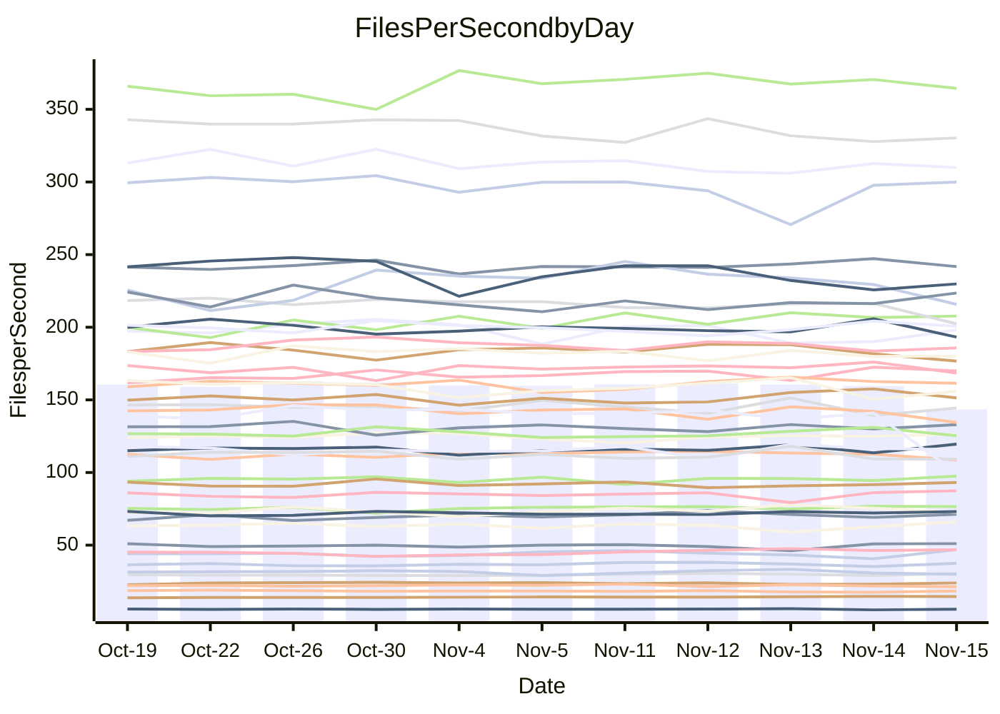

<!---
# This file is auto-generated. Do not edit.
# cspell:disable
--->
# Performance Report

## Daily Performance

## Time to Process Files

| Repository                                      | Elapsed | Min/Avg/Max           |   SD | SD Graph                |
| ----------------------------------------------- | ------: | :-------------------: | ---: | ----------------------- |
| AdaDoom3/AdaDoom3                    |    3.38 | 3.3 /   3.5 /   3.7   | 0.09 | `    ┣━━●━━╋━━┻━━┫    ` |
| alexiosc/megistos                    |    8.02 | 7.3 /   7.9 /   8.7   | 0.36 | `    ┣━━┻━━╋●━┻━━┫    ` |
| apollographql/apollo-server          |    2.72 | 2.6 /   2.8 /   3.2   | 0.13 | `    ┣━━┻━●╋━━┻━━┫    ` |
| aspnetboilerplate/aspnetboilerplate  |   11.30 | 10.3 /  10.6 /  11.8  | 0.32 | `    ┣━━┻━━╋━━┻━━┫●   ` |
| aws-amplify/docs                     |   12.84 | 12.4 /  13.2 /  14.8  | 0.55 | `    ┣━━┻●━╋━━┻━━┫    ` |
| Azure/azure-rest-api-specs           |   10.29 | 9.6 /  10.0 /  11.0   | 0.36 | `    ┣━━┻━━╋━●┻━━┫    ` |
| bitjson/typescript-starter           |    1.09 | 1.0 /   1.1 /   1.1   | 0.03 | `     ┣━┻━━●━━┻━┫     ` |
| caddyserver/caddy                    |    3.76 | 3.6 /   3.8 /   4.0   | 0.09 | `    ┣━━┻━●╋━━┻━━┫    ` |
| canada-ca/open-source-logiciel-libre |    1.18 | 1.1 /   1.2 /   1.3   | 0.05 | `     ┣━┻━━●━━┻━┫     ` |
| chef/chef                            |    6.16 | 5.7 /   6.0 /   6.3   | 0.16 | `    ┣━━┻━━╋━━┻●━┫    ` |
| dart-lang/sdk                        |   68.91 | 63.7 /  67.4 /  72.3  | 2.21 | `  ┣━━━┻━━━╋━━●┻━━━┫  ` |
| django/django                        |   16.02 | 14.9 /  15.8 /  17.2  | 0.51 | `    ┣━━┻━━╋●━┻━━┫    ` |
| eslint/eslint                        |   11.30 | 10.7 /  11.2 /  11.8  | 0.36 | `    ┣━━┻━━╋●━┻━━┫    ` |
| exonum/exonum                        |    3.63 | 3.5 /   3.7 /   4.0   | 0.12 | `    ┣━━┻━●╋━━┻━━┫    ` |
| flutter/samples                      |   17.86 | 16.0 /  16.8 /  19.0  | 0.59 | `   ┣━━━┻━━╋━━┻━━●┫   ` |
| gitbucket/gitbucket                  |    3.80 | 3.5 /   3.7 /   3.9   | 0.10 | `    ┣━━┻━━╋━━┻●━┫    ` |
| googleapis/google-cloud-cpp          |  209.69 | 139.9 / 148.0 / 158.3 | 4.53 | `        ┣┻╋┻┫       ●` |
| graphql/express-graphql              |    1.22 | 1.1 /   1.2 /   1.3   | 0.04 | `     ┣━┻━━╋━━●━┫     ` |
| graphql/graphql-js                   |    2.91 | 2.8 /   3.0 /   3.2   | 0.10 | `    ┣━━┻━●╋━━┻━━┫    ` |
| graphql/graphql-relay-js             |    1.17 | 1.1 /   1.2 /   1.2   | 0.04 | `     ┣━┻━●╋━━┻━┫     ` |
| graphql/graphql-spec                 |    1.30 | 1.3 /   1.3 /   1.4   | 0.04 | `     ┣━●━━╋━━┻━┫     ` |
| iluwatar/java-design-patterns        |   13.16 | 12.6 /  13.3 /  14.4  | 0.38 | `    ┣━━┻━●╋━━┻━━┫    ` |
| ktaranov/sqlserver-kit               |    6.69 | 6.6 /   6.8 /   7.1   | 0.17 | `    ┣━━●━━╋━━┻━━┫    ` |
| liriliri/licia                       |    4.35 | 4.1 /   4.3 /   4.6   | 0.12 | `    ┣━━┻━━╋━●┻━━┫    ` |
| MartinThoma/LaTeX-examples           |    7.02 | 6.8 /   7.1 /   7.9   | 0.25 | `    ┣━━┻━●╋━━┻━━┫    ` |
| mdx-js/mdx                           |    1.98 | 1.9 /   2.0 /   2.2   | 0.08 | `     ┣━┻━●╋━━┻━┫     ` |
| microsoft/TypeScript-Website         |    5.72 | 5.5 /   5.8 /   6.5   | 0.19 | `    ┣━━┻━●╋━━┻━━┫    ` |
| MicrosoftDocs/PowerShell-Docs        |   24.78 | 22.9 /  24.2 /  26.2  | 0.77 | `   ┣━━━┻━━╋━●┻━━━┫   ` |
| neovim/nvim-lspconfig                |    4.51 | 4.3 /   4.4 /   4.6   | 0.08 | `    ┣━━┻━━╋━━●━━┫    ` |
| pagekit/pagekit                      |    3.57 | 3.5 /   3.7 /   4.0   | 0.14 | `    ┣━━┻●━╋━━┻━━┫    ` |
| php/php-src                          |   25.87 | 25.9 /  26.9 /  28.6  | 0.81 | `   ┣━━●┻━━╋━━┻━━━┫   ` |
| plasticrake/tplink-smarthome-api     |    1.33 | 1.3 /   1.4 /   1.5   | 0.05 | `     ┣━●━━╋━━┻━┫     ` |
| prettier/prettier                    |    7.81 | 7.2 /   7.7 /   8.3   | 0.23 | `    ┣━━┻━━╋━●┻━━┫    ` |
| pycontribs/jira                      |    1.55 | 1.5 /   1.6 /   1.7   | 0.06 | `     ┣━┻●━╋━━┻━┫     ` |
| RustPython/RustPython                |    5.53 | 5.2 /   5.5 /   6.0   | 0.23 | `    ┣━━┻━━╋●━┻━━┫    ` |
| shoelace-style/shoelace              |    3.04 | 2.9 /   3.0 /   3.2   | 0.09 | `    ┣━━┻━━╋●━┻━━┫    ` |
| slint-ui/slint                       |   14.52 | 13.3 /  13.8 /  14.4  | 0.35 | `    ┣━━┻━━╋━━┻━━●    ` |
| SoftwareBrothers/admin-bro           |    2.59 | 2.5 /   2.6 /   2.9   | 0.07 | `     ┣━┻●━╋━━┻━┫     ` |
| sveltejs/svelte                      |   22.10 | 20.8 /  21.8 /  22.9  | 0.44 | `   ┣━━━┻━━╋━●┻━━━┫   ` |
| TheAlgorithms/Python                 |    5.79 | 5.7 /   5.8 /   6.1   | 0.11 | `    ┣━━┻━━●━━┻━━┫    ` |
| twbs/bootstrap                       |    1.79 | 1.8 /   1.9 /   2.0   | 0.06 | `     ┣━●━━╋━━┻━┫     ` |
| typescript-cheatsheets/react         |    1.41 | 1.3 /   1.4 /   1.6   | 0.06 | `     ┣━┻━●╋━━┻━┫     ` |
| typescript-eslint/typescript-eslint  |    4.28 | 4.2 /   4.3 /   4.7   | 0.12 | `    ┣━━┻━●╋━━┻━━┫    ` |
| vitest-dev/vitest                    |   10.84 | 9.2 /   9.9 /  10.9   | 0.46 | `    ┣━━┻━━╋━━┻━━●    ` |
| w3c/aria-practices                   |    3.46 | 3.4 /   3.6 /   3.8   | 0.09 | `    ┣━●┻━━╋━━┻━━┫    ` |
| w3c/specberus                        |    2.02 | 2.0 /   2.1 /   2.2   | 0.05 | `     ┣━●━━╋━━┻━┫     ` |
| webdeveric/webpack-assets-manifest   |    1.17 | 1.2 /   1.2 /   1.4   | 0.04 | `     ┣●┻━━╋━━┻━┫     ` |
| webpack/webpack                      |    5.76 | 5.5 /   5.8 /   6.7   | 0.25 | `    ┣━━┻━━●━━┻━━┫    ` |
| wireapp/wire-desktop                 |    1.53 | 1.4 /   1.5 /   1.7   | 0.08 | `     ┣━┻━━╋━●┻━┫     ` |
| wireapp/wire-webapp                  |   11.04 | 10.6 /  11.2 /  12.3  | 0.48 | `    ┣━━┻━●╋━━┻━━┫    ` |

Note:
- Elapsed time is in seconds.

## Files per Second over Time

| Repository                                      | Files |    Sec |    Fps |     Rel | Trend Fps              |    N |
| ----------------------------------------------- | ----: | -----: | -----: | ------: | ---------------------- | ---: |
| AdaDoom3/AdaDoom3                    |   103 |   3.38 |  30.48 |   3.03% | `▅▇▆▆▆▅▆▆▄▆▇██▄█▇█▇▆▇` |   23 |
| alexiosc/megistos                    |   583 |   8.02 |  72.66 |  -1.42% | `▅█▆▅▅▃▅▄▄▇▇▆▇▆▆▆▄▇▆▅` |   23 |
| apollographql/apollo-server          |   253 |   2.72 |  93.14 |   1.49% | `▆▆▇▆█▇▆█▇▅▇██▆██▃▆▇▇` |   23 |
| aspnetboilerplate/aspnetboilerplate  |  2286 |  11.30 | 202.37 |  -6.53% | `▇▆▇██▇█▇▇█▆▆▇▆▄██▇▇▅` |   23 |
| aws-amplify/docs                     |  2871 |  12.84 | 223.58 |   2.74% | `▅███▇▇▅▇▆▆▃█▇▅▆▅▆▆▆▇` |   23 |
| Azure/azure-rest-api-specs           |  2365 |  10.29 | 229.84 |  -3.86% | `█▇█▇▇▃▅▅▆▇▅▆▇▇▇▆▇▅▅▅` |   23 |
| bitjson/typescript-starter           |    20 |   1.09 |  18.39 |  -0.41% | `██▇▆▆▆▇▅█▇▅▅▆█▇▇▇▅▄▆` |   23 |
| caddyserver/caddy                    |   288 |   3.76 |  76.50 |   1.09% | `▆▆▆▇▄▅▇▆▆█▇▇▇▆▇▅█▆▇▇` |   23 |
| canada-ca/open-source-logiciel-libre |     7 |   1.18 |   5.93 |  -0.32% | `▆▇▇▆▅▇▇▇▄▆▇▆▄█▇█▆█▄▆` |   23 |
| chef/chef                            |  1191 |   6.16 | 193.21 |  -3.38% | `▇▆█▆▆▇▅▄█▇▇▆▇▆▄▆▇▆█▅` |   23 |
| dart-lang/sdk                        | 10747 |  68.91 | 155.96 |  -2.00% | `▆█▇▅▆▅▄▅▇▆▅▆▆▅▇▆▇█▄▅` |   23 |
| django/django                        |  2885 |  16.02 | 180.06 |  -1.12% | `▅▇▇█▇▇▇▇▅▇▇▆▇▇▆▇▄▇▆▆` |   23 |
| eslint/eslint                        |  2099 |  11.30 | 185.76 |  -0.82% | `▄▇▇▇▇▅█▆▇▄▇▅▇▄▆█▆▆▅▆` |   23 |
| exonum/exonum                        |   421 |   3.63 | 115.85 |   0.72% | `█▆▆▅▇▆▇▅▇█▇██▇▇▅▄█▇▇` |   23 |
| flutter/samples                      |  2400 |  17.86 | 134.40 |  -5.80% | `▆█▇█▇▇▆█▆▇▆▇▇▆▇▃▆▇▇▅` |   23 |
| gitbucket/gitbucket                  |   413 |   3.80 | 108.61 |  -3.73% | `▅▇▆▆▆▅█▆█▄▇▆█▆█▆▇▇▆▅` |   23 |
| googleapis/google-cloud-cpp          | 20952 | 209.69 |  99.92 | -29.27% | `▄▇██▇█▆▆▅█▅▅▆▇▆▇▇▅▆ ` |   23 |
| graphql/express-graphql              |    26 |   1.22 |  21.39 |  -3.80% | `▄▄▅▅▅▅▆▅▅▅▅▅█▆▃▄▅▆▅▄` |   23 |
| graphql/graphql-js                   |   368 |   2.91 | 126.38 |   1.89% | `█▆█▆█▇█▇▇▅▆▆▄▇██▄▇▇▇` |   23 |
| graphql/graphql-relay-js             |    28 |   1.17 |  24.03 |   1.10% | `▅▆▆▇▇▇▅▅▆█▆▆▅▅▆▇▆▅▅▆` |   23 |
| graphql/graphql-spec                 |    19 |   1.30 |  14.66 |   3.52% | `▇▄█▆▆▇▆▇▆▇█▇▆▇█▅▆▇██` |   23 |
| iluwatar/java-design-patterns        |  1992 |  13.16 | 151.38 |   0.70% | `▇█▆▅▇▄▇▆▇▇▇▅▆▆▅▆▇██▇` |   23 |
| ktaranov/sqlserver-kit               |   489 |   6.69 |  73.10 |   2.09% | `▆▆▅▇▇▇▇▆▇▅▇▇▅▆█▆▅▇▇▇` |   23 |
| liriliri/licia                       |  1437 |   4.35 | 330.34 |  -2.01% | `▇█▇███▇█▆▆▆▄█▆▇██▆▆▆` |   23 |
| MartinThoma/LaTeX-examples           |  1409 |   7.02 | 200.71 |   0.95% | `▆▅█▆█▇▇▆▇██▇▆▆█▆▃▇█▇` |   23 |
| mdx-js/mdx                           |   141 |   1.98 |  71.21 |   1.92% | `▆▃▆▅▆▆▇▆▇▅▅▇▇▆███▇▆▇` |   23 |
| microsoft/TypeScript-Website         |   761 |   5.72 | 132.93 |   1.25% | `▇▇██▅▆▇█▇▆▆▆▆▇▇▃▇▇▆▇` |   23 |
| MicrosoftDocs/PowerShell-Docs        |  2708 |  24.78 | 109.27 |  -2.34% | `▇█▅▇▇▅▆▇▇▅▆▅▅▆█▆▄█▅▅` |   23 |
| neovim/nvim-lspconfig                |   759 |   4.51 | 168.44 |  -2.09% | `▇▇▇▇▅▇█▇▇▆▇▇▇█▇▇█▇█▆` |   23 |
| pagekit/pagekit                      |   741 |   3.57 | 207.72 |   2.46% | `▄▇▇▆▆█▇▅▇▅▇█▇█▇▇▅█▇▇` |   23 |
| php/php-src                          |  2262 |  25.87 |  87.42 |   3.31% | `▅▇▅▅▇▇▆▇█▅▆▇▆▇█▇▇▄▇█` |   23 |
| plasticrake/tplink-smarthome-api     |    62 |   1.33 |  46.78 |   4.39% | `▇▅▄▇▄▄▅▅▄▅▆▆█▆▇▇▇█▇▇` |   23 |
| prettier/prettier                    |  2421 |   7.81 | 309.93 |  -0.95% | `▇▅▆██▆▇▇▇▆▇▆▇▇▇▄▆▆▇▆` |   23 |
| pycontribs/jira                      |    79 |   1.55 |  51.06 |   2.83% | `▅▄▆█▆▆▅▄█▆▇▇█▆▅▅▇▄▇▇` |   23 |
| RustPython/RustPython                |   693 |   5.53 | 125.35 |  -0.65% | `█▅▄██▇▆▇▃▆▆▇▇▄▅▆▇▇█▆` |   23 |
| shoelace-style/shoelace              |   439 |   3.04 | 144.37 |  -0.72% | `▆▆▅▆▆▇▄▇█▆▆▇▆▆▄▅▅█▄▆` |   23 |
| slint-ui/slint                       |  2565 |  14.52 | 176.67 |  -4.48% | `▇▅▇█▅▆▇█▆▅█▆▅▇█▇▇▇▆▅` |   23 |
| SoftwareBrothers/admin-bro           |   441 |   2.59 | 170.00 |   2.03% | `▆▇▆▆▇▇▆▇▇▆▇█▆▇█▇▇▆█▇` |   23 |
| sveltejs/svelte                      |  8053 |  22.10 | 364.46 |  -0.75% | `▅▅▅▆▄█▆▆▆▆▇▆▆█▇▇▇▆▇▆` |   23 |
| TheAlgorithms/Python                 |  1399 |   5.79 | 241.76 |   0.07% | `▆█▇▇█▆▇▆▇█▇▇▆█▅██▇█▇` |   23 |
| twbs/bootstrap                       |   118 |   1.79 |  66.07 |   4.21% | `▆▇█▇▆█▆▆▆▄▆██▆▇▇▆▄▆█` |   23 |
| typescript-cheatsheets/react         |    53 |   1.41 |  37.46 |   1.61% | `▆▆▃▅▅▄▇▇▅▆▄▇▆▇▆▇█▆▄▆` |   23 |
| typescript-eslint/typescript-eslint  |  1285 |   4.28 | 299.93 |   0.78% | `▇██▆█▇▆▇▇▇▇▇█▇▆▆█▄▇▇` |   23 |
| vitest-dev/vitest                    |  2339 |  10.84 | 215.74 |  -6.53% | `▃▃▄▅▇▇▅▅▇▆▆█▇█▆▆▇▆▆▄` |   23 |
| w3c/aria-practices                   |   414 |   3.46 | 119.58 |   3.54% | `▆▇▆▇▇▆▄▇▅▅▇▇█▅▇▇▅█▆█` |   23 |
| w3c/specberus                        |   197 |   2.02 |  97.54 |   2.70% | `▇▇▆███▄▇███▅▇▅▇▇█▇▇█` |   23 |
| webdeveric/webpack-assets-manifest   |    55 |   1.17 |  46.95 |   5.94% | `▅▇▅▅▄▅▄▇▆▇▇▇▆█▅▆▇▅▃█` |   23 |
| webpack/webpack                      |  1141 |   5.76 | 198.14 |   0.47% | `▆█▇▇█▇▇▇▆▃▆▆█▇▇█▇▆▆▇` |   23 |
| wireapp/wire-desktop                 |    46 |   1.53 |  29.98 |  -4.14% | `▇▆█▇▇▇▆▅▄▃█▆▆▆▇█▇█▆▅` |   23 |
| wireapp/wire-webapp                  |  1783 |  11.04 | 161.43 |   0.85% | `█▇█▆▇▇█▄▇▇▃▇▄▇█▅██▇▇` |   23 |

## Data Throughput

| Repository                                      | Files |    Sec |     Kps |     Rel | Trend Kps              |    N |
| ----------------------------------------------- | ----: | -----: | ------: | ------: | ---------------------- | ---: |
| AdaDoom3/AdaDoom3                    |   103 |   3.38 |  647.75 |   3.03% | `▅▇▆▆▆▅▆▆▄▆▇██▄█▇█▇▆▇` |   23 |
| alexiosc/megistos                    |   583 |   8.02 |  570.96 |  -1.42% | `▅█▆▅▅▃▅▄▄▇▇▆▇▆▆▆▄▇▆▅` |   23 |
| apollographql/apollo-server          |   253 |   2.72 |  760.94 |   2.04% | `▅▆▆▆█▇▆█▇▅▇██▆██▃▆▇▇` |   23 |
| aspnetboilerplate/aspnetboilerplate  |  2286 |  11.30 |  492.37 |  -6.53% | `▇▆▇██▇█▇▇█▆▆▇▆▄██▇▇▅` |   23 |
| aws-amplify/docs                     |  2871 |  12.84 |  780.55 |   2.75% | `▅███▇▇▅▇▆▆▃█▇▅▆▅▆▆▆▇` |   23 |
| Azure/azure-rest-api-specs           |  2365 |  10.29 |  624.41 |  -3.29% | `█▇█▇▇▃▅▅▆▇▅▇▇▇▇▆█▆▅▅` |   23 |
| bitjson/typescript-starter           |    20 |   1.09 |   73.55 |  -0.41% | `██▇▆▆▆▇▅█▇▅▅▆█▇▇▇▅▄▆` |   23 |
| caddyserver/caddy                    |   288 |   3.76 |  663.54 |   1.27% | `▆▆▆▇▄▅▇▆▆█▇▇▇▆▇▅█▆▇▇` |   23 |
| canada-ca/open-source-logiciel-libre |     7 |   1.18 |   49.13 |  -0.32% | `▆▇▇▆▅▇▇▇▄▆▇▆▄█▇█▆█▄▆` |   23 |
| chef/chef                            |  1191 |   6.16 |  895.46 |  -3.30% | `▇▆█▆▆▇▅▄█▇▇▆▇▆▄▆▇▆█▅` |   23 |
| dart-lang/sdk                        | 10747 |  68.91 | 1064.29 |  -1.91% | `▆█▇▅▆▅▄▅▇▆▅▆▆▆▇▇▇█▄▆` |   23 |
| django/django                        |  2885 |  16.02 | 1130.05 |  -1.20% | `▅▇▇█▇▇▇▇▅▇▇▆▇▇▆▆▄▇▆▆` |   23 |
| eslint/eslint                        |  2099 |  11.30 | 1332.57 |  -0.98% | `▄▇▇▇▇▅█▆▇▄▇▅▇▄▅█▆▆▅▆` |   23 |
| exonum/exonum                        |   421 |   3.63 | 1108.19 |   0.72% | `█▆▆▅▇▆▇▅▇█▇██▇▇▅▄█▇▇` |   23 |
| flutter/samples                      |  2400 |  17.86 | 1199.35 |  -5.80% | `▆█▇█▇▇▆█▆▇▆▇▇▆▇▃▆▇▇▅` |   23 |
| gitbucket/gitbucket                  |   413 |   3.80 |  493.61 |  -3.74% | `▅▇▆▆▆▅█▆█▄▇▆█▆█▆▇▇▆▅` |   23 |
| googleapis/google-cloud-cpp          | 20952 | 209.69 |  813.85 | -29.11% | `▄▇██▇█▆▆▅█▅▅▆▇▆▇▇▅▆ ` |   23 |
| graphql/express-graphql              |    26 |   1.22 |   97.92 |  -3.80% | `▄▄▅▅▅▅▆▅▅▅▅▅█▆▃▄▅▆▅▄` |   23 |
| graphql/graphql-js                   |   368 |   2.91 |  733.57 |   2.13% | `█▆█▅▇▇█▇▇▅▆▆▄▇██▄▇▇▇` |   23 |
| graphql/graphql-relay-js             |    28 |   1.17 |   94.39 |   1.10% | `▅▆▆▇▇▇▅▅▆█▆▆▅▅▆▇▆▅▅▆` |   23 |
| graphql/graphql-spec                 |    19 |   1.30 |  489.33 |   3.52% | `▇▄█▆▆▇▆▇▆▇█▇▆▇█▅▆▇██` |   23 |
| iluwatar/java-design-patterns        |  1992 |  13.16 |  467.89 |   0.70% | `▇█▆▅▇▄▇▆▇▇▇▅▆▆▅▆▇██▇` |   23 |
| ktaranov/sqlserver-kit               |   489 |   6.69 | 1107.01 |   2.10% | `▆▆▅▇▇▇▇▆▇▅▇▇▅▆█▆▅▇▇▇` |   23 |
| liriliri/licia                       |  1437 |   4.35 |  393.56 |  -2.01% | `▇█▇███▇█▆▆▆▄█▆▇██▆▆▆` |   23 |
| MartinThoma/LaTeX-examples           |  1409 |   7.02 |  414.53 |   0.95% | `▆▅█▆█▇▇▆▇██▇▆▆█▆▃▇█▇` |   23 |
| mdx-js/mdx                           |   141 |   1.98 |  331.29 |   1.92% | `▆▃▆▅▆▆▇▆▇▅▅▇▇▆███▇▆▇` |   23 |
| microsoft/TypeScript-Website         |   761 |   5.72 |  919.50 |   1.26% | `▇▇██▅▆▇█▇▆▆▆▆▇▇▃▇▇▆▇` |   23 |
| MicrosoftDocs/PowerShell-Docs        |  2708 |  24.78 | 1125.15 |  -2.31% | `▇█▅▇▇▅▆▇▇▅▆▅▅▆█▆▄█▅▅` |   23 |
| neovim/nvim-lspconfig                |   759 |   4.51 |  281.84 |  -2.00% | `▇▇▇▇▅▇█▇▇▆▇▇▇█▇▇█▇█▆` |   23 |
| pagekit/pagekit                      |   741 |   3.57 |  433.11 |   2.46% | `▄▇▇▆▆█▇▅▇▅▇█▇█▇▇▅█▇▇` |   23 |
| php/php-src                          |  2262 |  25.87 | 1529.79 |   3.34% | `▅▇▅▅▇▇▆▇█▅▆▇▆▇█▇▇▄▇█` |   23 |
| plasticrake/tplink-smarthome-api     |    62 |   1.33 |  252.75 |   4.39% | `▇▅▄▇▄▄▅▅▄▅▆▆█▆▇▇▇█▇▇` |   23 |
| prettier/prettier                    |  2421 |   7.81 |  430.40 |  -1.26% | `█▅▆██▅▆▆▇▆▇▆▇▇▇▄▆▆▆▆` |   23 |
| pycontribs/jira                      |    79 |   1.55 |  361.91 |   2.83% | `▅▄▆█▆▆▅▄█▆▇▇█▆▅▅▇▄▇▇` |   23 |
| RustPython/RustPython                |   693 |   5.53 | 1042.95 |   1.26% | `▇▅▃▇▇█▇█▄▇▇█▇▄▆▇▇▇█▇` |   23 |
| shoelace-style/shoelace              |   439 |   3.04 |  697.50 |  -0.72% | `▆▆▅▆▆▇▄▇█▆▆▇▆▆▄▅▅█▄▆` |   23 |
| slint-ui/slint                       |  2565 |  14.52 | 1089.73 |  -4.33% | `▇▅▇█▅▆▇█▆▅█▆▆▇█▇▇▇▆▅` |   23 |
| SoftwareBrothers/admin-bro           |   441 |   2.59 |  374.69 |   2.03% | `▆▇▆▆▇▇▆▇▇▆▇█▆▇█▇▇▆█▇` |   23 |
| sveltejs/svelte                      |  8053 |  22.10 |  243.12 |  -0.79% | `▅▅▅▆▄█▆▆▆▆▇▆▆▇▇▇▇▆▆▆` |   23 |
| TheAlgorithms/Python                 |  1399 |   5.79 |  614.87 |   0.07% | `▆█▇▇█▆▇▆▇█▇▇▆█▅██▇█▇` |   23 |
| twbs/bootstrap                       |   118 |   1.79 |  542.57 |   4.28% | `▆▇█▇▆█▆▆▆▄▆██▆▇▇▆▄▆█` |   23 |
| typescript-cheatsheets/react         |    53 |   1.41 |  277.08 |   1.61% | `▆▆▃▅▅▄▇▇▅▆▄▇▆▇▆▇█▆▄▆` |   23 |
| typescript-eslint/typescript-eslint  |  1285 |   4.28 | 1546.08 |   0.92% | `▇▇█▆█▇▅▇▇▇▇▇█▇▆▆█▄▇▇` |   23 |
| vitest-dev/vitest                    |  2339 |  10.84 |  463.40 |  -8.87% | `▃▃▅▆██▅▆█▆▆▇▆█▆▅▇▆▅▃` |   23 |
| w3c/aria-practices                   |   414 |   3.46 | 1114.93 |   3.54% | `▆▇▆▇▇▆▄▇▅▅▇▇█▅▇▇▅█▆█` |   23 |
| w3c/specberus                        |   197 |   2.02 |  308.46 |   2.70% | `▇▇▆███▄▇███▅▇▅▇▇█▇▇█` |   23 |
| webdeveric/webpack-assets-manifest   |    55 |   1.17 |  108.41 |   5.94% | `▅▇▅▅▄▅▄▇▆▇▇▇▆█▅▆▇▅▃█` |   23 |
| webpack/webpack                      |  1141 |   5.76 |  903.54 |   0.67% | `▆█▇▇█▇▇▇▆▃▅▆█▇▇█▇▆▆▇` |   23 |
| wireapp/wire-desktop                 |    46 |   1.53 |  167.52 |  -4.14% | `▇▆█▇▇▇▆▅▄▃█▆▆▆▇█▇█▆▅` |   23 |
| wireapp/wire-webapp                  |  1783 |  11.04 |  597.03 |   0.99% | `█▇█▆▇▇█▄▇▇▃▇▄▇█▅██▇▇` |   23 |

